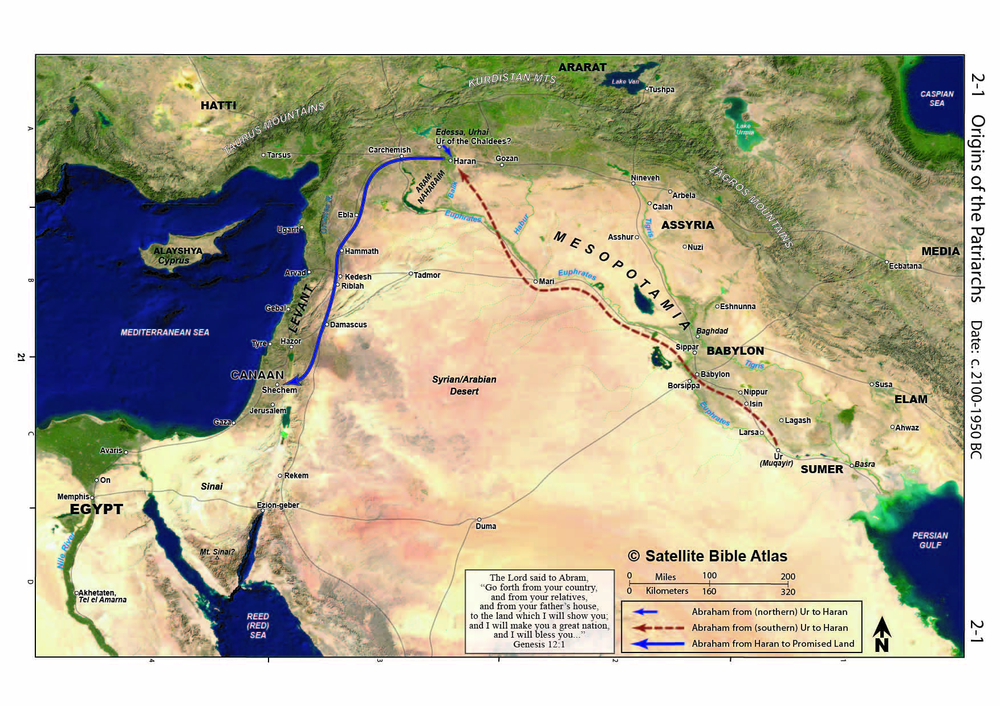
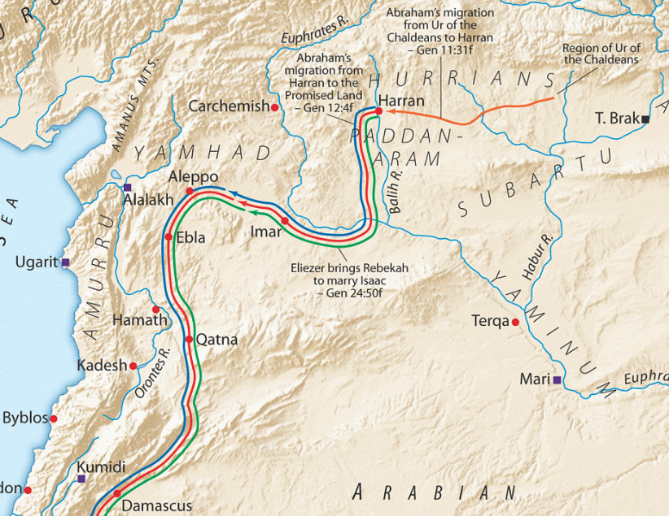
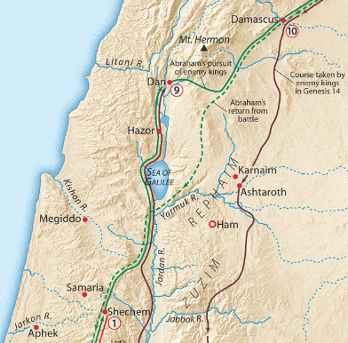



 



## Sons of Abraham

-   The rest of the Bible will be focused on Abraham and his descendants.

-   The Jewish people are Abraham’s legal descendants while the disciples of Jesus are Abraham’s spiritual descendants by faith.

-   Paul, in various places, confirms that, through Jesus, gentile disciples can rightly refer to him as “Abraham, our father.”

-   Just as it is true that not all biological descendants of Abraham (such as Ishmaelites and Edomites) can claim the promises, not all Gentiles and even not all gentiles who profess a belief in Jesus can make this claim.

-   Lancaster: “The critical paternity test is this question: ‘Are you walking in the footsteps of Abraham’s faith?”

-   “(The *Ioudaioi)* answered him, “Abraham is our father.” Jesus said to them, “If you were Abraham's children, you would be doing the works Abraham did” (John 8:39).

-   This statement is true of Christians who claim spiritual inheritance as much as it is of Jews who claim physical inheritance.

-   But what were the works of Abraham?

    -   The sages list 10 specific trials of Abraham; some he passed and some he failed.

    -   The Ten Tests of Abraham

        -   The call from his homeland

        -   The famine in Canaan

        -   The abduction of Sarah in Egypt

        -   The war with the four kings

        -   The wait for a son and his marriage to Hagar

        -   Circumcision

        -   The abduction of Sarah by Abimelech

        -   The Exile of Hagar

        -   The Exile of Ishmael

        -   The Sacrifice of Isaac

    -   In general, Abraham stood against idolatry and was willing to sacrifice his life for his convictions.

    -   Believers are to emulate Abraham where he succeeded and learn from Abraham where he failed.

-   So let us study Abraham with a view toward strengthening our personal discipleship.

## Geography

As Dr. Schlegel notes, our faith is founded on events that took place in time and space (history and geography).

### From Ur of the Chaldees

This map from the Satellite Bible Atlas[^1] shows the suggested route from Ur (southern location) to Haran, then from Haran to Canaan.

This map from the Moody Bible Atlas[^2] shows the suggested route of Abram from Haran to Damascus: (blue line). Eliezer and Jacob would have followed the same roads.

### To Shechem

This Moody Bible Atlas map[^3] shows the suggested route (solid green line) through Damascus. Abram possibly acquired the servant Eleazar at this time. Eleazar will be a pivotal supporting character in the story of Abram. As Abram’s eldest servant, he stood to inherit Abram’s estate if Abram had no natural offspring. Eleazar means God’s Helper and in many ways, we will see he is a biblical type of the Holy Spirit, especially in Genesis 24.

This Satellite Bible Atlas map[^4] shows the journey to Shechem, through the center of the country to the Negev, and then eventually to Egypt.

1.  **To Shechem, then Bethel (Luz) and Ai, then Negev**

    1.  **We don’t know exactly how he got to Shechem, but the Wadi Far’a is a good inland road from the Jordan valley.**

    2.  **God visits Abram and promises inheritance to Abram’s seed and Abram builds an altar**

    3.  **He next moves to an area between Bethel and Ai.**

    4.  **Ai is familiar to those who have studied Joshua as the place where the Israelites were defeated because there was “sin in the camp” – the lesson is that we are all in a community – when one member sins, we all sin and suffer the consequences. We usually think of our faith as individualistic. My business is between God and me; the Bible teaches both individual and corporate/community accountability.**

    5.  **He then moved further south to the Negev past Hebron**

2.  **To Egypt**

    1.  **Abram has gained great wealth but appears to show a lack of faith (we note that it is commonly taught he shows a lack of faith but the text doesn’t say this so we need to be careful with our assumptions).**

    2.  **Egypt is generally viewed as a type of the world with its enticements and trappings.**

    3.  **He places his wife in harm’s way while he accumulates more possessions**

    4.  **Later we will learn that Abram picked up a concubine named Hagar who would ensnare him with Ishmael as a false substitute for God’s promises**

    5.  **We can’t fault Abram for this – he is a picture of us when we try to help God along. This is something the enemy tempts us with every day.**

    6.  **God’s promises are unconditional and will be fulfilled despite Abram’s failure.**

## Genesis 12:1-5 – God calls Abram to Canaan

1 Now the LORD said to Abram, “Go from your country and your kindred and your father's house to the land that I will show you.

2 And I will make of you a great nation, and I will bless you and make your name great so that you will be a blessing.

3 I will bless those who bless you, and him who dishonors you I will curse, and in you, all the families of the earth shall be blessed.”

-   This is a spectacular blessing of which you and I are the beneficiaries.

    -   Note there are seven distinct promises.

    -   Paul says the promises to Abraham are also given to Messiah.

    -   “Now the promises were made to Abraham and to his offspring. It does not say, “And to offsprings,” referring to many, but referring to one, “And to your offspring,” who is Christ” (Gal 3:16).

        1.  A great nation – Galatians 3:29 And if you are Christ's, then you are Abraham's offspring, heirs according to promise.

        2.  Blessings Bestowed - Ephesians 1:3 Blessed be the God and Father of our Lord Jesus Christ, who has blessed us in Christ with every spiritual blessing in the heavenly places,

        3.  A Great Name - Philippians 2:9-10 Therefore God has highly exalted him and bestowed on him the name that is above every name, so that at the name of Jesus every knee should bow, in heaven and on earth and under the earth

        4.  Blessings to others - Galatians 3:14 so that in Christ Jesus the blessing of Abraham might come to the Gentiles so that we might receive the promised Spirit through faith.

        5.  Blessings returned - Matthew 25:34 Then the King will say to those on his right, ‘Come, you who are blessed by my Father, inherit the kingdom prepared for you from the foundation of the world. (those things done for the least of these are done unto Him).

        6.  Curses returned - Matthew 25:41 “Then he will say to those on his left, ‘Depart from me, you cursed, into the eternal fire prepared for the devil and his angels.’ (those things not done to the least of these were not done unto Him.).

        7.  All the families of the earth –

            -   Acts 3:25 You are the sons of the prophets and of the covenant that God made with your fathers, saying to Abraham, ‘And in your offspring shall all the families of the earth be blessed.’

            -   Galatians 3:8 And the Scripture, foreseeing that God would justify the Gentiles by faith, preached the gospel beforehand to Abraham, saying, “In you shall all the nations be blessed.”

-   By leaving his father’s house, Abram would be forfeiting his earthly inheritance.

    -   Remember this as, for the next couple of decades, Abram is childless.

    -   In the back of his mind, he could have been thinking about what he could have had if he’d stayed put, versus the seemingly unfulfilled promise from God.

-   Walton: “When Abram gave up his place in his father’s household, he forfeited his security. He was putting his survival, his identity, his future, and his security in the hands of the LORD.”[^5]

-   God calls us just as he did Abram. Like He does with us, He only asks us to take the next step in obedience (he won’t tell us the whole plan, or we might say no).

-   “By faith Abraham, when he was called, obeyed by going out to a place which he was to receive for an inheritance; and he went out, not knowing where he was going” (Hebrews 11:8).

-   Everyone in the world at that time practiced idolatry. In what I believe is a model of our salvation process, God selected Abram, then he called Abram. Abram did nothing to merit the selection but he did have the free will to reject God’s call.

4 So Abram went, as the LORD had told him, and Lot went with him. Abram was seventy-five years old when he departed from Haran.

-   As we noted last time, Acts 7 tells us the command from God came when Abram was in Ur.

    -   The fact that Abram sojourned in Haran suggests a lack of faith on his part;

    -   Genesis 12:4 thus can be interpreted that God had to remind Abraham a second time of the promise.

    -   We can be thankful that God doesn’t give up on us when we stumble.

5 And Abram took Sarai his wife, and Lot his brother's son, and all their possessions that they had gathered, and the people that they had acquired in Haran, and they set out to go to the land of Canaan.

-   Jewish tradition holds that Abraham is the first Hebrew because he is the first to come across (heb. עבר, *ever)* the Euphrates River. This is in addition to having a relative by the name of Eber

-   Acts 7:4-5 Then he went out from the land of the Chaldeans and lived in Haran. And after his father died, God removed him from there into this land in which you are now living. Yet he gave him no inheritance in it, not even a foot's length, but promised to give it to him as a possession and to his offspring after him, though he had no child.

-   There are two contrasting ways to view the phrase “people that they had acquired.”

    -   We can literally translate as “souls they had made.”

    -   From this, the sages depict Abraham as a missionary for monotheism, converting people from idolatry to the knowledge of the one true God.

    -   This view is intriguing since for most of its history, Judaism has never been a proselytizing religion.

-   Another way to look at it is that Abraham accumulated things and people of the world that serve to corrupt him

    -   As we study Abram, we need to note the times when he is where he is supposed to be and those times when he is not where he is supposed to be.

    -   Whenever he is not where he is supposed to be, Abram acquires people from that place he’s not supposed to be.

    -   In Haran it was Lot and others.

    -   In Egypt, we will see Abram acquires a handmaid by the name of Hagar.

    -   Both Lot and Hagar will be sources of grief for Abram down the road.

-   IHD: Both interpretations, even though they are opposite viewpoints, demonstrate the biblical theme of sowing and reaping.

    -   Galatians 6:7-8 Do not be deceived: God is not mocked, for whatever one sows, that will he also reap. For the one who sows to his own flesh will from the flesh reap corruption, but the one who sows to the Spirit will from the Spirit reap eternal life.

    -   If we plant seeds in a place we’re not supposed to be, we shouldn’t be surprised at the consequences – we’ll touch on this again when we get to the story of Abraham and Hagar. Abraham acted in the flesh and there are consequences of his action to this day; but we could go back further and say the problem started when he went to Egypt and acquired Hagar in the first place.

    -   Conversely, If we plant healthy seeds in others, eventually there will be a harvest – we may not see much fruit but our job is to plant, not to grow the tree. I can’t make a tree grow, I don’t know about you.

## Genesis 12:6-9– in Canaan, the LORD appears again

6 (When they came to the land of Canaan,) Abram passed through the land to the place at Shechem, to the oak of Moreh. At that time the Canaanites were in the land.

-   The honor of being the first city in Israel named in the Bible goes to Shechem.

    -   Shechem has a mixed history and will ultimately be a source of grief for those who want to follow the One True God. We’ll explore this more a bit later in Genesis.

    -   Shechem lies in a valley surrounded by two mountains (hills): Mt. Gerizim and Mt. Ebal.

    -   It strategically lies at an interchange of the N-S way of the patriarchs and an E-W road, which helped it grow as a center of trade.

    -   When the Israelites were about to go into the promised land, Moses instructed Joshua to station the tribes along the two hills. The blessings from the law were to be read from Mt. Gerizim and the cursings were to be read from Mt. Ebal. See Deuteronomy 28.

    -   Shechem is in the general vicinity of Jacob’s Well, which is the setting for the meeting between Jesus and the Samaritan Woman in John 4.

    -   When the woman says, “we Samaritans worship on this mountain,” she is referring to Mt. Gerizim.

    -   Today, the Palestinian city of Nablus is adjacent to ancient Shechem.

-   Abram is often associated with trees. Later we will see Abram by the Oaks of Mamre, which is further south.

    -   Trees, especially large ones, were often thought to be prime teaching or studying locations.

        1.  Practically, this is because of the shade from the heat that the leaves provided.

        2.  Symbolically, the tree representing knowledge is linked to the tree of knowledge back in Eden.

    -   Trees, which tend to be somewhat phallic-shaped are symbolic of fertility and became adopted as places of worship.

7 Then the LORD appeared to Abram and said, “To your offspring I will give this land.” So he built there an altar to the LORD, who had appeared to him.

8 From there he moved to the hill country on the east of Bethel and pitched his tent, with Bethel on the west and Ai on the east. And there he built an altar to the LORD and called upon the name of the LORD.

-   Abram, an old man, had no seed at this point.

-   Remember, these altars are to a God, who would have been entirely unknown to the Canaanites.

-   Although the text won’t always tell us so, it is a safe assumption that Abram built altars only when the LORD directed him to do so.

-   “Ordinary places became holy to Abraham.” Lancaster

-   The word for tent has a feminine suffix so it literally says, “He pitched her tent.” The Midrash comments that Abraham pitched Sarah’s tent first, then his own, which gives us men the reminder that we take care of her needs before ours. This is something that Abram will fail to do in Egypt.

-   Bethel is being used anachronistically here (technically, the $10 word is proleptic; something done in anticipation). Bethel won’t be called Bethel until Genesis 28:19. At this time of Abram, it would have been called Luz.[^6] Istanbul, not Constantinople.

## 

9 And Abram journeyed on, still going toward the Negeb.

-   This is the Negev region of southern Israel.

-   He would have passed through the cities that would later be known as Jerusalem, Bethlehem, and Hebron.

## Genesis 12:10-13 – Flight to Egypt, deceiving Pharaoh

10 Now there was a famine in the land. So Abram went down to Egypt to sojourn there, for the famine was severe in the land.

-   Lest we miss it, God told Abram to go to a land that GOD will show Abram. In verse 7, God says “THIS is the land.”

-   Here, he departs for Egypt; there is no mention of building an altar and no mention that God told him to go.

-   It’s as if God showed Abram the promise and Abram said “thanks, I’ll take it from here.”

-   This sounds a lot like something the person I look at in the mirror every day would do.

-   “It is difficult to trust God when we think we can come up with a better plan of our own.”[^7]

-   Also if we look at it from Abram’s perspective, the so-called promised land is filled with wicked Canaanites and now there is no water, which led to a severe famine. In his mind, he had to pack up and head elsewhere to survive.

-   In Egypt, the Nile’s constant waters and predictable flood stages made that land impervious to famine.

11 When he was about to enter Egypt, he said to Sarai his wife, “I know that you are a woman beautiful in appearance,

12 and when the Egyptians see you, they will say, ‘This is his wife.’ Then they will kill me, but they will let you live.

13 Say you are my sister, that it may go well with me because of you, and that my life may be spared for your sake.”

-   Abraham was not necessarily a great role model.

-   My life will be spared

    -   Apparently, Abram concluded that, like David did with Uriah, a husband can be eliminated. A brother can be negotiated with.

    -   After they use the same tactic with Abimelech, Genesis 20:13 tells us that Abram and Sarai agreed to use this ruse way back in Mesopotamia.

    -   The model will be repeated a third time with Isaac and Rebecca in Genesis 26.

    -   Ultimately, his life WAS spared, just as the Nation was spared after it fled to Egypt, just as the Messiah was spared after He fled to Egypt.

    -   Plagues came upon Pharaoh who let Sarai go just as plagues would come upon a different Pharaoh, who, reluctantly, would let the nation go.

-   We could take a lot of different angles here.

    -   He wasn’t where he was supposed to be; so now he has to make a second bad decision as a result of his earlier bad decision.

    -   He is supposed to be the protector of his wife, but instead, he places her in harm’s way, while seeking to increase his financial position.

    -   He technically wasn’t fully lying. Genesis 20:12 tells us that Sarai was Abram’s ½ sister, the daughter of Terah.

    -   The Bible is not shy about showing us the failures of its heros

-   Sarah, around 70, was a striking woman.

## Genesis 12:14-16 – Sarai taken by Pharaoh

14 When Abram entered Egypt, the Egyptians saw that the woman was very beautiful.

15 And when the princes of Pharaoh saw her, they praised her to Pharaoh. And the woman was taken into Pharaoh's house.

16 And for her sake he dealt well with Abram; and he had sheep, oxen, male donkeys, male servants, female servants, female donkeys, and camels.

-   Earlier he said the ruse was so that “it may go well with me because of you.”

-   Abram got what he wanted apparently.

## Genesis 12:17-20 Pharaoh smitten with plagues

17 But the LORD afflicted Pharaoh and his house with great plagues because of Sarai, Abram's wife.

18 So Pharaoh called Abram and said, “What is this you have done to me? Why did you not tell me that she was your wife?

19 Why did you say, ‘She is my sister,’ so that I took her for my wife? Now then, here is your wife; take her, and go.”

20 And Pharaoh gave men orders concerning him, and they sent him away with his wife and all that he had.

-   A sudden outbreak of disease like this would have been assumed to be a divine curse.

    -   We can imagine the pharaoh consulting with his magicians and them quickly determining it must have something to do with the new girl.

    -   God takes marriage very seriously even when we don’t.

    -   We can infer that God made the relationship between Sarai and Abram clear to Pharaoh.

    -   The plague prevented Pharaoh from committing a greater sin

-   We get much more information in Genesis 20, when Abraham will use the same approach with Abimelech, King of Gerar.

-   Abraham left Egypt a much wealthier man than when he entered, but there is a catch to everything.

-   As we said in the introduction, included in the group of female servants was a handmaid named Hagar.

Beitzel, Barry J. *The New Moody Atlas of the Bible*. New edition. New York: Moody Publishers, 2009.

Keil, C.F., and Franz Delitzsch. *Commentary on the Old Testament in Ten Volumes*. E-Sword version. Grand Rapids, MI: William B. Eerdmans Publ., 1986.

Lancaster, D. Thomas. *Unrolling the Scroll*. Edited by Boaz Michael and Seth Dralle. 2nd ed. Torah Club. Marshfield, MO: First Fruits of Zion, 2014.

Schlegel, William. “Satellite Bible Atlas: Historical Geography of the Bible.” Israel: SkyLand Publishing, 2016.

Walton, John H., Victor H. Matthews, and Mark W. Chavalas. *The IVP Bible Background Commentary: Old Testament*. (E-Sword). Downers Grove, Ill: IVP Academic, 2000.

[^1]: William Schlegel, *Satellite Bible Atlas: Historical Geography of the Bible* (Israel: SkyLand Publishing, 2016), Map 2-1 Origins of the Patriarchs.

[^2]: Barry J. Beitzel, *The New Moody Atlas of the Bible*, New edition (New York: Moody Publishers, 2009), Map 30: Migrations and Wanderings of the Patriarchs.

[^3]: Beitzel, Map 31: Abraham in the Holy Land.

[^4]: Schlegel, “Satellite Bible Atlas”, Map 2-2 Patriarchs Abraham and Isaac.

[^5]: John H. Walton, Victor H. Matthews, and Mark W. Chavalas, *The IVP Bible Background Commentary: Old Testament*, (E-Sword) (Downers Grove, Ill: IVP Academic, 2000), loc. Gen 12:1.

[^6]: C.F. Keil and Franz Delitzsch, *Commentary on the Old Testament in Ten Volumes*, E-sword version. (Grand Rapids, MI: William B. Eerdmans Publ., 1986), loc. Gen 12:8-9.

[^7]: D. Thomas Lancaster, *Unrolling the Scroll*, ed. Boaz Michael and Seth Dralle, 2nd ed., Torah Club (Marshfield, MO: First Fruits of Zion, 2014), 47.
