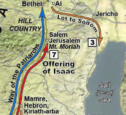



 

**Read/hear the portions**:

**Summary**

**Video**



## Geography

### Genesis 13

-   Genesis 13 begins with Abraham returning to Bethel/Ai, where Abraham again worships the LORD at the altar he made previously. This is represented by the blue arrow pointing up to Bethel on the map.[^1]

-   In this region, the Canaanites were the primary inhabitants of the land, yet Abram and Lot both had accumulated large herds that needed food and water.

-   The two camps got into a turf battle, leading Abram to suggest the two separate.

-   Abram selflessly elects to defer to Lot, who lifts his eyes towards Sodom and departs. Lot’s movements are represented by the orange arrow and box \#3.

-   God honors Abram’s handling of this situation by reaffirming his promise. Abram then moves south to dwell in Hebron.

### Genesis 14

Five kings of Canaan evidently violate a Suzerain-Vassel relationship, which leads to four kings of Mesopotamia moving into the Promised land to make war. We’ll describe what a Suzerain-Vassal treaty is below.

As shown on the map,[^2] the kings move from north to south along the King’s Highway and are victorious over the Rephaim, Zuzim, Emim (two possible locations), and the Horites in the region of Sier.

All of this leads up to the main narrative that as the Mesopotamians are plundering the region, they capture Lot with the intention of deporting him.

Abram is Lot’s kinsman redeemer and thus is obligated to rescue him, which he does way up in the region of Dan (off the map to the north).

On his return from rescuing Lot, on his way back to Hebron, Abram meets Melchi-zedek (King of Righteousness) at Salem (Jerusalem).

## Genesis 13:1-4

> So Abram went up from Egypt, he and his wife and all that he had, and Lot with him, into the Negeb. Now Abram was very rich in livestock, in silver, and in gold. And he journeyed on from the Negeb as far as Bethel to the place where his tent had been at the beginning, between Bethel and Ai, to the place where he had made an altar at the first. And there Abram called upon the name of the LORD.

-   Again, we are reminded that in Genesis 12:1, Abram was supposed to go from his kindred and his father’s house. He certainly had other humans besides his wife with him but the Bible specifically tells us Lot was one of those.

-   The word for “rich” in Hebrew (*caveyd, כָּבֵד)* literally means to “be weighty.”

    -   Livestock, silver, and gold weigh quite a bit.

    -   There’s also a hint that riches can weigh us down.

    -   This would have been around 200 miles but it was a very slow journey; if nothing else the livestock would need time to pasture.

-   This leads to Abram’s next test.

## 

## 

## Genesis 13:5-7: Abram’s and Lot’s men quarrel

> And Lot, who went with Abram, also had flocks and herds and tents, so that the land could not support both of them dwelling together; for their possessions were so great that they could not dwell together, and there was strife between the herdsmen of Abram's livestock and the herdsmen of Lot's livestock. At that time the Canaanites and the Perizzites were dwelling in the land.

-   Between April and October, rain is almost non-existent in most parts of Israel.

-   The Bible also reminds us that the land Abram and Lot were in is not their own. Those wicked Canaanites, whom Noah cursed back in Genesis 9 are the primary residents.

-   It’s not too hard to envision them tripping over each other trying to find the scarce fields and streams for their animals.

-   For the past 4000 years, the main source of contention in the Holy Land is water rights.

-   We often think that more money is the answer, but “will you notice”…

    -   The Bible clearly links their large quantity of posessions with the interpersonal strife.

    -   If you know what happens to most Lottery jackpot winners, you probably wouldn’t wish that on your worst enemy, let alone wish it would happen to you.

## 

## 

## Genesis 13:8-9: Abram and Lot Separate

> Then Abram said to Lot, “Let there be no strife between you and me, and between your herdsmen and my herdsmen, for we are kinsmen. Is not the whole land before you? Separate yourself from me. If you take the left hand, then I will go to the right, or if you take the right hand, then I will go to the left.”

-   Abram passes this mini test

    -   His age and status give him the first choice; the natural response would be to assert that right and take the best land for himself.

    -   Abram shows faith in God by letting Lot go first.

    -   In the same way, we should put others first and rely on God to meet our needs.

    -   Lancaster: “Peace between brothers is more important than success or prestige.”[^3]

## 

## 

## Genesis 13:10-11

> And Lot lifted up his eyes and saw that the Jordan Valley was well watered everywhere like the garden of the LORD, like the land of Egypt, in the direction of Zoar. (This was before the LORD destroyed Sodom and Gomorrah.) So Lot chose for himself all the Jordan Valley, and Lot journeyed east. Thus they separated from each other.

-   We again see the sin progression from Genesis 3 with the serpent and Eve.

-   Lot saw, he wanted, he took.

-   Now, practically, the Jordan may have been the only water around. In fact, it was like the garden of Eden.

-   The Bible is conspicuous that faith comes by hearing. People hear the word of the Lord and very few saw the Lord personally with their eyes.

    -   John 20:29 Jesus said to him, “Have you believed because you have seen me? Blessed are those who have not seen and yet have believed.”

-   How often do we make decisions based on what we see?

    -   Cars, houses, investments, food?

    -   What we see should be part of the decision-making process; not the entirety of it.

## 

## 

## Genesis 13:12-13

> Abram settled in the land of Canaan, while Lot settled among the cities of the valley and moved his tent as far as Sodom. Now the men of Sodom were wicked, great sinners against the LORD.

-   Abram remains in the land of Canaan where God told him to be.

-   It’s bad enough that Lot found Sodom appealing, but he subjects his family to that environment. We’re going to see in a few chapters an example of sowing and reaping. His daughters are not going to turn out to be model citizens.

-   As parents, and especially fathers, we’re responsible for the environment we expose to our children. I’m thinking specifically about government schools that don’t simply teach things differently than how you would want them; if you are a Bible-believing parent with traditional values, you are their enemy and they are your enemy. You’re leaving your kids with your enemy for 8 hours a day. You’re dropping your kids off at Sodom Jr. High. It’s something to think about.

-   As you and I interact with biblical characters, we should ask ourselves how are we like Abraham and how are we like Lot.

    -   Lot is portrayed as selfish, worldly. He makes bad decision after bad decision.

    -   Yet, we will see in Chapter 14, that his redeemer pursues him when he is in trouble.

    -   Even after this redemption, he makes more bad decisions and moves BACK to Sodom.

    -   Ultimately Lot is declared “righteous.” I would say this is true not because of who Lot was, but because of who Lot associated with.

    -   Does this sound familiar?

## 

## 

## Genesis 13:14-16

> The LORD said to Abram, after Lot had separated from him, “Lift up your eyes and look from the place where you are, northward and southward and eastward and westward, for all the land that you see I will give to you and to your offspring forever. I will make your offspring as the dust of the earth so that if one can count the dust of the earth, your offspring also can be counted.

-   God blesses Abram’s passing of the test by reconfirming the covenant.

-   He chose to elevate his neighbor over his personal prosperity. At its core, this is the definition of honor.

-   As a result, God blessed Him with BOTH peace and prosperity.

    -   As a further illustration, Lot acted selfishly and chose what appealed to the flesh.

    -   In a few chapters that prized location will be destroyed and turned into the wasteland we see today.

    -   All of this illustrates Jesus’ words: Matthew 25:29 “For to everyone who has (i.e., a heart for God like Abram) will more be given, and he will have an abundance. But from the one who has not (i.e., a selfish heart like Lot), even what he has will be taken away.”

-   We don’t know how much time has passed since Genesis 12:3 but safe to say several years.

-   Abram may be wondering about that “offspring” thing since he is still childless.

-   I see this as God telling him to hang in there, continue to be faithful and wait on God.

-   Of course, Abraham’s ultimate offspring is Jesus.

    -   Galatians 3:16 Now the promises were made to Abraham and to his offspring. It does not say, “And to offsprings,” referring to many, but referring to one, “And to your offspring,” who is Christ.

## 

## 

## Genesis 13:17-18

> Arise, walk through the length and the breadth of the land, for I will give it to you.” So Abram moved his tent and came and settled by the oaks of Mamre, which are at Hebron, and there he built an altar to the LORD.

-   In faithfulness, Abram builds an altar. We can tell when he’s passed a test.

-   Hebron is about halfway between Jerusalem and Beersheba; it’s only 19 miles from Jerusalem.

-   Abram will later be buried in Hebron.

## 

## 

## Genesis 14:1-4

> In the days of Amraphel king of Shinar, Arioch king of Ellasar, Chedorlaomer king of Elam, and Tidal king of Goiim, these kings made war with Bera king of Sodom, Birsha king of Gomorrah, Shinab king of Admah, Shemeber king of Zeboiim, and the king of Bela (that is, Zoar). And all these joined forces in the Valley of Siddim (that is, the Salt Sea). Twelve years they had served Chedorlaomer, but in the thirteenth year they rebelled.

-   We need to admit that there is no extra-biblical support for this passage.

    -   Specifically, there is no record that the four kings of the east had any control over the Holy Land during the early 2nd millennium BC at the time of Abraham.

    -   This doesn’t mean the Bible is wrong; in fact, it is more likely that there are gaps in our knowledge of the history of this period.

-   With that said, what is being described is a suzerain-vassal relationship, which is entirely consistent with how things worked in ancient society.

    -   It’s basically a protection racket

    -   A weaker king (the vassal) pays tribute to a stronger king (the suzerain) in exchange for protection.

    -   Then what would happen is a third party make a threat. The vassal would threaten to call the suzrain, but the new guy says, “pay me tribute then I’ll protect you from the other guy when he comes to collect.”

    -   It also was not uncommon for the vassal to get tired of the whole arrangement and rebel.

    -   It was very common for the suzrain to not take it well whenever the vassal revolted.

-   Locations according to Walton (modern names)[^4]

    -   Shinar = Babylon (Southern Iraq)

    -   Eliasar = Assyria (Syria/Northern Iraq)

    -   Elam = Persia (Iran)

    -   Goiim = Hittites (Eastern Turkey)

-   Locations according to Lancaster[^5]

    -   Shinar = Mesopotamia

    -   Eliasar = a city in Babylonia

    -   Elam = a province in lower Mesopotamia = Babylon

    -   Goiim = the gentile nations

## 

## 

## Genesis 14:5-7

> In the fourteenth year Chedorlaomer and the kings who were with him came and defeated the Rephaim in Ashteroth-karnaim, the Zuzim in Ham, the Emim in Shaveh-kiriathaim, and the Horites in their hill country of Seir as far as El-paran on the border of the wilderness. Then they turned back and came to En-mishpat (that is, Kadesh) and defeated all the country of the Amalekites, and also the Amorites who were dwelling in Hazazon-tamar.

-   The Bible loves geography: they’re following the King’s Highway in Jordan

-   This is the land of the giants (Rephaim), so there may be more going on here than we realize.

    -   Deuteronomy 2:20-21 (It is also counted as a land of Rephaim. Rephaim formerly lived there—but the Ammonites call them Zamzummim— \[21\] a people great and many, and tall as the Anakim; but the LORD destroyed them before the Ammonites, and they dispossessed them and settled in their place. (Read all of Deuteronomy 2).

## 

## 

## Genesis 14:8-11: the Babylonians are victorious

> Then the king of Sodom, the king of Gomorrah, the king of Admah, the king of Zeboiim, and the king of Bela (that is, Zoar) went out, and they joined battle in the Valley of Siddim with Chedorlaomer king of Elam, Tidal king of Goiim, Amraphel king of Shinar, and Arioch king of Ellasar, four kings against five. Now the Valley of Siddim was full of bitumen pits, and as the kings of Sodom and Gomorrah fled, some fell into them, and the rest fled to the hill country. So the enemy took all the possessions of Sodom and Gomorrah, and all their provisions, and went their way.

-   This section is often called “Four Kings against Five Kings”

-   The four Mesopotamian kings won.

-   Don’t think tar pits like Californians have in La Brea, a lake of sticky muck.

-   Naturally occurring bitumen in this region is solid.

-   Pits here are more like wells, or maybe even more like mine shafts

-   They didn’t fall in and get stuck; the locals needed a place to hide and they knew where to go.

-   The four kings routed then plundered, including deporting the population, which is a foreshadowing of the Babylonian captivity in 586 BCE.

-   One of the captives was Lot.

## 

## 

## Genesis 14:12-13: The Babylonians take Lot into captivity

> They also took Lot, the son of Abram's brother, who was dwelling in Sodom, and his possessions, and went their way. Then one who had escaped came and told Abram the Hebrew, who was living by the oaks of Mamre the Amorite, brother of Eshcol and of Aner. These were allies of Abram.

-   This is the first mention of Hebrew.

    -   We think of the term in terms of ethnicity or religion, but Walton points out, at this time it may have been a “designation of a social class.”

    -   With that said, it certainly could have referenced the fact that Abram and his family were not polytheistic like everyone else around them, but were worshippers of the One who will be known as the “God of Abraham, Isaac, and Jacob.”

## Genesis 14:14-17: Abram rescues Lot

> When Abram heard that his kinsman had been taken captive, he led forth his trained men, born in his house, 318 of them, and went in pursuit as far as Dan. And he divided his forces against them by night, he and his servants, and defeated them and pursued them to Hobah, north of Damascus. Then he brought back all the possessions, and also brought back his kinsman Lot with his possessions, and the women and the people. After his return from the defeat of Chedorlaomer and the kings who were with him, the king of Sodom went out to meet him at the Valley of Shaveh (that is, the King's Valley).

-   We tend to think of “next of kin” as someone younger, but in this context, Abram was Lot’s next of kin. That means Abram, as lot’s redeemer, wasn’t just being nice; Abram had an obligation to go after Lot and rescue him.

    -   Does Jesus as our Kinsman Redeemer, have an obligation to pursue us who are lost? I think He sees it that way.

    -   We saw in Revelation how there is a point where God seems to say “if you mess with My people then you’re messing with Me.”

    -   Imagine being in enemy captivity but not wanting to be rescued.

        -   That is the sad state of the unbeliever.

        -   The Enemy knows that the best kind of enslaved person is one who doesn’t know he’s enslaved.

        -   Are there any aspects of our lives where we are enslaved but don’t view it that way? (hurts, habits, hangups, false dichotomies).

-   We need to get in the habit of viewing life through a spiritual lens.

    -   In that respect, the abduction of Lot is a satanic attack on the Messianic line.

    -   Lot is the father of the Ammonites and the Moabites

    -   Naamah, the Ammonite is listed as the mother of Rehoboam (2 Kings 12:12) and, more famously, Ruth, is the mother of Obed (Matthew 1:5).

    -   As both Obed and Rehoboam are in the Messianic line, Jesus has Moabite and Ammonite lineage – an attack on Lot puts that in jeopardy.

    -   Jesus is everywhere in the Old Testament if you know where to look.

-   To get a sense of how wealthy Abram had become, we are told he has a security detail of 318 men; potentially the same size as the armies of each of the city-states named (but likely much inferior to the size of the combined armies of the Mesopotamian kings)

-   Much like Gideon, Abram used the tactic of dividing his already small forces in a nighttime ambush.

-   Dan in this case is being used anachronistically (since Dan has not been born yet); this refers to the extreme north of the Promised Land, again up near Mt. Hermon where the demonic activity occurred.

-   If it’s the same location as mentioned in 2 Sam 18:18, the King’s valley is where the Kidron and the Hinnom valleys come together in Jerusalem.

    -   2 Samuel 18:18 Now Absalom in his lifetime had taken and set up for himself the pillar that is in the King's Valley, for he said, “I have no son to keep my name in remembrance.” He called the pillar after his own name, and it is called Absalom's monument to this day.

    -   There is an “Absalom’s pillar” today that dates to the 1st century CE, but this is not to say it couldn’t have been built over the original site.

### In His Dust: 

**Disciples do all we can to save someone in trouble.**

## 

-   James 4:17 So whoever knows the right thing to do and fails to do it, for him it is sin.

-   Even though Lot had only himself to blame for his situation, Abraham did all he could to save him.[^6]

## 

## Genesis 14:18-20: Melchizedek and Abram have a banquet

> And Melchizedek king of Salem brought out bread and wine. (He was priest of God Most High.) And he blessed him and said, “Blessed be Abram by God Most High, Possessor of heaven and earth; and blessed be God Most High, who has delivered your enemies into your hand!” And Abram gave him a tenth of everything.

-   Walton speculates that Melchizedek might have been the principal king of the region. Salem is usually considered to be Jerusalem, which would make this the first reference to Jerusalem in Scripture.

    -   Psalms 76:2 His abode has been established in Salem, his dwelling place in Zion.

-   “God Most High” (El Alyon) is not necessarily Our God, but is probably El, the chief Canaanite god.

-   The elements of communion get our attention. In context, the shared meal likely signifies Melchizedek’s desire to make peace with Abram and his formidable army. Abram in turn acknowledges Melchizedek’s status by paying tribute.

    -   This foreshadows the Messianic banquet when we too will dine at the table with Abraham.

    -   Matthew 8:11 I tell you, many will come from east and west and recline at table with Abraham, Isaac, and Jacob in the kingdom of heaven

-   We know almost nothing about Melchizedek (King of Righteousness); and we probably would not remember his name if it were not for Psalm 110 and Hebrews 5-7, particularly chapter 7.

    -   Psalms 110:4 The LORD has sworn and will not change his mind, “You are a priest forever after the order of Melchizedek.”

-   Hebrews presents a complicated distinction between a priest of Levi and a priest in the order of Melchizedek (who is both a king and a priest).

    -   Most Israelites offer tithes and bow to Levi/the Aaronic priesthood.

    -   Abraham could not bow down to a Levite because Levi was still in Abraham’s loins (that’s what Hebrews says!), but he could bow down to Melchizedek

    -   Following the logic, the priesthood of Melchizedek is superior to the priesthood of Aaron. Messiah belongs to a different priesthood

        -   Jesus does not cancel or abolish the Aaronic priesthood.

        -   He merely operates in a different realm (for example, not the earthly Temple but the heavenly Temple).[^7]

    -   Further, the writer to Hebrews says Melchizedek is a type of Jesus

        -   Psalms 110:4 says a priest in the order of Melchizedek, not “the priest Melchizedek.”

        -   Hebrews 7:3 He is without father or mother or genealogy, having neither beginning of days nor end of life, but resembling the Son of God he continues a priest forever.

        -   Melchizedek was not a supernatural apparition, but no such lineage is documented. Therefore he is a type of Jesus who existed at the beginning.

    -   In contrast to the Levitical priesthood, Melchizedek represents the Messianic priesthood during the Messianic era of peace (shalom/Salem), ruling from Jerusalem.[^8]

-   Abraham tithes before it was mandated later in Torah.

    -   Abraham tithed because it pleased God, not because it was something he was required to do.

    -   He also expected nothing in return.

    -   This is another way of saying, Abraham didn’t tithe to be saved; he tithed because he already was saved.

## 

## 

## Genesis 14:21: The King of Sodom vs. King of Salem

> And the king of Sodom said to Abram, “Give me the persons, but take the goods for yourself.”

-   The King of Sodom might be thought of as an “anti-Melchizedek.”

-   In fact, it is clear that the Divine Narrator wants us to connect Melchizidek with the King of Sodom.

-   If Melchizedek is a type of Messiah, then the King of Sodom is a type of the Anti-messiah; otherwise known as Antichrist.

-   Also note we have “Jerusalem” (holy city) versus “Sodom” (wicked city)

-   He shows up here requesting the souls of the people.

## Genesis 14:22-24: Abram declines spoils of war

> But Abram said to the king of Sodom, “I have lifted my hand to the LORD, God Most High, Possessor of heaven and earth, that I would not take a thread or a sandal strap or anything that is yours, lest you should say, ‘I have made Abram rich.’ I will take nothing but what the young men have eaten, and the share of the men who went with me. Let Aner, Eshcol, and Mamre take their share.”

-   As is often the case, when we have a spiritual success, we are often tempted.

-   Abraham, who willingly gave a 10th to Melchizedek, the King of Jerusalem, refuses to give anything to the King of Sodom.

-   Abram is a representative of the LORD, God Most High, and will not profit from his military action.

-   There was likely a written agreement between Abram and the King of Sodom.

-   In fact, Genesis chapter 14 may be the text of that agreement.

### Hebrews 7

For this Melchizedek, king of Salem, priest of the Most High God, met Abraham returning from the slaughter of the kings and blessed him, and to him Abraham apportioned a tenth part of everything. He is first, by translation of his name, king of righteousness, and then he is also king of Salem, that is, king of peace. He is without father or mother or genealogy, having neither beginning of days nor end of life, but resembling the Son of God he continues a priest forever.

See how great this man was to whom Abraham the patriarch gave a tenth of the spoils! And those descendants of Levi who receive the priestly office have a commandment in the law to take tithes from the people, that is, from their brothers, though these also are descended from Abraham.

But this man who does not have his descent from them received tithes from Abraham and blessed him who had the promises. It is beyond dispute that the inferior is blessed by the superior. In one case tithes are received by mortal men, but in the other case, by one of whom it is testified that he lives. One might even say that Levi himself, who receives tithes, paid tithes through Abraham, for he was still in the loins of his ancestor when Melchizedek met him. Now if perfection had been attainable through the Levitical priesthood (for under it the people received the law), what further need would there have been for another priest to arise after the order of Melchizedek, rather than one named after the order of Aaron?

For when there is a change in the priesthood, there is necessarily a change in the law as well. For the one of whom these things are spoken belonged to another tribe, from which no one has ever served at the altar. For it is evident that our Lord was descended from Judah, and in connection with that tribe Moses said nothing about priests.

This becomes even more evident when another priest arises in the likeness of Melchizedek, who has become a priest, not on the basis of a legal requirement concerning bodily descent, but by the power of an indestructible life. For it is witnessed of him, “You are a priest forever, after the order of Melchizedek.” For on the one hand, a former commandment is set aside because of its weakness and uselessness (for the law made nothing perfect); but on the other hand, a better hope is introduced, through which we draw near to God. And it was not without an oath. For those who formerly became priests were made such without an oath, but this one was made a priest with an oath by the one who said to him: “The Lord has sworn and will not change his mind, ‘You are a priest forever.’”

This makes Jesus the guarantor of a better covenant. The former priests were many in number, because they were prevented by death from continuing in office, but he holds his priesthood permanently, because he continues forever.

Consequently, he is able to save to the uttermost those who draw near to God through him, since he always lives to make intercession for them. For it was indeed fitting that we should have such a high priest, holy, innocent, unstained, separated from sinners, and exalted above the heavens. He has no need, like those high priests, to offer sacrifices daily, first for his own sins and then for those of the people, since he did this once for all when he offered up himself. For the law appoints men in their weakness as high priests, but the word of the oath, which came later than the law, appoints a Son who has been made perfect forever.

[^1]: William Schlegel, *Satellite Bible Atlas: Historical Geography of the Bible* (Israel: SkyLand Publishing, 2016), Map 2-2 Patriarchs: Abraham and Isaac.

[^2]: Schlegel, Map 2-2 Patriarchs: Abraham and Isaac.

[^3]: Daniel T. Lancaster, *Depths of the Torah*, ed. Boaz D. Michael and Steven P. Lancaster, 2nd ed., Torah Club (Marshfield, MO: First Fruits of Zion, 2017), 102.

[^4]: John H. Walton, Victor H. Matthews, and Mark W. Chavalas, *The IVP Bible Background Commentary: Old Testament*, (E-Sword) (Downers Grove, Ill: IVP Academic, 2000), loc. Gen 14:1-4.

[^5]: Lancaster, *Depths of the Torah*, 103.

[^6]: Zelig Pliskin, *Love Your Neighbor:* (Brooklyn, New York: Bnay Yakov Publications, 2004), 48.

[^7]: D. Thomas Lancaster, *Chronicles of the Messiah*, ed. Boaz Michael and Stephen D. Lancaster, 2nd ed., Torah Club (Marshfield, MO: First Fruits of Zion, 2014), 73.

[^8]: Lancaster, *Depths of the Torah*, 105.

