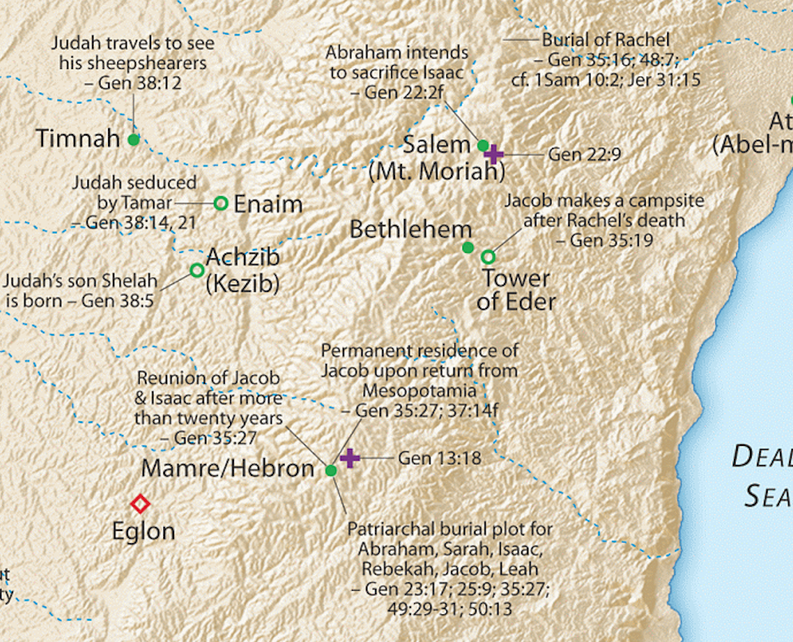



 



# Genesis 15 – A faith completed by works (James 2:22)

Geographic setting

We aren’t provided a specific location for the events in this chapter. Verse 15 references Abraham buried, which we know is Hebron, SW of Jerusalem and Bethlehem.

## Faith Alone?

Genesis 15 is an important chapter to the Apostolic Writers. Verse 6 contains the famous statement, “He (Abraham) believed in the LORD; and he counted it to him for righteousness.”

This verse is directly referenced in Romans 4, Galatians 3, Hebrews 11, and James 2. This verse, along with Habakkuk 2:4, “The just shall live by faith,” are the verses that sparked the Reformation.

Paul spends an entire chapter, Romans 4, developing Abraham’s faith, and, as a compliment, James spends half of chapter two doing the same, but in a slightly different context. The famous “faith without works is dead” passage uses Abraham in Genesis 15 as a backdrop. So we’re going to need to be Bereans (Acts 17;11) and do our homework to piece all of this together to make sure we have a firm grasp of how faith and works go together. This is important because, in my humble opinion, the protestant church has largely gotten it wrong for the past 500 years by teaching “Faith Alone.” That’s not exactly what the Bible teaches. Jesus never says our works don’t matter; in fact, there are multiple passages where He essentially says, “if you love me, you will keep my commands.” (John 14:15, 14:24, 15:10, Mat 28:20, etc.). But as always, don’t believe what I say. Be a Berean and check it out for yourself.

What is true is the order. Faith comes first, then obedience. We’ll see Abraham’s faith here in Chapter 15, and then we’ll see his obedience, culminating with obedience beyond all understanding in Genesis 22. God delivered the Israelites from Egypt first, then gave them the Torah, the standards of ethical behavior for His people. Jesus first says come to Me you who are weary and burdened and I will give you rest” (Mat 11:28), then he says, “(teach) them to obey all I have commanded” (Mat 28:20).

It would be worth our time to read Romans 4 and James 2:14-26 in conjunction with Genesis 15.

All told, Abraham occurs 75 times in the New Testament, and the events in His life that are referenced the most begin in this chapter. A firm understanding of Chapters 15, 16, 17, 21, and 22 will significantly aid our correct interpretation and application of New Testament teaching.

## Genesis 15:1-3

> After these things, the word of the LORD came to Abram in a vision: “Fear not, Abram, I am your shield; your reward shall be very great.” But Abram said, “O Lord GOD, what will you give me, for I continue childless, and the heir of my house is Eliezer of Damascus?” And Abram said, “Behold, you have given me no offspring, and a member of my household will be my heir.”

-   God communicates in visions. They are distinct from dreams in that the recipient has no doubt the conversation really took place.

-   As we remember, the chapter and verse breaks are man’s insertions; they are not divinely inspired.

    -   We are used to “after these things” denoting a scene shift, but this is not to say the events after these things are not related to the events before “these things.”

    -   If we read the Story of Abraham as a continuous narrative, Abraham has just given 10% to Melchizedek and did not keep any spoils for himself.

    -   God viewed this with favor and here says, “because you refused reward from the King of Sodom, your reward from Me will be very great.”

-   Abraham wants to know what has become of the promises of Chapter 12.

    -   If a man had no son, he could legally adopt a servant.

    -   Despite God’s earlier promise, Abraham seems resigned to this course of action, possibly believing that Eliezer is whom God had in mind to continue Abraham’s line all along.

    -   In hindsight, since we know what is about to happen with Isaac, it’s easy for us to see a lack of faith, especially since God specifically said, “your offspring.” We, as disciples, often limit God to what we can see.

    -   How patient and faithful would WE be if we were in Abraham’s shoes?

-   Eliezer means “God is Help” or “God’s helper.”

    -   Four times in John 15, Jesus refers to the Holy Spirit as “the Helper.”

        -   John 15:26 “But when the Helper comes, whom I will send to you from the Father, the Spirit of truth, who proceeds from the Father, he will bear witness about me.

    -   Remember this discussion when we get to Genesis 24 when the father’s (unnamed) helper goes to fetch a bride for the son.

## Genesis 15:4-5

> And behold, the word of the LORD came to him: “This man shall not be your heir; your very own son shall be your heir.” And he brought him outside and said, “Look toward heaven, and number the stars, if you are able to number them.” Then he said to him, “So shall your offspring be.”

-   Hebrews 11:12 Therefore from one man, and him as good as dead, were born descendants as many as the stars of heaven and as many as the innumerable grains of sand by the seashore.

-   God IS able to number them:

    -   Psalms 147:4 He determines the number of the stars; he gives to all of them their names.

    -   Isaiah 40:26 Lift up your eyes on high and see: who created these? He who brings out their host by number, calling them all by name; by the greatness of his might and because he is strong in power, not one is missing.

-   God and Abraham had a special relationship. They speak with each other as two friends. In a few chapters, they will negotiate with each other.

-   James 2:23 and the Scripture was fulfilled that says, “Abraham believed God, and it was counted to him as righteousness”—and he was called a friend of God.

## Genesis 15:6

> And he believed the LORD, and he counted it to him as righteousness.

-   This statement was very important to Paul.

    -   Romans 4 is Paul’s commentary on Genesis 15:6

    -   Romans 4:13 For the promise to Abraham and his offspring that he would be heir of the world did not come through the law but through the righteousness of faith.

    -   Paul is saying that as believers, we are to trust in God just as Abraham did.

    -   According to Paul, Abraham didn’t just believe God would provide a literal son in Isaac; Abraham foresaw a special son of His: the Messiah.

    -   John 8:56 “Your father Abraham rejoiced that he would see my day. He saw it and was glad.”

    -   Galatians 3:29 And if you are Christ's, then you are Abraham's offspring, heirs according to promise.

    -   In Paul’s logic:

        -   God promised Abraham a seed (seed singular, not seeds plural)

        -   Abraham believed God’s promise regarding the seed.

        -   The Seed is the Messiah.

        -   Therefore Abraham believed in the Messiah.

-   Paul used this passage as a proof-text that Gentiles did not need to convert to Judaism to be deemed righteous by God.

    -   The proclamation of Abraham’s faith and declaration of his righteousness came before the covenant sign and commandment to Abraham to circumcise.

    -   We are deemed righteous first, and then we obey; we don’t obey to attain righteousness. When we fail, we don’t lose our status; when we fail, we realize our dependence on God.

    -   This is VERY different from saying “works don’t matter at all.”

-   The Bible doesn’t teach salvation by works; but, it does teach works from salvation.

    -   The Israelites were delivered from bondage, and THEN they were given the Torah.

    -   James 2:20-24 Do you want to be shown, you foolish person, that faith apart from works is useless? Was not Abraham our father justified by works when he offered up his son Isaac on the altar? \[You see that faith was active along with his works, and faith was completed by his works; and the Scripture was fulfilled that says, “Abraham believed God, and it was counted to him as righteousness”—and he was called a friend of God. You see that a person is justified by works and not by faith alone.

    -   One remarkable aspect about the Bible is it seems to anticipate false doctrine – and what is remarkable about man is that we still get it wrong (for example, Luther reportedly said he “had no use for James.”)

    -   “Faith alone” is a core teaching of the Protestant Church, yet it may only be ½ correct.

    -   Note James is not saying “works alone justify.” A person who claims to have faith but no works might be in error about his claim to have faith.

-   Galatians 3:5-7 Does he who supplies the Spirit to you and works miracles among you do so by works of the law, or by hearing with faith— just as Abraham “believed God, and it was counted to him as righteousness”? Know then that it is those of faith who are the sons of Abraham.

-   Paul makes it clear he is basing his arguments FROM the Torah, not outside of the Torah: Romans 3:31 Do we then overthrow the law by this faith? By no means! On the contrary, we uphold the law.

## Genesis 15:7-8

> And he said to him, “I am the LORD who brought you out from Ur of the Chaldeans to give you this land to possess.” But he said, “O Lord GOD, how am I to know that I shall possess it?”

-   We call this cognitive dissonance. Abraham’s reality doesn’t match what he believes.

-   We can simultaneously believe and doubt, as with the father of the demon-possessed boy in Mark 9:24: Immediately, the father of the child cried out and said, “I believe; help my unbelief!”

-   This is the overarching test for believers. We believe God is all-good and we believe that God is all powerful, yet evil exists. The martyred saints struggled with this in Revelation.

-   In Abraham’s case, God will address Abraham’s desire to “know that I shall possess” with a covenant.

## Genesis 15:9-10

> He said to him, “Bring me a heifer three years old, a female goat three years old, a ram three years old, a turtledove, and a young pigeon.” And he brought him all these, cut them in half, and laid each half over against the other. But he did not cut the birds in half.

-   This procedure signifies a covenant.

-   Usually, both parties would divide the sacrifices and then walk between them – we’re going to see something different about this treaty in a moment.

-   The cutting in half is symbolic of the curse on the one who violates the treaty. The parties are essentially saying, “may I become like this animal if I break the treaty.”

-   The parties share a fellowship meal – symbolic of mutual blessings for keeping to the terms.

## Genesis 15:11

> And when birds of prey came down on the carcasses, Abram drove them away.

-   Except for the Eagle, birds of prey are usually negative in the Bible, as Jesus describes in the Parable of the Four Soils:

    -   Matthew 13:4 And as he sowed, some seeds fell along the path, and the birds came and devoured them.

    -   Matthew 13:19 When anyone hears the word of the kingdom and does not understand it, the evil one comes and snatches away what has been sown in his heart. This is what was sown along the path.

-   In a direct sense, Abraham is going to have to compete with the enemies listed at the end of the chapter for possession of the land. They have no part in the covenant.

-   In an indirect sense, the birds are the ministers of Satan, ready to attack and defile God’s covenants.

    -   Driving the birds away means we need to be vigilant about identifying threats – something Abraham will fail to do in Chapter 16.

## Genesis 15:12-14 

> As the sun was going down, a deep sleep fell on Abram. And behold, dreadful and great darkness fell upon him. Then the LORD said to Abram, “Know for certain that your offspring will be sojourners in a land that is not theirs and will be servants there, and they will be afflicted for four hundred years. But I will bring judgment on the nation that they serve, and afterward, they shall come out with great possessions.

### Terrible darkness?

-   Tradition holds that Abraham was given a vision of all of the suffering of the Jewish people, from Egypt to Auschwitz, but it culminated with a vision of the Messianic Kingdom.

-   This is another possibility Jesus was referencing when He said, “Abraham rejoiced to see My day.”

### Unconditional Covenant

-   Many catholic and protestant commentators don’t understand the significance of verse 12.

-   A common strain of theology goes like this: “Israel forfeited God’s promises because she rejected her Messiah. Those promises now belong to the church.”

-   Abraham was not an active party to the covenant trust agreement – this covenant was UNCONDITIONAL. Abraham, or his offspring Israel, could not violate the terms of the agreement if they tried, including the national rejection of Jesus.

-   The promises are still in play.

-   The church does not replace Israel; the church has an entirely different mission and destiny from national (theological) Israel.

    -   Note: this does not mean we have to blindly support political Israel – that is a different discussion although eventually theological Israel and political Israel must intersect.

    -   IMHO we need to get away from blanketly saying this or that group is all good or all bad. There are Good Jews and bad Jews. There are good Palestinians and bad Palestianians. There are Good Christians and bad people who call themselves Christians.

    -   Our Job is to be bereans and true to the Bible, because of that I can say “my God and my Savior loves Israel so I love Israel.”

### Sojourner - Messiah

-   The Hebrew word is ger, and it refers to something like a resident alien – separated from his own people, living among foreigners.

-   Messiah has been a sojourner, a stranger to His own people, living among us gentiles.

-   One day, Messiah will no longer be a sojourner or a stranger and He will inherit everything.

### 400 Years?

-   Acts 7:6 And God spoke to this effect—that his offspring would be sojourners in a land belonging to others, who would enslave them and afflict them four hundred years.

-   Did you know 400 years does not refer to the time they were in Egypt?

-   To further complicate matters, Exodus 12:40 says they were in Egypt 430 years.

    -   If we look at the genealogies, only 64 years pass from the time Joseph dies to when Moses is born – Exodus 6.

    -   According to one reckoning, the 400 years of affliction begins when Ishmael mocks/persecutes Isaac in Genesis 21. Then using the ages given in the Bible, it is exactly 400 years until Moses speaks to Pharaoh in Exodus 7.

    -   30 years before this is when God Gave the promise to Abraham we are studying here.

    -   If this sounds contrived, Paul evidently confirms the math in Galatians 3 by saying the Torah was given 430 years after the promise to Abraham.

    -   Galatians 3:16-17 Now the promises were made to Abraham and to his offspring. It does not say, “And to offsprings,” referring to many, but referring to one, “And to your offspring,” who is Christ. This is what I mean: the law, which came 430 years afterward, does not annul a covenant previously ratified by God, so as to make the promise void.

-   One of our presuppositions is that God’s word is infallible.

    -   If we think we’ve found an error, we are revealing that we don’t really believe Scripture is without error.

    -   Better to ask, “since the Bible cannot be in error, how is my understanding in error?”

## Genesis 15:15-16

> As for you, you shall go to your fathers in peace; you shall be buried in a good old age. And they shall come back here in the fourth generation, for the iniquity of the Amorites is not yet complete.”

-   We need to remember God’s ways our not our ways.

-   In part, the reason the Israelites were in Egypt was so the sin of the Amorites would be complete.

-   Sometimes the reason we go through trials is so we can later glorify God through our testimony.

## Genesis 15:17 – The Torch is Messiah

> When the sun had gone down and it was dark, behold, a smoking fire pot and a flaming torch passed between these pieces.

-   Perhaps a foreshadowing of God as the pillar of cloud/pillar of fire in the wilderness.

-   Isaiah 62:1 For Zion's sake I will not keep silent, and for Jerusalem's sake I will not be quiet, until her righteousness goes forth as brightness, and her salvation (Yeshua) as a burning torch.

## Genesis 15:18-21

> On that day, the LORD made a covenant with Abram, saying, “To your offspring, I give this land, from the river of Egypt to the great river, the river Euphrates, the land of the Kenites, the Kenizzites, the Kadmonites, the Hittites, the Perizzites, the Rephaim, the Amorites, the Canaanites, the Girgashites, and the Jebusites.”

-   Exodus 12:40-43 The time that the people of Israel lived in Egypt was 430 years. \[41\] At the end of 430 years, **on that very day,** all the hosts of the LORD went out from the land of Egypt...And the LORD said to Moses and Aaron, “This is the statute of the Passover…,

-   Back to our 400/430 year discussion – if we take Exodus 12 literally, then the day Abraham received this vision was the evening between Nissan 14 and 15; in other words, he received it on Passover (in advance).

-   14/15 Nissan

    -   Abraham slaughtered the animals to make a covenant with the LORD in a great and terrible darkness.

    -   The children of Israel slaughtered their Passover lambs in Egypt as the angel of death slew Egypt’s firstborn.

    -   Messiah suffered and died as our sacrifice, right after He instituted a New Covenant. At sunset, they closed the Master’s tomb (another great and terrible darkness).

    -   In all three darkness times a light blazed forth.

    -   Lancaster, “The day of Passover draws a line of connection from Abraham’s covenant to his singular promised Seed, the Messiah.”

