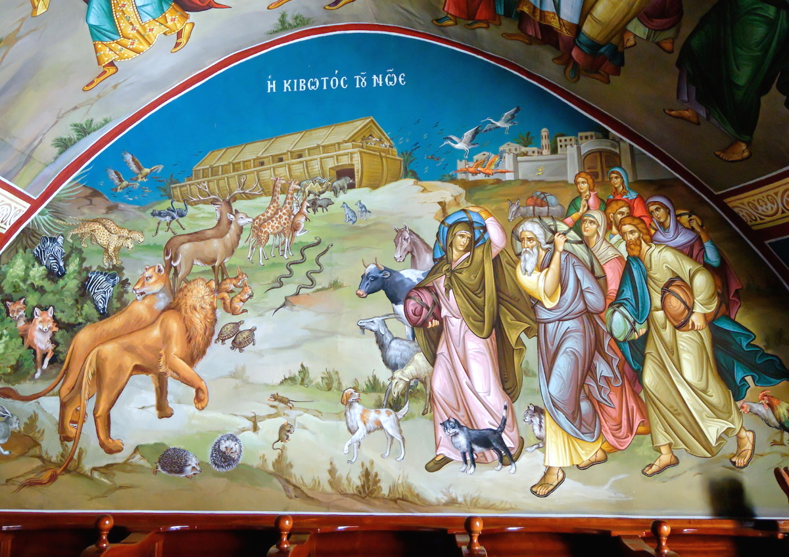
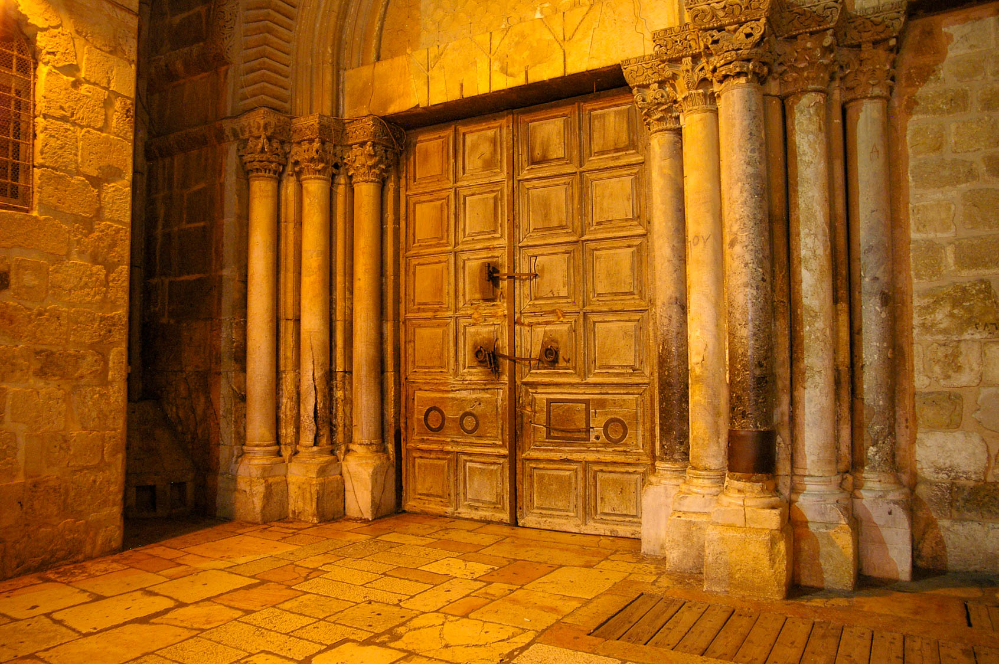
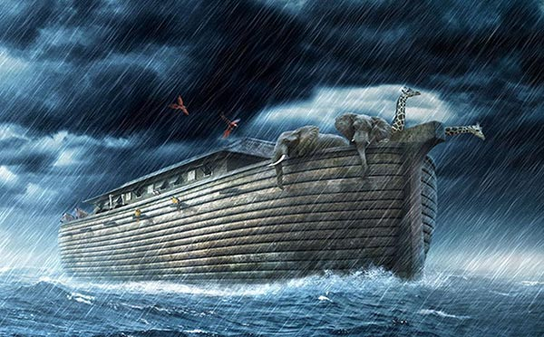



**Read/hear the portions**:
Genesis 7:1-24 

**Summary**

**Video**



## Gen 7:1

> Then the LORD said to Noah, “Go into the ark, you and all your household, for I have seen that you are righteous before me in this generation.

-   Heb 11:7 By faith Noah, being warned by God concerning events as yet unseen, in reverent fear constructed an ark for the saving of his household. By this he condemned the world and became an heir of the righteousness that comes by faith.

-   Mat 11:28 Come to me, all who labor and are heavy laden, and I will give you rest (Heb. *noach*).

-   The Hebrew command “bo” can mean either come or go. “Come into the ark” seems to fit the mood of God’s providing shelter and security through this significant trial upon the earth.

-   As we noted last lesson, God could have elected to wipe everything out and start over. Instead, He chose to fix it. Tikkun Olam.

-   Justice demands not only that the wicked be punished, but the innocent/righteous not be punished along with the wicked.

-   In fact, only Noah is described as righteous, not his wife or sons.

    -   They, presumably, were given a choice to follow Noah or not.

    -   Thus a model for us is just as Noah’s family was saved on the basis of Noah’s righteousness, not their own, so too, if we follow Jesus, we are saved on the basis of His righteousness, not our own.

    -   “By virtue of being associated with Him and His righteousness, we are spared from the final judgment.”[^1]

-   We can take this a step further. Does today’s world scoff at the Bible’s description of the second-coming of Jesus who brings an end-times judgment? Did the larger world scoff at Noah when he was building the ark?

    -   2Pe 3:3-6 knowing this first of all, that scoffers will come in the last days with scoffing, following their own sinful desires. \[4\] They will say, “Where is the promise of his coming? For ever since the fathers fell asleep, all things are continuing as they were from the beginning of creation.” \[5\] For they deliberately overlook this fact, that the heavens existed long ago, and the earth was formed out of water and through water by the word of God, \[6\] and that by means of these the world that then existed was deluged with water and perished.

    -   Matthew 24:39 “…until the flood came and took them all away. So will the coming of the Son of Man be.”

-   The Bible uses flood imagery to describe the Tribulation period:

    -   Dan 9:26 And the people of the prince who is to come shall destroy the city and the sanctuary. Its end shall come with a flood, and to the end there shall be war. Desolations are decreed.

    -   Rev 12:15 The serpent poured water like a river out of his mouth after the woman, to sweep her away with a flood.

## Gen 7:2-3

> \[2\] Take with you seven pairs of all clean animals, the male and his mate, and a pair of the animals that are not clean, the male and his mate, \[3\] and seven pairs of the birds of the heavens also, male and female, to keep their offspring alive on the face of all the earth.

-   Additional clean animals are needed for sacrifices after the flood.[^2]

-   Here is an important insight. The Bible doesn’t provide every detail.

    -   In the Text, clean and unclean designations do not occur until MUCH later (Lev 11:2-23).

    -   Yet, “somehow” Noah knows which are clean vs unclean.

    -   Either God explained it to Noah directly, or perhaps He explained it to Adam, who passed it down.

    -   Conversely, many (perhaps most) of the commands given at Sinai were not new to Moses. We might say they were codified as opposed to given for the first time.

-   There has not yet been permission given to eat meat (that won’t come until Gen 9:2, and even there, no distinction is made between clean and unclean animals), so the assumption is that clean animals were needed for sacrifice, not man’s diet.

## Gen 7:4-5

> \[4\] For in seven days I will send rain on the earth forty days and forty nights, and every living thing that I have made I will blot out from the face of the ground.” \[5\] And Noah did all that the LORD had commanded him.

-   It seems more likely that God sent the animals to Noah, versus Noah going out and fetching them.

-   The Jewish Targum says, “Behold, I give you the space of seven days; if they will repent they will be forgiven, but if they still will not repent, seven days from now, I will cause rain to come down upon the earth forty days and forty nights.”[^3]

-   “Blot out” is a good choice for the verb in verse 4. Some translations say “destroy” but “blot out” captures the essence of the word. Sinful man is to be violently erased without a trace, buried beneath the sea.

## Gen 7:6-9

> \[6\] Noah was six hundred years old when the flood of waters came upon the earth. \[7\] And Noah and his sons and his wife and his sons' wives with him went into the ark to escape the waters of the flood. \[8\] Of clean animals, and of animals that are not clean, and of birds, and of everything that creeps on the ground, \[9\] two and two, male and female, went into the ark with Noah, as God had commanded Noah.

-   Those who have done the math calculated that Noah turned 600 in the same year Methuselah died.

    -   From this we learn that “Methuselah’s” name was a prophecy. Mot = death; u=pronominal suffix meaning “his”; shelach = send or bring (forth). Methuselah means “his death shall bring,” as in bring forth judgment.

    -   The year Methuselah died, the flood of waters came on the earth.

        -   In fact, the Talmud says the reference to “seven days” in verse 4 corresponds to the required seven-day mourning period; i.e., the rain began seven days after Methuselah died.

-   Methuselah was the longest living person at 969, which is a picture of God’s mercy.

-   People had almost 1000 years to repent and 120 years to get on the boat. They did neither.

-   God’s mercy and patience are not infinite.

## Gen 7:10-12

> \[10\] And after seven days the waters of the flood came upon the earth. \[11\] In the six hundredth year of Noah's life, in the second month, on the seventeenth day of the month, on that day all the fountains of the great deep burst forth, and the windows of the heavens were opened. \[12\] And rain fell upon the earth forty days and forty nights.

-   In Hebrew, the word for sky and heavens are the same – shamayim.

-   A partial list of 40s in the Bible:

    -   The flood waters (Gen 7:4, 12, 17)

    -   Moses on Mt. Sinai (Exodus 24:18) & Moses’ fasted during this time, just like Jesus did (Ex 34:28)

    -   The twelve spies scout the promised land (Numbers 13:25); Joshua, one of the spies, was 40 at the time.

    -   Sentenced to wander in the wilderness specifically one year for every day the spies were in the land (Numbers 14:34; Heb 3:9); also were provided manna and provision for forty years (Ex 16:35; Deu 8:4)

    -   40-year periods of either rest or subjugation occur throughout Judges.

    -   Goliath mocked Israel 40 days.

    -   Ezekiel lay on his right side to bear the iniquities Judah (Ezekiel 4:6)

        -   Curiously, Ezekiel was told to lay on his left side for 150 days according to the LXX rendering of Ezekiel 4:4-5.

        -   In Genesis 7:24 we’re told that after the 40 days of rain, the waters prevailed upon the earth for 150 days.

        -   Curious.

    -   Jesus fasted in the wilderness 40 days/nights being tempted by the devil (Mark 1:13)

    -   Two general themes emerge from this list: trials/judgment/testing and God’s provision

    -   Both are occurring in the Flood narrative

-   A couple of models have been suggested:

    -   The ark is a type of Jesus. Just as those in the ark were saved, those who are in Jesus are preserved and provided for during the time of God’s judgment upon the earth; those not in Christ perish (1 Peter 3:21)

    -   Those who hold a pre-trib rapture see it slightly differently: Enoch represents a group of people who will be **removed prior** to God’s wrath (said to be the raptured church), Noah and the Ark represents a group of people who will be **preserved through** God’s wrath (said to be National Israel and believing “tribulation saints (perhaps those are one and the same)), and everyone else is the group of people who will **perish** as a result of God’s wrath (said to be unbelievers).

        -   Note that Noah is “sealed” by God (i.e. sealed inside the ark) in verse 16, just like the saints are sealed by God during the tribulation.

        -   Enoch was “pre-flood,” not “mid-flood” or “post-flood.”[^4]

-   “Fountains of the deep burst forth”

    -   It can be easy to miss but the cause of the flooding was not exclusively due to the rain.

        -   This recalls Genesis 1:6-7 and “the waters above” compared to “the waters below”

    -   This could refer to massive earthquakes resulting in the breakup and shift of continents, releasing subterranean waters.

    -   We have no idea what the earth was like before the flood, but we can surmise that it looked nothing like it does today.

    -   Per the Bible Knowledge Commentary, “No doubt the surface of the earth, the manner of life, and the longevity of life were changed by this catastrophe.”[^5]

    -   Missler lists a number of “geological mysteries” that he speculates could have only been caused by the Flood:

        -   Grand Canyon, mid-oceanic mountain ranges, coal and oil formations, frozen mammoths in Siberia, fossil graveyards, and the apparent “jigsaw” fit of continents (for example South America and Africa) which are probably the result of horizontal compression/buckling.[^6]

## Gen 7:13-15

> \[13\] On the very same day Noah and his sons, Shem and Ham and Japheth, and Noah's wife and the three wives of his sons with them entered the ark, \[14\] they and every beast, according to its kind, and all the livestock according to their kinds, and every creeping thing that creeps on the earth, according to its kind, and every bird, according to its kind, every winged creature. \[15\] They went into the ark with Noah, two and two of all flesh in which there was the breath of life.

-   Noah’s sons are named but his wife never is named.

-   In every mention during the flood narrative, Noah’s sons are always mentioned before his wife (6:18, 7:7, 7:13). After the flood, this changes (Gen 8:18).

-   Also the three sons were living for 100 years before the flood. This would have been ample time to have children and grandchildren of their own yet there is no mention.

    -   Either they didn’t have children or they did, but they declined to enter into the Ark.

    -   If the latter option is true, it’s a reminder that no matter how closely you walk with God, your kids have free will and must make their own decisions.

## Gen 7:16-17

> \[16\] And those that entered, male and female of all flesh, went in as God had commanded him. And the LORD shut him in. \[17\] The flood continued forty days on the earth. The waters increased and bore up the ark, and it rose high above the earth.

-   Note Who closes the door. Why does the Spirit tell us this?

-   Noah found divine protection.

-   Joh 17:12 While I was with them, I kept them in your name, which you have given me. I have guarded them, and not one of them has been lost except the son of destruction, that the Scripture might be fulfilled.

-   In both Matthew 3 and Luke 3, John the Baptist, who baptized with water, said Jesus baptizes with the Holy Spirit and with Fire (Matthew 3:11).

    -   Baptism with the Holy Spirit is the blessing for righteous believers in Yeshua,

    -   Baptism with Fire is the judgment of the wicked unbelievers.

-   There is eventually a deadline for making this decision.

    -   For a while the door is open and anyone could have joined Noah’s family.

    -   At some point, God will close the door and people will have made their choices as to which side of the fence to be on for eternity: Spirit or Fire.

-   This door application is not as much of a stretch as it might seem

    -   Consider the following verses and Who said them:

        -   Rev 3:8 “‘I know your works. Behold, I have set before you an open door, which no one is able to shut. I know that you have but little power, and yet you have kept my word and have not denied my name.

        -   Rev 3:20 Behold, I stand at the door and knock. If anyone hears my voice and opens the door, I will come in to him and eat with him, and he with me.

        -   Mat 25:10 And while they were going to buy, the bridegroom came, and those who were ready went in with him to the marriage feast, and the door was shut.

        -   Luk 11:7 and he will answer from within, ‘Do not bother me; the door is now shut, and my children are with me in bed. I cannot get up and give you anything’.

        -   Luk 12:36 and be like men who are waiting for their master to come home from the wedding feast, so that they may open the door to him at once when he comes and knocks.

        -   Luk 13:24-25 “Strive to enter through the narrow door. For many, I tell you, will seek to enter and will not be able. When once the master of the house has risen and shut the door, and you begin to stand outside and to knock at the door, saying, ‘Lord, open to us,’ then he will answer you, ‘I do not know where you come from.’

        -   Joh 10:1-2 “Truly, truly, I say to you, he who does not enter the sheepfold by the door but climbs in by another way, that man is a thief and a robber. But he who enters by the door is the shepherd of the sheep.

        -   Joh 10:7,9 So Jesus again said to them, “Truly, truly, I say to you, I am the door of the sheep. I am the door. If anyone enters by me, he will be saved and will go in and out and find pasture.

        -   And for good measure, consider this description of Peter’s location immediately before he denied Jesus: Joh 18:16 but Peter stood outside at the door.

-   Missler: “The debate about alternative theological speculations ended when the door was shut.”[^7]

-   And if we want to talk about the fate vs free will discussion, here we see that God provides the door and God does the sealing but Noah had to respond in obedience.

    -   Here I see support for the Lutheran response to Calvin and Arminius:

    -   Those who are redeemed can only do so if they are called and sealed by God; no matter how righteous Noah was, he couldn’t save or seal himself.

    -   Those who are not redeemed have only themselves to blame.

## Gen 7:18-20

> \[18\] The waters prevailed and increased greatly on the earth, and the ark floated on the face of the waters. \[19\] And the waters prevailed so mightily on the earth that all the high mountains under the whole heaven were covered. \[20\] The waters prevailed above the mountains, covering them fifteen cubits deep.

-   While the Bible doesn’t generally claim to be a science or history textbook with every last detail, here the Divine Narrator is absolutely asserting a worldwide flood, not a local one.

-   “And the waters prevailed” is mentioned four times for emphasis (18, 19, 20, and 24).

-   The authors of the New International Commentary on the Old Testament, see “a poetic substratum underlying the Genesis narrative.”[^8]

-   In spite of the savagery of the storm and in the absence of navigational personnel or equipment (apparently not even a rudder), “the ark neither sinks nor capsizes.”[^9]

## Gen 7:21-23

> \[21\] And all flesh died that moved on the earth, birds, livestock, beasts, all swarming creatures that swarm on the earth, and all mankind. \[22\] Everything on the dry land in whose nostrils was the breath of life died. \[23\] He blotted out every living thing that was on the face of the ground, man and animals and creeping things and birds of the heavens. They were blotted out from the earth. Only Noah was left, and those who were with him in the ark.

-   The word for breath is ruach, which is the same word for Spirit

    -   The only Breath/Spirit was with those inside the Ark; there was no Spirit outside.

-   Note the poetic/artistic description of the destruction of life.

    -   Factually 23b is all we needed to know.

    -   Only Noah and those with him in the ark survived.

    -   In addition to being an “instruction manual” for life, the Bible is to be savored and enjoyed as a masterpiece of literature that tugs at our emotions.

-   Only marine life and anything inside the ark survived.

    -   We need to caveat that only marine life that wasn’t smashed into today’s fossils by the massive change in water pressure survived.

    -   The fossils of marine life (fish and sea shells) at high elevations, often in inland locations are another example of a worldwide flood.

    -   Land animals have also been found fossilized in locations below sea level.[^10]

    -   We presume dinosaurs and mammoths weren’t on the invite list and quickly drowned.

    -   Missler asks rhetorically how come there are no “new fossils” being discovered today?[^11]

-   Jesus says “as it was in the days of Noah” so it shall be at the end of this age (Mat 24:37-39).

## Gen 7:24

> \[24\] And the waters prevailed on the earth for 150 days.

-   This narrative style is not like anything we are used to outside of the Bible (and it makes doing a verse-by-verse commentary a bit of a challenge.

    -   Almost like sea swells, Verses 1-5 talk about entry into the ark, verse 6 talks about the flood outside the ark; verses 7-9 return to talking about entry into the ark, verses 10-12 go back to the flood happening outside, verses 13-16 we’re back inside the ark; verses 17-23a were outside; verse 23b we’re inside and verse 24 we’re outside again.

-   This style is common with ancient epics and is called “resumption and summation”

Works cited

Hubbard, Robert L., and Bill Arnold, eds. *New International Commentary on the Old Testament (NICOT)*. E-Sword. Grand Rapids, MI: William B. Eerdmans Publishing Company, 1990.

Lancaster, D. Thomas. *Unrolling the Scroll*. Edited by Boaz Michael and Seth Dralle. 2nd ed. Vol. 1. 6 vols. Torah Club 1. Marshfield, MO: First Fruits of Zion, 2014.

Lancaster, Daniel T. *Shadows of the Messiah*. Edited by Boaz D. Michael and Steven P. Lancaster. 3rd ed. Vol. 4. 5 vols. Torah Club 3. Marshfield, MO: First Fruits of Zion, 2015.

Missler, Chuck. *Genesis: An Expositional Commentary (Supplemental Notes)*. Coeur d’Alene, ID: Koinonia House, 2004.

Walton, John H., Victor H. Matthews, and Mark W. Chavalas. *The IVP Bible Background Commentary: Old Testament*. (E-Sword). Downers Grove, Ill: IVP Academic, 2000.

Walvoord, John F., and Roy B. Zuck. *Bible Knowledge Commentary*. Pck edition. David C Cook, 2002.

[^1]: D. Thomas Lancaster, *Unrolling the Scroll*, ed. Boaz Michael and Seth Dralle, 2nd ed., vol. 1, Torah Club 1 (Marshfield, MO: First Fruits of Zion, 2014), 31.

[^2]: John H. Walton, Victor H. Matthews, and Mark W. Chavalas, *The IVP Bible Background Commentary: Old Testament*, (E-Sword) (Downers Grove, Ill: IVP Academic, 2000), loc. Gen 7:2.

[^3]: Daniel T. Lancaster, *Shadows of the Messiah*, ed. Boaz D. Michael and Steven P. Lancaster, 3rd ed., vol. 4, Torah Club 3 (Marshfield, MO: First Fruits of Zion, 2015), 38. Lancaster is quoting Targum Pseud-Yonaton at Gen 7:4.

[^4]: Chuck Missler, *Genesis: An Expositional Commentary (Supplemental Notes)* (Coeur d’Alene, ID: Koinonia House, 2004), 151.

[^5]: John F. Walvoord and Roy B. Zuck, *Bible Knowledge Commentary*, Pck edition (David C Cook, 2002), loc. Gen 7:6-20.

[^6]: Missler, *Genesis*, 150.

[^7]: Missler, 151.

[^8]: Robert L. Hubbard and Bill Arnold, eds., *New International Commentary on the Old Testament (NICOT)*, E-Sword (Grand Rapids, MI: William B. Eerdmans Publishing Company, 1990), loc. Gen 7:18.

[^9]: Hubbard and Arnold, loc. Gen 7:18.

[^10]: Missler, *Genesis*, 149.

[^11]: Missler, 149.

 

