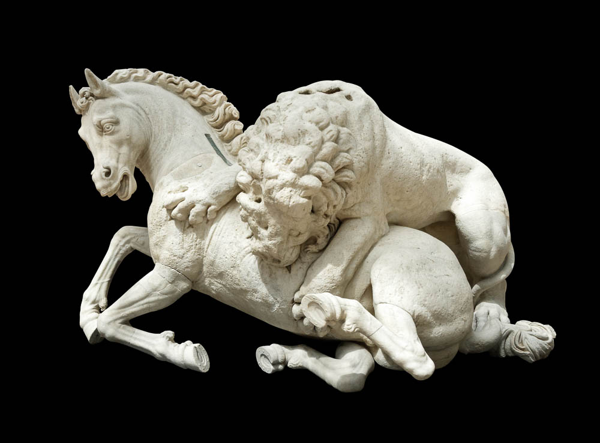



**Read/hear the portions**:
Genesis 6

**Summary**
God instructs Noah—the 10th from Adam and the only righteous man in a world consumed by violence and corruption—to build a large wooden ark, coated within and without with pitch. God decrees that a great deluge will wipe out all life from the face of the earth; but the ark will float upon the water, sheltering Noah and his family, and two members (male and female) of each animal species (and 7 of the "pure" species).

**Video**



## The Nephilim - Genesis 6:1-7 

| Genesis 6:1-2                                                                                                                                                                                   | References                                                                                                                                                           |
|-------------------------------------------------------------------------------------------------------------------------------------------------------------------------------------------------|----------------------------------------------------------------------------------------------------------------------------------------------------------------------|
| When man began to multiply on the face of the land and daughters were born to them, the sons of God saw that the daughters of man were attractive. And they took as their wives any they chose. | 2 Peter 2:4 For if God did not spare angels when they sinned, but cast them into hell and committed them to chains of gloomy darkness to be kept until the judgment; |

-   The word for “hell” in 2 Peter 2:4 is “*Tartarus*”, it is the only time the word is used in the Bible.

    -   Homer notes Tartarus is as far below hades as the earth is below heaven.

    -   Not someplace we want to be.

| Genesis 6:3                                                                                                   | References                                                                                                                                                                                                                                                                                                                                                                                                                                                                               |
|---------------------------------------------------------------------------------------------------------------|------------------------------------------------------------------------------------------------------------------------------------------------------------------------------------------------------------------------------------------------------------------------------------------------------------------------------------------------------------------------------------------------------------------------------------------------------------------------------------------|
| Then the LORD said, “My Spirit shall not abide in man forever, for he is flesh: his days shall be 120 years.” | Galatians 5:14-17 For the whole law is fulfilled in one word: “You shall love your neighbor as yourself.” But if you bite and devour one another, watch out that you are not consumed by one another. But I say, walk by the Spirit, and you will not gratify the desires of the flesh. For the desires of the flesh are against the Spirit, and the desires of the Spirit are against the flesh, for these are opposed to each other, to keep you from doing the things you want to do. |

Bolen: “Paul describes the opposition between fleshly desires and spiritual desires in terms that are almost war-like.”[^1]

<table>
<colgroup>
<col style="width: 50%" />
<col style="width: 50%" />
</colgroup>
<thead>
<tr class="header">
<th>Genesis 6:4</th>
<th>References</th>
</tr>
</thead>
<tbody>
<tr class="odd">
<td>The Nephilim were on the earth in those days, and also afterward, when the sons of God came in to the daughters of man and they bore children to them. These were the mighty men who were of old, the men of renown.</td>
<td>
Num 13:33 And there we saw the Nephilim (the sons of Anak, who come from the Nephilim), and we seemed to ourselves like grasshoppers, and so we seemed to them.”

Jude 6 And the angels who did not stay within their own position of authority, but left their proper dwelling, he has kept in eternal chains under gloomy darkness until the judgment of the great day—

Luke 17:27 They were eating and drinking and marrying and being given in marriage, until the day when Noah entered the ark, and the flood came and destroyed them all.
</td>
</tr>
</tbody>
</table>

-   A plain reading of the first four verses indicates that angelic beings, “sons of God,” descended to earth and had relations with human women, creating a half-breed race called the Nephilim.

    -   Admittedly, this is bizarre to conceptualize and awkward to discuss in polite company.

    -   Thus, several alternate theories have arisen in order to have the text mean anything other than what it actually says.

-   Peter, Jude, and likely all of the apostles, followed the plain text reading, which is also recorded in the book of 1 Enoch.

-   Nephilim means the fallen ones, as in fallen angels. Heiser covers this topic extensively in his book “The Unseen Realm.”

-   Numbers 13:33 indicates the Nephilim were giants and Jewish tradition says they committed all types of violence and sexual abominations and even became cannibals.

-   In Greek the term is gigantes, which makes us think of “giants” but the root word is actually *gigas*, which means “earth-born.”

-   Note the Nephilim were on the earth “After that.”

    -   Genesis 14, 15 Rephaim

    -   Numbers 13:33 Anakin

    -   Deut 3:11 Og, King of Bashan

    -   1 Samuel 17 Goliath (and his four brothers) the Philistine

    -   Curiously, Bashan is the Golan Heights at the foot of Mt. Hermon and Philistia was roughly where the Gaza Strip is today. These are two areas where Joshua failed to exterminate the inhabitants. (Joshua 15:14).

    -   It might make more sense why God gave the otherwise disturbing order to Joshua to wipe out every man, woman and child in Cannan.

<table>
<colgroup>
<col style="width: 50%" />
<col style="width: 50%" />
</colgroup>
<thead>
<tr class="header">
<th>Genesis 6:5-7</th>
<th>References</th>
</tr>
</thead>
<tbody>
<tr class="odd">
<td>The LORD saw that the wickedness of man was great in the earth, and that every intention of the thoughts of his heart was only evil continually. And the LORD regretted that he had made man on the earth, and it grieved him to his heart. So the LORD said, “I will blot out man whom I have created from the face of the land, man and animals and creeping things and birds of the heavens, for I am sorry that I have made them.”</td>
<td>
Rom 3:23-24 for all have sinned and fall short of the glory of God, and are justified by his grace as a gift, through the redemption that is in Christ Jesus,

Rom 7:18-19 For I know that nothing good dwells in me, that is, in my flesh. For I have the desire to do what is right, but not the ability to carry it out. For I do not do the good I want, but the evil I do not want is what I keep on doing.

Matt 24:37-39 For as were the days of Noah, so will be the coming of the Son of Man. For as in those days before the flood they were eating and drinking, marrying and giving in marriage, until the day when Noah entered the ark, and they were unaware until the flood came and swept them all away, so will be the coming of the Son of Man.
</td>
</tr>
</tbody>
</table>

-   The sages teach that Cain spread his evil throughout the earth infecting his children and everyone else with his wickedness.

    -   We need to guard the company we keep.

    -   If we associate with righteous people, we will likely be righteous ourselves.

    -   If we associate with wicked people, we will likely become corrupted.

-   Nothing has changed with the thoughts of our hearts. If we are given the opportunity to sin, the odds are high that we will. (Romans 3:23, 7:18-19).

-   That God was sorry He made man is quite a statement. Our sin grieves Him in ways we can’t imagine.

-   For Him to leave humanity unpunished would have been a miscarriage of justice, like when a jury acquits a murderer based on something other than the facts of the case.

## Noah Righteous- Genesis 6:8-13 

<table>
<colgroup>
<col style="width: 50%" />
<col style="width: 50%" />
</colgroup>
<thead>
<tr class="header">
<th>Genesis 6:8-10</th>
<th>References</th>
</tr>
</thead>
<tbody>
<tr class="odd">
<td>But Noah found favor in the eyes of the LORD. These are the generations of Noah. Noah was a righteous man, blameless in his generation. Noah walked with God. And Noah had three sons, Shem, Ham, and Japheth.</td>
<td>
2 Peter 2:5 if he did not spare the ancient world, but preserved Noah, a herald of righteousness, with seven others, when he brought a flood upon the world of the ungodly;

Lam 1:16 “For these things I weep; my eyes flow with tears; for a comforter is far from me, one to revive my spirit; my children are desolate, for the enemy has prevailed.”

1 Jn 2:1 My little children, I am writing these things to you so that you may not sin. But if anyone does sin, we have an <strong>advocate</strong> with the Father, Jesus Christ the righteous.
</td>
</tr>
</tbody>
</table>

-   Noah was the lone exception to the wickedness around him.

-   These were indeed difficult times to remain blameless.

-   Noah means comfort, comforter, or rest.

    -   His parents said, “This one will give us rest from our work and from the toil of our hands.”

    -   In other words, they expected Noah to be the Messiah.

    -   In Lamentations 1:16, the “Comforter” becomes a title of the Messiah.

    -   In 1 John 2:1, the Greek word translated as “advocate” is *paraclete*, which can also mean “comforter.”

-   Righteous and blameless do not mean sinless.

    -   Paul (Romans 3:23) and John (1 John 1:8) teach that no one is sinless other than Jesus

    -   The word for blameless denotes an animal that is acceptable for a sacrifice.

    -   They mean he had a heart to seek God and he lived his life in accordance with God’s standards of morality.

    -   Noah was a man of integrity; he was doing his job as an Image-bearer of God.

-   We can read 2 Peter 2:5 as “a preacher of righteousness.”

-   By modern standards, Noah was the least successful preacher ever. Not a single person repented.

-   Regardless of whether anyone is listening or not, godly people should stick out from the rest of the world.

-   Are you and I sticking out in a good way, or are we blending in?

-   Here is the “walking with God” phrase again.

-   Our discipleship journey is this kind of walk, path, road, or way. Hence our name Talmidim Way: the goal is for us to Walk with God along the way of disciples following after Yeshua, our great teacher.

-   Lancaster writes, “Walking with God means keeping His commandments, but it also means enjoying His company.”[^2]

    -   There are three verses in the Torah that give us more clarity on walking with God.

        -   Deuteronomy 8:6 - So you shall keep the commandments of the LORD your God by walking in his ways and by fearing him.

        -   Deuteronomy 10:12 - “And now, Israel, what does the LORD your God require of you, but to fear the LORD your God, to walk in all his ways, to love him, to serve the LORD your God with all your heart and with all your soul,

        -   Deuteronomy 11:22 - For if you will be careful to do all this commandment that I command you to do, loving the LORD your God, walking in all his ways, and holding fast to him,

-   As talmidim, let’s glue ourselves to Yeshua and enjoy the walk.

<table>
<colgroup>
<col style="width: 50%" />
<col style="width: 50%" />
</colgroup>
<thead>
<tr class="header">
<th>Genesis 6:11-13</th>
<th>References</th>
</tr>
</thead>
<tbody>
<tr class="odd">
<td>Now the earth was corrupt in God's sight, and the earth was filled with violence. And God saw the earth, and behold, it was corrupt, for all flesh had corrupted their way on the earth. And God said to Noah, “I have determined to make an end of all flesh, for the earth is filled with violence through them. Behold, I will destroy them with the earth.</td>
<td>
Luke 17:26 Just as it was in the days of Noah, so will it be in the days of the Son of Man.

Rom 6:23 For the wages of sin is death, but the free gift of God is eternal life in Christ Jesus our Lord.

Eze 33:11 Say to them, As I live, declares the Lord GOD, I have no pleasure in the death of the wicked, but that the wicked turn from his way and live; turn back, turn back from your evil ways, for why will you die, O house of Israel?
</td>
</tr>
</tbody>
</table>

-   The Hebrew word for violence here is “Hamas;” yes, as in the terrorists.

    -   In its mildest form, it can mean “unjust gain.”

        -   The rabbis build on this to say that stealing of any amount is equivalent to physical violence.

        -   If one were to steal only a few dollars, who is to say that the victim might not have invested that sum enough to leave an inheritance for his children’s children.

        -   Thus Pliskin says, “We are forbidden to steal even small amounts.”[^3] If it’s not yours, don’t take it.

    -   This includes not only physical items but with our tongues, we can also steal another’s reputation or another’s joy. Some kill by launching rockets at civilians; others kill with the tongue.

    -   Let us not do these works of Hamas.

-   God took no pleasure in what He was about to do. (Eze 33:11)

-   Ultimately, the flood is a story of mercy. He didn’t wipe out the universe and start over; He took that which was broken and fixed it.

-   This gets us to the Jewish concept of Tikkun Olam. That is Hebrew for fixing the (broken) world.

    -   In the modern sense, the term is often appropriated by left-leaning organizations; but in a Biblical sense, that is exactly what God is doing here and it’s exactly what Jesus did throughout His earthly ministry, including His death on the Cross.

    -   Tikkun Olam means restoring the world back to God’s original intent, culminating with the New Eden/New Jerusalem in Revelation 21-22.

## 

## Ark Instructions - Genesis 6:14-22 

<table>
<colgroup>
<col style="width: 50%" />
<col style="width: 50%" />
</colgroup>
<thead>
<tr class="header">
<th>Genesis 6:14-16</th>
<th>References</th>
</tr>
</thead>
<tbody>
<tr class="odd">
<td>Make yourself an ark of gopher wood. Make rooms in the ark, and cover it inside and out with pitch. This is how you are to make it: the length of the ark 300 cubits, its breadth 50 cubits, and its height 30 cubits. Make a roof for the ark, and finish it to a cubit above, and set the door of the ark in its side. Make it with lower, second, and third decks.</td>
<td>
1 Peter 3:18-20 For Christ also suffered once for sins, the righteous for the unrighteous, that he might bring us to God, being put to death in the flesh but made alive in the spirit, in which he went and proclaimed to the spirits in prison, because they formerly did not obey, when God's patience waited in the days of Noah, while the ark was being prepared, in which a few, that is, eight persons, were brought safely through water.

2Pe 2:9 then the Lord knows how to rescue the godly from trials, and to keep the unrighteous under punishment until the day of judgment,
</td>
</tr>
</tbody>
</table>

-   The rabbis ask, “why did God trouble Noah to build an ark? He could have saved Noah in many other ways.”

    -   Rashi answers that “the project was designed to arouse curiosity. For 120 years, people would be prompted to ask him, ‘Why is this necessary?’ Noah would then reply, ‘The Holy One, blessed be he, is about to bring a flood upon the world.’ Perhaps then they would repent.”[^4]

    -   “God held off judgment for 120 years in order to give people and opportunity to repent.”[^5]

    -   Pliskin continues, “From here, we learn a practical lesson about admonition. For an admonition to be successful, we must find ways to arouse the listener’s interest.”[^6]

-   Peter makes a wild statement here in 1 Pet 3:18-20 – he says it casually as if his original readers knew exactly what he was referencing. Apparently, Jesus after His death but before His resurrection visited the fallen angels of Genesis 6:1-3 and proclaimed His triumph over them.

-   Noah will model the salvation of the world that God eventually brings through Messiah.

    -   Lancaster: “Those within Messiah’s salvation (symbolized by the ark), though few in number, will pass through the cleansing waters of judgment and enter the kingdom, just as Noah and his family survived the flood and repopulated the earth.”[^7]

    -   A big difference is that Noah saved only himself and his family, while Messiah brings salvation to the whole world.

    -   The Jewish Talmud speculates on this topic:

        -   “If the Holy One, blessed be He, did miracles for Noah who was righteous but not completely righteous…how much more so if he had been a perfectly righteous man!”[^8]

-   The word translated as “roof” in the ESV is a difficulty.

    -   It could mean a window, in the sense of a skylight, but one sage believed it referred to a precious stone that would illuminate and provide light for the entire vessel.

    -   In this respect, the light can be compared to the menorah in the temple, the only source of light that symbolizes the light of Messiah.

-   Dimensions

    -   A cubit is nominally 18” but could be as much as 25”

    -   According to Missler, a 25” cubit would result in 4.1 MILLION cubic feet, the equivalent of 1400 railroad cars, enough to hold 340,000 sheep.

    -   Using a 25” cubit, the Ark could have been 625 feet long, 104 feet wide and 63 feet high, giving it a displacement of 65000 tons (the Titanic displaced 46,00 tons).[^9]

        -   The Ark replica in Kentucky is a bit more conservative, using a 20.4” cubit for 510 feet long, 85 feet wide and 51 feet high.

        -   Dad joke: Q: what does a ship weigh? A: It’s anchor. (Volume is measured in displacement, not weight).

<table>
<colgroup>
<col style="width: 50%" />
<col style="width: 50%" />
</colgroup>
<thead>
<tr class="header">
<th>Genesis 6:17-18</th>
<th>References</th>
</tr>
</thead>
<tbody>
<tr class="odd">
<td>For behold, I will bring a flood of waters upon the earth to destroy all flesh in which is the breath of life under heaven. Everything that is on the earth shall die. But I will establish my covenant with you, and you shall come into the ark, you, your sons, your wife, and your sons' wives with you.</td>
<td>
Mat 24:39-41 and they were unaware until the flood came and swept them all away, so will be the coming of the Son of Man. [40] Then two men will be in the field; one will be taken and one left. Two women will be grinding at the mill; one will be taken and one left.

Heb 11:7 By faith Noah, being warned by God concerning events as yet unseen, in reverent fear constructed an ark for the saving of his household. By this he condemned the world and became an heir of the righteousness that comes by faith.
</td>
</tr>
</tbody>
</table>

-   “Just as the people did in Noah’s day, the generation of the Master’s return will ignore the warnings.”[^10]

-   A popular end-times fiction series from the late 90s was called “Left Behind.” It imagined the world under the reign of the antichrist after all of the good Christians have been taken up.

-   More often in the bible, it is the opposite. It is not the good who are taken. The evil are taken in judgment while the good are left behind.

-   In the Flood, righteous Noah and his family are the ones “left behind.”

| Genesis 6:19-22                                                                                                                                                                                                                                                                                                                                                                                                                                                                                                                       | References                                                                                                                                                                                                                                                                                             |
|---------------------------------------------------------------------------------------------------------------------------------------------------------------------------------------------------------------------------------------------------------------------------------------------------------------------------------------------------------------------------------------------------------------------------------------------------------------------------------------------------------------------------------------|--------------------------------------------------------------------------------------------------------------------------------------------------------------------------------------------------------------------------------------------------------------------------------------------------------|
| And of every living thing of all flesh, you shall bring two of every sort into the ark to keep them alive with you. They shall be male and female. Of the birds according to their kinds, and of the animals according to their kinds, of every creeping thing of the ground, according to its kind, two of every sort shall come in to you to keep them alive. Also take with you every sort of food that is eaten, and store it up. It shall serve as food for you and for them.” Noah did this; he did all that God commanded him. | Isa 11:1,6 There shall come forth a shoot from the stump of Jesse, and a branch from his roots shall bear fruit… The wolf shall dwell with the lamb, and the leopard shall lie down with the young goat, and the calf and the lion and the fattened calf together; and a little child shall lead them. |

-   Most know the story of Noah’s Ark even if they are not Christian or Jewish.

-   Almost all of the ancient civilizations tell of a time long ago when the gods got so angry, they flood the earth to wipe out humanity except for a man and a woman who are left to repopulate the world.

-   In our children’s stories, we often picture a boat overflowing with animals and the giraffe is always sticking his head out of the roof.

-   The Flood is not a harmless children’s story – life was brought to the point of near extinction.

-   We will see a footnote later that there are seven of every clean animal, which begs the question, “how did Noah know which animals were clean?”

-   That all of the animals were made to live peaceably, including we presume natural predators of other animals, speaks of the shalom of the messianic age.

-   A traditional Jewish Rabbi said of that era: “There will be neither famine nor war, neither envy nor competition, for good things will flow in abundance.”[^11]

The wicked versus the righteous.

Pro 15:8-10

The sacrifice of the wicked (Cain) is an abomination to the LORD,

but the prayer of the upright (Noah) is acceptable to him.

The way of the wicked (Cain) is an abomination to the LORD,

but he loves him (Noah) who pursues righteousness.

There is severe discipline for him (Cain) who forsakes the way;

whoever hates reproof will die.

[^1]: Todd Bolen, “Galatians 5” (PowerPoint presentation, Santa Clarita, CA, 2018), 86.

[^2]: D. Thomas Lancaster, *Unrolling the Scroll*, ed. Boaz Michael and Seth Dralle, 2nd ed., vol. 1, Torah Club 1 (Marshfield, MO: First Fruits of Zion, 2014), 28.

[^3]: Zelig Pliskin, *Love Your Neighbor:* (Brooklyn, New York: Bnay Yakov Publications, 2004), 36.

[^4]: Pliskin, 38.

[^5]: Lancaster, *Unrolling the Scroll*, 1:29.

[^6]: Pliskin, *Love Your Neighbor:*, 37–38.

[^7]: Daniel T. Lancaster, *Shadows of the Messiah*, ed. Boaz D. Michael and Steven P. Lancaster, 3rd ed., vol. 4, Torah Club 3 (Marshfield, MO: First Fruits of Zion, 2015), 35. Lancaster is expounding on 2 Peter 2:9.

[^8]: Lancaster, 4:34 quoting Midrash Tanchuma, Noach 9.

[^9]: Chuck Missler, *Genesis: An Expositional Commentary (Supplemental Notes)* (Coeur d’Alene, ID: Koinonia House, 2004), 146.

[^10]: Lancaster, *Shadows of the Messiah*, 4:35.

[^11]: Lancaster, 4:37. Lancaster is quoting Menachem Schneerson.

 

