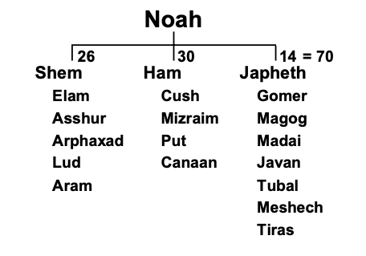
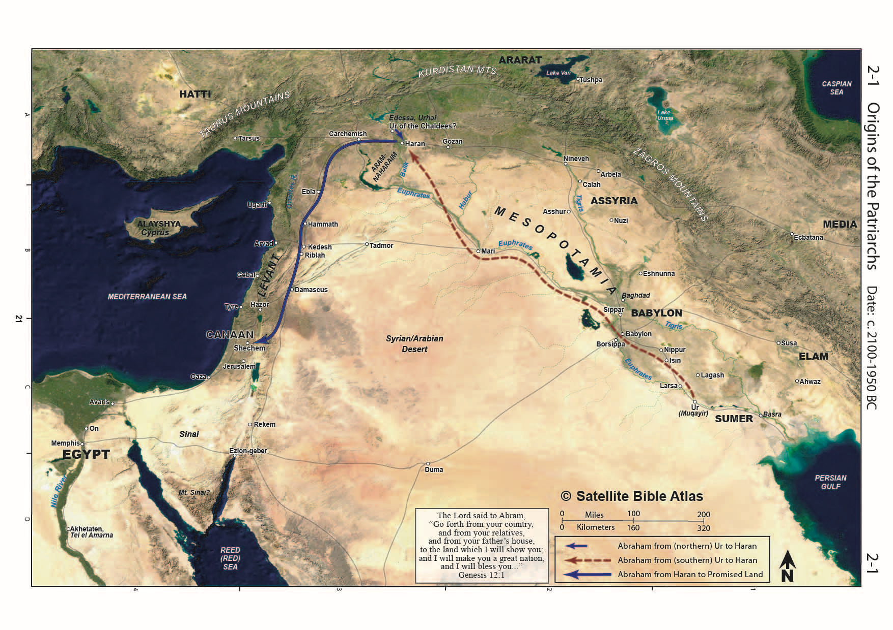
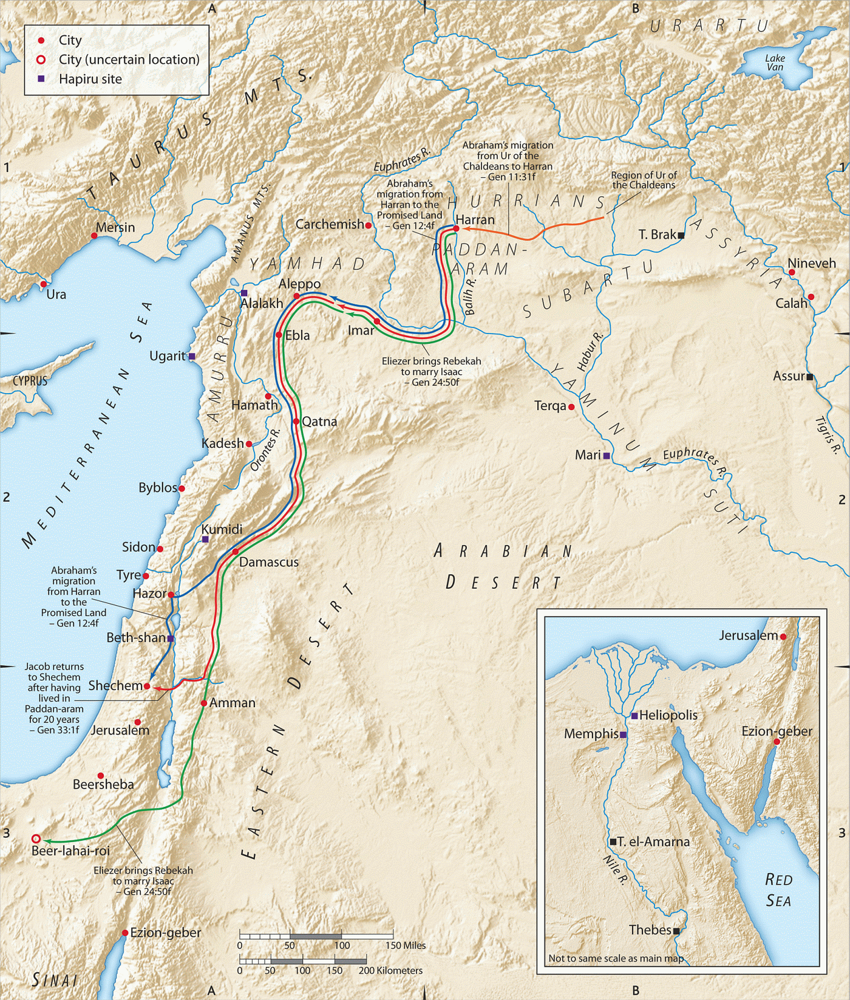

---
title: Genesis 10 and 11
author: chris_flanagan
date: '2023-01-26'
slug: gen10
categories:
  - Genesis
tags: []
linktitle: 10 Table of Nations Babel
subtitle: ''
summary: <describe the Lesson>
authors: []
lastmod: '2022-01-11T16:41:23-06:00'
featured: no
type: book
weight: 100
---  


 



## Introduction

This will be our final lesson on what we refer to as the “pre-history” section of Genesis. This is a bit of a misnomer as we have plenty of history, but the end of chapter 11 marks a (perhaps THE) major turning point in the book. In chapter 12, the attention shifts to one man, Abraham, and the rest of the Bible will be about Abraham’s descendants and heirs by adoption.

Genesis 10 and 11 are best read as a single narrative. It’s a genealogy of Noah’s three sons, with specific “interruptions” to let the reader know of noteworthy details.

-   10:1 Noah’s genealogy begins.

-   10:8-12 – an interruption in the genealogy for details on Nimrod

-   10:18-19- an interruption to provide details on the Canaanites

-   10:21 – interruption to remind the reader that Shem is the father of Eber, several generations later (Shem, Arphaxad, Salah, Eber)

-   10:25 – interruption to tell us the earth was divided in the days of Peleg

-   10:30 – interruption to tell us the borders of Joktan

-   11:1-9 – interruption to tell us about the Tower of Babel incident

-   11:27 – the genealogy of Shem concludes

-   11:28-32 – Transition to Abram’s narrative and segue to chapter 12

## Gen 10:1 Noah’s three sons

> These are the generations of the sons of Noah, Shem, Ham, and Japheth. Sons were born to them after the flood.

-   VERY IMPORTANT: As Walton says in his commentary, “there is no attempt (in the text) to link these peoples to racial divisions.”

    -   Verse five tells us the focus is describing the peoples in terms of language, clan (family groups), and nationality.

    -   Genesis 10 is called the table of nations (not the table of races); divisions along race are just that, divisions.

    -   We know who it is who likes to keep us divided. Satan

    -   We are all one race, that of Noah.

    -   Even to say this is a division among “ethnicities” becomes a problem because as the centuries pass, the ethnic lines become intermingled.

    -   In fact, I like the word “clan” as the ESV uses in verse 5. A tribe or nation as used by Native Americans is also a good mental picture.

        -   These names aren’t races or ethnicities as much as they are family groups.

    -   Today people who appear to be white Europeans can actually be members of the Choctaw or Cherokee nation by virtue of family connections.

    -   For another example, my last name is “Flanagan.”

        -   Although this is a distinctively Irish surname, it would be an error to look at my last name and conclude I’m 100% Irish.

        -   It would also be an error to look at my last name and assume my nation is Ireland.

        -   As people marry and move, things change over time, but the male’s family name (usually) stays the same.

        -   I could rightfully join the Clan of Flanagan by virtue of my name.

-   The Bible’s focus is on the clans of the Ancient Near East: northern Africa, Syria-Palestine, and Mesopotamia.

-   We take it on faith that the other people groups (east and south Asia, Europe, southern Africa, indigenous peoples of north and south America) came from one of the descendants of Shem, Ham, or Japheth, or perhaps a co-mingling; but, these peoples are not enumerated in the Bible.

-   The Divine Narrator/Author lists 70 names here; this will be later contrasted against the number of Jacob’s family that will enter Egypt in Gen 46.

    -   Some of these names may be the names of tribes or nations rather than specific individuals – we can’t know for sure.

-   From these and other references (such as the 70 elders in Exodus 24), 70 is said to be symbolic of totality or depending on the context, the totality of the *gentile* nations (with 12 later becoming the number of Israel).

    -   In Hebrew, the word “goyim” means both “nations” and “gentiles”

    -   As we go through the Bible, we’ll find that Israel is not one of the nations; Israel is to be set apart from the gentile nations.

> 

## Gen 10:2-5: The Line of Japheth

> The sons of Japheth: Gomer, Magog, Madai, Javan, Tubal, Meshech, and Tiras. The sons of Gomer: Ashkenaz, Riphath, and Togarmah. The sons of Javan: Elishah, Tarshish, Kittim, and Dodanim. From these the coastland peoples spread in their lands, **each with his own language, by their clans, in their nations.**

-   Based on what we know, the descendants listed of Japheth do not share contiguous land borders but are connected on the basis of being by the sea.[^1]

    -   Verse 5 “coastland peoples” (ESV), or “maritime peoples” (NIV)

-   As the biblical stage unfolds, we will see the main conflict is primarily going to be between the peoples of Ham and Shem. We might think of Japheth as seated in the audience around the stage taking it all in (for the most part):

    -   On the map, Asia Minor (Tubal, Meshech, and Togarmah = Turkey), the Greek Islands, Cyprus, The steppes of Russia (along the Black Sea), Persia (Afghanistan, Iran), although Elam which is usually associated with Persia is listed under Shem. Madai = Medes.

    -   Some suggest “Riphath” and “Europe” are linguistically connected.

    -   Tarshish is the one that puzzles scholars

        -   Possibly along the west coast of Turkey, at least at one time.

            -   The city is referenced many times in the Old Testament

            -   It is arguably most famous for being the intended destination of Jonah; when he was told to preach in Ninevah, he wanted to go in the opposite direction as far away as possible

            -   A Turkish city up the coast from Joppa in the same general direction as Ninevah doesn’t fit the text.

        -   Some suggest Tarshish is related to a word for “tin,” which makes some people think of Britain (or perhaps Britain by way of Spain).

        -   (Don’t confuse Tarshish with Tarsus, the name of Paul the Apostle’s home town)

    -   Ashkenaz is another curious name as it later comes to denote European Jews.

        -   You may hear the term, “Ashkenazi Jews”

        -   Jews, being a Semitic people, come from Shem, not Japheth

        -   The name probably came from the fact that there were Jews from Shem in the European lands once settled by Ashkenaz from Japheth.

        -   Most Jews in America are Ashkenazi because their fathers and grandfathers came from Europe

        -   Jews from Spain or Africa are typically “Sephardic Jews”

## Gen 10:6-20 The Line of Ham

> The sons of Ham: Cush, Mitzraim, Put, and Canaan. The sons of Cush: Seba, Havilah, Sabtah, Raamah, and Sabteca. The sons of Raamah: Sheba and Dedan.

-   Where was Japheth spread far and wide, Ham stayed close by – Egypt and northern/eastern Africa, Arabia, Mesopotamia, and Syro-Palestine).

-   Mitzraim is a somewhat unusual Hebrew dual form – perhaps in reference to upper (southern) and lower (northern) Egypt

### Gen 10:8-12 Nimrod and Babylon

> Cush fathered Nimrod; he was the first on earth to be a mighty man. He was a mighty hunter before the LORD. Therefore it is said, “Like Nimrod a mighty hunter before the LORD.” The beginning of his kingdom was Babel, Erech, Accad, and Calneh, in the land of Shinar. From that land he went into Assyria and built Nineveh, Rehoboth-Ir, Calah, and Resen between Nineveh and Calah; that is the great city.

-   The brief narratives are unusual for ancient genealogies; however, these all focus on people and land areas that will later be significant (Babylon, Ninevah, Sidon, Sodom).

    -   Also the verb changes in verse 8

        -   Usually in Chapter 10: “the sons of … were…”

        -   10:8, 13, 15, 21, 25-26: “… begat/fathered …” – a clue that something is changing with this guy Nimrod.

    -   As it turns out, when the Hebrew word for “begat” is used with Ham, these are the tribes/families designated for cursing.

    -   When “begat” is used with Shem, those descendants receive blessings, which will begin in Genesis chapter 12.

-   Chuck Missler sums up Nimrod:

Nimrod was responsible for the Tower of Babel. It was he who attempted to bring together the human race after the Flood in an effort to get them united into a nation in which he could become the great world ruler. He was the rebel, the founder of Babel, and the hunter of the souls of men. He was the lawless one, and he is a shadow or a type of the last world ruler, the Antichrist who is yet to appear. The first great civilization, therefore, came out from the sons of Ham. – Chuck Missler[^2]

-   Nimrod “before” the LORD

    -   The Hebrew word for “before” is liphnei and it literally means “in the face of” the LORD

        -   It can have a plain rendering of before the LORD, like you and I might show some important person the proper degree of respect.

        -   It can also have a nuanced meaning, the way we think of it when we say someone got in the face of someone else

        -   Most conservative translators render this with a nuanced meaning.

        -   The Christian Hebrew linguist Franz Delitzsch says this: “Nimrod was mighty in hunting, and that in opposition to (the LORD) not *before* in the sense of according to the purpose and the will of (the LORD), (which is) irreconcilable with the context. The name Nimrod, from מָרַד, “we will revolt,” points to some violent resistance to God.”[^3]

-   Traditions involving Nimrod:

    -   the originator of idolatry

    -   the first world-dictator

    -   Nimrod begat the line of the Pharohs

    -   the builder of the Tower of Babel (Bab-El gateway to G/god)

    -   Pagan tradition even ascribes to him supernatural beginnings

    -   We know he founded Babylon and we can infer he had a kingdom of some significance, but the Author doesn’t tell us who spearheaded the Babel building project.

    -   Regarding his divinity, according to the Bible, “Nimrod is clearly a human hero rather than divine or semi-divine.”[^4]

    -   Lancaster writes, “Just as we regard Abraham as the father of our faith, we can regard Nimrod as the father of idolatry.”[^5]

-   According to Walton, the description given in verses 8-12 “corresponds to the growth of the first known empire in history, the dynasty of Agade ruled by Sargon (about 2300 BC). Nimrod’s kingdom included Erech, the city where Gilgamesh reigned and one of the oldest and greatest centers of Sumerian culture.”[^6]

### Gen 10:13-20 Mitzraiym (Egypt)

> Mitzraiym **fathered** Ludim, Anamim, Lehabim, Naphtuhim, Pathrusim, Casluhim (from whom the Philistines came), and Caphtorim.

-   In some manuscripts, the Philistines are listed separately; the ESV here follows the majority opinion that the Philistines came from Casluhim.

### Gen 10:15-18 Canaan and the “ites”

> Canaan fathered Sidon his firstborn and Heth, and the Jebusites, the Amorites, the Girgashites, the Hivites, the Arkites, the Sinites, the Arvadites, the Zemarites, and the Hamathites. **Afterward the clans of the Canaanites dispersed.**

-   Heth probably refers to Hittites, a formidable empire from 1600-700 BCE with it’s principal city Carchemish.

    -   Esau would later marry into the tribe of Hittites.

-   Some link the “Sinites” to far-east Asia (sino- is a prefix meaning China)

-   Apparently there was a lot of inter-mingling of Canaan after they dispersed.

-   Canaanites later become *ethnically* identified as Semitic peoples, but here the origin is the family of Canaan from Ham.

-   Note the Jebusites, as they will be the ones in control over Jerusalem at the time of Saul and David.

-   Sidon is loosely synonymous with Lebanon

-   Remember, geographic boundaries and names change over time.

### Gen 10:19-20: Canaanite Boundaries

> And the territory of the Canaanites extended from Sidon in the direction of Gerar as far as Gaza, and in the direction of Sodom, Gomorrah, Admah, and Zeboiim, as far as Lasha. These are the sons of Ham, by their clans, their languages, their lands, and their nations.

## Gen 10:21-32 Shem – Abraham’s Line

### Gen 10:21-22

-   Shem goes last because he’s the one the Author wants us to focus on and remember.

> To **Shem** also, the father of all the children of Eber, the elder brother of Japheth, children were born. The sons of Shem: Elam, Asshur, **Arpachshad**, Lud, and Aram. The sons of Aram: Uz, Hul, Gether, and Mash.

-   “The father of the children of Eber” is the author’s way of saying, “Head’s up; this is YOUR ancestral line.”

    -   “Hebrew” and “Eber” are linguistically related.

-   These are big-time players on the world stage: Elam = Persia/Iran; Asshur = Assyria; Aram = Arameans

    -   Asshur was the capital of Assyria from 2025-879 BCE (If you’re wondering about the answer to a trivia question posed in a certain Monty python movie. Although the bridge keeper asked, “what IS the capital of Assyria?” In AD 932, Assyria ceased to exist. It sounds like a trick question all the way around. Not that it mattered to Brave Sir Robin.)

-   We’ll bold Abraham’s forefathers (see also Luke 3).

### Gen 10:24-25: Arphaxad

> Arpachshad fathered **Shelah**; and Shelah fathered **Eber**. To Eber were born two sons: the name of the one was **Peleg**, for in his days the earth was divided, and his brother's name was Joktan.

-   The “days when the earth was divided” is often assumed to be a reference to the Tower of Babel incident, but we aren’t told this.

-   It potentially could reference some other significant event such as famine before the Tower that triggered a drastic migration of people.

-   Perhaps this event is referenced in Genesis 11:2: “And as people migrated from the east, they found a plain in the land of Shinar and settled there.”

### Gen 10:26-31: Joktan

> 26 Joktan fathered Almodad, Sheleph, Hazarmaveth, Jerah, Hadoram, Uzal, Diklah, Obal, Abimael, Sheba, Ophir, Havilah, and Jobab; all these were the sons of Joktan. The territory in which they lived extended from Mesha in the direction of Sephar to the hill country of the east. These are the sons of Shem, by their clans, their languages, their lands, and their nations.

-   Sheba

    -   Determining people groups is further complicated by the fact that more than one person had the name “Sheba,” who is also mentioned as a son of Ham in verse 7.

    -   Sheba (and Dedan, a son of Ham) are generally considered associated with the Arabian peninsula, as are Ophir and Havilah.

    -   Some suggest the two Shebas are the same person because of intermingling between the tribes of Shem and Ham.

    -   Arabs are very much Semitic peoples as they are not just sons of Shem, but sons of Abraham.

### Gen 10:32 Conclusion

> These are the clans of the sons of Noah, according to their genealogies, in their nations, and from these the nations spread abroad on the earth after the flood.

-   The Author reminds His readers that all families came from Noah, but we get more detail on those families that were of unique interest to Israel by using the word “begat” instead of “the sons of…”

## Gen 11:1-9: The Tower of Babel

> 1 Now the whole earth had one language and the same words.

-   Based on the names in the genealogies, many scholars conclude the one language was likely Hebrew. The names listed in Genesis 5, 10, and 11 all have meaning in Hebrew.

-   According to Walton, “Many features of this account point to the end of the fourth millennium (\~3000 BCE) as the setting of the narrative.”[^7]

> 2-4 And as people migrated from the east, they found a plain in the land of Shinar and settled there. And they said to one another, “Come, let us make bricks, and burn them thoroughly.” And they had brick for stone, and bitumen for mortar. Then they said, “Come, let us build ourselves a city and a tower with its top in the heavens, and let us make a name for ourselves, lest we be dispersed over the face of the whole earth.”

-   Shinar is in the lower region of the Tigris-Euphrates basin, possibly equivalent to ancient “Sumer.” Ur was one of the principal cities in this area but there was also an Ur much further up river.

-   When they say “lest we be scattered” they probably are not thinking of a judgment directly, but likely the life of a nomad, moving from place to place to survive in response to drought, flooding or famine.

-   Bringing people to live closer to an urban area would be something that prevents scattering. All the necessary services, including religious temples, would be nearby.

    -   People living in proximity would enable economies of scale such as “large-scale irrigation and excess grain production.”[^8]

    -   Another way to look at it is through urbanization people didn’t need to rely on the gods to meet their needs.

    -   The life of Abraham will be the opposite of this. Abraham is frequently on the move, relying on God to direct his steps. Sometimes he succeeds and other times he fails. We’ll get to that in the next few lessons.

    -   While urbanization sounds practical, we are reminded that God’s instructions were to multiply and fill the earth, not congregate in one location.

-   In English, it might be easy to come away thinking, “they wanted to build a tall building. What’s the problem with that?”

-   God’s response makes it clear this was a religious temple built as act of pride and arrogance.

    -   If we take the traditions and legends about Nimrod and combine them with the biblical text that tells us he was in defiance of the Lord, we can presume Nimrod founded a dictatorship that was anti-God.

    -   They wanted to make a name for themselves.

    -   Thus the tower is a way of saying, “we can ascend to heaven on our own, without You, God.”

    -   The thing they were afraid of is what came to pass – being dispersed over the earth.

> 5-9 And the LORD came down to see the city and the tower, which the children of man had built. And the LORD said, “Behold, they are one people, and they have all one language, and this is only the beginning of what they will do. And nothing that they propose to do will now be impossible for them. Come, let us go down and there confuse their language, so that they may not understand one another's speech.” So the LORD dispersed them from there over the face of all the earth, and they left off building the city. Therefore its name was called Babel, because there the LORD confused the language of all the earth. And from there the LORD dispersed them over the face of all the earth.

-   There’s a bit of a pun in “God came down to see”

    -   A ziggurat was built so the people could climb up to see the gods and, conversely, the gods could come down to see the people in order to bless them and be worshipped by them.

    -   God came down alright but not in the way they were thinking. And I doubt he needed to take the stairs.

-   From this point forward, Babylon represents those in opposition to the one true God.

-   Isaiah 13,14 and Jeremiah 50,51 talk about the doom and destruction of Babylon in terms “like Sodom and Gomorrah.” Revelation 17 and 18 tell us of Babylon’s final end.

-   Those who rebel against God will be dispersed but God is longing to bring us together as one family. When He gathers us in, it will be on His terms.

-   “And then he will send out the angels and gather his elect from the four winds, from the ends of the earth to the ends of heaven.” (Mar 13:27)

### Love Your Neighbor: Be Interpersonal Bereans

“We should not condemn people without a proper investigation.” – Rabbi Pliskin[^9]

God, of course, did not need to come down from Heaven to see the wickedness.

Pliskin notes that the Bible describes God’s personal investigation into the Tower of Babel matter.

This was to teach us that we should not condemn based on hearsay or circumstantial evidence, but form conclusions based only on what we can prove. “We must view a person favorably unless we have carefully investigated the matter and have established beyond a doubt that he is guilty.”[^10]

We focus on being Bereans when it comes to Bible study. We need to be Bereans with each other as well.

-   Give others the benefit of the doubt unless you also “came down to see” it for yourself.

-   “I, therefore, a prisoner for the Lord, urge you to walk in a manner worthy of the calling to which you have been called, with all humility and gentleness, with patience, bearing with one another in love, eager to maintain the unity of the Spirit in the bond of peace.” (Eph 4:1-3)

### Babylon vs. Jerusalem

-   Missler often quips that the Bible is a tale of two cities, Jerusalem and Babylon, and here we see the beginning of Babylon.

-   We know from our Revelation study that Babylon will be the center of the kingdom that rises in opposition to God

-   Whether this is literal Babylon on the banks of the Euphrates, or a spiritual Babylon on the banks of the literal Thames, Hudson, or Potomac, or somewhere else we aren’t sure.

-   In any case, Revelation depicts the person we know as the Antichrist ruling Babylon

-   Taking the combination of what we know from the Bible and taking into account the tradition, it makes sense to consider Nimrod a foreshadowing of the Antichrist figure.

    -   First and Last world dictators

    -   Babylon rises and falls

    -   Mankind rises in defiance of the LORD

-   There are also references in Isaiah 10, 14, and Micah 5 to “The Assyrian” and this becomes another name for the Antichrist. What was the capital of Assyria when the prophets were writing? Ninevah (705-612 BCE). Who founded Ninevah? Nimrod.

## Gen 11:10-26 Shem’s descendants to Abraham

> These are the generations of Shem. When Shem was 100 years old, he fathered Arpachshad two years after the flood. And Shem lived after he fathered Arpachshad 500 years and had other sons and daughters. When Arpachshad had lived 35 years, he fathered Shelah. And Arpachshad lived after he fathered Shelah 403 years and had other sons and daughters. When Shelah had lived 30 years, he fathered Eber. And Shelah lived after he fathered Eber 403 years and had other sons and daughters. When Eber had lived 34 years, he fathered Peleg. And Eber lived after he fathered Peleg 430 years and had other sons and daughters. When Peleg had lived 30 years, he fathered Reu. And Peleg lived after he fathered Reu 209 years and had other sons and daughters. When Reu had lived 32 years, he fathered Serug. And Reu lived after he fathered Serug 207 years and had other sons and daughters. When Serug had lived 30 years, he fathered Nahor. And Serug lived after he fathered Nahor 200 years and had other sons and daughters. When Nahor had lived 29 years, he fathered Terah. And Nahor lived after he fathered Terah 119 years and had other sons and daughters. When Terah had lived 70 years, he fathered Abram, Nahor, and Haran.

-   The Narrator is gradually drawing us in from all the families on the earth, to one family: Abraham.

-   This list gets a little murky as we have a Nahor named after his grandfather.

-   In describing Jesus’ line through Abraham and back to Adam, Luke 3:36 mysteriously adds a “Cainan” between Shelah and Arphaxad.

    -   This could be a copyists error

    -   It is noteworthy that when Hebrew says “the father of”, it doesn’t have to mean the person of the immediately preceding generation.

    -   Grandfathers and great-great-great grandfathers could all be said to be the father of someone.

## Gen 11:27-28 Terah’s line

> 27 Now these are the generations of Terah. Terah fathered Abram, Nahor, and Haran; and Haran fathered Lot. Haran died in the presence of his father Terah in the land of his kindred, in Ur of the Chaldeans.

-   There are two candidates for Ur, which is where Abram lived.

-   Walton notes that at the time of the setting of the story the Chaldeans were settled primarily in northern Mesopotamia. This Ur is not far from Haran and is possibly slightly more likely as the trip between the two cities is more manageable.

    -   Another reference to Abraham’s home is “Paddan Aram,” which would line up with a northern location of Ur.

-   Depending on when this was written, the Chaldeans had migrated south, and in fact, Chaldea becomes a synonym of Babylon (Jeremiah 50:10, 51:24, and particularly Ezekiel 23:15: “…a likeness of Babylonians whose native land was Chaldea.”

-   As the southern Ur was a famous Sumerian city, Walton speculates that “Ur of the Chaldees” is possibly the northern city, since the southern city would have just been known as “Ur.”

    -   The upper map is from the Satellite Bible Atlas, where Dr. Schlaegel holds to the southern Ur location.[^11]

    -   The lower map is from the Moody Bible Atlas, where Dr. Beitzel holds to a norther Ur location.[^12]

    -   Good scholars can disagree!

> 
>
> And Abram and Nahor took wives. The name of Abram's wife was Sarai, and the name of Nahor's wife, Milcah, the daughter of Haran the father of Milcah and Iscah. Now Sarai was barren; she had no child. Terah took Abram his son and Lot the son of Haran, his grandson, and Sarai his daughter-in-law, his son Abram's wife, and they went forth together from Ur of the Chaldeans to go into the land of Canaan, but when they came to Haran, they settled there. The days of Terah were 205 years, and Terah died in Haran.

-   Nahor is going to be a name to remember since he turns out to be the grandfather of Rebekah and Laban.

    -   Rebekah will marry Abraham’s son Isaac

    -   Laban has two daughters Rachael and Leah, who will marry Jacob and produce the 12 tribes; Laban will be a source of grief for Jacob.

    -   All of this is going to take place in Haram, or you might see the name “Padan Aram” which is the name of the general region around Haran.

-   We need to think like an ancient – the narrative is flowing along with a list of names and them BOOM! We have a big problem. Sarai was barren; she had no child.

    -   Abram is supposed to be the hero yet for a moment it looks like his line will end. Also, since the command from God was to be fruitful and multiply, barrenness was seen as a judgment from God.

    -   Of course they knew the rest of the story just as we do but the drama would have been palpable.

-   Acts 7 adds an interesting tidbit

    -   Genesis doesn’t tell us that it was GOD who told the family to set out from Ur of the chaldeans, but acts 7:2-3 says the Glory of God appeared to him.

    -   This is great example of how the old and new testaments are really one book

    -   There’s also an aspect of Abraham from Acts that we can miss.

    -   In Acts, God told Abraham to go from Ur to the land of Canaan, yet Abraham stopped in Haran. Was this a lack of faith? Canaan is a long way away.

    -   It gives new meaning to the word “settled”, which in English is a fantastic pun.

        -   They settled in harah, meaning they stopped and live there for a while

        -   They also settled FOR haran, meaning God had more in store for Abraham but Abraham settled for something less.

Bibliography

Beitzel, Barry J. *The New Moody Atlas of the Bible*. New edition. New York: Moody Publishers, 2009.

Keil, C.F., and Franz Delitzsch. *Commentary on the Old Testament in Ten Volumes*. E-Sword version. Grand Rapids, MI: William B. Eerdmans Publ., 1986.

Lancaster, Daniel T. *Depths of the Torah*. Edited by Boaz D. Michael and Steven P. Lancaster. 2nd ed. Torah Club. Marshfield, MO: First Fruits of Zion, 2017.

Missler, Chuck. *Genesis: An Expositional Commentary (Supplemental Notes)*. Coeur d’Alene, ID: Koinonia House, 2004.

Pliskin, Zelig. *Love Your Neighbor:* Brooklyn, New York: Bnay Yakov Publications, 2004.

Schlegel, William. *The Satellite Bible Atlas*. Israel: William Schlegel, 2013.

Walton, John H., Victor H. Matthews, and Mark W. Chavalas. *The IVP Bible Background Commentary: Old Testament*. (E-Sword). Downers Grove, Ill: IVP Academic, 2000.

Youngblood, Ronald. *Nelson’s New Illustrated Bible Dictionary*. E-Sword., 1995.

[^1]: Ronald Youngblood, *Nelson’s New Illustrated Bible Dictionary*, E-sword, 1995.

[^2]: Chuck Missler, *Genesis: An Expositional Commentary (Supplemental Notes)* (Coeur d’Alene, ID: Koinonia House, 2004), 164.

[^3]: C.F. Keil and Franz Delitzsch, *Commentary on the Old Testament in Ten Volumes*, E-sword version. (Grand Rapids, MI: William B. Eerdmans Publ., 1986), loc. Gen 10:9. CF note: the authors then go into a lengthy and detailed defense of this position from the Biblical Hebrew, which is worth reading for anyone who is interested in the topic.

[^4]: John H. Walton, Victor H. Matthews, and Mark W. Chavalas, *The IVP Bible Background Commentary: Old Testament*, (E-Sword) (Downers Grove, Ill: IVP Academic, 2000), loc. Gen 10:8-12.

[^5]: Daniel T. Lancaster, *Depths of the Torah*, ed. Boaz D. Michael and Steven P. Lancaster, 2nd ed., Torah Club (Marshfield, MO: First Fruits of Zion, 2017), 78.

[^6]: Walton, Matthews, and Chavalas, *The IVP Bible Background Commentary*, loc. Gen 10:8-12.

[^7]: Walton, Matthews, and Chavalas, loc. Gen 11:8.

[^8]: Walton, Matthews, and Chavalas, loc. Gen 11:4.

[^9]: Zelig Pliskin, *Love Your Neighbor:* (Brooklyn, New York: Bnay Yakov Publications, 2004), 42.

[^10]: Pliskin, 43.

[^11]: William Schlegel, *The Satellite Bible Atlas* (Israel: William Schlegel, 2013), Map 2.1 Origins of the Patriarchs.

[^12]: Barry J. Beitzel, *The New Moody Atlas of the Bible*, New edition (New York: Moody Publishers, 2009), Map 30: Migrations and Wanderings of the Patriarchs.

