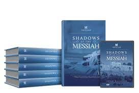



**Videos**

Introductory Bible Study Thoughts:



Genesis 1:1:



# Genesis Background and 1:1

## Acts 17:11

> Now these Jews were more noble than those in Thessalonica; they received the word with all eagerness, examining the Scriptures daily to see if these things were so.[^1]

We will begin every study with Acts 17:11. This verse is paramount for two reasons:

1.  I and every other commentator am human. I will of course make every attempt to be faithful and reliable, but we all have our biases, blind spots, and faulty conclusions. For this, I apologize in advance!

2.  The Biblical model is to “trust but verify” - it is up to you, the reader, to do your diligence and make sure the facts and conclusions any commentator asserts are scriptural.

### Blessing for Torah Study

As Dr. Parsons writes, “it is customary to recite a blessing before engaging in the study of Torah”[^2] so let’s do this now: This is an abbreviation of a prayer said in the synagogue before studying Torah.

> Blessed are you, LORD God, King of the universe who sanctifies us and commanded us to immerse ourselves in the words of Torah. Lord, please sweeten the words of your Torah in our mouths. Blessed are you Lord, giver of the Torah. Amen

### Challenges with any Bible Study

Our primary obstacle to a complete comprehension of the biblical texts is that we are separated by time and distance.

**TIME**
: These events happened 2000 years ago, and often referenced events that happened a thousand years before that

**DISTANCE**
: Israel is around 7000 nautical miles away from the central United States.
: For the most part, Israel has a very different geography and climate than what many of us are used to in North America.

It can be surprising how big of a role geography can have on the biblical narratives.

To bridge these gaps, Talmidim Way synthesizes several published messianic Jewish, cultural, and geographic commentaries/Bible atlases, as well as extra-biblical documents and archaeology findings. A list of the references we will be using specifically for our backgrounds studies in Genesis is discussed in the next section.

I start every new study with a review of other terms we need to be familiar with.

**Anachronism /Anachronistic Fallacy**

: Misappropriation of concepts and ideas in time

**Presuppositions**

: Our set of beliefs we bring with us as we read the text

**Eisegesis**

: Inserting concepts INTO the Text.

These concepts are generally influenced by our presuppositions.

**Exegesis**

: Extracting concepts FROM the Text

For example, it is often assumed that Jesus, Paul, and other gospel writers preached a new gentile religion. This is a **presupposition**.

When we read the Old Testament, we often subconsciously apply this filter. As we read the text, we may find ourselves saying something along the lines of “that was for the Jews only, it’s not for us today because Jesus did away with the Law.” This is **eisegesis.**

The problem is that, historically, the Jewish-Gentile split among followers of Jesus did not occur until the very late 1st century at the earliest and more probably occurred gradually between the 2nd and 4th centuries. Paul continued to keep Torah well after his Damascus Road experience. Therefore, our presupposition is faulty because it is an **anachronistic fallacy**. The concepts we inserted into the text are flawed.

To be sure, many parts of the law are only for Jews and not gentile believers in Jesus, but possibly not as much as we might think. The historical truth is this:

> The Torah is a Jewish document that was taken VERY SERIOUSLY by the early church, which was a sect of Jews that operated wholly under the umbrella of Judaism of their time. To best understand what Moses was communicating, we need to view the words through this lens and let the text speak to us (Exegesis).

We ALL have presuppositions, and some amount of eisegesis is unavoidable. After all, we are humans with thoughts, emotions, and biases, it is nearly impossible to completely eliminate eisegesis as we read the biblical texts.

For example, I’m assuming most of us are approaching the early chapters of Genesis as followers of Jesus from a conservative, evangelical, or fundamentalist branch of the faith who place a high degree of confidence in the accuracy of the accounts given, particularly in Genesis 1-11. Evangelicals are bringing this presupposition with them and therefore, are going to have less issue with a seven-day creation as the Bible describes it than Someone from a more liberal Christian tradition, who is more likely to view these chapters allegorically. A person who is brand new to the faith might not have made up his or her mind on whether the narrative is historically reliable. Someone who has lived life with an evolutionary/secular humanist worldview is likely to treat the opening chapters as nothing more than fanciful myths and legends.

The best course of action is to realize and accept when we are inserting things into the text that are not written and perform Acts 17:11 due diligence on the applicable concept/conclusion.

Exegesis is what we strive for. We must perform Acts 17:11 due diligence and make sure these concepts are consistent with the remainder of Scripture, and to the extent possible, consistent with what the original audience would have understood the narrative to mean. To help 21st-century mainstream Christians with this context is precisely why the ministry of Talmidim Way exists!

## References used

-   Our goal is to peer into some cultural, historical, and geographical backgrounds, which in the case of Genesis means referencing several Messianic and Traditional Jewish commentaries as well as mainstream Christian discussions.

-   Our primary reference will be the Bible, particularly any New Testament cross-references and allusions. Genesis is quoted over 200 times in the New Testament.

-   The first two commentaries are Jesus centered Messianic Jewish commentaries

    -   Shadows of the Messiah reviews Jewish literature and calls out different points in the text where the Jewish sages commented that the verse spoke of or alluded to messiah.

    -   Unrolling the Scroll is an overview commentary of the Torah

-   Love your Neighbor is a traditional Jewish text that examines verses in the Torah that have an application to Leviticus 19:18 and the command to Love your neighbor as yourself, a command that should be very important to us as disciples of Jesus.

-   Of course, no bible study of mine would be complete without maps. Where applicable, we’ll bring in maps from the Satellite Bible Atlas – this will be more applicable when we get to Abraham’s Journey’s in Chapter 12

-   I’ll also have a few other miscellaneous commentaries from Chuck Missler, Keren Pryor (wife of the late Dwight Pryor), and John Parsons who has a terrific website called hebrew4christians.com.

## Introduction to the Old Testament

### How is the Hebrew Bible different from our Old Testament?

-   The Hebrew Bible (the Bible used by the Jewish community) has the same books as the Protestant Old Testament, but they are in a slightly different order.

-   They call their Bible the “Tanakh.” **T**a**n**a**k**h is an acronym.[^3]

    -   **T**orah (teaching) – the first five books of Moses, same as the Christian Bible

    -   **N**evi’im (prophets) –

        -   In the Jewish Bible, Joshua, Judges, Samuel, and Kings are called “former prophets” while books Christians typically think of as prophecy are called “latter prophets.”

        -   Latter prophets are divided between major (greater) and minor (lessor) – this refers to size of the book, not its importance.

            -   Major: Isaiah, Jeremiah, and Ezekiel

            -   Minor: Hosea through Malachi in the same order as the Christian Bible

    -   **K**etuvim (writings)

        -   Wisdom: Psalm, Proverbs, Job (Christian order is Job first)

        -   Megillot

            -   Megillah is a scroll; megillot is plural, “scrolls”

            -   The five books of the Megillot are read on specific festival days

            -   Song of Songs (Passover), Ruth (Shavuot/Pentecost), Lamentations (9th of Av), Ecclesiastes (Sukkot), and Esther (Purim)

        -   Histories: Daniel, Ezra, Nehemiah, Chronicles

    -   Although the content of the books is the same, the chapter and verse references are not always identical between the Hebrew and Christian Bibles.

-   Observant Jews (traditional and Messianic) as well as an increasing number of Christians read through the Torah every year following the weekly Torah reading schedule.

    -   Act 15:21 “For from ancient generations Moses has had in every city those who proclaim him, for he is read every Sabbath in the synagogues.”

    -   The schedule is standardized throughout the Jewish community, and follows the course of a Jewish year (usually beginning each October (or sometimes late September) after the feast of Sukkot.

    -   The weekly section is called a Torah portion or a parasha in Hebrew.

        -   There are 54 parashot across the Torah

        -   As most Hebrew years have 48 weeks, not 54, certain weeks have double portions (usually the portions are noticeably shorter)[^4]

    -   The portion is studied during the week and then read aloud during Shabbat services.

    -   A portion from the Nevi’im is also read, which is called the haftara (no relation to the word Torah)

    -   The tradition of weekly reading goes back to Ezra and we suspect that when Jesus stood up to read from Isaiah in the Synagogue in Luke 4:16, he was reading that week’s haftara portion.

    -   If you’re wondering what this week’s Torah portion is, check out the Bible Reading Schedule on talmidimway.org.[^5]

    -   As we move through Genesis, we’ll try to make a note of what Parasha we are in.

        -   Of the twelve portions, six correspond with chapter breaks and six do not.

### How is the Torah Organized?

-   Almost all Hebrew words have a verbal root, which can give some insight as to the word’s meaning.

-   Torah comes from the verb yarah meaning to shoot an arrow, or possibly to flow, as in the way water in a river flows.[^6]

-   Although usually translated as “law” in English, the word carries the sense of teaching or instruction, specifically divine instruction.

    -   The Torah is much more than a list of laws and do’s and don’ts.

    -   The Torah is God’s revealed will for his people.

    -   As Paul says, 2Ti 3:16-17 All Scripture is God-breathed and is valuable for teaching the truth, convicting of sin, correcting faults and training in right living; \[17\] thus anyone who belongs to God may be fully equipped for every good work.

        -   There was no “Tew Testament” in Paul’s day, so the Scripture he refers to is the Tanach.

    -   We encourage you to say “Torah” instead of “law” whenever you encounter the word in the New Testament.

-   Although the content of the books is the same, the five books of Moses have different names in the Hebrew Bible.

    -   The naming system is quite simple – the first descriptive Hebrew word in verse 1 of each book is the name of the book.

    -   Genesis

        -   Bereshit – In the beginning

        -   The story of creation, the dividing of the nations, and the calling of Abraham, Isaac, Jacob, and Joseph

    -   Exodus

        -   Shemot – Names

        -   God delivers His people out of Egypt and establishes a covenantal relationship with them

    -   Leviticus

        -   Vayikra – And He called

        -   Instructions for how His people should behave with each other and interact with their God. Holiness is a major theme.

        -   If you want to know God’s will, read Leviticus (the enemy will tell you this book has no value to a Christian, yet in traditional Jewish schooling, it is the first book a five or six-year-old Jewish child learns).

    -   Numbers

        -   Bamidbar – In the wilderness

        -   Successes and failures of the people of Israel in the wilderness

    -   Deuteronomy

        -   Devarim – Words, Matters

        -   Often considered Moses’ farewell sermon

        -   Blessings for obedience and consequences for disobedience

        -   Devarim is thought of as a repetition or a summation of the Torah

-   As traditionally Torah is written on scrolls, the written Torah of Moses is referred to as the Sefer Torah – or Torah Scroll.

    -   The individual books would similarly be called Sefer Bereshit, Sefer Shemot, and so on.

    -   You may also see/hear the term “Chumash” – this is the Torah in book form as opposed to a scroll. Chumash is related to the number five.

-   Jews are meticulous about copying Torah scrolls and there are some 4000 guidelines a scribe must follow; if any one is broken, then the scroll is not kosher.

-   A formal Torah scroll will use a decorative script called “Stam.”

    -   The fourth line in the graphic is an example of the Stam script.

        -   Note that eight of the letters have “crowns” called tagin.

        -   Some speculate that these are the “tittles” that Jesus referred to in Matthew 5:18

    -   The image shows the evolution of Hebrew writing.

        -   The first two lines are ancient forms of Hebrew, the third line is what is called “Rashi script” used in the middle ages, the fifth line is contemporary block script, and the last line is modern Hebrew cursive.

## What is the Oral Torah?

One significant area where Christians and Jews part company is the relevance of the Oral Torah. The Oral Torah is essentially a commentary on the written Torah that comes to us in the form of the Mishnah (200 CE) and Gemara (500 CE), which collectively form the Talmud.

Judaism holds that the works of the Talmud were transmitted to Moses along with the written Torah at Mt Sinai. This was then passed down through the elders until it was finally written down around the time of Jesus and shortly after. Jews hold a form of continuous succession very similar to how Catholics view the Pope as an unbroken line of succession from Peter. Just as the decrees of the Pope have the same apostolic authority as the 1st-century disciples for Catholics, Jews view the opinions of the Talmud as carrying the same weight as the words of Moses.

It is commonly thought among Christians that Jesus disputed with the Pharisees and their Oral Torah and traditions at every turn. He did not. Although we can certainly cite examples where Jesus overturned the traditions of men, He also agreed with the traditions of the Pharisees on many occasions.

Examples:

-   The greatest commandments of Love the LORD with all your heart, soul, and strength and Love your neighbor as yourself, were cited as the greatest commandments from the Oral Torah before Jesus’ time.

-   The golden rule of Matthew 7:12 was first ascribed to Rabbi Hillel who lived several decades before Jesus.

-   Jesus blessed the bread and the Cups at the final Passover. There is no command to do so in Exodus but Jesus was following the traditional Passover Seder (order) of His day.

-   Jesus recognized the authority of the Sanhedrin, again not in the written Torah but contained the Oral Torah.

The areas where Jesus broke from tradition almost always involved occasions where Jesus extended compassion and did so fully within the guidelines of the WRITTEN Torah such as when He and the disciples gathered grain on the Sabbath and when Jesus performed other Sabbath healings. He also rejected man-man fences that may have started as good intentions but ended up being at best empty religious gestures, or worse, impeded people from a true relationship with the Father. In my studies, I have come to view these not as attacks on Judaism, or even on the Pharisees but on man-made rules and acts of religious self-righteousness. In other words, Jesus attacks the very things that you and I are also guilty of imposing.

One example that comes to mind of a modern fence is the use of alcohol. The Bible never says “don’t drink,” it says “don’t be drunk.” So as a hedge against not becoming drunk, our churches impose rules that their membership or leadership can’t ever touch alcohol. While this may be a great idea, and certainly anyone who has a problem with alcohol shouldn’t drink, what about the person who doesn’t have a problem and likes to enjoy a glass of wine with a nice meal? We’ve now prohibited a person from doing something that is in fact biblical if done in moderation.

We could cite a similarly mixed bag on Paul’s opinion of the Oral Torah. Paul frequently quotes from stories later recorded in the Talmud, and in some sense, it appears Paul even recognized he was establishing a new Torah based on his interpretations (Romans 3:31 – do we nullify the law through faith? On the contrary, we establish the Law). Like Jesus, Paul argued against empty spirituality, non-scriptural myths and traditions, and works of self-righteousness. To say that he attacked Judaism is not correct; he attacked non-Biblical practices within Judaism. If Paul were writing to us, he would attack non-biblical practices within Christianity of which there are countless examples.

Many of the commentaries we use for our studies at Talmidim Way, particularly those from First Fruits of Zion (a messianic Jewish/Christian ministry), rely heavily on what we might call “Rabbinic literature,” which includes but is not limited to the Talmud. We consult these the same way we would a commentary by Charles Spurgeon, Matthew Henry, or J. Vernon McGee. In many cases, the rabbis wrote of Messiah in the Old Testament in ways that expand, illuminate, and affirm our faith in Yeshua. This is true not only of the Talmud, but also sages from the middle ages such as Rashi, and even insights from Chasidic teaching in the late 18th and 19th centuries.

These are writings that are entirely ignored by most Christians simply because they are “Jewish.” Jesus and Paul didn’t cast aside the full body of these writings; we shouldn’t either. Since many of the sages and rabbis lived around the time of Jesus and the apostles, we can also gain insights into the Jewish context and culture of Jesus’ first-century world. This should not be a surprise since Yeshua, the apostles, and the New Testament writers were all Jewish.

### Why do we need to study the Old Testament?

There’s a saying that Christians and traditional Jews bought tickets to the same play, but the Jews left at intermission and the Christians arrived well after the second act had started. As a result, neither group has the complete story. Most Jews don’t recognize that Jesus is the Jewish MESSIAH and most Christians don’t recognize Him as the JEWISH Messiah.

When Jesus appeared to the disciples on the Road to Emmaus, He did NOT say, “Guys, it’s me!” Instead, “beginning with Moses and with all the prophets, He explained to them the things concerning Himself in all the Scriptures” (Luke 24:27). The disciples determined proof of Jesus and His resurrection from our Old Testament. As Lancaster says, “They had seen the living Messiah within the Torah.”[^7] Jesus also said, “If you believed Moses, you would believe Me, for he wrote about Me” (John 5:46). The Torah and Jesus are both refered to as “The Word of God.” Jesus is the Word made flesh.

-   As an aside, we know who wrote the Torah.

-   Despite modern scholarship attributing it to later editors such as J, E, D, and P[^8], according to Jesus, it was Moses.

As Chuck Missler said, the Bible is 66 books, written by 40 different (human) authors, over thousands of years yet is ONE integrated message.[^9] Heb 10:5,7 Consequently, when Christ came into the world, he said… ‘Behold, I have come to do your will, O God, as it is written of me in the scroll of the book.’”

Following the example of doing His will, as Paul says in 2 Timothy 3:16-17, we study to learn, but we learn in order to be complete and equipped for good works.

### What is with all the Hebrew?

Hebrew is the language of the Torah. Jesus was born into and ministered to a Hebraic community. He likely spoke a combination of Hebrew and Aramaic, not Greek. As we said above, many Christians are only now discovering that Jesus is the JEWISH Messiah. Therefore when we use terms like Messiah instead of Christ, Yeshua instead of Jesus, it helps to remind us of this Hebraic context. Messiah from Meshiach, means “anointed one”. It is Yeshua’s title, not his name. Yeshua in Hebrew means “salvation.” Jesus is an anglicized version of the Greek and Latin Iesus. Yeshua haMashiach and Jesus Christ mean the same thing. His original talmidim (disciples) would have called him Yeshua, so I suggest as 21st century talmidim, we can too!

We will use a sprinkling of Hebrew here and there (as we have done above in this lesson) as a way of connecting ourselves to the rich tradition of Torah study passed down to us with the same care and decorum the Hebrew Scriptures themselves were passed down.

On this note, pronouncing the Covenant Name of God (transliterated Y/H/W/H) is considered highly disrespectful in Jewish culture. A close parallel in our culture would be that, in most cases, it is inappropriate and disrespectful for children to address their parents and grandparents by their first names. The ESV and many other versions will use the circumlocution (using a different word to indirectly refer to something else) LORD whenever the original text has the Covenant Name. In verbal conversation, most Jews will say either Adonai (my Lord) or HaShem (the Name). “Yah” as a shortened form is acceptable if that’s how it appears in the text, such as “Hallelu Yah.” Otherwise, we encourage Christians to say God, Lord, or Adonai instead of the Covenant Name.

As an aside, “Jehovah” is a completely made-up word and, in my humble opinion, should be removed from our vocabulary. It is an example of adding to the text something that was never there (see Revelation 22:18 and Deuteronomy 4:2). It was the accident of someone who thought they knew Hebrew but didn’t.

## Genesis Introduction

-   Genesis is a book of beginnings.

-   The Hebrew title for the book is בְּרֵאשִׁית

    -   It is pronounced as bəray-SHEET

    -   ב is a one-letter prefix meaning “in”

    -   ראש is the verbal root and means “chief” or “head”

-   It is a great book to study after Revelation because many things that have their climax or fulfillment in Revelation had their beginnings in Genesis.

-   There are essentially only two world views today.

    -   The universe and life on earth is the result of a cosmic accident.

        -   Atheism, materialism, evolutionism, humanism.

        -   Those who claim to be atheists are generally adherents to one of the other three “isms” – they have a religion; they just don’t call it that.[^10]

    -   The universe and life on earth are the results of deliberate design.

        -   And if there’s design, there must be a Designer.[^11]

        -   Not only Christianity and Judaism, but all other forms of religion (including pantheism (god is everywhere, and in all things), and polytheism (there are many gods)).

    -   Genesis anticipates all false philosophies.[^12]

        -   It directly refutes the “accident” worldview and all other “higher power” philosophies besides Judaism and Christianity.

-   A major implication from the Creation account is that everything that exists must be under God’s authority.

    -   Do we really live our lives like we are under God’s authority?

-   Genesis is not a history nor a science textbook, but where it does assert specific historical or scientific events, we hold those assertions to be accurate.

    -   We are not provided every detail; for example when the angels were created, or when Satan fell,

    -   Our series will not invest much time exploring these subjects unless they directly impact our ability to understand the biblical text or the nature of God/the Messiah.

    -   The website “Answers in Genesis” is a great resource for anyone wishing to dive deeper into creation vs evolution, the big bang theory, the age of the earth, dinosaurs, and many other topics from the sciences.

    -   In his Genesis commentary, Chuck Missler also provides a one-hour lecture on each day of creation from a scientific perspective (the nature of light, the thermal profile of water, hyperdimensional realities, and so forth).

    -   Scholarly websites and archaeologists will explore the various other Ancient Near Eastern historical and legend literature as it relates to Genesis (Egyptian, Gilgamesh, Enuma Elish epics, etc).

-   Genesis outline

    -   There are two main sections:

        -   Prehistory: 1-11 (Adam and Noah are the predominant figures)

        -   Abraham and the Patriarchs: 12-50 (Abraham, Isaac, Jacob, and Joseph)

## Genesis 1:1

| **In the beginning, God created the heavens and the earth.** | **בְּרֵאשִׁית, בָּרָא אֱלֹהִים, אֵת הַשָּׁמַיִם, וְאֵת הָאָרֶץ.** |
|--------------------------------------------------------------|-------------------------------------------------------------------|

> For if you believed Moses, you would believe me; for he wrote of me. But if you do not believe his writings, how will you believe my words? - Jesus (John 5:46-47)
>
> So the Scriptures begin, not from the first person perspective of some man’s understanding of God, but from an omniscient third-person perspective, a Voice that reveals the Glorious Power that created the entire cosmos by means of His Word. – John J. Parsons[^13]

-   At the same time, Genesis 1:1 is immensely fulfilling and frustratingly incomplete, “shrouded as it is in mystery”[^14].

    -   God is eternal, timeless, and transcendent.

    -   He is outside our physical world because He is the one who designed it.

    -   He is not bound by the physical properties of length, height, depth, and time because He created those things.

    -   The word we use for being outside time is eternal. God is eternal.

    -   It’s as if God said, “that’s all you need to know about Me for now.”

    -   Our other questions we have may be answered only through a deeper relationship with Him and through serious study of His Word.

    -   Pryor states, “the inherent purpose and meaning of this existence are mysteries for man to discover…the choice to attempt to discern these mysteries is ours.”[^15]

    -   Genesis 1:1 should invite us to want to dig deeper and learn more about our Designer, our Creator.

-   God created all things through the Messiah, and for the Messiah.[^16]

    -   “In the beginning was the Word, and the Word was with God, and the Word was God. \[2\] He was in the beginning with God. \[3\] All things were made through him, and without him was not any thing made that was made.” (John 1:1-3)

    -   “The world was created only for the sake of Messiah.” (b.*Sanhedrin* 98b)

    -   “But in these last days he has spoken to us by his Son, whom he appointed the heir of all things, through whom also he created the world.” (Heb 1:2)

<!-- -->

-   In the beginning, was wisdom.

    -   The LORD possessed me (Wisdom) at the beginning of his work, the first of his acts of old. \[23\] Ages ago I was set up, at the first, before the beginning of the earth. (Pro 8:22-23)

    -   “but to those who are called, both Jews and Greeks, Christ the power of God and the wisdom of God.” (1Co 1:24)

    -   ““And to the angel of the church in Laodicea write: ‘The words of the Amen, the faithful and true witness, the beginning of God's creation.” (Rev 3:14)

-   A Latin term you may hear in relation to the Creation is *ex nihilo*

    -   Made from nothing – God didn’t take spare parts and make the heavens and the earth. He created out of nothing.

-   It might be helpful to think of Genesis 1:1 not as a specific point in time but as the beginning of an initial time period.[^17]

    -   In our western way of thinking (procedurally, chronologically), we naturally would see verse two as the next thing that happened after verse one.

    -   In contrast, Jewish sages might see verse 1 as the general statement, then verses 1:2 – 2:3 as going back and filling in details.

    -   In the same way, the creation of Man in Genesis 2 is not a conflicting or different creation story, but an expansion of Chapter 1.

    -   A hypothetical conversation to illustrate this view might be helpful.

        -   God: at the beginning of creation were the heavens and the earth.

        -   Person: How did You do this?

        -   God: Well, first the earth was without form, then I sent my Spirit through whom I created everything above, around and below you in six days, then I imposed a Sabbath rest on creation.

        -   Person: Can You tell me more about how the man and the woman were created?

        -   God: Absolutely! I form the man from the dust of the ground and breathed into him the spirit of life and man became alive (etc., etc.)

    -   Most popular translations (KJV, ESV, NLT) translate this as “in the beginning, God created the heavens and the earth.” I.e., verse 1 is a complete sentence.

    -   This is not the only technically accurate translation.

        -   It is possible to read Bereshit as being in construct form; in other words, “the beginning of” something.

        -   This leads to two possible translations:

            -   In the beginning of Gods creation of the heavens and the earth, **the earth was without form and void**.” (verses 1-2 are one sentence).

            -   “In the beginning of God’s creation…, when the earth was formless and void, **God said ‘Let there be light**.” (verses 1-3 are one sentence.[^18]

    -   While I would endorse the traditional reading of verse one as a complete thought, the other options are interesting to ponder.

-   The bottom line is as expressed by Feinberg, “Before time began, God created space for heaven and earth.”[^19]

## Hebrew Lesson -בְּרֵאשִׁית בָּרָא אֱלֹהִים אֵת הַשָּׁמַיִם וְאֵת הָאָרֶץ.

-   בְּרֵאשִׁית – literally “in beginning”

    -   ב – prepositional prefix usually meaning “in”

    -   ראשׁ - head or chief

-   בָּרָא- he created (verb)

-   אֱלֹהִים- God, gods (subject, doer of the verb’s action; the subject usually follows verb in Hebrew)

-   אֵת – untranslated – comes before a definite direct object (DDO)

-   הַשָּׁמַיִם- the heaven/heavens (object, receiver of the verb’s action)

    -   Prefix ה means “the”

    -   Hebrew has a handful of words that are in a plural or dual form but are usually translated singular.

-   וְאֵת – DDO marker

    -   Prefix ו most often means “and”

-   הָאָרֶץ- the earth (object)

### Fun with the text

-   The sages have analyzed verse 1 over the centuries and have come up with some insights.

-   We don’t use this to build doctrine, which of course must only come from a plain-sense reading of the text, but we’re just having fun and enjoying different aspects of God’s holy Word. 

    -   The general rule is such wordplay must only confirm doctrine established elsewhere.

-   We won’t do this with every verse but there is a wealth of thought regarding Genesis 1:1

-   Missler has noted a curious occurrence with Genesis 1:1 and John 1:1.[^20]

    -   Both Hebrew and Greek have assigned numerical values for each letter.

        -   In Hebrew, א = 1, ב=2, etc. It goes 1-9, then by 10s to 100, then by hundreds to 900.

    -   In Genesis 1:1 (Hebrew) if you take the number of letters X the product of the letters / the number of words times the product of the words you get 3.1416 X1017

    -   In John 1:1 (Greek) if you do the same you get 2.7183 x 1065

    -   Genesis 1:1 is the value of *π* to four decimal places, and John 1:1 is the value of *e* rounded to four places. Most are familiar with pi but less familiar with *e* which is the mathematical expression for the natural logarithm.

    -   In other words, two irrational mathematical constants are apparently tucked away in Genesis 1:1 and John 1:1.

    -   As Chuck himself would say, “I don’t know what you do with this information, but it sure is curious.”

    -   It does seem too coincidental to be accidental.

-   Keren Pryor notes that there are seven words in Genesis 1:1 that correspond with the seven days of creation.[^21]

-   My friend, Izzy Avraham, highlights several examples in his reading of Genesis 1. [^22]

    -   Why does the Torah begin with בּ and not א?

        -   א represents God (God the Father to Christians) and is the first letter of אֱלֹהִים

        -   The Torah does not begin with an א because God was already there in the beginning.

    -   בְּרֵאשִׁית

        -   The sages have come up with different combinations of these six letters

        -   בי ראשׁת – in Me, is the beginning

            -   God is preexistent and spoke the beginning of creation into existence.

        -   בית ראש – house of the head –

            -   when the Creator created the universe, He created the earth and the heavens as a dwelling place for us to inhabit and commune with Him

            -   Who then is the “head”?

                -   The headmaster in a Jewish school is called the “rosh”.

                -   “Rather, speaking the truth in love, we are to grow up in every way into him who is the head, into Christ,” (Eph 4:15)

                -   Let us come into His house and study under our Rosh!

        -   בית ארש – house of the betrothed

            -   God is courting us; we are the bride of Yeshua.

            -   Let us be pure and undefiled!

        -   בית אשר – house of the blessed/happy

            -   The creation was intended for us to find pleasure, not in our own pursuits but in communing with Him

        -   The above three בית examples also speak of the Messianic redemption, which we studied in Revelation. In that day we will be under His direct authority, in His house, as His bride and we will be blessed!

    -   בְּרֵאשִׁית בָּרָא -\> בְּרֵאשִׁית בָּרָ א – In the beginning was the Son of א

        -   We mentioned above that א can represent the Father.

        -   בר in Hebrew and Aramaic can mean Son.

    -   אֵת

        -   First and last letters of the Hebrew aleph-bet.

        -   DDO marker that is not translated in the Bible but often hints at Yeshua.

            -   “I am the Alpha/Aleph and the Omega/Tav, the First and the Last, the Beginning and the End.” (Rev 22:13)

            -   If God (subject) wants to do something (verb) with us (object), He works through Jesus, the א and the ת.

            -   Just as the direct object receives the action of the sentence through אֵת, so do we the creation receive the action of the creator through Yeshua.

        -   Zechariah 12:10

            -   וְהִבִּ֥יטוּ אֵלַ֖י **אֵ֣ת** אֲשֶׁר־דָּקָ֑רוּ

            -   They shall look upon him, (the א and the ת), whom they have pierced.

    -   Genesis 1:1 has seven words: -בְּרֵאשִׁית בָּרָא אֱלֹהִים **אֵת** הַשָּׁמַיִם **וְאֵת** הָאָרֶץ

        -   There are two **אֵת**

        -   Could these represent the first and second comings of Yeshua?

        -   Now let’s look at the word positions: the first אֵת is the 4th word and the second אֵת is the sixth word.

        -   His first coming was at the end of the 4th millennium when he taught “Repent, for the kingdom of heaven is at hand.” After He was crucified and resurrected, he ascended into Heaven.

        -   הַשָּׁמַיִם , the heavens, or heaven, is the 5th word.

        -   From other passages (including the fact that there are six א’s in Genesis 1:1 to represent **א**דם, Adam, man), the sages concluded that Messiah would come after the sixth millennium to usher in the Messianic kingdom on earth.

        -   Revelation 19 describes that earthly kingdom.

        -   The seventh word in Genesis 1:1 is הָאָרֶץ, the earth.

## Next session

We will look at Genesis 1 and the seven days of creation.

References

Avraham, Yisrael. “6.11 Hebrew Quest Discussion of Genesis 1:1.” *Hebrew GRAMMAR Quest*. Last modified 2021. Accessed August 8, 2022. https://holylanguage.com/grammar/6.11-hebrew-quest-discussion-of-genesis-11.html.

Feinberg, Jeffrey Enoch. *Walk Genesis! In the Begining*. Baltimore, MD: Messianic Jewish Publishers, 1999.

Hamilton, Victor P. “The Book of Genesis.” In *New International Commentary on the Old Testament (NICOT)*, edited by Robert L. Hubbard and Bill Arnold. E-Sword. Grand Rapids, MI: William B. Eerdmans Publishing Company, 1990.

Lancaster, Daniel T. *Shadows of the Messiah*. Edited by Boaz D. Michael and Steven P. Lancaster. 3rd ed. Vol. 4. 5 vols. Torah Club 3. Marshfield, MO: First Fruits of Zion, 2015.

Missler, Chuck. *Genesis: An Expositional Commentary (Supplemental Notes)*. Coeur d’Alene, ID: Koinonia House, 2004.

———. *Learn the Bible in 24 Hours (Supplemental Notes)*. Coeur d’Alene, ID: Koinonia House, 2005.

Parsons, John J. *A year through the Torah: a journey for Christians*, 2013.

Parsons, John J. “The Written Torah - Torah Shebikhtav.” *Hebrew for Christians*. Accessed July 28, 2022. https://www.hebrew4christians.com/Scripture/Torah/torah.html.

Pryor, Keren Hannah. *A Taste of Torah*. Marshfield, MO: First Fruits of Zion, 2016.

Walton, John H., Victor H. Matthews, and Mark W. Chavalas. *The IVP Bible Background Commentary: Old Testament*. (E-Sword). Downers Grove, Ill: IVP Academic, 2000.

[^1]: Unless otherwise indicated, Scripture quotations are from The Holy Bible, English Standard Version. ESV® Text Edition: 2016. Copyright © 2001 by Crossway Bibles, a publishing ministry of Good News Publishers.

[^2]: John J Parsons, *A year through the Torah: a journey for Christians*, 2013, 22.

[^3]: John J. Parsons, “The Written Torah - Torah Shebikhtav,” *Hebrew for Christians*, accessed July 28, 2022, https://www.hebrew4christians.com/Scripture/Torah/torah.html.

[^4]: The Hebrew calendar, which is primarily lunar based, has a form of leap year to keep in relative sync with the solar year. The Jewish leap year is nothing like the routine Gregorian leap year that adds one day every four years. Hebrew adds a month seven times every 19 years, often with extra modifications of adding or subtracting one day to prevent holidays from landing on specific days of the week.

[^5]: Note that this reading schedule will not align with our study of Genesis, which is going at a much slower pace around one chapter per week. We encourage readers to read through the entire Torah as we study Genesis together.

[^6]: Parsons, *A year through the Torah*, 1.

[^7]: Daniel T. Lancaster, *Shadows of the Messiah*, ed. Boaz D. Michael and Steven P. Lancaster, 3rd ed., vol. 4, Torah Club 3 (Marshfield, MO: First Fruits of Zion, 2015), i.

[^8]: Names given to various editors according to the Documentary (or Graf-Wellhausen) Hypothesis. J=Yahwist source, E=Elohist, D=Deuteronomic, and P=Priestly source.

[^9]: Chuck Missler, *Genesis: An Expositional Commentary (Supplemental Notes)* (Coeur d’Alene, ID: Koinonia House, 2004), 6.

[^10]: In *Torcaso v. Watkins*, a footnote in the majority opinion included “secular humanism” in a list of religions. As it is apparently the only “religion” not just allowed but mandated in our public schools, many including Missler have quipped that Secular Humanism is the “Official religion of the United States.”

[^11]: Chuck Missler, *Learn the Bible in 24 Hours (Supplemental Notes)*, 1st edition. (Coeur d’Alene, ID: Koinonia House, 2005), 16.

[^12]: Missler, *Genesis*, 9.

[^13]: Parsons, *A year through the Torah*, 25.

[^14]: Ibid.

[^15]: Keren Hannah Pryor, *A Taste of Torah* (Marshfield, MO: First Fruits of Zion, 2016), 15.

[^16]: Lancaster, *Shadows of the Messiah*, 4:2.

[^17]: John H. Walton, Victor H. Matthews, and Mark W. Chavalas, *The IVP Bible Background Commentary: Old Testament*, (E-Sword). (Downers Grove, Ill: IVP Academic, 2000), v. Gen 1:1.

[^18]: Victor P. Hamilton, “The Book of Genesis,” in *New International Commentary on the Old Testament (NICOT)*, ed. Robert L. Hubbard and Bill Arnold, E-Sword. (Grand Rapids, MI: William B. Eerdmans Publishing Company, 1990), v. Gen 1:1.

[^19]: Jeffrey Enoch Feinberg, *Walk Genesis! In the Begining* (Baltimore, MD: Messianic Jewish Publishers, 1999), 16.

[^20]: Missler, *Genesis*, 17–19.

[^21]: Pryor, *A Taste of Torah*, 15.

[^22]: Yisrael Avraham, “6.11 Hebrew Quest Discussion of Genesis 1:1,” *Hebrew GRAMMAR Quest*, last modified 2021, accessed August 8, 2022, https://holylanguage.com/grammar/6.11-hebrew-quest-discussion-of-genesis-11.html.

 

