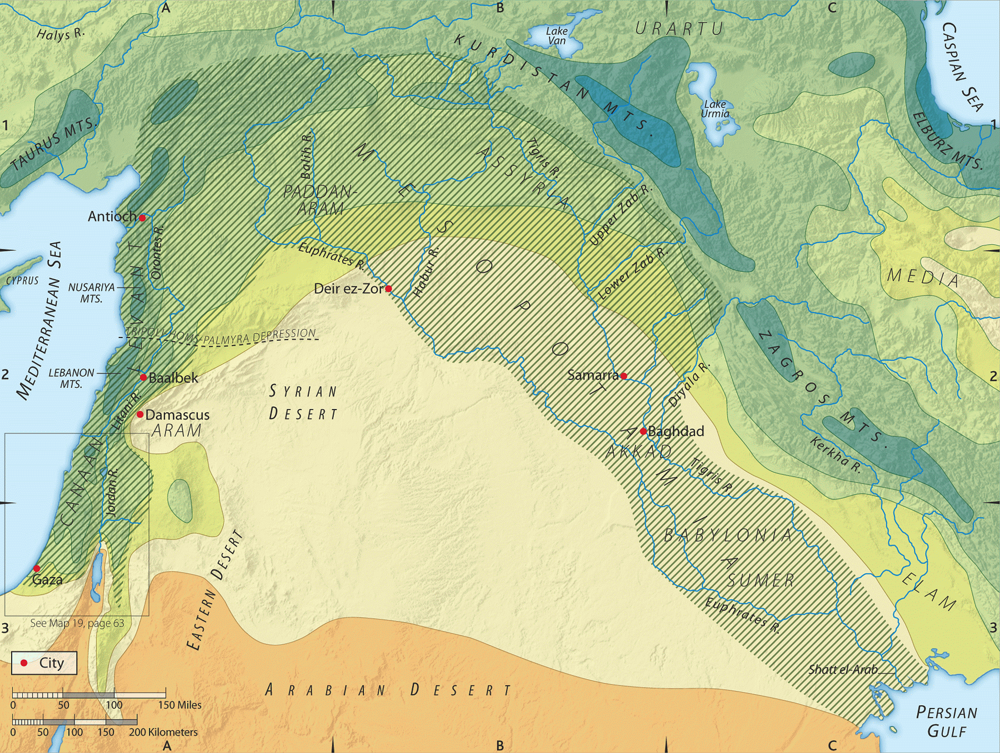


**Videos:**

Gen 2:1-25



## Genesis 2: Summary
>God ceases work on the seventh day, and sanctifies it as a day of rest. God forms the human body from the dust of the earth, and blows into his nostrils a “living soul.” Originally Man is a single person, but deciding that “it is not good that man be alone,” God takes a "side" from the man, forms it into a woman, and marries them to each other. Adam and Eve are placed in the Garden of Eden, and commanded not to eat from the “Tree of Knowledge of Good and Evil.”[^1]

## Gen 2:1-3 – Shabbat Rest 

<table>
<colgroup>
<col style="width: 50%" />
<col style="width: 50%" />
</colgroup>
<thead>
<tr class="header">
<th><strong>Gen 2:1-2</strong></th>
<th><strong>Reference</strong></th>
</tr>
</thead>
<tbody>
<tr class="odd">
<td>
Thus the heavens and the earth were finished, and all the host of them.

And on the seventh day God finished his work that he had done, and he rested on the seventh day from all his work that he had done.
</td>
<td>
Rev 21:1 Then I saw a new heaven and a new earth, for the first heaven and the first earth had passed away, and the sea was no more.

Joh 19:30 When Jesus had received the sour wine, he said, “It is finished,”

Rev 21:6 And he said to me, “It is done! I am the Alpha and the Omega, the beginning and the end. To the thirsty I will give from the spring of the water of life without payment.

Col 1:16 For by him all things were created, in heaven and on earth, visible and invisible, whether thrones or dominions or rulers or authorities—all things were created through him and for him.

Eph 3:8-9 To me, though I am the very least of all the saints, this grace was given, to preach to the Gentiles the unsearchable riches of Christ, and to bring to light for everyone what is the plan of the mystery hidden for ages in God, who created all things,
</td>
</tr>
</tbody>
</table>

-   Maimonides, a medieval Jewish sage states, “the Creator caused a repose to encompass the universe.”[^2] Perhaps this is when time actually began as the laws of nature were stabilized.

-   There is no stated “evening and morning” for the seventh day. It was intended to be permanent.

    -   Adam and Eve’s decision disrupted this.

    -   For our shabbat rest, we now look forward to the messianic age and the New heavens/New earth/New Jerusalem.

    -   Jesus promises us our Shabbat rest in Rev 21:6

-   Psa 90:4 For a thousand years in your sight are but as yesterday when it is past, or as a watch in the night.

    -   The sages applied Psalms 90.4 to Shabbat and concluded that, since every day is as a 1000 years, there will be 6000 years of work, followed by a Shabbat rest of 1000 years corresponding to the Messianic rule.

    -   Rev 20:4 Then I saw thrones, and seated on them were those to whom the authority to judge was committed. Also, I saw the souls of those who had been beheaded for the testimony of Jesus and for the word of God, and those who had not worshiped the beast or its image and had not received its mark on their foreheads or their hands. They came to life and reigned with Christ for a thousand years.

    -   Messianic Jews see a hint of this in the seven words of Genesis 1:1, which we discussed previously.

    -   בראשׁית ברא אלהים **את** השׁמים ו**את** הארץ

<table>
<colgroup>
<col style="width: 50%" />
<col style="width: 50%" />
</colgroup>
<thead>
<tr class="header">
<th><strong>Gen 2:3</strong></th>
<th><strong>Reference</strong></th>
</tr>
</thead>
<tbody>
<tr class="odd">
<td>So God blessed the seventh day and made it holy, because on it God rested from all his work that he had done in creation.</td>
<td>
Heb 4:9-11 So then, there remains a Sabbath rest for the people of God, [10] for whoever has entered God's rest has also rested from his works as God did from his. [11] Let us therefore strive to enter that rest, so that no one may fall by the same sort of disobedience.

Joh 1:10 He was in the world, and the world was made through him, yet the world did not know him.
</td>
</tr>
</tbody>
</table>

-   Hebrews 4 has an exposition of the Shabbat rest:

    -   Heb 4:1-11 Therefore, while the promise of entering his rest still stands, let us fear lest any of you should seem to have failed to reach it. \[2\] For good news came to us just as to them, but the message they heard did not benefit them, because they were not united by faith with those who listened. \[3\] For we who have believed enter that rest, as he has said, “As I swore in my wrath, ‘They shall not enter my rest,’” although his works were finished from the foundation of the world. \[4\] For he has somewhere spoken of the seventh day in this way: “And God rested on the seventh day from all his works.” \[5\] And again in this passage he said, “They shall not enter my rest.” \[6\] Since therefore it remains for some to enter it, and those who formerly received the good news failed to enter because of disobedience, \[7\] again he appoints a certain day, “Today,” saying through David so long afterward, in the words already quoted, “Today, if you hear his voice, do not harden your hearts.” \[8\] For if Joshua had given them rest, God would not have spoken of another day later on. \[9\] So then, there remains a Sabbath rest for the people of God, \[10\] for whoever has entered God's rest has also rested from his works as God did from his. \[11\] Let us therefore strive to enter that rest, so that no one may fall by the same sort of disobedience.

    -   The writer is saying that the Israelites rebelled in the wilderness and failed to enter in to the rest God had planned for them. Those who rebel against the word of Jesus were acting like Moses’ generation did.[^3]

    -   Mat 11:28 Come to me, all who labor and are heavy laden, and I will give you rest.

-   Just as surely as God created the first heaven and first earth and all that is within, He will one day pour out His judgment on that creation and usher in the New heaven and new earth for eternity.

-   The more I study about Shabbat, the more I come to the conclusion that the fact that Christians don’t observe it is we are being fed a lie by the enemy who doesn’t want us partaking in this institution of holiness and community with God and with each other.

-   Christianity sees the Shabbat as a difficult burden and one that Jesus did away with. If it is so burdensome, why do all Jews seem to delight in the Sabbath? We need to stop to ask why would Jesus do away with one of the 10 commandments; and if He did, what kind of Jewish messiah would violate one of the 10 commandments? Join us in our Gospels study as we will take a hard look at at the so-called Sabbath controversies.

-   It is a gift from God and maybe we should think hard about whether such a gift should be ignored or declined. Some say Sunday is the Christian sabbath. You won’t find this so defined in the Bible, but let’s grant it for a moment. How many Christians truly hit pause on their lives for more than the handful of hours they may be at church on Sunday, versus a full 24-hour shutdown period?

-   “In the business of today’s world, a person feels like he or she does not have time to stop even for a single day. (In contrast) the commandment of Shabbat forces us to stop and remember who created time. Sabbath sets aside one day out of a week to remember that we serve God, not ourselves, not our jobs, and not Pharaoh.” Daniel Lancaster[^4]

## Gen 2:4-8 - Creation of Man

<table>
<colgroup>
<col style="width: 50%" />
<col style="width: 50%" />
</colgroup>
<thead>
<tr class="header">
<th><strong>Gen 2:4-6</strong></th>
<th><strong>Reference</strong></th>
</tr>
</thead>
<tbody>
<tr class="odd">
<td>These are the generations of the heavens and the earth when they were created, in the day that the LORD God made the earth and the heavens. When no bush of the field was yet in the land and no small plant of the field had yet sprung up—for the LORD God had not caused it to rain on the land, and there was no man to work the ground, and a mist was going up from the land and was watering the whole face of the ground—</td>
<td>
Mar 13:19 For in those days there will be such tribulation as has not been from the beginning of the creation that God created until now, and never will be.

Rom 1:19-20 For what can be known about God is plain to them, because God has shown it to them. [20] For his invisible attributes, namely, his eternal power and divine nature, have been clearly perceived, ever since the creation of the world, in the things that have been made. So they are without excuse.
</td>
</tr>
</tbody>
</table>

The liberal theologians, skeptics and critics have big problems with the narration in chapter 2 which they see as contradicting the creation story in chapter 1. You may encounter these views so it’s worth taking some time to become acquainted with them.

For example, the skeptic sees no vegetation, then man created in verse 7, and then vegetation, in verse 9; all of which would be a contradiction of the order in chapter 1. As we’ve discussed, our western minds tend to be focused more on strict chronology than eastern thinking. There is nothing in this passage that textually requires verse 9 to chronologically follow verse 7. We described man; now we’re describing the Eden in which God will place man.

There are plausible explanations that do not involve assuming different authors or errors in the text. The most basic of these is to view chapter two as God returning to the creation of Adam.

It’s as if after chapter 2, verse 3 and the seven days of creation, someone, let’s say an angel, asked God, “can you tell me more about this man creature?” God then replies, “Sure, let me tell you more about Man. You see I’m so close to man that I use my covenant name when I interact with him.” Then God tells the story beginning with verse 4.

Back to our verse and our chronology discussion, Walton states, “the reference (in 2:5) is not to a time before day three but to the fact that agriculture was not taking place.”[^5]

We are reminded that there was no rain until the flood. The earth had an entirely different hydrological cycle before the Flood, which was likely still different from the environment before the Fall.

Another facet noted by critics is that in Chapter 1 God describes Himself as “Elohim,” whereas in Chapter 2, we see the covenant name of God, the Tetragrammaton, which is typically styled as LORD in our English Bibles. (On that note, we nowhere see Jesus pronouncing this Name, so I’m not comfortable doing so. It appears Jesus honored the tradition never to pronounce this name, and instead used what are called circumlocutions). This has led these skeptics and critics to conclude that two different authors an “E” source (for Elohim) and a “Y” source composed the two “conflicting” chapters. The general name for this more liberal view of scripture is the “Documentary hypothesis” or the “Graft-Wellhausen hypothesis.” They also see a priestly (P) source and a Deuteronomic (D) source as contributing authors. In other words, Moses didn’t write the books of Moses according to the theory.

We will see that in Mark 10 and Matthew 19, Jesus quoted from both chapters 1 and 2:

Mar 10:3-8 He answered them, “What did Moses command you?” They said, “Moses allowed a man to write a certificate of divorce and to send her away.” \[And Jesus said to them, “Because of your hardness of heart he wrote you this commandment. But from the beginning of creation, ‘God made them male and female.’ \[Gen 1:27\] ‘Therefore a man shall leave his father and mother and hold fast to his wife and the two shall become one flesh.’ So they are no longer two but one flesh. \[Gen 2:24\]. In other words, Jesus quotes from the so-called “E” source (chapter 1) and the so-called “Y” source (chapter 2) and sees no problem with attributing them both to Moses. John 7:19 Has not Moses given you the law?”

A close relative of the documentary hypothesis is called the “Deutero-Isaiah theory.” This theory says that a single person did not write Isaiah. Chapters 1-39 are from one author, possibly the original Isaiah, while 40-66 were written after the fact, possibly by one or more of Isaiah’s disciples.

In John 12 we have two quotes from Isaiah, one from each of the two sections.

Joh 12:37-41 Though he had done so many signs before them, they still did not believe in him, so that the word spoken by the prophet Isaiah might be fulfilled: “Lord, who has believed what he heard from us, and to whom has the arm of the Lord been revealed?” \[Isaiah 53:1\] Therefore they could not believe. For **again Isaiah said**, “He has blinded their eyes and hardened their heart, lest they see with their eyes, and understand with their heart, and turn, and I would heal them.” \[Isaiah 6:10\].

As with Moses, the Holy Spirit authenticates Isaiah. John 12:40 could be interpreted as “that SAME Isaiah said again…”

There is a similar theory that says Daniel didn’t really write Daniel. The prophecies are in such dramatic detail, that doubters have to conclude that all of Daniel was written after the fact. Again Jesus says in Mat 24:15, “…spoken of by Daniel the prophet….”

So while the man says we should question Moses, Isaiah, and Daniel, Jesus authenticates the authorship of all three. It’s as if the Bible anticipated hostile jamming! As Chuck Missler said, “If you believe Jesus, you’ve got no problem with the authorship of Genesis. If you don’t believe in Jesus, you’ve got much bigger problems than the authorship of Genesis.”

<table>
<colgroup>
<col style="width: 50%" />
<col style="width: 50%" />
</colgroup>
<thead>
<tr class="header">
<th><strong>Gen 2:7-8</strong></th>
<th><strong>Reference</strong></th>
</tr>
</thead>
<tbody>
<tr class="odd">
<td>then the LORD God formed the man of dust from the ground and breathed into his nostrils the breath of life, and the man became a living creature. And the LORD God planted a garden in Eden, in the east, and there he put the man whom he had formed.</td>
<td>
1Ti 2:13-14 For Adam was formed first, then Eve; [14] and Adam was not deceived, but the woman was deceived and became a transgressor.

1Co 15:45-48 Thus it is written, “The first man Adam became a living being”; the last Adam became a life-giving spirit. [46] But it is not the spiritual that is first but the natural, and then the spiritual. [47] The first man was from the earth, a man of dust; the second man is from heaven. [48] As was the man of dust, so also are those who are of the dust, and as is the man of heaven, so also are those who are of heaven.
</td>
</tr>
</tbody>
</table>

In contrast to speaking into existence, God creates man by direct involvement.

Man's physical and spiritual aspects are seen in the ground dust and God’s personal breath of life. Human life is a deliberate creation by God. This gives us purpose and dictates how we should treat ourselves and each other. Today’s world tells us we are just a cosmic accident and have no meaning. This worldview also dictates how they would have us should treat ourselves and each other.

Lancaster writes, “Our job is to cultivate the godly side of our nature and integrate it into the earthly side. Our job is to reveal heaven on earth.”[^6]

“Living creature” is an odd translation option by the ESV. The Hebrew word is “Nefesh,” which is most often rendered, soul. Denotatively it can refer to any living animal, though nephesh tends to be limited to mankind outside of the creation story.

The sages read this as “a soul which can speak. Man, then, is elevated above all animals, for God has given him the ability to speak. However, this faculty elevates man only when he uses it for worthy purposes. Someone who misuses his speech by speaking against others is considered lower than a beast. A beast cannot destroy through talk, whereas man can slay with his tongue. (Chofetz Chayim)”[^7]

“Adam was not deceived” is a staggering statement. That means Adam knew exactly what He was doing when he ate the fruit. Is this deliberate rebellion, or is something deeper possibly going on? We’ll look at that next lesson.

## Gen 2:9-15 – Gan Eden and the four rivers

<table>
<colgroup>
<col style="width: 50%" />
<col style="width: 50%" />
</colgroup>
<thead>
<tr class="header">
<th><strong>Gen 2:9</strong></th>
<th><strong>Reference</strong></th>
</tr>
</thead>
<tbody>
<tr class="odd">
<td>And out of the ground the LORD God made to spring up every tree that is pleasant to the sight and good for food. The tree of life was in the midst of the garden, and the tree of the knowledge of good and evil.</td>
<td>
Rev 2:7 He who has an ear, let him hear what the Spirit says to the churches. To the one who conquers I will grant to eat of the tree of life, which is in the paradise of God.’

Rev 22:14 Blessed are those who wash their robes, so that they may have the right to the tree of life and that they may enter the city by the gates.
</td>
</tr>
</tbody>
</table>

Eden means “delight” in Hebrew. In the Greek Septuagint, the translators selected the word for “paradise.” Adam had everything he could have wanted, including eventually a helper. The tree of life represents immortality; this is how Jesus references it in Revelation. Saying we will eat of the tree of life is to say we will have eternal life. The issue with the Tree of the Knowledge of Good and Evil is that it includes a knowledge of death. We’ll continue this thought in verse 16.

Using computer software, scholars have identified several trees at equidistant letter sequences in Genesis 2[^8]:

<table>
<colgroup>
<col style="width: 50%" />
<col style="width: 50%" />
</colgroup>
<thead>
<tr class="header">
<th><strong>Gen 2:10-12</strong></th>
<th><strong>Reference</strong></th>
</tr>
</thead>
<tbody>
<tr class="odd">
<td>A river flowed out of Eden to water the garden, and there it divided and became four rivers. The name of the first is the Pishon. It is the one that flowed around the whole land of Havilah, where there is gold. And the gold of that land is good; bdellium and onyx stone are there.</td>
<td>
Rev 22:1-2 Then the angel showed me the river of the water of life, bright as crystal, flowing from the throne of God and of the Lamb through the middle of the street of the city; also, on either side of the river, the tree of life with its twelve kinds of fruit, yielding its fruit each month. The leaves of the tree were for the healing of the nations.

Joh 7:38 Whoever believes in me, as the Scripture has said, ‘Out of his heart will flow rivers of living water.’”
</td>
</tr>
</tbody>
</table>

As we saw in the final chapters of Revelation, the Garden of Eden “corresponds to paradise, the Messianic Age, and the World to come. In the Messianic Era, a river will flow out of Eden again in the form of a might river that flows forth from the holy Temple and from Jerusalem.”[^9]

| **Gen 2:13-14**                                                                                                                                                                                                        | **Reference** |
|------------------------------------------------------------------------------------------------------------------------------------------------------------------------------------------------------------------------|---------------|
| The name of the second river is the Gihon. It is the one that flowed around the whole land of Cush. And the name of the third river is the Tigris, which flows east of Assyria. And the fourth river is the Euphrates. |               |

*Map credit:*[^12]

Probably ever since the story of Genesis 2 was first told by Moses, people have wondered where exactly Eden was. Verse seven only tells us that it was in the east. The Tigris and Euphrates originate in the Armenian mountains (where Mt. Ararat happens to be), but post-flood, we are dealing with a very different terrain today than would have existed in the days of Adam. “Gihon” happens to be the name of the only freshwater spring in Jerusalem. From this are both Jewish and Muslim traditions that the “rock” that is presently enshrined by the Dome of the Rock is the foundation stone for the entire earth. Jewish tradition holds that the Temple represented Eden on earth, “the paradise where man can enter into God’s presence.”[^10]

Walton speculates, “the characteristics of a well-watered garden in which humans do little or no work and in which life springs up without cultivation fits the marshy areas at the base of the (Persian) Gulf and may even be an area now covered by the waters of the region.”[^11][^13]

In Revelation, the World to Come, the New Jerusalem will stand within the restored Garden of Eden, where a river will flow out of it and a tree of life will grow. Perhaps the Jerusalem connection is more than just tradition!

| **Gen 2:15**                                                                        | **Reference** |
|-------------------------------------------------------------------------------------|---------------|
| The LORD God took the man and put him in the garden of Eden to work it and keep it. |               |

גַן, the word translated “garden” does not typically refer to vegetable plots but to orchards or parks containing trees.[^14]

## Gen 2:16-17 – Warning about Tree of Knowledge

| **Gen 2:16-17**                                                                                                                                                                                                            | **Reference**                                                                                                                                                                                          |
|----------------------------------------------------------------------------------------------------------------------------------------------------------------------------------------------------------------------------|--------------------------------------------------------------------------------------------------------------------------------------------------------------------------------------------------------|
| And the LORD God commanded the man, saying, “You may surely eat of every tree of the garden, but of the tree of the knowledge of good and evil you shall not eat, for in the day that you eat of it you shall surely die.” | Deu 30:19 I call heaven and earth to witness against you today, that I have set before you life and death, blessing and curse. Therefore choose life, that you and your offspring may live, |

Man was not initially forbidden from eating from the Tree of Life. A part of being human, a part which God did not restrict in the Garden, is the ability to choose good or evil, life or death.

Discipleship precept: most every choice we make involves a decision to live for God or live for ourselves. In this respect, we are choosing between the Tree of Life and the Tree of the Knowledge of Good and Evil several times a day. God desires that we choose the way of Life (see Deu 30:19), but He allows us to decide.

## Gen 2:18-24 – Not Good to be Alone

| **Gen 2:18-20**                                                                                                                                                                                                                                                                                                                                                                                                                                                                                                 | **Reference** |
|-----------------------------------------------------------------------------------------------------------------------------------------------------------------------------------------------------------------------------------------------------------------------------------------------------------------------------------------------------------------------------------------------------------------------------------------------------------------------------------------------------------------|---------------|
| Then the LORD God said, “It is not good that the man should be alone; I will make him a helper fit for him.” Now out of the ground the LORD God had formed every beast of the field and every bird of the heavens and brought them to the man to see what he would call them. And whatever the man called every living creature, that was its name. The man gave names to all livestock and to the birds of the heavens and to every beast of the field. But for Adam there was not found a helper fit for him. |               |

After the seven “goods” in chapter one, we now have a “not good” in chapter 2. Man’s loneliness, and perhaps by application after the fall, a man’s tendency to isolate from the community, is called “not good” by God. Selfishness and solitary independence are not in God’s will. “In embracing the “other” our capacity is extended to embrace our Father-God in a growing, every more intimate relationship.”[^15]

Unless you are specifically called by God to separate yourself for ministry (Matthew 19:12), a permanently single life should not be a desire. Sages see the text implying Adam was aware of his loneliness, particularly after naming what presumably were pairs of animals.

The desire for love, affection, admiration, and community are more of what it means to be human (even though I think my dogs demonstrate these traits, if I didn’t feed them, they’d probably not be so affectionate).

“He brought them to the man to see what he would call them.” – God delights in man’s wonder and creativity. The naming of a thing was to declare dominion over it; this is why it is not to be overlooked when demons tell Jesus “We know who you are” and when Jesus asks for their names.

| **Gen 2:21-22**                                                                                                                                                                                                                             | **Reference**                                                                                                                                                                                                                                                                                                                                                                                                                                                  |
|---------------------------------------------------------------------------------------------------------------------------------------------------------------------------------------------------------------------------------------------|----------------------------------------------------------------------------------------------------------------------------------------------------------------------------------------------------------------------------------------------------------------------------------------------------------------------------------------------------------------------------------------------------------------------------------------------------------------|
| So the LORD God caused a deep sleep to fall upon the man, and while he slept took one of his ribs and closed up its place with flesh. And the rib that the LORD God had taken from the man he made into a woman and brought her to the man. | Eph 2:19-22 So then you are no longer strangers and aliens, but you are fellow citizens with the saints and members of the household of God, \[20\] built on the foundation of the apostles and prophets, Christ Jesus himself being the cornerstone, \[21\] in whom the whole structure, being joined together, grows into a holy temple in the Lord. \[22\] In him you also are being built together into a dwelling place for God by the Spirit. |

Again, God separates and forms Eve with His hands. It’s been said that to create Eve below the mid-section would imply Eve is inferior. To create Eve from above the heart would imply Adam is inferior. Instead, God chose to make Eve an equal. In removing a structure designed to protect the vital organs, man is also made vulnerable in marriage

The word translated as “made” is actually the verb “built.” Lancaster believes Paul is directly referencing this Hebrew word in Genesis 2:22 in his passage in Ephesians 2 talking about the ecclesia being joined to her Messiah.

Discipleship precept: “Adam’s state of unconsciousness at the time of the creation of Eve illustrates how a husband should relate to his wife. He should act as if he were asleep and overlook minor faults in order to avoid domestic quarrels.”[^16] Another sage said, “the true test of a person’s propensity toward anger is judged by his behavior in the circle of his own family, which will undoubtedly provide opportunities for anger.”[^17]

There is a potential parallel here. The first Adam’s sleep corresponds to the second Adam’s death. Just as Even was made in Adam’s “absence”, so also was the Ecclesia made in Messiah’s absence. Just as the First Adam awoke to be united with his bride, Eve, Jesus will one day “awaken” to be reunited with His bride, the ecclesia. Paul builds on this symbolism in Ephesians 5.

<table>
<colgroup>
<col style="width: 50%" />
<col style="width: 50%" />
</colgroup>
<thead>
<tr class="header">
<th><strong>Gen 2:23</strong></th>
<th><strong>Reference</strong></th>
</tr>
</thead>
<tbody>
<tr class="odd">
<td>Then the man said, “This at last is bone of my bones and flesh of my flesh; she shall be called Woman, because she was taken out of Man.”</td>
<td>
Eph 5:29-32 For no one ever hated his own flesh, but nourishes and cherishes it, just as Christ does the church, [30] because we are members of his body. [31] “Therefore a man shall leave his father and mother and hold fast to his wife, and the two shall become one flesh.” [32] This mystery is profound, and I am saying that it refers to <strong>Christ and the church.</strong>

2 Cor 5:17 Therefore, if anyone is in Christ, he is a new creation. The old has passed away; behold, the new has come.
</td>
</tr>
</tbody>
</table>

The bride of Adam is from the body of Adam. The Bride of Messiah is from the body of Messiah. Eve is a new creation. In Messiah, we are a new creation. 2 Cor 5:17

God uses the model of marriage to communicate His deepest truths. I can’t wait until we get to Genesis 24 and the marriage of Isaac and Rebekah. Typology is everywhere. Until then, just as we are called to leave the household of our youth and be joined with our husband or wife, Jesus calls us to leave or former lives of idolatry and sin behind and become joined with him as a pure, spotless bride.

<table>
<colgroup>
<col style="width: 50%" />
<col style="width: 50%" />
</colgroup>
<thead>
<tr class="header">
<th><strong>Gen 2:24</strong></th>
<th><strong>Reference</strong></th>
</tr>
</thead>
<tbody>
<tr class="odd">
<td>Therefore a man shall leave his father and his mother and hold fast to his wife, and they shall become <strong>one flesh.</strong></td>
<td>
Mar 10:6-9/Mat 19:5 But from the beginning of creation, ‘God made them male and female.’ [7] ‘Therefore a man shall leave his father and mother and hold fast to his wife, [8] and the two shall become one flesh.’ So they are no longer two but one flesh. [9] What therefore God has joined together, let not man separate.”

1Co 6:15-17 Do you not know that your bodies are members of Christ? Shall I then take the members of Christ and make them members of a prostitute? Never! [16] Or do you not know that he who is joined to a prostitute becomes one body with her? For, as it is written, “The two will become one flesh.” [17] But he who is joined to the Lord becomes one spirit with him.
</td>
</tr>
</tbody>
</table>

In Hebrew, one flesh is besar echad. This is where we get the idea of the word “echad” representing a compound unity. So in Deuteronomy 6:4, when we read, “The LORD is our God, the LORD is one (echad),” this need not exclude the Christian concept of a triune God. Those typically traditionally Jewish, see Christianity as worshipping three gods, but they are misunderstanding the trinity (to be fair, the trinity is a complex topic).

Besar echad is a uniquely human characteristic. Lower animals temporarily join for the purpose of procreation, but man is sanctified in marriage. Here are some writings collected by Pliskin:

-   “He should honor his wife more than himself.”

-   “(Each) should do as the other desires and refrain from doing whatever the other dislikes.”

-   “If a husband will try to fulfill his obligations and the wife will try to fulfill her obligations, they will live a happy and tranquil life together. Troubles begin when the husband is only concerned that the wife meet her obligations to him, and the wife is only concerned that the husband meet his obligations to her.”[^18]

The attempts by society to cheapen and weaken the institution of marriage are nothing new. We will note many of the patriarchs and kings of Judah/Israel have multiple wives, but it’s important to note that God never sanctioned this, in the same way God permits divorce in Deuteronomy 24 but does not sanction it. In Mark 10, Jesus emphasizes that from the beginning a single, lifelong monogamous relationship was God’s original design and cites both Genesis 1:27 and 2:24 as His “proof texts.” Jesus apparently had no problem with the two “different” Creation stories in Genesis 1 and 2. What might be lost on modern readers, is that he is also applying the definition of adultery equally to men and women. In that day, fornication and adultery had two different definitions, which resulted in a married man being able to engage in a relationship with a single woman virtually without penalty.

This is one example where less-informed Christians say “Jesus is overturning the Law.” He’s doing nothing of the sort. He’s restoring the definition to God’s original intent and citing the Torah as His basis for doing so. In so doing, Jesus leveled the playing field by placing husband and wife on equal footing and limits disciples of Jesus to a single wife. Interestingly, documentation from the Dead Sea Scrolls imposed similar definitions and prohibitions on their Qumran community.

## Gen 2:25 - Naked in the garden of pleasure and delight

| **Gen 2:25**                                                   | **Reference**                                                                                                                                    |
|----------------------------------------------------------------|--------------------------------------------------------------------------------------------------------------------------------------------------|
| And the man and his wife were both naked and were not ashamed. | Heb 13:4 Let marriage be held in honor among all, and let the marriage bed be undefiled, for God will judge the sexually immoral and adulterous. |

This is God’s design for sexuality. It is not sinful, shameful, or perverse. It is a wicked world that makes it that way by presenting a skewed vision, if not an outright mockery of God’s original plan for a husband and wife to be one flesh.

Divorce and inappropriate relationships before and outside of marriage (physical or electronic) are damaging. If anyone reading is caught up in sexual sin, please seek wise Christian counsel. There is help and countless others have broken these chains of shame and immorality.

To be fully used for God’s service we must be pure, undefiled, and unashamed. Just like Adam and Eve were in the “Garden of Pleasure and Delight”. The fact that this very phrase sounds “r-rated” and selacious to our ears signifies how much Satan and the world make a mockery of God’s design. We associate these things with Las Vegas, when we should be associating them with our marriages.

-   The Hebrew words for man and woman are איש and אשה (Ishah = woman, ish = man)

-   The two unique letters are  י and ה, which spell יה, Jah, the short-form of God’s holy name.

-   If you take God out of a marriage, the two remaining letters are א and ש, which spells אֵשׁ, or “fire.”

-   Rabbi Akiva said, “when a marriage is godly and the marriage bed is kept pure, God is present with husband and wife. When a marriage is godless and the marriage bed is defiled, it is a consuming fire that will destroy both.”[^19]

    -   The same is true for an unmarried “ish” or “Isha” who is using sex outside of the proper, God-designed context.

    -   There is no God, there is only destructive fire.

On the flip side, when we have a God-honoring marriage, with God involved, we have a taste of what it was like in Eden.

Beitzel, Barry J. *The New Moody Atlas of the Bible*. New edition. New York: Moody Publishers, 2009.

chabad.org. “Bereishit in a Nutshell.” Accessed August 7, 2022. https://www.chabad.org/parshah/article_cdo/aid/3137/jewish/Bereishit-in-a-Nutshell.htm.

Keener, Craig S. *The IVP Bible Background Commentary: New Testament*. 2nd edition (E-Sword). Downers Grove, Illinois: IVP Academic, 2014.

Lancaster, D. Thomas. *Unrolling the Scroll*. Edited by Boaz Michael and Seth Dralle. 2nd ed. Vol. 1. 6 vols. Torah Club 1. Marshfield, MO: First Fruits of Zion, 2014.

Lancaster, Daniel T. *Depths of the Torah*. Edited by Boaz D. Michael and Steven P. Lancaster. 2nd ed. Vol. 1. 5 vols. Torah Club 4. Marshfield, MO: First Fruits of Zion, 2017.

———. *Shadows of the Messiah*. Edited by Boaz D. Michael and Steven P. Lancaster. 3rd ed. Vol. 4. 5 vols. Torah Club 3. Marshfield, MO: First Fruits of Zion, 2015.

Missler, Chuck. *Genesis: An Expositional Commentary (Supplemental Notes)*. Coeur d’Alene, ID: Koinonia House, 2004.

Pliskin, Zelig. *Love Your Neighbor:* Brooklyn, New York: Bnay Yakov Publications, 2004.

Pryor, Keren Hannah. *A Taste of Torah*. Marshfield, MO: First Fruits of Zion, 2016.

Stiles, Wayine. “Euphrates River - Finding Eden and Your Ideal Life.” Walking the Bible Lands with Dr. Wayne Stiles. Accessed September 16, 2022. https://www.walkingthebiblelands.com/products/walking-the-bible-lands/categories/4024410/posts/13807295.

Walton, John H., Victor H. Matthews, and Mark W. Chavalas. *The IVP Bible Background Commentary: Old Testament*. (E-Sword). Downers Grove, Ill: IVP Academic, 2000.

[^1]: “Bereishit in a Nutshell,” chabad.org, accessed August 7, 2022, https://www.chabad.org/parshah/article_cdo/aid/3137/jewish/Bereishit-in-a-Nutshell.htm.

[^2]: Maimonides, Guide to the Perplexed, Part I, Ch 67, in Missler, *Genesis*, 101.

[^3]: Craig S. Keener, *The IVP Bible Background Commentary: New Testament*, 2nd edition (E-Sword) (Downers Grove, Illinois: IVP Academic, 2014), loc. Heb 4:1.

[^4]: Daniel T. Lancaster, *Depths of the Torah*, ed. Boaz D. Michael and Steven P. Lancaster, 2nd ed., vol. 1, Torah Club 4 (Marshfield, MO: First Fruits of Zion, 2017), 21.

[^5]: John H. Walton, Victor H. Matthews, and Mark W. Chavalas, *The IVP Bible Background Commentary: Old Testament*, (E-Sword) (Downers Grove, Ill: IVP Academic, 2000), loc. Gen 2:5.

[^6]: D. Thomas Lancaster, *Unrolling the Scroll*, ed. Boaz Michael and Seth Dralle, 2nd ed., vol. 1, Torah Club 1 (Marshfield, MO: First Fruits of Zion, 2014), 9.

[^7]: Zelig Pliskin, *Love Your Neighbor:* (Brooklyn, New York: Bnay Yakov Publications, 2004), 24.

[^8]: Missler, *Genesis*, 58.

[^9]: Daniel T. Lancaster, *Shadows of the Messiah*, ed. Boaz D. Michael and Steven P. Lancaster, 3rd ed., vol. 4, Torah Club 3 (Marshfield, MO: First Fruits of Zion, 2015), 19.

[^10]: Lancaster, *Depths of the Torah*, 1:23.

[^11]: Walton, Matthews, and Chavalas, *The IVP Bible Background Commentary*, loc. Gen 2:8-14.

[^12]: Map: Barry J. Beitzel, *The New Moody Atlas of the Bible*, New edition (New York: Moody Publishers, 2009), 22.

[^13]: Photo: Wayine Stiles, “Euphrates River - Finding Eden and Your Ideal Life,” Walking the Bible Lands with Dr. Wayne Stiles, accessed September 16, 2022, https://www.walkingthebiblelands.com/products/walking-the-bible-lands/categories/4024410/posts/13807295.

[^14]: Walton, Matthews, and Chavalas, *The IVP Bible Background Commentary*, loc. Gen 2:8.

[^15]: Keren Hannah Pryor, *A Taste of Torah* (Marshfield, MO: First Fruits of Zion, 2016), 17.

[^16]: Pliskin, *Love Your Neighbor:*, 25.

[^17]: Pliskin, 25.

[^18]: Pliskin, 26.

[^19]: Lancaster, *Unrolling the Scroll*, 1:11.

 

