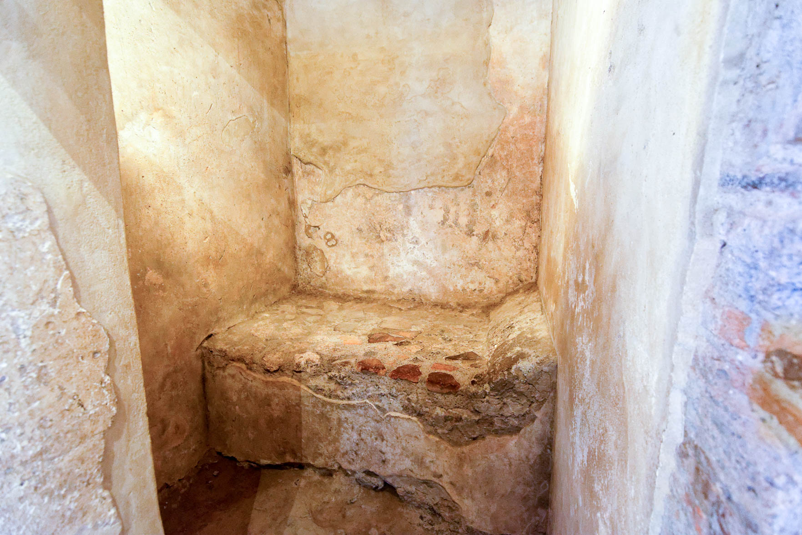
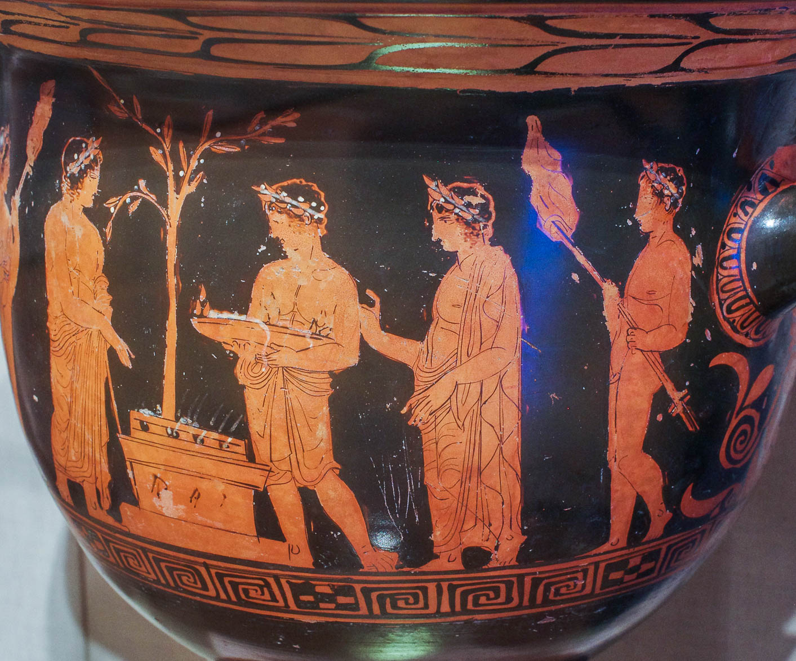

Genesis 9

Summary: God reiterates His promise to never again to destroy all of mankind because of their deeds and sets the rainbow as a testimony of His new covenant with man. God also commands Noah regarding the sacredness of life: murder is deemed a capital offense, and while man is permitted to eat the meat of animals, he is forbidden to eat flesh or blood taken from a living animal. Noah plants a vineyard and becomes drunk on its produce. Two of Noah’s sons, Shem and Japheth, are blessed for covering up their father’s nakedness, while his third son, Ham, is punished for taking advantage of his debasement.[^1]

Those who adhere to dispensational theology see the third of seven dispensations beginning with Genesis 9. At the beginning of creation was the age of “Innocence.” After the fall and through the flood was the age of “Conscience.” After the flood and up until the promise to Abraham is the age of “Human Government.” An example of this is the institution of the death penalty in Genesis 9:5-6.[^2]

With this in mind, we’re going to spend the bulk of our time looking at something called the Seven Noachide Laws that the Jewish sages derive from Genesis 9 and how those laws relate to the prohibitions given by the Apostles to the Gentile believers in Acts 15.

Gen 9:1-29

1 And God blessed Noah and his sons and said to them, “Be fruitful and multiply and fill the earth.

-   God reiterates the command given in Eden. In fact, God says “be fruitful and multiply” twice in this passage (v. 1 and v.7).

-   We are going to see that instead of filling the whole earth, humanity is going to gather at Bavel/Babylon[^3], inviting yet another judgment from God.

2 The fear of you and the dread of you shall be upon every beast of the earth and upon every bird of the heavens, upon everything that creeps on the ground and all the fish of the sea. Into your hand, they are delivered.

-   God recommissions Noah with Dominion; these words echo when God said “it was very good” in Genesis 1

-   Hebrews 2:7-8 You made him for a little while lower than the angels; you have crowned him with glory and honor, putting everything in subjection under his feet.” Now in putting everything in subjection to him, he left nothing outside his control. At present, we do not yet see everything in subjection to him.

3 Every moving thing that lives shall be food for you. And as I gave you the green plants, I give you everything.

-   1 Timothy 4:1-3 Now the Spirit expressly says that in later times some will depart from the faith by devoting themselves to deceitful spirits and teachings of demons, through the insincerity of liars whose consciences are seared, who forbid marriage and require abstinence from foods that God created to be received with thanksgiving by those who believe and know the truth.

-   I hate to be the bearer of bad news, but Peter is not talking about those who say we shouldn’t eat pork and shellfish.

    -   In God’s terminology, the flesh of unclean animals is not unclean food. It’s not food at all.

    -   In other words, pork and lobster are not foods that God created.

    -   Paul, who remained an observant jew until the end would not be advocating eating things God said not to eat and that he would not have eaten.

    -   I tend to think a better modern application would be those who say we need to stop eating beef (something first permitted in Genesis 9:4) and this whole push to eat fake meat that is laced with who knows what chemicals.

4 But you shall not eat flesh with its life, that is, its blood.

-   Acts 15:19-20 Therefore my judgment is that we should not trouble those of the Gentiles who turn to God but should write to them to abstain from the things polluted by idols, and from sexual immorality, and from what has been strangled, and from blood.

-   Walton: “The draining of the blood before eating the meat was a way of returning the life force of the animal to the God who gave it life… (This ceremony) offers recognition that they are partaking of God’s bounty as His guests,…not unlike that of the blessing said before a meal in modern practice.”[^4]

-   We’ll talk much more about Acts 15 in our addendum to this lesson on the Noachide laws.

5 And for your lifeblood I will require a reckoning: from every beast I will require it and from man. From his fellow man, I will require a reckoning for the life of man.

6 “Whoever sheds the blood of man, by man shall his blood be shed, for God made man in his own image.

-   Matthew 26:52 And behold, one of those who were with Jesus stretched out his hand and drew his sword and struck the servant of the high priest and cut off his ear. Then Jesus said to him, “Put your sword back into its place. For all who take the sword will perish by the sword.

-   We recall from our chapter 1 discussion, that “Image” is likely not any specific human attribute such as reason or intellect – a human can lose these things through disease or accident and still be in the Image of God.

-   It’s best to think of “Image” as a status given by God to man.

    -   A crude paraphrase might be “if you mess with one of my image bearers, you mess with Me.”

    -   This institutes the practice of the avenger of blood – typically the victim’s next of kin was tasked with seeing justice was done.

-   The standards for capital trials will be developed in Numbers 35 and Deuteronomy 19.

-   Some people ask what good putting to death a murderer achieves.

    -   A fair response is there is no good that comes out of it.

    -   The victim’s life is not restored and now a second life is forfeited. It is a tragedy all around and it should not be.

    -   BUT this is God’s standard for achieving justice in the land.

    -   The standard puts a would-be murderer on notice this he will be directly responsible for two deaths: his victim’s life and his own.

7 And you, be fruitful and multiply, increase greatly on the earth and multiply in it.”

8 Then God said to Noah and to his sons with him,

9 “Behold, I establish my covenant with you and your offspring after you,

-   God covenants to find a different way to deal with man’s sin.[^5]

10 and with every living creature that is with you, the birds, the livestock, and every beast of the earth with you, as many as came out of the ark; it is for every beast of the earth.

11 I establish my covenant with you, that never again shall all flesh be cut off by the waters of the flood, and never again shall there be a flood to destroy the earth.”

12 And God said, “This is the sign of the covenant that I make between me and you and every living creature that is with you, for all future generations:

13 I have set my bow in the cloud, and it shall be a sign of the covenant between me and the earth.

14 When I bring clouds over the earth and the bow is seen in the clouds,

15 I will remember my covenant that is between me and you and every living creature of all flesh. And the waters shall never again become a flood to destroy all flesh.

-   Proponents of a local flood have a problem because there have been many local floods that have resulted in the loss of life.

-   There has never been another worldwide flood that destroyed all life though.

16 When the bow is in the clouds, I will see it and remember the everlasting covenant between God and every living creature of all flesh that is on the earth.”

-   Isaiah 54:7-10 For a brief moment I deserted you, but with great compassion I will gather you. In overflowing anger for a moment, I hid my face from you, but with everlasting love I will have compassion on you,” says the LORD, your Redeemer. “This is like the days of Noah to me: as I swore that the waters of Noah should no more go over the earth, so I have sworn that I will not be angry with you, and will not rebuke you. For the mountains may depart and the hills be removed, but my steadfast love shall not depart from you, and my covenant of peace shall not be removed,” says the LORD, who has compassion on you.

## Ancient Covenants

-   We tend to think of a covenant as a contract, which, in its simplest form it is.

-   But a Biblical covenant is more like a Trust in that a covenant is always a promise made not only to the person, such as Noah or Abraham but to his heirs in perpetuity.

    -   We are all descendants of Noah; by virtue of verse 9, you and I are named in this trust covenant. That’s exciting!

-   Covenants are Legally binding, like a contract

    -   Jos 9:19 But all the leaders said to all the congregation, “We have sworn to them by the LORD, the God of Israel, and now we may not touch them.”

    -   Today we have a decision from the United States Supreme Court: United States vs. Throckmorton (1878) stated that “fraud vitiates the most solemn contracts.”

-   Covenants are Intergenerational, like a trust

    -   Exo 6:5 Moreover, I have heard the groaning of the people of Israel whom the Egyptians hold as slaves, and I have remembered my covenant (with Abraham)

-   Covenants are usually conditional (both sides need to perform), but not always

    -   The covenants with Noah, Abraham and David are unilateral and unconditional – only God has to perform. There is nothing Noah, Abraham, or David could do to break the covenant.

    -   Breaking a covenant has dire consequences

    -   A broken covenant requires atonement

-   Each of God’s covenants has a sign

    -   Noah-rainbow

    -   Abraham-circumcision

    -   Moses-the Sabbath

    -   David-House (Temple and Kingdom)

    -   Jesus/New-Holy Spirit

## Rainbow as a sign of Messiah

-   The Rainbow teaches us about Messiah.[^6]

    -   Token of peace between God and humanity

    -   Spans the distance between heaven and earth.

    -   Reflects the radiance of the glory of God – Ezekiel 1:28 Like the appearance of the bow that is in the cloud on the day of rain, so was the appearance of the brightness all around. Such was the appearance of the likeness of the glory of the LORD. And when I saw it, I fell on my face, and I heard the voice of one speaking.

    -   Light from heaven interacts with moisture from the earth to produce a beautiful refraction and splendid display of divine glory. When the heavenly Word, the light of the world, interests an earthly man, it refracts into a beautiful demonstration of God’s glory on earth called Messiah.

    -   There is a pun on the word bow, a sign of divine judgment. When we see the rainbow, we are worthy of the same fate as the flood generation, yet through a covenant of God, we are spared.

17 God said to Noah, “This is the sign of the covenant that I have established between me and all flesh that is on the earth.”

18 The sons of Noah who went forth from the ark were Shem, Ham, and Japheth. (Ham was the father of Canaan.)

19 These three were the sons of Noah, and from these, the people of the whole earth were dispersed.

-   Genesis 10 will give us the names of “these the people.”

-   In fact, we almost expect the next verse after 9:19 to be Genesis 10:2 (as 10:1 is practically the same as 9:19)

20 Noah began to be a man of the soil, and he planted a vineyard.

-   To Noah’s credit, chapter 8 tells us he built an altar and offered sacrifices first.

    -   Jewish tradition holds that Noah rebuilt the same altar used by Adam after his banishment from the Garden and the same altar used by Cain and Abel.

    -   “When Messiah comes, He will rebuild the holy Temple and reestablish the altar of the LORD. He will usher in an age during which vineyards will produce abundantly.”[^7]

21 He drank the wine and became drunk and lay uncovered in his tent.

-   The oldest known wine jar dates to the sixth millennium and was found in modern Iran.

-   Up until now, Noah has been heroic in his righteousness. Like David, notice how the Bible is transparent regarding the shortcomings of otherwise great men.

22 And Ham, the father of Canaan, saw the nakedness of his father and told his two brothers outside.

23 Then Shem and Japheth took a garment, laid it on both their shoulders, and walked backward and covered the nakedness of their father. Their faces were turned backward, and they did not see their father's nakedness.

-   Even God’s righteous make mistakes.

-   There are (at least) two mistakes happening here:

    -   Noah did something shameful in view of his children

    -   One of Noah’s children dishonored his father in some unwritten way.

    -   People will make mistakes but the godly thing to do is to look away from their foolishness and try to cover their shame (cover in a good way as in shield the foolishness from others, not in the sense of making excuses for it).

    -   1 Peter 4:8-9 Above all, keep loving one another earnestly since love covers a multitude of sins. Show hospitality to one another without grumbling.

24 When Noah awoke from his wine and knew what his youngest son had done to him,

25 he said, “Cursed be Canaan; a servant of servants shall he be to his brothers.”

26 He also said, “Blessed be the LORD, the God of Shem; and let Canaan be his servant.

27 May God enlarge Japheth, and let him dwell in the tents of Shem, and let Canaan be his servant.”

-   We have no idea what “uncovering his father’s nakedness means,” and it’s somewhat natural for our imaginations to run wild here.

-   After all, the Bible is graphic in many places, so if even the BIBLE is not telling what it was it must have been really bad. Maybe or maybe not. We aren’t told.

-   We shouldn’t assume something “done” to Noah is physical.

    -   Merely mocking Noah’s nakedness, especially if done by a son, would be doing harm to Noah.

    -   Not honoring one’s father and mother is to do wrong to them.

-   Modern modesty vs immodesty

    -   We live in a ridiculously hypersexualized world and we are exposed to things we wish we didn’t have to see.

    -   We have the choice to be like Shem and Japheth who turn our backs and maintain boundaries.

    -   Expressions of intimacy are appropriate (and are only appropriate) between a husband and wife but this needs to be kept within the privacy of their own home.

-   We also don’t know why Canaan is directly cursed instead of Ham.

    -   One speculation is the Canaanites were the people group the Israelites were most familiar with.

    -   Another view is that this is a prophecy of the wicked Canaanites, who will need to be expunged from the land.

    -   In other places in the Bible, “to uncover the nakedness of” a man means to have relations with the man’s wife. See Leviticus 18 and 20.

        -   The other time Nakedness and drunkenness are described in the same event is Genesis 19 with Lot and his daughters.

        -   One theory is Canaan was the offspring of an incestuous relationship, but this view is problematic.[^8]

    -   Clearly, there is more going on than we are being told, but that’s how the Bible goes sometimes.

    -   The Bible tells us everything we need to know, not always everything we’d want to know.

-   The blessing and cursing appear to come from Noah, not God. There is no “thus sayeth the LORD.”

-   Of Shem and Japheth, Shem is given the larger blessing (specifically the LORD of Shem) – Lord Messiah will come through the line of Shem

> 

-   Note three distinct categories of people[^9].

    -   Shem – Semites; primarily Jews and Arabs. Also Assyria, Persia, Arabia. It’s Shem’s tent.

    -   Japheth – (loosely) Europe, Turkey, Russia. Japheth will dwell in Shem’s tent.

    -   Ham – all of the “…ites” that are the traditional enemies of Israel. Ham will be in subjugation to Shem and Japheth.

-   From this, note the Messianic application:

    -   Messiah and Messiah’s people are in the line of Shem

    -   Japheth represents those gentiles who will be joined to Messiah (dwell in the tents of Shem)

    -   Ham represents those who will be subjugated under Messiah

-   From a personal application, all are welcome to be joined to Messiah (or to reject Him) regardless of bloodline, but from a national application, the geography of Ham appears to line up with the nations that lead the charge against the Lord and his anointed in the end of days.

-   

28 After the flood Noah lived 350 years.

29 All the days of Noah were 950 years, and he died.

-   If we do the math, Noah lived almost until the time of Abraham and Seth WAS a contemporary of Abraham.

-   In theory, Abraham could have talked with his great-great…grandfather Shem who was on the Ark. And Shem could have talked with his great-great grandfather Methuselah who knew Adam.

-   Noah also witnessed his own offspring going bad at the Tower of Babel, which we will get to in the next lesson.

## The Seven Noachide Laws of Genesis 9 and the Acts 15 Council

Although God instituted a new beginning, as we saw from chapter 8, nothing about man’s heart had changed. One reason this new period is called the “Age of government” is that we see God instituting some precise instructions. From Genesis 9:1-6, there are four overt commands:

1.  Be fruitful and multiply.

2.  Do not eat meat with lifeblood (or do not eat un-bled meat).

3.  Do not murder.

4.  Put murderers to death.

### Three classes of people

The ancient Jewish sages read between the lines and determined seven general laws. In the sages’ opinion, these laws are self-evident and therefore binding on ALL humanity. As history unfolds, the Hebrews will later be held to an even higher standard. As we review this list, let’s keep in mind Jesus’ statements that He came to fulfill, not abolish, the Jewish Torah, as well as the four prohibitions given to the early gentile believers in Acts 15.

To begin our discussion, we need to recognize that there are three classes of people from the Torah’s perspective. We often think of only Jews and Gentiles, but to the Jewish person, there are two categories of gentiles:

1.  The b’nei Israel: natural-born Jews and legal gentile proselytes

    -   Required to keep full Torah

2.  The ger toshav: Resident aliens/(righteous) gentiles who attached themselves to the God and people of Israel

    -   Required to keep Noachide and portions of the Torah

3.  The goyim; the (unbelieving) gentile nations

    -   Required to keep Noachide Laws

    -   The fact that they largely did not, proves their wickedness

### Composition of the Acts 15 church

As the early church went forth from the day of Pentecost in Acts 2, all of the early believers were Jewish and therefore approached faith in Messiah from this common Jewish perspective.

As the church grew, eventually Gentiles without any Jewish frame of reference started coming to the faith.

These gentiles fellowshipped alongside of their believing Jewish counterpart, they worshiped together and shared meals together. As Paul notes in Romans 10-11, the gentile believers are considered spiritual sons of Abraham, so no one was doubting they were “saved” as we think of the term, but practically we can see how this living side-by-side created a bit of a difficulty.

Those advocating for full Jewishness, did so in part because they simply wanted to eliminate the tension that the gentile believers created by living so closely with their Jewish counterparts. This was a practical solution. However, the problem with this option is that it is not supported by the Torah, which clearly provides three classes of people. Jew, Ger toshav and goyim.

First, according to the torah, proselytization is voluntary. Although forced conversions have been done throughout history; God never sanctions this. So it would be inconsistent for the early church to have instituted forced conversions. It’s also unreasonable to expect an adult new convert to take on the full weight of the Torah, which is something that the natural-born Jews would have studied since their childhood. The other side of the same coin is that Moses allowed for a category of *ger toshav* so it would have been inconsistent for the early church NOT to allow this category. Yet the early church fathers knew that there had to be some distinction between the *ger toshav* that believed in Messiah and the goyim, the pagan Romans who did not. These are the questions before the Acts 15 council. Let’s look at how they responded.

### Acts 15:12-21

And all the assembly fell silent, and they listened to Barnabas and Paul as they related what signs and wonders God had done through them among the Gentiles. After they finished speaking, James replied, “Brothers, listen to me. Simeon has related how God first visited the Gentiles, to take from them a people for his name. And with this the words of the prophets agree, just as it is written, “‘After this I will return, and I will rebuild the tent of David that has fallen; I will rebuild its ruins, and I will restore it, that the remnant of mankind may seek the Lord, and all the Gentiles who are called by my name, says the Lord, who makes these things known from of old.’

Therefore my judgment is that we should not trouble those of the Gentiles who turn to God, but should write to them **to abstain from the things polluted by idols, and from sexual immorality, and from what has been strangled, and from blood**. **For from ancient generations Moses has had in every city those who proclaim him, for he is read every Sabbath in the synagogues.”**

As we try to understand the context of Acts 15, we’ll want to be asking a series of questions

-   Why only these four?

<!-- -->

-   Were and are these four the ONLY laws binding on gentile believers or were there others not mentioned that would have been understood?

-   Did the Apostles view these four as the only laws that would ever be binding on Gentiles or was this a starting place?

-   The passage in acts ends with the statement about moses being proclaimed every week. Why does a statement on gentiles conclude with Jewish Moses being read every Jewish Sabbath in the Jewish synagogues?

-   The answers to these questions, I believe, lie in understanding the background of the Noachide laws. So let’s dig into those.

### The seven Noachide Laws

(Note: there is no official order of the seven laws.

1.  Do not worship idols or other gods.

    1.  God spoke directly to Job, Noah, Adam, and others who were not Jews, (they were pre-Abraham who was the first Jew). Thus the sages viewed monotheism as self-evident.

    2.  Prohibits worshipping any created thing.

    3.  Prohibits creating any object for the purpose of veneration.

    4.  Prohibits occult arts.

    5.  In other words, “the Torah’s numerous laws that deal with idolatry pertain to Gentiles.”[^10]

    6.  The apostles believed this was self-evident and not necessary to repeat in Acts 15. There is a problem with meat sacrificed to idols that we’ll get to later.

2.  Do not blaspheme God’s name.

    1.  The sages took this from the story of Job, who was also not Jewish.

    2.  Job 2:9-10 Then his wife said to him, “Do you still hold fast your integrity? Curse God and die.” But he said to her, “You speak as one of the foolish women would speak. Shall we receive good from God, and shall we not receive evil?” In all this Job did not sin with his lips.

    3.  From this also comes the Jewish custom to speak a blessing even when one hears bad news.

    4.  “This law includes the prohibitions on making false oaths, swearing falsely in the name of the LORD, or taking the LORD’s name in vain.”[^11]

    5.  It seems here too, the Torah’s laws on blasphemy apply to Gentiles.

    6.  The apostles saw the second law as self-evident to the gentile believers.

        1.  It would not have been necessary to repeat this for new gentile believers in Jesus.

        2.  In their idolatrous world, they believed that to speak poorly of a deity was to invite his or her wrath.

        3.  While not exactly the same, the same general mindset would have transferred over to their new belief in Jesus and God the Father.

3.  Do not murder or participate in bloodshed.

    1.  This is another self-evident command the apostles saw no need to repeat.

    2.  Almost every civilization that has ever existed condemns murder, though they have different definitions as to what constitutes murder (as does our American society by the way. Think about it.).

        1.  At a basic level, Judaism and western societies draw a distinction between murder and killing accidentally without intent (manslaughter), killing in self-defense, killing in war, or killing in capital punishment.

    3.  Before the flood, God allowed Cain to live and this was correlated to the wickedness of Cain’s line.

    4.  Now in Genesis 9, God prescribes the death penalty for murder.

    5.  Included with the prohibition not to murder, includes conspiracy to commit murder even if the person in question does not literally murder the person (David for example), and the killing of oneself.

    6.  Perhaps an area where the Torah goes further would be to say that a Jew who is able to prevent the death of another and fails to do so transgresses the prohibition against murder. Jewish law also provided Cities of Refuge where an assailant could claim manslaughter.

    7.  Jewish law also has laws against evil speech and character assassination, which the Torah equates with murder. Lev 19:16 You shall not go around as a slanderer among your people, and you shall not stand up against the life of your neighbor: I am the LORD.

        1.  Jesus similarly affirmed evil speech and anger was murder.

        2.  Matthew 5: 21-24: “You have heard that it was said to those of old, ‘You shall not murder; and whoever murders will be liable to judgment.’ But I say to you that everyone who is angry with his brother will be liable to judgment; whoever insults his brother will be liable to the council; and whoever says, ‘You fool!’ will be liable to the hell of fire. So if you are offering your gift at the altar and there remember that your brother has something against you, leave your gift there before the altar and go. First, be reconciled to your brother, and then come and offer your gift.

        3.  Not that it doesn’t say if you have something against your brother, but if your brother has something against you.

    8.  In summary, Gentile non-believers may have a slightly lower standard for murder than what the Torah prescribes for Jewish people, but followers of Jesus have the same expectations as the intent of the Torah regarding murder.

4.  Do not commit sexual immorality / engage in illicit sexuality

    1.  The sages derived this command from Genesis 2:24 Therefore a man shall leave his father and his mother and hold fast to his wife, and they shall become one flesh” and the repeated commands to “be fruitful and multiply.” The sages viewed fornication and all other forms of sexual immorality as the antitheses of this command.

    2.  Mankind and our sinful desires try to define this as narrowly as possible, but the sages are clear that sexual relations with anyone other than one’s spouse are forbidden, and this applies to all gentiles by virtue of the command coming in Genesis 2.

    3.  Yet many cultures redefined what is and is not sexual immoral.

        1.  If one went into a temple prostitute, that was an act of worship because you wanted God to bless the fertility of your crops, so that was ok.

        2.  In Greek and roman times, this later morphed into sex acts for general blessing (if you wanted pan, the goat god to bless you, it was bad luck to be a goat).

        3.  This is the culture the gentile converts were emerging from.

    4.  To all of this, the Torah said absolutely not. Sex was to be between a man and his wife just as it was decreed in Genesis 2. All other unions were forbidden.

    5.  According to Acts 15:20, the apostles affirmed that Torah’s definition and standards of “Sexual immorality” apply to gentile followers of Jesus. They drew this authority from Leviticus 18:26.

        1.  Lev 18:26 But you shall keep my statutes and my rules and do none of these (sexual) abominations, either the native or the stranger who sojourns among you

        2.  Verse 26 follows a list of forbidden sexual unions.

        3.  The Torah passage concludes by saying that these unions are abominations that are prohibited not only for the native Jew but for the ger toshav, the stranger who sojourns among you.

        4.  Guess what, they still apply to Gentile followers of Jesus today.

    6.  **This issue is one that truly needed clarification and redefining for new believers exiting the world of idolatry and immorality. Therefore, we have the statement in Acts 15 regarding sexual purity.**

        1.  The photo above from one room of a brothel discovered in Pompeii, along with graphic artwork and inscriptions, provides an illustration of the degraded practices of the Roman world that new Gentile believers would be coming from.[^12]

        2.  Bolen concludes, “Sexual immorality was rampant in the Greco-Roman world and church leaders made it clear that non-Jewish followers of Messiah could have no part in such activities.”[^13]

5.  Do not steal.

    1.  Dishonest dealings and robbery were factors that brought on the flood.

    2.  Includes not only theft of personal property, but kidnapping, swindling, extortion, dishonesty, overcharging, unjust weights, moving boundary stones, encroaching on another’s livelihood, and paying dishonest wages.

    3.  The Torah includes seduction and rape (as well as other forms of assault) under the theft prohibitions as there is theft of dignity.

    4.  Any act that takes advantage of someone else is prohibited.

    5.  The non-believing gentile world may not agree with these definitions of “theft,” but, as we are seeing, Gentile believers in Jesus must follow the Torah’s standards for ethical conduct and behavior.

    6.  This topic was globally understood and did not need to be repeated by the Acts 15 council. Although as we grow in Christ our level of ethics should grow as well. Paul will touch on these themes in his letters.

6.  Establish courts of justice.

    1.  This is inferred from Genesis 9:6 “Whoever sheds the blood of man, by man shall his blood be shed, for God made man in his own image.”

    2.  With respect to having this be binding on all gentiles, the sages viewed it as implying that trials for capital crimes must be done in a lawful, fair, and just manner.

    3.  “The Torah’s many laws of justice, legal procedure, litigation, tort law, fines, penalties, and rules are included in this category” that apply universally to all human beings.[^14]

    4.  Establish courts of justice is more of a national command than an individual one, but still, the general concept was understood and did not need to be restated.

7.  Do not eat meat with lifeblood.

    1.  The question regarding extent the Jewish dietary restrictions should be applied to gentiles permeates throughout the New Testament and into the book of Revelation

    2.  Generally, the Noachide prohibition applies to eating animals that are still alive, which (thankfully) by modern 21st-century standards in our culture is repulsive to consider.

    3.  Regarding dietary purity, we have a clear difference between Jewish dietary laws and those of the gentile world.

    4.  While both Jews and Gentiles could not eat an animal that is alive, Jews are further prohibited from eating animals that were not slaughtered appropriately. Deuteronomy 14 even says that if a Jew comes across an animal that has died of itself, he may give it to a gentile to eat but he himself may not eat it.

    5.  Jews are also restricted from eating certain classes of animals

    6.  We gentiles may think there are only two categories of food for Jews,“clean and unclean”, but there are actually three – and unclean food may not be what you think it is:

        1.  Clean Food – “clean” animals approved by the Torah AND sacrificed/prepared in a kosher manner according to the Torah.

        2.  Unclean Food – “clean” animals approved by the Torah BUT NOT sacrificed/prepared in a kosher manner.

        3.  <u>Not food</u> – “unclean” animals not approved by the Torah for food (this list includes pork and shellfish)

            1.  Unclean animals are not unclean food. Unclean animals are not food at all.

    7.  Here we may have a little departure from the previous Noachide laws as they apply to Gentile Christians.

    8.  In Acts 15, the apostles give three specific commands from the Torah (no food with lifeblood, no food sacrificed to idols, and no strangled animals), but appear to stop short of imposing the full gamut of kosher food laws.

9.  “Food sacrificed to idols”

    1.  The apostles drew this from Leviticus 17:7-9

    2.  Lev 17:7-9 So they shall no more sacrifice their sacrifices to goat demons, after whom they whore. This shall be a statute forever for them throughout their generations. “And you shall say to them, Any one of the house of Israel, or of the strangers who sojourn among them, who offers a burnt offering or sacrifice and does not bring it to the entrance of the tent of meeting to offer it to the LORD, that man shall be cut off from his people.

    3.  Note the inclusion of house of Israel OR the stranger who sojourns.

    4.  This is different from the general prohibition on idolatry, which as we already looked at was self-evident and did not need to be repeated.

    5.  The prohibitions on things sacrificed to idols goes one step further “It requires a heightened distancing from idolatry based upon the Torah’s prohibitions” that apply not only to the house of Israel but also to the strangers who sojourn among them.

    6.  We have to remember EVERYTHING in the roman empire was sacrified to idols. This restriction would have presented a major hardship for gentile believers.

    7.  The photo above shows a man bringing offerings to an altar.[^15]

10. “And from blood”

    1.  The apostles drew this from Leviticus 17:10-11

    2.  Lev 17:10-11 “If any one of the house of Israel or of the strangers who sojourn among them eats any blood, I will set my face against that person who eats blood and will cut him off from among his people. For the life of the flesh is in the blood, and I have given it for you on the altar to make atonement for your souls, for it is the blood that makes atonement by the life.

    3.  This blood restriction is in the context of diet and is not the same as murder which the apostles believed was self-evident and did not need to be repeated.

    4.  The prohibition on blood appears to mirror Genesis 9 but many had come to interpret Genesis 9 as not eating an animal while it’s still alive.

    5.  Other cultures held that ingesting blood in other contexts was ok and some pagan rituals involving blood had emerged.

    6.  The Egyptians had no issue with drinking the blood of animals. This photo shows a model slaughter house where they are collecting blood from butchered cattle to make blood pudding.[^16]

    7.  

    8.  The apostles are saying Gentile converts are to have no part of this and are held to the same standards as Jews. Again we see the phrase “house of Israel or of the strangers who sojourn among them.”

11. “And from things strangled”

    1.  The apostles drew this authority from Leviticus 17:12-14

    2.  Lev 17:12-14 Therefore I have said to the people of Israel, No person among you shall eat blood, neither shall any stranger who sojourns among you eat blood. “Any one also of the people of Israel, or of the strangers who sojourn among them, who takes in hunting any beast or bird that may be eaten <u>shall pour out its blood and cover it with earth.</u> For the life of every creature is its blood: its blood is its life. Therefore I have said to the people of Israel, You shall not eat the blood of any creature, for the life of every creature is its blood. Whoever eats it shall be cut off.

    3.  In other words, gentile believers should only be eating food that has been slaughtered and drained properly. We could call this kosher slaughter, but there is a caveat that modern kashrut standards are much stricter than what is outlined in the Torah.

        1.  An example is that modern standards hold that the back portion of a clean animal is not kosher unless the sciatic nerve is excised, which is a complicated and expensive process.

        2.  Unless that is done, no fliet mignion or chicken thighs.

        3.  This is a tradition that draws on a statement about Jacob’s hip, that is not directly stated in the Bible with regards to muscle meat from a clean animal.

    4.  We are left to speculate whether it is consistent for Jewish apostles to all of a sudden say category 3 above is now OK to eat, versus whether they only intended to permit certain foods from category 2 but continued to prohibit category 3.

    5.  In any case, we do know that a late 1st-century document called The Didache, contained this instruction for new believers: “Concerning (the Jewish) food (laws): do as much as you are able” (Didache 6:3).[^17]

-   Other than insisting we have the freedom in Christ to eat pork and shrimp, we don’t give a lot of thought to what we eat with respect to the dietary restrictions listed in Acts 15.

-   Yet will you notice how important the issue was to the early church. This debate continued throughout the first century and was not settled by the time we get to the seven churches in Revelation.

-   Jesus had to remind several churches regarding his expectations for clean eating as well as sexual purity (are the two linked somehow?). Rev 2:14 But I have a few things against you: you have some there who hold the teaching of Balaam, who taught Balak to put a stumbling block before the sons of Israel, **so that they might eat food sacrificed to idols and practice sexual immorality.**

We can see that the four requirements of Acts 15 appear to be taken from the Noachide laws, or at least bear some similarity. “The existence of the laws of Noah explains why the apostles felt no need to write out a new (set of rules) for the Gentiles, or to spell out the obvious moral and ethical statutes of Judaism such as prohibitions on murder, theft, idolatry, etc. All these laws already applied to all human beings.”[^18]

As a classification, the first gentile believers are in a different class. They are more than simply “sons of Noah” who fall under the Noachide laws, yet the Acts 15 council determined that they are not full Jews (nor do they need to be) who are subject to the complete body of Jewish law.

We should note that the apostles were not teaching this was the maximum in terms of personal behavior that gentile believers needed to do. The four prohibitions were merely a common starting point for new believers coming out of idolatry.

Note another subtle point: those who say Christians are “no longer under the Torah” are simply incorrect. The authority behind the Acts 15 apostolic decree confirms this. We are held to a higher standard of ethics and behavior than a non-believing gentile. We are more than simply sons of Noah. We are sons of Messiah. Of course note the chronology: the new gentile believers came to faith in Messiah and THEN were given the commands. We don’t keep biblical laws to get saved; we keep applicable Biblical laws because we already are saved.

In general, as we mature as believers, we will want to become more and more like Jesus. This means the way the world does things, or even many of our own former ways will no longer feel right to us. The expectation was that the four prohibitions were a starting point. The new gentile believers were to continue to meet weekly in Jewish synagogues and study Torah. As they did this they would be expected to grow in maturity and, gradually take on more of the Torah’s laws as a thank you to the God who saved them. We should be doing this too. We can apply The Didache’s words to just about any aspect of our behavior as we mature: “do as much as you are able.”

Next time we will take a look at the Table of Nations and the Tower of Babel in Genesis chapters 10 and 11.

Bolen, Todd. “Acts 15.” Santa Clarita, CA, 2018.

“Dispensationalism.” In *Wikipedia*, October 25, 2022. https://en.wikipedia.org/w/index.php?title=Dispensationalism&oldid=1118172115.

Heiser, Michael S. *The Unseen Realm: Recovering the Supernatural Worldview of the Bible*. First edition. Bellingham, WA: Lexham Press, 2015.

Hubbard, Robert L., and Bill Arnold, eds. *New International Commentary on the Old Testament (NICOT)*. E-Sword. Grand Rapids, MI: William B. Eerdmans Publishing Company, 1990.

Lancaster, D. Thomas. *Unrolling the Scroll*. Edited by Boaz Michael and Seth Dralle. 2nd ed. Torah Club. Marshfield, MO: First Fruits of Zion, 2014.

Lancaster, Daniel T. *Depths of the Torah*. Edited by Boaz D. Michael and Steven P. Lancaster. 2nd ed. Torah Club. Marshfield, MO: First Fruits of Zion, 2017.

———. *Shadows of the Messiah*. Edited by Boaz D. Michael and Steven P. Lancaster. 3rd ed. Torah Club. Marshfield, MO: First Fruits of Zion, 2015.

“Noach in a Nutshell - Genesis 6:9–11:32.” Accessed October 20, 2022. https://www.chabad.org/parshah/article_cdo/aid/3155/jewish/Noach-in-a-Nutshell.htm.

Walton, John H., Victor H. Matthews, and Mark W. Chavalas. *The IVP Bible Background Commentary: Old Testament*. (E-Sword). Downers Grove, Ill: IVP Academic, 2000.

Youngblood, Ronald. *Nelson’s New Illustrated Bible Dictionary*. E-Sword., 1995.

[^1]: “Noach in a Nutshell - Genesis 6:9–11:32,” accessed October 20, 2022, https://www.chabad.org/parshah/article_cdo/aid/3155/jewish/Noach-in-a-Nutshell.htm.

[^2]: “Dispensationalism,” in *Wikipedia*, October 25, 2022, https://en.wikipedia.org/w/index.php?title=Dispensationalism&oldid=1118172115.

[^3]: Michael S. Heiser, *The Unseen Realm: Recovering the Supernatural Worldview of the Bible*, First edition (Bellingham, WA: Lexham Press, 2015), 350.

[^4]: John H. Walton, Victor H. Matthews, and Mark W. Chavalas, *The IVP Bible Background Commentary: Old Testament*, (E-Sword) (Downers Grove, Ill: IVP Academic, 2000), loc. Gen 9:2-4.

[^5]: D. Thomas Lancaster, *Unrolling the Scroll*, ed. Boaz Michael and Seth Dralle, 2nd ed., Torah Club (Marshfield, MO: First Fruits of Zion, 2014), 38.

[^6]: Daniel T. Lancaster, *Shadows of the Messiah*, ed. Boaz D. Michael and Steven P. Lancaster, 3rd ed., Torah Club (Marshfield, MO: First Fruits of Zion, 2015), 47.

[^7]: Lancaster, 48.

[^8]: Robert L. Hubbard and Bill Arnold, eds., *New International Commentary on the Old Testament (NICOT)*, E-Sword (Grand Rapids, MI: William B. Eerdmans Publishing Company, 1990), loc. Gen 9:22.

[^9]: Ronald Youngblood, *Nelson’s New Illustrated Bible Dictionary*, E-sword, 1995, fig. Map 1: The nations of Genesis 10.

[^10]: Lancaster, *Unrolling the Scroll*, 67.

[^11]: Daniel T. Lancaster, *Depths of the Torah*, ed. Boaz D. Michael and Steven P. Lancaster, 2nd ed., vol. 1, Torah Club 4 (Marshfield, MO: First Fruits of Zion, 2017), 68.

[^12]: Todd Bolen, “Acts 15” (Santa Clarita, CA, 2018), 106 fig. “Brothel room in Pompeii”, tb0516171766.

[^13]: Bolen, 69.

[^14]: Lancaster, 70.

[^15]: Bolen, “Acts 15,” 104, fig. “Meat offerings depicted on bell-krater, late 5th century BC” (adr1711139206).

[^16]: Bolen, 73, fig. “Model slaughter house from the Tomb of Meketre in el-Asasif, circa 1980 BC” (adr1605244282).

[^17]: Lancaster, *Depths of the Torah*, 70.

[^18]: Lancaster, 66.
