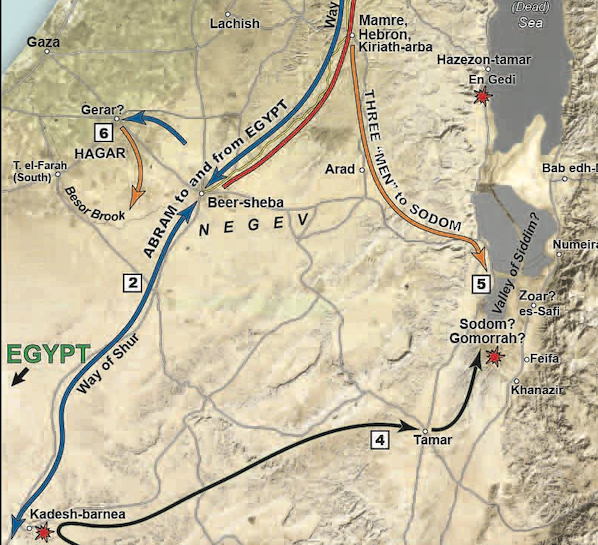



 



## Setting

These episodes take place primarily in Gerar and Beersheba.

1.  Abraham relocates to Gerar, a pagan kingdom (blue arrow towards Gerar) where he has another lack of faith (he didn't learn the lesson from Egypt) in which he tells a 1/2 truth that Sarah was his sister.  God intervened again to preserve the purity of his promise.

2.  Isaac, the son of the Promise (Gal 4:23-26) is born possibly at Gerar

3.  In Chapter 21, Abraham makes a treaty with the king of Gerar at Beersheva - well of seven/oath[^1]

## Genesis 20:1

>From there Abraham journeyed toward the territory of the Negeb and lived between Kadesh and Shur; and he sojourned in Gerar.

-   One reason we don’t have many archeological remains from this period is the nomadic lifestyle. People like Abraham moved somewhere, then moved on, often being deliberate about not leaving a trace.

-   Almost all Hebrew words have the accent on the last syllable. One exception is certain two syllable word that have a short e vowel. So the word for desert is not pronounced nuh-GEV, but NEH-gev.

-   Gerar is possibly a region, not a specific city, but many archeologists point to this location about 15 miles northwest of Beersheva as the likely location.[^2]

-   Kadesh, or Kadesh Barnea, will become a pivotal location later in the Torah.

    -   It is here that the 12 spies returned. When the 10 brought back a bad report and spread fear through the camp, a riot ensued. As punishment, God sentenced the people to wander in the wilderness for 38 more years (a total of 40), while that generation died off, except for the two spies who brought back a good report: Joshua and Caleb.

## Genesis 20:2

>And Abraham said of Sarah his wife, “She is my sister.” And Abimelech king of Gerar sent and took Sarah.

-   Oy vey!

-   This is the eighth test of Abraham, according to the sages. He doesn’t do so well.

    -   We sometimes face the same challenges repeatedly because we keep getting them wrong.

    -   Whatever blind spot Abraham has in his faith, he, unfortunately, passes it down to Isaac, who will pull the same ruse with Rebekah.

-   A 99-year-old woman was desirable. She must have been extremely beautiful.

-   Abimelech comes from two Hebrew words, Avi – my father and Melech – king.

    -   It is probably a title, “my father the king” (like a “lord and master” title in medieval times) versus a given name.

## Genesis 20:3-5

>But God came to Abimelech in a dream by night and said to him, “Behold, you are a dead man because of the woman whom you have taken, for she is a man's wife.” Now Abimelech had not approached her. So he said, “Lord, will you kill an innocent people? Did he not himself say to me, ‘She is my sister’? And she herself said, ‘He is my brother.’ In the integrity of my heart and the innocence of my hands I have done this.”

-   In one of the many mysteries of God, He periodically makes Himself known to non-Israelites. He also does this with Pharaoh and Nebuchadnezzar. Even more puzzling is that none of the three are recorded as putting their faith in the God of Abraham despite the divine encounter. Nebuchadnezzar comes closest in Daniel 4, but there is little historical evidence that he had a major change of heart.

## Genesis 20:6-8

>Then God said to him in the dream, “Yes, I know that you have done this in the integrity of your heart, and it was I who kept you from sinning against me. Therefore I did not let you touch her. Now then, return the man's wife, for he is a prophet, so that he will pray for you, and you shall live. But if you do not return her, know that you shall surely die, you and all who are yours.” So Abimelech rose early in the morning and called all his servants and told them all these things. And the men were very much afraid.

-   Calling Abraham a “prophet” might have been a term that Abimelech understood to mean Abraham had a unique relationship with his God.

-   Abraham was not necessarily a giver of prophecy the way we think of the term (as it relates to Elijah, Isaiah, and so forth).

    -   Prophecy is not limited to the prediction and fulfillment of future events.

    -   A prophet is someone who speaks the words of God.

-   Pragmatically, Abimelech also would have understood that as a prophet, Abraham had the ability to bless Abimelech, which in his mind would have equated to material blessings.

## Genesis 20:9-10

>Then Abimelech called Abraham and said to him, “What have you done to us? And how have I sinned against you, that you have brought on me and my kingdom a great sin? You have done to me things that ought not to be done.” And Abimelech said to Abraham, “What did you see, that you did this thing?”

-   He’s not wrong. Abraham blew his witness here.

    -   I love the way the KJV words 2 Sam 12:14. 2 Samuel 12:14 (KJV) by this deed thou hast given great occasion to the enemies of the LORD to blaspheme

        -   This is when Nathan confronts David over his sin with Bathsheba.

        -   Most of the other translations say something to the effect of “because you have disrespected the Lord.”

        -   The KJV focuses on the end result.

        -   Whenever we mess up publicly we misrepresent God.

        -   We’re supposed to be God’s ambassadors.

        -   Our character represents His character.

        -   “You didn’t just disrespect the Lord, which is bad enough. Your behavior reflected so poorly on your king that they blasphemed Him.” Ouch.

    -   

-   What did you see? I love that choice of words. We have a natural tendency to literally or figuratively see things that aren’t real.

-   We learn from verse 17 that there was a plague of barrenness upon Abimelech’s house because of this.

    -   Normally, some time would have needed to elapse before making the conclusion that they were afflicted with barrenness, yet this all apparently happened on the night Abimelech took Sarah.

        -   How would they know this was a plague from God in one night?

        -   Let’s just say one speculation is that Abimelech and his men needed to ask their doctor whether a particular class of medication was right for them.

        -   Another might be that those about to give birth were prevented from doing so; including hens unable to lay eggs according to the Talmud.

    -   In any case, the text is clear that nothing happened between Sarah and Abimelech.

        -   To underscore this and dispel any notion that Abimelech was the father of Isaac, Jewish tradition holds that Isaac’s physical appearance was in all respects identical to Abraham's.

        -   Interestingly, mocking traditions would later arise that Abimelech was the father of Isaac, just as mocking traditions arose that Jesus had a natural biologic father, whether by Joseph or a Roman soldier named Pantera.

        -   Isaac foreshadows Jesus in many ways, the greatest of which we will see next time in Genesis 22.

## Genesis 20:11-13

>Abraham said, “I did it because I thought, ‘There is no fear of God at all in this place, and they will kill me because of my wife.’ Besides, she is indeed my sister, the daughter of my father, though not the daughter of my mother, and she became my wife. And when God caused me to wander from my father's house, I said to her, ‘This is the kindness you must do me: at every place to which we come, say of me, “He is my brother.”’”

-   “It seemed like a good idea at the time.”

-   His assessment was incorrect. There WAS a fear of God in that place and Abimelech respected the boundaries of marriage.

    -   We get into trouble when we draw unsolicited conclusions about another’s spiritual status.

    -   Chuck Missler used to say “don’t draw vast conclusions from half-vast data.” (Let me know when you get the pun.)

    -   It is much better to give our neighbors the benefit of the doubt unless/until proven otherwise.

-   This is another “sire an Ishmael” moment, though God spared Abraham any negative consequences.

-   A half-truth with an intent to deceive is a full lie. In the same way, spreading an embarrassing fact about someone else with the intent to hurt that person is gossip and slander.

-   We see that Abraham devised this con before coming to the promised land. When we come to God, we need to cleanse out our old ways. For some of us, a lifetime is not enough, but we still try to live a God-honoring life.

-   The Bible does not hide the flaws of its leaders. It is possible to be a man or woman who is used mightily by God yet still flawed. That should give us encouragement.

## Genesis 20:14-16

>Then Abimelech took sheep and oxen, and male servants and female servants, and gave them to Abraham, and returned Sarah his wife to him. And Abimelech said, “Behold, my land is before you; dwell where it pleases you.” To Sarah, he said, “Behold, I have given your brother a thousand pieces of silver. It is a sign of your innocence in the eyes of all who are with you, and before everyone, you are vindicated.”

-   1000 shekels is about 25 pounds of silver, more than a worker could expect to make in a lifetime.[^3]

-   It’s Abimelech’s guarantee that Sarah was untouched and an appeasement to the prophet of the deity who cursed Abimelech’s household with barrenness.

-   In other words, it’s not a gift, it’s a transaction.

-   Abraham upholds his end of the contract in verse 17 and God is appeased in verse 18.

-   We have to give Abimelech due credit here – even though he did not wrong Abraham with prior knowledge or intent; he still makes it right.

### In His Dust Talmidim Way Insight

> If we have wronged someone, we are obligated to ask for forgiveness.[^4]

-   The sages teach that even though Abimelech made financial restitution, his full atonement came when he asked Abraham to intercede with prayer to God. Abimelech would have had to ask Abraham for this, so it follows that Abimelech had to ask Abraham for forgiveness for any anguish he caused.

-   “Forgive others, that God may forgive you” (e.g., Mat 6:14-15) is not exclusively a New Testament idea; it is well attested to in the Talmud. It’s a Jewish concept that our Jewish Messiah teaches us.

    -   The thought is not that God’s forgiveness is conditional; it is unconditional.

    -   The thought is, how can we call ourselves *talmidim* if we ask God for forgiveness but refuse to forgive others?

    -   One of the important aspects of Yom Kippur, the Jewish Day of Atonement, is seeking forgiveness for the sins we did not even know we committed. I wish Christianity had a day like that. An entire day devoted to getting right with God and our neighbors. Sign me up.

>Ephesians 4:32 Be kind to one another, compassionate, forgiving each other, just as God in Christ also has forgiven you.

## Genesis 20:17-18

>Then Abraham prayed to God, and God healed Abimelech and also healed his wife and female slaves so that they bore children. For the LORD had closed all the wombs of the house of Abimelech because of Sarah, Abraham's wife.

-   Abraham’s intercession brings immediate spiritual and physical relief; even though up to this point, Abraham’s prayers for he and Sarah to have a child have remained unanswered.

-   Perhaps it is because Abraham prayed for others that allowed God to bless Abraham and Sarah with Isaac. What’s holding you back from praying for others?

-   Let’s continue the Abraham and Abimelech narrative in Genesis 21:22

## Genesis 21:22-24

>At that time Abimelech and Phicol the commander of his army said to Abraham, “God is with you in all that you do. Now therefore swear to me here by God that you will not deal falsely with me or with my descendants or with my posterity, but as I have dealt kindly with you, so you will deal with me and with the land where you have sojourned.” And Abraham said, “I will swear.”

-   What a great testimony. I hope it can someday be said of me “God is with you in all that you do.”

    -   Of course, God is with me in all that I do; but I don’t always live my life in a way that others recognize it.

-   Despite Abraham’s duplicity, his relationship with Abimelech blossoms into a fruitful and symbiotic partnership.

-   Oaths are legally binding – this is more than a handshake agreement between friends.

## Genesis 21:25

>When Abraham reproved Abimelech about a well of water that Abimelech's servants had seized, Abimelech said, “I do not know who has done this thing; you did not tell me, and I have not heard of it until today.”

-   As part of a contract, one party has the right to notify the other if there is a potential material breach. Abraham is doing that here.

-   Beersheba is at the northern edge of the Negev desert. Even today, south of Beersheba is sparsely populated.

-   There is not much water, so what little water there is becomes a hot commodity.

-   Our tour guide’s wife is a hydrologist for the nation of Israel – even today, providing enough water for the population is of paramount interest. In the last ten years, the primary water source has shifted from the Jordan River and the Sea of Galilee to desalinated seawater from the Mediterranean.

### In His Dust Talmidim Way Insight

> When you reprove someone who has wronged you, have the good in mind.[^5]

-   We can learn from Abraham’s admonishment.

    -   Abraham was not angry, nor seeking to get even.

    -   He confronted Abimelech with the goal of restoring their relationship; a relationship Abimelech didn’t even know was injured.

    -   The challenge of a leader is that you can’t know everything, but it’s your job to know everything.

-   Abraham is reminding Abimelech that it was his job to know that his men were behaving dishonestly.

>   Matthew 18:15 “Now if your brother sins, go and show him his fault in private; if he listens to you, you have gained your brother.”

-   If you’re going to rebuke someone; do it one on one and ideally in person; not on social media.

-   Perhaps an associated insight is we need to *receive bad news as an improvement opportunity.*

    -   We can take the position that Abraham’s goal was not to tattle but to build Abimelech up as a leader. This is of course in addition to remedying the immediate situation.

    -   A senior executive I worked with paraphrased the famous line from the Godfather, “I want to hear good news right away and bad news immediately.”[^6]

    -   Fostering that kind of culture in an organization takes time but it is critical in our families and ministries as well as our businesses.

    -   Even if the other person is not bringing the criticism forward in a spirit of edification, if the substance of the criticism has merit, we can still learn from it.

>  Revelation 3:19 ‘Those whom I love, I rebuke and discipline; therefore be zealous and repent.’

## Genesis 21:27-28

>So Abraham took sheep and oxen and gave them to Abimelech, and the two men made a covenant. Abraham set seven ewe lambs of the flock apart.

-   Other than when it involves Sarah, Abraham is highly skilled as a negotiator and at resolving conflict.

    -   I take comfort in this – I was generally successful as a business executive and viewed as a capable and effective leader; yet I often struggle with leading my own family.

-   Sheva literally means “seven”; because of this episode, it also comes to mean “oath.”

## Genesis 21:29-31

>And Abimelech said to Abraham, “What is the meaning of these seven ewe lambs that you have set apart?” He said, “These seven ewe lambs you will take from my hand, that this may be a witness for me that I dug this well.” Therefore that place was called Beersheba, because there both of them swore an oath.

-   Wells turnout to be extremely significant in scripture. In John 4, Jacob’s well plays a prominent supporting role in the story of Jesus and the Samaritan woman.

-   Beersheba means literally “well of the seven” but denotatively, “well of the oath.”

## Genesis 21:32

>So they made a covenant at Beersheba. Then Abimelech and Phicol the commander of his army rose up and returned to the land of the Philistines.

-   This is a bit anachronistic as there were not yet Philistines in the coastal plain areas. Egyptians and Canaanites, yes; Philistines, no.

-   The narrator clarifies the geographic location for a later audience.

-   The first mention of the Philistines in history is around 1180 BC; we believe Abraham lived around 2000 or 1900 BC.

-   It’s similar to referring to “native Americans” who were around these lands long before the term “America” was used as a geographic label.

## Genesis 21:33-34

>Abraham planted a tamarisk tree in Beersheba and called there on the name of the LORD, the Everlasting God. And Abraham sojourned many days in the land of the Philistines.

-   The tamarisk is a good tree for the desert. It grows in sandy soil and provides ample shade and food for herbivores.

-   In Israel, we learned that “conquering the land” is not always a military campaign.

    -   Planting trees, literal and figurative roots in the land, is another way Abraham conquered the land.

    -   As the Zionists started to move back around the turn of the 20th century, much of the northern part of the country was a swamp. They imported Eucalyptus trees from Australia which sucked up all the water. The land is fertile once again.

    -   Today, Israel boasts that it plants more trees than it harvests.

-   Everlasting in Hebrew is “olam”; it can also mean “world” or “universe”.

    -   Almost all Jewish blessings start with “Baruch ata Adonai Eloheinu, Melech haOlam,” Blessed are you Lord our God, King of the Universe.”

-   Whenever we have tension and conflict, we should certainly seek God’s council for relief and godly wisdom on handling the situation.

    -   Just don’t forget to call on His name after He delivers you from the test.
-----
Pliskin, Zelig. *Love Your Neighbor:* Brooklyn, New York: Bnay Yakov Publications, 2004.

Schlegel, William. “The Land and the Bible: A Historical Geographical Companion to the Satellite Bible Atlas,” September 2013. https://www.bibleplaces.com/wp-content/uploads/2015/08/The-Land-and-the-Bible.pdf.

Walton, John H., Victor H. Matthews, and Mark W. Chavalas. *The IVP Bible Background Commentary: Old Testament*. (E-Sword). Downers Grove, Ill: IVP Academic, 2000.

[^1]: William Schlegel, “The Land and the Bible: A Historical Geographical Companion to the Satellite Bible Atlas,” September 2013, loc. Map 2-2., https://www.bibleplaces.com/wp-content/uploads/2015/08/The-Land-and-the-Bible.pdf.

[^2]: John H. Walton, Victor H. Matthews, and Mark W. Chavalas, *The IVP Bible Background Commentary: Old Testament*, (E-Sword) (Downers Grove, Ill: IVP Academic, 2000), loc. Gen 20:1.

[^3]: Walton, Matthews, and Chavalas, loc. Gen 20:16.

[^4]: Zelig Pliskin, *Love Your Neighbor:* (Brooklyn, New York: Bnay Yakov Publications, 2004), 78.

[^5]: Pliskin, 84.

[^6]: The line from the movie is, “Mr. Corleone is a man who insists on hearing bad news immediately.”

