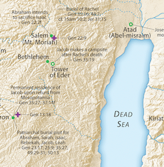
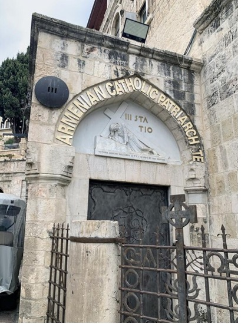



## Videos



## Geography

1.  The orange arrow from Gerar (box 6) towards Egypt marks the expulsion of Ishmael and Hagar into the wilderness of Beersheba

2.  Separation was necessary to protect the son of the promise

3.  The red arrow from Beersheba to Jerusalem (box 7) denotes the path to and from the offering of Isaac.

4.  Map credit[^1]

## Genesis 21 and Romans, Galatians, and Hebrews

-   An understanding of Genesis 21 is paramount to understanding Paul’s/Hebrew’s arguments.

-   Romans, Galatians, and Hebrews and only these three New Testament books discuss Genesis 21.

    -   Acts references the birth of Isaac; James and Hebrews reference the sacrifice of Isaac in Genesis 22.

-   It is easy to read Galatians and come away that Paul was somehow anti-law or anti-Judaism.

    -   This train of thought is deeply flawed and runs the risk of missing Paul’s points entirely.

    -   He is focused not on Judaism as a whole, but on the Messiah-rejecting Jews who are knowingly or unknowingly continuing in legalism instead of accepting the free gift the Messiah brings.

-   As an aside, the three books, and only these three New Testament books quote Habakkuk 2:4 (KJV) “but the just shall live by his faith.”

-   Romans, Galatians, and Hebrews seem to form a trilogy on Habakkuk 2:4.

    -   Theme of Romans: who are the justified?

    -   Theme of Galatians: how shall the justified live?

    -   Theme of Hebrews: faith in the promises.

-   This leads many to suspect Paul is the author of Hebrews. If he did not, this is an even greater miracle, because whoever wrote Hebrews unknowingly completed the trilogy!

## Genesis 21:1-3 

> Then the LORD took note of Sarah as He had said, and the LORD did for Sarah as He had promised. So Sarah conceived and bore a son to Abraham in his old age, at the appointed time of which God had spoken to him. Abraham named his son who was born to him, the son whom Sarah bore to him, Isaac.

-   Galatians 4:23 But the son by the slave woman was born according to the flesh, and the son by the free woman through the promise.

-   Hebrews 11:11 By faith even Sarah herself received the ability to conceive, even beyond the proper time of life, since she considered Him faithful who had promised.

-   Other translations say “God remembered Sarah.”

    -   This is not that God forgot, but that He remembered His promise.

-   “Appointed time” = *mo’ed.* The Jewish festivals are Moedim. Shabbat is a moed. A moed is a big deal.

    -   Perhaps Isaac was born on a festival day, just as some speculate Jesus might have been born on Yom Kippur or the first day of Tabernacles.

        -   Either day fits – He is our atonement and he dwells/tabernacles among us.

    -   “The Bible uses a miraculous birth to indicate that God has set aside that child for some great purpose.” (SOM 94)

-   Yitzhak is related to the Hebrew verb צחק, which means to laugh, but often carries a nuanced connotation of mocking/scorning or even sexual play.

    -   We’ll unpack more at verse 9.

## Genesis 21:4-7

> Then Abraham circumcised his son Isaac when he was eight days old, as God had commanded him. Now Abraham was a hundred years old when his son Isaac was born to him. Sarah said, “God has made laughter for me; everyone who hears will laugh with me.” And she said, “Who would have said to Abraham that Sarah would nurse children? Yet I have given birth to a son in his old age.”

-   Practically, in an age of high infant mortality rates, eight days, an infant was considered viable.

    -   Isaac was circumcised according to the letter of the law on the 8th day.

    -   This is contrasted with Ishmael, who was circumcised at age 13; he was still circumcised, but in a typological sense, not when he “should” have been according to the Law.

-   Given the nuanced meaning of Tzahaq, this may not necessarily be laughing in joy, but laughing in amazement. Sarah and Abraham both laughed in disbelief and perhaps mockery.

-   Isaac’s birth was a true miracle.

    -   There is an overarching theme in the Bible of God miraculously opening a closed womb. This extends to Mary; although she was not barren in the traditional sense, her womb was miraculously opened.

    -   God made EVERYTHING in Sarah come to life – she didn’t just give birth but was able to nurse for a couple of years after.

## Genesis 21:8-10

> And the child grew and was weaned, and Abraham held a great feast on the day that Isaac was weaned. Now Sarah saw the son of Hagar the Egyptian, whom she had borne to Abraham, mocking Isaac. Therefore she said to Abraham, “Drive out this slave woman and her son, for the son of this slave woman shall not be an heir with my son Isaac!”

-   This episode becomes symbolic of the affliction of the Hebrew/Jewish people throughout the ages.

    -   Galatians 4:29 But as at that time the son who was born according to the flesh persecuted the one who was born according to the Spirit, so it is even now.

    -   Galatians 4:31 So then, brothers and sisters, we are not children of a slave woman, but of the free woman.

    -   According to some reckonings, the 400 years of suffering and affliction culminating in the exodus from Egypt begins with this affliction of Isaac.

-   We don’t have much background on any tradition of a weaning feast.

-   We know who Hagar is, but the Narrator wants us to remember her as “Hagar the Egyptian.”

-   What did Ishmael do that was so bad that he and his mother had to be driven out?

    -   Here’s this word Tzahaq again, translated as mocking.

    -   “Laughter can be used for good or for ill.”[^2]

    -   Genesis 26:8 Now it came about, when he had been there a long time, that Abimelech king of the Philistines looked down through a window, and saw them, and behold, Isaac was **caressing** his wife Rebekah.

        -   Caressing = sporting = “Tzahaqing”

    -   Ishmael ridiculing and poking fun at his younger brother probably wouldn’t have led to the banishment.

    -   Ishmael was quite possibly a sexual predator.

    -   Sarah refuses to speak his name. Whatever it was, it had to be bad.

### Walking In His Dust Along The Talmidim Way

#### Talmidim must drive out fleshly works and sin from our lives.

> 1 Corinthians 5:7 Clean out the old leaven so that you may be a new lump, just as you are in fact unleavened. For Christ our Passover also has been sacrificed.

-   Another theme in the Bible is the firstborn son doing something to forfeit his inheritance.

    -   Normally, the firstborn son receives a double portion of the father’s estate.

    -   If the son does something wicked, he forfeits his promise; then the next in line receives.

    -   Not Ishmael but Isaac.

    -   Not Esau but Jacob.

    -   Not Reuben (and not Simeon or Levi) but Judah.

        -   Here we have an especially odd situation. Joseph was the firstborn of Jacob’s favorite wife Rebekkah.

        -   Judah receives the official double portion, but Joseph also receives a double portion with Ephraim and Manaesseh being adopted by Jacob.

## Genesis 21:11-13 

> The matter distressed Abraham greatly because of his son Ishmael. But God said to Abraham, “Do not be distressed because of the boy and your slave woman; whatever Sarah tells you, listen to her, for through Isaac your descendants shall be named. “And of the son of the slave woman I will make a nation also, because he is your descendant.”

-   Galatians 4:28 And you, brothers and sisters, like Isaac, are children of promise.

-   Romans 9:7 nor are they all children because they are Abraham’s descendants, but: “THROUGH ISAAC YOUR DESCENDANTS SHALL BE NAMED.”

-   Hebrews 11:18 it was he to whom it was said, “THROUGH ISAAC YOUR DESCENDANTS SHALL BE NAMED.”

-   The banishment of Ishmael is Abraham’s 9th test.

    -   We see here that he was reluctant and was “distressed.”

    -   He loved Ishmael.

    -   His specific tests:

        -   Did he trust God to take care of him?

        -   Did he trust God’s promises to make Ismael a great nation?

        -   Did he trust Sarah’s judgment after the last time?

    -   The trial of Ishmael prepared him for the final test in Genesis 22.

-   God had previously promised a great future for Ishmael, but Isaac is the one who will inherit.

-   It’s curious that the Narrator added, “whatever Sarah tells you, listen to her…”. Certainly, this was not the case in Genesis 16 or Genesis 3.

    -   Genesis 3:17 Then to Adam He said, “Because you have listened to the voice of your wife, and have eaten from the tree about which I commanded you, saying, ‘You shall not eat from it’; Cursed is the ground because of you; With hard labor you shall eat from it All the days of your life.

## Genesis 21:14-16 

> So Abraham got up early in the morning and took bread and a skin of water, and gave them to Hagar, putting them on her shoulder, and gave her the boy, and sent her away. And she departed and wandered about in the wilderness of Beersheba. When the water in the skin was used up, she left the boy under one of the bushes. Then she went and sat down opposite him, about a bowshot away, for she said, “May I not see the boy die!” And she sat opposite him, and raised her voice and wept.

-   Galatians 4:24 This is speaking allegorically, for these women are two covenants: one coming from Mount Sinai giving birth to children who are to be slaves; she is Hagar.

-   Galatians 4:31 So then, brothers and sisters, we are not children of a slave woman, but of the free woman.

    -   Stern makes an interesting comment at Galatians 4:24, “Nowhere does the account in Genesis denigrate Hagar, hense there is no reason to demean the Mosaic Law on the basis of this passage.

    -   It’s not the Torah or Judaism, but people who have perverted the Torah and Judaism into a legalistic system, which is equivalent to a return to slavery in Egypt.

-   This is essentially the same territory where she wandered in chapter 16.

-   We learned in Israel that in Abraham’s day, towns were generally situated about a day’s journey apart.

    -   He outfitted her with one day’s provisions with the expectation that she would “refuel” at the next town, perhaps Beersheba 15 miles from Gerar.

    -   For whatever reason, she doesn’t make it and heads into the wilderness/desert south of Beersheba.

        -   Did she make it but was turned away because of her “status”?

        -   Could she not make it that far?

        -   Perhaps distressed, did she meander aimlessly?

## Genesis 21:17-19

> God heard the boy crying; and the angel of God called to Hagar from heaven and said to her, “What is the matter with you, Hagar? Do not fear, for God has heard the voice of the boy where he is. “Get up, lift up the boy, and hold him by the hand, for I will make a great nation of him.” Then God opened her eyes, and she saw a well of water; and she went and filled the skin with water and gave the boy a drink.

-   Another significant well moment.

-   Just as in chapter 16, God again sees Hagar and provides materially.

-   He also reiterates His promises that Hagar had forgotten.

-   The well was there; she just couldn’t see it. That’s a picture of us some days. We can’t open our eyes enough to see the blessing before us.

-   Through Romans and Galatians, many of us have a dim view of Hagar and Ishmael – certainly, some of this is deserved and as biblical types, they represent the things that we are supposed to reject.

-   But let’s remember the Bible’s worst sinners are pictures of you and me.

-   Ishmael messed up “bigly.” We mess up too.

-   Here God reaches out and offers both Hagar and Ishmael His mercy and protection. We can be critical because it doesn’t appear that this mercy had any lasting effect. One would have hoped that they could have followed the God of Abraham. We have the same choices when God shows us mercy. How often does God bail us out or see us through a tough spot only to have us forget about God a few moments later?

### Walking In His Dust Along The Talmidim Way

#### When things seem hopeless, talmidim look for God’s promises.

Sometimes life hits us and we lose focus. When things seem bleak and we despair, we may need to open our eyes to the goodness of God.

> 1 Peter 3:14-15 But even if you should suffer for righteousness' sake, you will be blessed. Have no fear of them, nor be troubled, but in your hearts honor Christ the Lord as holy, always being prepared to make a defense to anyone who asks you for a reason for the hope that is in you; yet do it with gentleness and respect.

## Genesis 21:20-21 

> And God was with the boy, and he grew; and he lived in the wilderness and became an archer. He lived in the wilderness of Paran, and his mother took a wife for him from the land of Egypt.

-   Paran is in the northeastern Sinai desert.

-   This region figures prominently in the Wilderness wanderings (specifically Numbers 13, where Kadesh-Barnea is located).

## Genesis 22 - Abraham’s 10th test: The Akedah of Isaac

-   This story is sacred to Jews and Christians alike.

    -   Jews recite the 19 verses every morning as a reminder of how we endure trials that prove our character.

    -   Christians rightfully see this as the beloved son “dying” and being “resurrected.”

        -   The writer of Hebrews explains the figurative language.

        -   Hebrews 11:17-19 By faith Abraham, when he was tested, offered up Isaac, and he who had received the promises was in the act of offering up his only son, \[18\] of whom it was said, “Through Isaac shall your offspring be named.” \[19\] He considered that God was able even to raise him from the dead, from which, figuratively speaking, he did receive him back.

    -   Isaac as a type of Jesus will continue in chapter 24.

-   The story is also incredibly troubling.

    -   It doesn’t answer the obvious question we raise in response: how could God ask this of anyone?

-   Akedah means “binding.”

    -   The binding is a foreshadowing of Matthew 27:2: And they ***<u>bound</u>*** him and led him away and delivered him over to Pilate the governor.

## Genesis 22:1 

> After these things, God tested Abraham and said to him, “Abraham!” And he said, “Here I am.”

-   Hebrews 11:17.

-   After what things? The previous nine tests.

-   KJV has “tempt,” which is not the best rendition of Nisah.

    -   The sense is a test, like in boot camp where they push you to the limit to see what you’re made of.

    -   This is the word in Hebrew when Jesus quotes Deuteronomy 8 “you shall not put the Lord your God to the test.”

    -   In a Hebrew version of the Lord’s Prayer, the line “lead me not into tempatation” is literally, “do not bring me into the hands of a test.”

    -   God would never lead us into sinful temptation, and we should pray that we never have to be tested the way Abraham was.

-   _Hineini_ – a great one-word Hebrew prayer.

    -   Here I am. Behold me. Look, me.

    -   In the Bible, it is used to indicate one who is ready, willing, and able to serve God.

## Genesis 22:2-3 

> He said, “Take your son, your only son Isaac, whom you love, and go to the land of Moriah, and offer him there as a burnt offering on one of the mountains of which I shall tell you.” So Abraham rose early in the morning, saddled his donkey, and took two of his young men with him, and his son Isaac. And he cut the wood for the burnt offering and arose and went to the place of which God had told him.

-   Take your son:

    -   In Hebrew, Isaac’s name comes last

    -   The Hebrew sages fill in the details of the discussion:

        -   Take your son – but I have two sons.

        -   Your only/unique son – both are the only sons of their mothers.

            -   Yehidcha (lit. “your unique”) gets translated into Greek and Latin (e.g., church creeds) as “only begotten.”

            -   In this case, the sense is not a numeric designation but one of status.

            -   Jesus, of course, is both numerically singular and preeminent.

        -   Whom you love – I love them both.

        -   Even Isaac – (OH!)

-   Go to the land

    -   The Hebrew is “_Lech Lecha,_” “go forth.”

    -   This is the same command God gave Abram in Genesis 12.

    -   Thus the command for the first test is, in this respect, identical to the last.

    -   The call of Abram culminated in the command to sacrifice Isaac.

-   Mount Moriah is the area of Jerusalem.

    -   God later directed David and Solomon to the exact same mountain to build the temple.

    -   Thus Isaac’s offering is linked to the Temple sacrifices.

    -   The New Testament writers also link Jesus to these sacrifices, so we have a three-layered connection from Isaac, to the temple sacrifices, to Jesus’ once-and-for-all sacrifice.

    -   All involve the principle that the death of a righteous one provides atonement for the sins of the people.

-   “Rose early” means Abraham didn’t hesitate.

    -   IF Abraham is acting with the highest possible level of faith, it could be argued that he didn’t hesitate because God promised inheritance through Isaac.

    -   God had the problem, not Abraham.

    -   Isaac must be resurrected for the promise to be fulfilled.

    -   The wealthy Abraham even saddled his own donkey and even though over 100, he split the wood for the sacrifice.

        -   When God gives YOU a command, don’t hesitate and don’t delegate.

-   Three temptations?

    -   Jewish tradition holds that Satan appeared to Abraham three times in an attempt to circumvent what he was about to do.

    -   This is fascinating as the Gospels record the three temptations of Jesus, each one offering Jesus a shortcut to avoid going to the Cross.

-   Keep an eye on the two young men as we work through the story.

-   

## Genesis 22:4 

> On the third day Abraham lifted up his eyes and saw the place from afar.

-   Isaac was “dead” to Abraham when the command came.

-   On the third day, he was “resurrected.”

-   Hosea 6:2 “He will revive us after two days; He will raise us up on the third day, That we may live before Him.

-   “The place” becomes a proper noun. HaMakom. Jerusalem. The Place.

## Genesis 22:5 

> Then Abraham said to his young men, “Stay here with the donkey; I and the boy will go over there and worship and come again to you.”

-   How old is Isaac?

    -   Many Christians imagine Isaac as a young child, perhaps around 10 years old.

    -   The Hebrew word translated as “boy,” is *naar*, which means young lad.

    -   Na’ar usually refers to a bachelor (while technically true, we don’t generally refer to 10-year-olds as bachelors).

    -   Jewish tradition claims Isaac was 37, which is based on Sarah’s age at Isaac’s birth and her death at 127. This is because Jewish tradition holds that Sarah’s death (described in Chapter 23) occurred due to the command to sacrifice Isaac.

    -   While perhaps not exactly the same age, it does appear that both Isaac and Jesus were in their 30s.

-   Who is going to return to the two youths?

    -   It seems that in this great test of faith, Abraham would knowing lie here.

    -   It’s more likely that he had THAT much faith that Isaac would be resurrected somehow (See Hebrews 11:17-18).

    -   These two also serve as the legally required two witnesses. If anyone needed to verify the story, they could have asked the servants who were there.

## Genesis 22:6-7 

> And Abraham took the wood of the burnt offering and laid it on Isaac his son. And he took in his hand the fire and the knife. So they went both of them together. And Isaac said to his father Abraham, “My father!” And he said, “Here I am, my son.” He said, “Behold, the fire and the wood, but where is the lamb for a burnt offering?”

-   For Christians, this section certainly recalls Jesus making the journey to Golgotha under the weight of His cross.

    -   This way of suffering is commemorated by the Via Dolorosa in Jerusalem, which leads from the Antonio Fortress on the northeast side of the city to the Church of the Holy Sepulcher. Historically, Jesus was probably led from Pilate’s praetorium on the southwestern side of the Old City.

## Genesis 22:8

> Abraham said, “God will provide for himself the lamb for a burnt offering, my son.” So they went both of them together..

-   As our tour guide said, “Hebrew is cheap with words.” meaning one word can have multiple meanings.

-   The Hebrew phrase “Yireh-lo” could mean “he will see to it” or “he will provide himself.” It’s amazing that both are true here.

    -   God himself will provide the lamb.

    -   God will provide Himself as the lamb.

    -   Since the word for “provide” literally means “see,” God will see for Himself the lamb.

        -   This is in the sense that when God saw the blood of the Passover lamb on the doorposts, the death angel passed over.

        -   Jesus is also deliberately connected to the Passover Lamb of God. 1 Corinthians 5:7b For Christ our Passover also has been sacrificed.

        -   In Revelation, we see the Lamb as it had been slain. Revelation 5:6 “And I saw between the throne (with the four living creatures) and the elders a Lamb standing as if slaughtered, having seven horns and seven eyes, which are the seven spirits of God sent out into all the earth.”

    -   Wow.

-   Both as one

    -   Take note when the Holy Spirit repeats something. Abraham also says “my son” twice in three verses.

    -   We may wonder how an elderly Abraham coerced the younger Isaac into doing this.

        -   The answer is straightforward. He didn’t coerce Isaac.

        -   Jewish tradition holds that Isaac knew about the outcome and went to the wood willingly…just like another Son did.

    -   The conclusion of a helpless child being obliviously led to his death doesn’t fit the text, and I would argue it doesn’t fit the character of God.

    -   When we see Isaac as a model of Jesus, we can better understand that Isaac knew what his father asked of him and did so willingly.

    -   In fact many read this passage and conclude “God is condoning child sacrifice.”

        -   The opposite is true.

        -   The pagan religions around Abraham appeared to all practice child sacrifice; but here God says, “not me.”

    -   The repeated instances of “they walked on together” and “my son” indicates emphasis on Abraham and Isaac’s unity. In fact *yachdav*, “together,” means unity.

## Genesis 22:9 – the binding

> When they came to the place of which God had told him, Abraham built the altar there and laid the wood in order and bound Isaac his son and laid him on the altar, on top of the wood

-   Again, we could ask whether a 100-year-old could bind a 37-year-old man against his will.

    -   This is not likely.

    -   But the sages then ask, if Isaac was willing, why did Abraham need to bind him?

    -   Here, the answer is that Isaac asked to be bound, lest he flinch and somehow invalidate the sacrifice.

        -   If the knife had struck a non-vital area, such as a superficial wound on the arm, the ensuing sacrifice would not be “without blemish.”

        -   In the same way, it was not necessary to bind Jesus, but they did so anyway.

-   If all the messianic parallels in this chapter aren’t enough, the very name of the chapter in Hebrew, Akedah, comes from a root word meaning striped, referring to the stripe-like marks left by the ropes.

    -   The entire story is named after the marks left on Isaac’s body.

    -   Isaiah 53:5 (KJV) But he was wounded for our transgressions, he was bruised for our iniquities: the chastisement of our peace was upon him; and with his ***stripes*** we are healed.

-   The sages note that Abraham didn’t build *an* alter there; he built *THE* altar there.

    -   This becomes the altar of the Temple

## Genesis 22:10-12 – the “resurrection”

> Then Abraham reached out his hand and took the knife to slaughter his son. But the angel of the LORD called to him from heaven and said, “Abraham, Abraham!” And he said, “Here I am.” He said, “Do not lay your hand on the boy or do anything to him, for now, I know that you fear God, seeing you have not withheld your son, your only son, from me.”

-   What if Abraham had said, “not now, I’m busy”?

-   Hineni!

-   Hebrews 11:19 (NASB) He considered that God is able to raise people even from the dead, from which he also received him back as a type.

-   The Writer to Hebrews was quoting a well-known tradition that Isaac died (some say literally) and was resurrected on the Altar.

    -   According to the Torah Isaac did not die but often, these traditions, though seemingly fanciful, contain greater truths and insights.

    -   The fact that Hebrews quotes this indicates the legend was well-known throughout the Jewish communities, which of course spread to the gentile churches. This should not surprise us as the early church leaders were all Jewish and would have passed on this and many other Jewish teachings that tie together Old Testament events with the life, death, and resurrection of Yeshua.

## Genesis 22:13-14 – the substitute

> And Abraham lifted up his eyes and looked, and behold, behind him was a ram, caught in a thicket by his horns. And Abraham went and took the ram and offered it up as a burnt offering instead of his son. So Abraham called the name of that place, “The LORD will provide”; as it is said to this day, “On the mount of the LORD it shall be provided.”

-   Y—H Yireh

    -   Literally, “the LORD sees”, but in the sense of “he will see to it,” i.e., “provide.”

-   It SHALL BE provided?

    -   It seems like it should say “The LORD provided,” but the verb is imperfect.

    -   Did Abraham know that this procedure acted out the prophecy in advance?

    -   We can’t know for sure but it seems logical that when Jesus said, “Your father Abraham rejoiced that he would see my day. He saw it and was glad” (John 8:56), namely the multiple references to “see,” Jesus was referring to this event.

-   The ram also suggests a substitutionary offering.

    -   You and I are in Isaac’s shoes.

    -   We deserve death but God provides himself (literally), just as Abraham said in verse 8.

-   Jewish tradition holds that the horns from Isaac’s ram that will herald the coming of the Messiah.

## Genesis 22:15-18

> And the angel of the LORD called to Abraham a second time from heaven and said, “By myself I have sworn, declares the LORD, because you have done this and have not withheld your son, your only son, I will surely bless you, and I will surely multiply your offspring as the stars of heaven and as the sand that is on the seashore. And your offspring shall possess the gate of his enemies, and in your offspring shall all the nations of the earth be blessed, because you have obeyed my voice.”

-   Hebrews 6:13-15 For when God made the promise to Abraham, since He could swear an oath by no one greater, He swore by Himself, \[14\] saying, “INDEED I WILL GREATLY BLESS YOU AND I WILL GREATLY MULTIPLY YOU.” \[15\] And so, having patiently waited, he obtained the promise.

-   Hebrews 11:12 Therefore even from one man, and one who was as good as dead at that, there were born descendants who were just as the stars of heaven in number, and as the innumerable grains of sand along the seashore.

-   The angel of the Lord begins the conversation but the words are God’s himself, so much that there is no distinction between the angel of the LORD and the LORD.

-   John 10:30 “I and the Father are one.”

-   Abraham passes this greatest test and the promise of offspring is reiterated.

### Walking In His Dust Along The Talmidim Way

#### Talmidim can expect our faith to be tested

-   Lancaster writes, “Real faith requires real faithfulness. Real faith results in obedience. Every time we obey God, we prove our faithfulness.”[^3]

-   Three phases of Salvation:

    -   Justification phase of salvation: one-time, yielding to Jesus as our savior. He does all the work. We simply cease resisting.

    -   Sanctification phase of salvation: everything after that until you die that proves your justification is genuine.

    -   Glorification phase of salvation: everything after that.

-   “In the same way a potter does not (bother to) test defective pots, but only sound vessels, the Holy One, blessed be He, does not test the wicked but only the righteous” (Genesis Rabbah 55:2).[^4]

-   In his famous passage containing “faith without works is dead” (James 2:17), James, the brother of Jesus, used this story of Abraham as his proof text.

    -   James 2:20-24 But are you willing to acknowledge, you foolish person, that faith without works is useless? Was our father Abraham not justified by works when he offered up his son Isaac on the altar? You see that faith was working with his works, and as a result of the works, faith was perfected; and the Scripture was fulfilled which says, “AND ABRAHAM BELIEVED GOD, AND IT WAS CREDITED TO HIM AS RIGHTEOUSNESS,” and he was called a friend of God. You see that a person is justified by works and not by faith alone.

## Genesis 22:19 

So Abraham returned to his young men, and they arose and went together to Beersheba. And Abraham lived at Beersheba.

-   Who returned to the young men?

    -   The casual reader concludes, rather obviously, Abraham AND ISAAC came down from the mountain, rejoined the two young men and returned to Beersheba.

    -   But that’s not what the text says.

    -   Isaac will not appear again until Genesis 24:62, when he meets Rebekkah.

-   The son is sacrificed by the father.

-   The son is “resurrected” (according to Hebrews).

-   The son “disappears” until he is united with his bride.

-   Do you mean to tell me…? Yes.

## Genesis 22:20-24

> Now after these things it was told to Abraham, “Behold, Milcah also has borne children to your brother Nahor: Uz his firstborn, Buz his brother, Kemuel the father of Aram, Chesed, Hazo, Pildash, Jidlaph, and Bethuel.” (Bethuel fathered Rebekah.) These eight Milcah bore to Nahor, Abraham's brother. Moreover, his concubine, whose name was Reumah, bore Tebah, Gaham, Tahash, and Maacah.

## Final Thoughts

### We need to look beyond

From a spiritual perspective, at some level Abraham knew that the promises to make him a great nation probably would not be achieved during his earthly lifetime.  He knew that God's promises looked beyond death into the next age.  The same is true for us![^5]

### A Covenantal Obligation?

-   In many respects, the Akedah cannot be completely understood without the lends of the New Testament that clarifies Abraham and Isaac was an act of prophecy that pointed to Jesus.

-   Lancaster includes something extraordinary from Jewish tradition.

-   “A covenant is a two-way street,” he writes.

-   The first party can’t ask the second to do something the first person would not do.

-   After Abraham demonstrated his willingness to offer Isaac, the ball was now in God’s court to perform and reciprocate.

-   “Abraham’s willing sacrifice asked for an equal show of covenant devotion from the LORD.

-   **The sacrifice of Isaac not only foreshadowed the sacrifice of Yeshua, IT DEMANDED IT.**[^6]

### Messianic Parallels

| Isaac from Bible and Jewish Tradition                                        | Jesus from Bible                                                                                                                  |
|------------------------------------------------------------------------------|-----------------------------------------------------------------------------------------------------------------------------------|
| Exact likeness to his father Abraham.                                        | “He who has seen me has seen the Father.” (John 14:9)                                                                              |
| Promised son of the covenant with Abraham.                                   | Promised Son of the covenant with Abraham and David                                                                               |
| A miraculous conception.                                                     | A miraculous conception.                                                                                                          |
| Long awaited fulfillment of God’s promise.                                   | Long awaited fulfillment of biblical prophecies.                                                                                  |
| Sacrificed in Jerusalem by his father.                                       | Suffered and died in Jerusalem by the will of His father.                                                                         |
| Willingly complied.                                                          | Willingly complied.                                                                                                               |
| Thirty six or thirty-seven years old.                                        | In His 30’s, possibly thirty-six.                                                                                                 |
| Temple service later instituted on merit of Isaac’s sacrifice.               | Temple service foreshadows suffering and atonement of Yeshua.                                                                     |
| Resurrection on the third day                                                | Resurrection on the third day.                                                                                                    |
| Sacrifice atones for Jewish people.                                          | Sacrifice atones for all sinners.                                                                                                 |
| Tempted by Satan three times.                                                | Tempted by Satan three times.                                                                                                     |
| Isaac carried the wood.                                                      | Jesus carried His cross.                                                                                                          |
| Blood of Isaac foreshadowed Passover lamb.                                   | Blood of Messiah invoked the blood of the Passover lamb.                                                                          |
| *Yachdav* – United in will and purpose with his father.                      | “Not my will but yours be done” (Luke 22:42).                                                                                     |
| Bruised on his wrists and ankles by the ropes.                               | Scarred on His wrists and ankles by the nails.                                                                                    |
| On the merit of Isaac’s resurrection, the Jewish dead are raised.            | On the merit of Jesus’ resurrection, the dead are raised.                                                                         |
| God kept His covenant with Abraham because Abraham did not withhold his son. | Abraham’s faithfulness required God not to withhold His son, extending Abraham’s covenants to those who are grafted into Abraham. |

### References

“Bereishit Rabbah.” Accessed January 30, 2023. https://www.sefaria.org/Bereishit_Rabbah.

Lancaster, D. Thomas. *Unrolling the Scroll*. Edited by Boaz Michael and Seth Dralle. 2nd ed. Torah Club. Marshfield, MO: First Fruits of Zion, 2014.

Lancaster, Daniel T. *Depths of the Torah*. Edited by Boaz D. Michael and Steven P. Lancaster. 2nd ed. Torah Club. Marshfield, MO: First Fruits of Zion, 2017.

Schlegel, William. “The Land and the Bible: A Historical Geographical Companion to the Satellite Bible Atlas,” September 2013. https://www.bibleplaces.com/wp-content/uploads/2015/08/The-Land-and-the-Bible.pdf.

———. *The Satellite Bible Atlas*. Israel: William Schlegel, 2013.

-----

[^1]: William Schlegel, *The Satellite Bible Atlas* (Israel: William Schlegel, 2013), loc. Map 2-2.

[^2]: D. Thomas Lancaster, *Unrolling the Scroll*, ed. Boaz Michael and Seth Dralle, 2nd ed., Torah Club (Marshfield, MO: First Fruits of Zion, 2014), 81.

[^3]: Lancaster, 84.

[^4]: “Bereishit Rabbah 55,” accessed January 30, 2023, https://www.sefaria.org/Bereishit_Rabbah.

[^5]: William Schlegel, “The Land and the Bible: A Historical Geographical Companion to the Satellite Bible Atlas,” September 2013, loc. Map 2-2, https://www.bibleplaces.com/wp-content/uploads/2015/08/The-Land-and-the-Bible.pdf.

[^6]: Daniel T. Lancaster, *Depths of the Torah*, ed. Boaz D. Michael and Steven P. Lancaster, 2nd ed., Torah Club (Marshfield, MO: First Fruits of Zion, 2017), 159.

 

