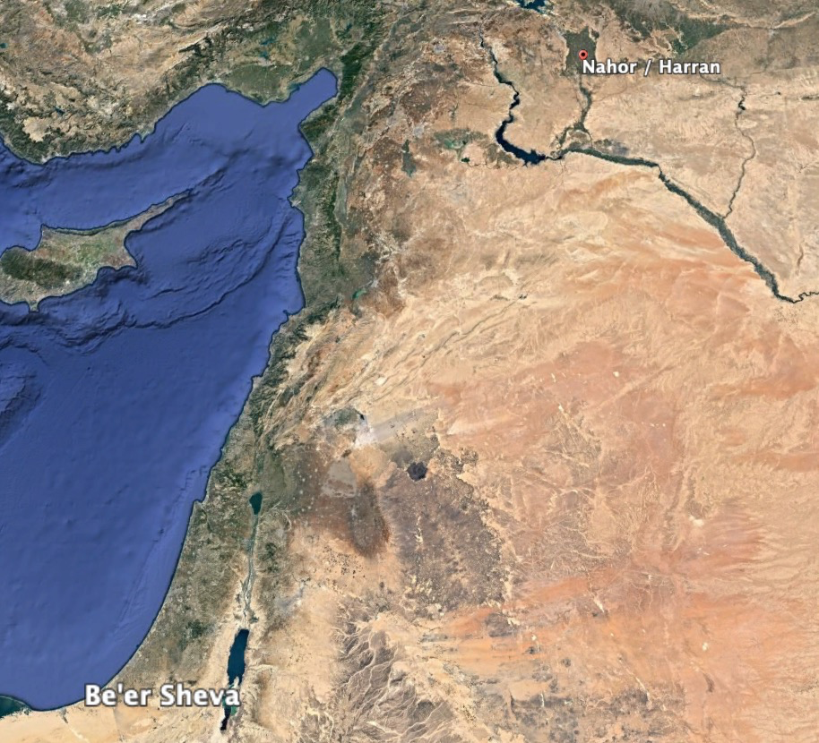
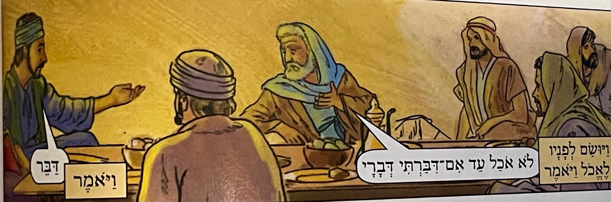
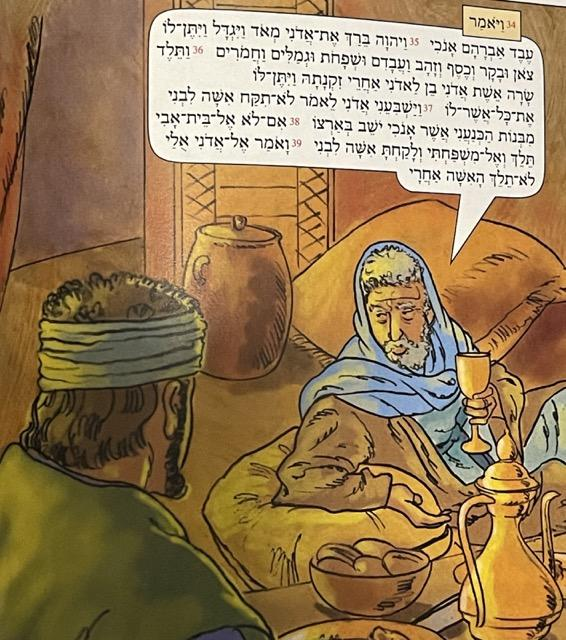
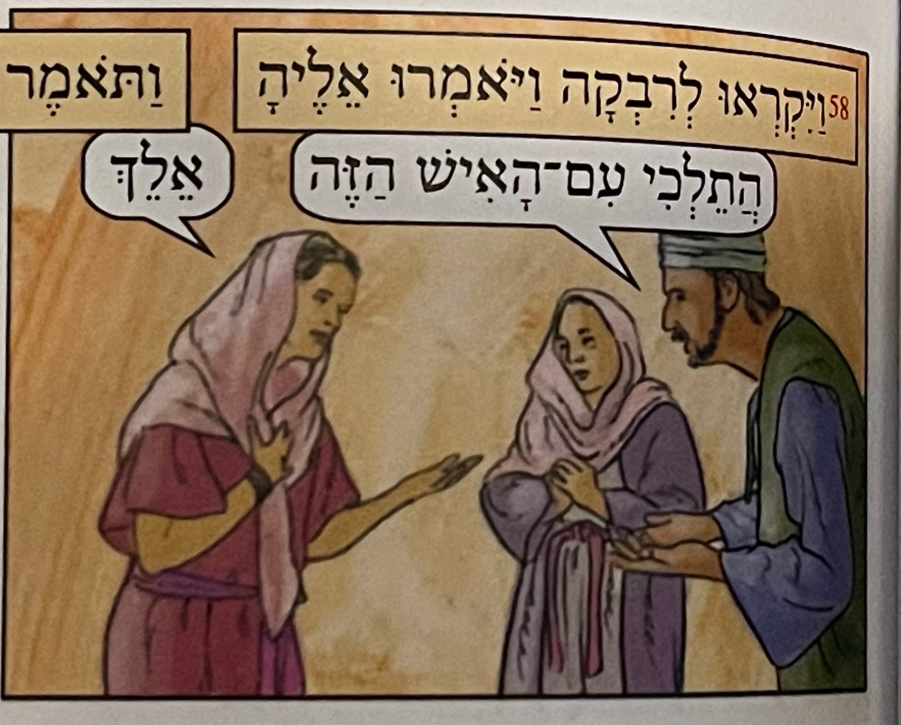



## Videos

Part I: 24:1-32


Part II: 24:33-67


Part III: New Testament Parallels in Genesis 22 and 24


## Introduction

### Typology

- Genesis 24 is the longest chapter in Genesis and is a fantastic chapter for believers in Yeshua.

  - Galatians 3:14- so that in Christ Jesus the blessing of Abraham would come to the Gentiles so that we would receive the promise of the Spirit through faith.

- Scripture has many layers of interpretation.

  - We start with the immediate narrative: a literal servant was sent to gather a literal bride for Isaac.

  - But some layers go beyond the literal sense, such as types and shadows, hints that go beyond the literal meaning and may be connected with other passages, prophecy (which itself may have a short-term and a long-range fulfillment), mystical/esoteric meanings, and finally, life application for us many thousands of years and miles removed from where/when these stories took place.
  

Taking a strictly allegorical position of interpretation is not usually correct, UNLESS, the context of the original passage is clearly intended to be interpreted as an allegory.
More often than not, allegories lead to error, and "front-page exegesis" as we discussed in our Revelation study.


- Genesis 24 is a straightforward narrative, but when we apply typology, we see a vivid picture of Jesus and the church.

- We remember from chapter 22 that Abraham is a type of the Father, and Isaac is a type of the Son.

  - Recall that Isaac has not been “seen” since we left him on Mount Moriah.

  - Genesis 22:19 - So Abraham returned to his young men, and they got up and went together to Beersheba, and Abraham lived in Beersheba.

  - It doesn’t say “Abraham and Isaac returned,” it just says “Abraham returned.

- In this chapter, Abraham will send his senior servant on a mission to gather a bride for Isaac.

  - We know from Genesis 15 that Abraham’s eldest servant is named Eliezar, which means “God of comfort ” or “god of help.”

  - So Abraham’s servant becomes a type of the Holy Spirit since the Holy Spirit is also called a helper and a comforter.

  - Why is Eliezer not mentioned by name?

    - “Eliezer set aside personal identity because he was on a mission (representing) his master Abraham.”[^1]

    - John 16:13 “But when He, the Spirit of truth, comes, He will guide you into all the truth; for He will not speak on His own.

    - The Spirit never draws attention to Himself but points to Jesus, just as Jesus points to the Father.

    - Similarly, we are servants of Jesus. “We represent Him, not ourselves.”[^2]

- The Helper is sent to gentile lands to fetch a bride for the Son.

- The ecclesia, the church, is called the “bride” or “the bride of Christ.”

  - Eph 5:23 For the husband is the head of the wife, as Christ also is the head of the church, He being the Savior of the body.

  - 2Co 11:2 For I am jealous for you with a godly jealousy; for I betrothed you to one husband, to present you as a pure virgin to Christ.

  - Rev 21:9 Then one of the seven angels who had the seven bowls, full of the seven last plagues, came and spoke with me, saying, “Come here, I will show you the bride, the wife of the Lamb.”

- An additional typological application is to view Eliezer as the ambassador of the Father, sent to proclaim the Father’s word to potential “brides” of the Son.

  - In other words, Eliezer is a type of us being sent out to proclaim the good news among the nations.

- Watch for both of these models as we work through Genesis 24.

- Then in a bit of an adversarial role, we also have Laban, Rebekah’s brother.

  - Laban is a quintessential “what’s in it for me” character.

  - He tries to distract and delay the bride.

  - In this model, he can be said to represent the world who tries to get us focused on the wrong things, and also our flesh who is easily distracted by the wrong things.

- Keep an eye on these types as we work through this chapter.

## Abraham commissions Elieaer - Gen 24:1-4 

###### Now Abraham was old, advanced in age, and the LORD had blessed Abraham in every way. Abraham said to his servant, the oldest of his household who was in charge of all that he owned, “Please place your hand under my thigh, and I will make you swear by the LORD, the God of heaven and the God of earth, that you shall not take a wife for my son from the daughters of the Canaanites, among whom I live; but you will go to my country and to my relatives, and take a wife for my son Isaac.” 

- The Hebrew phrase “old and advanced in years” occurs three times: Abraham, Joshua, and David. Jewish sages connect the three men.[^3]

  - Abraham received the promise of the seed.

  - Joshua, of the tribe of Ephraim, son of Joseph, represents “Messiah ben Joseph,” the one who will suffer for the people.

  - David naturally represents “Messiah ben David,” the righteous conqueror who fathered the royal line.

  - Christians, of course, do not see two different messiahs, but One Messiah, Yeshua, with two different appearings: one to suffer for the people and one to conquer in righteousness.

- Blessed in every way

  - Eph 1:3 Blessed be the God and Father of our Lord Jesus Christ, who has blessed us with every spiritual blessing in the heavenly places in Christ,

- Arranged marriages were the norm until relatively recently.

  - More than just two people coming together, two families come together.

- We tend to take a dim view of the Canaanites, but historically they were an advanced civilization.

  - From a spiritual perspective, we’re told they are exceedingly wicked. Does that sound like America? There is nothing new under the sun.

  - “The Canaanite religion became a toxic poison for the children of Israel. Likewise, we must not allow the idolatrous world to exercise its influence over the (bride) of Messiah.”[^4]

  - 2Co 6:14 Do not be mismatched with unbelievers; for what do righteousness and lawlessness share, or what does light have in common with darkness?

  - Exo 34:15-16 otherwise you might make a covenant with the inhabitants of the land, and they would prostitute themselves with their gods and sacrifice to their gods, and someone might invite you to eat of his sacrifice, and you might take some of his daughters for your sons, and his daughters might prostitute themselves with their gods and cause your sons also to prostitute themselves with their gods.

- Practically speaking, God could not later command Abraham’s descendants to drive the Canaanites from the land if Abraham’s descendants were themselves Canaanites.

## Eliezer clarifies the mission - Gen 24:5-8 

###### The servant said, “Suppose the woman is not willing to follow me to this land; should I take your son back to the land from where you came?” Then Abraham said to him, “Beware that you do not take my son back there! “The LORD, the God of heaven, who took me from my father’s house and the land of my birth, and who spoke to me and who swore to me, saying, ‘To your descendants I will give this land’—He will send His angel ahead of you, and you will take a wife for my son from there. “But if the woman is not willing to follow you, then you will be free of this oath of mine; only do not take my son back there.” 

- Why not send Isaac?

  - Isaac is never permitted to leave the boundaries of the Promised Land (Israel)

    - Whereas Abraham went to Egypt during a time fo famine, in Genesis 26, God blocks Isaac from doing so.

  - Isaac was a sacrifice. The exact phrase “Beware that you do not..” occurs in Deuteronomy 12:13 “Be careful that you do not offer your burnt offerings \[outside the temple\]. Burnt offerings could not be removed from the sacred space.[^5]

  - It wouldn’t fit the type of Jesus’ sacrifice, ascension, and return to meet Bride.

  - This is a reminder that the Son, Yeshua, is Jewish

    - Many depictions of Him make him look like a blonde haired, blue eyed Northern European.

    - While “the transforming power of the gospel is not limited by ethnic or sociological boundaries,” just as Isaac could not be removed from the boundaries of the Holy Land, we should resist any attempts to remove Jesus from His Jewish identity.

- Angel before you

  - Ex 23;20

  - Ex 33:2

  - Mal 3:1

- Abraham is supremely confident that Eliezer will be successful; in the same way we presume he was supremely confident that Isaac would be resurrected when the command to sacrifice came.

- Eliezer is only responsible for delivering the message, not the outcome.

- We sometimes think that we have failed if the person rejects our message or if the building is nearly empty when we teach.

- If we share the message when called to do so we have fulfilled our mission. Like Eliezer we are not held accountable for winning converts.

## Eliezer testifies - Gen 24:9

###### So the servant placed his hand under the thigh of his master Abraham and swore to him concerning this matter.

- This procedure is a bit more socially awkward in our culture.

  - Abraham says, “swear upon my circumcision, the sign of the covenant.”

  - In other words, if the servant did not carry out the oath, “the children born to Abraham would avenge the servant’s unfaithfulness.”[^6]

  - In effect, we agree to similar terms when we swear on a Bible to tell the truth.

- Some sources believe the word “testify” relates to the Latin word for the male anatomy in this region, indicating a possible connection to this ancient practice. Other sources disagree.

## Eliezer departs - Gen 24:10-11

###### Then the servant took ten camels from the camels of his master and went out with a variety of good things of his master’s in his hand, so he set out and went to Mesopotamia, to the city of Nahor. He made the camels kneel down outside the city by the well of water when it was evening, the time when women go out to draw water.

- Lancaster writes, “as we go forth to proclaim the good news, we bring the good things from the household of God…things the world needs..”[^7]

  - If Eliezer had shown up empty-handed trying to land an attractive woman for a faceless stranger, how successful would he have been?

  - The gifts he brought from Abraham established Eliezer’s credibility.

  - It’s no different with us. The good things from the Hand of our Father establish our credibility.

  - What gifts are these that we can bring?

  - Gal 5:22-23 “But the fruit of the Spirit is love, joy, peace, patience, kindness, goodness, faithfulness, gentleness, self-control”

- Also note that Eliezer is the perfect servant. He’s carrying a massive haul, yet he is trusted by Abraham completely.

  - One thing that makes David’s conspiracy to murder Uriah especially heinous is Uriah himself carried the letter with the orders to place him in the front of the battle, where the enemy would kill him.

  - David knew Uriah was so loyal that Uriah would never open a letter not addressed to him.

  - Ethics is what you do when no one is watching.

- We know from verse 33 that he had other servants with him.It is approximately 450 miles from Beersheba to Nahor. The journey would have taken several days.

- Verse 11 shows that the Samaritan woman came to Jacob’s well at an unusual time, but it appears Rebekah was alone

  - Maybe we shouldn’t read too much into the fact the Samaritan woman was at the well alone.

  - But if our desire is to quench one’s spiritual thirst, we have to find people who are thirsty (cf. John 4:13-14)

## Eliezer prays -  Gen 24:12-14 

###### And he said, “LORD, God of my master Abraham, please grant me success today, and show kindness to my master Abraham. “Behold, I am standing by the spring, and the daughters of the men of the city are coming out to draw water; now may it be that the young woman to whom I say, ‘Please let down your jar so that I may drink,’ and who answers, ‘Drink, and I will water your camels also’—may she be the one whom You have appointed for Your servant Isaac; and by this, I will know that You have shown kindness to my master.” 

- Eleizaer knew what to do when facing a big test: he prayed.

  - While not the first mention of prayer, this is the first recorded prayer in the Bible.

  - We could see it as God placing the words upon Eliezer’s mouth and not necessarily Elizaer demanding a series of tests from God.

  - Only a selfless woman would offer to water ten camels.

    - According to hospitality customs, this gesture would have been far above and beyond what would typically have been expected.

    - “To water 10 thirsty games involved much work, for camels guzzle great amounts of water.”[^8]

    - It was also demeaning work.

- Eliezer prayed in the name of his master Abraham, just like we pray in the name of our Master Jesus.

  - Let us not say “In Jesus' name, amen” to sign off or say “peace, out.”

  - “When we pray in His name, we remind the Father of His Kindness (hebrew: Chesed, lovingkindness or covenant devotion” to His Son, and we remind the Father that we are associated with His Son (just as Elizaer is associated with Abraham. (When we say “amen,) we ask to be answered not on our own merit, but on His marit.”[^9]

  - In other words, “please grant me success today and show kindness to my master Yeshua.”[^10]

  - We should do this in all our endeavors.

  - This is a great prayer to begin each day.

  - We should especially pray like this before setting out to share the good news.

## Rebekah appears - Gen 24:15-16

###### And it came about before he had finished speaking, that behold, Rebekah, born to Bethuel the son of Milcah, the wife of Abraham’s brother Nahor, came out with her jar on her shoulder. The young woman was very beautiful, a virgin; no man had had relations with her. She went down to the spring, filled her jar, and came up.

- Chuck Missler taught me that every word, every name, every place, and every detail in the Bible is there by deliberate design.

  - The last four verses of Genesis 22 seemed out of place.

  - As we read further, we see it as an essential puzzle piece.

  - Hearing this news motivated Abraham to find a wife for Isaac.

  - If we do the math, Rebekah is Isaac’s second cousin.

  - Some commentators go off the rails and, based on the placement of the passage in Genesis 22, conclude that Rebekah must have been born after Isaac was bound.

    - This would make her three years old, which is absurd given the text (a three-year-old would not be watering camels and would not have been given a choice as to whether to stay or go).

- The ultimate bride for Isaac is a gentile but is a blood-relative of Abraham. We could say a Gentile, grafted into Abraham!

- Sometimes we start by looking for someone or something beautiful (be it a bride or whatever else). Eliazer first looked for a woman of the highest character and got a beautiful woman as a bonus!

- Rebekah represents a divine appointment at a well. Jesus would have one of these (with a spiritual bride-to-be, not a literal one) in John 4.

## Rebekah offers to water 10 camels! - Gen 24:17-19 

###### Then the servant ran to meet her and said, “Please let me drink a little water from your jar.” And she said, “Drink, my lord”; then she quickly lowered her jar to her hand and gave him a drink. When she finished giving him a drink, she said, “I will also draw water for your camels until they have finished drinking.” 

- Almost a mirror of John 4;

  - Joh 4:7 A woman of Samaria \*came to draw water. Jesus \*said to her, “Give Me a drink.”

  - Note the Samaritan woman’s response! John 4:9 So the Samaritan woman said to Him, “How is it that You, though You are a Jew, are asking me for a drink, though I am a Samaritan woman?” (For Jews do not associate with Samaritans.).

  - We also infer, “I have a pot, but I’m definitely not giving it to YOU.”

<!-- -->

- As we share the gospel, we need to remember we are more likely to encounter the Samaritan woman than we are Rebekah.

  - Morally, they couldn’t be further apart. Rebekah was pure. The Samaritan woman had multiple sexual partners and, *potentially,* was in an inappropriate sexual relationship as Jesus spoke with her.

  - Jesus looked past her circumstances and restored her to a pure spiritual state like that of Rebekkah.

  - Let us remember to look past someone’s external circumstances.

- There are many character traits from Rebekah that, as the church, the Bride of Christ, we should emulate. One here might be “say a little, but do much.”[^11] Pliskin continues, We should follow the examples of Abraham and Rebekah not to needlessly boast about our plans to do good deeds.”[^12]

## Eliezer observes - Gen 24:20-22 

###### So she quickly emptied her jar into the trough and ran back to the well to draw and drew for all his camels. Meanwhile, the man was taking a close look at her in silence to find out whether the LORD had made his journey successful or not. When the camels had finished drinking, the man took a gold ring weighing a half-shekel and two bracelets for her wrists weighing ten shekels in gold,

- Verse 21 as a type of evangelism reminds us to be situationally aware.

  - Some go about evangelism like an aggressive salesman trying to close a deal.[^13]

  - Often saying nothing is better than casting pearls before swine.

  - Only when he was convinced the LORD had made the journey successful, did he unveil the gifts.

    - But even the gifts came before the message.

    - If we don’t demonstrate the gifts of the fruit of the Spirit, our message may fall on deaf ears.

    - Jesus referenced the Gift of God in John 4:10 before the theological discussion later in the chapter.

- The ring here, which is stated as an earring in other translations, could be a “Head ring,” what we might call a headband.

- Rebekkah was very beautiful, but she also exhibited “humility, kindness, concern for other, industriousness, and hospitality.”[^14]

- Eliezer appears to make one mistake here.  
    - He is supposed to qualify her completely before giving gifts.  
    - He gives her gifts before finding out whether she is Abraham's relative.  
    - Compare the order here with the story as he tells it to Laban later in the chapter.

#### In His Footsteps: “Like Rebekah, A person who wishes to do an act of lovingkindness will do more than asked.”[^15] 

- In verse 18, Rebekah not only offered to water the camels but here in verse 20, she RAN to do so.

- Galatians 6:9-10 Let’s not become discouraged in doing good, for in due time we will reap, if we do not become weary. So then, while we have the opportunity, let’s do good to all people, especially to those who are of the household of the faith.

## Rebekah is Abraham's relative - Gen 24:23-25

###### and he said, “Whose daughter are you? Please tell me, is there room for us to stay overnight at your father’s house?” She said to him, “I am the daughter of Bethuel, Milcah’s son, whom she bore to Nahor.” Again she said to him, “We have plenty of both straw and feed, and room to stay overnight.”

- Eliezer had other staff members with him. To request food and board was a non-trivial request.

## Eliezer gives thanks - Gen 24:26-27

###### Then the man bowed low and worshiped the LORD. And he said, “Blessed be the LORD, the God of my master Abraham, who has not abandoned His kindness and His trustworthiness toward my master; as for me, the LORD has guided me in the way to the house of my master’s brothers.”

- The classic Jewish blessing has roots right here.

  - Statement of blessing: Blessed are you / Blessed be the LORD

  - Address: Lord our God, King of the universe / the God of my master Abraham

  - Descriptive act: who has done such and such / who has not abandoned his kindness…

    - Blessing for Bread: Blessed are You, Lord our God, King of the universe who brings forth bread from the earth.

    - Blessing for Wine: Blessed are You, Lord our God, King of the universe, who creates the fruit of the vine.

- What is the ratio of the times we ask God to bless us to when we bless God?

  - God doesn’t need our blessing, just like He doesn’t need our worship or devotion.

  - Blessing God is our way of overcoming our sinful inclination to deny and defy Him.[^16]

## Laban inserts himself - Gen 24:28-30

###### Then the young woman ran and told her mother’s household about these things. Now Rebekah had a brother named Laban; Laban ran outside to the man at the spring. When he saw the ring and the bracelets on his sister’s wrists, and when he heard the words of his sister Rebekah, saying, “This is what the man said to me,” he went to the man; and behold, he was standing by the camels at the spring.

- “Her mother’s household” may indicate that her father, Bethuel, had passed.

  - This would explain why Laban takes the position of a negotiator, just as Abraham was the ostensible negotiator for Sarah.

  - Verse 50 says, “Laban and Bethuel replied…”, so we aren’t exactly sure what is happening, but it does appear that Laban is the head of the household.

- Laban turns out to be a wonderfully unsavory character.

  - He is the father of Rachael and Leah, so we’ll get to know him more when we get to the story of Jacob and the 12 tribes.

  - He’s a great example of someone whose entire outlook on life is “what’s in it for me?” He always seems to have an angle, a play, or a con.

  - The more I read the Bible, the more I conclude that characters like Laban are there to show us a mirror of ourselves when we forget God.

- He sees the blingy-bling first, then takes notice. That’s Laban.

- When we get to the story of Jacob and Esau, it will be apparent that Rebekah has learned a thing or two about running a grift from her brother.

## Laban is impressed with the bling - Gen 24:31-33

###### And he said, “Come in, blessed of the LORD! Why do you stand outside, since I have prepared the house, and a place for the camels?” So the man entered the house. Then Laban unloaded the camels and gave straw and feed to the camels and water to wash his feet and the feet of the men with him. But when food was set before him to eat, he said, “I will not eat until I have stated my business.” And he said, “Speak on.” 

- Generally, they ate first and conducted business when everyone was relaxed and maybe had a few glasses of wine.

- This breach of etiquette communicated Eliezer's sense of urgency

- The following verses are Eliezer’s recounting his mission.

- The “comic strip” images are from “Illustrated Genesis in Hebrew” by Timothy C. McNinnch.[^17]

[^18]

## Eliezer recounts the story - Gen 24:34-49

###### So he said, “I am Abraham’s servant. “The LORD has greatly blessed my master, so that he has become rich; and He has given him flocks and herds, and silver and gold, and servants and slave women, and camels and donkeys. “Now my master’s wife Sarah bore a son to my master in her old age, and he has given him all that he has.

###### “My master made me swear, saying, ‘You shall not take a wife for my son from the daughters of the Canaanites, in whose land I live; but you shall go to my father’s house and to my relatives, and take a wife for my son.’ “Then I said to my master, ‘Suppose the woman does not follow me.’ And he said to me, ‘The LORD, before whom I have walked, will send His angel with you to make your journey successful, and you will take a wife for my son from my relatives and from my father’s house; then you will be free from my oath, when you come to my relatives; and if they do not give her to you, you will be free from my oath.’

###### “So I came today to the spring, and said, ‘LORD, God of my master Abraham, if now You will make my journey on which I have been going successful; behold, I am standing by the spring, and may it be that the young unmarried woman who comes out to draw water, and to whom I say, “Please let me drink a little water from your jar”; and she says to me, “You drink, and I will draw for your camels also”—let her be the woman whom the LORD has appointed for my master’s son.’

###### “Before I had finished speaking in my heart, behold, Rebekah came out with her jar on her shoulder, and went down to the spring and drew water, and I said to her, ‘Please let me drink.’ “She quickly lowered her jar from her shoulder, and said, ‘Drink, and I will water your camels also’; so I drank, and she watered the camels also.

######  “Then I asked her, and said, ‘Whose daughter are you?’ And she said, ‘The daughter of Bethuel, Nahor’s son, whom Milcah bore to him’; and I put the ring on her nose, and the bracelets on her wrists.

- One of the things Eliezer is doing is establishing the LORD’s hand in all of this.

- Remember, Laban is a pagan, but he still thinks like an ancient.

- Just because it’s not HIS god doesn’t mean he’s going to ignore the bona fide work of someone else’s god.

- Something interesting happens in verse 48-48: Eliezer reverses the order.

  - In v. 22, he gives her the jewels and then asks her name; but here he says he asks her name, then gives her jewels.

  - Rashi (middle ages Jewish sage) believes Eliezer got ahead of himself at the well.

    - He was supposed to confirm she was from Abraham’s family first.

    - Rashi states, “But \[he changed the order\] lest they catch him in his words and say, “How did you give her \[the jewelry\] when you did not yet know who she was?””[^19]

  - This is a good illustration.

  - When we talk about biblical types, such as Isaac or Joseph being a type of Jesus or Eliezer being a type of the Spirit, we can’t take it too far.

  - We are not representing that every last detail of their lives is exactly how Jesus or the Spirit would behave.

  - These are fallible humans whom we are trying to map onto a perfect God.

  - Likely when he first met Rebekah, Eliezer got ahead of himself so confident in the Lord answering his prayer he forgot to verify that Rebekah was a relative of Abraham.

  - He casually amends the story here not to arouse Laban’s suspicions.

  - We are not saying the Holy Spirit is capable of lying.

###### “And I bowed low and worshiped the LORD, and blessed the LORD, the God of my master Abraham, who had guided me in the right way to take the daughter of my master’s brother for his son. “So now if you are going to deal kindly and truthfully with my master, tell me; and if not, tell me now, so that I may turn to the right or the left.”

- Eliezer is testifying how God blessed Abraham’s household.

- Generally, things are repeated in the Bible for a reason, often to underscore their spiritual importance.

  - The sages believe every jot and title in the Torah has significance.

  - Eliezer carefully crafted his telling of the story to avoid potential offense.

  - Among other reasons, he is convincing Laban that God has preordained this marriage and Laban shouldn’t interfere.

- Eliezer is Abraham’s emissary.

  - As Laban was listening to Eliezer’s words, as far as he was concerned, they were the words directly from Abraham.

  - To block the marriage would be disrespecting Abraham, which even Laban, as Abraham’s junior, would never do.

## Laban gives in - Gen 24:50-51 

###### Then Laban and Bethuel replied, “The matter has come from the LORD; so we cannot speak to you bad or good. “Here is Rebekah before you, take her and go, and let her be the wife of your master’s son, as the LORD has spoken.”

- While acknowledging that God has selected Rebekah, note hey are not praising God like Eliezer did.

- “Bethuel” could be a scribal error (it could have originally been “Laban, the son of Bethuel” or “Laban and the house of Bethuel”).

- Verses 24 and 55 appear to indicate the father is out of the picture somehow.

- Laban, as Rebekah’s brother, is responsible for the marriage arrangement discussion. We recall that Abraham twice referred to Sarah as his sister, possibly for the same reason.

- If Bethuel has passed, Laban’s role as the head of the house is understandable.

- If Bethuel has NOT passed, then Laban’s inserting himself into the discussion, usurping the father’s role, is also entirely consistent with his personality.

- So either way regarding Bethuel works for me.

## Eliezer wants to depart immediately - Gen 24:52-54 

###### When Abraham’s servant heard their words, he bowed himself to the ground before the LORD. And the servant brought out articles of silver and articles of gold, and garments, and gave them to Rebekah; he also gave precious things to her brother and to her mother. Then he and the men who were with him ate and drank and spent the night. When they got up in the morning, he said, “Send me away to my master.”

- Wise Eliezer did not unload all his gifts on Rebekah at once but held some in reserve.

- Precious things are literally delicacies. He brought food from the land of Israel, perhaps dates/honey, grapes/wine, and other produce.

  - Compare Numbers 13:23 and the bountiful produce witnessed by the 12 spies.

- Again, we see Eliezer’s urgency when polite custom would have suggested he stay a while.

## Laban sees more gifts and say "hey, stick around!" - Gen 24:55-57 

###### But her brother and her mother said, “Let the young woman stay with us a few days, say ten; afterward she may go.” However, he said to them, “Do not delay me, since the LORD has prospered my way. Send me away so that I may go to my master.” And they said, “We will call the young woman and ask her.”

- Laban sees they have even more stuff and says, “hey, stick around!”

- A servant sent on a mission should not delay or get distracted.

- Luk 9:62 But Jesus said to him, “No one, after putting his hand to the plow and looking back, is fit for the kingdom of God.”

- As Laban is a type of the world or the flesh, notice his desire is to block or at least delay the bride from being together with the son.

- The world wants to do that with you and me.

- Notice what happens next.

## Rebekah says "I will go." - Gen 24:58-61 

[^20]

###### Then they called Rebekah and said to her, “Will you go with this man?” And she said, “I will go.” So they sent away their sister Rebekah and her nurse with Abraham’s servant and his men. And they blessed Rebekah and said to her, “May you, our sister, Become thousands of ten thousands, And may your descendants possess The gate of those who hate them.” Then Rebekah got up with her female attendants, and they mounted the camels and followed the man. So the servant took Rebekah and departed.

- The nurse would have been the chaperon on the journey.[^21]

- This is an AMAZING picture of how we as members of the church are supposed to behave.

- When the world tries to distract or delay us from being with Jesus, we need to choose to go.

- Here is another great Hebrew word to learn:

  - In Genesis 22 when God calls Abraham, Abraham answered, “הִנֵּנִי” (HiNEIni), “Here I am,” in the sense of “Here I am ready to serve You, Lord.”

  - Here when God wants to send Rebekah, she says “אֵלֵךְ” (eiLEICH), “I will go.”

  - When God calls us let us always say “heinei” and when God sends us, let us always say “elech”

- The blessing recalls God’s blessing in Genesis 22: “indeed I will greatly bless you, and I will greatly multiply your seed as the stars of the heavens and as the sand, which is on the seashore; and your seed shall possess the gate of their enemies” (Genesis 22:17).

### Walking in His Dust along the Talmidim Way

**TALMIDIM ARE CHOSEN, BUT WE ALSO MAKE CHOICES**

- Certain Christians love to debate “fate” verses “free-will.”

- It goes by many names, but the basic question is can you earn your salvation?

- The answer is Yes and no.

- The key to understanding this is that there are three separate parts to salvation

  - Justification - the one time yielding to Jesus’ claim on your life - this is a free gift and can’t be earned.

  - Sanctification - the moment-by-moment choices we make where we grow as His disciples. This is entirely up to us and our works here matter.

    - As we say, we don’t do good works to get saved (meaning Justified), we do good works because we already are saved.”

    - This is called bearing good fruit.

  - Glorification - when we are made perfect and presented to the Groom.

  - We can rightly say, “I was saved, I am being saved, and I will be saved.”

<!-- -->

- As a bride, Rebekah was chosen and did not have a choice as to whether she would be married to the son.

  - Justification is a free gift that we can’t resist.

- Yet, she DID have a choice as to how diligently she would follow after him.

  - Sanctification is all about the choices we make, whether to follow him or choose our own path.

- John 15:16 “You did not choose Me but I chose you and appointed you that you would go and bear fruit

  - When we are justified, He chooses us, not the other way around.

  - Moment by moment, we must choose to bear good fruit for Him.

  - If we hang out with Laban, with the guy who has his sights on the gold and the delicacies of the flesh, we are not spending time with the son.

    - Like Rebekah, we have to make the choice to follow after the Son.

    - If she had not chosen, by default she would have remained with Laban - we don’t necessarily choose to serve our flesh or the world. If we aren’t on our guard, it will choose us.

## The Groom sees the Bride approaching - Gen 24:62-64

###### Now Isaac had come back from a journey to Beer-lahai-roi; for he was living in the Negev. Isaac went out to meditate in the field toward evening; and he raised his eyes and looked, and behold, camels were coming.Rebekah raised her eyes, and when she saw Isaac, she dismounted from the camel.

- The well, “the living One who sees me,” is from Genesis 16:14.

- “Meditate” could have a nuanced meaning of sorrow. Likely he was praying to the Lord.

  - Isaac was mourning the loss of his mother, Sarah (verse 67 says, “Isaac was comforted after his mother’s death”).

- Whether male or female, it is improper to remain mounted in the presence of a person of rank.[^22]

## The Bride and Groom meet - Gen 24:65-67

###### She said to the servant, “Who is that man walking in the field to meet us?” And the servant said, “He is my master.” Then she took her veil and covered herself. The servant told Isaac all the things that he had done. Then Isaac brought her into his mother Sarah’s tent, and he took Rebekah, and she became his wife, and he loved her; so Isaac was comforted after his mother’s death.

- She was very beautiful but she didn’t want to allure Isaac with her beauty.

- The veil indicated to Isaac that his bride was approaching.[^23]

  - The bride was signaling her purity.

  - There is a typological sense that Jesus doesn’t judge our merits by our outward appearance the way man does

  - 1 Samuel 16:7 But the LORD said to Samuel, “Do not look at his appearance or at the height of his stature, because I have rejected him; for God does not see as man sees, since man looks at the outward appearance, but the LORD looks at the heart.”

- The veil symbolizes her purity - she is presented as a pure, spotless bride.

- This is how we’re supposed to be presented.

- Yes, it is His blood that makes us pure and spotless and truly white (not Laban white) as snow.

- YET, we need to be living our lives worthy of that future meeting.

- Cheap grace is the notion that we can sin however much we want and He will still forgive us. We need to remember the price Jesus paid for our sins.

- As they saying goes, there’s nothing cheap about grace

- The servant told Isaac…

  - I love this little detail.

  - On several occasions, Jesus told parables with this basic theme:

    - A ruler goes on a journey

    - He leaves his servants in charge.

    - The ruler returns one day unannounced.

    - The ruler demands an accounting: the wise servants who were good stewards of the master’s resources are rewarded, while the foolish/lazy servants are punished.

  - Here we have Isaac, the son, receiving an accounting from the servant.

- Then we have Isaac, the son, bringing the bride into a place prepared.

- Isaac did not marry Rebekah because he loved her; he loved her because he married her.

  - If we followed this model, I wonder what would happen to divorce rates.

  - Feelings and emotions are fickle.

  - “Marriage shouldn’t be based on love; love must be based upon marriage.”[^24]

## Genesis 24 Conclusion

- Typology

  - Abraham = The Father

  - Isaac = The Son

  - Eleazar = The Holy Spirit

  - Rebekkah = The Bride (Church)

  - Laban = The world/our flesh

<table>
<colgroup>
<col style="width: 50%" />
<col style="width: 50%" />
</colgroup>
<thead>
<tr class="header">
<th>Abraham and Isaac in Genesis 22</th>
<th>Father and Son at the Cross</th>
</tr>
<tr class="odd">
<th><ol type="1">
<li><blockquote>

"Abraham and Isaac go as one to the place of sacrifice.

</blockquote></li>
<li><blockquote>

Isaac is “sacrificed,” then “resurrects.” (“Dead” to Abraham when the command came; “resurrected” three days later)

</blockquote></li>
<li><blockquote>

The promise of offspring is reiterated.

</blockquote></li>
<li><blockquote>

Isaac then “disappears.”

</blockquote></li>
</ol></th>
<th><ol type="1">
<li><blockquote>

I and the Father are One (John 10:30).

</blockquote></li>
<li><blockquote>

… Christ died for our sins according to the Scriptures, He was buried, and He was raised on the third day according to the Scriptures… (1 Corinthians 15:3-4).

</blockquote></li>
<li><blockquote>

I will not leave you as orphans; I am coming to you (John 14:18).

</blockquote></li>
<li><blockquote>

…where Christ is, seated at the right hand of God (Col 3:1)."

</blockquote></li>
</ol></th>
</tr>
</thead>
<tbody>
</tbody>
</table>

<table>
<colgroup>
<col style="width: 33%" />
<col style="width: 66%" />
</colgroup>
<thead>
<tr class="header">
<th>Abraham, Isaac, Eliezer, Rebekah (Gen 24)</th>
<th>Father, Son, Spirit, Bride/Church</th>
</tr>
<tr class="odd">
<th><ol type="1">
<li><blockquote>

Abraham commissions his servant Eliezer (Heb. “Comfort/Helper of God”) to gather a bride.

</blockquote></li>
<li><blockquote>

Rebekah is part Jewish/part Gentile

</blockquote></li>
<li><blockquote>

Rebekah agrees, though she has never met the groom face-to-face

</blockquote></li>
<li><blockquote>

Eliezer gives Rebekah gifts as a testimony of Abraham’s faithfulness

</blockquote></li>
<li><blockquote>

Laban attempts to distract, delay, and obstruct Rebekah’s answering Abraham’s request

</blockquote></li>
<li><blockquote>

Rebekah “overcomes” these distractions and makes the choice to pursue Isaac.

</blockquote></li>
<li><blockquote>

Rebekah did not choose to be the bride, but she had to choose to follow.

</blockquote></li>
<li><blockquote>

Isaac sees the camels coming with the servant and the bride.

</blockquote></li>
<li><blockquote>

The bride veils herself.

</blockquote></li>
<li><blockquote>

The servant gives an accounting to Isaac

</blockquote></li>
<li><blockquote>

The servant presents Rebekah to Isaac.

</blockquote></li>
<li><blockquote>

Isaac brings Rebekah into the tent.

</blockquote></li>
<li><blockquote>

Isaac loved Rebekah.

</blockquote></li>
</ol></th>
<th><ol type="1">
<li><blockquote>

I will ask the Father, and He will give you another Helper, so that He may be with you forever (John 14:16).

</blockquote></li>
<li><blockquote>

And He came and preached peace to you who were far away (Gentiles), and peace to those who were near (Jews) (Ephesians 2:17).

</blockquote></li>
<li><blockquote>

and though you have not seen Him, you love Him, and though you do not see Him now, but believe in Him, you greatly rejoice with joy inexpressible and full of glory (1 Peter 1:8).

</blockquote></li>
<li><blockquote>

The Spirit gives spiritual gifts to the Bride of Messiah - “God also testifying with them, both by signs and wonders and by various miracles and by gifts of the Holy Spirit according to His own will” (Hebrews 2:4).

</blockquote></li>
<li><blockquote>

Do not love the world nor the things in the world. If anyone loves the world, the love of the Father is not in him. For all that is in the world, the lust of the flesh and the lust of the eyes and the boastful pride of life, is not from the Father, but is from the world” (1 John 2:15-16).

</blockquote></li>
<li><blockquote>

“Who is the one who overcomes the world, but the one who believes that Jesus is the Son of God?” (1 John 5:5)

</blockquote></li>
<li><blockquote>

For you were called to freedom, brothers and sisters; only do not turn your freedom into an opportunity for the flesh, but serve one another through love” (Galatians 5:13).

</blockquote></li>
<li><blockquote>

And He will send forth His angels with A GREAT TRUMPET BLAST, and THEY WILL GATHER TOGETHER His elect from the four winds, from one end of the sky to the other (Matthew 24:31).

</blockquote></li>
<li><blockquote>

For all of you who were baptized into Christ have clothed yourselves with Christ (Galatians 3:27).

</blockquote></li>
<li><blockquote>

The Spirit Himself testifies with our spirit that we are children of God” (Romans 8:16).

</blockquote></li>
<li><blockquote>

In Him, you also, after listening to the message of truth, the gospel of your salvation—having also believed, you were sealed in Him with the Holy Spirit of the promise” (Ephesians 1:13).

</blockquote></li>
<li><blockquote>

And if I go and prepare a place for you, I am coming again and will take you to Myself, so that where I am, there you also will be” (John 14:3).

</blockquote></li>
<li><blockquote>

Husbands, love your wives, just as Christ also loved the church and gave Himself up for her” (Ephesians 5:25)

</blockquote></li>
</ol></th>
</tr>
</thead>
<tbody>
</tbody>
</table>

- The Bible often uses the covenant of marriage to describe the relationship with Christ and His Bride, the Church.

  - After finishing his discussion on husbands and wives, Paul writes this in Ephesians 5:32: “This mystery is great; but I am speaking with reference to Christ and the church.”

- It’s often said that Jesus is on every page of the Torah; no more is that evident in Genesis 24!

- Romans 15:4 For whatever was written in earlier times was written for our instruction, so that through perseverance and the encouragement of the Scriptures we might have hope.

#### References

“Chayei Sarah Torah Reading - Text of the Parshah with Hebrew & English Linear Translation.” Accessed March 3, 2023. https://www.chabad.org/parshah/torahreading_cdo/aid/2492499/jewish/Chayei-Sarah-Torah-Reading.htm.

Lancaster, D. Thomas. *Unrolling the Scroll*. Edited by Boaz Michael and Seth Dralle. 2nd ed. Torah Club. Marshfield, MO: First Fruits of  Zion, 2014.

Lancaster, Daniel T. *Depths of the Torah*. Edited by Boaz D. Michael and Steven P. Lancaster. 2nd ed. Torah Club. Marshfield, MO: First Fruits of Zion, 2017.

———. *Shadows of the Messiah*. Edited by Boaz D. Michael and Steven P. Lancaster. 3rd ed. Torah Club. Marshfield, MO: First Fruits of  Zion, 2015.

McNinch, Timothy, and Keith Neely, eds. *Illustrated Genesis in Hebrew*. GlossaHouse illustrated biblical texts. Wilmore, KY: GlossaHouse, 2018.

Missler, Chuck. *The Book of Genesis: A Commentary (Supplemental Notes)*. Coeur d’Alene, ID: KOINONIA HOUSE, 2004.

Pliskin, Zelig. *Love Your Neighbor:* Brooklyn, New York: Bnay Yakov Publications, 2004.

Walton, John H., Victor H. Matthews, and Mark W. Chavalas. *The IVP Bible Background Commentary: Old Testament*. (E-Sword). Downers Grove, Ill: IVP Academic, 2000.

*Footnotes:*
[^1]: Daniel T. Lancaster, *Shadows of the Messiah*, ed. Boaz D. Michael and Steven P. Lancaster, 3rd ed., Torah Club (Marshfield, MO: First Fruits of  Zion, 2015), 126.

[^2]: Lancaster, 126.

[^3]: Lancaster, 120.

[^4]: Lancaster, 123.

[^5]: Daniel T. Lancaster, *Depths of the Torah*, ed. Boaz D. Michael and Steven P. Lancaster, 2nd ed., Torah Club (Marshfield, MO: First Fruits of Zion, 2017), 180–81.

[^6]: Chuck Missler, *The Book of Genesis: A Commentary (Supplemental Notes)* (Coeur d’Alene, ID: KOINONIA HOUSE, 2004), 212.

[^7]: Lancaster, *Shadows of the Messiah*, 127.

[^8]: Missler, *The Book of Genesis*, 213.

[^9]: Lancaster, *Depths of the Torah*, 181.

[^10]: Lancaster, 181.

[^11]: Zelig Pliskin, *Love Your Neighbor:* (Brooklyn, New York: Bnay Yakov Publications, 2004), 91.

[^12]: Pliskin, 91.

[^13]: Lancaster, *Shadows of the Messiah*, 130.

[^14]: D. Thomas Lancaster, *Unrolling the Scroll*, ed. Boaz Michael and Seth Dralle, 2nd ed., Torah Club (Marshfield, MO: First Fruits of  Zion, 2014), 99.

[^15]: Pliskin, *Love Your Neighbor:*, 89.

[^16]: Lancaster, *Depths of the Torah*, 185.

[^17]: Timothy McNinch and Keith Neely, eds., *Illustrated Genesis in Hebrew*, GlossaHouse illustrated biblical texts (Wilmore, KY: GlossaHouse, 2018), 58.

[^18]: McNinch and Neely, 58.

[^19]: “Chayei Sarah Torah Reading - Text of the Parshah with Hebrew & English Linear Translation,” accessed March 3, 2023, https://www.chabad.org/parshah/torahreading_cdo/aid/2492499/jewish/Chayei-Sarah-Torah-Reading.htm.

[^20]: Timothy McNinch and Keith Neely, eds., *Illustrated Genesis in Hebrew*, GlossaHouse illustrated biblical texts (Wilmore, KY: GlossaHouse, 2018), 61.

[^21]: John H. Walton, Victor H. Matthews, and Mark W. Chavalas, *The IVP Bible Background Commentary: Old Testament*, (E-Sword) (Downers Grove, Ill: IVP Academic, 2000), loc. Gen 24:59.

[^22]: Missler, *The Book of Genesis*, 216.

[^23]: Walton, Matthews, and Chavalas, *The IVP Bible Background Commentary*, loc. Gen 24:62-66.

[^24]: Lancaster, *Unrolling the Scroll*, 101.

