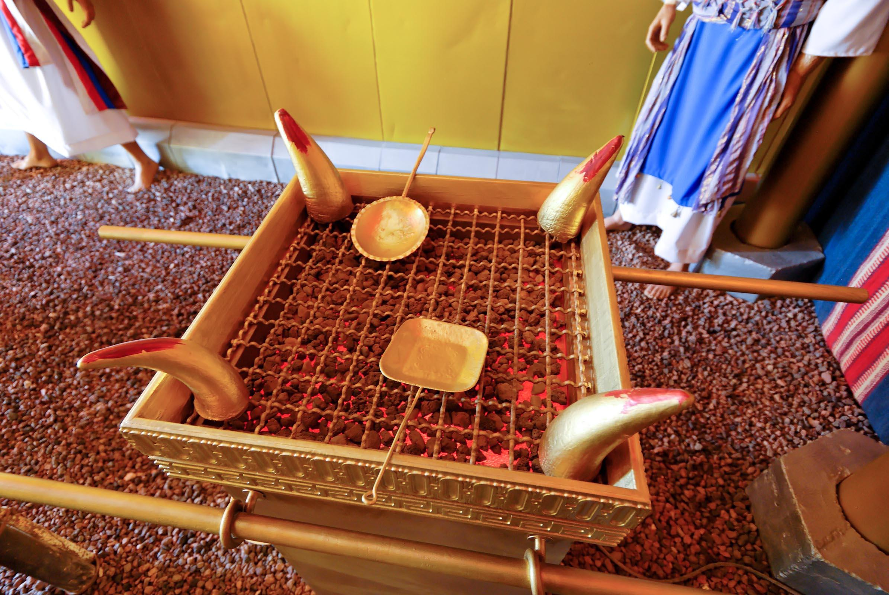

Read/hear the portion: 

* **Luke 1:1-80**



## Videos

* I (1-13); 
* II (14-38): 
* III (39-80): 

## Roadmap

-   Who is Theophilus?

-   King Herod

-   Zechariah's big day at the Altar of Incense

-   Luke's Seven Oracles

-   Zechariah in the Penalty Box

-   The Annunciation at Nazareth

## Luke 1:1-4 

<small>**Inasmuch as many have undertaken to compile a narrative of the things that have been accomplished among us,just as those who from the beginning were eyewitnesses and ministers of the word have delivered them to us, it seemed good to me also, having followed all things closely for some time past, to write an orderly account for you, most excellent Theophilus, that you may have certainty concerning the things you have been taught.**</small>

-   This is all one sentence in Greek as it is in English.

    -   It is considered some of the highest academic/classical Greek in all of antiquity.

    -   Perhaps this introduction belies the letter's importance to whoever Theophilus was.

    -   This style will change abruptly in verse 5.

    
-   Each of the Gospel writers is associated with one of the Four Living Creatures in Ezekiel 1 and Revelation 4 (Lion, Man, Ox, and Eagle)

    -   These are also the standards for the camp of Israel.

    -   Curiously, the assignment of each has not remained constant.

    -   We saw John as the Eagle in the last lesson.
    -   Originally Luke was associated with an Ox; today Mark gets the Ox because Mark portrays Jesus as the Servant of all, while Luke gets the Man because his gospel portrays Jesus as the Son of Man.

    -   The photo is of Luke's tomb in Ephesus and, you can see the Ox or Bull underneath the cross

-   Most scholars pin the date of the book to the 80s or early 90s CE; however, the fact that Luke (and all of the Gospels) omit mention of the destruction of the Jewish Temple in 70 CE might suggest an earlier date.

-   Who was Theophilus?

    -   Theo means God and Phileo means friendship love, so the name could mean "Lover of God."

    -   Potentially it is a code name. People who followed the God of Israel (including Yeshua following Jews and Gentiles) weren't especially popular in the second-half of the first-century. Revelation speaks in code to avoid Roman censors; it's possible the letter is addressed to the "Lover of God" who would have been known in Luke's circle but not widely known elsewhere.

    -   It is typically thought that Luke's gospel was commissioned to provide an authoritative Greek gospel for the growing number of believers in the Gentile world.

    -   Lancaster notes that Josephus, a Jewish but pro-Roman historian, mentions (and archeology confirms) a high-priest by the name of Theophilus in the Apostolic Era.

    -   Missler believes Theophilus was a wealthy benefactor in one of Paul's congregations who commissioned Luke and Acts for Paul's trial in Rome.

        -   This would be similar to a deposition or affidavit used in courts today.

        -   The early date and formal first sentence would be consistent with such a purpose.

-   Luke notes that his gospel is not the only gospel.

    -   Like a trial lawyer, he reviewed other documents and interviewed witnesses.

    -   Luke, who was a physician, was highly educated and credible; therefore, he could attest to the document's authenticity.

-   Luke makes the point that his is an "orderly account."

    -   Many commentators take this to mean Luke's is the most chronologically accurate of the four gospels.

## Luke 1:5-7

<small>**In the days of Herod, king of Judea, there was a priest named Zechariah, of the division of Abijah. And he had a wife from the daughters of Aaron, and her name was Elizabeth. And they were both righteous before God, walking blamelessly in all the commandments and statutes of the Lord. But they had no child, because Elizabeth was barren, and both were advanced in years.**</small>

-   Reference passages:

    -   Genesis 15:6 And he believed the LORD, and he counted it to him as righteousness.

    -   Genesis 17:17 Then Abraham fell on his face and laughed and said to himself, "Shall a child be born to a man who is a hundred years old? Shall Sarah, who is ninety years old, bear a child?"

-   Now the style abruptly changes from the lofty Greek to a Hebraic, Old Testament-style narrative.

-   One of the many themes in the Bible is that of the righteous but barren woman.

    -   The Jewish sages wrote, "whenever it is written, 'she had no child,' it means she would eventually bear one" (Genesis Rabbah 38:14).

    -   Typically, being barren was thought of as a type of curse; but here, Luke is going out of his way to let us know they were both righteous before God.

    -   He even points out that Elizabeth was from the daughters of Aaron.

        -   This is something a normal reader would likely pass over, but for those who dig, there is a nugget here.

        -   A Levite like Zechariah was free to marry from any tribe, but it was considered especially righteous to marry another Levite from Aaron's line.

        -   This is Luke (or more specifically the Holy Spirit) underscoring how righteous Zechariah was.

        -   The childless was not a punishment for sin or because he was unworthy.

    -   In that culture, Zechariah was also free to marry another who could have children; but he didn't. He stayed with Elizabeth as they both advanced in years.

-   Herod

    -   Any attempt to understand the political situation in Israel during the time of Jesus is going to be limited without a study of Herod the Great.

    -   Dr. Schlegel notes that Hollywood should make a movie because his life had all the elements Hollywood likes: war, violence, romance, sex, intrigue, assassinations, and so forth.

    -   No one since Solomon controlled as much land in the region, and no one has since.

    -   His footprints are all over the Holy Land in terms of his many building projects, which the people liked because they give a sense of pride, and more immediately provided numerous jobs.

        -   These include the great palaces at Caesarea (labeled Strato's Tower on this map), Jericho, Herodium by Bethlehem, and Masada, which has an incredible story as the last holdout for a band of rebels against Rome in AD72.

        -   His most famous building was probably the Jewish Temple, which was one of the seven wonders of the ancient world.

        -   Although the old city walls are from the 16th century, the Western wall still contains a part of the Herodian wall.

    -   Unfortunately, he was one of the most ruthless dictators who ever lived, so ultimately he was hated by the people he ruled.

        -   Clearly suffering from some form of paranoia mixed with megalomania, he didn't hesitate to eliminate anyone he saw as a threat including immediate family members.

        -   There was a quip that it was safer to be a pig in Herod's house than one of his sons.

        -   He killed his wife Mariamne and then later wailed because of her death.

        -   As he was dying, he gave an order to have some very popular Jewish leaders and rabbis arrested and executed...all because he insisted that there be mourning on the day he died. Fortunately, that order was not carried out.

    -   It was in the midst of this darkness that God became directly involved in Man's affairs.

## Luke 1:8-12

<small>**8 Now while he was serving as priest before God when his division was on duty, according to the custom of the priesthood, he was chosen by lot to enter the temple of the Lord and burn incense. And the whole multitude of the people were praying outside at the hour of incense. And there appeared to him an angel of the Lord standing on the right side of the altar of incense. And Zechariah was troubled when he saw him, and fear fell upon him.**</small>

-   Reference passage: 1Ch 24:3,10 With the help of Zadok of the sons of Eleazar, and Ahimelech of the sons of Ithamar, David organized them according to the appointed duties in their service...the seventh to Hakkoz, the eighth to Abijah,

-   There were as many as 18000 Levites who could serve as priests. This was likely a once-in-a-lifetime experience for Zechariah.

-   His job was to kindle the incense and get it lit. The Jewish Mishnah records the day-to-day functions and service of the Temple. The photo is of the altar of incense as it may have looked like in the Tabernacle.

-   While Zechariah was doing this inside the Holy Place, the people were gathered. In their view, Zechariah was lifting their prayers up to God inside as they were praying outside.

    -   In Daniel 6, we see Daniel kept the appointed times of prayer.

    -   He did this even though at the time, Jerusalem was in ruins. He still opened his window and prayed towards Jerusalem.

-   Zechariah was likely praying too when he was interrupted.

## Luke's Seven Oracles

1.  Annunciation of John to Zechariah - 1:13-17

2.  Annunciation of Jesus to Mary - 1:30:37

3.  The Blessings of Elizabeth - 1:42-45

4.  The *Magnificat* - 1:46-55

5.  The *Benedictus* - 1:68-80

6.  *Nunc Dimitis* 2:29:32

7.  Mary's Sword - 2:34-25

-   Luke 1-2 continues the conspicuous pattern of sevens in the Bible.

    -   Most obvious is Revelation, where we have seven churches, seven bowls, and so forth.

    -   Less obvious are the seven "I AM the ..." statements by Jesus in John's gospel and the seven Kingdom parables in Matthew's gospel.

    -   If we exclude duplicates and letters written to pastors, we find that Paul also wrote to seven churches (Rome, Corinth, Galatia, Ephesus, Philippi, Colossae, and Thessaloniki).

    -   Keep your eyes open for these as you study the Bible. Missler calls them "fingerprints of the Holy Spirit."

-   Almost every verse in these oracles has at least one allusion to an Old Testament verse.

-   We do not have two books, a superior New Testament that replaces an inferior Old Testament. We have a single collection of 66 books that are intricately woven and interconnected.

## Luke 1: Oracle to Zechariah

<small>**13 But the angel said to him, "Do not be afraid, Zechariah, for your prayer has been heard, and your wife Elizabeth will bear you a son, and you shall call his name John.

And you will have joy and gladness, and many will rejoice at his birth, for he will be great before the Lord. And he must not drink wine or strong drink, and he will be filled with the Holy Spirit, even from his mother's womb. And he will turn many of the children of Israel to the Lord their God, and he will go before him in the spirit and power of Elijah, to turn the hearts of the fathers to the children, and the disobedient to the wisdom of the just, to make ready for the Lord a people prepared."**</small>

-   Reference passages:

    -   Gen 21:6-7 And Sarah said, "God has made laughter for me; everyone who hears will laugh over me." [7] And she said, "Who would have said to Abraham that Sarah would nurse children? Yet I have borne him a son in his old age."

    -   Num 6:2-3 "Speak to the people of Israel and say to them, When either a man or a woman makes a special vow, the vow of a Nazirite, to separate himself to the LORD, [3] he shall separate himself from wine and strong drink. He shall drink no vinegar made from wine or strong drink and shall not drink any juice of grapes or eat grapes, fresh or dried.

    -   Jdg 13:7 but he said to me, 'Behold, you shall conceive and bear a son. So then drink no wine or strong drink, and eat nothing unclean, for the child shall be a Nazirite to God from the womb to the day of his death.'"

    -   Mal 4:5-6 "Behold, I will send you Elijah the prophet before the great and awesome day of the LORD comes. [6] And he will turn the hearts of fathers to their children and the hearts of children to their fathers, lest I come and strike the land with a decree of utter destruction."

-   This annunciation echos the heavenly birth announcements found in Genesis.

-   Many will rejoice -- not just the immediate circumstance at the news of Elizabeth's delivery, but also those who repent and follow Jesus because of John's message will celebrate John's birth.

-   No strong drink --

    -   This is called a Nazirite vow from Numbers 6.

    -   Paul underwent a temporary Nazirite vow in Acts 18 (well after his Damascus Road experience, by the way. He REMAINED Jewish after his so-called "conversion.")

    -   Judges 13:7 states that when a child is to be a Nazirite from birth, there are restrictions placed on the mother as well. Elizabeth observed the Nazirite constraints. The passage references Samson, the most famous (and flawed) Nazirite.

## Luke 1:18-20 Zechariah Doubts

<small>**And Zechariah said to the angel, "How shall I know this? For I am an old man, and my wife is advanced in years." And the angel answered him, "I am Gabriel. I stand in the presence of God, and I was sent to speak to you and to bring you this good news. And behold, you will be silent and unable to speak until the day that these things take place, because you did not believe my words, which will be fulfilled in their time."**</small>

-   The punishment for Zechariah's disbelief seems harsh given that Abraham, Gideon, and even Mary asked similar questions when they received supernatural visions.

-   In any case, his being unable to speak was the sign from Gabriel. Be careful what you wish for.

-   Gabriel comes from gibor, strong, mighty, warrior, hero, and El, the short name of God. So Gabriel is "hero of God," or "mighty man of God."

    -   The Bible mentions two angels by name (besides The Angel of the Lord, which is a manifestation of God himself (and by extension Jesus preincarnate, since Jesus is God)), Michael and Gabriel.

    -   Jewish and Catholic tradition adds a few more, notably Raphael and Uriel.

-   One interesting speculation is that Zechariah was inside praying for a son, yet when that prayer was answered, he didn't believe.

    -   This contrasts with Abraham, Gideon, and Mary where the appearance was unsolicited.

    -   In other words, he was doubting God's ability to answer his prayer.

    -   How often are we like this?

## Luke 1:21-23

<small>**And the people were waiting for Zechariah, and they were wondering at his delay in the temple. And when he came out, he was unable to speak to them, and they realized that he had seen a vision in the temple. And he kept making signs to them and remained mute. And when his time of service was ended, he went to his home.**</small>

-   While Zechariah was inside, another priest outside the holy place ascended the ramp and sacrificed a lamb, and placed it onto the altar fires for the morning offering.

-   The priest who lit the incense was to emerge, and raise his hands in the sign of the priesthood (the "Spock" Vulcan hand gesture, which Lenord Neimoy, an observant Jew, intentionally incorporated into the original Star Trek). He then would give the priestly benediction: "the LORD Bless you and keep you; the LORD lift up his countenance on you and grant you shalom."

-   We've got two immediate problems:

    -   The incense priest usually emerged immediately -- did Zechariah's delay mean that the people's prayers were not heard?

    -   When he did finally emerge, he was unable to give the benediction.

-   We aren't told how, but the people finally realized he'd seen a vision.

## Luke 1:24-25

<small>**After these days his wife Elizabeth conceived, and for five months she kept herself hidden, saying, "Thus the Lord has done for me in the days when he looked on me, to take away my reproach among people."**</small>

-   Reference passage: Gen 30:23 She conceived and bore a son and said, "God has taken away my reproach."

-   We aren't told exactly why she "kept herself hidden"

    -   There might have been a custom of isolation during the early stages of pregnancy to guard against both natural and supernatural threats.

## Luke 1:26-29 Gabriel visits Mary

<small>**In the sixth month the angel Gabriel was sent from God to a city of Galilee named Nazareth, and he came to her and said, "Greetings, O favored one, the Lord is with you!" But she was greatly troubled at the saying, and tried to discern what sort of greeting this might be.**</small>

-   "Hail Mary, full of grace" is scriptural

-   Nazareth is about 70 miles north of Jerusalem.

-   Some scholars speculate that the entire town of 200 or so folks might all be from David's line (as Joseph and Mary were) who relocated north at some point.

-   There was nothing notable about Nazareth (except perhaps in a negative sense as used in John 1:46); the major center was Sephorris, which is likely where Joseph and Jesus found carpentry and masonry work.

## Luke 1:30-33 The Annunciation

<small>**30 And the angel said to her, "Do not be afraid, Mary, for you have found favor with God. And behold, you will conceive in your womb and bear a son, and you shall call his name Jesus. He will be great and will be called the Son of the Most High. And the Lord God will give to him the throne of his father David, and he will reign over the house of Jacob forever, and of his kingdom there will be no end."**</small>

-   Reference verses:

    -   Isa 7:14 Therefore the Lord himself will give you a sign. Behold, the virgin shall conceive and bear a son, and shall call his name Immanuel.

        -   Im -- anu -- El = with us God

        -   The Hebrew word *alma* could mean "maiden" or "young woman," and this is a point that many antagonists of Christianity will point out.

        -   The Old Testament was translated into Greek a couple of centuries before Jesus was born. The Greek word *Parthenos* used in Isaiah 7:4 is unmistakably a virgin as we think of the word.

        -   In the immediate context, this refers to King Ahaz's son Hezekiah, but Christians see a double-fulfillment with Jesus. Often there is an immediate application and then a longer range application.

        -   The virgin birth, along with the resurrection are targets for critics who just can't accept the supernatural nature.

    -   Gen 16:11 And the angel of the LORD said to her, "Behold, you are pregnant and shall bear a son. You shall call his name Ishmael, because the LORD has listened to your affliction.

    -   2Sa 7:9,14 And I have been with you wherever you went and have cut off all your enemies from before you. And I will make for you a great name, like the name of the great ones of the earth... I will be to him a father, and he shall be to me a son.

    -   Psa 2:7 I will tell of the decree: The LORD said to me, "You are my Son; today I have begotten you.

    -   Psa 132:11 The LORD swore to David a sure oath from which he will not turn back: "One of the sons of your body I will set on your throne.

    -   2Sa 7:13 He shall build a house for my name, and I will establish the throne of his kingdom forever.

    -   2Sa 7:16 And your house and your kingdom shall be made sure forever before me. Your throne shall be established forever.'"

    -   Isa 9:7 Of the increase of his government and of peace there will be no end, on the throne of David and over his kingdom, to establish it and to uphold it with justice and with righteousness from this time forth and forevermore. The zeal of the LORD of hosts will do this.

-   Protestants tend to distance themselves from the Catholic veneration of Mary, but let's not forget Mary was the chosen woman to bear the messiah.

-   She truly was blessed among all women, so we owe her due credit.

-   Scripture does not say that she herself was immaculately conceived, nor does it say that she remained a virgin after Jesus was born.

-   When discussing with people of different faith backgrounds, look for points of commonality.

    -   Catholics and Protestants would both agree that Mary is an incredible woman who was used by God, and the primary point of our focus should be on Jesus.

## Luke 1:34-38

<small>**And Mary said to the angel, "How will this be, since I am a virgin?" And the angel answered her, "The Holy Spirit will come upon you, and the power of the Most High will overshadow you; therefore the child to be born will be called holy---the Son of God. And behold, your relative Elizabeth in her old age has also conceived a son, and this is the sixth month with her who was called barren. For nothing will be impossible with God." And Mary said, "Behold, I am the servant of the Lord; let it be to me according to your word." And the angel departed from her.**</small>

-   Nothing about the Annunciation indicated that the conception would be supernatural, but perhaps Mary suspected or even physically felt something.

-   Strictly speaking, Mary was a barren woman just like Sarah and Elizabeth; she just was not advanced in age. Let us not overlook the fact that God, once again, supernaturally opens a closed womb.

-   We wonder if, at her young age, she truly realized she was about to become a social outcast and the subject of vicious small-town gossip for supposed illegitimate pregnancy.

    -   When we get to the "Genealogies" we're going to study a guy by the name of Jeconiah in Jeremiah 22 and why the virgin birth may be particularly relevant to Jesus being of the "house and lineage of David."

-   Unlike Gideon and Zechariah, Mary does not ask for a sign. She just asks, how can these things be?

    -   She is given one anyway.

    -   Her aged and heretofore barren relative Elizabeth has also conceived.

-   Her faithfulness here echos that of Ruth who places herself at the mercy of Naomi and then Boaz.

-   Do we truly believe that "nothing is impossible with God"?

## Luke 1:39-41

<small>**In those days Mary arose and went with haste into the hill country, to a town in Judah, and she entered the house of Zechariah and greeted Elizabeth. And when Elizabeth heard the greeting of Mary, the baby leaped in her womb. And Elizabeth was filled with the Holy Spirit,**</small>

-   Luke does not give a specific location for the home of Elizabeth and Zechariah.

-   Literary tradition from the 6th century identifies Elizabeth's hometown with Ein Kerem (about 6 miles west of Jerusalem) and the presence of two 4th-century churches indicates that the tradition is even older.

-   Today Ein Kerem has a population of about 2000; it is essentially a suburb of Jerusalem.

## Luke 1:42-45 Elizabeth's Blessing

<small>**and she exclaimed with a loud cry, "Blessed are you among women, and blessed is the fruit of your womb! And why is this granted to me that the mother of my Lord should come to me? For behold, when the sound of your greeting came to my ears, the baby in my womb leaped for joy. And blessed is she who believed that there would be a fulfillment of what was spoken to her from the Lord."**</small>

## Luke 1:46-55 -- The *Magnificat*

-   One of the most beautiful expressions of glory and gratitude; it is very Psalm=like. The Holy Spirit was definitely present.

-   The praise is similar to Hannah's song in 1 Samuel 2 and has many allusions and themes from the Hebrew Bible.

-   It begins with her personal praise and expands to the hope and promise of the Messianic redemption (the redemption that has its fulfillment in Revelation 19)

-   <small>**46 And Mary said, "My soul magnifies the Lord,**</small>

    -   1 Sam 2:1 And Hannah prayed and said, "My heart exults in the LORD; my horn is exalted in the LORD. My mouth derides my enemies, because I rejoice in your salvation.

-   <small>**47 and my spirit rejoices in God my Savior,**</small>

    -   Hab 3:18 yet I will rejoice in the LORD; I will take joy in the God of my salvation

    -   The word for salvation here is [יִשְׁעִֽי]{dir="rtl"} -- Yesuha.

-   <small>**48 for he has looked on the humble estate of his servant. For behold, from now on all generations will call me blessed;**</small>

    -   1 Sam 1:11 ...remember me and not forget your maidservant...

    -   Gen 29:32 And Leah conceived and bore a son, and she called his name Reuben, for she said, "Because the LORD has looked upon my affliction; for now my husband will love me."

    -   Gen 30:13 And Leah said, "Happy am I! For women have called me happy." So she called his name Asher.

-   <small>**49 for he who is mighty has done great things for me, and holy is his name.**</small>

    -   Psa 126:3 The LORD has done great things for us; we are glad.

-   <small>**50 And his mercy is for those who fear him from generation to generation.**</small>

    -   Psa 103:17 But the steadfast love of the LORD is from everlasting to everlasting on those who fear him, and his righteousness to children's children,

-   <small>**51 He has shown strength with his arm; He has scattered the proud in the thoughts of their hearts;**</small>

    -   Psa 136:12 with a strong hand and an outstretched arm, for his steadfast love endures forever;

    -   Psa 89:13 You have a mighty arm; strong is your hand, high your right hand.

    -   Psa 89:10 ...you scattered your enemies with your mighty arm.

-   <small>**52 He has brought down the mighty from their thrones and exalted those of humble estate;**</small>

    -   1Sa 2:7 The LORD makes poor and makes rich; He brings low and he exalts.

    -   Psa 113:7 He raises the poor from the dust and lifts the needy from the ash heap,

-   <small>**53 He has filled the hungry with good things, and the rich He has sent away empty.**</small>

    -   Psa 107:9 For he satisfies the longing soul, and the hungry soul he fills with good things.

    -   1Sa 2:5 Those who were full have hired themselves out for bread, but those who were hungry have ceased to hunger.

-   <small>**54 He has helped his servant Israel, in remembrance of His mercy,**</small>

    -   Isa 41:8 But you, Israel, my servant, Jacob, whom I have chosen, the offspring of Abraham, my friend...Fear not... you men of Israel! I am the one who helps you, declares the LORD; your Redeemer is the Holy One of Israel.

    -   Psa 98:3 He has remembered his steadfast love and faithfulness to the house of Israel. All the ends of the earth have seen the salvation of our God.

-   <small>**55 as he spoke to our fathers, to Abraham and to his offspring forever."**</small>

    -   Exo 32:13 Remember Abraham, Isaac, and Israel, your servants, to whom you swore by your own self, and said to them, 'I will multiply your offspring as the stars of heaven, and all this land that I have promised I will give to your offspring, and they shall inherit it forever.'"

    -   Mic 7:20 You will show faithfulness to Jacob and steadfast love to Abraham, as you have sworn to our fathers from the days of old.

-   Will you notice God is not done with Israel?

-   Passages like this also demonstrate the interconnection between the Old and the New Testament.

## Luke 1:56-58

<small>**And Mary remained with her about three months and returned to her home. Now the time came for Elizabeth to give birth, and she bore a son. And her neighbors and relatives heard that the Lord had shown great mercy to her, and they rejoiced with her.**</small>

## Luke 1:59

<small>**And on the eighth day they came to circumcise the child. And they would have called him Zechariah after his father,**</small>

-   Genesis 17:12 He who is eight days old among you shall be circumcised. Every male throughout your generations, whether born in your house or bought with your money from any foreigner who is not of your offspring,

-   Lev 12:3 And on the eighth day the flesh of his foreskin shall be circumcised.

## Luke 1:60-66 His name is Yochanon

<small>**but his mother answered, "No; he shall be called John." And they said to her, "None of your relatives is called by this name." And they made signs to his father, inquiring what he wanted him to be called. And he asked for a writing tablet and wrote, "His name is John." And they all wondered. And immediately his mouth was opened and his tongue loosed, and he spoke, blessing God. And fear came on all their neighbors. And all these things were talked about through all the hill country of Judea, and all who heard them laid them up in their hearts, saying, "What then will this child be?" For the hand of the Lord was with him.**</small>

## Luke 1:67

<small>**And his father Zechariah was filled with the Holy Spirit and prophesied, saying,**</small>

## Luke 1:68-79 The *Benedictus*

-   <small>**68 "Blessed be the Lord God of Israel, for he has visited and redeemed his people**</small>

    -   Psa 41:13 Blessed be the LORD, the God of Israel, from everlasting to everlasting! Amen and Amen.

    -   Psa 111:9 He sent redemption to his people; he has commanded his covenant forever. Holy and awesome is his name!

-   <small>**69 and has raised up a horn of salvation for us in the house of his servant David,**</small>

    -   1Sa 2:10 he will give strength to his king and exalt the horn of his anointed."

    -   Psa 132:17 There I will make a horn to sprout for David; I have prepared a lamp for my anointed.

-   <small>**70 as he spoke by the mouth of his holy prophets from of old,**</small>

    -   Zec 7:7 Were not these the words that the LORD proclaimed by the former prophets, when Jerusalem was inhabited and prosperous, with her cities around her, and the South and the lowland were inhabited?'"

-   <small>**71 that we should be saved from our enemies and from the hand of all who hate us;**</small>

    -   2Sa 22:18 He rescued me from my strong enemy, from those who hated me, for they were too mighty for me.

-   <small>**72-73 to show the mercy promised to our fathers and to remember his holy covenant, the oath that he swore to our father Abraham, to grant us**</small>

    -   Exo 32:13 Remember Abraham, Isaac, and Israel, your servants, to whom you swore by your own self, and said to them, 'I will multiply your offspring as the stars of heaven, and all this land that I have promised I will give to your offspring, and they shall inherit it forever.'"

    -   Lev 26:42 then I will remember my covenant with Jacob, and I will remember my covenant with Isaac and my covenant with Abraham, and I will remember the land.

-   <small>**74-75 that we, being delivered from the hand of our enemies, might serve him without fear, in holiness and righteousness before him all our days.**</small>

    -   2Ki 17:39 but you shall fear the LORD your God, and he will deliver you out of the hand of all your enemies."

-   <small>**76 And you, child, will be called the prophet of the Most High; for you will go before the Lord to prepare his ways,**</small>

    -   Isa 40:3 A voice cries: "In the wilderness prepare the way of the LORD; make straight in the desert a highway for our God.

    -   Mal 3:1 "Behold, I send my messenger, and he will prepare the way before me. And the Lord whom you seek will suddenly come to his temple; and the messenger of the covenant in whom you delight, behold, he is coming, says the LORD of hosts.

-   <small>**77 to give knowledge of salvation to his people in the forgiveness of their sins,**</small>

    -   Isa 53:11 Out of the anguish of his soul he shall see and be satisfied; by his knowledge shall the righteous one, my servant, make many to be accounted righteous, and he shall bear their iniquities.

-   <small>**78 because of the tender mercy of our God, whereby the sunrise shall visit us from on high**</small>

    -   Mal 4:2 But for you who fear my name, the sun of righteousness shall rise with healing in its wings.

    -   Isa 60:2 For behold, darkness shall cover the earth, and thick darkness the peoples; but the LORD will arise upon you, and his glory will be seen upon you.

-   <small>**79 to give light to those who sit in darkness and in the shadow of death, to guide our feet into the way of peace."**</small>

    -   Isa 9:2 The people who walked in darkness have seen a great light; those who dwelt in a land of deep darkness, on them has light shone.

    -   Isa 42:6-7 "I am the LORD; I have called you in righteousness; I will take you by the hand and keep you; I will give you as a covenant for the people, a light for the nations, to open the eyes that are blind, to bring out the prisoners from the dungeon, from the prison those who sit in darkness.

    -   Pro 3:17 Her ways are ways of pleasantness, and all her paths are peace.

## Luke 1:80

<small>**80 And the child grew and became strong in spirit, and he was in the wilderness until the day of his public appearance to Israel.**</small>

## References

* Bolen, Todd. (2012). “Judean Hill Country-North,” in Pictorial Library Vol. 4.: Judah and the Dead Sea
* _____. (2018). “Luke 1,” in Photo Companion to the Bible.    
* Keener, Craig S. (1993). The IVP Bible Background Commentary: New Testament. 
* Lancaster, D. Thomas. (2014). “Annunciations," in Chronicles of the Messiah. Boaz Michael, D. Thomas Lancaster, Steven Lancaster, eds. 

