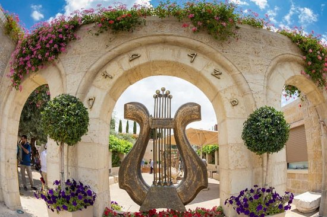
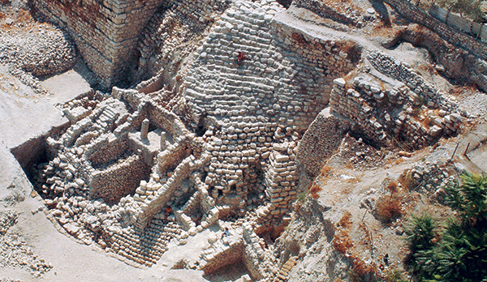
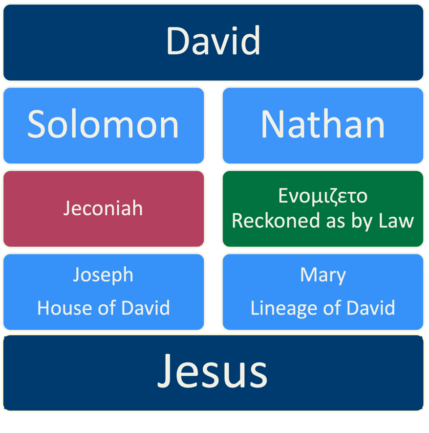

> GENEALOGIES demonstrates to us that Jesus is of the "house and lineage" of King David. Once, when Jesus was passing through the streets, some blind men called out to Him, “Have mercy on us, Son of David!” Why did they call Him “Son of David”? What does that title mean, and what is Jesus’ relationship to King David? In this chapter we explore the family tree of the Messiah.[^2]

[^2]: https://friends.ffoz.org/resources/portion-connections/son_of_david_1.html



## Videos

**Verse by verse lesson:**


**Women in Matthew's Genealogy Supplement:**


## Roadmap

-   Different accounts, yet both claim to be THE genealogy of Jesus

    -   Matthew genealogy (through Solomon) - Why 14?

    -   Luke genealogy (through Nathan)

    -   Ενομιζετο – “as it was supposed”/“reckoned by law”

-   The Babylonian deportation (Assyrian diversion)

-   The Blood Curse on Jechoniah and the Royal Line (Jeremiah 22)

-   Other genealogy reconciliation theories

## Gospels Snapshot

|                            | **Matthew**     | **Mark**       | **Luke**   | **John**                                  |
|----------------------------|-----------------|----------------|------------|-------------------------------------------|
| **Jesus as**               | Jewish Messiah  | Servant of All | Son of Man | Son of God                                |
| **Genealogy**              | Abraham         | N/A            | Adam       | Preexistent One                           |
| **What Jesus**             | Said            | Did            | Felt       | Who He Was                                |
| **Style**                  | Teachings       | Snapshots      | Narrative  | 7 Miracles / 7 ”I AM the…” / 7 Discourses |
| **1st Miracle** | Leper           | Demon          | Demon      | Water to Wine                             |
| ***Symbol***               | *Lion of Judah* | *Ox*           | *Man*      | *Eagle*                                   |

## Matthew 1:1

| Matthew                                                                                        | References                                                                                                                |
|------------------------------------------------------------------------------------------------|---------------------------------------------------------------------------------------------------------------------------|
| The book of the generations (genealogy) of Jesus Christ, the son of David, the son of Abraham. | Gen 5:1 This is the book of the generations of Adam. When God created man, he made him in the likeness of God. |

-   Son of Abraham = means a Jew. Matthew wants us to know that Jesus is Jewish.

-   Son of David is a clear Messianic title. Matthew wants us to know that Jesus is the Messiah.

-   Matthew presents his genealogy in the Hebraic style of Genesis 5:1, which reads “this (is the) book of the generations of Adam” (although it is Luke, not Matthew, who presents us the lineage back to Adam).

    -   Genealogies were important legal documents to demonstrate lineage for the purposes of inheritance.

        -   Historically records were kept in the temple.

        -   When it was destroyed in 70 CE so were most of the records.

        -   As a result, ANYONE after 70 CE could claim to be descended from David and there would be no way to prove or disprove it. A few would-be messiahs in history even tried to fabricate their lineage.

        -   In contrast, the claim for Jesus’ lineage was made when it could still have been checked.

-   Gen 17:7 And I will establish my covenant between me and you and your offspring after you throughout their generations for an everlasting covenant, to be God to you and to your offspring after you.

-   2Sa 7:16 And your house and your kingdom shall be made sure forever before me. Your throne shall be established forever.’”

    -   If a candidate for Messiah is not a descendant from David AND Abraham, he is to be rejected.

    -   God made eternal and unconditional covenants with both Abraham and David.

    -   Matthew 1:1 is the most important verse of the chapter as it establishes Jesus in both David’s line and Abraham’s line (with the remainder of the genealogy used to support the assertion.

-   Deu 17:15 you may indeed set a king over you whom the LORD your God will choose. **One from among your brothers you shall set as king over you. You may not put a foreigner over you, who is not your brother**.

    -   Any king, including, and especially the Messiah had to be Jewish by law.

    -   We have an interesting Juxtaposition between Jesus, the rightful king, and King Herod, the presently reigning king.

        -   This dichotomy is accented by geography. Above is a picture of Herod’s palace called Herodium (of course he named it after himself). Herodium is about 3 miles from Bethlehem.

        -   To varying degrees, all of the gospels portray Jesus the rightful king, messiah, and Son battling against the usurping forces, be they Herod, the political/religious establishment or the forces of spiritual darkness.

    -   Herod, was NOT BORN King of the Jews, in two ways:

        -   1\. He’s wasn’t Jewish by birth. He was an Idumean, which is to say an edomite, descended from Esau not Jacob. If you know anything about the history, the Edomites and the Israelites didn’t get along at all. During the period of the Maccabees, Herod’s family was forced to convert. Forced conversions, whether done by the greeks under Antiochus IV, the Jews under the Maccabeans, or the Christians and Muslims in later years, never seem to work out very well for both the converted and those forcing the conversions.

        -   2\. He therefore was not qualified to be King. In fact, he approached the Roman Senate to grant him that title, which they did in 39 BC. And in an irony of History, Rome didn’t even control the area at the time. The Parthians did. Herod pushed them out and secured the area for Rome.

-   This adds some possible intrigue to Mat 2:1-2 Now after Jesus was born in Bethlehem of Judea in the days of Herod the king, behold, wise men from the east came to Jerusalem, \[2\] saying, “Where is he who has been **born king of the Jews**? For we saw his star when it rose and have come to worship him.”

    -   When the Magi approach Herod and ask, “where is he who has been BORN KING OF THE JEWS?”

    -   Chuck Missler sees this as an intentional dig at Herod. In other words, “Not you, turkey. Where’s the *real* king of the Jews?” Which of course sends Herod off in a fit of rage and we know from Matthew 2:4-5, Herod inquired of the birthplace of Messiah and was told it would be in Bethlehem. Eventually, he orders the execution of all males 2 years and younger.

    -   Apparently, before this episode, the Talmud records that Herod once approached his leaders for the qualifications of a Jewish leader.

    -   When the Sanhedrin explained Deuteronomy 17:15 to Herod, telling him that one must be naturally born Jewish, Herod naturally, was not pleased with the explanation.

    -   He ordered the execution of all of the Sanhedrin except one (b. Bava Batra 3b), which tells you all about Herod. “don’t shoot the messenger” was not in his vocabulary.

    -   Lancaster notes that Herod then sought to destroy all such records and people of the Davidic Royal line.

    -   This likely forced any direct descendant of David to flee from Bethlehem, just a stone’s throw away from Herod’s palace at Herodium, to the relative obscurity in Nazareth.

    -   Far from being a boring list of names, the fact that Matthew’s genealogy is preserved may be the first recorded miracle in his gospel!

-   

-   Matthew 1:1 establishes Jesus in David’s line and also in Abraham’s line.

-    אדם  = Abraham, David, Messiah according to the sages.

## Matthew 1:2-6 – Abraham to Solomon & Luke 31:38 Adam to Nathan

| **Matthew 1:2-6 ↓**                                                                                                                                                                                                                 | **Luke 3:38-31 ↑**                                                                                                                                                                                                                                                                                |
|-------------------------------------------------------------------------------------------------------------------------------------------------------------------------------------------------------------------------------------|---------------------------------------------------------------------------------------------------------------------------------------------------------------------------------------------------------------------------------------------------------------------------------------------------|
| Abraham, Isaac, Jacob, Judah and his brothers, Perez and Zerah by Tamar, Hezron, Ram, Amminadab, Nahshon, Salmon, Boaz by Rahab, Obed by Ruth, Jesse, David the king. And David was the father of **Solomon** by the wife of Uriah… | Adam the Son of God, Seth, Enosh, Cainan, Mahalalel, Jared, Enoch, Methuseleh, Lamech, Noah, Shem, Arphaxhad, *Cainan*, Shelah, Eber, Peleg, Reu, Serug, Nahor, Terah, Abraham, Isaac, Jacob, Judah, Perez, Hezron, *Arni, Admin*, Amminadab, Nashon, Sala, Boaz, Obed, Jesse, David, **Nathan**… |

-   Matthew is very much like an Old Testament genealogy that runs from oldest to newest.

-   Luke follows the style of a Greco-Roman ancestry that runs from newest to oldest – Luke’s order is flipped above to make comparisons easier.

-   Matthew is interested in presenting Jesus as the Jewish Messiah, so his genealogy goes back to Abraham the first Jew.

-   Luke is interested in presenting us the ancestry of the son of Man, so he’s going to go all the way back to Adam.

    -   Prior to Abraham, EVERYONE was a “gentile” (if you’ll pardon the anachronism).

    -   Luke, which was widely circulated in Gentile regions, wanted gentiles to know Jesus is their Messiah too.

    -   As he stresses in Luke Volume II (the book we know as Acts), he wants us to know Gentiles are included.

    -   Adam to Noah is the same list as Genesis 5, and Shem to Terah, is roughly the same list as Genesis 11:10-25 (see discussion on potential discrepancies below).

-   Both Gospels are basically the same from Abraham to David (see potential discrepancies).

-   We will touch on the women in Matthew’s gospel in the next section.

-   Potential discrepancies in this section:

    -   Matthew omits some names in this section and omits a LOT of names in the next section.

        -   Keener notes this is not unusual for ancient genealogies, and we may have an element of the Holy Spirit blotting out certain names from the record.

        -   Matthew conspicuously skips three kings of Judah: Ahaziah, Joash, and Amaziah (compare 1 Chronicles 3:10-16).

        -   He was interested in preserving 14 generations.

    -   Luke inserts someone named “Cainan” inbetween Arphaxhad and Shelah in Abraham’s line.

        -   Cainan is not mentioned in Genesis 11l

        -   As this is the identical name to the Cainan in Noah’s line, this is possibly a copyist’s error.

        -   Note this is why we say the Bible is inerrant **in the original manuscripts**.

            -   There are several known copyist errors, most notably in John 5:3-4;

            -   These do not detract from the overall inerrancy of Scripture.

    -   Luke inserts Arni and Admin, which are not included in the Old Testament accounts of David’s lineage.

        -   Arni is potentially a variant spelling of Ram, we don’t know where Admin came from. Perhaps it’s an *admin*istrative error.

-   The big thing to note is that Matthew’s list runs through Solomon, the first surviving son of David and the wife of Uriah, while Luke’s runs through Nathan, the second surviving son.

-   *Note also that Bathsheba is referred to only indirectly.*

    -   *In fact, she is never named in the Bible after she dies.*

    -   *Nothing is accidental in the Bible. The Holy Spirit engineers and orchestrates every letter. For her not to be named is a “dis” from the Holy Spirit!*

    -   *Far from being an innocent victim, perhaps she was the instigator of the entire episode. She did seem to relish her position as Queen Mother in 1st Kings 2.*

    -   *In contrast, Rahab repented, Tamar was declared righteous by Judah himself, and if you know anything about Ruth and Boaz, there was nothing inappropriate about their relationship.*

## Bad Girls of the Bible

-   It was highly unusual for an ancient genealogy to include women

-   All five women listed, including Mary in verse 16, were tainted by scandal (real or suspected).

-   Lancaster posits that by including the first four women, Matthew sought to make any scandal regarding Mary irrelevant to Jesus’ claim to be the Messiah. The ancients held a much wider view of “mother” and “father” than we do today, so if David had a few less than reputable “mothers” in his line and is still regarded as the greatest King of Israel, how much more should Jesus be regarded as one greater than David even though there are some questions regarding His lineage.

### Tamar

-   Tamar relies on the Levirate Marriage law: Deu 25:5-6 If brothers dwell together, and one of them dies and has no son, the wife of the dead man shall not be married outside the family to a stranger. Her husband's brother shall go in to her and take her as his wife and perform the duty of a husband's brother to her. And the first son whom she bears shall succeed to the name of his dead brother, that his name may not be blotted out of Israel.

-   Tamar was the daughter in law of Judah. We can read the complete story in Genesis 38.

-   She married one of Judah’s sons a guy by the name of Er, but he was wicked and was struck down by the LORD before they had children.

-   In accordance with the law of the Levirate marriage, Judah was REQUIRED to have Tamar marry the next available male, Onan, to marry Tamar and have a child in the name of the deceased son.

-   Judah did this but THAT son was also wicked and was struck down (a very R-rated story- the Bible tells it like it is).

-   We’re getting an idea that maybe Judah was a less than stellar father.

-   Judah had a third son, Shelah, but Judah feared He would die along the others, as if it was Tamar who was the bad news causing this.

-   Judah promised to give Shelah to Tamar but told her to wait until he was older.

    -   Judah was likely hoping Tamar would go off and find someone else.

-   Remember this is now the Royal line of Judah that is at stake.

-   Tamar realizes Judah is going to renege on his word so she takes matters into her own hands.

-   She KNOWS that Judah’s line must continue.

-   She dresses up as a harlot and entices none other than Judah, her father-in-law.

-   Judah doesn’t have cash on hand so he leaves his staff, cord and signet ring as a down payment. The next day he goes to collect but Tamar has vanished. He asks around but is told “there is no harlot here.”

-   Three months later Tamar is showing. When Judah learns of it, he is incensed at the shame she has brough on the family (seriously?) and orders her burned.

-   Gen 38:24-26 About three months later Judah was told, “Tamar your daughter-in-law has been immoral. Moreover, she is pregnant by immorality.” And Judah said, “Bring her out, and let her be burned.” As she was being brought out, she sent word to her father-in-law, “By the man to whom these belong, I am pregnant.” And she said, “Please identify whose these are, the signet and the cord and the staff.” Then Judah identified them and said, “She is more righteous than I, since I did not give her to my son Shelah.” And he did not know her again.

-   He says “She is more righteous than I.” which is important.

    -   Tamar is untimately proclaimed righteous.

    -   She thwarted the attack on the Royal Line and had twins, Perez and Zerah.

    -   We see how these seemingly obscure laws in the Torah like the Law of the Levirate Marriage are actually critical to the Lines of David and Jesus.

-   There is another interesting tidbit:

-   Deu 23:2 “No one born of a forbidden union may enter the assembly of the LORD. Even to the tenth generation, none of his descendants may enter the assembly of the LORD.

-   Despite being “righteous” it was still a forbidden union according to the law.

-   God apparently means what He says when He says “10th generation.”

-   Perez by Tamar, Hezron, Ram, Amminadab, Nahshon, Salmon, Boaz, Obed, Jesse, David – 10 Generations.

### Rahab

-   Jos 2:12-13 Now then, please swear to me by the LORD that, as I have dealt kindly with you, you also will deal kindly with my father's house, and give me a sure sign that you will save alive my father and mother, my brothers and sisters, and all who belong to them, and deliver our lives from death.”

-   Rahab was an actual harlot in Jericho who ends up protecting Joshua’s men in exchange for protection. You can read the story in Joshua 2.

-   Tradition holds that she repented and found grace and mercy by following the God of Israel.

-   You can’t say that Grace and Mercy are New Testament concepts!

-   She is lauded in the Hebrews 11 Hall of faith:

-   Heb 11:31** **By faith Rahab the prostitute did not perish with those who were disobedient, because she had given a friendly welcome to the spies.

### Ruth

-   Ruth relies on the Kinsman Redeemer Law.

-   Lev 25:25 “If your brother becomes poor and sells part of his property, then his nearest redeemer shall come and redeem what his brother has sold.”

-   Here is the passage that causes many to associate Ruth with scandal:

    -   Rth 3:7-9 And when Boaz had eaten and drunk, and his heart was merry, he went to lie down at the end of the heap of grain. Then she came softly and uncovered his feet and lay down. At midnight the man was startled and turned over, and behold, a woman lay at his feet! He said, “Who are you?” And she answered, “I am Ruth, your servant (handmaid). Spread your wings over your servant, for you are a redeemer.”

-   If you know anything about Ruth and Boaz, you know it was unlikely there was any mischief before marriage

-   In Ruth 3, she “uncovers his feet”, which to be fair, in the Bible is often a euphemism for other things and then asks him to “spread your wing or hem/skirt over me (same wing and hem/corner are the same word in Hebrew). Her request was scandalous but not for the reason you may be thinking. As chuck Missler says, “she wasn’t propositioning him, it’s far worse than that. She was asking for his protection. In other words, she was asking him to make good on his duty to be a kinsman redeemer – another Old Testament law that turns out to be critically important to Jesus’ lineage.

    -   The scandal part is that Moabites were the sworn enemies of Israel and Boaz was forbidden by law from marrying ruth, but he must make an exception (and I suspect he did so gladly) because of the overriding law of the Kinsman redeemer.

        -   One thing that is important to know about the application of Jewish law. Whenever there is a negative commandment that conflicts with a positive one, the positive one wins out.

        -   Jesus is going to make use of this guideline frequently, particularly with the so-called Sabbath controversies. He’s not overriding the law; he’s following the law strictly and perfectly, much more perfectly than the prevailing attitudes of the day were.

    -   In this case the law said an Israelite was forbidden from marrying a moabitie but the positive command required the nearer kinsman to redeem.Ruth who earlier made the famous proclamation of “where you go I will go, and where you lodge I will lodge. Your people shall be my people, and your God my God.” (Ruth 1:16) now says “I am your servant or some translations say handmaid.

    -   Luk 1:38 And Mary said, “Behold, I am the servant (handmaid) of the Lord; let it be to me according to your word.” And the angel departed from her.

        -   Mary’s words in Luke 1:38 echo ruth’s faithfulness.

    -   in Biblical typology Boaz is a type of Jesus and Ruth, a gentile is a picture of us, the gentile church. We are helpless and poor without our Redeemer. With Jesus we are royalty.

### Mary

-   We’ve talked and will talk a lot more about her righteousness but this doesn’t keep detractors from raising the appearance of scandal.

-   Even Joseph appears initially ready to believe the scandal (not without reason of course)

-   Mat 1:18-19 Now the birth of Jesus Christ took place in this way. When his mother Mary had been betrothed to Joseph, before they came together she was found to be with child from the Holy Spirit. \[19\] And her husband Joseph, being a just man and **unwilling to put her to shame, resolved to divorce her quietly**.

-   We can see that Jesus’ questionable lineage was used by His detractors in John 8.

-   Joh 8:18-19 I am the one who bears witness about myself, and the Father who sent me bears witness about me.” \[19\] They said to him therefore, **“Where is your Father?”**

    -   Although I just said to give others the benefit of the doubt, we can tell by the context of the passage that they are being absolutely nasty here!

-   The psalms appear to speak of Jesus’ childhood struggles

-   Psa 69:8-12 I have become a **stranger to my brothers, an alien to my mother's sons**. *For zeal for your house has consumed me*, and the reproaches of those who reproach you have fallen on me. When I wept and humbled my soul with fasting, it became my reproach. When I made sackcloth my clothing, I became a byword to them. **I am the talk of those who sit in the gate, and the drunkards make songs about me**.

    -   It’s hard to imagine growing up and having Jesus as a half-brother. I’m sure James, Jude and the others were none too thrilled at being told “why can’t you be more like Yeshua?”

### The wife of Uriah (Bathsheba)

-   It’s a familiar story but 2 Samuel 11 says it was the time when the Kings should have been on the battlefield but David stayed back.

-   He eyes Bathsheba bathing and the rest as they say his history

-   2Sa 11:4-5 So David sent messengers and took her, and she came to him, and he lay with her. (Now she had been purifying herself from her uncleanness.) Then she returned to her house. And the woman conceived, and she sent and told David, “I am pregnant.”

-   He next tries to cover up by having Uriah lay with his wife, which he refused to do

    -   The army (again, where David SHOULD have been) was supposed to be in a state of ritual purity, specifically abstaining from marital relations.

-   David then has Uriah eliminated so he can openly marry his wife.

-   This is a great example of the difference between the “vertical” and the “horizontal” realms.

    -   On the vertical- our relationship with God– David repented and was forgiven. In acts 13, David is still referred to as a man after God’s own heart and Psalm 51 is a beautiful expression of repentence and forgiveness.

    -   Horizontally – our relationship with others - there are still consequences when we sin. This episode resulted in David’s family life becoming an absolute train-wreck

-   The picture above is inside the same archaeological park we talked about with David’s harp.

    -   Archaeologists think David’s palace was at the top, and you can see how steep the incline is with the houses below.

    -   It would have been quite easy for the king to walk out and look down into the houses below.

-   There is some speculation as to whether this was a sexual assault by David. I tend not to see this and we get a clue why in Matthew 1:6. Notice Bathsheba is not named.

    -   In fact she is NEVER named in the Bible after she dies, and only once during the episode in question is she named as “Bathsheba”, otherwise it’s the “wife of Uriah” or some other pronoun.

    -   Some scholars see this as a “dis” from the Holy Spirit which to me suggests she knew exactly what she was doing.

    -   Matthew continues this trend of not uttering her name.

-   So the other four women who are named either engaged in or had the appearance of scandal only without doing anything wrong. The contrast suggests to some commentators that Bathsheba never repented of her role in all of the drama. That is a speculation but we can see in 1st Kings 2, Bathsheba seems to relish her power and position as the Queen Mother.

-   Yet through it all, God orchestrated the messianic line through the sons of David and Bathsheba.

## Matthew 1:7-16 – Solomon to Jacob & Luke 23:31 Nathan to Heli

<table>
<colgroup>
<col style="width: 44%" />
<col style="width: 55%" />
</colgroup>
<thead>
<tr class="header">
<th><strong>Matthew 1:7:16 ↓</strong></th>
<th><strong>Luke 1:31-23 ↑</strong></th>
</tr>
</thead>
<tbody>
<tr class="odd">
<td><strong>Solomon</strong>, Rehoboam, Abijah, Asa, Jehoshaphat, Jehoram, Uzziah, Jotham, Ahaz, Hezekiah, Manasseh, Amon, Josiah, Jeconiah (<em>Jehoiakim</em>?) at the time of the deportation to Babylon. After the deportation, Jeconiah, Shealtiel, Zerubbabel, Abiud, Eliakim, Azor, Zadok, Achim, Eliud, Eleazar, Matthan, <strong>Jacob</strong> the father of Joseph the <strong>husband</strong> of Mary, of whom Jesus was born, who is called Messiah.</td>
<td>
<strong>Nathan</strong>, Mattatha, Menan, Melea, Eliakim, Jonam, Joseph, Judah, Simeon, Levi, Matthat, Jorim, Eliezer, Jose, Er, Elmodam, Cosam, Addi, Melchi, Neri, Salathiel, Zorobabel, Rhesa, Joannan, Juda, Joseph, Semei, Mattathias, Maath, Nagge, Esli, Naum, Amos, Mattathias, Joseph, Jannai, Melchi, Levi, Matthat, <strong>Heli</strong>, Joseph, (ενομιζετο – <strong>so it was thought</strong>/reckoned by law), Jesus, when He began his ministry was about 30 years of age

↓ Luke 3:23 Jesus, when he began his ministry, was about thirty years of age, being <del>the</del> son (as was supposed) of Joseph, the son of Heli…
</td>
</tr>
</tbody>
</table>

-   Matthew goes from Solomon through Jacob

    -   He clearly says Joseph is the husband of Mary of whom Jesus was born; he does not say Joseph is the father of Jesus.

-   Luke goes from Nathan through Heli

    -   In everyday language, the fact that Luke adds, “as was supposed” implies that Jesus is not actually the son of Joseph.

    -   In the original Greek, there is no “the” before “son (supposed) of Joseph”, which further distinguishes Joseph from Jesus’ direct ancestors. “By the omission of the article, Joseph’s name is separated from the genealogical chain and accorded a place of its own” (*Rienecker* as cited in Stern’s commentary).

    -   Missler and other commentators see far more going on with the word ενομιζετο, which has as its root *nomos*, meaning “law.”

    -   They speculate that there was a legal adoption (relying completely on the Torah’s rulings) of Jesus by Joseph which gives Jesus claim to the Davidic line.

-   Other potential discrepancies:

    -   Overall Luke has 76 names while Matthew has 41 names.

    -   Matthew omits Ahaziah, Joash and Amaziah (compare 1 Chronicles 3)

        -   The thought is they were so bad they were blotted out according to Deuteronomy 29:20 -

        -   Deu 29:20 The LORD will not be willing to forgive him, and the LORD will blot out his name from under heaven.

        -   In any case, Keener notes that omitting some names is not unexpected with ancient genealogies.

    -   As I’ve said before, of all the Gospel writers Luke is the one most interested in chronology. Matthew is more interested in symbolism and the number 14.

    -   Matthew’s math doesn’t add up.

        -   We can’t get from 586, the main deportation to Babylon and the destruction of Jerusalm to 5 BC and the birth of Jesus with only 14 generations

        -   Matthew lists Jeconiah twice and counts him in both groups of 14.

            -   Missler suggests a copyists error with the second Jeconiah.

            -   The last two kings before the deportation were Jehoakim, the direct descendant of Josiah and Jehoiachin, called Jeconiah or Coniah.

    -   Luke and Matthew apparently have some overlap in the lines with Shealtiel and Zerubabbel or it could be just a coincidence with the same names.

## The deportation to Babylon

-   “Babylon” is a recurring theme in the Bible, particularly the Babylonian destruction of Jerusalem in 586 BCE.

-   The modern mural depicts Israel’s deportation to Babylon. The words in the upper right say “Galut Bavel,” Exile (to) Babylon[^1].

-   We need to place ourselves in the shoes of the Jews of that time.

    -   You’ve been promised that you’re God’s people through the Mosaic Covenant.

    -   You’ve been promised the land forever through the Abrahamic Covenant.

    -   You’ve been promised that David’s throne will endure forever through the Davidic Covenant.

    -   Jerusalem was thought to be impregnable, particularly after the Assyrians failed (2 Kings 19:31-36).

    -   Yet all that is lost on the 9th of Av in -586.

    -   Had God’s promises failed? Maybe He’s not really all-powerful or all-good. Maybe we sinned. bad that we’re now beyond His reach. Maybe we misread the promises.

    -   And the question many ask today in the face of tragedy or evil is, “How could a good God let this happen?”

    -   Then what do you do next?

        -   Sing the blues (Lamentations)

        -   Turn your back on God

        -   Reinvent/reapply/spiritualize the Bible passages pertaining to the promises

        -   Fall on your knees in repentance and draw near to God

    -   As we do today, the people back then did all those things.

-   Just as Gettysburg, Pearl Harbor, the JFK assassination, or 9/11 is are those critical moments in history for Americans, the Babylonian captivity is such a moment for Jews.

    -   And a few years later in 70 CE, another such moment will occur: the Roman destruction of Jerusalem.

## Jeconiah

-   Matthew includes Jeconiah in the Royal Line of Messiah, but there’s a big problem.

-   In Jeremiah 22, God is so fed up with Jeconiah, he puts a curse on him AND his offspring, saying no offspring of his will ever rule in Judah

-   Yet Jeconiah is in the Line of Jesus. So how can Jesus rule as King Messiah if that very same Royal Line is cursed?

-   As Chuck Missler says, we can imagine Satan and his demons rejoicing in the halls of hell – they finally polluted the royal line and prevented Messiah. All those attacks on the royal line from Adam and Eve, to Cain and Abel, to Judah and Tamar to David and Bathsheba, to the countless other times Satan tried to wipe out the line, finally worked! We’ve finally prevented the Messiah from ruling!

-   Next we need to imagine God turning to the Angels and saying “Watch what I do next!”

-   Read the fine print! No OFFSPRING of Jeconiah’s shall sit on the Throne of David.

-   Let’s put this all together.

-   we note that this is only a speculation, but it’s the one that appears to be held by most (but not all) Protestant commentators, though it’s not without its complications.

-   The conclusion is Matthew is presenting Joseph’s Genealogy and Luke is giving us Mary’s line.

-   Matthew

    -   Presents Jesus as the Jewish King/Messiah,

    -   Genealogy begins with Abraham, the father of the Jewish people,

    -   presents the Legal/Royal Line through Joseph

    -   In his gospel, Matthew focuses much more on Joseph than on Mary

    -   THE VIRGIN BIRTH directly circumvents the blood curse on Jeconiah, yet through an adoption procedure (hinted at by the word enomiZETo), Jesus has every right to David’s Royal Line JUST AS IF he were Joseph’s natural son

    -   This is the “HOUSE OF DAVID”, the Royal line.

    -   Of course the virgin birth also avoids the original sin that happens anytime a human x and a human y chromosome merge.

-   Luke

    -   Presents Jesus as the perfect man/last Adam/savior of all humanity,

    -   Genealogy begins with Adam, the first man,

    -   enomiZETO suggests Joseph adopted Jesus (or potentially some other similar adoption leveraging either the Daughters of Zelophehad (Numbers 27) or the Levirate Marriage (Deut 25) rulings in the Torah.

    -   Presents the Blood line through Mary

    -   In his gospel, Luke focuses much more on Mary than on Joseph.

    -   This is the LINEAGE OF DAVID, the blood line.

-   While Joseph is both of the House and Lineage of David (Luke 2:4), he contains the curse of Jeconiah and can never rule.

-   Jesus is also both of the House and Lineage of David, but He does NOT contain the curse.

-   This is why the Virgin Birth is more than a simple sign of the Messiah, it is critical to Jesus’ claim to be the Messiah.

### Other Reconciliation theories

-   Of course, as Stern points out “The Genealogies of both Matthew and Luke employ unusual language in connection with Yeshua/Jesus and with good reason. Both assert Yeshua had no human father in the ordinary sense of the word but that the virgin Mary was caused to bear Him by the holy spirit in a supernatural way.”

-   Other suggestions over the years (some with very strong traditional support) include the following:

    -   Jewish tradition holds that Jeconiah repented so the need to circumvent the blood curse is null and void.

        -   The commentaries note that Jeconiah was NOT “Childless” as the Bible records his offspring.

        -   As a counter-argument, we would say that none of those children reigned as KING of Judah. Some were lower-level administrators of the region but that’s not the same thing.

        -   In other words, the line of David continued, but his descendants no longer possessed the throne.

    -   Matthew is Mary’s line by birth through Solomon and Luke is Joseph’s through Nathan.

        -   Matthew directly mentions Mary and the other women, while Luke does not.

    -   Joseph’s father Jacob died, and Heli was his adopted father prior to Mary

    -   Heli died and his widow remarried Jacob

    -   Matthew and Luke recorded the same genealogy differently because they had different sources.

        -   This makes either Matthew or Luke in error.

        -   This commentator would reject that premise.

    -   The skeptic would say, “See? The Bible is full of contradictions and can’t be trusted.”

        -   In our opinion this is an intellectually dishonest answer.

        -   Unless a witness gives us a reason to think they are lying or delusional, we give them the benefit of the doubt that what they are recounting is the truth as they see it.

-   HOWEVER God choose to authenticate Jesus’ claim to be the Messiah, we’re very thankful He did!

-   Heb 11:6 And without faith it is impossible to please him, for whoever would draw near to God must believe that he exists and that **He rewards those who (diligently) seek Him.**

-   Tit 3:9 But **avoid foolish controversies, genealogies**, dissensions, and quarrels about the law, for they are **unprofitable and worthless**.

-   Let us strive to be diligent seekers but not engage in foolish and worthless controversies!

## Matthew 1:12-17: Jeconiah to Jesus

<small>**And after the deportation to Babylon: Jechoniah was the father of Shealtiel, and Shealtiel the father of Zerubbabel, and Zerubbabel the father of Abiud, and Abiud the father of Eliakim, and Eliakim the father of Azor, and Azor the father of Zadok, and Zadok the father of Achim, and Achim the father of Eliud, and Eliud the father of Eleazar, and Eleazar the father of Matthan, and Matthan the father of Jacob, and Jacob the father of Joseph the husband of Mary, of whom Jesus was born, who is called Christ. . all the generations from Abraham to David were fourteen generations, and from David to the deportation to Babylon fourteen generations, and from the deportation to Babylon to the Christ fourteen generations.**</small>

-   We have a problem with Jeconiah, which we’ll discuss after we look at Luke’s genealogy.

-   Matthew demonstrates that the line of David continued through Jesus even though David’s descendants no longer possessed the throne.

-   The math doesn’t work – you can’t get 14 generations from -586 to -5, the time of Jesus.

    -   Even more puzzling is Matthew has to count Jeconiah twice to get 14 from David to Babylon and also from Babylon to Jesus.

    -   Numerous theories have emerged such as counting Joseph and Mary separately, but these are all speculation and not really pertinent to our purposes.

-   Matthew is more interested in the pattern of 14, which someone with a Hebraic mindset would have noticed right away.

    -   The Hebrew spelling of David adds up to 14:

        -   ד = D = 4

        -   ו = V = 6

        -   ד = D = 4

        -   4+6+4 = 14

    -   Another prominent theory is based on the moon phases and their connection to the House of David:

        -   Psa 89:35-37 Once for all I have sworn by my holiness; I will not lie to David. His offspring shall endure forever, his throne as long as the sun before me. **Like the moon, it shall be established forever, a faithful witness in the skies**.”

        -   Aaron Eby speculates that the original audience would have noted the roughly 14 days from New Moon to Full Moon, darkness to light (Abraham to David) and then the roughly 14 days from Full Moon to New Moon, light to darkness (David to Jeconiah and the deportation), with the dark to light pattern repeated from Jeconiah to Jesus.

-   Matthew is clearly establishing a link to David and that Yeshua is the rightful descendant of David’s royal line.

## Luke 3:23-30

<small>**Jesus, when he began his ministry, was about thirty years of age, being the son (as was supposed) of Joseph, the son of Heli, the son of Matthat, the son of Levi, the son of Melchi, the son of Jannai, the son of Joseph, the son of Mattathias, the son of Amos, the son of Nahum, the son of Esli, the son of Naggai, the son of Maath, the son of Mattathias, the son of Semein, the son of Josech, the son of Joda, the son of Joanan, the son of Rhesa, the son of Zerubbabel, the son of Shealtiel, the son of Neri, the son of Melchi, the son of Addi, the son of Cosam, the son of Elmadam, the son of Er, the son of Joshua, the son of Eliezer, the son of Jorim, the son of Matthat, the son of Levi, the son of Simeon, the son of Judah, the son of Joseph, the son of Jonam, the son of Eliakim, the son of Melea, the son of Menna, the son of Mattatha,**</small>

-   Greek genealogies were often reverse chronological

-   The phrase “as was supposed” has puzzled scholars

    -   The Greek word is a variation of nomitzo, which can mean “reckoned as by law” (*nomos* = law).

    -   One theory is that Luke is communicating Jesus is not the natural son of Joseph but an adopted son, just like adoptive parents go through a legal process today.

    -   Today, we would call Eli the “father in law” of Joseph, but that type of terminology likely didn’t exist in 1st century Judaism. According to this interpretation, Eli is Mary’s father.

-   Thus a common interpretation is that Matthew is giving us the **royal** line of Jesus through David and Solomon, while Luke is giving us the **blood** line of Jesus through David and Nathan.

-   Thus can be said that Jesus is of the house** (royal) and **lineage** (blood) of David.

-   Why does this matter?

-   Let’s talk about Jeconiah.

## Jeconiah and the blood curse

<small>**Jer 22:24-30 “As I live, declares the LORD, though Coniah (i.e. Jeconiah) the son of Jehoiakim, king of Judah, were the signet ring on my right hand, yet I would tear you off \[25\] and give you into the hand of those who seek your life, into the hand of those of whom you are afraid, even into the hand of Nebuchadnezzar king of Babylon and into the hand of the Chaldeans. \[26\] I will hurl you and the mother who bore you into another country, where you were not born, and there you shall die. \[27\] But to the land to which they will long to return, there they shall not return.” \[28\] Is this man Coniah a despised, broken pot, a vessel no one cares for? Why are he and his children hurled and cast into a land that they do not know? \[29\] O land, land, land, hear the word of the LORD! \[30\] Thus says the LORD: “Write this man down as childless, a man who shall not succeed in his days, for none of his offspring shall succeed in sitting on the throne of David and ruling again in Judah.”**</small>

-   Despite the promise made to David, Jeconiah was apparently so evil that God pronounced a curse on his line in verse 30: “none of his offspring shall succeed in sitting on the throne of David and ruling again in Judah.”

-   Now we have a problem. The Messiah is supposed to come from David’s royal line yet God just pronounced a blood curse on that line.

    -   We can imagine Satan and his demons rejoicing, thinking God boxed Himself into a corner.

    -   Next, we can imagine God saying, “watch what I do next!”

-   The leading conjecture is that Matthew establishes Joseph as the **legal father** through his marriage to Mary

    -   Thus, Jesus is legally entitled to be in David’s Royal line.

    -   Because Jesus is not Joseph’s biological son, Jesus does not carry the blood curse of Jeconiah.

-   Luke establishes Jesus as being from the non-cursed blood line to David through Nathan and Mary.

-   **In other words, The ONLY way around the curse is through a virgin birth and adoption.**

-   If that doesn’t make you go “wow” you’ve either heard the story before, or you weren’t paying attention!

    -   Other conjectures:

        -   Some scholars reverse this and say Matthew is Mary’s and Luke’s is Joseph. If so, a problem is that Mary is in Jeconiah’s line and would carry the blood curse.

        -   Jewish tradition holds that Jeconiah repented and God accepted his contrition.

            -   Thus it is later written that Jeconiah had offspring who ruled Judea.

            -   The counter argument to this is they were local govenors of Judah under Persian rule, they were not monarchs. *The line of David may have continued, continued but his descendants no longer possessed the throne.*

[^1]: Photo tb042403502
