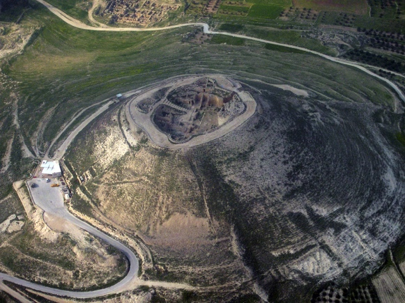



## Video


 

## Roadmap

-   Matthew genealogy (through Solomon) - Why 14?

-   Luke genealogy (through Nathan)

-   The Babylonian deportation (Assyrian diversion)

-   The Blood Curse on Jechoniah and the Royal Line (Jeremiah 22)

-   Possible resolutions to conflicting genealogies

## Matthew 1:1-11

<small>**The book of the generations (genealogy) of Jesus Christ, the son of David, the son of Abraham.**</small>

-   This begins the same way as Genesis 5 does, which reads "this (is the) book of the generations of Adam."

-   Genealogies were important legal documents to demonstrate lineage for the purposes of inheritance.

-   This verse establishes Jesus in David's line and therefore in Abraham's line.

    -   A "son of Abraham", then and now, means the person is a Jew. Today it often refers to gentiles who formally proselyte to Judaism.

    -   A Galilean could have been descended from any number of Jewish or gentile lines.

    -   A descendant not from David and Abraham could make no claim to be the Messiah.

    -   Matthew is clearly asserting Jesus' Jewish lineage.

-   Lancaster notes that Herod sought to destroy all such records (and probably people) of the Davidic Royal line.

    -   Far from being a boring list of names, the fact that Matthew's genealogy is preserved may be the first recorded miracle in his gospel!

    -   This may also have been the reason the line of David relocated from Bethlehem to relative obscurity in Nazareth.

## Matthew 1:2-11: Abraham to Jeconiah

<small>**Abraham was the father of Isaac, and Isaac the father of Jacob, and Jacob the father of Judah and his brothers, and Judah the father of Perez and Zerah by Tamar, and Perez the father of Hezron, and Hezron the father of Ram, and Ram the father of Amminadab, and Amminadab the father of Nahshon, and Nahshon the father of Salmon, and Salmon the father of Boaz by Rahab, and Boaz the father of Obed by Ruth, and Obed the father of Jesse, and Jesse the father of David the king. And David was the father of Solomon by the wife of Uriah, and Solomon the father of Rehoboam, and Rehoboam the father of Abijah, and Abijah the father of Asaph, and Asaph the father of Jehoshaphat, and Jehoshaphat the father of Joram, and Joram the father of Uzziah, and Uzziah the father of Jotham, and Jotham the father of Ahaz, and Ahaz the father of Hezekiah, and Hezekiah the father of Manasseh, and Manasseh the father of Amos, and Amos the father of Josiah, and Josiah the father of Jechoniah and his brothers, at the time of the deportation to Babylon.**</small>

-   This is very much like an Old Testament genealogy that runs from oldest to newest.

-   It was highly unusual for an ancient genealogy to include women, and all five women listed, including Mary in verse 16, were accused (though in Ruth's and Mary's cases, not guilty) of sexual misconduct.

-   Note that Matthew's list runs through Solomon, the first surviving son of David and the wife of Uriah

-   Note also that Bathsheba is referred to only indirectly.

    -   In fact, she is never named in the Bible after she dies.

    -   Nothing is accidental in the Bible. The Holy Spirit engineers and orchestrates every letter. For her not to be named is a "dis" from the Holy Spirit!

    -   Far from being an innocent victim, perhaps she was the instigator of the entire episode. She did seem to relish her position as Queen Mother in 1st Kings 2.

    -   In contrast, Rahab repented, Tamar was declared righteous by Judah himself, and if you know anything about Ruth and Boaz, there was nothing inappropriate about their relationship.

-   Matthew conspicuously skips three kings of Judah: Ahaziah, Joash, and Amaziah (compare 1 Chronicles 3:10-16).

    -   He was interested in preserving 14 generations.

    -   A few of the kings of Judah overlapped or died young.

### Luke 3:31-38 Adam to Nathan

<small>**the son of Nathan, the son of David, the son of Jesse, the son of Obed, the son of Boaz, the son of Sala, the son of Nahshon, the son of Amminadab, the son of Admin, the son of Arni, the son of Hezron, the son of Perez, the son of Judah, the son of Jacob, the son of Isaac, the son of Abraham, the son of Terah, the son of Nahor, the son of Serug, the son of Reu, the son of Peleg, the son of Eber, the son of Shelah, the son of Cainan, the son of Arphaxad, the son of Shem, the son of Noah, the son of Lamech, the son of Methuselah, the son of Enoch, the son of Jared, the son of Mahalaleel, the son of Cainan, the son of Enos, the son of Seth, the son of Adam, the son of God.**</small>

-   Luke's list runs through Nathan, the *second* surviving son of David and Bathsheba.

-   Luke adds Arni and Admin in between Hezron and Amminadab but otherwise is the same from Abraham to David.

-   Luke is interested in portraying Jesus as the Son of Man, so his genealogy goes all the way back to Adam.

    -   Adam is a Son of God; everyone else up until Jesus is a "son of Adam"

### The deportation to Babylon

-   "Babylon" is a recurring theme in the Bible, particularly the Babylonian destruction of Jerusalem in 586 BCE.

-   The modern mural depicts Israel's deportation to Babylon. The words in the upper right say "Galut Bavel," Exile (to) Babylon[^1].

-   We need to place ourselves in the shoes of the Jews of that time.

    -   You've been promised that you're God's people through the Mosaic Covenant.

    -   You've been promised the land forever through the Abrahamic Covenant.

    -   You've been promised that David's throne will endure forever through the Davidic Covenant.

    -   Jerusalem was thought to be impregnable, particularly after the Assyrians failed (2 Kings 19:31-36).

    -   Yet all that is lost on the 9th of Av in -586.

    -   Had God's promises failed? Maybe He's not really all-powerful or all-good. Maybe we sinned so bad that we're now beyond His reach. Maybe we misread the promises.

    -   And the question many ask today in the face of tragedy or evil is, "How could a good God let this happen?"

    -   Then what do you do next?

        -   Sing the blues (Lamentations)

        -   Turn your back on God

        -   Reinvent/reapply/spiritualize the Bible passages pertaining to the promises

        -   Fall on your knees in repentance and draw near to God

    -   As we do today, the people back then did all those things.

## Matthew 1:12-17: Jeconiah to Jesus

<small>**And after the deportation to Babylon: Jechoniah was the father of Shealtiel, and Shealtiel the father of Zerubbabel, and Zerubbabel the father of Abiud, and Abiud the father of Eliakim, and Eliakim the father of Azor, and Azor the father of Zadok, and Zadok the father of Achim, and Achim the father of Eliud, and Eliud the father of Eleazar, and Eleazar the father of Matthan, and Matthan the father of Jacob, and Jacob the father of Joseph the husband of Mary, of whom Jesus was born, who is called Christ. So all the generations from Abraham to David were fourteen generations, and from David to the deportation to Babylon fourteen generations, and from the deportation to Babylon to the Christ fourteen generations.**</small>

-   We have a problem with Jeconiah, which we'll discuss after we look at Luke's genealogy.

-   Matthew demonstrates that the line of David continued through Jesus even though David's descendants no longer possessed the throne.

-   The math doesn't work -- you can't get 14 generations from -586 to -5, the time of Jesus.

    -   Even more puzzling is Matthew has to count Jeconiah twice to get 14 from David to Babylon and also from Babylon to Jesus.

    -   Numerous theories have emerged such as counting Joseph and Mary separately, but these are all speculation and not really pertinent to our purposes.

-   Matthew is more interested in the pattern of 14, which someone with a Hebraic mindset would have noticed right away.

    -   The Hebrew spelling of David adds up to 14:

    -   ד = D = 4

    -   ו = V = 6

    -   ד = D = 4

    -   4+6+4 = 14

-   Matthew is clearly establishing a link to David and that Yeshua is the rightful descendant of David's royal line.

## Luke 3:23-30

<small>**Jesus, when he began his ministry, was about thirty years of age, being the son (as was supposed) of Joseph, the son of Heli, the son of Matthat, the son of Levi, the son of Melchi, the son of Jannai, the son of Joseph, the son of Mattathias, the son of Amos, the son of Nahum, the son of Esli, the son of Naggai, the son of Maath, the son of Mattathias, the son of Semein, the son of Josech, the son of Joda, the son of Joanan, the son of Rhesa, the son of Zerubbabel, the son of Shealtiel, the son of Neri, the son of Melchi, the son of Addi, the son of Cosam, the son of Elmadam, the son of Er, the son of Joshua, the son of Eliezer, the son of Jorim, the son of Matthat, the son of Levi, the son of Simeon, the son of Judah, the son of Joseph, the son of Jonam, the son of Eliakim, the son of Melea, the son of Menna, the son of Mattatha,**</small>

-   Greek genealogies were often reverse chronological

-   The phrase "as was supposed" has puzzled scholars

    -   The Greek word is a variation of nomitzo, which can mean "reckoned as by law" (*nomos* = law).

    -   One theory is that Luke is communicating Jesus is not the natural son of Joseph but an adopted son, just like adoptive parents go through a legal process today.

    -   Today, we would call Eli the "father in law" of Joseph, but that type of terminology likely didn't exist in 1st century Judaism. According to this interpretation, Eli is Mary's father.

-   Thus a common interpretation is that Matthew is giving us the ***royal*** line of Jesus through David and Solomon, while Luke is giving us the **blood** line of Jesus through David and Nathan.

-   Thus can be said that Jesus is of the **house** (royal) and **lineage** (blood) of David.

-   Why does this matter?

-   Let's talk about Jeconiah.

## Jeconiah and the blood curse

<small>**Jer 22:24-30 "As I live, declares the LORD, though Coniah (i.e. Jeconiah) the son of Jehoiakim, king of Judah, were the signet ring on my right hand, yet I would tear you off [25] and give you into the hand of those who seek your life, into the hand of those of whom you are afraid, even into the hand of Nebuchadnezzar king of Babylon and into the hand of the Chaldeans. [26] I will hurl you and the mother who bore you into another country, where you were not born, and there you shall die. [27] But to the land to which they will long to return, there they shall not return." [28] Is this man Coniah a despised, broken pot, a vessel no one cares for? Why are he and his children hurled and cast into a land that they do not know? [29] O land, land, land, hear the word of the LORD! [30] Thus says the LORD: "Write this man down as childless, a man who shall not succeed in his days, for none of his offspring shall succeed in sitting on the throne of David and ruling again in Judah."**</small>

-   Despite the promise made to David, Jeconiah was apparently so evil that God pronounced a curse on his line in verse 30: "none of his offspring shall succeed in sitting on the throne of David and ruling again in Judah."

-   So we have a problem. The Messiah is supposed to come from David's royal line yet God just pronounced a blood curse on that line.

    -   We can imagine Satan and his demons rejoicing, thinking God boxed Himself into a corner.

    -   Next, we can imagine God saying, "watch what I do next!"

-   The ONLY way around this is through a virgin birth and adoption.

-   Matthew establishes Joseph as the legal father through his marriage to Mary

    -   Thus Jesus is legally entitled to be in David's Royal line.

    -   Because Jesus is not Joseph's biological son, Jesus does not carry the blood curse of Jeconiah.

-   Luke establishes Jesus as being from the non-cursed blood line to David through Nathan and Mary.

-   If that doesn't make you go "wow" you've either heard the story before, or you weren't paying attention!

    -   To be fair:

        -   Some scholars reverse this and say Matthew is Mary's and Luke's is Joseph.

        -   Jewish tradition holds that Jeconiah repented and God accepted his contrition.

            -   Thus it is later written that Jeconiah had offspring who ruled Judea.

            -   The counter argument to this is they were local govenors of Judah under persian rule, they were not monarchs.

[^1]: Photo tb042403502

