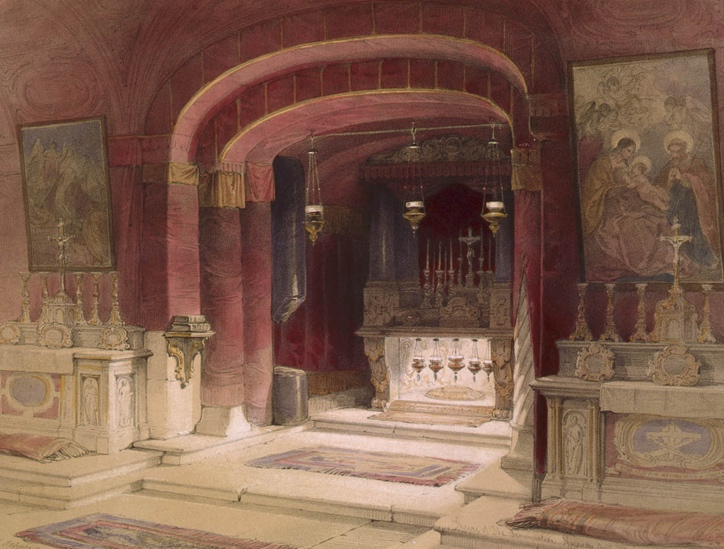

> In NATIVITY, Mary leaves Ein Karem in the hills of Judea and returns to Nazareth in Galilee. She will take this path many times to travel back and forth to Jerusalem. We journey with Mary as she ponders the great miracle she carries and how the revelation of it will practically affect her relationships. Joseph learns a lesson about how the light of Messiah can shine unexpectedly out of personal disappointments.[^1] Then, we join the magi from the east bearing gifts and tribute for a newborn king. We visit Herod’s palace in Jerusalem, but the King of the Jews is not there. Instead, we find Him still in Bethlehem with His mother and father, and the star that led us hence appears again. Fleeing from Herod, Joseph takes the family to Alexandria, Egypt, where they remain hidden until the death of the tyrant.[^2]



### Videos

Matthew 1:18-25:



---

Luke 2:1-38 (coming soon!)

-----
 
## Matthew 1:18-19 Mary's Condition and Joseph's Dilemma

<table>
<colgroup>
<col style="width: 50%" />
<col style="width: 50%" />
</colgroup>
<thead>
<tr class="header">
<th>Matthew 1:18</th>
<th>References</th>
</tr>
</thead>
<tbody>
<tr class="odd">
<td><b>Now the birth of Jesus Christ took place in this way. When his mother Mary had been betrothed to Joseph, before they came together, she was found to be with child from the Holy Spirit</b>.</td>
<td>
Heb 7:26 For it was indeed fitting that we should have such a high priest, holy, innocent, unstained, separated from sinners, and exalted above the heavens.

Gen 3:15 I will put enmity between you and the woman, and between your seed and her seed; he shall bruise your head, and you shall bruise his heel.”
</td>
</tr>
</tbody>
</table>

-   Up until now, miraculous births in the Bible still required a male/female union.

    -   Greek traditions (as well as Genesis 6) speak of gods impregnating women but nothing about the text indicates Mary’s conception was in any way sexual.[^3]

    -   God spoke the universe into existence. He created Eve from Adam’s rib.

    -   He could have achieved Mary’s pregnancy by speaking it or any number of other “contactless” ways.

-   At a minimum, The Virgin Birth removes the stain of sin (often called original sin) that occurs whenever a human x and human y chromosome merge. Hebrews 7 reminds us that Jesus is “holy, innocent, unstained and separated from sinners.”

-   Another tidbit about the Virgin Birth. In Genesis 3:15 God says to the serpent, “I will put enmity between your seed and HER seed.”

    -   The “seed of the woman” is one of the many names of the Jewish Messiah.

    -   This is a seemingly biological contradiction. The seed is in the man.

    -   Way back in Genesis, many scholars believe we have a hint of the virgin birth.

**Wells and Caves**

-   Eastern tradition (Greek, Russian orthodox, etc.) holds that the annunciation occurred at this well, in keeping with the rich tradition of momentous events happening at wells or springs throughout scripture. Abraham, Jacob, Gideon, and even Jesus in John 4 has the famous meeting with the Samaritan woman at the well.[^4]

- Western (Roman Catholic) tradition holds that the annunciation was in a cave that today is venerated at the Catholic Church of the Annunciation in Nazareth. 

  - Caves are also prominent in the Bible with Abraham purchasing the cave at Machpelah in Hebron as a burial place, David establishing his superiority over Saul in a cave (though he later regretted it), Elijah, before he killed the priests of Baal, he found them hiding in caves, 
  - John the Baptist traditionally lived in caves, and it is widely believed that both the birth of Jesus and the events described in the Garden of Gethsemane both took place in caves. [^5]

-----

<table>
<colgroup>
<col style="width: 50%" />
<col style="width: 50%" />
</colgroup>
<thead>
<tr class="header">
<th><large>Matthew 1:19</large></th>
<th>References</th>
</tr>
</thead>
<tbody>
<tr class="odd">
<td><b>And her husband Joseph, <u>being a just man</u> and unwilling to put her to shame, resolved to divorce her quietly.</b></td>
<td>
Tzadik – צַדִּיק – righteous one; not sinless but in the sense of Michah 6:8

Micah 6:8 He has told you, O man, what is good; and what does the LORD require of you? but to do justice, and to love kindness (mercy), and to walk humbly with your God.

Deu 22:23-24 “If there is a betrothed virgin, and a man meets her in the city and lies with her, then you shall bring them both out to the gate of that city, and you shall stone them to death with stones, the young woman because she did not cry for help though she was in the city, and the man because he violated his neighbor's wife. So you shall purge the evil from your midst.

Mat 5:32 But I say to you that everyone who divorces his wife, except on the ground of sexual immorality, makes her commit adultery, and whoever marries a divorced woman commits adultery.

Rom 12:7 Repay no one evil for evil, but give thought to do what is honorable in the sight of all.
</td>
</tr>
</tbody>
</table>

-   Just as the Spirit wanted us to know that Zechariah was righteous, He wants us to know that Joseph was righteous.

-   Again, the Hebrew word for a righteous one is tzadik. Abraham was a tzadik, Boaz was a Tsadik and here Joseph is a Tzadik

    -   When you read proverbs and it says the righteous do such and such but the wicked do such and such, the word for righteous is almost always tsadik.

    -   To be a tzadik does not require sinless perfection, but it essentially means the person is living out Deuteronomy 6:5, love the Lord your God with all your heart, soul, might and Leviticus 19:18 Love your neighbor as yourself.

    -   Both of these are restated in Micah 6:8, He has told you, O man, what is good; and what does the LORD require of you? but to do justice, and to love kindness (mercy), and to walk humbly with your God.

    -   Jesus gives us all the power to be tzadikim (pl), just like Joseph.

        -   If we weren’t acting like a tsaddik yesterday, today is a new day in the Lord who makes each of us a new creation.

-   Calling Joseph a Tzadik rules out Joseph being the biological father (at least not in the usual sense – see speculation below); a just man wouldn’t have had relations before marriage.

    -   The angelic visitation is confirmation.

-   Joseph did have a decision to make.



-   Unlike today, the engaged couple entered into a marriage covenant upon the announcement of the betrothal (today we only enter into such a contract after the wedding ceremony).

    -   The contract is called a Ketubah and today at Jewish weddings, they are often done as beautiful artwork such as the one pictured.[^6]

    -   To break an agreement of betrothal required a legal divorce

-   Sources indicate divorce in this situation was REQUIRED (if the child was not his)[^7]; Jesus even affirms that divorce is appropriate in the scenario of adultery.

    -   According to the Mishna, adultery during a betrothal period was *more* serious than that done after the wedding.[^8]

-   Joseph, as the injured party, had full control over what happened to Mary in terms of judicial punishment.

    -   **Option 1**: She could have been subject to the death penalty for adultery, which is death by stoning (Deuteronomy 22)

        -   The fact that she was obviously pregnant probably would have been enough for such a conviction.

        -   The way it worked, was the injured party (for example the next of kin in a murder case) would be the one to cast the first stone.

            -   Remember this nugget when we get to John 8 and the woman caught in adultery.

        -   Commentators are split on whether Mary had a chance to plead her case to Joseph or whether Joseph assumed what to him was obvious. They would not have been allowed to be alone together but this does not exclude a conversation between Mary and Joseph with another adult present.

        -   We can infer that Joseph loved her. If they had discussed if any part of him wanted to believe her; this would make it nearly impossible for him to be the one to cause her death.

        -   Although some of the reasons the Bible gives for the death penalty may sound harsh by our standards, in practice the death penalty was rarely carried out. The Mishna records the following: “Rabbi Elazar ben Azarya says a Sanhedrin that executes a transgressor once in seventy years (is considered a bloodthirsty tribunal)”[^9]

        -   Based on what we know about Joseph, he was very unlikely to consider this option, and Matthew confirms this.

    -   **Option 2**: public divorce followed by public shame followed by exile – she would not be welcome in the community.

        -   “Honor and Shame” was very strong in the ancient world

            -   We have honor and shame too, but we get it backwards; we **encourage** shame (Netflix, Reality TV) and **discourage** honor. It’s supposed to be the other way around.

        -   She and her child would have to fend for themselves in a society that did not take kindly to single mothers.

        -   A tzadik doesn’t seek revenge or seek to cause harm to another, even when he is wronged; therefore, \#2 is also an unlikely option for Joseph

        -   Romans 12:17 reminds us that we should never repay evil for evil. This is a verse we must consider carefully whenever we are considering a legal remedy in response to a financial or physical injury.

        -   Even though it wasn’t written in Romans yet, Joseph modeled this behavior. He took door \#3, which was the only option left to him (so he thought).

    -   **Option 3**: “Divorce her quietly” likely means Joseph was prepared to pay the fee to the father of the bride to break the engagement.

        -   This is somewhat like a legal settlement where neither side admits any wrongdoing.

        -   Joseph is not going to press the issue of infidelity, and in so doing, HE would not directly bring any shame on Mary

        -   However, her condition would eventually be obvious and Mary would suffer the consequences of her actions.

        -   Without an accuser, there would be no judicial punishment, but she and her newborn would likely have been exiled from the community.

    -   **Option 4?**: As we mentioned above, the one thing he did *not* have the option to do was to marry her. At least not prior to verse 20.

        -   The law forbade it, so he would be sinning.

        -   Doing so would be an admission that He fathered the child.

        -   Such an admission would be (and as best we can tell, ultimately WAS) treated accordingly by the small, tight-night, and religiously observant community.

        -   This makes the sacrifice Joseph is about to make even MORE remarkable.





-   Part of being a disciple is asking questions!

-   The original *talmidim* were frequently asking questions to make sure they understood what was happening.

-   2 Timothy 3:16-17 tells us that all scripture is profitable…

-   As we read the text, we want to begin to question everything.

-   At various points, we want to ask, “why does the Spirit want me to know this?”

-   Specifically in this case, given that Joseph ultimately did NOT divorce Mary, why is it “profitable” for us to know that he was considering it even though he didn’t go through with it?

-   Sometimes all we can do is speculate, but as long as our loosely held theory doesn’t contradict Scripture or is refuted by historical facts we can continue to pursue it. We are very likely to learn something (or at least understand why our theory is false); either way, we grow!

-   Given what we discussed in the last lesson about the apparent extraordinary lengths God went to assure Jesus had the right credentials to be the Messiah, verse 19 potentially represents a momentary crisis point in the narrative.

-   Had Satan enticed Joseph to follow through with the divorce, is it possible Jesus would have no connection or claim to the Royal line of David, and the whole messianic plan would have fallen apart?

-   To put this another way, Jesus would have gone on to be the sinless Son of God with or without Joseph’s parenting. Why was Joseph’s NOT divorcing Mary worthy of mention?

-   We can infer **having Joseph involved must be extremely significant** somehow.

-   Hence the very reasonable theory that the adoption by Joseph as the legal father is a required precondition to Jesus’ Messiahship.

-   Therefore, with God's plan momentarily in jeopardy, God must directly intervene once again.




-----

## Matthew 1:20-21 Joseph's Course Correction 

<table>
<colgroup>
<col style="width: 50%" />
<col style="width: 50%" />
</colgroup>
<thead>
<tr class="header">
<th>Matthew 1:20</th>
<th>References</th>
</tr>
</thead>
<tbody>
<tr class="odd">
<td><b>But as he considered these things, behold, an angel of the Lord appeared to him in a dream, saying, “Joseph, son of David, do not fear to take Mary as your wife, for that which is conceived in her is from the Holy Spirit."</b></td>
<td>
Is 51:7 “Listen to me, you who know righteousness, the people in whose heart is my law; fear not the reproach of man, nor be dismayed at their revilings.

“conceived” = γεννάω, literally “begotten”

Isa 49:5 And now the LORD says, he who formed me from the womb to be his servant…
</td>
</tr>
</tbody>
</table>

-   Given all we’ve discussed, the command to take Mary as his wife is staggering.

-   The angel reminded Joseph that he is a Son of David.

    -   Joseph is not just in the bloodline of King David, he’s in the much more exclusive royal line.

-   Joseph then receives supernatural confirmation that Mary is not an adulteress.

-   As noted previously, in any other circumstance, Joseph would be sinning if he married Mary.

-   The angel tells him that he’s not sinning by marrying her

-   But this introduces another problem. By proceeding with the wedding, Joseph was communicating that the child was his *and that he had acted less than honorably before marriage. No one at the time was going to believe their story about an immaculate conception*. Not very many believe it today for that matter.

-   In theory, we have a contradiction –

    -   The baby’s not his, so he can’t marry her; he’s a tsadik and a tsadik doesn’t willfully break the law.

    -   Yet, he DOES marry her even though the baby’s not his (or is it?)

-   Lancaster speculates that among the infinite number of ways God could have engineered the pregnancy, we can’t rule out that Joseph’s DNA was not *somehow, someway,* a part of the Messiah.

    -   Obviously, this is speculation, but such a move resolves any legal quandaries, namely the requirement for Joseph to divorce Mary.

    -   This move would also assure the royal Davidic line continued to be blood-based but would (again, somehow, some way) not have the stain of the curse.[^10]

-   In any case, think about the ramifications for Joseph.

    -   Let us not overlook his sacrifice.

    -   Joseph, Mary, and Jesus all had to live with the stigma of a crime they didn’t commit (and back then it was a crime) and for which the folks in a small town would have presumed their guilt.

    -   This perhaps adds new context to the angel’s encouragement to “do not fear”

    -   Isaiah 51:7 says “do not fear the reproach of men.”

-   The Greek word *genneas* does not imply sexual conception;

    -   It is more along the lines of being miraculously formed in the womb as with Isaiah 49:5

    -   Even more, it could be understood as miraculously placed in the womb.

    -   The Nicene Creed attempts to deal with this by saying Jesus is “begotten not made, of one essence with the father by whom all things were made.”

-----

| **Matthew 1:21**                                                                                              | References                                                                       |
|-------------------------------------------------------------------------------------------------------|----------------------------------------------------------------------------------|
| **She will bear a son, and you shall call his name Jesus, for he will save his people from their sins.”** | Mat 1:21 (DD) אֶת־שְׁמוֹ **יֵשׁוּעַ** כִּי הוּא **יוֹשִׁיעַ** |

-   Jesus’ Hebrew/Aramaic name is Yeshua, which means salvation.

    -   This is wordplay, albeit highly significant wordplay

    -   אֶת־שְׁמוֹ יֵשׁוּעַ כִּי הוּא יוֹשִׁיעַ

-   Matthew likely meant “His people” denotatively (literally). His people were the Jewish people.

    -   The Jews are His natural born people.

    -   Gentiles that are His are His by adoption (Romans 8:15, Galatians 4:5) and grafting (Romans 11)

----

## Matthew 1:22-23 Jesus Fulfills Isaiah 7:14

<table>
<colgroup>
<col style="width: 50%" />
<col style="width: 50%" />
</colgroup>
<thead>
<tr class="header">
<th>Matthew 1:22-23</th>
<th>References</th>
</tr>
</thead>
<tbody>
<tr class="odd">
<td><b>All this took place to fulfill what the Lord had spoken by the prophet: “Behold, the virgin shall conceive and bear a son, and they shall call his name Immanuel” (which means, God with us).</td>
<td>
Isa 7:13-14 And he said, “Hear then, O house of David! Is it too little for you to weary men, that you weary my God also? [14] Therefore the Lord himself will give you a sign. Behold, the virgin shall conceive and bear a son, and shall call his name Immanuel.

1Pe 3:15 but in your hearts honor Christ the Lord as holy, always being prepared to make a defense to anyone who asks you for a reason for the hope that is in you; yet do it with gentleness and respect

Mat 28:20 And behold, I am with you always, to the end of the age.”
</td>
</tr>
</tbody>
</table>

-   Matthew is using a literary device called *inclusio.*

    -   *Inclusio* is using the same or similar wording at both the beginning and the ending of a paragraph, passage, or in this case an entire book.

    -   If we consider the genealogy a preamble, he’s essentially beginning his gospel with “God with us”

    -   Matthew ends his gospel with “I AM with you.”

-   Here is the first of the statements on fulfilled prophecy cited by Matthew.

    -   The photo is from the “Great Isaiah Scroll” one of the Dead Sea scrolls which dates to the 2nd century BC that was discovered in 1947.  The bottom two lines are Isaiah 7:14.[^12]

### Answering Common Challenges to Matthew 1:23

-   Those with more conservative theological beliefs would contend Matthew was inspired by the Holy Spirit. 
    - Through this lens, we contend Matthew supernaturally saw that Isaiah’s prophecy regarding the birth of `Immanuel` had messianic fulfillment by the virgin birth of Yeshua.
    - Therefore, theological conservatives have less of a problem taking Matthew (and indeed the entire Bible) at face value than do those with a more liberal Christian worldview or a non-Christian worldview.
- Anti-missionaries[^11] and other critics/skeptics often cite several problems with Matthew’s hermaneutical methods.
    -   For the most part, these arguments _do have some validity_; therefore, we believe such exploration is a worthwhile exercise, even though those of us reading this commentary may be firm in our beliefs.
    -  It is to our benefit to know and understand common so-called "problems" with the Bible to have a ready response if asked.

-   1 Peter 3:15 tells us to be prepared to give every man an answer for the hope that is within us doing so with gentleness and respect.

    -   Part of discipleship is having that initial conversation with a non-believer, whether that person is a skeptic or has never heard Jesus.

    -   We are called to provide reasons, and sound, logical arguments, for the hope we have.
    -  Additionally, if not checked, seeds of doubt can grow into weeds that impede our own discipleship.  We must be absolutely confident that God's word is true, and we must live like we are confident in it!
    - Dr. Chuck Missler used to say, "if you think you've found an error in the Bible, rejoice!  There are no errors in the Bible, and the journey you take to confirm that for yourself will result in a blessing."  AMEN![^20]

-   At times, such a defense may require us to provide refutations to arguments that attack the core fundamentals of the faith (in this case, the inerrancy of the Apostolic writings).

    -   In the spirit of doing so with gentleness and respect, I would say rebutting an argument is ONLY worthwhile if the other person is making a legitimate academic inquiry and seeking an answer in good faith.

    -   We should not pick fights or try to win points in a social media discussion.

    -   Spending your time and energy answering someone who doesn’t really want to listen to you is an example of “casting your pearls before swine.”

-   With this in mind, let’s look at some of the common challenges, and then we’ll provide some rebuttals and rationales.




-   Response: Yes, he does ignore the original context for the most part. In context, we agree the prophecy was given to King Ahaz 700 years before Jesus.

> Matthew follows Jewish methods of Scripture interpretation and application of his day.

-   Such methods leverage word-play, gematria, and hyper-literal application called *Midrash* related to *drosh*, to seek out).

-   Apostolic era midrash involves the transposition of a biblical text to a different application.

-   There is no way my professors at Liberty University would let me get away with such methods of hermeneutics today, but they were common and accepted in the first century.

-   Many prophecies Matthew will cite have a dual application – one immediate to the time and another to the days of Messiah (and from a Christian perspective, this could either be the first coming or the second).

-   Isaac Troki
    -   As an aside, one of the earliest published books that today’s anti-missionary groups rely on is called “Faith Strengthened” written in the mid 1500’s by Isaac Troki. Troki first documented most of the arguments we are discussing here in this section.

    -   Troki is from the Karaite branch of Judaism.

    -   With an estimated 40,000 followers today (that is to say fairly small), Karaites break with most of traditional Judaism in rejecting the Oral Torah including the midrashic methods of interpretation used by almost every other branch of modern Judaism.

    -   So, it’s easy for him to attack Matthew’s methods of Judaic interpretation because Troki himself didn’t agree with them according to his lens of Judaism.

    -   He also wouldn’t agree with the hermeneutic traditions of most other traditional Jewish sects, including the beliefs of those today who cite his book to attack Christians.






    -   Challenge: **He takes the passage hyper-literally.** Nothing about the passage implies a Virgin will still be a virgin when she conceives. It only requires that she be a virgin when the prophecy was given.

        -   Response: Also true; but Matthew was also saying the most supernatural part of the prophecy remained unfulfilled in Ahaz’s day: the fact that the virgin will be a virgin when she conceives.

        -   While the prophecy was most directly to King Ahaz (who lived 700 years before Jesus), Isaiah also said, “hear then, HOUSE OF DAVID…” – the prophecy can apply to the entire line; not just one man.







-   Response: This complaint is more flawed.

    -   The same people just got through arguing that the person need only be a virgin at the time the prophecy was written. For the woman to NOT be a virgin, would be a curse, not a prophecy.

    -   Six other times the word *alma* is used in the Bible; most of the time it is unambiguously a virgin as we think of the word. The other couple of times, it could be ambiguous potentially.

    -   It is not much of a sign when a young woman gets pregnant.

-   Probably the nail in the coffin of this complaint is when the Jewish scholars translated the Hebrew Bible into the Greek Septuagint, they used the unambiguous Greek word for virgin, Parthenos, παρθένος

-   In other words, 200 years before the birth of Jesus, the Jewish sages believed Isaiah meant “virgin” as we think of it.







-   Response: as we noted at the beginning of this lesson, pagan conceptions between gods and virgin females were ALWAYS sexual. 
-  What happened to Mary was in NO WAY sexual.
-   Ultimately, we acknowledge that two of the four gospels don’t mention the virgin birth and several apostolic writers including Paul never mentions it.

        -   An argument as to why this could be that they didn’t find it all that surprising because they knew Jewish tradition, which DOES in fact have several TRADITIONS and LEGENDS of supernatural conceptions and births.[^13]

        -   The Bible recounts several “closed wombs” that were supernaturally opened by God, making all of those conceptions miraculous works of God. By definition, a virgin’s womb is closed.

        -   While not from the Bible, Jewish legend holds that Isaac, Moses, and David also were supernaturally conceived.

        -   The Dead Sea Scrolls written around the time of Jesus contain a fragment of a legend that holds Noah was supernaturally conceived.

        -   We aren’t saying these non-biblical legends are true, and that is not the point.

        -   The point is that a Jewish supernatural conception of a person God used mightily would have resonated with the early apostles.

        -   While they may have initially had their doubts, once they heard the story as authenticated by Matthew and Luke (of whom we have no reason to believe they were being deceitful or delusional), the other Jewish apostles had no reason to doubt any longer.

        -   The virgin birth has nothing to do with pagan mythology that anti-missionaries object to.




----

## Matthew 1:24-25 Joseph's Revised Decision

| Matthew 1:24-25                                                                                                                                                                         | Reference                                                                                                                   |
|----------------------------------------------------------------------------------------------------------------------------------------------------------------------------------|-----------------------------------------------------------------------------------------------------------------------------|
| **When Joseph woke from sleep, he did as the angel of the Lord commanded him: he took his wife, but knew her not until she had given birth to a son. And he called his name Jesus.** | Mishnah Bava Batra 8:6, 134a If one says: "This is my son," he is believed, as regards the right of inheritance” |

-   Stern notes, “Joseph’s behavior indicated that he accepted Yeshua as his son.” The Mishnah states, “he is to be believed; thus Yeshua, as a legally acknowledged son, is entitled to inherit the throne of King David from Joseph.” [^14]

    -   Perhaps this supports the speculation that (somehow, someway) Jesus WAS Joseph’s son.

-   At a minimum, it appears Joseph married Mary **immediately** to attempt to minimize her (and now their) shame.

    -   By doing so, he also created the impression among the 200 or so other townsfolk of Nazareth that he faltered and fathered the child. They probably knew the timing didn’t line up.

    -   However, to see both sides, there is another line of thought that says the folk in Nazareth, which means “branch town,” i.e., branch of David, believed the messiah would eventually come from their midst, so maybe the situation isn’t as dire as we might imagine.

    -   As we go through the gospels, where it may be of value to our own discipleship, we will try to learn to critically question many of the standard conclusions made and passed down by commentators over the years to see if there might not be another equally plausible explanation for what is going on.

    -   Specifically, we will look for examples that allow us to exhibit Leviticus 19:18 better and give others the benefit of the doubt.

-   Somehow, word got out, and Jesus’ detractors learned about Jesus’ seemingly inappropriate conception.

-   Several examples of ancient anti-Christian literature claim that Jesus resulted from an affair Mary had with a Roman soldier named Pantera (yes, children of the 80s, you heard that right).

    -   We only have the one event from Jesus’ childhood where he visits the Temple, so nothing is recorded of any trauma or struggles in His childhood

    -   John 8, Psalm 69 and others might indicate the family was subjected to abuse because of the apparent scandal.

-   Matthew skips over the birth narrative with the shepherds, which we find in Luke.

-   Jewish boys were not named until the 8th day, at their circumcision

-   This is another subtle hint that the Magi were not there the night of Jesus’ birth but came later.

-   We’ll spoil this and many other of your favorite Christmas traditions when we get to Luke 2!

#### References

Bolen, Todd. “Matthew 1.” PowerPoint handout, Santa Clarita, CA, 2018.

———. “Matthew 21.” PowerPoint handout, Santa Clarita, CA, 2018.

Keener, Craig S. *The IVP Bible Background Commentary: New Testament*. 2nd edition (E-Sword). Downers Grove, Illinois: IVP Academic, 2014.

Lancaster, Daniel T. “Nativity.” In *Chronicles of the Messiah*, edited by Boaz D. Michael and Stephen D. Lancaster. Second. Marshfield, MO: First Fruits of Zion, 2014.

Stern, David H. *Jewish New Testament Commentary: A Companion Volume to the Jewish New Testament*. E-Sword edition. Clarksville, Md.: Lederer Messianic Publications, 1992.

“Mishnah Makkot 1:10.” Accessed August 27, 2022. https://www.sefaria.org/Mishnah_Makkot.1.10?lang=bi&with=all&lang2=en.

*Out of Egypt*. Jesus, My Rabbi, 2020. Accessed August 31, 2022. http://friends.ffoz.org/resources/portion-connections/out_of_egypt_1.html.

*The Nativity*. Jesus, My Rabbi, 2020. Accessed August 31, 2022. http://friends.ffoz.org/resources/portion-connections/the_nativity_1.html.

*The Virgin*. Video. Vol. 1. 2 vols. Jesus, My Rabbi, 2020. Accessed August 29, 2022. http://friends.ffoz.org/resources/portion-connections/the_virgin_1.html.

[^1]: *The Nativity*, Jesus, My Rabbi, 2020, accessed August 31, 2022, http://friends.ffoz.org/resources/portion-connections/the_nativity_1.html.

[^2]: *Out of Egypt*, Jesus, My Rabbi, 2020, accessed August 31, 2022, http://friends.ffoz.org/resources/portion-connections/out_of_egypt_1.html.

[^3]: Craig S. Keener, *The IVP Bible Background Commentary: New Testament*, 2nd edition (E-Sword). (Downers Grove, Illinois: IVP Academic, 2014), loc. Mt. 1:18.

[^4]: Todd Bolen, “Matthew 1” (PowerPoint handout, Santa Clarita, CA, 2018), fig. tb041003218.

[^5]: Ibid., drra3g03452.

[^6]: Ibid., tb020503015.

[^7]: Daniel T. Lancaster, “Nativity,” in *Chronicles of the Messiah*, ed. Boaz D. Michael and Stephen D. Lancaster, Second. (Marshfield, MO: First Fruits of Zion, 2014), 93.

[^8]: David H. Stern, *Jewish New Testament Commentary: A Companion Volume to the Jewish New Testament*, E-Sword edition. (Clarksville, Md.: Lederer Messianic Publications, 1992), loc. Mt. 1:19.

[^9]: “Mishnah Makkot 1:10,” accessed August 27, 2022, https://www.sefaria.org/Mishnah_Makkot.1.10?lang=bi&with=all&lang2=en.

[^10]: Lancaster, “Nativity.”

[^11]: Anti-missionaries are traditional Jews who believe Christianity is a dangerous anti-Jewish cult and work to prevent, refute, and undo any Christian missionary efforts among Jews. “Jews for Jesus” is a messianic missionary group. “Jews for Judaism” is an anti-missionary group.

[^12]: Todd Bolen, “Matthew 1” (PowerPoint handout, Santa Clarita, CA, 2018), fol. isax3y0.

[^13]: *The Virgin*, Video, vol. 1, 2 vols., Jesus, My Rabbi, 2020, accessed August 29, 2022, http://friends.ffoz.org/resources/portion-connections/the_virgin_1.html.

[^14]: Stern, *Jewish New Testament Commentary*, loc. Mt 1:24.
[^20]: This author can attest that Chuck not only saved me countless hours of doubt, and probably saved me from a lot of bad theology.  On the flip side, prior to encountering solid teaching, I heard things in college religion courses (including elements of the "Documentary Hypothesis," that were not taught as a hypothesis, but were taught as truth) that derailed parts of my faith for years.

