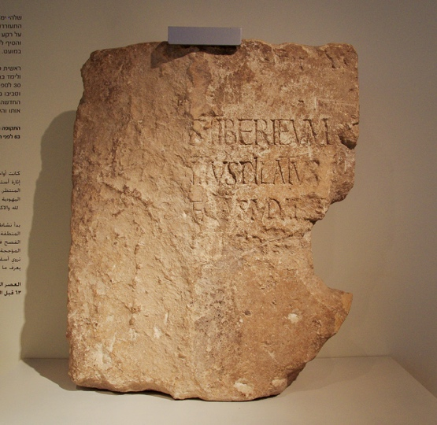



**Portions**: 

Luke 3:1-18 / Matthew 3:1-12 / Mark 1:1-8 / John 1:19-28

**Summary**

> In JOHN THE IMMERSER, Herod the Great’s sons have divided up the holy land, and the Holy Temple has fallen into the hands of a corrupt and Romanized priesthood. We turn our attention away from palaces and politics to seek a prophet, the voice of one calling in the wilderness. We find John the Immerser preaching on the other side of the Jordan River, near Bethany. John prepares the way through immersion and repentance. The waters of the Jordan River run with history and spiritual significance. Those waters have served as a place of renewal for the people of Israel more than once. The people seeking the prophet and his immersion must cross over its waters again to re-enter the land with a new heart and new commitment to God.

**Video**



## A word on the lesson title

In messianic Jewish circles, John the Baptist is often referred to as “John the immerser.” The reason for this is the term “Baptist” has become somewhat of a charged term theologically (positively and negatively). Immersion reminds us that Christian baptism has its roots in Jewish ritual immersion in a pool of “living water” (either a spring-fed river or lake, or a cistern used to collect rainwater) and is not an entirely new practice.

## The time of the beginning

| Mat 3:1                                                                   | Mar 1:1,4                                                                                             | Luk 3:1-2                                                                                                                                                                                                                                                                                                                                                              |
|---------------------------------------------------------------------------|-------------------------------------------------------------------------------------------------------|------------------------------------------------------------------------------------------------------------------------------------------------------------------------------------------------------------------------------------------------------------------------------------------------------------------------------------------------------------------------|
| In those days John the Baptist came preaching in the wilderness of Judea, | The beginning of the gospel of Jesus Christ, the Son of God…John appeared baptizing in the wilderness | In the fifteenth year of the reign of Tiberius Caesar, Pontius Pilate being governor of Judea, and Herod being tetrarch of Galilee, and his brother Philip tetrarch of the region of Ituraea and Trachonitis, and Lysanias tetrarch of Abilene, during the high priesthood of Annas and Caiaphas, the word of God came to John the son of Zechariah in the wilderness. |

-   Augustus was the Caesar at the time of Jesus’ birth; in 14 he was succeeded by Tiberius. If we assume Luke is counting from the beginning of Tiberius’ reign as Emperor (which is only an assumption) 15th year would place us in 27/28. Other commentators use other dates to come up with anywhere from 26-30 CE/AD. This results in a crucifixion date between 29-33 CE being defendable. Often the date one picks for the start of His ministry depends on the bias one holds regarding a Friday crucifixion and the Daniel 9 prophecy – we’ll get to both of those questions much later in our study. Unless you need a topic for a PhD thesis in seminary, I recommend we hold dates VERY loosely there’s a lot of ambiguity with calendar conversions and dating methods. Luke says Jesus was ”about thirty” when He started his ministry – if He started in the year 28, he would have been in his mid-30s (remember He had to be born prior to 4 BC when Herod the great died).

-   The region of Judea, Samaria and Idumea was first given to Archelaus, who as we mentioned last time fits the modern definition of a train wreck. He was deposed in 6 CE and was exiled. At this time Rome brought in Governors or Procurators, All Rome asked of its citizens was “pay your taxes and don’t revolt”. The procurators were tasked with seeing to both things. The procurators were headquartered at the palace in Caesarea but tended to visit Jerusalem during the feast days where large numbers of Jews (most of whom hated Rome) congregated.

-   At the time of Jesus, the procurator was Pontius Pilate. Some scholars doubted Pilate’s existence until a stone with an inscription referencing Pontius pilate prefect of Judea was found at Caesarea. The stone was found in the theater at Caesarea upside down. Even back then they were into recycling. Pontius Pilate was appointed governor of Judea in AD 26/27, and he held the post until March of AD 37. This inscription was found in secondary use in the theater of Caesarea. A suggested restoration reads: “Pontius Pilate, Prefect of Judea, made and dedicated the Tiberium to the Divine Augustus.” The stone is the first and only mention of Pilate from an archaeological source. Today a replica is on display at the national park in Caesarea and the original is in the Israel Museum.

-   Herod Philip had the northern districts including villages such as Bethsaida and Caesarea Philippi where Peter will later make his famous declaration. When asked “who do YOU say I am”, Peter answered, “you are the Messiah.” Jesus asks us that same question today and every day. In the Gospels, the scene at Caesarea Philippi is the high-water mark of sorts. Jesus would now begin to teach and repeat overtly that he would suffer and die. Both thematically as well as geographically, the rest of the gospels picture Jesus moving from Caesarea Philippi with Peter’s proclamation, which should have been EVERYONE’s proclamation, up to Jerusalem where he would be crucified.

-   The Herod that will give Jesus the most trouble is Antipas. Antipas was over galilee and the territory east of the Jordan called Perea. John the Baptist will accuse Antipas of adultery, and even the Jewish historian Josephus records that Antipas was politically threatened by John the Baptist. Jesus calls Antipas a “fox” in Luke 13 and they finally met face to face on the day Jesus was crucified. Jesus was before pilate being interrogated. When Pilate learned that Jesus was from Galilee, Pilate was concerned about a jurisdictional issue and had Jesus transferred to Antipas. Jesus said nothing to Antipas who mocked him and sent Jesus back to Pilate where he was given over to be crucified. Antipas would eventually be exiled just as his brother Archelaus was and replaced by Herod Agrippa I

-   The Decapolis (which means “ten cities) were gentile territory where Jesus fed the 4000 and expelled the demons into the herd of pigs, which Chuck Missler affectionally labels, “the first case of deviled ham”

-   Schlegel notes that “Jews were unhappy with this complicated arrangement of foreign roman domination.”[^1] In other words, Messianic hopes were high that God would correct this situation

-   Lancaster reports that between the time John’s father Zechariah served in the temple and the start of John’s ministry, the Romans began to sell the office of the high priest to the highest bidder, and of course, it only was awarded to those loyal to Rome. Annas was like a mafia godfather. Josephus records the political intrigue that resulted in Caiaphas being appointed High Priest, with Annas behind the scenes pulling the strings. The family controlled the high priesthood between 6 and 66. You know the saying about absolute power corrupting absolutely. These were the corrupt Sadducees and they virtually controlled the Sanhedrin in the days of Jesus and Paul.

-   Sometimes we get the idea that all of Jesus’ opponents were a single collective group – not so – the Pharisees tried to live their lives strictly by the word of God, so they detested the politically corrupt Sadducees.

-   Wilderness

    -   The Judean wilderness between Jerusalem and Jericho is virtually uninhabitable apart from a few isolated monasteries first built in the Byzantine period.

    -   Saying “The word of God came to John” is linking John with the Old Testament prophets who received supernatural revelation.

    -   The wilderness recalls the 40 years wilderness wanderings in Exodus. Lancaster: “Just as he led them into Canaan in the past, He will lead them from the wilderness into the Messianic Era.

    -   In the Lexham Geographic Commentary, Aubrey Taylor notes, “The wilderness paradoxically symbolizes chaos and distance from God, as well as a place for God to create new life and order. In the wilderness, God created a people and bound them to Himself, laying a foundation for the future nation. John likely believed he was initiating God’s return by enacting prophetic passages in a literal way within the wilderness.”

-   Mark

    -   Mark begins his gospel narrative here, completely bypassing the birth and childhood events.

    -   Mark presents Jesus as the servant of all and focuses primarily on what Jesus did to serve mankind.

    -   It is essentially Peter’s gospel, and it moves like Peter did. Quick fire hits. We can imagine Peter dictating to Mark in Hebrew, while Mark translated into Greek, trying to keep up.

    -   Mark does not have a genealogy because, as Missler says, “we aren’t interested in the pedigree of a servant.”

## The message and the messenger

<table>
<colgroup>
<col style="width: 25%" />
<col style="width: 27%" />
<col style="width: 23%" />
<col style="width: 23%" />
</colgroup>
<thead>
<tr class="header">
<th>Mat 3:2-6</th>
<th>Mar 1:2-6</th>
<th>Luk 3:3-6</th>
<th>John 1:22-23</th>
</tr>
</thead>
<tbody>
<tr class="odd">
<td>
<a href="verseid:40.3.2"><u>2 </u></a> “Repent, for the kingdom of heaven is at hand.”

<a href="verseid:40.3.3"><u>3 </u></a> For this is he who was spoken of by the prophet Isaiah when he said, “The voice of one crying in the wilderness: ‘Prepare the way of the Lord; make his paths straight.’”

<a href="verseid:40.3.4"><u>4 </u></a> Now John wore a garment of camel's hair and a leather belt around his waist, and his food was locusts and wild honey.

<a href="verseid:40.3.5"><u>5 </u></a> Then Jerusalem and all Judea and all the region about the Jordan were going out to him,

<a href="verseid:40.3.6"><u>6 </u></a> and they were baptized by him in the river Jordan, confessing their sins.
</td>
<td>
<a href="verseid:41.1.2"><u>2 </u></a> As it is written in Isaiah the prophet, “Behold, I send my messenger before your face, who will prepare your way,

<a href="verseid:41.1.3"><u>3 </u></a> the voice of one crying in the wilderness: ‘Prepare the way of the Lord, make his paths straight,’”

<a href="verseid:41.1.4"><u>4 </u></a> John appeared, baptizing in the wilderness and proclaiming a baptism of repentance for the forgiveness of sins.

<a href="verseid:41.1.5"><u>5 </u></a> And all the country of Judea and all Jerusalem were going out to him and were being baptized by him in the river Jordan, confessing their sins.

<a href="verseid:41.1.6"><u>6 </u></a> Now John was clothed with camel's hair and wore a leather belt around his waist and ate locusts and wild honey.
</td>
<td>
<a href="verseid:42.3.3"><u>3 </u></a> And he went into all the region around the Jordan, proclaiming a baptism of repentance for the forgiveness of sins.

<a href="verseid:42.3.4"><u>4 </u></a> As it is written in the book of the words of Isaiah the prophet, “The voice of one crying in the wilderness: ‘Prepare the way of the Lord, make his paths straight.

<a href="verseid:42.3.5"><u>5 </u></a> Every valley shall be filled, and every mountain and hill shall be made low, and the crooked shall become straight, and the rough places shall become level ways,

<a href="verseid:42.3.6"><u>6 </u></a> and all flesh shall see the salvation of God.’”
</td>
<td>What do you say about yourself?” [23] He said, “I am the voice of one crying out in the wilderness, ‘Make straight the way of the Lord,’ as the prophet Isaiah said.”</td>
</tr>
</tbody>
</table>

Matthew 3:2 says, “repent for the kingdom of heaven is at hand.” This is John’s gospel message. It is also Jesus’ gospel message (Matthew 4:17) and it is also the disciples’ Gospel message (Matthew 10:2). Note the gospel message is not “believe in me so you can live however you want and still go to heaven when you die”.

-   Repent means return to God, literally it means to turn around and go the other direction.

-   The kingdom of heaven, as interpreted by Rabbi Lichtenstein is “both the external state where Messiah reigns over the whole earth and the internal state of the individual who is forgiven and spiritually regenerated by the LORD.”

-   Is at hand – the kingdom messianic age is about to begin

All four gospels say that John’s ministry fulfills Isaiah 40:3. The Isaiah passage begins with “comfort, comfort my people” (40:1) and then goes into the voice of one crying in the wilderness (40:3). God’s Comfort is here.

Baptism and its Jewish predecessor immersion in a Mikveh carries a tie to ritual cleanliness and confession.

-   As the firstborn son of a priest, John should have been serving in the temple.

    -   He was either disenfranchised and pushed out by the corruption, or he voluntarily withdrew because he wanted nothing to do with it.

    -   The Bible does not tell us that he abandoned his priestly obligations, so we need to be cautious with inferring this.

    -   We do have some suggestion that John affiliated with another group of disaffected priests known as the Essenes.

        -   The Essenes lived at Qumron and are presumed to be the authors of the dead sea scrolls. Qumron is located in the Judean Wilderness on the Northwestern shore of the Dead Sea.

        -   “They opposed the sold-out, corrupted, Rome-loving, Hasmonean and Sadducean priesthood of Jerusalem.”[^2]

        -   Scholars debate whether he was formally an Essene, merely was familiar with the Essenes and shared some similarities, or was not affiliated with them in any way.

        -   Lancaster writes, “John and his disciples are associated with, and at points, endorsed by the Pharisees; this would not have happened if John were a known Essene.”[^3]

-   His attire alludes to Elijah

    -   2Ki 1:8 They answered him, “He wore a garment of hair, with a belt of leather about his waist.” And he said, “It is Elijah the Tishbite.”

-   The Jordan

    -   This is the area of, and perhaps the exact location where Moses called the nation to make a covenant with the LORD and Joshua crossed the river and lead Israel into the promised land.

-   Locusts & wild honey

    -   Luke 7:33 reminds us John was a Nazirite from birth

    -   “John entrusted himself solely to God for his daily needs,”[^4] which is reminiscent of the Israelites in the wilderness.

    -   Deu 29:5-6 I have led you forty years in the wilderness. Your clothes have not worn out on you, and your sandals have not worn off your feet. \[6\] You have not eaten bread, and you have not drunk wine or strong drink, that you may know that I am the LORD your God.

    -   Locusts could be insects or it could be carob pods from the locust tree, a tree that would have been available in parts of the Judean wilderness.

    -   Honey could refer to the syrup of dates and figs in addition to bee honey.

    -   John exemplified Jesus’ teaching on “do not be worried about what you will eat or drink” (Matthew 6:25)

-   His attire alludes to Elijah

    -   John wore clothing that was not purchased in the markets of Jerusalem. John’s dress reminded the people of the prophet Elijah, who wore a garment of hair (2 Kgs Mark 1:8). Indeed, John came in the spirit and power of Elijah to warn of impending judgment before the Lord’s appearance (Mal 3:1-6; 4:5-6).

## A specimen of John’s preaching

<table>
<colgroup>
<col style="width: 34%" />
<col style="width: 65%" />
</colgroup>
<thead>
<tr class="header">
<th>Mat 3:7-10</th>
<th>Luk 3:7-14</th>
</tr>
</thead>
<tbody>
<tr class="odd">
<td>
<a href="verseid:40.3.7"><u>7 </u></a> But when he saw many of the Pharisees and Sadducees coming to his baptism, he said to them, “You brood of vipers! Who warned you to flee from the wrath to come?

<a href="verseid:40.3.8"><u>8 </u></a> Bear fruit in keeping with repentance.

<a href="verseid:40.3.9"><u>9 </u></a> And do not presume to say to yourselves, ‘We have Abraham as our father,’ for I tell you, God is able from these stones to raise up children for Abraham.

<a href="verseid:40.3.10"><u>10 </u></a> Even now the axe is laid to the root of the trees. Every tree therefore that does not bear good fruit is cut down and thrown into the fire.
</td>
<td>
<a href="verseid:42.3.7"><u>7 </u></a> He said therefore to the crowds that came out to be baptized by him, “You brood of vipers! Who warned you to flee from the wrath to come?

<a href="verseid:42.3.8"><u>8 </u></a> Bear fruits in keeping with repentance. And do not begin to say to yourselves, ‘We have Abraham as our father.’ For I tell you, God is able from these stones to raise up children for Abraham.

<a href="verseid:42.3.9"><u>9 </u></a> Even now the axe is laid to the root of the trees. Every tree therefore that does not bear good fruit is cut down and thrown into the fire.”

<a href="verseid:42.3.10"><u>10 </u></a> And the crowds asked him, “What then shall we do?”

<a href="verseid:42.3.11"><u>11 </u></a> And he answered them, “Whoever has two tunics is to share with him who has none, and whoever has food is to do likewise.”

<a href="verseid:42.3.12"><u>12 </u></a> Tax collectors also came to be baptized and said to him, “Teacher, what shall we do?”

<a href="verseid:42.3.13"><u>13 </u></a> And he said to them, “Collect no more than you are authorized to do.”

<a href="verseid:42.3.14"><u>14 </u></a> Soldiers also asked him, “And we, what shall we do?” And he said to them, “Do not extort money from anyone by threats or by false accusation, and be content with your wages.”
</td>
</tr>
</tbody>
</table>

-   Note the seeker-friendly message.

-   Jesus will have a lot to say about bearing fruit during His ministry.

    -   We say it often, but our works matter.

    -   We don’t do good works to get saved; we do good works because we already are saved.

    -   A healthy fruit tree will bear fruit.

    -   If we are saved, there should be evidence of good works.

-   By saying “Bear fruit in keeping with repentance” John is confirming that immersion must be an outward expression of an inward change.

    -   He didn’t see any fruit of an inward change, so he refused to permit the outward expression.

-   With Matthew mentioning Pharisees and Sadducees we might get the impression that John is rejecting the religious and allowing sinners.

    -   This is why there is value of comparing passages.

    -   Luke makes it clear that John rejected ANYONE who was unrepentant, whether they were in vocational ministry or everyday folk such as soldiers and common folk, or vocational sinners such as tax-collectors.

    -   Matthew 21:32 also references John ministering to prostitutes, which can include “fallen women” for any reason not limited to sex for hire.

    -   He did not single out just the religious.

-   What he is likely railing against here is what we might call “cheap grace.”

    -   Back when the golden calf incident happened, God was ready to wipe the people out, Moses ”reminded” God of his promises to Abraham and God relented.

    -   Because of this, it became fashionable to rely on their familial connection to righteous Abraham to cover up sins in much the same way that Christians invoke the atoning sacrifice of Jesus.

    -   The problem is when they invoke Abraham, or we invoke Jesus to exonerate us from personal responsibility.[^5]

    -   One thing we will note is the old adage whenever you point a finger at someone, there are three fingers pointing back at you.

    -   Do we do this today? Do we ever say “well, I’m saved by Jesus so I’m forgiven”?

        -   If we say that from a posture of contrition and repentance it’s absolutely true.

        -   If we say it as an excuse to keep on sinning WITHOUT repenting, then it’s a problem.

-   What shall we do?

    -   After shooting painfully straight with his audience the faithful asked “what then shall we do?” There’s hope in this. None of us are beyond the father’s reach

    -   John prescribes acts of lovingkindness, called chesed in Hebrew; these deeds achieve the spirit of the commandment to love one’s neighbor as one’s self.

    -   Of note, John allowed them to stay in their occupations provided they conduct their lives with the highest standards of ethics.

-   The soldiers here are unlikely to be Roman soldiers

    -   John’s ministry did not extend to gentiles and Romans would have had no interest in anything Jewish.

    -   Given where he was (Perea), the soldiers were likely employed by Herod Antipas.

-   These stones

    -   In Joshua 4, God commanded stones of rememberance be placed to mark the moment where Israel was consecrated and crossed in to inherit the promised land.

    -   In Hebrew, the words for “stones” and “sons” only differ by one letter.

    -   A possible point could be a warning for them to not rely on cheap grace. In other words, “don’t fool yourselves. There are plenty of genuinely repentant righteous people who produce good fruit.”

    -   Also a sense could be “be like the original generation who crossed at this location by faith.”

    -   In Judaism, a gentile convert receives the title “Son of Abraham.”

## The forerunner's picture of the Messiah before seeing Him

<table>
<colgroup>
<col style="width: 17%" />
<col style="width: 12%" />
<col style="width: 26%" />
<col style="width: 43%" />
</colgroup>
<thead>
<tr class="header">
<th>Mat 3:11-12</th>
<th>Mar 1:7-8</th>
<th>Luk 3:15-18</th>
<th>Joh 1:19-28</th>
</tr>
</thead>
<tbody>
<tr class="odd">
<td><a href="verseid:40.3.11"><u>11 </u></a> “I baptize you with water for repentance, but he who is coming after me is mightier than I, whose sandals I am not worthy to carry. He will baptize you with the Holy Spirit and fire.</td>
<td>
<a href="verseid:41.1.7"><u>7 </u></a> And he preached, saying, “After me comes he who is mightier than I, the strap of whose sandals I am not worthy to stoop down and untie.

<a href="verseid:41.1.8"><u>8 </u></a> I have baptized you with water, but he will baptize you with the Holy Spirit.”
</td>
<td>
<a href="verseid:42.3.15"><u>15 </u></a> As the people were in expectation, and all were questioning in their hearts concerning John, whether he might be the Christ,

<a href="verseid:42.3.16"><u>16 </u></a> John answered them all, saying, “I baptize you with water, but he who is mightier than I is coming, the strap of whose sandals I am not worthy to untie. He will baptize you with the Holy Spirit and fire.
</td>
<td>Joh 1:19-28 And this is the testimony of John, when the Jews sent priests and Levites from Jerusalem to ask him, “Who are you?” [20] He confessed, and did not deny, but confessed, “I am not the Christ.” [21] And they asked him, “What then? Are you Elijah?” He said, “I am not.” “Are you the Prophet?” And he answered, “No.” [22] So they said to him, “Who are you? We need to give an answer to those who sent us. What do you say about yourself?” [23] He said, “I am the voice of one crying out in the wilderness, ‘Make straight the way of the Lord,’ as the prophet Isaiah said.” [24] (Now they had been sent from the Pharisees.) [25] They asked him, “Then why are you baptizing, if you are neither the Christ, nor Elijah, nor the Prophet?” [26] John answered them, “I baptize with water, but among you stands one you do not know, [27] even he who comes after me, the strap of whose sandal I am not worthy to untie.” [28] These things took place in Bethany across the Jordan, where John was baptizing.</td>
</tr>
</tbody>
</table>

-   John’s message was that the Messianic Age was about to commence.

-   This naturally led some to wonder whether John was the Messiah.

    -   In John 1:20, he says that he is not the messiah but is the forerunner.

-   Shoes

    -   The Talmud records, “a disciple must render to his teacher all the service that a slave renders to his master except that of loosening his shoe.”

    -   John is saying “I’m not even worthy to be regarded as Jesus’ slave.”[^6]

-   Water vs Holy Spirit and fire

    -   The arrival of Messiah has two different implications:

        -   For the believers who repent and bear fruit (the righteous), Jesus brings an immersion in the Holy Spirit.

        -   For the unbelievers who don’t repent and don’t bear fruit (the wicked), the coming of Messiah brings judgment.

        -   The book of Proverbs is our go-to reference when we study the righteous versus the wicked.

    -   For the righteous, as it is today with Christian baptism, water is an outward sign that symbolizes spiritual regeneration in the Spirit.

        -   Thus Jesus says in John 3:5, “Truly, truly, I say to you, unless one is born of water and the Spirit, he cannot enter the kingdom of God.

<table>
<colgroup>
<col style="width: 29%" />
<col style="width: 35%" />
<col style="width: 34%" />
</colgroup>
<thead>
<tr class="header">
<th>Matthew 3:12</th>
<th>Luke 3:17-18</th>
<th>Reference</th>
</tr>
</thead>
<tbody>
<tr class="odd">
<td><a href="verseid:40.3.12"><u>12 </u></a> His winnowing fork is in his hand, and he will clear his threshing floor and gather his wheat into the barn, but the chaff he will burn with unquenchable fire.”</td>
<td>
<a href="verseid:42.3.17"><u>17 </u></a> His winnowing fork is in his hand, to clear his threshing floor and to gather the wheat into his barn, but the chaff he will burn with unquenchable fire.”

<a href="verseid:42.3.18"><u>18 </u></a> So with many other exhortations he preached good news to the people.
</td>
<td>
Mal 4:1 “For behold, the day is coming, burning like an oven, when all the arrogant and all evildoers will be stubble. The day that is coming shall set them ablaze, says the LORD of hosts, so that it will leave them neither root nor branch.

Mal 4:5-6 “Behold, I will send you Elijah the prophet before the great and awesome day of the LORD comes. [6] And he will turn the hearts of fathers to their children and the hearts of children to their fathers, lest I come and strike the land with a decree of utter destruction.”
</td>
</tr>
</tbody>
</table>

-   In that day they would take a tool like a pitchfork and toss the kernels up into the air. The heavier seed would drop into one pile and the lighter chaff would be carried downwind into a separate pile. This was usually done on a plateau called a threshing floor. At the end the seeds would be gathered into a barn or a storehouse, and the chaff would be burned.

-   Matthew and Luke develop this theme of spirit vs fire with a quick one-verse parable, which we may call “the winnower, the wheat, and the chaff.”

    -   Winnowing fork = instrument of Messiah’s judgment

    -   Winnower’s hand = Messiah

    -   Threshing floor = Land of Israel/or the world

    -   Barn = the Kingdom of Heaven

    -   Wheat = repentant righteous

    -   Chaff = unrepentant wicked - The image of the wicked as chaff is common in the Old Testament (Ps 1:4; Isa 40:24; Dan 2:35).[^7]

    -   Meaning: Messiah is coming to punish the wicked and reward the righteous. I, John, am bringing you this good news and therefore begging each of you to repent and do works of righteousness.

-   In other words, John is the fulfillment (at least partially) of Malachi 4.

    -   Many believe Elijah himself is one of the two witnesses in Revelation 11, at which time Malachi’s prophecy would be completely fulfilled.

-   John’s mission was to call God’s people to repentance and right behavior.

-   In other words, it’s as if John is saying, “you can *tell* me you’re repentant, but you need to prove it to me.

-   When things are going well it's easy to trick ourselves into thinking that God must be really proud of our piety.

-   We all must turn to God for our provision. Again we don’t do good works to get saved, we do good works and bear good fruit because we are saved.

-   The fruit of repentance is a life of good deeds that reflect our love for God and our love for our neighbors, just as Jesus instructs his disciples.

Bibliography

Bolen, Todd. “Matthew 3.” PowerPoint handout, Santa Clarita, CA, 2018.

Lancaster, D. Thomas. *Chronicles of the Messiah*. Edited by Boaz Michael and Stephen D. Lancaster. 2nd ed. Vol. 3. 6 vols. Torah Club. Marshfield, MO: First Fruits of Zion, 2014.

Schlegel, William. “The Land and the Bible: A Historical Geographical Companion to the Satellite Bible Atlas,” September 2013. https://www.bibleplaces.com/wp-content/uploads/2015/08/The-Land-and-the-Bible.pdf.

Bolen, Todd. “Luke 3.” PowerPoint handout, Santa Clarita, CA, 2018.

Keener, Craig S. The IVP Bible Background Commentary: New Testament. 2nd edition. Downers Grove, Illinois: IVP Academic, 2014.

Lancaster, D. Thomas. *Chronicles of the Messiah*. Edited by Boaz Michael and Stephen D. Lancaster. 2nd ed. Vol. 3. 6 vols. Torah Club. Marshfield, MO: First Fruits of Zion, 2014.

Schlegel, William. “The Land and the Bible: A Historical Geographical Companion to the Satellite Bible Atlas,” September 2015. <https://www.bibleplaces.com/wp-content/uploads/2015/08/The-Land-and-the-Bible.pdf>.

———. The Satellite Bible Atlas by William Schlegel. Israel: William Schlegel, 2013.

Stern, David H. Jewish New Testament Commentary: A Companion Volume to the Jewish New Testament. Reprint edition. Clarksville, Md.: Lederer Messianic Publications, 1992.

Taylor, Aubrey L. “Ministry in the Wilderness.” In Lexham Geographic Commentary on the Gospels, edited by Barry J. Beitzel. Bellingham, WA: Lexham Press, 2017

[^1]: William Schlegel, “The Land and the Bible: A Historical Geographical Companion to the Satellite Bible Atlas,” September 2013, 159, https://www.bibleplaces.com/wp-content/uploads/2015/08/The-Land-and-the-Bible.pdf.

[^2]: D. Thomas Lancaster, *Chronicles of the Messiah*, ed. Boaz Michael and Stephen D. Lancaster, 2nd ed., vol. 3, Torah Club (Marshfield, MO: First Fruits of Zion, 2014), 151.

[^3]: Lancaster, 3:152.

[^4]: Lancaster, 3:149.

[^5]: Lancaster, 3:162–63.

[^6]: Lancaster, 3:167.

[^7]: Todd Bolen, “Matthew 3” (PowerPoint handout, Santa Clarita, CA, 2018), 82.

### Archived Video



https://friends.ffoz.org/resources/portion-connections/john_the_immerser.html
https://friends.ffoz.org/resources/portion-connections/the_voice_in_the_wilderness_1.html

