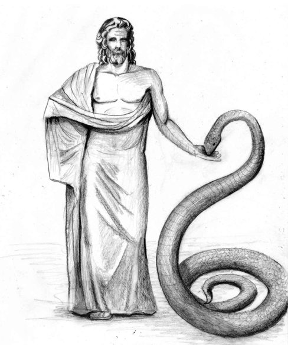
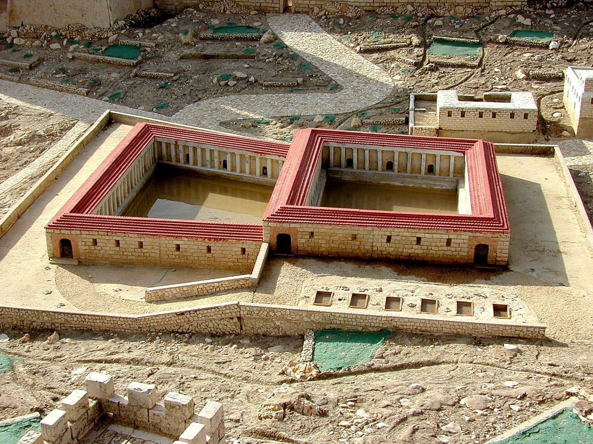



> In the POOLS OF BETHESDA, we follow Yeshua as He makes another pilgrimage to Jerusalem to keep one of the festivals. On the Sabbath day, we head for the Temple. On the way there, we walk along the city walls and cut through the five-colonnaded double pool of Bethesda on our way to the Sheep Gate. Then we duck inside and up to the Temple to spend the rest of the day, where a delegation from the religious leaders in Judea reprimands Him for healing on the Sabbath. The ensuing discourse occurs within the Temple courts, but the discussion takes us from the carpenter shop in Nazareth to the end of the era, the resurrection of the dead, the Messianic Kingdom, and the final judgment.

## Contents

- What was the unnamed feast of the Ioudaioi?

- What happened to verse 3b and 4?

- Where and, more importantly, WHAT were these pools?

- Why were the Ioudaioi upset?

- Who were the THREE witnesses testifying on behalf of Jesus?

## Geography

Schlaegel’s introduction: “Jesus interrupted His ministry in Galilee (Map 11-5) when He came to Jerusalem for an unnamed festival. On a Sabbath at the Pools of Bethesda, Jesus healed a man who had been lame for 38 years. After nearly two thousand years of searching for these pools, they were finally excavated beginning in the 1960s.

They are located just north of the temple mount, near the remains of the Antonio fortress.

We now know that these pools were not associated with the Jewish temple whatsoever but with the Greco-Roman God of healing, Asclepius. So, we have a man, whom we later find out is Jewish, had ineffectually waited for years on a superstitious healing.

Because of this discovery, we can confidently say that the description in some Greek manuscripts in John 5:3b-4 of an angel of the Lord stirring the waters is an **incorrect** 4th century AD addition.

Box E marks the pools of Bethesda.

An important geographic clue could like in the fact that although the pools today are inside the city walls, at the time of Jesus, they were outside the city walls. On this map, we can see that Gogaltha was also outside the walls. Despite the pool’s proximity to the Temple, we believe from archeology that these pools were actually pagan. The Greeks and Romans had pagan healing centers called Asclepions throughout the empire. The larges one was in the city of Pergamom, one of the seven churches of Revelation. You might want to check out the background video on Pergamom: <https://youtu.be/NcftNgsIHWw?t=569>

Asclepius with Serpent

Understanding that these pools are pagan and not Jewish changes the entire complexity of the passage, which we will get into as the study unfolds.

After the miracle, Jesus claimed to not only have the power to heal but to raise the dead.” In other words, Jesus is “greater than the healing sanctuaries of His day.” He is also greater than our medical system today.

### Transition

Much like our previous lesson at the Nazareth synagogue represented a transition from private to public in Jesus’ Galilean ministry, this lesson represents a transition from private to public in His Judean ministry.

- Perhaps, John, in reading the available manuscripts from the synoptic writers noticed a lack of detail on Jesus’ activities in Jerusalem prior to Passion week. In any case, John pays significantly more attention to Jesus’ activities in Judea than do Matthew, Mark, and Luke.

- As we move into more public encounters, we should begin to be like stage directors.

  - Notice the setting; where is He? Remote countryside? Galilean village? The big city of Jerusalem or its “suburbs”?

  - Are people seeking out Jesus or is He targeting someone for a specific interaction?

  - Who is present, and who is not present? To be specific we need to say who is “documented as being present.”

  - Note whom Jesus interacts directly versus onlookers;

  - Note who might be favorably disposed to Jesus’ message, who might be hostile and who might be on the fence.

- In this case, note who is not mentioned. The disciples. Jesus went to the feast alone, or at least John did not mention the presence of any other friendlies accompanying Jesus to the feast.

## John 5:1 – An unnamed Feast

> After these things, there was a feast of the Ioudaioi, and Jesus went up to Jerusalem.

- John likes this phrase *meta touta*, after these things.

- It’s peculiar that this is an unnamed feast of the Ioudaioi.

  - Perhaps omitting the name of the feast is another clue that the location of the miracle is in no way connected with Judaism.

  - When we get to John 9 and that healing, the Pool of Siloam WAS connected with the Temple and WAS inside the city walls at the time. It is outside the walls today. The entire complexion of John 9 is vastly different from John 5. It’s a great study to compare the two, which we will do when we get to John 9 in several weeks.

  - So what is this feast?

    - There were three compulsory feasts, Passover, Shavuot (Pentecost), and Sukkot (Tabernacles).

      - There were also several minor feasts that were not compulsory.

      - Jesus will attend one of these in John 10, Hanukkah.

    - Our working hypothesis is that when John says the feast is “of the Ioudaioi,” we’ll presume it is one of the three major fests.

      - The minor feasts were ALWAYS Ioudaioi feasts.

      - Our proof for this is in John 10; only the Ioudaioi had a feast of dedication, so there is no need to say “feast of the dedication of the Ioudaioi.” And indeed, John does not say this.

      - The Ioudaioi, as well as the Samaritans and Essenes, had feasts of Passover, Shavuot, and Tabernacles, making the “of the ioudaioi” clarification necessary.

    - Passover doesn’t fit the chronology

    - This is probably the Shavuot or the Tabernacles festival in the same year following the Passover in John 3.

    - “The feast” usually refers to Sukkot.

  - We can almost ask why John bothered to mention the fact that there was a feast since it has no bearing on the events of the chapter.

- Ioudaioi

  - As a reminder, one speculation is John is writing to an Israelite, but non Jewish, audience. Therefore “feast of the Ioudaioi” is said to distinguish the festival from nearly identical ones observed by Essenes and Samaritans.

  - We’ll see in John 10, that John merely says, “feast of dedication and it was winter.” This is unmistakably Hanukkah. There is no need to say “Hanukkah of the Ioudaioi” because only the Jews observed Hanukkah. The Essenes and Samaritans did not.

- Up to Jerusalem

  - In order to avoid Samaria, many Jews traveled to Jerusalem via the Jordan Rift.

  - At Jericho they traveled up the Ascent of Adummim.

  - While we tend to say “up” when we go north and “down” when we go “south”, because of Jerusalem’s elevation and, more importantly, status, we ALWAYS go “UP” to Jerusalem (even if conceivably traveling from a higher elevation).

  - John is much more interested in Jesus’ Judean encounters than His Galilean ones.

## John 5:2-3a

> Now in Jerusalem, by the Sheep Gate, there is a pool which in Hebrew is called Bethesda, having five porticoes. In these porticoes lay a multitude of those who were sick, blind, limping, or paralyzed.

- This is another description where skeptics were having a field day in denying scripture.

  - They would say that John possibly wrote his Gospel 25 years after Jerusalem was destroyed; perhaps his aging memory had failed him.

- How can a pool have five porticos?

  - Everyone knows that Roman pools are four-sided and there can only be at most, four porticos around the pool.

  - No one had ever heard of a pentagon-shaped poo,l but this is what archeologists were looking for.

  - Then one day in the mid-1960s, archaeologists excavated what turned out to be two pools separated by a portico in the middle, with four porticos all around. (photo credit[^1]). John’s memory wasn’t so bad after all!

- Today this is in the northeastern part of Jerusalem by a well-preserved crusader church called St. Anne’s, named for the mother of Mary.

- Excavation of the pools is continuing to this day – it’s amazing to see the difference in 2023 versus when I was there previously in 2013.

- It is extremely difficult to visualize as the pools were evidently extremely deep. Today the bottom is a good 40’ below the surface level. Over the centuries, Byzantines, Muslims, and Crusaders built structures on top of the pools.

## John 5:5

> Now a man was there who had been ill for thirty-eight years.

- The NKJV and KJV includes verses 3b-4

  - John 5:3-4 (NKJV) *In these lay a great multitude of sick people, blind, lame, paralyzed,* **waiting for the moving of the water. For an angel went down at a certain time into the pool and stirred up the water; then whoever stepped in first, after the stirring of the water, was made well of whatever disease he had.**

- We now know this is an error, probably inserted by a well-meaning scribe. It is not included in the most reliable manuscripts. Perhaps the scribe was trying to explain the “stirring of the waters” in verse 7 and was somehow unfamiliar with Asclepius.

- In fact, including verse 4 leaves us with precisely the wrong impression of what is going on.

- These were not Jewish pools associated with the nearby Temple, and it was not an Angel of the LORD who stirred up the waters.

- In the 90s, archaeologists found further evidence that the pools were part of an Aesculapian, a pagan healing center.

  - This site was a center of a Roman healing cult of the god Asclepius. Many archeologists believe the Asclepius dates to several centuries after Jesus, but it appears to be built upon an earlier Asklepion. More than 400 such healing facilities have been found throughout the Roman empire.

  - Serpent imagery, hallucinogens, and trickery by the priests were all employed.

  - In this case, the priests likely opened a valve between the two pools, which caused a “stirring of the water” attributed to the gods. Lo! It’s a Miracle!

  - Asclepios’ mythical daughters are Hygeia and Panacea, which is where we get our healing related words “hygiene” and “panacea”

  - The symbol of Asclepius is a snake around a pole, likely a corrupted version of Moses lifting up the bronze serpent in the wilderness.

  - So if you’ve ever wondered where modern medicine gets its snake imagery, now you know! 

- “When the Devil brings forward Asclepius as the raiser of the dead and the healer of all diseases, may I not say that in this matter likewise he has imitated the prophecies about Christ?” – Justin Martyr. “Dialogue with Trypho”

- Why bring all this up about Asclepios?

  - **The complexion of the story changes once we realize the man is also paralyzed spiritually - seeking healing from a false god**

  - **These “waters” can’t heal him - only the Pure and Living Water of Jesus, the Mayim Chayim, can (cf. John 2, 3, 4)**

  - We need to ask, “what was a Jew doing here?”

  - We need to ask ourselves what we are doing when we look to the world for healing.

  - Of course, not all western medicine is bad but notice the snake imagery that persists to this day. More and more, medications are changing who we are to the point of altering our DNA/RNA, which should concern us all.

- Anytime John mentions a number, we can assume it is significant even though we may not know exactly why it was significant to him.

- Here our guess is that John is drawing a connection with this many, who is obviously a Jew but looking for healing in the wrong place, with the Israelite’s 38 years wandering in the wilderness.

  - They wandered for a total of 40 years but the punishment for disbelief was 38 years.

- The timeframe also underscores the man’s ability to find healing anywhere besides Jesus. This includes the pools.

## John 5:6-9

> Jesus, upon seeing this man lying there and knowing that he had already been in that condition for a long time, said to him, “Do you want to get well?” The sick man answered Him, “Sir, I have no man to put me into the pool when the water is stirred up, but while I am coming, another steps down before me.” Jesus \*said to him, “Get up, pick up your pallet and walk.” Immediately the man became well, and picked up his pallet and began to walk. Now it was a Sabbath on that day.

- John’s motif of one person not answering another’s question continues.

- John or Jesus has referenced living water in every chapter of John thus far, but Jesus does not mention it here.

  - In fact, the waters of the pool have nothing to do with the man’s healing.

  - He speaks and it is so – just like the first words of God in Genesis 1, “Let there be light.”

  - Again, we will want to contrast this healing with John 9 where Jesus tells the man to wash in the Pool of Siloam. He does NOT command the man to wash here.

  - We will also want to note this man’s reaction compared with the man in John 9.

- We think that Jesus was always causing Sabbath controversy, but there are “only” five recorded healings on Shabbat: Here, John 9, Matthew 12, Luke 13, and Luke 14.

- This means there were around 200 Shabbat days in Jesus’ ministry when nothing unusual happened so nothing noteworthy was recorded.

## John 5:10-13

> So the Ioudaioi were saying to the man who was cured, “It is a Sabbath, and it is not permissible for you to carry your pallet.” But he answered them, “He who made me well was the one who said to me, ‘Pick up your pallet and walk.’” They asked him, “Who is the Man who said to you, ‘Pick it up and walk’?” But the man who was healed did not know who it was, for Jesus had slipped away while there was a crowd in that place.

- The man was healed, but the Ioudaioi are spiritually blind and paralyzed.

  - This doesn’t necessarily need to be a large group of Ioudaioi.

- There was a robust internal debate about what was and was not allowed on Shabbat.

  - The Torah itself provides relatively few examples of what constituted “work on the Sabbath.” A famous example is that of the prohibition of gathering wood for a fire (Numbers 15:32).

  - Jewish tradition, as it tends to do, tries to fill in the gaps with what they think God meant.

  - It was this tradition that may have included a prohibition on carrying a mat in a public place.

  - This is no different than our day with our debates over worship styles, baptism requirements, and communion practices.

- Lancaster speculates that these particular Ioudaioi may have been seeking to impose a standard that was not widely accepted, including by Jesus.[^2]

  - This would be similar to someone whose personal preference is to dress more formally for church but then scolding someone else who doesn’t hold the same dress code.

  - Similarly, what could be carried on Shabbat and how far was up for debate.

  - We don’t necessarily need to view these rule enforcers as sinister, just like the men of the Nazareth synagogue could have been deeply conflicted and saddened by the fact that they had to uphold the Law of Moses (as they interpreted it) against one of their own.

  - The Bible will usually tell us when someone approaches Jesus with ill motives; when it doesn’t, we shouldn’t assume bad intentions.

- In any case, Jesus in no way was overturning or disrespecting the Sabbath.

  - Honoring the Sabbath was one of the big 10 commandments.

  - He could not have violated such a commandment and still claimed to be the Jewish Messiah.

  - Jesus’ statement in Matthew 24:15-16 acknowledges that He viewed limitations on Shabbat travel as proper.

- Remember, this is a feast time, so there could have been a million people crowing Jerusalem.

  - The private nature of this healing leads us to believe this was still early in His ministry (possibly immediately before His proclamation at the Nazareth synagogue, which John doesn’t record).

  - If so, relatively few would have known what He looked like.

## John 5:14-16

> Afterward, Jesus found him in the temple and said to him, “Behold, you have become well; do not sin anymore, so that nothing worse happens to you.” The man went away, and informed the Ioudaioi that it was Jesus who had made him well. For this reason the Ioudaioi were persecuting Jesus, because He was doing **these things** on a Sabbath.

- Jesus is big on course corrections.

- The very fact that you and I are studying together means we’ve allowed Jesus to correct our courses, perhaps multiple times.

- One of the themes from our Israel trip was “don’t forget God.” From time to time, Jesus reminds us of when we’ve forgotten God.

- Evidently, Jesus didn’t have to tell this man to go to the Temple. He knew what to do; he’d just forgotten God.

- We aren’t exactly sure which specific sin Jesus has in mind.

  - It could be the fact that here he was, a Jew seeking healing from a pagan center.

  - In general, he was guilty of breaking the commandment to have no other gods before the God of Israel. I think we break this commandment today more often than we care to admit.

  - There could have been another specific sin Jesus was referring to.

  - In John 9, Jesus makes it clear that there doesn’t have to be a specific sin at the root cause of one’s infirmity, but this doesn’t mean that a specific sin is NEVER the root cause.

  - In view of Jesus’ subsequent discourse, the “sin” could be the resurrection to judgment for bad deeds, referenced in John 5:29.

- NASB says the man “informed” the Ioudaioi about Jesus.

  - This seems like the translators want us to believe he “informed on” Jesus.

  - Perhaps the man was not happy with the rebuke even though he was just healed!

  - I’m not sure the text requires that we read it this way. He could have simply said to the Ioudaioi, “hey I now know who healed me.”

  - Either approach can map just fine to the text:

    - If he’s holding a grudge, this presents a stark contrast with the man in John 9.

    - If he’s happy he’s healed and restored in his Judaism, he can be viewed as respecting authority along the lines of what Paul describes in Romans 13:1 “Every person is subject to the governing authorities.”

- This outsider, Jesus, was a threat to the Deep State establishment of the time.

  - Lizorkin suggests it’s not “doing these things ON THE SABBATH,” but “DOING THESE THINGS on the Sabbath.”[^3]

  - It was the things Jesus was doing, not when He was doing them that had them riled up.

  - By stepping into the dwelling of a satanic god and establishing the authority of the God of Israel, “the Jerusalem Temple leaders knew that Jesus could not continue performing such powerful miracles without them losing their authority.”[^4]

## The Authority of the Son is the Same as the Father’s

- The healing at the Pools of Bethesda segues into a lengthy discourse about Jesus’ authority.

  - John’s overarching objective is to tell us who Jesus IS – specifically, His deity.

  - Matthew-what He said; Mark-what He did; Luke-what He felt.

- Other than a parenthetical comment by John in verse 18, Jesus speaks uninterrupted between verses 17 and 47.

- Again, a narrative theme of John is to establish Jesus’ authority, specifically in contrast to the illegitimate authority of the Ioudaioi.

- We will also see the courtroom motif reappearing. Watch for the terms, “witness,” “testify,” and “believe.”

## John 5:17-18

> But He answered them, “My Father is working until now, and I Myself am working.” For this reason, therefore the Ioudaioi were seeking all the more to kill Him, because He not only was breaking the Sabbath, but also was calling God His own Father, making Himself equal with God.

- As with His assertion in the synagogue at Nazareth, it is a mistake to say that Jesus never claimed to be God or never claimed to be the Messiah.

  - As our tour leader Rich says, “He does this a lot – He just does it Jewish.”

  - You and I might miss the nuanced references but the Jews did not.

  - Just to be sure we don’t miss it, John clarifies.

- Again, from the Ioudaioi’s perspective, Jesus was breaking the sabbath. Jesus was not actually breaking the Sabbath just like he was not actually a blasphemer.

  - Calling Him a sabbath breaker and blasphemer were attempts to discredit what Jesus was doing.

  - It was fear of who Jesus was, not what he was saying or doing or when he was doing them, that was the bigger threat.

- The Father does not rest from being the Father on Shabbat. His work continues: babies are birthed and circumcised on Shabbat, the temple services continue on Shabbat, and if need be, lives were rescued and emergency medical attention provided on Shabbat. None of these were considered Shabbat violations by the Torah.

  - These might be considered “valid exceptions” to the general rule that one should do no work on Shabbat.

  - When we get to the episode of picking grain on Shabbat, it will be clearer that Jesus’ Shabbat healings are not violations, but valid exceptions.

- Regarding being equal with God, we can read a verse like Philippians 2:6 (did not regard equality with God a thing to be grasped) and get confused.

  - The easiest explanation is that in terms of His humanity, Jesus is not equal to God.

  - In His deity, they absolutely are equals.

- Another narrative theme in John is that Jesus refuses to submit to the authority the Ioudaioi believe they have. Jesus is going to explain where His authority comes from and He will point to three witnesses who support His claim.

## John 5:19-30 Chaism

- A chaism is a literary device where similar thoughts, and usually similar if not identical words, are placed in parallel

  - The structure starts by working inward; typically an “A” verse or thought, followed by a “B” verse, then “C”, etc.

  - At some point in the middle, the structure reverses.

  - If C is the middle verse, then there will be a C’ (pronounced, “C prime”), followed by B’, then concluding with A’.

  - There are many variations but this is the basic gist.

- Chaisms can help us read and study a passage as a single unit. Often in verse-by-verse studies, we zero in on individual verses and sometimes can miss the bigger picture.

- Let’s look at this passage in John in view of this parallel structure.

- A (verse 19): Son does only what Father does (nothing of Himself)

  - B (20-21): Father and Son give life to the dead

    - C (22-23): Father gave all judgment to the Son

      - D (24): Amen, Amen, they will hear and believe

      - D’ (25): Amen, Amen, they will hear and live

    - C’ (26-27): Father made the Son the source of life

  - B’ (28-29): all will hear His voice and rise from the dead

- A’ (30): Son judges like the father (nothing on His own)

- We can summarize like this:

  - A/A’: Jesus is dependent and reliant on His Father and acts according to His will

  - B/B’: The Father and Son have resurrection power.

  - C/C’: The Father has fully commissioned the Son to act in the Father’s stead.

  - D/D’: Eternal life, rests on one’s response to Jesus.

## John 5:19-24

> Therefore Jesus answered and was saying to them, “Truly, truly, I say to you, the Son can do nothing of Himself, unless it is something He sees the Father doing; for whatever the Father does, these things the Son also does in the same way. For the Father loves the Son and shows Him all things that He Himself is doing; and the Father will show Him greater works than these, so that you will be amazed. For just as the Father raises the dead and gives them life, so the Son also gives life to whom He wishes. For not even the Father judges anyone, but He has given all judgment to the Son, so that all will honor the Son just as they honor the Father. The one who does not honor the Son does not honor the Father who sent Him. Truly, truly, I say to you, the one who hears My word, and believes Him who sent Me, has eternal life, and does not come into judgment, but has passed out of death into life.”

- He’s directly addressing the charge of blasphemy.

- He’s not usurping that which rightfully belongs to God because “Jesus acts only on the Father’s authority and in conjunction with His will.”[^5]

- He’s claiming to be deity all throughout this passage. “He just does it Jewish.”

## John 5:25-30

> “Truly, truly, I say to you, a time is coming and even now has arrived, when the dead will hear the voice of the Son of God, and those who hear will live. For just as the Father has life in Himself, so He gave to the Son also to have life in Himself; and He gave Him authority to execute judgment, because He is the Son of Man. Do not be amazed at this; for a time is coming when all who are in the tombs will hear His voice, and will come out: those who did the good deeds to a resurrection of life, those who committed the bad deeds to a resurrection of judgment. I can do nothing on My own. As I hear, I judge; and My judgment is righteous, because I do not seek My own will but the will of Him who sent Me.”

- Son of Man is a messianic title used by Daniel.

- Judgment is in His job description; just not with regard to His first coming.

- A sent one is an Apostle, or in Hebrew, a Shaliach.

- “Moses and the prophets were sometimes viewed as God’s agents.”[^6]

### Walking in His dust

- An Ambassador. An agent. When people look at the shaliach, they are supposed to see the one who sent the *shaliach*, just as the *shaliach’s* behavior is supposed to reflect the behavior of the one who sent him.

- You and I are *schlicim* for our Messiah

## John 5:31-35. John’s Courtroom Narrative 

> “If I alone **testify** about Myself, My **testimony** is not true. There is another who **testifies** about Me, and I know that the testimony which He gives about Me is true. You have sent messengers to John, and he has **testified** to the truth. But the **testimony** I receive is not from man, but I say these things so that you may be saved. He was the lamp that was burning and shining, and you were willing to rejoice for a while in his light.

- Jesus is speaking of John the Baptist and John 1:19 when the Ioudaioi sent priests and Levites from Jerusalem.

- They tolerated John as long as he played in their sandbox; the “brood of vipers” comment probably didn’t go over well.

  - John the Baptizer’s call to repentance served to remind everyone that they, too, had forgot God. Despite being the chosen people, they are not immune from wandering away.

  - The man at Bethesda was an example of this.

  - Jesus told that man to repent, just as John told his audience to repent.

  - The Chosen captured the opposing sentiment well in the Nazareth synagogue scene. Many in Jesus’ day felt that they were on the team by virtue of their lineage.

  - In contrast, all need to hear His Voice.

  - We sometimes focus on our individual relationship with Jesus and disregard the community component of belief. They did the opposite. Both are errors. We forget we are all part of one symbiotic body.

- A first-century oil lamp typically fit in the palm of one’s hand and did not put off that much light.

  - Typologically, John’s lamp was only a tiny representation of the true Light that had come into the world.

- Clearly, the Ioudaioi were hearing Jesus’ words but if they had a rebuttal John did not record it.

## John 5:36

> “But the testimony I have is greater than the testimony of John; for the works which the Father has given Me to accomplish—the very works that I do—testify about Me, that the Father has sent Me.”

- The Father has commissioned Jesus.

- Jesus is claiming to be the Messiah.

- Jesus is claiming to be God.

- This public proclamation probably happened around the same time as the proclamation in Nazareth.

- Jesus is now “going public.”

- The healing of the man earlier in the chapter is evidence that Jesus has God’s approval.

- The miracles are so commonplace to us, but we need to remember a healing like this is similar to when Jesus calmed the storm.

- Jesus is exerting unnatural power over something no earthly being has any control over: a body that fails.

- After the storm was calmed, the disciples asked, “who then is this?”

- This should be our question.

- This is the question John the Gospel writer is answering.

## John 5:37-40

> “And the Father who sent Me, He has testified about Me. You have neither heard His voice at any time, nor seen His form. Also you do not have His word remaining in you, because you do not believe Him whom He sent. “You examine the Scriptures because you think that in them you have eternal life; and it is those very Scriptures that testify about Me; and yet you are unwilling to come to Me so that you may have life.

- Life here is specifically life in the age to come.

- In the introduction we talked about a third witness. We have had John the Baptist, The Father, and now we have the Torah of Moses.

  - It’s sad that so many Christians discount the value of the Old Testament. None other than Jesus says those 39 books are all about Him.

- Jesus might be implying that if they were there when the Torah was given, they would not have believed, exemplifying John 1:14-18.

  - To reject Jesus is to reject the Scriptures.[^7]

- *I had been thinking about what might be our parallel. The Jewish leadership put the rules around Shabbat above the one who created Shabbat. Surely, we must have a parallel.*

- *For Evangelicals, I think our closest parallel might actually be the Bible, which I know sounds like heresy, but hear me out.*

  - *I’ll use the example of a recent president who walked to a church in Washington and held up a Bible as a photo op. He didn’t read from the Bible, but he held it up like it was the binding and the paper that made it sacred.*

  - *I happen to like this President very much so I’m not making a political statement.*

  - *It’s not the printing or the paper, but it’s the One Whom the text speaks of and points us to that is Sacred.*

  - *I love the fact that we say we’re Bible believing Christians, but we probably should say that we are Christ-followers, or Jesus’ disciples.*

  - *Believing in the Bible won’t give us eternal life, and that is Jesus point here.*

  - *Believing in the One Who wrote the Bible will. There’s a difference.*

  - *The Word of God is Jesus, which includes but is not limited to the Bible.*

- *I had been a little unsure of this but then I was watching the pastoral commentary on an episode of the chosen where the Evangelical representative said the exact same thing, so I feel like I’m on solid ground here.*

## John 5:41-43

> “I do not receive glory from people; but I know you, that you do not have the love of God in yourselves. “I have come in My Father’s name, and you do not receive Me; if another comes in his own name, you will receive him.

- I have come in My Father’s name

  - To reject the agent is to reject the sender.

- One comes in his own name.

  - “Give us Barabbas!” is one example of this.

  - The Anti-Christ is also not a bad speculation.

  - There is an Essene tradition of a “Wicked Priest,” which may be an individual person or a corrupt system claiming to speak and act on behalf of God. The Ioudaioi’s system might fit this description.

  - Ultimately we can’t state with exact certainty whom Jesus refers to by the “one in his own name.”

- The Ioudaioi, not all Jews but only the corrupt establishment, DO seek power and to be admired by the people.”

- They are blind that they do not have the love of God. They think they are “on the team.”

## John 5:44-47

> “How can you believe when you accept glory from one another and you do not seek the glory that is from the one and only God? Do not think that I will accuse you before the Father; the one who accuses you is Moses, in whom you have put your hope. “For if you believed Moses, you would believe Me; for he wrote about Me.

- This is a big dig.

  - Jesus says, “You can’t be trusted to make a sound decision about Me.”

  - They are like politicians or judges who only do what will earn glowing headlines (or worse, bribed to act a certain way) instead of doing what is faithful and just.

  - In other words, they have a conflict of interest.

  - Even if Jesus were inclined to seek their approval (which He isn’t), it would be impossible because of the conflict.

- These words support John 3:17-18

  - John 3:17-18 “For God did not send the Son into the world to judge the world, but so that the world might be saved through Him. \[18\] “The one who believes in Him is not judged; the one who does not believe has been judged already, because he has not believed in the name of the only Son of God.

- There already was a “chief prosecutor of Israel appointed by God Himself. His name was Moses.”[^8]

- Moses wrote of Jesus in the promise of the woman’s seed (Gen 3:15), the rightful ruler (Gen 49:10), the star from Jacob (Num 24:17), and the prophet to come (Deut 18:18). The Passover lambs foreshadowed the true Passover Lamb who would die so that the nation could be delivered (John 1:29; 1 Cor 5:7; Rev 5:6).[^9]

Bolen, Todd. “John 5.” PowerPoint presentation presented at the Photo Companion to the Bible: John, Santa Clarita, CA, 2018.

Keener, Craig S. *The IVP Bible Background Commentary: New Testament*. 2nd edition (E-Sword). Downers Grove, Illinois: IVP Academic, 2014.

Lancaster, D. Thomas. *Chronicles of the Messiah*. Edited by Boaz Michael and Stephen D. Lancaster. 2nd ed. 6 vols. Torah Club. Marshfield, MO: First Fruits of Zion, 2014.

Lizorkin-Eyzenberg, Eli. *The Jewish Gospel of John: Discovering Jesus, King of All Israel*. Edited by Ronald S. Weinbaum. Jewish Studies for Christians, 2015.

[^1]: Todd Bolen, “John 5” (PowerPoint presentation, Photo Companion to the Bible: John, Santa Clarita, CA, 2018), loc. John 5:2, fig. tb010200217.

[^2]: D. Thomas Lancaster, *Chronicles of the Messiah*, ed. Boaz Michael and Stephen D. Lancaster, 2nd ed., Torah Club (Marshfield, MO: First Fruits of Zion, 2014), 307.

[^3]: Eli Lizorkin-Eyzenberg, *The Jewish Gospel of John: Discovering Jesus, King of All Israel*, ed. Ronald S. Weinbaum (Jewish Studies for Christians, 2015), 67.

[^4]: Lizorkin-Eyzenberg, 68.

[^5]: Craig S. Keener, *The IVP Bible Background Commentary: New Testament*, 2nd edition (E-Sword) (Downers Grove, Illinois: IVP Academic, 2014), loc. John 5:19.

[^6]: Keener, loc. John 5:30.

[^7]: Keener, loc. John 5:39-40.

[^8]: Lizorkin-Eyzenberg, *The Jewish Gospel of John*, 79.

[^9]: Bolen, “John 5,” 69.

### Retro Video



https://friends.ffoz.org/resources/portion-connections/pool_of_bethesda_1.html