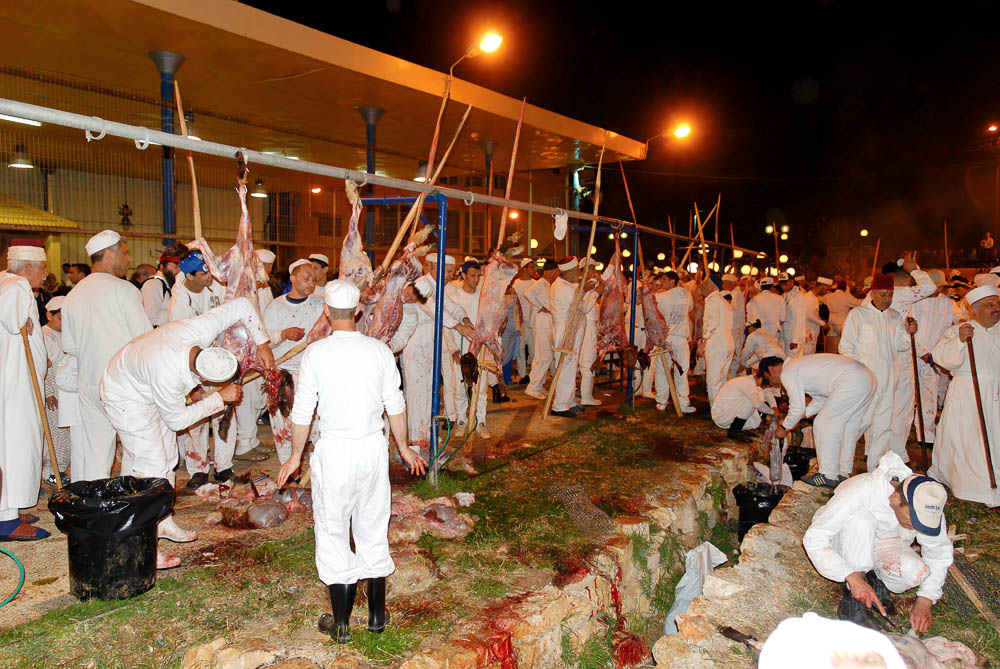
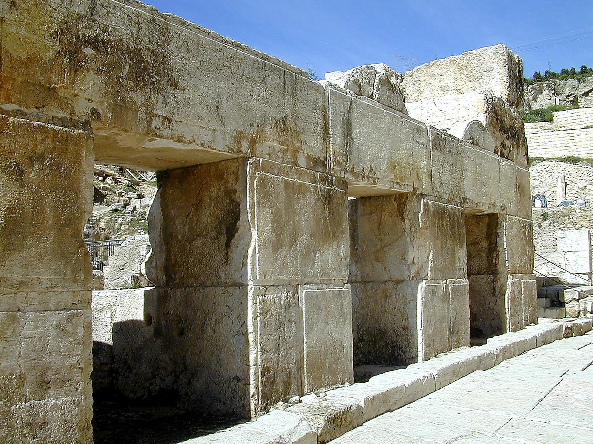
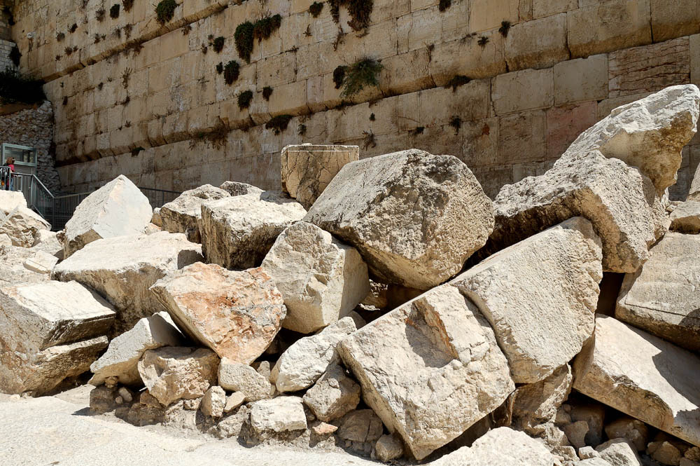



> Yeshua is IN JERUSALEM, the holy city, for the Passover festival and remains in Judea for a few extra weeks while His disciples immerse new penitents. Meanwhile, John the Immerser moves his work into Samaria and begins immersing “at Aenon near Salim,” leaving Yeshua and His followers to baptize in the area around Jerusalem. Salim is a fertile valley in Samaria east of Shechem.

### Video



### Introduction 

## Overview

The “First” Passover

The “First” overturning of the tables

Nick at Night

John 3:16

-   Many scholars believe John is recording separate accounts from the synoptic gospels (Matthew, Mark, and Luke) while others contend John is interweaving the same events and is not necessarily interested in following a strict chronology

-   One problem with treating them each as separate is that we would end up with Jesus celebrating five or six Passovers during the time of his public ministry. You can’t fit more than four Passovers in a 3-year public ministry.

-   With that said, if Jesus drove out the profiteers one year, it’s easy to see they would be right back at it in the future.

-   For reasons we have discussed I tend to believe Luke follows a strict chronology, but whichever view you hold on this I would recommend not holding on to it too tightly.

-   Instead, focus on what each gospel writer is trying to communicate

## Geography

We ended last lesson with the wedding at Cana (box 4) and Jesus spending a few days in Capernaum. Now, an unknown amout of time has passed and the next major event John records is the “first” Passover in Jerusalem, represented as event \#5 according to Schlaegel , who views John’s recount of the temple cleansing as a separate event from the cleansing at Jesus’ final Passover as recorded in the synoptic Gospels. The counter-argument is that John is not as interested in chronology and could be placing the later event here for his own purposes. There are very smart people on both sides of the argument.

## John 2:13-17 – The Passover of the Ioudaioi 

13 The Passover of the Ioudaioi was at hand, and Jesus went up to Jerusalem.

-   Dr. Eli believes John specifies the Passover of the Ioudaioi to differentiate from the Passover of the Shomrim, the Samaritans because John has the Samaritans as one of his intended audiences. The Qumranites also held their own Passover according to their own calendar.

-   Samaritans are still around today and continue to celebrate a biblical Passover in much the same way that they have for more than two thousand years.

-   Because the temple in Jerusalem does not exist, Jews do not practice animal sacrifice and thus the closest we can get to the practices of the first century is at the Samaritan celebration each year on Mount Gerizim.’

-   To a Jewish audience, and even to most gentiles, it would not be necessary to specify that it was a Jewish Passover; he could have just said “Passover.”

14 In the temple he found those who were selling oxen and sheep and pigeons, and the money-changers sitting there.

15 And making a whip of cords, he drove them all out of the temple, with the sheep and oxen. And he poured out the coins of the money-changers and overturned their tables.

16 And he told those who sold the pigeons, “Take these things away; do not make my Father's house a house of trade.”

17 His disciples remembered that it was written, “Zeal for your house will consume me.”

-   Archaeologists have discovered shops built outside the Temple Mount on both the western and southern walls. Jesus presumably had no objection to these. What He took offense with was the commercial activity that had invaded the places intended for worship on the Temple Mount itself. tb020101216

<!-- -->

-   Shops occupied the space underneath the monumental staircase that passed over Robinson’s Arch to provide access to the temple courts.

-   Also that the things the people were selling were necessary for the Passover procedures at the temple and the money changers served an entirely practical purpose. Keener notes that money changers were needed to standardize the various foreign currencies of the pilgrims so the local sellers didn’t have to worry about “exchange rates” if I can use that term.

-   We can surmise that just like today a tourist can get swindled with an unfair exchange rate and a merchant can overcharge the unsuspecting, the same thing must have been happening at the temple. Dishonest money changers and merchants were profiteering at the expense of God’s faithful, likely in collusion with each other. Today that is called racketeering and is very much frowned upon.

-   

-   We talked a little about whether this cleansing is the same as the one the synoptic gospels record at the end of Jesus’ ministry.

    -   Ultimately we recommend to not focus on whether this was the same or different events but focus on what each gospel is teaching us.

    -   Dr. Eli notes that the quote John uses “Zeal for your house will consume me” is different from the quote the synoptic writers use, “my house shall be called a prayer for all nations, but you have made it a robber’s den.”

-   John has in view an issue of purity whereas the synoptics appear to have a concern for the negative impression the spectacle of buying and selling has on the Gentiles.

-   Dr. Eli sees John as providing evidence that the temple is unfit for proper worship because it is being controlled by apostates. It needed to be cleansed of this impurity.

18 So the Ioudaioi said to him, “What sign do you show us for doing these things?”

19 Jesus answered them, “Destroy this temple, and in three days I will raise it up.”

20 The Ioudaioi then said, “It has taken forty-six years to build this temple, and will you raise it up in three days?”

21 But he was speaking about the temple of his body.

-   The meaning of Ioudaioi here is different than the meaning in verse 13. Before it referd to all jews or a Jewish religious observance in contrast to some other religious observance.

-   Here, it appears to mean a few representatives of the Sadducean temple authority.

    -   For reasons we can only speculate, John never uses the term Saducee (this is a big clue that the first part of John 8, while historically accurate, was not written by John. It appears to be a later scribal insertion.)

    -   Pharisees were not in charge of the temple and, assuming this is early in Jesus’ ministry, Pharisees were similarly interested in the purity of worship and probably agreed with Jesus’ actions here (though they were unlikely to admit it publicly).

-   There are a few points where we might be tempted to place the wrong emphasis in a sentence.

    -   We probably read this as, “what SIGNS do you show us for doing these things?”

    -   More likely it should be, “what signs do you SHOW US for doing these things?”

    -   The Sadducees thought they were the authority; one of John’s themes is the Sadducees are the usurpers – Jesus is the rightful authority no matter what the Sadducees think.

-   Photo: Archaeologists excavated this area in the 1990s and left these stones in place as a testimony to the Roman destruction in AD 70. Archaeologists have estimated that if all the Herodian stones which are in secondary use around Jerusalem were gathered together, almost the entire height of the Temple Mount walls could be reconstructed.

-   While here, Jesus wasn’t necessarily predicting the destruction of the Literal Temple, in Luke 21 Jesus does exactly this. He says “not one stone will be left upon another” – today you can visit the southwest corner at the base of the temple mount and see that this prophecy was not only fulfilled, but literally fulfilled. Not one stone was left upon another

-   tb090705034

22 When therefore he was raised from the dead, his disciples remembered that he had said this, and they believed the Scripture and the word that Jesus had spoken.

23 Now when he was in Jerusalem at the Passover Feast, many believed in his name when they saw the signs that he was doing.

24 But Jesus on his part did not entrust himself to them, because he knew all people

25 and needed no one to bear witness about man, for he himself knew what was in man.

-   Because Jesus is perfect, He is perfectly compassionate. He didn’t just heal for the sake of healing; he performed these miraculous acts as acts of compassion.

-   Lancaster: “In Jewish thought a person’s name conveys authority. To believe on the name of Yeshua is to accept His authority as an Agent of God. They believed Him to be the promised Messiah”

-   Verse 24 reads strange to us, “He did not need anyone’s testimony about a person because he knew what was within a person, or some translations have “within the heart of man.” This could be another way of saying that he told others to not tell anyone. He does not need man’s testimony and in fact preferred to keep a low profile for a number of reasons. He did not want to be seen as one who wanted to attract big crowds, though ultimately big crowds are exactly what happened. He also did not want to attract the attention of the establishment and roman authorities prematurely. He was not fomenting a revolution. He will say repeatedly that “my hour has not yet come.”. We can see the traps of fame very clearly today. People latch on to powerful and influential people for their own ulterior motives. Jesus wanted no part of such people.

-   John is also attesting to Jesus’ divinity. Just as with Nethaniel under the fig tree, Jesus knows what is in man’s hearts – things only God can know.

John 3:1-35

1 Now there was a man of the Pharisees named Nicodemus, a ruler of the Jews.

2 This man came to Jesus by night and said to him, “Rabbi, we know that you are a teacher come from God, for no one can do these signs that you do unless God is with him.”

3 Jesus answered him, “Truly, truly, I say to you, unless one is born again he cannot see the kingdom of God.”

4 Nicodemus said to him, “How can a man be born when he is old? Can he enter a second time into his mother's womb and be born?”

5 Jesus answered, “Truly, truly, I say to you, unless one is born of water and the Spirit, he cannot enter the kingdom of God.

6 That which is born of the flesh is flesh, and that which is born of the Spirit is spirit.

7 Do not marvel that I said to you, ‘You must be born again.’

8 The wind blows where it wishes, and you hear its sound, but you do not know where it comes from or where it goes. So it is with everyone who is born of the Spirit.”

9 Nicodemus said to him, “How can these things be?”

10 Jesus answered him, “Are you the teacher of Israel and yet you do not understand these things?

11 Truly, truly, I say to you, we speak of what we know, and bear witness to what we have seen, but you do not receive our testimony.

12 If I have told you earthly things and you do not believe, how can you believe if I tell you heavenly things?

13 No one has ascended into heaven except he who descended from heaven, the Son of Man.

14 And as Moses lifted up the serpent in the wilderness, so must the Son of Man be lifted up,

15 that whoever believes in him may have eternal life.
