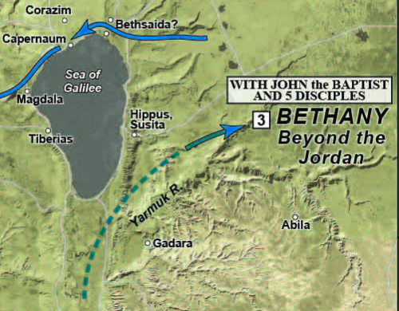
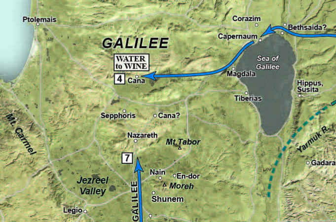

> In THE FIRST SIGN, we join Yeshua and His handful of followers in the Jordan River Valley near Jericho. We follow them north along the eastern side and pick up more disciples on Lake Galilee’s north shore in Bethsaida and Capernaum. A fishing boat takes us across the lake to Magdala.  From there, it’s a day’s walk to Cana of Galilee on the northern slopes of the Nazareth ridge, where Yeshua and His first followers attend a wedding. From there, we follow them back to Capernaum on the north shore of Lake Galilee, where they join a pilgrimage making their way down the Jordan Valley, following its eastern bank, before crossing near Jericho and ascending to Jerusalem for the Festival of Passover.



### Videos 

John 1:35-51



John 2:1-12



## Introduction

### The Gospel of John as a legal document

7 He came as a **witness**, to bear witness about the light, that all might believe through him.

8 He was not the light, but came to bear **witness** about the light.

15 Johnn bore **witness** about him, and cried out, “This was he of whom I said, ‘He who comes after me ranks before me, because he was before me.’”)

19 And this is the **testimony** of John, when the Jews sent priests and Levites from Jerusalem to ask him, “Who are you?”

20 He **confessed**, and did not deny, but confessed, “I am not the Christ.”

21 And they **asked** him, “What then? Are you Elijah?” He said, “I am not.” “Are you the Prophet?” And he answered, “No.”

22 So they said to him, “Who are you? **We need to give an answer** to those who sent us. What do you say about yourself?”

31 I myself did not know him, but for this purpose I came baptizing with water, **that he might be revealed** to Israel.”

32 And John bore **witness**: “I saw the Spirit descend from heaven like a dove, and it remained on him.

34 And I have seen and have borne **witness** that this is the Son of God.”

### Who were the *Ioudaioi*?

“The translation of Ioudaioi always and only as “Jews” sends the reader in the opposite direction from what the author intended.”[^1]

We will develop this in later lessons but John the Gospel Writer, is very loose with his terminology. *Ioudaioi*, which is the word John uses that is typically translated as “the Jews”, could mean anything from all Jews, to all believing Jews, to those in leadership of the Jewish religious establishment, to those geographically in or from Judea, some other subset[^2].

Even if Ioudaioi refers to the religious establishment, John may be indenting for us to understand a specific subset of that. For example, Nicodemus was part of the *Ioudaioi* religious establishment, but we can be confident he is not part of the *Ioudaioi* with whom Jesus has any quarrel.

As an analogy we could use the term “Americans” The Americans won the gold medal in 1980. All 300 million of us? No. 20 hockey players representing the country. We could also say the Americans bombed Syria. Well that doesn’t all 300 million of us, but maybe a squadron of planes acting on order from one President. We also say today that “the House passed” some piece of legislation; all that could mean is at least 50% of those present+ 1, not all 435 House members acting in unison.

Unfortunately, many of us have learned to see the “Jews” especially as John uses it has a negative connotation to mean ALL Jews everywhere. The gospel of John has been used to support anti-Semitic behavior in the name of Jesus. This is incorrect and terrible.

Most of the 1st-century church consisted of *Ioudaioi*, so it is an error to say that ALL *Ioudaioi* are guilty of rejecting and killing Jesus. There are believing *Ioudaioi* and rejecting *Ioudaioi*. The temple establishment opposed to Jesus and ultimately those who arrested Him and had Him executed could have been a very small number. Perhaps less than 35 and maybe even less than 20: in other words, a very small group of hidden players acting behind the scenes.

In any case, we need to make sure some latent anti-Semitic bias is removed from our reading. We need to work to discern the context and which Ioudaioi group John is referencing. If the context is negative, it is probably only the “deep state” fraction of the Temple establishment. This group was primarily Sadducees and Herodians with a small number of Pharisees along for the ride.

When we see the term “Ioudaioi” we will leave it untranslated to remind us that we need to be Bereans and explore the context in which John uses the term.

### Geographic setting

-   John 1:28 tells us that “these things took place in Bethany across the Jordan where John was baptizing.”

-   Good scholars dispute the location of “Bethany Beyond the Jordan”

-   The Location of Jesus’ baptism is widely believed to be in the vicinity of Jericho, but this doesn’t mean that John the Baptist didn’t have different locations.

-   Some, such as Schlaegel[^3], hold that “Bethany” is actually north, in the Golan heights, which would account for disciples from Galilee being present.

    -   The first four disciples known to be in Jesus’ company at this point are all from Bethsaida: Andrew, John (the unnamed disciple), Peter, and Philip.[^4]

    -   Peter and Andrew would later move to Capernaum (Mark 1)

    -   It seems logical that Peter, Andrew, James and John probably had a fishing cooperative, perhaps as a customs tax avoidance ploy as one boat would be registered in Capernaum (Herod Antipas’ region) and the other in Bethsaida (Herod Philip’s region).

-   The discussion with Nathaniel possibly takes place at Bethsaida.

-   They will then make their way past Capernaum and Magdala, through the valley of the doves to Cana.

-   After the wedding miracle, they will return to Capernaum.

## John 1:35-37

> The next day again John was standing with two of his disciples, and he looked at Jesus as he walked by and said, “Behold, the Lamb of God!” The two disciples heard him say this, and they followed Jesus.

-   John would seem to place verse 35 as being the next afternoon following Jesus’ baptism where the spirit came down.

    -   It might have been the next day but it didn’t need to be.

    -   John, and indeed the entire eastern mindset, is not as bound to a strict chronological record as we in the west have been brought up with.

### Walking in His dust

**Like John, we should demonstrate humility and keep our eyes on God’s bigger picture**

> Do nothing from selfish ambition or conceit, but in humility count others more significant than yourselves. Let each of you look not only to his own interests but also to the interests of others. (Php 2:3-4)

-   In John 1:35, John the Baptist essentially refers two of his own disciples to Jesus.

-   Imagine a teacher saying, “you should really go to the church down the street; that teacher is better than I am”!

-   Yet, this is essentially what John the Baptist says to his former disciples.

-   It speaks of John’s humility and that fact that his eyes were on God’s bigger picture.

    -   This is how it should be with us.

## John 1:38-39

> “Jesus turned and saw them following and said to them, “What are you seeking?” And they said to him, “Rabbi” (which means Teacher), “where are you staying?” He said to them, “Come and you will see.” So they came and saw where he was staying, and they stayed with him that day, for it was about the tenth hour.

-   Rabbi here is transliterated Hebrew, a clue that Jesus and His talmidim spoke Hebrew.

    -   In other places, we will see Raboni, which is transliterated Aramaic.

    -   Aramaic was the everyday language, while, we presume, Hebrew was used by the devout or in religious settings.

    -   The government language would have been Greek.

    -   They probably knew enough Greek to understand commercial transactions and to interact with Roman officials but it is highly doubtful they would have spoken Greek among themselves.

    -   In the Gospels, the word rabbi always speaks of Jesus (except in Matthew 23 where Jesus discusses the word itself).

    -   Rabbi in that day was more a term of respect and not, as it means today, a teacher with specific training and ordination who performs a specific role.

-   “What are you seeking?”

    -   Jesus asks us the same question every day and every moment.

    -   Like the disciples, we rarely answer the question directly.

    -   We answer it by our choices.

-   “Where are you staying?” is an indirect way of asking to follow Jesus. They were answering His question.

    -   We’ll unpack this in a later lesson, but it appears that “calling disciples” was a process, not a one-time event (think of the job application and interview process).

    -   A Rabbi and his perspective talmidim would take some time to get to know each other before agreeing to a multi-year commitment to one-another.

    -   This viewpoint untangles the various “callings” of the disciples that are recorded in the gospels.

-   Come and See” – head’s up; pay attention; follow me and learn.

-   “They stayed with Him that day for it was about the 10th hour”

    -   The 10th hour is probably around 4pm (but it depends on the time of year; an hour wasn’t 60 minutes but 1/12 of daylight).

    -   Some have suggested this was erev-shabbat, Friday afternoon, and the disciples were hoping to score an invitation to spend Shabbat with the Master.

    -   They didn’t just stay with Jesus that “night” but “that day,” meaning Friday night and all day Saturday, Shabbat.

    -   Can you imagine spending Shabbat, a free day, with Jesus. No appointments, no phones or TV; talking Bible until late at night and then again the next morning perhaps after Shabbat prayers at the local synagogue.

    -   Knowing Jesus, I bet the conversation wasn’t limited to just Bible study; I imagine Jesus challenged them to be better. Perhaps the conversation was uncomfortable but never awkward, because it’s Jesus, our ultimate fiduciary; the One who would lay down His life for our best interest.

    -   Their lives would never be the same; they had found the Messiah.

    -   How many times have we breezed past a Bible verse like “and they stayed with Him that day” and not really thought about the implications?

## John 1:40-42

> One of the two who heard John speak and followed Jesus was Andrew, Simon Peter's brother. He first found his own brother Simon and said to him, “We have found the Messiah” (which means Christ). He brought him to Jesus. Jesus looked at him and said, “You are Simon the son of John. You shall be called Cephas” (which means Peter).

-   We learn that one of the two talmidim who spent shabbat with Yeshua that day was Andrew. Scholars presume the other was John himself.

    -   Simon Peter, Andrew, James, and John probably grew up together and were likely in their mid-teens when they first met Jesus.[^5]

-   Messiah means “anointed one”; it is a title, which in Greek is translated as Christ. Given the above discussion, his disciples would have referred to Jesus as the Mashiach, Messiah, not “Christ”.

-   A subtle miracle here: Jesus and Peter had not met before, yet Jesus knows not only his first name but his family name.

    -   A Jew would have recognized this as a sign of a prophet.

-   Cephas is a transliteration of Kefa, which means “rock”; rock in Greek is “petros”, which is how we get Peter.

    -   This is probably a prophetic nickname about Peter’s future role in the early church.

    -   I like to imagine that it baffled Shimon at the time. “Why are you calling me that? We just met.”

-   He brought him to Jesus.

    -   Augustine reportedly said, “John’s Gospel is deep enough for an elephant to swim yet shallow enough for a child not to drown.”

    -   He finds the messiah. He tells someone else he has found the messiah. He brings that someone else to the messiah. That someone else changed the world for Messiah. (I said that, not Augustine!)

## John 1:43-44

> The next day Jesus decided to go to Galilee. He found Philip and said to him, “Follow me.” Now Philip was from Bethsaida, the city of Andrew and Peter.”

-   A disciple of that day would be no more inclined to drop everything and follow a complete stranger than we would be today.

-   Jesus casting some sort of spell over his disciples to make them follow him blindly is entirely inconsistent with Jesus’ later passages to count the cost before answering the call to be His disciple.

-   Therefore, even though the text doesn’t say this, it seems safe to infer that Philip and Jesus met previously.

-   And I know I’m usually the first to point out “the text doesn’t say that,” but this is where we need to be Bereans and exclude potential conclusions that are contradicted elsewhere in the Bible.

    -   While I wasn’t there and anything could have happened, on the surface, Philip following Jesus blindly is not consistent with other portions of scripture and is not consistent with what we think we know about 1st century discipleship.

-   Beit Tzaidah – house of fish nets, or more simply “fish town”

    -   By piecing together various biblical and historical clues, scholars speculate that John’s father Zebedee ran a sizable fishing business that included a partnership with Simon and Andrew as well as his own sons.

    -   Scholars began excavating “et Tell” and many have concluded it is the ancient Bethsaida.

        -   One problem in identifying et-Tell with Bethsaida is its distance from the Sea of Galilee and its elevation above the ancient level of the lake

        -   I’ve been there and it’s not so much the distance from the lake as the fact that it is a much higher elevation, even if we account for potentially higher lake levels back in Jesus’ day.

        -   BUT excavators have concluded that the village contained a fisherman’s home based on their discovery of two types of lead net weights. One weight was round, of the so-called musket type, and the second was elongated, similar in shape to a crooked needle.

    -   Mentioned by name seven times in the Gospels, Bethsaida is one of the most frequently mentioned cities in the New Testament.

    -   

## John 1:45-46

> Philip found Nathanael and said to him, “We have found him of whom Moses in the Law and also the prophets wrote, Jesus of Nazareth, the son of Joseph.” Nathanael said to him, “Can anything good come out of Nazareth?” Philip said to him, “Come and see.”

-   The one of whom Moses spoke was the Messiah.

-   Deut 18:15-18 “The LORD your God will raise up for you a prophet like me from among you, from your brothers—it is to him you shall listen— just as you desired of the LORD your God at Horeb on the day of the assembly, when you said, ‘Let me not hear again the voice of the LORD my God or see this great fire any more, lest I die.’ And the LORD said to me, ‘They are right in what they have spoken. I will raise up for them a prophet like you from among their brothers. And I will put my words in his mouth, and he shall speak to them all that I command him.

-   Acts 3:22 Moses said, ‘The Lord God will raise up for you a prophet like me from your brothers. You shall listen to him in whatever he tells you.

-   Even though we don’t have legal terms, note how everyone is testifying, as Philip is here.

-   Nathaniel also testifies to Nazareth’s insignificance

    -   No more than 200 people

    -   Because of the Davidic connections and the fact that they were likely insular, it is possible outsiders viewed the people of Nazareth as somehow affiliated with the corrupt Jerusalem leadership, which would have been a negative for other Galileans.

    -   John 21 tells us that Nathaniel is from Cana, which makes the statement about Nazareth that much more of a burn; Cana was as insignificant as Nazareth was.

-   Scholars believe Nathaniel and Bartholomew are one and the same.[^6]

## John 1:47-49

> Jesus saw Nathanael coming toward him and said of him, “Behold, an Israelite indeed, in whom there is no deceit!” Nathanael said to him, “How do you know me?” Jesus answered him, “Before Philip called you, when you were under the fig tree, I saw you.” Nathanael answered him, “Rabbi, you are the Son of God! You are the King of Israel!”

-   Despite Nathaniel’s skepticism, Jesus testifies in Nathaniel’s favor.

    -   Nathaniel means “God gave,” or perhaps “God’s gift.”

    -   The fig tree reference is apparently something only Nathaniel understood, though generally, the fig tree represents national Israel.

    -   Symbolically, trees also represented knowledge and teachers often taught under trees.

-   There might be a subtle pun: Israel/Jacob WAS a man of deceit.

    -   In the vision of the angels ascending and descending which Jesus will reference in the next segment, Jacob was fleeing precisely because of his deceit of Esau.

-   Lizorkin speculates that John’s intended audience might have been non-*Ioudaioi* followers of Israel’s God; for example, Samaritans and Essenes.

    -   If so, Nathaniel’s pronouncement carries more significance.

    -   Jesus is not just King of the *Ioudaioi*, He is King of all Israel.

## John 1:50-51

> Jesus answered him, “Because I said to you, ‘I saw you under the fig tree,’ do you believe? You will see greater things than these.” And he said to him, “Truly, truly, I say to you, you will see heaven opened, and the angels of God ascending and descending on the Son of Man.”

-   Truly, truly is literally, “amen, amen.”

-   “Heaven opened” indicates a major revelation from God.

-   This imagery evokes Jacob’s dream in Genesis 28:

    -   “And he dreamed, and behold, there was a ladder set up on the earth, and the top of it reached to heaven. And behold, the angels of God were ascending and descending on it! And behold, the LORD stood above it and said, “I am the LORD, the God of Abraham your father and the God of Isaac. The land on which you lie I will give to you and to your offspring.” (Gen 28:12-13)

    -   Nathaniel could have been reading Genesis 28 as he sat under the fig tree.

-   The Samaritans have a specific attachment to Jacob and his favorite son, Joseph.

    -   In John 4 we will be at Jacob’s well in Sychar, where the Samaritan woman will ask, “Are you greater than our father Jacob?”

    -   Here, Jesus is seemingly anticipating that question and His answer is an emphatic “YES.”

    -   The angels Jacob saw are not ascending and descending at a place in Samaria but upon Jesus Himself.[^7]

-   Jesus is the bridge/ladder between heaven and earth

## John 2:1-2

> On the third day there was a wedding at Cana in Galilee, and the mother of Jesus was there. Jesus also was invited to the wedding with his disciples.

-   This could refer to the third day of the week, Tuesday.

    -   Tuesday, the third day of creation, was the day God said “It was good” twice (1:10 and 1:12).

    -   Since it is the “day of the double blessing,” some speculate that weddings were often held on Tuesdays, but this is disputed[^8].

-   It could also mean simply three days had elapsed since the discussion with Nathaniel.

-   This may also be literary bracketing; in John 2:19, Jesus says, “Destroy this temple, and in three days I will raise it up.”

-   John is not necessarily chronological; while in our minds, John 2 occurs when Jesus is still relatively obscure, it is possible that wedding occurred after Jesus and his disciples had gained some regional notoriety and would be honored guests.

-   On the map[^9], you can see there are two contenders for Cana; one is off the beaten path, and the other happens to be on the main road from Nazareth to Tiberias (in other words, easier for the tour busses)

    -   Most scholars I’ve come across tend to side with the less accessible site.

-   Rather than officiating the wedding, Lancaster says that Jewish sages were invited to liven things up. The Talmud records the disciples of Hillel would sing before the bride and others added joy in various ways.

-   I find this tidbit fascinating.

-   Is there another wedding at some point in our future that Jesus will preside over where He will add joy? YES. You can read about it in Revelation 19 and all of the various wedding feast references in the New Testament – there are several of them.

-   Jesus was about to inject more joy to be sure.

## John 2:3-5

> When the wine ran out, the mother of Jesus said to him, “They have no wine.” And Jesus said to her, “Woman, what does this have to do with me? My hour has not yet come.” His mother said to the servants, “Do whatever he tells you.”

-   As it is today, if the host runs out of food or drink at a wedding it would be a major social faux-pas. 1st Century Jewish wedding celebrations typically lasted for seven days and the host was responsible for providing this quantity of wine to his invited and uninvited guests.

-   Commentator John Lightfoot believes that Mary might have had a formal role in the planning of the feast and was not merely being a busy body.

-   The Messianic Age is often depicted as a wedding banquet with free-flowing wine[^10]:

    -   “The Holy One, blessed be He, will make a banquet for the righteous in the Garden of Eden…He will give them to drink wine preserved in its grapes since the six days of creation” (Numbers Rabbah 13:2).

    -   Was Mary asking for the inauguration of the Messianic Age, and this is why Jesus replies as He does?

-   The reply by Jesus to Mary’s request is not nearly as cold-sounding as it is in English and he is not disobeying the commandment to honor His mother.

    -   We can imagine Mary struggled to understand all of the various signs and wonders that she pondered in her heart since before Jesus was born.

    -   From her response, “it is evident she was neither dissatisfied nor put off[^11]” by Jesus’ remark.

    -   Stern speculates that Jesus was attempting to curtail Mary’s natural pride as the mother of the Messiah.

    -   Jesus WOULD address the literal problem Mary brought to Him; but He would not do it in the public way that she hoped.

        -   We say often that the people wanted a political messiah, not the suffering messiah.

        -   If Mary didn’t want the political Messiah, then perhaps she wanted the happy, festive messiah, not the sword-piercing messiah (that prophecy in Luke 2:23 was probably still bothering her)

        -   We all need to be careful not to make God in our image.

    -   The film series “The Chosen” takes the angle that Mary is not looking for personal glory but is merely trying to save her friend the public shame of running out of wine.[^12]

    -   Instead of Jesus reply being curt or disrespectful, the question is inquisitive, “why are you telling me this?” He then reiterates that it’s not the time for a public sign. To which Mary says “please…” – Jesus being Jesus figures out a way to honor His mother but have the sign kept quiet.

    -   What I like about this portrayal is that it challenges the common narrative that Jesus was being rude. It gives us another way to look at the story – as long as it is still faithful to the Bible I think we should get comfortable with holding a couple of open options.

    -   It’s interesting that many of the earliest Jewish commentaries weren’t commentaries as we think of them but paraphrases that creatively add in details that are omitted by the text. For example, the Jewish targum on Genesis 1:2 reads, “And the earth was vacancy and desolation, solitary of the sons of men, and void of every animal; and darkness was upon the face of the abyss, and the Spirit of mercies from before the Lord breathed upon the face of the waters.”

    -   While always need to make sure any paraphrase lines up with scripture, God did give us the gift of imagination. There’s a time and a place for it.

-   To paraphrase the exchange:

    -   Mary: They have no more wine. I know you are the promised Messiah who is supposed to bring in the endless supply of wine. So bring some now.

    -   Jesus: What can I do about it now? The Messianic Era when the supply of wine will be inexhaustible has not yet come.

    -   Mary (undaunted and in faith): Do whatever He tells you.[^13]

-   Even though it wasn’t His time, the wedding feast at Cana, carries prophetic anticipation to the ultimate wedding feast, the Marriage Supper of the Lamb.

## John 2:6-8

> Now there were six stone water jars there for the Ioudaioi’s rites of purification, each holding twenty or thirty gallons. Jesus said to the servants, “Fill the jars with water.” And they filled them up to the brim. And he said to them, “Now draw some out and take it to the master of the feast.” So they took it.

-   Here, *Ioudaioi* refers not to a people but to proper religious procedure.

    -   This is another suggestion that John is explaining the situation for non-Jewish readers, but ones who were loosely familiar with the procedure (as he doesn’t go into great detail about the reason for the purification rite).

    -   Even though John may have been written to non-Jewish Israelites such as Samaritans, Jesus is clear that the Jewish method is the correct one (“Salvation is of the Jews.”)

    -   We do learn a couple of things about the Ioudaioi

        -   Ioudiaoi were not necessarily limited to the geographic terrotiry of Jerusalem or even Judea. This is in Cana in Galilee.

        -   Not every reference to Ioudaioi is referring to the temple establishment; as is the case here, it could be followers of the Jewish system

        -   If the audience were Jews as say in Matthew’s gospel, this qualifier would have been entirely unnecessary; John apparently expects his audience to be with purification rituals, but not necessarily JEWISH purification rituals.

-   Note the size of the “jars” – they are almost as big as wine barrels – a significant quantity.

-   John doesn’t tend to use numbers and details by accident so there is likely some significance to the six stone jars used for ceremonial washing – unfortunately, what that symbolism might have been is lost on us.

-   This is the first of seven major miracles in John’s gospel.

-   John is testifying that he was an eyewitness that creation submitted to Jesus’ authority.

-   The master of the feast was responsible for the details of the banquet freeing up the host to attend to his guests and the festivities.

    -   He pronounced the blessings over the food and wine

        -   Curiously, the first blessing over the first cup of wine was called the kos habesorah – cup of the good news.[^14]

        -   **The blessing was to declare and certify the bride’s purity.** Wow. Let that sink in!

    -   He also was tasked with controlling the flow of food and drink; thus he would have been responsible for running out of wine prematurely.

## John 2:9-10

> “When the master of the feast tasted the water now become wine, and did not know where it came from (though the servants who had drawn the water knew, the master of the feast called the bridegroom and said to him, “Everyone serves the good wine first, and when people have drunk freely, then the poor wine. But you have kept the good wine until now.””

-   Although the story is very familiar to us, this was a very private miracle.

-   Keener notes that drunkenness to be part of the celebration at Cana is unlikely and the wine was often diluted 2:1 or 3:1.[^15]

## John 2:11-12

> “This, the first of his signs, Jesus did at Cana in Galilee, and manifested his glory. And his disciples believed in him. After this he went down to Capernaum, with his mother and his brothers and his disciples, and they stayed there for a few days.”

-   Verse 11 is our memory verse for this lesson.

    -   John gives us the reason for the wine miracle.

    -   As Stern says, the reason is “to anchor the trust of his new talmidim in the glory of God as manifested through Him.”[^16]

-   The lesson began with Andrew proclaiming Jesus as the one Moses spoke of.

    -   Moses’ first miracle was water to blood.

    -   Jesus’ first miracle was water to wine.

    -   This is unlikely to be a coincidence (the rabbis say “coincidence is not a kosher word.”).

## Conclusion

-   We look forward to OUR great messianic wedding banquet where wine will flow in abundance and Jesus will proclaim the wedding blessings over His bride.

Bolen, Todd. “John 1.” PowerPoint presentation presented at the Photo Companion to the Bible: John, Santa Clarita, CA, 2018.

Keener, Craig S. *The IVP Bible Background Commentary: New Testament*. 2nd edition (E-Sword). Downers Grove, Illinois: IVP Academic, 2014.

Lancaster, D. Thomas. *Chronicles of the Messiah*. Edited by Boaz Michael and Stephen D. Lancaster. 2nd ed. 6 vols. Torah Club. Marshfield, MO: First Fruits of Zion, 2014.

Lizorkin-Eyzenberg, Eli. *The Jewish Gospel of John: Discovering Jesus, King of All Israel*. Edited by Ronald S. Weinbaum. Jewish Studies for Christians, 2015.

Schlegel, William. “Satellite Bible Atlas: Historical Geography of the Bible.” Israel: SkyLand Publishing, 2016.

———. “The Land and the Bible: A Historical Geographical Companion to the Satellite Bible Atlas,” September 2013. https://www.bibleplaces.com/wp-content/uploads/2015/08/The-Land-and-the-Bible.pdf.

Stern, David H. *Jewish New Testament Commentary: A Companion Volume to the Jewish New Testament*. E-Sword edition. Clarksville, Md.: Lederer Messianic Publications, 1992.

*The Chosen Season 1, Episode 5: The Wedding Gift*, 2019. https://www.angel.com/watch/the-chosen/episode/64956907-c5cb-4bdb-8ba1-e8528f74e4cf/season-1/episode-5/the-wedding-gift.

[^1]: Eli Lizorkin-Eyzenberg, *The Jewish Gospel of John: Discovering Jesus, King of All Israel*, ed. Ronald S. Weinbaum (Jewish Studies for Christians, 2015), loc. 401.

[^2]: Todd Bolen, “John 1” (PowerPoint presentation, Photo Companion to the Bible: John, Santa Clarita, CA, 2018), fig. tb092302017.

[^3]: William Schlegel, *Satellite Bible Atlas: Historical Geography of the Bible* (Israel: SkyLand Publishing, 2016), Map 9-3 Early Ministry of Jesus and John the Baptist.

[^4]: William Schlegel, “The Land and the Bible: A Historical Geographical Companion to the Satellite Bible Atlas,” September 2013, 162, https://www.bibleplaces.com/wp-content/uploads/2015/08/The-Land-and-the-Bible.pdf.

[^5]: D. Thomas Lancaster, *Chronicles of the Messiah*, ed. Boaz Michael and Stephen D. Lancaster, 2nd ed., Torah Club (Marshfield, MO: First Fruits of Zion, 2014), 215.

[^6]: Lancaster, 218.

[^7]: Lizorkin-Eyzenberg, *The Jewish Gospel of John*, 21.

[^8]: Lancaster, *Chronicles of the Messiah*, 221.

[^9]: Schlegel, “Satellite Bible Atlas”, Map 9-3 Early Ministry of Jesus and John the Baptist.

[^10]: Lancaster, *Chronicles of the Messiah*, 224.

[^11]: David H. Stern, *Jewish New Testament Commentary: A Companion Volume to the Jewish New Testament*, E-Sword edition (Clarksville, Md.: Lederer Messianic Publications, 1992), loc. John 2:4-5.

[^12]: *The Chosen Season 1, Episode 5: The Wedding Gift*, 2019, https://www.angel.com/watch/the-chosen/episode/64956907-c5cb-4bdb-8ba1-e8528f74e4cf/season-1/episode-5/the-wedding-gift.

[^13]: Lancaster, *Chronicles of the Messiah*, 224.

[^14]: Lancaster, 226.

[^15]: Craig S. Keener, *The IVP Bible Background Commentary: New Testament*, 2nd edition (E-Sword) (Downers Grove, Illinois: IVP Academic, 2014), loc. John 2:9-10.

[^16]: Stern, *Jewish New Testament Commentary*, loc. John 2:11.

https://friends.ffoz.org/resources/portion-connections/come_and_see_1.html
https://friends.ffoz.org/resources/portion-connections/the_first_sign_1.html

**Vintage Video**


