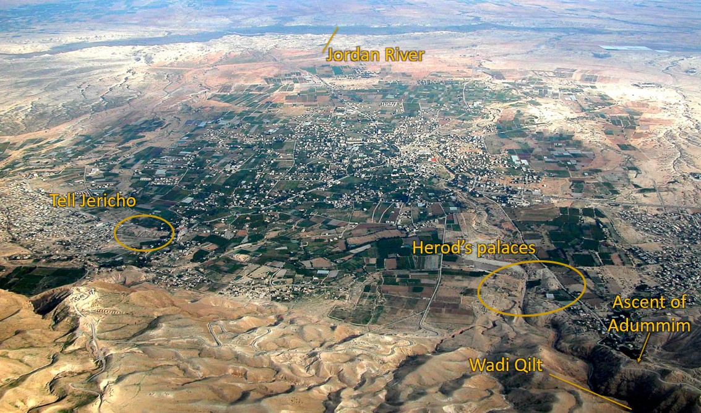

 

Read/hear the portions:

* Matthew 19:16-20:28
* Mark 10:17-45
* Luke 18:18-34

**Summary**

A rich, young ruler asks Jesus what he must do to inherit eternal life. Jesus says to keep the commandments, sell everything, and follow Him. The man went away sad for he had great wealth. Jesus says it is only through God that a rich man can enter the Kingdom. He then tells His disciples that their sacrifices for the Kingdom will be rewarded.  Jesus then tells the parable of the hired workers where the owner pays workers who only worked about an hour the same as those who worked all day, causing the later group to grumble.  Jesus again predicts his demise at Jerusalem and says the disciples will also drink his Cup of suffering.

**Video** 



## Geography

We are continuing the journey up to Jerusalem for the final Passover.  Matthew 20 likely takes place somewhere near Jericho.

As they passed through Jericho, there would have been agricultural fields and one of Herod the Great's palaces.

* In Matthew 19, Jesus tells his talmidim that those who left their fields will receive their rewards.
* In Matthew 20, Jesus tells a parable about a man who owned a vineyard and needed workers.
* Later, he will tell His talmidim that once they get to Jerusalem, He will be turned over to the gentiles and the leaders.

It is not too much of a stretch to envision Jesus telling these stories as he passes near and references these geographic markers.

### The Rich Young Ruler

| Matthew 19 | Mark 10 | Luke 18
| :--  | :--- | :---
| 16  And behold, a man came up to him, saying, “Teacher, what good deed must I do to have eternal life?” | 17  And as he was setting out on his journey, a man ran up and knelt before him and asked him, “Good Teacher, what must I do to inherit eternal life?” | 18  And a ruler asked him, “Good Teacher, what must I do to inherit eternal life?”

Now we meet a man who tends to get the back of the hand from commentators. This treatment may be justified but perhaps not for the typical reasons offered.  Let's see if we can dig deeper. 

First, let's accentuate the positives:

* Note the man RAN to meet Jesus and showed a high degree of respect
* He assumed the resurrection - we take this for granted, but it was not necessarily a decided issue back then (Pharisees vs. Sadducees)
* He likely asked other rabbis but was told he's in the club because he's Jewish.  
  * _Potentially, something about this answer didn't satisfy him. 
* He was a diligent Bible student and attempted to be obedient to the commands 

However, when he asks, "What must I do?", this is our first "tell" that something is off is here.  

We will learn in a couple of verses that the man was well-versed in the Torah, yet, as Lancaster puts it, "The man had concluded that the words of the Bible we're not adequate to assure him of the resurrection." 

## Why do you call me good? 

Matthew 19 | Mark 10 | Luke 18  
| :--  | :--- | :---  
|17  And he said to him, “Why do you ask me about what is good? There is only one who is good. | 18  And Jesus said to him, “Why do you call me good? No one is good except God alone. | 19  And Jesus said to him, “Why do you call me good? No one is good except God alone.  

* What is behind Jesus' initial reaction to being called "good"?
  * Perhaps the man’s assuming Jesus had some special secret is the underlying motive by Jesus’ adverse reaction to calling him "good.“
  * Perhaps Jesus is saying, “Do not assume I have something to add to what God has already said.”
  * In Hebrew, the phrase would be HaTov הַטּוֹב, "the good” or “the good one”.  This  is one of the Hebrew names for God.
    * Observant Jews do not pronounce the Covenant Holy Name of God (the "Tetragramaton" - four letters) out of respect.
      * They typically will say "Adonai" (Lord) if in a religious setting
      * They will say "HaShem" (the Name), or another name like "HaTov" if in a less formal context.
      * There is no recorded instance of Jesus using the Covenantal Name of God, but there are MANY examples where He uses a circumlocution, like He does here with "HaTov"
      * I recommend gentile Christians follow Jesus' lead and use a name other than the Tetragramaton when referencing God the Father.

## Keep the commandments

Matthew 19 | Mark 10 | Luke 18  
| :--  | :--- | :---  
17   If you would enter life, keep the commandments.”  18  He said to him, “Which ones?”  | 19  You know the commandments: |  20  You know the commandments

> “Ye shall therefore keep my statutes, and mine ordinances; which if a man do, he shall live in them: I am Adonai” (Lev 18:5, ASV).

* Jesus enhances and clarifies the Torah, but He does add to or subtract from it. 
* Jesus here gives roughly the same answer Abraham gave in Luke 16.  "They have Moses and the prophets.“ 
* In other words, the Bible is sufficient and contains the words for eternal life.
* In Mark and Luke, Jesus is affirming that the young man already has what he needs to know.

> Rom 3:28 For we hold that one is justified by faith apart from works of the law.

* When Jesus says, “if you would enter life, keep the commandments,” this seems to contradict Paul in Romans 3:28.
* Note that Jesus does not comment on whether this man or any other man can keep the Law to the degree required to attain eternal life.  
* He's merely answering the question he was asked

Remember, the Law is perfect; it is my sin that makes the Law a problem. The law can justify; it is my sin that prevents me from fulfilling the terms.

Of course Jesus was able and willing to fulfill those terms on my behalf. He kept the Law perfectly and extended His righteousness to us.  So the Law DOES have the power for us to inherit eternal life.  

Next Jesus says elsewhere, "if you love Me, keep my commands."  This means the Law is no longer a "got to", but a "get to".  We follow His commands as a thank-you gift back to Him to show him we love Him and are appreciative of what He has done for us.

Despite popular protestant theology, not once does Paul dismiss the value of keeping the Law and commandments as a part of living a righteous life.

He said that one did not have to undergo a specific requirement of the Law, namely circumcision and becoming fully Jewish (as opposed to a gentile God-fearer) to merit salvation. That is not the same as saying the Law is wrong and that people shouldn't TRY to keep it.  

We don't expect our kids to be perfect and follow our rules all the time; but we you enjoy it and appreciate it when they do.  Maybe we even expect it.  They times they break our rules should be a minimum.  

God is no different.

**The Horizontal Commandments**

Matthew 19 | Mark 10 | Luke 18  
| :--  | :--- | :---  
18  And Jesus said, “You shall not murder, You shall not commit adultery, You shall not steal, You shall not bear false witness,  19  Honor your father and mother, and, You shall love your neighbor as yourself.” | 19 ‘Do not murder, Do not commit adultery, Do not steal, Do not bear false witness, Do not defraud, Honor your father and mother.’” | ‘Do not commit adultery, Do not murder, Do not steal, Do not bear false witness, Honor your father and mother.’”  

Here, Jesus neither lists all commandments nor ranks them in importance.  His general point is that the Torah is sufficient.

Matthew includes loving your neighbor while Mark adds, do not defraud.

* Love your neighbor (Lev 19:18) is viewed as a summary of the horizontal commandments (those between individuals, or “humanward” as Keener styles it).  
  * It’s interesting that Jesus only includes commandments from this category.
* Love the Lord your God (Deut 6:5) summarizes the vertical/Godward commandments between the individual and God.  
  * For example. “you shall have no other gods before me” and “honor the Sabbath day” are "vertical" commandments.  
  * Jesus does not list any of these.
* While "do not defraud" is not expressly a commandment, it is not too far-fetched to understand that the Torah never sections fraud.
  * If I love my neighbor as myself, that prohibits any theft (including theft of my neighbor’s good name, i.e., gossip).

## All these I have kept

Matthew 19 | Mark 10 | Luke 18  
| :--  | :--- | :---  
20  The young man said to him, “All these I have kept. What do I still lack?”| 20  And he said to him, “Teacher, all these I have kept from my youth.” |  21  And he said, “All these I have kept from my youth.” 

Craig Keener says that a “young” man could have been between 24 and 40 years old.  

Note the following:

* The young ruler does not state that he kept the commandments with sinless perfection.  
Perhaps this is implied, but maybe it is not.
* Jesus does not condemn the man for being self-righteous, nor does he attempt to correct the young man's thinking that keeping the law could get him eternal life.

Keener also noted that most Jewish people could claim to have kept the specific commandments mentioned.  This might explain Jesus’ non-reaction to his claim. 

## Jesus Loved Him

> Mark 10:21  And Jesus, looking at him, loved him

I think it's interesting that many Christians are quick to condemn the rich young ruler, but here we're told that Jesus loves him.  If we're denigrating something or accusing someone Jesus loves, we might be on the wrong side. 

How many of us would willingly volunteer to sell all our possessions?  I don’t think very many. It’s easy to point fingers when not looking into the mirror.    

On the subject of Jesus loving the young man, another Hebraic New Testament commentator, John Lightfoot, wrote, "This man pleased Jesus, both in his question and answer. He both earnestly inquired concerning attaining eternal life and seriously professed that he addicted himself to God's Commandments with all care and circumspection. 





Only Mark records the statement about Jesus loving him.  This has led some to speculate that the rich young ruler might have been none other than Mark himself. 

Mark 14:51-52 also mentions a young man who was with Jesus at Gethsemane
He was wearing nothing but a linen cloth. When the guards tried to seize him, all they got was the cloth, and he ran away naked. This, also, is only mentioned in Mark’s gospel.  Was this "young man" also Mark?  If both "young men" are actually the same Mark, this indicates that despite initially going away sad, he did eventually become a disciple.

Later, in Acts 15:37-39 Barnabas wants to bring Mark along on a journey but Paul objects.
Evidently Mark bailed out on a prior occasion, so in Paul's mind, he was unreliable.  The Greek implies that Paul and Barnabas nearly came to blows!

Then near the end of Paul's life, writing in 2 Timothy 4:11, Paul asks for Mark because he is "useful to me for ministry."

**We all have our ups and downs spiritually; but we need to be persistent and finish well like Mark.**



## Sell all to have treasure in heaven

| Matthew 19 | Mark 10 | Luke 18
| :--  | :--- | :---  
21  Jesus said to him, “If you would be perfect, go, sell what you possess and give to the poor, and you will have treasure in heaven; and come, follow me.” 22  When the young man heard this he went away sorrowful, for he had great possessions. | 21  And Jesus, looking at him, loved him, and said to him, “You lack one thing: go, sell all that you have and give to the poor, and you will have treasure in heaven; and come, follow me.” 22  Disheartened by the saying, he went away sorrowful, for he had great possessions. | 22  When Jesus heard this, he said to him, “One thing you still lack. Sell all that you have and distribute to the poor, and you will have treasure in heaven; and come, follow me.” 23  But when he heard these things, he became very sad, for he was extremely rich.

Lancaster notes a subtle nuance between the traditional view that the man was trying to earn his way into heaven by good works and what might have been the man's underlying thought process. 

In that culture, an outstanding charitable deed was a testimony of the character of one who performs it. In other words, acts of love and kindness express true repentance. 

We might say that he asked (according to Matthew) or told (according to Mark and Luke) exactly how he could store up treasures in heaven, not to GET "saved", but as a testimony that he already WAS "saved."

Note that the phrase “you will have treasures in heaven, and come follow me” is included in all three accounts.  As we said earlier, we should obey His commandments and store up treasure in heaven BECAUSE we are saved; not to GET saved
 With this in mind, I don’t think Jesus was being disingenuous or sarcastic in the slightest. Jesus gave the man a chance to become his disciple – to drop everything and follow Him.  

Admittedly, it was a severe and radical test Jesus was posing. Did the disciple value his “good” teacher over earthly possessions? Was he able to demonstrate his claim to love his neighbor as himself? 

The man declined. The cost of following Jesus was just too high for him.

Note that the text does not support that Jesus was establishing a mandate for all disciples. Many of his disciples were likely well to do. We looked at Mary, Martha, and Lazarus two lessons ago. From the descriptions, we can conclude that they were well-off 

Interestingly, recall the accusation of Mary that she should have sold her perfume instead of using it to anoint Jesus; in that circumstance, Jesus said she had done a good thing. If the bar for discipleship was to sell everything, we can presume Jesus would have told Mary to sell the expensive perfume.

He did not ask Peter to sell his waterfront property and turn his family out on the street.
Nicodemus, Joseph of Arimathea, and Mary Magdalene were all wealthy, yet they were never asked to sell everything.

But with that said, Jesus identified the thing that had a hold on the young man's life.  What things have a hold on our lives that Jesus would ask us to "sell"?

**Sell all to be perfect?**
> Matthew 19:21  Jesus said to him, “If you would be perfect, go, sell what you possess

A casual reading might leave one with the impression that "the man asked, "What do I need to do to get into heaven?" Jesus replied, "sell everything, and you can get into heaven." 

Jesus saying this would have been antithetical to the gospel message, so (assuming our understanding of the Gospel message is correct), we can reject this conclusion. We can't do anything on our own to merit salvation, including selling all our belongings. 

We've mentioned that Jesus did not ask other disciples to sell everything, so Jesus was not establishing a condition for eternal life when he told the man to sell everything.

Many commentators point out, and I agree that Jesus was highlighting the man's covetousness in this instance. His affluence, or more specifically, his RELIANCE ON and ATTACHMENT TO his wealth, made it impossible to walk after Yeshua in the way of discipleship.

So, after chewing on this, my interpretation is this:

* The young man was asking for a good deed that would reflect his character and repentant heart. 
* Jesus replies, “in your case, such a deed that would demonstrate your repentance would be for you to sell everything and become my disciple.”
* The man concluded he could not part with his wealth and be obedient to Jesus in discipleship.
* This revealed that the man actually did *NOT* keep all the commands because he didn't love his poor neighbors as much as he loved himself.

In other words, Jesus was telling him he had to pick one master to serve, and he made his choice.

So, as you can see, this is a much more complex question than a Jew thinking he can earn his salvation and Jesus sternly correcting his legalistic mindset.  I suspect that Jesus was as sad as the man who went away sad. When someone you love makes a poor decision, it hurts.

Remember our premise: every person Jesus interacts with is in some sense you and me.  

What could be keeping or hindering us from effective discipleship? In what ways is Jesus asking you and me to demonstrate that we only serve him and not the world?

For us, the question may not be, "what percentage (up to 100%) should I give?" But "how much more can I give?“

Keener has an excellent take-away:

> “The kingdom is not meant to be an extra blessing tagged onto a comfortable life; it must be all-consuming, or it is no longer the kingdom. For that reason, it appeals more readily to those with less to lose.” – Craig Keener

## The eye of a needle

| Matthew 19 | Mark 10 | Luke 18 
| :-- | :-- | :-- 
|23  And Jesus said to his disciples, “Truly, I say to you, only with difficulty will a rich person enter the kingdom of heaven. 24  Again I tell you, it is easier for a camel to go through the eye of a needle than for a rich person to enter the kingdom of God.” | 23  And Jesus looked around and said to his disciples, “How difficult it will be for those who have wealth to enter the kingdom of God!” | 24  Jesus, seeing that he had become sad, said, “How difficult it is for those who have wealth to enter the kingdom of God! 25  For it is easier for a camel to go through the eye of a needle than for a rich person to enter the kingdom of God.”  




There's a story that is often told in conjunction with this passage.  One of the gates in Jerusalem's walls had a small door that would let only pedestrians through after the main gate was closed at night.  If one had a packed camel, the only way to get the camel through was to remove all the tack and supplies, have the animal get on its knees, then shove it through the small opening.  Conveniently, so the story goes, this small door had the nickname, "the eye of the needle" and therefore, this is what Jesus was referring to in order to illustrate the extreme difficulty of a camel going through the eye of the needle.

While in many circumstances, we can glean a lot from studying the first century context (in general this is precisely the point of talmidimway.org); however, there is one problem.  
_This story is simply not true_.  There is no historical or archeological evidence for a gate known as the "eye of the needle" in the 1st Century. It's an urban legend.  

Further, it misses the point entirely. The story would have us think that a man, with great effort (like it takes to push a camel through a small space), can enter the kingdom.  He was using an expression, similar to "when pigs fly" in English.  It defies the laws of physics.  It's never going to happen.




Jesus first says it's "difficult" for a wealthy person to enter, but then He says, "well actually, it's impossible."  With man a rich man oras a literal camel going through the literal eye of a literal needle."  Fortunately for us, there there's good news.  Keep reading!

## Who then can be saved?

|Matthew 19 | Mark 10 | Luke 18 
|:-- |:-- |:-- 
| 25  When the disciples heard this, they were greatly astonished, saying, “Who then can be saved?” 26  But Jesus looked at them and said, “With man this is impossible, but with God all things are possible.” | 26  And they were exceedingly astonished, and said to him, “Then who can be saved?” 27  Jesus looked at them and said, “With man it is impossible, but not with God. For all things are possible with God.” | 26  Those who heard it said, “Then who can be saved?” 27  But he said, “What is impossible with man is possible with God.”   

The disciples were somewhat taken aback by this (if you notice, that has been happening a lot lately). In that culture, wealth indicated God's apparent blessing.  Even more than that, the wealthy you gave to charity.  They provided for the synagogues.  They underwrote the temple and many of the sacrifices.  Today, our churches and synagogues couldn't survive without donations from those with financial means.  It costs money to keep the lights on.

So the disciples had to be doubly surprised when Jesus repeated the statement.  I suspect because they were NOT originally asked to sell everything -- as we shall see, they left everything but did not necessarily SELL everything -- they might have felt they were now on shaky ground from a salvation perspective.

I love what they say here.  They don't just ask how a rich person can be saved, they want to know how ANYONE CAN BE SAVED.  It's like they knew Romans 3:23:

> Romans 3:23 For ALL have sinned and fallen short of the Glory of God

Supernatural intervention is required for ANYONE to be saved.  With God, all things are possible.

Men cannot achieve eternal life and entrance to the Kingdom without God's divine intervention" interestingly, the Jewish midrash contains similar teachings, including a reference to the eye of a needle.

> The holy one, blessed be He, said to Israel, "my sons, if you give me an opening of repentance no more significant than the size of the eye of a needle, I will widen it into a gap through which wagons and carriages can pass. "

Again this is not from the Bible, but I view it as a similar expression to having "faith the size of a mustard seed."  God is the one who can move mountains.  God is the one who can save.   Our work, in a sense, is repentance and devotion to Yeshua, our Master, following him in the "Talmidim Way" - the way of discipleship. We give him that, and he takes us the rest of the way.

With that said, those with wealth have unique spiritual obstacles (and if you have a computer with internet access to read this, you're "rich" compared to the rest of the world). Often, it is only with supernatural intervention that the affluent can control their wealth instead of the other way around. 




1 Corinthians 1:26 For consider your calling, brothers: not many of you were wise according to worldly standards, not many were powerful, not many were of noble birth.

Chuck Missler used to tell a story attributed to the Countess of Huntingdon (18th Century):  "Blessed by God, it does not say, '**a**ny mighty,' '**a**ny noble.' It says 'not **M**any mighty, not **M**any noble.'

"I owe my salvation to the letter 'M.'  If it had  been 'not **A**ny noble,' where would I have been?”

According to her, she was saved by that M.  If we have any amount wealth and material goods, we are saved by that "M" too.



## Left everything

| Matthew 19 | Mark 10 | Luke 18 
| :-- | :-- | :-- 
|27  Then Peter said in reply, “See, we have left everything and followed you. What then will we have?” 28  Jesus said to them, “Truly, I say to you, in the new world, when the Son of Man will sit on his glorious throne, you who have followed me will also sit on twelve thrones, judging the twelve tribes of Israel. | 28  Peter began to say to him, “See, we have left everything and followed you.” | 28  And Peter said, “See, we have left our homes and followed you.”   

The apostles left their livelihoods to follow Jesus. Many of them were fishermen by trade. 

Perhaps feeling unsettled, they "remind" Jesus that they left their jobs, most possessions, and families. 

In truth, they may have left everything, but they evidently didn’t actually SELL everything.  After the resurrection, during what was an apparent lull in the action between the resurrection and the ascension, several went back to their fishing gigs at the Sea of Galilee.  This is recorded in John 21.

While all three gospels go on to discuss Jesus' response to Peter saying they left everything, Matthew adds that the disciples will sit over the 12 thrones, judging the 12 tribes.  To be placed over the 12 tribes was a tremendous honor and as mind-blowing as Jesus’ many other teachings.

This promise has its fulfillment in Revelation 21:10-14.

With verses like this, it is surprising to see that so-called “Replacement Theology” still has any proponents.  Replacement theology holds that God has cast out Israel because Israel rejected her Messiah and now deals exclusively with the church.  But not only does it have proponents, but it also remains the dominant belief throughout the Church, both protestant and Catholic.

Conversely, the very fact that God is not done with Israel is the entire reason there are 12 apostles in Matthew 10 and the reason that they were compelled to maintain that number in Acts 1.

## Inherit eternal life

| Matthew 19 | Mark 10 | Luke 18 
| :-- | :-- | :--
|29  And everyone who has left houses or brothers or sisters or father or mother or children or lands, for my name's sake, will receive a hundredfold and will inherit eternal life. 30  But many who are first will be last, and the last first. | 29  Jesus said, “Truly, I say to you, there is no one who has left house or brothers or sisters or mother or father or children or lands, for my sake and for the gospel, 30  who will not receive a hundredfold now in this time, houses and brothers and sisters and mothers and children and lands, with persecutions, and in the age to come eternal life. 31  But many who are first will be last, and the last first.” | 29  And he said to them, “Truly, I say to you, there is no one who has left house or wife or brothers or parents or children, for the sake of the kingdom of God, 30  who will not receive many times more in this time, and in the age to come eternal life.”   

Note that Mark says the scope is not just those who leave everything, but those who leave everything AND endure persecutions.

Becoming Talmidim, disciples of Jesus is that good deed the rich ruler declined.  It reflects a changed heart.

Jesus says his Talmidim have rewards both in this world And the age to come.  We don’t expect rewards in the age to come to be material, so we should not expect rewards in this age always to be material.  Of course, Judas reminds us that promised rewards can later be forfeited.

No sacrifice for the Kingdom goes uncompensated. This promise is good to remember when we offer gifts or go through trials that few, if any, seem to notice

## The parable of the workers

| Matthew 20 
| :--
| 1  “For the kingdom of heaven is like a master of a house who went out early in the morning to hire laborers for his vineyard. 2  After agreeing with the laborers for a denarius a day, he sent them into his vineyard. 3  And going out about the third hour he saw others standing idle in the marketplace, 4  and to them he said, ‘You go into the vineyard too, and whatever is right I will give you.’ 5  So they went. Going out again about the sixth hour and the ninth hour, he did the same. 6  And about the eleventh hour he went out and found others standing. And he said to them, ‘Why do you stand here idle all day?’ 7  They said to him, ‘Because no one has hired us.’ He said to them, ‘You go into the vineyard too.’

This is one of my favorite parables.  The Holy Spirit reminds me of it whenever I have any sense of envy or questioning of those in authority.

In addition to having the familiar “the kingdom is like…” beginning, we would categorize this as one of the “last shall be first” parables dealing with a divine reversal.  

In verse 4, the owner says “whatever is right, I will give you”.  These workers were, naturally, expecting something less than a full day’s wage.

To add to the drama, those still around the marketplace late in the day were often idlers not all that interested in work; and possibly they didn’t work that hard during the last hour of the day.  Even though this is just a parable and not an actual event, it’s reasonable to ask why these “workers” didn’t make their services available earlier in the day when the owner presumably would have hired them.  All of this makes the reversal at the end of the parable that much more “unfair” for those who started early in the day.

I love the Hebrew idiom for selfishness.  It’s called “having a bad eye.”  Conversely, having a good eye means being generous, forgiving, and charitable.  You might recall we talked about this during the lessons on the Sermon on the Mount, when Jesus said, “the eye is the lamp of the body”

Let us all try to have good eyes.

| Matthew 20 
| :--
| 8  And when evening came, the owner of the vineyard said to his foreman, ‘Call the laborers and pay them their wages, beginning with the last, up to the first.’ 9  And when those hired about the eleventh hour came, each of them received a denarius. 10  Now when those hired first came, they thought they would receive more, but each of them also received a denarius. 11  And on receiving it they grumbled at the master of the house, 12  saying, ‘These last worked only one hour, and you have made them equal to us who have borne the burden of the day and the scorching heat.’ 13  But he replied to one of them, ‘Friend, I am doing you no wrong. Did you not agree with me for a denarius? 14  Take what belongs to you and go. I choose to give to this last worker as I give to you. 15  Am I not allowed to do what I choose with what belongs to me? Or do you begrudge my generosity?’ 16  So the last will be first, and the first last.”

Isn’t this human nature?  Instead of minding their own business, some people like to sow irritation, division, and contempt.  If you don’t know what I’m talking about, hang out on Twitter for a while.

We must learn to be content with what we have and not worry about what someone else does with his money or possessions. Ultimately, it's none of our business. The story is reminiscent of the Prodigal Son and the elder brother's jealousy.

Lancaster summarizes the parable as follows:
King
: God

Laborers who worked all day
: The righteous

The laborer who worked only one hour
: A repentant sinner

Wages 
: reward in the Messianic Age to come

**Meaning: In the Kingdom, the last shall be first, and the first shall be last**

In terms of salvation, entrance is at the owner's sole discretion. The Thief on the Cross reminds us that some join late in the day while others join early in the morning
The Master has the prerogative to extend mercy and grace, even to those who don't appear to us to deserve it. Those who came late in the day were just as repentant as those who came early.

Ultimately, salvation is unearned no matter who we are.  We are not in a position to judge whether anyone else merits it.  Like in the parable of the workers, it's not our vineyard.

There’s a saying that’s worth remembering.  

> In Heaven, there are people you'll be surprised to see.  
> In Heaven, there are also people who'll be surprised to see you.




Poetically, this parable is another example of a Chiasm – a literary style where each verse or segment has a “twin” verse/segment that appears in inverted order. A Chiasm  begins with an “A” section, then a B section, then C, D, etc., followed by D’, C,’ B,’ finally ending with A.’

* A Last shall be first/First shall be Last (19:30)
  * B His Vineyard (20:1)
    * C  Agreed for a penny a day (2)
      * D 3rd/6th/9th hour likewise (3-5)
        * E 11th hour he found others (6-7)
          * F Call the laborers from the last to the first (8)
        * E’ Those hired at the 11th hour received a penny (9)
      * D’ likewise received every man a penny (10-12)
    * C’ Did you not agree with me for a penny? (13)
  * B’ My own (15)
* A’ Last shall be first/First shall be Last (16)



Even today, people always GO UP to Jerusalem, even if coming from a higher elevation.  It has a spiritual as well as geographic significance.

## Up to Jerusalem to suffer

Matthew 20 | Mark 10 | Luke 18
| :-- | :-- | :--
| 17  And as Jesus was going up to Jerusalem, he took the twelve disciples aside, and on the way he said to them, 18  “See, we are going up to Jerusalem. And the Son of Man will be delivered over to the chief priests and scribes, and they will condemn him to death 19  and deliver him over to the Gentiles to be mocked and flogged and crucified, and he will be raised on the third day.” | 32  And they were on the road, going up to Jerusalem, and Jesus was walking ahead of them. And they were amazed, and those who followed were afraid. And taking the twelve again, he began to tell them what was to happen to him, 33  saying, “See, we are going up to Jerusalem, and the Son of Man will be delivered over to the chief priests and the scribes, and they will condemn him to death and deliver him over to the Gentiles. 34  And they will mock him and spit on him, and flog him and kill him. And after three days he will rise.” | 31  And taking the twelve, he said to them, “See, we are going up to Jerusalem, and everything that is written about the Son of Man by the prophets will be accomplished. 32  For he will be delivered over to the Gentiles and will be mocked and shamefully treated and spit upon. 33  And after flogging him, they will kill him, and on the third day he will rise.” 34  But they understood none of these things. This saying was hidden from them, and they did not grasp what was said.   

Jesus was at this time going through Jericho, passing first through the population center near the spring (near Tell Jericho) and then traveling on past Herod’s palaces (also known as the “administrative center”) before making His way up the Ascent of Adummim, which leads to Jerusalem.  The lowest point of Jericho is 900 feet below sea level, while Jerusalem is about 2500 above sea level.

This is Jesus’ third prediction of his betrayal and demise.  The first time was the “get behind me Satan” exchange with Peter at Caesarea Philippi, and the second was right after that in Galilee.




Herod the great was notorious for decadence and brutality. Although there is no extra-biblical evidence for the "Slaughter of the Innocents" as recorded in Matthew, the incident is entirely consistent with what we do know about Herod's character.  

Herod once ordered the drownings of the High Priest and several family members in the pool at his palace here in Jericho. On another occasion, Herod wanted to make sure the people of Israel mourned when he died. He ordered the executions of several popular Jewish leaders, because the people would have mourned over their deaths. Fortunately, the surviving guards did not carry out Herod's execution order.

After Herod died, his sons and later the Roman procurators continued this practice of brutally oppressing the Jewish people, culminating in the two great Jewish revolts, the [first in 66 CE](https://en.wikipedia.org/wiki/First_Jewish%E2%80%93Roman_War) and the [second (the "Bar Kochba Revolt") in 132 CE](https://en.wikipedia.org/wiki/Bar_Kokhba_revolt) .

So we have to picture it.  Jesus is talking about suffering at the hands of those in charge as they were likely within sight of Herod’s palace where such suffering of innocent people often took place.




Luke reminds us of the bigger picture.

>. 31 . . . everything that is written about the Son of Man by the prophets will be accomplished.

In other words, the evil Jesus is about to endure is part of a plan that was put in motion before time began and was documented in the prophets.

> 34  But they understood none of these things. This saying was hidden from them, and they did not grasp what was said.

In other words, the disciples were not simply being “dense.”  They were supernaturally prevented from understanding these things. 

### Sit at right and left

| Matthew 20 | Mark 10 
| :-- | :--
| 20  Then the mother of the sons of Zebedee came up to him with her sons, and kneeling before him she asked him for something. 21  And he said to her, “What do you want?” She said to him, “Say that these two sons of mine are to sit, one at your right hand and one at your left, in your kingdom.” | 35  And James and John, the sons of Zebedee, came up to him and said to him, “Teacher, we want you to do for us whatever we ask of you.” 36  And he said to them, “What do you want me to do for you?” 37  And they said to him, “Grant us to sit, one at your right hand and one at your left, in your glory.”   

* This  request might not have been as outlandish as it first seemed. 
  * James and John, along with Peter, were in Jesus' inner circle.  
  * In a sense, they were already getting preferential treatment.
* Despite Jesus' ominous warnings, the prevailing attitude was that Jesus was about to usher in the Messianic Kingdom.  
* Salome may have been innocently requesting the seating arrangement at the messianic banquet.
* If it was James and John directly, as Mark says, this is somewhat more puzzling
  * Jesus repeatedly told parables and gave instructions about how the first shall be last
  * James and John, being part of Jesus inner circle should have known this better than anyone
  * Luke did mention that these things were "hidden" from the disciples, so perhaps that's the excuse

## Drink My Cup

| Matthew 20 | Mark 10 
| :-- | :--
| 22  Jesus answered, “You do not know what you are asking. Are you able to drink the cup that I am to drink?” They said to him, “We are able.” 23  He said to them, “You will drink my cup, but to sit at my right hand and at my left is not mine to grant, but it is for those for whom it has been prepared by my Father.” | 38  Jesus said to them, “You do not know what you are asking. Are you able to drink the cup that I drink, or to be baptized with the baptism with which I am baptized?” 39  And they said to him, “We are able.” And Jesus said to them, “The cup that I drink you will drink, and with the baptism with which I am baptized, you will be baptized, 40  but to sit at my right hand or at my left is not mine to grant, but it is for those for whom it has been prepared.”  

Because no one anticipated Jesus' suffering (remember the Spirit prevented their understanding), Jesus informs her that she has no idea what she is asking. The adage is true - we have two ears and one mouth.  Use them in proportion!

Jesus issues a prophecy of sorts. James and John would indeed drink Jesus' Cup of Suffering.
James was the first of the disciples to be martyred. John was the last of the disciples to die. Although, strictly speaking, he wasn't martyred, he was imprisoned and exiled on Patmos. According to tradition, John survived a poisoning attempt; he was also dipped into a hot oil vat.

## The ten disciples grumble

| Matthew 20 | Mark 10
| :-- | :-- 
| 24  And when the ten heard it, they were indignant at the two brothers. 25  But Jesus called them to him and said, “You know that the rulers of the Gentiles lord it over them, and their great ones exercise authority over them. 26  It shall not be so among you. But whoever would be great among you must be your servant, 27  and whoever would be first among you must be your slave, 28  even as the Son of Man came not to be served but to serve, and to give his life as a ransom for many.” | 41  And when the ten heard it, they began to be indignant at James and John. 42  And Jesus called them to him and said to them, “You know that those who are considered rulers of the Gentiles lord it over them, and their great ones exercise authority over them. 43  But it shall not be so among you. But whoever would be great among you must be your servant, 44  and whoever would be first among you must be slave of all. 45  For even the Son of Man came not to be served but to serve, and to give his life as a ransom for many.”   

Word of Salome's request reached the other disciples, who were none too pleased with her request for preferential treatment.

After just hearing a parable on how jealousy is inappropriate, this reaction is ironic.  As I like to say, we are no different.  Hearing Jesus’ words is a lot easier than living them out.

Never underestimate Satan's power, or just our pride, to sow division.

* Sometimes the catalyst will be the arrogant or misinformed statement of someone else.
* Sometimes, the catalyst will be misinterpreting something someone else said when no offense was intended.

In either Jesus redirects the conversation.

> The Son of Man came . . . to give His life as a ransom for many

Jesus challenged His disciples about the dangers of seeking earthly authority.  As our saying goes, "power corrupts; absolute power corrupts absolutely.“

Jesus would not have his disciples jockeying for power where they could abuse others; this is a warning the Church has not heeded for most of the past 2000 years.

Talmidim of Jesus are to serve, not to be served.

If necessary, we are to lay down our lives just as Jesus did.  If our master, who deserves to be a king was asked to lay down His life, how much more should we, who are not worthy of adoration be willing to do so.

As Chuck Missler used to say, in Jesus’ organization chart, the CEO is at the bottom.  The last shall be first.

When we say “Talmidim Way,” that’s what we mean.  The way of being a disciple is to put ourselves last and others first.

## Study Questions

* What is your “take-away” from the story of the rich young ruler?  Meaning what would Jesus have you "take-away" from your life?
* Do you give your affluence over to God?  All of it?
* In what ways do you thank God for making all things possible?
* In what ways do you need to have better “eyes”?
* In the parable, Jesus told the group hired at mid-day, “Whatever is right, I will give you.”  How can you apply this to your life?

**References**

* Biblical Chiasm Exchange. https://www.chiasmusxchange.com/2015/01/20/matthew-1930-2016/ Accessed 1/10/22.
* Bolen, Todd. “Mark 10.” PowerPoint handout, Santa Clarita, CA, 2018. bibleplaces.org
* ---. “Matthew 19.”  PowerPoint handout.  Santa Clarita, CA. 2018. bibleplaces.org
* --- . “Matthew 20.” PowerPoint handout, Santa Clarita, CA, 2018. bibleplaces.org
* Keener, Craig S. The IVP Bible Background Commentary: New Testament. 2nd edition. Downers Grove, Illinois: IVP Academic, 2014.
* Lancaster, Daniel T. “Between Samaria and Galilee.” In Chronicles of the Messiah, edited by Boaz D. Michael and Stephen D. Lancaster. Second edition. Marshfield, MO: First Fruits of Zion, 2014.
* Robertson, A. T. A Harmony of the Gospels. E-Sword edition. New York: Harper & Row, 1950.
* Schlegel, William. The Land and the Bible: A Historical Geographical Companion to the Satellite Bible Atlas. https://www.bibleplaces.com/wp-content/uploads/2015/08/The-Land-and-the-Bible.pdf.  2015.
* ---. Satellite Bible Atlas. https://www.bibleplaces.com/satellite-bible-atlas-schlegel/  2016.
* Stern, David H. Jewish New Testament Commentary: A Companion Volume to the Jewish New Testament. Reprint edition. Clarksville, Md.: Lederer Messianic Publications, 1992.
* Taylor, Justin, "Saved by the letter 'M'." The Gospel Coalition. 2011. Accessed 1/12/2022. https://www.thegospelcoalition.org/blogs/justin-taylor/saved-by-the-letter-m/

*Map images courtesy of the Satellite Bible Atlas.  Photos courtesy of Pictorial Library of Bible Lands/Photo Companion to the Bible. bibleplaces.org.*

