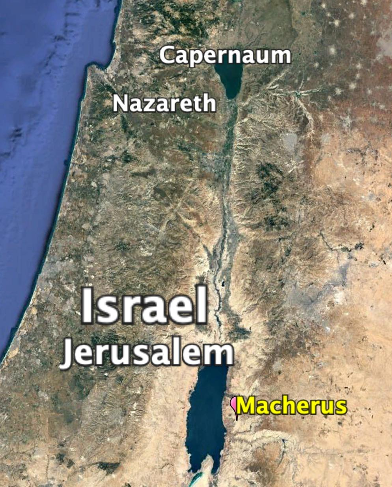
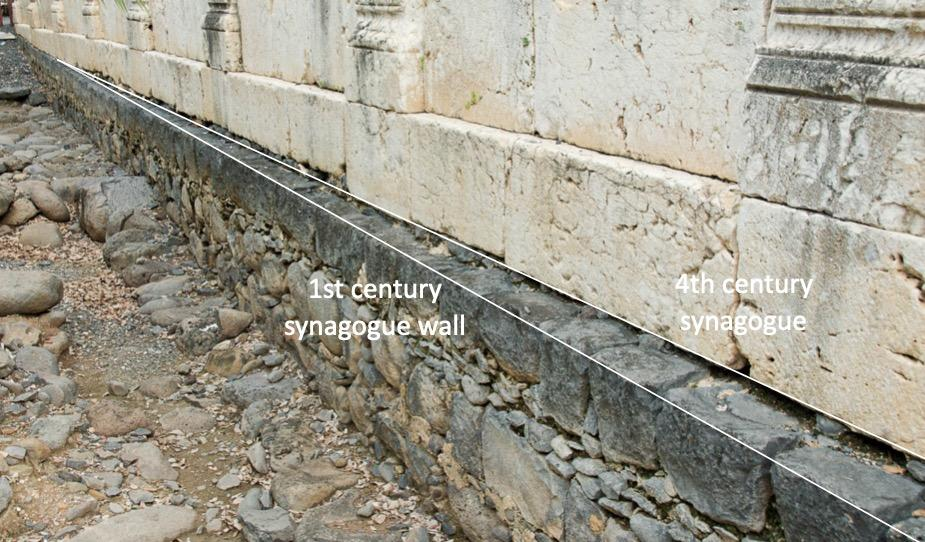
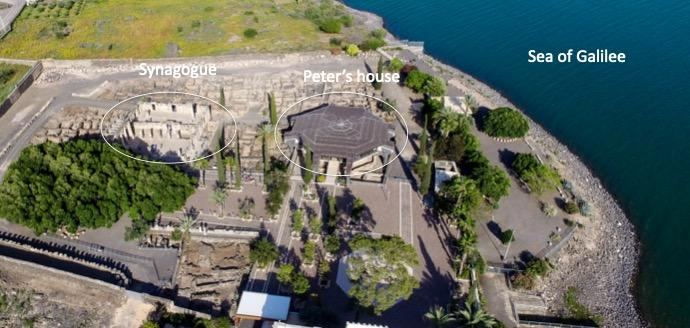
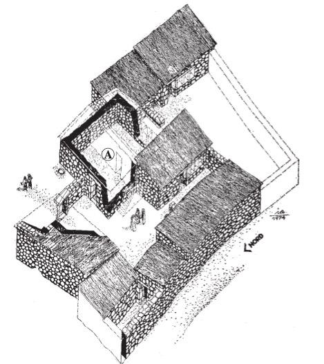
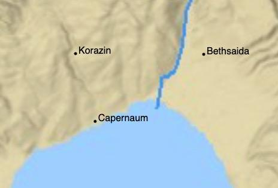
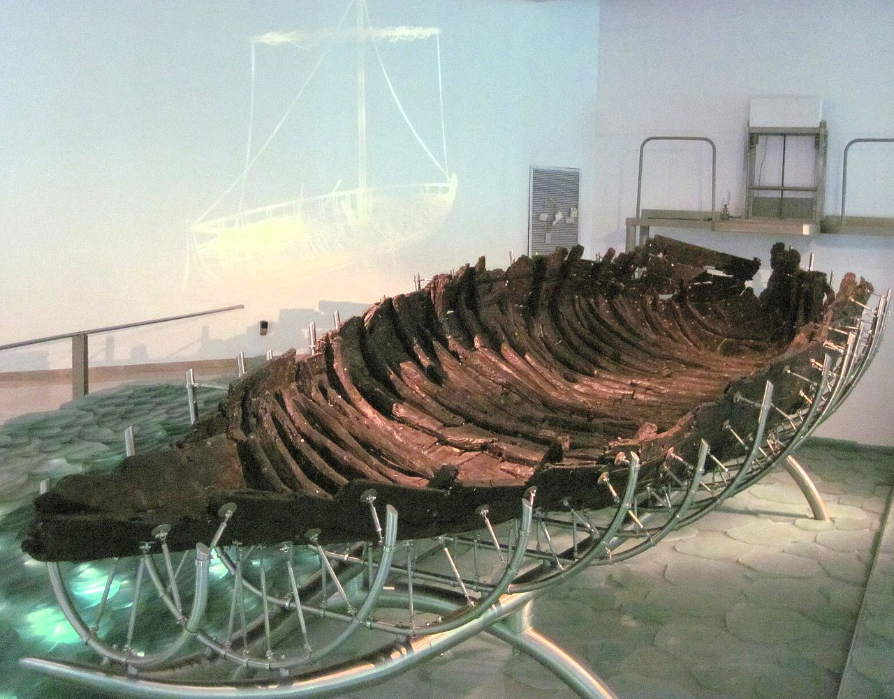



> After a confrontation with the religious leaders in Judea, Yeshua seeks a place where He can conduct His ministry in the safety of relative obscurity. We follow Him back to the Galilee, but not back to Nazareth. Instead, He goes to the north shore of Lake Galilee for a visit to CAPERNAUM, the town of Simon Peter. We visit the village synagogue and Simon Peter’s house. Local tradition identifies a cave overlooking the lake near Capernaum and Tabgha as the “secluded place” where Yeshua used to pray. He says that He must leave Capernaum to take the good news of the kingdom to other villages. He invites the fishermen to join Him on the journey, but He does most of His miracles and teaching along the north shore of the lake within ten miles of Capernaum.

### Video





For additional background videos and faith lessons from Capernaum, see [inSITES from Capernaum](https://talmidimway.org/sites/galilee-north/capernaum/).



## Introduction

- Move to Capernaum Luke 4:31-32 (Matthew 4:12-17)

- Healing of a demon-possessed man Luke 4:33-37

- Healing Simon’s mother-in-law Luke 4:38-41

- The first miraculous catch of fish Luke 5:1-9

- Calling of Peter Luke 5:10-11

### Capernaum

| Mat 4:12-16                                                                                                                                                                                                                                                                                                                                                                                                                                                                                                                                                                                                                        |
|------------------------------------------------------------------------------------------------------------------------------------------------------------------------------------------------------------------------------------------------------------------------------------------------------------------------------------------------------------------------------------------------------------------------------------------------------------------------------------------------------------------------------------------------------------------------------------------------------------------------------------|
| Now when Jesus heard that John had been taken into custody, He withdrew into Galilee; and leaving Nazareth, He came and settled in Capernaum, which is by the sea, in the region of Zebulun and Naphtali. This happened so that what was spoken through Isaiah the prophet would be fulfilled: “THE LAND OF ZEBULUN AND THE LAND OF NAPHTALI, BY THE WAY OF THE SEA, ON THE OTHER SIDE OF THE JORDAN, GALILEE OF THE GENTILES— THE PEOPLE WHO WERE SITTING IN DARKNESS SAW A GREAT LIGHT, AND THOSE WHO WERE SITTING IN THE LAND AND SHADOW OF DEATH, UPON THEM A LIGHT DAWNED |

### John arrested

- Herod Antipas had enough of the spectacle that was John the Baptizer and had him arrested.

- His prison, as attested by Josephus, was in Macherus in Modern-day Jordan.

- Josephus records that “Antipas feared that John’s great influence over the people might enable him and inspire him to raise a rebellion, for the crowds seemed ready to do anything he would tell them.”[^1]

- Antipas had charge over Galilee and Perea. The fortress of Macherus was built by Herod the Great and inherited by his son Antipas, who ruled over Galilee and Perea.

### Jesus’ move from Nazareth to Capernaum

- Matthew 4:14 contains the 5th of 10 “to fulfill what was spoken passages,” quoting Isaian 9:1-3.

  - The “The Old Testament prophet Isaiah said that the Galilee districts, for which there seemed to be no hope, would see a great light.

  - “Galilee of the Gentiles” is used negatively by both Matthew and Isaiah. After the northern kingdom fell, the region was overrun by heathens.

  - But, by the first century, Nazareth (Zebulun) and Capernaum (Naphtali) were firmly Jewish villages. This could be viewed as the light begins to return.

  - If we keep reading Isaiah 9, we get to “for unto us a child is born,” in other words, Jesus is the Great Light, and specifically, Matthew says here that the great light is Jesus' ministry in Galilee.
  
#### Geography
  
  - The video below shows the journey from Nazareth to Capernaum on Google Earth.



- The journey is about 45 miles and would have taken at least two days.

  - Luke is very precise when he writes, “and He went DOWN to capernaum” (Luke 4:30)

  - The journey is all downhill.

  - Nazareth is 1100 feet ABOVE sea level, and the Sea of Galilee is 700 feet BELOW sea level.

- The Sea of Galilee, also called Lake Kinneret, is in a bowl surrounded by hills. 
    - Jesus more than likely would have taken this path below Mt. Arbel to the right, called the “Valley of the doves.” 
    - For perspective, Mt. Arbel is 600 feet above sea level but towers 1300 feet above the lake.  
    - Check out this drone video of the path Jesus would have taken: 



- Jesus' move from Nazareth to Capernaum is the first of many famous events of Jesus' Great Public Galilean Ministry. About 75% of Jesus’ miracles will take place around and on the Sea of Galilee.

- We’ll be parked on this map for a while, giving or taking a few events in other regions. This time and place are definitely the meat of His public ministry that spanned multiple years.

- After His great Galilean ministry, Jesus will have a relatively short ministry in Judea, perhaps about six months, as he makes His way up to Jerusalem for that momentous final week.

- See the [Talmidim Way inSITES page on Capernaum](https://talmidimway.org/sites/galilee-north/capernaum/) for additional background and lessons.

## Luke 4:31-32 - Down to Capernaum

| Matthew 4:13,17                                                                                                                                                                                                       | Mark 1:21-22                                                                                                                                                                                                             | **Luke 4:31-32**                                                                                                                                                                      |
|-----------------------------------------------------------------------------------------------------------------------------------------------------------------------------------------------------------------------|--------------------------------------------------------------------------------------------------------------------------------------------------------------------------------------------------------------------------|---------------------------------------------------------------------------------------------------------------------------------------------------------------------------------------|
| "and leaving Nazareth, He came and settled in Capernaum, which is by the sea, in the region of Zebulun and Naphtali…From that time, Jesus began to preach and say, “Repent, for the kingdom of heaven has come near.” | They went into Capernaum, and immediately on the Sabbath, Jesus entered the synagogue and began to teach. And they were amazed at His teaching; for He was teaching them as one having authority and not as the scribes. | **And He came down to Capernaum, a city of Galilee; and He was teaching them on the Sabbath; and they were amazed at His teaching because His message was delivered with authority.** |

- With John in jail, Jesus continues his message, “Repent!”

- While we later find out the Kingdom will not yet reach its fulfillment, “the arrival of the Messiah had set the kingdom in motion.”[^2]

- After the events in Nazareth, Capernaum is Jesus’ new home congregation.

  - While He was willing to teach anywhere, His was always in the synagogue on Shabbat (unless He was in Jerusalem for a feast day)

  - As we noted last time, out of a couple hundred or so Sabbath days, there were relatively few times Jesus was accused of “breaking the Sabbath.” Most Saturdays came and went without controversy.

- While John’s gospel is going to be most interested in establishing Jesus’ authority, the other Gospel writers are as well.

  - Even at this early stage, there was something different about His teaching.

  - Typically, to give their messages credibility, the rabbis would say, “according to rabbi so-and-so.” This is in the same way as I say, “according to Lancaster, Keener, or McGee, “ and in the same way, students writing papers need to source their work.

  - Jesus didn’t have to provide citations because He WAS the citation. Somehow the people realized this, even if they didn’t fully comprehend the ramifications.

## Luke 4:33-37 - Demon exorcised

| Mark 1:21-28                                                                                                                                                                                                                                                                                                                                                                                                                                                                                                                                                                                                                                                                   | **Luke 4:33-37**                                                                                                                                                                                                                                                                                                                                                                                                                                                                                                                                                                                                                                                                                                                  |
|--------------------------------------------------------------------------------------------------------------------------------------------------------------------------------------------------------------------------------------------------------------------------------------------------------------------------------------------------------------------------------------------------------------------------------------------------------------------------------------------------------------------------------------------------------------------------------------------------------------------------------------------------------------------------------|-----------------------------------------------------------------------------------------------------------------------------------------------------------------------------------------------------------------------------------------------------------------------------------------------------------------------------------------------------------------------------------------------------------------------------------------------------------------------------------------------------------------------------------------------------------------------------------------------------------------------------------------------------------------------------------------------------------------------------------|
| Just then, there was a man in their synagogue with an unclean spirit; and he cried out, saying, “What business do You have with us, Jesus of Nazareth? Have You come to destroy us? I know who You are: the Holy One of God!” And Jesus rebuked him, saying, “Be quiet, and come out of him!” After throwing him into convulsions and crying out in a loud voice, the unclean spirit came out of him. And they were all amazed, so they debated among themselves, saying, “What is this? A new teaching with authority! He commands even the unclean spirits, and they obey Him.” Immediately the news about Him spread everywhere into all the surrounding region of Galilee. | **In the synagogue there was a man possessed by the spirit of an unclean demon, and he cried out with a loud voice, “Leave us alone! What business do You have with us, Jesus of Nazareth? Have You come to destroy us? I know who You are—the Holy One of God!” But Jesus rebuked him, saying, “Be quiet and come out of him!”And when the demon had thrown him down in the midst of the people,it came out of him without doing him any harm. And amazement came upon them all, and they began talking with one another, saying, “What is this message? For with authority and power He commands the unclean spirits, and they come out!” And the news about Him was spreading into every locality of the surrounding region.** |

- Todd Bolen writes, “The Capernaum synagogue is the most impressive of all the Galilean synagogues. It is also one of the largest. The synagogue in Gamla is 67 percent the size of this one; the synagogue at Masada is 47 percent and the synagogue at the Herodium is 46 percent.”[^3]

- In the Capernaum background video, we talk about how the visible 4th or 4th century limestone synagogue is built on top of an earlier basalt synagogue, which is the building where Jesus would have preached.

- He’s just been driven out of Nazareth yet the demons refer to Jesus as Jesus of Nazareth.

- As we have been talking about the past few lessons, Jesus is now doing very public teachings and miracles. As expected, His fame is spreading.

- It is puzzling that a demon-possessed man would be found in a synagogue.

  - Though it was not unheard of in Jewish circles, demon possession tended to be more of a gentile problem.

  - The demons realized something about Jesus was changing and it was bad news for them.

  - “Jesus of Nazareth” is Jesus’ humanity and “the Holy One of God” is His deity.

- The exorcism further underscored Jesus’ authority the people acknowledged in Luke 4:32.

## Luke 4:38-41 - Simon’s Mother in Law

| Mat 8:14-17                                                                                                                                                                                                                                                                                                                                                                                                                                                                       | Mar 1:29-34                                                                                                                                                                                                                                                                                                                                                                                                                                                                                                                                                                                                                                                              | **Luk 4:38-41**                                                                                                                                                                                                                                                                                                                                                                                                                                                                                                                                                                                                                             |
|-----------------------------------------------------------------------------------------------------------------------------------------------------------------------------------------------------------------------------------------------------------------------------------------------------------------------------------------------------------------------------------------------------------------------------------------------------------------------------------|--------------------------------------------------------------------------------------------------------------------------------------------------------------------------------------------------------------------------------------------------------------------------------------------------------------------------------------------------------------------------------------------------------------------------------------------------------------------------------------------------------------------------------------------------------------------------------------------------------------------------------------------------------------------------|---------------------------------------------------------------------------------------------------------------------------------------------------------------------------------------------------------------------------------------------------------------------------------------------------------------------------------------------------------------------------------------------------------------------------------------------------------------------------------------------------------------------------------------------------------------------------------------------------------------------------------------------|
| When Jesus came into Peter’s home, He saw his mother-in-law lying sick in bed with a fever. And He touched her hand, and the fever left her, and she got up and waited on Him. Now when evening came, they brought to Him many who were demon-possessed; and He cast out the spirits with a word and healed all who were ill. This happened so that what was spoken through Isaiah the prophet would be fulfilled: “HE HIMSELF TOOK OUR ILLNESSES AND CARRIED AWAY OUR DISEASES.” | And immediately after they left the synagogue, they entered the house of Simon and Andrew with James and John. Now Simon’s mother-in-law was lying sick with a fever, and they immediately \*spoke to Jesus about her. And He came to her and raised her up, taking her by the hand, and the fever left her, and she served them. Now when evening came, after the sun had set, they began bringing to Him all who were ill and those who were demon-possessed. And the whole city had gathered at the door. And He healed many who were ill with various diseases, and cast out many demons; and He would not permit the demons to speak, because they knew who He was. | **Then He got up and left the synagogue, and entered Simon’s home. Now Simon’s mother-in-law was suffering from a high fever, and they asked Him to help her. And standing over her, He rebuked the fever, and it left her; and she immediately got up and served them. Now while the sun was setting, all those who had any who were sick with various diseases brought them to Him; and He was laying His hands on each one of them and healing them. Demons also were coming out of many, shouting, “You are the Son of God!” And yet He was rebuking them and would not allow them to speak because they knew that He was the Christ.** |

- As we can see in the top photo[^4], Peter’s home was only a few yards south of the great synagogue. I

- Below the photo is an artist's sketch of what the house initially looked like - this is a typical Galilean “insula” house where most likely multiple generations lived in rooms built adjacent to courtyards.

  - The room labeled “A” appears to have had a wall removed, possibly to accommodate meetings with the disciples.

  - After Jesus’ ascension, the home appears to have been a center for early ministry activity in the region.

- In the 4th century, the Byzantine Christians built a church over the site in their traditional octagonal style. Today there is a modern, spaceship-like structure over the site that is a Franciscan Church. It has a glass bottom enabling one to see down into the excavations.

- “As the sun was setting” means Shabbat was ending - “The people waited until evening to carry their sick to Him and thus avoid desecrating the Sabbath.”[^5]

- Jesus does not want or permit the testimony of demons.

- Matthew adds \#6 of the fulfillment quotations, this time referencing Isaiah 53:4:

  - Isa 53:4 However, it was our sicknesses that He Himself bore, And our pains that He carried; Yet we ourselves assumed that He had been afflicted, Struck down by God, and humiliated.

  - We often interpret this verse that Jesus takes ON our infirmities, but Matthew points out that He also takes AWAY infirmities.

## Luke 4:42-44 - Retreat to a secluded place

| Matthew 4:23-25                                                                                                                                                                                                                                                                                                                                                                                                                                                                                                                                                      | Mark 1:35-39                                                                                                                                                                                                                                                                                                                                                                                                                                                                                                              | Luke 4:42-44                                                                                                                                                                                                                                                                                                                                                              |
|----------------------------------------------------------------------------------------------------------------------------------------------------------------------------------------------------------------------------------------------------------------------------------------------------------------------------------------------------------------------------------------------------------------------------------------------------------------------------------------------------------------------------------------------------------------------|---------------------------------------------------------------------------------------------------------------------------------------------------------------------------------------------------------------------------------------------------------------------------------------------------------------------------------------------------------------------------------------------------------------------------------------------------------------------------------------------------------------------------|---------------------------------------------------------------------------------------------------------------------------------------------------------------------------------------------------------------------------------------------------------------------------------------------------------------------------------------------------------------------------|
| Jesus was going about in all of Galilee, teaching in their synagogues and proclaiming the gospel of the kingdom, and healing every disease and every sickness among the people. And the news about Him spread throughout Syria; and they brought to Him all who were ill, those suffering with various diseases and severe pain, demon-possessed, people with epilepsy, and people who were paralyzed; and He healed them. Large crowds followed Him from Galilee and the Decapolis, and Jerusalem, and Judea, and from beyond the Jordan. | And in the early morning, while it was still dark, Jesus got up, left the house, and went away to a secluded place, and prayed there for a time. Simon and his companions eagerly searched for Him; and they found Him and \*said to Him, “Everyone is looking for You.” He \*said to them, “Let’s go somewhere else to the towns nearby, so that I may also preach there; for this is why I came.” And He went into their synagogues preaching throughout Galilee, and casting out the demons. | Now when the day came, Jesus left and went to a secluded place, and the crowds were searching for Him, and they came to Him and tried to keep Him from leaving them. But He said to them, “I must also preach the kingdom of God to the other cities, because I was sent for this purpose.” So He kept on preaching in the synagogues of Judea. |

- Jesus frequently retreated to spend quiet time with the father.

- I saw a talk on fasting recently and the speaker stress the importance of fasting not just from food but from stimulations of all kinds, including our electronic devices.

  - We should follow Jesus’ model and have times of full retreat.

  - Interestingly, this is exactly what Shabbat is meant to be - it’s supposed to be about unplugging literally and figuratively and spending time with God and family.

- As Talmidim, we are studying Jesus to become more like Him. He’s teaching us that quiet time is important.

- Mark’s comment, “everyone is looking for you,” is still true today.

- Why was Jesus sent?

  - We commonly teach that Jesus came to die for the sins of the world.

  - While this is not incorrect, we should take note of the reason Jesus himself provides.

  - He was sent to preach, specifically preach the kingdom of God.

- The three gospels paint a picture of an itinerant preacher.

  - This news was possibly a disappointment to the disciples, who may have wanted to stay in Capernaum and tend to their jobs and families.

  - In other words, keeping one foot in our former lives is inconsistent with total devotion to following Him.

  - This is counterbalanced by the fact that “He did most of His teaching and miracles within a 10-mile radius of Capernaum.”[^6]

    - Capernaum-Korazin-Bethsaida form a triangle that is at the heart of Jesus’ Galilean ministry

    - Korazin is about two miles (as the bird flies) from Capernaum.

    - A recent archeological dig suggests Bethsaida is closer to the shore than the present presumed location shown on the map.

> 

## The First Miraculous Catch of Fish and Calling of the Disciples at Tabgha

Tradition holds that Luke 5:1-11, Matthew 4:18-22, and John 21 all take place at Tabgha.



For additional background videos and faith lessons from Tabgha, see [inSITES from Capernaum](https://talmidimway.org/sites/galilee-north/tabgha/).



## Luke 5:1-9 - The first great catch of fish

| Luke 5:1-9                                                                                                                                                                                                                                                                                                                                                                                                                                                                                                                                                                                                                                                                                                                                                                                                                                                                                                                                                                                                                                                                                     |
|------------------------------------------------------------------------------------------------------------------------------------------------------------------------------------------------------------------------------------------------------------------------------------------------------------------------------------------------------------------------------------------------------------------------------------------------------------------------------------------------------------------------------------------------------------------------------------------------------------------------------------------------------------------------------------------------------------------------------------------------------------------------------------------------------------------------------------------------------------------------------------------------------------------------------------------------------------------------------------------------------------------------------------------------------------------------------------------------|
| Now it happened that while the crowd was pressing around Him and listening to the word of God, He was standing by the lake of Gennesaret; and He saw two boats lying at the edge of the lake; but the fishermen had gotten out of them and were washing their nets. And He got into one of the boats, which was Simon’s, and asked him to put out a little distance from the land. And He sat down and continued teaching the crowds from the boat. Now when He had finished speaking, He said to Simon, “Put out into the deep water and let down your nets for a catch.” Simon responded and said, “Master, we worked hard all night and caught nothing, but I will do as You say and let down the nets.” And when they had done this, they caught a great quantity of fish, and their nets began to tear; so they signaled to their partners in the other boat to come and help them. And they came and filled both of the boats, to the point that they were sinking. But when Simon Peter saw this, he fell down at Jesus’ knees, saying, “Go away from me, Lord, for I am a sinful man!” |

- The first-century fishing boat discovered during a drought in 1986 is 27’ long by 7’ wide.

- Just as He did with the Samaritan woman and her water pot, Jesus places Himself where he needs something someone else has.

  - We need to make a genuine connection with people before we offer them a solution. As Bailey says, “Jesus reaches out to Peter by authentically asking for help, not by offering it.”[^7]

  - Jesus legitimately needed Peter’s rowing skills to keep the boat relatively stationary against the current.

- On the command to “let down the nets,” we can hear the frustration from Peter who is likely tired and frustrated from being out all night.

  - We’re the experts. You should stick to Torah teaching. We fish at night for a reason. What you’re suggesting is illogical but I’ll humor you.

- Peter had seen Jesus perform miracles before, but something about this one was personal for him. “For the first time, the reality of the Master’s holiness and power became clear.”[^8]

- As almost every human does in the Bible when confronted with the pure holiness of God, all man can do is lament how unclean we are.

- It’s interesting Luke notes they “signaled” to their partners. Like any good fisherman, Peter wanted to keep his new special spot on the down low so he didn’t call out to his friends vocally.

## Luke 5:10-11 - Calling of the Disciples

| Matthew 4:18-22                                                                                                                                                                                                                                                                                                                                                                                                                                                                                                                                               | Mark 1:16-20                                                                                                                                                                                                                                                                                                                                                                                                                                                                                                                                    | Luke 5:10-11                                                                                                                                                                                                                                             |
|---------------------------------------------------------------------------------------------------------------------------------------------------------------------------------------------------------------------------------------------------------------------------------------------------------------------------------------------------------------------------------------------------------------------------------------------------------------------------------------------------------------------------------------------------------------|-------------------------------------------------------------------------------------------------------------------------------------------------------------------------------------------------------------------------------------------------------------------------------------------------------------------------------------------------------------------------------------------------------------------------------------------------------------------------------------------------------------------------------------------------|----------------------------------------------------------------------------------------------------------------------------------------------------------------------------------------------------------------------------------------------------------|
| Now as Jesus was walking by the Sea of Galilee, He saw two brothers, Simon, who was called Peter, and his brother Andrew, casting a net into the sea; for they were fishermen. And He \*said to them, “Follow Me, and I will make you fishers of people.” Immediately they left their nets and followed Him. Going on from there He saw two other brothers, James the son of Zebedee, and his brother John, in the boat with their father Zebedee, mending their nets; and He called them. Immediately they left the boat and their father, and followed Him. | As He was going along the Sea of Galilee, He saw Simon and Andrew, the brother of Simon, casting a net in the sea; for they were fishermen. And Jesus said to them, “Follow Me, and I will have you become fishers of people.” Immediately they left their nets and followed Him. And going on a little farther, He saw James the son of Zebedee, and his brother John, who were also in the boat mending the nets. Immediately He called them; and they left their father Zebedee in the boat with the hired men, and went away to follow Him. | and likewise also were James and John, sons of Zebedee, who were partners with Simon. And Jesus said to Simon, “Do not fear; from now on you will be catching people.” When they had brought their boats to land, they left everything and followed Him. |

- The catch would have set the market and for the moment, would have alleviated any misgivings the would-be disciples had about following Jesus full-time.

- Bailey notes, “A pattern evolves. Jesus started with Peter and his material world (catching fish) and moved him to another “Fishing world” where he will catch people.”[^9]

  - When Jesus engages people, He frequently does this.

  - In John 4, note how the initial discussion about physical water – Jesus was thirsty and wanted a drink – turned into a spiritual discussion about quenching the woman’s spiritual thirst.

  - He took Nicodemus from speaking in terms of physical birth to a spiritual rebirth.

- What is the chronology of the call of the disciples?

  - When we read Mark in isolation, we get the impression that Peter and the others made an emotional decision and followed a total stranger, leaving Zebedee stranded.

  - When we add John’s narrative, we see that Peter, James, John, and Andrew already knew Jesus; John and Andrew were disciples of John the Baptist, whom John redirected to Jesus.

  - In other words, the disciples each made informed decisions.

  - They accompanied Jesus from Judea through Samaria to Galilee.

    - Jesus seems to have gone home to Nazareth while Peter and company went back to work in Capernaum.

  - A period of getting to know one another is consistent with what we know about first-century Jewish discipleship practices.

  - Typically the best of the best students would ask to follow a prominent Rabbi. Of course, Jesus reverses this in a couple of ways. Jesus called them and He didn’t necessarily pick the best and brightest, instead opting for people He could use to change the world.

  - In any case, it would have been an extreme honor to be selected to be a disciple.

    - As the Chosen portrays it, Zebedee was likely ecstatic that His boys were chosen as opposed to upset that he was abandoned.

  - The disciples were likely in their mid-to-late teens or early 20s at the latest.

- Author Kenneth Bailey sees Jesus as following a pattern of starting with the physical and moving his subject into the spiritual in a chiastic structure

  - The boat goes out (Jesus teaches) - v. 3

    - Jesus speaks to peter (catch fish!) v. 4

      - Peter speaks to Jesus (in arrogance) v. 5

        - A dramatic catch (a nature miracle) v. 6-7

      - Peter speaks to Jesus (in repentance) v. 8

    - Jesus speaks to Peter (catch people) v. 10

  - The boat returns (they follow Jesus) v. 11[^10]

### Talmidim Way: Walking in His Dust

### Talmidim keep our values, priorities, and sense of self-importance in balance

We should take note of Peter’s reaction. Of course, there is what he said about being a sinful man. As Paul says in Romans 12:16 Be of the SAME MIND toward one another; do not be haughty in mind, but associate with the lowly. Do not be WISE in your own estimation.” Bailey writes, “Faced with authentic holiness, Peter senses that he is unclean.”[^11] Jesus has the power to make the unclean clean again and He does the same with us.

But also notice Peter’s values and priorities. He had just won the fishing lottery, yet at that moment, the big haul resulting in the big payday wasn’t a priority. “Catching and killing fish will be transformed into catching people and bringing them to new life.”[^12]

To me, this is the sense of being in the world but not of it. Chuck Missler used to say “we get our kingdoms confused.” Our citizenship, our kingdom, is in heaven not of this world. Peter is relatable to us as disciples precisely because he struggles to operate in these two realms from time to time. But here, he gets it right.

## 

### References

Bailey, Kenneth E. Jesus Through Middle Eastern Eyes: Cultural Studies in the Gospels. Kindle. Downers Grove, Ill: IVP Academic, 2008.

Bolen, Todd. “Luke 4.” PowerPoint handout, Santa Clarita, CA, 2018.

———. “Matthew 4.” PowerPoint handout, Santa Clarita, CA, 2018.

Lancaster, D. Thomas. *Chronicles of the Messiah*. Edited by Boaz Michael and Stephen D. Lancaster. 2nd ed. 6 vols. Torah Club. Marshfield, MO: First Fruits of  Zion, 2014.

[^1]: Todd Bolen, “Matthew 4” (PowerPoint handout, Santa Clarita, CA, 2018), loc. Mat 4:12.

[^2]: D. Thomas Lancaster, *Chronicles of the Messiah*, ed. Boaz Michael and Stephen D. Lancaster, 2nd ed., Torah Club (Marshfield, MO: First Fruits of  Zion, 2014), 140.

[^3]: Todd Bolen, “Luke 4” (PowerPoint handout, Santa Clarita, CA, 2018), loc. Luke 4:33.

[^4]: Bolen, loc. Luke 4:38.

[^5]: Lancaster, *Chronicles of the Messiah*, 348.

[^6]: Lancaster, 351.

[^7]: Kenneth E. Bailey, *Jesus Through Middle Eastern Eyes: Cultural Studies in the Gospels*, Kindle (Downers Grove, Ill: IVP Academic, 2008), 144.

[^8]: Lancaster, *Chronicles of the Messiah*, 356.

[^9]: Bailey, *Jesus Through Middle Eastern Eyes*, 144.

[^10]: Bailey, 136.

[^11]: Bailey, 145.

[^12]: Bailey, 145.

---------
### Vintage Videos


----

