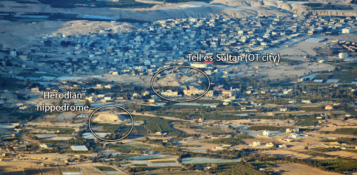
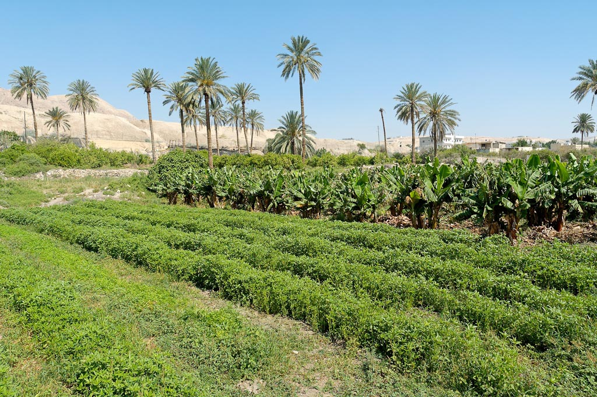
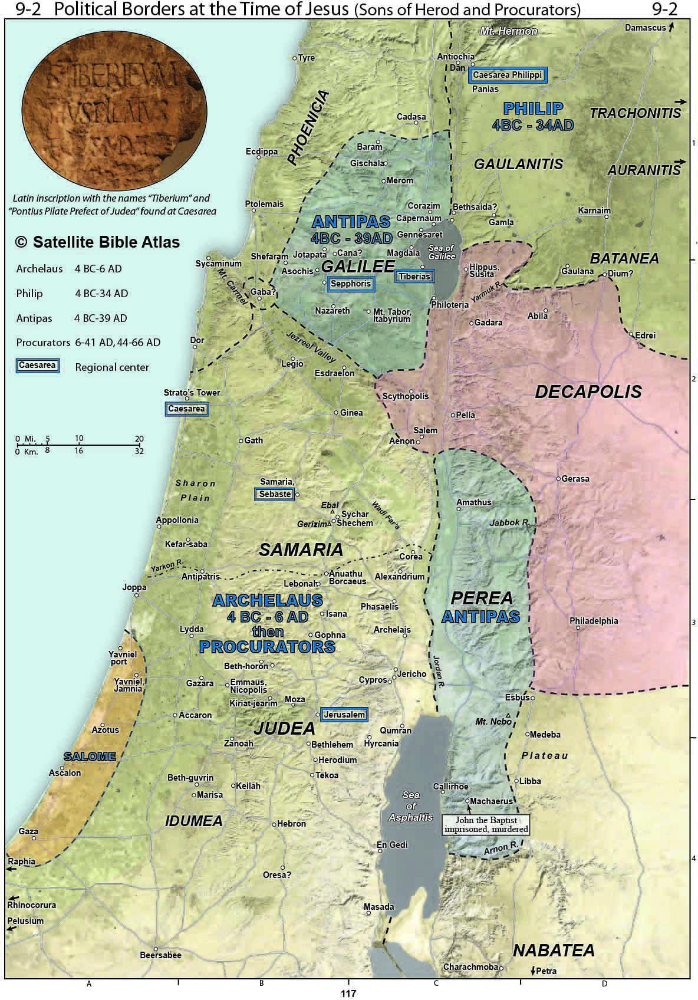
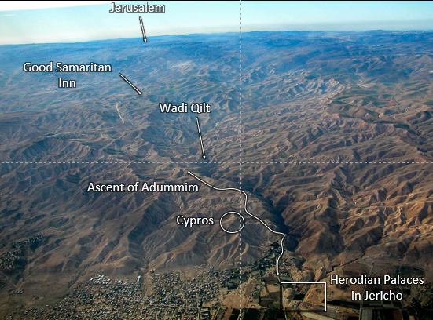
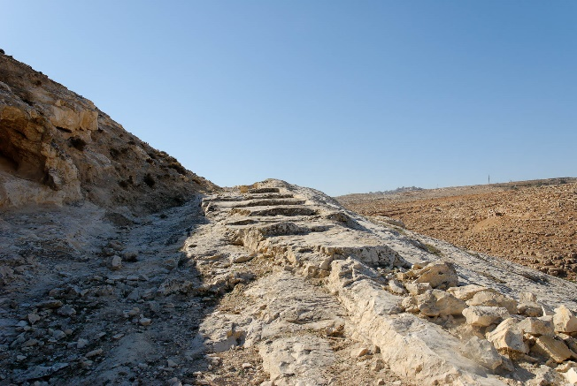



 

**Read/hear the portions**:

* Matthew 20:29-34
* Mark 10:46-52
* Luke 18:35-19:38 (Primary)

**Summary**

This lesson is titled, "Zacchaeus and Bartimaeus" because of the healings, one physical and one spiritual of Blind Bartimaeus and Zacchaeus the wealthy tax collector.  In Luke, Jesus also gives the double-parable of the Minas (Pounds) and the King's Return.

The lesson begins with Jesus passing through Jericho on His way up to Jerusalem for the Passover.  What Jesus knew, and what we, the readers, know, but what the disciples and others at the scene did not know is that this would be the final stop of His earthly ministry.  The most tumultuous and historically significant week in all of human history was about to begin, but first Jesus continues His mission to seek and save the lost sheep of Israel.

**Video**



## Geography

| **Matthew 20**                                               | **Mark 10**                                                                                       | **Luke 18**                  |
|--------------------------------------------------------------|---------------------------------------------------------------------------------------------------|------------------------------|
| 29. As they went out of Jericho, a great crowd followed him. | 46. And they came to Jericho. And as he was leaving Jericho with his disciples and a great crowd… | 35. As he drew near Jericho… |

<small>Notes:[^20] [^21]</small>

[^20]: Harmonized gospel passages are from A. T. Robertson, A Harmony of the Gospels, E-Sword edition. (New York: Harper & Row, 1950).  Unless otherwise noted, all biblical passages referenced are in the English Standard Version (Wheaton, IL: Crossway, 2008).

[^21]: Images courtesy of the Satellite Bible Atlas and the Photo Companion to the Bible (BiblePlaces.org)

The fact that Matthew and Mark say they were leaving Jericho, while Luke says they were drawing near Jericho need not concern us. Dr. Bolen writes, “it is apparent that Jesus was leaving the population center of Jericho (as recorded in Matthew) and entering the area of the Herodian city (as recorded in Luke).”[^1]

[^1]: Todd Bolen, “Luke 19” (PowerPoint handout, Santa Clarita, CA, 2018).

This lesson takes place in and around the city of Jericho. Jericho is only about 15 miles from Jerusalem, but they couldn’t be more opposite in many ways.

-   Jericho lies deep in the Jordan Rift Valley, around 900 feet below sea level.
    -   Compare this to Jerusalem, high in the Judean hills at about 2500 feet above sea level[^2].
-   In Jericho, freshwater is plentiful from the many springs. It is known as the “city of palms” because it is very much an oasis in the desert.
    -   Jerusalem’s only source of freshwater, the Gihon Spring, can only provide water for a few thousand people per year.
-   Jericho commands the central east-west approach to Jerusalem, making it strategically important.
    -   The Jordan was relatively easy to cross near Jericho.
    -   This factor contributed to the wealth of Zacchaeus, the tax collector who was able to tax people coming and going.
    -   Despite having tremendous religious importance, Jerusalem is neither strategic nor wealthy.

[^2]: Ibid.; Barry J. Beitzel, *The New Moody Atlas of the Bible*, New edition. (New York: Moody Publishers, 2009).




Empires from the Persians to the Romans used Jericho as an administrative center. Alexander the Great had a private estate here. Mark Antony gave Jericho to Cleopatra as a gift. As we noted last time, Herod the Great had a palace here, which would still have been in use as Jesus made His way through the city. Much like he did with Jerusalem, Herod expanded his “footprint” in the city with several public works, military buildings, a hippodrome/theatre complex to entertain the masses, and of course, his lavish private palace.

In Israel’s history, we know that Jericho is significant for being the first town Joshua and the Israelites could capture using a unique battle plan. Of significance for us is the town of Gilgal. This is where God made the Israelites stop, get circumcised (a very odd thing to do before a battle!), sanctify themselves, and celebrate Passover (Joshua 5:1-12).

Going back even further, archeologists have unearthed artifacts that date to \~8000 BCE in the new stone age period – that’s 6000 years before Abraham. Historians believe Jericho is the oldest, continuously inhabited city in the world.





* The setting here is a little over a week before Passover. Crowds are beginning to swell. The beginning of the narrow Ascent of Adummim would have represented a bottleneck, with people backing into Jericho.
* Additionally, primarily, but perhaps not exclusively due to Jesus, the expectation grew for a Messianic deliverer. Such hope is always higher around Passover, as the feast recalls Israel’s miraculous deliverance from oppressive Egypt. 
* Those who realized God sent Jesus had every reason to think a similar redemption was at hand.

## Blind Bartimaeus

-   Mat 20:29-34
-   Mar 10:46-52
-   Luk 18:35-43

| Matthew 20                                                                                                                                                                                                                                                                                                                                                       | Mark 10                                                                                                                                                                                                                                                                                                                                                                                                                         | Luke 18                                                                                                                                                                                                                                                                                                                                                                               |
|------------------------------------------------------------------------------------------------------------------------------------------------------------------------------------------------------------------------------------------------------------------------------------------------------------------------------------------------------------------|---------------------------------------------------------------------------------------------------------------------------------------------------------------------------------------------------------------------------------------------------------------------------------------------------------------------------------------------------------------------------------------------------------------------------------|---------------------------------------------------------------------------------------------------------------------------------------------------------------------------------------------------------------------------------------------------------------------------------------------------------------------------------------------------------------------------------------|
| 29. As they went out of Jericho, a great crowd followed him. 30. And behold, two blind men were sitting by the roadside, and when they heard that Jesus was passing by, they cried out, “Lord, have mercy on us, Son of David!” 31. The crowd rebuked them, telling them to be silent, but they cried out all the more, “Lord, have mercy on us, Son of David!”  | 46. And they came to Jericho. And as he was leaving Jericho with his disciples and a great crowd, Bartimaeus, a blind beggar, the son of Timaeus, was sitting by the roadside. 47. And when he heard that it was Jesus of Nazareth, he began to cry out and say, “Jesus, Son of David, have mercy on me!” 48. And many rebuked him, telling him to be silent. But he cried out all the more, “Son of David, have mercy on me!”  | 35. As he drew near Jericho, a blind man sat begging by the roadside. 36. Hearing a crowd going by, he inquired what this meant. 37. They told him, “Jesus of Nazareth is passing by.” 38. And he cried out, “Jesus, Son of David, have mercy on me!” 39. And those in front rebuked him, telling him to be silent. But he cried out all the more, “Son of David, have mercy on me!”  |

-   Again, we note Mark’s attention to detail. He gives us the beggar’s name, Bartimaeus.
    -   Since others whom Jesus healed are usually unnamed, this might seem to suggest that Bartimaeus might have achieved some notoriety in the early apostolic community.
    -   Mark also translates the man’s name for his Roman readership who didn’t speak Hebrew or Aramaic. Bar in Aramaic means “son,” so the man’s name means the son of Timaeus.
-   The healing is relatively straightforward, so it could be easy to miss some nuances.
    -   Mark and Luke record that he is told “Jesus of Nazareth” passes by. ישׁוע (Yeshua) was a widespread name, but there is only one Yeshua of Nazareth.
    -   Bartimaeus makes a messianic declaration when he exclaims, “Son of David, have mercy on me!” – in other words, this blind man could “see” better than most people of his day. Although he was blind, he saw Jesus clearly.
    -   Their persistence is admirable. Do we shout louder for Jesus to help us, or do we give up at the first sign of the crowd telling us to be quiet?




Matthew and Mark say they were leaving Jericho, but Luke says they drew near Jericho. Matthew says there were two beggars, but Mark and Luke say there was only one. Which is it?

We discussed the first question in the introduction. Jericho’s had two distinct sections: a population and a government center. They were about a mile apart.

Also, of the three authors, Luke would have been the least familiar with the geography of Jericho, and he was writing to an audience that would not have necessarily had any familiarity with the region. Perhaps he got this minor detail wrong. If so, insignificant discrepancies such as these need not concern us.

As to whether one versus two blind people were healed, this is similarly a non-issue, in my opinion. Matthew occasionally says multiple people were involved in an incident when Mark and Luke discuss only one person. Matthew was an eyewitness to these events, whereas the other writers may have edited their stories to focus on the most significant individual. Further, Mark does not say there was “only Bartimaeus.” We can easily reconcile this. They came upon two blind men, one of whom was named Bartimaeus.

It’s important to remember that the Books of the Bible are not transcripts of every event that happened. They are carefully edited and revised narratives. They are stories designed to get at the essence of a particular event. Then perhaps they were changed and edited some more as the years passed, leading up to the point at which they were canonized (finalized).

These minor discrepancies are significant for one huge reason: they demonstrate a lack of coordination and collaboration among the gospel writers. If multiple witnesses’ testimonies match too closely, people become suspicious that they might have gotten together beforehand to concoct a cover story.

In terms of chronology, Lancaster sees this event as happening after the episodes with Zacchaeus as they were leaving Jerusalem and starting the Ascent of Adummim leading up to Jerusalem. Beggars would have been more “successful” here, where a crowd of people would be converging for the pilgrimage, then elsewhere in the middle of Jericho. Specifically, Lancaster places the event *after* “they came to Jericho” in Mark 10:46, but *before* “And as he was leaving Jericho.” in the same verse.





<small>Note: [^3]</small>

[^3]: Daniel T. Lancaster, “Zaccheus and Bartemaeus,” in *Chronicles of the Messiah*, ed. Boaz D. Michael and Stephen D. Lancaster, Second edition. (Marshfield, MO: First Fruits of Zion, 2014), 1216.

-   Mat 20:29-34
-   Mar 10:46-52
-   Luk 18:35-43

| **Matthew 20**                                                                                                                                                                                                                          | **Mark 10**                                                                                                                                                                                                                                                                                                                                                                                                                                                                      | **Luke 18**                                                                                                                                                                                                                                                                                                                                                                                             |
|-----------------------------------------------------------------------------------------------------------------------------------------------------------------------------------------------------------------------------------------|----------------------------------------------------------------------------------------------------------------------------------------------------------------------------------------------------------------------------------------------------------------------------------------------------------------------------------------------------------------------------------------------------------------------------------------------------------------------------------|---------------------------------------------------------------------------------------------------------------------------------------------------------------------------------------------------------------------------------------------------------------------------------------------------------------------------------------------------------------------------------------------------------|
| 32. And stopping, Jesus called them and said, “What do you want me to do for you?” 33. They said to him, “Lord, let our eyes be opened.” 34. And Jesus in pity touched their eyes, immediately recovered their sight, and followed him. | 49. And Jesus stopped and said, “Call him.” And they called the blind man, saying to him, “Take heart. Get up; he is calling you.” 50. And throwing off his cloak, he sprang up and came to Jesus. 51. And Jesus said to him, “What do you want me to do for you?” And the blind man said to him, “Rabbi, let me recover my sight.” 52. And Jesus said to him, “Go your way; your faith has made you well.” And immediately, he recovered his sight and followed him on the way. | 40. And Jesus stopped and commanded him to be brought to him. And when he came near, he asked him, 41. “What do you want me to do for you?” He said, “Lord, let me recover my sight.” 42. And Jesus said to him, “Recover your sight; your faith has made you well.” 43. He immediately recovered his sight and followed him, glorifying God. And all the people, when they saw it, gave praise to God. |

## Opened Eyes

* They knew what they needed. 
  * He doesn’t ask Jesus for a few coins. 
  * He asks to be healed. 
  * How often do we ask for the _specific_ thing we need?
* This time, there is no elaborate mud ritual. 
* Jesus’ touch is all the men need. 
* Jesus commends them for their faith. 
* They immediately follow Him. 

These types of healings have become commonplace in Mark. They have a double purpose.

-   First, Mark records selected events in Jesus’ ministry that demonstrated Jesus’ authority over the physical world.
-   Second, as Lancaster says, these infirmities “symbolize the Master’s struggle with the spiritual impediments besetting His generation. These impediments prevented the people from repenting, recognizing the Messiah, and obtaining the kingdom.”[^4]

[^4]: Ibid., 1219.

## Comparison with the Rich Young Ruler

Lancaster concludes the section with a table comparing the Rich Young Ruler to Blind Bartimaeus, which I have modified slightly[^5]:

[^5]: Ibid.

|                                     | Rich Young Man                                                       | Blind Bartimaeus                                                                                                                                                                     |
|-------------------------------------|----------------------------------------------------------------------|--------------------------------------------------------------------------------------------------------------------------------------------------------------------------------------|
| Reference                           | Mark 10:17-27                                                        | Mark 10:46-52                                                                                                                                                                        |
| Status                              | Wealthy                                                              | Destitute                                                                                                                                                                            |
| Address to Jesus                    | “good teacher” (polite, reserved)                                    | “Son of David” (urgently)                                                                                                                                                            |
| Request                             | “what must I do?” (the man is the focus)                                                   | “have mercy on me!” (Jesus is the focus)                                                                                                                                                                  |
| Jesus’ reply                        | “Keep the commandments; sell everything.”                            | “What do you want me to do for you?”                                                                                                                                                 |
| Left all he had and followed Jesus? | No.                                                                  | Yes; he threw his cloak aside, which is probably the only thing he owned                                                                                                             |
| Mood after the exchange             | Sad, causing others to wonder, “who then can be saved?”              | Glorified God, causing others to be awed and praise God                                                                                                                              |
| Lesson                              | When we depend on our adequacy and our righteousness, we go away sad | When we humble ourselves enough to ask for mercy, we are rewarded for our faith in the Son of David. Our faith is about the best we can offer to Him. He has EVERYTHING to offer us. |

## Zacchaeus, the tax collector

Luke 19:1-4

<small>
1. He entered Jericho and was passing through.
2. And behold, there was a man named Zacchaeus. He was a chief tax collector and was wealthy.
3. He was seeking to see who Jesus was, but on account of the crowd, he could not because he was small in stature.
4. So he ran on ahead and climbed up into a sycamore tree to see him, for Jesus was about to pass that way.
</small>
  

* We are told Zacchaeus was the *chief* tax collector, yet he wanted to see Jesus badly. 
  * This sets the stage for another “last shall be first” reversal.
  * Tax collectors were near the bottom of civilized Jewish society (See the call-out box below for further background).
  * Most "sinners" would avoid someone who is seen as morally superior.
  

* Zacchaeus was probably less than five feet tall, so he climbed something more like a middle eastern fig tree versus a North American sycamore. 
  * These trees have short trunks and branches relatively close to the ground, making them easy to climb. 
  * Like it is today, climbing trees is seen as a child’s activity. 
  * We could say that by elevating himself, Zacchaeus was lowering himself in the eyes of others.
    * We can draw a parallel to the prodigal son's father.
    * It was considered degrading for the patriarch of the family to run after anything, yet this is exactly what the father did in the story.
    * I wonder if both men, the father and Zacchaeus, aren't a picture of our Heavenly Father who will overcome any obstacle to be with us.  Conversely, we should be more like the two men, removing any obstacles that get in our way between us and communion with God.




Zacchaeus was hated because he worked for the man…the Ro-man.

Jericho was a major administrative and tax center, as mentioned in the introduction. It was also a border town between Judea and Perea across the river. Unlike Joshua’s day, the Jordan was easily crossed in Jesus’ time. All of this made Jericho “one of the wealthiest cities of Palestine in the most fertile part of Judea.”

When we introduced Matthew, we talked a bit about the system. They didn’t have actual, fixed tax rates. Whatever the tax collector could muscle out of the victim was fair game. It was a dirty business. If the collector thought someone underpaid his taxes, he had the authority to jail the citizen until he paid up. Further, they had something like a multi-level marketing scheme in which lower tax collectors had to give their bosses a cut. Zacchaeus was at the top of the pyramid, and he was loaded. It’s easy to see how the citizens considered Jews like Matthew and Zacchaeus traitors and thieves. Avoiding the taxman was seen as a duty among the faithful. As a result, tax collectors were ostracized from the rest of Jewish society. They were disqualified from serving as a witness in a trial. Because their occupation required them to be dishonest, they could never be trusted to tell the truth.

Jesus, Himself, said His disciples should treat the unrepentant as if he was a tax collector. That is to shun him.





<small>Note: [^6]</small>

[^6]: Craig S. Keener, *The IVP Bible Background Commentary: New Testament*, 2nd edition. (Downers Grove, Illinois: IVP Academic, 2014). Luke 19:1-2.

## Friend of Sinners

Luke 19:5-7

<small>
5. And when Jesus came to the place, he looked up and said to him, “Zacchaeus, hurry and come down, for I must stay at your house today.”
6. So he hurried and came down and received him joyfully.
7. And when they saw it, they all grumbled, “He has gone in to be the guest of a man who is a sinner.”  
</small>
  

* Imagine all the people who wanted to see Jesus, like how our folks line the street of a motorcade today. 
  *  Not only does he stop and call someone out for special attention, but that person also happens to be a hated tax collector! 
  * Luke has a number of these stories that juxtapose a repentant sinner with the murmuring of the self-righteous.
* Zacchaeus would have been well known to the city’s people and not well known in a good way. 
* Why would Jesus choose to honor this lowlife? 
  * Any food he might serve Jesus would have been purchased with stolen money, making Jesus in some way complicit in the crime. 
  * Zacchaeus was a symbol of all that was wrong with Roman oppression. 
  * Zacchaeus was supposed to be ostracized, but Jesus isn’t playing by the rules.
  * Conversely, we can imagine the town’s religious leaders expected Jesus to dine with them. 
    * Maybe they had already started preparing their houses in the hopes that they would get to entertain this critical guest.
* Interestingly, this event happened right around the time Jesus told the parable of the workers. Here, we see something very similar. 
  * The “owner” of it all can choose to bestow favor on whomever he pleases. 
  * They didn’t like who Jesus chose, so they grumbled.
* Keep in mind that these people weren’t simply petty in their dislike for Zacchaeus. He was a thief. 
  * They had probably all been victimized by him, and he made their lives harder than they needed to be.
* Jesus, of course, knows the end from the beginning, and he knows what is going to happen next.

## Teshuvah

Luke 19:8-10

<small>
8. And Zacchaeus stood and said to the Lord, “Behold, Lord, the half of my goods I give to the poor. And if I have defrauded anyone of anything, I restore it fourfold.”
9. And Jesus said to him, “Today salvation has come to this house since he also is a son of Abraham.
10. For the Son of Man came to seek and to save the lost.”
</small>
  

* I imagine the grumbling people were quite surprised the next day when they got a knock on the door and handed a bag of cash, four times the amount that they had initially been paid! 
  * They were ultimately quite glad Jesus spent some time with Zacchaeus! 
  * If Jesus gave him an ultimatum as He did for the Rich Young Ruler, it is not recorded. 
  * **We can take away from the text is that Jesus chose to honor an outcast, and he repented.**
* Note that he repented from _exploiting others_. 
  * Based on John the Baptist's warning to a previous group of tax collectors, we should not necessarily assume that the man gave up being a tax collector (Luke 3:12-13).
* The Hebrew word for repentance is *teshuvah*. 
  * As with many Hebrew words, action is implied. 
  * When we with our "western" minds think of repentance, we might think of a chance of heart. 
  * In a Hebraic mindset, that change of heart is always accompanied by action. 
  * In this case, a good deed reflects repentance that started in the heaert. 
  * We touched on this last time with the Rich Young Ruler. 
    * In Zacchaeus’ case, his heart was right, so good deeds followed. 
    * In the young man’s case, his heart wasn’t right despite his claim to have kept all the commandments Jesus listed. 
  * There is a potential that both exchanges happened on the same day, which would have highlighted the contrast in the disciples’ eyes.
* Remuneration
  * The Torah assigns various levels of remuneration for theft depending on the circumstances. 
  * Zacchaeus gave himself the highest level: quadruple damages.

## Yeshua has come

* When Jesus says, “Today, salvation has come,” this is not because of the good deed of giving half to the poor and remediating with quadruple damages. 
* Salvation came because of his repentance, which was subsequently evidenced by the act. 
  * Zacchaeus would undoubtedly have been familiar with John the Baptist in this geographic region. 
    * Perhaps it was one of Zacchaeus' direct-reports who met John the Baptist
    * While it appears Zacchaeus did not immediately repent at John’s words, perhaps a seed was planted that took some time to grow. 
  * We need to remember this when we don’t see immediate fruit from our ministry. 
  * There could be growth going on that we can’t see.
* There is also a deliberate pun. Yeshua means salvation. 
  * Not only was Zacchaeus saved in the spiritual sense, Jesus, but the embodiment of salvation had also come to his house and was sitting across from him.
* Son of Abraham
  * This is also significant. 
  * He was one of the lost sheep of Israel, once thought to be beyond reach. 
  * Yet Jesus restores him. 
  * Jewish people of that day (like many nominal Christians today) believed they had salvation just by being Jewish.
    * However, this could be forfeited by self-exclusion, such as becoming a tax collector or some other type of sinner.
  * If we entertain the fact that he remained a tax collector, this inclusion and restoration would have been even more offensive to those in attendance. 
  * Recall previous lessons where we discussed the divine reversal, including the last lesson where those who showed up for work at the 11th hour (the repentant sinner) got the same wage as those who had been working all day (the lifelong believer).

## A man goes on a journey

Luke 19:11-12

<small>
11. As they heard these things, he proceeded to tell a parable because he was near to Jerusalem and because they supposed that the kingdom of God was to appear immediately.
12. He said, therefore, “A nobleman went into a far country to receive for himself a kingdom and then return.
</small>
  

* Note the last part of verse 11. They expected the political kingdom immediately. 
* The Journey parables have a common theme.
  * Man goes on a journey, yet before he leaves, he entrusts his operation to a group of servants
  * When he returns, typically unexpectedly, the owner demands an accounting
  * The righteous are rewarded while the wicked are punished
* For the original audience, there may have been (at least) three layers of intended meaning:
  * First, we are individually accountable in the absence of direct supervision
    * Paul elaborates on this in Ephesians 6
      * When the Bible talks about "masters" and "slaves", we need to substitute "employers" and "employees", or "clients" and "contractors"
  * Second, After His Resurrection, Jesus will be “away” for a while
    * The disciples (i.e., you and me) are entrusted not only with keeping the operation moving but also delivering a return on investment
    * When He comes again, not only will the wicked be judged at the Great White Throne Judgment, but those deemed righteous will have their works evaluated at the Bema Seat Judgment
  * Third, Israel has not had direct supervison but now the King is returning and will audit the books
    * In other words, the parables possibly explain the coming judgment about to fall on Jerusalem
    * Through Moses, God had delivered to the people a perfect system for keeping in communion with Him.
    *  In many ways, the Torah is written like a contract; it promises life to those who fulfill the terms and death to those who do not.
    * Now Jesus, in a sense, the “second Moses,” is returning to audit the books.
    * If He found that generation had produced fruit in keeping with repentance, His arrival would have brought reward – the Messianic Kingdom would have begun.
    * Since He found that generation had failed to fulfill the terms, His appearance brings judgment – destruction, exile, and a delay of the Kingdom.
* These three would serve to communicate, albeit indirectly, that He is not the messiah, they’re looking for. There will be no immediate Messianic Kingdom.

> It appears Luke may have combined two parables into one. Both begin with “a nobleman went into a far country to claim his Kingdom.”

1. The “Parable of the Minas” is Luke 12-13, 15b-26.
2. The “Parable of the King’s Return” is Luke 12, 14-15a, 27.

Both parables begins with a nobleman going into a far country to receive his kingdom. Keener points out, “Herod the Great (in 40 BCE) and Archelaus (in 4 BCE) each had to go to Rome to receive their right to rule Judea[^7].” 
[^7]: Ibid.

* Jesus’ audience would have immediately recalled this. 
* When they heard the opening words of the parable, they would have thought, “oh, you mean just like Herod and Archelaus.”
* This means, to the original audience hearing the parable, the protagonist in the parable was hated, wicked, and dishonest.
* As we evaluate the parables, we need to keep in mind Jesus’ stated reason for telling them: BECAUSE THEY SUPPOSED THE KINGDOM OF GOD WAS TO APPEAR IMMEDIATELY.

## Parable of the Minas

Luke 19:12-15

<small>
12. He said, therefore, “A nobleman went into a far country to receive for himself a kingdom and then return.
13. Calling ten of his servants, he gave them ten minas and said to them, ‘Engage in business until I come.’
15. When he returned, having received the kingdom, …
15. … he ordered these servants to whom he had given the money to be called to him, that he might know what they had gained by doing business.
</small>  

* A mina was roughly three months’ wages. 
* As is the theme with “man goes on a journey” parables, the workers are given an unannounced amount of time to grow their investments. 
  * Although it is not stressed in this parable, in “Journey Parables,” the master returns unannounced. 
  * This means the workers (or bridesmaids) should constantly be in a heightened state of preparedness and expectation regardless of the length of the absence.

## The audit

Luke 19:16-26

<small>
16. The first came before him, saying, ‘Lord, your mina has made ten minas more.’
17. And he said to him, ‘Well done, good servant! Because you have been faithful in a very little, you shall have authority over ten cities.’
18. And the second came, saying, ‘Lord, your mina has made five minas.’
19. And he said to him, ‘And you are to be over five cities.’
20. Then another came, saying, ‘Lord, here is your mina, which I kept laid away in a handkerchief;
21. I was afraid of you because you are a severe man. You take what you did not deposit and reap what you did not sow.’
22. He said to him, ‘I will condemn you with your own words, you wicked servant! You knew that I was a severe man, taking what I did not deposit and reaping what I did not sow?
23. Why then did you not put my money in the bank, and at my coming, I might have collected it with interest?’
24. And he said to those who stood by, ‘Take the mina from him, and give it to the one who has the ten minas.’
25. And they said to him, ‘Lord, he has ten minas!’
26. ‘I tell you that to everyone who has, more will be given, but from the one who has not, even what he has will be taken away.
</small>  

* Although ten servants were given a mina each, we are only told the audit results of three. 
  * The first two must have had good asset managers as the ROI (return on investment) was 1000% and 500%, respectively.
    * According to one commentator, this return is too good to be true; therefore, we should understand and apply the meaning of the parable accordingly
  * They were then put in charge over much more. 
  * The third wrapped up his mina in a scarf. 
    * In that culture, wrapping up a sum of money and laying it away meant it couldn’t be touched.

## Matthew's Parable of the Talents (Matthew 25)

* Although the parables are quite similar, there are some key differences
  * In Matthew’s version, there are three servants, not ten
  * The currency is a “talent” (a talent is 6000 denarii – so 23-25 years’ wages – a significant sum!)
  * Instead of each servant getting equal, the three servants get 5, 2, and 1 respectively. 
    * The first two deliver 100% ROI (somewhat more reasonable than the return on the Minas)
    * These servants are told, “well done, good and faithful servant. You were faithful with a few things; I will put you in charge of many things. Enter into the joy of your master.”
    * In Luke's version, there is no "good servant" (although there is "failthful"), neither is there "joy"
* The third servant responds much like the third servant in the Mina parable. 
  
In terms of application, Lancaster concludes, “If the parable of the ten minas describes how equal opportunities can be used differently to achieve different results, the parable of the talents describes how different opportunities and resources can be used equally to achieve the same results.[^8]” Strikingly, the third servant is not merely reprimanded. Still, he is cast into Gehenna, where “there will be weeping and gnashing of teeth.” (Matthew 25:30)

[^8]: Lancaster, “Zaccheus and Bartemaeus,” 1210.

* The prevailing view assumes the parable is roughly equivalent to the Matthew 25 version. 
  * The two were rewarded, and the one was punished. 
  * If we are faithful in the small things, Jesus will reward us with more important things. 
  * As for the seemingly impossible rate of return, with man, this is impossible (at least without fraud or insider trading), but all things are possible with God.
* In preparation for this lesson, I came across two different views of the meaning of this parable. 
  * Since both conclusions can benefit us as disciples, I will present them both. 
  * The alternative view is discussed at the end of the lesson.
* Assuming the prevailing view, a takeaway of the parable would be that Jesus doesn’t want us coasting. 
  * He expects us to produce good works if we are his disciples and servants. 
  * Again, we do this not to get saved but because we are saved.
  

* The Jewish scribes recount similar “faithful with small things” lessons with Moses and David. 
  * Both started as shepherds leading literal, four-legged sheep. 
  * Because they proved themselves faithful, God put them each over His people Israel. 
  * God tests us in small matters each day. 
  
With some modifications, Lancaster’s conclusion of the Ten Minas is below[^11].

[^11]: Ibid.

-   King = Messiah
-   Journey = Messiah’s absence
-   Servants = disciples/Israel/you and me
-   Minas = the work of the kingdom
-   Faithful Servants = disciples focused on the kingdom work
-   Unfaithful servant = those who have neglected the work of the kingdom
-   Reward = advancement in the kingdom
-   Punishment = loss of the kingdom
-   **Meaning = Those faithful with the responsibilities entrusted to them will be rewarded at the coming of the Messiah. Those who are negligent will be punished.**

## Parable of the King’s Return

<small>
12. He said, therefore, “A nobleman went into a far country to receive for himself a kingdom and then return.
14. His citizens hated him and sent a delegation after him, saying, ‘We do not want this man to reign over us.’
15. … he returned, having received the kingdom, …
27. (and said) these enemies of mine, who did not want me to reign over them, bring them here and slaughter them before me.’”
28. When he had said these things, he went on ahead, going up to Jerusalem.
</small>  

As mentioned above, hearers of this parable would have immediately recalled the Herodian ruler Archelaus. After Herod the Great died around 4 BCE, his kingdom was split among his sons. Like other famous, wealthy neurotics, Herod had multiple wills that needed to be sorted out. Antipas believed he should have inherited the title “King of the Jews” from his father. The Romans disagreed. Archelaus got Judea and Samaria, Antipas got Galilee and Perea, and Philip got the territory to the northeast.

One Passover, Archelaus slaughtered approximately 3000 Jews in the temple in Jerusalem[^12]. Following this, a delegation of Judeans went to Rome to petition for relief. Ultimately, he was banished to Vienna, and the Roman Procurators’ age began. See map for these boundaries[^13].

[^12]: Aubrey L. Taylor, “The Historical Basis of the Parable of the Pounds,” in *Lexham Geographic Commentary on the Gospels*, ed. Barry J Beitzel (Bellingham, WA: Lexham Press, 2017), 389.

[^13]: William Schlegel, “Satellite Bible Atlas: Historical Geography of the Bible” (Israel: SkyLand Publishing, 2016). Map 9-2.

> If we assume the ruler in the parable(s) is supposed to represent Jesus, why would Jesus compare Himself to the wicked Archelaus?

* One explanation: as we have mentioned, Jesus’ parables often have flawed protagonists. 
  * One of the lessons is “if a flawed human can do good things (like reward high-producing servants), how much more will perfect God do those things.”
* Another possible explanation: for context, note He said these things as he was going up to Jerusalem. 
  * He knew, but the disciples did not, that He will be rejected and hated. 
  * While we believers, do not view Jesus as an evil ruler, non-believers do not share our opinions. 
  * For our purposes, we can include the Jerusalem religious establishment in the category of non-believers. 
  * In this respect, Jesus was hated just like this ruler was.
  * Therefore, in this second interpretation, the parable’s meaning is that judgment awaits those who oppose the kingdom. 
    * If our image of Jesus is as a blonde-haired Scandinavian who goes around the shores of the Sea of Galilee patting children on the head, we may find these words startling. 
    * Those people have never read the last few chapters of Revelation. 
    * When Jesus comes again, His enemies will be put down, and God wins.

As we said above about the “Journey” parables, Jesus’ first-coming, as well as His second-coming, are in view. Although they are “successful” at having Jesus cast aside, in about 40 years, the Romans will invade and slaughter the residents of Jerusalem. Those who survive are sent into exile. Either way, judgment awaits those who reject the rightful ruler. Jesus is also possibly dropping another hint that the Messianic political Kingdom will wait.

## An alternative view

As mentioned, Aubrey Taylor, writing in the “Lexham Geographic Commentary,” believes Luke’s version is not merely a retelling of Matthew’s Parable of the Talents. “When the setting of the parable is accounted for, it becomes clear Jesus is delivering a critique of exploitative power structures—not celebrating them as a model of discipleship.[^14]”

[^14]: Taylor, “The Historical Basis of the Parable of the Pounds,” 385.

The argument is compelling, so I submit it here for Acts 17:11 analysis. Also, perhaps both interpretations are valid. Parables usually only have one meaning, but they don’t always have to.

This view hinges on the following:

-   comparing the ruler in the parable(s) to Herod Archelaus, not Jesus
-   the too good to be true returns on investment
-   the geographic setting: Jericho, in view of Herod’s palaces, on the way up to Jerusalem, where the Messianic Kingdom will NOT be initiated
-   the context of Zacchaeus repenting and refunding (with damages) his ill-gotten wealth

The parable begins with a nobleman going into a far country to receive his kingdom, which Archelaus did a few years earlier.

Above, we asked, “Why would Jesus compare Himself to the wicked Archelaus?” Taylor argues that He would not and did not intend to make that comparison.

* In the economy of that day, “the very act of doing business for profit was considered immoral, the profit margins presented by the first to servants were downright evil.”[^15]
[^15]: Ibid., 391.
* Unlike today’s economy, where a rising tide lifts all boats, it was seen as zero-sum in that day. If one person gained, that means another person lost.
* In that culture, the nobleman would have been the villain, and the third slave would have been the hero! 
  * The speculation is that the first two slaves would have had to resort to harassment and thievery to generate those massive returns.
  * I’m sympathetic to this view. 
  * Even today, if someone showed those percentages of returns, we likely would assume that there were some shenanigans; perhaps the asset manager received an insider-trading tip or something like that.
* In Taylor’s view, it was the third slave who acted honorably. 
  * He did not lose any part of the initial investment. He wrapped it in a cloth for safekeeping. 
  * He did not directly disobey the wicked ruler, but he didn’t do anything to help him either. 
  * Interestingly, in the fourth century, Eusebius referenced yet another version of the parable (in the now lost Gospel of the Nazarenes) where the third servant was **rewarded**.
*  Taylor sees this interpretation as more fitting in the context of following the story of Zacchaeus, who gave away his ill-gotten earnings with Luke 19:11. 
  *  As they heard these things, he proceeded to tell a parable because he was near to Jerusalem and **because they supposed that the kingdom of God was to appear immediately.**
  * In other words, they wanted a national kingdom to replace Rome. 
  * According to this view, **Jesus responds that it would be absurd to establish the kingdom of God based on the model of Rome**.
    * In the first century, Israel’s recent history bore this out. 
      * Jewish people rightly celebrate Hanukkah (as did Jesus Himself in John 10:22), where a group of rebels defeated the tyrannical Greek Seleucid empire. 
      * Yet only a few decades later, Israel’s own rulers, the Hasmoneans, showed themselves to be just as ruthless, inept, and just as corrupt as their Greek counterparts.
    * In later centuries, Church history proved this as well.
      * Power corrupts, and absolute power corrupts absolutely.
* Taylor’s argument appeals to me because I give the most weight to what the original audience would have understood.   * What they would have understood is likely what Jesus meant.
* Jesus would show us there's going to be a different way. 
  * He will enter Jerusalem not on a conquering horse but a humble donkey. 
  * “But, amid the crowds calling out for a king and a rescuer, He must have realized his message was falling on deaf ears.”[^16] 
  
We’ll look at that entry in Lesson 39.

[^16]: Ibid., 393.

## Conclusion

With all this said, the similarities of this parable to Matthew 25 can’t be ignored. The context of Matthew’s parable is a “good and faithful servant who enters into his master’s rest.” Luke’s parable is almost identical.

Perhaps, while they appear conflicting, the two interpretations are not necessarily mutually exclusive.  In any case, we need to stay focus on kingdom work and not become complacent while Jesus is "away".

More applicable than the parable is we need to have the heart of Zacchaeus. We need to joyfully make it right when we are wrong because salvation has come to us.
