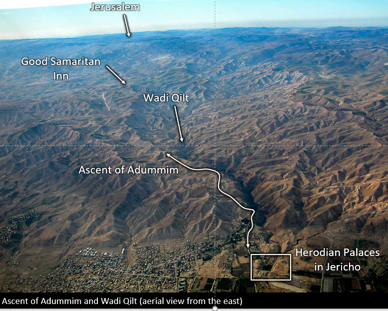
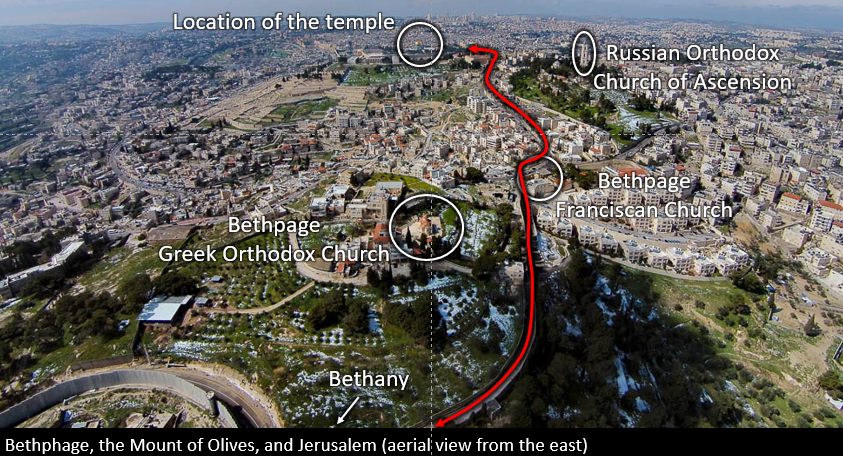
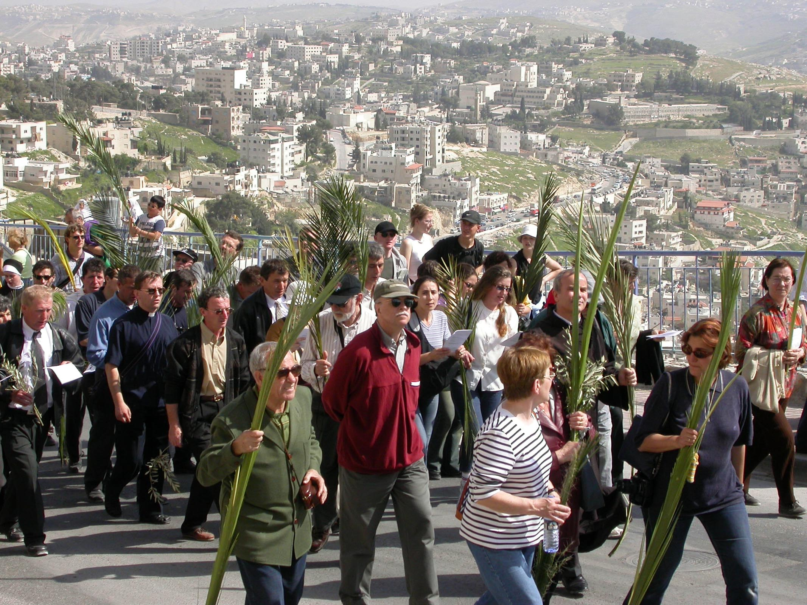



 

**Read/hear the portions**:

* Matthew 21:1-17
* Mark 11:1-11
* Luke 19:28-40
* John 11:55-12:1, John 12:9-16

<small>Note: There is a known textual problem with John 12:2-8, which we will discuss when we get to Matthew 26.</small>

**Summary**

This lesson is titled “The Triumphal Entry” because we have finally arrived at the most significant week in all human history. The next seven days are a roller coaster of emotions, ending on the highest peak of all, the Resurrection.

Lesson 39 will be in two parts. Part I will review the Ascent of Adummim, which connects Jericho to Jerusalem. We’ll meet up with Jesus and the recently resurrected Lazarus in Bethany, look at how Jesus procures a donkey for his entry into Jerusalem, and examine the crowd’s reaction as they welcomed Jesus.

**Video**



-----



-----



### Introduction: The Final Week Begins

A note about the “Final Week” – We are “only” in John chapters 11 and 12, so the last ten chapters of John deal with this week and post-resurrection. Lancaster's commentary is a five-volume set. Each volume has around 400 pages. The Triumphal entry occurs about ½ way into volume 4. In other words, even though it looks like we’re nearing the end from a timeline perspective, we have a LOT of Gospel still ahead of us. Our format will take another 14 lessons to cover the events in the eight calendar days between Palm Sunday and Resurrection Sunday.

This is undoubtedly the most influential and most personally significant week in all of history.

| Luke 19:28
| :- 
| **And when he had said these things, he went on ahead, going up to Jerusalem.**

The "these things" are the Minas and the King's Returning parables we studied in Lesson 38.

This photo[^1] shows the ancient path that led the 18 miles (29 km) up from Jericho to Jerusalem. One always goes “up to Jerusalem.”

[^1]: Todd Bolen, “Luke 19” (PowerPoint handout, Santa Clarita, CA, 2018).

This chart comes from AD Riddle[^2] and shows Herod’s palace, Jericho, to Jerusalem. Presumably, the -720 is from the Herodian Palaces, west of the modern city and slightly higher. Modern Jericho’s height is listed at -864 feet, making it the lowest and the oldest continuously inhabited city on Earth. Today much of the Kidron valley has been filled in, so the elevation difference between that and Jerusalem is not as significant. Still, one had to be in excellent physical shape to make this trek. Today we do it in an air-conditioned bus with Wi-Fi.

[^2]: A.D. Riddle, “The Passover Pilgrimage from Jericho to Jerusalem,” in *Lexham Geographic Commentary on the Gospels*, ed. Barry J Beitzel (Bellingham, WA: Lexham Press, 2017). 398.

The beginning of the Following the Messiah episode 8 has an excellent segment about this ascent. Watch through 8:55.



### Will he come to the feast?

| John 11:55-57  
| :--
| **55 Now, the Passover of the Ioudaioi was at hand, and many went up from the country to Jerusalem before the Passover to purify themselves.   56 They were looking for Jesus and saying to one another as they stood in the temple, “What do you think? That he will not come to the feast at all?”   57 Now, the chief priests and the Pharisees had given orders that if anyone knew where he was, he should let them know so that they might arrest him.**  

In the week leading up to Passover, Jerusalem would swell with Pilgrims. By some estimates, a population of perhaps a few hundred thousand could swell to 2-3 million. This helps explain several dynamics, most notably why the city's leadership (both the Romans and the temple establishment) might be more on edge. It also makes locating one person in that crowd a non-trivial task.Ceremonial purification could take up to a week, especially if that person had come into contact with a corpse (Numbers 19). The Jewish Sages applied those same standards to any Jew living in a foreign country – gentile nations are inherently unclean. Remember this point when we get to Acts. This notion of ceremonial uncleanliness has a lot to do with the disciples' attitudes and reticence concerning dining with non-Jews.

They were looking for Jesus, meaning the people were wondering whether He would claim his Messianic title. The Passover/Feast of Unleavened bread was compulsory, so it would be very unusual for Him not to show up, especially since He only had to travel a relatively short distance from Galilee.

The public didn’t realize that “the game’s afoot,” as Sherlock Holmes might say. The Jerusalem "deep state"" had already decreed that Jesus needed to be taken out.





If you get a chance to participate in a Passover Seder, you should take advantage of it. It is rich with Symbolism and Biblical history. Christians/Messianic Jews see additional symbolism that represents Jesus. For example, there are traditionally three pieces of Matzah wafers. The way it is baked, it has holes (like saltine crackers) and stripes. He was pierced for our iniquities, and his stripes heal us. Additionally, the 2nd of the three pieces is literally broken and “hidden” away until after the meal. Most Jews will tell you they don’t know why this is. Christians may have a better idea as this speaks of Jesus' Resurrection, where He is absent for a time, and we await rejoining Him at the Marriage Supper.

It’s important to note Jesus and other 1st Century Jews did not celebrate the Passover the way Jewish people observe the festival today. However, the Last Supper accounts in the Gospels record several themes and practices with today’s Passover Seder. The use of the Seder plate is a post-biblical tradition, but it serves as a helpful illustration of the traditional observance of the festival. Today’s traditional Seder plate includes a shank bone (replaced above with a piece of chicken), charoset (brown mixture), bitter herbs (lettuce), bitter herbs (parsley), egg, and a vegetable. The letters in the center of the plate are Pei Samech Chet (Hebrew is read from right to left). This spells Pesach. In many non-English countries, Easter goes by the name of Pesach.









| John 12:1  
| :--
| 1** Six days before the Passover, Jesus, therefore, came to Bethany, where Lazarus was, whom Jesus had raised from the dead.**

In John 12:1, dating these events in the final week is a problem. We are not told precisely what year all this went down, so we must do our best with what we know. Some scholars believe this is 32 CE/AD because of a prophecy in Daniel 9, which we will discuss in Part II. Other scholars land on 33 or 30 CE/AD because, in these years, the date of the Passover meal would have been on a Thursday with his crucifixion on a Friday. There is strong traditional evidence that the crucifixion was on a Friday, but some scholars are not convinced. We will have to save this discussion for a later lesson.

Even here in John 12:1, while most scholars believe John meant six days before Nissan 14, the Passover sacrifice, some believe he told six days before Nissan 15, the Passover meal ushering in the seven-day feast of unleavened bread.  This is further complicated by John's placing the perfume anointing story six days before the Passover, while Mark says it was two-days before.  There is some suggestion John may have been using a different calendar than the Synoptic Gospel writers, but that may not fully explain the perfume discrepancy.

If none of these dating discrepancies bothers you and you don’t care because you’re just glad Jesus died for your sins and rose again, you’re probably much better off than the rest of us!





### Lazarus causes *Ioudaioi* to believe in Jesus

|John 12:9-11  
| :-- 
| **9 When the large crowd of the *Ioudaioi* learned that Jesus was there, they came, not only on account of him but also to see Lazarus, whom he had raised from the dead. 10 So the chief priests made plans to put Lazarus to death as well, 11 because on account of him, many of the *Ioudaioi* were going away and believing in Jesus.**

It’s been said that Lazarus was first DEAD before Jesus. He was in a state where he could do nothing to help himself. He needed Jesus. Then there was a period where he was symbolically DEFEATED. Although he had been raised, he was still in his grave clothes. This is symbolic of the Christian who has been saved but can’t or won’t let go of past “stuff” holding them back. Then once he got rid of his grave clothes, he was DANGEROUS, so much so that the deep state wanted him taken out.

If we are getting specific, note that John says it wasn’t even the entire temple establishment that wanted Lazarus gone; it was a much smaller subgroup of the chief priests. The number of conspirators against Jesus might have been MUCH more minor than we might otherwise imagine. I’m sure Lazarus had quite a story to tell, but we remember that in Luke 16:31, Jesus said that even if one comes back from the dead, many would still not be persuaded.Just a reminder, when reading the Gospel of John, when we read “the Jews,” we need to avoid automatically inferring “the bad guys.” John is very imprecise with some of his terms. The Ioudaioi in verses 9 and 11 are clearly on the side of Jesus. Here we have a POTENTIAL ambiguity. Are these Ioudaioi the everyday commonfolk Jews, or could John also say that many of the TEMPLE ESTABLISHMENT Ioudaioi came to believe in Jesus? THAT second possibility would rattle the chief priests. We don’t know, but it’s fun speculation!

### Commandeering a Donkey

| Mat 21:1-3                                                                                                                                                                                                                                                                                                                                                                                     | **Mar 11:1-3**                                                                                                                                                                                                                                                                                                                                                                                                                             | **Luk 19:29-31**                                                                                                                                                                                                                                                                                                                                                                          | **Joh 12:12**                                                                                            |
|----------------------------------------------------------------------------------------------------------------------------------------------------------------------------------------------------------------------------------------------------------------------------------------------------------------------------------------------------------------------------------------------------|--------------------------------------------------------------------------------------------------------------------------------------------------------------------------------------------------------------------------------------------------------------------------------------------------------------------------------------------------------------------------------------------------------------------------------------------|-------------------------------------------------------------------------------------------------------------------------------------------------------------------------------------------------------------------------------------------------------------------------------------------------------------------------------------------------------------------------------------------|----------------------------------------------------------------------------------------------------------|
| **1 Now when they drew near to Jerusalem and came to Bethphage, to the Mount of Olives, then Jesus sent two disciples,** **2 saying to them, “Go into the village in front of you, and immediately you will find a donkey tied and a colt with her. Untie them and bring them to me.** **3 If anyone says anything to you, you shall say, ‘The Lord needs them,’ and he will send them at once.”** | **1 Now when they drew near to Jerusalem, to Bethphage and Bethany, at the Mount of Olives, Jesus sent two of his disciples** **2 and said to them, “Go into the village in front of you, and immediately as you enter it you will find a colt tied, on which no one has ever sat. Untie it and bring it.** **3 If anyone says to you, ‘Why are you doing this?’ say, ‘The Lord has need of it and will send it back here immediately.’”** | **29 When he drew near to Bethphage and Bethany, at the mount that is called Olivet, he sent two of the disciples,** **30 saying, “Go into the village in front of you, where on entering you will find a colt tied, on which no one has ever yet sat. Untie it and bring it here.** **31 If anyone asks you, ‘Why are you untying it?’ you shall say this: ‘The Lord has need of it.’”** | **12 The next day the large crowd that had come to the feast heard that Jesus was coming to Jerusalem.** |

Mark and Luke note “a donkey on which no one has ever sat – according to Lancaster, Animals used for many Jewish rituals had to be pure. This includes being without blemish and never being ridden or yoked. Lancaster also draws a parallel with Jesus’ tomb in which no one had previously lain.As donkeys are notorious for being wild and difficult to break, the fact that Jesus walked up, mounted, and rode without being bucked could potentially be another miracle. It might also explain why it took two disciples to fetch the animal. Unbroken donkeys are also supposedly attached to their mother.

The photo by Dr. Bolen[^3] shows the journey from Bethany, through Bethphage, to the Mount of Olives. Jesus didn’t only make this journey on Palm Sunday. He spent a lot of time with Lazarus, Mary, and Martha. This aerial perspective shows the route that Jesus probably took MANY mornings as He walked from Bethany to Jerusalem. In addition to beginning the Palm Sunday walk, one of the things we do when we go there is remember that Jesus also ascended from the Mount of Olives (Acts 1:9-12). We also tend to want to look up to the sky. Zechariah 14:4 says, “His feet shall stand in that day upon the Mount of Olives, which is before Jerusalem on the east”…The somewhat adjacent Bethphage churches mark the typical starting point for a Palm Sunday procession. Since it’s about a 15-minute walk from Bethphage to the summit of the Mount of Olives, tours like the one I did begin at an overlook on the Mount of Olives near the Ascension church.

[^3]: Todd Bolen, “Matthew 21” (PowerPoint handout, Santa Clarita, CA, 2018), v. 1.





This donkey was photographed while running loose on the Greek Orthodox compound at Bethphage. 

Scholars are conflicted about whether Jesus’ instructions represent a prophecy with a relatively quick miraculous fulfillment, a logical forecast given the attitudes towards hospitality in that day, or whether this was some pre-arranged code. 

Lancaster argues for a miracle by noting the amount of space the gospel writers spend on it. If it was prearranged or expected, he theorizes the evangelists probably would have merely written, “they brought Jesus a donkey.” None of the gospels mention a pre-arranged signal, yet that didn’t stop people from bringing forth that theory. It’s intriguing, but there is little evidence for it.

Keener makes an argument for the hospitality theory “the donkey’s owner probably saw it as helpful hospitality to a famous rabbi.” 

In any case, as we mentioned on the previous slide, Jesus spent a lot of time in this area. It makes sense that He would know where to find a donkey.





<small>Callout notes: [^4] [^5] [^6]</small>

[^4]: Photo ibid., 2.

[^5]: Daniel T. Lancaster, “Triumphal Entry,” in *Chronicles of the Messiah*, ed. Boaz D. Michael and Stephen D. Lancaster, Second edition. (Marshfield, MO: First Fruits of Zion, 2014), 1231.

[^6]: Craig S. Keener, *The IVP Bible Background Commentary: New Testament*, 2nd edition (E-Sword). (Downers Grove, Illinois: IVP Academic, 2014).

### Behold, your king

| **Mat 21:4-7**                                                                                                                                                                                                                                                                                                                                                                           | **Mar 11:4-7**                                                                                                                                                                                                                                                                                                                                                | **Luk 19:32-35**                                                                                                                                                                                                                                                                                                                     | **Joh 12:14-16**                                                                                                                                                                                                                                                                                                                                                   |
|------------------------------------------------------------------------------------------------------------------------------------------------------------------------------------------------------------------------------------------------------------------------------------------------------------------------------------------------------------------------------------------|---------------------------------------------------------------------------------------------------------------------------------------------------------------------------------------------------------------------------------------------------------------------------------------------------------------------------------------------------------------|--------------------------------------------------------------------------------------------------------------------------------------------------------------------------------------------------------------------------------------------------------------------------------------------------------------------------------------|--------------------------------------------------------------------------------------------------------------------------------------------------------------------------------------------------------------------------------------------------------------------------------------------------------------------------------------------------------------------|
| **4 This took place to fulfill what was spoken by the prophet, saying,** **5 “Say to the daughter of Zion, ‘Behold, your king is coming to you, humble, and mounted on a donkey, on a colt, the foal of a beast of burden.’”** **6 The disciples went and did as Jesus had directed them.** **7 They brought the donkey and the colt and put on them their cloaks, and he sat on them.** | **4 And they went away and found a colt tied at a door outside in the street, and they untied it.** **5 And some of those standing there said to them, “What are you doing, untying the colt?”** **6 And they told them what Jesus had said, and they let them go.** **7 And they brought the colt to Jesus and threw their cloaks on it, and he sat on it.** | **32 So those who were sent went away and found it just as he had told them.** **33 And as they were untying the colt, its owners said to them, “Why are you untying the colt?”** **34 And they said, “The Lord has need of it.”** **35 And they brought it to Jesus, and throwing their cloaks on the colt, they set Jesus on it.** | **14 And Jesus found a young donkey and sat on it, just as it is written,** **15 “Fear not, daughter of Zion; behold, your king is coming, sitting on a donkey's colt!”** **16 His disciples did not understand these things at first, but when Jesus was glorified, then they remembered that these things had been written about him and had been done to him.** |

This is the 9th of 10 prophecies by Matthew where he writes, “this took place to fulfill…”

For most of His ministry, Jesus did not permit anyone to speak of His kingship. His usual response was “my hour has not yet come.” Then on this day, as Chuck Missler liked to say, “He not only permitted it, he arranged it.” As Lancaster writes, “Sending for a donkey…indicated a shift in public policy. He was ready to declare to Israel that He was her long-awaited Messiah-King.”[^8]Lancaster notes that just about every donkey reference in the Hebrew Bible prefigures Messiah: from Genesis 22 and Abraham’s near-sacrifice of Isaac to Jacob’s donkey in Genesis 32 to Moses in Exodus 4 and so on. The Talmud records, “In the same way, the latter redeemer will come, as it is stated, “Humble and mounted on a donkey, Even on a colt, the foal of a donkey.”[^9]

[^8]: Lancaster, “Triumphal Entry,” 1229.

[^9]: Exodus Rabbah 98:9





Much is made of the fact that Jesus rode in on a lowly donkey when we might expect a king to ride in on a horse. 

The prevailing theory by many Protestant commentators is the crowd should have known by the donkey that Jesus wasn’t going to be a conquering king this time. In his SECOND coming, he arrives on a horse. Revelation 19:11-16.  They imply that because Jesus entered on a donkey he was not coming as a king but as a servant to lay His life down.

This is half correct and half incorrect.  They are correct that a donkey signaled that He came in peace. Those in the crowd who expected a political, conquering King should have seen the sign.  They are incorrect that the donkey signaled He was not entering as a king.  The key word is "conquering." 

Dr. Lizorkin-Eisenberg notes that “when a city welcomed a victor with open arms WITHOUT an exercise of power, it was expected that the victor would enter on a donkey and not on a horse.”  Lizorkin-Eyzenberg says Revelation 19 still fits this model –At that point in the future, the world is being judged, and the people do not accept Christ willingly. So He comes as a conqueror.  

In other words, BOTH times, he comes as a King; once in peace on a donkey; but the second as a conqueror in judgment on a horse.

Compare Solomon, the "son of David," assuming his throne on a donkey in 1 Kings 1:33.

If they had accepted Him when He came in peace, there would have been no need for Him to return in judgment.

**Allenby observes protocol in 1917**

When the British General Allenby was preparing to take control of Jerusalem after world war I, on December 11, 1917, he rode his horse up to the Jaffa Gate on the west side of the city. He abruptly dismounted and entered the city on foot. The official record is that he did so out of respect for the holy city. He realized he was the first Christian in over 700 years to control Jerusalem, a city claimed by three faith traditions. 

He also made this humble entry as an intentional or unintentional contrast to the German Kaiser Wilhelm II’s very pompous entry 20 years earlier (the Kaiser had part of the wall near the Jaffa Gate removed so his entourage could fit through). There is a legend that, privately, Allenby supposedly told one of his aides something like, “only one Man is qualified to enter this city on horseback, and that is not me.” That’s cool if it’s true.





<small>Callout note: [^7]</small>

[^7]: Eli Lizorkin-Eyzenberg, *The Jewish Gospel of John: Discovering Jesus, King of All Israel* (CreateSpace Independent Publishing Platform, 2015), 177.

### Hoshia-Nah!

| **Mat 21:8-9**                                                                                                                                                                                                                                                                                                      | **Mar 11:8-10**                                                                                                                                                                                                                                                                                                                          | **Luk 19:36-38**                                                                                                                                                                                                                                                                                                                                                                                   | **Joh 12:13**                                                                                                                                                         |
|---------------------------------------------------------------------------------------------------------------------------------------------------------------------------------------------------------------------------------------------------------------------------------------------------------------------|------------------------------------------------------------------------------------------------------------------------------------------------------------------------------------------------------------------------------------------------------------------------------------------------------------------------------------------|----------------------------------------------------------------------------------------------------------------------------------------------------------------------------------------------------------------------------------------------------------------------------------------------------------------------------------------------------------------------------------------------------|-----------------------------------------------------------------------------------------------------------------------------------------------------------------------|
| **8 Most of the crowd spread their cloaks on the road, and others cut branches from the trees and spread them on the road.** **9 And the crowds that went before him and that followed him were shouting, “Hosanna to the Son of David! Blessed is he who comes in the name of the Lord! Hosanna in the highest!”** | **8 And many spread their cloaks on the road, and others spread leafy branches that they had cut from the fields.** **9 And those who went before and those who followed were shouting, “Hosanna! Blessed is he who comes in the name of the Lord!** **10 Blessed is the coming kingdom of our father, David! Hosanna in the highest!”** | **36 And as he rode along, they spread their cloaks on the road.** **37 As he was drawing near—already on the way down the Mount of Olives—the whole multitude of his disciples began to rejoice and praise God with a loud voice for all the mighty works that they had seen,** **38 saying, “Blessed is the King who comes in the name of the Lord! Peace in heaven and glory in the highest!”** | **13 So they took branches of palm trees and went out to meet him, crying out, “Hosanna! Blessed is he who comes in the name of the Lord, even the King of Israel!”** |





Interestingly, Matthew and Mark have the crowd referencing “son of David” while John says explicitly, “King of Israel.” 

As we’ve occasionally noted in our series, Dr. Lizorkin-Eyzenberg believes John’s audience is writing to non-Judean Israelites, including the Samaritans.

The Samaritans did not care, let alone think, that their messiah would be a son of David. John wanted his audience to know that Jesus is KING OF ALL ISRAEL!

Suppose we indulge a thought that the four Gospels in some way could represent the pattern of spreading the good news in Acts 1:8. In that case, we could say that Matthew and Mark were writing to Jerusalem and all Judea (Jews) – Jews would be interested in the Messiah being a *son of David*. Keener notes that during the Passover, which celebrates the deliverance of Israel from the house of bondage, “hopes for the restoration of the Davidic kingdom ran high.”

John was writing to Samaria (and other non-Jews who believed in Israel’s God, though not necessarily through the tribe of Judah) – they wouldn’t care about being a son of David, but to them, Messiah is *king over all Israel*. 

Luke, a Gentile convert, was writing to the ends of the earth, the extent of the Roman empire. His audience wouldn’t care about a son of David or a king of Israel but simply needs to know that *Jesus is King*.





<small>Callout notes: [^10] [^11] </small>

[^10]: Lizorkin-Eyzenberg, *The Jewish Gospel of John*, 175.

[^11]: Keener, *The IVP Bible Background Commentary*.

Modern pilgrims carry palm branches in an annual reenactment of the Palm Sunday journey of Jesus[^12].

[^12]: Bolen, “Matthew 21,” 9.

What we might miss, but the crowd in Jerusalem that day certainly knew, is that they viewed Jesus as their liberator against the corrupt Temple establishment and the Roman occupiers.

They reenacted the events in 1st Maccabees where a different group of Jews made a similar triumphal entry into Jerusalem after the successful revolt against the Greeks and Antiochus IV in 164 BC.

And the crowds going before Him, and those who followed, were shouting, “Hosanna . . . .”

Hosannah is a Hebrew phrase Hoshia Nah that means Save us now or save us, please. Hoshia is in the same word family as Yeshua, Salvation.“Hosanna! Blessed is He who comes in the name of the LORD" comes from Psalm 118:25-6. Psalms 113-128 are known as Hallel Psalms. Lancaster notes that in its original 1st Temple usage, Psalm 118 celebrated a Judean King’s return from battle. Ever since, Jewish tradition held that Psalm 118 would herald the messianic redemption. The Talmud mentions explicitly that the waving of palm branches accompanies the singing of the Hallel.

It was unmistakable what the crowd was communicating.





It was a lot less crowded when Sarah and I did the Palm Sunday walk. Oddly enough, this is a busy street. Periodically we’d have to make way for a car. There was a car coming down and a car going up that had to navigate around each other at one point. That was entertaining.The man in the middle is Chuck Missler, who I frequently mention. This was in 2010, so he would have been about 75. Chuck had a tremendous impact on me and millions of others through his ministry. His unique background as a naval academy graduate and career as a secular executive before the transitioning to vocational ministry. I can’t say the transition to full-time ministry because his view is that we are ALL in the full-time ministry whether we know it or not. Chuck went to be with the Lord in 2018. Chuck taught me a love for God’s word and Israel. His arm is around my friend Peter from England and on his left is my friend Stuart from Australia. I know they have their backs to us, which breaks many rules of photography, but I still love and cherish this picture.





### The cheapest souvenir in Israel

| Luke 19:39-40  
| :--
| **39 And some of the Pharisees in the crowd said to him, “Teacher, rebuke your disciples.”   40 He answered, “I tell you, if these were silent, the very stones would cry out.”**  

Christian commentaries typically see those self-righteous and, if I may say, “wascawy phawacees” at it again (many apologies to Elmer Fudd). If this is true, they ignored a fundamental tenet in the Art of War. Never interrupt your enemy when he is in the process of destroying himself. If I was Jesus' enemy (GOD FORBID!) I might have been inclined not to say anything and let him get in trouble with the Romans for inciting an insurrection.Keener noted at Mark 11:1 that had the Roman garrison recognized the implications the crowd was making; they probably would have arrested him. Lancaster writes, “even those Pharisees who may have hoped the acclamations were true understood the grave political danger they were in by such an open proclamation. They feared for Yeshua’s life.”[^13] You decide.

[^13]: Keener, *The IVP Bible Background Commentary*.

In either case, Jesus' reply says it all. Whereas before he said, “my time has not yet come,” He now says that creation can't keep silent any longer.

You’re probably wondering what this has to do with "the cheapest souvenir in Israel." Unfortunately, a trip to Israel is not inexpensive. It’s been said that the best way to leave Israel with a small fortune is to enter Israel with a large fortune.But there is one free item. 

**One of the stones that didn't cry out**

I'm indebted to Chuck Missler for this tip. As you walk down the Palm Sunday Road, look for a rock. This has been more difficult since they paved the road a few years back, but there are still some spots where you can find them. Of course, it’s essential to make sure you aren’t disturbing anything that’s been intentionally put there, like landscaping or stones of remembrance at gravesites.

When you see one, pick it up. Then when you get home, and people ask you what it is, you can say, “that’s one of the stones that didn’t cry out. You know, from Luke 19:40?” 

If they look at you puzzled, this allows you to dig into the passage where Jesus allows the people to proclaim him King, and he doesn’t stop them. Jesus here is proclaiming Himself to be the Messiah. From here, if your person is a non-believer, you can give them CS Lewis’ line about how He’s either lying, or he’s a lunatic, or if it’s neither one of those, he must be telling the truth.

**Conclusion**

In Part II, we will look at the remainder of the day, including Jesus weeping over Jerusalem and issuing a prophecy about the destruction of the city.  It's a prophecy that , today, we can reach out, touch, and know it is fulfilled.
