

### Video



### Introduction 
> 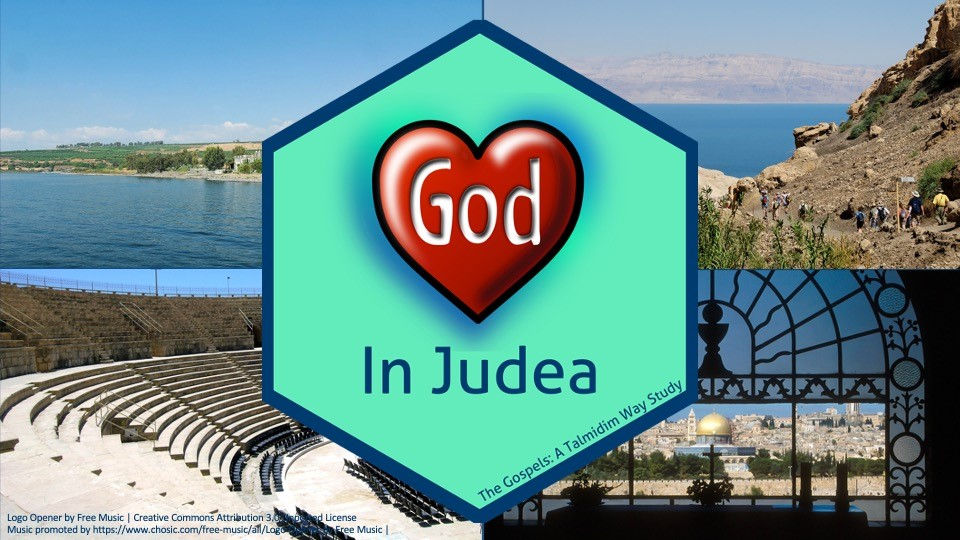

 

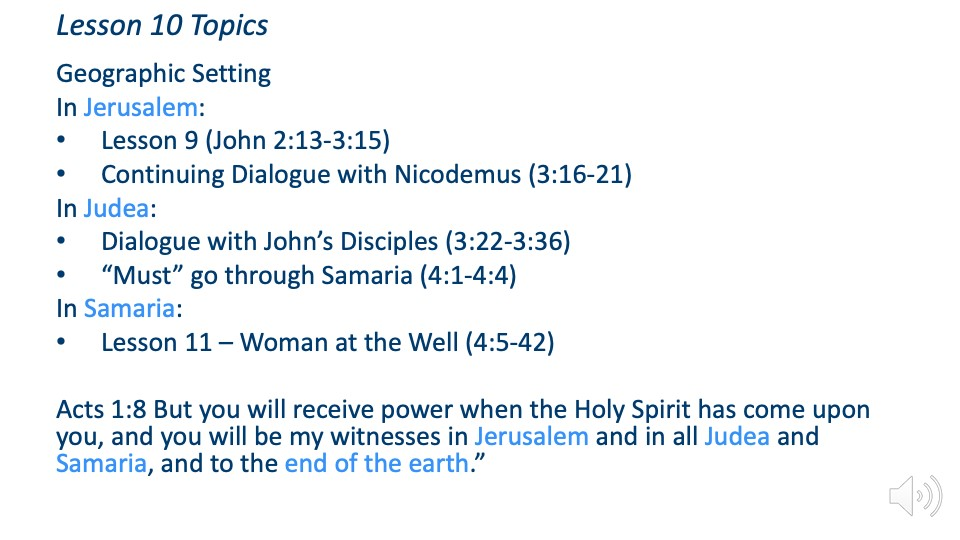

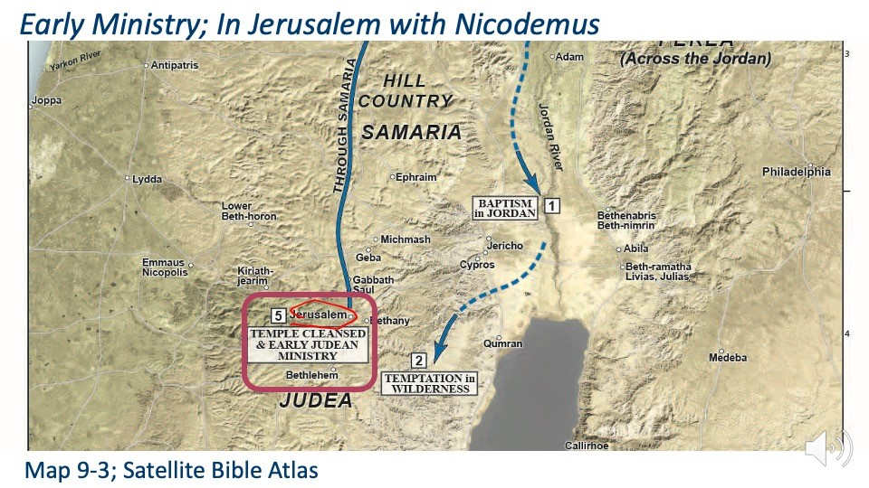

Some commentators see 3:16-21 as John the apostle writing his own commentary in summation of the Nicodemus dialogue. Others see the passage as Jesus’ own words, continuing the dialogue with Nicodemus. I would favor these being Jesus’ words, but I can see why people think they might be John’s there are certainly some similarities to passages such as chapter 1, which we know are John’s writings. Ultimately, we would say John is inspired by the Holy Spirit so we can be confident John 3:16 is from the mouth of God, even if not spoken by Jesus to Nicodemus.

What we don’t want to do is view John 3:16-21 as a separate thought.

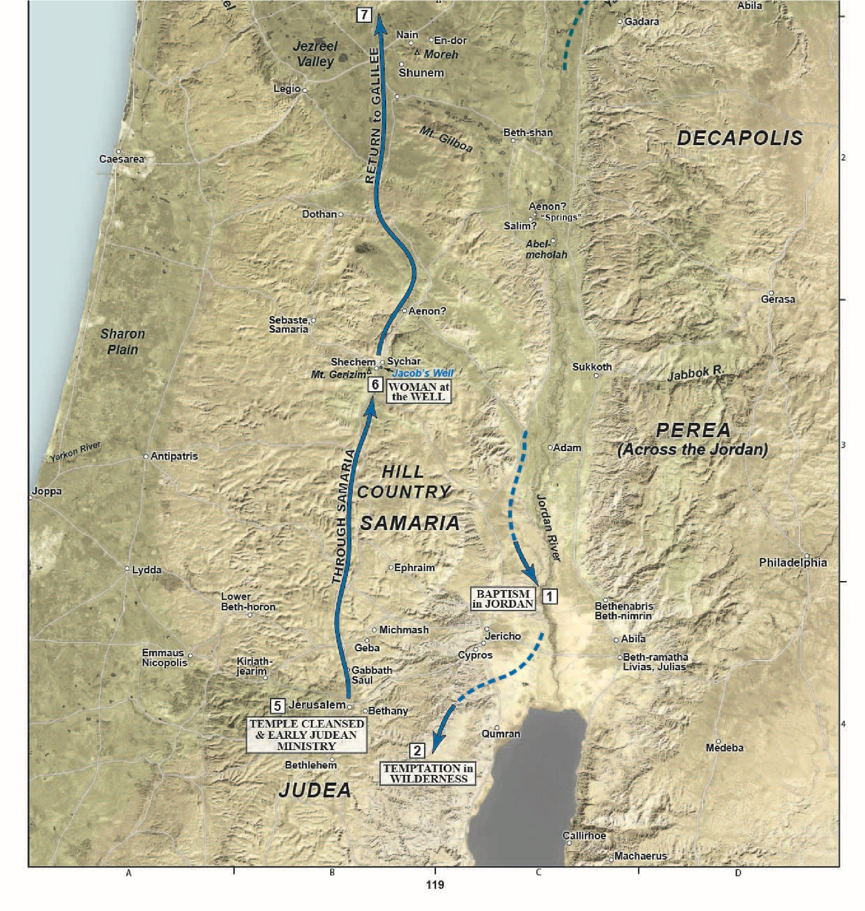

HAD to return to Galilee through Samaria. Usually Jews would avoid Samaritans and take the way down the mountain through Jericho then head north along the Jordan. This time, Jesus is going to head due north along the way of the patriarchs, the \<click\> same road Abraham, Isaac, and Jacob traveled when they needed to go north/south.

##  John 3:14-16

 

-   Jesus is still answering Nicodemus’ question, “how can these things be?”

-   “Only Son” recalls Genesis 22 and Abraham’s near offering of Isaac, where Isaac is called Abraham’s “only” (or “unique”) son.

-   John 3:16 is famous precisely because of the fact it requires no additional insight or commentary to understand.

-   “Son of God expresses the true nature of Jesus eternal and essential being. He is the LOGOS made flesh, the Son has emanated forth from God.” That’s a quote from Lancaster’s commentary.

-   Stern notes that while Matthew presents Jesus as coming for the lost sheep of Israel, John emphasies that Jesus has come to Jews and Gentiles alike.

> 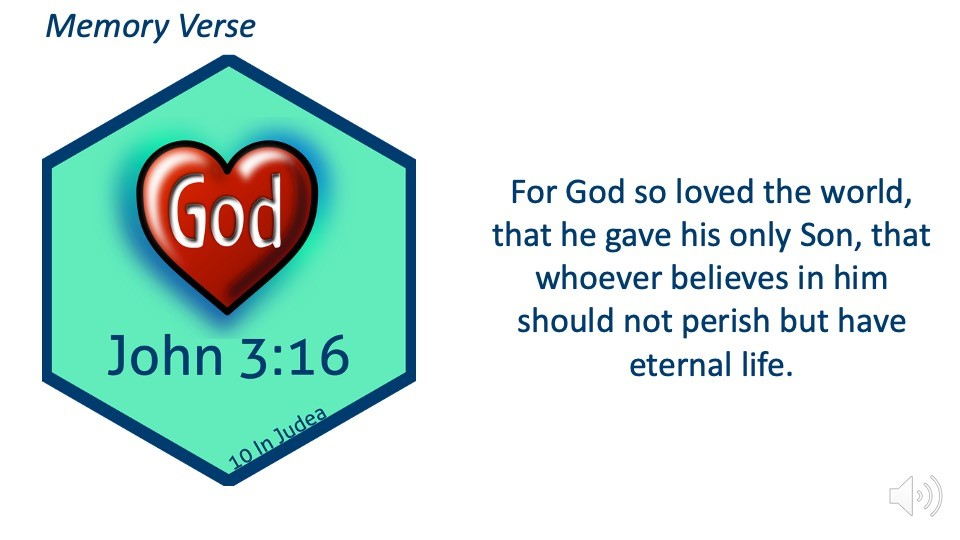

God loves His creation

He gives His creation that which is most precious to him.

Jesus is God’s unique son.

Jesus was fully aware that he would have to die.

Eternal suffering is punishment not only for the inevitable consequence of sin, but now, in rejecting God’s provision for that sin.

For the individual who trusts in Jesus, eternal life means not only in the future beyond the grave, but positive life now in Jesus – life more abundantly. – from David Stern.

Remember the Jewish concept of verbs is always tied to action. Belief is not mere intellectual acknowledgment, but a life that reflects a fundamental trust in and reliance on Jesus.

## John 3:17-18

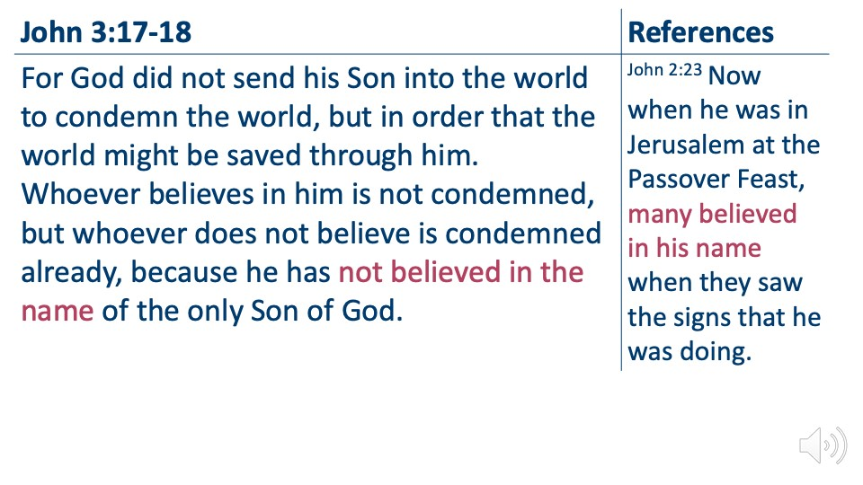 

-   There is a debate about whether 3:16-21 is Jesus still speaking to Nicodemus or whether the conversation ends at 3:15, and 16-21 is John’s commentary. 
- Supporters of the later view note the similarity between this passage (verse 18 for example) and John 1
- Either way, these words are powerful and for the most part, self-explanatory.
-   Note the tie-in to believing in His name in Chapter 2.
-   The first-coming was not to bring judgment. That is handled the second coming – read the book of Revelation for more information. 
- Remember this thought that he did not come to condemn when we get to the scene at the synagogue at Nazareth. Jesus is going to read from Isaiah 61 but He’s going to omit a line that turns out to be very telling in differentiating between the first and second comings.

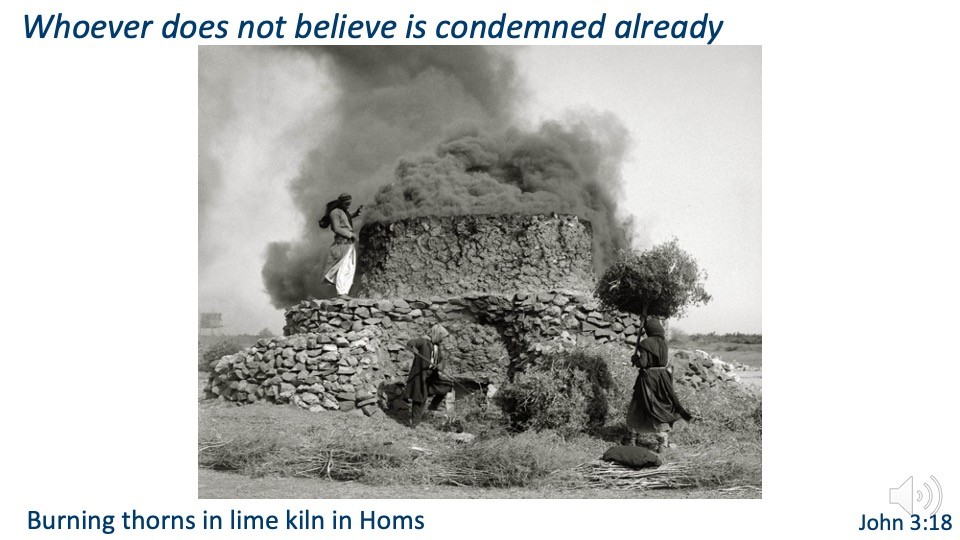 

John (or Jesus) is continuing to contrast light versus dark, innocent vs guilty, saved vs John 3:18 condemned (based on faith, not lineage or works), righteous versus wicked,

-   The Dead Sea scrolls also make these contrasts.

This American Colony photograph was taken between 1900 and 1920.

mat02208

##  John 3:19

Jesus is now compared to a light coming into the world, which certainly recalls Genesis 1:3-4. As we studied back in the first lesson, there are many parallels with John 1 and Genesis 1.

In Jesus’s day, the city would not have been as well-lit after dark. A quick Greek lesson – we often hear that the word “*agape*” means God’s perfect love. Jerusalem from the Mount of Olives at night (from the east)o o Verse 19 reads, men *agapao* the darkness...because their deeds are evil. o It’s better to think of Agape as to be totally and completely given over to.

>Are you totally and completely given over to God, or do we give part to God but save part for the world? 

• Note the design:

-   The passage begins with the dark heart (i.e. lies) of man and the meeting with Nicodemus is in the literal darkness.

-   The passage ends with the truth and light of God. o As a literary form, this type of bracketing is common.

-   Spiritually, John’s point is the believer passes from death to life; from darkness to light.

-   It’s easy to look at a verse like verse 19 and conclude that is only referring to people who reject God. Well, of course it is, but what we forget is that was you and me at one point. Our sin nature still agapao’s darkness rather than light.

tb031505530b

##  John 3:20-21

-   For those who agapao darkness, the last thing they want is to have their deeds exposed.
-   For disciples, who believe in the Son (John 3:16), this faith results in the believer moving into the light. Such belief is supposed to manifest in good deeds; thus the believer is unafraid to have the light expose righteous works.
    -   John 3:36 reiterates this thought of obedience. “Whoever believes in the Son has eternal life; whoever does not obey the Son shall not see life, but the wrath of God remains on him.
    -   The church at learge today teaches, “just believe and you’re in”. As if our faith is all boiled down to acknowledging a certain set of facts.
    -   True talmidim, Believe Him, walk with Him, and follow Him and OBEY him o Lancaster writes, “Belief in Him needs to result in repentance and turning towards God.”

 

* Nicodemus came with questions. Perhaps he initially left with More questions but God rewards a heart that seeks after Him.
* We know from John 7 and John 19 that Nicodemus was and is a believer. Despite his wealth and his status, His interview with Jesus changed His life forever. Nicodemus is one person I’m looking forward to meeting one day in the age to come.

mat14450h

John’s imprisonment is reported in Mat 14:3-12 and Mark 6:17-29.

-   There is some speculation that John the gospel writer is the unnamed Jew.

- The hills in the distance belong to Gilead, in the modern country of Jordan. The ponds in the distance reflect the availability of water from springs here and are used for raising fish.

-   The themes of purification, living water, spirit are throughout the early chapters of John.John 3:23

    -   Ch 1: waters of baptism

    -   Ch 2: stone jars of purification and cleansing/purifying of the temple o Ch 3: born of water and spirit and this discussion beginning with v. 22 o Ch 4: the Woman at the Well and the discussion of living water

    -   Ch 5: the false waters of the Asklepion of Bethesda versus the One who can bring true restoration and purification.

    -   There are also references to purification by water in chapters 7, 9 13, and 19.

-   Among many contrasts, John is pointing out that Jesus is the ceremonially pure one in contrast to the general world at large and the temple establishment in particular

tbs99019810

## John 3:26

John 4:2 is going to clarify that Jesus was not immersing but his talmidim were.

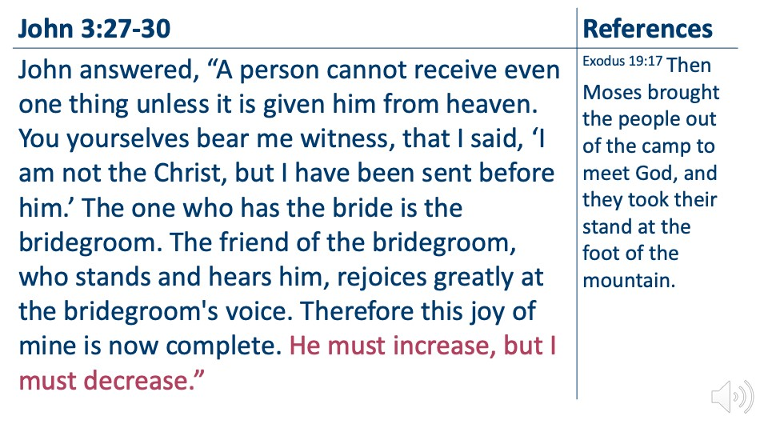

-   John describes his role in the form of a parable o Bride: Israel o Groom: Messiah o Friend: John

    -   Bringing the Bride to the Groom: John’s ministry of immersion and repentance

    -   Voice: Jesus’ call or Jesus going public with His ministry

    -   Meaning: “John’s role was only to prepare Israel for Messiah and then step aside.” (Lancaster, COM 247)

-   John did not want his own works to overshadow Jesus.

    -   While John’s and possibly Jesus’ disciples were beginning to form a Jordan River Rivalry, John is uninterested in the dispute.

    -   Not only is John NOT upset, he is joyful. Weddings are supposed to be joyful.

    -   **Lancaster suggests John is playing the role of Moses, who brings the bride (Israel) to meet the groom (God).**

-   Verse 30 is an important one for Talmidim. It’s not about us.

    -   If we are ambassadors for Jesus, we put His interests first and ours second.

> *Walking In His Dust*
>
> **Talmidim keep our eyes on God’s bigger picture.**
>
> *Ephesians 4:1-3*

I therefore, a prisoner for the

> Lord, urge you to walk in a manner worthy of the calling to

which you have been called, with

> all **humility** and **gentleness**, with **patience**, bearing with one

another in **love**, eager to

> maintain the **unity** of the Spirit in the bond of peace.

-   We see for a second time John’s humility. The first was when he allowed two of his disciples to switch teachers. The more we can keep our own pride and ego in check, the more the Light of Jesus can shine through us. The Ultimate goal is when people see us, they don’t see us, they see Jesus through us.

<table>
<colgroup>
<col style="width: 100%" />
</colgroup>
<thead>
<tr class="header">
<th><table>
<colgroup>
<col style="width: 84%" />
<col style="width: 15%" />
</colgroup>
<thead>
<tr class="header">
<th><blockquote>

<strong>John 3:31-33</strong>

</blockquote></th>
<th><blockquote>

<strong>References</strong>

</blockquote></th>
</tr>
</thead>
<tbody>
<tr class="odd">
<td></td>
<td><blockquote>

1 Corinthians 15:47-49 The first man

was from the earth, a man of dust; the second man is from heaven. As was the man of dust, so also are those who are of the dust, and as is the man of heaven, so also are those who are of heaven. Just as we have borne the image of the man of dust, we shall also bear the image of the man of heaven.

</blockquote></td>
</tr>
</tbody>
</table>

</th>
</tr>
</thead>
<tbody>
</tbody>
</table>

John now moves into a discourse comparing the earthly man vs the heavenly man. Paul framed this in terms of the first Adam vs the last adam.

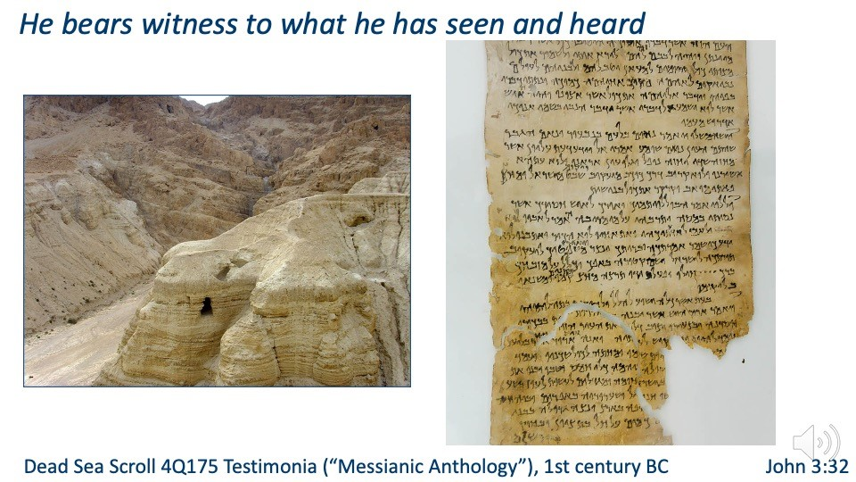Note the recurring themes of “witness,” “testimony,” and so forth. Discovered in Cave 4 of Qumran in the early 1950s, this text contains five biblical verses that focused on the coming of the Messiah. Cave 4 is the famous cave where many books of the Old Testament were found,

including a complete copy of Isaiah.Dead Sea Scroll 4Q175 Testimonia (“Messianic Anthology”), 1st century BC John 3:32

-   Here is another instance where John seemingly breaks off from quoting someone and adds his own commentary. This passage is a little clearer than John 3:16-21.

-   John 3:16 is clearly a continuation of the discussion with Nicodemus

-   Here, John is picking up the mystical discourse of the Preexistent One he established in Chapter 1.

-   As we’ve talked about before; John is focused with establishing (giving witness) to who Jesus is, whereas the other gospels focus on what jesus said, did and felt, respectively.

-   If the synoptic gospels say “the kingdom of heaven is at hand,” John is going to say “Light has come into the world,” because “light” is who Jesus is.

tb060108053

<table>
<colgroup>
<col style="width: 65%" />
<col style="width: 34%" />
</colgroup>
<thead>
<tr class="header">
<th><blockquote>

<strong>John 3:34-36</strong>

</blockquote></th>
<th><blockquote>

<strong>References</strong>

</blockquote></th>
</tr>
</thead>
<tbody>
<tr class="odd">
<td><blockquote>

Whoever receives his testimony sets his seal to this, that God is true. For he whom God has sent utters the words of God, for he gives the Spirit without measure. The Father loves the Son and has given all things into his hand.

Whoever believes in the Son has eternal life; whoever does not obey the Son shall not see life, but the wrath of God remains on him.

</blockquote></td>
<td><blockquote>

John 10:29 My Father, who has given them to me, is greater than all, and no one is able to snatch them out of the Father's hand.

Matthew 28:18 And Jesus came and said to them, “All authority in heaven and on earth has been given to me.

On wrath: Romans 1:182:8

</blockquote></td>
</tr>
</tbody>
</table>

-   Seal = authentication, like a notary’s stamp.

-   We take a passage such as “the spirit without measure” for granted, but it was not a simple topic in Jesus’ day.

    -   In Psalm 51, David could pray, “take not your Spirit from me.”

    -   If we have been sealed by the Spirit as described by the apostolic documents, we can NOT pray this prayer, nor would it ever occur to us to do so.

    -   In the Judaism of the day, only the righteous could merit the Spirit (in a grand sense, that is still true today).

    -   Again, the concept of authorization is present in John’s gospel. The Son is the fully authorized representative of the Father.

    -   For God to give the Spirit without measure would have been another seismic shift in their thinking.

    -   John, again stresses Jesus authority by saying the father has given all things \<read references\>

You can’t read the Bible and come up with multiple ways to salvation. Either believe in the Son and have eternal life, or disobey and experience God’s wrath. I suppose that makes us narrow minded.

#  John 4:1-4 References

> Now when Jesus learned that the *Pharisees* had heard that Jesus was making and baptizing more disciples than John (although Jesus himself did not baptize, but only his disciples), he left Judea and departed again for Galilee. And he had to pass through Samaria.

-   The chapter breaks can be most unfortunate because we subconsciously view them as a scene shift.

-   John needs to be read in one sitting because everything ties together.

-   The Son, who is the Father’s authenticated representative, gives the Spirit without measure.

-   Now the Son, is going to widen the people’s narrow view of who is eligible to receive the Spirit.

-   Jesus popularity was growing, but Jesus was not ready to go full throttle with public ministry in Judea, so he makes a strategic retreat back to Galilee. This is one reason I tend to see the overturning of the tables as occurring at the end of Jesus’ ministry, but John places it early to tell his version of the story. It seems odd that Jesus would have make spectical in Jerusalem, not caring who he angered, but then retreated here not wanting a confrontation. I might be wrong.

-   It’s also worth mentioning again that when John says “Pharisees” we need to remember that John uses this term very generically, to include herodians and sadducees as well as the party of the Pharisees. In other words, the whole religious establishment.

-   “We need to look closely at the context to decide whether we have Pharisees or Sadducees in view. There is a big difference,” writes Lancaster.

-   It’s like someone saying “the politicians” and we need to figure out whether they are liberal or conservative, corrupt or clean.

-   In this case, the Pharisees were all about having disciples and followers. They were all about the purity of the Law and as yet, Jesus had done nothing to arouse their suspicion. If overturning the tables had happened here, the Pharisees probably would have applauded.

26

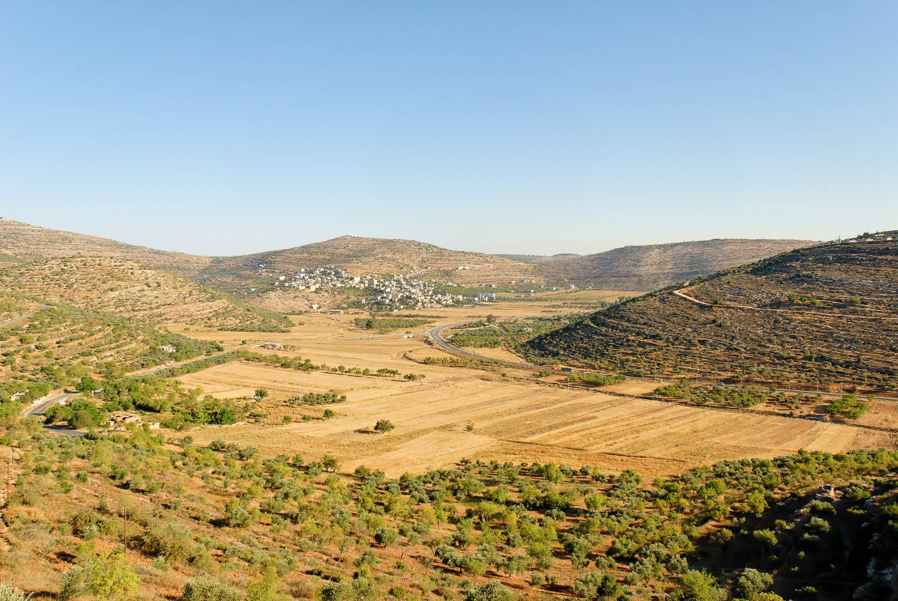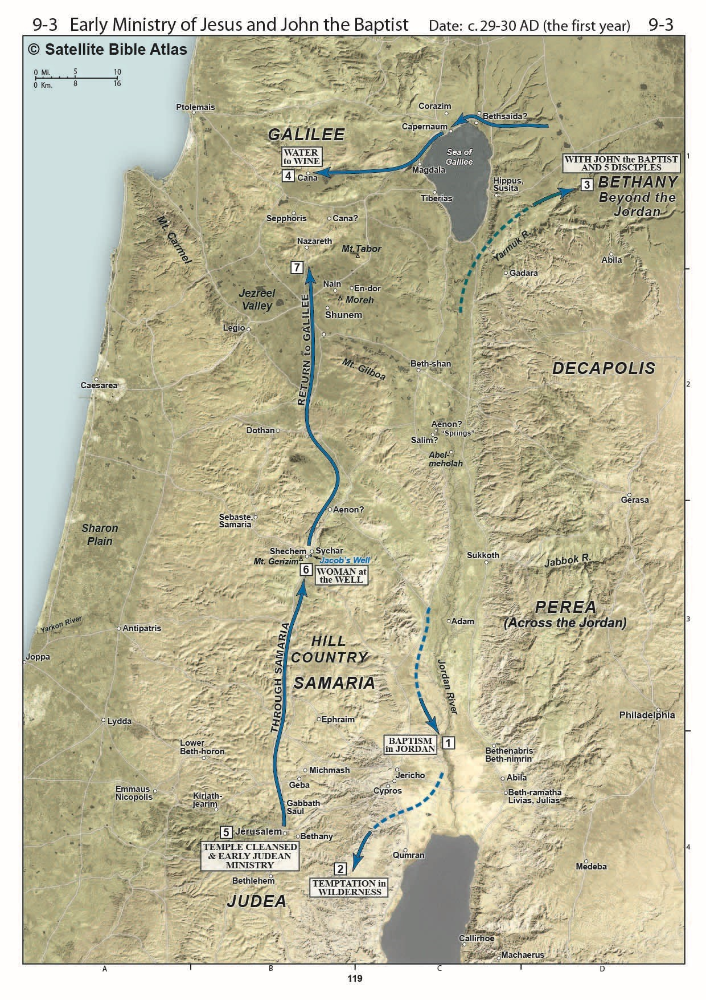

> 27

> 
>
> 29

