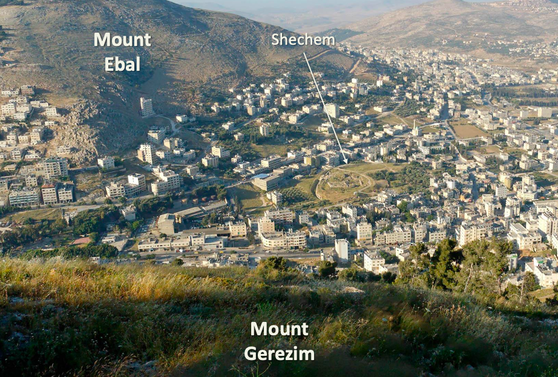
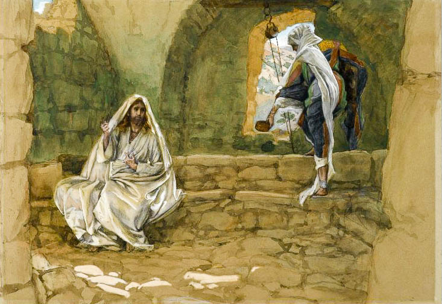
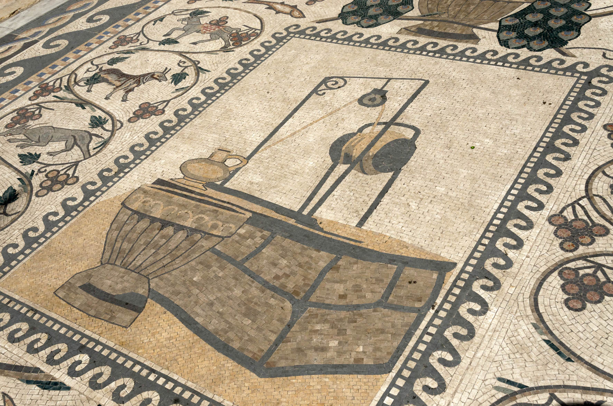
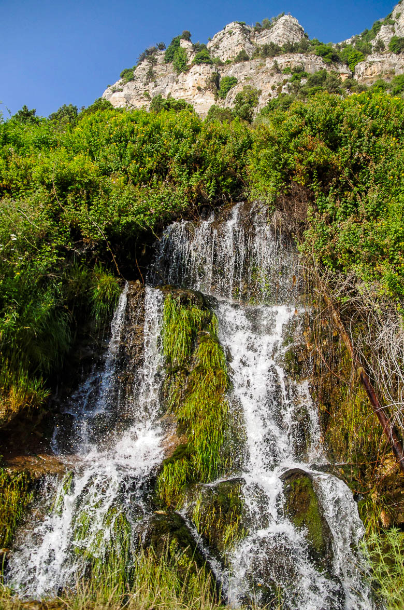



> IN SAMARIA follows Jesus as he leaves Jerusalem and make his way back north to Galilee. Yeshua elects to travel through Samaria, the most direct route to reach Nazareth. We stop at the village of Sychar where Yeshua encounters the Samaritan woman. His disciples return to their homes on the lake, Yeshua take us to Cana. An official from Capernaum travels to Cana to find Yeshua and to implore Him to heal his son.

### Videos

#### Verse-by-verse:


#### Shechem inSITES


#### Samaritans inSITES


### Introduction 

John 4 – In Samaria

## Berean Bingo

After 10 lessons, a terminology review might be helpful

<table>
<colgroup>
<col style="width: 18%" />
<col style="width: 23%" />
<col style="width: 21%" />
<col style="width: 35%" />
</colgroup>
<thead>
<tr class="header">
<th>Term</th>
<th>Meaning</th>
<th>Example</th>
<th>Explanation</th>
</tr>
</thead>
<tbody>
<tr class="odd">
<td>Anachronism</td>
<td>Misappropriating concepts in time.</td>
<td>“Paul came to cast off Judaism and convert to Christianity.”</td>
<td>Gentile Christianity as a distinct religion from Judaism would not begin until the late 1st century and, arguably was not completed until Constantine. Also, a careful reading of Acts indicates that Paul remained a Torah-observant Jew and considered himself a Pharisee.</td>
</tr>
<tr class="even">
<td>Bicameral Thinking</td>
<td>
Evaluating two (or more) opposing but seemingly plausible viewpoints and drawing biblical application regardless of which one is factual.

Bicameral thinking forces us to be Bereans and look at a matter from a different perspective. We may even find that one (or both) viewpoints may be invalid and we must come up with a fresh hypothesis.
</td>
<td>"You have had five husbands and the man you have now is not your husband.  What you have said is quite correct."</td>
<td>
“The woman at the well was steeped in sin and was being snotty and disrespectful. Jesus calls out her sin to set her straight.”

Or

“The woman had an extraordinarily hard life with multiple husbands abandoning her despite being well educated in Samaritan religion. Jesus is showing her compassion because He is the God who Sees (El Roi - Genesis 16).”
</td>
</tr>
<tr class="odd">
<td>Eisegesis</td>
<td>Reading external presuppositions into the biblical text.</td>
<td>“The woman at the well was being snotty and disrespectful.”</td>
<td>If our presupposition is that the Gospel writers communicated “Judaism bad, Christianity good,” this viewpoint is going to influence our interpretations, even though a plain reading of the text may not support our conclusions.</td>
</tr>
<tr class="even">
<td>Exegesis</td>
<td>Letting the text speak for itself.</td>
<td>“Jesus and the woman were engaged in a sophisticated theological discussion.”</td>
<td>The text supports the Samaritan woman was reasonably well educated in matters of Torah, at least as practiced by Samaritans. The text also supports that Jesus is instructing her that Judaism is the more correct way.</td>
</tr>
<tr class="odd">
<td>Macro-narrative</td>
<td>Larger themes that emerge above the individual stories</td>
<td>"How is that you, a <i>Ioidaiois</i>..."</td>
<td>Here, the woman is identifying Jesus as a Jew.  Later, Pilate will also identify Jesus as a Jew. This is something the Jewish leadership never does. Thus, one of John's macro-narratives is authentication.  Those who should have authenticated Jesus did not; those who should not have authenticated Him, actually do authenticate Him.</td>
</tr>
<tr class="even">
<td>Presuppositions</td>
<td>Our assumptions we bring with us as we read the text, including those not directly supported by the text.</td>
<td>"Sir,  you have nothing to draw with."</td>
<td>If we view the woman as snotty and sarcastic, we're potentially going to view this passage as combative.  If we take a view that the woman is a sinner, no better or worse than the rest of us and she's merely having a discussion with Jesus on par with the one Nicodemus had, we're going to have a different view of the passage.</td>
</tbody>
</table>

## Geography

We’ve done a separate background video on the Samaritans where we briefly touch on the Jewish/Samaritan tensions and explore what lessons this may have for us today.

Jews tended to avoid Samaria and taking the long way around when traveling to/from Jerusalem. This makes the statement that Jesus “had to pass through Samaria” startling.

In John’s view, God so loved the world, which even included Samaritans. The path of travel is unusual because this is no ordinary love. Jesus can take us to strange, perhaps hostile and heretical, territory to shine His light of truth if we let Him lead us.

[^1]

### Mt. Gerezim/Shechem

The setting for John 4 is Sychar, which is adjacent to Jacob’s well and Shechem. We also have a separate insites video on Shechem, but the big thing to know is that Shechem is flanked by two mountains Mt. Ebal, which is where God commanded the curses to be read and Mt. Gerezim, which is where the blessings were read. Both the woman and Jesus will reference “this mountain.” They are referring to Mt. Gerezim, which was the holy place for the Samaritans (in contrast to Mt. Zion/Jerusalem which is sacred to Jews).

## An Acts 17:11 Rereading a beloved Story

-   In the vast majority of commentaries, the woman at the well as assumed to be one of lose morals.

-   Theis is based on the “five husbands and the one you have now is not your husband” comment by Jesus

-   Even though the text doesn’t directly say this, it’s easy to conclude that the woman is a fallen, meaning sexually promiscuous.

-   Most of us have come to accept this conclusion at face value, because it’s what we’ve all been taught (myself included).

-   We must be aware that this view is going to color our interpretation of the entire passage.

-   But what if there is another explanation for the “five husbands” statement one that sees the woman in a far more charitable view? Our understanding of the woman would completely change.

-   In his commentary on the gospel of John, Messianic scholar Dr. Eli Lizorkin presents us with an alternate way to read the story of the Samaritan woman at the well, particularly verses 10-20.

-   I want to present that here and then ask that we be Bereans and test the theory to see whether it can be supported by Scripture and the context.

-   If you find yourself saying, “that’s not right” first of all that’s good. Never ever take my word for it. Ask whether the “immoral woman” conclusion is something you’ve always been taught or something you’ve checked out for yourself. For most of us, it’s probably the former.

-   We’re going to dive into Lizorkin’s theory, not because I’m convinced it’s right in every detail but I think it provides one of the clearest examples of someone who is being a Berean and not afraid to swim against the current of mainstream commentators. There are a lot of lessons there for us.

-   For the sake of discussion, let’s not assume the worst about this woman.

-    At the end of the day I like what Dr. Bob Cargill, who is a professor of archaeology at Iowa university and editor-in-chief of Biblical Archaeology Review, says in his courses.

-   “My job is not to **tell you** what to think. My job is to **get** you to think.” As much as possible, we should not automatically accept someone else’s conclusion without doing our own homework. TO me that is the essence of Acts 17:11.

## John 4:5-8: In Sychar at Noon with Joseph

> So He came to a city of Samaria called Sychar, near the parcel of land that Jacob gave to his son Joseph; and Jacob’s well was there. So Jesus, tired from His journey, was just sitting by the well. It was about the sixth hour. A woman of Samaria came to draw water. Jesus said to her, “Give Me a drink.” For His disciples had gone away to the city to buy food.
>
> [^2]

### Alternate views/questions

-   The sixth hour is around noon.

-   Many commentators make the time of day a big deal.

-   “Only a fallen woman would be out in the heat of the day.”

-   Some immediate problems:

-   Noon is not the hottest part of the day, which is usually between 2-4.

-   Yes, it’s true the Bible says the evening time is when women go out to draw water (Genesis 24:11); but Genesis 29:7 tells us Rachael was at her well at an unusual time.

-   There might have been any number of reasons besides being “loose” that might have resulted in her being alone at midday.

-   Rachael, as the mother of Joseph, could be another unspoken witness, as she too suffered; first with infertility then she died while giving birth to Benjamin.

-   We don’t even know that this meeting took place in warm weather. McGee and others suggest this took place in late December, making the temperature during the warmest part of the day irrelevant.

-   (right about now, if you’re thinking of counter arguments to defend why the Samaritan woman IS a loose woman, good! It means you’re thinking critically about it.)

### Background

-   They may have been journeying for six hours, depending on when the daybreak was. We can miss Jesus’ humanity. He got tired and hungry, just like the rest of us. “The Chosen” does a great job at portraying His humanity.

-   Sychar was either immediately adjacent to Shechem, or potentially it was an alternate name for Shechem itself. We talk about this more in our Shechem inSITES video.

-   We are relatively confident the site of Jacob’s well venerated today is historically accurate, even though it’s not directly stated in Genesis that Jacob did so.

-   Protestants tend to discount the concept of holy sites, but most of the rest of the world – other traditions within Christianity as well as other religions- has sites that are sacred to their faith.

-   Joseph: What a normal reader might miss is, as Lizorkin phrases it, a silent witness is present for this discussion: the bones of Joseph.[^3]

-   The woman’s life of suffering parallels Joseph’s in many respects.

-   Just as Joseph’s suffering brought salvation to Israel, so will the woman’s suffering ultimately bring salvation to the Samaritans.

-   If she’s alone at the well because she’s excluded from society, later we’re going to see that she’s actually not excluded from society.

-   It seems unlikely that such a woman would have gone in bragging that she met someone who told her all she ever did and that causes the entire village to turn to Jesus; but we’ll get to that in due time.

-   It is more likely that by mentioning the time of day, John intended for us to contrast Nicodemus coming at night versus draw some conclusion about the woman’s morals.

-   What we do know is a man asking for a drink from a woman, not his wife, was highly irregular; Keener suggests it could have been interpreted as flirting with her although based on her responses, it doesn’t seem that she interpreted it this way.

-   It’s true that well encounters between a male and a female sometimes led to marriage (e.g. Gen 24); if that is the type being employed here, Jesus would be talking about our supernatural marriage to Him; not a physical marriage.

-   Remember that this is a tradition or a societal norm Jesus is supposedly violating, not a commandment in the Torah.

-   He’s breaking down man’s walls and divisions, not violating God’s standards.

-   Jesus could not have violated any commandments and still legitimately claimed to be the Messiah.

-   In fact, there are at least three norms Jesus is breaking:

-   Talking with an unmarried woman

-   Associating with a sworn enemy of the Jews

-   Touching something His culture (but not the Bible) defined as “unclean,” including dining with Samaritans.

-   Jesus comes to her empty handed and needs her help

-   Bailey: “Jesus humbles himself and need her (help). Jesus does not establish the relationship by explaining how she needs Him and His message. That will come later.”[^4]

## John 4:9 The Woman appears startled by the breach of etiquette

> So the Samaritan woman said to Him, “How is it that You, though You are a Ioudaios, are asking me for a drink, though I am a Samaritan woman?” (For Ioudaioi do not associate with Samaritans.)

[^5]

-   In the beginning stages of this drama, they’re dancing around each other like two boxers might. Neither one is directly responding to the other.

-   It can be hard for us to be vulnerable, particularly to a stranger. Small talk is much safer.

-   The woman is, understandably, fixated on the NUMEROUS differences between herself and this Jewish stranger by the well.

-   She knows that Jews would consider her waterpot unclean

-   NIV has a footnote for “do not associate” as “do not use dishes Samaritans have used.”

-   Again a macro-narrative in John – the Jewish leadership refuses to acknowledge Jesus’ Jewishness; yet many others do, including Pilate in John 18.

-   How did she know he was Jewish?

-   Probably because he dressed like one; most likely, this included a tallit, which somehow was different from the garments of Samaritans.

-   He probably had an accent which though Galilean, would have set Him apart as a Jew.

-   Do we imagine Jesus looked, talked, and dressed like a traditional Jew or is he a blond haired, blue eyed Jesus? In other words, do we make God in our image?

-   The Talmud records that Jews consider Samaritans unclean and whatever they touch is unclean. Likely the reverse is true.

-   The words on the page probably do not adequately capture the fact that she has to be absolutely stunned by this conversation; and it’s just getting started.

-   Even a Samaritan waterpot is unclean to Jews – Believe it or not the pot has a critical supporting actor role in this drama.

## John 4:10: Mayim Chayim

> Jesus replied to her, “If you knew the gift of God, and who it is who is saying to you, ‘Give Me a drink,’ you would have asked Him, and He would have given you living water.”

[^6]

-   Jesus/John continue the macro-narrative of natural water versus the Spirit, here called mayim chayiim, living water.

-   This started in chapter 1 with Jesus’ water baptism and the spirit descending.

-   In chapter 2 we had the ceremonial water, mystically turn to wine.

-   In chapter 3, Nicodemus was told he had to be born of the spirit.

-   In chapter 5, the man will seek physical healing from the waters of Bethesda but Jesus will heal both physically and spiritually.

-   In Jewish thought, Mayim Chayim was free-flowing fresh water untouched by human hands.

-   If you filled your swim’pool (as they say in Texas) with rainwater, it would be Mayim Chayim; if you filled it from a hose, it would not.

-   Well water was NOT Mayim Chayim.

-   Jesus is taking the concept and expanding it.

-   We think of “living water” as eternal life but Jesus is likely referring both to His teaching as well as spiritual regeneration.

-   Technically Jesus is not saying he IS the Mayim Chayim; He must give it.

-   This appears to be a similar statement to telling Nicodemus he must be born again.

-   In other words, a tease, or cryptic introduction not intended to be immediately understood.

## John 4:11-12 Are you greater than Jacob?

> She said to Him, “Sir, You have no bucket and the well is deep; where then do You get this living water? “You are not greater than our father Jacob, are You, who gave us the well and drank of it himself, and his sons and his cattle?”

[^7]

### Alternate view

-   This is often described as the woman mocking Jesus’ perceived inability to provide a drop of water, let alone this “living water.”

-   Samaritan or no, I believe it highly unlikely a woman would have spoken this way to a man in that culture.

-   We need to be careful about reading things like sarcasm into the text; we do not have any clue as to tone, voice inflection, or body language.

-   A lawyer might say “objection; calls for speculation.”

### Background

-   This appears to be a parallel to Nicodemus’ statement “how can one be born when He is old?”

-   Perhaps the woman is clueless.

-   Perhaps we don’t give her enough credit for being spiritually sophisticated.

-   Jesus sought her out and He does not cast his pearls before swine.

-   The waterpot plot thickens. Here she believes she has something Jesus does not, possibly symbolic of her view that Samaritans are superior to Jews. Watch what happens to her pot by the end of the story.

-   Note the reference to Jacob; both sides claimed authority from their lineage from Jacob (just as Jews, Muslims, and Christians each draw authority from Abraham).

-   It’s possible she’s asserting Samaritan superiority with this comment, reminding her Jewish visitor that the patriarchs were in Shechem constantly, whereas Jerusalem is only indirectly mentioned in the Torah.

-   Lancaster sees this as her now catching on to the fact that Jesus was hinting at something supernatural.[^8]

-   Jesus of course is greater than Jacob, just as He is greater than Abraham and Moses.

## John 4:13-14

> Jesus answered and said to her, “Everyone who drinks of this water will be thirsty again; but whoever drinks of the water that I will give him shall never be thirsty; but the water that I will give him will become in him a fountain of water springing up to eternal life.”

### Alternate view

-   Many commentators see this as a sharply worded rebuke of the woman’s repeated insolence.

-   It is possible to read this as a plain statement, just as with Nicodemus.

-   In either case, Jesus is highlighting her deficiency; which was the same as our deficiency before we came into a relationship with Him.

## John 4:15

> 15 The woman said to Him, “Sir, give me this water so that I will not be thirsty, nor come all the way here to draw water.”

-   Alternate view: Many commentators see her as scoffing, but I see nothing in the text that supports this.

-   Perhaps she is thinking he’s talking about a limitless supply of literal water; at this point I doubt it.

-   I see her as curious, wanting to know more, but not fully understanding, or perhaps responding with hyperbole (Like Nicodemus’ “reenter the womb” question).

-   She’s inviting Jesus to elaborate – remember her question that’s on the table: “Are you greater than our father Jacob?”

## John 4:16-19

> 16 He said to her, “Go, call your husband and come here.” The woman answered and said to Him, “I have no husband.” Jesus said to her, “You have correctly said, ‘I have no husband’; for you have had five husbands, and the one whom you now have is not your husband; this which you have said is true.” The woman said to Him, “Sir, I perceive that You are a prophet.

### Alternate

-   The main question for us is: Is Jesus sharply rebuking the woman and calling out her sin for the world to see, or perhaps is he saying he knows all about her pain?

-   Which would be the more consistent behavior from Jesus?

-   Is there another location where he calls out a broken sinner and “nails her to the cross of justice,” as commentators suggest He is doing with the Samaritan woman?

-   He calls out people who claim to be following the truth but aren’t living like it – the Samaritan woman is not in this category.

-   Is she rudely trying to change the subject, or could she be taking it all in and factually stating that only a prophet (remember, Samaritans didn’t believe in any prophet besides Moses) would know such things and is now on board with the spiritual discussion?

-   Think about it. If some stranger had exposed your sin, wouldn’t you say “ok then. I ‘ll see you around.” I would. She didn’t.

-   Being Bereans, how else might we interpret “five husbands?

-   Husbands die (Ruth remarried for example).

-   Maybe the men left her.

-   Rachel connection to infertility.

-   The “man you have now” could be a relative because no one else will take her in

-   John 5 “I *<u>have</u>* no man to help me” is obviously not sexual.

-   I’m not saying the fallen woman premise is wrong; I’m saying I don’t know. Since I don’t know, I refuse to assume the worst about her.

-   What if Jesus is actually saying: “In answer to your question, yes; I am greater than Jacob. I am the God who sees you (Genesis 16). I know all about you and the pain you have endured. You think I’m Jewish so I don’t care about you because you’re a Samaritan, but I do.”

### Background

-   “Go call your husband” sounds like “go to my brothers” (John 20:17). A woman will become a witness to a man.

-   In other words, “in answer to your question, yes; I am greater than Jacob. I know all about you and the pain you have endured. You think I’m Jewish so I don’t care, but I do.”

-   And by the way, this could have been Jesus’ intent even if we assume she was sexually promiscuous - .

-   Another way to paraphrase the “prophet” comment: “Ok you are greater than Jacob, but are you who I think you are?”

-   I think in the back of her mind, she’s wondering if this is the Samaritan Messiah but things aren’t adding up…not yet.

-   For still another interpretation, Dobson notes, “Josephus claimed Samaritans worshipped five gods as their ancestors had (see 2 Kings 17:24-34)”[^9] while claiming allegiance to the one true god.

-   Five husbands = five false gods

-   One you have now = The god you’re worshipping now, the one you claim to be the God of Israel, isn’t the TRUE God of Israel.

-   In a way, if this theory is true, then the transition to the mountain discussion is seamless and not a change of subject at all.

-   Acts 17:11

## John 4:20-21: Which mountain?

> “Our fathers worshiped on this mountain, and yet you Ioudaioi say that in Jerusalem is the place where one must worship.” Jesus said to her, “Believe Me, woman, that a time is coming when you will worship the Father neither on this mountain nor in Jerusalem.

[^10]

### Alternate View

-   IF she rudely changes the subject, Jesus does not seem to care.

-   Since Jesus doesn’t seem to mind, I don’t see why we should make a big deal of it.

-   He engages with her in this theological discussion.

-   Let’s assume the traditional interpretation that she burned through her husbands because she had loose morals. Don’t you and I have things in our past that we’re not proud of? Jesus is moving on from that to talk about something much more important; a proper relationship with Him.

### Background

-   “This mountain” = Mt. Gerizim.

-   Mt. Gerizim is another silent witness, the mount of blessings.

-   Jesus and the woman could have seen mount Gerizim as they talked

-   I enjoy studying holy land geography, but this verse is a reminder that we don’t venerate sites.

-   Biblical sites are signs that point to God and give us insights into His word.

-   As we talked about in our Samaritans video, Mt. Gerizim vs Mt. Zion was symbolic of the friction between Samaritans and Jews.

-   Competing holy sites is fairly common; even protestants get in on the action with the Garden Tomb versus the Catholic/Orthodox Church of the Holy Sepulcher.

-   It’s important to note that Jesus LOVES Jerusalem,

-   He is about to affirm the Jewish position, which includes a body of Scripture with hundreds of verses on the sanctity of Jerusalem.

-   We should not read any type of Replacement Theology interpretation.

-   He may be foreseeing the destruction in AD 70, but this is not the same as saying Jerusalem is irrelevant.

## John 4:22-24 – Salvation is from the Ioudaioi

> “You Samaritans worship what you do not know; we worship what we do know, because salvation is from the Ioudaioi. “But a time is coming, and even now has arrived, when the true worshipers will worship the Father in spirit and truth; for such people the Father seeks to be His worshipers. “God is spirit, and those who worship Him must worship in spirit and truth.”

[^11]

-   Salvation from the Ioudaioi is a striking statement given how often Ioudaioi are painted negatively in John’s gospel.

-   Jesus is endorsing the Jewish side of the argument, but, in his internal discussions with other Jews, He has many issues with the practice of the Jewish faith and how it strayed far from what God intended. Don’t get smug: He does that with 5/7 churches in Revelation – instead of man-made practices creeping in over hundreds of years, the late first Century church was only about 60 years removed from Jesus ministry – and they were still straying off course. How much more so are we at risk?

-   Being “mostly scriptural” is not an option.

-   Just because you say you worship the God of Israel, doesn’t mean you actually are – remember the scary phrase “depart from me, I never knew you.”

-   She was probably as stunned by this statement as Nicodemus was when he was told to be born again.

-   In her mind, Jesus’ answer is impossible; there is a third mountain: Mt. Gerezim; Mt. Zion, and the Mt. of Spirit and Truth.

-   She was caught in a false dichotomy, believing that there are only two choices, and only one of those is the right one.

-   It would be a rabbit trail to discuss the false dichotomies the world tries to present us with and make us choose.

-   We need to seek Jesus’ way. He isn’t interested in winning arguments.

-   Keener: Jesus establishes “the correctness of the Jewish position, although He does not allow that to remain as an ultimate barrier to reconciliation.”[^12]

-   He is laying the foundation for other non-Jews, i.e. gentiles, to be grafted-in to the correct ways of the Ioudaioi.

-   A time is coming: the fulfillment of the Messianic kingdom is still future;

-   A time now is: events to inaugurate the Messianic kingdom are in motion.

## John 4:25-26: You’re the Messiah, aren’t You?

> The woman said to Him, “I know that Messiah is coming (He who is called Christ); when that One comes, He will declare all things to us.” Jesus said to her, “I am He, the One speaking to you.”

-   Lancaster suspects she may be politely trying to end the conversation here.

-   This statement reminds me of Nicodemus saying “Rabbi, we know you have come from God.”

-   Just as I saw Nicodemus asking Jesus to confirm whether He was the Messiah, I think the woman is possibly doing the same thing here.

-   “You’re the Messiah, aren’t you?”

-   Jesus answers with an emphatic yes with one of John’s famous “I am” statements in John that establish Jesus as the great I AM.

-   As Samaritans reject the books we categorize as “the prophets,” she had to draw this conclusion from the Torah only.

-   Since they both shared the Torah, Messiah thus is a shared concept between Jews and Samaritans.

-   One view of the Samaritan Taheb is that of a “restorer.” They interpret it as their Messiah will restore Samaritan preeminence. Jesus is a completely different kind of restorer.

### 10 I AM statements in John

-   John 4:26 – I AM He (the Messiah)

-   John 6:35 – I AM the Bread of Life

-   John 8:12 – I AM the Light of the World

-   John 8:58 – Before Abraham was, I AM

-   John 10:7 – I AM the gate

-   John 10:11 – I AM the Good Shepherd

-   John 11:25 – I AM the Resurrection and the Life

-   John 14:6 – I AM the Way, Truth, Life

-   John 15:1 – I AM the True Vine

-   John 18:5 – I AM He (Yeshua of Nazareth)

## John 4:27: Disciples amazed at the Breach of Protocol

> And at this point, His disciples came, and they were amazed that He had been speaking with a woman, yet no one said, “What are You seeking?” or, “Why are You speaking with her?”

-   At a few points, John gives a clue to what the disciples were thinking (or at least what *he* was thinking) but not saying at the time.

-   John 21 is another example: “none of them dared ask who it was; they knew it was the LORD.”

-   Understandably they were shocked by this apparent breach of protocol.

-   The text says they were surprised at His speaking with a woman; they were probably equally surprised that He was speaking with a Samaritan.

## John 4:28-30: Leaving your waterpot behind

> So the woman left her waterpot and went into the city, and said to the people, “Come, see a Man who told me all the things that I have done; this is not the Christ, is He?” They left the city and were coming to Him.

### Waterpot left

[^13]

-   I like to read a story and ask, “why is that there?”

-   The bit about the waterpot seems irrelevant – if the text had said, “so the woman went into the city and said…,” we wouldn’t think anything of it.

-   As we mentioned above, the waterpot was symbolic of the divide between Jews and Samaritans. She’s leaving that behind (literally and figuratively at Jesus’ feet) in addition to her former life of pain and misery.

-   Jesus’ living water has replaced the water of Jacob’s well.” – Keener[^14]

-   What is the waterpot that you need to leave behind?

-   *Walking In His Dust* **Talmidim leave our pain and brokenness at Jesus’ feet**

-   Colossians 1:13-14

-   For He **rescued** us from the domain of darkness, and **transferred** us to the kingdom of His beloved Son, in whom we have **redemption**, the **forgiveness** of sins.

### Alternate View

-   This verse is critical to our alternate hypothesis.

-   If we already have a preconceived notion about the woman, then we probably read “everything I ever did” as a list of her sinful acts.

-   A fallen woman probably would not brag about someone exposing a list of her sinful acts.

-   The townsfolk likely would not care what a fallen woman said, yet they respond to her invitation. In general, the testimony of a woman was not well regarded.

-   One commentator suggests that she went to the men of the town and not the women because she’d had sex with all the men.

-   Not only is there no support in the Bible for this position, but it also betrays a heart filled with negativity, cynicism, and condemnation of others.

-   Let us not be like this!

-   Thus a nuance of “He knows everything about me,” seems to fit the context better.

## Conclusion

-   John arranged this to intentionally follow John 3:16 – God So loved the world. Salvation is from the Jews but salvation is not limited to Jewish people (neither are they excluded)

-   This chapter demonstrates the difficulty in interpreting a Bible passage.

-   We’re thousands of years and thousands of miles away from when and where these events happened.

    -   Lizorkin: “We bring our past, our preconceived notions, our already formed theology, our cultural blind spots, our social standing, our gender, our political views and many other influences to our interpretation.”[^15]

    -   When we challenge popular commentaries it’s not about being contrarian as much as it is an attempt to enrich our understanding by gaining a different perspective, similar to viewing a work of art from an angle as opposed to directly in front.

    -   It’s also not personal to anyone who holds these views, most of whom are smarter and more spiritual than I will ever be.

    -   Bereans receive teaching and search the scriptures to see whether these things be so. If we simply accept a given interpretation without grappling with it, we aren’t being good Bereans.

-   Jesus knocked down much bigger walls than Joshua did when He entered Samaria.

    -   Keener: “Jesus crosses strict cultural boundaries separating races, genders, and moral status, pointing to the new and ultimate unity in the Spirit. (What he did) would be roughly equivalent to defying segregation in the United States during the 1950s…shocking, extremely difficult, somewhat dangerous. The Jesus of the Gospels is more concerned with people than with custom.”[^16]

-   Amos 9:11-15 speaks of eventual restoration of the Tent of David, meaning a time when the nation was united north/Israel and south/Judah.

-   We’ll pick up next time with a phrase that is mentioned in all four gospels: “A prophet has no honor in his own hometown.”

### 

Bailey, Kenneth E. *Jesus Through Middle Eastern Eyes: Cultural Studies in the Gospels*. Kindle. Downers Grove, Ill: IVP Academic, 2008.

Bolen, Todd. “John 4.” PowerPoint presentation presented at the Photo Companion to the Bible: John, Santa Clarita, CA, 2018.

Dobson, Kent. “Study Notes.” In *NIV, First-Century Study Bible*, Kindle. Zondervan, 2014.

Keener, Craig S. *The IVP Bible Background Commentary: New Testament*. 2nd edition (E-Sword). Downers Grove, Illinois: IVP Academic, 2014.

Lancaster, D. Thomas. *Chronicles of the Messiah*. Edited by Boaz Michael and Stephen D. Lancaster. 2nd ed. 6 vols. Torah Club. Marshfield, MO: First Fruits of Zion, 2014.

Lizorkin-Eyzenberg, Eli. *The Jewish Gospel of John: Discovering Jesus, King of All Israel*. Edited by Ronald S. Weinbaum. Jewish Studies for Christians, 2015.

[^1]: Todd Bolen, “John 4” (PowerPoint presentation, Photo Companion to the Bible: John, Santa Clarita, CA, 2018).

[^2]: Bolen.

[^3]: Eli Lizorkin-Eyzenberg, *The Jewish Gospel of John: Discovering Jesus, King of All Israel*, ed. Ronald S. Weinbaum (Jewish Studies for Christians, 2015), 42.

[^4]: Kenneth E. Bailey, *Jesus Through Middle Eastern Eyes: Cultural Studies in the Gospels*, Kindle (Downers Grove, Ill: IVP Academic, 2008), 210.

[^5]: Bolen, “John 4,” fig. tb43007215.

[^6]: Bolen, loc. John 4:10.

[^7]: Bolen, loc. John 4:11.

[^8]: D. Thomas Lancaster, *Chronicles of the Messiah*, ed. Boaz Michael and Stephen D. Lancaster, 2nd ed., 6 vols., Torah Club (Marshfield, MO: First Fruits of Zion, 2014).

[^9]: Kent Dobson, “Study Notes,” in *NIV, First-Century Study Bible*, Kindle (Zondervan, 2014), loc. John 4:18.

[^10]: Bolen, “John 4,” loc. John 4:20.

[^11]: Bolen, loc. John 4:22.

[^12]: Craig S. Keener, *The IVP Bible Background Commentary: New Testament*, 2nd edition (E-Sword) (Downers Grove, Illinois: IVP Academic, 2014), loc. John 4:22.

[^13]: Bolen, “John 4,” loc. John 4:28.

[^14]: Keener, *The IVP Bible Background Commentary*, loc. John 4:28-30.

[^15]: Lizorkin-Eyzenberg, *The Jewish Gospel of John*, 57.

[^16]: Keener, *The IVP Bible Background Commentary*, loc. John 4:1-6.

https://friends.ffoz.org/resources/portion-connections/the_well_of_jacob_1.html

Vintage video:
