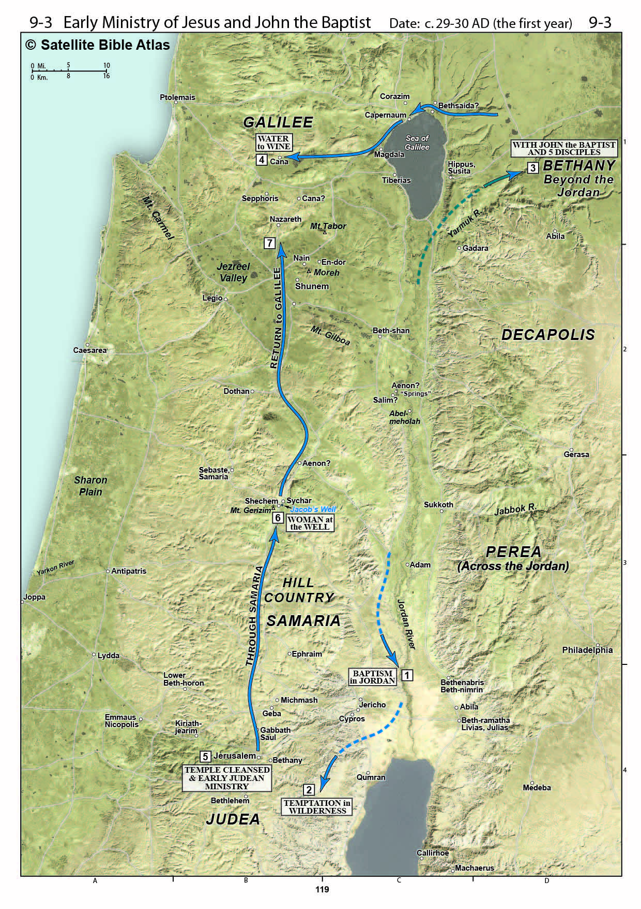
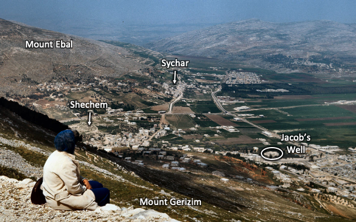
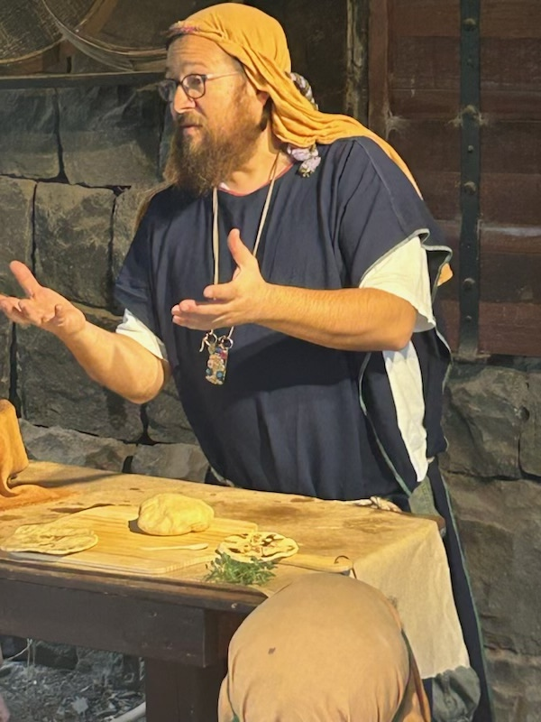
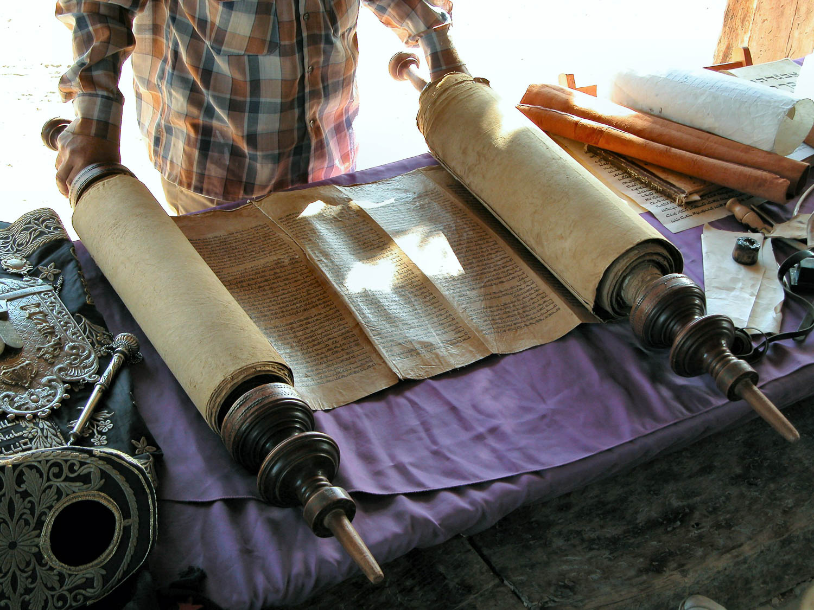
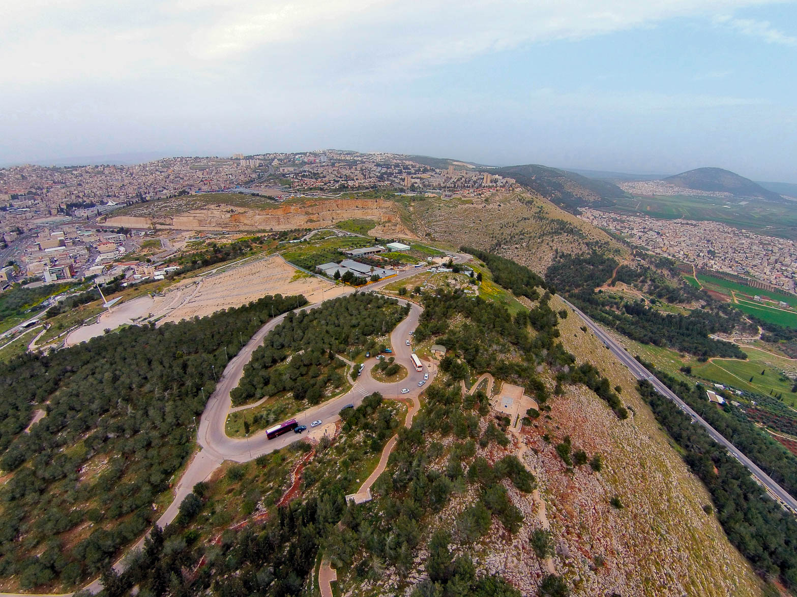



> In A PROPHET WITHOUT HONOR, we leave the village of Cana and follow Yeshua back to Nazareth to spend a quiet Shabbat in His hometown. The view from atop the Nazareth hill affords us a splendid view of the Jezreel Valley, Mount Tabor, and the surrounding territory. Take a walk around town and take in the sights as the shops close and people prepare for Sabbath. This is where our Master grew up.

### Videos

Part 1: John 4


Part 2: Luke 4


## Introduction

We continue in John 4, where the woman has left her waterpot at Jesus' feet as she ran back into town, claiming to have met someone who knows all about her. The disciples returned with food and were curious as to why Jesus was speaking alone with a Samaritan woman, but no one said anything. A talmid’s job is to model and imitate his rav/teacher, so I’m sure the disciples were wondering how far they were supposed to take this “interaction with Samaritans” thing. Jesus will tell them once we get to Luke 10. Everyone is our neighbor, and we’re supposed to love our neighbors.

After this mini discourse on food, Jesus will stay in Samaria for a couple of days and then head back to Nazareth. We’ll pick up the narrative in Luke 4, where He is asked to teach on Shabbat in Nazareth. He proclaims Himself the Messiah, which signals a transition from a private to a public phase of His ministry. The people of Nazareth reject this as blasphemy. He somehow avoids a mob that wants to stone him and relocates to Capernaum to launch his public Galilean ministry. What happens there will fulfill the saying, “A prophet is without honor in his hometown.”

We have one more episode in what we categorize as Jesus’ “early ministry.” Next time, we will pick up John 5 in Jerusalem; after this, we’ll return to Capernaum and formally enter the next phase of Jesus’ earthly ministry.

Schlaegel, in his supplemental study guide for the Satellite Bible Atlas, writes, “Neither war nor diplomacy over hundreds of years was able to break down the barriers between Jews and Samaritans. The Gospel of Jesus Christ did. Many Samaritans in the city believed in him (John 4:39-42).”[^1]

Although we say this period closes Jesus’ private ministry, Jesus had been growing in popularity when He returned to Galilee. Word of His private miracles was spreading and many people reported what Jesus had been doing in Jerusalem.

When an official from Capernaum heard that Jesus had returned to Galilee, he came up to Cana to plead with Jesus to heal his son. With a word, Jesus healed the boy from some 18 miles away. After this, or perhaps immediately before this, Jesus is in Nazareth, where He is rejected.

## John 4:31-34

> Meanwhile, the disciples urged Him, saying, “Rabbi, eat something.” But He said to them, “I have food to eat that you do not know about.” So the disciples were saying to one another, “No one brought Him anything to eat, did he?” Jesus said to them, “My food is to do the will of Him who sent Me and to accomplish His work.

-   Here we see, perhaps, a paradox. We opened John 4 with Jesus being tired and thirsty – we noted that ministry could be exhausting. While we can get exhausted by the ministry, it can also be incredibly nourishing and fulfilling.

-   We must recall His statement in the wilderness: “Man does not live on bread alone but on every word that comes from the mouth of God.”

    

    

    

-   These photos are from a demonstration of 1st century food preparation techniques.

-   One good suggestion is that when Jesus is on the Father’s mission, He is just as nourished and strengthened as if he had literal food.

-   When we go on mission trips, we start with the intent to bless others (and hopefully that does happen), but most of us return feeling like we were the ones blessed and spiritually nourished.

-   When Jesus makes statements like, “do the will of Him who sent me to accomplish His work,” we tend to see this as His work on the Cross.

-   This is correct. Jesus will ultimately accomplish His Father’s work on the Cross – “It is finished” could be translated as “it is fulfilled” or “it is accomplished.” Tetelestai means “paid in full.”

-   We do need to keep the context in mind, however. He has not yet said anything about going to the Cross, so his Talmidim would not have interpreted Jesus’ statement as such.

-   In the near term, the Father’s Work includes Jesus’ teaching, healing, compassion, and breaking down barriers.

-   Remember, the talmidim are a picture of us.

-   The Samaritan woman misunderstands His comment about water and she just met him.

-   The talmidim have been with Him for months now, and they are still misunderstanding him.

-   Part of the fun of our Christian walk is that we will never have Jesus completely figured out this side of Heaven. Every time we open His word, there is usually a new insight or aspect to Jesus we may not have noticed before.

-   In this case, Food and water are metaphors for spiritual truth[^2].

-   Water speaks of the need for salvation and regeneration in the Holy Spirit.

-   Food represents doing the will of God – in other words, everything that comes after the moment of initial regeneration.

## John 4:35-38

> “Do you not say, ‘There are still four months, and then comes the harvest’? Behold, I tell you, raise your eyes and observe the fields, that they are white for harvest. “Already the one who reaps is receiving wages and is gathering fruit for eternal life, so that the one who sows and the one who reaps may rejoice together. “For in this case the saying is true: ‘One sows and another reaps.’ “I sent you to reap that for which you have not labored; others have labored, and you have come into their labor.”

-   We harvest grain so we can have literal food; we sow and reap the Kingdom for spiritual nourishment.

-   “Still four months until the harvest.”

-   Some see this as Jesus literally saying there are only four months until the harvest, and therefore this episode takes place in late December or early January.

-   This would be an odd time of year for a trip through the mountains.

-   If so, it pokes a huge hole in the “heat of the day” argument about the woman.

-   Jesus, who often used crop and harvest metaphors, may have been quoting a regional proverb not otherwise known to us today.

-   For example, we have the proverb, “April showers bring May flowers.” This could refer to literal rain in the month of April, resulting in literal flowers, or the general truism that every action has a reaction.

-   Jesus may be saying something like, “these fields of Samaria look bare to you because of your prejudice. You don’t see the Samaritans as worth saving. From my perspective, they are ripe for harvest. For God so loved the world.”

-   “Lift up your eyes” often has a negative connotation in Scripture.

-   Here, Jesus is turning it around to possibly suggest His talmidim are blind to the mission field right in front of them.

-   Perhaps there was a sense among the talmidim that the time for harvest was not upon them – the sense that the harvest will only immediately precede the Messianic Kingdom.

-   Perhaps they did not consider Samaritans as being eligible for harvest into the Kingdom. They are unreachable.

-   Are there “no go zones” in your ministry? By your words you may say there aren’t, but do your actions suggest certain people are unreachable for the Gospel? Be honest.

-   Fields white for harvest could refer to the Samaritans approaching in their white robes – even today, the Samaritan priests typically wear white, with colors reserved for those in leadership.

-   Possibly, Jesus could be saying, “I sowed in the Samaritan woman, and she sowed in her town – we did the heavy lifting; now you take over.”

-   Lancaster’s explanation:[^3]

-   Sower = John the Baptist

-   Reaper = Jesus

-   Workers – the Talmidim

-   The time of the harvest = the present moment

-   Fields are ripe = some are ready to receive the kingdom (such as the Samaritans here)

-   Meaning: The harvest of souls for the kingdom begins now.

## John 4:39

> Now from that city many of the Samaritans believed in Him because of the word of the woman who testified, “He told me all the things that I have done.”

-   We talked about this last lesson but just to make the point again- if someone had just exposed every bad thing a person ever did, would you drop everything to meet that person, or would you run in the opposite direction for fear He might expose your sins next?

-   *The Chosen,* while still implying she was a morally fallen woman, handled this passage very well.

-   None of the woman’s supposed snootiness or Jesus supposed sternness that most commentators love to imply was happening came through in their presentation.

-   I suggest we focus on Jesus’ love and compassion, and the woman’s restoration. And, of course, the disciples’ amazement that Samaritans are part of the plan.

-   I forget who said it but there’s a quip, “when you get to heaven, you will be surprised to see some people there who you thought were beyond God’s reach. Some people from your past may be surprised to see you for the same reason.”

-   No one is beyond God’s reach.

## John 4:40-42

> So when the Samaritans came to Jesus, they were asking Him to stay with them; and He stayed there two days. Many more believed because of His word; and they were saying to the woman, “It is no longer because of what you said that we believe, for we have heard for ourselves and know that this One truly is the Savior of the world.”

-   “Savior of the world” was a term used by Roman emperors to speak of themselves.

    -   One of the sources of tension, and one that would continue after Jesus’ time, is the Samaritans tended to be pro-Roman against the Jews.

    -   Much like Herodium, the palace of the false king of the Jews was only a few miles from Bethlehem, the birthplace of the real king of the Jews; just a few miles from Jacob’s well was a temple to Augustus, “savior of the world.”

    -   For those Samaritans with open eyes, Jesus, not Augustus, was the true savior of the world.

## John 4:43-45

> And after the two days, He departed from there for Galilee. For Jesus Himself testified that a prophet has no honor in his own country. So when He came to Galilee, the Galileans received Him, only because they had seen all the things that He did in Jerusalem at the feast; for they themselves also went to the feast.

-   We could read the first four verses of chapter four and come away with the impression Jesus was in a hurry to get to Galilee. We find here that is not the case.

-   There is a lot going on here that is not stated.

    -   The purity customs (not from the Torah but man’s traditions) said that Jews and Samaritans considered each other unclean.

    -   With whom one lodged and dined was a BIG DEAL.

    -   This could be called a Rosa Parks moment in Jesus’ ministry.

-   Although all four Gospels use the phrase, “A prophet without honor,” the synoptics use it in reference to Nazareth, while John uses it in reference to Judea.

    -   One of John’s macro-narratives is Jesus’ rejection by the Jewish leadership – the very ones who should have authenticated Him.

-   Some commentators make a point that here and in verse 46, it says “He” and not “they” –

    -   the implication is that the disciples went on ahead, possibly because they couldn’t stomach (literally and figuratively) dining with Samaritans.

    -   This is a speculation that I don’t necessarily see but I can’t rule out.

    -   We don’t know for sure that Jesus was left behind, but if He was, there could have been any number of reasons why. We aren’t told.

    -   If we’re following a strict chronology, the disciples have not yet been called to full-time ministry, so perhaps many of the disciples had jobs and families to attend to.

## John 4:46-49

> Therefore He came again to Cana of Galilee, where He had made the water into wine. And there was a royal official whose son was sick at Capernaum. When he heard that Jesus had come from Judea into Galilee, he went to Him and began asking Him to come down and heal his son; for he was at the point of death. Then Jesus said to him, “Unless you people see signs and wonders, you simply will not believe.” The royal official said to Him, “Sir, come down before my child dies.”

-   Jesus is evidently trying to keep a low profile but His fame is spreading. People who went to the Passover in Jerusalem came back with stories.

    -   It’s easy for us to say something like, “the Jews rejected their messiah.”

    -   Nationally, this is true and certainly, the Jewish establishment rejected Jesus.

    -   However, Jesus was WILDLY POPULAR among the people.

        -   Of course, some of these were fair-weather fans only; some were followers and some were actually disciples.

        -   One of the reasons the establishment wanted Jesus taken out was because of his popularity.

-   The royal official is unnamed but appears to be someone in Antipas’ administration.

    -   As we move through Jesus’ ministry, take a note of who is and is not Jewish; this is important to understanding Jesus’ messages.

    -   This official appears to be Jewish.

    -   Apparently, someone who was with Jesus in Judea went back to Capernaum and told the official what he needed to do.

-   The initial rebuff is reminiscent of Jesus’ words to Mary in John 2.

    -   The public phase of His ministry has not yet started; not officially, anyway.

    -   Jesus uses the 2nd person plural in His rebuff, so perhaps the remark is not directed to the official but more to the people who wanted some entertainment.

## John 4:50-54

> Jesus said to him, “Go; your son is alive.” The man believed the word that Jesus spoke to him and went home. And as he was now going down, his slaves met him, saying that his son was alive. So he inquired of them the hour when he began to get better. Then they said to him, “Yesterday at the seventh hour the fever left him.” So the father knew that it was at that hour in which Jesus said to him, “Your son is alive”; and he himself believed, and his entire household. This is again a second sign that Jesus performed when He had come from Judea into Galilee.

-   Long-distance miracles suggest extraordinary power. “Jesus’ only prerequisite for such miracles is the seeker’s faith in His power.”[^4]

-   Commentators note that this story sounds similar to the healing of the Centurian’s servant in Luke 7. While some suggest the two events are one and the same, there are enough differences in the two narratives to suggest two separate healings.

-   Verse 54: “ this was a second time that Jesus came from Judea to the Galilee and performed a miracle.”[^5]

    -   John is obviously linking us back to John 2:11 and the first miracle at Cana.

## Luke 4:13-15

> And so when the devil had finished every temptation, he left Him until an opportune time. And Jesus returned to Galilee in the power of the Spirit, and news about Him spread through all the surrounding region. And He began teaching in their synagogues and was praised by all.

-   Luke places the Nazareth event immediately after Jesus’ temptation in the Wilderness, though possibly an entire year elapsed between the Wilderness and Nazareth.[^6]

-   “Was praised by all” is going to serve as a contrast to his reaction in Nazareth.

-   He regularly attended synagogue services and taught.

    -   Verse 16 is going to say, “as was His custom.”

        -   Hebrews 10:24 reminds us not to forsake the gathering together of believers. Jesus modeled this.

    -   He did not come to dismantle synagogue services or Judaism but to bring a course correction.

    -   Lancaster notes that 1st-century synagogues, unlike Jewish and Christian congregations today, did not have a single permanent teacher.

    -   “Any competent teacher in the community or visiting rabbi might be asked to offer a Sabbath teaching.”[^7]

## Luke 4:16

| **Mat 13:54**                                                                                                                                                                                     | **Mark 6:1-2**                                                                                                                                                                                                                                                                                                                                      | **Luke 4:16**                                                                                                                                   |
|---------------------------------------------------------------------------------------------------------------------------------------------------------------------------------------------------|-----------------------------------------------------------------------------------------------------------------------------------------------------------------------------------------------------------------------------------------------------------------------------------------------------------------------------------------------------|-------------------------------------------------------------------------------------------------------------------------------------------------|
| And He came to His hometown and began teaching them in their synagogue, with the result that they were astonished, and said, “Where did this man acquire this wisdom and these miraculous powers? | Jesus went out from there and came into His hometown; and His disciples followed Him. And when the Sabbath came, He began to teach in the synagogue; and the many listeners were astonished, saying, “Where did this Man learn these things, and what is this wisdom that has been given to Him, and such miracles as these performed by His hands? | 16 And He came to Nazareth, where He had been brought up; and as was His custom, He entered the synagogue on the Sabbath, and stood up to read. |

-   Matthew, if he’s attempting to be chronological, has it roughly halfway through His gospel (but He’s probably not attempting to be chronological).

    -   Some reconciliations would see a second visit to Nazareth – the first recorded by Luke and the second by Matthew and Mark.

    -   Since Luke was likely referencing Matthew and Mark (at least Mark) as he wrote, along with his own interviews and research, a single visit early in Jesus’ ministry seems more probable.

-   We believe the residents of Nazareth were all descendants of David; if so, it makes their subsequent rejection all the more puzzling.

    -   Nazareth means “branch town,” from Isaiah 11:1

    -   Isaiah 11:1-2 Then a shoot will spring from the stem of Jesse, And a Branch from his roots will bear fruit. \[2\] The Spirit of the LORD will rest on Him, The spirit of wisdom and understanding, The spirit of counsel and strength, The spirit of knowledge and the fear of the LORD.

    -   This is a decidedly messianic prophecy; in other words, the entire town was founded on the hope that the Messiah would one day come from Nazareth.

    -   Yet when that time came, they rejected the notion that one of their own could be the Messiah.

    -   As we’re criticizing them (justifiably so) let us examine ourselves; would we have been any different?

## Luke 4:17-20

> And the scroll of Isaiah the prophet was handed to Him. And He unrolled the scroll and found the place where it was written: “THE SPIRIT OF THE LORD IS UPON ME, BECAUSE HE ANOINTED ME TO BRING GOOD NEWS TO THE POOR. HE HAS SENT ME TO PROCLAIM RELEASE TO CAPTIVES, AND RECOVERY OF SIGHT TO THE BLIND, TO SET FREE THOSE WHO ARE OPPRESSED, TO PROCLAIM THE FAVORABLE YEAR OF THE LORD.” And He rolled up the scroll, gave it back to the attendant, and sat down; and the eyes of all the people in the synagogue were intently directed at Him.

-   Isaiah 61:1-2 The Spirit of the Lord GOD is upon me, Because the LORD anointed me To bring good news to the humble; He has sent me to bind up the brokenhearted, To proclaim release to captives And freedom to prisoners; To proclaim the favorable year of the LORD **And the day of vengeance of our God;**

-   Everyone in attendance would have had Isaiah 61 memorized; it would have been conspicuous for him to leave out, “and the day of vengeance of our God.”

    -   Why? In retrospect, we can see that in His first coming, He did not come to condemn the world.

    -   If He had said, “the day of vengeance of our God,” He could not have said, “today, this scripture has been fulfilled.”

    -   The audience in that day would not yet have been able to make that conclusion.

        -   Unless He explained why He left out the verse (as He does in The Chosen’s approach to the scene), the audience might have been *momentarily* wondering why He did this.

        -   Any concerns were about to be overshadowed by what He WOULD say next.

-   Torah reading in Synagogues

    -   The synagogue tradition today is to read through the Torah in one Jewish year (50-54 weeks); however, we don’t know if this was the case 2000 years ago. Some suggest they were on a three-year cycle. After the Torah was read, a portion from the Prophets and Writings called the Haftarah was read.

    -   Jesus was reading the Haftarah.

    -   In that day, the lecturer stood to read the Torah and Haftarah, then sat to teach.

        -   We know the Sabbath service in the first century included the above three elements (*Torah, haftarah, derashah).*

        -   Acts 13:15 After the reading of the Law and the Prophets, the synagogue officials sent word to them, saying, “Brothers, if you have any word of exhortation for the people, say it.”

        -   While it is not recorded, Messianic commentators assume Jesus also read the designated Torah portion that Saturday.

        -   We do not know whether He picked Isaiah or whether it was assigned to Him

            -   In modern Torah reading annual cycles, the Haftara portion is assigned and is the same for that week’s portion every year.

            -   We don’t know whether this was the case in Jesus’ day.

            -   We suspect either way it was not a surprise to Him!

-   Each section of the Isaiah passage is rich with Messianic overtones.

    -   For example, “the acceptable/favorable year of the LORD” appears to be a reference to the year of Jubilee. A year the slaves were set free, debts were cancelled and leased property reverted back to its owners.

    -   Jesus came to cancel our spiritual debts.

## Luke 4:21

> Now He began to say to them, “Today this Scripture has been fulfilled in your hearing.”

-   He possibly had part of a longer message where He either began or ended with our verse 21.

-   He’s unquestionably claiming to be the Messiah.

    -   Don’t miss that we’ve just entered new territory.

    -   This lesson could just as easily have been the opening of Jesus’ public Galilean ministry as the close of His private early ministry.

    -   We aren’t quite sure where John 5 falls in the chronology, so we’ll cover that next time and group in with His early ministry. That chapter is John’s version of Jesus’ transition from private missions to publicly declaring who He is.

## Luke 4:22-24

<table>
<colgroup>
<col style="width: 33%" />
<col style="width: 33%" />
<col style="width: 33%" />
</colgroup>
<thead>
<tr class="header">
<th>Matthew 13</th>
<th>Mark 6</th>
<th>Luke 4</th>
</tr>
</thead>
<tbody>
<tr class="odd">
<td>
55 “Is this not the carpenter’s son? Is His mother not called Mary, and His brothers, James, Joseph, Simon, and Judas?

56 “And His sisters, are they not all with us? Where then did this Man acquire all these things?”

57 And they took offense at Him. But Jesus said to them, “A prophet is not dishonored except in his hometown and in his own household.”

58 And He did not do many miracles there because of their unbelief.
</td>
<td>
3 “Is this not the carpenter, the son of Mary and brother of James, Joses, Judas, and Simon? And are His sisters not here with us?” And they took offense at Him.

4 Jesus said to them, “A prophet is not dishonored except in his hometown and among his own relatives, and in his own household.”

5 And He could not do any miracle there except that He laid His hands on a few sick people and healed them.

6 And He was amazed at their unbelief. And He was going around the villages, teaching.
</td>
<td>And all the people were speaking well of Him, and admiring the gracious words which were coming from His lips; and yet they were saying, “Is this not Joseph’s son?” And He said to them, “No doubt you will quote this proverb to Me: ‘Physician, heal yourself! All the miracles that we heard were done in Capernaum, do here in Your hometown as well.’” But He said, “Truly I say to you, no prophet is welcome in his hometown.</td>
</tr>
</tbody>
</table>

-   We talked about whether the turning of the money changer’s tables in the Temple in John was the first of two or whether it only happened at the end of his ministry but John placed it early for a specific reason.

-   One argument in favor of there only being one event is that it might be unlikely for Jesus to “poke the bear” that early in His ministry.

-   In my view, NOW He’s about to “poke the bear.”

-   In this instant, they are probably hanging on his every word but they still are inclined to view Him favorably.

-   That’s about to change and He knows it.

    -   In fairness, we don’t know with certainty if the people in the audience entirely turned on Him or if there was a mix of supporters and detractors. The latter seems more likely.

-   If count carefully, there are seven different reactions recorded across the three Gospels

1.  Where did this man get these things?

2.  What’s this wisdom that has been given Him?

3.  Where did this man get the power to do miracles?

4.  Is this not Joseph’s son?

5.  Is this not the carpenter (himself)?

6.  Is this not Mary’s son and his brothers?

7.  Are not his sisters here with us? (testimony of women?)

    -   The first three questions are positive/accepting; the last three are negative/dismissive of His abilities.[^8]

-   “One might expect this Davidic clan living in the hope of a hometown Messiah to be the first to acclaim that their own Yeshua son of Joseph as Messiah. On the contrary…He was just good-old Yeshua, the carpenter’s son.” Lancaster.[^9]

    -   David was also rejected/dismissed by his father and brothers. “When Samuel anointed David, Jesse and David’s brothers were stunned.”[^10]

### Heal Thyself

-   The same maxim is quoted in the Jewish Midrash.

-   It means “prove your claims.”[^11]

### Jesus’ family

-   We speculate that Joseph has since died.

    -   Had Joseph remained alive, Jesus (given His obvious skills as demonstrated when He was 12) might have been able to complete Beit Midrash and Beit Talmud to study under a prominent Sage.

    -   As it is, out of necessity and as the firstborn, He likely had to assume the role of family provider, which meant taking over His father’s carpentry/masonry business.

    -   As a result, that’s all the townfolk saw Him as.

-   From Matthew 13, Jesus was the oldest of at least seven children (Jesus, four brothers, and at least two sisters).

    -   In order to preserve the tradition of Mary’s perpetual virginity, some suggest that the other children are children of Joseph by another wife or are actually cousins, not siblings.

    -   Leaving tradition aside, reading all as children of Mary, with everyone after Jesus conceived in the usual manner, is supported by a plain reading of the text.

    -   The names provided are all common Jewish names, and ones that are shared by several disciples.

        -   John 7:5 helps us out a little as we’re told none of Jesus’s brothers believed in Him until after the resurrection.

        -   James

            -   We have evidence suggesting James (Yakov in Hebrew) was a Pharisee. If so, James had the opportunity for formal schooling that Jesus did not.

            -   After the resurrection, James became the head of the Jerusalem assembly of believers, even to the point of having apostolic authority over the original disciples (including Peter, which must have been a fascinating dynamic).

            -   He appears to be well-regarded, even among the non-messianic Jews. He has the nickname James the Just, or we might say James the Righteous/Tzadik. The only way he would have earned this nickname is from strict Torah observance.

            -   This James is the author of the book of James and should not be confused with the two Apostles named James (James the Less (Mark 15:40) or James son of Alphaeus (Matthew 10:3).

        -   Judas (Jude)

            -   Obviously, this is not the same as Judas who betrayed Jesus.

            -   Jesus’ brother Judas authored the book we know as Jude.

        -   Simon and Joseph

            -   This Simon is not Peter nor Simon the Zealot

            -   This Joseph is not the Joses mentioned in Mark 15:40.

        -   Church tradition ascribes varying roles to Jesus’ brothers and sisters, but we have no other corroborating documentation to either support or refute this tradition.

## Luke 4:25-28

> 25 “But I say to you in truth, there were many widows in Israel in the days of Elijah, when the sky was shut up for three years and six months, when a severe famine came over all the land;
>
> 26 and yet Elijah was sent to none of them, but only to Zarephath, in the land of Sidon, to a woman who was a widow.
>
> 27 “And there were many with leprosy in Israel in the time of Elisha the prophet; and none of them was cleansed, but only Naaman the Syrian.”
>
> 28 And all the people in the synagogue were filled with rage as they heard these things;

-   Jesus quotes a couple of miracles performed by Elijah and Elisha.

    -   1 Kings 17:9 “Arise, go to Zarephath, which belongs to Sidon, and stay there; behold, I have commanded a widow there to provide food for you.”

    -   2 Kings 5:14 So (Naaman) went down and dipped himself in the Jordan seven times, in accordance with the word of the man of God; and his flesh was restored like the flesh of a little child, and he was clean.

        -   This is an entertaining story and worth our study. 2 Kings 5.

-   We may not see what the big deal is, but as Chuck Missler liked to say, whenever you and I are in danger of missing something, the people come to our rescue. They are enraged and it’s our task to find out why.

-   Some commentators see the problem is he’s mentioning the socially weak and marginalized, which offended the sensibilities of the town. That’s not it.

-   He’s saying, actually prophesying, that Gentiles receive the things of God and Jews do not.

    -   Just as Elijah and Elisha did not heal everyone, neither did Jesus heal everyone who needed it.

-   Some commentators interpret this as Jesus casting off Jews and Judaism.

    -   You probably know me well enough by now to realize that, in my humble opinion, this is not how to read this passage appropriately.

    -   The entire focus of the upcoming segment of His ministry is going to be to the Jews and ONLY the Jews.

    -   He will tell His disciples, “do NOT go in way of the gentiles…rather go to the lost sheep of the house of Israel” (Matthew 10-5-6).

    -   All He’s doing here is explaining that He will leave Nazareth and take His ministry elsewhere; specifically, He will take it to the JEWISH town of Capernaum.

-   What He WAS doing was comparing Himself to two of Israel’s greatest prophets, and in so doing, comparing Nazareth to the likes of idolatrous Ahab and Jezebel, who rejected and tried to kill the prophets.

-   A rough paraphrase might be:

    -   Surely some of you will tell Me to prove my claims of being Messiah by the signs and miracles you have heard me do in other places. Just as Elisha and Elijah did not do these miracles for everybody, you Nazarenes are not worthy of My miracles. I’m out.”

## Luke 4:29-30

> and they got up and drove Him out of the city, and brought Him to the crest of the hill on which their city had been built, so that they could throw Him down from the cliff. But He passed through their midst and went on His way.

-   Of course, even when Jews had the power of capital punishment (which at this time they did not) Jewish law required order and due process to criminal proceedings, particularly for a capital crime, such as blasphemy – and there is no chance an execution would have been allowed on Shabbat.

    -   Instead of a lawless, nearly out of control mob, the Chosen elected to portray this scene as people serious about the Torah and about the Laws of Blasphemy.

    -   The Chief Rabbi asked repeatedly for Jesus to recount His so-called “blasphemy”; When Jesus did not, the rabbi felt He had no choice under the law of Moses.

    -   Since I had always viewed it as an out-of-control mob I appreciated the lesson in keeping our options open.

        -   I had to revise my notes for this section after I watched the episode in Season 3. I’m Ok with that. I still lean towards the out-of-control mob angle, but I can entertain the other possibility too.

        -   We should always be ready to update our conclusions when indicated. That’s being a good Berean.

        -   I had a coworker who liked to say, “we always reserve the right to get smarter.”

        -   Being a Berean does not mean you have to accept everything anyone says, however. It has to fit Scripture and it has to fit the context.

-   So as to avoid cruel and unusual punishment, the condemned would often be thrown from a cliff, with the thought that the numerous jagged rocks would at least render him unconscious, with the stones then thrown to finish him off.

    -   They would aim for the chest, not the head.

    -   Sometimes the fall alone killed the person.

        -   It was not necessarily the altitude of the fall but the fact one would lose his balance and be very likely to hit his head on a rock

    -   In that day, Nazareth was MUCH smaller than it is today; a walk to either the northern hill or far less likely the southern hill would have been a hike on a Sabbath.

        -   The southern hill is “venerated” by tour companies because it’s a low-hassle stop without going through Nazareth on the way to Capernaum.

        -   The views of the Jezreel valley are a spectacular place to remember Jesus’ declaration and remember the OT events in the historical books that happened right in front of the hill.

-   We presume it was something supernatural that saved Him but remember, He did no miracles there.

    -   It could have been His poise or his attitude that silenced them.

    -   Or He potentially had to tussle His way through the crowd

    -   In any case, His hour had not yet come.

-   Hope for Nazareth?

    -   In the years following His resurrection, the people of Nazareth became fervent believers.

    -   His brothers became leaders in the early Messianic Jewish movement and Nazareth appears to have been a center for Jewish believers.[^12]

    -   Even today, the Modern Hebrew word for “Christians” is “notzrim.” “Nazarenes.”

## Conclusion

<table>
<colgroup>
<col style="width: 50%" />
<col style="width: 50%" />
</colgroup>
<thead>
<tr class="header">
<th>Matthew 4</th>
<th>Luke 4</th>
</tr>
</thead>
<tbody>
<tr class="odd">
<td>
13 and leaving Nazareth, He came and settled in Capernaum, which is by the sea, in the region of Zebulun and Naphtali.

14 This happened so that what was spoken through Isaiah the prophet would be fulfilled:

15 “THE LAND OF ZEBULUN AND THE LAND OF NAPHTALI, BY THE WAY OF THE SEA, ON THE OTHER SIDE OF THE JORDAN, GALILEE OF THE GENTILES—

16 THE PEOPLE WHO WERE SITTING IN DARKNESS SAW A GREAT LIGHT, AND THOSE WHO WERE SITTING IN THE LAND AND SHADOW OF DEATH, UPON THEM A LIGHT DAWNED.”
</td>
<td>31 And He came down to Capernaum, a city of Galilee; and He was teaching them on the Sabbath;</td>
</tr>
</tbody>
</table>

We will pick this up two lessons from now when we get to Capernaum and Jesus public ministry. Next time we’ll have one more lesson in the “early ministry” category. John 5 and the Pools of Bethesda.

Keener, Craig S. *The IVP Bible Background Commentary: New Testament*. 2nd edition (E-Sword). Downers Grove, Illinois: IVP Academic, 2014.

Lancaster, D. Thomas. *Chronicles of the Messiah*. Edited by Boaz Michael and Stephen D. Lancaster. 2nd ed. 6 vols. Torah Club. Marshfield, MO: First Fruits of Zion, 2014.

Missler, Chuck. *The Gospel of Luke: A Commentary (Supplemental Notes)*. Coeur d’Alene, ID: KOINONIA HOUSE, 2011.

Schlegel, William. “The Land and the Bible: A Historical Geographical Companion to the Satellite Bible Atlas,” September 2013. https://www.bibleplaces.com/wp-content/uploads/2015/08/The-Land-and-the-Bible.pdf.

Stern, David H. *Complete Jewish Bible : An English Version of the Tanakh and Brit Hadeshah*. Revised Edition (E-Sword). Clarksville, Md: Lederer Messianic Publications, 1998.

[^1]: William Schlegel, “The Land and the Bible: A Historical Geographical Companion to the Satellite Bible Atlas,” September 2013, loc. Map 9-3, https://www.bibleplaces.com/wp-content/uploads/2015/08/The-Land-and-the-Bible.pdf.

[^2]: D. Thomas Lancaster, *Chronicles of the Messiah*, ed. Boaz Michael and Stephen D. Lancaster, 2nd ed., Torah Club (Marshfield, MO: First Fruits of Zion, 2014), 260.

[^3]: Lancaster, 261.

[^4]: Craig S. Keener, *The IVP Bible Background Commentary: New Testament*, 2nd edition (E-Sword) (Downers Grove, Illinois: IVP Academic, 2014), loc. John 4:50-54.

[^5]: David H. Stern, *Complete Jewish Bible : An English Version of the Tanakh and Brit Hadeshah*, Revised Edition (E-Sword) (Clarksville, Md: Lederer Messianic Publications, 1998), loc. John 4:54.

[^6]: Chuck Missler, *The Gospel of Luke: A Commentary (Supplemental Notes)* (Coeur d’Alene, ID: KOINONIA HOUSE, 2011), 64.

[^7]: Lancaster, *Chronicles of the Messiah*, 282.

[^8]: Lancaster, 291.

[^9]: Lancaster, 277.

[^10]: Lancaster, 292.

[^11]: Lancaster, 293.

[^12]: Lancaster, 295.

https://friends.ffoz.org/resources/portion-connections/a_prophet_without_honor_1.html

Vintage Video: 
