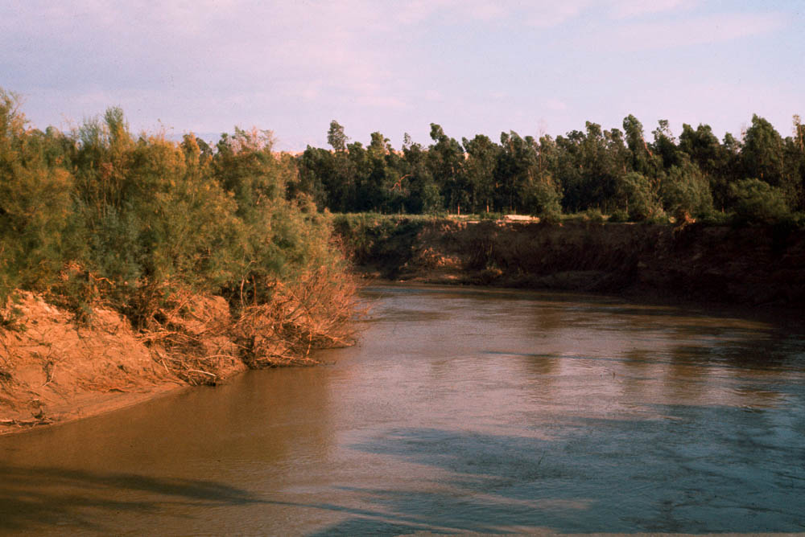
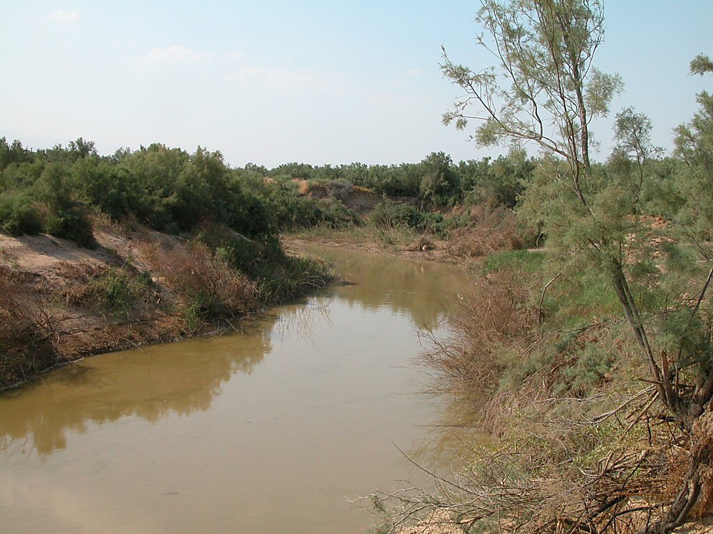
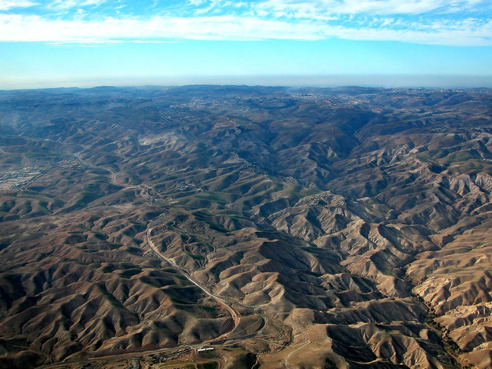
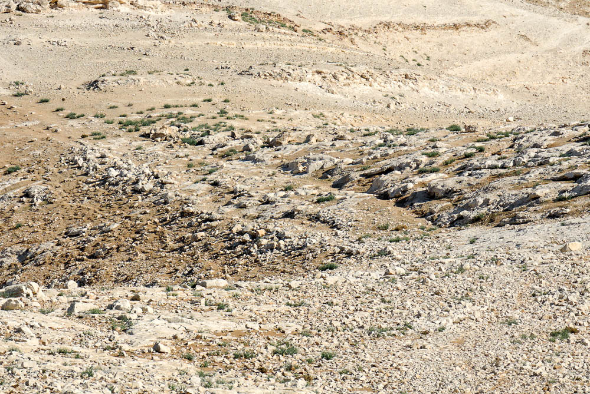
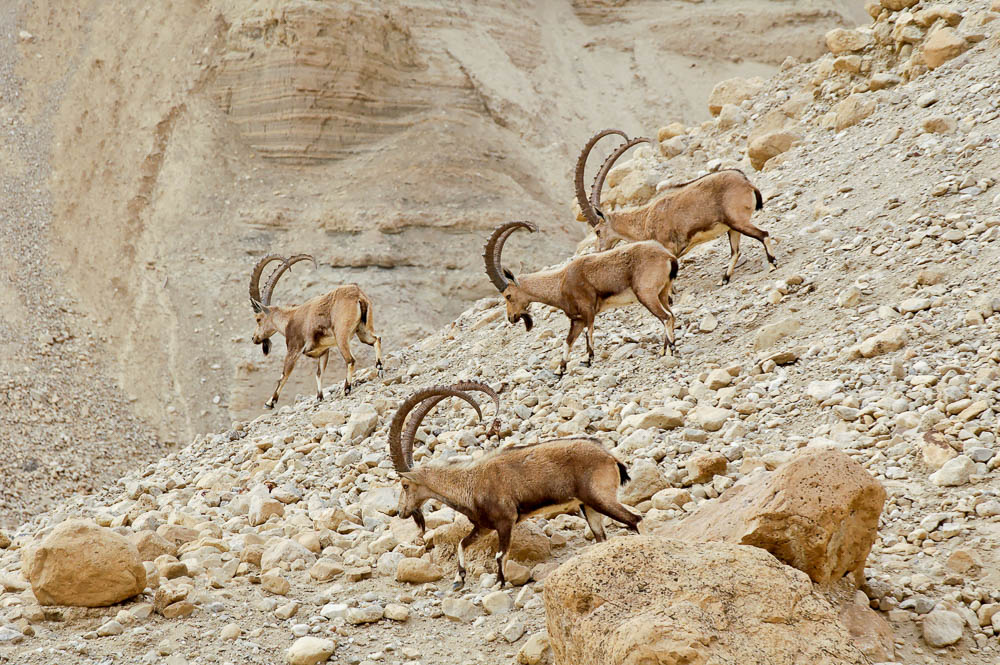

**Summary**:

In IMMERSION AND TEMPTATION, we briefly return to **Nazareth**. More than two decades have elapsed since we last visited. Yeshua is no longer a precocious twelve-year-old boy; he is a grown man who has taken over His father Joseph’s carpenter trade. From Nazareth, we follow Yeshua’s family to the plains of the **Jordan**, across from Jericho, where John the Immerser is at work, proclaiming the good news and immersing for repentance[^1]. After His immersion, we follow Yeshua out into the dry and waterless **Judean** **Wilderness** between **Jerusalem** and **Jericho** where He spends forty days in prayer and fasting, concluding with His three temptations.[^2]

**Passages**: Matthew 3:13-4:11 (Mark 1:9-13, Luke 3:21-23, 4:1-13; John 1:29-34)

**Video**:





## Geography:

This map[^3] traces Jesus’ early ministry, including leaving Nazareth to be baptized by John (Mark 1:9) leading to His baptism in the Jordan (box 1), followed by His temptation in the Judean wilderness (box 2). We don’t know exactly where (or when) Jesus was baptized. Because of a few references, including the apparent proximity to Jerusalem (Mark 1:5) and the reference to “these stones” in the Luke and Matthew accounts suggest opposite Jericho near (or quite probably at) the location where Joshua led the Israelites across in Joshua 4. This site is marked by a traditional holy site today.

While not disputing a southern location for Jesus’ baptism, some scholars, including William Schlegel the publisher of this map, contend “Bethany beyond the Jordan” is not located across from Jericho but much further north in the Golan Heights (marked by box 3 on the map). They point out that it does not say that Jesus was baptized at Bethany; but in John’s gospel, it appears as if John is recollecting Jesus’ baptism which occurred at least 40 days earlier and in a different location.

Aubrey Taylor has noted that in the same region where Moses commissioned Joshua, and Elijah commissioned Elisha, Jesus receives a similar commission from John.[^4]

The photo on the top[^5] is a colorized version of an American Colony photograph taken between 1896 and 1946. The photo on the bottom[^6] is the same area today. The most significant issue in that part of the world, since ancient times and continues today is water rights. Before 1948 the area was sparsely populated. After 1948 with the founding of both the modern states of Israel as well as Jordan, the area began to grow, and all those new people needed food and food requires water from the Jordan river.

## Jesus baptized by John in the Jordan

| **Mat 3:13-15**                                                                                                                                                                                                                                                                                     | **Mar 1:9**                                                                               | **John 1:29-31**                                                                                                                                                                                                                                                                                                                          |
|-----------------------------------------------------------------------------------------------------------------------------------------------------------------------------------------------------------------------------------------------------------------------------------------------------|-------------------------------------------------------------------------------------------|-------------------------------------------------------------------------------------------------------------------------------------------------------------------------------------------------------------------------------------------------------------------------------------------------------------------------------------------|
| Then Jesus came from Galilee to the Jordan to John, to be baptized by him. John would have prevented him, saying, “I need to be baptized by you, and do you come to me?” But Jesus answered him, “Let it be so now, for thus it is fitting for us to fulfill all righteousness.” Then he consented. | In those days Jesus came from Nazareth of Galilee and was baptized by John in the Jordan. | The next day he saw Jesus coming toward him, and said, “Behold, the Lamb of God, who takes away the sin of the world! This is he of whom I said, ‘After me comes a man who ranks before me, because he was before me.’ I myself did not know him, but for this purpose I came baptizing with water, that he might be revealed to Israel.” |

Although it’s only a few verses in our Bibles, we need to remember that John and Jesus had probably never met until this day (and unlikely that John would remember doing a somersault in his mother Elizabeth’s womb over 30 years earlier); however, John 1:31 could also be interpreted that John initially did not recognize that Jesus was the Messiah, not that they were entirely unfamiliar with each other.

Also, by now, we presume Joseph has died and Jesus has been left in charge of Mary and Jesus’ many siblings. John apparently recognized Jesus as soon as they saw each other and makes a Passover allusion to the sacrificial lamb and Isaiah 53:7: He was oppressed, and he was afflicted, yet he opened not his mouth; like a lamb that is led to the slaughter, and like a sheep that before its shearers is silent, so he opened not his mouth. John is certainly foreshadowing Jesus’ suffering and crucifixion.

Lancaster paraphrases Matthew 3:14 as, “I need to be baptized by you WITH THE HOLY SPIRIT, yet you come to me to be baptized with water?”[^7]

### Fulfill all Righteousness

Of course, Jesus Himself did not need to be baptized for his sins, so what does Jesus mean by “fulfilling all righteousness?” Keener notes that Jesus’ response indicates his identification with Israel in obedience to the Law and by extension, larger humanity who DID need purification[^8]. To fulfill all righteousness means it’s the proper way of doing things in the proper order. A prophet in the spirit and power of Elijah must arise, identify, declare, and anoint the Messiah (who must of course allow Himself to be anointed). By being baptized by John, Jeremy Dehut in Following the Messiah Jesus “testified to the authenticity and authority of John’s message and continued providing an example of faithful submission.”[^9]

A few lessons back we looked at how the verse “out of Egypt I have called my son” exemplifies how Jesus mirrors the nation. As we will see in the next section, Jesus’ 40-day fast recalls Israel’s 40 years in the wilderness. Just as God sustained Israel in the wilderness so He sustained Jesus.

When we get to the question of why a Sinless Jesus would need a baptism of repentance, we must remember that Jesus is a perfect representative of the nation, just as He is a perfect and sinless representative of humankind. As a representative of Israel, Jesus “passes through the waters of the Jordan” just like the Nation did. His “repentance” (so to speak) represented the “corporate guilt and confession”[^10] of His people. Taylor goes on to say that Jesus’ temptations can also be viewed in light of this representative role.

### The Spirit like a Dove

<table>
<colgroup>
<col style="width: 17%" />
<col style="width: 16%" />
<col style="width: 25%" />
<col style="width: 17%" />
<col style="width: 23%" />
</colgroup>
<thead>
<tr class="header">
<th><strong>Mat 3:16-17</strong></th>
<th><strong>Mar 1:9-11</strong></th>
<th><strong>Luk 3:21-23</strong></th>
<th><strong>John 1:32-34</strong></th>
<th><strong>References</strong></th>
</tr>
</thead>
<tbody>
<tr class="odd">
<td>
<a href="verseid:40.3.16"><strong>16</strong> </a> And when Jesus was baptized, immediately he went up from the water, and behold, the heavens were opened to him, and he saw the Spirit of God descending like a dove and coming to rest on him;

<a href="verseid:40.3.17"><strong>17</strong> </a> and behold, a voice from heaven said, “This is my beloved Son, with whom I am well pleased.”
</td>
<td>
<a href="verseid:41.1.10"><strong>10</strong> </a> And when he came up out of the water, immediately he saw the heavens being torn open and the Spirit descending on him like a dove.

<a href="verseid:41.1.11"><strong>11</strong> </a> And a voice came from heaven, “You are my beloved Son; with you I am well pleased.”
</td>
<td>
<a href="verseid:42.3.21"><strong>21</strong> </a> Now when all the people were baptized, and when Jesus also had been baptized and was praying, the heavens were opened,

<a href="verseid:42.3.22"><strong>22</strong> </a> and the Holy Spirit descended on him in bodily form, like a dove; and a voice came from heaven, “You are my beloved Son; with you I am well pleased.”

<a href="verseid:42.3.23"><strong>23</strong> </a> Jesus, when he began his ministry, was about thirty years of age, being the son (as was supposed) of Joseph, the son of Heli,
</td>
<td>And John bore witness: “I saw the Spirit descend from heaven like a dove, and it remained on him. I myself did not know him, but he who sent me to baptize with water said to me, ‘He on whom you see the Spirit descend and remain, this is he who baptizes with the Holy Spirit.’ And I have seen and have borne witness that this is the Son of God.”</td>
<td>
Psalm 2:7 I will tell of the decree: The LORD said to me, “You are my Son; today I have begotten you.

Gen 22:2 He said, “Take your son, your only son Isaac, whom you love, and go to the land of Moriah, and offer him there as a burnt offering on one of the mountains of which I shall tell you.”

Isa 11:2 And the Spirit of the LORD shall rest upon him, the Spirit of wisdom and understanding, the Spirit of counsel and might, the Spirit of knowledge and the fear of the LORD.

Isa 42:1 Behold my servant, whom I uphold, my chosen, in whom my soul delights; I have put my Spirit upon him; he will bring forth justice to the nations.
</td>
</tr>
</tbody>
</table>

When I visited Israel in February 2013, I took this picture of a pair of doves at Jesus’ traditional baptism site. I wonder if they were only there for the tourists.

In that day many believed that God had gone silent. So, the heavens opening and the spirit poured out indicated that the Messianic era had arrived. John earlier proclaimed, “the kingdom of heaven is at hand” (Mat 3:1). “A kingdom needs a king and a messianic era needs a messiah.”[^11]

God’s voice and John’s prophetic testimony are the two witnesses required to establish a matter; in this case, the stamp of approval on Jesus as Messiah. The Spirit would signify that the Messianic era is at hand. The spirit resting on Jesus could be an allusion to Genesis 1, where the Spirit of God moved over the surface of the waters, and Genesis 8, where the dove flew out over the waters and, finding no other place to land, came to “rest” on Noah (noach means rest in Hebrew). Despite our impression of doves as docile and peaceful, they are notoriously territorial. Lancaster writes, “His disciples probably understood Him to mean a sudden, startling rush of wind – only slightly less jarring than being struck by lightning.”[^12]

“My beloved son” could also be read as “my son, the beloved” or even “my son, whom I love” which also recalls Genesis 22 when Abraham is told “take your son, your only son Isaac, whom you love and go to the land of Moriah and offer him there as a burnt offering”. Isaac is a type or a foreshadow of Jesus who would be sacrificed, thus Lancaster notes in apostolic theology, the “beloved one” becomes a title for the Messiah.

All of this seems to highlight the messianic prophecy of Isaiah 11:2 “And the spirit of the LORD shall rest upon Him.”

Luke 3:23 says Jesus was “about 30” when He began His ministry. We should not take this to mean exactly 30. The precise date of one’s birth was not especially relevant in the ancient world. Lancaster supposes that this is 28 CE, which if he was born in 5 or 6 BCE makes Jesus 34 years old here and then 36 years old when he died. According to Jewish tradition, Isaac was also 36 at the time of his binding on the altar in Genesis 22.

## The three temptations of Jesus

### Into the wilderness

<table>
<colgroup>
<col style="width: 35%" />
<col style="width: 32%" />
<col style="width: 32%" />
</colgroup>
<thead>
<tr class="header">
<th><strong>Mat 4:1-2</strong></th>
<th><strong>Mar 1:12-13a</strong></th>
<th><strong>Luk 4:1-2</strong></th>
</tr>
</thead>
<tbody>
<tr class="odd">
<td>
<a href="verseid:40.4.1"><strong>4:1</strong> </a> Then Jesus was led up by the Spirit into the wilderness to be tempted by the devil.

<a href="verseid:40.4.2"><strong>2</strong> </a> And after fasting forty days and forty nights, he was hungry.
</td>
<td>
<a href="verseid:41.1.12"><strong>12</strong> </a> The Spirit immediately drove him out into the wilderness.

<a href="verseid:41.1.13"><strong>13</strong> </a> And he was in the wilderness forty days, being tempted by Satan.
</td>
<td>
<a href="verseid:42.4.1"><strong>4:1</strong> </a> And Jesus, full of the Holy Spirit, returned from the Jordan and was led by the Spirit in the wilderness

<a href="verseid:42.4.2"><strong>2</strong> </a> for forty days, being tempted by the devil. And he ate nothing during those days.
</td>
</tr>
</tbody>
</table>

Bolen writes, “Because of its lack of water and good routes, the Judean wilderness[^13] has been (mostly) uninhabited throughout history. Consequently, it was an ideal place for those seeking refuge from enemies or retreat from the world. John the Baptist preached here, and it seems likely that this was the wilderness where Jesus was tempted.”[^14]

Keener writes, “Jesus was led into the wilderness just as Israel was led. Just as Moses fasted for 40/40, so did Jesus.”[^15] In fact, Mark 1:12 emphatically says the spirit forcibly drove Jesus out into the wilderness.

Jesus is a shadow of both Moses and Israel. They were tested and God sustained them all. Jesus passed the test.

Some Christian traditions observe lent, where we abstain from certain pleasures, if not do a partial fast for 40 days between Ash Wednesday and Resurrection story. We do this in honor of Jesus’ 40 days in the wilderness. Jewish people similarly observe 40 days of Teshuva (“repentance”) which recalls the 40 years wandering in the wilderness (which is said to be one year for every day the spies were in the land). This concludes with Yom Kippur (Day of Atonement) which is a day of national fasting. Lancaster says, “Jewish liturgy treats the Day of Atonement as a day for dealing with Satan and his accusations. The liturgies of the day are filled with references to a legal showdown between Israel and the devil, which concludes with the scape goat being led out into the wilderness, symbolizing the defeat of evil.”[^16]

### First temptation: stone to bread

<table>
<colgroup>
<col style="width: 35%" />
<col style="width: 32%" />
<col style="width: 32%" />
</colgroup>
<thead>
<tr class="header">
<th><strong>Mat 4:3-4</strong></th>
<th><strong>Luk 4:3-4</strong></th>
<th><strong>References</strong></th>
</tr>
</thead>
<tbody>
<tr class="odd">
<td>
<a href="verseid:40.4.3"><strong>3</strong> </a> And the tempter came and said to him, “If you are the Son of God, command these stones to become loaves of bread.”

<a href="verseid:40.4.4"><strong>4</strong> </a> But he answered, “It is written, “‘Man shall not live by bread alone, but by every word that comes from the mouth of God.’”
</td>
<td>
3 The devil said to him, “If you are the Son of God, command this stone to become bread.”

4 And Jesus answered him, “It is written, ‘Man shall not live by bread alone.’”
</td>
<td>Deu 8:3 And he humbled you and let you hunger and fed you with manna, which you did not know, nor did your fathers know, that he might make you know that man does not live by bread alone, but man lives by every word that comes from the mouth of the LORD.</td>
</tr>
</tbody>
</table>

This photograph was taken in the Judean Wilderness, along the Ascent of Adummim, between Jericho and Jerusalem.[^17]

Scholars debate the moment in time when Jesus came to the full realization of His mission and destiny. Many speculate that it was at His baptism that the spirit descended. Lancaster speculates that the Satan’s temptations were an attempt to force Yeshua to question the revelation He just received. Maybe like in some movie where a normal person is given some superhuman ability, the Satan believes Jesus has the desire to try out His new superpowers.

All three temptations will involve shortcuts to revealing His messianic identity and plan. Remember the phrase Jesus uses frequently between now and the triumphal entry: “My hour is not net come”

Therefore, the first temptation is declaring that Jesus indeed trusts that revelation that He heard come from the mouth of the LORD. He did not need to prove it. Let’s break it down some more.

The Satan begins with “If you are the son of God.” One of the main limitations of the written word is that we have to use our imaginations with respect to voice inflection and body language. Did the Satan say this scoffingly, inquisitively, or matter-of-factly? Since the Satan is the accuser, it’s not too difficult to imagine him taunting Jesus with this challenge. “Since we know God made manna from heaven in the wilderness if you are that God, you should be able to do the same thing in this wilderness. And by the way, I know you are hungry. Why don’t you just go ahead and fix yourself something to eat.”

Jesus declines the invitation to demonstrate His messianic power. He will do it on His terms and in His timing. Jesus WILL provide bread, but it will be food for the people, not for Himself. He will serve others, not Himself.

He is the Word and the Bread of Life who has come down from heaven. He quotes Deuteronomy 8:3, which is a passage about how “God tested Israel in the wilderness by causing them to hunger and feeding them with manna.”[^18] Physical bread will temporarily relieve hunger but the Bread of Life, the very Words of God will cure spiritual hunger.

The first temptation is declaring that Jesus indeed trusts that revelation that He heard come from the mouth of the LORD. He did not need to prove it.

### Second temptation: throw yourself down

<table>
<colgroup>
<col style="width: 23%" />
<col style="width: 26%" />
<col style="width: 50%" />
</colgroup>
<thead>
<tr class="header">
<th><strong>Mat 4:5-7</strong></th>
<th><strong>Luk 4:9-12</strong></th>
<th><strong>References</strong></th>
</tr>
</thead>
<tbody>
<tr class="odd">
<td>
<a href="verseid:40.4.5"><strong>5</strong> </a> Then the devil took him to the holy city and set him on the pinnacle of the temple

<a href="verseid:40.4.6"><strong>6</strong> </a> and said to him, “If you are the Son of God, throw yourself down, for it is written, “‘He will command his angels concerning you,’ and “‘On their hands they will bear you up, lest you strike your foot against a stone.’”

<a href="verseid:40.4.7"><strong>7</strong> </a> Jesus said to him, “Again it is written, ‘You shall not put the Lord your God to the test.’”
</td>
<td>
9 And he took him to Jerusalem and set him on the pinnacle of the temple and said to him, “If you are the Son of God, throw yourself down from here,

10 for it is written, “‘He will command his angels concerning you, to guard you,’

11 and “‘On their hands they will bear you up, lest you strike your foot against a stone.’”

12 And Jesus answered him, “It is said, ‘You shall not put the Lord your God to the test.’”
</td>
<td>
Psa 91:11-14 For he will command his angels concerning you to guard you in all your ways. [12] On their hands they will bear you up, lest you strike your foot against a stone. [13] You will tread on the lion and the adder; the young lion and the serpent you will trample underfoot. [14] “Because he holds fast to me in love, I will deliver him; I will protect him, because he knows my name.

Deu 6:13-16 It is the LORD your God you shall fear. Him you shall serve and by his name you shall swear. [14] You shall not go after other gods, the gods of the peoples who are around you— [15] for the LORD your God in your midst is a jealous God—lest the anger of the LORD your God be kindled against you, and he destroy you from off the face of the earth. [16] “You shall not put the LORD your God to the test, as you tested him at Massah.
</td>
</tr>
</tbody>
</table>

When we compare Matthew and Luke side-by-side we see that Luke reverses the 2nd and 3rd temptations. Some may view this as the Gospel authors being unable to keep their stories straight, but another way of looking at it is that this demonstrates a lack of coordination and collusion among the authors. If one witness in a trial recalls she heard a dog bark and then a car horn, but another witness recalls she heard a car horn then a dog bark, we don’t typically assume one or the other is lying. It’s just a different recollection. The differences between Matthew and Luke are not significant.

What is more significant is that leaping from a tall building is not typically a temptation to most people. The next matter is that before they were in the wilderness and now all of a sudden they are in Jerusalem. Scholars debate as to whether this is a vision, or whether they were supernaturally transported. I tend to vote against the vision. The leap has to be potentially fatal for the miracle the Satan is proposing to actually be miraculous.

Below is a photo of the southeastern corner of the Temple Mount.[^19] The drop today is likely fatal but 2000 years ago, the Kidron valley below was much steeper.

Here is a reminder that the Satan knows Scripture and he is an expert at making arguments. We need to be like Jesus and know the “whole council” of God so we don’t take Bible passages out of context, and don’t fall for it when others try to do so.

The Satan says, “look here. God says He will send His Psalm 91 angels to protect you.” Psalm 91 is a messianic passage (and the Satan knows this). Psalm 91 is a great passage and one we all would do well to memorize and rely on. However, a Tzaddiq (a righteous one) such as Jesus would have known that angelic protection is for ills that befall God’s servants, not for those who foolishly seek out danger. Therefore, we must know our Bible, and therefore we are going through the Gospels verse by verse in this series!

Jesus counters with another passage from Deuteronomy. Note the context of “you shall not test the Lord” is not merely doing something foolish/sinful and asking God to make it right. The context is following after other gods spiritually. When we listen to the lies of the Satan, we are following after a false god. (ouch).

The testing at Massah refers to Exodus 17:7: And he called the name of the place Massah and Meribah, because of the quarreling of the people of Israel, and because they tested the LORD by saying, “Is the LORD among us or not?”

### Third temptation: all the kingdoms of the world if you bow

<table>
<colgroup>
<col style="width: 35%" />
<col style="width: 32%" />
<col style="width: 32%" />
</colgroup>
<thead>
<tr class="header">
<th><strong>Mat 4:8-10</strong></th>
<th><strong>Luke 4:5-8</strong></th>
<th><strong>References</strong></th>
</tr>
</thead>
<tbody>
<tr class="odd">
<td>
<a href="verseid:40.4.8"><strong>8</strong> </a> Again, the devil took him to a very high mountain and showed him all the kingdoms of the world and their glory.

<a href="verseid:40.4.9"><strong>9</strong> </a> And he said to him, “All these I will give you, if you will fall down and worship me.”

<a href="verseid:40.4.10"><strong>10</strong> </a> Then Jesus said to him, “Be gone, Satan! For it is written, “‘You shall worship the Lord your God and him only shall you serve.’”
</td>
<td>
5 And the devil took him up and showed him all the kingdoms of the world in a moment of time,

6 and said to him, “To you I will give all this authority and their glory, for it has been delivered to me, and I give it to whom I will.

7 If you, then, will worship me, it will all be yours.”

8 And Jesus answered him, “It is written, “‘You shall worship the Lord your God, and him only shall you serve.’”
</td>
<td>Deut 6:13</td>
</tr>
</tbody>
</table>

Satan apparently is now convinced of Jesus’ messianic credentials, now offers Him a shortcut to usher in the Messianic Kingdom. Satan also likely knew the people were hoping for a conquering, military messiah. Here was a chance for Jesus to be this and skip all of that cross business. This might also be the Satan’s plea bargain; we make a deal here and I don’t go to the lake of fire later.

The writer to Hebrews reminds us that Jesus “has been tempted in all things as we are, yet without sin” (Hebrews 4:15). As Missler used to quip, “If I offer to sell you the Brooklyn Bridge, are you tempted to buy it from me? Probably not, because you are relatively certain that I don’t own it. For this to be a valid temptation, that means Jesus is acknowledging that Satan has ownership of these things, and they truly are his to give away. Jesus doesn’t challenge Satan’s ownership.” One of the many subthemes in the Bible is what I might call “things out of place.” We opened the Gospels with King Herod ruling over the land, who was neither born king nor born Jewish. Herod’s power and riches were juxtaposed against the rightful king who came lowly in a cave surrounded by deplorable shepherds. In the last lesson, we saw John the Baptist, the son of Zechariah who officiated in the temple in Jerusalem. John, a Levite, should have been in Jerusalem at the temple but instead, we find him “exiled” to the wilderness, while the usurping Sadducees are running the Temple. Here, the world that rightly belongs to God is under the authority of the Satan.

We don’t know which mountain. Mt. Nebo would have been nearby in the wilderness. Mt. Nebo is where Moses surveyed the land. Others have suggested Mt. Hermon in the far north of Israel and is the highest peak in the land of Israel. Mt. Hermon is intriguing because of its association with demonic activity in antiquity.

### Worship me

When the Satan said, “worship me,” he wasn’t necessarily asking Jesus to change His mind and start following Satan with His whole heart (although he certainly could have been). During the days of the seven churches in Revelation, Rome generally let people, particularly Jews, practice their religion without interference (depending on who was in charge). But often what they had to do was, one day a year, offer a sacrifice to the emperor. In the seven letters, Jesus sternly chides those who are compromising in this way. This is still idolatry, no matter how seemingly insignificant the idolatrous act is. Conversely, Jesus lavishly praises those in Smyrna and other cities who kept themselves pure from idolatry. In fact, the Bible uses an interesting metaphor for idolatry: adultery. Idolatry is spiritual fornication and unfaithfulness.

There’s a story of a mother who caught her child doing something and the response was “mom, I only did it once and it was only a little. I’m ok.” A few days later the mom made a batch of brownies and the son of course got very excited. He took one bite and the happiness immediately gagged. “What’s wrong honey,” said the mom. “These taste awful,” said the son. “What happened?” “Hmm that’s strange,” said the mom. “I only put a little bit of dog poo in the brownies. Not even a teaspoon. They should be ok.” Point made. Jesus demands complete purity. There will come a day when Jesus will take proper possession of the things of the earth that are currently in the hands of the usurper. There will be no shortcuts.

### Conclusion: the devil departs

| **Mat 4:11**                                                                                             | **Mar 1:13b**                                                                | **Luk 4:13**                                                                                    |
|----------------------------------------------------------------------------------------------------------|------------------------------------------------------------------------------|-------------------------------------------------------------------------------------------------|
| [**11** ](verseid:40.4.11) Then the devil left him, and behold, angels came and were ministering to him. | 13 And he was with the wild animals, and the angels were ministering to him. | 13 And when the devil had ended every temptation, he departed from him until an opportune time. |

Mark and Luke give us interesting tidbits. Mark says he was with the wild animals and Luke says the devil departed until “an opportune time.” We infer that opportune time was at the Garden of Gethsemane. The animals underscore the point that Jesus was completely isolated. Satan often likes to attack us when we are isolated from other believers. The photo shows the Ibex, a type of wild goat that is common in the Judean wilderness.[^20]

## Lessons from the Temptations

Jesus concludes each test the way any good rabbi would; He makes an appeal to Scripture. “As it is written…” should be a phrase we as Talmidim begin to use frequently as we continue to learn to be imitators of Jesus.

The three temptations parallel the warning given in 1 John 2:15-17: Do not love the world or the things in the world. If anyone loves the world, the love of the Father is not in him. For all that is in the world—the desires of the flesh and the desires of the eyes and pride of life—is not from the Father but is from the world. And the world is passing away along with its desires, but whoever does the will of God abides forever.

-   Bread – desire of the flesh

-   Kingdoms – desire of the eyes

-   Throw yourself down and angels will save – pride of life

The Satan is basically recycling the approach he used in the Garden: “So when the woman saw that the tree was good for food (flesh), and that it was a delight to the eyes (eyes), and that the tree was to be desired to make one wise (pride of life), she took of its fruit and ate, and she also gave some to her husband who was with her, and he ate” (Gen 3:6).

The first Adam couldn’t resist the temptation, but the Last Adam did.

## Following the Messiah link

Episode 3 of the “Following the Messiah” series covers the Baptism and Temptation of Jesus. It is very much worth watching.



[^1]: *The Immersion*, accessed October 21, 2022, http://friends.ffoz.org/resources/portion-connections/the_immersion_1.html.

[^2]: *Three Temptations*, accessed October 21, 2022, http://friends.ffoz.org/resources/portion-connections/three_temptations_1.html.

[^3]: William Schlegel, *The Satellite Bible Atlas* (Israel: William Schlegel, 2013), 119.

[^4]: Aubrey L. Taylor, “Wilderness Events: The Baptism and Temptations of Jesus,” in *Lexham Geographic Commentary on the Gospels*, ed. Barry J Beitzel (Bellingham, WA: Lexham Press, 2017), 56.

[^5]: Photo: Todd Bolen, “Mark 1” (PowerPoint handout, Santa Clarita, CA, 2018), fig. mat23194.

[^6]: Photo: Bolen, fig. tb060303267.

[^7]: D. Thomas Lancaster, *Chronicles of the Messiah*, ed. Boaz Michael and Stephen D. Lancaster, 2nd ed., vol. 3, Torah Club (Marshfield, MO: First Fruits of Zion, 2014), 183.

[^8]: Craig S. Keener, *The IVP Bible Background Commentary: New Testament*, 2nd edition (E-Sword) (Downers Grove, Illinois: IVP Academic, 2014), loc. Mat 3:15.

[^9]: *Jesus’ Was Tempted by the Devil! Following the Messiah: Ep 3*, 2017, https://www.youtube.com/watch?v=ytb4DkglxRc.

[^10]: Taylor, “Wilderness Events: The Baptism and Temptations of Jesus,” 58.

[^11]: Lancaster, *Chronicles of the Messiah*, 3:183.

[^12]: Lancaster, 3:185.

[^13]: Todd Bolen, “Luke 4” (PowerPoint handout, Santa Clarita, CA, 2018), fig. tb010703286.

[^14]: Bolen, “Luke 4.”

[^15]: Keener, *The IVP Bible Background Commentary*, loc. Luk 4:1.

[^16]: Lancaster, *Chronicles of the Messiah*, 3:192.

[^17]: Bolen, “Luke 4,” fig. tb113006722.

[^18]: Lancaster, *Chronicles of the Messiah*, 3:195.

[^19]: Todd Bolen, “Matthew 4” (PowerPoint handout, Santa Clarita, CA, 2018), fig. tb051908162.

[^20]: Bolen, “Mark 1,” fig. tb021906258.

