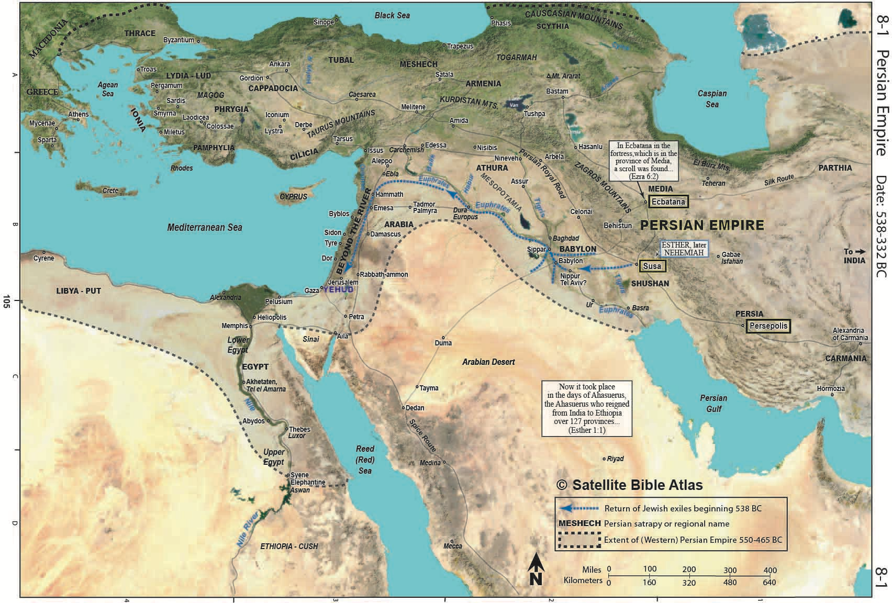
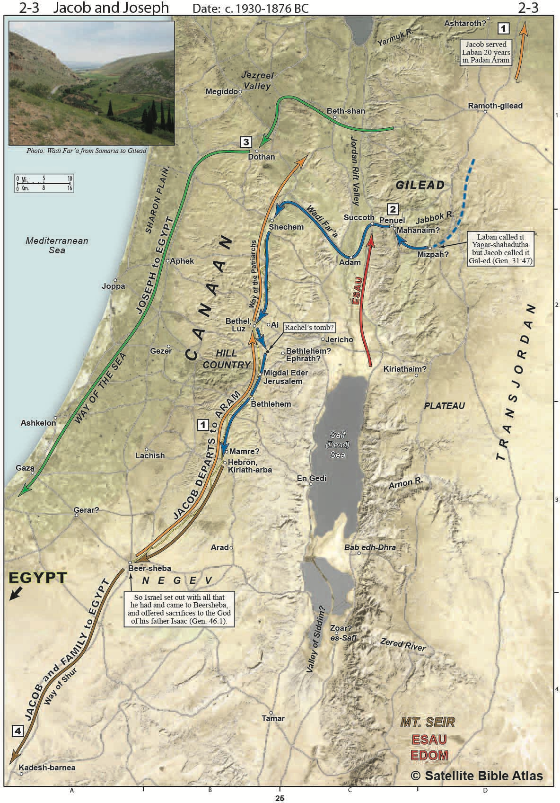
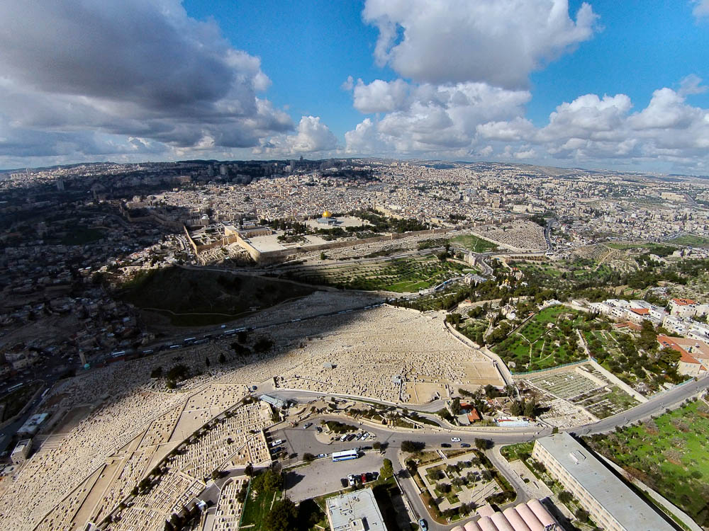
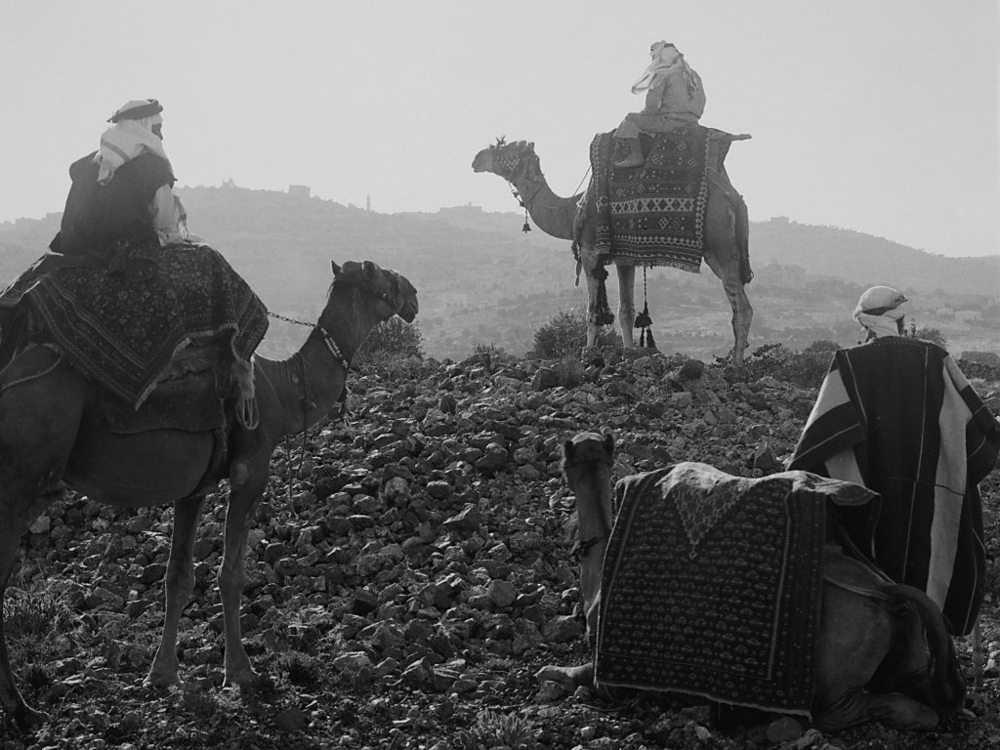
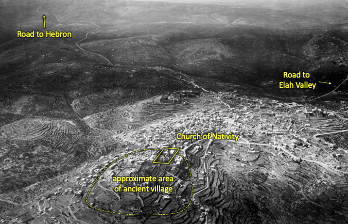
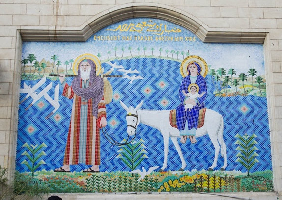
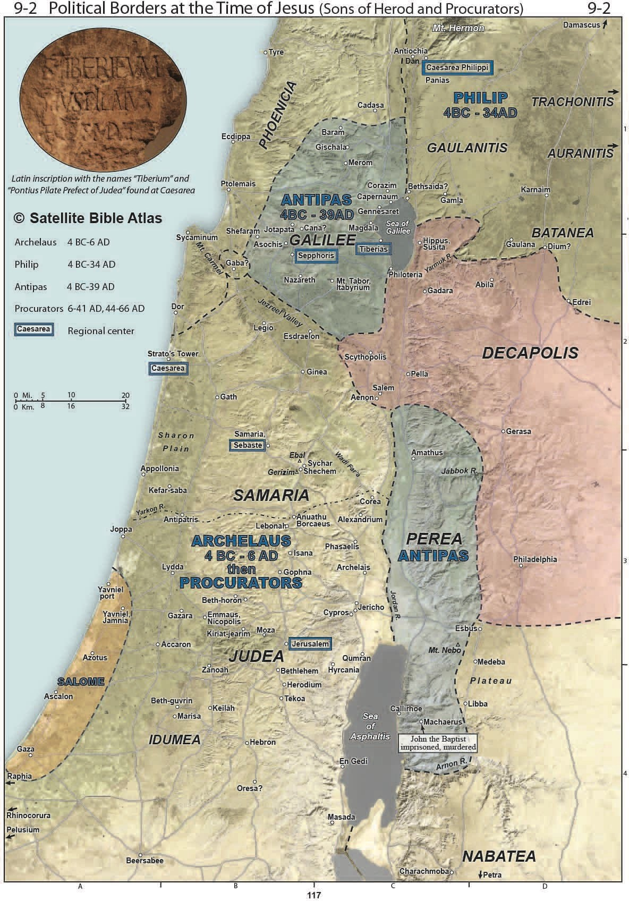

> In THE NAZARENE, Joseph and Mary return to the remote village of Nazareth overlooking the Jezreel Valley and Mount Tabor. The transition from cosmopolitan Alexandria to backwater Nazareth allows them to live out their own personal exodus from Egypt. Every year at Passover, the family joins other Galileans to make the pilgrimage to Jerusalem for the festival. Twelve-year-old Yeshua is reluctant to leave His Father’s house in the holy city.

Read/hear the portions: Matthew 2 | Luke 2:39-52



## Videos

### Talmidim Way Backgrounds



### Following the Messiah - Appian Media



## Geographical overview. 

Matthew’s narrative includes the visit of the Magi from the “east” – scholars think it’s either Parthia/Persia or Arabia. In general, the Euphrates separated the Parthian from the Roman empire. Frankincense and Myrrh are associated more with Arabia, but this doesn’t mean the Magi had to come from Arabia, although they certainly could have. We’re going to see that Herod and all Jerusalem was in an uproar, which to some suggests Herod may have thought a Parthian invasion was imminent. (Three guys on camels would not cause an uproar, but we’ll bust that Christ myth a bit later!). After the Magi’s visit, the Holy Family flees to Egypt. We aren’t told where, but Alexandria is a fair assumption because of the significant Jewish population there.

In a sense the whole bible is about usurpers, starting back in Genesis 3 with the serpent tricking man into thinking that our way is better than God’s way. That deception still continues, not only in the geopolitical world around us but also within us individually. Herod is the phony king of the Jews who isn’t even Jewish, while Jesus is the rightful one who is BORN king of the Jews. Herod represents darkness while Jesus represents light. At this point in Matthew 2, the evil king is hunting down Yeshua, who must relocate to safety.

We believe Old Testament Joseph traveled along the Via Maris, the way of the sea, while Jacob and his family traveled along the way of the Patriarchs to Beersheba and then on down to Egypt. Given that Bethlehem lies along the way of the patriarchs, it’s reasonable to suspect the Holy Family used the same road as Jacob when they fled to Egypt.

The Magi are said to depart from Bethlehem a different way, which is to say they did not go back through Jerusalem.

Herod died in 4 BC. After the sojourn in Egypt, the text appears their first choice would have been to go back to Bethlehem however the political situation – and the holy spirit – directed them back to Nazareth.

Archelaus, who was now over Judea and Samaria (including Jerusalem) was every bit as ruthless as his father Herod was. He was so awful that Rome replaced him in AD 6 with the procurators. The procurator we know best is Pontius Pilate.

Archelaus’ brother Antipas was over Galilee and Perea.

After Matthew 2, whenever we read “Herod” or “Herod the Tetrarch” without further designation, that is referring to Herod Antipas. Antipas is the Herod at the end of Jesus’ life who asks for a miracle. When Jesus stays silent (Refusing to acknowledge his authority), Antipas mocks him and sends him back to Pilate.

## The Magi honor the King

<table>
<colgroup>
<col style="width: 49%" />
<col style="width: 50%" />
</colgroup>
<thead>
<tr class="header">
<th>Matthew 2:1-2</th>
<th>References</th>
</tr>
</thead>
<tbody>
<tr class="odd">
<td>Now after Jesus was born in Bethlehem of Judea in the days of Herod the king, behold, wise men from the east came to Jerusalem, saying, “Where is he who has been born king of the <em>Ioudaioi</em>? For we saw his star when it rose and have come to worship him.”</td>
<td>
Num 24:17 I see him, but not now; I behold him, but not near: a star shall come out of Jacob, and a scepter shall rise out of Israel; it shall crush the forehead of Moab and break down all the sons of Sheth.

Gen 3:15 I will put enmity between you and the woman, and between your offspring and her offspring; he shall bruise your head, and you shall bruise his heel.”

Isa 2:6 For you have rejected your people, the house of Jacob, because they are full of things from the east
</td>
</tr>
</tbody>
</table>

Magi were gentile/ pagan astrologers whose divinatory skills were widely respected in the Greco-Roman world; astrology had become popular through the “science” of the East. According to Keener, “everyone agreed that the best astrologers lived in the East.” Isaiah acknowledges this in Isa 2:6.

As we have mentioned, there is a possible dig at Herod when they ask, “where is He that is BORN king of the Jews?”. Herod was appointed by Rome. They could be saying “where is the REAL king?” Even if they didn’t mean it as an insult, it is likely Herod took it as such.

That messiah would be signified by a star goes back to Numbers 24 and a prophecy by Balaam, also a gentile.

One of Matthew’s points is that gentiles who would otherwise have no interest in a Jewish messiah make the trek across the lands to come bow to

Him, while in verse 5, the religious who should worship the messiah do not.

As we move through the Gospels, we’ll encounter a terminology problem with the word translated as “Jews” in our Bibles. For us 2000 years later, it can be difficult without additional context. Sometimes the Jews are all Jewish people in the first century and other times they are a specific subset, such as the corrupt political elite. Some speculate it would only take as few as 20 or 30 people to engineer the plot to arrest and kill Jesus.

We use “Americans” the same way, but we usually understand the meaning from the context. “The Americans invaded Afghanistan” versus “Americans have specific rights outlined in the constitution.”

To remind us that we need to ask ourselves this question and not immediately assume all Jews, I will use the Greek term *Ioudaioi*. In this context in Matthew 2, *Ioudaioi* means all Jews. In the next lesson, we will see that this term refers to a very small subset of temple-establishment types.

| **Matthew 2:3-4**                                                                                                                                                                                      
|-------------------------------------------------------------------------------------------------------------------------------------------------------------------------------------------------------
| When Herod the king heard this, he was troubled, **and all Jerusalem with him**; and assembling all the chief priests and scribes of the people, he inquired of them where the Messiah was to be born. |                |

As we said earlier, it could have been a threat of military incursion from Parthia or it could simply be a situation of “if Herod isn’t happy, then ain’t nobody happy,” While Herod provided many jobs with his building projects, overall it is safe to say he was hated. Rumors of a prophesied new king could have spread quickly throughout Jerusalem[^1] and many would have been ready to join a political incursion

We’ve looked at Bethlehem in the Annunciations video so this is just a refresher. Bethlehem is about 4-5 miles from Jerusalem. The main road in the centre of the slide is roughly the same road since antiquity, the Way of the Patriarchs

**Yeshua was born** between 8 and 4 B.C.E[^2]. The reason he was born "B.C." ("Before Christ") is that Dionysius Exiguus, the sixth century monk who set up the modern calendar, made a mistake in determining the date which was not corrected till later.[^3]

“Though he died in the early days of the New Testament period, King Herod left a significant mark on the land of Israel for decades to come. His structures at Masada still cause visitors to marvel.”[^4]

Herod was paranoid about his power and was known to eliminate any potential threats, including those of his own family. He built palaces such as Masada in case he needed to flee in the event of a revolt. Ironically Masada has become a symbol of Jewish freedom and independence similar to what the Alamo in Texas means to Texans. Near the very end of the first Jewish Revolt (66-72) a band of Jewish rebels made this their last stand against the Romans. As the Romans were about to breach the walls, Josephus records that they committed mass suicide instead of becoming slaves (well the men would have been killed and the women and children would have been slaves.) To this day one of the mottos of the Israeli Defense Forces is “Masada shall never fall again.” Several IDF units hold their swearing-in ceremonies at Masada.

Another one of Herod’s grand construction projects was the city of Caesarea. Here he constructed a palace, theater, temple, and harbor. Caesarea is the location where the Gospel first went out to the Gentiles. Acts 12 records that Herod Agrippa died in the theater

{}

**Christmyths** 

>We have several issues with our traditional representation of the wise men versus what the Bible actually says

* The bible does not record that the shepherds and the wise men visited Jesus at the same time. 

* By the time the wise men show up, they are in a House in Bethlehem, not a manger. Judging by the decree to kill the boys 2 years and younger, this visit could have happened up to two years later. 
* The shepherds did not see a star, the Magi did

-   Again, the time of year is not mentioned and December is an unlikely month to bring a caravan across the desert.

-   Finally, the Bible does not say there were three wise men. In fact, "all Jerusalem was in an uproar." It is highly unlikely that three guys on camels could have caused this. The people possibly were fearing a Parthenian military incursion which means this could have been an entire entourage, such as one sent in advance to spell out the terms.

{}

Magi were pagan astrologers; in that day, “astrology” was more of a “hard science” than we consider it today. Even though these Magi were Pagan, God had chosen to reveal himself to them. [^6]

There is a tradition that Daniel put all this in motion when he was placed in an executive leadership role in Daniel 6. That they saw “his star” could be a reference to Numbers 24:17, where Balaam, also a gentile like the Magi were, said “There shall come forth a star out of Jacob.”

<table>
<colgroup>
<col style="width: 25%" />
<col style="width: 74%" />
</colgroup>
<thead>
<tr class="header">
<th><strong>Matthew 2:5-6</strong></th>
<th><strong>References</strong></th>
</tr>
</thead>
<tbody>
<tr class="odd">
<td>They told him, “In Bethlehem of Judea, for so it is written by the prophet: “‘And you, O Bethlehem, in the land of Judah, are by no means least among the rulers of Judah; for from you shall come a ruler who will shepherd my people Israel.’”</td>
<td>
Mic 5:2 But you, O Bethlehem Ephrathah, who are too little to be among the clans of Judah, from you shall come forth for me one who is to be ruler in Israel, whose coming forth is from of old, from ancient days.

2Sa 5:2 And the LORD said to (David), ‘You shall be shepherd of my people Israel, and you shall be prince over Israel.’”
</td>
</tr>
</tbody>
</table>

Keener notes that the scribes had head knowledge that Messiah was to be born in Bethlehem and received a potential sign from God that this birth had occurred, yet they did nothing with it (either positively has the Magi did or negatively, as Herod will do in verse 16). There’s a huge difference in knowing about Jesus and knowing Jesus.

We’ve talked in previous videos about Matthew’s editing, very loose paraphrasing, and broad interpretation of Old Testament prophecies, to the point where he is clearly taking them out of context. “You will shepherd my people Israel,” which is found in 2 Samuel 5:2, isn’t even a prophecy but more of a commission to David. While it seems strange to us and would not be acceptable by today’s academic standards of exegesis, it was very consistent with rabbinic exegesis of the day. Matthew is using the text of 2 Samuel 5:2 as what is called a “midrash” which serves to expand on Micah 5:2, Lancaster rephrases this as, “The ruler coming forth from Bethlehem is Messiah, Son of David who will shepherd Israel just as David of Bethlehem did.”

It’s a fair question to ask why the Magi went to Jerusalem if the Messiah was prophesied to be born in Bethlehem. It’s logical for the Magi to assume the messiah would have been born in Jerusalem, and possibly been one of Herod’s sons. Also, Bethlehem and Jerusalem are only a few miles apart. When they go to Bethlehem Luke records that a star will guide thim; this is reminiscent of the pillar of cloud by day and the pillar of fire by night that guided the children of Israel in the wilderness.

<table>
<colgroup>
<col style="width: 50%" />
<col style="width: 49%" />
</colgroup>
<thead>
<tr class="header">
<th>Matthew 2:7-8</th>
<th>References</th>
</tr>
</thead>
<tbody>
<tr class="odd">
<td>
Then Herod summoned the wise men secretly and ascertained from them what time the star had appeared. And he sent them to

Bethlehem, saying, “Go and search diligently for the child, and when you have found him, bring me word, that I too may come and worship him.”
</td>
<td>Isa 2:6 For you have rejected your people, the house of Jacob, because they are full of things from the east and of fortune-tellers like the Philistines, and they strike hands with the children of foreigners.</td>
</tr>
</tbody>
</table>

Instead of reacting favorably to the news the Messiah was born, Herod, like most other pagan rulers of his day attempted to divine from the stars things pertaining to the fate of his kingdom. The problem is such divination was forbidden for Jews in Deuteronomy 18. Here Isaiah makes an interesting statement that God’s people look to “things from the east and of fortune tellers.” this is exactly what Herod does even though He’s just been read Micah 5:2. The ancients thought comets and falling stars predicted the fall of rulers; some emperors even banished from Rome astrologers who issued such predictions.

Spoiler alert: Herod has no intention of Worshipping Jesus. He never hesitated to murder anyone whom he saw as a threat to his throne.

The Magi traveled six miles (10 km) south from Jerusalem to Bethlehem. Since some time had apparently passed (up to two years), and verse 11 mentions the “house” where Jesus’s family was staying, it is likely that they had moved from the place where Jesus was born.

<table>
<colgroup>
<col style="width: 50%" />
<col style="width: 49%" />
</colgroup>
<thead>
<tr class="header">
<th>Matthew 2:9-12</th>
<th>References</th>
</tr>
</thead>
<tbody>
<tr class="odd">
<td>
After listening to the king, they went on their way. And behold, the star that they had seen when it rose went before them until it came to rest over the place where the child was. When they saw the star, they rejoiced exceedingly with great joy.

And going into the house, they saw the child with Mary his mother, and they fell down and worshiped him. Then, opening their treasures, they offered him gifts, gold, frankincense, and myrrh. And being warned in a dream not to return to Herod, they departed to their own country by another way.

Now when they had departed, behold, an angel of the Lord appeared to Joseph in a dream and said, “Rise, take the child and his mother, and flee to <strong>Egypt</strong>, and remain there until I tell you, for Herod is about to search for the child, to destroy him.”
</td>
<td>
Isa 60:5-6 The wealth of the nations shall come to you. A multitude of camels shall cover you, the young camels of Midian and Ephah; all those from Sheba shall come. They shall bring gold and frankincense, and shall bring good news, the praises of the LORD.

Psa 45:8 your robes are all fragrant with myrrh and aloes and cassia.

Gen 37:28 Then Midianite traders passed by. And they drew Joseph up and lifted him out of the pit, and sold him to the Ishmaelites for twenty shekels of silver. They took Joseph to Egypt.
</td>
</tr>
</tbody>
</table>

The three gifts are likely where we get the tradition of “three wise men”. Although we often picture treasure troves of gold being presented, Scripture doesn’t tell us how much gold was provided to them or what happened to it. We know that the offering of the two pigeons at the temple indicates Mary and Joseph were poor (although the Maji visit could have happened after Luke recorded that event at the temple). We get no indication that the family had any significant wealth either during Jesus’ childhood or after.

Myrrh had a number of uses, including incense (Exod 30:23), perfume (Ps 45:9), cosmetic (Esth 2:13), anesthetic (Mark 15:23), and embalming (John 19:39).

Since the main road in and out of town would have taken them directly through Jerusalem, they had to find another way. We don’t really know which way they went. Again, they likely had a large entourage, making clandestine travel difficult.

## The Flight to Egypt

| Matthew 2:13                                                                                                                                                                                                                                                  | References                                                                                                                                                                                             |
|---------------------------------------------------------------------------------------------------------------------------------------------------------------------------------------------------------------------------------------------------------------|--------------------------------------------------------------------------------------------------------------------------------------------------------------------------------------------------------|
| Now when they had departed, behold, an angel of the Lord appeared to Joseph in a dream and said, “Rise, take the child and his mother, and flee to **Egypt**, and remain there until I tell you, for Herod is about to search for the child, to destroy him.” | Gen 37:28 Then Midianite traders passed by. And they drew Joseph up and lifted him out of the pit, and sold him to the Ishmaelites for twenty shekels of silver. They took Joseph to Egypt. |

There are literally over 100 different ways that the lives of Jacob’s son Joseph and Jesus are connected. Both not only had a sojourn in Egypt but both were also carried off at the hands of Ishmaelites. Edomites and Ishmaelites are interrelated. Joseph was carried by Ishmaelites while Jesus fled the hand of Herod the Edomite. In Gen 37:28 we also see that both were lowered and lifted out of a pit (Jesus when He was imprisoned by Caiaphas) and both were sold for pieces of silver.

| Matthew 2:14-15                                                                                                                                                                                                        | References                                                                                                                                                                                                                                                                                                                                                                                                                                                                                                                                                                                                                     |
|------------------------------------------------------------------------------------------------------------------------------------------------------------------------------------------------------------------------|--------------------------------------------------------------------------------------------------------------------------------------------------------------------------------------------------------------------------------------------------------------------------------------------------------------------------------------------------------------------------------------------------------------------------------------------------------------------------------------------------------------------------------------------------------------------------------------------------------------------------------|
| And he rose and took the child and his mother by night and departed to Egypt and remained there until the death of Herod. This was to fulfill what the Lord had spoken by the prophet, “Out of Egypt I called my son.” | Hosea 11:1-5 When Israel was a child, I loved him, and out of Egypt I called my son. The more they were called, the more they went away; they kept sacrificing to the Baals and burning offerings to idols. Yet it was I who taught Ephraim to walk; I took them up by their arms, but they did not know that I healed them. I led them with cords of kindness, with the bands of love, and I became to them as one who eases the yoke on their jaws, and I bent down to them and fed them. They shall not return to the land of Egypt, but Assyria shall be their king, because they have refused to return to me. |

One aspect we can miss is when Jesus, Matthew or Luke references a small segment of one verse, the original audience would more than likely have understood the entire passage. To further complicate matters, sometimes the snippet the apostolic writer quotes may be relatively innocent sounding, but the underlying passage has an entirely different complexion. Such is the case here. First of all, Matthew is taking Hosea entirely out of context. That is not even up for debate. The point is that Jesus epitomizes and fulfills Israel’s history. Keener writes, “Isaiah narrows down the mission of Israel as a whole to the one who can ultimately fulfill that mission and suffer on behalf of the whole people.”

To be sure, there is nothing the slightest bit messianic about Hosea 11. We would be hard-pressed to call verses 1-4 prophecy. It is more of a lamentation. In verse 1, We can see it specifically refers to the nation Israel. Matthew is making a larger point. Just as Israel fled to and was called out from Egypt, so too it is with Messiah. Israel is God’s son; Messiah is God’s Son. Matthew was following common methods of Rabbinical interpretation.

The part we miss is the entire passage of Hosea. Notice the sadness God has for his people who reject him despite his constant calling, healing, lovingkindness and provision. By the way, this is not just national Israel but you and me when we act ungrateful and stiff-necked. In context Hosea was written to the northern kingdom – because they refuse to serve the God of Abraham, Isaac and Jacob, and follow other gods, they will be forced to live under a despotic ruler, Assyria, just as generations before were slaves in Egypt.

Chuck Missler subtitled his verse-by-verse commentary on Hosea, “Hosea can you see.” His point was the warnings and lamentations God had for the northern kingdom apply to His people living in the United States who reject Him.

Bolen notes that Joseph and Mary likely traveled west out of the hill country from Bethlehem and down to the Elah Valley shown in the photo[^7]. They may have followed a route running similar to the modern road that travels west through the valley. In this case, they would have traveled by the scene where David killed Goliath, perhaps considering that the child with them was the “son of David” who would defeat all of the enemies of God’s people in order to permanently establish the Lord’s kingdom on earth.

The other option is heading south through Hebron and down to Beersheba. In this case, I like to imagine the Holy Family thinking of Genesis 22, when God came through in a big way after Abraham nearly offered Isaac. Genesis 22:19 says that Abraham and his men returned to Beersheba. Either way, they would have recalled something miraculous that God did, just as he was doing in their own lives. This is the benefit of visiting Israel for us today. These stories jump off the black and white pages and seem more real somehow. A trip to the Holy Land strengthens our faith in a way that nothing else can.

This modern mosaic[^8] in the courtyard of the Hanging Church depicts Joseph, Mary, and baby Jesus traveling along the Nile River bank with the Great Pyramids of Giza in the background.

A very large Jewish community was in Egypt, particularly in Alexandria.

| Matthew 2:16                                                                                                                                                                                                                                                         | References                                                                                                                                                   |
|----------------------------------------------------------------------------------------------------------------------------------------------------------------------------------------------------------------------------------------------------------------------|--------------------------------------------------------------------------------------------------------------------------------------------------------------|
| Then Herod, when he saw that he had been tricked by the wise men, became furious, and he sent and killed all the male children in Bethlehem and in all that region who were two years old or under, according to the time that he had ascertained from the wise men. | Exo 1:22 Then Pharaoh commanded all his people, “Every son that is born to the Hebrews you shall cast into the Nile, but you shall let every daughter live.” |

We don’t have any extrabiblical documentation of what is known as the slaughter of the innocents. “Following the Messiah” episode 1 has some interesting speculation on this if you are interested. Even biblical skeptics concede that this behavior of flying into a rage and ordering executions is entirely consistent with everything we know about Herod. Possibly the reason it escaped notice from historians is that we estimate the number of children killed was probably less than 30. This number is shocking to our ears, but Herod and the Romans who followed him didn’t hesitate to have hundreds executed at a time.

Certainly, the parallel is there with Pharaoh who gave a similar command only to have God’s appointed deliverer miraculously escape the decree. Just as Moses was saved in the waters of the Nile, so too did Jesus escape across the Nile to safety.

The First century Jewish Historian Josephus records a legend, “One of the pharaoh’s sacred (astrologers) told the king that a child was about to be born to the Israelites, who, if allowed to live, would humble the kingdom of Egypt and exalt the Israelites. The King was so frightened that he commanded they should cast every male child born to the Israelites into the river and kill it.” Lancaster writes, “Matthew’s readers would have known this legend about the astrologers and the birth of Moses. They would have seen that the birth of Jesus followed the pattern set by Moses.”[^9]

<table>
<colgroup>
<col style="width: 50%" />
<col style="width: 49%" />
</colgroup>
<thead>
<tr class="header">
<th>Matthew 2:17-18</th>
<th>References</th>
</tr>
</thead>
<tbody>
<tr class="odd">
<td>
Then was fulfilled what was spoken by the prophet Jeremiah: “A voice was heard in Ramah, weeping and loud lamentation, Rachel weeping for her children; she refused to be comforted because they are no more.

But when Herod died, behold, an angel of the Lord appeared in a dream to Joseph in Egypt, saying, “Rise, take the child and his mother and go to the land of Israel, for those who sought the child's life are dead.” And he rose and took the child and his mother and went to the land of Israel.
</td>
<td>
Jer 31:15 Thus says the LORD: “A voice is heard in Ramah, lamentation and bitter weeping. Rachel is weeping for her children; she refuses to be comforted for her children, because they are no more.”

Exo 12:39 And they baked unleavened cakes of the dough that they had brought out of Egypt, for it was not leavened, because they were thrust out of Egypt and could not wait, nor had they prepared any provisions for themselves.
</td>
</tr>
</tbody>
</table>

Bolen: “Archaeologists discovered the remains of Herod’s tomb in 2007. Most of it was destroyed, but experts were able to reconstruct it based upon the fragments found.” [^10]

Herod knew he was hated by the people who were likely to be very happy when he died. There’s a famous story that when Herod was about to die, he had several prominent and popular Jewish sages arrested. He gave orders that as soon as he died, the sages were to be murdered, thus causing the people to mourn “as such as never had any king before him; the nation would mourn from their very soul.” After he died, His sister Salome hurried to the prison and lied that Herod had ordered the sages released. All Israel now had two reasons to rejoice!

## “Passover” Exodus

<table>
<colgroup>
<col style="width: 33%" />
<col style="width: 33%" />
<col style="width: 33%" />
</colgroup>
<thead>
<tr class="header">
<th>Matthew 2:19-23</th>
<th>Luke 2:39-40</th>
<th><strong>References</strong></th>
</tr>
</thead>
<tbody>
<tr class="odd">
<td>But when he heard that Archelaus was reigning over Judea in place of his father Herod, he was afraid to go there, and being warned in a dream he withdrew to the district of Galilee. And he went and lived in a city called Nazareth, so that what was spoken by the prophets might be fulfilled, that he would be called a Nazarene.</td>
<td>And when they had performed everything according to the Law of the Lord, they returned into Galilee, to their own town of Nazareth. And the child grew and became strong, filled with wisdom. And the favor of God was upon him.</td>
<td>
Isa 11:1 There shall come forth a shoot from the stump of Jesse, and a branch from his roots shall bear fruit.

Zec 3:8 Hear now, O Joshua the high priest, you and your friends who sit before you, for they are men who are a sign: behold, I will bring my servant the Branch.

Jer 23:5 “Behold, the days are coming, declares the LORD, when I will raise up for David a righteous Branch, and he shall reign as king and deal wisely, and shall execute justice and righteousness in the land.
</td>
</tr>
</tbody>
</table>

On the surface this prophecy by Matthew is puzzling. There is no passage in the Old Testament that says “He shall be called a Nazarene.” Therefore people conclude matthew was either misinformed or he fabricated the whole story. The key is understanding that the root word for Nazareth is Netzer, which means branch or sprout. This word is used in Isaiah 11:1. In Zechariah 3:8 and Jer 23:5 a synonym is used, Tzemach.

“In other words, Matthew is not referring to just one prophecy when he says “He shall be called a Nazarene,” nor is he quoting a particular passage. This is why he says “spoken by the prophet**S”** In every other citation he uses prophet, singular but here he communicates the substance of several prophets.” COM 131

As the holy family was in Egypt Jerusalem descended into chaos. Rome had ordered that her image of a golden eagle be hoisted above the Temple gates, which was a deliberate offense to the Jews who considered Herod complicit in the deed. Curiously this was a fulfilment of prophecy. Hosea 8:1: Hos 8:1 Set the trumpet to your lips! One like a vulture is over the house of the LORD, because they have transgressed my covenant and rebelled against my law.

Several devout believers scaled the Temple walls and threw down the eagle. Herod reacted with mass arrests and executions. Since we’ve been talking about omens, Josephus records that night following the executions, there was a full moon and Herod’s health started failing. Herod knowing the people hated him had grew concerned more of the most popular sages arrested and imprisoned in Jericho. He gave the order that as soon as he died, the sages were to be murdered, thus causing the people to mourn “as such as never had any king before him; the nation would mourn from their very soul.” After he died, His sister Salome hurried to the prison and lied that Herod had ordered the sages released. All Israel now had two reasons to rejoice!

Archelaus was what we might call a train-wreck. Keener: Archelaus exhibited his father’s worst flaws. The romans ultimately deposed him.

Joseph opted instead for the territory of Antipas, who was slightly less dangerous than Archaleous. Antipas is the Herod who has john the Baptist executed and who will mock Jesus just before His crucifixion.

In Jesus’s day, the population of Nazareth was probably only a few hundred people but archaeologists believe many people moved here from near Bethlehem, David’s town. Since Netzer means “branch” perhaps these were the original branch davidians. (if you’re not old enough to understand that joke, consider yourself blessed!).

## Jesus at the Temple

| Luke 2:41-45                                                                                                                                                                                                                                                                                                                                                                                                                                                                                              |
|-----------------------------------------------------------------------------------------------------------------------------------------------------------------------------------------------------------------------------------------------------------------------------------------------------------------------------------------------------------------------------------------------------------------------------------------------------------------------------------------------------------|
| Now his parents went to Jerusalem every year at the Feast of the Passover. And when he was twelve years old, they went up according to custom. And when the feast was ended, as they were returning, the boy Jesus stayed behind in Jerusalem. His parents did not know it, but supposing him to be in the group they went a day's journey, but then they began to search for him among their relatives and acquaintances, and when they did not find him, they returned to Jerusalem, searching for him. |

The Lord commanded Israelite men to appear before him three times a year (Deut 16:16). Today, 2,000 years after the time of Jesus, Jewish families continue to “go up” to Jerusalem for the three annual feasts.

Stern notes that in that day, the tradition made allowances for folks far away, including granting an exception to the Torah requirement for those who would have had to travel long distances. Despite this, note that Joseph and Mary went to Passover every year.[^11]

Jesus was considered to have “come of age” when He reached twelve, but it is not known if a custom similar to today’s bar mitzvah was practiced in the 1st century AD. A bar mizvah as we know it today was first recorded not until the middle ages, but it appears to have roots in whatever was practiced in that day.

Today, many Jewish boys celebrate their bar mitzvahs at the Western Wall prayer plaza. In the photo above, the 13-year-old is wearing phylacteries and reading from the Torah Scroll. Overall it’s a joyous occasion, socially similar to a baptism in the church today.

<table>
<colgroup>
<col style="width: 52%" />
<col style="width: 47%" />
</colgroup>
<thead>
<tr class="header">
<th>Luke 2:46-48</th>
<th>References</th>
</tr>
</thead>
<tbody>
<tr class="odd">
<td>
After three days they found him in the temple, sitting among the teachers, listening to them and asking them questions. And all who heard him were amazed at his understanding and his answers. And when his parents saw him, they were astonished.

And his mother said to him, “Son, why have you treated us so? Behold, your father and I have been searching for you in great distress.” And he said to them, “Why were you looking for me? Did you not know that I must be in my Father's house?”  And they did not understand the saying that he spoke to them.
</td>
<td>Exo 20:12 “Honor your father and your mother, that your days may be long in the land that the LORD your God is giving you.</td>
</tr>
</tbody>
</table>

We are probably not appreciating the non-verbal cues in verse 48-51. In no way is Jesus being snotty or disrespectful. The commandment to honor one’s father and mother was one of the most important – we will see this in verse 51 where Jesus is “submissive” to them. Stern notes that in light of what had already been revealed to them back when he was born, they should have known where to look. Another thought is Joseph and Mary likely would have been very proud of their oldest son involved in an adult-level discussion with elite sages.

Most visitors are surprised today at the expansive size of the Temple Mount. At about

35 acres (14 ha), the Temple Mount would fit a total of 25 football fields. Joseph and Mary could have spent several hours looking before they found Jesus.

We may find that answering a question with another question is irritating, but in that day asking intelligent questions was a way of demonstrating that you understand the material.

{}
{}

**Approved Talmidim Are Not Ashamed**

*2nd Timothy 2:15* **Study** to show yourself **approved** to God, a **worker** who has no need to be **ashamed**, rightly handling the **word** of **truth**

Jesus respectfully but unapologetically explained to His parents that the study of the Word took priority at that moment. Jesus would later use His knowledge of Scripture to fend off the devil’s attacks.

As we grow as talmidim, disciples, we want to be just like Jesus, which means, among our other necessary priorities such as work and tending to our families, we need to be consistently setting aside time for the serious study of His word. We have no idea when our time of temptation will come but the one thing we can do now is to be as prepared as possible by having a deep relationship with Jesus and His word.

{}
{}

| Luke 2:51-52                                                                                                                                                                                                       | References |
|--------------------------------------------------------------------------------------------------------------------------------------------------------------------------------------------------------------------|------------|
| And he went down with them and came to Nazareth and was submissive to them. And his mother treasured up all these things in her heart. And Jesus increased in wisdom and in stature and in favor with God and man. |            |

It’s not exactly true to say we know nothing of Jesus childhood outside of the Temple incident. Verse 52 tells us a lot, that Jesus increased with wisdom and in stature and in favor with God and man.

Craig Dehut, concludes “Even without very many details of Jesus’ upbringing, you can clearly see the rural influence in how He taught. In the Sermon on the Mount (Matthew 5-7) He will spoke about Salt and Lamps, birds, lilies and grass, grapes, figs and trees. His parables had a rural focus, using seeds, weeds, leaven, fields, merchants and fishing."

> **The time Jesus spent growing up in the rustic town of Nazareth with the humble family of Joseph and Mary provided the familial influence and upbringing that God wanted His son to have.**

That’s going to lead in to our application for this lesson.

## Application

“No one would have been attracted to Jesus because of his education or his zip code.If anyone was attracted to Jesus it was for what He taught, what He did, and who they believed Him to be. Are we attracted to Jesus for the right reasons?” – Jeremy DeHut

**Bibliography**

Bolen, Todd. “Matthew 2.” PowerPoint handout, Santa Clarita, CA, 2018.

Keener, Craig S. *The IVP Bible Background Commentary: New Testament*. 2nd edition (E-Sword). Downers Grove, Illinois: IVP Academic, 2014.

Lancaster, D. Thomas. *Chronicles of the Messiah*. Edited by Boaz Michael and Stephen D. Lancaster. 2nd ed. Vol. 3. 6 vols. Torah Club. Marshfield, MO: First Fruits of Zion, 2014.

Schlegel, William. “The Land and the Bible: A Historical Geographical Companion to the Satellite Bible Atlas,” September 2015. <https://www.bibleplaces.com/wp-content/uploads/2015/08/The-Land-and-the-Bible.pdf>.

———. *The Satellite Bible Atlas by William Schlegel*. Israel: William Schlegel, 2013.

Stern, David H. *Jewish New Testament Commentary: A Companion Volume to the Jewish New Testament*. E-Sword edition. Clarksville, Md.: Lederer Messianic Publications, 1992.

https://friends.ffoz.org/resources/portion-connections/the_nazarene_1.html

[^1]: Todd Bolen, “Matthew 2” (PowerPoint handout, Santa Clarita, CA, 2018), fig. ws122114828.

[^2]: Instead of the terms "A.D." ("*Anno Domini*," "in the year of \[the\] Lord") and "B.C." the many scholars denote these periods by "C.E." ("Common Era") and "B.C.E." ("Before the Common Era"). While there is a degree of being non-offensive, at least this way we can’t say Jesus was born Before Christ. I personally don’t have a problem with C.E and B.C.E. As for being non-offensive, Romans 12:18 says we should be at peace with all men; it’s not like we’re denying a critical doctrine of the faith by saying “CE” instead of “BC”

[^3]: David H. Stern, *Jewish New Testament Commentary: A Companion Volume to the Jewish New Testament*, E-Sword edition (Clarksville, Md.: Lederer Messianic Publications, 1992), loc. Matthew 2:1.

[^4]: Bolen, “Matthew 2,” 2.

[^5]: Bolen, fig. mat06286.

[^6]: Craig S. Keener, *The IVP Bible Background Commentary: New Testament*, 2nd edition (E-Sword) (Downers Grove, Illinois: IVP Academic, 2014), loc. Mat 2:1.

[^7]: Bolen, “Matthew 2,” fig. ws030517085.

[^8]: Bolen, fig. adr1603111933.

[^9]: D. Thomas Lancaster, *Chronicles of the Messiah*, ed. Boaz Michael and Stephen D. Lancaster, 2nd ed., vol. 3, Torah Club (Marshfield, MO: First Fruits of Zion, 2014), 121.

[^10]: Bolen, “Matthew 2,” fig. tb042512616.

[^11]: Stern, *Jewish New Testament Commentary*, loc. Luke 2:41.

