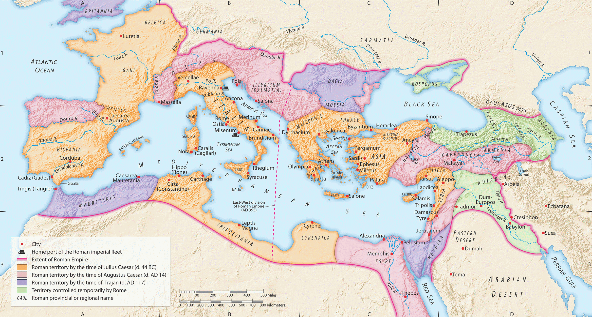
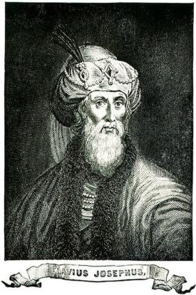
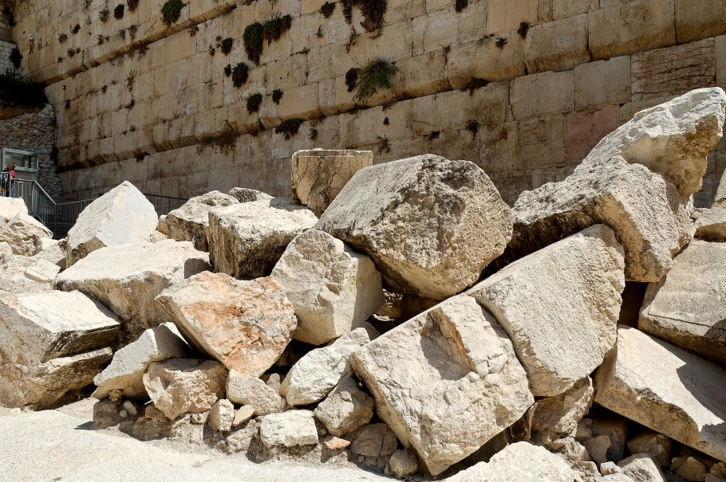
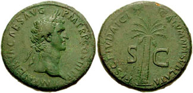
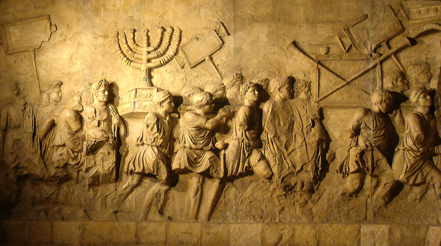



 

**Summary**

This is going to be a supplement to our Revelation background series. We're essentially going to take a look at significant events in the period between the Jewish Revolt of 66CE, including the destruction of the Jewish Temple in 70, through the mid-90s that resulted in John's exile on Patmos, where he received the Revelation. Even if history wasn't your best subject in school, I think you'll find this helpful as we prepare to study Revelation.

**Video**



### Introduction

Other than Jesus predicting the temple's destruction in Luke 21, all of this is drawn from extra-biblical sources. Much of it is verifiable from historical documents. Still, some of it is based on church tradition that was likely passed on orally before it was written down several centuries later.

The church father, Iraneus, was only one generation removed from John the Apostle. Iraneus in *ecclesiastical history¸*is the earliest source that tells us that John the Apostle wrote Revelation and did so from Patmos because the Roman Emperor Domitian exiled him.

Domitian's persecution turns out to be critically important if we are to put Revelation in context. The following is summarized mainly from Cargill's *Jerusalem the Holy City* course[^1] and Lancaster's series *Apocalypse of John[^2]* and *Chronicles of the Apostles*[^3]*.*

[^1]: Primarily Robert R. Cargill, *Jerusalem in Rebellion*, Jerusalem: The Holy City (Spring 2010): A History of Jerusalem from Ancient Canaan to Modern Israel, 2010, https://itunes.apple.com/itunes-u/jerusalem-holy-city-spring/id434136076?mt=10, and *Exilic Jerusalem.*

[^2]: Primarily Daniel T. Lancaster, *Boiled in Oil*, Apocalypse of John, 2015, accessed January 19, 2022, https://www.bethimmanuel.org/audio-series/apocalypse-of-john but other lectures as well.

[^3]: Daniel T. Lancaster, “Patmos,” in *Chronicles of the Apostles*, ed. Boaz D. Michael and Stephen D. Lancaster, vol. 5, Torah Club (Marshfield, MO: First Fruits of Zion, 2016), 1299–1310.

-   The years following Jesus' Resurrection and Ascension were a tumultuous time for Israel
-   The governors that followed Pontius Pilate went from bad to worse, as did the Herods that took over for Antipas and Phillip, notably Agrippa I and Agrippa II
-   With this came increased talk of rebellion and hopes for a Messianic deliverer
-   In many Jew's minds, the Messiah will deliver the people from captivity and establish a literal political kingdom, just like Moses did during the Exodus.
-   Since Jesus didn't do that, He couldn't be the promised deliverer[^4].
-   False messiahs were abundant.
-   This led to what is known as the "First Jewish Revolt" in 66 CE.

[^4]: This is the primary reason why traditional Jews today can’t accept Jesus as their messiah. The deplorable treatment of Jews by the Church over the centuries has cemented this position in their minds.

### The Jewish Revolt: Nero, Vespasian, and Josephus

-   In 66 CE, during the time of Emperor Nero (famous for his own persecutions and insanity), there was open rebellion; a Roman General named Vespasian (pictured at right) was sent with Roman Legions V, X, and XV to quash it. 
-   Josephus predicts greatness for Vespasian.
    -   During one battle in the north of Israel, Vespasian captured a Jewish general named Yosef ben Mattiyahu, who later became known as Flavius Josephus.
    -   As he was about to be executed, Josephus said to Vespasian something along the lines of, "I'm not really a general. I'm a prophet, and one day you're going to be the emperor."
    -   Most Roman leaders were extraordinarily superstitious.
    -   Naturally, what this man said was pleasing to Vespasian's ears; therefore, Josephus was allowed to live as an enslaved person. He authored two large volumes of Jewish history up to that point.
    -   In 69, while dealing with the Jewish rebellion, Vespasian was recalled to Rome, where he was indeed named emperor.
    -   Josephus also told Vespasian that amid all this Jewish messianic enthusiasm, it was _Vespasian and his line_ who fulfilled the Jewish prophecies about the coming Messiah, not some Jewish person from the house of David.
        -   After Vespasian became emperor, they took Jewish prophecies very seriously!
    -   Josephus was still very much in the picture some 10-20 years later, when Vespasian's son Domitian took over the Roman Empire.
    -   Josephus is viewed as a traitor to the Jews for his actions.
        -   According to legend, a group of generals entered into a suicide pact rather than be captured.
        -   Josephus conveniently drew the proverbial last straw and was tasked with killing the last man and then himself. He obviously took another way when he presented himself to Vespasian.
-   Vespasian's son Titus ultimately was successful in putting down the rebellion.
    -   In 70, he besieged and sacked Jerusalem and destroyed the Temple stone-by-stone, just as Jesus had predicted.
    -   In 72, he rooted out the last Jewish holdouts at a place called Masada
    -   Those Jews who were not slaughtered were forced into exile
    -   The Jews would not have a homeland to call their own until 1948.

### 2nd Temple Destruction Fulfills Prophecy

<small>
Luke 19:41-44 As He drew near and saw Jerusalem, He wept over her, 42. saying, "If only you had recognized this day the things that lead to shalom! But now they are hidden from your eyes. 43. For the days will come upon you when your enemies will surround you with barricades and hem you in on all sides. 44. And they will smash you to the ground—you and your children within you. And they won't leave within you one stone upon another because you did not recognize the time of your visitation.
</small>

-   Jesus' words about the destruction of Jerusalem and the Temple were fulfilled in 70 CE
    -   Indeed, not one stone was left upon another.
    -   A visit to the Temple Mount area in Jerusalem today reveals these massive stones
    -   Based on the indentations in the surrounding pavement, it's easy to conclude that they fell from the top of the temple mount above (note the person in the upper left corner for a sense of the size of the stones!).
-   Archaeologists date these stones to the 1st century and the destruction of Jerusalem by the Roman army. 
-   The destruction of the "2nd Temple" is critical in Jewish history.
    -   The destruction of the 1st Temple in 586 BCE was another such moment.
-   In one of those quirks of history, both destructions happened on the same day on the Jewish Calendar, the 9th day of the Jewish month of Av.
    -   Since then, several calamities have happened on that date, and to this day, the 9th of Av is a day of mourning and fasting for the Jewish People.

### Roman aftermath: Vespasian and Titus

-   The destruction of the Temple was a severe blow to the hopes and aspirations of Jews
    -   For the second time in their history, God's "chosen people" had been decimated, exiled, and seen God's house overrun by a pagan empire.
    -   "How could an all-powerful, all-loving God let this happen? What will we do next?"
    -   The first time it happened was in 586 BCE at the hands of the Babylonians.
-   After the fall of Jerusalem in 70 CE, Emperor Vespasian did two things to teach a lesson to this rebellious people.

        -   This tax only applied to Jews.
    -   He imposed a *fiscus Iudaicus* (a Jewish Tax).[^5] 
        -   As a further insult, the tax went to the upkeep of the pagan Temple of Jupiter/Zeus, which stood where the Jewish Temple once did.
        -   In ancient cultures, putting your holy site over someone else's holy site was the ultimate in "smack talk"; it communicates, "your God is vanquished."
        -   Some Jews (both followers and non-followers of Yeshua) "renounced" their faith to avoid the tax.
    -   He "gave orders that everyone who belonged to the lineage of David should be sought out that none of the royal race might be left among the Jews." [^6] [^7]
- Titus succeeded Vespasian in 79 but only reigned two years before he died of a fever.
  -   The "Arch of Titus" stands in Rome today as a tribute to his victory over the Jews

**Empathy**

-   We need to put ourselves in the Jew's shoes.
-   Our God is supposed to be all-powerful with a special place in His heart for His people.
-   Yet not once but twice, God's house, the holiest place on earth, has been overrun by idol-worshipping pagans.
-   Moreover, in the case of the first temple, God made an unconditional covenant with David that appears to have been broken. What do you do?
-   Is your God not who He says He is? Maybe he's not that powerful. Perhaps He doesn't love us. Maybe we sinned so severely he had no choice but to break his promise.
-   What do you do when what you believe to be true is so blatantly contradicted by the evidence?
    -   Do you walk away from your faith? A lot did, I'm sure.
    -   Do you say God would have protected us, but our people were so bad they deserved it?
    -   Do you say that maybe we misread or misunderstood the promises?
    -   A lot of people did a combination of these things.
    -   Psychologists use the term "cognitive dissonance" for those times when what you believe, what you have been taught all your life doesn't match your reality. According to Cargill, this is what the Jews in exile after the destruction of the First Temple were experiencing.[^8]
-   And let us not be so glib as to say, "Jesus did away with the temple." Or "the Jews rejected Jesus, so they got what was coming."
    -   It's not that simple.
    -   The first apostles met in the Temple every day, and the temple was also important to Paul.
    -   The Temple was a big deal to all Jews, including those who accepted Jesus as their Messiah
-   Most of all, they mourned.
    -   After the First Temple was destroyed, we get passages like Psalms 137.
    -   When God's people mourn, God listens.
        -   After the first temple destruction and the people were scattered to a foreign land, the Babylon Empire, God, sent apocalyptic visions to prophets like Ezekiel and Daniel.
        -   It should not surprise us that we get a similar apocalyptic vision after the second temple was destroyed and God's people were scattered throughout the Roman empire. This time God would make it through John the Apostle.
-   But first, we need to talk about another Nero figure named Domitian.

[^5]: “*Fiscus Judaicus*,” *Wikipedia*, April 21, 2021, accessed January 24, 2022, https://en.wikipedia.org/w/index.php?title=Fiscus_Judaicus&oldid=1019171147.

[^6]: Eusebius, Ecclesiastical History 3.12.1, as cited in Lancaster, “Patmos,” 1300.

[^7]: Richard Gottheil and Samuel Krauss, “Vespasian,” *Jewish Encyclopedia*, n.d., accessed January 24, 2022, https://www.jewishencyclopedia.com/articles/14687-vespasian.

[^8]: Robert R. Cargill, *Exilic Jerusalem*, Jerusalem: The Holy City (Spring 2010): A History of Jerusalem from Ancient Canaan to Modern Israel, 2010, https://itunes.apple.com/itunes-u/jerusalem-holy-city-spring/id434136076?mt=10.

### Domitian

-   For the short time Titus was emperor, he softened his father's hard-line positions, particularly concerning political prisoners. Presumably, this also included an easing of enforcement efforts on the two anti-Jewish programs instituted by his father.
-   All that would change under Domitian
-   Domitian (emperor from 81-96) reinstituted the two programs of Vespasian "with the utmost rigor[^9]."
    -   Additionally, In Rome, worship of the imperial cult was viewed as a symbol of loyalty to the Roman state. This included worshipping a statue or image of the emperor.
    -   Whereas Vespasian and Titus weren't significantly "religious," Domitian, by the Josephus prophecy, believed himself to be the promised one sent by the gods. He thus demanded worship while he was still alive.
    -   He set up a temple to himself and demanded to be addressed as "my master, my lord, my god, Domitian."
        -   This is in addition to Rome's general paranoia about foreign religions, particularly those like Judaism, whose proponents denounced Rome[^10].
    -   Lancaster says something significant here: "**this fantasy made him all the more worthy of the title of antichrist.**"
-   Now add to the mix that numerous gentiles throughout the empire were coming to faith in Yeshua.
    -   Paul and the early leadership decided that gentiles should not be required to convert to Judaism as a condition of being accepted into the assembly (see Acts 15).
    -   The unintended consequence meant that these converts were not Jewish and didn't have to pay the tax[^11].
    -   In the eyes of Domitian, they had exploited what we might call "a tax loophole."
        -   They could worship the Jewish Messiah in a Jewish congregation but still not pay the Jewish tax.
-   Domitian expected to find Jewish tax evaders and deal with them accordingly.
-   He was not expecting to find the amounts of non-Jews throughout the empire who had forsaken Roman gods to drift into Jewish ways[^12].
    -   The conversions, in combination with the "tax loophole" problem, sent Domitian into a rage
    -   People in his household were even part of this strange new religion.
    -   Although Judaism was a recognized religion in the empire, it was only legal for Jews to practice it.
-   Domitian initially turned his wrath on the Jews for aiding and abetting these non-Jews.
    -   According to him, it was their fault for spreading and proselytizing to non-Jews.
    -   He started by banishing all Jews from the city of Rome.
    -   Some of them naturally protested, saying, "it's not all Jews! It's this strange sect called the 'Nazarenes.' Blame them!"
-   Domitian next initiated a system to weed out these "secret Jews" - being a "Christian" was now punishable by death[^13].
    -   Non-believing Jews were required to become informants on their messianic brethren[^14].
    -   Specifically, Keener notes that synagogues in Asia (modern Turkey) expelled Jewish Christians.[^15]
    -   They **accused** the gentiles in messianic fellowships of "**saying they were Jews, but were not**"
    -   From a religious standpoint, these people were violating the Torah's requirement to "Love your neighbor as yourself" (Leviticus 19:18), as even the narrowest interpretation of "neighbor" would have included Gentiles who have attached themselves as "god fearers" and worshipped in synagogues alongside Jews.
-   The Nazis were not the first to do this. The Church led the Spanish Inquisition, which also required people to inform each other.
    -   Domitian had the same problem Torquemada and Hitler did. Who exactly was a Jew?
    -   Domitian's answer was "anyone who lived like a Jew," which included gentile followers of Yeshua.
-   It was the first large-scale persecutions of Christian believers.
-   The captives had one opportunity to dispel the charges.
    -   They had to reject their Jewish ways, then bow and worship an image of the emperor and acknowledge that Domitian was "Lord of all."
    -   Roman citizens who refused or were believed to be insincere were "mercifully" beheaded.
    -   Non-citizens suffered a worse fate, up to and including crucifixion.
    -   He offered compassion to the wealthy: they could have their lives spared but would be exiled to an Island in the Mediterranean.

[^9]: Eusebius, Ecclesiastical History 3.19.1, as cited in Lancaster, “Patmos,” 1300.

[^10]: Recall the “no friend of Caesar” exchange in John 19:12.

[^11]: There are differing views on this. Lancaster suggests that non-Jewish believers were not liable to pay the tax. When Domitian learned of this, enforcement became the cover story for Domitian's intense persecutions of Christians. However, the Wikipedia article, "Fiscus Judaecus," references scholars who suggest that since neither the Romans nor the Christians themselves viewed Christianity as a separate religion, non-Jewish believers in the first century were equally subject to the tax. I'm sympathetic to both views. Perhaps it was not as big of an issue under Vespasian as it was under Domitian, which is Lancaster's frame of reference.

[^12]: Lancaster, *Boiled in Oil*.

[^13]: Ibid.

[^14]: Daniel T. Lancaster, *Synagogue of Satan*, Apocalypse of John, 2016, accessed January 19, 2022, https://www.bethimmanuel.org/audio-series/apocalypse-of-john.

[^15]: Craig S. Keener, *The IVP Bible Background Commentary: New Testament*, 2nd edition (E-Sword). (Downers Grove, Illinois: IVP Academic, 2014), chap. Revelation Introduction.

### Domitian, John, and Patmos[^16]

[^16]: Entire section summarized from Lancaster, *Boiled in Oil*.

-   In many ways, it is not surprising that Domitian and John crossed paths since John was the last of the original *Talmidim* of Yeshua.
-   Domitian ordered the arrest and extradition of John back to Rome
-   There are several traditions associated with John's arrest and trial before Domitian.
    -   When it was time to execute John, Domitian first made him drink a cup of poison, but true to Jesus's words (Mark 16:18), the poison did not harm him.
    -   Next, the ancient historian Tertullian records the deaths of Peter and Paul and the attempted death of John in Rome: "John was plunged unhurt into burning oil." Another legend was that he was shaved from head to toe first.
-   To bring us up to the time of Revelation, "When even the cauldron did not deter John from preaching Christ, by order of Domitian, he was relegated to the Island of Patmos."[^17] 
    -   Because John wouldn't die, Domitian exercised his last legal option to exile John to Patmos.
    -   At Patmos, John received the famous Revelation.
    -   This fulfilled Jesus' prophecy that "some of you here will not taste death until you see the Son of Man coming in Glory." (Matthew 16:21)
    -   Additionally, we can see that the world intended martyrdom for John, fulfilling Jesus' prediction that James and John would indeed drink Jesus' Cup of Suffering. (Matthew 20:23)
-   As a post-script, the next emperor, Nerva, is recorded as being "wise and moderate."[^18] Nerva released all the political prisoners, and John returned to Ephesus for the remainder of his days.

[^17]: Jacobus de Varagine, The Golden Legend, as cited in Lancaster, “Patmos,” 1307.

[^18]: “Nerva,” *Wikipedia*, January 14, 2022, accessed January 25, 2022, https://en.wikipedia.org/w/index.php?title=Nerva&oldid=1065614709.

### Conclusion: Relevance to Revelation

With this background, keep the following in mind as we work through Revelation:

-   Suppose one wanted to indirectly refer to Rome (the people who destroyed the 2nd Temple).
    -   In that case, he/she might compare them to the people who destroyed the 1st Temple: **Babylon.**
-   Suppose one wanted to refer to Domitian indirectly.
    -   In that case, he/she might compare to an emperor who had a similar style: **Nero** (whose name has a mathematical equivalent of "666" – we'll discuss when we get to Revelation 13).
-   Suppose one wanted to indirectly refer to a false messiah who demanded to be worshipped as "my master, my lord, my god." In other words, this person required people to use titles rightly reserved for Jesus.
    -   In that case, he/she might use the term **Antichrist.**
-   Suppose one wanted to indirectly refer to non-believing Jewish informants, who accused believing gentiles of "saying they were Jews when they were not."
    -   In that case, we might say they were from the "synagogue of the accuser," or since the Hebrew word for "accuser" is "satan," we could say they are from the "**synagogue of Satan**" (*Satan* is Hebrew for "accuser").
    -   This does not mean that they were worshipping Satan the way we might think of it with satanic rituals and such.
    -   We could say that they were doing Satan's bidding.
        -   When we accuse another believer, either directly or through gossip, guess what?
        -   We are acting as an "accuser of the brethren."
-   Further, one who claimed to be Jewish but informed against his neighbor is not upholding the high ethical standards of Judaism. He is a hypocrite. He is saying he is a Jew but is not acting like one. Thus we can apply the phrase "**those who say they are Jews but are not."**
    -   Please note this is spoken ONLY against those Jews who failed to uphold the high ethical standards expected of Jews by denouncing their neighbors to the authorities. This is not an indictment against all Jews.
    -   Jesus, as a Jew, obviously would not label Himself as one "who said He was a Jew but was not."
-   If one were going to praise believers who stood up to the authorities, we might say they "**Held fast to His Name**."
-   When John was arrested and taken to Rome, he had little hope for survival.
    -   To a Jewish mind, John was "dead" as soon as the order for extradition came. See Hebrews 11:19.[^19]
    -   In Revelation 11, when John writes of two witnesses martyred for their testimony but who God raises from the dead, John's audience could have thought, "oh, just like He raised John from the dead."
-   You get the idea.
-   So much of Revelation is unlocked when we understand the context. We will open more as we progress through the study.

[^19]: According to Hebrews 11:19, in Abraham's mind, Isaac was "dead" as soon as God gave the command to sacrifice. The journey from Beersheva to Jerusalem took three days. Therefore, figuratively and typologically, Isaac rose from the dead on the third day.
