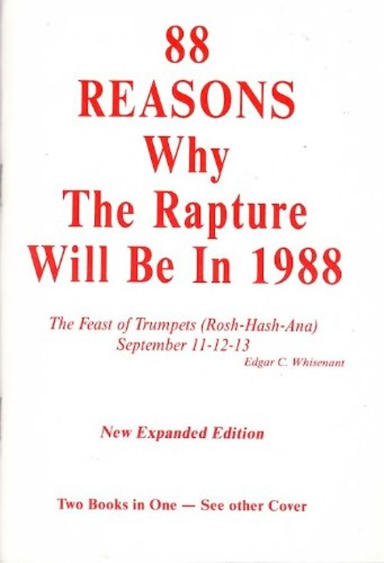
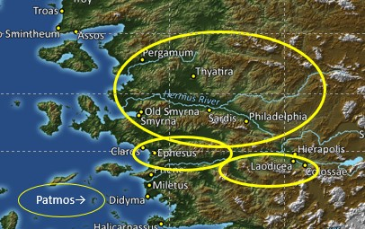



 

**Read/hear the portions**:

| Revelation 1:1-9 (CJB)  | 
| :- |
|This is the revelation which God gave to Yeshua the Messiah, so that he could show his servants what must happen very soon. He communicated it by sending his angel to his servant Yochanan,  2.  who bore witness to the Word of God and to the testimony of Yeshua the Messiah, as much as he saw.  3.  Blessed are the reader and hearers of the words of this prophecy, provided they obey the things written in it! For the time is near!  4.  From: Yochanan To: The seven Messianic communities in the province of Asia: Grace and shalom to you from the One who is, who was and who is coming; from the sevenfold Spirit before his throne;  5.  and from Yeshua the Messiah, the faithful witness, the firstborn from the dead and the ruler of the earth's kings. To him, the one who loves us, who has freed us from our sins at the cost of his blood,  6.  who has caused us to be a kingdom, that is, cohanim for God, his Father—to him be the glory and the rulership forever and ever. Amen.  7.  Look! He is coming with the clouds! Every eye will see him, including those who pierced him; and all the tribes of the Land will mourn him. Yes! Amen!  8.  "I am the 'A' and the 'Z,' " says Adonai, God of heaven's armies, the One who is, who was and who is coming.  9.  I, Yochanan, am a brother of yours and a fellow-sharer in the suffering, kingship and perseverance that come from being united with Yeshua. I had been exiled to the island called Patmos for having proclaimed the message of God and borne witness to Yeshua.|

**Summary**

Welcome to our series on the book of Revelation we call "Revelation Backgrounds."  In this introductory episode, we will provide an introduction to the book, some background into Jewish Apocalyptic literature, and we'll provide what we see are Seven Keys to Interpretation.  Revelation can be a complex book, but these keys will help assure we get started on the right path.

**Video**



### "Revelation" (not "Revelations")

-   In his course on Jerusalem, Dr. Cargill said, "the name of the book is 'RevelationnnnnnNUH,'" he said to emphasize the singular[^1].
-   He continued, "This is a pet peeve of mine. If you call it 'RevelationS,' it means you have never read the 1st verse, and I will flunk you."
-   Of course, we won't flunk anybody, but this is a good reminder that the correct name of the book is not "Revelation*s*," but "**Revelation.**"

[^1]: Robert R. Cargill, *Jerusalem in Rebellion*, Jerusalem: The Holy City (Spring 2010): A History of Jerusalem from Ancient Canaan to Modern Israel, 2010, https://itunes.apple.com/itunes-u/jerusalem-holy-city-spring/id434136076?mt=10.

### What is "Apocalyptic Literature"?

-   We often think of an apocalypse as some cataclysmic event involving worldwide destruction.
-   From the Greek word *apokalupsis*, apocalypse means "revealing" or "unveiling."
    -   Specifically, we would say an unveiling of something not previously known, which wouldn't be known were it not for divine intervention
-   In the days of John, there was a significant body of Jewish apocalyptic literature that he and much of his audience would have known[^2].
-   The general flow of apocalyptic literature:
    -   A person in a "spiritual state," such as fasting and praying, is caught up to a realm usually unseen by mortals (possibly physically or possibly by way of a vision).
    -   He is given a tour, usually guided by an angel, where he sees heavenly worship services, God's throne, and various hallowed chambers.
    -   He also sometimes sees "the war behind the war."
        -   In other words, when there is a physical war on earth, the person gets to witness a corresponding unseen spiritual warfare.
    -   Then he gets to witness a final climactic battle between the forces of good and evil and resulting judgments.
    -   Often, the things the person with the vision sees are nearly impossible to put into words
        -   The best he can do is use the best words he can,
        -   Because the human is trying to explain the inexplicable, we end up with the extreme symbolism, such as beasts doing strange things (Daniel 7:5-6) and objects that seem to defy the laws of physics (Ezekiel 1:16-20)
-   The general purpose of an Apocalypse is for God to reassure His people to remain faithful.
-   Lancaster summarizes a biblical apocalypse like this:
    -   "Although things on earth seem terribly unjust, with the righteous suffering and the wicked prospering, a day is coming where God will pour out his wrath upon the wicked and reward the righteous." [^3]
    -   In other words, "your faith and suffering are not in vain."

[^2]: Typically Jewish apocalyptic literature fall into a category called pseudopigrapha – writings falsely ascribed to someone else describing a vision that person had. For example, the Book of (First) Enoch probably dates to 200-100 BCE (long after the Biblical Enoch was taken by God in Genesis 5). Revelation follows the genre of 1 Enoch, but it is also different because we are confident it came directly from God through John the Apostle.

[^3]: Daniel T. Lancaster, *Apocalypse of Messiah*, Apocalypse of John, 2015, accessed January 19, 2022, https://www.bethimmanuel.org/audio-series/apocalypse-of-john.





Did you know Paul (or a man he knew) had an Apocalypse?

>   2 Corinthians 12:2-4: "I know a man in Messiah (whether in the body I don't know, or whether out of the body I don't know—God knows)—fourteen years ago, he was caught up to the third heaven. I know such a man (whether in the body or outside of the body I don't know—God knows)— he was caught up into Paradise and heard words too sacred to tell, which a human is not permitted to utter."

This is a classic apocalyptic vision. Were it not for the "gag order," we might have had not one but two Books titled "Revelation"!





### Seven Keys to Interpretation

>   "Revelation is perhaps the most studied but least understood book in the New Testament." – Daniel Lancaster[^4].

[^4]: Ibid.

Our primary challenge with understanding Revelation, or just about any other book of the Bible, is that we are separated from the original intended audience in three critical areas: time, distance, and most importantly, culture. 

-   Time – John recorded these events nearly 2000 years ago, and he often references writings written hundreds of years before that.
-   Distance – Turkey, the geographic setting for Revelation 2-3, is over 6000 nautical miles away from the central United States.
-   Culture
    -   The setting is a Jewish author writing to Jews and gentile God-fearers in the diaspora (Jews living outside the Land of Israel).
    -   These early believers knew their Scriptures, what we would call the "Old Testament," much better than we do.
    -   These believers brought a very different set of experiences, assumptions, and expectations than we do.

        These areas may be less familiar to us if our context is western Protestant Christianity and we have never traveled to these lands. To bridge these gaps, our study in Revelation Backgrounds synthesizes several published commentaries that focus on the historical, geographic, and cultural (specifically Jewish) aspects of the Bible. We also consult Bible atlases, travel videos, and occasionally extra-biblical documents and pertinent archeologic findings.
        
In keeping with the pattern of "sevens" in Revelation, we have seven "Keys to Interpretation."

### #1 Follow the "Talmidim Way"

*Talmidim* is the Hebrew word for "disciples." I am a *talmid*. You are a *talmid*. We are all *Talmidim*.

Talmidim was one of the first Hebrew words I ever learned, so it has a special place in my heart. The word is symbolic of a journey I've been on for over ten years.

There is an expression that ancient Jewish disciples would follow their rabbi so closely that they would be "covered in his dust."

For these reasons, I call the ministry the *Talmidim Way*. Our logo contains a drawing of an ancient stone footpath to remind us that our faith is founded on old ways, and we should walk in the dust of our Rabbi Jesus.

Craig Keener is one of my go-to commentators for historical context. He says much more eloquently, "Shedding light on the original provides modern readers better access to the message of the book when they seek to apply it today." [^5]

[^5]: Craig S. Keener, *The IVP Bible Background Commentary: New Testament*, 2nd edition (E-Sword). (Downers Grove, Illinois: IVP Academic, 2014), chap. Revelation Introduction.

### #2 Be open to the Spirit's leading

>   Let us not cling too tightly to any presupposed interpretation or application.

-   My positions on Revelation have changed over the years (see "we reserve the right to get smarter" callout)
-   Our goal is to dive into the text, leverage the wisdom of trustworthy commentators who have gone before us, check everything out against Scripture[^6], and let the Spirit pour into us.

-   This may mean we need to leave behind a previously held position
    -   Consider yourself lucky if you do not already have a firm position on "pretribulation," "preterist," or "postmillennial."
    -   Seriously.
    -   More division than edification occurs over these subjects, in my opinion.
-   It's ok to hold firm views, but remember we are all brothers and sisters.
    -   We can and should debate and challenge; Proverbs 27:17 says, "As iron sharpens iron, so one person sharpens another."
    -   Let us never divide over these types of matters.

[^6]: What I like to refer to as "putting on our Acts 17:11 thinking caps."





I admittedly am looking at myself when I say not to cling too tightly.

The other times I've studied Revelation from end to end, I've been rather staunchly in the "futurist, pre-tribulation" camp. That means that my view of Revelation tended to be that after chapter 4, everything that happened was yet future (futurist). Before this happened, all the faithful believers would be raptured before the tribulation (pretribulation).

Now, particularly after digging into the Gospels context and other things, I'm no longer 100% sold on that approach. Also, if we look at Jesus's "one will be taken and the other left" statements and in the parables where all the fish are hauled in, but then some are removed, it's not the good who are removed. It's the wicked who are removed. It's the rotten fish that are thrown back.

I'm not saying definitively that the pretribulation view is wrong. Only that now, my opinions are more flexible after further review.

I used to have a colleague who liked to say, "we always reserve the right to get smarter."





### #3 be a Berean (Acts 17:11)!

We will begin every study with Acts 17:11

>   These (Bereans) were more noble than those in Thessalonica in that they received the word with all readiness of mind and searched the scriptures daily, whether those things were so. (Acts 17:11 KJV)

Acts 17:11 is paramount for two reasons:

1.  Every other commentator and I are human. I will, of course, make every attempt to be faithful and reliable. Still, we all have our biases, blind spots, and mistaken conclusions.
    -   When I assert a fact, I will try to back it up with a citation. When I offer an opinion or speculation, I will try to disclose that also. After each lesson, I will include a list of works cited. I encourage everyone to never take my word for it but validate what I say.
2.  Acts 17:11 tells us the Biblical model is to "trust but verify."
    -   It is up to the reader to do your research and verify that any facts and conclusions are scriptural.

>   We are all called to "be Bereans."

### #4 Understand the intended audience

>   **The Bible, including the Book of Revelation, was written FOR us but not TO us**

-   We are operating under the assumption that the Apostle John wrote Revelation, likely between 90-95 CE[^7].
    -   He was instructed to share it with seven specific Messianic communities/congregations.
        -   Note we should not say "seven churches" because no such thing as a "church" existed in 95.
    -   The reason for the apocalypse was to provide hope for the faithful during the intense persecution of the Roman Emperor Domitian.
-   The Bible is written **for** us in the sense of 2 Timothy 3:16-17. All Scripture is inspired by God and useful **for** teaching, **for** reproof, **for** restoration, and **for** training in righteousness, 17. so that the person belonging to God may be capable, fully equipped **for** every good deed.
    -   Teaching/doctrine = what **is** right
    -   Reproof = what is **not** right
    -   Restoration/correction = how to **get** right
    -   Training in righteousness/instruction = how to **stay** right

[^7]: Believers need not be bothered by the "BCE/CE" (Before Common Era/Common Era) designations in place of "BC" and "AD". They mean the same things. Saying BCE/CE is less offensive particularly to Jewish people. It is a chance to love our neighbors and live out Romans 12:18 ("If possible, so far as it depends on you, live in *shalom* with all people"). Besides, when the Catholic Church established the BC/AD system in the Middle Ages, they made a math error. We now know that Yeshua was most likely born 5 or 4 BCE. Saying "Jesus Christ was born in the year 5 Before Christ" is non-sensical when you think about it!

### #5 Understand Revelation is a Jewish book

>   **Revelation is a Jewish book. In fact, it's really Jewish. In fact, it's the most Jewish book in our New Testament**.

-   This fact is why we as Gentiles often have trouble understanding Revelation
-   The symbolism can be baffling since we likely won't have the background in the Hebrew Scriptures that John's original audience had.
-   There are 404 verses in Revelation, but there are allusions to over 800 Old Testament verses. [^8]
    -   Interestingly, John never directly quotes any other verse.
    -   Daniel, Isaiah, Ezekiel, Psalms, and Deuteronomy are frequently alluded to.
    -   Revelation 1:3 promises a blessing for those who hear and obey what has been written.
        -   While the exact nature of the blessing is not stated, a thorough study of Revelation will take us into nearly every other book of the Bible.
        -   There is a blessing when we study God's word. The Jewish sages see Bible study as worship.
        -   Proverbs 3:13-14: Happy (blessed) is the man who finds wisdom and the man who gains understanding. For her trade-value is better than silver, and her yield better than fine gold.
        -   We will call attention to many of these references as we go verse-by-verse through Revelation Backgrounds.
-   Jewish imagery is everywhere: Jewish prophecy, Rosh Hashanah, Yom Kippur, Sukkot, Palm Branches, Shofars, Menorahs, books of judgment, the Book of Life, liturgical functions and ceremonies about the Temple in Jerusalem, etc.
    -   We assume that John wrote this between 90-95 CE
    -   This is significant as it would have been *after* the Roman destruction of the Second Temple in Jerusalem in 70 CE.
    -   John drew from a time in Israel's history where a nearly identical event happened: the destruction of the First Temple in 586 BCE by the Babylonians.
    -   Knowing this allows us to frame John's references to Babylon in their proper context.
-   If we approach Revelation and ignore its Jewishness, we will find it difficult, if not impossible, to understand.[^9] But if we are Bereans and search the Scriptures, we will discover Revelation significantly demystified.
-   For this reason, we will be presenting verses from Revelation and other books from the "Complete Jewish Bible" (CJB).
    -   The CJB is a translation by Dr. David H. Stern that seeks to "present the Bible (Old and New Testaments) as a complete Jewish book and connect readers with the Jewishness of the Messiah." [^10]
    -   It also seeks to correct anachronisms, such as the label "church" in the New Testament before such an entity ever existed.

[^8]: Chuck Missler, *Cosmic Codes: Hidden Messages From The Edge Of Eternity* (Koinonia House, 2013). Missler has categorized these references in Appendix C.

[^9]: Lancaster, *Apocalypse of Messiah*.

[^10]: "Complete Jewish Bible (CJB) - Version Information - BibleGateway.Com," accessed January 22, 2022, https://www.biblegateway.com/versions/Complete-Jewish-Bible-CJB/.

### #6 Be suspicious if an interpretation could not have occurred to the original audience

>  **If an interpretation would not or could not have occurred to John or his audience, we will treat it with a degree of healthy suspicion.**

-   The historical aspect tends to get the least attention from other Protestant-based commentators.
    -   Therefore, how the events described in Revelation relate to what was happening in John's Day will be our primary focus with Revelation Backgrounds.
    -   Many interpretations may appear to "fit"; they just may not fit within our scope. We want to stay focused on the 1st-century context as much as possible.
    -   Healthy suspicion doesn't mean we reject it outright just because it was beyond the scope of the original audience.
    -   God is perfectly capable of delivering a message that is just as relevant for us as it was to the original audience.
        -   For example, the "seven letters" have many layers of understanding and application (admittedly, some are concrete while others are speculative).
    -   There is no reason why multiple layers of interpretation can't be correct.

### #7 Acknowledge that fear is not from God

> **Fear is not from God**

-   "Fear not," or an equivalent, is one of the most frequently repeated commands in the Bible.[^11]
-   In Mathew 10:28, Jesus said the only fear we should have is the fear of God, a healthy fear.
-   Far too many approach Revelation with a spirit of fear; may it not be so with us!
-   We must always apply "Acts 17:11 logic" to any potential interpretation.
    -   Is the given interpretation consistent with the rest of the Scriptures?
    -   Does it magnify Yeshua (Jesus) the Messiah?
    -   Does it give us a spirit of peace?
    -   If we are left fearful of anyone or anything besides God, then the interpretation/application is not from God.

[^11]: A piece of Christian internet folklore says, "there are 365 "fear not" commands; one for every day of the year!" While this isn't entirely accurate, there are well over 100, so the point is still valid. Fear is not from God.

#### "No Fear" means avoiding "Frontpage Exegesis"

The media loves fear. Fear sells. If it bleeds, it leads. Yet we just said that fear is not from God. Fear should not be a factor in our attempts to understand Revelation.

Exegesis

: Extracting concepts from the biblical text while applying reasonable academic inquiry techniques

"Frontpage" Exegesis

: Seeing every sensational headline or significant current as a fulfillment of biblical prophecy

Revelation is NOT

-   A crystal ball to predict the future
-   A description of current events in the 21st century
-   A chronological, linear sequence of end-time events
-   A literal narrative, but neither is it an allegory
    -   Remember this: **Revelation is not an allegory.**
    -   Frontpage exegesis intentionally or unintentionally allegorizes Scripture
    -   The problem with an allegory is that we can twist it to mean anything we want it to.
    -   For context, if we were to study Christian writings during WWI, a large segment of Christians believed they were living in the days of Revelation. Some even quit their jobs, stopped having children, and even committed suicide.
  
    -   During WWII, many thought Hitler was the Antichrist (not entirely without reason).
    -   In 1988, one person was *so sure* the rapture was going to occur that year, he published a book, "88 Reasons Why the Rapture will be in 1988," and then had the audacity to say "if I'm wrong, the Bible is wrong."
    -   Over the last decade, the Beast was "obviously" Donald Trump or Barack Obama, depending on your political viewpoint.
    -   Everyone throughout history who has claimed that he or she was living out the events prophesied by Revelation has been wrong. That's the problem with Frontpage Exegesis. It's always been wrong.
-   It *is* fair to say, "Revelation describes literal events using signs/symbolic language." We'll talk more about some of these signs below.

## Revelation "metadata"

Now let's look at the "who, what, when, where" of Revelation.

#### Who wrote Revelation?

>   Revelation 1:1-2 This is the Revelation which God gave to Yeshua the Messiah so that he could show his servants what must happen very soon. He communicated it by sending his angel to his servant Yochanan (John), 2. who bore witness to the Word of God and to the testimony of Yeshua the Messiah, as much as he saw.

-   Note the progression of transmission: God → Jesus → His angel/messenger → John → Jesus' servants.
-   The ultimate Author is God
    -   Revelation is not just "divinely inspired" but is "divinely given."
        -   Divinely inspired – the Holy Spirit guided the words, but the structure, choice of words, what aspects to include, what to omit, and other stylistic details were at the discretion of the human author
        -   Divinely given – the words, what to include/omit, and so forth came directly from God. The human author was primarily a transcriber and copy editor
            -   Revelation is the only New Testament book that is divinely given; all others are divinely-inspired
            -   Most of the Torah, the first five books of Moses, are divinely given (The phrase, "The LORD spoke to Moses and said, 'Thus shall you say to the Children of Israel…'" appears frequently.)
-   John wrote down the words of the angel/messenger unless he was told not to (Revelation 10:4)
    -   While we can't prove it beyond all doubt, the evidence is convincing that Revelation's (human) author is John the Apostle.
    -   In other words, the author is John, the *talmid* (disciple) of Yeshua, the author of the Gospel of John, and the three epistles that bear his name.
-   One additional piece of evidence is the phrase "bore witness."
    -   This type of legal/courtroom terminology is all over the Gospel of John.
    -   John presents evidence that Yeshua/Jesus is the rightful authority for Israel and the good shepherd. In addition, John also bears witness that the Jerusalem religious establishment is unauthorized and its leaders are the "bad shepherds" over Israel.

#### When and where was Revelation written?

>   Revelation 1:9 I, John, your brother and fellow partaker with you in the tribulation and kingdom and patient endurance that are in Yeshua, was on the island called Patmos because of the word of God and the testimony of Yeshua.

-   Iraneus, the earliest source who cited the Apostle John as the author, also stated that he wrote during the worldwide persecution of Jews and Christians of Emperor Domitian. Domitian was also responsible for exiling John to Patmos.[^12]
-   The small island of Patmos is about 7.5 miles (12 km) long from north to south and at its widest is 6 miles (10 km) from east to west.[^13]
-   Domitian was the Roman Emperor from 81-96.
-   Most conservative scholars believe Revelation was written between 90-95.

[^12]: Daniel T. Lancaster, "Patmos," in *Chronicles of the Apostles*, ed. Boaz D. Michael and Stephen D. Lancaster, vol. 5, Torah Club (Marshfield, MO: First Fruits of Zion, 2018), 1309.

[^13]: Todd Bolen, "Patmos (BiblePlaces.Com) – BiblePlaces.Com," n.d., accessed January 19, 2022, https://www.bibleplaces.com/patmos/.



For information on exactly how John ended up in Patmos "because of the Word of God and Testimony of Yeshua," see our Revelation Backgrounds Supplement "Historical Background of John's Exile."



#### How was Revelation written?

>   Revelation 1:1b: He communicated it by sending His angel to His servant Yochanan

-   The Greek word for "communicated it" or "made it known" is *σημαίνω* to signify, literally "render into signs."
    -   We might say "encoded."
    -   Missler writes, "Revelation is in code, but every code is explained elsewhere in Scripture!"[^14]
-   Every sign in the Bible points to something – in the case of Revelation, the signs point to the climax of God's plan for Man.
-   Readers familiar with the Old Testament would have understood what these signs represented.
-   We will get more comfortable with John's communication as we dig into the Hebrew Scriptures.

[^14]: Chuck Missler, *The Book of Revelation Handbook* (Koinonia House, 2020), 6.

**Sevens**

-   Another way Revelation is "signified" is through repetitive patterns, specifically the number seven.
-   Sevens are conspicuous in Revelation.
-   In biblical thought, seven is the number that denotes " completion," "finality," or "perfection."
    -   The Shabbat (7th day) is a day of peace, joy, and rest; the Messianic Kingdom is often described as entering into the (Sabbath) peace/joy/rest of God
    -   This comes from Genesis 2:1-3
        -   So the heavens and the earth were completed along with their entire array. 2. God completed—on the seventh day—His work that He made, and He ceased—on the seventh day—from all His work that He made. 3. Then God blessed the seventh day and sanctified it, for on it He ceased from all His work that God created.
-   Some of the seven patterns are obvious (congregations, seals, trumpets, bowls), while others are less noticeable.
    -   The depiction of Messiah in chapter 1 has seven features.
    -   Each letter to a congregation in chapters 2-3 contains seven components.
    -   There are seven "blessings" (or beatitudes) scattered throughout the book, beginning with the blessing to the one who reads and obeys the words at Revelation 1:3

#### To whom was Revelation written?

>   Revelation 1:4: From: Yochanan To: The seven Messianic communities in the province of Asia:

-   John, at the time, was over the congregation in Ephesus and had responsibility for the other six nearby assemblies: Smyrna, Pergamos, Thyatira, Sardis, Philadelphia, and Laodicea.
    -   These are circled on the map, along with John's location on Patmos.
-   John was tasked with shepherding his flocks through this tumultuous time.



The term "church" is an anachronism



-   At this point, you may be asking, "why aren't you using the word "church"? I thought they were the "seven churches of Revelation?"
    -   We can say with reasonable certainty that the name of the building where 1st-century believers in Asia met was called a synagogue
    -   These communities or congregations were predominately Jewish but had their share of gentile believers.
    -   We don't recommend calling them "churches" because the "church," either a building or an organizational structure, did not exist in the first century.
        -   **Anachronism**: the misappropriation of concepts and ideas in time.
            -   When an actor in a movie set in the Middle Ages is wearing a digital watch, or there's a car visible on a street that is supposed to occur during the civil war, that's an anachronism.
        -   **Anachronistic fallacy**: when one purposely or inadvertently **asserts or infers a concept** based on an anachronism.
            -   Since the "church" didn't exist yet in the first century, every time we translate "ecclesia" as "church" in the New Testament, that's an anachronistic fallacy.[^15]
            -   In fact, the word "church" in any form or language doesn't appear until around the mid-5th Century CE.
        -   The Greek word *ecclesia*, later translated as "church," means "called out assembly," or in a religious context, "congregation."
        -   The *ecclesia* is about people, not an institution, yet this is not what usually comes to our mind when we see the word "church" in our Bibles. We tend to associate "church" as "a building or collection of (non-Jewish) worshippers."
    -   John, a Jew, wrote to Jewish congregations attended by Jews and gentiles. In the early to mid 90s, they assembled in synagogues.

[^15]: Unfortunately, there is some cause to conclude the fallacy in our Bible translations was *deliberate* as the church became increasingly anti-semetic and distanced itself from its Jewish heritage.





Jesus! This has some interesting theological implications, as there were apparently things Jesus didn't know even after his Resurrection.

Revelation 1:1 The Revelation of Yeshua the Messiah, which God gave **Him** to show to His servants the things that must soon take place. He made it known by sending His angel to His servant John,





#### Why was Revelation written?

>   Revelation 1:7 Look! He is coming with the clouds! Every eye will see him, including those who pierced Him, and all the tribes of the Land will mourn him. Yes! Amen!

-   We mentioned above how the purpose of apocalyptic literature was to give the faithful hope during times of tribulation. No matter what happens here on earth, we always have the hope of his return.

Zechariah 14:4 reminds us that when he returns, His "feet will stand on the Mount of Olives."

-   At the end of the day, Revelation is about God fixing what man and Satan have messed up
-   Whereas we saw the entrance of sin, the curse, and death in Genesis, we will see the end of sin (chapter 21), no more condemnation (chapter 22), and no more death (chapter 21).
    -   Like Steven Covey says, "Begin with the end in mind."
    -   No matter how murky or mysterious Revelation may be, ultimately, it is about the Glory of God and restoration of Man to the state that God originally intended for us in Eden.
-   Revelation reminds us, "victory depends on Christ's finished work, not on human circumstances (and) that the imminent hope of His return is worth more than all the world's goods." [^16]
-   Amen!

[^16]: Keener, *The IVP Bible Background Commentary*, chap. Revelation Introduction.

### Conclusion

I am excited to dig into this book. I've studied it many times, but this will be the first time diving into using messianic and other cultural background commentaries.

As we begin, remember the "Seven Keys to Interpretation" we listed above.

I will have a separate segment to review the relevant history before John receives the Revelation.

Even if history wasn't your best subject, I encourage you to view this supplement. Understanding this extra-biblical background turns out to be highly relevant to our studies.

After that, we'll see you for Revelation chapter 1.

### References
