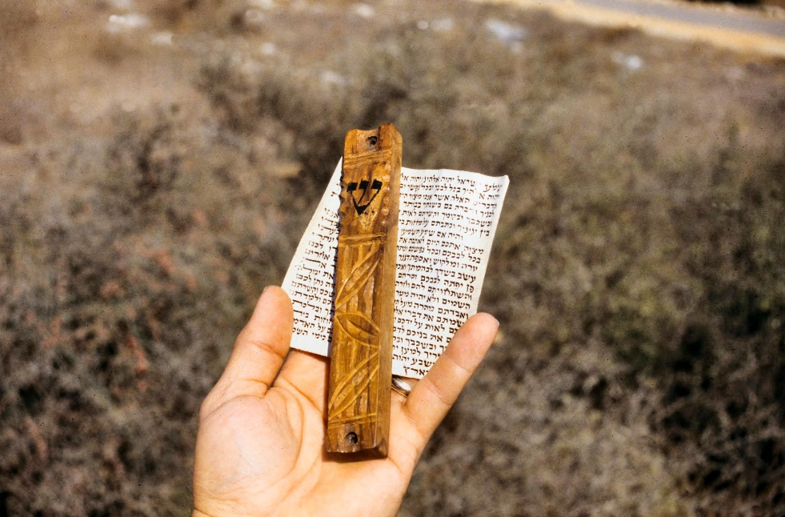



 

#### Read/hear the portions:

| Revelation 1                                                                                                                                                                                                                                                                                                                                                                                                                                                                                                                                                                                                                                                                                                                                                                                                                                                                                                                                                                                                                                                                                                                                                                                                                                                                                                                                                                                                                                                                                                                                                                                                                                                                                                                                                                                                                                                                                                                                                                                                                                                                                                                                                                                                                                                                                                                                                                                                                                                                                                                                                                                                                                                                                                                                                                                                                                                                                                                                                                                                                     |
|----------------------------------------------------------------------------------------------------------------------------------------------------------------------------------------------------------------------------------------------------------------------------------------------------------------------------------------------------------------------------------------------------------------------------------------------------------------------------------------------------------------------------------------------------------------------------------------------------------------------------------------------------------------------------------------------------------------------------------------------------------------------------------------------------------------------------------------------------------------------------------------------------------------------------------------------------------------------------------------------------------------------------------------------------------------------------------------------------------------------------------------------------------------------------------------------------------------------------------------------------------------------------------------------------------------------------------------------------------------------------------------------------------------------------------------------------------------------------------------------------------------------------------------------------------------------------------------------------------------------------------------------------------------------------------------------------------------------------------------------------------------------------------------------------------------------------------------------------------------------------------------------------------------------------------------------------------------------------------------------------------------------------------------------------------------------------------------------------------------------------------------------------------------------------------------------------------------------------------------------------------------------------------------------------------------------------------------------------------------------------------------------------------------------------------------------------------------------------------------------------------------------------------------------------------------------------------------------------------------------------------------------------------------------------------------------------------------------------------------------------------------------------------------------------------------------------------------------------------------------------------------------------------------------------------------------------------------------------------------------------------------------------------|
| This is the revelation which God gave to Yeshua the Messiah, so that he could show his servants what must happen very soon. He communicated it by sending his angel to his servant Yochanan, 2. who bore witness to the Word of God and to the testimony of Yeshua the Messiah, as much as he saw. 3. Blessed are the reader and hearers of the words of this prophecy, provided they obey the things written in it! For the time is near! 4. From: Yochanan To: The seven Messianic communities in the province of Asia: Grace and shalom to you from the One who is, who was and who is coming; from the sevenfold Spirit before his throne; 5. and from Yeshua the Messiah, the faithful witness, the firstborn from the dead and the ruler of the earth's kings. To him, the one who loves us, who has freed us from our sins at the cost of his blood, 6. who has caused us to be a kingdom, that is, cohanim for God, his Father—to him be the glory and the rulership forever and ever. Amen. 7. Look! He is coming with the clouds! Every eye will see him, including those who pierced him; and all the tribes of the Land will mourn him. Yes! Amen! 8. "I am the 'A' and the 'Z,' " says Adonai, God of heaven's armies, the One who is, who was and who is coming. 9. I, Yochanan, am a brother of yours and a fellow-sharer in the suffering, kingship and perseverance that come from being united with Yeshua. I had been exiled to the island called Patmos for having proclaimed the message of God and borne witness to Yeshua. 10. I came to be, in the Spirit, on the Day of the Lord; and I heard behind me a loud voice, like a trumpet, 11. saying, "Write down what you see on a scroll, and send it to the seven Messianic communities—Ephesus, Smyrna, Pergamum, Thyatira, Sardis, Philadelphia and Laodicea!"   |

#### Watch the video



_If you're short on time, you can speed up the video in YouTube._

### Rev 1:1: The Revelation to Yeshua

| Revelation                                                                                                                                                                                       | OT Allusions                                                                                                                                                                                                                                                                                                                                                         |
|--------------------------------------------------------------------------------------------------------------------------------------------------------------------------------------------------|----------------------------------------------------------------------------------------------------------------------------------------------------------------------------------------------------------------------------------------------------------------------------------------------------------------------------------------------------------------------|
| 1. This is the revelation which God gave to Yeshua the Messiah, so that he could show his servants what must happen very soon. He communicated it by sending his angel to his servant Yochanan,  | 1:1 Daniel 2:28 but there is a God in heaven who reveals mysteries, and he has made known to King Nebuchadnezzar what will be in the latter days. Your dream and the visions of your head as you lay in bed are these: 29 To you, O king, as you lay in bed came thoughts of what would be after this, and he who reveals mysteries made known to you what is to be. |




<small>
We believe your study of this amazing book will be greatly enhanced if you read and meditate on the allusions listed. A comprehensive listing for all 22 chapters, including cross-references from the Treasury of Scripture Knowledge, is in Appendix A1.

As you hover over (or tap) on each verse, the text of the English Standard Version will appear.
</small>




#### This is the Revelation

-   We have several questions answered immediately in verse 1.
    -   Who wrote: John
    -   Who is it for: servants of Yeshua (not for unbelievers)
    -   Who is it about: Yeshua
    -   When should we study: immediately for the time is near
-   As we noted in the introduction, this is **one** revelation, so the book's name is Revelation, not "revelations."
-   John's Hebrew name, Yochanan, means something like "blessed by God."
-   Although the original record we have is in Greek and John was multilingual, Jesus very likely communicated this in Hebrew, John's primary language.
    -   Interestingly, Hebrew words for "revelation" and "exile" are linguistically related.
        -   גָלָה is the verb for "to reveal, uncover" and is pronounced "ga-LAH"; גָלוּת, "ga-LOOT," is the word for exile.
    -   Jewish apocryphal writings, of which Revelation is included, tend to occur when the people were exiled by God, living outside the land when they were vulnerable to abuses by the pagan nations.
    -   As we mentioned in the introduction, one of the purposes of Jewish apocalyptic literature was for God to communicate to His people that He is still in control. Although things seem unfair now, a day is coming when God will set everything straight.
    -   To help capture the "Jewishness" of the book, we will be using the Complete Jewish Bible (CJB) paraphrase translation.
        -   No translation is perfect, and the CJB is not without problems.
        -   You can hover over any Bible reference and compare the English Standard Version (ESV). Often the King James Version does the best job at capturing the meaning of the Greek.

#### God/Yeshua/Angel/Yochanan

-   Note that we receive Revelation, "4th hand."
    -   God gave it to Jesus, who gave it to an angel/messenger, who gave it to John, who wrote it down and communicated to the servants of Messiah.
-   John is not receiving all of this directly from Jesus but through an angel who bears witness to Jesus.
-   By the end of the chapter, we will be practically unable to distinguish who is speaking, even though we know from verse 1 that it must be the angel
-   This concept is very similar to the "Angel of the LORD" that we see in the Old Testament.
-   We often presume this angel is a pre-incarnate version of Jesus, but it may not be that simple.
-   There appears to be an "Angel of the Messiah," just like an "Angel of the LORD."
-   This angel has the full authority to speak to John, just as if it were Jesus Himself speaking.
-   Lizorkin and Shir discuss the challenges of figuring out who is speaking in Revelation:
    -   "As in any complex composition, such a rich polyphony of heavenly sound will demand careful and attentive listening to clearly distinguish between the voices and appreciate both their choir-like message and the voice of the individual performers."[^1]
-   Chapter one reveals that John's concept of the "Trinity" may not be fully in keeping with the traditional Protestant view
    -   Protestants see the Trinity as three co-equal persons. Still, throughout Revelation and even in the Gospel of John, Jesus is subordinate to the Father.
    -   In verse 1, we see that Jesus had to learn about Revelation from the Father.
    -   While the doctrine of the Trinity is undoubtedly biblical, we must remember it is a man-made concept – the word "trinity" never appears in the Bible.
    -   We would be wise to loosely hold any man-made ideas (including views on Eschatology) as we work through Revelation.
    -   Let the Spirit pour into us as we check everything out against Scripture!

[^1]: Eli Lizorkin-Eyzenberg and Pinchas Shir, *Hebrew Insights from Revelation*, Kindle., Jewish Studies for Christians, 2021, 32.

#### Servants

-   The Greek word for servants is *doulos* which we can translate as "bondservants."
-   A bondservant is one who freely and willingly attaches himself to the household of his master, "because he loves you and your household since he is well-off with you." (Deut 15:16-17)
-   As talmidim of Jesus, we are called to be His bondservants.
-   This book is for us

As we go through the book, we will highlight some of the patterns of seven that may not be obvious. The callout box below lists the seven instances of "Messiah" in Revelation.



<small>

The word "Messiah" (Christ) appears seven times, starting with 1:1

1.  This is the revelation which God gave to Yeshua the **Messiah**, so that he could show his servants what must happen very soon. He communicated it by sending his angel to his servant Yochanan (Rev 1:1)
2.  who bore witness to the Word of God and to the testimony of Yeshua the **Messiah**, as much as he saw. (Rev 1:2)
3.  and from Yeshua the **Messiah**, the faithful witness, the firstborn from the dead, and the ruler of the earth's kings. To him, the one who loves us, who has freed us from our sins at the cost of his blood, (Rev 1:5)
4.  The seventh angel sounded his shofar; and there were loud voices in heaven, saying, "The kingdom of the world has become the Kingdom of our Lord and his **Messiah**, and he will rule forever and ever!" (Rev 11:15)
5.  Then I heard a loud voice in heaven saying, "Now have come God's victory, power and kingship, and the authority of his **Messiah**; because the Accuser of our brothers, who accuses them day and night before God, has been thrown out! (Rev 12:10)
6.  Then I saw thrones, and those seated on them received authority to judge. And I saw the souls of those who had been beheaded for testifying about Yeshua and proclaiming the Word of God, also those who had not worshipped the beast or its image and had not received the mark on their foreheads and on their hands. They came to life and ruled with the **Messiah** for a thousand years. (Rev 20:4)
7.  Blessed and holy is anyone who has a part in the first resurrection; over him the second death has no power. On the contrary, they will be cohanim of God and of the **Messiah**, and they will rule with him for the thousand years. (Rev 20:6)
</small>




### Rev 1:2: Bore Witness

<small>

who bore witness to the Word of God and to the testimony of Yeshua the Messiah, as much as he saw.</small>

#### Bore witness/testimony

-   John loves courtroom language (witness, testimony, testify, judge, judgment, authority (in the sense of legal standing), etc.). There are over 100 examples of this in John's writings.
-   John uses nearly the identical language in John 3:32-33 as he does in Revelation 1:2
-   In the Gospel, John portrayed evidence that Jesus was the proper authority. At the same time, the Jerusalem religious establishment were the usurpers, "bad shepherds," an illegitimate regime.
-   In the Revelation, he's going to magnify that. The entire corrupt world system, not just the corrupt Jerusalem establishment, will be put on trial by God.
-   Also, remember the context: believers in Asia were being betrayed to Roman courts. God grants true justice and righteous judgment.




<small>
There are seven "**Testimony**" verses starting with 1:2. We can look at this list in a couple of ways.

-   There are seven verses with "testimony" appearing twice in 19:10.
    -   Seven "Testimony of Jesus" references
        -   We can remove 11:7 where "testimony **of Jesus**" is not directly implied – the two witnesses are testifying of God's judgment
        -   12:11 is directly implied as being martyred for their testimony of Jesus.
        -   We count 19:10 twice for a total of seven
1.  who bore witness to the word of God and to the **testimony of Jesus** Christ, even to all that he saw. (Rev 1:2)
2.  I, John, your brother and partner in the tribulation and the kingdom and the patient endurance that are in Jesus, was on the island called Patmos on account of the word of God and the **testimony of Jesus.** (Rev 1:9)
3.  *And when they have finished their* **testimony***, the beast that rises from the bottomless pit will make war on them and conquer them and kill them, (Rev 11:7)*
4.  And they have conquered him by the blood of the Lamb and by the word of their **testimony (of Jesus)***,* for they loved not their lives even unto death. (Rev 12:11)
5.  Then the dragon became furious with the woman and went off to make war on the rest of her offspring, on those who keep the commandments of God and hold to the **testimony of Jesus**. And he stood on the sand of the sea. (Rev 12:17)
6.  Then I fell down at his feet to worship him, but he said to me, "You must not do that! I am a fellow servant with you and your brothers who hold to the **testimony of Jesus**. Worship God." For the **testimony of Jesus** is the Spirit of prophecy. (Rev 19:10)
7.  Then I saw thrones, and seated on them were those to whom the authority to judge was committed. Also I saw the souls of those who had been beheaded for the **testimony of Jesus** and for the word of God, and those who had not worshiped the beast or its image and had not received its mark on their foreheads or their hands. They came to life and reigned with Christ for a thousand years. (Rev 20:4)
</small>




### Rev 1:3: The Blessing

<small>

Blessed are the reader and hearers of the words of this prophecy, provided they obey the things written in it! For the time is near!

</small>

#### The blessing

-   This is the first of seven such blessings in the book (see callout below)
-   Revelation is the only book with such an explicit promise.
    -   It's no wonder the enemy tries to tell us it's difficult to understand, and many have a spirit of fear.
    -   Conversely, when believers wonder how they can be blessed by God, a biblical answer is "study Revelation."
-   We aren't told what form the blessing will be, but ANY gift from God will be great.
    -   One such blessing may be that approaching Revelation as a Jewish book means you will read nearly 1000 verses from the Old Testament.
    -   Another blessing is that we will walk away with a much more complete picture of our Savior's person, mission, and destiny than we may have had previously.
-   The Greek carries the sense of read-aloud. Most people did not have their own copies of the Bible, so they would have had to hear it read aloud by the reader in the synagogue.
-   Note that the blessing is conditional upon the reader understanding and obeying
    -   This is very Hebraic. In Hebrew, verbs are action-oriented.
        -   In English, we can listen, but we don't necessarily equate hearing with obedience. In other words, we can listen passively.
        -   There is no such thought in Hebrew. If you don't obey, you aren't listening.
        -   Stern writes, "in Judaism, learning is supposed to lead to doing."[^2]
    -   In the 18th century, a Christian Hebraist named Franz Delitzsch translated the New Testament from Greek back into Biblical Hebrew, using forms and idioms the Old Testament uses. It is a highly educated guess on what the original Jewish authors might have said had their works recorded in their original Hebrew.
    -   For Revelation 1:3, he used a verb that frequently appears in the Torah of Moses – hear/obey (Shema) – שָׁמַע. This beautiful Hebrew word is rich with meaning and application. Talmidim hear and obey the words of Yeshua. Most notably, the word appears in Deut 6:4, which is the famous "Shema Israel" passage, which Jesus quotes in Mark 12:29.
    - *שְׁמַ֖ע* יִשְׂרָאֵ֑ל יְהוָ֥ה אֱלֹהֵ֖ינוּ יְהוָ֥ה ׀ אֶחָֽד׃
    - “Hear, O Israel: The LORD our God, the LORD is one." 
    - Then Deuteronomy verse 5 continues, "You shall love the LORD your God with all your heart and with all your soul and with all your might."
    - The "hear" is followed by a list of behaviors.

[^2]: David H. Stern, *Jewish New Testament Commentary: A Companion Volume to the Jewish New Testament*, E-Sword edition. (Clarksville, Md.: Lederer Messianic Publications, 1992), v. 1:3.



<small>

Also contained within the word שָׁמַע are the letters שׁ and מ. When we put those together, we get שֶׁם (shem), which is the Hebrew word for name (Hebrew has five letters that are spelled differently when at the end of a word. The mem (מ/ם) is one of those).

Your name is not just a string of letters. In Hebraic thought, your name is your reputation and your character. Being an obedient listener and one who diligently keeps/guards God's word reflects on our reputation.

Further, when we take on the name of Yeshua, we must positively reflect His character. We do that by keeping and guarding His words. In a sense this could be the third commandment. When we fail to keep and guard his name, we could be said to be taking on his name in vain. Conversely, there is a blessing to be had when we keep obey and guard His reputation.
</small>




#### Very soon and for the time is near!

-   John believed the fulfillment of all things was very near.
-   He did not mean merely within a few years and certainly did not mean two thousand years! He is writing with a sense of urgency.
-   In fact, we can defend from Scripture that the New Testament authors didn't just believe the "end times" were near; they thought the end times were upon them.
    -   See 1 Corinthians 10:11 and note that Paul directly connects the Old Testament with the "end times." Further, the "end times" IS the fulfillment of Old Testament Prophecies."[^3]
    -   The above point is critically important to keep in mind.
    -   Paul and John weren't looking to events occurring in the world around them; they were looking to the "fulfillment of the purposes and prophecies of the Old Testament."[^4]
-   An alternate sense could be once the events commence, they will unfold rapidly;
    -   2 Peter 3:3-4 seems to imply Peter at least suspected there would be some delay.
    -   Yet, at the end of the passage (2 Peter 3:10), Peter says every believer should be alert.

[^3]: Tom Bradford, “Lesson 2 - Revelation 1,” *Seed of Abraham Ministries, Inc*, accessed January 31, 2022, https://www.torahclass.com/bible-studies/new-testament-studies/1917-new-testament-revelation/2864-lesson-2-revelation-1.

[^4]: Ibid.



<small>

There are seven *berachot* (blessings) starting with 1:3

1.  **Blessed** are the reader and hearers of the words of this prophecy, provided they obey the things written in it! For the time is near! (Rev 1:3)
2.  **Blessed** are the dead who die in the Lord (Rev 14:13).
3.  **Blessed** is he that watches and keeps his garments (Rev 16:15).
4.  **Blessed** are they who are called unto the marriage supper of the Lamb (Rev 19:9).
5.  **Blessed** and holy is he that hath part in the first resurrection (Rev 20:6).
6.  **Blessed** is he that keeps the words of the prophecy of this book (Rev 22:7)
7.  **Blessed** are they that wash their robes (Rev 22:14).
</small>




### Rev 1:4: Grace and Shalom

| Revelation                                                                                                                                                                                            | OT Allusions                                                                                                                                                                              |
|-------------------------------------------------------------------------------------------------------------------------------------------------------------------------------------------------------|-------------------------------------------------------------------------------------------------------------------------------------------------------------------------------------------|
| 4. From: Yochanan To: The seven Messianic communities in the province of Asia:  Grace and shalom to you from the One who is, who was and who is coming; from the sevenfold Spirit before his throne;  | 1:4 Isa 11: 2 And the Spirit of the LORD shall rest upon him, the Spirit of wisdom and understanding, the Spirit of counsel and might, the Spirit of knowledge and the fear of the LORD.  |

#### From Yochanan/John

-   While we can't be 100% certain, most conservative scholars believe this is John the Apostle (see the introductory lesson for more background)
-   Whichever John this was, we might say "he needed no introduction." We are given no further background than "John," indicating that he was well-known to his audience.
-   Several early church writers believed the letter was a forgery and argued that the book should not become part of the New Testament canon.
    -   They based this view partly because the Greek of Revelation is borderline substandard quality, particularly compared to the Gospel of John.
    -   This may be explained. The Gospel was composed with a translator, someone learned in Greek, which John was not. On Patmos, John was left with his limited Greek skills.[^5]

[^5]: Lizorkin-Eyzenberg and Shir, *Hebrew Insights from Revelation*, 24.

#### Seven communities/"churches"

-   Immediately there is underlying tension we might miss.
    -   They are in Asia. Modern Turkey.
    -   Jews aren't supposed to be outside Eretz Israel (the land of Israel)
    -   This is a big clue that things are out of order
    -   By the end of the book, they will be back in the Land
-   We talked about this anachronism of the word "church" during the introduction.
    -   The church, either an institution or a gathering of people, did not exist when John wrote.
    -   It is hard not to call them "the seven churches." If we do, we need to be aware of the anachronism.
-   The number "seven" is a fingerprint of the Holy Spirit and speaks of completeness and fulfillment. It can also carry a sense of holiness/set apartness-the Shabbat (7th day) is a time to be set apart from the other six days.
-   Whatever other interpretations of Revelation may be plausible, we must remember first and foremost it was written to actual first-century congregations with real struggles.
-   If we look at a map[^6], the seven cities are in relative proximity. We can easily imagine the letter starting in Ephesus and traveling clockwise to Smyrna, using the Roman road system.

[^6]: Todd Bolen, *Smyrna-Izmir*, vol. Western Turkey, Pictorial Library of Bible Lands, 2012, 2.

-   Of course, there were many more than seven congregations in Asia (one received a letter from Paul, Colossians).
-   We don't exactly know why these seven were called out
    -   Indeed, these seven had real problems.
    -   The problems are likely typical of what other fellowships were going through at the time.
        -   Each letter will end with "hear what the Spirit says to the church*es*" (i.e., the words are directed to all fellowships, not just the specific one addressed).
-   Lancaster speculates that many fellowships likely existed in each town. In other words, there was probably not merely one assembly in Ephesus.
    -   He says that although it is unlikely there were separate fellowships for Gentiles (as the Jew/Gentile split in Christianity had not yet occurred, or at best was only in its infancy), there may have been separate meetings for Believers in Messiah that were distinct from other Jewish fellowships.[^7]
    -   This could explain why some believers had been arrested and martyred, but others in the same town had not.

[^7]: Daniel T. Lancaster, *A Lamp in Ephesus*, Apocalypse of John, 2015, accessed January 19, 2022, https://www.bethimmanuel.org/audio-series/apocalypse-of-john.

#### Grace and Shalom (Peace)

-   This could be a combination of the Greek *Charis* (grace) and the Hebrew *shalom* (peace)
    -   Dr Bolen writes: "the greeting seems to combine a common formulaic openings in Greco-Roman and Semitic letters." Grace" (Gk. charis, χάρις) is related to the common Greek word "greetings" (Gk. chairein, χαίρειν) as seen in Acts 15:23, 23:26, and James 1:1 (cf. Matt 26:49, Mark 15:18, Luke 1:28, and John 19:3). "Peace" (Gk. eirēnē, εἰρήνη; Heb. shalōm, שָׁלוֹם) is a common Semitic greeting as seen in Luke 10:5, 24:36, and John 20:19."[^8]
-   Potentially, both meanings are encompassed by the rich Hebrew word *shalom.*
-   Dan Stolebarger says that when we wish someone "shalom," we are wishing them "peace as it was before the Fall."
-   True Shalom comes when God makes everything right

[^8]: Todd Bolen, *Colossians 1*, vol. Colossians, Photo Companion to the Bible (Santa Clarita, CA, 2018), 13.

#### The Trinity

Verses 4-5 are widely and correctly viewed as **the Trinity.**

-   In this case, the order is Father, Spirit, Son, which is consistent with John's overall view that Jesus is (somehow) subordinate to the Father. It is the Spirit who empowers the Son.
-   Father – John uses an identical phrase as the Septuagint translation of Exodus 3:14.
    -   In Hebrew, this is unmistakable. “I am who I am” אֶֽהְיֶ֖ה אֲשֶׁ֣ר אֶֽהְיֶ֑ה (ehyeh asher eheyh).
    -   In general terms, God is transcendent. Missler says, "Time is a physical property subject to mass acceleration and gravity. God's not subject to those. God is not someone with lots of time. He's outside our time domain altogether. He knows the end from the beginning."
    -   Note that the "Father" is also described as One who…" is coming" – we usually think of Jesus, the Son, as the One who is coming again. Still, in some sense, the Father is also coming.
        -   In Zechariah 14:4, Adonai will set His foot upon the Mount of Olives. The text doesn't say, "Messiah will set foot upon the Mount of Olives."
-   In some places in Scripture, we see some distinction among the roles.
    -   Jesus sits at the right hand of the Father (Acts 2:33)
    -   Jesus doesn't pray to Himself or the Spirit, but to the Father, and says His job is to glorify the Father. (John 17:1)
-   In others, we see a blurring of roles.
    -   Both Adonai, whom we usually view as "The Father," and Jesus say, "I am the first and the last." (Father in Rev 1:8, Son in Rev 1:17).
    -   Paul says the Spirit caused Jesus to rise from the Dead (Rom 8:11), and he also says it was the Father (Gal 1:1).
    -   In several locations, Jesus says He is the "I AM" of our Old Testament.[^9]
    -   Lizorkin and Shir phrase it like this: "The Son and the Father are distinct, but somehow so connected that they cannot always be distinguished."[^10]
-   One of the better comparisons I've heard to describe the Trinity is as three partners in a corporation. Each partner may act independently, but legally the corporation is one unit.
-   All models are clumsy because we are trying to describe the infiniteness of God.
-   The bottom line is the more we can remain flexible in our concepts of the Trinity, the less befuddling Revelation will be.

[^9]: One tell-tale sign of this in the Gospels is when people pick up stones to stone Jesus. We may miss what is going on, but in the people's minds, Jesus had just committed blasphemy by equating Himself to God (or as Christians would say, "God the Father"). The penalty for blasphemy is death by stoning.

[^10]: Lizorkin-Eyzenberg and Shir, *Hebrew Insights from Revelation*, 32.

#### Sevenfold Spirit

-   This could also be rendered "seven spirits."
-   The number seven represents completeness. Therefore "sevenfold Spirit" is likely simply describing the Spirit as the complete and perfect Spirit.
-   Jewish tradition sees seven archangels.
    -   Lancaster and Lizorkin/Shir dive into this in their commentaries and believe this is potentially in John's view, given his Jewish background. They connect this verse with the seven angels that repeatedly appear in the book.
        - Lancaster notes the parallel in the description of the person giving the revelation between Revelation 1:9-18 and Daniel 10.  In Daniel 10, the messenger is clearly a supernatural angel, _not_ a member of the Trinity.  We will discuss this further in the next lesson.
        -   Lizorkin and Shir are also skeptical of the connection to Isaiah 11:2, which is often cited as a parallel passage. "This does not explain why there are seven spirits mentioned in Revelation."[^11]
    -   They caution that we may be force-reading our view of the trinity into this passage when that may not be what John intended.
    - "Seven angels" appear repeatedly in Revelation.

[^11]: Ibid., 29.

### Rev 1:5-6: Sevenfold Description of Yeshua

| Revelation                                                                                                                                                                                                                                                                                                                                              | OT Allusions                                                                                                                                                                                                                                                                                                                                                                                                                                                                                                                                                                                                                                                                                                                                                   |
|---------------------------------------------------------------------------------------------------------------------------------------------------------------------------------------------------------------------------------------------------------------------------------------------------------------------------------------------------------|----------------------------------------------------------------------------------------------------------------------------------------------------------------------------------------------------------------------------------------------------------------------------------------------------------------------------------------------------------------------------------------------------------------------------------------------------------------------------------------------------------------------------------------------------------------------------------------------------------------------------------------------------------------------------------------------------------------------------------------------------------------|
| 5. and from Yeshua the Messiah, the faithful witness, the firstborn from the dead and the ruler of the earth's kings. To him, the one who loves us, who has freed us from our sins at the cost of his blood,  6. who has caused us to be a kingdom, that is, Cohanim for God, his Father—to him be the glory and the rulership forever and ever. Amen.  | 1:5 Gen 49: 11 Binding his foal to the vine and his donkey's colt to the choice vine, he has washed his garments in wine and his vesture in the blood of grapes. Psa 89:27 And I will make him the firstborn, the highest of the kings of the earth.   1:6 Ex 19:5-6 Now therefore, if you will indeed obey my voice and keep my covenant, you shall be my treasured possession among all peoples, for all the earth is mine; 6 and you shall be to me a kingdom of priests and a holy nation.' These are the words that you shall speak to the people of Israel." Isa 61:6 but you shall be called the priests of the LORD; they shall speak of you as the ministers of our God; you shall eat the wealth of the nations, and in their glory you shall boast. |

#### Firstborn of the dead

-   This is not to say that Jesus was the first ever to be raised from the dead.
-   In Judaism, "firstborn" is a title of inheritance.
-   The firstborn would receive a double-portion.
    -   While usually, this was the eldest son, the eldest son could forfeit the title of firstborn.
    -   Joseph was the 11th of Jacob's 12 sons, yet was the titular Firstborn who received a double portion of Jacob's inheritance.
-   The Jewish feast of firstfruits is also in view (always on Sunday after Passover).
-   This title is synonymous with victory .
-   Because Jesus conquered death, we can (and will!) too.

#### Ruler of the Earth's Kings/One who loves us/Freed us/Caused us to be Cohanim (priests)

-   In 1 Corinthians 15 (the "resurrection chapter"), Paul connects the dots – since Jesus is the firstborn of the dead, He will come again and "hand over the Kingdom to God the Father, after having put an end to every rulership, yes, to every authority and power." (1Co 15:24)
-   To an audience fearful of persecution, these words remind them who is truly in charge.
-   Conversely, the challenge for us is whether we have indeed submitted to his kingship, or are we still telling Him, "I got this"?
-   When we submit to Him, it's good to know that He loves us.
-   Revelation tells the outcome for those who tell God, "I got this."
-   Exodus 19:5-6: Now therefore, if you will indeed obey my voice and keep my covenant, you shall be my treasured possession among all peoples, for all the earth is mine; and you shall be to me a kingdom of priests and a holy nation.' These are the words that you shall speak to the people of Israel.
-   All of this has to do with how we spend our time in this life.



<small>

1.  He is the faithful witness (or "the faithful martyr"; see Rev_2:13).
2.  He is the firstborn (or "foremost, chief") of those who get raised from the dead.
3.  He is the ruler of the earth's kings, the "King of Kings" (Rev_17:14, Rev_19:16) who will one day subject to himself even the most unbridled and oppressive governments (1Co_15:24-25).
4.  He loves us.
5.  He causes us to be freed from our sins at the cost of his blood (that is, by his bloody, sacrificial death; see Rom_3:24).
6.  He causes us to be a kingdom, a community subject to him who loves us.
7.  He causes us to be cohanim ("priests") for God, his Father.[^12]

[^12]: Stern, *Jewish New Testament Commentary*, v. 1:5-6.

Stern notes that the first three attributes would have brought immediate comfort to the faithful. Because He loves us, we gain the final three "benefits" as we might call them.

</small>






<small>

Amen is a Hebrew word that connotes "truth" or "may it be so." Every time you say "amen," you're speaking Hebrew! Yay you!

1.  Who has caused us to be a kingdom, that is, cohanim for God, his Father—to him be the glory and the rulership forever and ever. **Amen**. (Rev 1:6)
2.  Look! He is coming with the clouds! Every eye will see him, including those who pierced him; and all the tribes of the Land will mourn him. Yes! **Amen**! (Rev 1:7)
3.  "To the angel of the Messianic Community in Laodicea, write: 'Here is the message from the **Amen**, the faithful and true witness, the Ruler of God's creation: (Rev 3:14)
4.  The four living beings said, "**Amen**!" and the elders fell down and worshipped. (Rev 5:14)
5.  "Amen! "Praise and glory, wisdom and thanks, honor and power and strength belong to our God forever and ever! "**Amen**!" (Rev 7:12)
6.  The twenty-four elders and the four living beings fell down and worshipped God, sitting on the throne, and said, "**Amen**! Halleluyah!" (Rev 19:4)
7.  "The one who is testifying to these things says, 'Yes, I am coming soon!' " **Amen**! Come, Lord Yeshua! (Rev 22:20)
</small>




### Rev 1:7: He Comes In The Clouds

| Revelation                                                                                                                                                                                                                                                                  | OT Allusions                                                                                                                                                                                                                                                                                                                                                                                                                                                                                                                                                                                                                                                                                                                                                                                                                                                                                                                                                                                                                                                                                                                                                                                                                  |
|-----------------------------------------------------------------------------------------------------------------------------------------------------------------------------------------------------------------------------------------------------------------------------|-------------------------------------------------------------------------------------------------------------------------------------------------------------------------------------------------------------------------------------------------------------------------------------------------------------------------------------------------------------------------------------------------------------------------------------------------------------------------------------------------------------------------------------------------------------------------------------------------------------------------------------------------------------------------------------------------------------------------------------------------------------------------------------------------------------------------------------------------------------------------------------------------------------------------------------------------------------------------------------------------------------------------------------------------------------------------------------------------------------------------------------------------------------------------------------------------------------------------------|
| 7. Look! He is coming with the clouds! Every eye will see him, including those who pierced him; and all the tribes of the Land will mourn him. Yes! Amen!  8. "I am the 'A' and the 'Z,' " says Adonai, God of heaven's armies, the One who is, who was and who is coming.  | 1:7 Dan 7:13-14 "I saw in the night visions, and behold, with the clouds of heaven there came one like a son of man, and he came to the Ancient of Days and was presented before him.  Zech 12:10-14 "And I will pour out on the house of David and the inhabitants of Jerusalem a spirit of grace and pleas for mercy, so that, when they look on me, on him whom they have pierced, they shall mourn for him, as one mourns for an only child, and weep bitterly over him, as one weeps over a firstborn. 11 On that day the mourning in Jerusalem will be as great as the mourning for Hadad-rimmon in the plain of Megiddo. 12 The land shall mourn, each family by itself: the family of the house of David by itself, and their wives by themselves; the family of the house of Nathan by itself, and their wives by themselves; 13 the family of the house of Levi by itself, and their wives by themselves; the family of the Shimeites by itself, and their wives by themselves; 14 and all the families that are left, each by itself, and their wives by themselves.   1:8 Isa 41:4 Who has performed and done this, calling the generations from the beginning? I, the LORD, the first, and with the last; I am he. |

#### Look! Behold He comes

-   The Hebrew word for "behold" is "hinei" and it frequently appears in the Old Testament
    -   You may have learned that the word "therefore" is a clue, particularly in Paul's writings. The saying goes, "whenever you see a 'therefore,' you always want to ask, 'what is it there for?'"
    -   Conceptually the same is true for "behold" in the Old Testament. The author is calling something to our attention in the narrative. We want to make sure we know what is we are beholding.



<small>

Closely related to the word "hinei" is "heneini." In Genesis 22, when God calls out,

"Avraham! Avraham!" Abraham answers in Hebrew, "Hineini!" – translated as "here am I" but also the purpose of Behold, me! In the sense of "I am available, pick me."

Isaiah also says "Hineini" in Isaiah 6:8.

There is an expression that God values your *avail*ability more than he values your ability.

If you are looking for a great Hebrew prayer, just tell God, "Hineini!" Look! I'm available!

</small>




#### Clouds

-   Compare Acts 1:11 – He will return very similar to how He ascended.
-   Daniel 7 talks about the Messiah emerging from clouds and going before the Ancient of Days. There the Father gives the Son all things.
-   A minor note that whoever is speaking switches to the 3rd person in verse seven, and then God will take over in Verse 8. Figuring out who is speaking is not nearly as important as the truth of the words spoken. Still, it's interesting to notice.

#### The tribes will mourn

-   Protestant/Pre-tribulation theology holds that once these events happen, there may be little, if any, hope for any unbeliever to repent, least of all traditional Jews who are cursed for rejecting their Messiah and forfeited all of their promises to the Church. This view stems from Replacement Theology. See the callout note below for additional information.
-   Zechariah 13:11 tells a different story. They will mourn him but that not the end of the story.
    -   The people specifically from the House of David will be cleansed from their sins.
    -   Therefore a "terminal" judgment may not be what John is communicating in verse 7.
    -   The mourning may be that of a repentant heart; the same heart we should have when we ponder the price He truly paid for us. Through his sacrifice, all the families of the Earth shall be blessed.



<small>

As a personal note, ever since my first trip to Israel in 2010, my eyes have been more open to the fact that we hold in our hands a single book, which in the hands of gentile church leaders all but stripped it of its Jewishness.

Well, come to find our Messiah/Christ is Jewish. All the writers of the New Testament were Jewish. As best we can tell, Luke was a gentile convert to Judaism. The Bible, first and foremost, is about the redemption of Israel and the coming Messianic Kingdom; Revelation is the culmination of this.

Roman 11 says the Gentiles have been grafted in and should not boast about our superiority.

There is a nasty theory that goes by the name of Replacement Theology, which says that because Israel rejected and crucified her Messiah, all the promises meant for Israel in the Old Testament now have their spiritual fulfillment in the Church. Other components include the beliefs that Jesus and Paul forsook their Judaism and founded a gentile religion. It is said that Jesus was a sabbath breaker and Paul disregarded the dietary laws. All of these are provable as false if we do Acts 17:11 research.

The problem with this general theory is it makes God an untrustworthy liar, the Old Testament irrelevant, the law as opposite of grace, and causes us to see Jews as enemies. Replacement Theology is a tare that the enemy has planted, which has grown up alongside the nutritious kernels of solid doctrine.

We must guard against Replacement Theology as this violates the two great commandments. If we view God as able to break His promises, how can we say we "love the Lord our God with our whole hearts, minds, and strengths?" If we ascribe the evil deeds of what may have been less than 20 corrupt religious leaders and blame an entire race of people, how can we say we "love our neighbors as ourselves?"

Unfortunately, Replacement Theology is a lie that has been repeated so often for the last 1500 years that it seeps into otherwise educated and insightful men writing contemporary commentaries. I may agree with 90% of everything else a given commentator says but if there is even a hint of Replacement Theology, I'm going to do my best to call it out and correct the errant conclusion.
</small>



### Rev 1:8: The Aleph and the Tav

| Revelation                                                                                                       | OT Allusions                                                                                                                                  |
|------------------------------------------------------------------------------------------------------------------|-----------------------------------------------------------------------------------------------------------------------------------------------|
| 8. "I am the 'A' and the 'Z,' " says Adonai, God of heaven's armies, the One who is, who was and who is coming.  | 1:8 Isa 41:4 Who has performed and done this, calling the generations from the beginning? I, the LORD, the first, and with the last; I am he. |

#### Alpha and Omega/A and Z/Aleph and Tav

-   We typically think of Jesus as saying He is the Alpha and the Omega, but note here, we would say it is "God the Father" speaking.
-   The phrase also appears in Rev 21:6 and Rev 22:13.
-   In Hebrew, the first and last letters are Aleph א and Tav ת.
    -   The word אֵת (et) has a unique function in Hebrew. See the callout box if you are interested in learning more.
-   Note again that the Father says He "is coming."
-   Another one of God's names in the Hebrew Bible is El Shaddai - which is God almighty in the sense of the protector.



<small>

The Hebrew word אֵת is most often used as a grammatical marker in the Bible. It is used to indicate a definite direct object. When used this way, it has no direct translational value. It is spelled with Aleph (א) and tav (ת).

Traditional Jewish exegesis (a fancy word for "Bible study") sees four layers of meaning:

1.  The literal surface meaning – we always start here, and the deeper interpretations must never contradict the base meaning.
2.  What is called a "hint of something deeper."
3.  A comparative meaning often drawn from the conclusion of similar words/phrases among passages.
    1.  For example, Deuteronomy 6:5 and Leviticus 19:18 contain the exact phrase, "and you shall love."
    2.  Jesus was employing this level of interpretation when He linked these two verses as "the greatest commandment" – "and you shall love the Lord your God…" and "and you shall love your neighbor…"
4.  An esoteric mystical meaning (obviously, we use this one with caution).

As a "hint of something deeper," several verses in Hebrew can take on an added deeper meaning when we consider that Jesus called Himself the "Aleph and the Tav." Let's look at just three of these.

-   Genesis 1:1 – the very first verse in the Bible:
    -   בְּרֵאשִׁית בָּרָא אֱלֹהִים **אֵת** הַשָּׁמַיִם **וְאֵת** הָאָרֶץ
    -   Curiously there are also precisely seven Hebrew words. In the beginning (all one word) created God (et) the heaven (et) the earth
    -   Could we also say that in the beginning, God, **the Aleph, and Tav**, created the heavens, and **the Aleph and Tav** created the world? I believe we could.
-   Genesis 1:4
    -   וַיַּ֧רְא אֱלֹהִ֛ים **אֶת**־הָא֖וֹר כִּי־ט֑וֹב
    -   And God saw the light, and it was good.
    -   And God saw **the Aleph and Tav**, the Light, and it was good.
-   Zechariah 12:10
    -   והביטו אלי **את** אשׁר־דקרו
    -   They will look upon me whom they have pierced.
    -   They will look upon me, **the Aleph and Tav,** whom they have pierced.

</small>

	



<small>

This is the literal phrase used in the Old Testament (אֱלֹהֵֽי־צְבָא֖וֹת which sometimes gets translated as "God of Hosts", and commonly, but *extremely* poorly transliterated as "Jehovah Sabaoth").

1.  "I am the 'A' and the 'Z,' " says Adonai, God of heaven's armies, the One who is, who was and who is coming. (Rev 1:8)
2.  Each of the four living beings had six wings and was covered with eyes inside and out; and day and night they never stop saying, "Holy, holy, holy is Adonai, God of heaven's armies the One who was, who is and who is coming!" (Rev 4:8)
3.  saying, "We thank you, Adonai, God of heaven's armies, the One who is and was, that you have taken your power and have begun to rule. (Rev 11:17)
4.  They were singing the song of Moshe, the servant of God, and the song of the Lamb: "Great and wonderful are the things you have done, Adonai, God of heaven's armies! Just and true are your ways, king of the nations! (Rev 15:3)
5.  Then I heard the altar say, "Yes, Adonai, God of heaven's armies, your judgments are true and just!" (Rev 16:7)
6.  Then I heard what sounded like the roar of a huge crowd, like the sound of rushing waters, like loud peals of thunder, saying, "Halleluyah! Adonai, God of heaven's armies, has begun his reign! (Rev 19:6)
7.  I saw no Temple in the city, for Adonai, God of heaven's armies, is its Temple, as is the Lamb. (Rev 21:22)

Why "Adonai"?

In many of our English Bibles, when translators came across what is called the "Tetragrammaton" (The Hebrew word for God's name spelled yod-hei-vav-hei), they typically render it as <small>LORD</small>.

Interestingly, they are preserving a Jewish custom that was in place during the time of Jesus' ministry.

Observant Jews will never attempt to pronounce this name. Instead, they will say "Adonai" if in a formal/religious setting or "Hashem," Hebrew for "The Name," if in a less formal setting. This purposeful avoidance of using God's sacred Name is called a "circumlocution." Jesus used circumlocutions many times and NEVER pronounced the Name.

We encourage our students to use a circumlocution such as "Lord" or "Adonai.". It shows similar honor as not calling your parents by their first name.

As an aside, "Jehovah" is a made-up word. Some Hebrew Bibles add the vowels from "Adonai" to the Tetragrammaton. This is to remind readers to say "Adonai." When some non-Hebrew speaker mistakenly tried to pronounce this non-word, he came up with "Jehovah." Don't call God "Jehovah." It's not a real word!
</small>






<small>

If you've ever been to a Jewish home, you may have noticed something long and narrow attached to an outer door.

-   This is called a Mezuzah and it comes from a command in Deu 6:9 You shall write them on the doorposts of your house and on your gates.
-   Referring to the Shema, you shall love the Lord with all your heart, all your soul and all your might.
-   Inside the Mezuzah will be a scroll with the Shema and other passages.
-   On the outside of the Mezuzah will be the Hebrew letter Shin, the W looking character you can see on this mezuzah. The shin is short for Shaddai.
-   The Mezuzah serves as a reminder that God almighty is the great protector and in return He asks for our love and obedience.
-   We'll say this a lot but remember John's original audience was under a death sentence for practicing their faith. They neeed to be reminded of God's almighty-ness and His protection and provision. God's army is WAAAAY more powerful than the Roman army.
</small>


	

### Rev 1:9: Patmos

| **Revelation**                                                                                                                                                                                                                                                     | **OT Allusions**                                                                                                                                                                                                                                                                                                                                                                                                                                                                                                                                                                                                                                                                                                                                                                                                                                                                                                                                                                                                                                                          
|----------------------------------------------------------------------------------------------------------------------------------------------------------------------------------------------------------------------------------------------------------------------|---------------------------------------------------------------------------------------------------------------------------------------------------------------------------------------------------------------------------------------------------------------------------------------------------------------------------------------------------------------------------------------------------------------------------------------------------------------------------------------------------------------------------------------------------------------------------------------------------------------------------------------------------------------------------------------------------------------------------------------------------------------------------------------------------------------------------------------------------------------------------------------------------------------------------------------------------------------------------------------------------------------------------------------------------------------------------
|I, Yochanan, am a brother of yours and a fellow-sharer in the suffering, kingship, and perseverance that come from being united with Yeshua. I had been exiled to the island called Patmos for having proclaimed the message of God and borne witness to Yeshua. |  Dan 10:2-4 In those days I, Daniel, was mourning for three weeks. 3 I ate no delicacies, no meat or wine entered my mouth, nor did I anoint myself at all, for the full three weeks. 4 On the twenty-fourth day of the first month, as I was standing on the bank of the great river (that is, the Tigris)   

#### Exiled to Patmos

-   John is positioning himself as an equal, not a superior; an empathizer not a sympathizer.
    -   We discussed how John came to be at Patmos during our background lesson.
        -   Patmos is a relatively small Greek island (17.5 sq mi) about 35 miles off the coast of Turkey.
        -   There were two levels of Roman exile[^14].
            -   The first was actual deportation (*deportatio in insulaim*), in which the prisoner lost all rights; this was permanent.
            -   The second was what we might call a relegation (*relegation ad insulam*), which was a temporary banishment.
            -   It appears John fell into the second group. In any case, the Romans did not want the Gospel going out.
        -   Surrounded by water, it is no surprise that the sea is a dominant image throughout the book.
        -   Since the fifth century, the "Cave of the Apocalypse" has been venerated to mark the site where John received visitation.
        
<small>Photo credit:[^13]</small> 

[^13]: Todd Bolen, “Patmos (BiblePlaces.Com) – BiblePlaces.Com,” n.d., accessed January 19, 2022, https://www.bibleplaces.com/patmos/.

[^14]: Mark Wilson, “Geography of the Island of Patmos,” in *Lexham Geographic Commentary on Acts through Revelation*, ed. Barry J. Beitzel (Bellingham, WA: Lexham Press, 2019), 624.

#### Proclaimed the message of God

-   This will be a recurring theme as many believers will be martyred for this reason.
-   We believe John wasn't directly martyred but died of natural causes.
-   However, if we believe the tradition, Domitian ordered John boiled in oil, yet John was spared.
-   A Jewish mind would say that John *was* martyred, and then he was delivered by God.

#### Daniel 10 as parallel passage

- There is a parallel of Revelation 1:9-20 and Daniel 10, which we will explore next lesson.  
- For now, note the similarities of 1:9 to Daniel 10:2-4.  
  - They both have a "double" introduction for emphasis ("I, John" and "I, Daniel").
  - Both can be said to be physically suffering for God (John externally and Daniel internally through a three-week fast).
  - Both are in exile (John at Patmos, Daniel on the bank of the Tigres in Babylon).
  
### Rev 1:10: In the Spirit on the Day of the Lord

<small>I came to be, in the Spirit, on the Day of the Lord; and I heard behind me a loud voice, like a trumpet</small>

#### I came to be in the Spirit

There are three primary options, each of which is a conjecture:

1.   John's received a vision but was not physically transported anywhere, like a dream (and it was not uncommon for people to receive messages from God via dreams)
2.   John had what we might call an "out of body experience"; his body remained on Patmos, but he was otherwise transported to the heavenly throne
3.   John was physically present

In 2 Corinthians 12:2, Paul says, "whether in the body or out of the body, I do not know."  Maybe John himself didn't know either.

#### Day of the Lord/Lord's Day

-   Was this a weekday or a moment in time? The possibilities discussed below are conjecture.
- A Sunday
  -   While this is the day we honor the resurrection, there is no biblical evidence that the first day of the week was ever referred to as "The Lord's day."
- A Saturday
  -   According to Genesis 2, Exodus 16, and Exodus 20, if there is one day of the week that God holds holy, it's Saturday.
  -   There is a direct connection between the Sabbath and the kingdom.
  -   However, the Bible never refers to Shabbat as "the Lord's Day" either.
  - This view is further rendered unlikely since John was told to write, a creative activity widely considered prohibited on Shabbat.
- John was not referencing a specific day of the week, but a particular moment in time: **the fulfillment and restoration of all things.**
  -   There are NUMEROUS biblical references for the "Day of the Lord" to support this view: (Is. 2:12; 13:6-9; Ezek. 13:5, 30:3; Joel 1:15; 2:1-31; 3:14; Amos 5:18-20; Obad. 15; Zeph 1:7-14; Zech 14:1; Mal 4:5).
  -   This is where I tend to land.
  -   John wasn't telling us the day of the week so much as he told us the moment in time.
  -   As Stern comments, for John to note the day of the week would be a minor if not an entirely insignificant detail. For John to say he was present for the final judgment is monumentally significant.[^15]

[^15]: Stern, *Jewish New Testament Commentary*, v. 1:10.

#### A loud voice like a trumpet

-   Hebrew for loud voice *kol gadol –* this is also how the Bible describes thunder or a deafening noise.
-   In Daniel 10:6, "the sound of his words were like the sound of a multitude." (photo credit[^16]). John hears the same sound, but it is "loud voice, like a trumpet" to him.
    -   The Greek does not indicate whether the trumpet is a *shofar* (a ram's horn made into a trumpet) or a brass trumpet.
      -   A brass trumpet would connote a call to battle, while a shofar would connote a call to worship. Either may be applicable.
  -   Later in chapter 1, John will more clearly describe a *menorah*, so precisely, a *shofar*, also used in the Jewish Temple service, looks likely here.
  -   In any case, when a Jew such as John heard a trumpet, he knew it was a call to assemble and prepare.

[^16]: Todd Bolen, *Daniel 10*, vol. Daniel, Photo Companion to the Bible (Santa Clarita, CA, 2018), 25.

### Rev 1:11: Write!

| Revelation                                                                                                                                                                  | OT Allusions                                                                                                                                     |
|-----------------------------------------------------------------------------------------------------------------------------------------------------------------------------|--------------------------------------------------------------------------------------------------------------------------------------------------|
| 11. saying, "Write down what you see on a scroll, and send it to the seven Messianic communities—Ephesus, Smyrna, Pergamum, Thyatira, Sardis, Philadelphia, and Laodicea!"  | 1:11 Isa 30:8 And now, go, write it before them on a tablet and inscribe it in a book, that it may be for the time to come as a witness forever. |

#### Write down what you see

-   John wrote the vision down right away not just to remember it but also so it would function as a testimony.
-   The person receiving an apocalypse was often told to "seal up" the words. Not so with John. This is to be an "open" book.

<small>Photo credit: [^17]</small>

[^17]: Todd Bolen, *Daniel 7*, vol. Daniel, Photo Companion to the Bible (Santa Clarita, CA, 2018), 8.

-   We will discuss the background of the seven cities when we get to chapters 2-3.



<small>

- The KJV adds, "I am Alpha and Omega, the first and the last" before the instruction to write.
- This phrase is not contained in the newer translations (NIV, ESV, NLT, etc.).
- As familiar as the phrase "First and Last" is, it only occurs three times in Isaiah and then, according to KJV, four times in Revelation for a total of seven.
- In this instance, it wouldn't surprise me if the KJV is correct and the other translations were mistaken in omitting "I am the first and the last" from verse 11.

1. Isaiah 41:4 Who has performed and done this, calling the generations from the beginning? I, the LORD, the first, and with the last; I am he.
2. Isaiah 44:6 Thus says the LORD, the King of Israel and his Redeemer, the LORD of hosts: “I am the first and I am the last; besides me there is no god.
3. Isaiah 48:12  “Listen to me, O Jacob, and Israel, whom I called! I am he; I am the first, and I am the last.
4. _Revelation 1:11_ (disputed) Saying, _I am Alpha and Omega, the first and the last: and,_ What thou seest, write in a book, and send it unto the seven churches which are in Asia;
5. Revelation 1:17 And he laid his right hand upon me, saying unto me, Fear not; I am the first and the last
6. Revelation 2:8 And unto the angel of the church in Smyrna write; These things saith the first and the last, which was dead, and is alive;
7. Revelation 22:13  I am Alpha and Omega, the beginning and the end, the first and the last.
</small>



### Conclusion

Verse 12 will begin a very unusual description of Jesus (or perhaps a blurring of the entire Godhead). We will pick this up next time, but there is one crucial point to make. The picture of Jesus in our minds may be quite different from the Jesus of Revelation. We must be conformed to his image and not force God to conform to our image. As we have been saying, we need not cling too tightly to any preconceptions. Revelation may challenge a lot of them. Part of the blessing from reading Revelation comes with our own unveiling; that is, when our biases and bloodspots are exposed and resolved.

