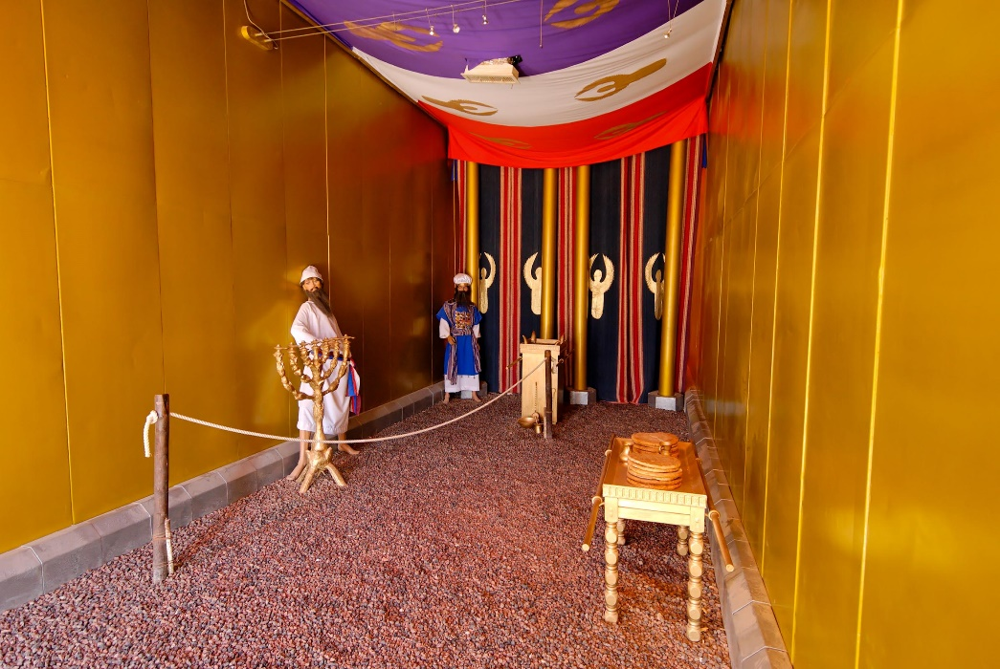
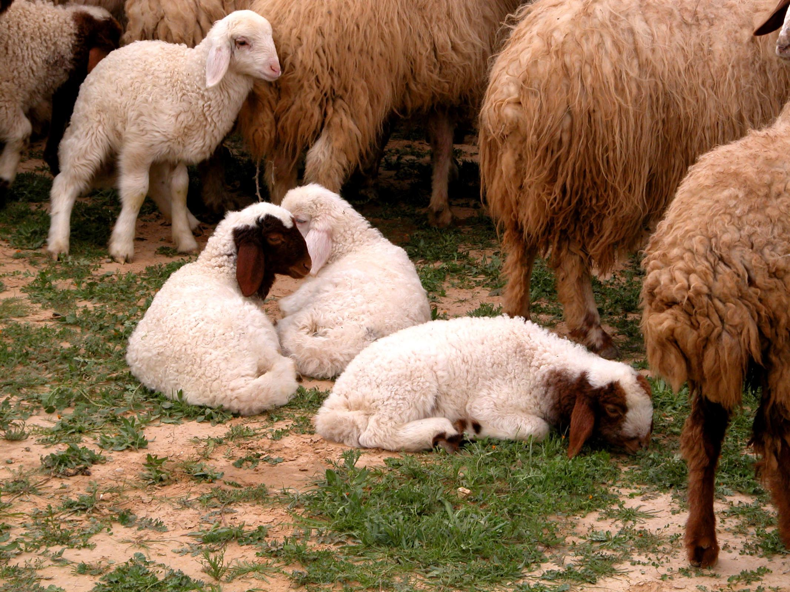
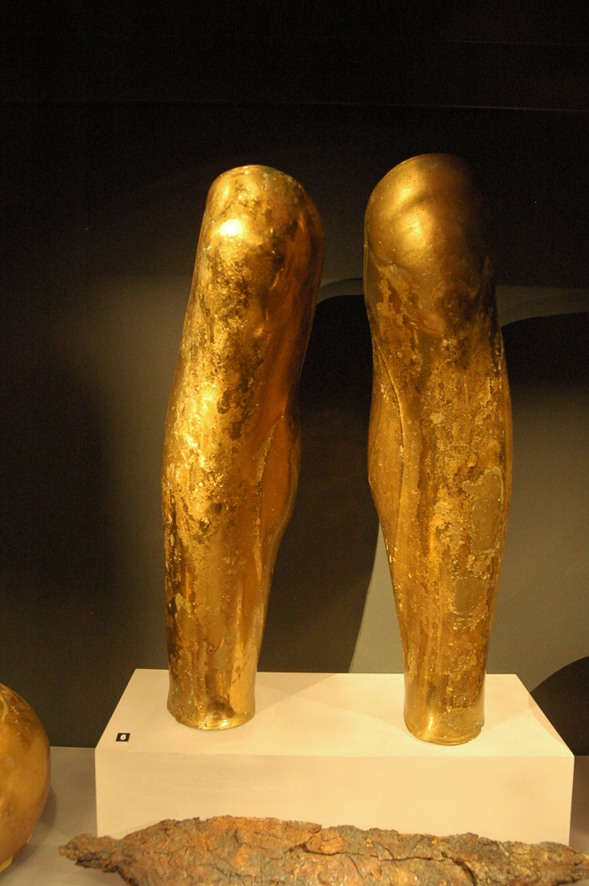
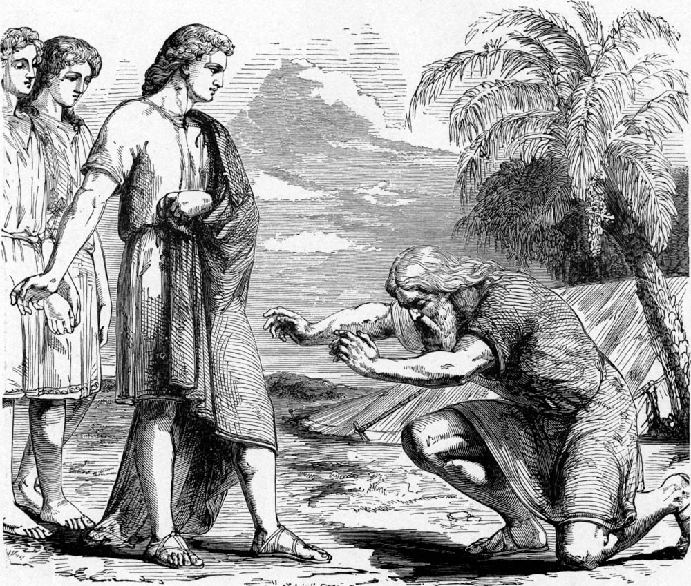
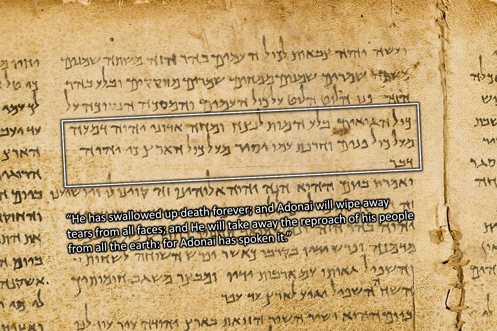
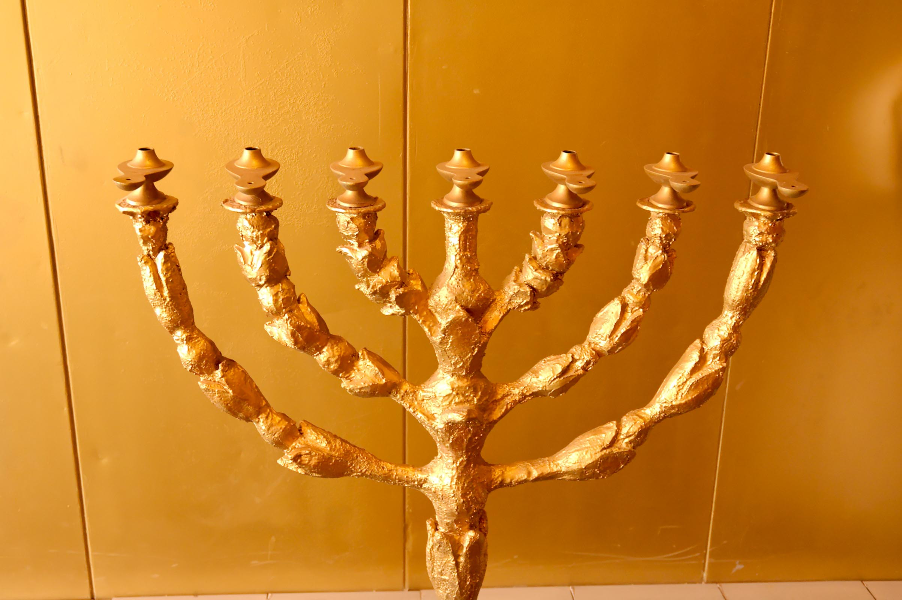



 

**Read/hear the portions**:

| Revelation 1:12-20                                                                                                                                                                                                                                                                                                                                                                                                                                                                                                                                                                                                                                                                                                                                                                                                                                                                                                               |
|----------------------------------------------------------------------------------------------------------------------------------------------------------------------------------------------------------------------------------------------------------------------------------------------------------------------------------------------------------------------------------------------------------------------------------------------------------------------------------------------------------------------------------------------------------------------------------------------------------------------------------------------------------------------------------------------------------------------------------------------------------------------------------------------------------------------------------------------------------------------------------------------------------------------------------------------------------------------------------------------------------------------------------------------------------------------------------------------------------------------------------------------------------------------------------------|
| 12. I turned around to see who was speaking to me; and when I had turned, I saw seven gold menorahs; 13. and among the menorahs was someone like a Son of Man, wearing a robe down to his feet and a gold band around his chest. 14. His head and hair were as white as snow-white wool, his eyes like a fiery flame, 15. his feet like burnished brass refined in a furnace, and his voice like the sound of rushing waters. 16. In his right hand he held seven stars, out of his mouth went a sharp double-edged sword, and his face was like the sun shining in full strength. 17. When I saw him, I fell down at his feet like a dead man. He placed his right hand upon me and said, "Don't be afraid! I am the First and the Last, 18. the Living One. I was dead, but look!—I am alive forever and ever! And I hold the keys to Death and Sh'ol. 19. So write down what you see, both what is now, and what will happen afterward. 20. Here is the secret meaning of the seven stars you saw in my right hand, and of the seven gold menorahs: the seven stars are the angels of the seven Messianic communities, and the seven menorahs are the seven Messianic communities.  |

**Summary**

**Video**



### Daniel 7 and 10

The so-called "Vision of the Risen Christ" in Revelation 1:12-18 has several similarities (and key differences) with Daniel 7 and Daniel 10. It is beneficial to read the Daniel passages before we begin a verse-by-verse study of the remainder of Revelation 1.

In the Daniel passages, focus on the depictions of the "Ancient of Days" and the "Son of Man" in Daniel 7:9-14, and then the description of the unnamed angel in Daniel 10:5-10.



<small>(1) In the first year of Belshazzar king of Babylon, Daniel saw a dream and visions of his head as he lay in his bed. Then he wrote down the dream and told the sum of the matter. (2) Daniel declared, "I saw in my vision by night, and behold, the four winds of heaven were stirring up the great sea. (3) And four great beasts came up out of the sea, different from one another. (4) The first was like a lion and had eagles' wings. Then as I looked its wings were plucked off, and it was lifted up from the ground and made to stand on two feet like a man, and the mind of a man was given to it. (5) And behold, another beast, a second one, like a bear. It was raised up on one side. It had three ribs in its mouth between its teeth; and it was told, 'Arise, devour much flesh.' (6) After this I looked, and behold, another, like a leopard, with four wings of a bird on its back. And the beast had four heads, and dominion was given to it. (7) After this I saw in the night visions, and behold, a fourth beast, terrifying and dreadful and exceedingly strong. It had great iron teeth; it devoured and broke in pieces and stamped what was left with its feet. It was different from all the beasts that were before it, and it had ten horns. (8) I considered the horns, and behold, there came up among them another horn, a little one, before which three of the first horns were plucked up by the roots. And behold, in this horn were eyes like the eyes of a man, and a mouth speaking great things.

**(9) "As I looked, thrones were placed, and the Ancient of Days took his seat; his clothing was white as snow, and the hair of his head like pure wool; his throne was fiery flames; its wheels were burning fire. (10) A stream of fire issued and came out from before him; a thousand thousands served him, and ten thousand times ten thousand stood before him; the court sat in judgment, and the books were opened. (11) "I looked then because of the sound of the great words that the horn was speaking. And as I looked, the beast was killed, and its body destroyed and given over to be burned with fire. (12) As for the rest of the beasts, their dominion was taken away, but their lives were prolonged for a season and a time. (13) "I saw in the night visions, and behold, with the clouds of heaven there came one like a son of man, and he came to the Ancient of Days and was presented before him. (14) And to him was given dominion and glory and a kingdom, that all peoples, nations, and languages should serve him; his dominion is an everlasting dominion, which shall not pass away, and his kingdom one that shall not be destroyed. (15) "As for me, Daniel, my spirit within me was anxious, and the visions of my head alarmed me. (16) I approached one of those who stood there and asked him the truth concerning all this. So he told me and made known to me the interpretation of the things.**

(17) 'These four great beasts are four kings who shall arise out of the earth. (18) But the saints of the Most High shall receive the kingdom and possess the kingdom forever, forever and ever.' (19) "Then I desired to know the truth about the fourth beast, which was different from all the rest, exceedingly terrifying, with its teeth of iron and claws of bronze, and which devoured and broke in pieces and stamped what was left with its feet, (20) and about the ten horns that were on its head, and the other horn that came up and before which three of them fell, the horn that had eyes and a mouth that spoke great things, and that seemed greater than its companions. (21) As I looked, this horn made war with the saints and prevailed over them, (22) until the Ancient of Days came, and judgment was given for the saints of the Most High, and the time came when the saints possessed the kingdom. (23) "Thus he said: 'As for the fourth beast, there shall be a fourth kingdom on earth, which shall be different from all the kingdoms, and it shall devour the whole earth, and trample it down, and break it to pieces. (24) As for the ten horns, out of this kingdom ten kings shall arise, and another shall arise after them; he shall be different from the former ones, and shall put down three kings. (25) He shall speak words against the Most High, and shall wear out the saints of the Most High, and shall think to change the times and the law; and they shall be given into his hand for a time, times, and half a time. (26) But the court shall sit in judgment, and his dominion shall be taken away, to be consumed and destroyed to the end. (27) And the kingdom and the dominion and the greatness of the kingdoms under the whole heaven shall be given to the people of the saints of the Most High; his kingdom shall be an everlasting kingdom, and all dominions shall serve and obey him.' (28) "Here is the end of the matter. As for me, Daniel, my thoughts greatly alarmed me, and my color changed, but I kept the matter in my heart." </small>

* One suggestion is that Daniel was alarmed in verse 15 because this was a paradigm shift. 
* In the prevailing view of his day, Messiah was not necessarily a deity. 
* Yet in verse 13, Daniel sees the Ancient of Days (whom we might call "the Father") giving the kingdom, the power, and the glory – where have we heard that phrase before? – to the one like a Son of Man, whom we might identify as Jesus. 
* Walton (et al.) notes that Jewish writings from before Jesus viewed the "son of man" as the Jewish Messiah.[^1] 
* John would have been familiar with these documents, particularly *1 Enoch*. Of course, the earliest Christians saw the "Son of Man" as Jesus.

[^1]: John H. Walton, Victor H. Matthews, and Mark W. Chavalas, *The IVP Bible Background Commentary: Old Testament*, (E-Sword). (Downers Grove, Ill: IVP Academic, 2000), v. Dan 7:13-14.





Walton estimates Daniel 7 was 552-549 BCE (Babylonian reign of Belshazzar), and Daniel 10 was 537-536 BCE (Persian reign of Cyrus). He notes Daniel 10 is "very close to the time when the first wave of Jews are returning from captivity and beginning the rebuilding of the (second) temple."[^2] Again, note the description of the angelic messenger and Daniel's reaction in verses 5-12 compared with Revelation 1:12-18.

[^2]: Ibid., v. Dan 10:1.

<small>(1) In the third year of Cyrus king of Persia a word was revealed to Daniel, who was named Belteshazzar. And the word was true, and it was a great conflict. And he understood the word and had understanding of the vision. (2) In those days I, Daniel, was mourning for three weeks. (3) I ate no delicacies, no meat or wine entered my mouth, nor did I anoint myself at all, for the full three weeks. (4) On the twenty-fourth day of the first month, as I was standing on the bank of the great river (that is, the Tigris)

**(5) I lifted up my eyes and looked, and behold, a man clothed in linen, with a belt of fine gold from Uphaz around his waist. (6) His body was like beryl, his face like the appearance of lightning, his eyes like flaming torches, his arms and legs like the gleam of burnished bronze, and the sound of his words like the sound of a multitude.** (7) And I, Daniel, alone saw the vision, for the men who were with me did not see the vision, but a great trembling fell upon them, and they fled to hide. (8) So I was left alone and saw this great vision, and no strength was left in me. My radiant appearance was fearfully changed, and I retained no strength. **(9) Then I heard the sound of his words, and as I heard the sound of his words, I fell on my face in deep sleep with my face to the ground. (10) And behold, a hand touched me and set me trembling on my hands and knees. (11) And he said to me, "O Daniel, man greatly loved, understand the words that I speak to you, and stand upright, for now I have been sent to you." And when he had spoken this word to me, I stood up trembling. (12) Then he said to me, "Fear not, Daniel, for from the first day that you set your heart to understand and humbled yourself before your God, your words have been heard, and I have come because of your words.**

(13) The prince of the kingdom of Persia withstood me twenty-one days, but Michael, one of the chief princes, came to help me, for I was left there with the kings of Persia, (14) and came to make you understand what is to happen to your people in the latter days. For the vision is for days yet to come." (15) When he had spoken to me according to these words, I turned my face toward the ground and was mute. (16) And behold, one in the likeness of the children of man touched my lips. Then I opened my mouth and spoke. I said to him who stood before me, "O my lord, by reason of the vision pains have come upon me, and I retain no strength. (17) How can my lord's servant talk with my lord? For now no strength remains in me, and no breath is left in me." (18) Again one having the appearance of a man touched me and strengthened me. (19) And he said, "O man greatly loved, fear not, peace be with you; be strong and of good courage." And as he spoke to me, I was strengthened and said, "Let my lord speak, for you have strengthened me." (20) Then he said, "Do you know why I have come to you? But now I will return to fight against the prince of Persia; and when I go out, behold, the prince of Greece will come. (21) But I will tell you what is inscribed in the book of truth: there is none who contends by my side against these except Michael, your prince.</small>



### Rev 1:12: Gold Menorah

| Revelation                                                                                            | References                                                                                                                                                                                                                                                                                                  |
|-------------------------------------------------------------------------------------------------------|-------------------------------------------------------------------------------------------------------------------------------------------------------------------------------------------------------------------------------------------------------------------------------------------------------------|
| 12. I turned around to see who was speaking to me; and when I had turned, I saw seven gold menorahs;  | Exodus 37:23 And he made its seven lamps and its tongs and its trays of pure gold. Zec 4:2 And he said to me, "What do you see?" I said, "I see, and behold, a lampstand all of gold, with a bowl on the top of it, and seven lamps on it, with seven lips on each of the lamps that are on the top of it.  |

-   Remember back in verse 10, John heard a great voice behind him. Here he turns to look.

-   Your Bible may say, "lampstands or candlesticks," but what John sees is unquestionably a menorah, as Stern translated in the CJB.
    -   He renders as "seven menorahs."
    -   A menorah has seven branches; this is one Menorah with seven lights. To the right is a photo I took of the Temple Institute Menorah in2013.[^3]
    -   Later, we will find out that each "candlestick" is a congregation with Jesus in the midst.
    -   The Menorah is also reminiscent of a tree or a vine with branches.
        -   Jesus is the vine, and we are the branches (John 15).
        -   Jesus is also the light of the world.
        -   Also, the tabernacle/temple menorah was made of gold, which fits with verse 12.
-   According to Missler, this scene should remind us of the Tabernacle.[^4]
    -   The robe and gold band in verse 13 may allude to the High Priest (Exodus 28:4).
    -   The high priest was the one who tended the Menorah, including snuffing out and correcting if unsatisfactory.
    -   Lizorkin says, "the presence of the Temple menorah would signal to John's audience that his visionary experience took place in the vicinity of the Temple. And more precisely in the inner section of the Temple."[^5]
-   The Temple/Tabernacle Menorah also testifies to God's presence.
    -   The seven fellowships are supposed to live in such a way that their communities see God's light and presence.
        -   Num 7:89 And when Moses went into the tent of meeting to speak with the LORD, he heard the voice speaking to him from above the mercy seat that was on the ark of the testimony, from between the two cherubim; and it spoke to him.

[^3]: Chris Flanagan, *Jerusalem Temple Menorah at Night in 2013*, Digital Photograph, February 2013.

[^4]: Chuck Missler, *The Book of Revelation Handbook* (Koinonia House, 2020), 21.

[^5]: Eli Lizorkin-Eyzenberg and Pinchas Shir, *Hebrew Insights from Revelation*, Kindle., Jewish Studies for Christians, 2021, 39–40.

### Rev 1:13: One Like a Son of Man

| Revelation                                                                                                                  | References                                                                                                                                                                                                                                                                                                                                                                                                                                                                                                                                                                                                                                                                                                                                                                                       |
|-----------------------------------------------------------------------------------------------------------------------------|--------------------------------------------------------------------------------------------------------------------------------------------------------------------------------------------------------------------------------------------------------------------------------------------------------------------------------------------------------------------------------------------------------------------------------------------------------------------------------------------------------------------------------------------------------------------------------------------------------------------------------------------------------------------------------------------------------------------------------------------------------------------------------------------------|
| 13. and among the menorahs was someone like a Son of Man, wearing a robe down to his feet and a gold band around his chest  | Exo 28:4 These are the garments that they shall make: a breast piece, an ephod, a robe, a coat of checker work, a turban, and a sash. They shall make holy garments for Aaron your brother and his sons to serve me as priests.   Dan 7:13 "I saw in the night visions, and behold, with the clouds of heaven there came one like a son of man, and he came to the Ancient of Days and was presented before him. Dan 10:5 I lifted up my eyes and looked, and behold, a man clothed in linen, with a belt of fine gold from Uphaz around his waist.  Dan 10:16 And behold, one in the likeness of the children of man touched my lips. Then I opened my mouth and spoke. I said to him who stood before me, "O my lord, by reason of the vision pains have come upon me, and I retain no strength." |

-   This is often called the "vision of the Risen Christ."
-   The fact that John noted one dressed as a priest in the "midst" of the Menorah may suggest he was witnessing Jesus as High Priest in heavenly Tabernacle (Heb 9).

-   The photo shows the "Holy Place," where the Menorah was located. In the foreground is the Table of Showbread. By the curtain leading to the Holy of Holies is the Altar of Incense. (Ex 26:33)[^6]
    -   This is from a Tabernacle replica that one can visit near Eilat, Israel.
-   Interestingly, John does NOT identify Jesus but says "one like a Son of Man."
    -   John and Jesus were very close during Jesus' earthly ministry. 
    - Presumably, He would have said, "and among the Menorahs was Jesus wearing a robe…"…but he didn't.
    -   We know from 1:1 and 22:8 that John is not talking directly with Jesus
    -   This angelic divine being is at the same time Jesus but not quite Jesus
-   As we saw from some of the parallel passages, the description of the one like a Son of Man is inherited from the Ancient of Days.
    -   Dr. Baruch Korman writes, "This is a depiction of Messiah taking on the mantle of God the father."[^7]
    -   Dr. Lizorkin writes, "The garments are highly symbolic, showing that Jesus is the heavenly priest, fully prepared and qualified to carry out His duties."[^8]
    -   Dr. Keener writes, "the cumulative impact of these images is to present the risen Jesus as the greatest conceivable figure."[^9]
-   There are numerous parallels among Revelation 1:12-18, Daniel 7, Daniel 10, and to a lesser extent, Ezekiel 1 and even Matthew 17 and the Transfiguration.
-   We will compare Revelation 1 and Daniel 10 towards the end of the lesson.
- Jesus physically is seated at the Right Hand of the Father
  - This may explain why it appears to be an Angel and not Jesus directly who speaks with John.  
  - Jesus is to remain seated at the Right Hand until the appointed time.
  - In either case, Jesus is also spiritually amid our fellowships and us.
- Remember also that the earthly fellowships were undergoing intense persecution. Perhaps they felt abandoned by God, but here we see God is right in their midst.[^10]

[^6]: Todd Bolen, *Tabernacle Model*, vol. Negev and the Wilderness, Pictorial Library of Bible Lands, 2012, 33.

[^7]: Baruch Korman, *Revelation Chapter 1 Part 3*, 2015, accessed February 10, 2022, https://vimeo.com/135168951.

[^8]: Lizorkin-Eyzenberg and Shir, *Hebrew Insights from Revelation*, 43–44.

[^9]: Craig S. Keener, *The IVP Bible Background Commentary: New Testament*, 2nd edition (E-Sword). (Downers Grove, Illinois: IVP Academic, 2014), v. Rev 1:13.

[^10]: Korman, *Revelation Chapter 1 Part 3*.

### Rev 1:14: Head, Hair, and Eyes

| Revelation                                                                             | References                                                                                                                                                                                                                                                                                                                                                                                                                   |
|----------------------------------------------------------------------------------------|------------------------------------------------------------------------------------------------------------------------------------------------------------------------------------------------------------------------------------------------------------------------------------------------------------------------------------------------------------------------------------------------------------------------------|
| 14. His head and hair were as white as snow-white wool, his eyes like a fiery flame,   | Dan 7:9 "As I looked, thrones were placed, and the Ancient of Days took his seat; his clothing was white as snow, and the hair of his head like pure wool; his throne was fiery flames; its wheels were burning fire.  Dan 10:6 His body was like beryl, his face like the appearance of lightning, … Mat 17:2 And he was transfigured before them, and his face shone like the sun, and his clothes became white as light.  |

<small>Photo caption: "Lambs in the Negev."[^11]</small>

[^11]: Todd Bolen, *Daniel 7*, vol. Daniel, Photo Companion to the Bible (Santa Clarita, CA, 2018), 70.

### Rev 1:15: Feet and Voice

| Revelation                                                                                                | References                                                                                                                                                                                                                                                                                                                                                                                                                                                                                                                                                                                                                                                                                     |
|-----------------------------------------------------------------------------------------------------------|------------------------------------------------------------------------------------------------------------------------------------------------------------------------------------------------------------------------------------------------------------------------------------------------------------------------------------------------------------------------------------------------------------------------------------------------------------------------------------------------------------------------------------------------------------------------------------------------------------------------------------------------------------------------------------------------|
| 15. his feet like burnished brass refined in a furnace, and his voice like the sound of rushing waters.   | Dan 10:6 … his arms and legs like the gleam of burnished bronze, and the sound of his words like the sound of a multitude. Eze 1:**7, 24** Their legs were straight, and the soles of their feet were like the sole of a calf's foot. And they sparkled like burnished bronze. **24** And when they went, I heard the sound of their wings like the sound of many waters, like the sound of the Almighty, a sound of tumult like the sound of an army. When they stood still, they let down their wings. **Eze 43:2** And behold, the glory of the God of Israel was coming from the east. And the sound of his coming was like the sound of many waters, and the earth shone with his glory.  |

-   As a biblical type, brass speaks of judgment

<small>Photo caption: "Bronze greaves (armor that protects the leg) from Derveni, 300 BC."[^12]</small>

[^12]: Todd Bolen, *Daniel 10*, vol. Daniel, Photo Companion to the Bible (Santa Clarita, CA, 2018), 24.

### Rev 1:16: Right Hand, Mouth, and Face

| Revelation                                                                                                                                            | References                                                                                                                                                                                                                                                                                                                                                                                                                                                                          |
|-------------------------------------------------------------------------------------------------------------------------------------------------------|-------------------------------------------------------------------------------------------------------------------------------------------------------------------------------------------------------------------------------------------------------------------------------------------------------------------------------------------------------------------------------------------------------------------------------------------------------------------------------------|
| 16. In his right hand he held seven stars, out of his mouth went a sharp double-edged sword, and his face was like the sun shining in full strength.  | Jdg 5:31 "So may all your enemies perish, O LORD! But your friends be like the sun as he rises in his might." Isa 49:2 He made my mouth like a sharp sword; in the shadow of his hand he hid me; he made me a polished arrow; in his quiver he hid me away. Heb 4:12 For the word of God is living and active, sharper than any two-edged sword, piercing to the division of soul and of spirit, of joints and of marrow, and discerning the thoughts and intentions of the heart.  |

-   We occasionally see drawings, some quite grotesque in my opinion, of Jesus with a literal sword coming out of His mouth. This misses the point entirely. Obviously, the sword is symbolic. As Lizorkin says, "this being is powerful enough to destroy with his voice alone."[^13]
-   Early Jewish believers saw the two edges as two aspects of the Word of God
    -   Either the "law and the prophets" or "Moses and Jesus."
        -   Unfortunately, Reformation theology sees "Law" and "Gospel" as opposites. They are not. The opposite of "law" is not "grace" but "lawlessness."
        -   If this is the model, here we see that Law and Gospel are not opposed to each other but are two sides of the same sword
        -   Both bring judgment for the wicked and life for the righteous.
-   Dr. Baruch pointed out that a sword also divides and separates, in the sense that in Genesis 1:4, God divided the light from the darkness.[^14]
-   I saw a meme recently that the light never flees in the face of darkness. It is the darkness that runs when confronted by light. For darkness to prevail, the light source must be removed. John 3:19 has more about this.

<small>Photo caption: "Sunrise over the coastline at Assos" (western Turkey).[^15]  Assos is not too far from Pergamum.</small>

[^13]: Lizorkin-Eyzenberg and Shir, *Hebrew Insights from Revelation*, 49.

[^14]: Korman, *Revelation Chapter 1 Part 3*.

[^15]: Todd Bolen, *Judges 5*, vol. Judges, Photo Companion to the Bible (Santa Clarita, CA, 2018), 196.

### Rev 1:17: Fear not!

| Revelation                                                                                                                                             | References                                                                                                                                                                                                                                                                                                                                                                                                                                                                                                                                                                  |
|--------------------------------------------------------------------------------------------------------------------------------------------------------|-----------------------------------------------------------------------------------------------------------------------------------------------------------------------------------------------------------------------------------------------------------------------------------------------------------------------------------------------------------------------------------------------------------------------------------------------------------------------------------------------------------------------------------------------------------------------------|
| 17. When I saw him, I fell down at his feet like a dead man. He placed his right hand upon me and said, "Don't be afraid! I am the First and the Last, | Dan 8:17-18 So he came near where I stood. And when he came, I was frightened and fell on my face. But he said to me, "Understand, O son of man, that the vision is for the time of the end." 18 And when he had spoken to me, I fell into a deep sleep with my face to the ground. But he touched me and made me stand up.  Dan 10:9-10,12,15 followed by Dan 10:19 And he said, "O man greatly loved, fear not, peace be with you; be strong and of good courage." And as he spoke to me, I was strengthened and said, "Let my lord speak, for you have strengthened me." |

-   There is a common reaction when people in the Bible are given a glimpse of God – even if it's "just" an angel, they are terrified!
-   The drawing on the right illustrates Abraham bowing before angelic visitors, one of whom is the "Angel of the Lord."[^16]
-   Most of our Bibles have from 1:17 through the end of chapter 3 in red text; the translators assume Jesus is speaking. It's a fair assumption; however, if we're faithful to the text, John does not record who is speaking.
    -   Rev 1:1 and Rev 22:8 tell us John received the vision from an Angel, not from Jesus directly.
-   Assuming this is John the Apostle, he knew Jesus better than anyone. Was he afraid because this incredible and terrifying being wasn't Jesus?
-   Even if we assume it was Jesus, there is a lesson.
    -   No matter how well you know Jesus, He's still God. We can't get too casual.
    -   CS Lewis captures this beautifully in "The Lion, the Witch, and the Wardrobe." Susan Pevensie is talking to Mr. Beaver. "Aslan is a lion- the Lion, the great Lion." "Ooh," said Susan. "I'd thought he was a man. Is he-quite safe? I shall feel rather nervous about meeting a lion"..."**Safe**?" said Mr. Beaver **..."Who said anything about safe? 'Course he isn't safe**. **But he's good**. He's the King, I tell you."
-   In any case, the angel has the authority to speak for Jesus and God the Father in the 1st person.
    -   If we look back in Genesis, the "Angel of the LORD" in the Old Testament has the authority to speak for the Father in the first person. It's as if Abraham is communicating with God Himself.
    -   I believe that is the case with John. The text tells us John is not speaking with Jesus directly, but he might as well be since He's the only One who purchased our life with His death
    -   The safest avenue is to say John is speaking with an Angel of the God of Israel, acknowledging some elasticity in our definitions of the Father, Spirit, and Son.[^17]

[^16]: Bolen, *Daniel 10*, Daniel:34.

[^17]: Tom Bradford, “Lesson 4 - Revelation 1 Concl.,” *Seed of Abraham Ministries, Inc*, accessed January 31, 2022, https://www.torahclass.com/bible-studies/new-testament-studies/1917-new-testament-revelation/2882-lesson-4-revelation-1-concl.

### Rev 1:18: "I was dead but behold, I Am alive!"

| Revelation                                                                                                       | References                                                                                                                                                                                                                                                                                                                                             |
|------------------------------------------------------------------------------------------------------------------|--------------------------------------------------------------------------------------------------------------------------------------------------------------------------------------------------------------------------------------------------------------------------------------------------------------------------------------------------------|
| 18. the Living One. I was dead, but look!—I am alive forever and ever! And I hold the keys to Death and Sh'ol.   | Isa 25:8 He will swallow up death forever; and the Lord GOD will wipe away tears from all faces, and the reproach of his people he will take away from all the earth, for the LORD has spoken.  Hos 13:14 I shall ransom them from the power of Sheol; I shall redeem them from death. O death, where are your plagues? O Sheol, where is your sting?  |

In 1 Corinthians 15:54, Paul says, "the saying will come about as it is written, "Death is swallowed up in victory!" He was quoting Isaiah 25:8. The words spoken to John appear linked to this passage also.

This was the great find of the Dead Sea Scrolls in 1948 in a cave by the Dead Sea: a complete and relatively intact scroll containing the book of Isaiah. Before this, the most recent full copy of the Hebrew Bible we had was from the 9th or 10th century CE. This scroll dates to 1000 years prior, the 1st Century before Christ, or before the Common Era. There are minor differences only. 

<small>Photo caption: "Isaiah 25:8 on the great Isaiah Scroll."[^18]</small>

[^18]: Todd Bolen, *1 Corinthians 15*, vol. 1st Corinthians, Photo Companion to the Bible (Santa Clarita, CA, 2018), 183.

### Rev 1:19: μετα ταυτα

| Revelation                                                                          | References                                 |
|-------------------------------------------------------------------------------------|--------------------------------------------|
| 19. So write down what you see, both what is now, and what will happen afterwards.  | Isa 30:8; Jer 30:2; Hab 2:2 (see Rev 1:11) |

-   Conservative scholars tend to see this as an Outline of the book, though this is debated:
    -   What you see: the Vision of the Risen Christ – chapter 1
    -   The things which are: the seven assemblies/churches - chapters 2-3
    -   The things that shall be after – chapters 4-22
-   The Greek phrase for "after these things" is μετα ταυτα meta tauta.
    -   Meta tauta acts as a signpost throughout Revelation.





<small>

1.  Rev 1:19 Write therefore the things that you have seen, those that are and those that are to take place after this.
2.  Rev 4:1 After this I looked, and behold, a door standing open in heaven! 
3.  Rev 4:1 And the first voice, which I had heard speaking to me like a trumpet, said, “Come up here, and I will show you what must take place after this.”
3.  Rev 7:1 after this I saw four angels standing at the four corners of the earth, holding back the four winds of the earth, that no wind might blow on earth or sea or against any tree.
4.  Rev 7:9 after this I looked, and behold, a great multitude that no one could number, from every nation, from all tribes and peoples and languages, standing before the throne and before the Lamb, clothed in white robes, with palm branches in their hands
5.  Rev 9:12 The first woe has passed; behold, two woes are still to come.
6.  Rev 15:5 after this I looked, and the sanctuary of the tent of witness in heaven was opened
7.  Rev 18:1 after this I saw another angel coming down from heaven, having great authority, and the earth was made bright with his glory.
8.  Rev 19:1 after this I heard what seemed to be the loud voice of a great multitude in heaven, crying out, “Hallelujah! Salvation and glory and power belong to our God
9.  Rev 20:3 and threw him (Satan) into the pit, and shut it and sealed it over him, so that he might not deceive the nations any longer, until the thousand years were ended. After that he must be released for a little while.

</small>









<small>

-   There are not seven but 10 μετα ταυτα phrases in Revelation.
-   In Hebrew Gematria, specific numbers that reappear throughout the Bible are assigned concepts.
-   Gematria means that scholars, both ancient sages and modern academics, have studied these patterns
-   Where they see seven, they notice a general theme of completion or perfection.
-   Using this method, 10 represents divine order or law,
-   The most obvious examples are the 10 commandments and the 10 plagues.
-   There were also 10 generations from Adam to Noah, where we saw the flood restoring order.
-   There were also 10 generations from Noah to Abraham where we received the Abrahamic covenant.
-   In Ruth 4, there is a strange prophecy given to Ruth and Boaz, followed by a list of 10 generations from Perez to King David.
    -   "Ruth 4:12 and may your house be like the house of Perez, whom Tamar bore to Judah, because of the offspring that the LORD will give you by this young woman."
    -   If you know the story of Tamar and Judah, it's sordid. If you received this "blessing," you might be inclined to think "same to you, fella!"
    -   Perez was the product of a "forbidden union" between Tamar and Judah, her father in-law.
    -   Deuteronomy 23:2 - "No one born of a forbidden union may enter the assembly of the LORD. Even to the _tenth_ generation, none of his descendants may enter the assembly of the LORD."
        -  The backstory is Tamar's previous husbands (Judah's other sons) had died without issue, and it was Judah's responsibility to see that his line continued.  He failed to do this, so Tamar posed as a prostitute and went into to Judah.  Of course, she became pregnant by him.  When Judah found out that his daughter in law had played the harlot, he was furious.  He was about to have her executed when she presented evidence that he was the father of the child.  Oops.  The son's name was Perez.
    -   The end of Ruth connects the dots for us by listing 10 generations from Perez to David the King.
    -   From a spiritual perspective, this was yet another attempt by Satan to sabotage the lineage of Jesus.
    -  Tamar perhaps unknowingly, saw to it that the line continued, and indeed she is one of the four women noted in Jesus' genealogy (Matthew 1:3).

</small>





### Rev 1:20: The Meaning of the Stars/Menorah

| Revelation                                                                                                                                                                                                                                  | References                                                                                                                                                                                                                |
|---------------------------------------------------------------------------------------------------------------------------------------------------------------------------------------------------------------------------------------------|---------------------------------------------------------------------------------------------------------------------------------------------------------------------------------------------------------------------------|
| 20. Here is the secret meaning of the seven stars you saw in my right hand, and of the seven gold menorahs: the seven stars are the angels of the seven Messianic communities, and the seven menorahs are the seven Messianic communities.  | Zech 4: 2 And he said to me, "What do you see?" I said, "I see, and behold, a lampstand all of gold, with a bowl on the top of it, and seven lamps on it, with seven lips on each of the lamps that are on the top of it. |

-   A topic of debate is whether the seven stars/angels are natural or supernatural
-   About all the "natural" camp has going for it is our western minds can understand it better.
    -   In this view, the angels of each congregation are human.
    -   More than likely, the messenger would be the pastor of each community or a designated reader in the synagogue.
    -   Unfortunately, no church leadership position is ever called an angel or messenger anywhere else in the New Testament.
-   In favor of the supernatural angel view, the entire book of Revelation has angels everywhere, so why not in Chapters 2 and 3?
    -   Jewish texts often portray angels as stars.
    -   In this view, churches/fellowships have designated angels just like nations do.
        -   In Daniel 10, the angelic messenger had to do battle with the spirit of Persia and then had to go back to do battle with the spirit of Greece.
    -   In other words, there is a heavenly counterpart to an earthly reality.
    -   Admittedly it is foreign to think of a fellowship having a "guardian angel."
        -   If our churches had such an angel, wouldn't it keep false teaching and division out of the church?
    -   Protestants tend to deemphasize angels, which is odd given that "angels" or "angel" appears over 180 times in the New Testament- about 80 times in Revelation and the other 100 in the rest of the New Testament.
    -   There is probably much more going on in the supernatural angelic community than most of us realize.
    -   In both Hebrew and Greek, the meaning could be either a supernatural angel or a natural messenger. However, only about six times out of the 180 can we be certain that the word references only a human messenger.
-   This certainly raises several questions:
    -   Do churches today have designated angels?
    -   Was this a 1st-century phenomenon?
    -   Was it ONLY these seven specially designated congregations?
    -   Who knows!
-   By having the stars in his right hand, the hand of power, John is possibly communicating, "Christ is Lord over the universe including Lord over the angels who guide the churches as well as the nations."[^20]
    -   Keener also notes given the tensions between non-messianic and messianic branches of Judaism in that day, "by identifying the churches as (a menorah), John claims that the Jesus movement is the true form of Judaism."[^21]
-   One thing we do know: a menorah's purpose is to give off light in a dark place
    -   This is what our churches should be doing
    -   This is what we as disciples should be doing.

<small>Photo caption: "Tabernacle Model Golden Menorah."[^19]</small>
[^19]: Bolen, *Tabernacle Model*, Negev and the Wilderness:41.

[^20]: Keener, *The IVP Bible Background Commentary*, v. Rev 1:20.

[^21]: Keener, *The IVP Bible Background Commentary*.

### Postscript: Rev 1 and Dan 10

As a postscript, let's do a quick side-by-side of Revelation 1 and Daniel 10. In this way, we can see how the book we hold in our laps or in our smart devices is ONE book with one consistent message from beginning to end.

| Topic                               | Dan 10                                                                                                                                                                                          | Rev 1:9-18                                                                                                                                                  |
|-------------------------------------|-------------------------------------------------------------------------------------------------------------------------------------------------------------------------------------------------|-------------------------------------------------------------------------------------------------------------------------------------------------------------|
| Double introduction                 | 2 In those days I, Daniel,                                                                                                                                                                      | **9** I, John, your brother and partner in the tribulation and the kingdom and the patient endurance that are in Jesus                                      |
| Location – both surrounded by water | 4 was standing on the bank of the great river (that is, the Tigris)                                                                                                                             | 9 was on the island called Patmos                                                                                                                           |
| State of preparation                | 2 In those days I, Daniel, was mourning for three weeks. 3 I ate no delicacies, no meat or wine entered my mouth, nor did I anoint myself at all, for the full three weeks.                     | **10** I was in the Spirit on the Lord's day,                                                                                                               |
| The listener notices                | 5 I lifted up my eyes and looked, and behold, a man                                                                                                                                             | 12 I turned around to see who was speaking to me;                                                                                                           |
| The being's clothing                | 5 clothed in linen, with a belt of fine gold from Uphaz around his waist.                                                                                                                       | 13 clothed with a long robe and with a golden sash around his chest.                                                                                        |
| Head/face                           | 6 his face like the appearance of lightning, (Dan 7:9 the hair of his head like pure wool)                                                                                                      | 14 The hairs of his head were white, like white wool, like snow.                                                                                            |
| Eyes                                | 6 his eyes like flaming torches                                                                                                                                                                 | 14 His eyes were like a flame of fire,                                                                                                                      |
| Arms & Legs/Feet                    | 6 his arms and legs like the gleam of burnished bronze                                                                                                                                          | 15 his feet were like burnished bronze, refined in a furnace,                                                                                               |
| Voice                               | 6 the sound of his words like the sound of a multitude.                                                                                                                                         | 15 and his voice was like the roar of many waters.                                                                                                          |
| Reaction                            | **9** as I heard the sound of his words, I fell on my face in deep sleep with my face to the ground.                                                                                            | 17 When I saw him, I fell at his feet as though dead.                                                                                                       |
| Commission                          | **10** And behold, a hand touched me                                                                                                                                                            | 17 But he laid his right hand on me,                                                                                                                        |
| Assurance                           | **12** Then he said to me, "Fear not, Daniel,                                                                                                                                                   | 17 saying, "Fear not, I am the first and the last, 18 and the living one. I died, and behold I am alive forevermore, and I have the keys of Death and Hades |
| Mission                             | **14,19** and came to make you understand what is to happen to your people in the latter days. For the vision is for days yet to come….I will tell you what is inscribed in the book of truth." | 19 Write therefore the things that you have seen, those that are and those that are to take place after this.                                               |

