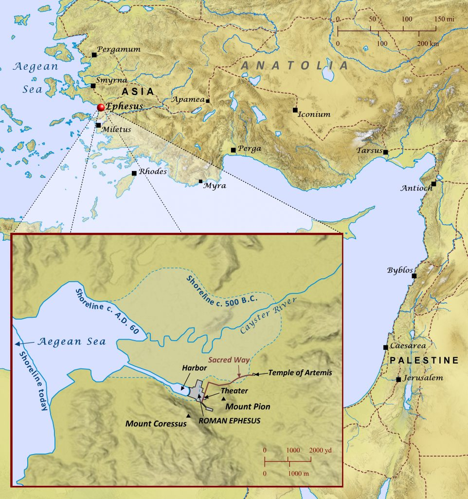
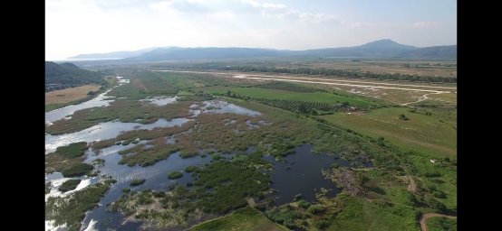
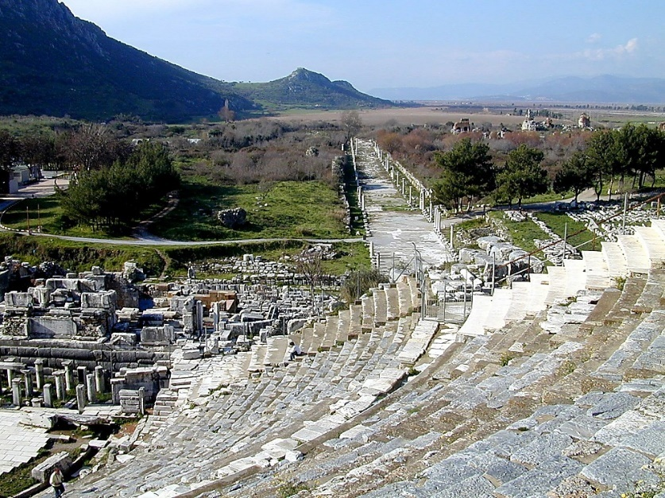
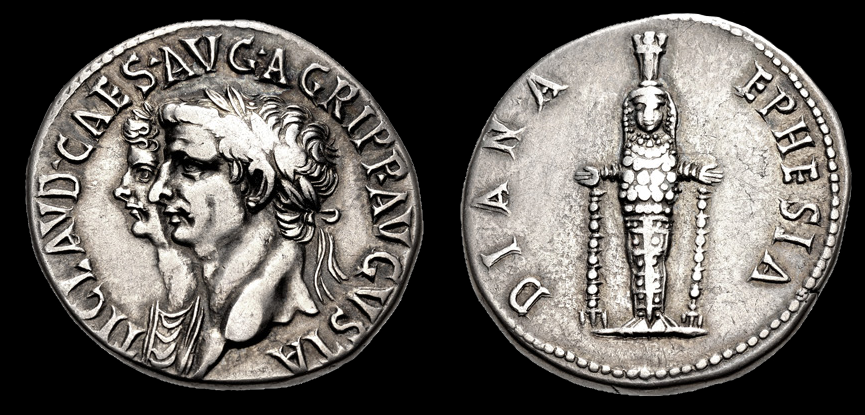
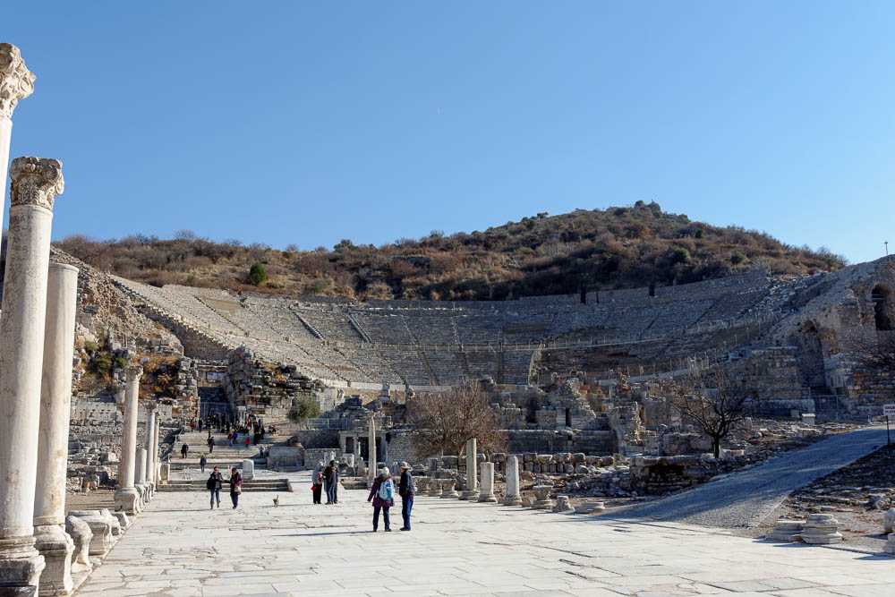



 

**Video**



### Read/hear the portion

| Revelation 2:1-7                                                                                                                                                                                                                                                                                                                                                                                                                                                                                                                                                                                                                                                                                                                                                                                                                                                                                                                                                                                                                                                                                        |
|---------------------------------------------------------------------------------------------------------------------------------------------------------------------------------------------------------------------------------------------------------------------------------------------------------------------------------------------------------------------------------------------------------------------------------------------------------------------------------------------------------------------------------------------------------------------------------------------------------------------------------------------------------------------------------------------------------------------------------------------------------------------------------------------------------------------------------------------------------------------------------------------------------------------------------------------------------------------------------------------------------------------------------------------------------------------------------------------------------|
| (1) "To the angel of the Messianic Community in Ephesus, write: 'Here is the message from the one who holds the seven stars in his right hand and walks among the seven gold menorahs: (2) "I know what you have been doing, how hard you have worked, how you have persevered, and how you can't stand wicked people; so you tested those who call themselves emissaries but aren't—and you found them to be liars. (3) You are persevering, and you have suffered for my sake without growing weary. (4) But I have this against you: you have lost the love you had at first. (5) Therefore, remember where you were before you fell, turn from this sin, and do what you used to do before. Otherwise, I will come to you and remove your menorah from its place—if you don't turn from your sin! (6) But you have this in your favor: you hate what the Nicolaitans do—I hate it too. (7) Those who have ears, let them hear what the Spirit is saying to the Messianic communities. To him winning the victory I will give the right to eat from the Tree of Life which is in God's Gan-\`Eden."  |

### Ephesus Background

#### Ephesus geography

Ephesus was known as the "Queen of Asia" for its wealth and beauty. Its location meant it could serve as an essential waypoint from Rome to the eastern provinces, either by sea or land. A network of Roman roads connected the seven messianic assemblies. They also eventually linked up with routes leading to Asia proper, including Israel, the Fertile Crescent, and Africa.

During the Roman Empire, Ephesus was a significant harbor village. On the map inset, you can see estimations of the shoreline from 500 BCE to 60 CE to the present. The change was caused by dramatic silting from the Cayster River, making the modern harbor useless. The photo below the map shows the swampy area of the Roman port today.

This photograph shows the Great Theater (with seating up to 25,000) with the street that led to the now silted harbor. Acts 19:21-41 describes a riot that occurred when devotees of Diana/Artemis said that Paul posed a clear and present danger to their way of life. The theater is where the riot took place.

The harbor street (shown in the center of the picture) would have been lined with shops on both sides.[^1] There was also a large "agora," or marketplace adjacent. "This would have been the likeliest place…for Aquila, Priscilla, and Paul to have set up shop for their long stay in Ephesus."[^2] DeSilva also notes the market "was a major note in the flow of goods from the East to Rome. Many of the cargoes listed in Rev 18:12-13 could be found arriving in Ephesus from the East for further transportation west."[^3] We need to imagine how difficult it would have been to live life as a set-apart believer in a thoroughly pagan environment like Ephesus.

[^1]: Todd Bolen, *Ephesus-2019*, vol. Western Turkey, Pictorial Library of Bible Lands, 2019, 381.

[^2]: David A. DeSilva, “The Social and Geographical World of Ephesus,” in *Lexham Geographic Commentary on Acts through Revelation*, ed. Barry J. Beitzel (Bellingham, WA: Lexham Press, 2019), 544.

[^3]: Ibid., 545.

#### Ephesus secular history

Scholars believe Hittites founded Ephesus in 1400 BCE. Archeologists have excavated remains of an early temple to a mother goddess, a Hittite fertility deity that later morphed into Diana/Artemis. If the name "Hittite" rings a bell, Uriah, one of David's mighty men, was a Hittite. Uriah had a beautiful wife named Bathsheba.

Ephesus repeatedly picked the wrong side in the Peloponnesian, Persian, and Roman wars. Still, it became a favored city under Rome and competed with Pergamum (and Smyrna to a lesser extent) over which city was most favored by Rome.

##### Ephesus and Artemis

The temple to Artemis/Diana was one of the famous "Seven Wonders of the Ancient World." With a footprint of 220' x 425', It is four times larger than the Parthenon in Athens[^4]. It was first built in the mid-6th century BCE atop previous temples dating to the 8th century (the time of King Hezekiah in Judah). Artemis, called Diana by the Romans, was the virgin goddess of the moon, fertility, and nature. Our "mother nature" myth likely comes from her. Artemis is the earth goddess, nurturing and fertile. As we can see in the photo,[^5] Artemis is depicted as multi-breasted (or multiple eggs, also a symbol of fertility). She can also be cruel, vindictive, and destructive.[^6]

[^4]: The Temple to Artemis was still significantly smaller than the Temple Mount in Jerusalem, which (very roughly) is 1000' x 1000'.

[^5]: By Gargarapalvin - Own work, CC BY-SA 4.0, https://commons.wikimedia.org/w/index.php?curid=89108995

[^6]: Bolen, *Ephesus-2019*, Western Turkey:45.

Looking at the map above, we can see that the temple was situated about a mile outside the central Roman city. Bolen writes, " This makes sense, given Artemis’s identity as a goddess of the wilds."[^7] Fertility rites involving temple prostitutes were shared, which Paul disrupted in the New Testament period. It appears to have been destroyed around 400 CE. Today not much remains of the site except for a conspicuous pillar.

[^7]: Ibid., Western Turkey:49.

[^8]: Ibid., Western Turkey:51.

This coin[^9] from AD 50 shows how much the city identified with Diana, down to its very economy. This is why the townspeople saw Paul not only as a religious threat but also as an economic one. The reverse shows the cult statue of Diana (Artemis) of Ephesus and identifies it as “Diana of Ephesus” (DIANA EPHESIA). It is believed that this coin was struck at the Ephesus mint around AD 50–51. In addition to the temple to Artemis, there were numerous other temples, including a large structure devoted to the worship of Domitian. We've mentioned the persecutions against Christians and Jews, but Domitian was also paranoid that fellow Romans conspired against him. He arrested and terrorized anyone he suspected. As a post-script, Domitian was so hated that upon his death, the citizens of Ephesus tore down the statue of him and scratched his name from inscriptions. 

[^9]: Todd Bolen, *Acts 19*, vol. Acts, Photo Companion to the Bible (Santa Clarita, CA, 2018). This image comes from CNG Coins and is used by permission. https://cngcoins.com/Coin.aspx?CoinID=276451

[^10]: Bolen, *Ephesus-2019*, Western Turkey:141.

The population of Ephesus during the New Testament period was believed to have been around 200,000, making Ephesus the fifth largest city in the Roman empire. There was an extensive library there, and the city was known as a center for studying arts and magic. [^11] Of note, there was also an infamous and large brothel in Ephesus.[^12] All of this possibly gives rise to Paul's comment in Ephesians 2:

[^11]: Chuck Missler, *The Book of Revelation Handbook* (Koinonia House, 2020), 28.

[^12]: Ibid., Western Turkey:361.

>   "Eph 2:1-3 And you were dead in the trespasses and sins (2) in which you once walked, following the course of this world, following the prince of the power of the air, the spirit that is now at work in the sons of disobedience— (3) among whom we all once lived in the passions of our flesh, carrying out the desires of the body and the mind, and were by nature children of wrath, like the rest of mankind."

After the New Testament period, Ephesus and Miletus rivaled each other for prominence. Still, Miletus was having the same problem of its harbor silting up and turning the area into a malaria-ridden swamp just like Ephesus.

-   Missler records that the Romans deforested the region, which caused the soil to erode into the rivers, which ended up in the harbor.
    -   Today, the coastline is several miles to the west.[^13]
    -   The former harbor is an unappealing swamp.
-   Ephesus was restored by the Seljuk Turks during the Islamic period but never regained its glory.

[^13]: Ibid.

#### Ephesus New Testament History 

Church tradition places the Apostle John at Ephesus starting around AD 40. He is believed to have died around 100 and is buried at St. John's Basilica, near the ancient Temple of Artemis. We believe John wrote his epistles and possibly his Gospel from Ephesus.

A common theme of his epistles emphasizes love and warnings about false teachers. The Gospel of John also contains several discourses on love and light. John develops a secondary theme: the Jerusalem establishment is bad shepherds, which is another way of saying false teachers leading the faithful astray.

Ephesus is likely more familiar to Christians as being connected with Paul and the books of Acts and Ephesians. Acts 18 tells us that Apollos, referenced several times in the New Testament, came to Ephesus knowing only of John the Baptist. Aquila and Priscilla "expounded unto him the way of God more perfectly." Apollos and Paul narrowly missed each other in Ephesus, having departed for Corinth before Paul arrived.

The city was also a focus of Paul's third missionary Journey (Acts 19-20, see selected verses below). We can gather that Paul viewed Ephesus as a type of "ground zero" in the Jewish diaspora. As noted above, Acts 19 records a riot between Paul and those whose livelihood he threatened by turning people towards the one true God. Paul was not afraid to "mix it up" for the Gospel. This photo shows the Arcadian Way looking back up toward the theater. The acoustics are excellent. Despite the distance of the middle and upper seating sections, a person on the stage speaking in a moderate voice can easily be heard from there. The din of a shouting crowd would have been tremendous. As a testament to Roman engineering, a few excavated and restored theaters are still used today. The Roman theatre at Caesarea in Israel frequently has rock concerts and shows.

Prophetically, Paul told the Ephesian elders to guard against the divisions and false teachings. In Revelation 2, Jesus would later commend the Ephesians for their diligence in these areas.

>   Act 20:27-31 For I did not shrink from proclaiming to you the whole plan of God. (28) "Watch out for yourselves, and for all the flock in which the Ruach HaKodesh has placed you as leaders, to shepherd God's Messianic community, which he won for himself at the cost of his own Son's blood. (29) I know that after I leave, savage wolves will come in among you, and they won't spare the flock. (30) **Even from among your own number, men will arise and teach perversions of the truth**, in order to drag away the talmidim after themselves. (31) So stay alert! Remember that for three years, night and day, with tears in my eyes, I never stopped warning you!

DeSilva notes the entire book of Revelation, not just the letter to Ephesus, "spoke a poignant word to Christians in a city so supportive of the Roman imperial cult and the Roman economy."[^14] We can also understand why Paul faced such a fierce battle here. He wasn't just presenting an alternate worldview as might be when someone converts today. "His proclamation of the one and only one God threatened the city's very identity and its claim to fame, not to mention the livelihood of the concessioners like Demetrius whose trade depended on the worship of Artemis."[^15]

[^14]: deSilva, “Ephesus,” 538.

[^15]: Ibid., 548.

Later in Revelation, when John writes of a beast with a religious system that encompassed economic and devotional aspects, his first-century readers would have understood he was communicating Rome and its imperial cult system were thoroughly demonic.

Ephesus is mentioned 17 times in the New Testament, including twice in Revelation. By contrast, Thyatira is only mentioned one other time in Acts, and Laodicea is mentioned only four other times, all in Colossians. The other four cities are not mentioned elsewhere in the New Testament. Ephesus was the heavy hitter in this group of seven cities. Paul's team likely brought the gospel to these six cities (and beyond) from Ephesus. It is somewhat curious that John and Paul's paths appear not to have crossed.





-   Act 18:19 And they came to Ephesus, and he left them there, but he himself went into the synagogue and reasoned with the Jews.
-   Act 18:21 But on taking leave of them, he said, “I will return to you if God wills,” and he set sail from Ephesus.
-   Act 18:24 Now a Jew named Apollos, a native of Alexandria, came to Ephesus. He was an eloquent man, competent in the Scriptures.
-   Act 19:1 And it happened that while Apollos was at Corinth, Paul passed through the inland country and came to Ephesus. There he found some disciples.
-   Act 19:17 And this became known to all the residents of Ephesus, both Jews and Greeks. And fear fell upon them all, and the name of the Lord Jesus was extolled.
-   Act 19:26 And you see and hear that not only in Ephesus but in almost all of Asia this Paul has persuaded and turned away a great many people, saying that gods made with hands are not gods.
-   Act 19:28 Hearing this, they were filled with rage and began bellowing, "Great is Artemis of the Ephesians!"
-   Act 19:34 But as soon as they recognized that he was a Jew, they began bellowing in unison, "Great is Artemis of the Ephesians!" and they kept it up for about two hours.
-   Act 19:35 And when the town clerk had quieted the crowd, he said, “Men of Ephesus, who is there who does not know that the city of the Ephesians is temple keeper of the great Artemis, and of the sacred stone that fell from the sky?
-   Act 20:16 For Paul had decided to sail past Ephesus, so that he might not have to spend time in Asia, for he was hastening to be at Jerusalem, if possible, on the day of Pentecost.
-   Act 20:17 Now from Miletus he sent to Ephesus and called the church elders to come to him.
-   1Co 15:32 What do I gain if, humanly speaking, I fought with beasts at Ephesus? If the dead are not raised, “Let us eat and drink, for tomorrow we die.”
-   1Co 16:8 But I will stay in Ephesus until Pentecost,
-   Eph 1:1 Paul, an apostle of Christ Jesus by the will of God, To the saints who are in Ephesus, and are faithful in Christ Jesus:
-   1Ti 1:3 As I urged you when I was going to Macedonia, remain at Ephesus so that you may charge certain persons not to teach any different doctrine,
-   2Ti 1:18 may the Lord grant him to find mercy from the Lord on that day!—and you well know all the service he rendered at Ephesus.
-   2Ti 4:12 Tychicus I have sent to Ephesus.
-   Rev 1:11 saying, “Write what you see in a book and send it to the seven churches, to Ephesus and to Smyrna and to Pergamum and to Thyatira and to Sardis and to Philadelphia and to Laodicea.”
-   Rev 2:1 “To the angel of the church in Ephesus write: ‘The words of him who holds the seven stars in his right hand, who walks among the seven golden lampstands.





### Rev 2:1 To Ephesus

| Revelation                                                                                                                                                                                          | References                                                                                                                                                                 |
|-----------------------------------------------------------------------------------------------------------------------------------------------------------------------------------------------------|----------------------------------------------------------------------------------------------------------------------------------------------------------------------------|
| (1) "To the angel of the (*ecclesia)* Messianic Community in Ephesus, write: 'Here is the message from the one who holds the seven stars in his right hand and walks among the seven gold menorahs  | Mat 18:20 For where two or three are gathered in my name, there am I among them.”  Joh 1:1 In the beginning was the Word, and the Word was with God, and the Word was God. |

#### Ecclesia

Cities such as Ephesus would likely have had several synagogues. The word *ecclesia* reminds us that this is not to a denominational organization or a church building, but a body of believers set apart and called out to be a light in their city. Jesus expects His ecclesia to show evidence they are His, and where they are, there He is among them (Mat 18:20).

At the same time, he holds them and is present with them. We explored the menorah symbolism previously so we won't repeat it here. We can also draw a comparison to John 1:1 - Jesus is WITH God, meaning alongside and distinct from God the Father, and at the same time, WITH God, meaning He and the Father are indistinguishable. In many ways beyond our explanation, the same relationship is true with Jesus and His ecclesia.

We will find that the English translation of the city name has some significance on the tone and content of each letter. Ephesus means "Desired one" or "darling."[^16] This has meaning as later Jesus will say they lost the "love they had at first." Commentators often assume Jesus is the darling and once desired One they stopped loving; however, there is another possibility we will explore. Ephesus was also a favored city in the Roman Empire; perhaps this pride had seeped its way into the fellowship. As we noted in the overview, Ephesus was also a place of great learning with an extensive library. However, eternal truth is not found in secular education but in Messiah.

[^16]: Missler, *The Book of Revelation Handbook*, 25.

### Rev 2:2-3: Commended for persevering, not tolerating wicked, and Acts 17:11 diligence

| Revelation                                                                                                                                                                                                                                                                                                                                               | References                                                                                                                                                                                                                                                                                                                                                                                                                                                                                                                                                                                                                                                                                                                                                                                           |
|----------------------------------------------------------------------------------------------------------------------------------------------------------------------------------------------------------------------------------------------------------------------------------------------------------------------------------------------------------|------------------------------------------------------------------------------------------------------------------------------------------------------------------------------------------------------------------------------------------------------------------------------------------------------------------------------------------------------------------------------------------------------------------------------------------------------------------------------------------------------------------------------------------------------------------------------------------------------------------------------------------------------------------------------------------------------------------------------------------------------------------------------------------------------|
| (2) "I know what you have been doing, how hard you have worked (or "I know your works and your labor"), how you have persevered, and how you can't stand wicked people; so you tested those who call themselves emissaries but aren't—and you found them to be liars. (3) You are persevering, and you have suffered for my sake without growing weary.  | **Eph** 4:14 We will then no longer be infants tossed about by the waves and blown along by every wind of teaching, at the mercy of people clever in devising ways to deceive.   Mat 7:23 Then I will tell them to their faces, 'I never knew you! Get away from me, you workers of lawlessness!'   1 John 4:1 Beloved, do not believe every spirit but test the spirits to see whether they are from God, for many false prophets have gone out into the world. 2 Cor 11:13-15 For such men are false apostles, deceitful workmen, disguising themselves as apostles of Christ. 14 And no wonder, for even Satan disguises himself as an angel of light. 15 So it is no surprise if his servants, also, disguise themselves as servants of righteousness. Their end will correspond to their deeds. |

"I know your works and your labor" is much more to the point. Jesus is passing a judgment on the **results** of their body of work, what we might collectively call their "deeds." "I know what you have been doing" sounds like He's only interested in how they have been passing the time. With that said, many Christians might start shaking if Jesus told us, "I know what you've been doing." While that is true in the sense that He sees everything, I think the purpose here is the collective output of the work from the. body of believers. Chuck Missler tells the story of a child panicking when she realizes that Jesus sees her every move. Her grandfather reassured her by saying, "Jesus loves you so much, He can't take His eyes off you."

Notice Jesus didn't say "I know what you believe" or "I know what you profess to be true." While we need to understand God properly, believers won't be judged on how accurate our theology is. We will be judged based on our deeds and whether those deeds were effective for the Kingdom. For believers, this is not a judgment of our salvation but our rewards.

How are you and I doing at tolerating wickedness? Do we tolerate it? Wink at it?

As discussed in the introduction, the Ephesians headed John's and Paul's warnings to weed out false teachers. Remember that the "wicked people," "liars," the people Paul labels as "Savage wolves" (Act 20:29), and the people John labels "deceivers and antichrists" (2 John 1:7) considered themselves to be Christians. It would be unnecessary to test pagans.

These are folks who called themselves Christians but are not. Later we will meet a group of people who call themselves Jews but are not. The plain sense is obvious. These are imposters, masquerading as members of the faith. Scholars believe this may have been a group called the "protognostics" or the early gnostics. Gnostics were a heretical offshoot that surprisingly influenced a good portion of early church theology. Note that they were not trying to attack the church but were infiltrating it. More damage to a church is done from within than without. Persecution often causes the true church to grow. It's easier to stand up when you can see the enemy. The problem with church divisions is that the enemy masquerades as a fellow believer.

In Ephesians 4:14, Paul compares a group we might call "believers with an agenda" to a storm at sea. We aren't told whether they knew they were deceiving or whether their beliefs were genuine but in error. I don't think we can assume all one group or the other. It is probably a mix. The group, along with true charlatans, were self-deceived people, and as a result, they were inadvertently deceiving others. In either case, they came with an agenda.

The easiest person in the whole world to fool is yourself. We said a believer shouldn't fear when reading Revelation, but there is one critically important exception. We need to have a healthy fear of God. Jesus called these believers "evil liars." It is to this group; He will speak those terrible words, "I never knew you."

Regardless of which group Jesus had in mind in the first century, a fair question we all should ask from time to time is, "I call myself a believer; how do I know Jesus wouldn't call me an evil liar?" Am I absolutely sure Jesus won't tell me, "depart from me; I never knew you"? I see no harm in making sure we are safely NOT in this group. The best companies with nothing to hide still conduct internal and external auditing and monitoring as a way of making certain minor mistakes don’t turn into catastrophic problems. They confidently open their books for inspection. They do not do this from a position of fear. They aren't worried that the auditors might find something. Mature companies EXPECT auditors to find things the company can then correct and become stronger.

There is no reason, as believers, we should not have the same mindset. This is what Jesus is communicating in the sermon on the mount (Mat 5-7). Allow the Holy Spirit to audit our books. Show us where we are making mistakes so we can be stronger talmidim.

The Ephesians were great external auditors; they could spot fatal flaws in others. However, we're about to find out they were terrible internal auditors.

### Rev 2:4-5: But I have this against you

| Revelation                                                                                                                                                                                                                                                                                       | References                                                                                                                                                                                          |
|--------------------------------------------------------------------------------------------------------------------------------------------------------------------------------------------------------------------------------------------------------------------------------------------------|-----------------------------------------------------------------------------------------------------------------------------------------------------------------------------------------------------|
|  (4) But I have this against you: you have lost the love you had at first. (5) Therefore, remember where you were before you fell, turn from this sin, and do what you used to do before. Otherwise, I will come to you and remove your menorah from its place—if you don't turn from your sin!  | Jer 2:2 “Go and proclaim in the hearing of Jerusalem, Thus says the LORD, “I remember the devotion of your youth, your love as a bride, how you followed me in the wilderness, in a land not sown.  |

This is often described as the loss of love for Jesus, but we must note they were commended for being tested and suffering for His sake without growing weary. It's hard to imagine anyone suffering for Jesus who didn't love him. We don't usually suffer for someone we don't love.

An alternate theory might be as they were testing others, they were all truth and no love. It wasn't that they didn't directly love Jesus, but more didn't manifest that love in their treatment of others. They became insular. If we've been around long enough, we will eventually visit a church like this and probably have met Christians like this. They may teach the word and have the most solid doctrine, but you can feel something is missing.

This is not just any deficiency. This is a sin that can lead to our light being extinguished. Think about those people who are all rules and have no love. Do you find yourself wanting to be around them? Probably not.

Jesus says the two greatest commandments are Deuteronomy 6:5 and Leviticus 19:18. Both have to do with love. I believe a plausible argument for what was happening at Ephesus was that, in the onslaught of false teachers, they became cynical.

I'm sympathetic. They were in an environment where they had to be immediately suspicious of everyone they met. If they weren't believers, were they there to inform against them? If they claimed to be a believer, were they running a con so they could entrap or infiltrate? If their motives were seemingly pure, were they nonetheless one of the false teachers Paul had warned them to weed out? I'm not surprised if they tended to become insular and protective. When we are like this, we are not outward-focused. When we are not outward-focused, we are not letting our lights shine. We are not loving our neighbors.

Jesus is calling them to repent of this and repent now. The mark of a true believer is the ability to repent when he is wrong. The Greek word metanoia, translated as repent, implies changing one's thinking in response in truth. The Hebrew word for repentance, תְשׁוּבָה - teshuva, is more action-oriented. The root means "return" or "turn around now!"

“If you do not" means we have free will. Although it is difficult to imagine a regenerate believer not responding to Jesus, ultimately we have the freedom to not repent. This verse can be read from several different eternal security perspectives depending on one's pre-established position on the matter. Dr. Fructenbaum points out that, like our fellowships today, 1st-century congregations likely had a mix of true believers and unsaved.

#### Silting

We spoke above how Ephesus lost its prominence, not by majestic conquest, but by gradual silting. The silting occurred gradually; it's doubtful the citizens even noticed. Yet today, what was once a grand harbor is now a marshy swamp.

>   "The Ephesian Christians lost their first love by allowing the silt of spiritual indifference to accumulate over the years. It can happen, can't it? Love for Jesus is the hub from which every other activity (including deeds and doctrine) should flow." – Wayne Stiles[^17]

[^17]: Wayne Stiles, “Ephesus - Keeping Our First Love Alive,” *Walking the Bible Lands*, 2021, accessed January 19, 2022, https://www.walkingthebiblelands.com/products/walking-the-bible-lands/categories/4024473/posts/10898278.

### Rev 2:6: The Nicolaitans

**Separate video on Nicolaitan conjectures**



| Revelation                                                                            | References                                                                    |
|---------------------------------------------------------------------------------------|-------------------------------------------------------------------------------|
| (6) But you have this in your favor: you hate what the Nicolaitans do—I hate it too.  | Psa 26:5 I hate the assembly of evildoers, and I will not sit with the wicked |

Two critical questions we must ask:

-   Who were the Nicolaitans?
-   How do we know we are NOT Nicolaitans?

Revelation 2:6 (Ephesus) and Revelation 2:14-15 (Pergamum) refer to the deeds and teaching of this group called the Nicolaitans. There's an obvious question: "Who were the Nicolaitans?" We have no historical record of them before the Revelation. There is also a less obvious question: "How do I know I am not a Nicolaitan?" Without knowing their deeds and teachings, we could unknowingly be doing and teaching the same things.

The problem is that anyone could make up anything they wanted to define who the Nicolaitans were after the fact. Here's a hypothetical illustration. Suppose no one had ever heard the term "bear left" when suddenly it appeared in a set of directions. We could imagine a son asking his father, "Dad, what does 'bear left' mean?" The answer could be, "well son, one time a bear was chasing a man, and he veered slightly to the left. The bear didn't follow, and the man made it to safety. That's what the term bear left means." Of course, that answer is absurd. Just because words sound the same doesn't automatically mean they're linguistically connected (and the root word for bearing or heading has zero connection to the carnivorous mammal). But that's basically what we are left with when trying to figure out who the Nicolaitans were. Scholars assume the definition is contained within the word "Nicolaitans"; they just aren't sure what it is.

In our case, we know we must limit our conjectures to things that would have made sense to the original audience. While we don't know exactly, we can make an educated guess about the nature of their deeds. The letter to Ephesus gives us no additional information but based on Revelation 2:14, Jesus speaks of the Nicolaitans in the context of sexual and dietary misconduct. For this, we need to dive into Acts 15 for some background.

##### The Acts 15 Decision

As more Gentiles wanted to join the Jewish sect of the Nazarenes, a division arose among the Jewish leadership. Were these Gentiles going to be required to do a complete conversion to Judaism? In many respects, requiring conversion made sense. Ours is a Jewish sect with a Jewish Rabbi Jewish apostles, worshiping in Jewish synagogues.

Peter, among others, made an impassioned plea that Judaism is a discipline as much as it is a religion or ethnicity. The sages speak of taking on the "yoke of the Torah." We see this reference in Acts 15:10. The picture shows a plow where a pair of oxen would be yoked.

As we grow, we can take on more of that yoke. However, just as one would not attach a heavy load to a baby ox, Peter said we shouldn't put the total weight of the Torah on a new adult gentile believer. The early church fathers agreed that Gentile converts to Judaism would be welcomed, but immediate conversion (signified by circumcision for males) was not required. In other words, Gentile believers were not required to take on the entire "yoke."

With this said, new believers were to set themselves apart from pagans in four critical areas. These are recorded in Acts 15:28-29:

>   For it has seemed good to the Holy Spirit and to us to lay on you no greater burden than these requirements: (29) that you abstain from what has been sacrificed to idols, and from blood, and from what has been strangled, and from sexual immorality. If you keep yourselves from these, you will do well. Farewell.

Each of these deals with feeding our flesh. The first three pertain to guardrails around the food they ate, and the last one has to do with keeping sexually pure. As we progress through the seven letters, we will see that these two categories are recurring concerns of Jesus (as we see in Rev 2:14).

There is evidence that these four stipulations were only intended as a starting point. A late 1st-century document called the *Didache* appears to be a manual written by the Apostles with further instructions for growing Gentile talmidim, who were be expected to grow in maturity and gradually adopt additional Torah requirements. They did this not as a legalistic "got to" but as a grateful "get to."

Keep in mind the list of restrictions mentioned in Acts is not a complete set of prohibitions. Were they allowed to steal and murder? Of course not. These four sins were specific challenges to new gentile followers of the Jewish messiah living in a Roman world.

We also need to discuss some background on "food" versus "not food" in the Jewish mind.

Today most gentiles have categories: "food" is anything we desire to eat, and "not food" is everything else. Note the individual determines what food is and what is not, not God.

According to Leviticus 11, Observant Jews have three categories, and it is God who determines which is in which type.

1\. Unclean Animals = Not food: this includes pork, anything that is a scavenger, and sea creatures without fins and scales. Items in category 1 are not "unclean food." They are not food at all.

2\. Food: vegetation, beef, and other land mammals meeting the requirements, fish, and fowl (unless otherwise excluded)

3\. Unclean Food: the items in category \#2, killed or prepared improperly, such as being strangled or found already dead (Lev 22:8), still containing lifeblood (Lev 7:26), or sacrificed to idols (Num 25:2-3). Also, fruit from a tree planted within three years is unclean and not to be eaten (Lev 11:34)

So, while they did not put the whole yoke of the Torah on new Gentile believers, it does appear they imposed the total weight as it pertains to dietary restrictions and sexual boundaries. Scholars debate this, but it becomes challenging to read Acts 15 any other way (don't take my word for it; do your own research). You must think Jewish. Would it have made sense for a group of observant Jews to say it is OK to eat pork that was not dedicated to an idol, but it is not OK for them to eat the lamb that was so dedicated?

Not to cloud the matter further, but the biblical dietary laws are not exactly the same as "keeping Kosher" as it's practiced today. Modern rabbis have imposed many additional restrictions not directly in the Bible, such as it is forbidden to have dairy and meat in the same meal. There are no cheeseburgers at Kosher McDonalds in Israel. And there definitely are no bacon cheeseburgers!

One additional nuance: Judaism was a recognized religion in the Roman empire, which means they were allowed to keep their dietary regulations. While most food sold in the market had been offered to one or more Roman gods, Jewish food was not. Lizorkin says, "Jews had their own slaughtering rules and privileges…food delivery and consumption did not follow the normal route of offerings to the Roman gods."[^18] As mentioned in different contexts, Gentiles did not have this option. Almost everything they bought would have been offered to an idol. In other words, this requirement would have likely caused significant hardship on believing gentiles, but the Church required it because they were called to be separate.

[^18]: Eli Lizorkin-Eyzenberg and Pinchas Shir, *Hebrew Insights from Revelation*, Kindle., Jewish Studies for Christians, 2021, 64.

Paul addresses many of these same challenges in his letters, particularly 1 Corinthians. Paul, who acknowledged that false gods were nothing, still sided with the Jerusalem council and forbade followers from eating food in any way associated with the Roman imperial cult (1 cor 8). If our view of Paul is that he came to set all rules aside, we may need to double-check our interpretation against Paul's actual words recorded in Scripture. Again we see the importance of Acts 17:11.

Acts 15 also includes abstaining from sexual impropriety. Ephesus had a notorious brothel in addition to the male and female prostitutes at the temple of Diana. This picture is from a sidewalk in Ephesus. The heart shape on the upper left is filled with dots, interpreted as money being dropped into either a metaphorical heart or a literal purse. The left footprint is considered a directional indicator so that even the illiterate would know in which direction to go. A building interpreted as a brothel was found on the left side of this same block, in the foot's direction. To the right of the footprint, there is also a drawing of a woman with a crown, usually taken as a representation of a prostitute. The followers of Jesus were to shun all immorality, which was prevalent in their day.

Food and sexual misconduct are two recurrent themes in the seven letters. These were also two items of Balaam's treachery referenced in 2:14. As Lizorkin states, "It's not hard to notice that out of four behaviors forbidden to Gentiles, two had to do with the Nicolaitans and the Balaam/Balak issues."[^19]

[^19]: Ibid., 63.

With this in mind, let's explore the three main conjectures present in most commentaries. According to each theory, their view is related to the supposed etymology of the word "Nicolaitans" and thus would have been understood by the original audience. Remember our "bear left" story above as we explore each of these.

#### Conjecture \#1: An early type of clergy that ruled the people (laity) with a heavy hand

>   Rationale: the word "Nicolaitans" comes from νικαω (to rule, conquer) and λαος (people, laity)[^20]

[^20]: Arnold Fruchtenbaum, *The Rules of Interpretation, The Outline of Eschatology, Introduction to the Book of Revelation*, vol. 1, 2 vols., Eschatology and the Book of Revelation, Part One, 2020, accessed February 20, 2022, https://ariel.instructure.com/courses/175/pages/module-number-1-lecture-video-presentation?module_item_id=7445 (subscription required).

In other words, even though the Apostles commissioned bishops, pastors, elders, and deacons, some in these offices let power go to their heads. On the surface, this seems plausible because we know how power can corrupt. Jesus said, "The servant is not greater than his lord." John 13:16. Our Lord washed feet. Even his two great disciples, James and John, appeared to jockey for status by asking to sit at Jesus' right and left hands. So on the surface, this one sounds excellent.

However, the more I study the context, the more I have trouble with this one. If this is supposedly leadership ruling over the laity, how is the Ephesian leadership in a position to resist this? In other words, a group wouldn't be able to advance this position unless they were already in authority, which in Ephesus, the Nicolaitans clearly were not. How could the Pergamum assembly embrace it if they were subjected to inappropriate authority?

There is no historical basis for this position other than taking the words Nikao and Laos and putting them together. In some ways, it sounds like a contrived dig against the Catholic Church, which of course, would make it anachronistic. There is no way the audience could have foreseen a heavy-handed clergy restricting the rights of the laity when such behavior was probably at least 200 years in the future. While it's true we've witnessed the bad fruit of such abuses of authority in recent years (and indeed abuses dating back to the middle ages), that doesn't mean these abuses were present in the 1st century.

More to the point, it doesn't fit the context of the letter to Pergamum, which clearly deals with sexual and dietary misconduct. With that said, many people I greatly respect who are much smarter than I am, promote this view. So, we'll hold in in our realm of options.

#### Conjecture \#2: A Gnostic cult founded by Nicholas, one of the original Acts 6:5 deacons

>   Rationale: the word "Nicolaitans" comes from νικολαον, "Nicholas" in reference to the deacon.

This view has historical evidence to support it (documented by Iraneus and others), but again it is documented after the fact so that it could be a "bear left" type of fable.

These Nicholas-followers believed all acts of the flesh (specifically sexual and likely dietary) were eternally meaningless. A core tenet of Gnosticism is that only the soul matters, so why not indulge in pleasures of the flesh? They held that Jesus was a spirit being who only appeared to be physical. For example, when he walked, he didn't leave footprints.

This view led to the gnostics ignoring Acts 15. If only the soul matters; they didn't need to worry about physical restrictions.

It is true that Gnostics were a heretical group and were a problem for the early church. Much of John's epistles refute Gnosticism, and they are a strong candidate for the people for whom Jesus describes as "saying they are apostles but are not."

Whereas Paul admonished us to keep the sinful flesh in check, Gnostics held that "anything goes" (yes, anything) because the flesh doesn't matter. As a result, they lived with unrestrained indulgence.

One version has Nicholas himself (interestingly the only Gentile among the seven deacons) teaching strange ways. Another variant of the story is that Nicholas reportedly chose to live a celibate life after his conversion. One slight problem: he was already married. He decided to divorce his wife so that she would be free to marry another. At his divorce, he reportedly said, "anyone who desires her may have her." According to Lancaster, this is a relatively standard Jewish language for divorcing his wife to allow her to remarry.[^21] So he what he thought was right but didn't set out to start a heretical sect.

[^21]: Daniel T. Lancaster, *Deeds of the Nicolaitans*, Apocalypse of John, 2015, accessed January 19, 2022, https://www.bethimmanuel.org/audio-series/apocalypse-of-john. This entire section is adapted from Lancaster's lecture.

Later, Gnostics, who did not know the Jewish context for the quote and were infamous for twisting words, did exactly that. In their view, the quote was, "**everyone** who desires her may have her." The Nicolaitans, these Nicholas-followers, were permissive in all things, notably sexual impropriety, even though they professed faith in Jesus as their savior.

In some ways, the story reads like it is contrived. It's as if someone said, "The Gnostics are bad. Let me tell you how bad they are…" and then made up this story about Nicholas to connect the evil Gnostics to the mysterious Nicolaitans.

In any case, this is probably the leading candidate from a 1st-century context perspective. But there is one other that is intriguing.

#### Conjecture \#3: A heretical sect that claimed the Jewish dietary laws were done away with

>   Rationale: Nicolaitans νικολαιτων is a "Hebraism": a transliteration of the Hebrew word "נֹאכֵל" (nochel - let us/we will eat!) made into a plural noun.

In other words, this was the "we will eat anything" sect. According to Lizorkin, the earliest mention of this theory is John Lightfoot (mid-1600's). Still, Lizorkin claims, the view is "is consistent with Revelation as a Jewish, anti-Roman document"[^22] and "would make a strong connection in the context of Balaam and Balak."[^23]

[^22]: Lizorkin-Eyzenberg and Shir, *Hebrew Insights from Revelation*, 65.

[^23]: Ibid., 66.

In this view, these "nochelaitans" possibly said something along the lines of "we have freedom in Christ, don't we? Therefore, we can eat whatever we want, and God will bless us." They were the "we will eat" people.

In Numbers, Balaam and Balak ensnared Israel by sexual sin and a banquet of idolatry. The Israelites, believers in Israel's God, somehow rationalized that it was ok to partake. In so doing, the Israelites brought God's judgment upon themselves. Jesus says that whoever the Nicolaitans are, they are doing and teaching the same thing.

Jesus mentions food several times and is specifically concerned about eating food sacrificed to idols. In the promise to the Ephesians, those who overcome will be allowed to eat from the tree of life (we can read that as PROPER food). The Ballam and Balak incident is about feasting on forbidden idol food.

While, in some respects, this sounds like a "bear left" made-up story, Lizorkin believes this view "makes more sense in the natural Jewish context" (than the other presumed definitions of Nicolaitans).

Again, all three conjectures are educated guesses. Ultimately, we can't prove who the Nicolaitans were.

#### Nicolaitans summary

The three conjectures for the Nicolaitans share a common theme: they were a group of people who said, "we're doing it our way," despite what the Bible says.

Do you remember the second question we asked at the beginning of this discussion? "How do we know we are not Nicolaitans?" The Nicolaitans were professing believers that had intentionally or unintentionally gotten off track. Maybe a third question we could ask is, "Did the Nicolaitans know Jesus hated their deeds before hearing John's letter to Ephesus?"

I tend to think they were surprised. Most cult members sincerely believe in their cult's teachings. One can be sincere in his beliefs and still be very wrong. This means that unknowingly there could be Nicolaitans (at least in the broad sense of Jesus hating their deeds) among us. Indeed, if we have strayed, ever so slightly from Jesus' teachings, WE could also be doing the deeds of the Nicolaitans. Often a cult starts by taking a truth and overemphasizing it to the point of error. For example, many Christians today say, "I can do anything because Paul said, 'all things are lawful.'" The problem with this view is that it is out of context. In 1 Corinthians 6:12, Paul is quoting an argument of his opponents. Most assuredly, all things are NOT lawful for believers. The Bible calls us to be set apart from the world around us. Society is, of course, trying to tell the church that all kinds of sexual behavior (heterosexual promiscuity and otherwise) should be tolerated. Still, the Bible tells us to be set apart from the world around us, and that marriage is between one man and one woman forever.

Many conservative Christians know that sexual sin is terrible, but we don't think about what we eat. Perhaps the matter is not as cut and dry as we may think. Jesus links food and sexual appetites. We are supposed to be called out from non-believers and, according to the apostles, our diet is one way we do this.

Here is a question to see whether there are traces of Nicolaitanism in us: if God gave us a command, but He didn't provide what we thought was a "good reason," what would we do? Would we obey as an act of devotion, or would we insist on doing it our way? Doing it our way is the teaching of the Nicolaitans.

I heard a story of a Jew who said something to the effect of "Lord, if it were up to me, I would eat the delicious pig. But because you prohibit it, I will honor you and not eat the delicious pig."

We may wonder why Jesus would care what we do, provided we believe in our hearts. I can't speak for Jesus' reasons, but I only know that He does care. In some sense, everyone He chastises in these letters presumably had their "hearts in the right place."

Our question is, "how will I choose to serve Him today?"

#### Hate the sin; love the sinner.

Note how Jesus says, "you hate what they do," not "you hate the Nicolaitans as people."

We tend to get that backward – we hate the person but wink at the sin.

### Rev 2:7: Promise to the Overcomer / Ears

| Revelation                                                                                                                                                                                                                              | References                                                                                                                                                                                                                                                                                                                                                                                                                                                                                                     |
|-----------------------------------------------------------------------------------------------------------------------------------------------------------------------------------------------------------------------------------------|----------------------------------------------------------------------------------------------------------------------------------------------------------------------------------------------------------------------------------------------------------------------------------------------------------------------------------------------------------------------------------------------------------------------------------------------------------------------------------------------------------------|
| (7) Those who have ears, let them hear what the Spirit is saying to the Messianic communities.  To him winning the victory (or "him who overcomes"), I will give the right to eat from the Tree of Life which is in God's Gan-\`Eden."  | Gen 3:22-24 Then the LORD God said, “Behold, the man has become like one of us in knowing good and evil. Now, lest he reach out his hand and take also of the tree of life and eat, and live forever—” 23 therefore the LORD God sent him out from the garden of Eden to work the ground from which he was taken. 24 He drove out the man, and at the east of the garden of Eden he placed the cherubim and a flaming sword that turned every way to guard the way to the tree of life. Is 51:3 For the LORD comforts Zion; he comforts all her waste places and makes her wilderness like Eden, her desert like the garden of the LORD; joy and gladness will be found in her, thanksgiving and the voice of song.|

#### He who has an ear

This phrase can be said to be Jesus' signature line; it frequently appears in the Gospels and each of the seven letters. Recall what we discussed in a [previous lesson about the Hebrew word שָׁמַע (shama),](https://talmidimway.org/commentary/revelation/2-greetings-rev-1-1-11/#rev-13-the-blessing) which implies putting what we hear into action, versus passively listening. Baruch says that this phrase means the messages are directed to the saved.[^24]

[^24]: Baruch Korman, *Revelation Chapter 1 Part 3*, 2015, accessed February 10, 2022, https://vimeo.com/135168951.

#### The overcomers

In each letter, there will be a promise made to overcomers, or as Paul might say, those who finish the race well. In the last four letters, the promise comes before "He who has an ear," whereas the promise comes after in the first three. We aren't told the reason for this inversion, but it is conspicuous.

#### Tree of life

The first mention of the Tree of Life is in Genesis 2:9. "The tree of life was in the midst of the garden, and the tree of the knowledge of good and evil." Eve then Adam ate from the tree of the knowledge of good and evil, and their eyes were opened to sin. God intervened before they could eat from the Tree of Life. Otherwise, they would have lived for eternity in their sinful state. As we see in the verses above, God drove them out of Eden and then blocked the way back. Now fast-forward to the end of the story, and Jesus is ready to open that way back up again; however, we do not want to eat of the tree until our sin state has been fully addressed.

As we mentioned above, Jesus is apparently stating that there will be a group of people who think they are believers who do not ultimately eat of the Tree of Life. See Matthew 7:21-22 and Luke 6:46. Whether these people lost their salvation or were never really saved is immaterial.

What is supremely material is that 21st-century believers follow Jesus' instructions and make sure we are in the "overcomer" category. Our behavior matters.

Interestingly, just as there are other Flood accounts, several different cultures, including the Babylonians, Assyrians, Hindus, Arabs, and Greeks have the equivalent of the Tree of Life in their legends.

Eating implies fellowship. Beyond nourishment, the one who overcomes gets to fellowship with Yeshua and share in the Eternal Order.

### Conclusion

One central theme of the letters is not one of the assemblies viewed itself the way Jesus viewed it. The Ephesians believed that right beliefs and solid doctrine were all that was expected. Jesus demands our affection.[^25]

[^25]: Stiles, “Ephesus - Keeping Our First Love Alive.”

Below are the tie-ins to the conjectures mentioned in Lesson 5. Remember these are parallels in a broad sense and we shouldn't hold too tightly.

-   Name meaning: desired (one) or darling
-   Church age theory: Apostolic church (70-170)
-   Pauline counterpart theory:
    -   Ephesians
    -   Example: Eph 4:14 so that we may no longer be children, tossed to and fro by the waves and carried about by every wind of doctrine, by human cunning, by craftiness in deceitful schemes.
-   Kingdom Parable theory: Four soils – Matthew 13:3-9; 18-23

Mat 13:3-9 He told them many things in parables: "A farmer went out to sow his seed. (4) As he sowed, some seed fell alongside the path; and the birds came and ate it up. (5) Other seed fell on rocky patches where there was not much soil. It sprouted quickly because the soil was shallow; (6) but when the sun had risen, the young plants were scorched; and since their roots were not deep, they dried up. (7) Other seed fell among thorns, which grew up and choked the plants. (8) But others fell into rich soil and produced grain, a hundred or sixty or thirty times as much as had been sown. (9) Those who have ears, let them hear!"

Mat 13:18-23 "So listen to what the parable of the sower means. (19) Whoever hears the message about the Kingdom, but doesn't understand it, is like the seed sown along the path—the Evil One comes and seizes what was sown in his heart. (20) The seed sown on rocky ground is like a person who hears the message and accepts it with joy at once, (21) but has no root in himself. So he stays on for a while; but as soon as some trouble or persecution arises on account of the message, he immediately falls away. (22) Now the seed sown among thorns stands for someone who hears the message, but it is choked by the worries of the world and the deceitful glamor of wealth, so that it produces nothing. (23) However, what was sown on rich soil is the one who hears the message and understands it; such a person will surely bear fruit, a hundred or sixty or thirty times what was sown."

Next time, we will look at Smyrna.

