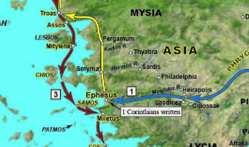
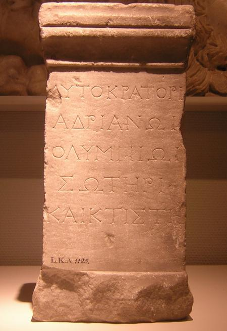
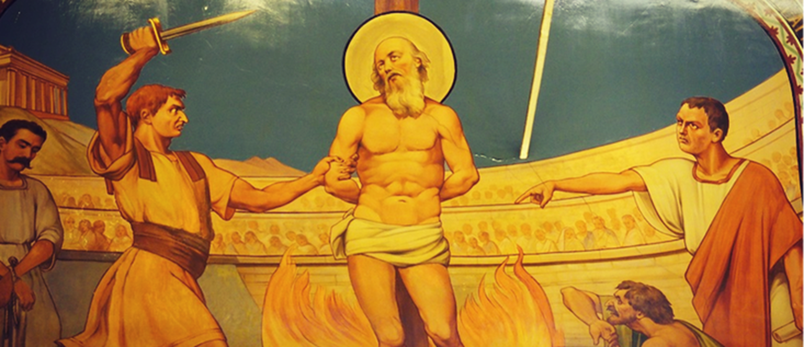
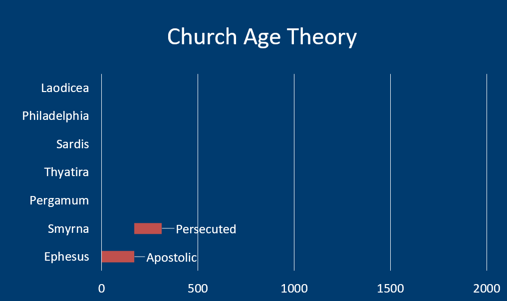



 



### Read/hear the portion

| Revelation 2:8-11                                                                                                                                                                                                                                                                                                                                                                                                                                                                                                                                                                                                                                                                                                                                                                                                               |
|---------------------------------------------------------------------------------------------------------------------------------------------------------------------------------------------------------------------------------------------------------------------------------------------------------------------------------------------------------------------------------------------------------------------------------------------------------------------------------------------------------------------------------------------------------------------------------------------------------------------------------------------------------------------------------------------------------------------------------------------------------------------------------------------------------------------------------|
| "To the angel of the Messianic Community in Smyrna, write: 'Here is the message from the First and the Last, who died and came alive again: (9) "I know how you are suffering and how poor you are (though in fact you are rich!), and I know the insults of those who call themselves Jews but aren't—on the contrary, they are a synagogue of the Adversary. (10) Don't be afraid of what you are about to suffer. Look, the Adversary is going to have some of you thrown in prison, in order to put you to the test; and you will face an ordeal for ten days. Remain faithful, even to the point of death; and I will give you life as your crown. (11) Those who have ears, let them hear what the Spirit is saying to the Messianic communities. He who wins the victory will not be hurt at all by the second death." ' |

### Smyrna Background

#### Geography and History

Like Ephesus, Smyrna was a deep harbor town. This resulted in economic prosperity, though Smyrna was never as commercially significant as Ephesus. The map below shows Smyrna's location respective to Ephesus and Pergamum. It's about 42 miles north of Ephesus. Like Ephesus, the harbor eventually became silted over and the modern shoreline is a few miles to the west.

Unlike Ephesus, which tended to pick the wrong side during the great imperial battles of antiquity, Smyrna did not. In fact, they were steadfastly loyal to Rome. This was true long before Rome came to power. They built a temple to Roma, the deified personification of Rome in 195 BCE, when Smyrna was in Greek hands.[^1]

[^1]: David A. deSilva, “The Social and Geographical World of Smyrna,” in *Lexham Geographic Commentary on Acts through Revelation*, ed. Barry J. Beitzel (Bellingham, WA: Lexham Press, 2019), 630.

Strabo, the great geographer of antiquity, indicated that the ancient Smyrnans believed their city to be the birthplace of Homer and had what they called a Homerium: a temple to Homer and a statue. Strabo also said that Smyrna was "the most beautiful city in Ionia."[^4]

[^4]: “Strabo, Geography, BOOK XIV., CHAPTER I., Section 37,” accessed February 25, 2022, https://www.perseus.tufts.edu/hopper/text?doc=Perseus%3Atext%3A1999.01.0239%3Abook%3D14%3Achapter%3D1%3Asection%3D37.

The modern Turkish city of Izmir sits atop where we believe ancient Smyrna is. This has significantly limited archaeological excavation. Because of this, we are unable to confirm any Jewish/Christian presence in the city at the time Revelation was written. However as scholars will point out, "absence of evidence, is not evidence of absence." Bolen points out the modern city of Izmir, "has a long history of Jewish residents, evidenced by the number of synagogues in the area of the historic city…at one time there were nine synagogues located on a single street."[^5]

[^5]: Todd Bolen, *Smyrna-Izmir*, vol. Western Turkey, Pictorial Library of Bible Lands, 2019.

Out of all the seven cities mentioned in Revelation, only Smyrna (Izmir) survives as a continuously inhabited city.[^6]

[^6]: Eli Lizorkin-Eyzenberg and Pinchas Shir, *Hebrew Insights from Revelation*, Kindle., Jewish Studies for Christians, 2021, 68. 

#### The Roman Imperial Cult 

Like Ephesus, the culture of Smyrna was deeply seated in the worship of what is called the Roman Imperial Cult. They were described as "being loyal to Rome and its gods, even unto death." This is one of those likely local allusions (or maybe a better word is a 'pun') Jesus makes in Rev 2:10, when He says, "Be faithful unto death, and I will give you the crown of life."

We see an example of this in an inscription to Hadrian found at Smyrna. The dedication describes Hadrian as "Olympian, Savior, and Founder." (Ὀλυμπίωι σωτῆρι καὶ κτίστηι)."[^2] By calling him "Olympian," they are saying Hadrian is equivalent to Zeus. It is no accident that they used words challenging the status of Jesus as Savior. Even though Hadrian would have been after the time John wrote (this dedication dates to 128 CE), this is still illustrative of the culture the believers in Smyrna found themselves. Even though after the fact, labeling Hadrian as "founder" is in opposition to Jesus calling Himself "the First and the Last."

[^2]: “Smyrna, Dedication to Hadrian - Livius,” accessed February 25, 2022, https://www.livius.org/pictures/turkey/izmir-smyrna/smyrna-museum-pieces/smyrna-dedication-to-hadrian/.

Emperor worship was mandatory. The law required citizens to make an annual offering and acknowledge publicly that Caesar was supreme lord. They received a certificate that they had done so, after which they were permitted to worship whatever gods they wanted. As we have noted, ethnic Jews were in a protected class and exempted from this by law, but gentile believers were not. This led to significant tensions between Jews (both believing and non-believing) and Gentile followers of Yeshua, the Jewish Messiah, with the former group being called to publicly denounce the latter. The lack of "proper papers" showing this group refused to worship Caesar added to the pressure believers and those protecting them were under (remember in Nazi Germany, those who aided and abetted Jews were sent to camps or killed on the spot the same as the Jews they helped).

As in Ephesus, there was a large area called an Agora that served as a civic forum and also had areas for shopping. All of this was under the watchful eye of altars to Zeus, Poseidon, Demeter, and Artemis. It appears that Cybele, the Phrygian mother goddess, was the patron goddess of Smyrna. According to legend, Cybele is the mother of Zeus, Poseidon, and Hades. Numerous coins minted in Smyrna bear her image.[^3] Today, we can see many arches that were built to support the Agora following the earthquake in 178 AD

[^3]: deSilva, “Smyrna,” 633.

Another possible allusion in the letter occurs when Jesus refers to Himself as the one "who died and came to life." Smyrna was destroyed and rebuilt multiple times, often by an earthquake. In addition to the quake in 178 CE, A significant temblor in 179 BCE destroyed much of the city.

#### New Testament Smyrna

Although Rev 2:8 is the only mention of Smyrna in the Bible, we believe Paul traveled to Troas passing through Smyrna and Pergamum, on his way to Greece as recorded in Acts 20. Paul also spent more than two years in Ephesus, so he could have made a trip to Smyrna. Acts 19:10 states, " This continued for two years, so that all the residents of Asia heard the word of the Lord, both Jews and Greeks."

#### The martyrdom of Polycarp

Outside of the Bible, Smyrna is best known in Christian circles as the town where Polycarp was martyred. Polycarp was a disciple of John the Apostle and was the Bishop of Smyrna[^7]. A later tradition has Polycarp being betrayed by non-believing Jews, but this appears to be an anti-Semitic addition in an anachronistic attempt to libel the Jews with additional crimes against Christians and force-fulfill the prophecy in Revelation 2 regarding the persecution of the Smyrnan believers. History shows this persecution was at the hands of the Romans.

[^7]: “Saint Polycarp of Smyrna: One of the Original Martyrs,” *The Catholic Company®*, accessed February 25, 2022, https://www.catholiccompany.com/magazine/saint-polycarp-smyrna-original-martyrs-5549.

The earliest records indicate that Polycarp was brought before the provincial governor. DeSilva writes, "the governor might not have known about the Christian faith, but he knew that it drew people away from giving the gods their due."[^8] For this reason, this sect of the Nazarenes was an existential threat to the Roman way of life and had to be dealt with, 'east of all by "Rome's oldest and most faithful of allies."[^9]

[^8]: deSilva, “Smyrna,” 635.

[^9]: Ibid.

The martyrdom of Polycarp records the dialogue:

> City official: What harm is it to say, 'Caesar is Lord' and to offer a sacrifice?
>
> Polycarp: For eighty-six years I have served Him, and He has wronged me in no way. How then, can I revile my King, who rescued me?

At this refusal, Polycarp was then attempted to be burned at the stake. The story goes that, like Shadraq, Mishaq, and Abednego in the book of Daniel, the fires danced around Polycarp but did not harm. When fire failed to do the job, Polycarp was then stabbed to death.

This story – how much of it is true we don't know – illustrates Jesus' "no compromise" position to his faithful. No matter how bad things get, "even to the point of death" we must never deny Him. Conversely, for Christians, we know the end of our lives in this world is not the end of the story. Along with the story of Polycarp, the letter to Smyrna serves as a reminder to keep the heavenly perspective.

### Rev 2:8 To Smyrna

| Revelation                                                                                                                                        | References                                                                                                                                                                                                                                                                                                                                                                                                                                                                                                                                                                                                                                                                                                                                                                                                                                                                                                                                                                                                                                                                                                                                                                            |
|---------------------------------------------------------------------------------------------------------------------------------------------------|---------------------------------------------------------------------------------------------------------------------------------------------------------------------------------------------------------------------------------------------------------------------------------------------------------------------------------------------------------------------------------------------------------------------------------------------------------------------------------------------------------------------------------------------------------------------------------------------------------------------------------------------------------------------------------------------------------------------------------------------------------------------------------------------------------------------------------------------------------------------------------------------------------------------------------------------------------------------------------------------------------------------------------------------------------------------------------------------------------------------------------------------------------------------------------------|
| (8) "And to the angel of the (*ecclesia)* Messianic Community in Smyrna, write: ‘The words of the first and the last, who died and came to life.  | Isa 41:4 Who has performed and done this, calling the generations from the beginning? I, the LORD, the first, and with the last; I am he Isa 44:6 Thus says the LORD, the King of Israel and his Redeemer, the LORD of hosts: “I am the first and I am the last; besides me there is no god  Isa 48:12 “Listen to me, O Jacob, and Israel, whom I called! I am he; I am the first, and I am the last.   Rev 22:13 I am the Alpha and the Omega, the first and the last, the beginning and the end.”   Mat 2:11 And going into the house, they saw the child with Mary his mother, and they fell down and worshiped him. Then, opening their treasures, they offered him gifts, gold and frankincense and myrrh.  Mar 15:23 And they offered him wine mixed with myrrh, but he did not take it.  Joh 19:39 Nicodemus also, who earlier had come to Jesus by night, came bringing a mixture of myrrh and aloes, about seventy-five pounds in weight.  Isa 60:6 A multitude of camels shall cover you, the young camels of Midian and Ephah; all those from Sheba shall come. They shall bring gold and frankincense, and shall bring good news, the praises of the LORD. *(note: no Myrrh)*  |

#### Myrrh

Smyrna meaning: related to Myrrh, which is often used as an embalming ointment. As you can see in the photo, it starts out as a resin but must be crushed to activate its full potential. Is there a lesson for us as believers given what we are about to read? Smyrna was one of the chief exporters of Myrrh to the ancient world. We mentioned in the Ephesus lesson how many of the goods listed in Revelation 18 would have passed through the ports of Western Turkey. Myrrh is specifically named in Rev 18:13.

Myrrh was one of the three gifts the Magi brought at Jesus' birth along with gold and frankincense (Mat 2:11). Scholars see these gifts as prophetically speaking of Jesus as King (gold), Priest (frankincense), and His death as a prophet (myrrh, as most biblical prophets died as martyrs). We see it mentioned twice at Jesus' death. Once while He was on the cross (Mark 15:23, here used as an anesthetic) and another in John 19:39 when Nicodemus came to embalm Jesus after His death. Missler pointed out that in Isaiah 60:6, which describes the second coming, there will be gold and frankincense, but no Myrrh. His death is behind Him.

#### Description of Messiah

The description of Messiah is taken from Rev 1:17-18: " “Don’t be afraid! I am the First and the Last, the Living One. I was dead, but look!—I am alive forever and ever!" The First and the Last is a frequent title of Adonai, whom we would call God the Father. It also occurs four times in Revelation, including twice with the addition "was dead and am alive." This indicates that just as John 1:1 says "…and the word WAS God," there is a blending of God the Father and God the Son. We have some other "First and the Last" references above.

### Rev 2:9 Praise/"I know": tribulation and poverty

| Revelation                                                                              | References                                                                                                                                                      |
|-----------------------------------------------------------------------------------------|-----------------------------------------------------------------------------------------------------------------------------------------------------------------|
| (9) “‘ I know how you are suffering and how poor you are (though in fact you are rich!) | Jas 1:2-3 Regard it all as joy, my brothers, when you face various kinds of temptations; (3) for you know that the testing of your trust produces perseverance. |

Tribulation – θλιψιν (thliphsis)

The root word for tribulation means simply "pressure". It can be compared to the pressure used to extract juice from grapes or oil from olives. However, it does not necessarily have to denote physical persecution. As we mentioned above, believers in Smyrna clearly had to live their lives as a fringe group. They did not have religious protections like we do today (for now). They would have been ostracized, perhaps not able to hold jobs or purchase necessities, and likely were under constant threat of being arrested. Much of this would have been true for Jewish as well as Gentile believers in Messiah. Non-Jewish believers had the added pressure of being required to participate in the emperor-worship ceremony. Like Tom Bradford, a commentator, stated, "you don't have to be beaten to feel beaten down."

Being outside of the mainstream economy likely meant that many believers were materially poor. In fact, there are two Greek words for poverty: one means having nothing fancy, and the other means being destitute and reduced to begging. Jesus uses the second one, πτωχειαν ptocheia, here.

Jesus reminds them to have the heavenly view. From a kingdom perspective, they are rich. We've said before that a major theme of these letters is that the recipients didn't necessarily see themselves as Jesus sees them. This cuts both ways. Certainly, for the letters containing judgments, we can infer that this material deficiency in their faith that Jesus called out probably came as a surprise. In the same way, the believers of Smyrna thought they were poor, but they held the wrong perspective. We all need to have a kingdom perspective, no matter the circumstances of our earthly situation. Remember a simple motion of worshipping the emperor, which they could have faked, would have given them their papers and alleviated most of the suffering. Were some of them second-guessing that decision? Jesus affirms they made the right choice.

#### Jews who are not

| Revelation                                                                                                                              | References                                                                                |
|-----------------------------------------------------------------------------------------------------------------------------------------|-------------------------------------------------------------------------------------------|
| (9) “‘ I know the insults of those who call themselves Jews but aren't—on the contrary, they are a synagogue of the Adversary (Satan).  | John 8:44 You are of your father the devil, and your will is to do your father's desires. |





I need to say how thankful I am for the work of Chuck Missler. While he wasn't perfect in all his analyses (indeed none of us are), he took a firm stance against Replacement Rheology. In the early 90s, shortly after I came to faith, a co-worker told me I had to listen to Chuck. He was on the radio in Orange County every afternoon at 4. He labeled replacement theology what it was: a heresy that should have no place in our churches. Replacement Theology is the view that national Israel has been "replaced" by the church and that all the promises made to the nation, most of which were unconditional, have been forfeited. This view makes God a liar. This heresy took root early on and the church has had a long history of antisemitism. The atrocities against the Jews under the banner of "Christ" sicken the stomach. Honestly, if I were a traditional Jew and knew this history, I would want nothing to do with Christianity either. This has also been a tragedy for the church as we have disconnected ourselves from the Jewishness of our faith (last time I checked, our founder was an observant Jew!) and we have also discounted the value of the Old Testament, which is over 2/3 of God's Word that we claim to hold as inerrant. The only bad thing about my being taught to avoid this from practically day 1 of my walk with Jesus is that I was thoroughly unprepared for how pervasive this view is in the church today.

My point in this preface is that if you come across a definition of "Jews who are not" and "synagogue of Satan" as referring to all non-believing Jews throughout history, you need to know this interpretation is from the enemy – even if the commentator is a believing Christian with the best of intentions. The term "synagogue of Satan" has become a favorite anti-semitic slur. None other than Billy Graham used this term as an anti-semitic racial slur in a recorded conversation with President Nixon in 1972.

Lizorkin elaborates: "the standard interpretation forces the reader to use later anachronistic categories while reading first-century texts," namely Christians reading Jewish persecution into the story of Polycarp (which itself happened many decades after the letter to Smyrna), when this version of the facts is dubious at best. "History helps, but only if it is contemporaneous to John's words."[^10] Lizorkin and other commentators have noted antisemitic bias on the part of bible translators. In James 2:2, the word sunagogeh is used but it is rarely if ever translated as synagogue. Translators prefer "assembly" when the word is neutral or positive. In other words, *sunagogeh* and *ecclesia* mean exactly the same thing. They are synonymns. However, when sunagogeh has a negative connotation as it does here in Rev 2:9, they choose "synagogue" as it brings to mind a uniquely Jewish affiliation. As we have pointed out, the early "Christians" met in synagogues through the early second century at the earliest, possibly even longer.

[^10]: Lizorkin-Eyzenberg and Shir, *Hebrew Insights from Revelation*, 70.

So with all of this lengthy preface, let's come up with a non Replacement Theology position on "those who call themselves Jews but aren't" and "Synagogue of Satan."





Is there a way to avoid antisemitism with this verse? Absolutely. All we have to do is simply follow the primary rule of Bible interpretation.

>   Primary Rule of Bible Interpretation: When the plain sense of Scripture makes common sense, seek no other sense (or you'll end up with a pretense that is likely nonsense).

In other words, as Dr. Fructenbaum says, "we take every word at face value unless the facts or immediate context CLEARLY indicate otherwise. A literal interpretation does not rule out figures of speech but even these have a literal background."[^11] This is a rule that if you ask every serious Bible commentator, they will agree with it. Yet MOST of these same commentators completely throw this out the window when it comes to prophesy in general, and these two verses regarding the Jews specifically. They will concoct some scheme that it is true Jews who are not are really Jews.

[^11]: Arnold Fruchtenbaum, *The Rules of Interpretation, The Outline of Eschatology, Introduction to the Book of Revelation*, vol. 1, 2 vols., Eschatology and the Book of Revelation, Part One, 2020, accessed February 20, 2022, https://ariel.instructure.com/courses/175/pages/module-number-1-lecture-video-presentation?module_item_id=7445 (subscription required).

In the letter to Ephesus, we had a nearly identical phrase, "those who call themselves apostles (Christians) but are not." In that case, the meaning was seemingly obvious. These people are imposters. They claim to be Christians, but their behavior tells a different story. They are Christians in name only.

So the only question to ask is "what is the plain sense reading of 'those who call themselves Jews but aren't"? Answer: these are people who are NOT Jews. They are imposters, being dishonest about their affiliation. They claim to be Jews, but their behavior tells a different story. They are Jews in name only. And in this case, this group of imposters is slandering the believers.

Was that so hard? I am baffled why commentators go to great lengths to allegorize this passage.

Next, do we already have an example *from scripture,* of such a group of people calling themselves Jews but not acting like Jews? As a matter of fact, yes. John 8.

>   Joh 8:39-44 They answered him, “Abraham is our father.” Jesus said to them, “If you were Abraham's children, you would be doing the works Abraham did, (40) but now you seek to kill me, a man who has told you the truth that I heard from God. This is not what Abraham did. (41) You are doing the works your father did.” They said to him, “We were not born of sexual immorality. We have one Father—even God.” (42) Jesus said to them, “If God were your Father, you would love me, for I came from God and I am here. I came not of my own accord, but he sent me. (43) Why do you not understand what I say? It is because you cannot bear to hear my word. (44) You are of your father the devil, and your will is to do your father's desires. He was a murderer from the beginning and does not stand in the truth, because there is no truth in him. When he lies, he speaks out of his own character, for he is a liar and the father of lies.

As we discussed in Gospel Backgrounds, Jesus is not speaking to or about all Jews in John 8. He is not even speaking to all Pharisees. He is speaking to a narrow subset of Pharisees who were involved in a plot to kill him. We can prove that not all Pharisees are implicated because there were several Pharisees who believed in Jesus - namely Nicodemus and Joseph of Arimathea. As an aside, there is some historical reason to believe that Jesus might not have been speaking to any Pharisees here, but general members of the Jerusalem corrupt temple establishment.

All Jews were not responsible for His crucifixion. It occurred very early in the morning on a feast day. The vast majority of Jews were at home, probably sleeping. No, this was a sly crime at the hands of very few, probably much fewer than we may realize. Tens of thousands of Jews came to faith after the Resurrection and thousands of Jews are coming to faith in Yeshua as their messiah today.

Therefore, it is wholly incorrect to say that the Jews who are not, refers to all Jews throughout history. We know that Rev 2:2 is not speaking about all Christians. Just as there are corrupt Christians whom we might call Christians in Name only, there were and are corrupt Jews who are "Jews in name only" but who really have Satan, the accuser as their father. Therefore, Jesus is basically saying that their father is not Abraham but Satan, and they don't worship in a proper synagogue, but a Synagogue devoted to their father. Not necessarily one filled with satanic rituals as we might think of them, but one built on accusations, such as informing against one's brethren to the authorities.

According to Lancaster, informing and accusing one's neighbor is expressly prohibited by the Torah. Jews who were doing this were behaving exactly like the Jews Jesus was contesting in John 8. They were not upholding the high ethical standards God expects of His followers.[^12] Leviticus 19:18 says to love your neighbor as yourself. While Jews debated as to who their neighbor was (see the Good Samaritan parable), unquestionably fellow Jews and gentiles who worshipped alongside each other in Synagogue would have been their neighbor whom they were to love, not accuse.

[^12]: Daniel T. Lancaster, *Synagogue of Satan*, Apocalypse of John, 2016, accessed January 19, 2022, https://www.bethimmanuel.org/audio-series/apocalypse-of-john.

There are other views that are equally plausible. Lizorkin sees fake converts trying to avoid persecution.[^13] This view fits given Jesus' command to hold fast. This group caved and perhaps renounced Jesus, if only for show. Fructenbaum sees Rome and their anti-Messiah emperor as impersonating the one true God and His Messiah.

[^13]: Lizorkin-Eyzenberg and Shir, *Hebrew Insights from Revelation*.

What is not correct is to affix this label to those who really are Jewish and have done nothing to disavow that status. Also keep in mind that as of this letter, there was no separate Gentile Christian religion separate from Judaism. Jesus and Paul both make it clear that the Kingdom is for the Jew first. We gentiles are included only by God's grace. Paul even warns us not to become proud (and our inclusion is supposed to provoke them to jealousy, not make them want to have nothing to do with us!). I encourage a careful study of Romans 9-11.

### Judgment "But I have this against you": OMITTED FOR SMYRNA

In our lesson on the sevenfold structure, we mentioned that the standard outline for these letters has seven elements including a section on Judgment. That is the rule, but there are two exceptions. Smyrna is one of the two cities that receives no Judgment.

We need to keep this in mind whenever we are going through a trial. We often feel as if God has abandoned us and maybe feel that we must have done something for God to judge us by sending us this trial. The letter to Smyrna corrects that thinking. Just because there is tribulation doesn't mean that it is God's judgment. In Smyrna's case it clearly was not.

As Lizorkin points out, the concept of things not truly being as they appear is a trademark of apocalyptic literature.[^14] As we mentioned in the early lessons, a reason for God giving a revelation was to communicate that even though things seem bad on earth, God is still in control.

[^14]: Ibid., 68.

### Rev 2:10: Secondary encouragement: Do not Fear

| Revelation                                                                                                                                                                                                                                                                                | References                                                                                                                                                                                                                                                                                     |
|-------------------------------------------------------------------------------------------------------------------------------------------------------------------------------------------------------------------------------------------------------------------------------------------|------------------------------------------------------------------------------------------------------------------------------------------------------------------------------------------------------------------------------------------------------------------------------------------------|
| (10) Don't be afraid of what you are about to suffer. Look, the Adversary is going to have some of you thrown in prison, in order to put you to the test; and you will face an ordeal for ten days. Remain faithful, even to the point of death; and I will give you life as your crown.  | "Fear not" \~150x 2Ti 3:12 And indeed, all who want to live a godly life united with the Messiah Yeshua will be persecuted,   Jas 1:2-3 Regard it all as joy, my brothers, when you face various kinds of temptations; (3) for you know that the testing of your trust produces perseverance.  |

Do not fear is a major theme of Revelation. Even though things are bad, do not fear. In fact, things are going to get worse. Even though you may be unjustly thrown in jail, do not fear. Even though you may die, do not fear.

Jesus reminds them that it is Satan, the accuser or the adversary who is behind all of this. We only see earthly combatants, but God shows us there is a much bigger picture spiritually.

Scholars don't know what the "ten days" means. If we take it literally, there could have been a period of ten days where there was a wave of intense persecution. This would be something like a pogrom.  Others, particularly those who hold to the Church Age theory, see ten Roman Emperors who specifically persecuted believers.  See callout below for additional information.





Proponents of the church-age theory see a list of ten Roman emperors between 50-311 who persecuted the church

1.  54-68 Nero (Paul and Peter)
2.  95-96 Domitian (John (attempted, then exiled))
3.  104-117 Trajan ( Ignatius)
4.  161-180 Marcus Aurelius (Polycarp)
5.  200-211 Septimus Severus (Iraneus)
6.  235-237 Maximinus
7.  249-251 Decius
8.  257-260 Valerian
9.  270-275 Aurelian
10. 303-311 Diocletian (worst of all!)

In Foxe's book of Martyrs, it is reported that 5 million believers died for Christ during this period.





The priests of the various deities in Smyrna wore a laurel (crown of leaves) in honor of their service. Jesus says His faithful will receive a crown in honor of their service.

### Rev 2:11: Promise to the Overcomer / Ears

| Revelation                                                                                                                                                              | References                                                                                                                                                                                                                                                                                                                                                                                                                                                                                                                                              |
|-------------------------------------------------------------------------------------------------------------------------------------------------------------------------|---------------------------------------------------------------------------------------------------------------------------------------------------------------------------------------------------------------------------------------------------------------------------------------------------------------------------------------------------------------------------------------------------------------------------------------------------------------------------------------------------------------------------------------------------------|
| (11) Those who have ears, let them hear what the Spirit is saying to the Messianic communities. He who wins the victory will not be hurt at all by the second death." ' | Rev_20:6 Blessed and holy *is* he that hath part in the first resurrection: on such the second death hath no power, but they shall be priests of God and of Christ, and shall reign with him a thousand years. Rev_20:14 And death and hell were cast into the lake of fire. This is the second death. Rev 21:8 But the fearful, and unbelieving, and the abominable, and murderers, and whoremongers, and sorcerers, and idolaters, and all liars, shall have their part in the lake which burneth with fire and brimstone: which is the second death. |

We will find out more about the second death once we get to Revelation 20. There is a quip, "born once, die twice; born twice, die once." Born again believers are spared the second death, while the unrepentant are not born again get to die once on this earth and then will be cast into the second death.

### Church age theory: Persecuted (170-312)

Now we move on to our three speculation areas: the church age theory, the Pauline letter tie in and the parable tie in. Proponents of the church age theory see Smyrna as representative of the Persecuted church from 170 to 312, as exemplified by the 10 Roman emperors with state sponsored persecution we listed earlier. This all came to an end with the edict of Toleration (Christianity decriminalized if we want to look at it that way) around 311 between Emperors Galerius and Constantine (yes there were two. There were actually three). The full legalization of Christianity occurred in 313, but that ushered in a whole new set of problems which we'll get to when we look at the church of Pergamum.

### Parable Connection: Smyrna = wheat/tares (Mat 13:24-30)

| Matthew 13
| :--   
|24 Yeshua put before them another parable. "The Kingdom of Heaven is like a man who sowed good seed in his field;
25 but while people were sleeping, his enemy came and sowed weeds among the wheat, then went away.
26 When the wheat sprouted and formed heads of grain, the weeds also appeared.
27 The owner's servants came to him and said, 'Sir didn't you sow good seed in your field? Where have the weeds come from?'
28 He answered, 'An enemy has done this.' The servants asked him, 'Then do you want us to go and pull them up?'
29 But he said, 'No, because if you pull up the weeds, you might uproot some of the wheat at the same time.
30 Let them both grow together until the harvest; and at harvest-time I will tell the reapers to collect the weeds first and tie them in bundles to be burned, but to gather the wheat into my barn.' "
|

Enemy
: Accuser/adversary

Weeds
: those who look like faithful but, on the contrary, are imposters

Weeds appearing
: time of persecution

Let them grow together
: the wheat will have to suffer from the weeds for a time

Weeds pulled from the ground then burned
: The group that suffers the 2nd death

Wheat pulled from the ground, then gathered
: The group of believers gathered into the Master's House (no second death)

### Pauline Epistle Connection: Smyrna = Philippians

| Philippians
| :--  
1:6 And I am sure of this, that he who began a good work in you will bring it to completion at the day of Jesus Christ.
1:12-13 I want you to know, brothers, that what has happened to me has really served to advance the gospel, (13) so that it has become known throughout the whole imperial guard and to all the rest that my imprisonment is for Christ.
1:14 And most of the brothers, having become confident in the Lord by my imprisonment, are much more bold to speak the word without fear.
1:18-21 What then? Only that in every way, whether in pretense or in truth, Christ is proclaimed, and in that I rejoice. Yes, and I will rejoice, (19) for I know that through your prayers and the help of the Spirit of Jesus Christ this will turn out for my deliverance, (20) as it is my eager expectation and hope that I will not be at all ashamed, but that with full courage now as always Christ will be honored in my body, whether by life or by death. (21) For to me to live is Christ, and to die is gain.
1:27-28 Only let your manner of life be worthy of the gospel of Christ, so that whether I come and see you or am absent, I may hear of you that you are standing firm in one spirit, with one mind striving side by side for the faith of the gospel, (28) and not frightened in anything by your opponents. This is a clear sign to them of their destruction, but of your salvation, and that from God.
1:29 For it has been granted to you that for the sake of Christ you should not only believe in him but also suffer for his sake,
2:2 complete my joy by being of the same mind, having the same love, being in full accord and of one mind.
2:3-4 Do nothing from selfish ambition or conceit, but in humility count others more significant than yourselves. (4) Let each of you look not only to his own interests, but also to the interests of others. (speaks to the importance of being who you say you are – if say we follow God, we need to act like it).
2:7-8 but emptied himself, by taking the form of a servant, being born in the likeness of men. (8) And being found in human form, he humbled himself by becoming obedient to the point of death, even death on a cross.
2:15-16 that you may be blameless and innocent, children of God without blemish in the midst of a crooked and twisted generation, among whom you shine as lights in the world, (16) holding fast to the word of life, so that in the day of Christ I may be proud that I did not run in vain or labor in vain. (and get your crown!)
2:17 Even if I am to be poured out as a drink offering upon the sacrificial offering of your faith, I am glad and rejoice with you all.
3:7 But whatever gain I had, I counted as loss for the sake of Christ.
3:10-11 that I may know him and the power of his resurrection, and may share his sufferings, becoming like him in his death, (11) that by any means possible I may attain the resurrection from the dead.
3:14 I press on toward the goal for the prize of the upward call of God in Christ Jesus.
3:20-21 But our citizenship is in heaven, and from it we await a Savior, the Lord Jesus Christ, (21) who will transform our lowly body to be like his glorious body, by the power that enables him even to subject all things to himself.
4:4-8 Rejoice in the Lord always; again I will say, rejoice. (5) Let your reasonableness be known to everyone. The Lord is at hand; (6) do not be anxious about anything, but in everything by prayer and supplication with thanksgiving let your requests be made known to God. (7) And the peace of God, which surpasses all understanding, will guard your hearts and your minds in Christ Jesus. (8) Finally, brothers, whatever is true, whatever is honorable, whatever is just, whatever is pure, whatever is lovely, whatever is commendable, if there is any excellence, if there is anything worthy of praise, think about these things.
4:13 I can do all things through him who strengthens me.

Lastly, Php 4:22 states, "All the saints greet you, especially those of Caesar's household."  
: Our behavior, up to and including martyrdom, is a powerful witness to the unbelieving world.  You never know who is watching.  It could be members of Caesar's household!

#### References

