

 

### Read/hear the portion

| Revelation 2:12-17                                                                                                                                                                                                                                                                                                                                                                                                                                                                                                                                                                                                                                                                                                                                                                                                                                                                                                                                                                                                                                                                                                                                                     |
|------------------------------------------------------------------------------------------------------------------------------------------------------------------------------------------------------------------------------------------------------------------------------------------------------------------------------------------------------------------------------------------------------------------------------------------------------------------------------------------------------------------------------------------------------------------------------------------------------------------------------------------------------------------------------------------------------------------------------------------------------------------------------------------------------------------------------------------------------------------------------------------------------------------------------------------------------------------------------------------------------------------------------------------------------------------------------------------------------------------------------------------------------------------------|
| "To the angel of the Messianic Community in Pergamum, write: 'Here is the message from the one who has the sharp double-edged sword: (13) "I know where you are living, there where the Adversary's throne is. Yet you are holding onto my name. You did not deny trusting me even at the time when my faithful witness Antipas was put to death in your town, there where the Adversary lives. (14) Nevertheless, I have a few things against you: you have some people who hold to the teaching of Bil\`am, who taught Balak to set a trap for the people of Isra'el, so that they would eat food that had been sacrificed to idols and commit sexual sin. (15) Likewise, you too have people who hold to the teaching of the Nicolaitans. (16) Therefore, turn from these sins. Otherwise, I will come to you very soon and make war against them with the sword of my mouth. (17) Those who have ears, let them hear what the Spirit is saying to the Messianic communities. To him winning the victory, I will give some of the hidden manna. I will also give him a white stone, on which is written a new name that nobody knows except the one receiving it."  |

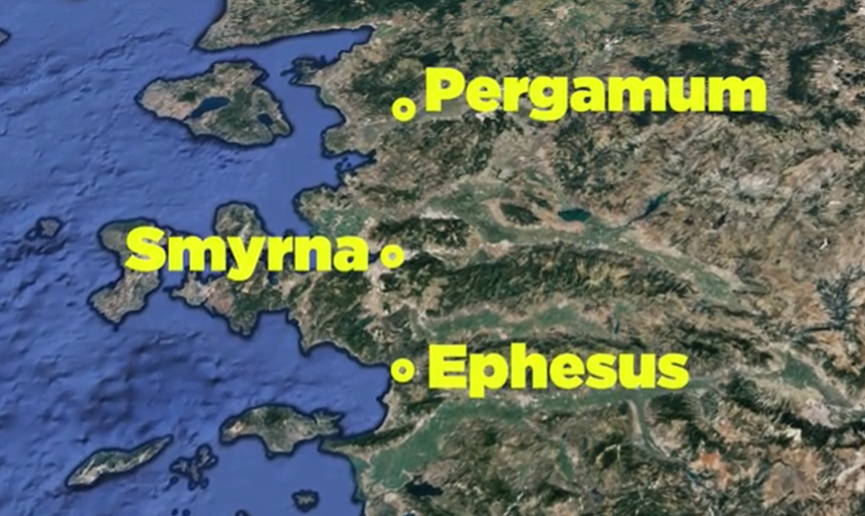

**Video Part 1: Intro and 2:12-13**

Pergamum archaeological sites, Roman Imperial Cult and enforced paganism, two-edged Sword



---

**Video Part 2: 2:14-17 and conclusions**

Balaam and Balak, Hidden Manna, White Stone, Constantine's "Conversion"/enforced Christianity, Matthew 13, 1st Corinthians



---

### Pergamum Background 

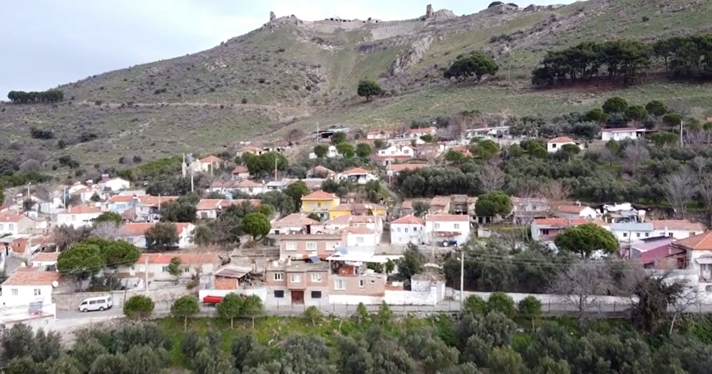

Pergamum (aka, Pergamon or Pergamos) is inland about 70 miles north of Smyrna. Archaeologists believe the city was founded in the third millennium BCE. The town likely owes its beginnings to geography, as there is a conspicuous hill 900 feet above the valley below. It was once thought to be impregnable. Later, Lysimachus, one of Alexander the Great's four succeeding generals, built a military fortification on this hill called an acropolis. Lysimachus also built Ephesus, and the two cities would vie for power and favor throughout the Roman period. Ultimately Ephesus, with its harbor, became the economic power, while Pergamum became the religious center. Since religion and politics were one and the same, Pergamum became the Roman capital of Asia minor.[^1] The second photo shows a closer look at the acropolis with labels from Dr. Bolen. Note the theater with seating for 10,000 built into the hill. It is the steepest of all Roman theaters excavated in Turkey.

[^1]: Wayne Stiles, “Pergamum – Satan’s Throne and Christ’s Promise,” *Walking the Bible Lands*, 2021, accessed January 19, 2022, https://www.walkingthebiblelands.com/products/walking-the-bible-lands/categories/4024473/posts/11297691.

The library was massive by standards of the day with 200,000 volumes, barely second to the library at Alexandria, Egypt. Stiles notes that after relations with the Romans and Egyptians soured and the empire no longer had access to papyrus, Pergamum's people developed parchment.

#### Emperor Worship/Roman Imperial Cult
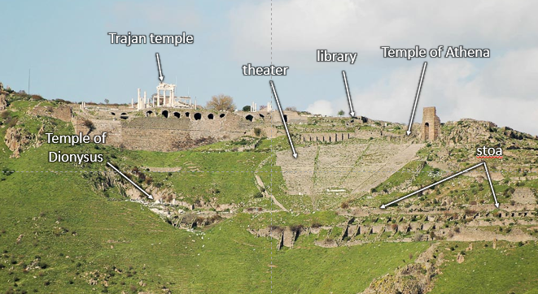

Around 250 BCE, Bolen writes, "Pergamum became a leading cultural center, especially in art and science. The acropolis underwent a massive restoration, and the Aesculapian was founded."[^2] Missler writes that Pergamum "became the center of the official religion of emperor worship. The first temple of this cult was erected at Pergamos in 27 BCE."[^3] In his commentary, Missler also traces several pagan myths founded in Babylon that eventually were incorporated at Pergamum during the Greek period and eventually to Rome during the Roman period. As was common to all seven cities, numerous pagan statues, shrines, and temples were built in homage to the Roman Imperial Cult. It is also depicted on their coinage. 

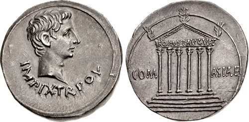 As discussed previously, this put the gentile believers in a difficult position. Emperor worship was compulsory unless you were Jewish. Although not explicitly stated, we can speculate that many in Pergamum went through the motions of the emperor worship procedures (compared to Smyrna, where they did not). Jewish believers and nonbelievers were still in an uncomfortable position, of course. The Torah prohibits graven images, such as the one on this coin and the many statutes erected around the town. Many probably simply got used to it; in other words, they compromised. The genuinely devout would have continued to be bothered by it. As we discussed in the Smyrna lesson, you don't have to be beaten to feel beaten down. DeSilva notes, "Antagonism towards the Christian movement appears to have been particularly high (in Pergamum), resulting in the murder (whether as a result of official proceedings or back-alley action) of a Christian named Antipas."[^4] This was life for the believers in the Roman empire.

Keener also notes that local rulers were first worshipped and revered in Pergamum, and emperor worship is reflected on coins. "Pergamum was one of the first cities of Asia to build a temple to a Roman emperor, making it a center of the cult."[^12] DeSilva notes that "the temple of Roma and Augustus in Pergamum is a manifestation of the cult of the beast and its image."[^13] In any case, we can infer that Pergamum was exceedingly wicked.

[^2]: Todd Bolen, *Pergamum*, vol. Western Turkey, Pictorial Library of Bible Lands, 2019, 3.

[^3]: Chuck Missler, *The Book of Revelation Handbook* (Koinonia House, 2020), 53.

[^4]: David A. deSilva, “The Social and Geographical World of Pergamum,” in *Lexham Geographic Commentary on Acts through Revelation*, ed. Barry J. Beitzel (Bellingham, WA: Lexham Press, 2019), 639.

#### Altar to Zeus

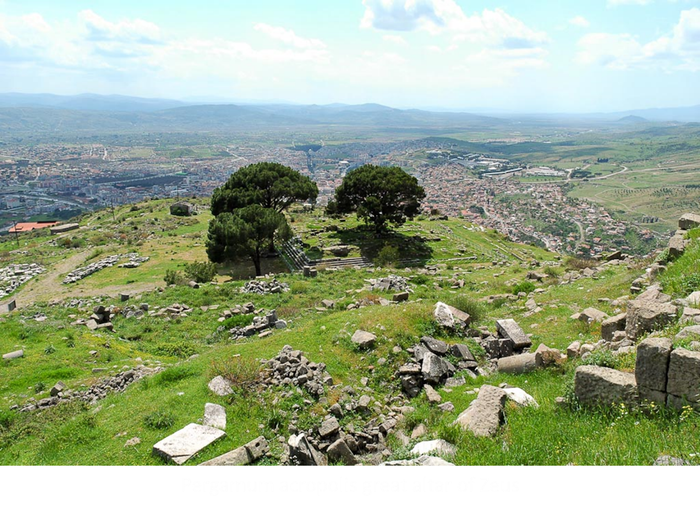

Zeus (or Jupiter to the Romans) is believed to be the chief of the Greek gods. In Pergamum, there was a massive temple to Zeus. [^5] In a 1st century Jewish mindset, he would be the chief of the false gods, making him equivalent to Satan. Where there is a temple to a god is where his throne is. This leads many to conclude Zeus' temple is "where Satan has his throne." The altar is in Berlin today; although it is commonly believed that Hitler had it moved, Bolen notes that it was moved in the 19th century.[^6] Today all that remains in Pergamum are stairs and the altar's foundation.

[^5]: Bolen, *Pergamum*, Western Turkey:49.

[^6]: Ibid., Western Turkey:50.

#### Aesculapius

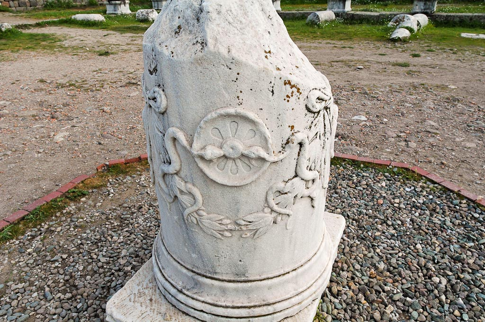

Aesculapius was a god who had healing and resurrection powers by using the blood of Medusa. The latter is how he came to be associated with snakes. Note the counterfeit themes of healing, resurrection, and blood. Aesculapius is almost always portrayed with a snake, Propylon, who gave him healing powers.[^7]  As an aside, Asclepius had two noteworthy daughters, Hygia and Panacea, where we get our words hygiene and panacea today.

[^7]: Ibid., Western Turkey:20.
We can also see the serpent imagery proudly displayed on this coin from Pergamum. As we've said before, we need to put ourselves in the shoes of those believers living in that time and realize how difficult life was to be a pure and undefiled believer in Yeshua.

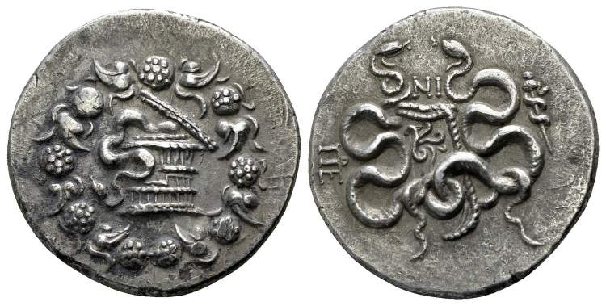

We can also see the serpent imagery proudly displayed on this coin from Pergamum. As we've said before, we need to put ourselves in the shoes of those believers living in that time and realize how difficult life was to be a pure and undefiled believer in Yeshua.

Early medicine was directly associated with serpent worship. It was more superstition than science. 

One thing that hasn't changed is the serpent symbolism, such as the modern logo of the American Medical Association, the professional organization for physicians in the United States. Many health related agencies use the serpent on a pole symbolism.





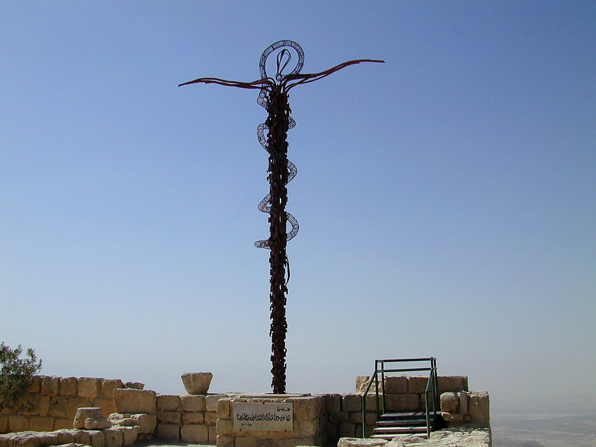

The serpent on a pole is likely a corruption of Numbers 21. When the Israelites in the wilderness grumbled against God and Moses, they had a lack of faith and believed they were led out in the wilderness to die. We may not utter those words, but how often is our attitude precisely like this. God wants to build us, and that can be painful at times. He's using that two-edged sword to excise tumors in our lives. In Israel's case, the Lord sent fiery serpents, perhaps cobras, as a curse, and many died. Those who survived prayed for relief. Here God tells Moses to do something that admittedly is very odd. Num 21:8 And the LORD said to Moses, “Make a fiery serpent (out of bronze) and set it on a pole, and everyone who is bitten, when he sees it, shall live.” Moses made the serpent out of brass. In Hebrew, there is a deliberate play on words as snake/serpent and brass are linguistically connected נְחַ֣שׁ נְחֹ֔שֶׁת. Brass is a symbol of judgment, and in this case, the snakes were a judgment. IN the Garden, the snake brought judgment. Interestingly, 700 or 800 years later, this pole is still around and yet has become an item of idolatry (idolatry is the very thing Jesus has most against the assembly at Pergamum). During his religious reforms, Judean King Hezekiah, one of the good kings who "did what was right in the eyes of the LORD…smashed the bronze serpent Moses had made, for until those days the people of Israel had made offerings to it (it was called Nehushtan)." (2 Kings 18:4) Walton notes, "Nehushtan appears to have been diety of healing."[^8] It is not too much of a stretch to see that what started as a legitimate symbol of God's healing became paganized into Asclepius.

[^8]: John H. Walton, Victor H. Matthews, and Mark W. Chavalas, *The IVP Bible Background Commentary: Old Testament*, (E-Sword). (Downers Grove, Ill: IVP Academic, 2000), v. 2 Ki 18:4.





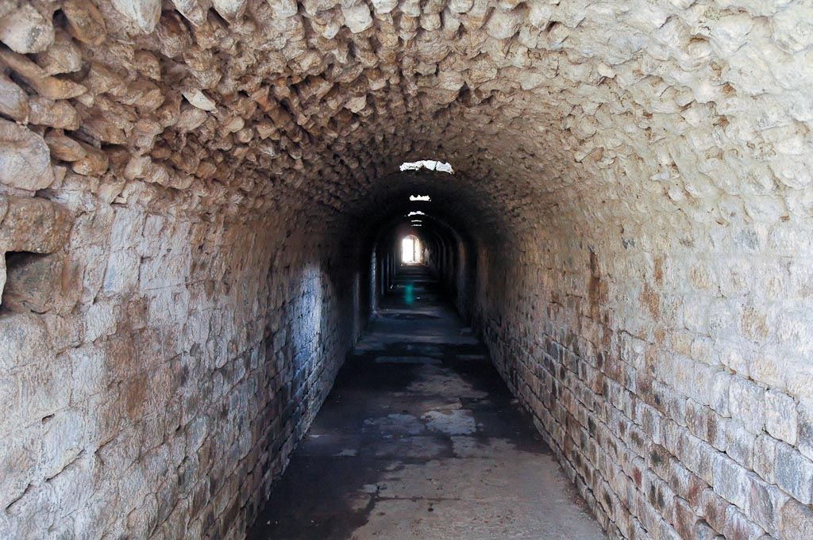People in need of healing or medical treatment would travel to an Asclepion. Archeologists have identified around 400 of these, but the largest was in Pergamum. The Asclepion in Pergamum was a large complex with healing chambers, sacred pools for mud baths, a medical library (using the phrase loosely), and a 3500-seat theater. It was believed that a combination of Aesculapius worship, sedative or hallucinogenic drug use, and snakes (sometimes snake bites) would bring about healing. It was something like an entertainment center, late 60's Haight-Ashbury district, hospital, a pagan temple, and spa rolled into one. Emperor Hadrian was once a patient at the Asclepium in Pergamum. Lancaster reports that patients were given a drug, then they would enter the complex by way of an 86-yard dark tunnel where they would hear voices (actually priests standing above the tunnel), then he or she would lie in a bed, and snakes would slither over the patient and speak.

The Aesclepium in Pergamum was the most famous, but there were other such centers throughout the Greco-Roman world; archeologists have identified 400 Aesclepia. Biblical scholars and archeologists believe there was such a place in Jerusalem, called the Pools of Bethesda. John 5 takes on an entirely new level of understanding once we realize this was not a place where an angel of the Lord stirred the waters.[^9] It was a pagan and demonic healing center where Jesus proved Himself greater. See our video from [Gospel Backgrounds #11](https://youtu.be/G6XOcfHcchQ) for additional information.

[^9]: John 5:4 is widely considered to be an erroneous 4th-century addition by a well-meaning scribe trying to explain the procedure the invalid describes at John 5:7. The verse is not included in most modern English translations.

Given Satan's association with the serpent from Genesis 3, the Asclepion is another strong candidate for "Satan's throne,"

#### New Testament Pergamum

Revelation contains the only two mentions of Pergamum in the New Testament.  After the apostolic period, Bolen notes intense persecution of Christians broke out under the rule of Decius (249-251), but the Edict of Milan in 313 declared Christianity legal, and by 379, "it had become the state religion; pagan temples were converted into churches."[^10]

[^10]: Bolen, *Pergamum*, Western Turkey:3.

Today the present city of Bergama lies near ancient Pergamum. Bergama has a population of around 20,000, compared to ten times that many in Roman times.

### Rev 2:12 To Pergamum

| Revelation                                                                                                                            | References                                                                                                                                                                                                                                                                                                                                                                                                                                                                                                                                                                                                                                                                                                                                                                                                       |
|---------------------------------------------------------------------------------------------------------------------------------------|------------------------------------------------------------------------------------------------------------------------------------------------------------------------------------------------------------------------------------------------------------------------------------------------------------------------------------------------------------------------------------------------------------------------------------------------------------------------------------------------------------------------------------------------------------------------------------------------------------------------------------------------------------------------------------------------------------------------------------------------------------------------------------------------------------------|
| "To the angel of the Messianic Community in Pergamum, write: 'Here is the message from the one who has the sharp double-edged sword:  | Rev 1:16 In his right hand, he held seven stars, from his mouth came a sharp two-edged sword, and his face was like the sun shining in full strength.   Joh 1:17 For (just as) the law was given through Moses, grace and truth came through Jesus Christ.   Isa 11:4 but with righteousness, he shall judge the poor, and decide with equity for the meek of the earth; and he shall strike the earth with the rod of his mouth, and with the breath of his lips he shall kill the wicked.   Isa 49:2 He made my mouth like a sharp sword; in the shadow of his hand he hid me; he made me a polished arrow; in his quiver, he hid me away.   2 Th 2:8 And then the lawless one will be revealed, whom the Lord Jesus will kill with the breath of his mouth and bring to nothing by the appearance of his coming.   2 Ti 3:16-17 All Scripture is breathed out by God and profitable for teaching, for reproof, for correction, and for training in righteousness, (17) that the man of God may be complete, equipped for every good work. |

**Pergamum** meaning: directly it means height or elevation, which given the geography fits. Indirectly, it could be related to marriage (monogamy, polygamy). In medical terms, *per* usually means through (percutaneous, through the cutaneous layer of the skin; perforate is to tear or make a hole through). In this sense while "through marriage" Pergamum could connote a "strange or abnormal marriage", one that is penetrated or perforated inappropriately.

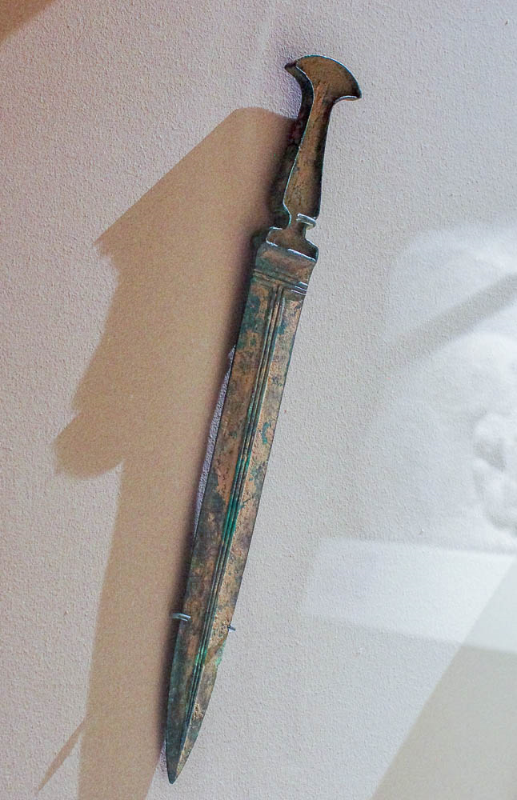

A literal **sword** is a weapon that can be used either offensively or defensively. It protects, separates, and, if necessary, kills. In antiquity and today with Islam, the sword is synonymous with the power to execute judgment, specifically capital punishment.[^11] Therefore, Jesus' selection of the sword image could be related to the event He's about to recount regarding Antipas' capital punishment.

[^11]: Craig S. Keener, *The IVP Bible Background Commentary: New Testament*, 2nd edition (E-Sword). (Downers Grove, Illinois: IVP Academic, 2014), v. Rev 2:12.

The congregation in Pergamum was in a challenging location, where **Satan dwells**. It's no accident (and in the Bible, nothing is there by accident) that Jesus has the sharp two-edged sword. They are in a spiritual battle, and the weapons need to be sharpened for use. We are in spiritual warfare too, so this letter is for us.

Notice that the sword is described as sharp. So it's not just a double-edged sword; it's a SHARP double-edged sword. If you were a surgeon, you wouldn't be a very good one if you operated with a dull scalpel. In the Bible, the sword is a well-established metaphor for the word of God. How sharp is your sword? When we read the letter to Ephesus, we looked at the armor of God passage in Ephesians 6. There is one crucial point to make, and it relates to having a sharp sword. The time to get fitted for the armor is before the battle. If you wait until you're already in the middle of a fight, I don't want to say it's too late because better late than never; but doing it before the battle is the way to go. In the same way, you make sure your sword is sharpened before you need it.

Some Christians believe that the double-edges refer to the Old and New Testaments, but we must remember that there was no New Testament in John's day. The beginnings of a New Testament are still well over 100 years away. More precisely, it is the Law of Moses and the grace/Gospel of Jesus, as we see in John 1:17. Note that if your translation has a "but" after Moses, that word is not in the original, completely changing the meaning. Remove it from your thinking. Law, grace, and truth are not opposites. You can't have grace and truth unless you have a standard of reference, which is the law. The opposite of law is lawlessness, as we see in 2 Thessalonians 2:8. The opposite of the Torah is to be without the Torah, i.e., without teaching the Scriptures. The opposite of grace is disgrace. As we see in Revelation 1:16 and 2:12, law and grace are two sides of the same sword.

We should always remember 2Ti 3:16-17: "All Scripture is breathed out by God and profitable for teaching, for reproof, for correction, and for training in righteousness, (17) that the man of God may be complete, equipped for every good work."

### Rev 2:13 Praise

| Revelation                                                                                                                                                                                                                                                  | References                                                                                                                                                                                                                                                                                                                                                                          |
|-------------------------------------------------------------------------------------------------------------------------------------------------------------------------------------------------------------------------------------------------------------|-------------------------------------------------------------------------------------------------------------------------------------------------------------------------------------------------------------------------------------------------------------------------------------------------------------------------------------------------------------------------------------|
| (13) "I know where you are living, there where the Adversary's throne is. Yet you are holding onto my name. You did not deny trusting me even at the time when my faithful witness Antipas was put to death in your town, there where the Adversary lives.  |  Luke 21:17 You will be hated by all for my name's sake.   Jude 1:4 For certain people have crept in unnoticed who long ago were designated for this condemnation, ungodly people, who pervert the grace of our God into sensuality and deny our only Master and Lord, Jesus Christ.   2 Ti 2:12 if we endure, we will also reign with him; if we deny him, he also will deny us;  |

We don't know precisely what Jesus was referring to when He said "**Satan's throne**." The worship of the Emperors, Zeus, and Aesculapius would each be viable candidates.  He could also have been referring to Pergamum in general, as a city that was the epicenter of false religion (second only to Rome in that regard). 

[^12]: Ibid., v. Rev 2:13. Other commentators such as Missler and DeSilva would say Pergamum was *the* first.

[^13]: deSilva, “Pergamum,” 653.





Michael Heiser's book, The Unseen Realm, has a fascinating discussion on the distinction between the devil/serpent of Genesis 3 and "the Satan" of, say, Job 1. Heiser describes that in the earliest Jewish writings, "the Satan described in (Job 1) is not the devil. Rather he's an anonymous prosecutor fulfilling a role in God's council."[^14] In other words, it appears the Satan's (the accuser's) role was to serve at God's pleasure to test (in the sense of purifying) God's people. Later, Jewish writings began to conflate the devil and the Satan. "The dark figure of Genesis 3 was eventually thought of as the 'mother of all adversaries,' and so the label *satan* got stuck to him. He deserves it."[^15]

[^14]: Michael S. Heiser, *The Unseen Realm: Recovering the Supernatural Worldview of the Bible*, First edition. (Bellingham, WA: Lexham Press, 2015), 57.

[^15]: Ibid.

Heiser's book is a scholarly yet most readable examination of the supernatural realm, with which most Christians are not familiar. It fits with a study of Revelation, and I highly recommend it.





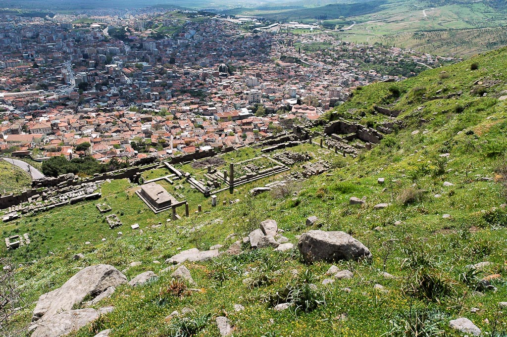

Many people's first instinct would be to get away from such a city. It's natural to want to be safe and comfortable, but we as believers have a different calling. Jesus said He came to seek the lost, and His instructions to us are to make talmidim disciples from all nations. A modern example might be Las Vegas. Many believers say they have no desire to go there. Suppose the purpose is not to participate in the sinful entertainment economy; that's fine and wise in many cases. But if we think that God doesn't or can't love the people in that city caught up in sin, we are wrong.

This reminded me of a story. I grew up in a suburb of Los Angeles, and in the mid-70s, a former Los Angeles Dodger named Maury Wills came to speak at my elementary school. He played shortstop. He said there were two kinds of ballplayers. Those who said, "please, I hope he doesn't hit the ball to me," and those who said, "hit the ball to me. Hit the ball to me." What type of Christian are you? What type am I? It's natural to want things to be safe and comfortable, but the Bible nowhere promises this. Some of us need to first get in the game. Then once we are there, we need to say, "God, hit the ball to me."

**Holding on to His name** does not mean they merely claimed to be Christians. As we've studied, the meaning of an English word such as "name" might be abstract, and the underlying Hebrew thought generally implies action. The word for name means one's character and reputation. If we hold fast to His name, we aren't just paying lip service. We are positively representing Him by our conduct.

We don't know who **Antipas** was except to say that was a prevalent name. Herod Antipas was the Herod who beheaded John the Baptist (Mar 6:22), hunted Jesus during His earthly ministry (Luke 13:31), and mocked Jesus at one of His trials (Luke 23:11), so obviously, this is a different Antipas. Church tradition holds that John appointed Antipas as bishop over Pergamum and that he healed people and expelled demons. He was put to death because he threatened the Asclepius cultic and economic system. As he was dying, he reportedly said, "your faith in gods is a false one."[^16] The legend fits almost a little too perfectly with Pergamum, so we can't discount the fact that some liberties might have been taken with the historical Antipas.

[^16]: Daniel T. Lancaster, *Satan’s Throne*, Apocalypse of John, 2015, accessed January 19, 2022, https://www.bethimmanuel.org/audio-series/apocalypse-of-john.

### 2:14-15 But I have this against you

| Revelation                                                                                                                                                                                                                                                                                                                                    | References                                                                                                                                                                                                                                                                                        |
|-----------------------------------------------------------------------------------------------------------------------------------------------------------------------------------------------------------------------------------------------------------------------------------------------------------------------------------------------|---------------------------------------------------------------------------------------------------------------------------------------------------------------------------------------------------------------------------------------------------------------------------------------------------|
| (14) Nevertheless, I have a few things against you: you have some people who hold to the teaching of Bil\`am, who taught Balak to set a trap for the people of Isra'el, so that they would eat food that had been sacrificed to idols and commit sexual sin. (15) Likewise, you too have people who hold to the teaching of the Nicolaitans.  | Numbers 22-25, 31  Joshua 13:22 Balaam also, the son of Beor, the one who practiced divination, was killed with the sword by the people of Israel  2 Pe 2:15 Forsaking the right way, they have gone astray. They have followed the way of Balaam, the son of Beor, who loved gain from wrongdoing, |

This letter gets our attention since Smyrna had zero things against and Ephesus had only one. When Jesus says, "I have **a few things** against you," it's time to buckle up!

While "**sexual immorality**" as used in Rev 2:14 is most certainly literal, the Old Testament frequently sees idolatry as spiritual infidelity against God. It's beyond our scope to give this the treatment it deserves, but many scholars see the Torah as a contact, specifically a marriage contract between God and His people (just as believers in Messiah are referred to as His Bride). Breaking that contract to follow another god is the same as breaking one's wedding vows by sexual sin. Likely both are in view here at Pergamum. People claiming to be believers and followers of Jesus, his Bride, are "whoring" after the Roman gods, if for no other reason than to fit in with the rest of the society.

Unlike the many cryptic references in these letters (and we assume they were not cryptic to the original audience), we know precisely what Jesus meant when He referred to **Balaam and Balak**. The story spans Numbers 22-25, with a post-script in Numbers 31. Interestingly, this story immediately follows the episode of the bronze serpent (Num 21:4-9). Perhaps Jesus' audience (at least the Jewish members) would have realized the connection.





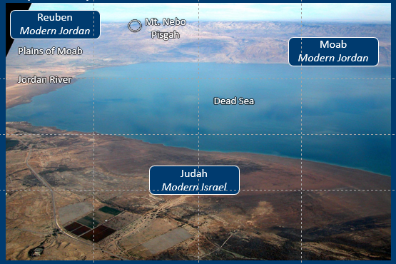

In summary, Balak was the king of the Moabites. Ammon and Moab were sons of Lot via incestual relations with his daughters. In other words, the Moabites were related to the grand-nephew of Abraham, but they didn't exactly get off to a stellar beginning. 

The territorial land of Moab is in the southern section of modern Jordan today. The Moabites and Israelites became foes when Israel asked to pass through Moab on their way to the Promised Land but were refused (a shocking violation of the usually obligatory middle eastern hospitality). In the photo, the Israelites were asking to pass through the land where the "Moab" label is. Balak feared a military incursion, but the Israelites genuinely only needed to use the well-traveled Kings Highway to reach a point to cross the Jordan and enter their land. Balak hired a well-known prophet named Balaam to curse the Israelites. He would be reimbursed for his troubles. Balaam, who appears to have had some sort of genuine line of communication with Adonai, the God of the Israelites, agreed, leading to his description as a "prophet for hire" or, as I like to say, "the for-profit prophet." Repeatedly, as Balaam went to curse Israel, God intervened, and he was unable. This led Balak to think that maybe Balaam had been outbid by the Israelites to bless instead of curse. Balak offered an even sweeter compensation package, to which Balaam naturally agreed. This led to a literal "come to Jesus" meeting between Balaam, and the angel of the LORD, whom most Christians would say is a pre-incarnate appearance of Jesus. 

Balaam's donkey sees Jesus before Balaam does in a rather humorous episode. When the donkey stopped, Balaam kicked her and struck her. Then the donkey said, 'what have I done to you that you have struck me these three times?' Not impressed that his donkey talked, he answered 'because you have made a fool of me. I wish I had a sword in my hand, then I would kill you.' … Then the Lord opened the eyes of Balaam, and he saw the angel of the lord with His drawn sword." Despite explaining to Balak the situation, Balaam did what a lot of us do when we get an answer we don't like from God. We keep asking. In the end, Balaam could do none other than blessing Israel.

Chapter 24 ends with Balaam and Balak going their separate ways and a casual reading might lead us to believe that all of these shenanigans came to nothing. Chapter 25 begins with a seemingly unrelated episode: 

>"Num 25:1-3 While Israel lived in Shittim, the people began to whore with the daughters of Moab. (2) These invited the people to the sacrifices of their gods, and the people ate and bowed down to their gods. (3) So Israel yoked himself to Baal of Peor. And the anger of the LORD was kindled against Israel." 

This is the episode Jesus references in Revelation 2:14 about eating food sacrificed to idols and practicing sexual immorality. As an aside, Numbers 25:4 and following describes what is known as the "zeal of Phinehas" who slew both the men of Israel and the Moabite women, thus stopping the plague that ultimately killed 24,000. This was no minor plague. This is where the term Zealots originated from as used in the New Testament. The Zealots were a group that agitated for the violent overthrow of Rome. Despite Jesus not aligning with this philosophy, many zealots aligned with Jesus thinking He might be a means to the end they wanted to achieve. Because of the number of people following Jesus, the Jewish and Roman authorities constantly feared a riot.

We then don't read anything about Balaam until he is killed in a raid in Numbers 31:8. The Holy Spirit wanted us to know that Evi, Rekem, Zur, Hur, and Reba were killed, "and they also killed Balaam the son of Beor with the sword." There is an exciting sword theme running through this section, isn't there?

We don't find out until Numbers 31:16 connects-the-dots for us that the episode in chapter 25 happened because Balaam told Balak how he could bring a curse upon Israel. If Moab made their pretty young ladies available to the Israelite men, the men wouldn't be able to resist. Note that God didn't directly curse the Moabites. After all, we could say they were acting like Moabites (which is why the book of Ruth the Moabitess is so astounding and a powerful picture of a gentile coming to faith in Israel's God). God cursed the Israelites who were not acting the way Israelites should.

I wonder what excuses they made. "just this once." "no one will know." "Everybody's doing it." "God wants me to be happy." "I have freedom in Christ." Ok maybe the Israelites didn't use that last one.

So that is the story of Balaam and Balak. What Satan can't accomplish externally through force and persecution, he can often achieve from within by leveraging the corruptible natures of the believers. If we are in Christ we are saved from the penalty of sin but, as long as we are alive on this earth and until He comes again, we must continually work to deal with the power of sin.





2nd Peter 2:15 tells us those who follow the way of Balaam love gain from wrongdoing. All of 2nd Peter chapter 2 is worth reading for additional context, but key verses would be:

<small>

2Pe 2:1-3 But false prophets also arose among the people, **just as there will be false teachers among you, who will secretly bring in destructive heresies, even denying the Master who bought them**, bringing upon themselves swift destruction. (2) And many will follow their sensuality, and the way of truth will be blasphemed because of them. (3) And in their greed, they will exploit you with false words. Their condemnation from long ago is not idle, and their destruction is not asleep.

2Pe 2:12-15 But these, like irrational animals, creatures of instinct, born to be caught and destroyed, blaspheming about matters of which they are ignorant, will also be destroyed in their destruction, (13) suffering wrong as the wage for their wrongdoing. They count it a pleasure to revel in the daytime. They are blots and blemishes, reveling in their deceptions, while they feast with you. (14) They have eyes full of adultery, insatiable for sin. They entice unsteady souls. They have hearts trained in greed. Accursed children! (15) Forsaking the right way, they have gone astray. **They have followed the way of Balaam, the son of Beor, who loved gain from wrongdoing**,

2Pe 2:19-21 They promise them freedom, but they are slaves of corruption. For whatever overcomes a person, to that he is enslaved. (20) For if, after they have escaped the defilements of the world through the knowledge of our Lord and Savior Jesus Christ, they are again entangled in them and **overcome**, the last state has become worse for them than the first. (21) For **it would have been better for them never to have known the way of righteousness than after knowing it to turn back from the holy commandment delivered to them**.

</small>

These are contemptuous words to be sure. If we don't read carefully, it would be easy to think that verses 12-15 are talking about pagans.  However, verses 1 and 21 are clear. These people are **PROFESSING BELIEVERS**.

These false teachers had slipped into the congregation(s) at Pergamum. Keener believes these false teachers "may be advocating compromise with the imperial cult...and may have used their prophecies to commend themselves to elements of pagan universalism."[^17]

[^17]: Keener, *The IVP Bible Background Commentary*, v. Rev 2:14.

We've already examined the Nicolaitans in the letter to Ephesus, but note Ephesus resisted while Pergamum tolerated. Jesus seems to equate whatever the Nicolaitans were doing with the sexual and dietary sins in the Balaam incident, which is why I believe the Nicholas (unrestrained sexual perversion no matter what the Bible says) or "Nochal" (we will eat all no matter what the Bible says), theories fit the context better "conquerors of the laity" theory for who the Nicolaitans were. To put it another way, the Nicolaitans used the same strategy to undermine the congregation at Pergamum that Balaam and Balak used to undermine Israel.

These are the people to whom Jesus is directing verse 16.

### Rev 2:16 "Repent!"

| Revelation                                                                                                                            | References                                                                                                                                                                                                                                                                                                                                                                                                          |
|---------------------------------------------------------------------------------------------------------------------------------------|---------------------------------------------------------------------------------------------------------------------------------------------------------------------------------------------------------------------------------------------------------------------------------------------------------------------------------------------------------------------------------------------------------------------|
|  (16) Therefore, turn from these sins. Otherwise, I will come to you very soon and make war against them with the sword of my mouth.  |  Rev 19:15 And out of his mouth comes to a sharp sword with which to strike down nations—"He will rule them with a staff of iron." It is he who treads the winepress from which flows the wine of the furious rage of Adonai, God of heaven's armies.   Rev 19:21 The rest were killed with the sword that goes out of the mouth of the rider on the horse, and all the birds gorged themselves on their flesh.   |

Given the Balaam references, the sword imagery is conspicuous (Num 22:23, 29, 31; 31:8, Joshua 13:22). In effect, Jesus is saying if the people are going to act like Balaam, they will meet with a similar ending. Jesus isn't wielding a literal sword; He doesn't have to. His literal words are plenty powerful. Also, there is the just punishment recorded in the Torah for those who follow in the way and the teaching of Balaam.

Now we are starting to see the connection Jesus is building. When we take a more expansive view, the two judgments for the unrepentant (Ephesus and Pergamum) would seem to involve a forfeiture of eternal life. At Ephesus, Jesus said He would remove the menorah from its place. Since Jesus is in the midst of the menorah, he is talking about removing the unrepentant from His presence. Here, the unrepentant will receive the sword of judgment, which we can see fulfilled in Revelation 19.

Along the same lines, all the promises to the overcomers involve gaining eternal life. Ephesus would get to eat from the Tree of Life, Smyrna will be exempted from the second death, and below, Pergamum will eat of the "hidden manna." We'll describe the connection to eternal life in a moment.

If the overcomers get to do these things, then we can logically assume that non-overcomers, the unsaved, do NOT get to do these things. Also, the Tree of Life was literal. The manna in the wilderness was literal food. We can assume the second death is also literal. In other words, Jesus is not merely speaking symbolically that believers will go to heaven and the unbelievers will go to hell. There is much more involved.

### Pergamum gets no secondary encouragement

A typical letter has a judgment sandwiched between two separate words of praise and encouragement; a "praise sandwich" if you will.  Right here is the point where we would expect the secondary encouragement (e.g., "but you have those <who are doing something good>").  This is absent for Pergamum.   Pergamum's letter is open-faced, not a sandwich. An open faced sandwich is good if you're trying to cut back on carbs, but not so good if you want to do good deeds that please your Master. Pergamum receives a praise and a judgment, but no closing secondary praise or encouragement. SO we get a clue that while the situation is not quite as dire as with Sardis and Laodicea, who get no praise, we do get the sense that something is fundamentally wrong with Pergamum.

### Rev 2:17: Promise to the Overcomer / Ears

| Revelation                                                                                                                                                                                                                                                                           | References                                                                                                                                                                                                                                                                                                                                                                                                                                                                                                                                                                                                                                                                                                                                                                                                                                                                                                        |
|--------------------------------------------------------------------------------------------------------------------------------------------------------------------------------------------------------------------------------------------------------------------------------------|-------------------------------------------------------------------------------------------------------------------------------------------------------------------------------------------------------------------------------------------------------------------------------------------------------------------------------------------------------------------------------------------------------------------------------------------------------------------------------------------------------------------------------------------------------------------------------------------------------------------------------------------------------------------------------------------------------------------------------------------------------------------------------------------------------------------------------------------------------------------------------------------------------------------|
| (17) Those who have ears, let them hear what the Spirit is saying to the Messianic communities. To him winning the victory, I will give some of the hidden manna. I will also give him a white stone, on which is written a new name that nobody knows except the one receiving it." | Exo 16:31-35 Now the house of Israel called its name manna. It was like coriander seed, white, and the taste of it was like wafers made with honey. (32) Moses said, “This is what the LORD has commanded: ‘Let an omer of it be kept throughout your generations, so that they may see the bread with which I fed you in the wilderness, when I brought you out of the land of Egypt.’” (33) And Moses said to Aaron, “Take a jar, and put an omer of manna in it, and place it before the LORD to be kept throughout your generations.” (34) As the LORD commanded Moses, so Aaron placed it before the testimony to be kept. (35) The people of Israel ate the manna forty years, till they came to a habitable land. They ate the manna till they came to the border of the land of Canaan.  Joh 6:31 Our fathers ate the manna in the wilderness; as it is written, ‘He gave them bread from heaven to eat.’” |

Most of the scholars I read describe some plausible conjectures but ultimately are forced to throw up their hands. There is a Jewish tradition regarding the hidden manna that both Keener and Lancaster note in their comments. Let's look at each of these three elements as best we can.

#### Hidden manna

As mentioned, I would refer anyone interested in unpacking this to review Craig Keener's notes in the IVP Bible Background Commentary, New Testament, or [Daniel Lancaster's audio teaching](https://www.bethimmanuel.org/audio/hidden-manna-and-white-stone). In summary, when God provided manna from heaven for the people to eat during the wilderness wanderings, he also instructed Aaron to take an omer of the manna (about two quarts) and keep it before Adonai. See Ex 16:31-36. After the Ark of the covenant was built, it was placed inside, with Aaron's rod that budded in front of Pharoah and the copy of the 10 Commandments. As has been popularized by a very famous movie, the Ark seemingly vanished without a trace around the Babylonian conquest of 586 BCE. This has led to several speculations and traditions about where the ark and its contents might be. A Jewish tradition holds that Elijah will present the jar of the hidden manna to the Messiah at the start of the millennial kingdom.[^18] Keener doesn't go to this detail, but he notes that the pot of hidden manna will "be restored at the end time."[^19] Lancaster is confident that Jesus is confirming this legend. In his view, it would have been impossible for Jesus' first-century audience to have interpreted the phrase "hidden manna" as anything other than this legend.[^20]

[^18]: Daniel T. Lancaster, *Hidden Manna and the White Stone*, Apocalypse of John, 2015, accessed January 19, 2022, https://www.bethimmanuel.org/audio-series/apocalypse-of-john.

[^19]: Keener, *The IVP Bible Background Commentary*, v. Rev 2:17.

[^20]: Lancaster, *Hidden Manna and the White Stone*.

Because of the connection to the millennial kingdom, it is another way of saying those who get to partake of the hidden manna will receive eternal life. 

How is Jesus going to feed everyone from just one omer of manna? Apparently, another feeding miracle is still to come; only this time, it will hopefully be much more than 5000! Lastly, don't miss the fact that the letters to Ephesus and Pergamum both mention the Nicolaitans, and both mention that the overcomers would eat clean and proper food. This may or may not be significant, but I think it is.

#### White stone

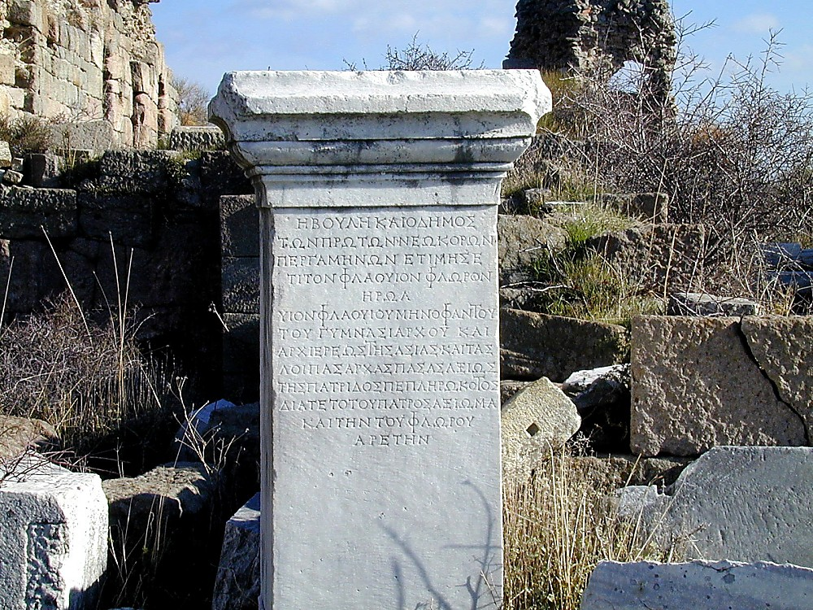

This photo is a white stone with an inscription. It's located in Pergamum, which calls to mind Revelation 2:17[^21]

[^21]: Bolen, *Pergamum*, Western Turkey:77.

Most commentators believe this was some kind of judicial procedure where a white stone signifies one is innocent and a black stone means one is guilty. Others said it was a type of admission ticket. So here, Jesus is simultaneously proclaiming the overcomers as innocent, which grants them admittance to the Messianic Banquet. Lizorkin speculates that of the twelve stones on the High Priests robe, the white one represented the tribe of Zebulun. Zebulun's tribal allotment was Galilee of the nations, leading to the famous passage in Isaiah 9:1-7 about a child being born and a son given.[^22] So the secret white stone could be the Messiah himself. For sure, these speculations may fit varying degrees, but as we will see later in our study, just because something fits doesn't mean that's what God was communicating. I like the way the Believer's Bible Commentary concluded their discussion. After listing all of the usual theories, "it seems clear that it is a reward given by the Lord to the overcomer and expressing individual approval by Him."[^23] That, my friends, is about all we can be sure of!

[^22]: Eli Lizorkin-Eyzenberg and Pinchas Shir, *Hebrew Insights from Revelation*, Jewish Studies for Christians, 2021, 80.

[^23]: William MacDonald, *Believer’s Bible Commentary: Second Edition*, ed. Arthur L. Farstad, Second edition. (Nashville, Tennessee: Thomas Nelson, 2016), v. Rev 2:17.





Many visitors to Pergamum note the photo above and the inscription on a white stone. This recalls Jesus' words. This photo above is a dedication to the town's ancient gymnasium honoring the facility's director. 

We mentioned in the Ephesus lesson that Ephesus and Pergamum had a bit of a rivalry. I grew up in Los Angeles, so that I can compare it to the LA San Francisco rivalry. Maybe New York and Boston is another example. The Romans would award a neokoros, which essentially means "temple warden." It's sort of like being selected to host the Olympics today. It was an honor and a big deal for that city. We mentioned earlier that Pergamum was the first to be named neokoros for its consecration and worship of Augustus. Later Smyrna and Ephesus would also gain that title for their temples. deSilva notes that Ephesus began to flaunt its recent title, which upset Pergamum. 

The inscription on this stone says Pergamum was the FIRST to be awarded neokoros. Then when Pergamum received the honor of the temple to Trajan (after Revelation was written), they paraded the title "twice awarded neokoros." Then after Ephesus won a second neokoros, Pergamos was then "first to be twice awarded." 

This may seem like a silly and fun rivalry, but DeSilva notes it ran much deeper. This demonstrates "how strong were the connections between civic pride and support for the imperial cult…at the very time that Christian witness against the legitimacy of (the)cult and resistance to participation was becoming sharper."[^24]

[^24]: deSilva, “Pergamum,” 644–645.





#### A new name that nobody knows

Lancaster and other commentators pointed out that the "new name" is the more important of the two. When God changed a name in the Old Testament, it indicated His approval and acceptance, and a promise usually accompanied it. As we mentioned above, a term in Hebraic thought denotes one's character and, in some respects, one's destiny. Review Genesis 49 and Jacob's prophecies to the 12 tribes. He frequently invokes a translation of the son's name.

Lastly, note that this is the third and final letter where the promise to the overcomer occurs after the "those who have ears" statement. For the last four letters, the order will be reversed. We can speculate, but we are not told why this is. The more important aspect is remembering the Hebrew meaning of shamah and hearing. It means not just listening (or reading) but understanding and obeying what Jesus has to say. In fact, it is through obedience that we become overcomers.

### Conclusion

The believers in Pergamum didn't directly deny their Lord, which is to their credit, but they didn't do the opposite either. They worshipped other gods alongside the One True God. Lizorkin writes of Pergamum, "only one God can be worshipped and adored,"[^25] or as Jesus said, "no one can serve two masters." Just like the rich young ruler, we must make a choice. In our day, Satan likes to trick us, believers, into thinking that we aren't worshipping whatever it is we actually are worshipping (the sports team, the car, the job, or the toys or websites that captivate our attention; or the doctors and the medicines that supposedly heal us and save us from sickness). After all, it's not like we're bowing down to them or holding them up in the air while praying to Baal, Aesculepius, or some other god. Keep in mind the thing we worship doesn't necessarily have to be sinful. In our economy, a job is necessary. But when one becomes married to their job, it becomes an idol. We need a car to get from place to place. But when we use a vehicle to communicate our status, it becomes a problem. There is nothing inherently wrong with money. Money is not the root of all evil. That is a misquote. The Bible says, "the love of money is a root of all kinds of evil." Stiles notes, "today there is a false god for anything and everything, and they offer immediate satisfaction. But they are not the truth."[^26] In contrast, Jesus doesn't always offer immediate satisfaction. He requires trust, faith, and obedience. With the constant references in these letters to our being rewarded in the afterlife, believers must be willing to exchange a comfortable, instant gratification life today for the promise of not just greater, but the most significant rewards later.

[^25]: Lizorkin-Eyzenberg and Shir, *Hebrew Insights from Revelation*, 77.

[^26]: Stiles, “Pergamum – Satan’s Throne and Christ’s Promise.”

With all this in mind, think about where you and I are worshiping other gods alongside God?. Where are you (and I) married to the world? These are questions each of us must wrestle with and ask God to expose any areas where we need correction. As we said in a previous lesson, ask God to audit the books of your life. Each letter ends with "he who has an ear let him hear…." These letters are written for us today to examine ourselves and correct where needed so we can walk in faithful obedience.

### Church age theory

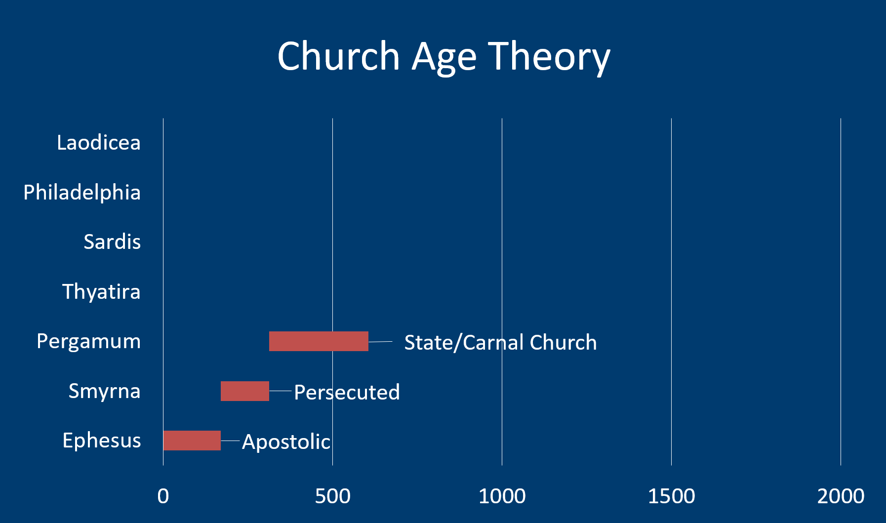

Proponents of the church age theory see Pergamum as representative of the State church, married to the world's system of idolatry.

In history, this started in 311, with the "Edict of Toleration," which decriminalized Christianity and ended the official Roman persecution. Later Constantine would officially recognize Christianity, with the emperor himself "converting" to Christianity and legalizing Christianity in 313 with the Edict of Milan.

We are right to question the genuineness of his conversion, with skeptics viewing it as a pragmatic move to unify the people. In 285, Emperor Diocletian believed the Roman empire was getting too large. Hence, he not only divided it between east and west, each region would also have co-regents to help with administrative tasks. The senior administrator held Augustus's title, while the junior administrator was titled, Caesar. There were four emperors, called a Tetrarchy. As Cargill rhetorically asked his class, "how many of you think this is going to work well?"[^27] It's like a family arrangement that starts as a good idea. When someone dies, and there are issues of succession and inheritance (and ego), it turns into a mess. This is exactly what happened. Constantine was the son of Constantius, who was the Caesar of the western half. He wanted it all and ultimately went to war with Maxentius, his counterpart in the East. Missler writes, "in 312 A.D: Constantine set out to defeat the forces of Maxentius, his rival, for supreme power in the empire. It is said that on the next day he saw a shining cross (or a "chi-rho") in the sky with an inscription above it: *in hoc signo vinces:* “In this sign, thou shalt conquer.” He defeated Maxentius at the Milvian bridge and immediately declared his conversion to Christianity."[^28] Jesus' pacifist message of "turn the other cheek" and "My kingdom is not of this earth" was now replaced by a conquering Christian army who will now maim and kill in the name of Jesus. Keep this in mind when we get to the parable of the Mustard seed becoming something it was never intended to be in the next section.

[^27]: Robert R. Cargill, *Byzantine Jerusalem*, Jerusalem: The Holy City (Spring 2010): A History of Jerusalem from Ancient Canaan to Modern Israel, 2010, https://itunes.apple.com/itunes-u/jerusalem-holy-city-spring/id434136076?mt=10.

[^28]: Missler, *The Book of Revelation Handbook*, 54.

In addition to this, what was once a wholly Jewish faith, first called "the way" (דֶרֶך in Hebrew) is now being infiltrated by Greco-Roman philosophy to the point where it was now not only unrecognizable and incompatible with the Judaism Jesus taught, but many different gentile Christian splinter groups formed that were largely incompatible with each other. For example, groups debated the nature of Jesus and His relationship to the father. Some held he was a spirit being only (which has its roots in Gnosticism). Others held He was fully man and was only later adopted by God. Nearly everyone didn't like the fact that He was Jewish. We can imagine the debate and infighting. This was often along geographic lines between those in the eastern and western parts of the empire, and these divisions are still around today. Constantine, pragmatically, saw an opportunity to unify the empire by bringing all these groups together to define Christian orthodoxy. In 324 was the Council of Nicaea, which resulted in the Nicene Creed and the doctrine of the Trinity. We can argue that the Creed is a good thing, but we can't discount the fallout. Those who didn't believe exactly the way the Council decided were now no longer Christians. This included Jewish believers. They were heretics, and heretics are burned at the stake. Ironically today, we have just as many if not more divisions.

As Missler says, "The underground Christians exchanged the rags of oppression for the silks of the court."[^29]

[^29]: Ibid.

A few decades later, Theodosius made Christianity the official state religion of the Roman Empire. It was now not only the "in thing" to be a Christian, it was required. This led to many otherwise unregenerate people getting baptized. On that note, infant baptism was instituted, and now one was a Christian from birth no matter how they lived. Christianity didn't immediately replace the Roman Imperial cult but existed alongside it. So the pagan practices of eating food sacrificed to idols and sexual immorality co-existed along with Christian traditions. Think of the pagan temple as a corner convenience store that now has a sign "under new management." There may be some cosmetic changes, but it's still the same convenience store. Temples were now Christian churches, and the pagan priests were now "Christian" priests. Pagan festivals such as spring fertility and winter solstice (longest night) were morphed into Easter and Christmas. As Missler says, "The underground Christians exchanged the rags of oppression for the silks of the court."[^29]

[^29]: Ibid.

One might be surprised how many practices from this time are still around today. Interestingly, it was the Jewish Christians who spoke out against this. For this, they now became the persecuted ones. Saturday worship was forbidden; Resurrection Sunday, instead of being the Jewish feast of Firstfruits, was intentionally disassociated from Passover (which remains today). Eating ham on Easter Sunday was instituted to isolate Jewish believers further.

Missler points out that during this period is when symbolic and allegoric interpretations of scripture came to the forefront. In some respects, this might make sense. Jerusalem has been destroyed, which was predicted by Jesus, who often said that His kingdom was not of this world. There was also an ulterior motive by those in charge. In other words, the world's corrupt rulers couldn't edit out the part of the Bible that said Jesus is coming back to rid the world of its corrupt rulers. This was when the amillennial interpretation of the end times was popularized. Jesus is not coming again physically; He will rule in our hearts. This is a remnant of Gnostic philosophy that held that the physical is bad—only the spiritual matters.

Another significant difference between the amillennial and those who hold a millennial worldview is the mission and destiny of the church. Amillennialists believe the church will grow and grow by political might to become an unstoppable force for good. Things will get better and better until, eventually, we will achieve Eden once again. The millennial kingdom is just another way of saying the church. Those who believe in a literal millennial kingdom would read the Bible that Satan oversees this world. The church is here to spread the Gospel, make disciples, and be a light in a dark world. Ultimately the world goes from bad to worse until Jesus intervenes. One group says it gets better and better, and the other group says it goes from bad to worse.

Cargill sums up this period by saying:

>"Constantine is responsible for much of what we know as modern Christianity, for better and for worse."[^30]

[^30]: Cargill, *Byzantine Jerusalem*.

### Parables: Pergamum = Mustard Seed (Mat 13:24-30)

<small>
Mat 13:31 Yeshua put before them another parable. "The Kingdom of Heaven is like a mustard seed which a man takes and sows in his field.
 Mat 13:32 It is the smallest of all seeds, but when it grows up, it is more significant than any garden plant and becomes a tree, so that the birds flying about come and nest in its branches."

</small>

Garden plant:
:What the ecclesia should be according to Jesus. Typically, a mustard plant is a bush only a few feet high.

Tree:
:Many Christians see this as the church as growing and growing in greatness. In the context of something that should only be the size of a garden plant, having this grow into a tree represents a monstrosity. The thing has grown into something it was never intended to become. A compromised and carnal church that tolerates pagan practices of idolatry and sexual immorality and has made Christianity something Jesus never taught or intended it to be.

Birds of the air:
:Ministers of Satan (Matthew 13:19). The "birds of the air" from the first parable are ministers of Satan; it would be most unusual if Jesus changed the symbolism.

Nest in its branches:
:The ministers of Satan set up shop, became this church's leaders, and led the people astray just like Balaam/Balak did.

Meaning
:The suggestion is that what started small and was supposed to be a plant has become a monstrosity. It has become something it was never intended to be. It is so large that ministers can not just land but make nests, i.e., make a home, in its branches.
:Jesus said to carry a weapon for defense only, and even this was unusual. When He was arrested, He told the disciples to put their swords down. For all intents and purposes, Jesus' earthly ministry was a model of pacifism.
:Now with the advent of Constantine, we see the church as a conqueror, both politically and militarily.

### Paul: Pergamum=Corinthians

Missler sees the Pauline tie-in for Pergamum as the letters to the Corinthians.  1st Corinthians in particular deals with the carnal church, as exemplified by 1 Cor 5:1.  Below are a few verses to illustrate similar issues happening in both Corinth and Pergamum.  We recommend a thorough study of 1/2 Corinthians in conjunction with our study of Pergamum.

* 1 Co 2:12 Now we have received not the spirit of the world, but the Spirit who is from God, that we might understand the things freely given us by God.
* 1 Co 3:1-3 But I, brothers, could not address you as spiritual people, but as people of the flesh, as infants in Christ. (2) I fed you with milk, not solid food, for you were not ready for it. And even now you are not yet ready, (3) for you are still of the flesh. For while there is jealousy and strife among you, are you not of the flesh and behaving only in a human way?
* 1 Co 3:4 For when one says, “I follow Paul,” and another, “I follow Apollos,” are you not being merely human? (*Greek culture divinized human heroes into gods.*)
* 1 Co 3:16-17 Do you not know that you are God's temple and that God's Spirit dwells in you? (17) If anyone destroys God's temple, God will destroy him. For God's temple is holy, and you are that temple. (*This correlates to the dietary and fleshly fornication happening at Pergamum.*)
* 1Co 4:2 Moreover, it is required of stewards that they be found faithful.
* 1Co 4:5 Therefore do not pronounce judgment before the time, before the Lord comes, who will bring to light the things now hidden in darkness and will disclose the purposes of the heart. Then each one will receive his commendation from God.
* 1Co 5:1 It is actually reported that there is sexual immorality among you, and of a kind that is not tolerated even among pagans, for a man has his father's wife. (*Chapter 5 is all about sexual immorality.*)
* 1Co 5:11 But now I am writing to you not to associate with anyone who bears the name of brother if he is guilty of sexual immorality or greed, or is an idolater, reviler, drunkard, or swindler—not even to eat with such a one. (*Paul sounds awfully judgmental here.  Are we sure the Paul of the New Testament is the same Paul we have been taught?*)
* 1Co 6:12-13 “All things are lawful for me,” but not all things are helpful. “All things are lawful for me,” but I will not be dominated by anything. 13 “Food is meant for the stomach and the stomach for food”—and God will destroy both one and the other. The body is not meant for sexual immorality, but for the Lord, and the Lord for the body. (*The ESV does an excellent job of setting off the quotes. Paul is not saying these directly. He is quoting the arguments of his opponents. Read this carefully. Just as Paul is not saying sexual fornication is lawful (God forbid!), he neither is saying all food is OK. Could "we eat all because all things are permissible" be a teaching of the Nicolaitans we have all fallen for? Asking for a friend!*)

