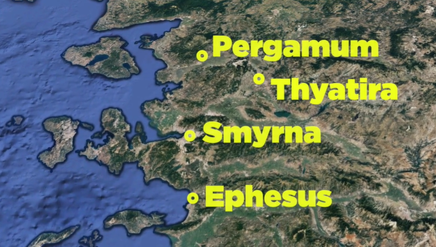
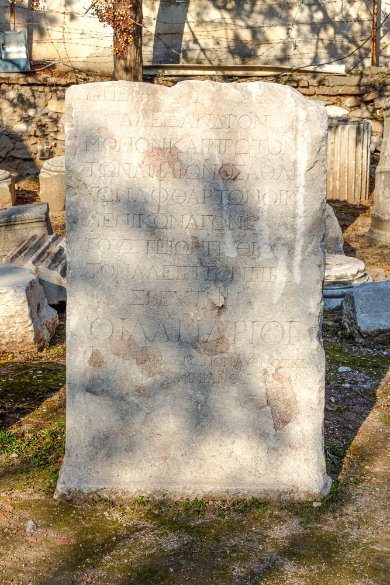
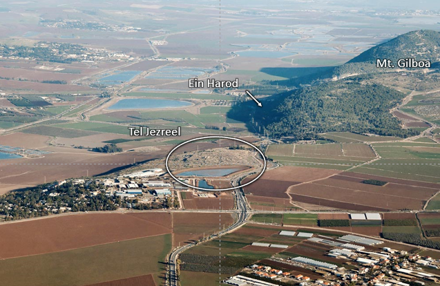
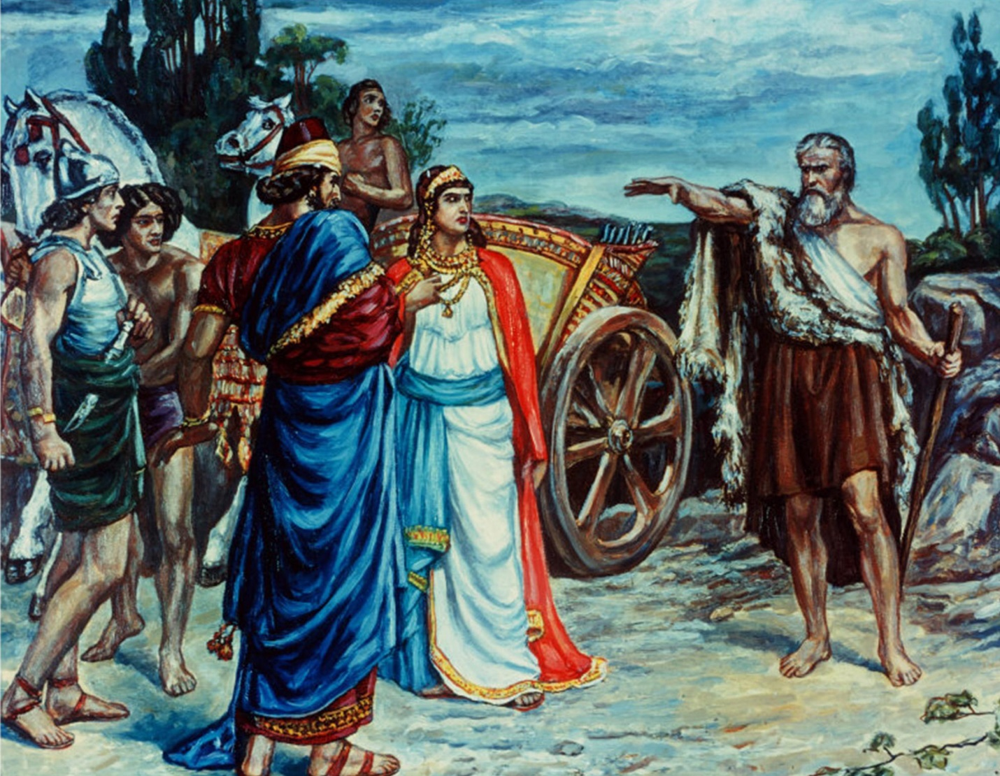
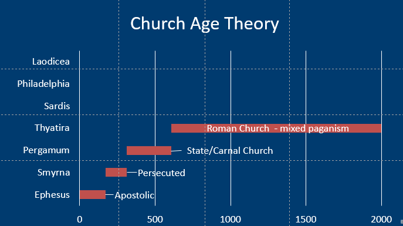
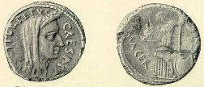
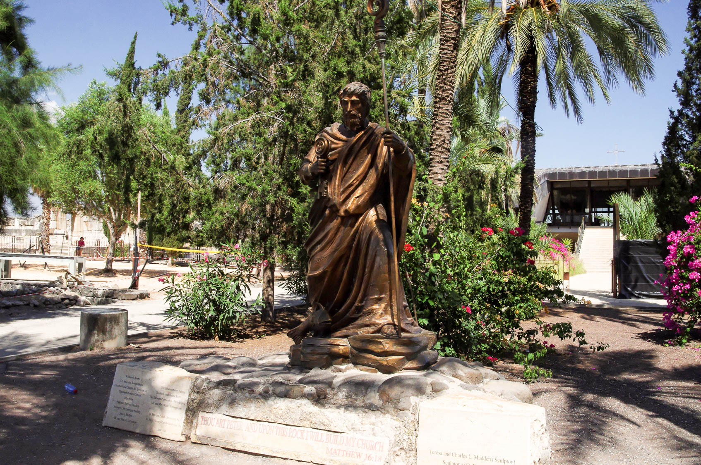



 

### Videos

Part I: Thyatira background, trade guilds,  Revelation 2:18-21 (verses 22-29 are covered in Part II); Elijah and prophets of Baal at Mount Carmal.  Jezebel and Naboth's vineyard at Jezreel.


-----

Part II: Revelation 2:22-29; Does it fit?  Church Age = Catholic Church; Parable= Woman & Leaven; Paul=Galatians


#### Audio Commentary

<iframe title="Thyatira I - Revelation Backgrounds 9a" allowtransparency="true" height="150" width="100%" style="border: none; min-width: min(100%, 430px);" scrolling="no" data-name="pb-iframe-player" src="https://www.podbean.com/player-v2/?i=8qnih-11cc6f3-pb&from=pb6admin&share=1&download=1&rtl=0&fonts=Arial&skin=3267a3&font-color=auto&btn-skin=3267a3"></iframe>

<iframe title="Thyatira II - Revelation Backgrounds 9b" allowtransparency="true" height="150" width="100%" style="border: none; min-width: min(100%, 430px);" scrolling="no" data-name="pb-iframe-player" src="https://www.podbean.com/player-v2/?i=jv2yw-11cc700-pb&from=pb6admin&share=1&download=1&rtl=0&fonts=Arial&skin=f6f6f6&font-color=auto&btn-skin=3267a3"></iframe>

### Read/hear the portion

| Revelation 2:18-29                                                                                                                                                                                                                                                                                                                                                                                                                                                                                                                                                                                                                                                                                                                                                                                                                                                                                                                                                                                                                                                                                                                                                                                                                                                                                                                                                                                                                                                                                                                                                                                                                                                                                                              |
|---------------------------------------------------------------------------------------------------------------------------------------------------------------------------------------------------------------------------------------------------------------------------------------------------------------------------------------------------------------------------------------------------------------------------------------------------------------------------------------------------------------------------------------------------------------------------------------------------------------------------------------------------------------------------------------------------------------------------------------------------------------------------------------------------------------------------------------------------------------------------------------------------------------------------------------------------------------------------------------------------------------------------------------------------------------------------------------------------------------------------------------------------------------------------------------------------------------------------------------------------------------------------------------------------------------------------------------------------------------------------------------------------------------------------------------------------------------------------------------------------------------------------------------------------------------------------------------------------------------------------------------------------------------------------------------------------------------------------------|
| "To the angel of the Messianic Community in Thyatira, write: 'Here is the message from the Son of God, whose eyes are like a fiery flame and whose feet are like burnished brass: (19) I know what you are doing, your love, trust, service, and perseverance. And I know that you are doing more now than before. (20) But I have this against you: you continue to tolerate that Izevel woman, the one who claims to be a prophet, but is teaching and deceiving my servants to commit sexual sin and eat food that has been sacrificed to idols. (21) I gave her time to turn from her sin, but she doesn't want to repent of her immorality. (22) So I am throwing her into a sickbed; and those who commit adultery with her I am throwing into great trouble unless they turn from the sins connected with what she does; (23) and I will strike her children dead! Then all the Messianic communities will know that I am the one who searches minds and hearts and that I will give to each of you what your deeds deserve. (24) But to the rest of you in Thyatira, to those who do not hold this teaching, who have not learned what some people call the 'deep things' of the Adversary, I say this: I am not loading you up with another burden; (25) only hold fast to what you have until I come. (26) To him who wins the victory and does what I want until the goal is reached, I will give him authority over the nations; (27) he will rule them with a staff of iron and dash them to pieces like pottery, (28) just as I have received authority from my Father. I will also give him the morning star. (29) Those who have ears, let them hear what the Spirit is saying to the Messianic communities." ' |



### Thyatira Background

Thyatira is located 42 miles inland on a flat plain. Its location was bad from a military perspective but good from a trade perspective. Thyatira was strategically located on a highway connecting it with Pergamum and Troas (and today Istanbul) to the north, Smyrna to the west, and Sardis to the south.

Thyatira is related to θυγάτηρ, thygater, or "daughter." After Seleucus I (Nicator) took control of the city in 301 BCE, he named the location θυατειροις (Thyateirois) in honor of his daughter.[^1]

[^1]: Chuck Missler, *The Book of Revelation Handbook* (Koinonia House, 2020), 56.

Many devotional (as opposed to scholarly) commentaries reflect that the name means "continual sacrifice," but only one scholarly reference that I could identify confirmed this, and this author did so without providing any references supporting the Greek interpretation.[^2] I'm skeptical of this interpretation. It sounds more to me like Protestant commentators contrived these meanings as a dig towards Catholics to support the "Church Age Theory" linking Thyatira to the Catholic/Papal church and the Doctrine of the Mass. Despite differences Protestants may have with Catholic doctrine (and vice-versa), we must be devoted to the truth, not Protestant folklore. I will be glad to post a correction to this paragraph should I come across a hard source supporting one of these alternate names as a potential interpretation of the Koine Greek. Until this time, I would encourage readers to be equally skeptical. "Daughter" appears to be a straightforward Greek interpretation and is entirely consistent with the extra-biblical historical narrative. Remember Acts 17:11, which is our charge to accept the truth and reject falsehoods, no matter how much they may "fit" or how much we may wish they were true.

[^2]: During a web search of "Thyatira continual sacrifice" we even identified additional pejorative "translations" such as "odor of affliction" and "ruled by a woman," which sound equally suspicious.

What does have more scholarly support, though still disputed, is that a former name of the city was "Semiramis," a mythical goddess common to multiple ancient cultures. Again, in what is likely to be a Protestant misunderstanding (taking a charitable view of it), a book written in 1853 puts forth the suggestion that Semiramis was the mother of Nimrod, the Bible's first apostate, and they had an incestuous relationship resulting in Tammuz and the Babylonian pagan system which ultimately found their way into the Catholic Church's practices. There is no historical record supporting the book's claims, yet to this day, they are passed on as true by many Protestant commentators. So while it was true that Thyatira was likely named Semiramis, the mythical Semiramis' connection to the Catholic church seems entirely fabricated.

I can speculate that the reasons protestant commentators go to such lengths to force a connection between Thyatira and the Catholic Church are twofold:

1.  This is where the Church-Age Theory (largely a Protestant creation) starts to feel contrived.
    1.  People can feel the need to force evidence to support a theory where no evidence exists.
    2.  This is not to say that there aren't any parallels. Instead of spreading urban legends, all they needed to do was focus on the historical Jezebel (which WE will do once we get to verse 20!)
2.  If we hold to the theory, the next church, Sardis, would represent the Reformation period. There is NOTHING good said about Sardis.

I'm not saying connections aren't there, but let's not oversell them. Our job is to be true to the text.

The letter to Thyatira is the longest of the seven letters, but it is the city we know the least about. It seems fair to perhaps label it the "least significant" of the seven cities, but we don't know what secrets the earth holds. This is because archaeological excavations have been limited by the modern city of Akhisar (\~ 30,000 people).

Documentary evidence, including the Book of Acts, does demonstrate that the city was known for its trade guilds. Various inscriptions found, such as the one in the photo, list some of these guilds: wool workers, linen-workers, makers of outer garments, dyers, leather-workers, tanners, potters, bakers, slave-dealers and bronze-smiths.[^3] Evidence indicates that the city was at the height of its prosperity in the very late 1st century, exactly when they would have received this letter. [^4]

[^3]: Todd Bolen, *Thyatira-2019*, vol. Western Turkey, Pictorial Library of Bible Lands, 2019, 4.

[^4]: Ibid., Western Turkey:6.

The Guilds gathered at the temple of Apollo.[^5] In Greek mythology, Apollo is also the twin brother of Artemis, which we studied at Ephesus, and the father of Asclepius at Pergamum. He is the god of music and the arts and also the Sun. As we have learned in the previous letters, just about everything in Roman society was connected with the worship of the Roman gods. The worship of Apollo included lots of sex, eating, and drinking.[^6][^7]

[^5]: Wayne Stiles, “Thyatira and Sardis-Keeping Far from Compromise,” *Walking the Bible Lands*, 2021, accessed March 5, 2022, https://www.walkingthebiblelands.com/products/walking-the-bible-lands/categories/4024473/posts/11298762 (subscription required).

[^6]: Bolen, *Thyatira-2019*, Western Turkey:6.

[^7]: Stiles, “Thyatira and Sardis-Keeping Far from Compromise.”

Further, guild worship wasn't simply an annual or quarterly business meeting where one could pinch his nose and suffer through it. "Each guild had its own god, pagan feasts, celebrations, and other rituals."[^8] In other words, it was inescapable, ongoing worship.

[^8]: Bolen, *Thyatira-2019*, Western Turkey:7.

Jesus will again reference sexual immorality and eating things sacrificed to idols. Thyatira may have been committing the same sins but for different reasons. At Thyatira, believers involved with one of the trades represented by the guilds were placed in a seemingly impossible situation. If he didn't participate in the Apollo worship (or whichever other god a given trade venerated), he would be expelled from the guild.[^9] The equivalent today would be having your business license revoked or being blacklisted by those in power. You would not be allowed to practice your trade or craft. If you went along with it, even half-heartedly, you were a compromiser, and we know from the previous letters how Jesus feels about compromisers versus those who remain true to His name. While whoever "Jezebel" was evidently was advocating compromise, Jesus told them it just wasn't worth it, literally. It's too expensive in that there is too much at state eternally.[^10]

[^9]: Ibid.

[^10]: Stiles, “Thyatira and Sardis-Keeping Far from Compromise.”

### New Testament Thyatira

Thyatira receives only one other mention outside the book of Revelation. Acts 16:14 tells us that Paul met Lydia in Philippi, and she was his first convert in that city. Lydia was a Jew from Thyatira and was a seller of the rare purple (or scarlet) dye mentioned by Homer in the Iliad. While there is a theory that holds the dye is made from sea muscles, Thyatira's inland location would support the alternative theory that the dye is plant-based from the madder root.[^11] The photo shows skins dyed with madder root (Rubia tinctorum).[^12] Bolen adds, "The process of extracting the dye was not a simple or quick one, causing the dyed cloth to be expensive."[^13]

[^11]: Bolen, *Thyatira-2019*, Western Turkey:4.

[^12]: Madison60, *English: Skeins Dyed Naturally with Madder Root, Hanging to Dry, at Colonial Williamsburg, Virginia, USA. 3/31/12*, March 31, 2012, Own work, accessed March 6, 2022, https://commons.wikimedia.org/wiki/File:Naturally_dyed_skeins.jpg.

[^13]: Todd Bolen, *Acts 16*, vol. Acts, Photo Companion to the Bible (Santa Clarita, CA, 2018).

It appears the area was largely unoccupied (or at best an insignificant outpost) for most of the middle ages, with Akhisar being refounded in the Ottoman period. Since 1922 there have been no Christians.

### Prelude

We're going to find that the issues of following in the ways of Balaam/Pergamum and Jezebel/Thyatira are very closely related in that they both involve compromise. Balaam wants to come alongside God and offer you something extra. Balaam couldn't curse Israel, but he did entice and ensnare them. Balaam says it's ok to have one foot worshipping Israel's God as long as you have one foot in the world, worshipping the things of the world.

Jezebel is in opposition and wants to corrupt God. In other words, even the one foot that you are following God with is changed into something it's not supposed to be. Both are bad. Satan will use either one or any combination to attack you and me and keep us from worshipping Him how He requires. This includes our ability to deceive ourselves into thinking \__\_ is ok (fill in the blank), even though God has said it's not. "The danger to the church at Thyatira arose from within the church itself – all the more serious and dangerous to deal with."[^14]

[^14]: Missler, *The Book of Revelation Handbook*, 57.

Missler noted three "tares" in the early church based on the letters so far:[^15]

[^15]: Ibid., 55.

-   Legalism– this is a denial of Christ's work
    -   "Legalism" means a certain work is required *in order to merit salvation*
    -   Holding ourselves to a high standard of behavior and performance as a RESPONSE TO Christ's work is not legalism
        -   Accusers of the brethren disparage good works as "legalism."
-   Gnosticism – denial of Christ's humanity
-   Caesar worship – denial of Christ's Lordship

### Rev 2:18 To Thyatira 

| Revelation                                                                                                                                                                           | References                                                                                                                                                                                                                                                                                                                                                                                                                                                                                                                                                                                                                                                                                                                                                                                                                                                                                                                                                                                                                                                                                                                                                                                                                          |
|--------------------------------------------------------------------------------------------------------------------------------------------------------------------------------------|-------------------------------------------------------------------------------------------------------------------------------------------------------------------------------------------------------------------------------------------------------------------------------------------------------------------------------------------------------------------------------------------------------------------------------------------------------------------------------------------------------------------------------------------------------------------------------------------------------------------------------------------------------------------------------------------------------------------------------------------------------------------------------------------------------------------------------------------------------------------------------------------------------------------------------------------------------------------------------------------------------------------------------------------------------------------------------------------------------------------------------------------------------------------------------------------------------------------------------------|
| 18 "To the angel of the Messianic Community in Thyatira, write: 'Here is the message from the Son of God, whose eyes are like a fiery flame and whose feet are like burnished brass: | Psa 2:7 I will tell of the decree: The LORD said to me, “You are my Son; today I have begotten you.    Dan 10:6 His body was like beryl, his face like the appearance of lightning, his eyes like flaming torches, his arms and legs like the gleam of burnished bronze, and the sound of his words like the sound of a multitude.   Mal 3:2-4 But who can endure the day of his coming, and who can stand when he appears? For he is like a refiner's fire and like fullers' soap. (3) He will sit as a refiner and purifier of silver, and he will purify the sons of Levi and refine them like gold and silver, and they will bring offerings in righteousness to the LORD. (4) Then the offering of Judah and Jerusalem will be pleasing to the LORD as in the days of old and as in former years.    Mat 3:17 and behold, a voice from heaven said, “This is my beloved Son, with whom I am well pleased.”    Mat 16:15-16 He said to them, “But who do you say that I am?” (16) Simon Peter replied, “You are the Christ, the Son of the living God.”    Joh 3:16 “For God so loved the world, that he gave his only Son, that whoever believes in him should not perish but have eternal life.  |

It may be surprising to learn that this is the only instance of "**Son of God**" mentioned in Revelation. A local allusion may be in reference to the Apollo worship in the city. Apollo is the Son of Zeus. In English (but not in Greek), there is an unintended pun in that Apollo is also the sun god. There are lots of verses in both Testaments referencing God's Son. We have a few listed here. Although it sounds counter-intuitive, the Bible uses the phrase "Son of God" to emphasize one's humanity, while the Son of Man (except for the book of Ezekiel) represents the messiah's divinity. The "one like a son of man" is always a diety in Daniel and also here in Revelation.

It is noteworthy that Son of God is not a title mentioned in Revelation 1. Note that we aren't just relying on an angel, messenger, or human. This is the Son of God. The Son is an Heir to all things. Messiah is fully divine and fully human.

**Eyes like a fiery flame** could refer to the fact that He has been watching the goings-on in Thyatira as He watches all assemblies. This letter is notable in that there is no offer for the wicked to repent because " I gave her time to turn from her sin, but she doesn't want to repent of her immorality." Likely it was a leader of the congregation who pointed out these heresies of the one called Jezebel, but Jesus, like the second witness required by the Torah, says, "I saw everything that happened. You're guilty, and you know it." Lest we get smug, He could say that to us too; let us repent of whatever we need to repent of while we still have time!

**Fire,** in this case, could mean either the fires of judgment (for the unbeliever) or purifying fires that refine for believers. A refiner's fire removes things in our life that don't need to be there.

**Burnished brass** is likely a local allusion to the bronzesmith's guild in Thyatira. Thyatira was a leading manufacturer of bronze helmets for the Roman army. In conjunction with fire, brass withstands fire up to 1800 degrees Fahrenheit. Biblically, it is often used as a symbol of judgment, as with the bronze serpent we reviewed in the letter to Pergamum.

While five of the seven letters describe a judgment, this letter seems to have a unique emphasis.

### Rev 2:19: Praise/"I know."

| Revelation                                                                                                                        | References                                                                                                                                                                                                                                                                                                                                                                                                                                                                                                                                                                                                                                                                                                                                                                                  |
|-----------------------------------------------------------------------------------------------------------------------------------|---------------------------------------------------------------------------------------------------------------------------------------------------------------------------------------------------------------------------------------------------------------------------------------------------------------------------------------------------------------------------------------------------------------------------------------------------------------------------------------------------------------------------------------------------------------------------------------------------------------------------------------------------------------------------------------------------------------------------------------------------------------------------------------------|
| (19) I know what you are doing, your love, trust, service, and perseverance. And I know that you are doing more now than before.  | Job 17:9  Yet the righteous holds to his way,  and he who has clean hands grows stronger and stronger.   Pro 4:18  But the path of the righteous is like the light of dawn,  which shines brighter and brighter until full day.   John 15:2 Every branch in me that does not bear fruit he takes away, and every branch that does bear fruit he prunes, that it may bear more fruit.  Gal 5:22-23 But the fruit of the Spirit is love, joy, peace, patience, kindness, goodness, faithfulness, (23) gentleness, self-control; against such things, there is no law.  Th 1:3 We ought always to give thanks to God for you, brothers, as is right, because your faith is growing abundantly, and the love of every one of you for one another is increasing.   |

He concludes a longer list of positive things by saying He knows they are doing more than before. This contrasts with Ephesus, who started strong but fell off. Everyone can start well; it takes determination to finish well. Coasting is not consistent with the Christian walk. If you think you're coasting, you're actually moving backward.

It is natural to continue to verse 20 without reflecting on verse 19. These are the things we need to focus on as believers. Several are duplicates of the Fruit of the Spirit in Galatians 5. This parallel is noteworthy as some scholars see Galatians as the Pauline tie-in for Thyatira.

> Gal 5:22-23 But the fruit of the Spirit is love, joy, peace, patience, kindness, goodness, faithfulness, (23) gentleness, self-control; against such things, there is no law.

1.  Love – Love for God and love for one another needs to be the first priority of our works
2.  Trust/Faith – confidence and faithfulness to God – clinging to the promises that are as yet unseen despite our circumstances.
3.  Service – sacrificial selflessness in giving our time, talents, and possessions to one another in His name
4.  Perseverance – longsuffering for the Master, various trials without bitterness or retaliation. Patient endurance with one another.
5.  Improving – they are getting better at doing all of the above

What wonderful words to hear from Jesus. I read a "lifehack" a while ago. The instructions were to write two obituaries for yourself. Make the first one painfully truthful – describe you as you truly know yourself, including the stuff you hide from others (or what you may THINK you are hiding, but maybe not hiding so well). Make the second one the one you would want to be read at your funeral. Are there differences between the two versions? If so, make course corrections will you still have time.

I would definitely want it said I exemplified these five things, especially by Jesus. Which of these do you do I need to work on? Are there areas where we used to be stronger, but we have fallen off? Redeem the time!

There is one warning with perseverance or patient endurance, and it comes in verse 20. It is possible to be TOO patient with people.

### Rev 2:20-23: Judgment – Jezebel refuses to repent

| Revelation                                                                                                                                                                                                                                                                                                                            | References                                                                                                                                                                                                                                                                                                                                                                                                                                                                          |
|---------------------------------------------------------------------------------------------------------------------------------------------------------------------------------------------------------------------------------------------------------------------------------------------------------------------------------------|-------------------------------------------------------------------------------------------------------------------------------------------------------------------------------------------------------------------------------------------------------------------------------------------------------------------------------------------------------------------------------------------------------------------------------------------------------------------------------------|
| (20) But I have this against you: you continue to tolerate that Izevel woman, the one who claims to be a prophet, but is teaching and deceiving my servants to commit sexual sin and eat food that has been sacrificed to idols.   (21) I gave her time to turn from her sin, but she doesn't want to repent of her immorality.  | Deu 13:1-5 “If a prophet or a dreamer of dreams arises among you and gives you a sign or a wonder, (2) and the sign or wonder that he tells you comes to pass, and if he says, ‘Let us go after other gods,’ which you have not known, ‘and let us serve them,’ (3) you shall not listen to the words of that prophet or that dreamer of dreams. … (5) But that prophet or that dreamer of dreams shall be put to death because he has taught rebellion against the LORD your God…  |

**Toleration** is the great buzzword of our age. In fact, the world tells us that tolerance is the greatest virtue ever in the history of humankind. In typical Satan fashion, he takes a verse like "love your neighbor" and tells us that the command means we must accept every sin and vice imaginable in the name of "tolerance." Of course, those same people become most intolerant of people who don't think as they do. And those targets are often Christians and Jews, which tells me right there that the battle is spiritual, not physical. Jesus says the wrong kind of toleration is not just a sin but evidence of a lack of salvation.

Unfortunately, this is exactly what happens when someone rises up and divides a community of believers – everyone tolerates it. Note the bigger sin is not Jezebel herself but those who tolerate it.

**Izevel** could mean "what garbage" in Hebrew.

It is unlikely the Thyatiran false prophetess was literally named Jezebel, as that would be an unusual name in that region. Some commentators speculate that this may be a corrosive philosophy, not a literal person, but we must note Jesus says that they tolerate "that woman." This appears to be a continuation of the deeds of the Nicolaitans. The order is inverted compared to Pergamum.

• Rev 2:14 so that they might eat food sacrificed to idols and practice sexual immorality.

• Rev 2:20 seducing my servants to practice sexual immorality and to eat food sacrificed to idols.

As discussed with Pergamum, sexual immorality may be physical or spiritual. Anytime God's people are unfaithful and allow other idols to be worshiped, He views that as spiritual cheating. It is clear that Jezebel and those at other fellowships are preaching that the requirements of Acts 15:28-29 are to be ignored. Lancaster describes, "this teaching allows you to live in both worlds. You could have your salvation AND eat food sacrificed to idols and participate in the lax moral standards of society, ignoring the stricter rules of monogamous Jewish fidelity."[^16] She is teaching others to set aside the authority (a term used below) of the Apostles. Jesus will say what actual authority is in verse 26.

[^16]: Daniel T. Lancaster, *Jezebel Spirit*, Apocalypse of John, 2015, accessed January 19, 2022, https://www.bethimmanuel.org/audio-series/apocalypse-of-john.

In any case, this is an allusion to the Jezebel of the Old Testament. Jezebel would undoubtedly be among the top 5 greatest Old Testament villains. She was a Phoenician princess who married the Kings of Israel to secure a profitable trade alliance. "Of all the women seen in the Old Testament, none was more cunning, daring, or unscrupulous" than Jezebel.[^17] In contrast to Balaam, who brought paganism alongside the worship of Israel's god, Jezebel brought paganism instead of the worship of Israel's God. It's a fine line, but it might help to think of Balaam (technically not an Israelite) as an external attack and Jezebel (an Israelite by marriage) as representing an internal attack. In either case, the outcome is the same. God's people compromise.

[^17]: Missler, *The Book of Revelation Handbook*, 58.





  

When we go to Israel, we typically visit Mount Carmel and remember Elijah's famous showdown with the priests of Baal recorded in 1 Kings 18. Elijah proposed a duel between Adonai and Baal; whichever god could bring fire from heaven and consume a sacrifice, that god would be the true god. The other fact is Elijah was the underdog of sorts. There were 450 prophets of Baal versus only Elijah. Baal was up first. Despite the pleadings and theatrics from Baal's priests, along with some Monty Python-esque taunting from Elijah, nothing happens. Then it's Adonai's turn. Elijah even gives himself a handicap by dousing his altar with water multiple times. God delivers. Of course, those who are cheering for the home team are happy and celebratory. 

 

Then Elijah reminds us that this is not a football game. This is serious. 1Ki 18:40 "And Elijah said to them, “Seize the prophets of Baal; let not one of them escape.” And they seized them. And Elijah brought them down to the brook Kishon and slaughtered them there. " Comingling of foreign gods must not be tolerated.

This episode started by mentioning that Jezebel sought to exterminate the Prophets of Adonai, the true prophets (1 Kings 18:13). This location is a reminder that our faith must be pure and unadulterated. We follow the Bible. There is another story that we might say is "quintessential Jezebel." It is the story of Naboth's Vineyard in 1 Kings 21.








1Ki 21:1-23 Now Naboth the Jezreelite had a vineyard in Jezreel, beside the palace of Ahab king of Samaria. (2) And after this Ahab said to Naboth, “Give me your vineyard, that I may have it for a vegetable garden, because it is near my house, and I will give you a better vineyard for it; or, if it seems good to you, I will give you its value in money.” (3) But Naboth said to Ahab, “The LORD forbid that I should give you the inheritance of my fathers.” (4) And Ahab went into his house vexed and sullen because of what Naboth the Jezreelite had said to him, for he had said, “I will not give you the inheritance of my fathers.” And he lay down on his bed and turned away his face and would eat no food. (5) But Jezebel, his wife, came to him and said to him, “Why is your spirit so vexed that you eat no food?” (6) And he said to her, “Because I spoke to Naboth the Jezreelite and said to him, ‘Give me your vineyard for money, or else, if it please you, I will give you another vineyard for it.’ And he answered, ‘I will not give you my vineyard.’” (7) And Jezebel, his wife, said to him, “Do you now govern Israel? Arise and eat bread and let your heart be cheerful; I will give you the vineyard of Naboth the Jezreelite.” (8) So she wrote letters in Ahab's name and sealed them with his seal, and she sent the letters to the elders and the leaders who lived with Naboth in his city. (9) And she wrote in the letters, “Proclaim a fast, and set Naboth at the head of the people. (10) And set two worthless men opposite him, and let them bring a charge against him, saying, ‘You have cursed God and the king.’ Then take him out and stone him to death.” (11) And the men of his city, the elders and the leaders who lived in his city, did as Jezebel had sent word to them. As it was written in the letters that she had sent to them, (12) they proclaimed a fast and set Naboth at the head of the people. (13) And the two worthless men came in and sat opposite him. And the worthless men brought a charge against Naboth in the presence of the people, saying, “Naboth cursed God and the king.” So they took him outside the city and stoned him to death with stones. (14) Then they sent to Jezebel, saying, “Naboth has been stoned; he is dead.” (15) As soon as Jezebel heard that Naboth had been stoned and was dead, Jezebel said to Ahab, “Arise, take possession of the vineyard of Naboth the Jezreelite, which he refused to give you for money, for Naboth is not alive, but dead.” (16) And as soon as Ahab heard that Naboth was dead, Ahab arose to go down to the vineyard of Naboth the Jezreelite, to take possession of it.

 

(17) Then the word of the LORD came to Elijah the Tishbite, saying, (18) “Arise, go down to meet Ahab king of Israel, who is in Samaria; behold, he is in the vineyard of Naboth, where he has gone to take possession. (19) And you shall say to him, ‘Thus says the LORD, “Have you killed and also taken possession?”’ And you shall say to him, ‘Thus says the LORD: “In the place where dogs licked up the blood of Naboth shall dogs lick your own blood.”’” (20) Ahab said to Elijah, “Have you found me, O my enemy?” He answered, “I have found you because you have sold yourself to do what is evil in the sight of the LORD. (21) Behold, I will bring disaster upon you. I will utterly burn you up and will cut off from Ahab every male, bond or free, in Israel. (22) And I will make your house like the house of Jeroboam the son of Nebat, and like the house of Baasha the son of Ahijah, for the anger to which you have provoked me, and because you have made Israel to sin. (23) And of Jezebel, the LORD also said, ‘The dogs shall eat Jezebel within the walls of Jezreel.’

That is Jezebel. Pure evil. Those of a particular political persuasion see some parallels between Jezebel and a certain contemporary American politician, but we won't get into that here.

This story is one reason some commentators link the Letter to Thyatira with the Roman Catholic church. They acquired many of their lands through means like these and killed many of their enemies through false accusations. The most notorious episode is the Spanish Inquisition.





About all, we can deduce from the Revelation text is that the Jezebel of Thyatira advocated for continuing worship at the trade guilds when Jesus would have His people remain pure and undefiled. This Jezebel didn't necessarily have to be a rotten human being, but her doctrine definitely was wretched. However, as we can see from 1 Kings, calling someone "Jezebel" was NOT a compliment!

Just because she calls herself a **prophetess** doesn't mean that she is one. We are called to test the spirits and discern. Prophetesses were frequently leaders of Roman cults, but we see prophetesses in the New Testament as well.

**Teaching and deceiving my servants.** Deuteronomy 13 deals with the punishments for those who encourage the worship of other gods. Generally, it's death. We are to have NO TOLERANCE for those who do such things. It is worth reading the chapter in its entirety.





Deu 13:1-18 “If a prophet or a dreamer of dreams arises among you and gives you a sign or a wonder, (2) and the sign or wonder that he tells you comes to pass, and if he says, ‘Let us go after other gods,’ which you have not known, ‘and let us serve them,’ (3) you shall not listen to the words of that prophet or that dreamer of dreams. For the LORD your God is testing you, to know whether you love the LORD your God with all your heart and with all your soul. (4) You shall walk after the LORD your God and fear him and keep his commandments and obey his voice, and you shall serve him and hold fast to him. (5) But that prophet or that dreamer of dreams shall be put to death, because he has taught rebellion against the LORD your God, who brought you out of the land of Egypt and redeemed you out of the house of slavery, to make you leave the way in which the LORD your God commanded you to walk. So you shall purge the evil from your midst. (6) “If your brother, the son of your mother, or your son or your daughter or the wife you embrace or your friend who is as your own soul entices you secretly, saying, ‘Let us go and serve other gods,’ which neither you nor your fathers have known, (7) some of the gods of the peoples who are around you, whether near you or far off from you, from the one end of the earth to the other, (8) you shall not yield to him or listen to him, nor shall your eye pity him, nor shall you spare him, nor shall you conceal him. (9) But you shall kill him. Your hand shall be first against him to put him to death, and afterward the hand of all the people. (10) You shall stone him to death with stones because he sought to draw you away from the LORD your God, who brought you out of the land of Egypt, out of the house of slavery. (11) And all Israel shall hear and fear and never again do any such wickedness as this among you. (12) “If you hear in one of your cities, which the LORD your God is giving you to dwell there, (13) that certain worthless fellows have gone out among you and have drawn away the inhabitants of their city, saying, ‘Let us go and serve other gods,’ which you have not known, (14) then you shall inquire and make search and ask diligently. And behold, if it be true and certain that such an abomination has been done among you, (15) you shall surely put the inhabitants of that city to the sword, devoting it to destruction, all who are in it and its cattle, with the edge of the sword. (16) You shall gather all its spoil into the midst of its open square and burn the city and all its spoil with fire, as a whole burnt offering to the LORD your God. It shall be a heap forever. It shall not be built again. (17) None of the devoted things shall stick to your hand, that the LORD may turn from the fierceness of his anger and show you mercy and have compassion on you and multiply you, as he swore to your fathers, (18) if you obey the voice of the LORD your God, keeping all his commandments that I am commanding you today, and doing what is right in the sight of the LORD your God.





God demands exclusive loyalty. Those who mix in paganism will be judged swiftly and publicly.[^18]

[^18]: Eli Lizorkin-Eyzenberg and Pinchas Shir, *Hebrew Insights from Revelation*, Jewish Studies for Christians, 2021, 83.

Note exceptions: usually, in the judgment section, there is the opportunity to **repent**. Not here. A true believer would want to repent. At some point, salvation is about a believer being fed up with their sin and wanting to do things differently. When confronted with evil, he or she would answer a call to repentance. This is not what Jezebel (or a Jezebel type) does.

| Revelation                                                                                                                                                                                                                                                                                                                                                                                      | References                                                                                                                                                                                                                                                                                                                                                                                                                                                                                                                                                                   |
|-------------------------------------------------------------------------------------------------------------------------------------------------------------------------------------------------------------------------------------------------------------------------------------------------------------------------------------------------------------------------------------------------|------------------------------------------------------------------------------------------------------------------------------------------------------------------------------------------------------------------------------------------------------------------------------------------------------------------------------------------------------------------------------------------------------------------------------------------------------------------------------------------------------------------------------------------------------------------------------|
|  (22) So I am throwing her into a sickbed, and those who commit adultery with her I am throwing into great trouble unless they turn from the sins connected with what she does;   (23) and I will strike her children dead! Then all the Messianic communities will know that I am the one who searches minds and hearts and that I will give to each of you what your deeds deserve. | Rom 1:26 This is why God has given them up to degrading passions;  Deu 13:10 You shall stone him to death with stones because he sought to draw you away from the LORD your God, who brought you out of the land of Egypt, out of the house of slavery.   Deu 13:11 And all Israel shall hear and fear and never again do any such wickedness as this among you. 1Ki 18:40 And Elijah said to them, “Seize the prophets of Baal; let not one of them escape.” And they seized them. And Elijah brought them down to the brook Kishon and slaughtered them there.   |

**They are throwing her into a sickbed**. This is likely used in the sense of Romans 1:26. Sometimes when a person has become so callous in his or her sin, the only thing God can do (usually after trying to get their attention in other ways) is to let them have at it in the hopes that they will hit rock bottom and repent. There was a scene where the children of Israel in the wilderness complained about the Manna, so God obliged. He sent them quail to eat. He sent them a lot of quail. So much that they gorged themselves and repented that they had asked for the quail, it's the same with Jezebel. Whether the bed is literal or metaphoric, Jezebel has been using it for adultery, and now she's going to be confined to it. This is the same sentiment as our English phrase, "you made your bed now lie in it."

**Great trouble,** or **great tribulation**. It's important to note there is no definite article in Greek. It is not THE great tribulation; it is just "great tribulation." Θλιψιν μεγαλην. This literally means hardship that is grand in scope and does not directly denote a time period.

With that said, scholars have pieced together the various "end times" passages and would say there is THE Great Tribulation that references a time period.

Daniel 9 records a 70-year prophecy, where we presume a year is a week of years. There is a notable gap between the 69th and the 70th weeks. So the last week is equivalent to seven years. This is known by many names, including "the tribulation period, and "the time of Jacob's trouble." The seven years are further subdivided into two three-and-a-half-year periods. The first period is when Satan is spreading havoc on the earth. The second of these 3.5 year periods is God's wrath. This is the period known as "The Great Tribulation." The thought is people who don't repent, if they are still living, will be cast into the Great Tribulation of God's wrath poured out upon the earth.

**Searches** or **perceives** – the Greek implies a thorough investigation. Jesus reiterates that He is omniscient and sees all (in connection with verse 18).

**Children** – possibly natural illegitimate offspring, but more likely, "children" means Jezebel's disciples and the product or the result of this philosophy.

**Dead** – not just physical death, but given the context, the Second Death is also in view. This is the death reserved for unbelievers. For this is what those **deeds deserve**. Deuteronomy 13 describes the punishment, and in 1 Kings 18, Elijah carries this out.

**Mind and heart** – the Greek is nephrous kai kardias, which is a Hebrew idiom. Nephro, like nephrologist, pertains to the kidneys, and you probably recognize cardias from Cardiac, related to the heart. It's a bit different than we think of in English, but Hebraiclly, the heart would be man's conscious thoughts, the way we use the term "mind" in English. The kidneys, Hebraically, represent the subconsciousness: one's deepest desires, closer to the way we would use "heart" in English. So "Mind and heart" is a fair translation of nephros and cardias.

### Rev 2:24-26: Secondary encouragement.

| Revelation                                                                                                                                                                                                                                                                         | References                                                                                                                                                                                                                                                                                                                                                                                                                                                         |
|------------------------------------------------------------------------------------------------------------------------------------------------------------------------------------------------------------------------------------------------------------------------------------|--------------------------------------------------------------------------------------------------------------------------------------------------------------------------------------------------------------------------------------------------------------------------------------------------------------------------------------------------------------------------------------------------------------------------------------------------------------------|
| (24) But to the rest of you in Thyatira, to those who do not hold this teaching, who have not learned what some people call the 'deep things' of the Adversary, I say this: I am not loading you up with another burden;  (25) only hold fast to what you have until I come.  | Act 15:28-29 For it has seemed good to the Holy Spirit and to us to lay on you no greater burden than these requirements: (29) that you abstain from what has been sacrificed to idols, and from blood, and from what has been strangled, and from sexual immorality. If you keep yourselves from these, you will do well. Farewell.” 1Co 2:10 these things God has revealed to us through the Spirit. For the Spirit searches everything, even the depths of God. |

**This teaching** – those who say they are going to feed their body digestively and sexually, however they want, regardless of what God's word says.

**Deep things** – a tenet of Gnosticism is that they believed they had uncovered secret meaning. A plain reading of the Bible is not enough; one has to have the more profound knowledge that, conveniently, only they have. "Depths of Satan" is also fair. The teaching is satanic. Similar to "Jews who say they are not" and "Synagogue of Satan," this could also be a reversal. Jezebel is claiming to teach the more profound things of God, but Jesus said she is teaching the things of Satan. She could be misapplying 1 Corinthians and claiming that the Spirit taught her "deeper things of God." I've said it before, but we need to be very cautious with the phrase "I have freedom in Christ," for this could be a teaching of Jezebel. Believers have standards and boundaries established by God.

**Another burden** seems to recall Acts 15:28 since this entire chapter, including Ephesus, Pergamum, and Thyatira, appears to be alluding to the Acts 15 council and four additional restrictions placed on the Gentile followers of Israel's God and Messiah.

There is a possible pun here in Greek. The word for "deep things" is "bathos," and the word for burden is "baros."

**Until I come:** this is the first of the seven letters that have an explicit promise of His return, and it is expressed in each of the last four letters. From an application perspective, this is the proof from the Bible we need to interpret these letters as going beyond the original first-century context. We can't "go there" on our own and come up with an interpretation that wouldn't have made sense to the original audience, but if the Bible itself makes it clear, then we can proceed, albeit with extreme caution. Jesus did not return to the Church of Thyatira or anywhere else in the first century. Therefore we know that some aspect of the letter to Thyatira is yet future.

### Rev 2:26-29: Promise to the Overcomer / Ears

| Revelation                                                                                                                                                                                                                                                                                                                                                                                                                                  | References                                                                                                                                                                                                                                                                                                                                                                                                                                                                                                                                                                                                                                                                                                                                                                                                                                                                                                                                                                                                                                                                        |
|---------------------------------------------------------------------------------------------------------------------------------------------------------------------------------------------------------------------------------------------------------------------------------------------------------------------------------------------------------------------------------------------------------------------------------------------|-----------------------------------------------------------------------------------------------------------------------------------------------------------------------------------------------------------------------------------------------------------------------------------------------------------------------------------------------------------------------------------------------------------------------------------------------------------------------------------------------------------------------------------------------------------------------------------------------------------------------------------------------------------------------------------------------------------------------------------------------------------------------------------------------------------------------------------------------------------------------------------------------------------------------------------------------------------------------------------------------------------------------------------------------------------------------------------|
| Rev 2:26-29 To him who wins the victory and does what I want until the goal is reached, I will give him authority over the nations;   (27) he will rule them with a staff of iron and dash them to pieces like pottery,   (28) just as I have received authority from my Father. I will also give him the morning star.   (29) Those who have ears, let them hear what the Spirit is saying to the Messianic communities." ' | Psa 2:1-12 Why do the nations rage and the peoples plot in vain? (2) The kings of the earth set themselves, and the rulers take counsel together, against the LORD and against his Anointed, saying, (3) “Let us burst their bonds apart and cast away their cords from us.” (4) He who sits in the heavens laughs; the Lord holds them in derision. (5) Then he will speak to them in his wrath, and terrify them in his fury, saying, (6) “As for me, I have set my King on Zion, my holy hill.” (7) I will tell of the decree: The LORD said to me, “You are my Son; today I have begotten you. (8) Ask of me, and I will make the nations your heritage, and the ends of the earth your possession. (9) You shall break them with a rod of iron and dash them in pieces like a potter's vessel.” (10) Now therefore, O kings, be wise; be warned, O rulers of the earth. (11) Serve the LORD with fear, and rejoice with trembling. (12) Kiss the Son, lest he be angry, and you perish in the way, for his wrath is quickly kindled. Blessed are all who take refuge in him. |

To the faithful and trustworthy overcomers, those who acknowledge God's authority in this life, God will give tremendous authority in the kingdom. In Psalm 2, God the Father grants this authority to His Son. In Revelation 2, the Son delegates this authority to the Overcomers.





Power over the nations was the goal of Jezebel, and for those who subscribe to the church age theory, it was also the goal of the Medieval Catholic Church.

It might help to understand how a Jew sees the world. It's pretty simple. There are Jews, and there are non-Jews. Non-Jews, i.e., gentiles, are called "goyim," for nations. Goyim is the word used in Psalm 2:1. Traditionally and broadly, goyim are opposed to Jews and the God of Israel. In Matthew 18:17. The term "goyim" is generally used derisively on account of the historic mistreatment of Israel by the Nations since Egypt. In the Bible, Israel is set apart from the Nations, it is not one of the nations. We see a type of this in Genesis 11, which is the table of the Nations, and then Genesis 12 starts with the story of Abraham, who is called out of the nations.

There is an exception called "Righteous gentiles," or "righteous among the nations." Specifically, these are the Europeans who risked their lives sheltering Jews from the Germans during the Holocaust. This is a formal title given by the state of Israel to such heroes. The term for "righteous gentile" is "ger toshav," which we might translate as a resident alien, drawing from those in the Bible who attached themselves to the Israelites, or Chassid Umot ha-Olam, "Pious people of the world." According to Judaism, a ger toshav is assured of a place in the world to come. What I find interesting is that neither expression uses the term "goyim." As Gentile believers, I would say we are called out of being goyim, the kind of gentiles Jesus references in Matthew 18:17 who behave according to the teachings of the Nicolaitans, Balaam, and Jezebel. We are called to be Righteous Gentiles, grafted in and not trying to attain power over the nations. One of our rewards for this is being given the authority to judge the goyim in the age to come. This may not sound that thrilling but note that it is important enough to God that He mentions it several times, including Psalms 2 and here in the letter to Thyatira.





**Morning star**. Some commentators connect 2 Peter 1:19; however, a different Greek word is used in Revelation 2:28. Jesus states that He is the bring morning start in Revelation 22:16. Lizorkin references an apocryphal work, Sirach 50:5-7, and concludes the intended meaning is a "promise (to the overcomer) of a glorious future and great good yet to come. They will share it *with* and *in* Christ Himself."[^19] Keener adds, "the morning star, Venus, heralded the dawn and was a symbol of sovereignty among the Romans. To be given authority was to share Christ's rule over creation."[^20]

[^19]: Ibid., 85.

[^20]: Craig S. Keener, *The IVP Bible Background Commentary: New Testament*, 2nd edition (E-Sword). (Downers Grove, Illinois: IVP Academic, 2014).

### Conclusion

We focus on Jezebel because that certainly grabs our attention. It's slightly cryptic, so we want to do our homework as best as possible and make sure we understand. However, the critical verses for Believers are not necessarily 20-29, but verse 19. If we want to please our Master, we need to exhibit good deeds and be known for our love, faith, service, patient endurance. Further, no matter how well we may be doing these things today, there will be another opportunity to do better tomorrow.

Toleration is the world's philosophy, not God's. We need to remember Galatians 1:8: But even if we or an angel from heaven should preach to you a gospel contrary to the one we preached to you, let him be accursed.

Chuck Missler paraphrased the famous expression (probably incorrectly) attributed to St. Augustine: "In essentials, unity; in non-essentials, liberty; in all things, agape." We need to hold fast to the truth of God's word and never allow it to be mixed in with non-biblical philosophies. We must always do so in love.

### Church age theory: Thyatira=Roman Church

Because of the promise to hold until He returns that occurs in the last for letters, Thyatira, Sardis, Philadelphia, and Laodicea are seen all in existence today. The statement that "he who has an ear" is now after the promise to the overcomer also hints that there is something different about the last four compared to the first three churches. There is another variation that would hold that All seven churches have always been present, but one type of church has dominated in its given time period.

The first universal pope was named in 606, so that is the date many commentators list as the start of the Thyatirian church age. Essentially this is the medieval church, which as we know was dominated by the Holy Catholic and Apostolic Church.

As Missler says, "Protestant commentators have a field day linking Thyatira to the Catholic Church." The history of the Catholic church has been bloody, and several Popes have been some of the most corrupt and morally depraved world leaders that history has ever witnessed -- much like Jezebel herself. Everything they did was all in the name of "Christ."

The history of the Catholic church has been bloody, and several Popes have been some of the most corrupt and morally depraved world leaders history has ever witnessed. Critics see the worship of Mary as a connection to the pagan "queen of heaven" that started back in the Babylonian days. The Pope is known as "Pontifex Maximus", which were titles deified emperors such as Augustus in the Roman Cult. To be fair, in the Greek Old Testament, the equivalent term is used to describe the Jewish High Priest.

Protestants would say there is also a lack of biblical support for Peter as the first pope. There is no historical evidence that Peter was ever a Bishop of Rome and Peter's own words counter any such political office.

1Pe 5:1-3 So I exhort the elders among you, as a fellow elder and a witness of the sufferings of Christ, as well as a partaker in the glory that is going to be revealed: (2) shepherd the flock of God that is among you, exercising oversight, not under compulsion, but willingly, as God would have you; not for shameful gain, but eagerly; (3) not domineering over those in your charge, but being examples to the flock.

Missler notes that there was a Babylonian priest "who interpreted the esoteric doctrines of the Babylonian mysteries called Peter, meaning the interpreter. He wore an insignia of two keys of Janus and Cybele, which still appear on the Papal arms as symbols of spiritual authority."[^21] Janus is where we get the name of the first month of the year. As we tend to do in January, he is depicted as having two heads (looking forward and looking back). In fairness, Catholics would say these represent the symbolic "keys to the kingdom" given to Peter at Caesarea Philippi. This photo was taken at Peter’s hometown in Capernaum. Bolen writes, "with the property now owned by the Franciscans, it is not surprising that they would honor this apostle with a statue showing him holding a key and a staff."[^22]

[^21]: Missler, *The Book of Revelation Handbook*, 56–57. Note that this is from the disputed work "The Two Babylons" by Alexander Hislop.

[^22]: Todd Bolen, “Matthew 16” (PowerPoint handout, Santa Clarita, CA, 2018).

On May 21, 1995, the Pope asked forgiveness for all wrongs and crimes committed and permitted by the Catholic Church throughout history. Many Catholic leaders will have a lot to answer for, both historically and in our times today. But you know what? Regardless of their religious affiliation (or lack thereof), all people will have to answer for their decisions.

With all this said, Catholics and Protestants need not be enemies. One of my very best friends is Catholic, and we're both confident we'll both be together in the age to come.

It is said that Secret Service agents are trained to spot counterfeit currency, not by studying all the possible iterations of fake bills, but by intimately studying a legitimate bill. Every fiber, every mark (seen and unseen), every dot. I'm told they spend hours handling the real thing so that when they come across a fake bill, it's pronounced as night and day.

I've always liked this as a lesson for believers. The best way to spot a Jezebel with counterfeit beliefs is not by devoting our lives to studying everything wrong with that particular system. Leave that work to historians. The best way to spot the results of a Jezebel is to be intimately familiar with the truth. The word of God. I want it to be said of me what Paul said in acts 20:27: "for I did not shrink from declaring to you the whole counsel of God."

By the way, Protestants can't get too smug about Thyatira. The letter representing the Protestant Reformation is Sardis and Jesus had NOTHING good to say about Sardis. In contrast, Thyatira receives the longest positives of all seven letters. The Catholic Church has done much good for humanity over the centuries.

### Parables: Thyatira = Mustard Seed (Mat 13:33)

<small>Mat 13:33 And he told them yet another parable. "The Kingdom of Heaven is like yeast that a woman took and mixed with a bushel of flour, then waited until the whole batch of dough rose."</small>

Leaven
:Usually, though not always, it represents sin or evil. **1 Co 5:6** Your boasting is not good. Do you not know that a little leaven leavens the whole lump?

Bushel/three measures of flour
:From Genesis 18:6, a fellowship meal, by extension the grain offering. According to Leviticus 2, grain offerings are supposed to be unleavened.

Till all was leavened
:The leaven corrupted the whole batch, which was supposed to remain unleavened.

Meaning
: In the Mustard Seed parable, the birds of the air nested, representing an external threat. The corruption came from within the dough itself in the Woman with Leaven. Missler finds it conspicuous that this is the only one of the seven parables that mentions a woman, and the letter to Thyatira also is the only one that mentions a woman. Jezebel was an internal threat that introduced corruption.

### Paul: Thyatira=Galatians

Thyatira was the church that mixed the woman's leaven, Jezebel's false and pagan practices, with the true gospel. Paul admonishes the Galatians for the same things in the letter to the Galatians. He also uses the term "leaven" to describe this phenomenon in Galatians 5:9.

Some misconceptions arise when we fail to read Galatians as a Jewish book. Paul was a Jew writing to a predominately Jewish congregation, which had just begun to have Gentiles come to faith. If we read it as a gentile author writing to Gentile believers, we can get the impression that Paul is anti-Jewish. God forbid!

It is also important to remember what legalism is and is not. Legalism is the doing of good deeds to merit salvation from God. A Judaizer says that a gentile must convert to and follow the Jewish law to earn salvation from God.

This is very different from doing good deeds as a thank you back to God. We can use the example of Messianic Jews. I have another good friend who absolutely knows he is saved by faith in Yeshua. Yet because he is Jewish, he observes Shabbat, keeps kosher, and observes the Jewish holidays instead of the Christian ones. He is not being legalistic. This is not being a Judaizer. In contrast, certain churches (Catholic as well as protestant) teach that believing in Jesus is not enough. One needs to do other things to get saved. This is what Galatians is focusing on, as Stern says, "the perversion of the Torah into a legalistic system."[^23]

[^23]: David H. Stern, *Jewish New Testament Commentary: A Companion Volume to the Jewish New Testament*, E-Sword edition. (Clarksville, Md.: Lederer Messianic Publications, 1992), v. Gal 2:19.

<small>
Gal 1:6-10 I am astonished that you are so quickly deserting him who called you in the grace of Christ and are turning to a different gospel— (7) not that there is another one, but there are some who trouble you and want to distort the gospel of Christ. (8) But even if we or an angel from heaven should preach to you a gospel contrary to the one we preached to you, let him be accursed. (9) As we have said before, so now I say again: If anyone is preaching to you a gospel contrary to the one you received, let him be accursed. (10) For am I now seeking the approval of man, or of God? Or am I trying to please man? If I were still trying to please man, I would not be a servant of Christ.

Gal 2:16 yet we know that a person is not justified by works of the law, but through faith in Jesus Christ, so we also have believed in Christ Jesus, to be justified by faith in Christ and not by works of the law, because by works of the law no one will be justified.

Gal 3:1-3 O foolish Galatians! Who has bewitched you? It was before your eyes that Jesus Christ was publicly portrayed as crucified. (2) Let me ask you only this: Did you receive the Spirit by works of the law or by hearing with faith? (3) Are you so foolish? Having begun by the Spirit, are you now being perfected by the flesh?

Gal 3:11 Now it is evident that no one is justified before God by the law, for “The righteous shall live by faith.”

Gal 5:9 A little leaven leavens the whole lump.

Gal 5:19-25 Now the works of the flesh are evident: sexual immorality, impurity, sensuality, (20) idolatry, sorcery, enmity, strife, jealousy, fits of anger, rivalries, dissensions, divisions, (21) envy, drunkenness, orgies, and things like these. I warn you, as I warned you before, that those who do such things will not inherit the kingdom of God. (22) But the fruit of the Spirit is love, joy, peace, patience, kindness, goodness, faithfulness, (23) gentleness, self-control; against such things there is no law. (24) And those who belong to Christ Jesus have crucified the flesh with its passions and desires. (25) If we live by the Spirit, let us also keep in step with the Spirit.

</small>

