

 
 
**Videos**

Part I: Historical background and Rev 3:1-6 commentary


---

Part II: "Does it fit?"" conjectures; errors of Protestantism (Emo Philips 1985 joke about denominations)


---

Brief (3:41) Tour Guide clip of Sardis and Pergamum



### Read/hear the portion 

| Revelation 3:1-6                                                                                                                                                                                                                                                                                                                                                                                                                                                                                                                                                                                                                                                                                                                                                                                                                                                                                                                                                                                                                                                                     |
|--------------------------------------------------------------------------------------------------------------------------------------------------------------------------------------------------------------------------------------------------------------------------------------------------------------------------------------------------------------------------------------------------------------------------------------------------------------------------------------------------------------------------------------------------------------------------------------------------------------------------------------------------------------------------------------------------------------------------------------------------------------------------------------------------------------------------------------------------------------------------------------------------------------------------------------------------------------------------------------------------------------------------------------------------------------------------------------|
| (1) "To the angel of the Messianic Community in Sardis, write: 'Here is the message from the one who has the sevenfold Spirit of God and the seven stars: "I know what you are doing—you have a reputation for being alive, but in fact you are dead!  (2) Wake up, and strengthen what remains, before it dies too! For I have found what you are doing incomplete in the sight of my God.  (3) So remember what you received and heard, and obey it, and turn from your sin! For if you don't wake up, I will come like a thief; and you don't know at what moment I will come upon you.  (4) Nevertheless, you do have a few people in Sardis who have not soiled their clothes; and they will walk with me, clothed in white, because they are worthy.  (5) He who wins the victory will, like them, be dressed in white clothing; and I will not blot his name out of the Book of Life; in fact, I will acknowledge him individually before my Father and before his angels.  (6) Those who have ears, let them hear what the Spirit is saying to the Messianic communities." ' |

### Sardis Background

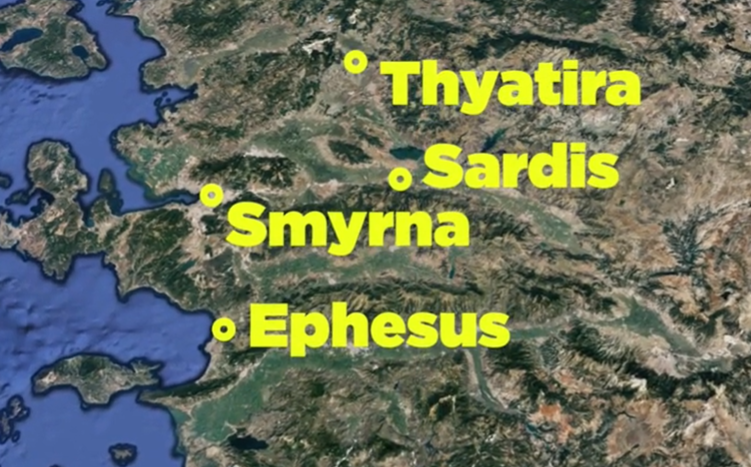

Sardis is about 17 miles south of Thyatira and 60 miles east of Smyrna.[^1]

[^1]: Image: Wayne Stiles, “Thyatira and Sardis-Keeping Far from Compromise,” *Walking the Bible Lands*, 2021, accessed March 5, 2022, https://www.walkingthebiblelands.com/products/walking-the-bible-lands/categories/4024473/posts/11298762 (subscription required).

The founding of Sardis likely dates to before the time of Abraham (c 2000 BCE). It was the ancient capital of the Lydian empire. Its patron deity was the Goddess Cybele, which in Greco-Roman times became Artemis/Diana, who was also the patron deity of Ephesus. Cybele's son was Midas, whom we may know as the one where everything he touched turned to gold. This is a great lesson in the need to think things through. Everything he touched, included things such as food. Before the Greek period, Sardis was rumored to have "gold-bearing sands."[^2] Historically, it was an extremely wealthy city all the way through New Testament times.

[^2]: Eli Lizorkin-Eyzenberg and Pinchas Shir, *Hebrew Insights from Revelation*, Jewish Studies for Christians, 2021, 85.

 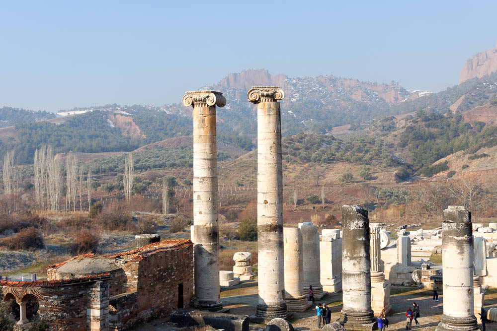

The temple to Diana was the fourth largest Ionic-style temple existing in the ancient world.[^3] There were eight massive columns on each end with 20 columns on each side. One of these columns is in the Metropolitan Museum of Art in New York. For scale, note the people on the ground in the photo.[^4] At one point, prior to it being excavated by archaeologists, the entire temple was underground, with just the columns sticking up out of the ground.

[^3]: Todd Bolen, *Sardis-2019*, vol. Western Turkey, Pictorial Library of Bible Lands, 2019, 8.

[^4]: Image: ibid., Western Turkey:27.

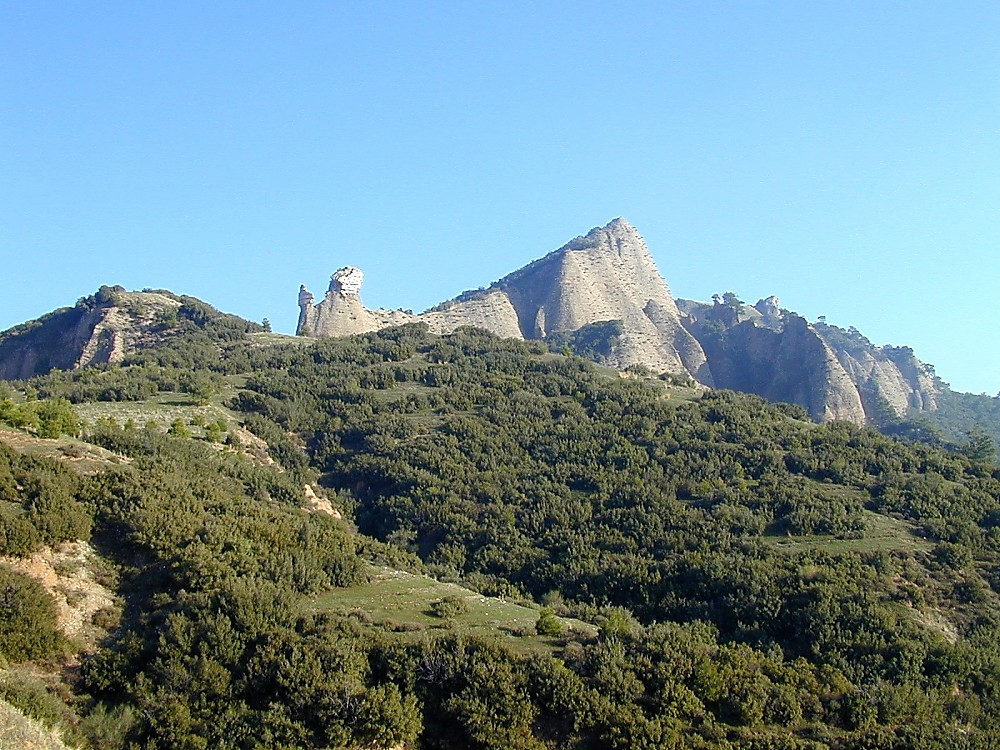

Like Pergamum, ancient Sardis sat atop a hill rising 1000 feet from the valley below.[^5] By appearances, it was impregnable. Geologically, the cliffs were predominately clay, which cracked and eroded. Egotistically, the citizens referred to their city as "Sardis the Impregnable," so did little to guard.[^6] One tradition holds that in 549 BCE, Cyrus was approaching with his Persian army. Only one person was designated to watch the one entrance up the cliff and that person fell asleep and dropped his helmet partway down the cliff. The Persians saw the man and the path he took were able to follow that same path to victory. Then in 214 BCE, a nearly identical thing happened. A man was asleep at his post, this time allowing Antiochus I and his Seleucid Greeks to take over. The city was conquered three other times during that period (501, 334, and 322). In the New Testament times, the city was devastated by a severe earthquake in 17 CE. We could say that they had a name that they were impenetrable but were very much vulnerable. Jesus appears to be drawing on this history when He says, "wake up!"

[^5]: Image: Todd Bolen, *Sardis-2019*, vol. Western Turkey, Pictorial Library of Bible Lands, 2019, 3.

[^6]: Lizorkin-Eyzenberg and Shir, *Hebrew Insights from Revelation*, 88.

#### Burial place of Gog?

 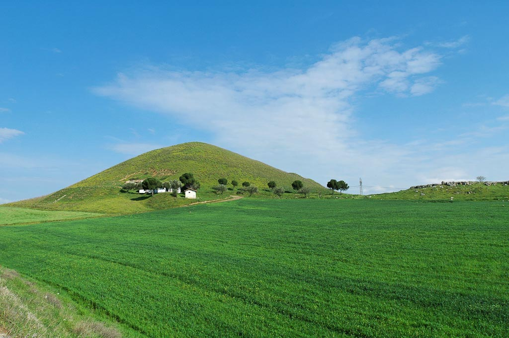

Eight miles north of Sardis are dozens of these burial mounds (called tumulus) dating from the 8th-6th centuries BCE. This is the mound of Gyges, the first king of Lydia (687-652 BCE), thought by many to be the biblical Gog from Ezekiel 39-39[^7]. We will meet Gog again in Revelation 20:8. "and will come out to deceive the nations that are at the four corners of the earth, Gog and Magog, to gather them for battle; their number is like the sand of the sea."

[^7]: Bolen, *Sardis-2019*, Western Turkey:146.

#### New Testament Period

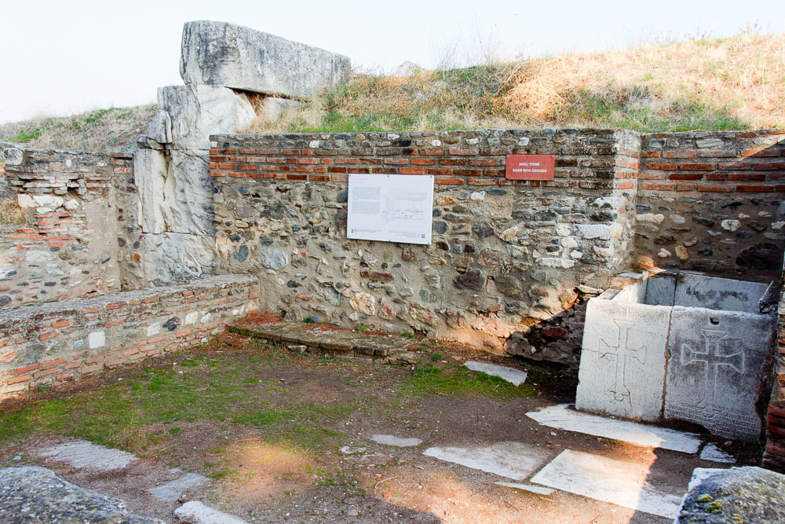

In contrast to Thyatira, archeologists have been able to uncover many findings at Sardis. Most date from the 2nd century through the Byzantine period. Stiles reports that along a street where 27 shops have been excavated, 10 of these belonged to Christians, clearly indicating integration into mainstream society. This is in remarkable contrast to the previous four cities we have studied, where persecution was expected. The photo shows what archaeologists believe to be a paint shop. The slabs with the crosses inscribed was a water basin.[^8]

[^8]: Image: ibid., Western Turkey:137.

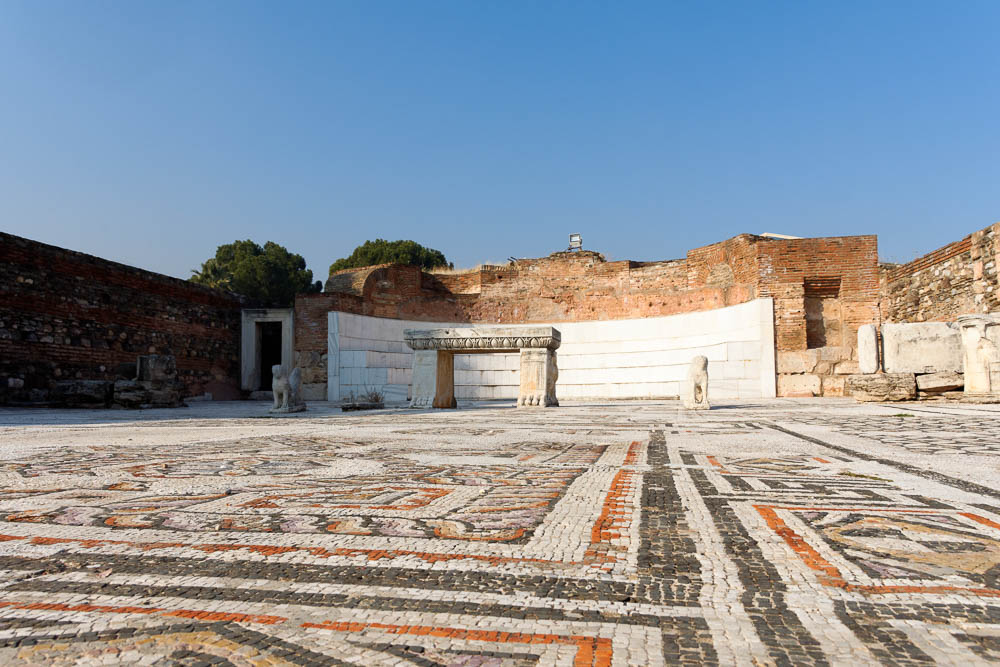

There is also a large, well-preserved Jewish synagogue that could accommodate 1000 people. This attests to a significant Jewish/Christian population. Bolen writes, "The approximately eighty inscriptions found…reveal that many Jews held high positions, serving on the city council or as wealthy citizens of Sardis."[^9][^10] 100 years earlier, Sardis was one of the first cities in the Empire that upheld the rights of Jews to be exempt from Emperor worship, so it appears the Jews held special favor here. For Gentiles, such worship was enforced here as it was everywhere in the Empire, yet as we saw, gentile Christians appear to have been as integrated into Sardis's society just as much as Jews were, and both groups were prosperous. Given this background, one of the dangers the letter to Sardis represents is apathy stemming from wealth and comfort. Keener states, "Despite the city's paganism, the Christian community seems to have experienced no persecution—and hence no spiritual life."[^11]

[^9]: Ibid., Western Turkey:83.

[^10]: Image: ibid., Western Turkey:95.

[^11]: Craig S. Keener, *The IVP Bible Background Commentary: New Testament*, 2nd edition (E-Sword). (Downers Grove, Illinois: IVP Academic, 2014), v. Rev 3:1.

#### Silver lining in Sardis letter?

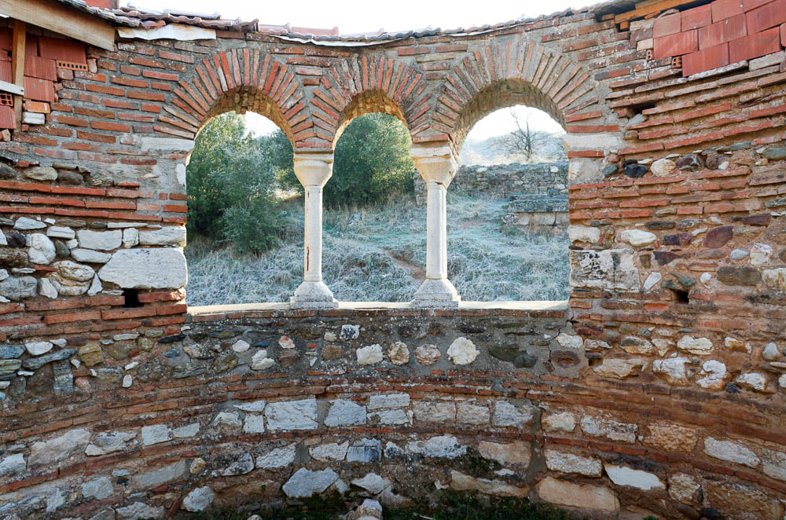

We do have one bit of potentially good news to report on Sardis from a spiritual perspective. There is a large basilica that was built right next to the temple of Artemis, as a testament that the gospel outlasted the false gods of Rome.[^12] Wayne stiles notes, "The ruins of this Christian building offer a model of hope of the Grace of God to all Christians who are struggling with compromise."[^13] Bolen adds, "Sardis remained a center of Christianity well into the 14th century."[^14] As Jesus will tell the Laodiceans, "Those whom I love, I reprove and discipline, so be zealous and repent" (Rev 3:19). Perhaps the longevity of the Church in Sardis is evidence that the believers there heeded Jesus' warnings.

[^12]: Image: Bolen, *Sardis-2019*, Western Turkey:41.

[^13]: Stiles, “Thyatira and Sardis-Keeping Far from Compromise.”

[^14]: Bolen, *Sardis-2019*, Western Turkey:5.

### To & From

| Revelation                                                                                                                                                | References                                                                                                                                                                                                                                                                                                                                                                                                                                                                                                                                                                                                                                                                                                                                                                                                                                                                                                   |
|-----------------------------------------------------------------------------------------------------------------------------------------------------------|--------------------------------------------------------------------------------------------------------------------------------------------------------------------------------------------------------------------------------------------------------------------------------------------------------------------------------------------------------------------------------------------------------------------------------------------------------------------------------------------------------------------------------------------------------------------------------------------------------------------------------------------------------------------------------------------------------------------------------------------------------------------------------------------------------------------------------------------------------------------------------------------------------------|
| (1) "To the angel of the Messianic Community in Sardis, write: 'Here is the message from the one who has the sevenfold Spirit of God and the seven stars: | Joh 15:26-27 “But when the Helper comes, whom I will send to you from the Father, the Spirit of truth, who proceeds from the Father, he will bear witness about me. (27) And you also will bear witness, because you have been with me from the beginning.   1Pe 1:10-12 Concerning this salvation, the prophets who prophesied about the grace that was to be yours searched and inquired carefully, (11) inquiring what person or time the Spirit of Christ in them was indicating when he predicted the sufferings of Christ and the subsequent glories. (12) It was revealed to them that they were serving not themselves but you, in the things that have now been announced to you through those who preached the good news to you by the Holy Spirit sent from heaven, things into which angels long to look.   Zechariah 4:6 Not by might, nor by power, but by my Spirit, says the LORD of hosts.    |

Unlike Thyatira, Sardis's meaning is well known. We may be familiar with the "sardius stone." This is what Sardis means. It is a reddish-yellow stone, which was the 1st stone on the 1st row of the breastplate of the high priest.

Jesus' description of himself (and remember the text does not directly tell us Jesus is talking; we infer it) is taken from chapter 1:20. He's holding all the churches in his hand. Missler, who is a proponent of the church age theory sees a deeper connection. In this theory, Sardis speaks of the Protestant Reformation. Most Protestant churches tend to be uncomfortable with the Holy Spirit. We know He is there, but if we were asked to write a description of the duties of the spirit, most of us wouldn't have much beyond "helper" (John 15:26). In fact, the topic of the Spirit is a cause of major division among Protestants. Conversely, there are some denominations who emphasize the spirit, perhaps to an excess.

#### Zechariah 4:1-10

In the book of Zechariah, the prophet receives several visions, including the one in Chapter 4 about the rebuilding of the 2nd temple, which is often called "Zerubbabel's temple." Zerubbabel was the heir to the Davidic throne and served as governor of Judah under the Persian king Darius I. He was not truly a king but more of an administrator. Many people assume that the Davidic line was broken at the time of the Babylonian captivity. They would be correct in the sense of that's when the Davidic kingship ended. Technically, the Davidic line continued upon the people's return, albeit in a weakened state, after the Babylonian captivity. Based on passages like Zechariah 4, some assumed Zerubbabel would be the promised Messiah. This obviously was not to be, and the Davidic line *did* stop with Zerubbabel as the next administrator after him was not of the royal line.

<small>Zechariah 4:1-10: And the angel who talked with me came again and woke me, like a man who is awakened out of his sleep. (2) And he said to me, “What do you see?” I said, “I see, and behold, a **lampstand all of gold, with a bowl** on the top of it, and **seven lamps** on it, with seven lips on each of the lamps that are on the top of it. (3) And there are two olive trees by it, one on the right of the bowl and the other on its left.” (4) And I said to the angel who talked with me, “What are these, my lord?” (5) Then the angel who talked with me answered and said to me, “Do you not know what these are?” I said, “No, my lord.” (6) Then he said to me, “This is the word of the LORD to Zerubbabel: **Not by might, nor by power, but by my Spirit, says the LORD of hosts**. (7) Who are you, O great mountain? Before Zerubbabel you shall become a plain. And he shall bring forward the top stone amid shouts of ‘Grace, grace to it!’” (8) Then the word of the LORD came to me, saying, (9) “The hands of Zerubbabel have laid the foundation of this house; his hands shall also complete it. Then you will know that the LORD of hosts has sent me to you. (10) For whoever has despised the day of small things shall rejoice, and shall see the plumb line in the hand of Zerubbabel. “**These seven are the eyes of the LORD**, **which range through the whole earth**.”</small>

We'll definitely have more to say about this passage as we progress through Revelation.

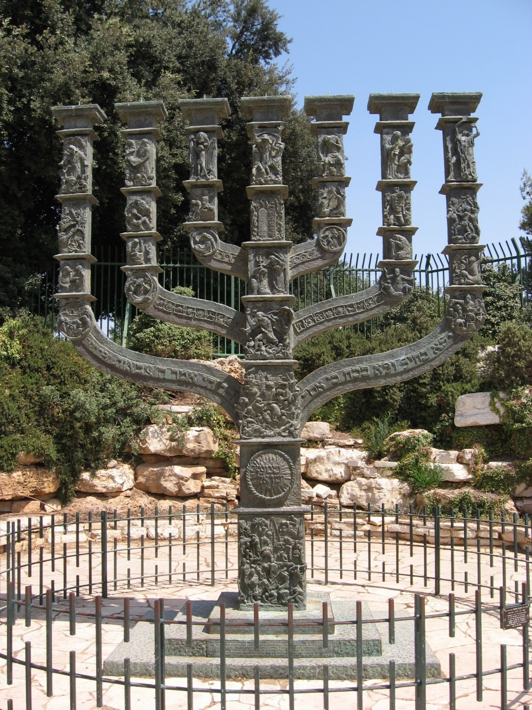

Whatever specifically was wrong with Sardis it is, of course, no accident that the Author of these letters in Revelation (who for simplicity we'll call Jesus) describes Himself as the one with the Sevenfold Spirit. Perhaps the people of Sardis were resting in their own accomplishments and had no use for the Holy Spirit.

We know from Chapter 1, Jesus' description has a connection to the Temple Menorah. The photo is from Jerusalem at the government building called the Knesset. At the Knesset, there is a large Menorah that has 29 separate reliefs showing the History of Israel, with Jacob and Rachael, to Moses, all the way to the Warsaw Ghetto uprising. Along the outer branches, reads:

>   לא בחיל ולא בכח כי אם־ברוחי אמר יי צבאות
>
> Zechariah 4:6: "not by might, nor by power but by my Spirit says Adonai Tzavaot." 

Jesus is reminding Sardis of this verse. Perhaps they were being fooled into thinking they had things under control in their own strength. We run this risk as well. Zechariah 4:6 is an important verse for all of us.

### No positives

Some commentators view "you have a name for being alive" as the positive. I suggest this statement is at all a positive because what good is having a good reputation if it's not really true under the surface? "You have a name for being alive" might be what we would call a backhanded compliment. Jesus knows that the so-called accolade is empty because it's not really true under the surface.

Therefore, I recommend the entire sentence, "I know what you are doing—you have a reputation/name for being alive, but in fact, you are dead" as the complete statement of judgment.

### Judgment

| Revelation                                                                                        | References                                                                                                                                                                                                                                                                                                                                                                                                                                                                                                                                                         |
|---------------------------------------------------------------------------------------------------|--------------------------------------------------------------------------------------------------------------------------------------------------------------------------------------------------------------------------------------------------------------------------------------------------------------------------------------------------------------------------------------------------------------------------------------------------------------------------------------------------------------------------------------------------------------------|
| (1) "I know what you are doing—you have a reputation for being alive, but in fact you are dead!   | 1 Sa 16:7 But the LORD said to Samuel, “Do not look on his appearance or on the height of his stature, because I have rejected him. For the LORD sees not as man sees: man looks on the outward appearance, but the LORD looks on the heart.”   Pro 21:2 Every way of a man is right in his own eyes, but the LORD weighs the heart.  Deu 12:8 “You shall not do according to all that we are doing here today, everyone doing whatever is right in his own eyes,  Jdg 17:6 In those days there was no king in Israel. Everyone did what was right in his own eyes.  |

This is the harshest criticism yet leveled at any of the cities and is only surpassed by Laodicea, the 7th and final letter. It is fitting that Laodicea and Sardis are the only two cities of the seven that are uninhabited today.[^15]

[^15]: Keener, *The IVP Bible Background Commentary*, v. Rev 3:1.

**Name/Reputation**

Like the Hebrew word שֵׁם, the Greek word ονομα (onoma) means not only your legal name but also your reputation. One can have a good name or a bad name. In Sardis' case, they appear to outsiders that they have it all together but deep down they were being hypocritical. Lizorkin speculates that, unlike the other churches we have studied, the believers in Sardis may have been wealthy. It is still true today that many people believe material wealth indicates blessing from God. We can conclude that the believers in Sardis were self-deceived. Perhaps these good deeds were financial gifts to others, for which the donors took pride. "They may have been behind much of the funding that the first-century followers of Jesus distributed to those in need."[^16]

[^16]: Ibid., 89.

**Dead**

Jesus doesn't just say they are sickly and need to get better; He says they are "dead." We can imagine that the people of Sardis believed themselves spiritually impregnable and put on a façade. They didn't know that Jesus who is amidst the churches was not fooled. He knows they are dead. There is good and bad news associated with this statement. The bad news is that if you are dead, there is nothing you can do to change your situation. The good news is that it helps to know someone who can do something about your situation. Jesus is in the resurrection business.

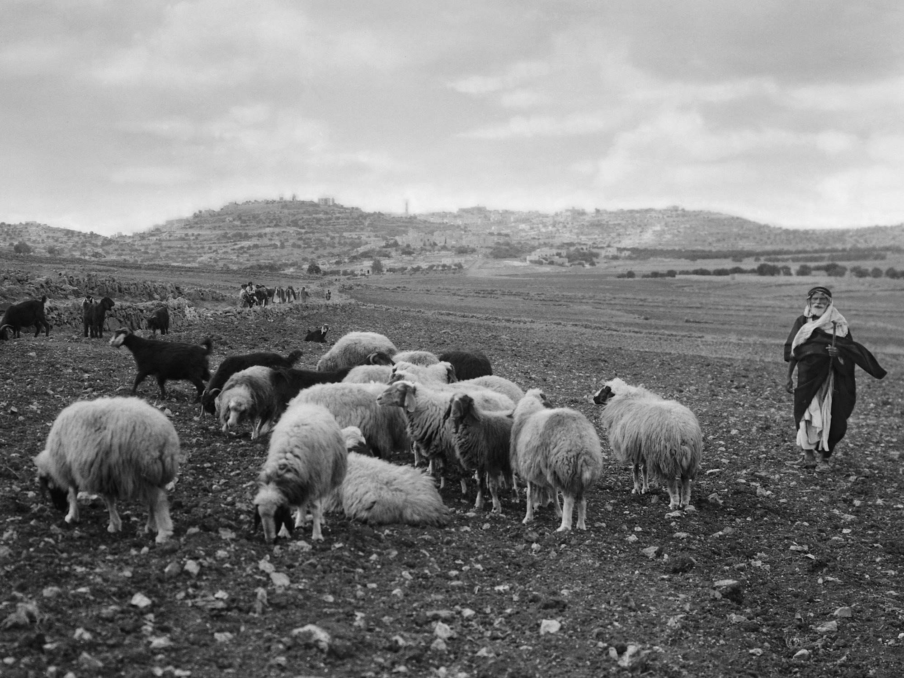

There are a number of verses in the Old Testament and New Testaments that speak to the fact that God knows a man's thoughts and expects inward purity, not just an outward pretense. We will look at a few of these below, but one example is 1 Samuel 16:7, where the prophet Samuel is seeking David. His father Jesse, doesn't even bother bringing David out. He's the youngest, and perhaps not as outwardly impressive as his older brothers. Samuel responds with the famous quote, "the LORD sees not as man sees. Man looks on the outward appearance, but the LORD looks on the heart."[^17]

[^17]: Image: Todd Bolen, *1 Samuel 16*, vol. 1 Samuel, Photo Companion to the Bible (Santa Clarita, CA, 2018), 30.

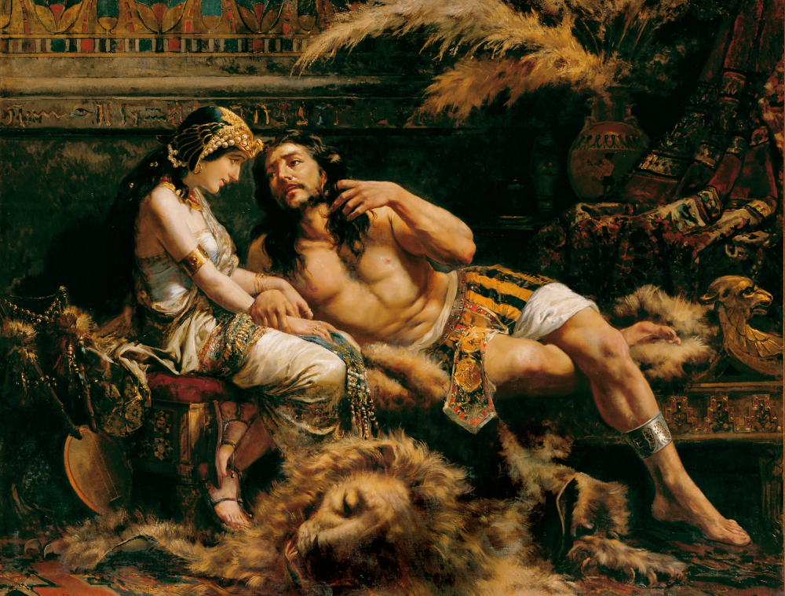

Related to this is the concept of doing what is right in our own eyes. We see this prohibited in Deuteronomy yet acted out repeatedly in the book of Judges. If we are not anchored to the King, we are apt to wander. When we wander, we can think we are on the right path, but actually, be hopelessly lost. Samson is a perfect example of this. He was called to be set apart for God, even taking a Nazirite vow to abstain from things that were otherwise permitted. In the same way, we might give something up for Lent today. It's a form of self-affliction or fast meant to draw us closer to God. Samson rejected all this in favor of doing whatever pleased him at the moment, all the while thinking he was right with God.[^18]

[^18]: Image: Todd Bolen, *Judges 17*, vol. Judges, Photo Companion to the Bible (Santa Clarita, CA, 2018), 40.

| Revelation                                                                                                                             | References                                                                                                                                                                                                                                                                                                                                                                                                                                                                                                                                          |
|----------------------------------------------------------------------------------------------------------------------------------------|-----------------------------------------------------------------------------------------------------------------------------------------------------------------------------------------------------------------------------------------------------------------------------------------------------------------------------------------------------------------------------------------------------------------------------------------------------------------------------------------------------------------------------------------------------|
| (2) Wake up, and strengthen what remains, before it dies too! For I have found what you are doing incomplete in the sight of my God.   | Joh 11:11 After saying these things, he said to them, “Our friend Lazarus has fallen asleep, but I go to awaken him.”    Mar 14:38 Watch and pray that you may not enter into temptation. The spirit indeed is willing, but the flesh is weak.”   Jas 1:22-24 But be doers of the word, and not hearers only, deceiving yourselves. (23) For if anyone is a hearer of the word and not a doer, he is like a man who looks intently at his natural face in a mirror. (24) For he looks at himself and goes away and at once forgets what he was like.  |

**Wake up and strengthen!**

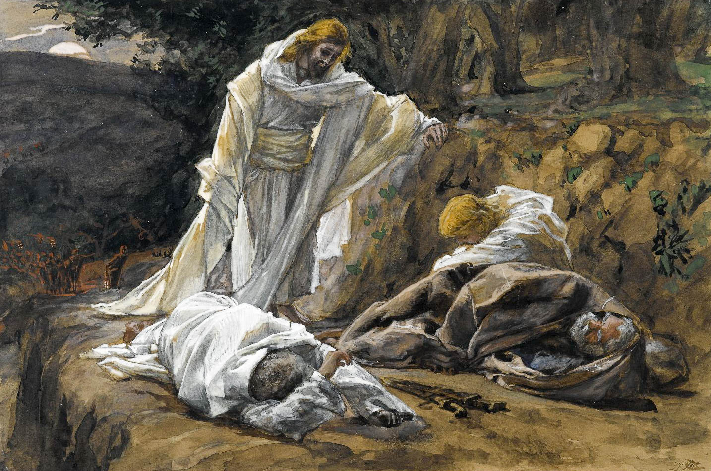

In Hebraic thought, to say that one "sleeps" could also denote death. Jesus saying, "wake up," could be akin to calling a dead Lazarus from the grave (and like Lazarus, apparently this church also "stinketh"). This is also the same Greek word He used in Mark 14:38 in the Garden of Gethsemane after he came upon the disciples literally sleeping.[^19] If you know anyone named "Greg", the name comes from this Greek word for watchful or vigilant.

[^19]: Image: “You Could Not Watch One Hour With Me, by James Tissot, circa 1890” in Todd Bolen, *Mark 14*, vol. Mark, Photo Companion to the Bible (Santa Clarita, CA, 2018), 129.

In either case, He's calling this church to get up. The work isn't finished yet.

Of course, with Sardis military history, they were literally asleep when they should have been keeping watch for enemies.

**Incomplete**

We mentioned previously that gentiles were still subject to the annual emperor worship requirement. We're speculating but perhaps their wealth curried favor with the Roman leadership. Were they able to buy their way out of the requirement? If so, the hypocrisy could involve the same types of mixing and corruption we saw in Pergamum and Thyatira. Jesus demands purity. Stern also notes that a hypocrite is also one whose doctrine may be exactly spot on, but otherwise live with a lack of faith and produce no fruit.[^20] Perhaps the believers in Sardis were missing Jesus by 18" (the distance from the head to the heart). Hence, this could be one application of "Incomplete in the sight of God." They were mixed every bit as much as Pergamum and Thyatira were.

[^20]: David H. Stern, *Jewish New Testament Commentary: A Companion Volume to the Jewish New Testament*, E-Sword edition. (Clarksville, Md.: Lederer Messianic Publications, 1992), v. Rev 3:1.

Another speculation is that they had fled serious study of God's Word (which, remember in the first century was the Old Testament only), in view of man-made doctrines and activities. At best, like James 1:22 says, they were hearers only, not doers. Sardis could speak of the church that has a Statement of Faith that no one could argue with but inside, replaces doing God's word with other religious activity that everyone assumes must be pleasing to God. James continues to say that such a person or such a church is not anchored in the reality of Scripture, or worse, they customize their own version of Scripture, which may be in direct conflict with what is actually written. "Not knowing Holy Scripture means we cannot know God's will for us. And if we do not know God's will, then we cannot do God's will."[^21]

[^21]: Tom Bradford, “Lesson 9 - Revelation 3 Cont.,” *Seed of Abraham Ministries, Inc*, accessed March 16, 2022, https://www.torahclass.com/bible-studies/new-testament-studies/1917-new-testament-revelation/2926-lesson-9-revelation-3-cont.

| Revelation                                                                                                                                                                                      | References                                                                                                                                                                                                                                                                                                                                                                                                                                                                                                                                                                                                                                                                                                                                                                                                                                                                                                                                                                                                                                                                                                                                                                                                                                                                                                                                                                                                                                                                                                                                                                                                                                                                       |
|-------------------------------------------------------------------------------------------------------------------------------------------------------------------------------------------------|----------------------------------------------------------------------------------------------------------------------------------------------------------------------------------------------------------------------------------------------------------------------------------------------------------------------------------------------------------------------------------------------------------------------------------------------------------------------------------------------------------------------------------------------------------------------------------------------------------------------------------------------------------------------------------------------------------------------------------------------------------------------------------------------------------------------------------------------------------------------------------------------------------------------------------------------------------------------------------------------------------------------------------------------------------------------------------------------------------------------------------------------------------------------------------------------------------------------------------------------------------------------------------------------------------------------------------------------------------------------------------------------------------------------------------------------------------------------------------------------------------------------------------------------------------------------------------------------------------------------------------------------------------------------------------|
| (3) So remember what you received and heard, and obey it, and turn from your sin! For if you don't wake up, I will come like a thief; and you don't know at what moment I will come upon you.   | Deu 6:3-9 Hear therefore, O Israel, and be careful to do them, that it may go well with you, and that you may multiply greatly, as the LORD, the God of your fathers, has promised you, in a land flowing with milk and honey.  (4) “Hear, O Israel: The LORD our God, the LORD is one.  (5) You shall love the LORD your God with all your heart and with all your soul and with all your might.  (6) And these words that I command you today shall be on your heart.  (7) You shall teach them diligently to your children, and shall talk of them when you sit in your house, and when you walk by the way, and when you lie down, and when you rise.  (8) You shall bind them as a sign on your hand, and they shall be as frontlets between your eyes.  (9) You shall write them on the doorposts of your house and on your gates.   Mat 24:42-43 So stay alert, because you don't know on what day your Lord will come. (43) But know this, that if the master of the house had known in what part of the night the thief was coming, he would have stayed awake and would not have let his house be broken into.    1Th 5:2 because you yourselves well know that the Day of the Lord will come like a thief in the night.    Rev 16:14-16 For they are demonic spirits, performing signs, who go abroad to the kings of the whole world, to assemble them for battle on the great day of God the Almighty. (15) (“Behold, I am coming like a thief! Blessed is the one who stays awake, keeping his garments on, that he may not go about naked and be seen exposed!”) (16) And they assembled them at the place that in Hebrew is called Armageddon.  |

**Remember what you received and heard, and obey!**

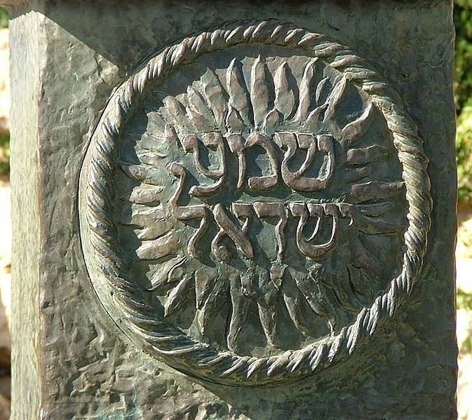

There could be any number of things Jesus was referring to when He said, "remember what you received and heard, and obey." Considering the enforced pagan worship, Lizorkin speculates that a logical assumption is the great Shema, in Deuteronomy 6:4 and following. This is the oath of allegiance to which the Apostle John would have followed and would have taught his Jewish and Gentile believers to follow. Again, the Shema speaks to the purity of worship God expects. Lizorkin writes, "Israel's God alone must be worshipped. For His worshippers, there can be no other Gods."[^22] In terms of what Jesus expected them to repent and turn towards, we need simply look back at Thyatira and remind ourselves of that great list of positives they received: Love, trust, service, and perseverance, and their last works were better than the first. The image says "Shema Israel" and is inscribed on the beautiful menorah at the Israeli Knesset. The Knesset is the "capitol hill" of Israel. The menorah depicts Israel's Biblical and modern history in a series of reliefs.[^23]

[^22]: Lizorkin-Eyzenberg and Shir, *Hebrew Insights from Revelation*, 91.

[^23]: Image: original version: SuperJewderivative work: Rabanus Flavus, *English: A Close-up Photo of the Shema Inscription on the Knesset Menorah in Jerusalem.*, June 12, 2005, Own work, accessed March 16, 2022, https://commons.wikimedia.org/wiki/File:Knesset_Menorah_Shema_Inscription.jpg.

Perhaps the existence of the physical church in Sardis through the 14th century is evidence that they heeded Jesus' words.

**Repent or I will come as a thief**

This stern judgment is, fortunately, accompanied by a call to repent and be resurrected. For those who fail to heed that call, He will return for the final judgment exactly like a thief strikes. More good news: He evidently does NOT come as a thief for those who repent. Coming as a "thief in the night" was the repeated downfall of Sardis. Sardis' acropolis was never taken by enemy force so much as it was yielded by apathy and inattention.

Jesus told MANY parables expressing this sentiment of being watchful and staying on task. We can broadly label them "man goes on a journey" parables. There are several variations (study Gospel Backgrounds with us to learn more!), but essentially, a man with wealth needs to go on a journey. He leaves a few of his hired hands or family members in charge of the business. He then returns unexpectedly and demands an immediate audit of the books. Depending on the parable, there are two groups: one group slacked off and did nothing, while the other was focused on the task. The former group is punished while those who grew the business were rewarded. The parable of the 10 Virgins in Matthew 25 is another variation on this theme. The groom goes away and returns unexpectedly. Five virgins are ready while the other five were not ready. Jesus will revisit the thief imagery in Revelation 16.

**Thief in the night vs thief in the day**

The Torah clearly promotes private property rights and prescribes penalties and remediation for theft or negligent loss of someone else's property. The right of people to defend themselves and their property from harm or theft is also attested. Sometimes this results in the slaying of the would-be thief. Lancaster notes that there are two different classifications in the Torah depending on whether the act happened at night or during the day.

Exo 22:2-3 If a thief is found breaking in and is struck so that he dies, there shall be no bloodguilt for him, (3) but if the sun has risen on him, there shall be bloodguilt for him. He shall surely pay. If he has nothing, then he shall be sold for his theft.

At night, the slaying of a thief is always assumed to be self-defense. The property owner has no way of knowing whether the thief is armed and dangerous. During daylight, the owner is expected to assess and grade the level of threat. Deadly force should only be used in the face of a deadly threat. In matters of excessive use of force, the property owner could be found guilty of murder if it was determined that he knew or should have known his life was not in immediate danger.

How does this relate to Yeshua saying, "I come as a thief?" During His first coming, Jesus was the "thief" metaphorically speaking who came in the daylight. He was murdered based on trumped-up charges and false accusations. His life was taken without proper diligence. This act resulted in blindness and judgment.

During His second coming, as he states repeatedly, He will come as a thief in the night. Unsuspecting people will not be ready. This is not to say Jesus is a thief worthy of death. Many times in the Gospels, He compares Himself or God the Father to all sorts of disagreeable characters (including a grumpy neighbor who reluctantly opens the door and a dishonest bookkeeper who fraudulently reduces his master's receivables) to make a point. If imperfect people do a certain thing, how much more will a perfect God make things right. If a dishonest thief comes at night and surprises the unsuspecting, how much more will the son of Man come in righteous judgment when the unsuspecting are not prepared (Mark 24:43).

### Secondary encouragement

| Revelation                                                                                                                                                      | References                                                                                                                                                                                                                                                                                                                                                                                                                                                                                                                                                                                                                                                                                                                                                                                                                                                                                                                                                                                                                                                    |
|-----------------------------------------------------------------------------------------------------------------------------------------------------------------|---------------------------------------------------------------------------------------------------------------------------------------------------------------------------------------------------------------------------------------------------------------------------------------------------------------------------------------------------------------------------------------------------------------------------------------------------------------------------------------------------------------------------------------------------------------------------------------------------------------------------------------------------------------------------------------------------------------------------------------------------------------------------------------------------------------------------------------------------------------------------------------------------------------------------------------------------------------------------------------------------------------------------------------------------------------|
| (4) Nevertheless, you do have a few people in Sardis who have not soiled their clothes; and they will walk with me, clothed in white, because they are worthy.  | Isa 61:10 I will greatly rejoice in the LORD; my soul shall exult in my God, for he has clothed me with the garments of salvation; he has covered me with the robe of righteousness, as a bridegroom decks himself like a priest with a beautiful headdress, and as a bride adorns herself with her jewels.   Rev 19:8 it was granted her to clothe herself with fine linen, bright and pure”— for the fine linen is the righteous deeds of the saints.  Ecc 9:8 Let your garments be always white. Let not oil be lacking on your head.    Isa_61:10 I will greatly rejoice in the LORD; my soul shall exult in my God, for he has clothed me with the garments of salvation; he has covered me with the robe of righteousness, as a bridegroom decks himself like a priest with a beautiful headdress, and as a bride adorns herself with her jewels.  Mat 23:27 “Woe to you, scribes and Pharisees, hypocrites! For you are like whitewashed tombs, which outwardly appear beautiful, but within are full of dead people's bones and all uncleanness. |

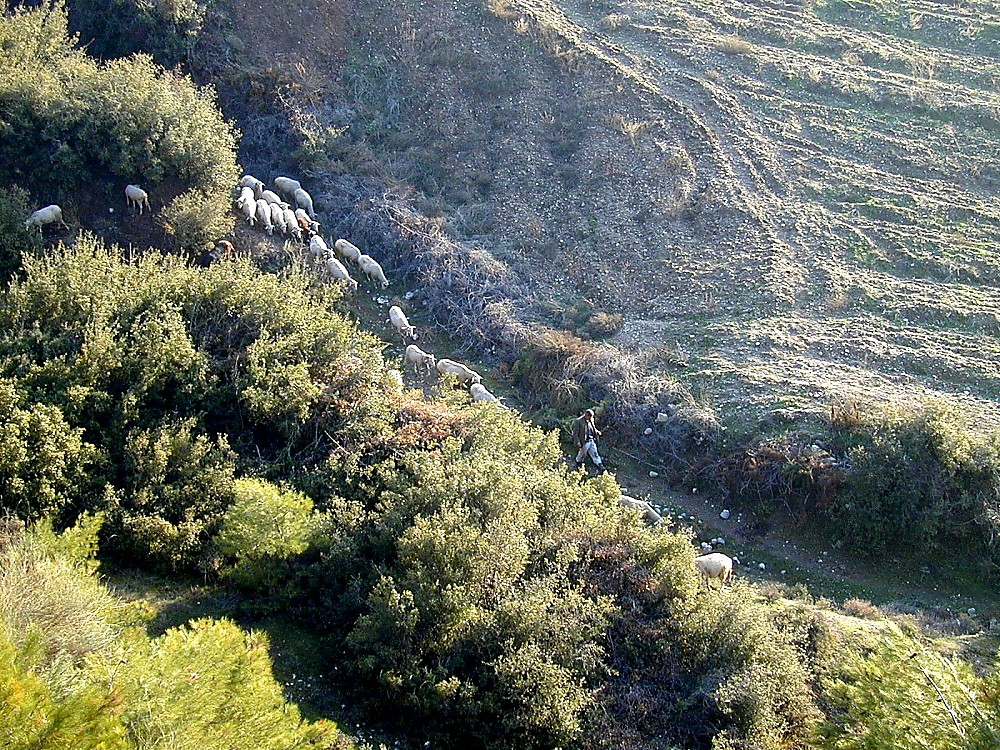

Evidence indicates that Sardis was known for its luxury textile and clothing trade, perhaps providing a local backdrop for verse 4.[^24] Themes of purity recur throughout the book of Revelation, which is symbolized by white clothing. The believers in Sardis may have thought they were wearing white, and may have appeared to others that they were wearing white, but to Jesus' eyes, they were soiled. Culturally, white robes were also worn by priests and sometimes worshippers of pagan deities.

[^24]: Photo: Bolen, *Sardis-2019*, Western Turkey:45.

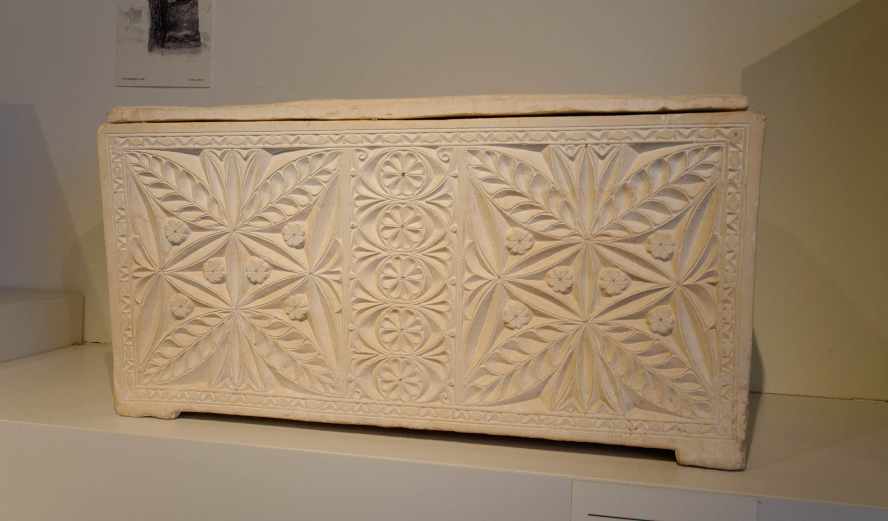

Jesus had a lot to say about pretentious external religiosity. In Matthew 23:27, Jesus states “Woe to you, scribes and Pharisees, hypocrites! For you are like whitewashed tombs, which outwardly appear beautiful, but within are full of dead people's bones and all uncleanness."[^25] During the days leading up to Jewish feasts where ritual purity was commanded, volunteers would mark gravesites with white paint. This was done so that celebrants didn't inadvertently come into contact and defile themselves. In context, the whitewash is actually calling attention to something unclean, so Jesus' comparison is all the more stinging. Jesus knew their works, just like He knows our works. When we study the Gospels, it is helpful to put ourselves in the shoes of everyone Jesus interacts with. In other words, we shouldn't point fingers at the scribes and the Pharisees. We should introspectively examine how you and I can be like whitewashed tombs.

[^25]: Image: Todd Bolen, *Matthew 23*, vol. Matthew, Photo Companion to the Bible (Santa Clarita, CA, 2018), 101.

### Promise to the overcomer/He who has an ear

| Revelation                                                                                                                                                                                                                                                                                                             | References                                                                                                                                                                                                                                                                                                                                                                                                                                                                                                                                                                                                                                                                                                                                                                                                                                                                                                                                                                                                                                                                                                                                                                                                                                                                                                                                                                                                                                                                                                                                                                                                                                                                                                                                                                                                                                                                                                                                                                                                                                                                                                                                                                                                                                                                                                                                                                           |
|------------------------------------------------------------------------------------------------------------------------------------------------------------------------------------------------------------------------------------------------------------------------------------------------------------------------|--------------------------------------------------------------------------------------------------------------------------------------------------------------------------------------------------------------------------------------------------------------------------------------------------------------------------------------------------------------------------------------------------------------------------------------------------------------------------------------------------------------------------------------------------------------------------------------------------------------------------------------------------------------------------------------------------------------------------------------------------------------------------------------------------------------------------------------------------------------------------------------------------------------------------------------------------------------------------------------------------------------------------------------------------------------------------------------------------------------------------------------------------------------------------------------------------------------------------------------------------------------------------------------------------------------------------------------------------------------------------------------------------------------------------------------------------------------------------------------------------------------------------------------------------------------------------------------------------------------------------------------------------------------------------------------------------------------------------------------------------------------------------------------------------------------------------------------------------------------------------------------------------------------------------------------------------------------------------------------------------------------------------------------------------------------------------------------------------------------------------------------------------------------------------------------------------------------------------------------------------------------------------------------------------------------------------------------------------------------------------------------|
| (5) He who wins the victory will, like them, be dressed in white clothing; and I will not blot his name out of the Book of Life; in fact, I will acknowledge him individually before my Father and before his angels.  (6) Those who have ears, let them hear what the Spirit is saying to the Messianic communities." | Exo 32:30-33 The next day Moses said to the people, “You have sinned a great sin. And now I will go up to the LORD; perhaps I can make atonement for your sin.”  (31) So Moses returned to the LORD and said, “Alas, this people has sinned a great sin. They have made for themselves gods of gold.  (32) But now, if you will forgive their sin—but if not, please blot me out of your book that you have written.”  (33) But the LORD said to Moses, “Whoever has sinned against me, I will blot out of my book.  Psa 69:27-28 Add to them punishment upon punishment; may they have no acquittal from you.  (28) Let them be blotted out of the book of the living; let them not be enrolled among the righteous.   Dan 12:1 “At that time shall arise Michael, the great prince who has charge of your people. And there shall be a time of trouble, such as never has been since there was a nation till that time. But at that time your people shall be delivered, everyone whose name shall be found written in the book.   Mal 3:16 Then those who feared the LORD spoke with one another. The LORD paid attention and heard them, and a book of remembrance was written before him of those who feared the LORD and esteemed his name.   Rev 20:12 And I saw the dead, great and small, standing before the throne, and books were opened. Then another book was opened, which is the book of life. And the dead were judged by what was written in the books, according to what they had done. Rev_20:15 And if anyone's name was not found written in the book of life, he was thrown into the lake of fire.   Rev 20:12 And I saw the dead, great and small, standing before the throne, and books were opened. Then another book was opened, which is the book of life. And the dead were judged by what was written in the books, according to what they had done. Rev_20:15 And if anyone's name was not found written in the book of life, he was thrown into the lake of fire.   Luk 12:8-9 “And I tell you, everyone who acknowledges me before men, the Son of Man also will acknowledge before the angels of God,  (9) but the one who denies me before men will be denied before the angels of God. Mat_26:75 And Peter remembered the saying of Jesus, “Before the rooster crows, you will deny me three times.” And he went out and wept bitterly. .  |

Ancient cultures had official rolls to which citizens could be added or erased,[^26] but likely more in view is the Jewish concept of the eternal book of life (see the Exodus, Daniel, and Malachi verses above). The Jewish holiday of Rosh HaShanah (also knows as the feast of trumpets, from Leviticus 23:24, which commands the shofar blown on this day) is literally the Jewish first of the year, i.e. new year's day on the Hebrew calendar. This begins a 10-period day of intense reflection and f repentance, leading up to the most solemn day of the year, Yom Kippur, the Day of Atonement (see Leviticus 16). On Rosh HaShana, Jews bless each other by saying, "may your name be inscribed in the book of life." In other words, the Book of Life is an entirely Jewish concept. In Exodus 32, Moses is willing to take the place of the people so their names would not be blotted out.

[^26]: Keener, *The IVP Bible Background Commentary*, v. Rev 3:5.

Not blotting out one's name can be problematic from an eternal security perspective. By a plain sense reading, for a name to be blotted out, it had to first be written.

More than debating that argument, we need to focus on what Jesus is saying to US personally. Do we think we are dressed in white when we may be soiled? Self-deception – thinking they were right with God when they really were not - is a recurring theme among the churches with judgments. Let us not be so smug as to think we are immune from this.

According to Malachi, the criteria for inscription in the Book of Life is straightforward. Fear the Lord with awe-filled reverence, and honor His name by being a worthy ambassador and talmid/disciple.[^27]

[^27]: Ronald Goldberg, “May Your Name Be Inscribed in the Book of Life? - All Pro Pastors,” September 20, 2017, accessed March 15, 2022, https://allpropastors.org/name-inscribed-book-life/.

**I will acknowledge him**

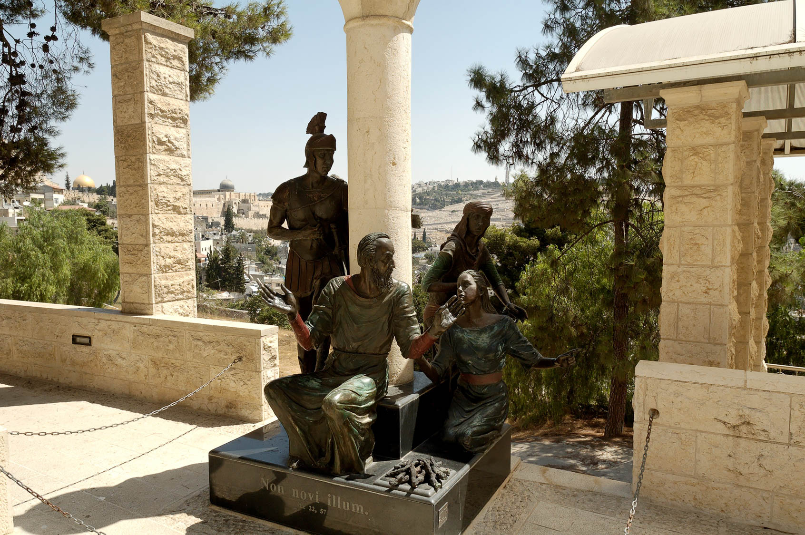

This statue is at the Church of St. Peter in Gallicantu, south of the Old City in Jerusalem.[^28] It depicts Peter with three of his accusers and Peter denying three times on the night Jesus was arrested. The Latin inscription at the base (Non novi illum) means “I do not know Him.”

[^28]: Image: Todd Bolen, *Matthew 26*, vol. Matthew, Photo Companion to the Bible (Santa Clarita, CA, 2018), 181.

We all need to be thankful for Peter's denial. At this location in Jerusalem, we remember that we ALL at some point in our lives have denied Him or otherwise have not represented Him in a way that is worthy of His sacrifice for us. So are all of us going to be denied by Jesus in Heaven? This is a scary proposition, but we have good news. We know from Peter's experience that Luke 12:9 is not necessarily an absolute truth. The general rule is "deny Me and I'll deny you," but we have a blessed exception. For this, we travel to another location in Israel.

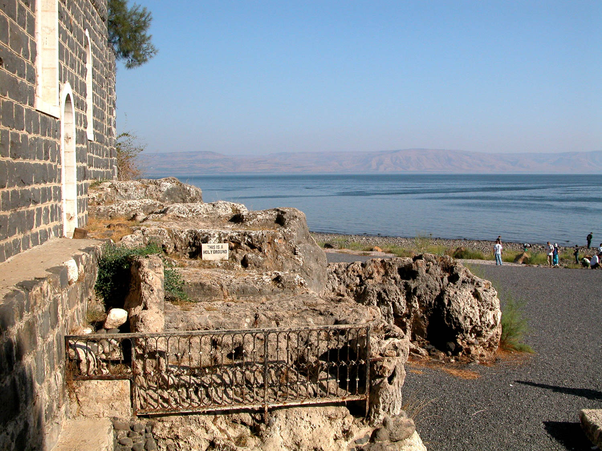

We travel to Tabgha in the Sea of Galilee, where we look at John 21 and Peter's restoration. [^29] Jesus asks Peter three times, "do you love me", one time for each denial. Jesus recommissions Peter's apostleship. This restoration allows us to go back to Luke 12:9 and if our hearts are broken about those times we deny Him, and we repent, He will restore us just as He did Peter at Tabgha. We, therefore, escape the judgment of Luke 12:9 and Revelation. Conversely, if a person's denial carries a nuance of willful unrepentance and defiance, it might be "game over."

[^29]: Image: Todd Bolen, *John 21*, vol. John, Photo Companion to the Bible (Santa Clarita, CA, 2018), 34.

This is one of the reasons, if not THE reason that makes Tabgha in Israel such a special place is that is where tradition tells us that Peter was restored in John 21. We call it "Restoration Beach." When I really mess up and let Him down, I go to that beach in my mind and receive His forgiveness and restoration. In fact, this is the theme running through all seven promises to the overcomer. To be an overcomer, we repent of our sins and let Jesus restore us to living in His will instead of ours.

### Conclusion

Sardis is a problem. Unlike Ephesus, Pergamum, and Thyatira, there were zero outward signs at Sardis that anything was wrong. There was no eating of prohibited food, evidently not having wild sex parties, nor were they comingling with paganism. It's clear the believers themselves thought they were right where God wanted them to be. They were deceived. This is a huge warning to us. Could we be similarly deceived? As we've noted previously, we must open our books for God's inspection. One thing as an auditor you have to prepare for when delivering your findings is the fact that sometimes management will push back during your exit report. They will argue with you that your findings are not that bad and present rationales supporting their position. Often this means they have deceived themselves that things are ok when they really are not ok. In contrast, astute managers will take even the slightest ding on an audit report very seriously and fix what may be a small problem, so that it does not become a big one. Let us be like that second group. These Seven Letters show that it's critically important that we see ourselves the way Jesus sees us. The letters also show that how we see ourselves is typically not reflective of the greater reality.

### Does it fit?

#### Church Age: Sardis = Protestant Reformation

The Greek word for "name, reputation" is ονομα (*onoma)* and the word "denomination" is linguistically related. Ονομα occurs three times in this brief letter. Protestants would view the Reformation as a tremendous force for good within the church as it corrected a number of errors and non-biblical corruptions. This also corresponded to the time frame where Guttenberg invented the movable type printing press (in 1455), which results in millions receiving and reading God's Word for themselves. So why would a church like Sardis, where nothing positive is mentioned, be a fit for the Protestant age in the 16th and 17th centuries? There are several suggestions made by different commentators. Ultimately, it's important to remember that the Church Age theory is not in the Bible, so it's open to much speculation.

Missler suggests two reasons. First, the reformation did nothing to correct amillennial theology and the error of interpreting passages symbolically that were meant to be interpreted literally. The letter to Sardis states explicitly that He is returning and they better be ready. But the church that doesn't believe He is coming back will not be ready. In this respect, they are like the group of workers in the "man goes on journey" parables who did nothing to prepare for the Master's return.

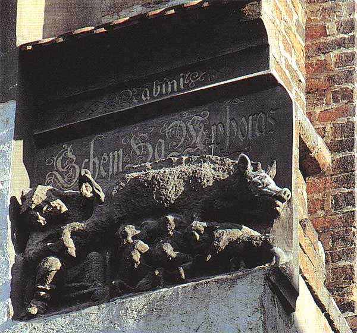

Second, the Reformation did nothing to correct replacement theology. Luther claimed to cite Romans, but Romans contains the passages that state in no uncertain terms that God is not done with Israel. In his earlier years, Luther appears to have been favorably disposed to Jews because he thought his teachings would lead them to recognize their messiah. When this failed, Luther published some wildly antisemitic papers, that Lutherans don't like to talk about. The photo is what is called a "judensau" that depicts Jews doing unspeakable things with a pig. Of course, pigs are considered unclean animals to Jews. Like we said previously, Pork is not unclean food. To a Jew, pork is not food at all.

Surely a godly man such as Luther would have denounced this disgusting attack, let alone one that adorns a church building, right? Wrong! Here is what Luther proudly said, "Here on our church in Wittenberg a sow is sculpted in stone. Young pigs and Jews lie suckling under her. Behind the sow a rabbi is bent over the sow, lifting up her right leg, holding her tail high and looking intensely under her tail and into her Talmud, as though he were reading something acute or extraordinary." God said to Abraham in Genesis 12 "I will bless those who bless you, and I will curse those who curse you." I think Luther and other protestant anti-Semites are on the wrong side of that equation. Let US not be!

Korman adds that the error with both Pergamum and Thyatira was that they were state churches.[^30] The Reformation did nothing to untangle this web. Formerly Catholic state churches now became Protestant state churches. Calvin essentially ran the City of Geneva. He was also virulently anti-Semitic and is recorded as executing people he did not agree with.

[^30]: Baruch Korman, *Revelation Chapter 3 Part 1*, 2015, accessed February 10, 2022, https://vimeo.com/135168951.

As we mentioned earlier, some proponents of various flavors of Protestantism seem more interested in winning an argument than in saving souls. Missler used to say that Christians are the only group he's aware of who form their firing squads in circles. How do we think Jesus would react to this constant intellectual debating? My wife and I had an experience early in our marriage where a pastor from one branch of historic Protestantism proudly said "we aren't in fellowship with them," referring to another branch of that same denomination. This is not to say that we shouldn't hold firm on positions of doctrine, particularly in modern times when many denominations are embracing anti-biblical positions. Yet at the same time, there is a definite lack of love, faith, service, and patient endurance with one another (Rev 2:19) that is palpably absent.

There is one joke first told in 1980s, that has earned the title "funniest religious joke of all time." It is a funny, yet sad indictment of the Sardis church, and particularly the Protestant church in America:

Once I saw this guy on a bridge about to jump. I said, "Don't do it!" He said, "Nobody loves me." I said, "God loves you. Do you believe in God?"

He said, "Yes." I said, "Are you a Christian or a Jew?" He said, "A Christian." I said, "Me, too!

Protestant or Catholic?" He said, "Protestant." I said, "Me, too!

What franchise?" He said, "Baptist." I said, "Me, too!

Northern Baptist or Southern Baptist?" He said, "Northern Baptist." I said, "Me, too!

Northern Conservative Baptist or Northern Liberal Baptist?" He said, "Northern Conservative Baptist." I said, "Me, too!

Northern Conservative Baptist Great Lakes Region, or Northern Conservative Baptist Eastern Region?" He said, "Northern Conservative Baptist Great Lakes Region." I said, "Me, too!"

Northern Conservative Baptist Great Lakes Region Council of 1879, or Northern Conservative Baptist Great Lakes Region Council of 1912?" He said, "Northern Conservative Baptist Great Lakes Region Council of 1912." I said, "Die, heretic!" And I pushed him over.[^31]

[^31]: Emo Philips, “The Best God Joke Ever - and It’s Mine!,” *The Guardian*, last modified September 29, 2005, accessed March 15, 2022, http://www.theguardian.com/stage/2005/sep/29/comedy.religion.

#### Parables: Sardis = Treasure in the field

| Matthew 13:44                                                                                                                                                                  | Meaning                                                                                                                                                                                                                                                                                                                                                                                                                                                                                                                     |
|--------------------------------------------------------------------------------------------------------------------------------------------------------------------------------|-----------------------------------------------------------------------------------------------------------------------------------------------------------------------------------------------------------------------------------------------------------------------------------------------------------------------------------------------------------------------------------------------------------------------------------------------------------------------------------------------------------------------------|
| Mat 13:44 “The kingdom of heaven is like treasure hidden in a field, which a man found and covered up. Then in his joy he goes and sells all that he has and buys that field.  | A double sense- We could say Sardis is the treasure for whom Jesus gave up everything, but we ALL are the treasure for whom Jesus gave everything. A second meaning is that Jesus is the treasure Sardis had taken and buried so that no one could find it. They had head knowledge, but it didn't manifest into loving God exclusively. The strongest adherents to reformation theology often want to win arguments about this position or that position, instead of realizing that we are all sinners in need of saving.  |

#### Paul: Sardis = Romans

-   Luther cited Romans frequently - it's the definitive statement on Christian doctrine
-   It also mentions "death" 24x and "dead" 16x - more than in any other book of Paul's
    -   Used both of Christ's death and the unbeliever's dead state
    -   Sardis shows it is possible to call oneself a believer and still be dead
-   Romans speaks to a right understanding of our position in Christ and towards each other, yet many of these were left undone by the Reformers
    -   Position of Israel - Romans 9-11
    -   Position of Gentiles with respect to Israel -Romans 11
    -   Do not judge other believers who may not think exactly as you do - Romans 14
    -   Appeal to avoid divisions - Romans 16

Again, we believe Sardis had a happy ending. Their church endured into the 14th century, well into the second Islamic period. This suggests that they took Jesus' judgments seriously and claimed the promises in Romans 8.

-   Rom 8:28-30 And we know that for those who love God all things work together for good, for those who are called according to his purpose. (29) For those whom he foreknew he also predestined to be conformed to the image of his Son, in order that he might be the firstborn among many brothers. (30) And those whom he predestined he also called, and those whom he called he also justified, and those whom he justified he also glorified.
-   Rom 8:37-39 No, in all these things we are more than conquerors ("overcomers") through him who loved us. (38) For I am sure that neither death nor life, nor angels nor rulers, nor things present nor things to come, nor powers, (39) nor height nor depth, nor anything else in all creation, will be able to separate us from the love of God in Christ Jesus our Lord.
