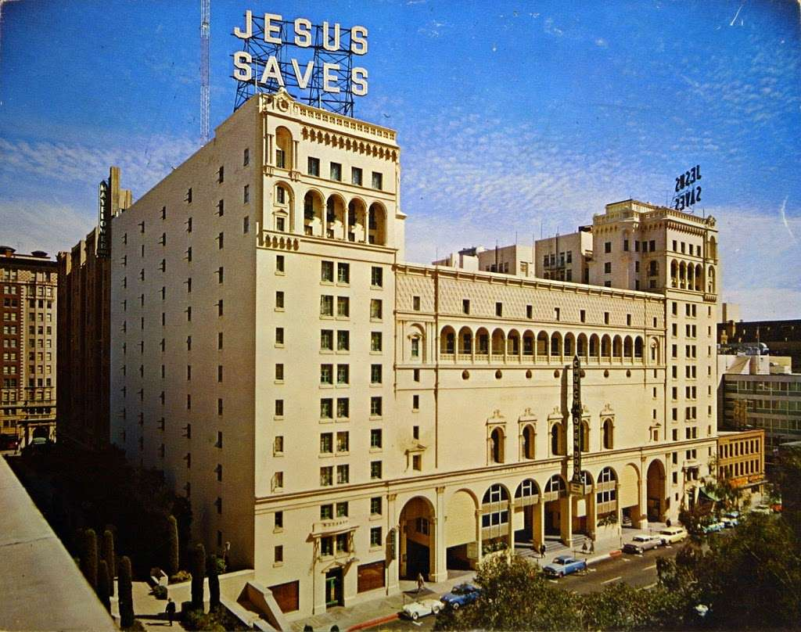
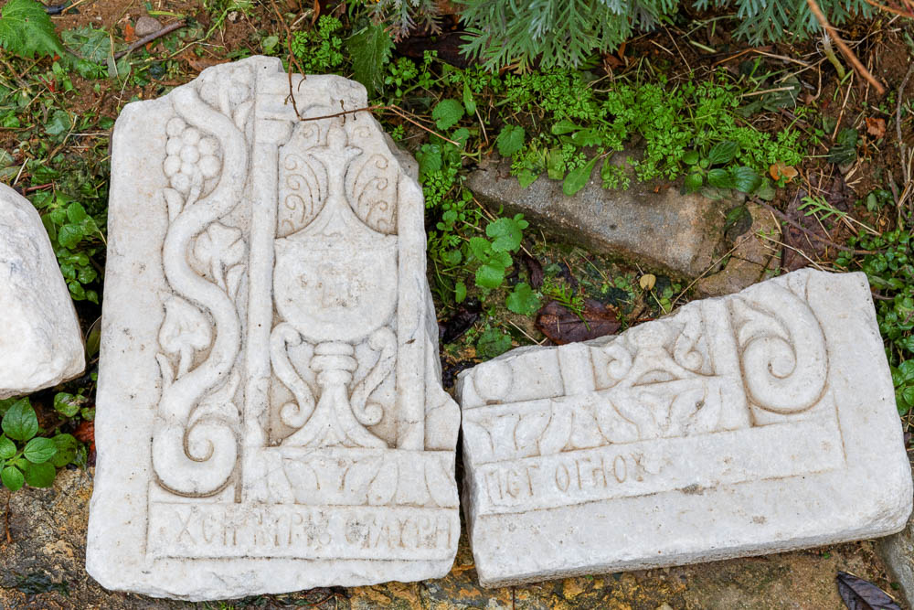
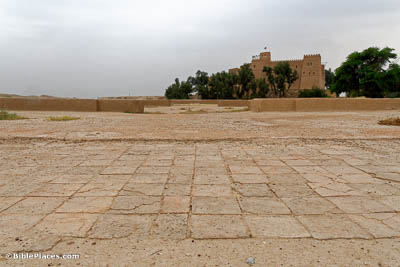
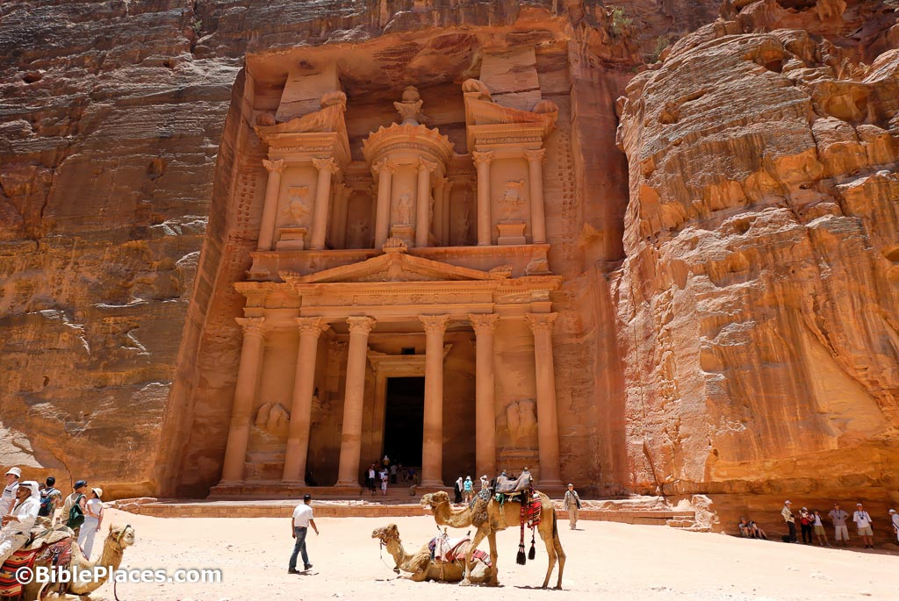
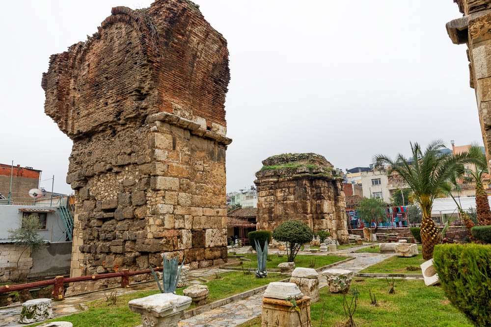



### Videos

Part I: Rev 3:7-9 | Historical background | Davidic Covenant | More on Synagogue of Satan



-----

Part II: Rev 3:10-12, Missionary church age | Pearl of Great Price | Thessalonians



### Read/hear the portion

| Revelation 3:7-13                                                                                                                                                                                                                                                                                                                                                                                                                                                                                                                                                                                                                                                                                                                                                                                                                                                                                                                                                                                                                                                                                                                                                                                                                                                                                                                                                             |
|-------------------------------------------------------------------------------------------------------------------------------------------------------------------------------------------------------------------------------------------------------------------------------------------------------------------------------------------------------------------------------------------------------------------------------------------------------------------------------------------------------------------------------------------------------------------------------------------------------------------------------------------------------------------------------------------------------------------------------------------------------------------------------------------------------------------------------------------------------------------------------------------------------------------------------------------------------------------------------------------------------------------------------------------------------------------------------------------------------------------------------------------------------------------------------------------------------------------------------------------------------------------------------------------------------------------------------------------------------------------------------|
| "To the angel of the Messianic Community in Philadelphia, write: 'Here is the message of HaKadosh, the True One, the one who has the key of David, who, if he opens something, no one else can shut it, and if he closes something, no one else can open it. (8) "I know what you are doing. Look, I have put in front of you an open door, and no one can shut it. I know that you have but little power, yet you have obeyed my message and have not disowned me. (9) Here, I will give you some from the synagogue of the Adversary, those who call themselves Jews but aren't—on the contrary, they are lying—see, I will cause them to come and prostrate themselves at your feet, and they will know that I have loved you. (10) Because you did obey my message about persevering, I will keep you from the time of trial coming upon the whole world to put the people living on earth to the test. (11) I am coming soon; hold on to what you have so that no one will take away your crown. (12) I will make him who wins the victory a pillar in the Temple of my God, and he will never leave it. Also, I will write on him the name of my God and the name of my God's city, the new Yerushalayim coming down out of heaven from my God, and my own new name. (13) Those who have ears, let them hear what the Spirit is saying to the Messianic communities." ' |

### Philadelphia Background

The ancient city of Philadelphia lies under the modern city of Alasehir, Turkey. The abundance of seismic activity tied with the city’s history has created a chaotic situation in relation to excavations. There have been few inscriptions found and almost no significant excavations have been attempted. The remains of the Byzantine Church of St. John the Theologian, built around AD 600, are the most substantial archaeological remains currently visible.[^1] Massive pillars suggest the 6th-century church was enormous.[^2] Archaeologists have also found evidence of a stadium, only a part of which is visible today.

[^1]: Todd Bolen, *Philadelphia-2019*, vol. 10: Western Turkey, Pictorial Library of Bible Lands (BiblePlaces.com, 2019), 11.

[^2]: Wayne Stiles, “Philadelphia - A New Name, a New You,” *Walking the Bible Lands* (blog" cap="" width="66%" style="float:right" >, 2021, https://www.walkingthebiblelands.com/products/walking-the-bible-lands/categories/4024473/posts/11443406.

Philadelphia is about 25-30 miles southeast of Sardis; it had the nickname "Gateway to the East" because of its access to trade routes, including commanding a junction on a Roman Road between Laidocea and Pergamum.[^3][^4] Through Philadelphia, "Hellenization" spread to the east. Hellenism sought to apply Greek manners and customs, first voluntarily, then forced. Missler sees this Hellenistic "missionary" activity as support for Philadelphia being a type of the missionary church age (1750-present).

[^3]: Bolen, *Philadelphia-2019*, 2019, 10: Western Turkey:3.

[^4]: Mark Wilson, “The Social and Geographical World of Philadelphia,” in *Lexham Geographic Commentary on Acts through Revelation*, ed. Barry J. Beitzel (Bellingham, WA: Lexham Press, 2019), 675.

Eumenes II, king of Pergamum, had a younger brother Attalus II, who reigned from 159-138 BC. The name means “lover of his brother” and refers to Attalus’s loyalty to his brother in refusing to overthrow him, even amidst encouragement from advisors to do so.[^5] In the same way, we believe the assembly of brothers and sisters in Philadelphia held fast in their loyalty to Jesus in the face of opposition.

[^5]: Todd Bolen, *Philadelphia-2019*, 2019, 3.

Unlike Sardis, possibly the oldest city among the seven, Philadelphia is the newest. The city's growth was impeded by frequent earthquakes, including those in 17 CE that severely damaged Sardis.

A possible local allusion in the Letter to Philadelphia is that the city's name was changed twice in the 1st century. At one point, it was named Neo Caesarea after emperor Tiberius, and then to Flavia Philadelphia, after the wife of Vespasian.[^6] Philadelphia is the name that stuck.

[^6]: Wilson, 679.

All cities of this time would have had enforced pagan worship. Zeus Helios and Anaitis, a person God related to Cybele and later, Artemis, were the patron deities. Temples and coins also featured Zeus, Dionysus, Aphrodite, Asclepius, Cybele, and Nike.[^7] Wilson states enforcement of the required Roman oath may have been especially strict here.[^8] Dionysus was an essential deity as grape production was an important industry. See the vineyards in the photo.[^9] "Many religious festivals were held at the temple to Dionysus."[^10] As a biblical type, wine is symbolic of marriage and celebration (cf. the Wedding at Cana), and by extension the Messianic Kingdom, also known as the marriage supper of the Lamb. There is a possible allusion to the vineyards of Philadelphia as being the church that will be ushered into the kingdom in the Age to Come.

[^7]: Wilson, “Philadelphia,” 679.

[^8]: Wilson, 680.

[^9]: Image: Bolen, *Philadelphia-2019*, 2019, 10: Western Turkey:37. Used by permission.

[^10]: Bolen, 10: Western Turkey:4.

Philadelphia is not attested to elsewhere in the New Testament. No remains of a synagogue have been found. Still, there was an inscription referencing a "synagogue of the Hebrews," and the legs of a table had menorahs and the four species of Sukkot (aka the Feast of Tabernacles) carved. Church tradition records that John appointed Demetrius as the city's first Bishop. Eleven Christians from Philadelphia were martyred with Polycarp in Smyrna around 156, which is interesting given the cities' connection as the only two churches of the seven that had no condemnation. Like Sardis, the Church at Philadelphia held out until the 14th century, including withstanding sieges by the Turkish armies on two occasions. They held fast until about 1390, when they were finally driven out by the Islamic Ottoman Turks. There are a few Christian assemblies there today.

### Rev 3:7 To Philadelphia

| Revelation                                                                                                                                                                                                                                                        | References                                                                                                                                                                                                                                                                                                                                                                                                                                                                                                                                                                                                                                                                                                                                                                                                                                                                                                                                                                                                                                                                                                                                                                                                                                                                                                                                                                                                                                                                                                                                                                                                                                                                                                                                                                                                                                                                                                                                                                                                                                                                                                                                                                                                                                                                                                                  |
|-------------------------------------------------------------------------------------------------------------------------------------------------------------------------------------------------------------------------------------------------------------------|-----------------------------------------------------------------------------------------------------------------------------------------------------------------------------------------------------------------------------------------------------------------------------------------------------------------------------------------------------------------------------------------------------------------------------------------------------------------------------------------------------------------------------------------------------------------------------------------------------------------------------------------------------------------------------------------------------------------------------------------------------------------------------------------------------------------------------------------------------------------------------------------------------------------------------------------------------------------------------------------------------------------------------------------------------------------------------------------------------------------------------------------------------------------------------------------------------------------------------------------------------------------------------------------------------------------------------------------------------------------------------------------------------------------------------------------------------------------------------------------------------------------------------------------------------------------------------------------------------------------------------------------------------------------------------------------------------------------------------------------------------------------------------------------------------------------------------------------------------------------------------------------------------------------------------------------------------------------------------------------------------------------------------------------------------------------------------------------------------------------------------------------------------------------------------------------------------------------------------------------------------------------------------------------------------------------------------|
| (7) "To the angel of the Messianic Community in Philadelphia, write: 'Here is the message of HaKadosh, the True One, the one who has the key of David, who, if he opens something, no one else can shut it, and if he closes something, no one else can open it.  | Lev 19:2 “Speak to all the congregation of the people of Israel and say to them, You shall be holy, **for I the LORD your God am holy**.   Isa 47:4 Our Redeemer—the LORD of hosts is his name— is the **Holy One of Israel**.  **Joh 14:6** Jesus said to him, “I am the way, and **the truth**, and the life. No one comes to the Father except through me.   1 Jn 5:20 And we know that the Son of God has come and has given us understanding, so that we may **know him who is true**; and we are **in him who is true**, in his Son Jesus Christ**. He is the true God and eternal life**.   Isa 22:20-22 In that day I will call my servant Eliakim the son of Hilkiah, (21) and I will clothe him with your robe, and will bind your sash on him, and will commit your authority to his hand. And he shall be a father to the inhabitants of Jerusalem and to the house of Judah. (22) And I will place on his shoulder the **key of the house of David**. He shall open, and none shall shut; and he shall shut, and none shall open.  Luk 1:31-35 And behold, you will conceive in your womb and bear a son, and you shall call his name Jesus. (32) He will be great and will be called the Son of the Most High. And the Lord God will give to him the **throne of his father David,** (33) and he will reign over the house of Jacob forever, and of his kingdom, there will be no end.” And Mary said to the angel, “How will this be since I am a virgin?” (35) And the angel answered her, “The Holy Spirit will come upon you, and the power of the Most High will overshadow you; therefore the child to be born will be called **holy**—the Son of God.  Mat 16:19 I will give you the **keys of the kingdom of heaven**, and whatever you bind on earth shall be bound in heaven, and whatever you loose on earth shall be loosed in heaven.”    Act 15:15-18 And with this the words of the prophets agree, just as it is written, (16) “‘After this, I will return, and I will rebuild the tent of David that has fallen; I will rebuild its ruins, and I will restore it, (17) that the remnant of mankind may seek the Lord, and all the Gentiles who are called by my name, says the Lord, who makes these things (18) known from of old.’ (Quoting Amos 9:11-12 and referencing Isaiah 16:5)  |

The Holy One (as a show of respect, observant Jews will typically say, "the Holy One, blessed be He") typically refers to God the Father, yet here it would seem to be speaking of Jesus. We can see many verses speak of God as Holy, or the Holy One, and True.

In Isaiah 22, Eliakim was given the Key of David. Eliakim was a servant of Hezekiah. For Him to be given the Key of David meant that Eliakim had the authority to act with the full and legal authority of Hezekiah. In the same way, we can infer that the Father gave the Key of David to Jesus, meaning Jesus acts on the Father's full authority. Again we see an example of John 1. The Bible tells us Jesus is with God, meaning distinct from the Father, and Jesus is God, meaning inseparable. (John 1:1). We know that Jesus also shares these keys with Peter in Matthew 16:19.

The "Tent of David" from Acts 15 may also be in view. Lizorkin explains, "The prophets of old imagined a time when the house of David would be open to all the nations of the earth. The ultimate Davidic servant of God would rule over them in justice and righteousness. The (open door) welcomes gentile followers of the Jewish Christ into the tent of David."[^11] Boaz Michael from the ministry First Fruits of Zion has written a book on this subject called "The Tent of David: Healing the vision of the messianic gentile." He describes the Tent of David as "the apostle's dream of a unified expression of faith in which Jew and Gentile worship the God of Abraham together and serve Him in the redemption of the world."[^12] Based on the reference in Acts 15, Michael argues that this was the goal for gentiles in the early church, but we've gotten off-track by erasing the Jewishness of Jesus from our faith. Interestingly, he says that Baptists and non-denominational evangelical churches (essentially Baptist churches without the title) are the closest among the protestant divisions to realize this vision.[^13]

[^11]: Eli Lizorkin-Eyzenberg and Pinchas Shir, *Hebrew Insights from Revelation*, Jewish Studies for Christians, 2021, 98.

[^12]: Boaz Michael, *Tent of David: Healing the Vision of the Messianic Gentile* (Marshfield, Mo.: First Fruits of Zion, 2013). Back cover.

[^13]: Michael, 189.

Scholars are divided on whether these represent the same keys as in Rev 1:18. If we take the words literally, these are not the same keys; however, either way, the keys refer to authority over eternal life.

#### Davidic Covenant

"David," in this context, typically refers to the House of David, i.e., the Davidic kingdom. Christians may miss the Jewishness of Gabriel's prophecy to Mary in Luke 1. This refers to what we call the "Davidic Covenant" in 2 Samuel 7.

<small>
2 Sa 7:8-16 Now, therefore, thus you shall say to my servant David, ‘Thus says the LORD of hosts, I took you from the pasture, from following the sheep, that you should be prince over my people Israel. (9) And I have been with you wherever you went and have cut off all your enemies from before you. And I will make for you a great name, like the name of the great ones of the earth. (10) And I will appoint a place for my people Israel and plant them, so that they may dwell in their place and be disturbed no more. And violent men shall no longer afflict them, as formerly, (11) since I appointed judges over my people Israel. And I will give you rest from all your enemies. Moreover, the LORD declares that the LORD will make you a house. (12) When your days are fulfilled, and you lie down with your fathers, I will raise your offspring after you, who shall come from your body, and establish his kingdom. (13) He shall build a house for my name, and I will establish the throne of his kingdom forever. (14) I will be to him a father, and he shall be to me a son. When he commits iniquity, I will discipline him with the rod of men, with the stripes of the sons of men, (15) but my steadfast love will not depart from him, as I took it from Saul, whom I put away from before you. (16) And your house and kingdom shall be made sure forever before me. Your throne shall be established forever.’”
</small>
  

This passage is an excellent reminder of how difficult it can be for us to interpret unfulfilled prophecy. If we were living in 700 BCE, we would read this and say, "This is talking about the line of Solomon and his descendants, including our wonderful king Hezekiah. This line will go on forever." If we lived in 550 BCE, we'd be in Babylon wondering what happened. Had God's word failed? Had we sinned so bad we forced God to break his promise? If we're followers of Jesus in the late 20s CE, we're wondering if this Jesus will be our political king who restores the throne of David, which will then continue forever? Today, with our hindsight, we can see that there STILL is no earthly king of David ruling from Jerusalem, but we believe we can confidently say that Jesus, not Solomon, is the son of David whose kingdom will be established. He was not the political king they were expecting, but He will return and establish His earthly throne and reign for 1000 years and then on into eternity. As we move into Chapter 4 and beyond, we need to keep in mind that, just as with the people living in 700 or 550 BCE, we may not have the right lenses available to us to say with absolute certainty what a still-to-be fulfilled prophecy exactly means.

Note a vital aspect of this prophecy. It is **unconditional**. God does not say, "**if** you do certain things, **then** I'll establish your throne." God promises the throne. Period. This matters because there are Christian commentators who say Israel has forfeited this promise because of their national rejection of Jesus as the Messiah. The unconditional promises to Israel now are spiritually given to the church. This theology goes by the name of "Replacement Theology" because it is said that the Church replaces Israel. The problem is that anyone who believes in Replacement Theology is calling God a liar. There is no other way to say it.

When Jesus literally returns, He will establish the literal Davidic Kingdom. This is called the "age to come," and in that respect, it is a reference to eternal life.

If these indeed *are* the same keys as in Revelation 1, then we would say this is also a reference to eternal life. The keys to death and Hades mean our eventual graves are not our final resting places.

### Rev 3:8 Praise/"I know."

| Revelation                                                                                                                                                                                              | References                                                                                                                                                                                                                                                                                                                                                                                                                                                                                                                                                                                                                                                                                                                                                                                                                                                                                                                                                                                                                                                                                                                                                                                                                                                                                                                                                                                                                                                                                                                                                                                           |
|---------------------------------------------------------------------------------------------------------------------------------------------------------------------------------------------------------|------------------------------------------------------------------------------------------------------------------------------------------------------------------------------------------------------------------------------------------------------------------------------------------------------------------------------------------------------------------------------------------------------------------------------------------------------------------------------------------------------------------------------------------------------------------------------------------------------------------------------------------------------------------------------------------------------------------------------------------------------------------------------------------------------------------------------------------------------------------------------------------------------------------------------------------------------------------------------------------------------------------------------------------------------------------------------------------------------------------------------------------------------------------------------------------------------------------------------------------------------------------------------------------------------------------------------------------------------------------------------------------------------------------------------------------------------------------------------------------------------------------------------------------------------------------------------------------------------|
| (8) "I know what you are doing. Look, I have put in front of you an open door, and no one can shut it. I know that you have but little power, yet you have obeyed my message and have not disowned me.  | Isa 25:6-8 On this mountain the LORD of hosts will make for all peoples a feast of rich food, a feast of well-aged wine, of rich food full of marrow, of aged wine well refined. (7) And he will swallow up on this mountain the covering that is cast over all peoples, the veil that is spread over all nations. (8) He will swallow up death forever; and the Lord GOD will wipe away tears from all faces, and the reproach of his people he will take away from all the earth, for the LORD has spoken.  Joh 10:7-9 So Jesus again said to them, “Truly, truly, I say to you, I am the door of the sheep. (8) All who came before me are thieves and robbers, but the sheep did not listen to them. (9) I am the door. If anyone enters by me, he will be saved and will go in and out and find pasture.  1 Cor 16:8-9 But I will stay in Ephesus until Pentecost, (9) for a wide door for effective work has opened to me, and there are many adversaries.  2 Cor 2:12 When I came to Troas to preach the gospel of Christ, even though a door was opened for me in the Lord,    Col 4:3 At the same time, pray also for us, that God may open to us a door for the word, to declare the mystery of Christ, on account of which I am in prison—    2 Cor 12:10 For the sake of Christ, then, I am content with weaknesses, insults, hardships, persecutions, and calamities. For when I am weak, then I am strong.    Joh 14:21 Whoever has my commandments and keeps them, he it is who loves me. And he who loves me will be loved by my Father, and I will love him and manifest myself to him.”  |

We have seen believers in most of the other churches compromise in some way, likely referring to participating in the Roman Imperial cult and its government-mandated worship procedures. Just because persecution is not explicitly referenced in Philadelphia, history tells us that it most likely was occurring. This is something to consider for all of us who want to believe we are a part of the church of Philadelphia today (and possibly where the church-age theory becomes quite strained, as there was no significant persecution in the late 1700s). In contrast, Jesus tells them they have "little power," meaning they likely were powerless to stop the persecution going on around them. Like Smyrna, Jesus tells them to hold fast to His message and His name.

Lancaster believes that saying "open door" is not specifically a "door of opportunity" but specifically refers to the open door of our tombs.[^14] He sees these as the same "Keys of death and hades" and believes Isaiah 22:22 also speaks of unlocking the key of the grave.

[^14]: Daniel Lancaster, “Key of David,” Text, *The Apocalypse of John* (blog), February 22, 2016, https://www.bethimmanuel.org/audio/key-david.

Modern evangelists view this as an "open door" to spreading the Gospel. This may not have been the meaning the original audience would have understood; however, this use of the word door is attested to in Paul's letters to the Corinthians and the Colossians. The application is valid.

J. Vernon McGee, one of my favorite Bible teachers, pastored the Church of the Open Door in downtown Los Angeles. It had a huge "Jesus Saves" neon sign that used to be visible from the Harbor Freeway. When I was a kid in the 70s and early 80s, my family would go to Dodger games and, as an unbeliever, in rebellion to God, I used to roll my eyes whenever I saw this sign. Now I love God, love J. Vernon Mcgee but hate the Dodgers.

There are specific themes in the Bible that recur. There are about 100 verses in the Bible that mention door, depending on your translation. If you have a software program and have some time, pull up all the verses containing "door." It's a fascinating read.

The allusion to the vineyards of Philadelphia may or may not have occurred to the local audience in this context. Still, all of Jesus' promises to the overcomers pertain to the fact that He grants them eternal life. We believe wine will be flowing at the Messianic Banquet. In Mark 14:25, Jesus states that He will not drink the Cup again until the new Kingdom comes.

### Rev 3:9 Judgment over/witness to false Jews

| Revelation                                                                                                                                                                                                                                                     | References                                                                                                                                                                                                                                                                                                                                                                                                                                                                                                                                                                                                                                                                                                                                                                                                                                                                                                                                                                                                                                                                                                                                                                                                                                                                                                                                                                                                                                                                                      |
|----------------------------------------------------------------------------------------------------------------------------------------------------------------------------------------------------------------------------------------------------------------|-------------------------------------------------------------------------------------------------------------------------------------------------------------------------------------------------------------------------------------------------------------------------------------------------------------------------------------------------------------------------------------------------------------------------------------------------------------------------------------------------------------------------------------------------------------------------------------------------------------------------------------------------------------------------------------------------------------------------------------------------------------------------------------------------------------------------------------------------------------------------------------------------------------------------------------------------------------------------------------------------------------------------------------------------------------------------------------------------------------------------------------------------------------------------------------------------------------------------------------------------------------------------------------------------------------------------------------------------------------------------------------------------------------------------------------------------------------------------------------------------|
| (9) Here, I will give you some from the synagogue of the Adversary, those who call themselves Jews but aren't—on the contrary, they are lying—see, I will cause them to come and prostrate themselves at your feet, and they will know that I have loved you.  | Is 49:23 Kings shall be your foster fathers, and their queens your nursing mothers. With their faces to the ground, they shall bow down to you and lick the dust off your feet. Then you will know that I am the LORD; those who wait for me shall not be put to shame.”   Isa 45:22-25 “Turn to me and be saved, all the ends of the earth! For I am God, and there is no other. (23) By myself I have sworn; from my mouth has gone out in righteousness a word that shall not return: ‘To me, every knee shall bow, every tongue shall swear allegiance.’ (24) “Only in the LORD, it shall be said of me, are righteousness and strength; to him shall come and be ashamed all who were incensed against him. (25) In the LORD all the offspring of Israel shall be justified and shall glory.”   Est 8:17 And in every province and in every city, wherever the king's command and his edict reached, there was gladness and joy among the Jews, a feast and a holiday. And many from the peoples of the country declared themselves Jews, for fear of the Jews had fallen on them.    Psa 72:10-11 May the kings of Tarshish and of the coastlands render him tribute; may the kings of Sheba and Seba bring gifts! (11) May all kings fall down before him, all nations serve him!  Php 2:10-11 so that at the name of Jesus every knee should bow, in heaven and on earth and under the earth, (11) and every tongue confess that Jesus Christ is Lord, to the glory of God the Father.  |

Following the typical seven letters outline, this is the section where we would expect a judgment; the part where Jesus says, "but I have this against you." This section is entirely omitted from the letter to Smyrna. In the letter to Philadelphia, it is not a judgment pronounced on that assembly. Because of their conduct and faithfulness, the Philadelphia assembly will SIT IN JUDGMENT over non-believers. Then, this is not a judgment of punishment but one of conviction and repentance in the spirit of brotherly love.

Another connection to Smyrna is that the letters to both churches contain the phrase, "Synagogue of Satan." We explored this phrase previously. To briefly recap, this could refer to Jews who are not upholding the high ethical standards required by Judaism, specifically by denouncing one's neighbor, whom God says to love. Indeed, there is some evidence that the Believers (Jewish and Gentile) in Smyrna and Philadelphia may have been excluded from the mainline Jewish population.[^15] It could also refer to the gentile satanic pseudo-salvific religion established by Rome. In that day, a synagogue was something we might call a town hall or a meeting place. It was not necessarily a Jewish religious gathering, although it later came to mean exactly that.

[^15]: Craig S. Keener, *The IVP Bible Background Commentary: New Testament*, 2nd edition (E-Sword) (Downers Grove, Illinois: IVP Academic, 2014), v. Rev 3:9.

Here, in 3:9, we are given the additional insight that those in this evil gathering will be made to bow before believers in Yeshua. Isaiah, Psalms, and Ezekiel all state that the pagan nations of the world will come bow before Israel, which, in my view, lends more credibility to the "Synagogue of Satan" being comprised of gentiles. Isaiah 45:25 states that all the offspring of Israel shall be justified.

Esther is also a great book. It describes a plot by Haman, who tricks the king into sending out an order to slaughter all the Jews in Persia. Little does he know the new favored queen Esther is Jewish, and she has the King's full attention. She skillfully approaches the King and turns the tables on Haman. The law of the day was that the King couldn't directly rescind the first order, but he could counter it in a sense by allowing Jews to protect themselves. The photo above is from the palace where Esther would have presented herself to the King.

Haman even had ordered gallows built for a specific group of Jews that he hated, including Mordecai, Esther's older cousin. Esther 7 is where all this unfolds. Ester had arranged a banquet for the King and Haman, where she turned the tables on Haman. The king was so furious he had to step outside to cool down at one point. He returns to find Haman begging for his life from Esther, who was reclining on her couch. You can imagine what this scene looked like to the King when he returned. "Will he even assault the queen in my presence, in my own house?...So they hanged Haman on the gallows that he had prepared for Mordecai. Then the king's wrath abated" (Est 7:8, 10). What other people mean for evil, God will use for good. This is the kind of turn-around being spoken of in Rev 3:9.

God repeatedly professes His love for the Jewish people in BOTH testaments, including and we might say, especially through their times of rebellion and unbelief. The book of Esther occurred during the period of the Babylonian exile.

It can be challenging to reconcile this unique love for the Jewish people with Jesus' statement that "no man comes to the Father except through Me," except to say that both are true. To deny either one leads to a theological error. If we read Romans 11 carefully, God has not rejected unbelieving Jews in the same way that other unbelievers perish (Rom 11:1, 11. It sounds crazy, but maybe there are three categories: the saved believers in Yeshua, the unsaved gentiles, and the non-believing Jews, whom God will restore somehow. Hosea 1-2 describes a period of separation, where God gives Israel the name Lo Ammi, "not my people," but then He extends His mercy to say "ami-attah, you are my people" (Hosea 2:23).

Many of us are familiar with the verse, "The depth of the riches and wisdom and knowledge of God! How unsearchable are his judgments and how inscrutable his ways! For who has known the mind of the Lord, or who has been his counselor?” This comes from Roman 11:33,34, and contextually, Paul talks about what the ESV calls "the mystery of Israel's salvation."[^16] Romans 9-11 is a highly worthwhile study.

[^16]: This is the heading in the ESV Bible at Romans 11:25.

In any case, we should never read "synagogue of Satan" as an indictment against Judaism itself as a religion or the Jewish people. We must remember that the "church" in Philadelphia and all seven cities were at least 50% Jewish and possibly more like 70% or 80%.

If we hold to the church age theory, the letter to Philadelphia represents the missionary age from the 1700s to the 1900s. Curiously, this is the time when we saw the rise of many sects claiming to be the "True Israel," including Mormonism, Jehovah's Witnesses, Christian Science, and many others. As we've talked about repeatedly, Replacement Theology would suggest the church has become the true Israel. Could these be modern examples of "those who say they are Jews but are not" and truly are from the "assembly of the accuser"?

### Rev 3:10: Secondary encouragement

| Revelation                                                                                                                                                                 | References                                                                                                                                                                                                                                                                                                                                                                                                                                                                                                                                                                                                                                                                                                                                                                                                                                                                 |
|----------------------------------------------------------------------------------------------------------------------------------------------------------------------------|----------------------------------------------------------------------------------------------------------------------------------------------------------------------------------------------------------------------------------------------------------------------------------------------------------------------------------------------------------------------------------------------------------------------------------------------------------------------------------------------------------------------------------------------------------------------------------------------------------------------------------------------------------------------------------------------------------------------------------------------------------------------------------------------------------------------------------------------------------------------------|
| (10) Because you did obey my message about persevering, I will keep you from the time of trial coming upon the whole world to put the people living on earth to the test.  | Luk 21:20-21 “But when you see Jerusalem surrounded by armies, then know that its desolation has come near. (21) Then let those who are in Judea flee to the mountains, and let those who are inside the city depart, and let not those who are out in the country enter it,   Isa 26:18 we were pregnant, we writhed, but we have given birth to wind. We have accomplished no deliverance in the earth, and the inhabitants of the world have not fallen.   2 Pe 2:9 then the Lord knows how to rescue the godly from trials, and to keep the unrighteous under punishment until the day of judgment,    Zec 13:9 And I will put this third into the fire, and refine them as one refines silver, and test them as gold is tested. They will call upon my name, and I will answer them. I will say, ‘They are my people’; and they will say, ‘The LORD is my God.’"  |

Proponents of a pre-tribulation rapture would see this verse as proof that God will remove the faithful before things get too bad. This may or may not be what the text is saying. It could just mean that God will preserve His people through the judgment, as He did with Noah.

Luke 21 appears to be a blended prophecy with part referring to the destruction of the Temple in 70 CE and part referring to the end of days. Verses 20-24 talk about the times beginning with the first Jewish Revolt in 66. Church tradition holds that as the situation in Jerusalem was deteriorating and Rome was preparing for its siege of Jerusalem, believing Jews in the city recalled Jesus' instructions to get out and get out fast. They supposedly fled to the city of Petra in modern Jordan. The last part of the third Indiana Jones film where the building façade was carved into the cliff was shot in Petra.[^17]

[^17]: Photo: Todd Bolen, *Petra*, accessed March 24, 2022, https://www.bibleplaces.com/wp-content/uploads/2021/01/Petra-Kazneh-tb053008805.jpg Used by permission.

I generally would align with the Pre-trib view. One aspect that makes me uncomfortable is that it could lead to believers thinking we will escape persecution. This is likely an American/western viewpoint. In the rest of the world, the church knows way more about being persecuted than we do. We should not be so self-important as to think we will escape what most of the church has had to endure for the past 2000 years. As we studied at the beginning of our study in Revelation Backgrounds, apocalyptic literature was provided to comfort people during times of intense struggle and exile. We may not be delivered from death as much as we may be delivered *through* death. In any case, believers are in a much better position than non-believers.

The phrase "**people living on the earth**" is interesting. Connotatively it is used repeatedly, not to mean every person on earth, but a subset of those who have rejected the Lord. We could say these are people who have focused their goals on this world instead of concentrating on Eternal things. We mentioned in an earlier lesson how there are the goyim, and then there is Israel. While technically Israel is another nation along with Egypt, Syria, Turkey, and America, spiritually, Israel is to be set apart. Believers live and dwell upon the earth along with unbelievers, but spiritually we are not earth-dwellers.

**Put to the test** does appear to refer to God's judgment upon the earth. God is not willing that any should perish, but God is a God of justice at the end of the day. The rest of the book of Revelation is about the punishment; again, it is not punishment we need to worry about if we are His. Somehow, repentant believers need not fear this time, whether through rapture or some other form of protection and preservation.

#### Does the Great Tribulation Purify Israel?

Getting back to restoration of Israel discussion from above, where we mentioned a possible distinction between gentiles who reject Yeshua and Jews who reject Yeshua, Some view the Great Tribulation as simultaneously being God's wrath on an evil earth, as well as testing and purification for the non-messianic Jewish people to bring them to repentance. They base this on Zechariah 13:9: " **Zec 13:9** And I will put this third into the fire, and refine them as one refines silver, and test them as gold is tested. They will call upon my name, and I will answer them. I will say, ‘They are my people’; and they will say, ‘The LORD is my God.’" In his teaching on Genesis, Missler notes three groups of people. Those who perished in the flood, those who were preserved through the flood (Noah and his family), and those who were removed before the flood without dying (Enoch). It's an interesting theory. 

We'll have to wait and see whether it pertains to a pre-tribulation rapture. Again, it should never be used by Christians to be hateful of Jews.  The biblical position is that God has not changed his position on having a unique love for the Jewish people. How he will reconcile that with their present unbelief in Jesus is His decision, not mine or yours.

<small>Rom 11:25-36 Lest you be wise in your own sight, I do not want you to be unaware of this mystery, brothers: a partial hardening has come upon Israel until the fullness of the Gentiles has come in. (26) And in this way all Israel will be saved, as it is written, “The Deliverer will come from Zion, he will banish ungodliness from Jacob”; (27) “and this will be my covenant with them when I take away their sins.” (28) As regards the gospel, they are enemies for your sake. But as regards election, they are beloved for the sake of their forefathers. (29) For the gifts and the calling of God are irrevocable. (30) For just as you were at one time disobedient to God but now have received mercy because of their disobedience, (31) so they too have now been disobedient so that by the mercy shown to you they also may now receive mercy. (32) For God has consigned all to disobedience, that he may have mercy on all. (33) Oh, the depth of the riches and wisdom and knowledge of God! How unsearchable are his judgments and how inscrutable his ways! (34) “For who has known the mind of the Lord, or who has been his counselor?” (35) “Or who has given a gift to him that he might be repaid?” (36) For from him and through him and to him are all things. To him be glory forever. Amen.</small>

### Rev 3:11: I am coming soon

| Revelation                                                                                | References                                                                                                                                                                                                                                                                                                                                           |
|-------------------------------------------------------------------------------------------|------------------------------------------------------------------------------------------------------------------------------------------------------------------------------------------------------------------------------------------------------------------------------------------------------------------------------------------------------|
| (11) I am coming soon; hold on to what you have so that no one will take away your crown. | 2Ti 4:8 Henceforth, there is laid up for me the crown of righteousness, which the Lord, the righteous judge, will award to me on that day, and not only to me but also to all who have loved His appearing.   Jas 5:9 Do not grumble against one another, brothers, so that you may not be judged; behold, the Judge is standing at the door. |

There's a debate about whether many of these verses in Revelation 2-3 suggest a loss of salvation. Would God inscribe a name in a book, only to erase it because of some later rejection? If so, would this mean He is not omniscient? Because of John 10:28-29, I know I'm a man, and therefore I'm unable to snatch myself out of Jesus' AND the Father's hand. I don't believe I have that ability. With that said, I'm also not comfortable saying that the person who professes a faith that he or she later renounces, perhaps after decades of faithful service, is "once saved, always saved." I'm not willing to put myself in God's shoes. Like Pastor Chuck Smith used to say, "If you abide in Christ, you don't have to worry about eternal security."

There is another category that believers CAN forfeit, and this is what appears to be in view in verse 11. That category is rewards. While we can be fortunate we will not face the Judgment for unbelievers; we do have what is called the Bema Seat Judgment ahead of us. This is where God will evaluate our works AFTER we were saved. Missler liked to ask his audience, "are you saved? If so, what have you done with it?" We will be judged on the treasure we stored up in Heaven, how we have loved our neighbor, how effective we have been at being *talmidim¸*and how well we have raised up other *talmidim.* One of the rewards is a crown, referenced in 2 Timothy 4:8. Even if we believe it is impossible to forfeit salvation, it IS possible to forfeit rewards through poor choices. If the believers in Philadelphia started to cave to the pressure, they would risk losing their crowns of righteousness.

Paul often spoke of winning the race, which is a metaphor for finishing well and receiving a victor's crown. We should always be like Thyatira – our works today should be better than yesterday.

We often think we will be given a crown (hopefully!) at the Bema seat judgment. Note that they ALREADY HAVE their crowns. Are you and I living our lives for the kingdom such that we already have our crowns? If so, the warning is to keep holding on and continuing what we're doing. If not, every second we have breath is another opportunity to deny ourselves and live for Him.

As we mentioned in the historical introduction, Philadelphia held fast until the late 14th century.

### Rev 3:12-13: Promise to the Overcomer / Ears

| Revelation                                                                                                                                                                                                                                                                                                                                                                      | References                                                                                                                                                                                                                                                                                                                                                                                                                                                                                                                                                                                                                                                                                                                                                                                                                                                         |
|---------------------------------------------------------------------------------------------------------------------------------------------------------------------------------------------------------------------------------------------------------------------------------------------------------------------------------------------------------------------------------|--------------------------------------------------------------------------------------------------------------------------------------------------------------------------------------------------------------------------------------------------------------------------------------------------------------------------------------------------------------------------------------------------------------------------------------------------------------------------------------------------------------------------------------------------------------------------------------------------------------------------------------------------------------------------------------------------------------------------------------------------------------------------------------------------------------------------------------------------------------------|
| Rev 3:12-13 I will make him who wins the victory a pillar in the Temple of my God, and he will never leave it. Also, I will write on him the name of my God and the name of my God's city, the new Yerushalayim coming down out of heaven from my God, and my own new name. (13) Those who have ears, let them hear what the Spirit is saying to the Messianic communities." '  | 1Ki 7:21 He set up the pillars at the vestibule of the temple. He set up the pillar on the south and called its name Jachin, and he set up the pillar on the north and called its name Boaz.   Jer 1:18-19 And I, behold, I make you this day a fortified city, an iron pillar, and bronze walls, against the whole land, against the kings of Judah, its officials, its priests, and the people of the land. (19) They will fight against you, but they shall not prevail against you, for I am with you, declares the LORD, to deliver you.”   Isa 56:4-5 For thus says the LORD: “To the eunuchs who keep my Sabbaths, who choose the things that please me and hold fast my covenant, (5) I will give in my house and within my walls a monument and a name better than sons and daughters; I will give them an everlasting name that shall not be cut off.  |

The heavenly temple will be referenced in Revelation chapters 7, 11, 14, 15, and 16. Stern writes, "it is not surprising that its pillars will be believers."[^18]

[^18]: David H. Stern, *Jewish New Testament Commentary: A Companion Volume to the Jewish New Testament*, E-Sword edition (Clarksville, Md.: Lederer Messianic Publications, 1992), v. Rev 3:12.

![A picture containing building, grass, outdoor, rock Description automatically generate     

2Pillars at Church of Philadelpha

The later church building in Philadelphia erected these massive pillars, undoubtedly as a reference to Revelation 3:12.[^19]

[^19]: Image: Bolen, *Philadelphia-2019*, 2019, 20. Used by permission.

The Bible frequently refers to the faithful as various parts of a defensive stronghold. Probably most famously to Christians is Matthew 16, when Peter is given the keys and is told that the gates of hades will not prevail against the assembly. In Jeremiah 1, believers are as a fortified city, an iron pillar, and bronze walls, against which the enemies of God will not prevail. A pillar indicates power, as we saw with the massive columns at the Sardis temple of Artemis. And yes, these are phallic symbols in every sense. New York, Paris, London, Washington DC, and many other seemingly powerful cities all have phallic pillars as symbols, and that's not by accident. As we progress through Revelation, we will see what becomes of man's power system.

We've discussed the significance of one's name as equivalent to one's character. Here, the faithful will be inscribed the name of the Holy One (blessed be He). This is in direct opposition to the beast's followers taking on the beast's name/mark as a sign that they belong to him (Rev 13:17).

We can't read the Bible and not acknowledge that God (Father and Son) loves Jerusalem, meaning the city at 31.7683° N, 35.2137° E on a map. Although He loves it, it is tainted by sin and will be restored and made new one day. He loves you and me that way too. When we go to Jerusalem, we are struck by the conflict and tension until we realize it's a picture of us as simultaneously saint and sinner.

Before the "New Jerusalem" in Revelation 21, Jesus will rule for 1000 years from the current Jerusalem (Jeremiah 3:17). I highly encourage a scouting trip to Jerusalem so we know what we are getting ourselves into! To inscribe the name of a city signifies that those in Philadelphia will be citizens of that city.

To recap, there are four promises between verses 9 and 12:

1.  A witness to the Jews who say they are not (9)
2.  Be kept from the hour of trial (10) – see the "rapture" discussion in the church age section
3.  Overcomer becomes a pillar in the Millennial Temple (12)
4.  Overcomer receives the name of Father, the new name of the Son, and the name of Jerusalem (12)

Although we may be second-class citizens in this age, we will be first-class citizens in the age to come.

### Does it fit?

### Church age theory: Philadelphia = Evangelistic Church (1750-present)

Philadelphia and Laodicea highlight the possible defect of the church age theory. Although most proponents would assert that at least the last four churches if not all seven types of churches still exist today, we can infer that many of those commentators believe there are really only two churches. Philadelphia is the church of the true believers, in other words, the one the commentator attends. And Laodicea is the church everyone else attends. In other words, Laodicea is the church those who disagree with the commentator attend!

Philadelphia is seen as the age of the missionary church: the tremendous evangelical explosion that began in the mid-1700s (which coincided with the founding of the United States). However, there is little to connect the situation in the first-century city with this period in church history. There is nothing in the letter that overtly commends Philadelphia for its missionary outreach, save perhaps verse 9, where the church is a loving example to those who "say they are Jews but are not." On this point, Fructenbaum notes that this is the time when Jewish missions bore much fruit. He notes that by 1900, some 250,000 Jews became believers.[^20]

[^20]: Arnold Fruchtenbaum, *The Eschatology of the Visible Church, Part 1*, vol. 1, 2 vols., Eschatology and the Book of Revelation, 2020, https://ariel.instructure.com/courses/175/pages/module-number-3-video-presentation?module_item_id=7458 (subscription required).

Other than this, we have to piece together the fact that Philadelphia was established as an outpost to spread Hellenism and apply the "open door" references, perhaps not in a way Jesus intended them to be understood. In that sense, during the missionary period beginning with the 1700s, the gospel spread prolifically and, virtually, unhindered to the four corners of the earth. Every door was open. Today that door is closing.

Philadelphia is also viewed as the "raptured" church based on the reference to being kept from the time of trial. Because of these reasons, we all want to view ourselves as part of the church of Philadelphia, which is not a bad aspiration. Facetiously, I'd say that Smyrna might be in second place, but they were martyred. Who wants to be martyred when you can be raptured!

Conversely, we don't find anyone boasting that they are in the church of Laodicea. Missler notes, "Let us remember that each of the churches had a different perception of themselves that the Lord Himself had. How sobering to us in our own conceits."[^21]

[^21]: Chuck Missler, *The Book of Revelation Handbook* (Koinonia House, 2020), 91.

In any case, the theory holds that the Jezebel element of Thyatira, the dead element of Sardis, and just about everyone in Laodicea will go through the tribulation, but Philadelphia along with the believing fragments from Thyatira, Sardis, and Laodicea will be raptured.

I personally would love to be raptured. Imagine being taken out of this world with all its problems and persecutions, and then you get to be with Jesus! That sounds like a great deal!

Perhaps that's the problem. The doctrine of the rapture appeals to my flesh. If I were the enemy, would I want Christians thinking they were going to get the easy way out, perhaps to the point where they start coasting and not engaging with the church's mission? You bet I would.

Remember that an entire generation thought they understood the scriptures perfectly and had concluded that the Messiah was to be a political king, but they were wrong. As Missler would say, that should be sobering for us to the extent we think we know how unfulfilled prophecy will play out.

### Parables: Philadelphia = Pearl of Great Price (Mat 13:45-46)

Mat 13:45-46 “Again, the kingdom of heaven is like a merchant in search of fine pearls, (46) who, on finding one pearl of great value, went and sold all that he had and bought it.

Missler states, " Of all jewels, the pearl is the only one made by a living organism as a response to an irritation that has been introduced. It is then removed from its place of growth to become an item of adornment."

The fact that the pearl is removed from the oyster (a non-kosher sea creature) is seen as the pure church's removal from the gentile world prior to God's judgment upon the world, where they will become a pillar, an item of adornment.

We could also say as a pun, during the missionary age, the world was the church's oyster, though I don't think that's what the Holy Spirit had in mind 2000 years ago!

### Paul: Philadelphia = Thessalonians

Is there one of Paul's letters that contains no judgment but is one of encouragement and perseverance? Is there a letter that addresses the "coming of the Lord" head-on? Yes! That would be the books of 1st and 2nd Thessalonians.

The Thessalonian church was commended for its faith (1 Th 1:3) and positive example (1 Th 1:7). Paul commends them for being witnesses (2:10), good students (2:13), and persevering through suffering (2:14). 1 Th 4:13-18 is often considered the passage that supports a pre-tribulation rapture. 2 Th 2:1-12 describes the figure known as "the antichrist" and appears to say that some restraining force is preventing the antichrist, the man of lawlessness, from attaining his full power. Once that restraining force is removed, then the man of lawlessness will be unleashed. By putting together Revelation 3:10, the promise for the faithful to be kept from the hour of trouble, with 1 Th 4:17, the promise for those living at the time to be caught up in the clouds, and 2 Th 2:7, the statement that the lawlessness will remain secret until the restrainer is removed, we get the theory that the church is the restraining force. Removing that power simultaneously keeps believers from the hour of trouble while unleashing the man of lawlessness upon the earth.

Interestingly, 2 Thessalonians 2:2 references a fake letter implying that the believers had not been caught up and were entering the period of God's judgment. We don't know who sent this letter, but it could be an example of someone "saying they were Jews (like Paul) but were not." Missler sees this as evidence that the Thessalonians were concerned they had missed the rapture. Paul then explains about the restrainer and the man of lawlessness. Parenthetically, here is where I like to point out that grace is not the opposite of law. Lawless is the opposite of Law. The man of lawlessness wants you to think that Law and Grace are opposites!

Whether you believe in a pre-tribulation rapture, I encourage you to do Acts 17:11 research. In no case should this be interpreted as a license to coast. 2 Thessalonians 3 states this directly. We are not to be idle. We must take the whole counsel of God into view. Even if a pre-trib rapture is true, Jesus had many parables saying that He expects His faithful to be diligently going about the kingdom's work while He is away so that we are rewarded upon His return. A pre-trib rapture also does not mean we will be spared from persecution. We need only look at the church's history to see that this isn't true. Conversely, those of us in areas where there hasn't been persecution have been given a much greater opportunity for kingdom work. To whom much is given, much is required.

1Th 1:9-10 For they themselves report concerning us the kind of reception we had among you, and how you turned to God from idols to serve the living and true God, (10) and to wait for his Son from heaven, whom he raised from the dead, Jesus who delivers us from the wrath to come.

1Th 2:13 And we also thank God constantly for this, that when you received the word of God, which you heard from us, you accepted it not as the word of men but as what it is, the word of God, which is at work in you believers.

1Th 3:4 For when we were with you, we kept telling you beforehand that we were to suffer affliction, just as it has come to pass, and just as you know.

1Th 3:12-13 and may the Lord make you increase and abound in love for one another and all, as we do for you, (13) so that he may establish your hearts blameless in holiness before our God and Father, at the coming of our Lord Jesus with all his saints.

1Th 4:1-7 Finally, then, brothers, we ask and urge you in the Lord Jesus, that as you received from us how you ought to walk and to please God, just as you are doing, that you do so more and more. (2) For you know what instructions we gave you through the Lord Jesus. (3) For this is the will of God, your sanctification: that you abstain from sexual immorality; (4) that each one of you know how to control his own body in holiness and honor, (5) not in the passion of lust like the Gentiles who do not know God; (6) that no one transgress and wrong his brother in this matter, because the Lord is an avenger in all these things, as we told you beforehand and solemnly warned you. (7) For God has not called us for impurity, but in holiness.

1Th 4:15-17 For this we declare to you by a word from the Lord, that we who are alive, who are left until the coming of the Lord, will not precede those who have fallen asleep. (16) For the Lord himself will descend from heaven with a cry of command, with the voice of an archangel, and with the sound of the trumpet of God. And the dead in Christ will rise first. (17) Then we who are alive, who are left, will be caught up together with them in the clouds to meet the Lord in the air, and so we will always be with the Lord.

1Th 5:2-5 For you yourselves are fully aware that the day of the Lord will come like a thief in the night. (3) While people are saying, “There is peace and security,” then sudden destruction will come upon them as labor pains come upon a pregnant woman, and they will not escape. (4) But you are not in darkness, brothers, for that day to surprise you like a thief. (5) For you are all children of light, children of the day. We are not of the night or of the darkness.

2Th 1:5 This is evidence of the righteous judgment of God, that you may be considered worthy of the kingdom of God, for which you are also suffering—

2Th 2:15 So then, brothers, stand firm and hold to the traditions that you were taught by us, either by our spoken word or by our letter.

2Th 3:6 Now we command you, brothers, in the name of our Lord Jesus Christ, that you keep away from any brother who is walking in idleness and not in accord with the tradition that you received from us.

2Th 3:10 For even when we were with you, we would give you this command: If anyone is not willing to work, let him not eat.

 

