

 

### Read/hear the portion

| Revelation 3:14-22                                                                                                                                                                                                                                                                                                                                                                                                                                                                                                                                                                                                                                                                                                                                                                                                                                                                                                                                                                                                                                                                                                                                                                                                                                                                                                     |
|------------------------------------------------------------------------------------------------------------------------------------------------------------------------------------------------------------------------------------------------------------------------------------------------------------------------------------------------------------------------------------------------------------------------------------------------------------------------------------------------------------------------------------------------------------------------------------------------------------------------------------------------------------------------------------------------------------------------------------------------------------------------------------------------------------------------------------------------------------------------------------------------------------------------------------------------------------------------------------------------------------------------------------------------------------------------------------------------------------------------------------------------------------------------------------------------------------------------------------------------------------------------------------------------------------------------|
| "To the angel of the Messianic Community in Laodicea, write: 'Here is the message from the Amen, the faithful and true witness, the Ruler of God's creation: (15) "I know what you are doing: you are neither cold nor hot. How I wish you were either one or the other! (16) So, because you are lukewarm, neither cold nor hot, I will vomit you out of my mouth! (17) For you keep saying, 'I am rich, I have gotten rich, I don't need a thing!' You don't know that you are the one who is wretched, pitiable, poor, blind, and naked! (18) My advice to you is to buy from me gold refined by fire, so that you may be rich; and white clothing, so that you may be dressed and not have to be ashamed of your nakedness; and eye salve to rub on your eyes, so that you may see. (19) As for me, I rebuke and discipline everyone I love; so exert yourselves, and turn from your sins! (20) Here, I'm standing at the door, knocking. If someone hears my voice and opens the door, I will come in to him and eat with him, and he will eat with me. (21) I will let him who wins the victory sit with me on my throne, just as I myself also won the victory and sat down with my Father on his throne. (22) Those who have ears, let them hear what the Spirit is saying to the Messianic communities." ' "  |



------ 



-----



--------

### Laodicea Background

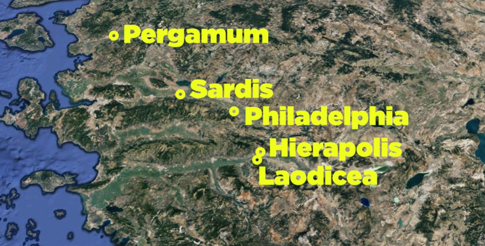

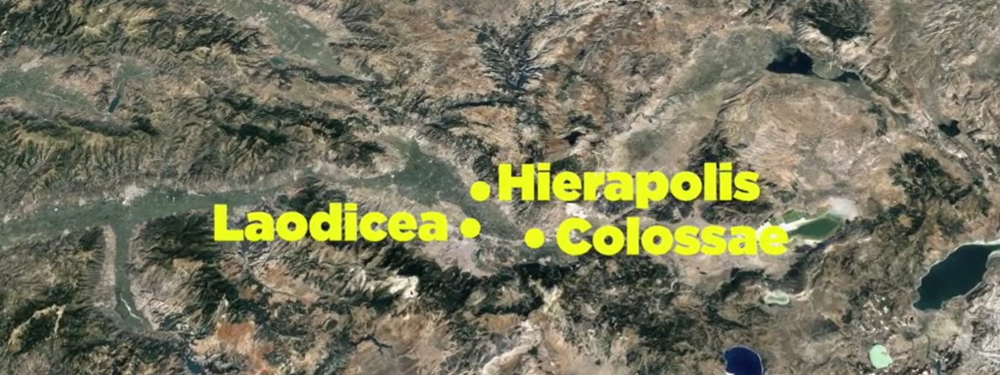

As you can see from the image above, Laodicea, Hierapolis, and Colossae were in very close proximity, and in terms of wealth and power, the cities formed the metroplex of their day. They are at the eastern end of the Meander River valley, with Miletus and Ephesus on the Western end of that valley. Therefore, it was a natural passageway to distribute goods to and from Ephesus. A second valley, the Lycus River valley, ran Northwest to Philadelphia or southeast to Syria. By the second century BCE, Laodicea became the wealthiest and most important of the three because it sat at the junction of these two valleys. The assembly in Laodicea was the furthest south and west of all the churches. After completing his circuit of bringing the letter to each of the seven assemblies (and likely others along the way), the human messenger would have likely returned to Ephesus.

The city was founded in the mid-200s BCE by Antiochus II, who named it after his wife, Laodice. Laodice combines the words for "the people" and "justice,"[^1] or "the people ruling." [^2] This is an interesting name because this is a church where God is on the outside knocking to get in. The Laodiceans were doing what was right in their own eyes. In terms of pronunciation, Greek would have a hard "c" (Lah-od-ik'-i-ah).

[^1]: Todd Bolen, *Laodicea-2018*, vol. Western Turkey, Pictorial Library of Bible Lands, 2018, 4.

[^2]: Arnold Fruchtenbaum, *The Eschatology of the Visible Church, Part 2*, vol. 1, 2 vols., Eschatology and the Book of Revelation, 2020, https://ariel.instructure.com/courses/175/pages/module-number-4-video-presentation?module_item_id=7458 (subscription required).

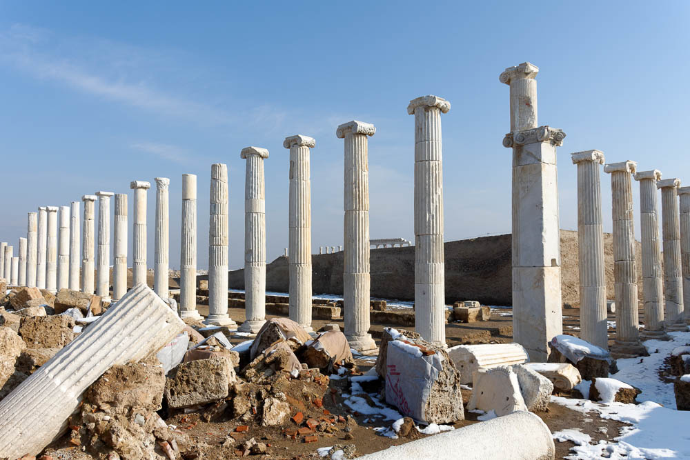

From a worldly perspective, the city almost had it all. The photo is from the Sacred Agora, one of the many commerce centers of the city.[^3] Many of its supposed strengths will be referenced in Revelation.[^4] According to God, concerning the assembly of believers, they are not strengths at all but weaknesses.

[^3]: Photo: Bolen, *Laodicea*, Western Turkey:92 Used by Permission.

[^4]: Cyndi Parker, “The Social and Geographical World of Laodicea,” in *Lexham Geographic Commentary on Acts through Revelation*, ed. Barry J. Beitzel (Bellingham, WA: Lexham Press, 2019), 689–90.

-   It was THE banking center of Asia with large stores of gold (and an adjunct industry of gold refiners)
    -   The assembly thinks they are rich, but they are spiritually poor
    -   Jesus offers HIS gold
-   Textile manufacturing and distribution, primarily black wool
    -   The assembly thinks they are clothed in righteousness, but they are naked
    -   Jesus offers HIS covering (white raiment versus black wool)
-   It was a medical center, specifical ophthalmology; Collyrium was an ingredient used in healing eye salves as well as cosmetics
    -   The assembly thinks they have clear vision, but they are spiritually blind
    -   Jesus, the Great Physician, offers HIS remedy: the Holy Spirit
-   Also, entertainment was everywhere; it had a large stadium and multiple theaters
    -   Unlike the actors and athletes who were adorned, the believers were wretched and pitiable
-   As with all cities, everything was dedicated to a false god
    -   Though not stated directly, the conclusion, given the previous six letters. is that the Laodiceans comfortably co-mingled paganism with worship of Jesus
    -   Metaphorically and probably literally, they were dining at the table with false gods in pagan temples, which are the throne rooms of those gods
    -   Jesus invites the believers to dine with Him and Him alone in His throne room and His alone

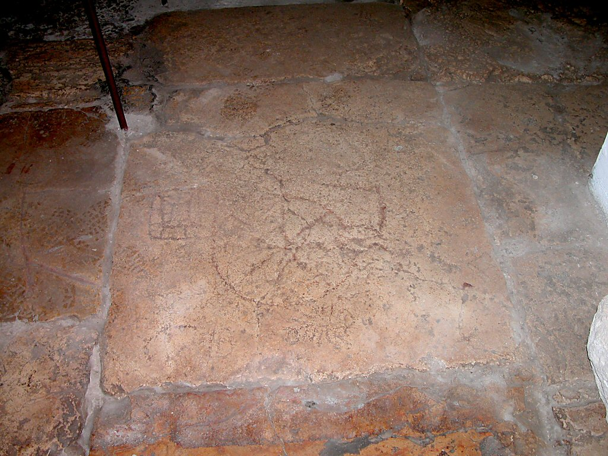
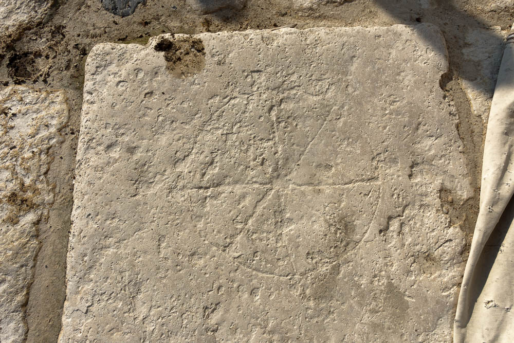
 
 In recent years, archeological work has uncovered many gates, buildings, pillars, inscriptions, and other findings, making it easy to visualize the city's wealth and prominence. The photo on the left shows a game board from Laodicea.[^5] The photo on the right shows a nearly identical inscription that was found on a stone in Jerusalem in the traditional location of the Stone Pavement.[^6] Some assert that it was the game used by the Roman soldiers when they cast lots for Jesus' clothing right before His crucifixion.

[^5]: Photo: Bolen, *Laodicea*, Western Turkey:65 Used by permission.

[^6]: Photo: Todd Bolen, *Via Dolorosa*, vol. 3. Jerusalem, Pictorial Library of Bible Lands, 2012, 16 Used by permission.

In Laodicea, there are also multiple Nymphaeum locations. A major street with ornate columns on either side ran through the heart of Laodicea. Over ½ mile has been excavated and reconstructed today. We believe it dates to 85 CE, so it would have been a street the believers frequented. The excavations are spectacular from an archaeological standpoint. We'll include a photo gallery supplement after this lesson.

The famous Roman philosopher Cicero lived here and cashed his letters of credit at the banks.[^7] The city was so wealthy that, after a significant earthquake in 60CE, Laodicea refused financial assistance from Rome to help rebuild.[^8] They had it covered. They didn't need anyone's help. Rome commended this gesture, but unfortunately, this attitude spilled over into the local congregation of believers.

[^7]: Bolen, *Laodicea*, Western Turkey:5.

[^8]: Wayne Stiles, “Philadelphia - A New Name, a New You,” *Walking the Bible Lands* (blog" width="66%" style="float:right" />, 2021, https://www.walkingthebiblelands.com/products/walking-the-bible-lands/categories/4024473/posts/11443406.

There is another record in 62 CE, Laodicea seized 20 pounds of gold that the city's Jewish population (this presumably would have included both believers and non-believers) had earmarked for the Temple in Jerusalem. This suggests an offering from 7000 Jews in the city. If we include family, the Jewish population could have been well over 20,000. One tractate of the Jewish Talmud speaks of the immense wealth of a sure Laodicea Jew.[^9]

[^9]: “Bava Metzia 84a,” accessed March 28, 2022, http://www.sefaria.org/Bava_Metzia.84a.

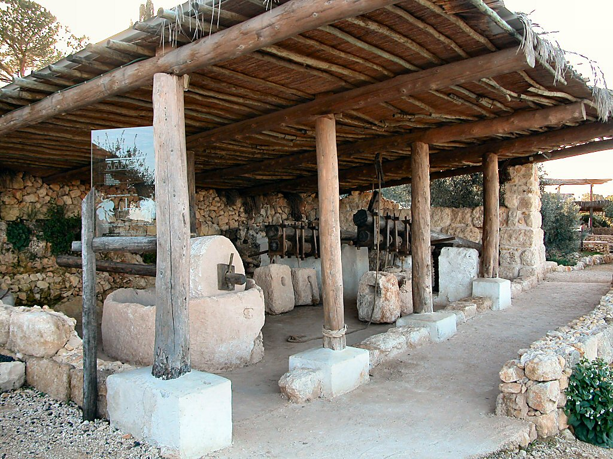

There is a fascinating story in another tractate[^10] that has some relevance to our study. It's about a man from Laodicea who is sent to the land of Asher in Galilee to fetch a large quantity of olive oil to bring back to Laodicea. The photo above shows a reconstructed Olive Oil press from Yad HaShmonah, near Kiriath Jearim.[^11] He gets what we might call the run-around and finally is told to go and see what to him appears to be a poor field laborer. The laborer tells him to wait until his workday is over. The Laodicean messenger believes he is being played for a fool. He waits, and they journey back to the man's house, where the man's maidservant brings out a kettle of hot water and a vat of oil in a golden bowl for the messenger to anoint his hands and feet. The laborer and the messenger ate and drank together. The "laborer" then offered the Laodicean even a greater quantity of oil than he initially needed and more than he could afford. The laborer extends the additional oil on credit and goes back to Laodicea with the messenger to help with the massive haul. The people of Laodicea come out to celebrate the messenger for his tremendous feat, but he replies, "do not praise me. Rather praise this man who has come with me," as it is he who provided the oil. The story in the Talmud ends by saying, "This incident was in fulfillment of that which is stated: 'There is one who seems to be rich yet has nothing; there is one who seems to be poor, yet has great wealth' (Proverbs 13:7)."[^12]

[^10]: “Menachot 85b,” accessed March 28, 2022, http://www.sefaria.org/Menachot.85b?ven=William_Davidson_Edition_-_English&vhe=Wikisource_Talmud_Bavli&lang=bi&with=all&lang2=en.

[^11]: Photo: Todd Bolen, *Kiriath Jearim*, vol. 2. Samaria and the Center, Pictorial Library of Bible Lands, 2012, 32 Used by permission.

[^12]: “Menachot 85b.”

The one thing Laodicea did *not* have was a consistent water supply. Colossae had cold water springs while Hierapolis had hot springs (and like many areas with natural hot springs, it continues today as a resort for tourists). Laodicea could occasionally use river water but otherwise required extensive aqueducts to pipe water in from neighboring cities. Of course, by the time it traveled, it was no longer refreshingly cold like Colossae or therapeutically hot like Hierapolis but a tepid, lukewarm temperature. Additionally, the mineral content was so high that the water, if ingested directly, would induce vomiting. Today, we can see the calcified pipes. We will reserve a discussion on the spiritual significance until we get to verse 16.

#### New Testament Period

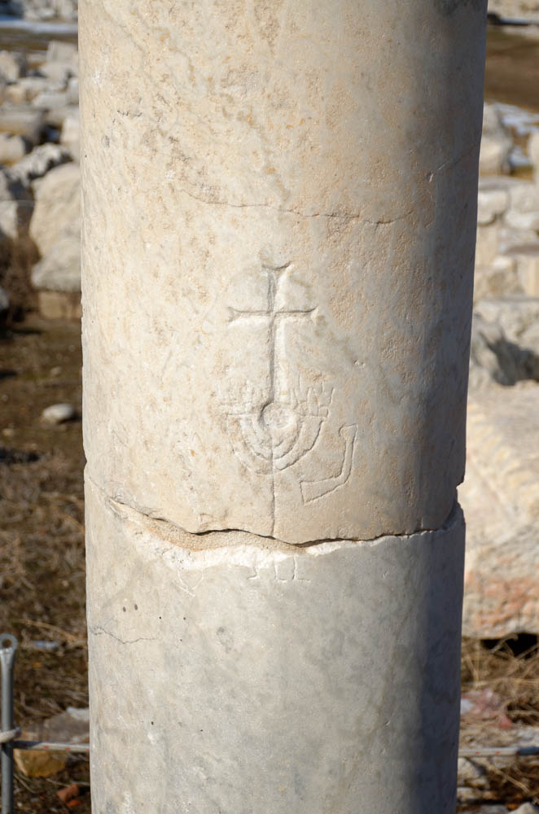

The large number of Jews referenced above likely formed the foundation of the early community of believers in Yeshua. As a reminder, scholars believe that Jews would have significantly outnumbered the gentile "God-fearers." Gentiles would have attended the Jewish synagogue and were divided between believers in Yeshua and non-believers, just as their Jewish counterparts were. The above column shows an inscription of a cross over a Menorah with a shofar, reminding us that our Messiah came out of the light of the Menorah (Rev 1:20).[^13] We are also reminded that the word "church" is an anachronism, as no such word, congregation, or building went by that name in the first century. The term was *ecclesia* and, in most respects, was synonymous with the word *sunagoge* to mean an assembly and only later came to mean a gathering of gentile Christians and non-believing Jews, respectively.

[^13]: Photo: Bolen, *Laodicea*, Western Turkey:60 Used by permission.

Laodicea is mentioned several times in Paul's letter to the Colossians. Based on Col 1:7, a fair assumption is that Epaphras, an evangelist under Paul, founded churches at Colossae and at Hierapolis, and Laodicea. Col 4:15-16 instructs Colossae and Laodicea to exchange greetings and letters. Verse 16 also mentions that Paul wrote a letter to the Laodiceans that has since been lost (we can only wonder what it said given the later rebuke in Revelation…).[^14] We don't have any direct evidence that Paul himself visited there. Still, from Colossians 4, we can see that many of the "big names" of the early apostolic movement were known to Colossae, and presumably to Laodicea: Tychicus, who traveled with Paul extensively; John Mark, Barnabas, and Luke. Of course, John the Apostle likely knew them personally since he's the one penning the letter and scholars believe all seven churches fell under John's apostolic authority. This level of attention could attest to the fact that the population of believers was significant. Because the three cities were interconnected to some degree, a few scholars would see the situation of believers to be much the same in Colossae and Hierapolis as it was in Laodicea. Therefore, like the instruction to Colossae in Col 4:15-16, the letter to Laodicea may have been intended for all the wider believing communities.[^15]

[^14]: There is a body of scholastic thought that suggests all or part of Paul's letter to the Laodiceans is contained in Ephesians. See Bolen, Western Turkey:8.

[^15]: Parker, “Laodicea,” 690.

Verses 15-17, contain the darkest, most scathing rebuke of any of the seven letters. However, in true Jesus style, He doesn't leave believers in that lost place but He desires to bring them back into the fold. Verse 18-20a tells us even though we may be lost, Jesus knows where we are. No matter how far we have wandered, He desires fellowship and restoration. However, He won't violate our sovereignty. He makes the first move, but it is up to us to respond. Then the second part of verse 20 and verse 21 provides us the rewards of accepting His fellowship. We mention this, because like Sardis, there is some indication that, historically, the believers at Laodicea responded favorably. Although it didn't last quite as long as Sardis and Philadelphia, the city lasted until the 13th century. Todd Bolen writes the following: " Some have suggested that Archippus, Philemon’s son (Philemon 2), was Laodicea’s pastor/bishop (cf. Colossians 4:17), based upon the 4th century Apostolic Constitutions. In the 4th century AD, Laodicea emerged as the prominent Christian center of the region of Phrygia and was the site of an important church council."[^16]

[^16]: Bolen, *Laodicea*, Western Turkey:8.

### Rev 3:14

| Revelation                                                                                                                                                                 | References                                                                                                                                                                                                                                                                                                                                                                                                                                                                                                                                                                                   |
|----------------------------------------------------------------------------------------------------------------------------------------------------------------------------|----------------------------------------------------------------------------------------------------------------------------------------------------------------------------------------------------------------------------------------------------------------------------------------------------------------------------------------------------------------------------------------------------------------------------------------------------------------------------------------------------------------------------------------------------------------------------------------------|
| **Rev 3:14** "To the angel of the Messianic Community in Laodicea, write: 'Here is the message from the Amen, the faithful and true witness, the Ruler of God's creation:  | Gen 1:1 In the beginning God created ...  Joh 1:1-3 In the beginning was the Word, and the Word was with God, and the Word was God. (2) He was in the beginning with God. (3) All things were made through him, and without him was not any thing made that was made.   Isa 65:16 so that he who blesses himself in the land shall bless himself by the God of truth, and he who takes an oath in the land shall swear by the God of truth; because the former troubles are forgotten and are hidden from my eyes. Deu 6:4 "Sh'm**A**, Yisra'el! Adonai Eloheinu, Adonai echa**D** |

Regarding the description of the speaker, remember that the first five churches all had direct tie-ins to Revelation 1. For Philadelphia, we had a half reference to Revelation 1. Chapter 1 says "I have the keys of death and hades," but Philadelphia was told, "the one…who has the key of David." In Laodicea, we have zero direct references to Revelation chapter 1. This is a subtle clue that something is very different about this letter to the Laodiceans.

Hebrew Lessons

**Amen Faithful and True:**

-   **אמ**ן – it doesn’t just mean "the end" – in Hebrew it is a statement of affirmation.
-   נ**אמ**ן – the faithful one
-   **אמ**ת - truth

**Witness**

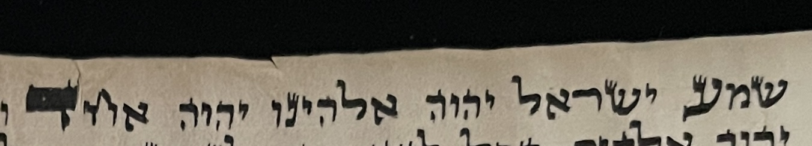}}
In Hebrew, the word for witness is עד. In a Torah Scroll, when the famous Shema Israel is written, ("Hear O Israel, the LORD is our God, the LORD is one") the final letters of "Hear" and "one" are enlarged. You can see a picture of a parchment copy of the Shema that I have. These enlarged letters are ע and ד, the word for "witness". This reminds us that if we say, "The LORD is our God, the LORD is one," our actions need to match our words.

The believers in Laodicea were likely saying the Shema at least twice a day, and they were professing faith in Jesus, but their hearts and actions were far from Him. Strictly speaking, we are called to BE a witness. Witnessing is something we do, being a witness is who we are 24/7/365.

ִFinally, note the similarity between how the Hebrew translation of "**Ruler of God's Creation**" compares with the first part of Genesis 1:1, "In the beginning, God Created." They are only different by three letters:

Rev 3:14 - **ראשית** **בר**י**א**ת ה**אלהים**

Genesis 1:1 - ב**ראשׁית** **ברא** **אלהים**

In Greek the word translated as beginning is *arche* which means beginning, first origin, ruling power. We see this in words like "Archangel" or even "arch enemy." This is not the first angel or enemy, but the supreme one.

### Rev 3:15-16 

No praise: Judgment \#1: Repent or be vomited

| Revelation                                                                                                                                                                                                    | References                                                                                                                                                                                                                                                                                                                                                                                                                                                                                                                                                                                                                                                                                                                                                                                                                                                               |
|---------------------------------------------------------------------------------------------------------------------------------------------------------------------------------------------------------------|--------------------------------------------------------------------------------------------------------------------------------------------------------------------------------------------------------------------------------------------------------------------------------------------------------------------------------------------------------------------------------------------------------------------------------------------------------------------------------------------------------------------------------------------------------------------------------------------------------------------------------------------------------------------------------------------------------------------------------------------------------------------------------------------------------------------------------------------------------------------------|
| Rev 3:15-16 "I know what you are doing: you are neither cold nor hot. How I wish you were either one or the other! (16) So, because you are lukewarm, neither cold nor hot, I will vomit you out of my mouth! | Lev 18:24-25 “Do not make yourselves unclean by any of these things, for by all these the nations I am driving out before you have become unclean, (25) and the land became unclean so that I punished its iniquity, and the land vomited out its inhabitants.   1Ki 18:20-21 So Ahab sent to all the people of Israel and gathered the prophets together at Mount Carmel. (21) And Elijah came near to all the people and said, “How long will you go limping between two different opinions? If the LORD is God, follow him; but if Baal, then follow him.” And the people did not answer him a word.  Jas 1:8 he is a double-minded man, unstable in all his ways.  Mat 6:24 “No one can serve two masters, for either he will hate the one and love the other, or he will be devoted to the one and despise the other. You cannot serve God and money |

Sardis and Laodicea have no commendation. Later, we will look at how after the Fall, God sought out Adam. This is an example of standing at the door and knocking. It is also an example of "I know your works." We cannot hide from God. Perhaps the Laodicean church had gotten so comfortable, they didn't think they had a need to hide from God, but in fact they were far away. Let us never be complacent. As we've talked about, ask God to audit your works every so often. Make sure little errors don't turn into big ones.

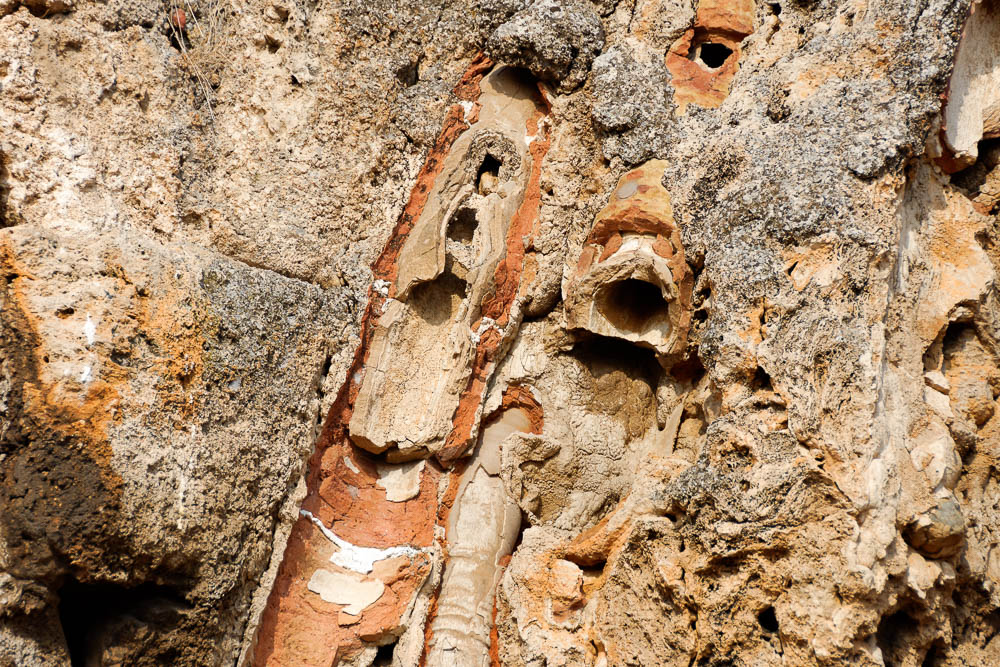

In our culture, we use "hot" to mean spiritually hot, on fire for God. We use "cold" to mean distant and backslidden. In that context, "cold" would be the worst. Note that Jesus is saying cold is better than lukewarm. This is not referring to the spiritual temperature but the effectiveness of their works. Hot works are as soothing and healing as the medicinal hot springs from Hierapolis. Cold works are as refreshing and replenishing as the cold springs from Colossae. Aqueduct water in Laodicea arrived lukewarm, and because of the mineral content, it was distasteful and unusable. This would have been a vivid picture for the Laodiceans. The photo above shows the calcified water pipes, some of which are completely blocked.[^17] God can use "cold" or "hot" works, but He can't use the spiritually lukewarm. When we become so unclean as to be unusable, God has no choice but to vomit us out like He describes in Leviticus 18.

[^17]: Photo: Bolen, Western Turkey:141 Used by permission.

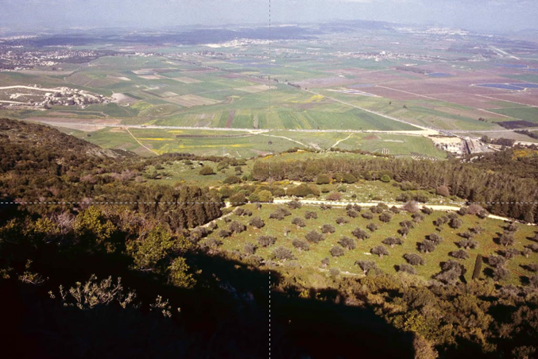

Like Elijah might say, let us make sure we are not wavering between two opinions, and so becoming lukewarm. When we go to Mount Carmel, the setting for 1 Kings 18 pictured above[^18], this is the challenge we give to our groups. Go all-in for God.

[^18]: Photo: Todd Bolen, *Mount Carmel*, vol. 2. Samaria and the Center, Pictorial Library of Bible Lands, 2012, 25 Used by permission.

Those who would argue salvation can be lost can't see how Jesus/God spewing a professing believer out of His mouth can mean anything but a loss of salvation. Indeed, the warnings for the unrepentant or those who do not hold fast are alarming. An alternate view is that a loss of rewards, but not salvation is in view. One must admit that Jesus spewing out of His mouth sounds every bit as condemning as being cast out to where there is weeping or gnashing of teeth. Other verses would indicate that our salvation is secure. In this case, it is best to make sure we are abiding in God, and we don't have to worry about it!

In any case, Jesus is using strong language to motivate the Laodiceans to change their ways. Jesus does this frequently in the Gospels. For example, in Matthew 16:23, He calls Peter "Satan." In a sense, His sharp exchanges with the Pharisees where He uses similar provocative language (ex. Mat 23:27, John 8) could be an attempt to wake them up because He loves them, not because He hates them. Laodicea is a sheep that has wandered off. While there were assuredly non-believers in their midst, the true believers in Laodicea knew His voice and responded. He is calling to us too. A sheep can only serve one shepherd. We have a choice to make, and it's not a one-time choice. It's a moment-by-moment choice whether we will live for Him or live for ourselves.

### Rev 3:17-18 

Judgment \#2: Repent or continue in spiritual nakedness/blindness

| Revelation                                                                                                                                                                                                                                                                                                                                                                                                                 | References                                                                                                                                                                                                                                                                                                                                                                                                                                                                                         |
|----------------------------------------------------------------------------------------------------------------------------------------------------------------------------------------------------------------------------------------------------------------------------------------------------------------------------------------------------------------------------------------------------------------------------|----------------------------------------------------------------------------------------------------------------------------------------------------------------------------------------------------------------------------------------------------------------------------------------------------------------------------------------------------------------------------------------------------------------------------------------------------------------------------------------------------|
| Rev 3:17-18 For you keep saying, 'I am rich, I have gotten rich, I don't need a thing!' You don't know that you are the one who is wretched, pitiable, poor, blind and naked! (18) My advice to you is to buy from me gold refined by fire, so that you may be rich; and white clothing, so that you may be dressed and not have to be ashamed of your nakedness; and eyesalve to rub on your eyes, so that you may see.   | Hos 12:6-8 “So you, by the help of your God, return, hold fast to love and justice, and wait continually for your God.” (7) A merchant, in whose hands are false balances, he loves to oppress. (8) Ephraim has said, “Ah, but I am rich; I have found wealth for myself; in all my labors they cannot find in me iniquity or sin.”   Joh 15:5 I am the vine; you are the branches. Whoever abides in me and I in him, he it is that bears much fruit, for apart from me you can do nothing   |

The easiest person to deceive is yourself. Those who are rich would see that as evidence of the blessing of God's favor. It may be that, or it may be a situation where to whom much is given, much is asked. If God has granted us wealth, we should be using that for the kingdom, not for our comforts.

In this sense, this letter is not that much different from the first six letters. All the assemblies were being pressured to compromise. Some congregations fared better than others. Lizorkin states, "The kind of wealth and comfort mentioned here could only have been achieved if (the Laodicean's) full participation in Pagan Roman society is presumed."[^19]

[^19]: Eli Lizorkin-Eyzenberg and Pinchas Shir, *Hebrew Insights from Revelation*, Jewish Studies for Christians, 2021, 107.

Stern makes a great comment: "Yeshua here does not command but offers His advice. Being infinitely wise, he knows the Laodiceans are far too undisciplined to obey orders."[^20]

[^20]: David H. Stern, *Jewish New Testament Commentary: A Companion Volume to the Jewish New Testament*, E-Sword edition (Clarksville, Md.: Lederer Messianic Publications, 1992), v. Rev 3:18.

Critics point out that these verses aptly describe the 20th and 21st-century church, with its prosperity doctrine, in-house coffee stands, and comfy chairs with cupholders more fitting for a place of entertainment than a house of worship. Chuck Missler quips that the "name it and claim it" bunch ARE scriptural. Right here in Revelation 3:17, it says they are poor naked, and blind![^21]

[^21]: Chuck Missler, *The Book of Revelation Handbook* (Koinonia House, 2020), 95.

In Hosea 12, Hosea is prophesying about the coming destruction of Ephraim, which is a euphemism for the Northern Kingdom. It's important to remember that when a New Testament author alludes to an Old Testament passage, it's not the specific verse that the author wants his reader to understand but the entire passage. In Hosea 12, God is talking about rebuking Ephraim and sending them back into the wilderness because of their lack of faith and on cleanliness in His eyes. The warning John alludes to from Hosea would have been abundantly clear to the believers in Laodicea. It should also be abundantly clear to us.

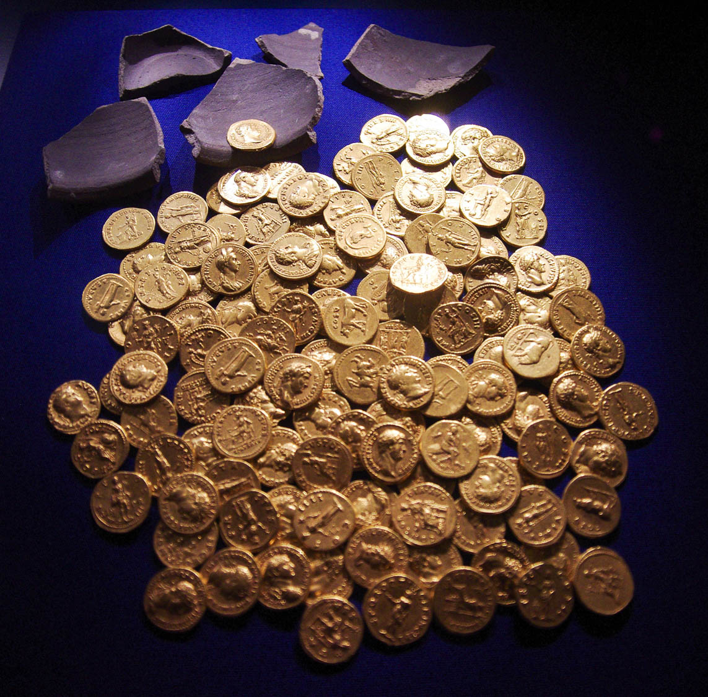

In the letter to Smyrna, Jesus says they are rich, even though they see themselves as poor (Rev 2:9). Here, the Laodiceans are opposites. They are poor, though they view themselves as wealthy. And not just poor but spiritually naked and utterly blind to their condition.

This is not an indictment of wealth itself. We believe many of Jesus' disciples were wealthy, including Nicodemus, Joseph of Arimathea, and the family of Mary, Martha, and Lazarus. Wealth can be a trap and can quickly become an idol in one's life.

Whether rich or poor, the solution is the same and is contained in verse 18. We need to acquire the type of gold that can't be bought with money. We need to be clothed in His righteousness, and like the numerous blind people that Jesus healed, we need to have our spiritual blindness removed. His healings of physical blindness, particularly John 9:1-7, are juxtaposed against the nation's spiritual blindness in the Gospels.

All these things are free, yet they cost everything. Jesus puts these in terms of financial transactions so they would resonate with worldly people. We are no different. We need to give up the things of this world and repent of our inherent unclean status. Therefore the Old Testament emphasizes what is clean vs. unclean. The more we realize what is unclean, the more this is a picture of us. We abide in Him and reject our way of doing things. He makes us clean.

Also in view is the context of honor and shame. The word in verse 18 should probably be rendered as "shame," not "ashamed." "Honor and shame" were a very big deal in ancient societies. Part of how we know our society today is degrading is that the concept of shame is dwindling. In ancient times, honor was a positive and was highly prized. Shame is the opposite, negative social status that was to be avoided. The proverbs often speak of the righteous versus the wicked, clean versus unclean, and honor versus shameful. The Laodiceans were in the status of shamed. Ashamed is an emotion, but shame is a status.

### Rev 3:19 

Secondary encouragement:

| Revelation                                                                                                  | References                                                                                                                                                                                                                                                                                                                                                                                                                                             |
|-------------------------------------------------------------------------------------------------------------|--------------------------------------------------------------------------------------------------------------------------------------------------------------------------------------------------------------------------------------------------------------------------------------------------------------------------------------------------------------------------------------------------------------------------------------------------------|
| Rev 3:19 As for me, I rebuke and discipline everyone I love; so exert yourselves, and turn from your sins!  | Pro 3:11-12 My son, do not despise the LORD's discipline or be weary of his reproof, (12) for the LORD reproves him whom he loves, as a father the son in whom he delights. (also quoted in Heb 12:6)  Jas 5:19-20 My brothers, if anyone among you wanders from the truth and someone brings him back, (20) let him know that whoever brings back a sinner from his wandering will save his soul from death and will cover a multitude of sins.  |

Even the secondary encouragement has a dark undertone. We have no "there are a few of you in Laodicea who have held fast" acknowledgment. Jesus must explain that His strong rebuke is an encouragement because He loves them. This is a plea to repent. Notice that everywhere in the Bible we are told to repent, there is a sense of urgency attached. A big warning sign would be when we say, "I don't need to repent" or "I'm not ready to repent." Stern writes, "it takes effort to lift oneself out of apathy and turn from sin."[^22]

[^22]: Stern, *Jewish New Testament Commentary*, v. Rev 3:19.

Verse 19 is entirely in keeping with Romans 8:1. We are not being condemned if we are believers. As Proverbs 3:12 says, a loving parent would not let a child continue along the wrong path. To do so would not be loving. The fact that God rebukes the Laodiceans and occasionally must rebuke us is not an example of his hating us. He loves us and wants what's best for us.

Finally, we are to be like James in leading someone who has wandered to return to God.





There is something very interesting with the Hebrew of Proverbs 3:12.

-   Regular Hebrew word order is verb-subject-object.
    -   So if this were a typical sentence, it would read in Hebrew, "rebukes God the one He loves."
    -   Whenever there is a deviation from the normal pattern, it should get our attention. There is such a deviation here.
-   The literal word order translation would be like, "the one He loves, God, he rebukes."
    -   In other words, LOVE is the action verb that is being stressed in the sentence.
    -   Even though the main verb is technically "rebukes," God wants to stress His love.
-   Regular English word order is subject-verb-object.
    -   "The Lord rebukes the one He loves" is a technically accurate translation but somehow misses the meaning.
-   Here we see God's, parental heart.
    -   No loving parent enjoys rebuking or punishing his or her child
    -   If we want our children to mature, sometimes we have to do things we would prefer not to do.
    -   It's the same way with God.
    -   Sometimes, he has to send unfaithful Ephraim back into the wilderness; sometimes, He has to do the same with us.





True repentance means we don't just give lip service and ask for forgiveness every time we sin. We are supposed to turn away from our old ways. Repentance is active, not passive. Fortunately for us, God's pursuit is also active and not passive, as we see in verse 20.

### Rev 3:20: 

Jesus is outside knocking to be let in

| Revelation                                                                                                                                                         | References                                                                                                                                                                                                                                                                                                                                                                                                                                                                                                                                                                                                                                                                                                                                                                                                                                                                                                                                                                                                                                                                                                                                            |
|--------------------------------------------------------------------------------------------------------------------------------------------------------------------|-------------------------------------------------------------------------------------------------------------------------------------------------------------------------------------------------------------------------------------------------------------------------------------------------------------------------------------------------------------------------------------------------------------------------------------------------------------------------------------------------------------------------------------------------------------------------------------------------------------------------------------------------------------------------------------------------------------------------------------------------------------------------------------------------------------------------------------------------------------------------------------------------------------------------------------------------------------------------------------------------------------------------------------------------------------------------------------------------------------------------------------------------------|
| Rev 3:20 Here, I'm standing at the door, knocking. If someone hears my voice and opens the door, I will come in to him and eat with him, and he will eat with me.  | Gen 3:8-9 And they heard the sound of the LORD God walking in the garden in the cool of the day, and the man and his wife hid themselves from the presence of the LORD God among the trees of the garden. (9) But the LORD God called to the man and said to him, “Where are you?”   Zec 1:1-4 In the eighth month, in the second year of Darius, the word of the LORD came to the prophet Zechariah, the son of Berechiah, son of Iddo, saying, (2) “The LORD was very angry with your fathers. (3) Therefore say to them, Thus declares the LORD of hosts: Return to me, says the LORD of hosts, and I will return to you, says the LORD of hosts. (4) Do not be like your fathers, to whom the former prophets cried out, ‘Thus says the LORD of hosts, Return from your evil ways and from your evil deeds.’ But they did not hear or pay attention to me, declares the LORD.  Luk 22:28-30 “You are those who have stayed with me in my trials, (29) and I assign to you, as my Father assigned to me, a kingdom, (30) that you may eat and drink at my table in my kingdom and sit on thrones judging the twelve tribes of Israel.    |

As J. Vernon McGee might say, "will you notice?" Will you notice that this church is so far off track that Jesus isn't even allowed inside? He's outside knocking to be let in. He is not willing that any should perish and extends the invitation for those who repent that they will let him in and then dine with him in the messianic banquet in the age to come. But for now, we must realize that any church that has Jesus outside knocking to get it could not be described as a "saved church."

Of course, this is a beautiful invitation for anyone who needs renewed fellowship with our Master in a general context. In Jewish thought, mealtime, particularly a Shabbat dinner, is a time for profoundly intimate fellowship. It's a time to be fully present with one another. That is the intimacy Jesus is offering.

However, we must understand that Jesus will meet with us, but He does so on His terms, not ours. It is so easy to make "our Jesus" into a god of our own making.

God is holy, and no compromise, contamination, or uncleanliness is allowed in His presence. He can make us clean, but we must choose not to compromise. We must be on our guard for errors in teaching, such as from the Nicolaitans, Balaam, or Jezebel. Those groups all made the same error: they believed and were taught that God conformed to their image. Therefore, we stress Acts 17:11. We need to be Bereans to make sure our image of God conforms to the Bible and is not something we've made up.

Again, in Revelation, the topic of eating surfaces in contrast to those who have defiled themselves with worldly teachings. Whether the dietary laws have been abolished or not, I can guarantee you Yeshua's messianic dinner will not have pork or shellfish. That gives me something to think about. Eating is essential to God. Would He change His mind on what we can and can't eat, particularly given Acts 15? Not sure about that. I'm worried that the thought that we can eat whatever we want the same as the world does might be a false teaching.

We may think that repentance is a New Testament invention, but it goes back to the Garden. After Adam and Eve sinned, who went looking for them? Of course, it was God. He was there knocking. When Abraham was an idol-worshipping gentile in the Ur of the Chaldees, God was there knocking. When Jacob was utterly lost, God was there knocking. For the Israelites in the wilderness, for the people in Judges who were doing what was right in their own eyes, for David who in one night broke nearly every one of the Ten Commandments, for the Kings of Israel and Judah who were worshipping false gods along with the one true God, for the lost sheep of Israel, for you and me, God stands at the door and knocks.

### Rev 3:21-22: 

Promise to the Overcomer / Ears

| Revelation                                                                                                                                                                                                                                                       | References                                                                                                                                                                                                                                                                                                                                                                                                                                                                                                                                                                                                                                                                                                                                                                                                                                                                                                                                                                                                       |
|------------------------------------------------------------------------------------------------------------------------------------------------------------------------------------------------------------------------------------------------------------------|------------------------------------------------------------------------------------------------------------------------------------------------------------------------------------------------------------------------------------------------------------------------------------------------------------------------------------------------------------------------------------------------------------------------------------------------------------------------------------------------------------------------------------------------------------------------------------------------------------------------------------------------------------------------------------------------------------------------------------------------------------------------------------------------------------------------------------------------------------------------------------------------------------------------------------------------------------------------------------------------------------------|
| Rev 3:21-22 I will let him who wins the victory sit with me on my throne, just as I myself also won the victory and sat down with my Father on his throne. (22) Those who have ears, let them hear what the Spirit is saying to the Messianic communities." ' "  |  Heb 4:14-16 Since then we have a great high priest who has passed through the heavens, Jesus, the Son of God, let us hold fast our confession. (15) For we do not have a high priest who is unable to sympathize with our weaknesses, but one who in every respect has been tempted as we are, yet without sin. (16) Let us then with confidence draw near to the throne of grace, that we may receive mercy and find grace to help in time of need.    He who has an ear 7x in Revelation and 7x in the Gospels: Mat 11:15, Mat 13:9, Mat, 13:43; Mar 4:9, Mar 4:23, Luk 8:8, Luk 14:34   1Jn 5:4-5 For everyone who has been born of God overcomes the world. And this is the victory that has overcome the world—our faith. (5) Who is it that overcomes the world except the one who believes that Jesus is the Son of God?   Joh_16:33 I have said these things to you, that in me you may have peace. In the world you will have tribulation. But take heart; I have overcome the world.”  |

"Victory in Jesus" has become a cliché phrase. I for one am guilty of giving lip service to being victorious but living my life like one who is defeated. I think many believers are like me. Part of the reason is, like the Laodiceans, we have our eyes on the wrong things. We are looking at the things of this world to provide peace and security. The great news is this outlook is a weakness we can lay at His feet and receive help.

It's interesting that He uses the term victory for Laodicea. I've found that the most victorious believers in our day are the ones who have come from the darkest places, and spiritually, Laodicea was in the darkest place of the seven assemblies. In Luke 7:46-47, Jesus says those who have been forgiven of much, love much, but those who have been forgiven little love little.

Because of His victory, we can have true victory. Our church runs a program called "Celebrate Recovery" or CR for short. It's not just for substance abuse but for anyone with a hurt, habit, or hang-up. Raise your hand if you have a hurt, habit, or hang-up. I was skeptical about CR at first, and there are still some things about it I'm not crazy about, but we can't argue with the changed lives and the fact that once defeated believers are now victorious. We've been talking about how these seven letters are like getting an audit report. With every audit, there is what is called the remediation or corrective action phase. If through these letters, Jesus has revealed any behaviors that are interfering with our walk, then CR would be a great place to implement corrective action and come out living more victorious.

The reward for answering the knock on the door is absolutely staggering. We will sit with Him on His throne. We get to participate in the messianic kingdom in the age to come. However, being informed and giving intellectual assent is not enough. We must "Shema" these words. Believe and obey what the Spirit is saying to us.

Here we have the 7th and final time "He who has an ear" appears in Revelation. It also occurs seven times in the Gospels. What a "coincidence!" You can see the citations above. 1 John describes how to be an overcomer: believe that Jesus is the son of God. Of course, this means to believe in the Hebraic sense, not the Greek sense of merely giving intellectual assent. An overcomer lives his or her life knowing that we overcome by putting our trust in the One who has overcome the world. An overcomer doesn't compromise. An overcomer doesn't waver between two opinions. An overcomer doesn't doubt His promises. Being an overcomer is not easy, but neither is it impossible. An overcomer makes a moment-by-moment choice to live for Him and deny himself.

### Does it fit?

#### Church age theory: Laodicea = Modern/Lazy/Apostate Church 

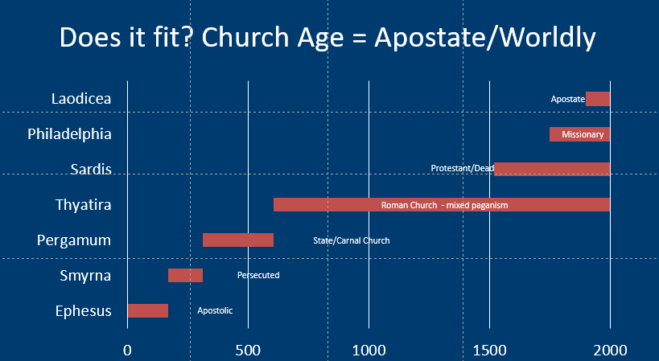

"Apostate" is a \$10 word that means fallen away or renouncing a previous belief that one professes to have. We've talked about "Jews in name only" through these letters. The Apostate Church contains "Christians in name only." In Matthew 15:18, Jesus quotes Isa 29:13 And the Lord said: “Because this people draw near with their mouth and honor me with their lips, while their hearts are far from me." An apostate is not merely an unbeliever but one who is actively proclaiming destructive theology.

This is a church that is conforming to the world's image and pushing out God. This behavior was prophesied by Paul in 2Th 2:3 Let no one deceive you in any way. For that day will not come, unless the rebellion comes first, and the man of lawlessness is revealed, the son of destruction." The word the ESV uses for "rebellion" is *eapostasia*. We may think of rebellion in the sense of unbelievers rebelling against God, but this could be a rebellion or falling away from **within** the apostate church. See the callout box below for additional verses speaking of apostasy in the last days.





-   1 Timothy 4:1
-   2 Peter 2:1
-   2 Timothy 3:1-5
-   2 Corinthians 6:14 – 7:1 (co-worshipping with unbelievers is considered to be an unequal yoke)
-   Ephesians 4:8-16
-   1 John 2:22-23
-   1 John 4:2-3
-   2 John 7
-   2 Peter 3:3-4
-   Jude 17-19
-   Isaiah 8:16, 19-20

Believers are called to be separate (2 Corinthians):

1.  There can be no fellowship between righteousness and unrighteousness
2.  There can be no communion between light and darkness
3.  There can be no middle ground between Messiah and Satan
4.  The believer has no portion with unbelievers
5.  There can be no agreement between the Temple of God and the temple of an idol[^23]

[^23]: Fruchtenbaum, *The Eschatology of the Visible Church, Part 2*.





The roots of our modern apostasy can be traced to the turn of the 20th century, particularly with the development of so-called "higher criticism" and the "documentary hypothesis." These philosophies denied the inerrancy of the Bible using German rationalist methods. These slowly began to infiltrate what we might call the mainline denominations, particularly the Presbyterian church by a guy named Charles Briggs who was a seminary professor at the Union theological Seminary. So we had a modernist liberal (in the Christian sense, not a political sense) in a prominent position now teaching future ministers who spread liberalism throughout their churches. This caused a great divide between so-called modernists and fundamentalists. If we are Southern Baptists, we can be proud to say that the SBC has generally rejected modernist thought, though not without a struggle.[^24] The same cannot be said for just about every other major denomination. Rather than fight the apostasy, these churches stress "unity," but it is unity with liberal tenets.[^25] Again, it seems the very folks who preach tolerance are the most intolerant of you if you disagree with them.

[^24]: Fruchtenbaum.

[^25]: Fruchtenbaum.

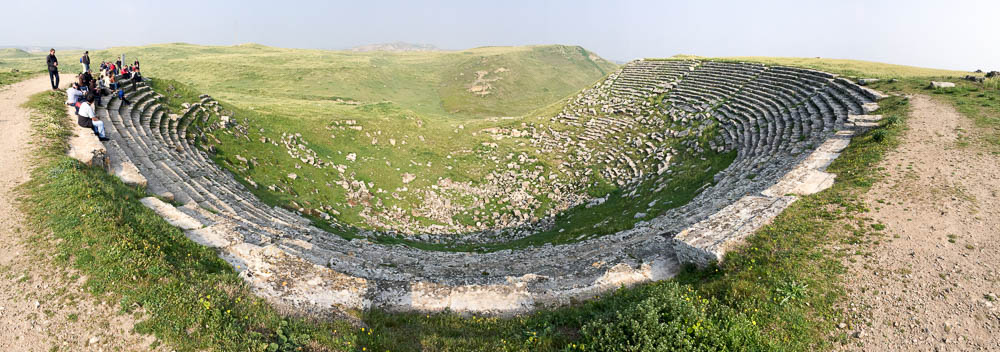

The Laodiceans were also wealthy and comfortable. Bolen writes, "as the city grew, so did the theater-hungry crowds. To supplement the outgrown Western Theater, the bigger and more expensive Northern Theater was built."[^26]

[^26]: Bolen, *Laodicea*, Western Turkey:98.

Going to many churches today is not much different than going to a rock concert. We have comfy chairs sometimes with cup holders, the theater is dark, except for the lights on the stage, the music is loud, there are smoke machines, and some even have a merch table in the lobby next to the coffee stand. A "good" service may be defined as one that emotionally stirred me. A "bad" service is when the pastor preaches a sermon from the Word that challenges and makes me uncomfortable. Church programs are based on people what they want, not on what they need.[^27] Fructenbaum quips, "Satan would not be a very good deceiver if he made one feel badly (sic), would he? Satan can give people joyful and happy experiences rather than the Word of God. (These experiences become) the final authority for determining spiritual truth."[^28]

[^27]: Fruchtenbaum, *The Eschatology of the Visible Church, Part 2*.

[^28]: Fruchtenbaum, vol. 1, sec. 23:37.

Fructenbaum also pointed out that Paul of all people could easily have used his "experience" on the Damascus Road in his preaching as a tool for evangelism, but he did not. He always preached the Word of God and taught how Jesus was the fulfillment of the Scriptures. Personal testimonies are fantastic, but God's word is the final authority.

My friend Dr. Dan Stolebarger recalls a dream he had once where Jesus was in the backseat of his car. Jesus asked, "Where are we going?" "We're going to church!" was the reply. "Ah, I see," said Jesus. So they went inside to the service and came out about an hour later. "What was that again?" asked Jesus. "That was church!" "Not what I had in mind."

Of course, our goal is not to be critical of others’ practices but more to look at areas in our lives where we are compromising.

#### Parables: Laodicea = Dragnet (Mat 13:47-50)

<small>

Mat 13:47-50 “Again, the kingdom of heaven is like a net that was thrown into the sea and gathered fish of every kind. (48) When it was full, men drew it ashore and sat down and sorted the good into containers but threw away the bad. (49) So it will be at the end of the age. The angels will come out and separate the evil from the righteous (50) and throw them into the fiery furnace. In that place there will be weeping and gnashing of teeth.

</small>

Here we see the separation of the good and the bad (and note the good remain while the bad are thrown away). Jesus explains the parable in verses 49-50. Laodicea was given the opportunity to repent. Human nature tells us that likely only a small remnant did, while a vast majority went on their way and perished.

#### Paul: Laodicea = Colossians

The letter to the Colossians is a natural fit for Laodicea. As we've noted, the two were sister cities and in Colossians 4:16-17, the two cities are instructed to exchange letters.

Col 1:13 He has delivered us from the domain of darkness and transferred us to the kingdom of his beloved Son,

In Colossians 1:15, we see a direct reference to Revelation 3:14: "He is the image of the invisible God, the firstborn of all creation."

Col 2:1-4 For I want you to know how great a struggle I have for you and for those at Laodicea and for all who have not seen me face to face, (2) that their hearts may be encouraged, being knit together in love, to reach all the riches of full assurance of understanding and the knowledge of God's mystery, which is Christ, (3) in whom are hidden all the treasures of wisdom and knowledge. (4) I say this in order that no one may delude you with plausible arguments.

Col 2:8 See to it that no one takes you captive by philosophy and empty deceit, according to human tradition, according to the elemental spirits of the world, and not according to Christ.

Col 2:16 Therefore let no one pass judgment on you in questions of food and drink, or with regard to a festival or a new moon or a Sabbath.

-   It is usually taught that this verse is one that allows gentiles to eat anything, and it is "Judaizers" who are telling believers they must follow the Jewish law.
-   In keeping with Acts 15:29 (the directives to gentile believers commanding them to stay avoid eating and behaving sexually like pagans) and the general Roman cult society in which the assembly at Colossae found themselves, wouldn't it be just as likely that the mostly Jewish body was trying to the Jewish dietary laws, Rosh Chodesh (a minor holiday celebrating the first day of the month, which coincides with the arrival of the new moon), and keeping Shabbat in the face of opposition from the pagan majority?
-   Also, remember that to Paul, a Jew, pork and shellfish were not merely “unclean food”; to him, those were not “food” at all.
-   Re-read Colossians 2 in light of what we know about the seven churches and Laodicea specifically. Whose "regulations" in verse 20 is it more likely Paul was referring to? Instructions from God's Word or the pagan world's practices? Acts 17:11!

Col 2:23 These have indeed an appearance of wisdom in promoting self-made religion and asceticism and severity to the body, but they are of no value in stopping the indulgence of the flesh.

Col 3:1-3 If then you have been raised with Christ, seek the things that are above, where Christ is, seated at the right hand of God. (2) Set your minds on things that are above, not on things that are on earth. (3) For you have died, and your life is hidden with Christ in God.

Col 3:5-6 Put to death therefore what is earthly in you: sexual immorality, impurity, passion, evil desire, and covetousness, which is idolatry. (6) On account of these, the wrath of God is coming.

Col 3:11 Here there is not Greek and Jew, circumcised and uncircumcised, barbarian, Scythian, slave, free; but Christ is all, and in all.

-   Again, this is often taught that the Jewish believers said the Gentile believers had to be more Jewish.
-   What if it was the opposite? Overall in Colossae, the pagan population outnumbered Jews. What if it was the formerly pagan gentiles attempting to introduce non-Biblical practices into the Synagogue to blend in with society at large?
-   The church today has a generally condemning attitude towards Messianic Jews.

Col 4:6 Let your speech always be gracious, seasoned with salt, so that you may know how you ought to answer each person.

Col 4:11 and Jesus who is called Justus. These are the only men of the circumcision among my fellow workers for the kingdom of God, and they have been a comfort to me.

-   Paul's use of "the circumcision" is not necessarily pejorative. It just means "Jewish."

Col 4:15-16 Give my greetings to the brothers at Laodicea, and to Nympha and the church in her house. (16) And when this letter has been read among you, have it also read in the church of the Laodiceans; and see that you also read the letter from Laodicea.

In Colossians 4:17, Paul writes, "And say to Archippus, “See that you fulfill the ministry that you have received in the Lord.” There is a church tradition that Archippus later became the bishop of Laodicea. If so, the speculation is that his weakness, whatever it was that Paul saw as coming up short, contributed to their dire spiritual condition.

Finally, there are a couple of interesting names mentioned:

Col 4:10 Aristarchus my fellow prisoner greets you, and Mark the cousin of Barnabas (concerning whom you have received instructions—if he comes to you, welcome him),

-   Compare Act_15:39, And there arose a sharp disagreement so that they separated from each other. Barnabas took Mark with him and sailed away to Cyprus,
-   Colossians was written after Acts 15
-   Mark was "redeemed."

Col 4:14 Luke the beloved physician greets you, as does Demas.

-   Compare 2 Ti 4:10 For Demas, in love with this present world, has deserted me and gone to Thessalonica.
-   Colossians was written BEFORE 2 Timothy.
-   Demas, once a fellow worker (Phm 24), fell away.

### Seven Letter's Recap

We're indebted to Chuck Missler for the following summaries.[^29]

[^29]: Missler, *The Book of Revelation Handbook*, 97–98, 103–4.

|                          | Ephesus                                                            | Smyrna                                        | Pergamum                                                                            | Thyatira                                                                                                           | Sardis                                                                                     | Philadelphia                                                                                      | Laodicea                                                                                                                                                                        |
|--------------------------|--------------------------------------------------------------------|-----------------------------------------------|-------------------------------------------------------------------------------------|--------------------------------------------------------------------------------------------------------------------|--------------------------------------------------------------------------------------------|---------------------------------------------------------------------------------------------------|---------------------------------------------------------------------------------------------------------------------------------------------------------------------------------|
| To                       | Darling; desired                                                   | Myrrh; death                                  | Height; Mixed (strange) Marriage                                                    | Daughter                                                                                                           | Precious stone                                                                             | Brotherly Love                                                                                    | People ruling                                                                                                                                                                   |
| From                     | Holds 7 stars/ walks among lampstands                              | First/last dead/alive                         | Sharp two-edged sword                                                               | Son of God; eyes of fire; feet of brass                                                                            | Sevenfold Spirit & Seven Stars                                                             | Holy, True, Key of David Open Door                                                                | Amen, faithful and true witness, head of God's creation                                                                                                                         |
| Praise                   | Don't tolerate evil; Persevered; Acts 17:11                        | Suffering (pressing, tribulation) and insults | Not denied faith; holds fast to His name; know they live where Satan has his throne | love, trust, service, and perseverance; improving                                                                  | NONE                                                                                       | Kept Word and not denied                                                                          | NONE                                                                                                                                                                            |
| Judgment                 | Lost love they had at first                                        | N/A                                           | Tolerate those with sexual and dietary sin (Balaam)                                 | Jezebel                                                                                                            | False reputation; they are dead! Works are incomplete. Repent or He will come like a thief | None directed to Philadelphia – will sit in judgment of false Jews who will learn He loves        | Lukewarm – to be vomited; think they are rich and in need of nothing but truly are wretched, poor, pitiable, blind, and naked.                                                  |
| Secondary Encouragement  | Hates deeds of people who do things their own way instead of God's | Do not fear suffering; remain faithful        | N/A                                                                                 | Hold fast against teaching of deep things of Satan                                                                 | A few who have not soiled clothes                                                          | Patient endurance will keep them from the worldwide hour of trial for earth-dwellers              | Buy gold refined by fire (not poor), white clothing (not naked), eysalve (not blind). He rebukes those whom He loves, so repent! Those who open the door He will eat with them. |
| Location of "Ear" clause | Before                                                             | Before                                        | Before                                                                              | After                                                                                                              | After                                                                                      | After                                                                                             | After                                                                                                                                                                           |
| Promise                  | Eat from Tree/Life                                                 | Not taste 2nd death                           | Eat of Hidden Manna / A white stone/new name                                        | Authority over nations; morning star                                                                               | Dressed in white; name in Book, be acknowledged in Heaven                                  | Pillar in Millennial temple; write on him name of my God, name of new Jerusalem, and His own Name | Sit on his throne                                                                                                                                                               |
| Application              | Neglected priorities                                               | Expect Satanic opposition                     | Beware spiritual compromise: (worshipping God AND something else)                   | Beware of pagan practices mixed in and corrupting the true faith: (worshipping something else pretending it's God) | Be watchful and diligently guard the heart (not just doctrine)                             | Loyal ambassadorship                                                                              | Beware of apostasy and denying what we once held true                                                                                                                           |
| Age                      | Apostolic (70-170)                                                 | Persecuted (170-312)                          | State Religion (312-606)                                                            | Catholic (606-present)                                                                                             | Protestant (1517 - present)                                                                | Missionary "on fire"; Raptured (1750-present)                                                     | Lazy, apostate (1900 – present)                                                                                                                                                 |
| Parable                  | Four Soils                                                         | Wheat/tares                                   | Mustard seed                                                                        | Woman/leaven                                                                                                       | Treasure/Field                                                                             | Pearl of Great Price                                                                              | Dragnet                                                                                                                                                                         |
| Paul                     | Ephesians                                                          | Philippians                                   | 1/2 Corinthians                                                                     | Galatians                                                                                                          | Romans                                                                                     | 1/2 Thessalonians                                                                                 | Colossians                                                                                                                                                                      |

**The admonition to all churches**

| Ephesus      | Don't lose sight of love of God and love of Neighbor  |
|--------------|-------------------------------------------------------|
| Smyrna       | Endure persecution                                    |
| Pergamos     | Beware external intrusion into the church             |
| Thyatira     | Beware pagan practices infiltrating within the church |
| Sardis       | Devotion, not just doctrine                           |
| Philadelphia | Great commission, keep pure                           |
| Laodicea     | Avoid prosperous compromise                           |

**Personal Application**

| Ephesus      | Don't neglect priorities                             |
|--------------|------------------------------------------------------|
| Smyrna       | Persevere through satanic opposition                 |
| Pergamos     | Don't compromise with the world                      |
| Thyatira     | Don't be defiled by the world (avoid false teaching" width="66%" style="float:right" /> |
| Sardis       | Be vigilant                                          |
| Philadelphia | Be a loyal ambassador                                |
| Laodicea     | Don't be led by materialism and apostasy             |

**Promises to the Overcomer**

All of these are aspects of eternal life

| Ephesus      | Eat of Tree of Life                                                |
|--------------|--------------------------------------------------------------------|
| Smyrna       | Not hurt by Second Death                                           |
| Pergamos     | Manna, white stone, new name                                       |
| Thyatira     | Power over the goyim                                               |
| Sardis       | Walk with Him in white; name not blotted out                       |
| Philadelphia | Pillar in Temple; the name of God, name of Jerusalem, HIS new name |
| Laodicea     | Sit with Him on His throne                                         |

**Church Age**

| Ephesus      | Apostolic            |
|--------------|----------------------|
| Smyrna       | Persecuted           |
| Pergamos     | State/compromised    |
| Thyatira     | Pagan                |
| Sardis       | Dead                 |
| Philadelphia | Faithful             |
| Laodicea     | Lukewarm/comfortable |

**Parables**

| Ephesus      | Four soils           |
|--------------|----------------------|
| Smyrna       | Tares and Wheat      |
| Pergamos     | Mustard Seed         |
| Thyatira     | Woman & Leaven       |
| Sardis       | Treasure in Field    |
| Philadelphia | Pearl of Great Price |
| Laodicea     | Dragnet              |

**Paul's letters**

| Ephesus      | Ephesians     |
|--------------|---------------|
| Smyrna       | Philippians   |
| Pergamos     | Corinthians   |
| Thyatira     | Galatians     |
| Sardis       | Romans        |
| Philadelphia | Thessalonians |
| Laodicea     | Colossians    |

