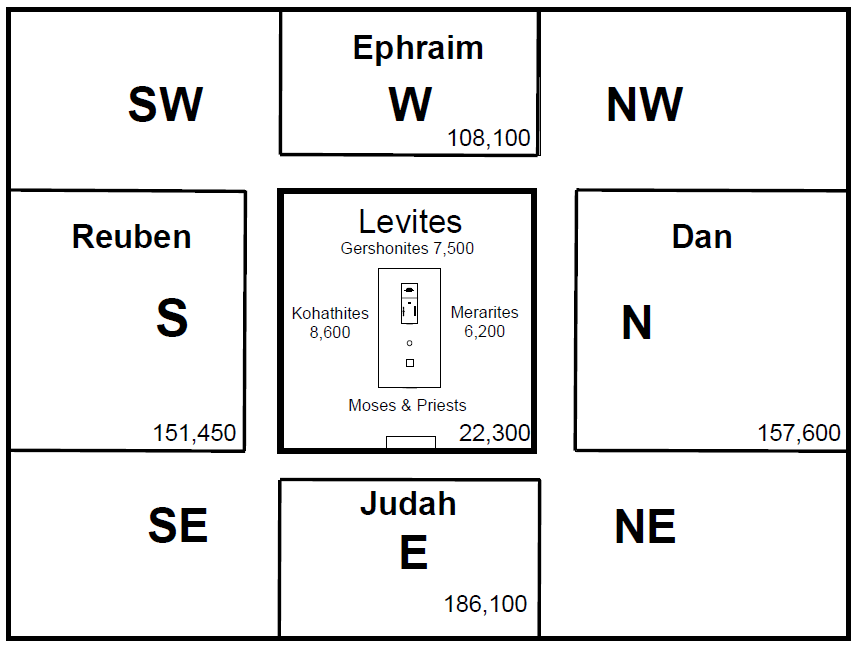
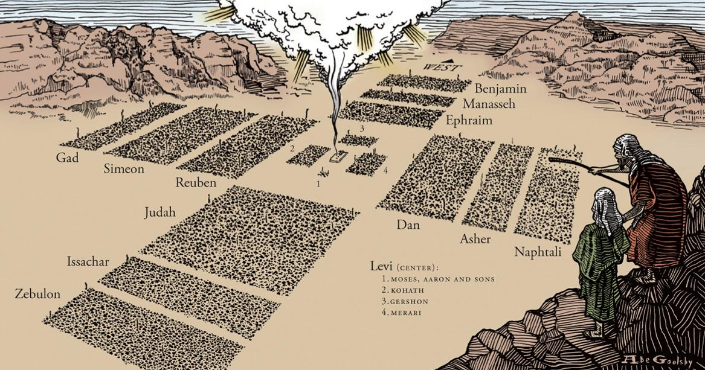
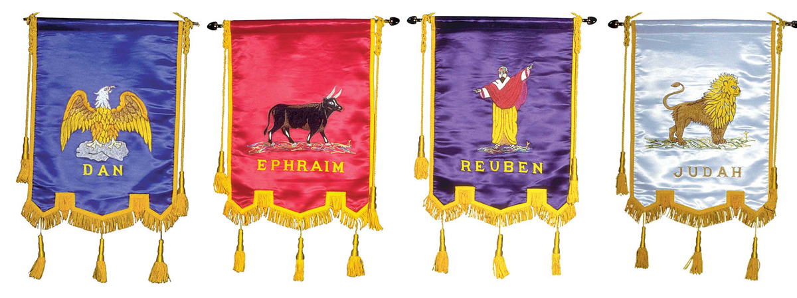



 

### Read/hear the portion

| Revelation 4                                                                                                                                                                                                                                                                                                                                                                                                                                                                                                                                                                                                                                                                                                                                                                                                                                                                                                                                                                                                                                                                                                                                                                                                                                                                                                                                                                                                                                                                                                                                                                                                                                                                                                                                                                                                                                                                                                                                        |
|-----------------------------------------------------------------------------------------------------------------------------------------------------------------------------------------------------------------------------------------------------------------------------------------------------------------------------------------------------------------------------------------------------------------------------------------------------------------------------------------------------------------------------------------------------------------------------------------------------------------------------------------------------------------------------------------------------------------------------------------------------------------------------------------------------------------------------------------------------------------------------------------------------------------------------------------------------------------------------------------------------------------------------------------------------------------------------------------------------------------------------------------------------------------------------------------------------------------------------------------------------------------------------------------------------------------------------------------------------------------------------------------------------------------------------------------------------------------------------------------------------------------------------------------------------------------------------------------------------------------------------------------------------------------------------------------------------------------------------------------------------------------------------------------------------------------------------------------------------------------------------------------------------------------------------------------------------|
| After these things, I looked; and there before me was a door standing open in heaven; and the voice like a trumpet which I had heard speaking with me before said, "Come up here, and I will show you what must happen after these things." (2) Instantly I was in the Spirit, and there before me in heaven stood a throne, and on the throne Someone was sitting. (3) The One sitting there gleamed like diamonds and rubies, and a rainbow shining like emerald encircled the throne. (4) Surrounding the throne were twenty-four other thrones, and on the thrones sat twenty-four elders dressed in white clothing and wearing gold crowns on their heads. (5) From the throne came forth lightnings, voices and thunderings; and before the throne were seven flaming torches, which are the sevenfold Spirit of God. (6) In front of the throne was what looked like a sea of glass, clear as crystal. In the center, around the throne, were four living beings covered with eyes in front and behind. (7) The first living being was like a lion, the second living being was like an ox, the third living being had a face that looked human, and the fourth living being was like a flying eagle. (8) Each of the four living beings had six wings and was covered with eyes inside and out; and day and night they never stop saying, "Holy, holy, holy is Adonai, God of heaven's armies the One who was, who is and who is coming!" (9) And whenever the living beings give glory, honor and thanks to the One sitting on the throne, to the One who lives forever and ever, (10) the twenty-four elders fall down before the One sitting on the throne, who lives forever and ever, and worship him. They throw their crowns in front of the throne and say, (11) "You are worthy, Adonai Eloheinu, to have glory, honor and power, because you created all things—yes, because of your will they were created and came into being!" |



### Revelation Backgrounds' Focus

We are entering the apocalyptic phase, so there won't be much geography and probably not many pictures. We're basically going to track down and read some passages that the original audience likely would have known.

As we said at the outset of our study in Revelation, part of the challenge with apocalyptic literature is that the person recording the events is trying to describe the indescribable. Therefore, they are forced to use symbolic language that at times seems other-worldly (because it IS other-worldly; it's not of this world!). This makes any concrete interpretation difficult.

As there are numerous competent commentaries offering various conjectures on what Revelation chapters four and following could mean for 20th and 21st-century believers, we will *attempt* to limit our study here to identifying and studying the allusions and common themes that appear elsewhere in the Bible. Where possible, we will limit conjectures to those that could have been understood by the original 1st-century audience. In any case, we will attempt to put aside any preconceptions and let the Text speak for itself, even though this may mean quoting an equally cryptic passage from the Old Testament. In the interest of time we won't be able to unpack everything. Just soak it in and remember Isaiah 55:

>   Isa 55:8-11 For my thoughts are not your thoughts, neither are your ways my ways, declares the LORD. (9) For as the heavens are higher than the earth, so are my ways higher than your ways and my thoughts than your thoughts. (10) “For as the rain and the snow come down from heaven and do not return there but water the earth, making it bring forth and sprout, giving seed to the sower and bread to the eater, (11)  **so shall my word be that goes out from my mouth; it shall not return to me empty, but it shall accomplish that which I purpose**, and shall succeed in the thing for which I sent it.

Verse 11 means that any time we can spend studying God's word is productive and profitable time.

{}Revelation 4 Cross-reference Verses PDF{}

### Rev 4:1-The Heavenly Temple

<small>**After these things**, **I looked**; and there before me was a door standing open in heaven; and the voice like a trumpet which I had heard speaking with me before said, "Come up here, and I will show you what must happen after these things."</small>

#### Meta Tauta "after these things"

-   This serves as a transition from the previous vision of the seven assemblies to this vision in the heavenly throne room.
    -   A roughly equivalent phrase in the Hebrew Bible is "I looked, and behold.".
        - <small>Eze 10:1 Then I **looked, and behold**, on the expanse that was over the heads of the cherubim there appeared above them something like a sapphire, in appearance like a throne.</small>
        - <small>Dan 10:5 **I lifted up my eyes and looked, and behold,** a man clothed in linen, with a belt of fine gold from Uphaz around his waist.</small>
    -   On that note, Heiser sees Rev 4-6 as a "divine council" scene, just like Isaiah 6, Ezekiel 1 and Daniel 7[^1]
    -   Keep in mind that "Meta Tauta" might NOT mean the next thing that happens chronologically.
        -   It could simply be the next part of the revelation: after that vision, comes the next vision.
        -   Since other parts of the bible are not in chronological order, we should not necessarily assume Revelation is in chronological order.

[^1]: Michael S. Heiser, *The Unseen Realm: Recovering the Supernatural Worldview of the Bible*, First edition (Bellingham, WA: Lexham Press, 2015), 354.

#### Heaven opened

-   Jesus promised this in John 1:51
    - <small>John 1:51 And he said to him, “Truly, truly, I say to you, **you will see heaven opened**, and the angels of God ascending and descending on the Son of Man.”</small>
-   This is the heavenly temple referenced in Hebrews.
    - <small>Heb 9:24 For Christ has entered, not into holy places made with hands, which are copies of the true things, but into heaven itself, now to appear in the presence of God on our behalf.</small>
-   There are several other examples of a mortal being given a glimpse of the heavenly realm:
    -   Jacob
        -   <small>Genesis 28:12-16 And he dreamed, and behold, there was a **ladder set up on the earth, and the top of it reached to heaven. And behold, the angels of God were ascending and descending on it**! (13) And behold, the LORD stood above it and said, “I am the LORD, the God of Abraham your father and the God of Isaac. The land on which you lie I will give to you and to your offspring. (14) Your offspring shall be like the dust of the earth, and you shall spread abroad to the west and to the east and to the north and to the south, and in you and your offspring shall all the families of the earth be blessed. (15) Behold, I am with you and will keep you wherever you go, and will bring you back to this land. For I will not leave you until I have done what I have promised you.” (16) Then Jacob awoke from his sleep and said, “Surely the LORD is in this place, and I did not know it.” </small>
    -   Moses
        -   <small>Exodus 19:19-20 And as the sound of the trumpet grew louder and louder, Moses spoke, and God answered him in thunder. (20) The LORD came down on Mount Sinai, to the top of the mountain. **And the LORD called Moses to the top of the mountain, and Moses went up**. </small>
    -   Isaiah
        -   <small>Isaiah 6:1 In the year that King Uzziah died **I saw the Lord sitting upon a throne**, high and lifted up; and the train of his robe filled the temple. </small>
    -   Ezekiel
        -   <small>Ezekiel 1:1 In the thirtieth year, in the fourth month, on the fifth day of the month, as I was among the exiles by the Chebar canal, the heavens were opened, **and I saw visions of God**. </small>
    -   Daniel
        -   <small>Daniel 7:1-2 In the first year of Belshazzar king of Babylon, Daniel saw a dream and visions of his head as he lay in his bed. Then he wrote down the dream and told the sum of the matter. (2) Daniel declared, “**I saw in my vision by night**, and behold, the four winds of heaven were stirring up the great sea. </small>
        -   <small>Daniel 10:5  **I lifted up my eyes and looked, and behold**, a man clothed in linen, with a belt of fine gold from Uphaz around his waist. </small>
-   Lancaster sees the High Holy Days liturgy.
    -   The doors to the Temple would open at Rosh Hashana to the sound of the shofar.
    -   They would stay open through the 10 days of awe.
    -   They would close at the sound of another trumpet after Yom Kippur.

#### Come up here and I will show you

-   "**Come up here**" recalls God's call to Moses
    -   <small>Exo 19:24 And the LORD said to him, “Go down, and come up bringing Aaron with you. But do not let the priests and the people break through to come up to the LORD, lest he break out against them.” </small>
-   "**I will show you**" recalls Jacob's prophecies in Genesis 49.
    -   <small>Genesis 49:1 Then Jacob called his sons and said, “Gather yourselves together, that I may tell you what shall happen to you in days to come." </small>

### Rev 4:2-In spirit

<small> **Instantly I was in (the) spirit, and there before me in heaven stood a throne, and on the throne, Someone was sitting.** </small>

#### In (the) S/spirit

-   As with Rev 1:10, the Greek does not have a definite article.
    -   John was literally "in spirit." We can interpret this as a hyper spiritual trancelike state
    -   This may mean only that John was not in the body (or like Paul, "whether in the body, or out of the body I do not know – God knows." (2 Cor 12:2))
-   Ezekiel literally says "it lifted me up spirit"
    -   <small>Eze 11:1 Then **the S/spirit lifted me up** and brought me to the East Gate of the LORD's house, </small>
    -   <small>Eze 11:24 Then **the S/spirit took me up** and brought me in a vision by the **Spirit of God** into Chaldea, to those in captivity. And the vision that I had seen went up from me. </small>
    -   Again, there is no definite article.
    -   In other words, the Hebrew is vague about whether this is the spirit of God or just in spirit as the opposite of in the body.
-   Translations that capitalize the "S" in spirit are assuming.
-   John, like Isaiah and Ezekiel, was somehow transported in a vision.

#### Sitting

-   Again, the One sitting is not named.
    -   We're reminded that John knew Jesus as well as anyone did.
    -   If John does not assume this is Jesus, maybe we shouldn't either.
-   The Holy One sitting is an allusion to Isaiah 6
    -   <small>Isaiah 6:1 In the year that King Uzziah died I saw the Lord **sitting upon a throne**, high and lifted up; and the train of his robe filled the temple. </small>

### Rev 4:3- Sardius, Jasper, Emerald

<small>**The One sitting there gleamed like diamonds (jasper) and rubies (carnelian/sardius), and a rainbow shining like an emerald encircled the throne.**</small>

-   Keener noted that John's simple description of the throne room deliberately contrasted with the Roman emperor's pompous display of power.
-   The original audience would have recognized the carnelian (aka sardius), jasper, and emerald stones as being from the breastplate of the High Priest.
    -   <small> Exodus 28:15-20 “You shall make a breastpiece of judgment, in skilled work. In the style of the ephod you shall make it—of gold, blue and purple and scarlet yarns, and fine twined linen shall you make it. (16) It shall be square and doubled, a span its length and a span its breadth. (17) You shall set in it four rows of stones. A row of **sardius**, topaz, and carbuncle shall be the first row; (18) and the second row an **emerald**, a sapphire, and a diamond; (19) and the third row a jacinth, an agate, and an amethyst; (20) and the fourth row a beryl, an onyx, and a **jasper**. They shall be set in gold filigree.</small>
-   There were 12 stones arranged in the birth order of the 12 tribes
-   **Sardius** = Reuben (1st Born) and **jasper** = Benjamin (last born)
-   This is another way of saying "from A to Z" in other words all the 12 tribes were represented by the One who was sitting on the Throne, not just Reuben and Benjamin
-   If we know this, the fact that the emerald appears preeminent should not surprise us.
    -   **Emerald** was the fourth stone = Judah (4th born)
    -   Judah held the status of "Firstborn" because Reuben, Simeon, and Levi all forfeited the right.
-   Note Stern's CJB translation of the first two stones as generic "diamonds and rubies" is odd; the Greek specifically identifies these stones.
-   Ezekiel saw similar precious gems in the throneroom of God
    -   <small>Ezekiel 1:26-28 And above the expanse over their heads there was the likeness of a throne, in appearance like sapphire; and seated above the likeness of a throne was a likeness with a human appearance. (27) And upward from what had the appearance of his waist I saw as it were gleaming metal, like the appearance of fire enclosed all around. And downward from what had the appearance of his waist I saw as it were the appearance of fire, and there was brightness around him. (28) Like the appearance of the bow that is in the cloud on the day of rain, so was the appearance of the brightness all around. Such was the appearance of the likeness of the glory of the LORD. And when I saw it, I fell on my face, and I heard the voice of one speaking.</small>
    -   Note Ezekiel didn't see God directly. He saw an "appearance of the likeness of the glory of the LORD"!

### Rev 4:4-24 Elders

<small>**Surrounding the throne were twenty-four other thrones, and on the thrones sat twenty-four elders dressed in white clothing and wearing gold crowns on their heads.** </small>

-   Thrones, white clothing, and crowns are distinguishing characteristics of promises to the overcomers in Rev 2 & 3
-   There are many conjectures as to who these 24 elders are.
    -   Most importantly John does not tell us.
    -   The earthly office of Elder (*presbuteros*) is the highest official in an assembly (Titus 1:5; Acts 15:6, 1 Pet 2:5,9). Therefore many see the elders as representative of the "church" at large.
    -   As Revelation 4 is about Temple service, one possible explanation is to remember that David organized the Levitical priesthood into 24 courses or divisions.
        -   These divisions represented all of Israel.
        -   <small>1 Chronicles 24:3b, 18 David organized them according to the appointed duties in their service…the **twenty-fourth** to Maaziah</small>
            -   If we remember, Zechariah, John the Baptist's father, was from the course of Abijah (Luke 1:5, 8), in other words, the eighth course (1 Chr 24:10).
            -   Each course would serve two weeks out of the year (some sources imply one week, twice a year) and then would go back to work their trade and be with their families the rest of the year, just as Zechariah did (Luke 1:23).
        -   This speculation would seem to fit with the model of the Camp of Israel from Numbers 2

-   The Levites formed the inner box and the 12 tribes formed the outer.
    -   We'll discuss support for the 12 tribes forming the outer box at verse 7.
    -   Many scholars do not see the Levitical priesthood continuing in Heaven. While I find this somewhat unlikely, non-Levitical priesthoods are attested to in Scripture
        -   Jethro: <small>Exo 3:1 Now Moses was keeping the flock of his father-in-law, Jethro, the priest of Midian, and he led his flock to the west side of the wilderness and came to Horeb, the mountain of God. </small>
        -   Melchizedek: <small>Gen 14:18 And Melchizedek king of Salem brought out bread and wine. (He was priest of God Most High.) </small>
        -   Us: <small> 1 Pet_2:9 But you are a chosen race, a royal priesthood, a holy nation, a people for his own possession, that you may proclaim the excellencies of him who called you out of darkness into his marvelous light.</small>;
    -   Many commentators infer that of the 24, 12 are the representatives of the 12 tribes, and the other 12 are the 12 apostles.
        -   There is nothing but conjecture to support this view.
        -   One possible counterargument is that Jesus said the Apostles would rule OVER the 12 tribes, not alongside them.
    -   Heiser suggests these are deified believers.
        -   " Heaven and earth, divinity and humanity, are not easily separable when it comes to the divine council and God’s plan for restoration of Eden."[^2]
-   In terms of heavenly elders, the only other reference appears in Isaiah.
    -   <small>Isaiah 24:23 Then the moon will be confounded and the sun ashamed, for the LORD of hosts reigns on Mount Zion and in Jerusalem, and his glory will be before his elders. </small>
-   The 24 elders of Revelation will appear in 4:10, 5:8, 11:16, and 19:4, each time worshipping God.

[^2]: Heiser, 355.

#### Crowns

To the extent that these elders could be representatives of Jewish or non-Jewish believers, note that any believer may obtain different crowns for different acts of service and devotion.

-   Crown of life for those who love Him and suffer for His sake (Jas 1:12, Rev 2:10)
-   Crown of righteousness for those who loved his appearing (2 Tim 4:8)
-   Crown of glory for those who feed the flock (1 Pet 5:4)
-   Crown incorruptible for those who persevere (1 Cor 9:25)
-   Crown of rejoicing for those who win souls (1 Thes 2:19)

These are the "Bema seat" rewards for those whose works survived the judgment (gold, silver, precious stones, vs wood, hay, stubble 1 Cor 3).

### Rev 4:5-Thunder

<small> **From the throne came forth lightnings, voices, and thunderings; and before the throne were seven flaming torches, which are the sevenfold Spirit of God**.</small>

-   The "special effects" if we can call them that, seem to be recalling the giving of the Torah at Mt. Sinai (or perhaps it’s the other way around! Perhaps the display at Mount Sinai was a type and shadow of the Heavenly throne room).
    -   <small>Exo 19:16 Then it came to pass on the third day, in the morning, that there were **thunderings** and **lightnings**, and a thick cloud on the mountain; and the sound of the trumpet was **very loud,** so that all the people who were in the camp trembled.</small>
-   Ezekiel saw and heard similarly.
    -   <small>Ezekiel 1:4 As I looked, behold, a stormy wind came out of the north, and a great cloud, with brightness around it, and **fire** flashing forth continually, and in the midst of the **fire**, as it were gleaming metal. </small>
    -   <small>Ezekiel 3:12 Then the Spirit lifted me up, and I heard behind me the **voice** of a great earthquake: “Blessed be the glory of the LORD from its place!” </small>

#### Shavuot/Pentecost

Many Christians don't realize that Acts 2 is a virtual carbon copy of the Giving of the Torah at Mount Sinai. The Jewish feast of Shavuot is the day, according to tradition, that the Torah was given to Moses. The same day on the Jewish calendar, the day we call Pentecost, is the day the Spirit was poured out.

-   <small>Act 2:1-3 When the Day of Pentecost had fully come, they were all with one accord in one place. (2) And suddenly there came a **sound from heaven, as of a rushing mighty wind, and it filled the whole house** where they were sitting. (3) Then there appeared to them divided tongues, as of **fire**, and one sat upon each of them. (4) And they were all filled with the Holy Spirit and began to speak with other tongues, as the Spirit gave them utterance. </small>

### Rev 4:6–Sea of Crystal

<small> **In front of the throne was what looked like a sea of glass, clear as crystal. In the center, around the throne, were four living beings covered with eyes in front and behind.**</small>

-   In the heavenly temple, there is a counterpart to the molten sea.
    -   <small>1 Kings 7:23-25 Then he made the **sea of cast metal**. It was round, ten cubits from brim to brim, and five cubits high, and a line of thirty cubits measured its circumference. (24) Under its brim were gourds, for ten cubits, compassing the sea all around. The gourds were in two rows, cast with it when it was cast. (25) It stood on twelve oxen, three facing north, three facing west, three facing south, and three facing east. The sea was set on them, and all their rear parts were inward.</small>
-   This was for ceremonial purification so that those in service could be ritually pure.
-   One suggestion is the sea is now crystal because no further purification is needed.
-   In terms of the heavenly temple, John will also see an altar of incense (5:8) an altar of sacrifice (6:9), and the ark itself (11:19) all components of the earthly temple.
-   The Sea of glass or crystal that John say represents the firmament Ezekiel saw.
    -   <small>Eze 1:22 The likeness of the **firmament** above the heads of the living creatures was like the color of an awesome **crystal**, stretched out over their heads. </small>
-   We first encounter the "firmament" in Genesis 1.
    -   <small>Gen 1:6-8 Then God said, "Let there be a **firmament** in the midst of the waters, and let it divide the waters from the waters." (7) Thus God made the **firmament**, and divided the waters which were under the **firmament** from the waters which were above the firmament; and it was so. (8) And God called the **firmament** **Heaven**. So the evening and the morning were the second day.</small>
  

#### Four Living Creatures

-   Some translations have "four beasts" – this is unfortunate. The Greek word is *Zoa*, which is simply a living being as opposed to a sinister, voracious creature.
-   Eyes
    -   <small> Eze_10:12 And their whole body, their rims, and their spokes, their wings, and the wheels were full of eyes all around—the wheels that the four of them had.</small>
    -   Eyes all around denote perfect vision, i.e., omniscience.
    -   Where is God? He's on His heavenly throne watching us and testing us!
        -   <small>Psa 11:4 The LORD is in His holy temple, The LORD's throne is in heaven; **His eyes behold, His eyelids test the sons of men. </small>**

### Rev 4:7-Lion, Ox, Man, Eagle

<small> **The first living being was like a lion, the second living being was like an ox, the third living being had a face that looked human, and the fourth living being was like a flying eagle**.</small>

-   The four living creatures have a direct parallel to Ezekiel
    -   <small>Ezekiel 1:5-11 (5) And from the midst of it came the likeness of four living creatures. And this was their appearance: they had a human likeness, (6) but each had four faces, and each of them had four wings. (7) Their legs were straight, and the soles of their feet were like the sole of a calf's foot. And they sparkled like burnished bronze. (8) Under their wings on their four sides they had human hands. And the four had their faces and their wings thus: (9) their wings touched one another. Each one of them went straight forward, without turning as they went. (10) As for the likeness of their faces, each had a **human** face. The four had the face of a **lion** on the right side, the four had the face of an **ox** on the left side, and the four had the face of an **eagle**. (11) Such were their faces. And their wings were spread out above. Each creature had two wings, each of which touched the wing of another, while two covered their bodies.</small>

-   Continuing our Numbers 2 discussion, each of the 12 tribes (minus Levi but with Joseph split into Ephraim and Manasseh), was organized into four camps, with one tribe named as the standard-bearer for the camp.
    -   Judah, Issachar, and Zebulun were under the standard of Judah;
    -   Reuben, Simeon, and Gad were in the camp of Reuben and so forth with Ephraim and Dan.
    -   You can see this in the image above.
        -   As an aside, it's fascinating that when we align the tribes roughly proportionally with their population we get the shape of a cross.[^3]

[^3]: This is also predicated on the assumption that, for example, when Judah is told to camp to the east, they were prohibited from being northeast or southeast. They could only be due east. Ephraim could only be due west, not northwest or southwest, and so forth. This is probably a fair assumption, otherwise both Judah and Reuben could technically have occupied the area to the southeast, at which point common sense would tell us that at least one of the tribes would have been in the wrong position.

-   According to Jewish tradition (inferred from passages like Genesis 49) , each standard had an image. Later sages have observed the characteristic of each image. This is in parenthesis below.
    -   Judah = Lion (the most exalted non-domesticated creation)
        -   Ephraim = Ox (the most exalted domesticated creation)
        -   Reuben = Man (the most exalted creation; given dominion over all)
        -   Dan = Eagle (the most exalted bird)
    -   So, just as we had the 24 divisions of the Levites around the inner circle, we have the standards of each of the four camps surrounding the throne in the heavenly tabernacle.
    -   During the Christian Era, these same images became attached to each of the four gospels, though interestingly the application of the creatures to the gospels has not been consistent over the last 2000 years. Here is the current application
        -   Matthew – Jesus is the Son of David, the Lion of the tribe of Judah – genealogy goes back to Abraham the first Hebrew/Jew – Lion
        -   Mark = Jesus came to serve – Mark has no genealogy because we aren't interested in the pedigree of a servant – Ox, the ultimate service animal
        -   Luke = Jesus is the Son of Man – genealogy back to Adam, the first man – Man
        -   John – the Son of God – genealogy of the pre-existent One (In the beginning was the Word) - Eagle

### Rev 4:8-Holy, Holy, Holy

<small> **Each of the four living beings had six wings and was covered with eyes inside and out; and day and night they never stop saying, "Holy, holy, holy is Adonai, God of heaven's armies the One who was, who is and who is coming!"** </small>

-   <small>Isaiah 6:2-3 Above him stood the seraphim. Each had six wings: with two he covered his face, and with two he covered his feet, and with two he flew. 3 And one called to another and said: “Holy, holy, holy is the LORD of hosts; the whole earth is full of his glory!” </small>

### Rev 4:9-He Reigns

<small> **And whenever the living beings give glory, honor, and thanks to the One sitting on the throne, to the One who lives forever and ever,** </small>

-   <small> Exodus 15: 18 The LORD will reign forever and ever. </small>

### Rev 4:10-11-He is Worthy

<small> **the twenty-four elders fall down before the One sitting on the throne, who lives forever and ever, and worship him. They throw their crowns in front of the throne and say,** "**You are worthy, Adonai Eloheinu, to have glory, honor and power, because you created all things—yes, because of your will they were created and came into being!"** </small>

-   <small>1 Chr 29: 11 Yours, O LORD, is the greatness and the power and the glory and the victory and the majesty, for all that is in the heavens and in the earth is yours. Yours is the kingdom, O LORD, and you are exalted as head above all. 12 Both riches and honor come from you, and you rule over all. In your hand are power and might, and in your hand it is to make great and to give strength to all. 13 And now we thank you, our God, and praise your glorious name. </small>

### Conclusion

Again, this was a tour-de-force of Bible References. Remember one of the blessings of Studying Revelation is exposure to virtually every other book in the Bible. There is blessing in studying and obeying His word.
