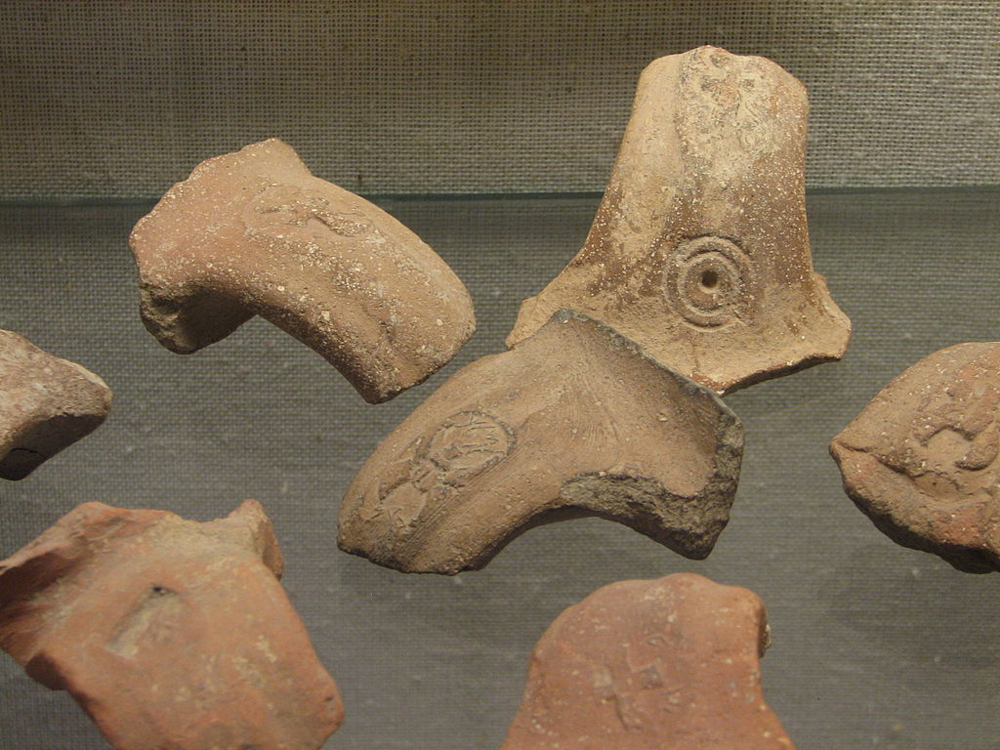



{}Revelation 5 Cross-reference Verses PDF{}

**Video**



| Revelation 5                                                                                                                                                                                                                                                                                                                                                                                                                                                                                                                                                                                                                                                                                                                                                                                                                                                                                                                                                                                                                                                                                                                                                                                                                                                                                                                                                                                                                                                                                                                                                                                                                                                                                                                                                                                                                                                                                                                                                                                                                                                                                                                                                                          |
|---------------------------------------------------------------------------------------------------------------------------------------------------------------------------------------------------------------------------------------------------------------------------------------------------------------------------------------------------------------------------------------------------------------------------------------------------------------------------------------------------------------------------------------------------------------------------------------------------------------------------------------------------------------------------------------------------------------------------------------------------------------------------------------------------------------------------------------------------------------------------------------------------------------------------------------------------------------------------------------------------------------------------------------------------------------------------------------------------------------------------------------------------------------------------------------------------------------------------------------------------------------------------------------------------------------------------------------------------------------------------------------------------------------------------------------------------------------------------------------------------------------------------------------------------------------------------------------------------------------------------------------------------------------------------------------------------------------------------------------------------------------------------------------------------------------------------------------------------------------------------------------------------------------------------------------------------------------------------------------------------------------------------------------------------------------------------------------------------------------------------------------------------------------------------------------|
| 5:1 Next I saw in the right hand of the One sitting on the throne a scroll with writing on both sides and sealed with seven seals; (2) and I saw a mighty angel proclaiming in a loud voice, "Who is worthy to open the scroll and break its seals?" (3) But no one in heaven, on earth or under the earth was able to open the scroll or look inside it. (4) I cried and cried, because no one was found worthy to open the scroll or look inside it. (5) One of the elders said to me, "Don't cry. Look, the Lion of the tribe of Y'hudah, the Root of David, has won the right to open the scroll and its seven seals." (6) Then I saw standing there with the throne and the four living beings, in the circle of the elders, a Lamb that appeared to have been slaughtered. He had seven horns and seven eyes, which are the sevenfold Spirit of God sent out into all the earth. (7) He came and took the scroll out of the right hand of the One sitting on the throne. (8) When he took the scroll, the four living beings and the twenty-four elders fell down in front of the Lamb. Each one held a harp and gold bowls filled with pieces of incense, which are the prayers of God's people; (9) and they sang a new song, "You are worthy to take the scroll and break its seals; because you were slaughtered; at the cost of blood you ransomed for God persons from every tribe, language, people and nation. (10) You made them into a kingdom for God to rule, cohanim to serve him; and they will rule over the earth." (11) Then I looked, and I heard the sound of a vast number of angels—thousands and thousands, millions and millions! They were all around the throne, the living beings and the elders; (12) and they shouted out, "Worthy is the slaughtered Lamb to receive power, riches, wisdom, strength, honor, glory and praise!" (13) And I heard every creature in heaven, on earth, under the earth and on the sea—yes, everything in them—saying, "To the One sitting on the throne and to the Lamb belong praise, honor, glory and power forever and ever!" (14) The four living beings said, "Amen!" and the elders fell down and worshipped.  |

### Rev 5:1 

<small>**Next I saw in the right hand of the One sitting on the throne a scroll with writing on both sides and sealed with seven seals;** </small>

-   A seal would have been made of clay (later, wax) with an imprint of authentication
    -   During the Babylonian destruction of Jerusalem, many documents were destroyed, leaving only the clay seals.
    -   Hundreds of these seals have been found all over Israel
    -   They are called LMLK (l'melech – to the king)
    -   Sometimes they would be tied with a string, with the clay or wax molded around the string – to get to the string, one would need to break the seal
    -   Seals still intact let the bearer know that the contents were not altered
        -   In other words, not added or deleted
        -   <small>Rev 22:18-19 I warn everyone who hears the words of the prophecy of this book: if anyone adds to them, God will add to him the plagues described in this book, (19) and if anyone takes away from the words of the book of this prophecy, God will take away his share in the tree of life and in the holy city, which are described in this book.</small>
-   This scene resembles when the Torah was given to Moses
    -   <small> Exo 32:15-16 Then Moses turned and went down from the mountain with the two tablets of the testimony in his hand, tablets that were **written on both sides; on the front and on the back they were written**. (16) The tablets were the work of God, and the writing was the writing of God, engraved on the tablets.</small>
-   This is also descriptive of legal documents of the ancient world.
    -   Keener notes that many such documents had seven seals, which guaranteed no one had open or tampered with them.
    -   Consider this passage from Jeremiah:
    -   <small>Jer 32:9-15 “And I bought the field at Anathoth from Hanamel my cousin, and weighed out the money to him, seventeen shekels of silver. (10) I signed the deed, sealed it, got witnesses, and weighed the money on scales. (11) Then I took the sealed deed of purchase, containing the terms and conditions and the open copy. (12) And I gave the deed of purchase to Baruch the son of Neriah son of Mahseiah, in the presence of Hanamel my cousin, in the presence of the witnesses who signed the deed of purchase, and in the presence of all the Judeans who were sitting in the court of the guard. (13) I charged Baruch in their presence, saying, (14) ‘Thus says the LORD of hosts, the God of Israel: Take these deeds, both this sealed deed of purchase and this open deed, and put them in an earthenware vessel, that they may last for a long time. (15) For thus says the LORD of hosts, the God of Israel: Houses and fields and vineyards shall again be bought in this land.’</small>
-   The writing on the outside likely provided the terms and conditions for breaking the seals.
    -   <small>Ezek 2:9 And when I looked, behold, a hand was stretched out to me, and behold, a scroll of a book was in it. 10 And he spread it before me. And it had writing on the front and on the back, and there were written on it words of lamentation and mourning and woe. </small>
    -   <small>Zechariah 5:1 Again I lifted my eyes and saw, and behold, a flying scroll! 2 And he said to me, “What do you see?” I answered, “I see a flying scroll. Its length is twenty cubits, and its width ten cubits.” 3 Then he said to me, “This is the curse that goes out over the face of the whole land. For everyone who steals shall be cleaned out according to what is on one side, and everyone who swears falsely shall be cleaned out according to what is on the other side. 4 I will send it out, declares the LORD of hosts, and it shall enter the house of the thief, and the house of him who swears falsely by my name. And it shall remain in his house and consume it, both timber and stones.” </small>
-   This is the same "Ancient of Days" seated on his throne that Daniel and Isaiah saw.
    -   <small>Dan 7:9 “As I looked, thrones were placed, and the Ancient of Days took his seat; his clothing was white as snow, and the hair of his head like pure wool; his throne was fiery flames; its wheels were burning fire. </small>
    -   <small>Isa 6:1 In the year that King Uzziah died I saw the Lord sitting upon a throne, high and lifted up; and the train of his robe filled the temple. </small>
-   The rest of Revelation will describe what happens as the seven seals are removed and the scroll opened.
-   Chuck Missler refers to this scroll as the "title deed to Earth", and this chapter is "the most important escrow closing in history."
-   Other commentators see the "Book of Life" mentioned in Psalm 139:6, Exodus 32:32, and Revelation 3:5.
    -   <small>Exo 32:32-33 But now, if you will forgive their sin—but if not, please blot me out of your book that you have written.” (33) But the LORD said to Moses, “Whoever has sinned against me, I will blot out of my book.</small>

### Rev 5:2-4

<small>**and I saw a mighty angel proclaiming in a loud voice, "Who is worthy to open the scroll and break its seals?" But no one in heaven, on earth or under the earth was able to open the scroll or look inside it. I cried and cried, because no one was found worthy to open the scroll or look inside it.** </small>

-   John apparently has an inkling that this is an extremely important document.
-   A question might be why the One seated on the throne is not worthy
    -   Apparently, it required a **man** to open it but, apparently, no **man** matching the qualifications could be identified.
    -   <small>Is 29:1 And the vision of all this has become to you like the words of a book that is sealed. When men give it to one who can read, saying, “Read this,” he says, “I cannot, for it is sealed.”</small>
    -   <small>Dan 12:9 He said, “Go your way, Daniel, for the words are shut up and sealed until the time of the end. </small>
-   Revelation 5 is a partial fulfillment of these passages that were once sealed but are now about to be unsealed.
    -   Lizorkin writes, "This vision could be completely original to John but reads a little like an adaptation of both Daniel 7, Ezekiel 2 (and possibly) Isaiah 29."[^1]
-   The book of Ruth provides an example of a kinsman-redeemer, which most scholars believe is essentially what is happening in Revelation 5.
    -   Boaz, the goel, the kinsman-Redeemer had to meet the following conditions:
        -   Had to be a kinsman
        -   Had to be able and willing
        -   Had to assume all of the obligations of the beneficiary
-   John weeps because no such redeemer for this particular contract is apparent.
    -   Greek has two different words for crying;
        -   One is more of sobbing and is the word used when Jesus wept over the death of Lazarus (John 11:35)
        -   The other implies being overcome with grief, as when Jesus wept over Jerusalem (Luke 19:41)
        -   The stronger word is used here in Rev 5:4. John was overcome with grief.
    -   This is reminiscent of Daniel 7, where Daniel became physically ill
        -   <small>Dan 7:28 “Here is the end of the matter. As for me, Daniel, my thoughts greatly alarmed me, and my color changed, but I kept the matter in my heart.”</small>
    -   We might find it curious that John did not identify Jesus, the one who loved him, as someone who would have met the terms.
    -   Remember, John is receiving this in a vision; in other words, in his vision, he sees himself weeping.
    -   He weeps because the fate of God's redemptive program hangs in the balance.
    -   All throughout the bible, we see Satan trying to thwart the plan of God.
        -   Examples are the Garden of Eden, the Tower of Babel, the attempts to wipe out Judah's and later David's line, Jesus' temptations, and ultimately the Cross.
    -   For a moment, John is terrified that Satan had succeeded.

[^1]: Eli Lizorkin-Eyzenberg and Pinchas Shir, *Hebrew Insights from Revelation*, Jewish Studies for Christians, 2021, 122.

### Rev 5:5

<small>**One of the elders said to me, "Don't cry. Look, the Lion of the tribe of Y'hudah, the Root of David, has won the right to open the scroll and its seven seals."** </small>

-   These are all Jewish titles
    -   Pre-trib dispensationalists (e.g. Missler) note the 24 titles used of Jesus in chapters 1-3 apply to Him in His role as revealed to the church. From Chapter 4 on in Revelation, only Jewish titles are used, suggesting a distinction between Israel and the Church
    -   Opponents of this viewpoint would cite Roman's 11 where gentiles are "grafted-in" to Israel, as a suggestion that there is no such thing as a different dispensation called "the church age." We are one body, in which there is neither Jew nor Gentile.
    -   Note that both of these camps at least deny Replacement Theology by recognizing Israel's place in God's program.
-   Lion of the tribe of Judah
    -   <small>Gen 49:9 Judah is a lion's cub; from the prey, my son, you have gone up. He stooped down; he crouched as a lion and as a lioness; who dares rouse him? The scepter shall not depart from Judah, nor the ruler's staff from between his feet, until tribute (or "Shiloh") comes to him; and to him shall be the obedience of the peoples. </small>
    -   Jewish sages have long interpreted this as a prophecy of the Messiah
    -   The "scepter" was viewed as the ability of the nation to carry out capital punishment.
        -   Josephus records that when Herod Archelaus was deposed around 6 or 7 AD
        -   At some point after this, the Romans took away the Jews' authority to carry out capital punishment.
        -   The Talmud records weeping, saying "Woe unto us for the scepter has departed from Judah and the Messiah has not come!"
        -   They believed the word of God had failed.
        -   This adds new significance to Luke 2 where Jesus publicly presented himself at the temple at age 12, most likely BEFORE the Sanhedrin was stripped of this power.
-   Root of David
    -   This terminology comes from Isaiah 11, which describes Messiah as a root of Jessie, king David's father.
    -   Isaiah 11 also describes a messianic peace, where Gentiles and a regathered Israel will dwell together.
    -   <small> Isaiah 11:1 There shall come forth a shoot from the stump of Jesse, and a branch from his roots shall bear fruit 
    - Isa 11:10-12 In that day the root of Jesse, who shall stand as a signal for the peoples—of him shall the nations (i.e., "gentiles") inquire, and his resting (or "dwelling") place shall be glorious. (11) In that day the Lord will extend his hand yet a second time to recover the remnant that remains of his people (Israel), from Assyria, from Egypt, from Pathros, from Cush, from Elam, from Shinar, from Hamath, and from the coastlands of the sea. (12) He will raise a signal for the nations and will assemble the banished of Israel, and gather the dispersed of Judah from the four corners of the earth.</small>
    -   This is why Matthew and Luke MUST establish Jesus' connection to David. Everything hinges upon it
        -   <small>Mat 1:1 The book of the genealogy of Jesus Christ, the son of David, the son of Abraham. </small>
        -   <small>Luk 1:31-33 And behold, you will conceive in your womb and bear a son, and you shall call his name Jesus. (32) He will be great and will be called the Son of the Most High. And the Lord God will give to him the throne of his father David, (33) and he will reign over the house of Jacob forever, and of his kingdom there will be no end.”</small>
-   By His perfect obedience in life and death, Jesus won the victory over our sin and won the right to open the seals.

### Rev 5:6

<small>**Then I saw standing there with (in the midst of) the throne and the four living beings, in the circle of the elders, a Lamb that appeared to have been slaughtered. He had seven horns and seven eyes, which are the sevenfold Spirit of God sent out into all the earth**. </small>

-   Lamb as it has been slaughtered
    -   This is reminiscent of the Passover sacrifice
    -   <small> Exo 12:21 Then Moses called all the elders of Israel and said to them, “Go and select lambs for yourselves according to your clans, and kill the Passover lamb.</small>
    -   The original Passover sacrifice spared the people from the plague
        -   <small> Exo 12:13 The blood shall be a sign for you, on the houses where you are. And when I see the blood, I will pass over you, and no plague will befall you to destroy you, when I strike the land of Egypt. </small>
    -   In the same way, this Lamb will save His people from the plagues that are to come as we progress through revelation.
        -   HOW God chooses to preserve His people is up to Him (maybe rapture, maybe martyrdom, maybe some other form of preservation).
        -   Jesus didn't get a pass from death
            -   I'm not sure we should expect a pass through the rapture
            -   Remember, many of the promises to the overcomers in Chapters 1-3 will happen after our earthly deaths.
    -   The famous "suffering servant" passage of Isaiah 53 also contains a reference to a lamb to be slaughtered (Isa 53:7-8).
    -   John the Baptist described Jesus as the "Lamb of God who takes away the sin of the world," a remarkable comment as Jesus had not yet been sacrificed (John 1:29).
    -   When Jesus institutes Holy Communion, He did so at a Passover seder. The connection of His blood with the Passover Lamb's blood would have been unmistakable for the disciples.
        -   I encourage us all, whenever we hear a reference to being saved by the Blood of Christ, to say to ourselves, "oh, just like the Passover Lamb's blood saved the Israelites in Egypt."
        -   A study of the Passover feast, even as it is practiced today, is incredibly worthwhile.
    -   Note that a powerful lion and a slaughtered lamb are just about as opposite as two creatures can be; yet, Jesus is both.
    -   Put yourself in the position of the early 1st Century followers of Jesus.
        -   Which "Jesus" would you have wanted: the Lion or the Lamb?
        -   Be honest.
        -   Can you begin to understand how the Jews of Jesus' day thought this couldn't be the same person? There must be two messiahs.
            -   Messiah ben Joseph – suffering lamb (which became allegorized as suffering Israel)
            -   Messiah ben David – conquering lion
-   Seven Horns, i.e., all-powerful
    -   Horns are a symbol of authority.
    -   <small>Psa 75:4-5 I say to the boastful, ‘Do not boast,’ and to the wicked, ‘Do not lift up your horn; (5) do not lift up your horn on high, or speak with haughty neck.’”</small>
    -   Jesus references this power in the Great Commission
        -   <small>Mat 28:18 And Jesus came and said to them, “All authority in heaven and on earth has been given to me. </small>
        -   I suspect the "Father" handing the "Son" the scroll in the next symbolizes this authority-sharing arrangement.
-   Seven Eyes, i.e., all-seeing
    -  <small> **Zec 3:9** For behold, on the stone that I have set before Joshua (the high priest), on a single stone with **seven eyes**, I will engrave its inscription, declares the LORD of hosts, and I will remove the iniquity of this land in a single day.</small>
    -   <small>**Zec 4:10** For whoever has despised the day of small things shall rejoice, and shall see the plumb line in the hand of Zerubbabel. “These **seven** are the **eyes of the LORD, which range through the whole earth**.”</small>
-   Sevenfold spirit
    -   Some scholars (including Lancaster) believe the sevenfold spirit is not what we think of as the Holy Spirit, but are the image of the traditional seven archangels of Judaism (Michael, Raphael, Gabriel, Uriel, Saraqael, Raguel, and Remiel).
    -   Although cited in the apocryphal Book of Enoch, possible support for this view may be seen at Rev 8:2: <small>Then I saw the seven angels who stand before God, and seven trumpets were given to them.</small>
-   There is perhaps an even deeper significance to John's referencing one who was slaughtered.
    -   As is the case today, a will can only be executed upon the death of the person in question.
    -   Keener writes, "If a (type of) will in in view here, it is significant that it is the lamb **who had been slain** who is worthy to open it."[^2]
    -   Keep in mind that seven times, Paul used the word "inheritance" to describe a reward for faithfully serving Jesus the Messiah.
        -   <small>Eph 1:11 In him we have obtained an inheritance, having been predestined according to the purpose of him who works all things according to the counsel of his will. </small>
        -   <small>Col 3:24 knowing that from the Lord you will receive the inheritance as your reward. You are serving the Lord Christ. </small>

[^2]: Craig S. Keener, *The IVP Bible Background Commentary: New Testament*, 2nd edition (E-Sword) (Downers Grove, Illinois: IVP Academic, 2014), v. Rev 5:7.

### Rev 5:7-8

<small>**He came and took the scroll out of the right hand of the One sitting on the throne. When he took the scroll, the four living beings and the twenty-four elders fell down in front of the Lamb. Each one held a harp and gold bowls filled with pieces of incense, which are the prayers of God's people;** </small>

-   One like a son of man approaching the Ancient of Days
    -   <small>Dan 7:13-14 “I saw in the night visions, and behold, with the clouds of heaven there came one like a son of man, and he came to the Ancient of Days and was presented before him. (14) And to him was given dominion and glory and a kingdom, that all peoples, nations, and languages should serve him; his dominion is an everlasting dominion, which shall not pass away, and his kingdom one that shall not be destroyed.</small>
    -   Again, this reminds us that we need to hold to *our* understanding of the Trinity very loosely.
        -   Jesus is equal in power and glory to the Father (in other words, Jesus is not a "lesser" God), yet in some way, He is subordinate and submissive to the Father.
-   Bradford sees a comparison between Messiah receiving the scroll from the Father and Moses receiving the tablets from the Father.
    -   "A prophet like unto Moses" was promised
    -   <small>Deu 18:15 “The LORD your God will raise up for you a prophet like me from among you, from your brothers—it is to him you shall listen." </small>
-   We may miss what is going on, but the elders and the four living beings did not!
    -   People in the Bible who bow to angels and other servants of the LORD are usually rebuked.
        -   There is one angel who made an exception and he's in a lot of trouble.
    -   They are bowing because this is not just any "one like a son of man," this is God the Son who is taking the scroll from God the Father.
-   Harp
    -   <small>1Ch 25:1 David and the chiefs of the service also set apart for the service the sons of Asaph, and of Heman, and of Jeduthun, who prophesied with lyres, with harps, and with cymbals. </small>
    -   Walton notes that music played an important role in receiving an oracle.[^3]
-   Prayers/Incense
    -   <small>Psa 141:2 Let my prayer be counted as incense before you, and the lifting up of my hands as the evening sacrifice!</small>
    -   <small>Rev 8:3-4 And another angel came and stood at the altar with a golden censer, and he was given much incense to offer with the prayers of all the saints on the golden altar before the throne, (4) and the smoke of the incense, with the prayers of the saints, rose before God from the hand of the angel.</small>

[^3]: John H. Walton, Victor H. Matthews, and Mark W. Chavalas, *The IVP Bible Background Commentary: Old Testament*, (E-Sword) (Downers Grove, Ill: IVP Academic, 2000), v. 1 Chr 25:1.

### Rev 5:9-10

<small> **and they sang a new song, "You are worthy to take the scroll and break its seals; because you were slaughtered; at the cost of blood you ransomed for God persons from every tribe, language, people and nation. You made them into a kingdom for God to rule, cohanim to serve him; and they will rule over the earth."** </small>

-   New song
    -   <small>Isa 42:9-12 Behold, the former things have come to pass, and new things I now declare; before they spring forth I tell you of them.” (10) Sing to the LORD a new song, his praise from the end of the earth, you who go down to the sea, and all that fills it, the coastlands and their inhabitants. (11) Let the desert and its cities lift up their voice, the villages that Kedar inhabits; let the habitants of Sela sing for joy, let them shout from the top of the mountains. (12) Let them give glory to the LORD, and declare his praise in the coastlands.</small>
    -   Several times in the Psalms, such as <small> Psa 33:3 Sing to him a new song; play skillfully on the strings, with loud shouts. </small>
-   Blood
    -   To recap the discussion above, by the blood of the Passover lamb, God delivered the Israelites from bondage to be a kingdom and a priesthood to serve Him and rule the nation.
        -   By the blood of Jesus, the Lamb of God, He delivered us from bondage to be a kingdom and a priesthood to serve Him and rule over the earth.
-   Kingdom
    -   <small>Exo 19:4-6 ‘You yourselves have seen what I did to the Egyptians, and how I bore you on eagles' wings and brought you to myself. (5) Now therefore, if you will indeed obey my voice and keep my covenant, you shall be my treasured possession among all peoples, for all the earth is mine; (6) and you shall be to me a kingdom of priests and a holy nation.’ These are the words that you shall speak to the people of Israel.” </small>
    -   <small>Daniel 7:18 But the saints of the Most High shall receive the kingdom and possess the kingdom forever, forever and ever.’ </small>
    -   <small>Daniel 7:27 And the kingdom and the dominion and the greatness of the kingdoms under the whole heaven. </small>
    -   <small>1 Pe 2:9 But you are a chosen race, a royal priesthood, a holy nation, a people for his own possession, that you may proclaim the excellencies of him who called you out of darkness into his marvelous light. </small>
-   Remember, the original congregations receiving Revelation were exiled in a thoroughly pagan environment and were suffering varying degrees of persecution.
    -   This passage would remind them that the heavenly congregation stood in solidarity with them
    -   The members of the earthly fellowships will one day rule over the earth despite their present situation which was exactly the opposite.
    -   The Dead Sea Scrolls contain similar imagery of earthly worshippers envisioning themselves participating in heavenly worship with angels.
-   This vision broke with other Jewish apocalyptic literature which described Israel as inheriting the kingdom and ruling over the nations.
    -   John's revelation has Gentile as well as Jewish believers inheriting and ruling over the nations in the Age to Come.
    -   This is represented by the "millions and millions" in verse 11.

### Rev 5:11-12

<small>**Then I looked, and I heard the sound of a vast number of angels—thousands and thousands, millions and millions! They were all around the throne, the living beings, and the elders; and they shouted out, "Worthy is the slaughtered Lamb to receive power, riches, wisdom, strength, honor, glory, and praise!"**</small>

-   Ten thousands
    -   <small>Deut 33:2 He said, “The LORD came from Sinai and dawned from Seir upon us; he shone forth from Mount Paran; he came from the ten thousands of holy ones, with flaming fire at his right hand.</small>
    -   In the CJB, Stern paraphrases the underlying Greek, which, literally is "ten thousands of ten thousands," which is an idiom meaning "innumerable."
    -   Daniel 7:14 is also in view: <small>"all peoples, nations, and languages should serve him"</small>
-   We shouldn't lose sight of the groups of seven, even when the number "seven" is not enumerated. Note the group of seven praises in verse 12.

### Rev 5:13-14

<small>**And I heard every creature in heaven, on earth, under the earth and on the sea—yes, everything in them—saying, "To the One sitting on the throne and to the Lamb belong praise, honor, glory and power forever and ever!" The four living beings said, "Amen!" and the elders fell down and worshipped.**</small>

-   Every knee shall bow –
    -   <small>Isa 45:23 By myself I have sworn; from my mouth has gone out in righteousness a word that shall not return: ‘To me every knee shall bow, every tongue shall swear allegiance.’</small>
    -   Also quoted by Paul in Romans 14:11 and Philippians 2:9-11.
-   "Amen" אָמֵן is the one Hebrew word EVERYBODY in almost EVERY LANGUAGE knows!
-   Paul exhorts us to remember Jesus in His glorified state
    -   <small>Php 2:5-11 **Have this mind among yourselves, which is yours in Christ Jesus**, (6) who, though he was in the form of God, did not count equality with God a thing to be grasped, (7) but emptied himself, by taking the form of a servant, being born in the likeness of men. (8) And being found in human form, he humbled himself by becoming obedient to the point of death, even death on a cross. (9) Therefore God has highly exalted him and bestowed on him the name that is above every name, (10) so that at the name of Jesus every knee should bow, in heaven and on earth and under the earth, (11) and every tongue confess that Jesus Christ is Lord, to the glory of God the Father.</small>

### Conclusion

-   We could ask, "Is your Jesus the one still hanging on a cross, or is your Jesus the one, the only one, who is worthy to take the scroll and be worshipped?"
-   Now the scene will shift to the physical realm on earth. Many would view this as the "Day of the Lord", which is not just a day on the calendar but a period of seven years prophesied by Daniel in Daniel 9.

 
