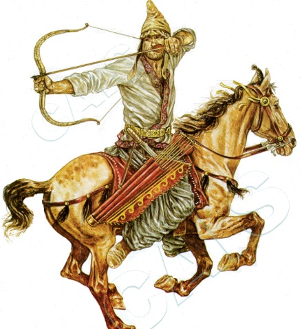



**Video**



**Read/hear the portions**:

<small>**Rev 6:1-17 Next, I watched as the Lamb broke the first of the seven seals, and I heard one of the four living beings say in a thundering voice, "Go!" (2) I looked, and there in front of me was a white horse; its rider had a bow and was given a crown, and he rode off as a conqueror to conquer. (3) When he broke the second seal, I heard the second living being say, "Go!" (4) Another horse went out, a red one; and its rider was given the power to take peace away from the earth and make people slaughter each other. He was given a great sword. (5) When he broke the third seal, I heard the third living being say, "Go!" I looked, and there in front of me was a black horse, and its rider held in his hand a pair of scales. (6) Then I heard what sounded like a voice from among the four living beings say, "Two pounds of wheat for a day's wages! Six pounds of barley for the same price! But don't damage the oil or the wine!" (7) When he broke the fourth seal, I heard the voice of the fourth living being say, "Go!" (8) I looked, and there in front of me was a pallid, sickly-looking horse. Its rider's name was Death, and Sh'ol followed behind him. They were given authority to kill one-quarter of the world by war, by famine, by plagues and with the wild animals of the earth. (9) When the Lamb broke the fifth seal, I saw underneath the altar the souls of those who had been put to death for proclaiming the Word of God, that is, for bearing witness. (10) They cried out in a loud voice, "Sovereign Ruler, HaKadosh, the True One, how long will it be before you judge the people living on earth and avenge our blood?" (11) Each of them was given a white robe; and they were told to wait a little longer, until the full number of their fellow-servants should be reached, of their brothers who would be killed, just as they had been. (12) Then I watched as he broke the sixth seal, and there was a great earthquake, the sun turned black as sackcloth worn in mourning, and the full moon became blood-red. (13) The stars fell from heaven to earth just as a fig tree drops its figs when shaken by a strong wind. (14) The sky receded like a scroll being rolled up, and every mountain and island was moved from its place. (15) Then the earth's kings, the rulers, the generals, the rich and the mighty—indeed, everyone, slave and free—hid himself in caves and among the rocks in the mountains, (16) and said to the mountains and rocks, "Fall on us, and hide us from the face of the One sitting on the throne and from the fury of the Lamb! (17) For the Great Day of their fury has come, and who can stand?"**</small>

## 

## Four Horseman of the Apocalypse

-   The beginning of the woes that will unfold throughout the rest of the book
-   Talmud discusses a seven-year period of calamity followed by the establishment of the Messianic kingdom. There is a general expectation that before the coming of the Messiah, there will be a period of tribulation leading up to the final redemption.
-   Revelation has echoes of Exodus and the plagues on Egypt, with the deliverance of God's people through the plagues.
-   Horsemen imagery appears twice in Zechariah
    -   <small>Zec 1:8-11 “I saw in the night, and behold, a man riding on a red horse! He was standing among the myrtle trees in the glen, and behind him were red sorrel, and white horses. (9) Then I said, ‘What are these, my lord?’ The angel who talked with me said to me, ‘I will show you what they are.’ (10) So the man who was standing among the myrtle trees answered, ‘These are they whom the LORD has sent to patrol the earth.’ (11) And they answered the angel of the LORD who was standing among the myrtle trees, and said, ‘We have patrolled the earth, and behold, all the earth remains at rest.’</small>
    -   <small>Zec 6:1-8 Again I lifted my eyes and saw, and behold, four chariots came out from between two mountains. And the mountains were mountains of bronze. (2) The first chariot had red horses, the second black horses, (3) the third white horses, and the fourth chariot dappled horses—all of them strong. (4) Then I answered and said to the angel who talked with me, “What are these, my lord?” (5) And the angel answered and said to me, “These are going out to the four winds of heaven (cf. Rev 7:1), after presenting themselves before the Lord of all the earth. (6) The chariot with the black horses goes toward the north country, the white ones go after them, and the dappled ones go toward the south country.” (7) When the strong horses came out, they were impatient to go and patrol the earth. And he said, “Go, patrol the earth.” So they patrolled the earth. (8) Then he cried to me, “Behold, those who go toward the north country have set my Spirit at rest in the north country.”</small>
    -   Both passages describe members of the divine council sent out to patrol the earth and report back
-   Most ancient cultures had legends of divine judgments such as war and famine.[^1]
-   Indeed, Jesus predicted these in the Olivet Discourse:
    -   <small>Mat 24:6-8 And you will hear of wars and rumors of wars. See that you are not alarmed, for this must take place, but the end is not yet. (7) For nation will rise against nation, and kingdom against kingdom, and there will be famines and earthquakes in various places. (8) All these are but the beginning of the birth pains.</small>
-   In a sense, all four horsemen (plus the 5th seal of martyrdom) have been at work throughout human history, particularly in the 20th century.
- Hence, the comparison to a woman in labor, with increasing contractions.
    -   Jesus says not to be alarmed, (24:6), but instead, we need to get excited!
    -   <small>Luke 21:28 Now when these things begin to take place, straighten up and raise your heads, because your redemption is drawing near.”</small>

[^1]: Craig S. Keener, *The IVP Bible Background Commentary: New Testament*, 2nd edition (E-Sword) (Downers Grove, Illinois: IVP Academic, 2014), v. Rev 6:1.

### Rev 6:1 First Seal

<small> **Next I watched as the Lamb broke the first of the seven seals, and I heard one of the four living beings say in a thundering voice, "Go!"** </small>

-   An interesting point is that the horsemen are not part of the document itself.
-   The document cannot be opened and read until all the seals are broken (i.e. after the seventh seal is broken in Revelation 8:1).
-   Some interpret the document as the redemption of man and earth, but just like the redemption of Israel from Egypt, judgment, and deliverance from the oppressors was required first.
-   Remember, Jesus is opening the seals in front of the Elders, the four living creatures and "millions and millions", perhaps suggesting the heavenly witnesses mentioned in Deuteronomy and Psalms.[^2]
    -   **Deu 30:19** I call heaven and earth to witness against you today, that I have set before you life and death, blessing and curse. Therefore choose life, that you and your offspring may live,
    -   **Psa 50:4** He calls to the heavens above and to the earth, that he may judge his people:
-   Missler pointed out that when the elders speak, the subject is heaven but when the living creatures speak, the subject is earth.[^3]
-   Lancaster adds, saying that the command could be translated as "Come!", meaning come down from the heavenly realm and go down to earth.[^4]

[^2]: Keener, vol. Rev 6:1.

[^3]: Chuck Missler, *The Book of Revelation Handbook* (Koinonia House, 2005), 141.

[^4]: Daniel Lancaster, “The Four Horsemen,” Text, Beth Immanuel Messianic Synagogue, April 28, 2016, https://www.bethimmanuel.org/audio/four-horsemen.

### Rev 6:2 White

<small> **I looked, and there in front of me was a white horse; its rider had a bow and was given a crown; and he rode off as a conqueror to conquer.** </small>

-   Potential anti-Roman imagery here.
    -   The biggest threat to the Roman Empire was the Parthians, who were known as being hyper-skilled in archery and, according to Keener, they typically rode white horses
        -   You may have heard the phrase "the Parthian shot" (aka the 'parting' shot).
        -   The Parthians could bring down a bird in flight, right or left-handed, even while facing backward on a horse at full gallop.
        -   According to Wikipedia, the stirrup had not yet been invented, so this was all leg and core strength.[^5]
        -   When they shot at their enemies while retreating or faking a retreat, it became known as the Parthian Shot
        -   Somewhere along the line, this got misunderstood as a "parting" shot, which still fits as a metaphor
    -   As an aside, one reason Herod and all Jerusalem "was in an uproar" in Matthew 2:3 could have been that they suspected the visit of the eastern Magi was the beginning of a Parthian invasion (three guys on camels would not have caused this fear).

#### Identity of Rider?

-   Some commentators see Jesus here as the man with the crown on a white horse.
    -   As Missler says, "This guy keeps bad company (the other three horses). Christ is opening the seals; He is not inside them."[^6]
-   Some other commentators say this is the gospel message going out. This is also unlikely, given that the other three riders bring death and destruction.
-   Some have also suggested that this is the false Messiah on a white horse with a crown (we will see the REAL Messiah on a white horse in Chapter 19).
    -   In other words, this rider doesn't conquer by war because he doesn't have to.
    -   He deceives the people by pretending to come in peace.
    -   This crown is the *stephanos*, the victor's wreath, not the *diadem* that Jesus will wear, indicating he's the sovereign, reigning king.
    -   He carries a bow just like Nimrod the hunter did; Nimrod was the first global deceiver (the first human one anyway). Genesis 10.
    -   However, this view is also potentially troublesome when we consider that Jesus is the one ostensibly sending the antichrist.
-   It is best to consider the riders as similar to the "destroyer/death angel" of Exodus 12:23 – it is an otherwise unidentified supernatural (angelic) being sent to carry out God's judgment.

#### Other notes

-   The Hebrew word (קֶשֶׁת) is used either for the bow as a weapon or the bow as the sign of the covenant with Noah (Gen 9:13).
    -   The conquest may be a seemingly peaceful treaty, or it could be a weapon.
-   In any case, the ancient readers would have understood that this horseman represented conquest.
-   While "Sword, feminine, and pestilence" are frequent idioms throughout the Bible, the prophets did not apparently see the false white horse.
    -   Jer 14:12; Jer 24:10; Jer 27:8; Eze 6:11; Eze 7:15; Eze 12:16
    -   Suppose sword, feminine, and pestilence are external threats. In that case, the false white horse possibly represents the enemy within – the enemy we welcome into our ecclesia with open arms but who is only there to conquer.
-   Lancaster: this is the spirit of conquest that has always existed throughout humanity,[^7] perhaps taking a specific form in the final days.

[^5]: “Parthian Shot,” in *Wikipedia*, February 20, 2022, https://en.wikipedia.org/w/index.php?title=Parthian_shot&oldid=1073031295.

[^6]: Missler, *The Book of Revelation Handbook*, 141.

[^7]: Lancaster, “The Four Horsemen.”

### Rev 6:3-4 Red

<small> **When he broke the second seal, I heard the second living being say, "Go!" Another horse went out, a red one; and its rider was given the power to take peace away from the earth and make people slaughter each other. He was given a great sword**. </small>

- <small>Mat 24:10  And then many will fall away and betray one another and hate one another.</small>
-   Note "given the power" – all horsemen have to have God's permission.
-   Red has long been associated with war – Mars was the Roman god of war. Hence Mars is the "red planet."
-   Later in Revelation, we see the red dragon (Rev 12:3) and the red beast (Rev 17:3).
-   Lancaster: this is the spirit of war, including civil war-brother against brother. It unleashes the worst in man, as we saw during the 20th century.[^8]
-   Stern sees the 1st and 2nd seals as both representing war, but in two different aspects.[^9]
    -   1st seal – subjecting peoples one to another
    -   2nd seal – hate between nations

[^8]: Lancaster.

[^9]: David H. Stern, *Jewish New Testament Commentary: A Companion Volume to the Jewish New Testament*, E-Sword edition (Clarksville, Md.: Lederer Messianic Publications, 1992), v. Rev 6:1-8.

### Rev 6:5-6 Famine

<small>**When he broke the third seal, I heard the third living being say, "Go!" I looked, and there in front of me was a black horse, and its rider held in his hand a pair of scales.** **Then I heard what sounded like a voice from among the four living beings say, "Two pounds of wheat for a day's wages! Six pounds of barley for the same price! But don't damage the oil or the wine!"** </small>

-   The scales suggest rationing – every ounce of product sold was to be carefully measured.
-   Keener suggests the price of the wheat is 10x what it should be, so a family would be forced to buy the cheaper and less nourishing barley.
-   When we hear "pounds," in our minds, we think of weight, not volume.
    -   Wheat is usually sold by volume: such as one quart of wheat and three quarts of barley.
    -   During times of famine, selling bread by weight is attested to in the Scripture.
        -   Lev 26:26 When I break your supply of bread, ten women shall bake your bread in a single oven and shall dole out your bread again by weight, and you shall eat and not be satisfied.
        -   Eze 4:10 And your food that you eat shall be by weight, twenty shekels a day; from day to day you shall eat it.
-   Day's wage – literally a denarius. We see this unit of measure frequently in the Gospels.
    -   Barley and wheat were basic necessities; oil and wine were luxuries.
    -   In the Messianic Era, there will be an abundance of Wine and Oil
        -   To Lancaster, the fact that the oil and wine are not touched suggests a short duration of the famine.
        -   These crops would take many years to replace, likely jeopardizing availability in the messianic kingdom if they were touched.[^10]
-   Josephus records that famine killed more Jews during the First Jewish War than the Romans. At one point, when the Romans burst into the homes in Jerusalem, they were surprised to find most were already dead.
-   This was around 20-25 years before Revelation was written, so it would have still been on the minds of many of the recipients (like the mention of a "plane crashing into a building" would still be a fresh memory for many of us).

[^10]: Lancaster, “The Four Horsemen.”

### Rev 6:7-8 Pale

<small> **When he broke the fourth seal, I heard the voice of the fourth living being say, "Go!"** **I looked, and there in front of me was a pallid, sickly-looking horse. Its rider's name was Death, and Sh'ol followed behind him. They were given authority to kill one-quarter of the world by war, by famine, by plagues and with the wild animals of the earth.** </small>

-   In Revelation 1, Messiah holds the keys to Death and Hades. He has full authority over them.
-   The translators have a tough time describing this color
    -   Here the Greek word is *chloros* (chlorine, chlorophyll) – like a pale green

-   In Zech 1, it's "sorrell" (pale brown); Zech 6: "dappled" (patchy, spotty), in CJB/ESV it's pallid/pale.
-   In any case, "sickly" is the thought (like the nauseated emoji).
-   <small>Eze 14:21 “For thus says the Lord GOD: How much more when I send upon Jerusalem my four disastrous acts of judgment, sword, famine, wild beasts, and pestilence, to cut off from it man and beast! </small>
-   <small>Eze 5:15-17 You shall be a reproach and a taunt, a warning and a horror, to the nations all around you, when I execute judgments on you in anger and fury, and with furious rebukes—I am the LORD; I have spoken— when I send against you the deadly arrows of famine, arrows for destruction, which I will send to destroy you, and when I bring more and more famine upon you and break your supply of bread. I will send famine and wild beasts against you, and they will rob you of your children. Pestilence and blood shall pass through you, and I will bring the sword upon you. I am the LORD; I have spoken.” </small>
-   Death claims the body, and Sheol/Hades claims the soul. Potentially this is the death and destruction that result from the first three seals.
-   Missler says don't discount microscopic "wild animals."[^11] And he passed away before COVID.

[^11]: Missler, *The Book of Revelation Handbook*, 144.

## The 5th Seal: Martyrs

### Rev 6:9

<small> **When the Lamb broke the fifth seal, I saw underneath the altar the souls of those who had been put to death for proclaiming the Word of God, that is, for bearing witness.** </small>

-   <small>Lev 17:11  For the life of the flesh is in the blood, and I have given it for you on the altar to make atonement for your souls, for it is the blood that makes atonement by the life.</small>
-   Messianic Rabbi Lichtenstein explains: "This is in accordance with the Jewish faith that says the souls of the righteous who were killed are like offerings upon the heavenly altar in the heavenly temple."
    -   Just as Messiah did
    -   <small>Hebrews 9:23-24: Thus, it was necessary for the copies of the heavenly things to be purified with these rites, but the heavenly things themselves with better sacrifices than these. For Christ has entered, not into holy places made with hands, which are copies of the true things, but into heaven itself, now to appear in the presence of God on our behalf. </small>
-   God has not forgotten about those in Asia martyred for His name; they will be vindicated (those who perished under persecutions of Nero, Jewish War, Domitian, etc.)
-   Here, the martyrs are viewed as sacrifices just like the Passover Lamb of Revelation 5
-   <small>Lev 5:9 and he shall sprinkle some of the blood of the sin offering on the side of the altar, while the rest of the blood shall be drained out at the base of the altar; it is a sin offering. </small>
-   John apparently can "see" souls in his visionary state.
-   If the first four seals parallel Matthew 24:5-8, note Matthew 24:9: Mat 24:9 “Then they will deliver you up to tribulation and put you to death, and you will be hated by all nations for my name's sake."

### Rev 6:10

<small> **They cried out in a loud voice, "Sovereign Ruler, HaKadosh, the True One, how long will it be before you judge the people living on earth and avenge our blood?"** </small>

-   In the Bible, blood guilt is a much larger issue than many realize.
    -   It stains the entire community, and God will avenge it.
    -   In a sense, their shed blood is crying out just like Able's in <small> Gen 4:10 And the LORD said, “What have you done? The voice of your brother's blood is crying to me from the ground. </small>
    -   <small> Mat 23:35 so that on you may come all the righteous blood shed on earth, from the blood of righteous Abel to the blood of Zechariah, the son of Barachiah, whom you murdered between the sanctuary and the altar. </small>
        -   In the arrangement of the Hebrew Bible, Zechariah is the last recorded martyr in 2 Chronicles 24.
    -   <small> Deu 32:43 “Rejoice with him, O heavens; bow down to him, all gods, for he avenges the blood of his children and takes vengeance on his adversaries. He repays those who hate him and cleanses his people's land.” </small>
    -   <small> Psa 79:10 Why should the nations say, “Where is their God?” Let the avenging of the outpoured blood of your servants be known among the nations before our eyes! </small>
-   "How long?" (in the sense of "when will You make things right?") is a common refrain, particularly in the Psalms.
    -   <small> Psa 13:1-2 To the choirmaster. A Psalm of David. How long, O LORD? Will you forget me forever? How long will you hide your face from me? (2) How long must I take counsel in my soul and have sorrow in my heart all the day? How long shall my enemy be exalted over me? </small>
    -   <small> Zec 1:12 Then the angel of the LORD said, ‘O LORD of hosts, how long will you have no mercy on Jerusalem and the cities of Judah, against which you have been angry these seventy years?’ </small>
-   "How long?" could also mean duration.
    -   <small> Isa 6:11-13 Then I said, “How long, O Lord?” And he said: “Until cities lie waste without inhabitant, and houses without people, and the land is a desolate waste, (12) and the LORD removes people far away, and the forsaken places are many in the midst of the land. (13) And though a tenth remain in it, it will be burned again, like a terebinth or an oak, whose stump remains when it is felled.” The holy seed is its stump. </small>
-   A good general reminder is that vengeance is God's option, not ours.
    -   <small> Rom 12:19 Beloved, never avenge yourselves, but leave it to the wrath of God, for it is written, “Vengeance is mine, I will repay, says the Lord.” </small>
    -   <small> Mat 5:44-45 But I say to you, Love your enemies and pray for those who persecute you, so that you may be sons of your Father who is in heaven. </small>

### Rev 6:11

<small> **Each of them was given a white robe; and they were told to wait a little longer, until the full number of their fellow servants should be reached, of their brothers who would be killed, just as they had been.** </small>

-   This verse reminds us that we need to have the Heavenly perspective, not an earthly one.
-   It may appear that the enemy is winning, but that's a façade.
-   The martyrs receive white robes; in other words, they are pure and ceremonially clean in God's eyes.
-   <small> Rev 17:6 And I saw the woman, drunk with the blood of the saints, the blood of the martyrs of Jesus. When I saw her, I marveled greatly. </small>
-   <small> Rev 18:24 And in her was found the blood of prophets and of saints, and of all who have been slain on earth.” </small>
-   Ultimately, unlike the immediate unleashing of the judgment of the first four seals, the 5th seal promises judgment, but judgment is deferred.
-   Reminiscent of Genesis 15:14-16: <small>But I will bring judgment on the nation that they serve, and afterward they shall come out with great possessions. As for you, you shall go to your fathers in peace; you shall be buried in a good old age. And they shall come back here in the fourth generation, for the iniquity of the Amorites is not yet complete.” </small>
-   The Son of David will not come until the blood of the last martyr has been shed.[^31]
-   White robe is possibly a temporary covering until the martyrs receive their outer bodies to be restored in the resurrection.

[^31]: Lancaster.

## Timing questions

While some scholars see the seals, trumpets, and bowls as sequential, one happening after the other in chronological order, other scholars see amplification or parallelism. In other words, the seven trumpets describe the tribulation, then the trumpets and then the bowels/vials go back and pick out different aspects of the tribulation. Scholars in this camp note that the 6th and 7th seals, the 6th and 7th trumpets, and the 6th and 7th bowls all seem to be referencing the end of this age.

Also, as opposed to all seals being yet future, some scholars (e.g., Lancaster citing Lichtenstein) see the first five seals as already opened, while the 6th and 7th are yet future. This is based on a reading of the order given in Matthew 24 and Luke 21, as well as by simple observation of the world around us throughout history.

24:6 talks about wars and rumors of wars but says the "end is not yet." As we looked at before, in the Luke account, Jesus says to "look up, for your redemption draws near." Remember, he was telling that to His 1st-century disciples.

Finally, we have the Gospel going to the ends of the earth, which presumably would need to happen before the "restrainer" is removed. 

Matthew 24:9 talks about martyrs, which is the 5th seal. We can see that most of the calamities described thus far in Matthew 24 have been happening. Then we have a passage on the Abomination of Desolation (24:15-28), which has NOT happened yet.

Then in Matthew 24:29, we see what appears to be the 6th seal:

<small>Mat 24:29 “Immediately after the tribulation of those days the sun will be darkened, and the moon will not give its light, and the stars will fall from heaven, and the powers of the heavens will be shaken." </small>

In other words, right now we are in between the opening of the 5th and 6th seals.

## The Sixth seal

### Rev 6:12-14

<small> **Then I watched as he broke the sixth seal, and there was a great earthquake, the sun turned black as sackcloth worn in mourning, and the full moon became blood-red.**  **The stars fell from heaven to earth just as a fig tree drops its figs when shaken by a strong wind.** **The sky receded like a scroll being rolled up, and every mountain and island was moved from its place.** </small>

-   As we talked about in chapters 2-3, earthquakes were prevalent, and often quite destructive in Asia Minor.
-   1st of three earthquakes in Revelation: Rev 6:12; Rev 11:13;Rev 16:18-19.
-   Darkness recalls the ten plagues.
    -   <small>Exo 10:21 Then the LORD said to Moses, “Stretch out your hand toward heaven, that there may be darkness over the land of Egypt, a darkness to be felt.” </small>
    -   A "darkness to be felt" is not natural darkness. There is much more going on here than merely the absence of light.
-   Similar descriptions appear in Isaiah, Ezekiel, Amos, and Daniel
    -   <small>Isa 13:9-10 Behold, the day of the LORD comes, cruel, with wrath and fierce anger, to make the land a desolation and to destroy its sinners from it. (10) For the stars of the heavens and their constellations will not give their light; the sun will be dark at its rising, and the moon will not shed its light. </small>
    -   <small>Eze 32:7-8 When I blot you (speaking of Egypt) out, I will cover the heavens and make their stars dark; I will cover the sun with a cloud, and the moon shall not give its light. (8) All the bright lights of heaven will I make dark over you, and put darkness on your land, declares the Lord GOD. </small>
    -   <small>Amo 8:9 “And on that day,” declares the Lord GOD, “I will make the sun go down at noon and darken the earth in broad daylight. </small>
    -   <small>Dan 8:10 It grew great, even to the host of heaven. And some of the host and some of the stars it threw down to the ground and trampled on them. </small>
    -   As this is apocalyptic literature, we can't necessarily assume literal astronomical events. These could simply be hyperbolic descriptions of a general cosmic judgment or allegories, such as the stars cast down representing fallen angels. In any case, whatever it is, believers will recognize it.
-   What a "coincidence." Matthew 24 also mentions a fig tree.
    -   <small>Mat 24:32-35 “From the fig tree, learn its lesson: as soon as its branch becomes tender and puts out its leaves, you know that summer is near. (33) So also, when you see all these things, you know that he is near, at the very gates. (34) Truly, I say to you, this generation will not pass away until all these things take place. (35) Heaven and earth will pass away, but my words will not pass away. </small>
    -   <small>Isaiah also references a fig tree, and the sky rolled up like a scroll: Isa 34:4 All the host of heaven shall rot away, and the skies roll up like a scroll. All their host shall fall, as leaves fall from the vine, like leaves falling from the fig tree. </small>
-   Possibly, Isaiah 40:22 and Psalm 104:2 are in view. These verses describe the skies as being like a tent or canopy.
-   Mountains and Islands are likely the gentile kingdoms/nations.
-   Many ancient cultures had sky deities, so rolling up the sky could be an act of judgment against these pagan gods.

### Rev 6:15-17

<small> **Then the earth's kings, the rulers, the generals, the rich and the mighty—indeed, everyone, slave and free—hid himself in caves and among the rocks in the mountains and said to the mountains and rocks, "Fall on us, and hide us from the face of the One sitting on the throne and from the fury of the Lamb!**  **For the Great Day of their fury has come, and who can stand?"** </small>

-   Judgment is not only for the elite. All enemies of God will be punished.
-   The enemies of God hiding in caves to escape His wrath recurs throughout the Scriptures.
    -   <small>Jos 10:16-19 These five kings fled and hid themselves in the cave at Makkedah. (17) And it was told to Joshua, “The five kings have been found, hidden in the cave at Makkedah.” (18) And Joshua said, “Roll large stones against the mouth of the cave and set men by it to guard them, (19) but do not stay there yourselves. Pursue your enemies; attack their rear guard. Do not let them enter their cities, for the LORD your God has given them into your hand.” </small>
    -   <small>Isa 2:19 And people shall enter the caves of the rocks and the holes of the ground, from before the terror of the LORD, and from the splendor of his majesty, when he rises to terrify the earth. </small>
    -   <small>Hos 10:8 The high places of Aven, the sin of Israel, shall be destroyed. Thorn and thistle shall grow up on their altars, and they shall say to the mountains, “Cover us,” and to the hills, “Fall on us.” </small>
-   "Who can stand?"
    -   <small>Joe 2:11 The LORD utters his voice before his army, for his camp is exceedingly great; he who executes his word is powerful. For the day of the LORD is great and very awesome; who can endure it? </small>
    -   <small>Mal 3:2 But who can endure the day of his coming, and who can stand when he appears? For he is like a refiner's fire and like fullers' soap. </small>
-   The "fury of the Lamb" is a contradiction in the natural world, but our Lamb is also a Lion in the heavenly realm.
-   "Great Day" = Day of the Lord, mentioned frequently in the Bible.
    -   Selected Old Testament: Isa 2:12; Jer 46:10; Zep_1:18; Zep 2:2-3; Lam 2:22
    -   Selected New Testament: Rom 2:5,; 2 Th 2:2; 2 Pe 3:10; 1 Co 1:8; 2 Co 1:14; Php 1:10; Rev 16:14; Mat 10:15; 2 Pe 2:9; 1 Jn 4:17

## Closing Thoughts

These next sections are given so that we may recognize what is called the "principal of expositional constancy."  The Bible is entirely consistent.  Despite being written by over 40 human authors over thousands of years, it is one skillfully designed message from our creator.

### Six followed by a rest

-   In chapter 6, we have six of the seven scrolls broken
-   The seventh will not be broken until chapter 8.
-   The theme of "six of something followed by a rest" frequently occurs.
-   Six days of creation, followed by the seventh day, which never technically was completed (there was no "and there was evening and morning, seventh-day" verse).
-   Six days shall you work followed by the seventh day of rest.
-   In chapter 7, we will have that rest before the seventh scroll is broken.
-   There will be a similar break between the 6th and 7th trumpets.
    -   The sixth trumpet is in 9:14
    -   The seventh trumpet is in 11:15

### Matthew 24, Luke 21, and Revelation 6

| **Sign**         | **Matthew 24**      | **Luke 21**   | **Revelation 6** |
|------------------|---------------------|---------------|------------------|
| 1. Conqueror/False Messiah    | Mat 24:4-7   | Luke 21:8     | Rev 6:1-2        |
| 2. Wars             | Mat 24:6-7            | Luke 21:9-10  | Rev 6:3-4        |
| 3. Famine           | Mat 24:7            | Luke 21:11    | Rev 6:5-6        |
| 4. Death            | Mat 24:7-8          | Luke 21:12    | Rev 6:7-8        |
| 5. Martyrs          | Mat 24:9            | Luke 21:24    | Rev 6:9-11       |
| 6. Global upheaval  | Mat 24:10-13, 29-31 | Luke 21:25    | Rev 6:12-17      |
| Sign of Fig Tree | Mat 24:32           | Luke 21:29-30 | Rev 6:13         |

Note: Luke 21:12 begins with "Before these things…". Luke 21:12-24 appears to be describing the first Jewish war (66-72) and, specifically, the destruction of Jerusalem in 70 CE. In other words, the events in 12-24 happen first, followed by the events in verses 21:8-11 and 25-33.

### Similarity to the Plagues of Egypt

The final redemption will be prefaced by the same types of calamities that God brought upon Egypt, except this time, the plagues will be poured out upon the entire earth.

There is a moment in a Jewish Passover Seder where they recite the ten plagues, they spill ten drops of wine from the 3rd cup. This reminds them that, although the Passover is overall a joyous occasion and reason to celebrate, it comes at the expense of others. Proverbs 24:17 says, "when your enemy falls, do not rejoice."

For Messianic Jews and gentile believers who participate in a Passover Seder, the drops of blood have added significance as they directly relate to Yeshua, who shed His blood for us. Mat 26:27-29 And he took a cup, and when he had given thanks, he gave it to them, saying, “Drink of it, all of you, for this is my blood of the covenant, which is poured out for many for the forgiveness of sins. I tell you I will not drink again of this fruit of the vine until that day when I drink it new with you in my Father's kingdom.” He said this over the 3rd cup.

We often think of prophecy as prediction followed by fulfillment. There is also a very real sense where prophecy is pattern. Abraham acted out a prophecy when he started to sacrifice Isaac. On that very same hill in Jerusalem, another Father WOULD sacrifice His Son. It has been suggested that Abraham KNEW he was acting out prophecy. Gen 22:14 So Abraham called the name of that place, “The LORD will provide”; as it is said to this day, “On the mount of the LORD **it shall be provided**.” Note the "future" tense.

| **Plague**              | **Exodus (Egypt)** | **Revelation (all nations)**                                                                         | **Notes**                                                                                |
|-------------------------|--------------------|------------------------------------------------------------------------------------------------------|------------------------------------------------------------------------------------------|
| Water to Blood          | Exo 7:14-24        | Rev 8:8; Rev 11:6; Rev 16:4-5                                                                        | Joel 2:30-31                                                                             |
| Frogs                   | Exo 8:1-15         | Rev 16:13-14                                                                                         | "Spirits LIKE frogs"; i.e. satanic frogs                                                 |
| Parasitic Insect (lice) | Exo 8:16-19        | Rev 6:8; Rev 9:20                                                                                    | "did not repent"                                                                         |
| Flies                   | Exo 8:20-32        | Rev 6:8                                                                                              |                                                                                          |
| Pestilence on Livestock | Exo 9:1-7          | Rev 6:8                                                                                              |                                                                                          |
| Boils/sores             | Exo 9:10-12        | Rev 16:1-2, 11                                                                                       | "blasphemed God because of their sores"                                                  |
| Hail and Fire           | Exo 9:13-35        | Rev 8:7; Rev 16:21                                                                                   | "heart hardened" and "blasphemed God"                                                    |
| Locusts                 | Exo 10:1-20        | Rev 9:2-11                                                                                           | Satanic locusts – these locusts have a king (Pro 30:27 – (natural) locusts have no king) |
| Darkness                | Exo 10:21-29       | Rev 8:12, Rev 16:10                                                                                  |                                                                                          |
| Death of Firstborn      | Exo 12:29-42       | ?? Exo 11:6 - Never again   Rev 5:6 – death of God's Firstborn, the Passover lamb who covers us |                                                                                          |

## References

* Keener, Craig S. The IVP Bible Background Commentary: New Testament. 2nd edition (E-Sword). Downers Grove, Illinois: IVP Academic, 2014.
* Lancaster, Daniel. “The Four Horsemen.” Text. Beth Immanuel Messianic Synagogue, April 28, 2016. https://www.bethimmanuel.org/audio/four-horsemen.
 Lancaster, Daniel. “The Mark of the Lord.” Text. Beth Immanuel Messianic Synagogue, May 13, 2016. https://www.bethimmanuel.org/audio/mark-lord
* Missler, Chuck. The Book of Revelation Handbook. Koinonia House, 2005.
* “Parthian Shot.” In Wikipedia, February 20, 2022. https://en.wikipedia.org/w/index.php?title=Parthian_shot&oldid=1073031295.
* Stern, David H. Jewish New Testament Commentary: A Companion Volume to the Jewish New Testament. E-Sword edition. Clarksville, Md.: Lederer Messianic Publications, 1992.

 

