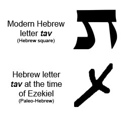



**Watch the video**



{}Revelation 7 Cross-reference Verses PDF{}

**Read The Passage**

Rev 7:1-17

<small>**After this, I saw four angels standing at the four corners of the earth, holding back the four winds of the earth, so that no wind would blow on the land, on the sea or on any tree. I saw another angel coming up from the east with a seal from the living God, and he shouted to the four angels who had been given power to harm the land and the sea, "Do not harm the land or the sea or the trees until we have sealed the servants of our God on their foreheads!" I heard how many were sealed—144,000 from every tribe of the people of Isra'el: From the tribe of Y'hudah 12,000 were sealed, from the tribe of Re'uven 12,000, from the tribe of Gad 12,000, from the tribe of Asher 12,000, from the tribe of Naftali 12,000, from the tribe of M'nasheh 12,000, from the tribe of Shim\`on 12,000, from the tribe of Levi 12,000, from the tribe of Yissakhar 12,000, from the tribe of Z'vulun 12,000, from the tribe of Yosef 12,000, from the tribe of Binyamin 12,000. After this, I looked; and there before me was a huge crowd, too large for anyone to count, from every nation, tribe, people and language. They were standing in front of the throne and in front of the Lamb, dressed in white robes and holding palm branches in their hands; and they shouted, "Victory to our God, who sits on the throne, and to the Lamb!" All the angels stood around the throne, the elders and the four living beings; they fell face down before the throne and worshipped God, saying, "Amen! "Praise and glory, wisdom and thanks, honor and power and strength belong to our God forever and ever! "Amen!" One of the elders asked me, "These people dressed in white robes—who are they, and where are they from?" "Sir," I answered, "you know." Then he told me, "These are the people who have come out of the Great Persecution. They have washed their robes and made them white with the blood of the Lamb. That is why they are before God's throne. "Day and night they serve him in his Temple; and the One who sits on the throne will put his Sh'khinah upon them. "They will never again be hungry, they will never again be thirsty, the sun will not beat down on them, nor will any burning heat. "For the Lamb at the center of the throne will shepherd them, will lead them to springs of living water, and God will wipe every tear from their eyes."** </small>

### Rev 7:1

<small>After this, I saw four angels standing at the four corners of the earth, holding back the four winds of the earth, so that no wind would blow on the land, on the sea or on any tree.</small>

-   "After this," could mean that this *vision* came after the previous one; not necessarily that the *events* in chapter 7 necessarily follow those in Chapter 6.
    -   Keener sees 6:12-17 as representing the end of the age, so chapter 7 with the sealing of the faithful must occur beforehand.[^1]
    -   The seven seals/trumpets/bowls could be different visions describing the same things; not necessarily 21 different events in sequence.
-   Four corners is clearly symbolic – no one in that day believed the earth was square. Here it represents the four directions on the compass.
-   The four winds/horsemen/angels are apparently connected:
    -   <small>Zec 6:1-8 Again I lifted my eyes and saw, and behold, four chariots came out from between two mountains. And the mountains were mountains of bronze. (2) The first chariot had red horses, the second black horses, (3) the third white horses, and the fourth chariot dappled horses—all of them strong. (4) Then I answered and said to the angel who talked with me, “What are these, my lord?” (5**) And the angel answered and said to me, “These are going out to the four winds of heaven, after presenting themselves before the Lord of all the ear**th. (6) The chariot with the black horses goes toward the north country, the white ones go after them, and the dappled ones go toward the south country.” (7) When the strong horses came out, they were impatient to go and patrol the earth. And he said, “Go, patrol the earth.” So they patrolled the earth. </small>

[^1]: Craig S. Keener, *The IVP Bible Background Commentary: New Testament*, 2nd edition (E-Sword) (Downers Grove, Illinois: IVP Academic, 2014), v. Rev 7:1-8.

### Rev 7:2-3

<small>I saw another angel coming up from the east with a seal from the living God, and he shouted to the four angels who had been given power to harm the land and the sea, "Do not harm the land or the sea or the trees until we have sealed the servants of our God on their foreheads!"</small>

-   This seal is God's signet ring; i.e., His stamp of authentication
-   From Rev 14:1, we know that the seal was the name of the Lamb and of his Father. <small>Rev 14:1 Then I looked, and behold, on Mount Zion stood the Lamb, and with him 144,000 who had his name and his Father's name written on their foreheads. </small>
-   This is a challnge to interpret since we believe there are more than 144,000 servants of God. See discussion at Rev 7:4-8.
-   Additionally, we know from the 5th seal that there are many martyrs so we cannot say that the 144,000 is a global seal of protection for all believers; it keeps the people sealed from God's wrath but not wrath in general.

-   This recalls the preparations for the Exodus and the application of the lamb's blood to the doorpost prior to the final plague of the death of the firstborn
    -   <small>Exo 12:12-13 For I will pass through the land of Egypt that night, and I will strike all the firstborn in the land of Egypt, both man and beast; and on all the gods of Egypt I will execute judgments: I am the LORD. The blood shall be a sign for you, on the houses where you are. And when I see the blood, I will pass over you, and no plague will befall you to destroy you, when I strike the land of Egypt. </small>
-   Seal on the foreheads recalls Exodus, Deuteronomy, and Ezekiel:
    -   <small>Exo 13:9 And it shall be to you as a sign on your hand and as a memorial between your eyes, that the law of the LORD may be in your mouth. For with a strong hand the LORD has brought you out of Egypt.\*\*\*</small>
    -   We are to be sealed by the Word of God: <small>Deu 6:6-8 And these words that I command you today shall be on your heart. 7 You shall teach them diligently to your children, and shall talk of them when you sit in your house, and when you walk by the way, and when you lie down, and when you rise. 8 You shall bind them as a sign on your hand, and they shall be as frontlets between your eyes.</small>
    -   <small>Eze 9:4-6 And the LORD said to him, “Pass through the city, through Jerusalem, and **put a mark on the foreheads of the men who sigh and groan over all the abominations** that are committed in it.” 5 And to the others he said in my hearing, “Pass through the city after him, and strike. Your eye shall not spare, and you shall show no pity. Kill old men outright, young men and maidens, little children and women, but **touch no one on whom is the mark**. And begin at my sanctuary.” So they began with the elders who were before the house. </small>
        -   This mark is for those who oppose the abominations done in Jerusalem.
        -   In Ezekiel, the word for "mark" is the Hebrew letter Tav. ת,
        -   In Ezekiel's day it would have looked like an x.
        -   It bears some similarity to a cross but it is unlikely a Cross, the way we might think of it, was in view.
    -   <small>Rev 9:3-4 Then from the smoke came locusts on the earth, and they were given power like the power of scorpions of the earth. 4 They were told not to harm the grass of the earth or any green plant or any tree, but only those people **who do not have the seal of God on their foreheads**.</small>
-   This stands in obvious contrast with the mark of the beast
    -   <small>Rev 13:15-17 And it was allowed to give breath to the image of the beast, so that the image of the beast might even speak and might cause those who would not worship the image of the beast to be slain. 16 Also it causes all, both small and great, both rich and poor, both free and slave, to be marked on the right hand or the forehead, 17 so that no one can buy or sell unless he has the mark, that is, the name of the beast or the number of its name.</small>

### Rev 7:4-8

<small>**I heard how many were sealed—144,000 from every tribe of the people of Isra'el: From the tribe of Y'hudah 12,000 were sealed, from the tribe of Re'uven 12,000, from the tribe of Gad 12,000, from the tribe of Asher 12,000, from the tribe of Naftali 12,000, from the tribe of M'nasheh 12,000, from the tribe of Shim\`on 12,000, from the tribe of Levi 12,000, from the tribe of Yissakhar 12,000, from the tribe of Z'vulun 12,000, from the tribe of Yosef 12,000, from the tribe of Binyamin 12,000.**</small>

-   We either must read the 144,000 as consistently literally or consistently symbolically.
    -   Either it's literally 12,000 male Jewish virgins – or specifically, those who have not ritually defiled themselves in any fashion (per Rev 14:4) from each of the 12 listed tribes, or it's all the spiritual servants of God (Rev 7:3, 9), but not literally 144,000.
    -   Saying there are literally 144,000 sealed, but not literally Jews who are sealed is an incoherent argument. If someone claims to be a member of the 144,000, a scriptural response is to ask which tribe they are from.
    -   As Revelation fits squarely within the genre of Jewish apocalyptic literature, perhaps we shouldn't be so quick to allegorize this, despite the apparent relatively small number of those who are sealed.
        -   If we are to allegorize, why is the list of 12 tribes enumerated?
        -   Why does this exact number of 144,000 reappear in Rev 14?
-   Lancaster sees the 144,000 as is a portion of the whole amount of Israel, specifically an army as we see in 1st Samuel.
    -   <small>1 Samuel 21:3-5 Now then, what do you have on hand? Give me five loaves of bread, or whatever is here.” 4 And the priest answered David, “I have no common bread on hand, but there is holy bread—if the young men have kept themselves from women.” 5 And David answered the priest, “Truly women have been kept from us as always when I go on an expedition. The vessels of the young men are holy even when it is an ordinary journey. How much more today will their vessels be holy?”</small>
    -   "have not defiled themselves with women" is an idiom for complete Levitical ritual purity.
        -   When the army of Israel went out to war, they had to be in a state of ritual purity.
        -   This is because the Lord was in their midst.
    -   Therefore the implication of the 144,000 is that this is an army of the Lord, the fighting men of the son of King David.
    -   Usually, when there is a census in the Bible, it is to determine the number of fighting men.
    -   Only the men are numbered.
        -   <small>Numbers 31:2-5 “Avenge the people of Israel on the Midianites. Afterward you shall be gathered to your people.” 3 So Moses spoke to the people, saying, “Arm men from among you for the war, that they may go against Midian to execute the LORD's vengeance on Midian. 4 You shall send a thousand from each of the tribes of Israel to the war.” 5 So there were provided, out of the thousands of Israel, **a thousand from each tribe, twelve thousand armed for war**.</small>
        -   <small>Num 31:48-49 Then the officers who were over the thousands of the army, the commanders of thousands and the commanders of hundreds, came near to Moses 49 and said to Moses, “Your servants have counted the men of war who are under our command, **and there is not a man missing from us**."</small>
        -   So there's a miracle in that they all survived the battle, just as the 144,000 will be sealed.
    -   The context of Numbers 31 is the preservation of Israel, which should be viewed as the theme of Revelation.
    -   In Revelation, we see a mathematical amplification.
        -   Peter asked, "should I forgive seven times," Jesus answered "70 times seven"
        -   In the same way we can say of Revelation 7, "not 12,000 as against the Midianites, but 12 times 12,000."
    -   Lancaster quoted an 18th-century Messianic Jew who believes the 144,000 faithful represent a first-fruits offering.
        -   In fact, we are told in Revelation 14:4 <small>It is these (144,000) who have not defiled themselves with women, for they are virgins. It is these who follow the Lamb wherever he goes. **These have been redeemed from mankind as firstfruits for God and the Lamb**,</small>
        -   A first fruits offering is 1/50th of the total harvest
        -   This small portion is said to sanctify the whole
        -   Paul mentions this in Romans 11, which is the chapter on the ultimate sanctification of Israel:
            -   <small>Rom 11:16, 26: If the dough offered as firstfruits is holy, so is the whole lump, and if the root is holy, so are the branches… And in this way all Israel will be saved, as it is written, “The Deliverer will come from Zion, he will banish ungodliness from Jacob”; </small>
        -   According to this approach, when the 144,000 are sealed and Messiah is revealed, this will lead to faith of all Israel.
        -   The relatively modern Messianic Jewish movement may be FAR MORE significant than anyone realizes. These 144,000 are, by definition, Messianic Jews.
-   God who will be doing the selection knows who is from which tribe, even though we may not see evidence of the 12 tribes today.
    -   On that note, remember the legend of the "10 lost tribes" is just that. There is no scriptural basis.
        -   James addressed his letter to the "12 tribes" in the diaspora.
        -   As the northern kingdom was furthering their journey into idolatry, we know the faithful migrated to Judah (2 Chr 15:9)
        -   In acts 2 there are separate references to the men of Judah (Acts 2:14) and the men of Israel (Acts 2:22, 36).
        -   In the days of the apostles, the 10 tribes were considered absent, not missing or lost.
        -   By the way, if you know anyone named Cone, Cohen, Levin, Lewis, or perhaps Lewinsky and Epstein, they might be descended from the tribe of Levi, though certainly many people with these names do not act with the holiness required of a Levitical priest.
-   Missler and many other pre-trib commentators would see the 144,000 as the preservation of the Jewish people **through** the Tribulation, whereas the church is **kept from** the Tribulation.
    -   Everything on earth pertains to Jews, while everything in Heaven pertains to the church.
    -   As messianic commentators point out, this position gets difficult to defend from scripture once one starts peeling back the layers.
    -   Ultimately it is an assumption that the "rapture" occurs between chapters 3 and 4.
    -   If we assume a pre-trib rapture, are we saying that Messianic Jews will NOT be raptured because they are Jewish? That's nonsensical.
    -   I'm not picking a side here – we encourage everyone to do their Acts 17:11 homework.

#### The list of the 12 tribes

-   It's easy to miss that, overall, there are actually 13 tribes from which to compose the various lists of the 12 tribes that occur in the Bible. Why is this? Joseph received a double-portion in Ephraim and Manasseh.
-   When listing the 12 tribes and we want to include Levi, Joseph is just Joseph: Reuben, Simeon, **Levi**, Judah, Dan, Naphtali, Gad, Asher, Issachar, Zebulun, **Joseph**, and Benjamin.
o-   In certain lists, the priestly tribe of Levi is excluded. Yet the list still contains 12 tribes because Joseph is split into Ephraim and Manasseh: Reuben, Simeon, Judah, Dan, Naphtali, Gad, Asher, Issachar, Zebulun, Manasseh, Ephraim, and Benjamin.
-   Where is Dan?
    -   It's important to note that we aren't told anywhere why Dan is omitted, but the usual explanation is that Dan is generally associated with idolatry and apostasy
        -   Jewish Sages explained that the north was the literal dark side (since in the Northern Hemisphere, the Sun can be east, west, or south, but never north).
            -   Dan was positioned on the north side of the camp of Israel because "Dan darkened the world by idolatry."
        -   This may underlie a warning that even among God's "chosen" people (whether it's the Jewish people or we, who have been chosen by Jesus), there is a danger of these things creeping in.
        -   <small>Joh 6:70 Jesus answered them, “Did I not choose you, the twelve? And yet one of you is a devil.” </small>
    -   Iraneus claims to be quoting Jewish apocalyptic literature which says the anti-messiah will come from Dan.
        -   There is no biblical evidence to support, but since Iraneus was a disciple of Polycarp, who was a disciple of John himself, perhaps this tradition also shouldn't be quickly dismissed.
-   Listing Manasseh and Joseph is odd. Manasseh was a part of Joseph. While the Bible is fundamentally inerrant in its original transmissions, we do know that there are a few scribal errors
        -   <small>John 5:3b-4 is a well-known example; it is omitted from most modern translations.</small>
        -   Some suggest that naming Manasseh instead of Dan was such an error.
-   Ephraim is indirectly referenced, likely because they were also associated with Jeroboam's Idolatry (Hos 4:17)
    -   Jeroboam set up two pagan altars: one was in the land of Ephraim and the other was in Dan.
    -   Archaeologists have excavated what they believe are the remains of the alter at Tel Dan.

### Rev 7:9

<small>**After this, I looked; and there before me was a huge crowd, too large for anyone to count, from every nation, tribe, people and language. They were standing in front of the throne and in front of the Lamb, dressed in white robes and holding palm branches in their hands**;</small>

-   It is possible that this huge crowd is another picture of those who were sealed now in heaven, or a different group.
    -   An example of the former is found in Genesis 41, where Pharoah had two different visions of the same famine event.
    -   We saw a great multitude in Rev 5:9
    -   Again we see the white robes we saw the martyrs wearing in chapter 6 – may or may not be the same group
    -   If it is the same group, it is now "a little while longer" (Rev 6:11)
-   Palm branches reminiscent of Palm Sunday and the Feast of Tabernacles

### Rev 7:10-12

<small>**and they shouted, "Victory to our God, who sits on the throne, and to the Lamb!" All the angels stood around the throne, the elders and the four living beings; they fell face down before the throne and worshipped God, saying, "Amen! "Praise and glory, wisdom and thanks, honor and power and strength belong to our God forever and ever! "Amen!"**</small>

-   In Greek, the word for "victory" is "soteeria", literally "salvation"; but "Salvation to our God" is awkward.
-   Salvation FROM our God makes more sense - <small>Psa 98:2 The LORD has made known his salvation; he has revealed his righteousness in the sight of the nations. </small>
-   In Hebrew, the word would be Yeshua, the Hebrew name for Jesus.
    -   הִנֵּה אֵל **יְשׁוּעָתִי**, אֶבְטַח וְלֹא אֶפְחָד, כִּי עָזִּי וְזִמְרָת יָהּ יְיָ, וַיְהִי לִי **לִישׁוּעָה**
    -   "Behold, God is my salvation, I will trust God and not be afraid, for my strong faith and song of praise for God will be my salvation." Jewish folk song

### Rev 7:13

<small>**One of the elders asked me, "These people dressed in white robes—who are they, and where are they from?" "Sir," I answered, "you know." Then he told me, "These are the people who have come out of the Great Persecution. They have washed their robes and made them white with the blood of the Lamb**. </small>

-   Asking a question a student wouldn't know was a common rabbinical technique.
    -   <small>Eze 37:3 And he said to me, “Son of man, can these bones live?” And I answered, “O Lord GOD, you know.” </small>
-   Great Persecution/Tribulation refers to Daniel
    -   <small>Dan 12:1 “At that time shall arise Michael, the great prince who has charge of your people. And there shall be a time of trouble, such as never has been since there was a nation till that time. But at that time your people shall be delivered, everyone whose name shall be found written in the book. </small>
-   This time, there IS a definite article in Greek. This is THE great tribulation, the mega pressure, literally.
-   As we mentioned at the beginning of the study, these words are intended to offer comfort to those 1st century believers undergoing persecution.
-   "Made white with blood" is an obvious contradiction.
    -   A blood stain is notoriously difficult to remove, and a figurative bloodstain moreso than a literal one (as Shakespeare referenced in Macbeth)
    -   We are made pure by His blood and our being faithful to His commands
-   These are clearly martyrs, perhaps we can use the term "Tribulation Saints."

### Rev 7:15-17

<small>**That is why they are before God's throne. "Day and night they serve him in his Temple; and the One who sits on the throne will put his Sh'khinah upon them. "They will never again be hungry, they will never again be thirsty, the sun will not beat down on them, nor will any burning heat. "For the Lamb at the center of the throne will shepherd them, will lead them to springs of living water, and God will wipe every tear from their eyes."** </small>

-   The heavenly throne is again described as a temple (Rev 4:6), and continues the theme of Jesus the great High Priest serving in the Heavenly temple (Hebrews 8)
-   Shekinah = protection and provision
    -   He spreads his covering over us, which is a theme that runs through scripture as the Shekinah inhabited the Tent of Meeting.
        -   The two words are linguistically related in Hebrew:
        -   Shekinah = dwelling; God's glory dwelling with mankind
        -   Mishkan – tent, tabernacle
    -   <small>Heb 1:3-4 He is the radiance of the glory of God and the exact imprint of his nature, and he upholds the universe by the word of his power. After making purification for sins, he sat down at the right hand of the Majesty on high, 4 having become as much superior to angels as the name he has inherited is more excellent than theirs.</small>
    -   <small>Eze 37:27 My dwelling place shall be with them, and I will be their God, and they shall be my people.</small>
    -   <small>Rth 3:9-11 He said, “Who are you?” And she answered, “I am Ruth, your servant. Spread your wings over your servant, for you are a redeemer.” 10 And he said, “May you be blessed by the LORD, my daughter. You have made this last kindness greater than the first in that you have not gone after young men, whether poor or rich. 11 And now, my daughter, do not fear. I will do for you all that you ask, for all my fellow townsmen know that you are a worthy woman.</small>
    -   <small>Isa 4:5-6 Then the LORD will create over the whole site of Mount Zion and over her assemblies a cloud by day, and smoke and the shining of a flaming fire by night; for over all the glory there will be a canopy. There will be a booth for shade by day from the heat, and for a refuge and a shelter from the storm and rain. </small>
    -   <small>Isa 25:8 He will swallow up death forever; and the Lord GOD will wipe away tears from all faces, and the reproach of his people he will take away from all the earth, for the LORD has spoken. </small>
    -   <small>Isa 49:10 they shall not hunger or thirst, neither scorching wind nor sun shall strike them, for he who has pity on them will lead them, and by springs of water will guide them. </small>
    -   <small>Joh 10:11 I am the good shepherd. The good shepherd lays down his life for the sheep. </small>
-   The culmination of wiping every tear and springs of living water will be in Revelation 21:4,6.

### Pause to Review

-   In this gap between the 6th and 7th seal, this is a good spot to recap
    -   We began with the apocalypse, the revelation, the unveiling of Jesus Christ
    -   John was imprisoned on Patmos during the Domitian persecution.
        -   Domitian considered Jews tax evaders, though they were legally exempted, but he considered gentile believers in Jesus traitors for disavowing the Roman gods.
    -   Revelation is entirely consistent with extra-biblical Jewish apocalyptic literature: Although terrible things are happening to God's people, God is not absent. For the wicked, a day of judgment; for the righteous a day of rewards is yet to come
    -   There is an order of transmission: God to Jesus, to His Angel, to John, to the seven assemblies.
        -   We are reading it indirectly.
        -   The letter is written for us but not to us.
        -   Nonetheless, there is a blessing for ANYONE who reads, hears, AND KEEPS the words (Rev 1:3)
    -   Before John gets into the crazy stuff he saw, he sends specific messages to the seven assemblies.
        -   "I see your deeds"; five of the churches were told to repent!
        -   A promise to the overcomer
    -   Chapter 4 – after this a door was open in heaven
        -   Lancaster sees Rosh Hashana imagery
        -   Isaiah and Ezekiel saw similar views as John with the Ancient of Days on His throne
        -   John sees the Seraphim from Isaiah (John saw seven torches) representing what is above and we see the four living creatures from Ezekiel representing the earthly realm
    -   Chapter 5 opened with the Ancient of Days with a scroll in His hand with seven seals
        -   There is a moment of drama as no one, seemingly is found to open the scroll, until the One like a Son of Man, the same One Daniel saw in chapter 7 presents Himself.
        -   He is both the Lion of the Tribe of Judah and He is the Lamb standing as though it had been slain.
        -   Every creature in heaven, on earth, and under the earth and in the sea and all that is in them praised, "to him who sits on the throne and to the lamb be blessing and honor and glory and might forever and ever. Amen!"
    -   Chapter 6 has Lamb opening the first six seals
        -   The first seal is white horse of conquest, perhaps by deception and likely without armed conflict
        -   The second seal is the red horse of armed conquest
        -   The third seal is the black horse of famine and inflation
        -   The fourth seal is the pale horse of death
        -   The fifth seal is not a judgment poured on earth, but it is the blood of the martyrs poured on the alter. They cried for God's justice but were told to wait a little while longer. This little while for us, has been lasting for 1900 years since John first saw the vision.
        -   The sixth seal brings great calamity, the wrath of the Lamb, the Day of the Lord.
            -   Under the sixth seal we will have the remaining judgments in Revelation.
            -   It's reasonable to ask, "who on Earth will be able to survive this? How is God going to fulfill His promises He made to Israel?"
            -   The answer comes in Chapter 7
    -   Chapter 7 sees an angel putting a seal on 144,000 Jews which assures that they will survive to the end and will be able to usher in the Messianic Era
        -   We had to peek ahead to Revelation 14 to get the answer
        -   <small>Rev 14:1-5 Then I looked, and behold, on Mount Zion stood the Lamb, and with him 144,000 who had his name and his Father's name written on their foreheads. 2 And I heard a voice from heaven like the roar of many waters and like the sound of loud thunder. The voice I heard was like the sound of harpists playing on their harps, 3 and they were singing a **new song** before the throne and before the four living creatures and before the elders. No one could learn that song except the 144,000 who had been redeemed from the earth. 4 It is these who have not defiled themselves with women, for they are virgins. It is these who follow the Lamb wherever he goes. These have been redeemed from mankind as **firstfruits** for God and the Lamb, 5 and in their mouth no lie was found, for they are blameless.</small>
        -   John then has a vision in 7:9 back to heaven where he sees a multitude of what we might call Tribulation Saints.
-   Next time we will be in Chapter 8 and the seventh seal, which ushers in the seven trumpets.

 

