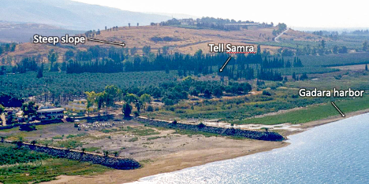
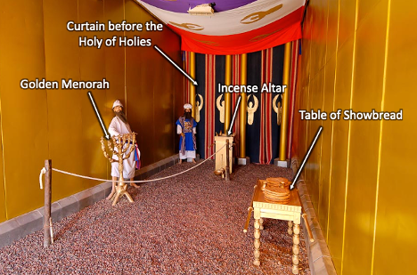
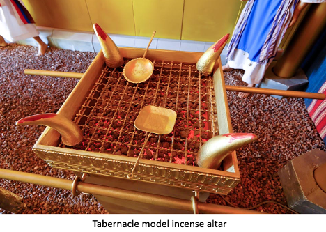
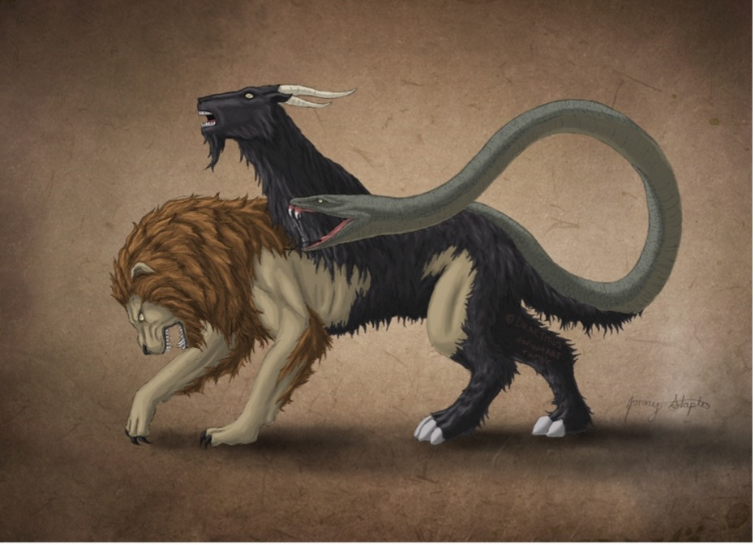



**Video**



**Read/hear the passage**

**Revelation 9**

<small>The fifth angel sounded his shofar, and I saw a star that had fallen out of heaven onto the earth, and he was given the key to the shaft leading down to the Abyss. He opened the shaft of the Abyss, and there went up smoke from the shaft like the smoke of a huge furnace; the sun was darkened, and the sky too, by the smoke from the shaft. Then out of the smoke onto the earth came locusts, and they were given power like the power scorpions have on earth. They were instructed not to harm the grass on the earth, any green plant, or any tree, but only the people who did not have the seal of God on their foreheads. The locusts were not allowed to kill them, only to inflict pain on them for five months, and the pain they caused was like the pain of a scorpion sting. In those days, people will seek death but will not find it; they will long to die, but death will elude them. Now, these locusts looked like horses outfitted for battle. On their heads were what looked like crowns of gold, and their faces were like human faces. They had hair like women's hair, and their teeth were like those of lions. Their chests were like iron breastplates, and the sound their wings made was like the roar of many horses and chariots rushing into battle. They had tails like those of scorpions, with stings, and in their tails was their power to hurt people for five months. They had as king over them the angel of the Abyss, whose name in Hebrew is "Abaddon" and in our language, "Destroyer." The first woe has passed, but there are still two woes to come. The sixth angel sounded his shofar, and I heard a voice from the four horns of the gold altar before God, saying to the sixth angel, the one with the shofar, "Release the four angels that are bound at the great river Euphrates!" And they were released. These four angels had been kept ready for this moment, for this day and month and year, to kill a third of mankind, and the number of cavalry soldiers was two hundred million! ---I heard the number. Here is how the horses looked in the vision: the riders had breastplates that were fire-red, iris-blue, and sulfur-yellow; the horses' heads were like lions' heads; and from their mouths issued fire, smoke, and sulfur. It was these three plagues that killed a third of mankind---the fire, smoke, and sulfur issuing from the horses' mouths. For the power of the horses was in their mouths---and also in their tails, for their tails were like snakes with heads, and with them, they could cause injury. The rest of mankind, those who were not killed by these plagues, even then did not turn from what they had made with their own hands---they did not stop worshipping demons and idols made of gold, silver, bronze, stone, and wood, which cannot see or hear or walk. Nor did they turn from their murdering, their involvement with the occult and with drugs, their sexual immorality, or their stealing.</small>

### Introduction

-   This passage has an allusion to Joel 2
-   <small> "Blow a trumpet in Zion; sound an alarm on my holy mountain! Let all the inhabitants of the land tremble, for the day of the LORD, is coming; it is near, a day of darkness and gloom, a day of clouds and thick darkness! Like blackness, there is spread upon the mountains a great and powerful people; their like has never been before, nor will be again after them through the years of all generations. Fire devours before them, and behind them, a flame burns. The land is like the garden of Eden before them, but behind them, a desolate wilderness, and nothing escapes them. Their appearance is like the appearance of horses, and like war horses, they run. As with the rumbling of chariots, they leap on the tops of the mountains, like the crackling of a flame of fire devouring the stubble, like a powerful army drawn up for battle. Before them, peoples are in anguish; all faces grow pale. Like warriors, they charge; like soldiers, they scale the wall. They march each on his way; they do not swerve from their paths. They do not jostle one another; each marches in his path; they burst through the weapons and are not halted. They leap upon the city, they run upon the walls, they climb up into the houses, they enter through the windows like a thief. The earth quakes before them; the heavens tremble. The sun and the moon are darkened, and the stars withdraw their shining. The LORD utters his voice before his army, for his camp is exceedingly great; he who executes his word is powerful. For the day of the LORD is great and very awesome; who can endure it? "Yet even now," declares the LORD, "return to me with all your heart, with fasting, with weeping, and with mourning;" Tear your heart, not your garments; and turn to ADONAI your God. For he is merciful and compassionate, slow to anger, rich in grace, and willing to change his mind about disaster. (Joe 2:1-13) </small>

### Rev 9:1-2

<small>Rev 9:1-2 The fifth angel sounded his shofar, and I saw a star that had fallen out of heaven onto the earth, and he was given the key to the shaft leading down to the Abyss. He opened the shaft of the Abyss, and there went up smoke from the shaft like the smoke of a huge furnace; the sun was darkened, and the sky too, by the smoke from the shaft.</small>

-   Star
    -   This is no ordinary star because it's a "he," and he has a specific task
    -   We don't know if this is a true "fallen" angel or an angelic messenger doing God's bidding
-   Abyss
    -   Greek Abussos = bottomless pit
    -   Hebrew Tehom -- Genesis 1:2 The earth was without form and void, and darkness were over the face of the deep (the Tehom).
    -   Gen 7:11 In the six hundredth year of Noah's life, in the second month, on the seventeenth day of the month, on that day, all the fountains of the great deep burst forth, and the windows of the heavens were opened.
    -   Jewish extra-biblical literature, including Dead Sea Scroll documents, held that the leaders of the Nephilim were thrown into the abyss for the day of judgment.  
    -   Peter picks up this thought: "For if God did not spare angels when they sinned, but cast them into hell and committed them to chains of gloomy darkness to be kept until the judgment; if he did not spare the ancient world, but preserved Noah, a herald of righteousness, with seven others when he brought a flood upon the world of the ungodly..." (2Pe 2:4-5)
    -   Sometimes is used in conjunction with She'ol -- Jesus holds the keys to She'ol (Rev 1:18) 
    -   "Jesus then asked him, "What is your name?" And he said, "Legion," for many demons had entered him. And they begged him not to command them to depart into the abyss. Now a large herd of pigs was feeding there on the hillside, and they begged him to let them enter these. So he gave them permission. Then the demons came out of the man and entered the pigs, and the herd rushed down the steep bank into the lake and drowned." (Luk 8:30-33)
    -   Clearly, it is a type of prison for demons and, eventually, for Satan himself (Rev 20:3)
        -   The smoke and devastation might be reminiscent of the destruction of Sodom.
    -   Not surprisingly, abussos appears seven times in Revelation: Rev 9:1, Rev 9:2, Rev 9:11, Rev 11:7, Rev 17:8, Rev 20:1, Rev 20:3
    -   Missler speculates that a likely location for a bottomless pit is the earth's center.
        -   It is only at the center of the earth where one cannot go "down" and is therefore bottomless.
        -   This is like the riddle about a man who walks 100 yards south of his camp and finds bear tracks. He tracks the bear 100 yards to the west and kills it. He then goes 100 yards north back to his base. What color was the bear?
        -   The answer is the bear has to be white, i.e., a polar bear. The only place one can walk south, west, then north and end up back where he started is the north pole.
    -   By the way, according to National Geographic, scientists estimate the temperature at the center of the earth is a balmy 9,392 degrees Fahrenheit.
    -   This is not a door we want to be opened.

### Rev 9:3-5

<small>Rev 9:3-5 Then out of the smoke onto the earth came locusts, and they were given power like the power scorpions have on earth. They were instructed not to harm the grass on the earth, any green plant, or any tree, but only the people who did not have the seal of God on their foreheads. The locusts were not allowed to kill them, only to inflict pain on them for five months, and the pain they caused was like the pain of a scorpion sting.</small>

-   As the previous trumpets attacked nature, these supernatural locusts were forbidden to do any more damage.
    -   While destructive, ordinary locusts eat vegetation only.
-   Locusts were the 8th of the Egyptian plagues (Exodus 10:12).
-   Those whom God has sealed are preserved through the judgment.
-   Support for the view that the visions in Revelation are not necessarily sequential might be seen by comparing 9:4 with 8:7, which says ALL green grass was burned up (1/3 of the earth, 1/3 of the trees, but ALL green grass). There shouldn't be any grass left to burn if this is sequential and chronological.
-   The standard biblical month has 30 days, so five months is 150 days, the same length of time as Noah's flood (Gen 7:24).
-   Potentially, John is communicating that the pain from a sting will last five months. Yikes.

### Rev 9:6

<small>Rev 9:6 In those days people will seek death but will not find it; they will long to die, but death will elude them.</small>

-   I join with many commentators who say words to the effect of "I can't imagine what this means."
-   Jeremiah 8:3 Death shall be preferred to life by all the remnant that remains of this evil family in all the places where I have driven them, declares the LORD of hosts.

### Rev 9:7-11

<small>Rev 9:7-11 Now, these locusts looked like horses outfitted for battle. On their heads were what looked like crowns of gold, and their faces were like human faces. They had hair like women's hair, and their teeth were like those of lions. Their chests were like iron breastplates, and the sound their wings made was like the roar of many horses and chariots rushing into battle. They had tails like those of scorpions, with stings, and in their tails was their power to hurt people for five months. They had as king over them the angel of the Abyss, whose name in Hebrew is "Abaddon" and in our language, "Destroyer." The first woe has passed, but there are still two woes to come.</small></small>

-   The Parthians (see the comment at verse 13) had long hair, while those in Roman lands generally had shorter hair.
-   These are not natural locusts.
    -   It is a common biblical idiom to say that a sizeable advancing army is like locusts.
        -   Judges 6:5 For they would come up with their livestock and their tents; they would come like locusts in number---both they and their camels could not be counted---so that they laid waste the land as they came in.
    -   Natural locusts have no king, but these do
        -   Pro 30:27, the locusts have no king, yet all of them march in rank;
        -   The Septuagint translation of Amos 7:1 is curious: The Lord has shown me and behold, a swarm of locusts were coming, and behold one of the devastating young locusts was God the King.
        -   Amos 7:1 in other translations is nearly nonsensical: "This is what the Lord GOD showed me: behold, he was forming locusts when the latter growth was just beginning to sprout, and behold, it was the latter growth after the king's mowings." (Amo 7:1)
        -   We will see Gog again in Rev 20:8.
-   Greek Apollyon means "destroyer."
    -   Though not linguistically related, the audience might have associated with Apollo, reportedly Domitian's patron deity.
-   Abaddon is another Hebrew word referencing Sheol or the Abusso
    -   Pro 27:20 Sheol and Abaddon are never satisfied, and never satisfied are the eyes of man.
    -   Job 26:6 Sheol is naked before God, and Abaddon has no covering. What seems to be happening is an army of demons is released to wreak havoc for five months; they can hurt but can't kill, or as Keener states, "the armies of hell, sent by death itself to fill its bowels." \<Zotero Keener Rev 9:11\>

### Rev 9:13:15

<small>Rev 9:13-15 The sixth angel sounded his shofar, and I heard a voice from the four horns of the gold altar before God, saying to the sixth angel, the one with the shofar, "Release the four angels that are bound at the great river Euphrates!" And they were released. These four angels had been kept ready for this moment, for this day and month and year, to kill a third of mankind;</small>

 
-   The four horns of the gold altar is the Altar of Incense (on which the prayers were placed in the last chapter), and it is now talking.
-   Exodus 30:1, 3, 7-8 (KJV) "And thou shalt make an altar to burn incense upon: of shittim wood shalt thou make it . . . And thou shalt overlay it with pure gold, the top thereof, and the sides thereof round about, and the horns thereof; and thou shalt make unto it a crown of gold round about . . . And Aaron shall burn thereon sweet incense every morning: when he dresseth the lamps . . . a perpetual incense before the LORD throughout your generations."
    -   Also known as the "golden altar" or the "inner altar," this three-foot-high altar was the location of regular incense offerings.
    -   Every morning and evening when tending the light of the menorah, the priests would offer a mixture of frankincense and other aromatic gums.
    -   As we discussed, this was the function of Zechariah, John the Baptist's father, in Luke 2.
    -   On the Day of Atonement, the high priest would sprinkle blood on the horns of this altar (Exod 30:10), but nothing besides incense was ever to burn here.
    -   The altar also had a unique saving purpose. One guilty of causing an accidental death could present himself to the priest and take sanctuary by grabbing the horns of the altar. As long as he was touching the horns he couldn't be touched.
-   Euphrates
    -   In John's day, the Euphrates was the boundary between Rome and the feared Parthians.
    -   Traditionally, the Euphrates is the eastern boundary of the promised land (Genesis 15:18)
    -   The Euphrates is mentioned in reference to Eden (Genesis 2:14), which runs through the heart of Babylon.
    -   Some speculate that since Eden was to the "east" (meaning east of Israel), Eden was possibly located near ancient Mesopotamia/Babylon. Thus Babylon can be said to be where the first sin and first murder occurred, where the Tower of Babel was built, and where Nimrod founded his rebellion.
-   This group of bound angels (likely fallen) is allowed to kill 1/3 of mankind.

### Rev 9:16-19

<small>Rev 9:16 and the number of cavalry soldiers was two hundred million!---I heard the number. Here is how the horses looked in the vision: the riders had breastplates that were fire-red, iris-blue, and sulfur-yellow; the horses' heads were like lions' heads; and from their mouths issued fire, smoke, and sulfur. It was these three plagues that killed a third of mankind---the fire, smoke, and sulfur issuing from the horses' mouths. For the power of the horses was in their mouths---and also in their tails, for their tails were like snakes with heads, and with them, they could cause injury.</small>

-   A 200,000,000 man army from the east may evoke images of China in our day, but the 1st-century audience would have understood it as a reference to the Parthians
    -   The number was likely figurative language for "a huge invading force," as 200,000,000 likely exceeded the entire population of Earth in the 1st Century
    -   As we discussed previously, the Parthians were expert horsemen and the often-used flaming arrows. 

-   This appears to be a description of the Greek mythical chimera, with the head of a lion, the body of a goat, and the tail of a snake.
-   Fans of the Left Behind series might be interested to note that the fictional Nicholai Carpathia, the Antichrist, hailed from Romania (as it is speculated that the antichrist will be somehow connected to the revived Roman Empire.  
    The Romanian flag's colors are blue, yellow, and red, the three colors mentioned in this passage.
    -   As Isaiah refers to an "Assyrian" antichrist, it might be more likely that the Antichrist will come from the eastern lands of the old Roman Empire.

### Rev 9:20-21

<small>Rev 9:20 The rest of mankind, those who were not killed by these plagues, even then did not turn from what they had made with their own hands---they did not stop worshipping demons and idols made of gold, silver, bronze, stone, and wood, which cannot see or hear or walk Nor did they turn from their murdering, their involvement with the occult and with drugs, their sexual immorality or their stealing.</small>

-   This is reminiscent of Pharoah's hardening of his heart.
-   While we can celebrate God's bringing justice to the wicked, we must remember that at some level, He loves those whom He's doomed to destruction.
    -   In addition to God's justice, the judgments are also an act of mercy designed to produce repentance.
        -   The threat of judgment did produce repentance with Nineveh in Jonah.
        -   It usually does not, as was the case with Pharoah and as is the case here.
-   Paul equated worship of the Roman gods with demon-worship - No, I imply that what pagans sacrifice they offer to demons and not to God. I do not want you to be participants with demons. (1 Cor 10:20) - While idols of clay and stone are not real (1 Co 8:4, Psa 115:4-8), the spirit behind the idol definitely is demonic.
-   This sounds like modern society.
-   Pharmakeia is translated as sorcery in other translations
    -   Let us not limit our thinking to illicit street drugs but also the modern pharmaceutical industry, remaking our chemistry into something perhaps, it was never meant to be.
    -   I wonder how much of what we might label mental illness is genuinely demonic manifestations related to legal and illegal drug use.
    -   The good news is God can rescue anyone with a hurt, habit, or hang-up, including substance abuse; I believe this includes healing a mind that had been chemically altered.

