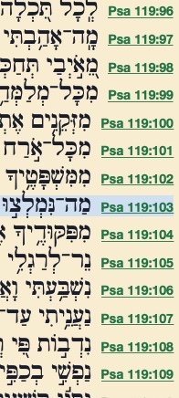



**Video**



## Revelation 10

<small> Next I saw another mighty angel coming down from heaven. He was dressed in a cloud, with a rainbow over his head; his face was like the sun, his legs like columns of fire; and he had a little scroll lying open in his hand. He planted his right foot on the sea and his left foot on the land and shouted in a voice as loud as the roar of a lion; and when he shouted, seven thunderclaps sounded with voices that spoke. When the seven thunders spoke, I was about to write; but I heard a voice from heaven say, \"Seal up the things the seven thunders said, do not write them down!\" Then the angel I saw standing on the sea and on the land lifted his right hand toward heaven and swore by the One who lives forever and ever, who created heaven and what is in it, earth and what is in it, and the sea and what is in it: \"There will be no more delay; on the contrary, in the days of the sound from the seventh angel when he sounds his shofar, the hidden plan of God will be brought to completion, the Good News as he proclaimed it to his servants the prophets.\" Next, the voice which I had heard from heaven spoke to me again and said, \"Go, take the scroll lying open in the hand of the angel standing on the sea and on the land!\" So, I went over to the angel and asked him to give me the little scroll; and he said to me, \"Take it and eat it. It will turn your stomach bitter, but in your mouth, it will be sweet as honey.\" I took the little scroll from the angel\'s hand and ate it; and in my mouth, it was sweet as honey; but after I had swallowed it, my stomach turned bitter. Then I was told, \"You must prophesy again about many peoples, nations, languages, and kings.\"</small>

### Daniel 12

Again, we have a brief intermission between the 6th and 7th trumpets, just as we did between the 6th and 7th seals. We have the seven thunders here, and, in Chapter 11, we will have the two witnesses. It's important to keep in mind that when John wrote this, there were no such things as chapter breaks. As best we can, we need to remove the chapter breaks and read Revelation as a single continuous document.

Revelation 10 has many similarities to Daniel 12:

<small>Daniel 12:1-10: "At that time shall arise, Michael, the great prince who has charge of your people. And there shall be a time of trouble, such as never has been since there was a nation till that time. But at that time, your people shall be delivered, everyone whose name shall be found written in the book. And many of those who sleep in the dust of the earth shall awake, some to everlasting life, and some to shame and everlasting contempt. And those who are wise shall shine like the brightness of the sky above; and those who turn many to righteousness, like the stars forever and ever. But you, Daniel, shut up the words and seal the book until the time of the end. Many shall run to and fro, and knowledge shall increase." Then I, Daniel, looked, and behold, two others stood, one on this bank of the stream and one on that bank of the stream. And someone said to the man clothed in linen, who was above the waters of the stream, "How long shall it be till the end of these wonders?" And I heard the man clothed in linen, who was above the waters of the stream; he raised his right hand and his left hand toward heaven and swore by him who lives forever that it would be for a time, times, and half a time, and that when the shattering of the power of the holy people comes to an end all these things would be finished. I heard, but I did not understand. Then I said, "O my lord, what shall be the outcome of these things?" He said, "Go your way, Daniel, for the words are shut up and sealed until the time of the end. Many shall purify themselves and make themselves white and be refined, but the wicked shall act wickedly. And none of the wicked shall understand, but those who are wise shall understand.</small>

## Rev 10:1-3

<small>Then I saw another mighty angel coming down from heaven, wrapped in a cloud, with a rainbow over his head, and his face was like the sun and his legs like pillars of fire. He had a little scroll open in his hand. And he set his right foot on the sea, his left foot on the land, and called out with a loud voice, like a lion roaring. </small>

-   Another angel. Mighty angel #1 was in Rev 5:2, And I saw a mighty angel proclaiming with a loud voice, "Who is worthy to open the scroll and break its seals?"

-   So this is Mighty angel #2. Apparently, he's large, with one foot on land and the other on sea, but also large in authority and dominion. The mission is the entire world.

-   Description:
    -   "He comes with the clouds" is a familiar description of Jesus.
    -   Rainbow was the covenant sign God gave to Noah after the Flood.
    -   Face like the sun and legs like bronze are descriptions from Revelation 1.
        -   Here is a hint that John was at least thinking in Hebrew
        -   Hebrew has the same word for feet and legs; however, only legs can be said to be pillars.
        -   John or a scribe picked the wrong Greek word to translate the Hebrew word for legs. He used the Greek word for feet, which is why most translations have this as "feet like pillars," which is somewhat nonsensical.

    -   Roaring like a lion is reminiscent of the Lion of the tribe of Judah.

    -   This is not Jesus (directly) but is an angelic representation of Jesus -- likely the same angel that spoke with John in Revelation 1-3.

-   John is borrowing from Jewish liturgy -- Daniel 10:6, as well as extrabiblical passages.

-   We assume the scroll is the scroll from Chapter 5, now opened.

-   Translating this as "book" is technically an anachronism. Loose-leaf papers were just starting to come into use, but we don't believe there was formal bookbinding.

##  Rev 10:3-4 

<small> When he called out, the seven thunders sounded. And when the seven thunders had sounded, I was about to write, but I heard a voice from heaven saying, "Seal up what the seven thunders have said, and do not write it down." </small>

-   Seven Thunders is a mystery -- apparently, John knew what they were, but the mystery will remain a mystery.

-   Speculating is pointless! Not everything the receiver sees is meant to be passed on.

-   Deuteronomy 29:29  The secret things belong to the LORD our God, but the things that are revealed belong to us and to our children forever, that we may do all the words of this law.

-   Paul evidently received some type of apocalyptic vision, but he, too, was told to keep it sealed. 2 Cor 12:4 and he heard things that cannot be told, which man may not utter.

##  Rev 10:5-6 

<small>And the angel whom I saw standing on the sea and on the land raised his right hand to heaven and swore by him who lives forever and ever, who created heaven and what is in it, the earth and what is in it, and the sea and what is in it, that there would be no more delay, </small>

-   As it is to this day, raising one's right hand to heaven (or to a pagan god as the case may be) indicates taking an oath.

-   Dan 12:7 he raised his right hand and his left hand toward heaven and swore by him who lives forever

-   The promise of the redemption has been delayed since the days of Moses.

-   No more delay, recalls Paul's warning in Romans 9:28: for the Lord will carry out his sentence upon the earth fully and without delay. The prayers of the martyred saints are about to be answered.

    -   Up until now, God has been delaying judgment so the lost will have time to repent.

    -   If we are saved, you and I need to be very humbled by this delay.

##  Rev 10:7 

<small>but that in the days of the trumpet call to be sounded by the seventh angel, the mystery of God would be fulfilled, just as he announced to his servants the prophets. </small>

-   ALL promises and prophecies will be fulfilled.

-   This includes promises of judgment as well as promises of restoration and redemption (i.e. the coming of Messiah).

-   There are a number of "mysteries" in the New Testament including four in the book of Revelation, for example:

-   [**Eph 3:4** ](verseid:49.3.4) When you read this, you can perceive my insight into the mystery of Christ,

-   [**Eph 3:5** ](verseid:49.3.5) which was not made known to the sons of men in other generations as it has now been revealed to his holy apostles and prophets by the Spirit.

-   The Kingdom of Heaven - Mt 13:11

-   The Kingdom Mark 4:11

-   Israel's blindness Rom 11:25

-   The Rapture 1 Cor 15:51

-   His Will Eph 1:9

-   Christ and the Church Eph 5:32

-   The Gospel Eph 3:4; Col 1:26-27; 4:3

-   Iniquity 2 Thess 2:7

-   God and Christ Col 2:2

-   The Faith 1 Tim 3:9

-   Godliness 1 Tim 3:16

-   The Seven Stars & Golden Lampstands Rev 1:20

-   God Rev 10:7

-   Babylon the Great Rev 17:5

-   The Harlot Rev 17:7

##  Rev 10:8-9 

<small>Then the voice that I had heard from heaven spoke to me again, saying, "Go, take the scroll that is open in the hand of the angel who is standing on the sea and on the land." So I went to the angel and told him to give me the little scroll. And he said to me, "Take and eat it; it will make your stomach bitter, but in your mouth, it will be sweet as honey." </small>

-   </small>Ezekiel 2:8-3:3 "But you, son of man, hear what I say to you. Be not rebellious like that rebellious house; open your mouth and eat what I give you." \[9\] And when I looked, behold, a hand was stretched out to me, and behold, a scroll of a book was in it. \[10\] And he spread it before me. And it had writing on the front and on the back, and there were written on it words of lamentation and mourning and woe. And he said to me, "Son of man, eat whatever you find here. Eat this scroll, and go, speak to the house of Israel." So I opened my mouth, and he gave me this scroll to eat. And he said to me, "Son of man, feed your belly with this scroll that I give you and fill your stomach with it." Then I ate it, and it was in my mouth as sweet as honey.</small>

-   Here, John is being commissioned like one of the Old Testament prophets. Jeremiah and Isaiah have similar "commissioning" scenes.

-   <small> Psa 119:97-104 Mem Oh how I love your law! It is my meditation all the day. Your commandment makes me wiser than my enemies, for it is ever with me. I have more understanding than all my teachers, for your testimonies are my meditation. I understand more than the aged, for I keep your precepts. I hold back my feet from every evil way, in order to keep your word. I do not turn aside from your rules, for you have taught me. How sweet are your words to my taste, sweeter than honey to my mouth! Through your precepts I get understanding; therefore I hate every false way.</small>

-   Psalm 119 is an acrostic poem; there are 22 separate sections, one for each letter in the Hebrew alphabet, and each verse in that section begins with the same letter

##  Rev 10:10-11 

<small>And I took the little scroll from the hand of the angel and ate it. It was sweet as honey in my mouth, but when I had eaten it my stomach was made bitter. And I was told, "You must again prophesy about many peoples and nations and languages and kings." </small>

-   To those who believe, the Words of God bring sweetness and life; to those who refuse to believe, the words bring bitterness and death.

-   The believer takes no joy in preaching the wrath of God

-   One has to know ("ingest") the Word; then he is ready to be a witness

Next we get to Chapter 11 and the famous two witnesses.

 

