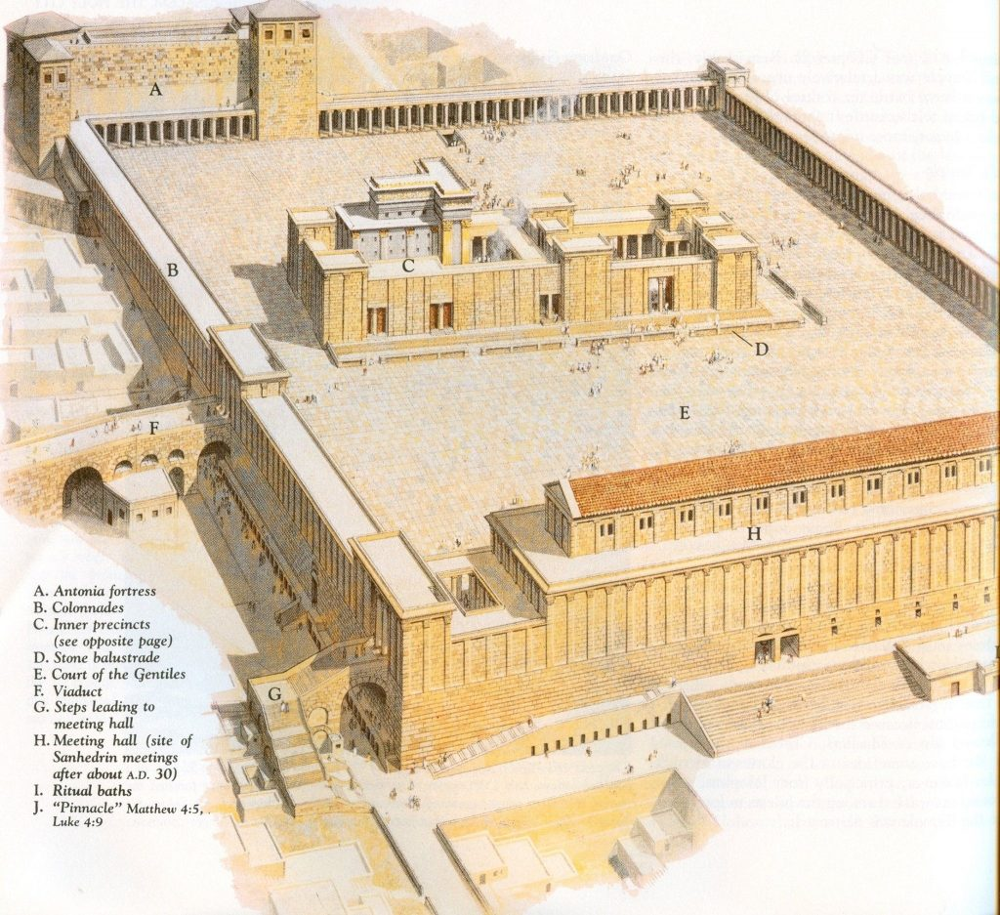
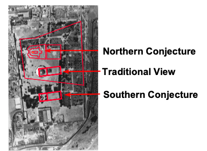
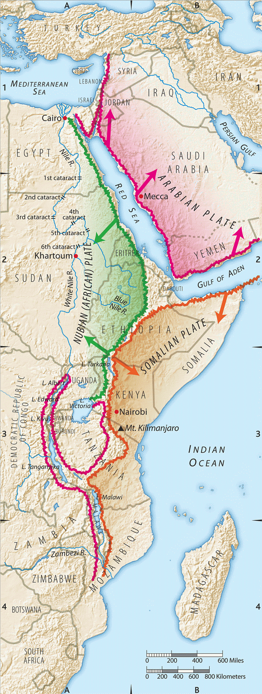



**Video**



## Revelation 11

<small> I was given a measuring rod like a stick and told, \"Get up, and measure the Temple of God and the altar, and count how many people are worshipping there! But the court outside the Temple, leave that out; don\'t measure it; because it has been given to the Goyim, and they will trample over the holy city for forty-two months. \"Also, I will give power to my two witnesses; and they will prophesy for 1,260 days, dressed in sackcloth.\" These are the two olive trees and the two menorahs standing before the Lord of the earth. If anyone tries to do them harm, fire comes out of their mouth and consumes their enemies---yes, if anyone tries to harm them, that is how he must die. They have the authority to shut up the sky so that no rain falls during the period of their prophesying; also, they have the authority to turn the waters into blood and to strike the earth with every kind of plague as often as they want. When they finish their witnessing, the beast coming up out of the Abyss will fight against them, overcome them and kill them; and their dead bodies will lie in the main street of the great city whose name, to reflect its spiritual condition, is \"S\'dom\" and \"Egypt\"---the city where their Lord was executed on a stake. Some from the nations, tribes, languages, and peoples see their bodies for three-and-a-half days and do not permit the corpses to be placed in a tomb. The people living in the Land rejoice over them, they celebrate and send each other gifts, because these two prophets tormented them so. But after the three-and-a-half days a breath of life from God entered them, they stood up on their feet, and great fear fell on those who saw them. Then the two heard a loud voice from heaven saying to them, \"Come up here!\" And they went up into heaven in a cloud, while their enemies watched them. In that hour there was a great earthquake, and a tenth of the city collapsed. Seven thousand people were killed in the earthquake, and the rest were awestruck and gave glory to the God of heaven. The second woe has passed; see, the third woe is coming quickly. The seventh angel sounded his shofar; and there were loud voices in heaven, saying, \"The kingdom of the world has become the Kingdom of our Lord and his Messiah, and he will rule forever and ever!\" The twenty-four elders sitting on their thrones in God\'s presence fell on their faces and worshipped God, saying, \"We thank you, Adonai, God of heaven\'s armies, the One who is and was, that you have taken your power and have begun to rule. \"The Goyim raged. But now your rage has come, the time for the dead to be judged, the time for rewarding your servants the prophets, and your holy people, those who stand in awe of your name, both small and great. It is also the time for destroying those who destroy the earth.\" Then the Temple of God in heaven was opened, and the Ark of the Covenant was seen in his Temple; and there were flashes of lightning, voices, peals of thunder, an earthquake, and violent hail.</small>

### Introduction

Missler notes a few elements related to setting:

-   Time: first half of 70th week of Daniel

-   Place: Begins in Jerusalem, specifically note Israel has a restored Temple. Ends in heaven.

-   We have a distinction between Jews and nations, which Stern calls "Goyim."

    -   *Goyim* are those gentiles/gentile nations at enmity with God and His people.

    -   Gentiles in the church are supposed to be *Ger Toshav* not goyim.

        -   Ger Toshav is the term in the Hebrew Bible to denote non-Jews who follow the God of Israel. Literally, it means "resident alien" but connotatively it refers to a "righteous gentile."

        -   Sadly many in the church throughout history have acted more like goyim, leading most Jews to refer to Christians as Goyim, but that's for another discussion.

    -   In any case, the above distinction between Jews and Goyim, with no mention of the church, leads many to believe that the church is not present during this period in time.

-   We are roughly midway through the book

-   Chapter 11 will see the conclusion of the 2nd woe and the beginning of the 7th Trumpet.

### Rev 11:1-2 

<small> I was given a measuring rod like a stick and told, \"Get up, and measure the Temple of God and the altar, and count how many people are worshipping there! 2 But the court outside the Temple, leave that out; don\'t measure it; because it has been given to the Goyim, and they will trample over the holy city for forty-two months.</small>

#### Temple: 

-   Matthew 24:15 says "when you see the abomination...standing in the holy pace...", there has to be a temple standing.

-   It had been well past 42 months since the destruction of the Temple when Revelation was written.

-   Either this prophecy had to be fulfilled before 70 CE or there is another temple yet future.

-   The enemies of God have had a particular fascination with destroying or desecrating the Jewish Temple.

-   Isaiah 63:18 Your holy people held possession for a little while; our adversaries have trampled down your sanctuary.

-   There is a story that Vespasian wanted to see the inside of the temple but by the time he arrived, the fires had already started and prevented him from entering.

-   Some view this as God going out of his way to make sure Mt 24:15 was not fulfilled by Vespasian.

-   The traditional view held by most Jews for the past 2000 years, is that the Dome of the Rock now stands where the Jewish temple once did.

    -   The octagonal shape of the shrine suggests it was built on top of an earlier byzantine church, which would have been built on top of the temple to Zeus, erected by emperor Hadrian in the 130s CE. Hadrian also placed a statue of himself on a horse over the Holy of Holies. Of course he did these things as an afront to Jews.

        -   The other thing he did was rename the land Syria Palestina, after the Philistines, the traditional enemies of the Jews.

        -   He made it up out of thin air -- there never was a historical country of Palestine and there is no historical people who were Palestinians.

        -   While in many ways I'm not unsympathetic to the plight of Arabs who have been caught in the middle of a political tug of war since the end of World War I, we can't deny the fact they have had to resort to rewriting history and propaganda to establish their legitimacy. That propaganda has been very effective, proving the old adage that if you repeat a lie often enough it becomes the truth.

    -   So for there to be a third Temple, most assume the Dome of the Rock must be destroyed, a notion that understandably alarms Muslims, who view the Dome as their sacred space.

-   Some modern archaeologists hypothesize that there might be a way to rebuild the temple without disturbing the Dome. In other words, the temple was not exactly where the Dome is today but north according to one conjecture, or south, according to another. 

    -   Interestingly, both proponents can make a compelling case for their position.

    -   The northern hypothesis is intriguing because it has the Dome located in the outer court, the court of the gentiles.

    -   So when John was told not to measure the area of the outer court of the Goyim, it could be another way of saying "Leave the Dome of the Rock alone"

    -   One of the skills of the Anti-christ is as a false peacemaker. We assume he will convince the Jews and Muslims to somehow share the space so he can erect his false temple.

-   At Qumran, the Essenes viewed the Temple as symbolic of God's chosen remnant. The Essenes were a separatist sect who refused to acknowledge the authority of the corrupt Saduccean temple priestly class and are widely credited with being the authors of the Dead Sea Scrolls.

#### Measure: 

-   Ezekiel 40:3-5 He brought me there, and behold, there was a man whose appearance was like bronze. He had a linen cord in his hand and a measuring rod. He was standing in the gateway. The man said to me, "Son of man, see with your eyes, hear with your ears, set your heart on all that I show you---for I brought you here in order to show you---and report all that you see to the house of Israel."

-   The picture here is proper ownership. When you visit a friend's house, do you bring a pencil and tape measure? Of course not. How about when you first moved into your current house? Did you measure anything? I bet you did.

-   There is also measurement as a preamble to destruction. Say you only need six feet of an eight-foot board. In that case, you would measure and mark the board before you cut. Then after you cut, you're going to "cast out" the unneeded pieces. The goyim are about to be cast out.

#### Holy City: 

There is only one place on earth labeled "the holy city" by God. It's Jerusalem.

#### Trample: 

Recalls Luke 21:24. They will fall by the edge of the sword and be led away captive into all the nations. Jerusalem will be trampled by the Gentiles until the times of the Gentiles are fulfilled.

Isaiah 52:1 Awake, awake! Clothe yourself in your strength, Zion! Clothe yourself in beautiful garments, Jerusalem, the holy city, for the uncircumcised and the unclean will never invade you again.

### 

#### Forty-two months: 

I.e., 3.5 years -- God appears to be going out of His way to let us know this length of time is literal, not figurative:

-   Time, times, and a half of time (Rev 12:14)

-   1260 days (Rev 11:3, 12:5)

-   42 months (Rev 11:2; 13:5)

-   As Missler says, "God does everything to tell us this is literally 3.5 months except giving it to us in nanoseconds!"

### Rev 11:3 

<small>3 \"Also I will give power to my two witnesses; and they will prophesy for 1,260 days, dressed in sackcloth.\"</small>

-   Note the emphatic possessive -- MY two witnesses.

-   Two are the required number of witnesses before the law Deut 17:6

-   While Moses sent 12 witnesses or spies, two came back with a good report (Joshua and Caleb)

-   Joshua learned the lesson and only sent two witnesses into Jericho.

    -   As many have noted, they were not on a reconnaissance mission to bring back military intel. They went into Jericho to get Rahab saved. They were two witnesses, not two spies in the traditional sense.

-   Sackcloth speaks of mourning, humbling, and repentance. As they are in Jerusalem, Stern speculates that they are petitioning God on behalf of Jewish people in Jerusalem, as well as testifying about Jesus to the Jewish people.

### Rev 11:4 

<small>4 These are the two olive trees and the two menorahs standing before the Lord of the earth.</small>

-   Zec 4:12-14 And a second time I answered and said to him, "What are these two branches of the olive trees, which are beside the two golden pipes from which the golden oil is poured out?" He said to me, "Do you not know what these are?" I said, "No, my lord." Then he said, "These are the two anointed ones who stand by the Lord of the whole earth."

-   Here the imagery is of a high priest and king.

### Rev 11:5-6 

<small>5 If anyone tries to do them harm, fire comes out of their mouth and consumes their enemies---yes, if anyone tries to harm them, that is how he must die.They have the authority to shut up the sky, so that no rain falls during the period of their prophesying; also they have the authority to turn the waters into blood and to strike the earth with every kind of plague as often as they want.</small>

-   I tend to see Moses and Elijah

-   Elijah was promised in Mal 4:5-6 and Moses was promised in Deut 18:15-19.

-   Joh 1:21 And they asked (John the Baptist), "What then? Are you Elijah?" He said, "I am not." "Are you the Prophet (I.e. Moses)?" And he answered, "No."

-   Moses and Elijah's ministies could said to be "unfinished"

    -   Moses Num 20:12 And the LORD said to Moses and Aaron, "Because you did not believe in me, to uphold me as holy in the eyes of the people of Israel, therefore you shall not bring this assembly into the land that I have given them."

    -   Elijah 2Ki 2:11 And as they still went on and talked, behold, chariots of fire and horses of fire separated the two of them. And Elijah went up by a whirlwind into heaven.

-   At the Mount of Transfiguration, Jesus held a "staff meeting" with Moses and Elijah.

-   Miracles

    -   Call fire from Heaven -- Elijah -- 1 Kings 18:37

        -   In Revelation, the fire comes from their mouths - Jer 5:14 Therefore thus says the LORD, the God of hosts: "Because you have spoken this word, behold, I am making my words in your mouth a fire, and this people wood, and the fire shall consume them."

    -   Shut up heaven to stop the rain -- Elijah -- 1 Ki 17:1 Now Elijah the Tishbite, of Tishbe in Gilead, said to Ahab, "As the LORD, the God of Israel, lives, before whom I stand, there shall be neither dew nor rain these years, except by my word."

-   Turn water into blood and smite the earth with plagues are Moses
    -   Exo 7:17 Thus says the LORD, "By this you shall know that I am the LORD: behold, with the staff that is in my hand I will strike the water that is in the Nile, and it shall turn into blood."

-   An alternative view has Enoch and Elijah because both did not die

    -   Enoch is supposed to be a picture of the raptured church though, so if you're pre-trib, you have to explain what he is doing in the middle of the tribulation.

    -   Jewish tradition (before the New Testament) holds that it's Elijah and Enoch.

-   They would say that this can't be Moses because Moses already died; but there are other people, such as Lazarus, who were raised from the dead only to die again.

    -   The circumstances of Moses' death were unusual

        -   The LORD Himself buried Moses in a secret location (Deu 34:5-6)

        -   Jude 1:9 But when the archangel Michael, contending with the devil, was disputing about the body of Moses, he did not presume to pronounce a blasphemous judgment, but said, "The Lord rebuke you." (Jude says this like his readers would obviously understand the reference to Michael contending with the devil over the body of Moses!).

-   Ultimately we aren't told who they are so we can't be dogmatic. It may be Moses and Elijah, Enoch and Elijah, or it may be two other people entirely.

    -   

### Rev 11:7-8 

<small>7 When they finish their witnessing, the beast coming up out of the Abyss will fight against them, overcome them and kill them and their dead bodies will lie in the main street of the great city whose name, to reflect its spiritual condition, is \"S\'dom\" and \"Egypt\"---the city where their Lord was executed on a stake.</small>

-   Here is the first mention of the antichrist, who is now in power.

-   Jerusalem is a type of the world out of order.

    -   It is supposed to be God's Holy City (Rev 11:2) but since it is being trampled over by the Gentiles, it is spiritually equivalent to Sodom or Egypt.

    -   There is also the thought that throughout its history, there have been corrupt Jerusalem authorities who have oppressed the true followers of God, just as Egypt did.

-   We can note the antichrist "overcomes" the witnesses -- Jesus says the church will not be overcome by the gates of Hades (Mt 16:18), suggesting the church is not here.

### Rev 11:9-10 

<small>9 Some from the nations, tribes, languages and peoples see their bodies for three-and-a-half days and do not permit the corpses to be placed in a tomb. The people living in the Land rejoice over them, they celebrate and send each other gifts, because these two prophets tormented them so.</small>

-   For as it is written, "Psa 79:2-3 "They have given the bodies of your servants to the birds of the heavens for food, the flesh of your faithful to the beasts of the earth. They have poured out their blood like water all around Jerusalem, and there was no one to bury them."

-   A very creepy celebration. Antichristmas? When the world vilifies the godly, you know there's a satanic spirit behind it.

-   Refusing to bury the dead was an unspeakable cruelty (hence, the "shock" from Jesus' refusal to accept the excuse of a would-be disciple that the man needed to bury his father).

-   When Jerusalem was destroyed in 70 CE, apparently there were bodies of dead Jews rotting everywhere with Roman soldiers gloating.

-   The type of resurrection on the third day is not followed here. This is obviously a 4th-day resurrection.

-   As we talked about when we studied the resurrection of Lazarus, Jewish tradition held that on the 4th day, one was "definitely" dead. In other words, decomposition was setting in and there is no hope of resurrection.

-   "People living in the land", this is our term "Earth dwellers" from Revelation 3:10 - I will keep you from the hour of trial that is coming on the whole world, to try those who dwell on the earth.

### Rev 11:11-12 

<small>11 But after the three-and-a-half days a breath of life from God entered them, they stood up on their feet, and great fear fell on those who saw them. Then the two heard a loud voice from heaven saying to them, \"Come up here!\" And they went up into heaven in a cloud, while their enemies watched them.</small>

-   For as it is written in Eze 37:5 "Thus says the Lord GOD to these bones: Behold, I will cause breath to enter you, and you shall live."

-   Nations, tribes, languages, and peoples are going to see the bodies and then see them be resurrected.

-   This will be big news on CNN and MSNBC.

-   According to tradition, Moses disappeared in a cloud.

-   Elijah was called up supernaturally. 2Ki 2:11 And as they still went on and talked, behold, chariots of fire and horses of fire separated the two of them. And Elijah went up by a whirlwind into heaven.

-   Jesus was taken up in a cloud in Act 1:9: And when he had said these things, as they were looking on, he was lifted up, and a cloud took him out of their sight.

### Rev 11:13-14 

<small>13 In that hour there was a great earthquake, and a tenth of the city collapsed. Seven thousand people were killed in the earthquake, and the rest were awestruck and gave glory to the God of heaven. The second woe has passed; see, the third woe is coming quickly.</small>

-   There was a great earthquake at the 6th seal (Rev 6:12) and now here, effectively, at the conclusion of the 6th trumpet.

-   Israel lies along the western edge of the largest fault line on earth that runs from Syria to Mozambique

-   10th could represent a tithe that is the LORD's (Lev 27:30-34)

-   7000 -- another connection to Elijah -- 1 Kings 19:18 Yet I will leave seven thousand in Israel, all the knees that have not bowed to Baal, and every mouth that has not kissed him."

-   Here we do see something unusual -- some people actually repented.

-   In this thought, 7000 could be a 10th of the population of Jerusalem

-   Remember trumpets #5-7 were described as three woes. The second woe has passed. It's now time for the seventh trumpet, which will bring upon the final seven bowl judgments.

### Rev 11:15-17 

<small>15 The seventh angel sounded his shofar; and there were loud voices in heaven, saying, \"The kingdom of the world has become the Kingdom of our Lord and his Messiah, and he will rule forever and ever!\" The twenty-four elders sitting on their thrones in God\'s presence fell on their faces and worshipped God, saying, \"We thank you, Adonai, God of heaven\'s armies, the One who is and was, that you have taken your power and have begun to rule.</small>

-   Here we see the scroll is sweet and bitter.

-   God's Kingdom Rule is upon us, which is sweetness for the believer. Yet, this means judgment and destruction for the unbelievers.

### 

### Rev 11:18 

<small>18 \"The Goyim raged. But now your rage has come, the time for the dead to be judged, the time for rewarding your servants the prophets, and your holy people, those who stand in awe of your name, both small and great. It is also the time for destroying those who destroy the earth.\"</small>

-   Psalms 2:1-6 Why do the nations rage and the peoples plot in vain? The kings of the earth set themselves, and the rulers take counsel together, against the LORD and against his Anointed, saying, "Let us burst their bonds apart and cast away their cords from us." He who sits in the heavens laughs; the Lord holds them in derision. Then he will speak to them in his wrath, and terrify them in his fury, saying, "As for me, I have set my King on Zion, my holy hill."

-   This is the result of the "utopia" by having it their own way.

-   God hates sin and loves righteousness and justice.

-   Psa 110:5 The Lord is at your right hand; he will shatter kings on the day of his wrath.

### Rev 11:19 

<small>19 Then the Temple of God in heaven was opened, and the Ark of the Covenant was seen in his Temple; and there were flashes of lightning, voices, peals of thunder, an earthquake and violent hail. </small>

-   Now the scene switches back to heaven.

-   The original Ark is not lost.

-   Some view the "Mercy Seat" (the cover of the Ark) will be the Throne of the Messiah during the millennial reign.

-   The Ark of the COVENANT -- the covenant was associated with blessings for the righteous and curses for the disobedient.

-   It's easy to miss, but here we are seeing into the Holy of Holies.

    -   Before the crucifixion, a thick curtain separated the Holy of Holies from the Holy Place.

    -   Only the high priest could go into the Holy of Holies, and that was only once a year on Yom Kippur.

    -   At the crucifixion, the veil/curtain was torn from top to bottom, and here in Revelation 11, it is exposed to open view.

    -   This may evoke the Ark going before the Israelites to war (such as in the conquest of Jericho)

-   The lightning, voices, thunder, etc all recall the giving of the Torah at Sinai, which we have looked at previously.

    -   Exodus 19:16-20 - On the morning of the third day there were thunders and lightnings and a thick cloud on the mountain and a very loud trumpet blast, so that all the people in the camp trembled. Then Moses brought the people out of the camp to meet God, and they took their stand at the foot of the mountain. Now Mount Sinai was wrapped in smoke because the LORD had descended on it in fire. The smoke of it went up like the smoke of a kiln, and the whole mountain trembled greatly. And as the sound of the trumpet grew louder and louder, Moses spoke, and God answered him in thunder. The LORD came down on Mount Sinai, to the top of the mountain. And the LORD called Moses to the top of the mountain, and Moses went up.

    -   Keener writes, "this suggests John's revelation is understood as a revelation on the same level as Moses'."

### Seven Great Openings

1.  The door in heaven opened (Rev 4:1)

2.  Seals opened (Rev 6-8)

3.  Abyss opened (Rev 9:2)

4.  Temple of God opened (Rev 11:19)

5.  Tabernacle of testimony opened (Rev 15:5)

6.  Heaven opened (Rev 19:11)

7.  Books of Judgment opened (Rev 20:12)

### Perspective - we're never alone

<small>1 Kings 19

Ahab told Jezebel all that Elijah had done, and how he had killed all the prophets with the sword. Then Jezebel sent a messenger to Elijah, saying, “So may the gods do to me and more also, if I do not make your life as the life of one of them by this time tomorrow.” Then he was afraid, and he arose and ran for his life and came to Beersheba, which belongs to Judah, and left his servant there. But he himself went a day's journey into the wilderness and came and sat down under a broom tree. And he asked that he might die, saying, “It is enough; now, O LORD, take away my life, for I am no better than my fathers.” 

And he lay down and slept under a broom tree. And behold, an angel touched him and said to him, “Arise and eat.” And he looked, and behold, there was at his head a cake baked on hot stones and a jar of water. And he ate and drank and lay down again. And the angel of the LORD came again a second time and touched him and said, “Arise and eat, for the journey is too great for you.” And he arose and ate and drank, and went in the strength of that food forty days and forty nights to Horeb, the mount of God. There he came to a cave and lodged in it. 

And behold, the word of the LORD came to him, and he said to him, “What are you doing here, Elijah?” 

He said, “I have been very jealous for the LORD, the God of hosts. For the people of Israel have forsaken your covenant, thrown down your altars, and killed your prophets with the sword, and I, even I only, am left, and they seek my life, to take it away.” 

And he said, “Go out and stand on the mount before the LORD.” And behold, the LORD passed by, and a great and strong wind tore the mountains and broke in pieces the rocks before the LORD, but the LORD was not in the wind. And after the wind an earthquake, but the LORD was not in the earthquake. And after the earthquake a fire, but the LORD was not in the fire. And after the fire the sound of a low whisper. And when Elijah heard it, he wrapped his face in his cloak and went out and stood at the entrance of the cave. 

And behold, there came a voice to him and said, “What are you doing here, Elijah?” He said, “I have been very jealous for the LORD, the God of hosts. For the people of Israel have forsaken your covenant, thrown down your altars, and killed your prophets with the sword, and I, even I only, am left, and they seek my life, to take it away.” And the LORD said to him, “Go, return on your way to the wilderness of Damascus. And when you arrive, you shall anoint Hazael to be king over Syria. And Jehu the son of Nimshi you shall anoint to be king over Israel, and Elisha the son of Shaphat of Abel-meholah you shall anoint to be prophet in your place. And the one who escapes from the sword of Hazael shall Jehu put to death, and the one who escapes from the sword of Jehu shall Elisha put to death. 

Yet I will leave seven thousand in Israel, all the knees that have not bowed to Baal, and every mouth that has not kissed him.” 

So he departed from there and found Elisha the son of Shaphat, who was plowing with twelve yoke of oxen in front of him, and he was with the twelfth. Elijah passed by him and cast his cloak upon him. And he left the oxen and ran after Elijah and said, “Let me kiss my father and my mother, and then I will follow you.” And he said to him, “Go back again, for what have I done to you?” And he returned from following him and took the yoke of oxen and sacrificed them and boiled their flesh with the yokes of the oxen and gave it to the people, and they ate. Then he arose and went after Elijah and assisted him.
</small>

 

