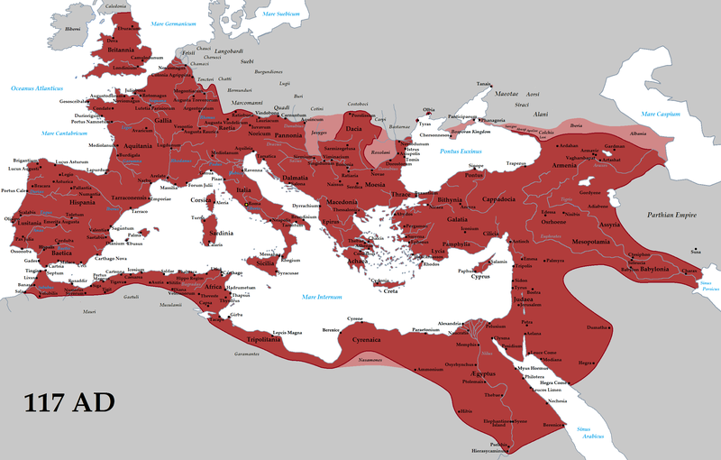



**Video**



Revelation 13

<small>Then the dragon stood on the seashore (12:18), and I saw a **beast** come up out of the sea, with **ten horns and seven heads**. On its horns were ten royal crowns and, on its heads, blasphemous names. The beast which I saw was like a **leopard**, but with feet like those of a **bear** and a mouth like the mouth of a **lion**. To it, the **dragon** gave its power, its throne, and great authority.

One of the heads of the beast appeared to have received a fatal wound, but its fatal wound was healed, and the whole earth followed after the beast in amazement. They worshipped the dragon because he had given his authority to the beast; and they worshipped the beast, saying, "Who is like the beast? Who can fight against it?" It was given a mouth speaking arrogant blasphemies, and it was given authority to act for **forty-two months.**

So it opened its mouth in blasphemies against God to insult his name and his Sh'khinah, and those living in heaven; it was allowed to make war on God's holy people and to defeat them; and it was given authority over every tribe, people, language and nation. Everyone living on earth will worship it *except those whose names are written in the Book of Life belonging to the Lamb slaughtered before the world was founded*. **Those who have ears, let them hear!**

"If anyone is meant for captivity, into captivity he goes! If anyone is to be killed with the sword, with the sword he is to be killed!" This is when God's holy people must persevere and trust! Then I saw *another* beast coming up out of the earth. It had two horns like those of a lamb, but it spoke like a dragon. It exercises all the authority of the first beast in its presence; and it makes the earth and its inhabitants worship the first beast, the one whose fatal wound had been healed. It performs great miracles, even causing fire to come down from heaven onto the earth as people watch. It deceives the people living on earth by the miracles it is allowed to perform in the presence of the beast, and it tells them to make an image honoring the beast that was struck by the sword but came alive again.

It was allowed to put breath into the image of the beast, so that the image of the beast could even speak; and it was allowed to cause anyone who would not worship the image of the beast to be put to death. Also, it forces everyone---great and small, rich and poor, free and slave---to receive a mark on his right hand or on his forehead preventing anyone from buying or selling unless he has the mark, that is, the name of the beast or the number of its name. This is where wisdom is needed; those who understand should count the number of the beast, for it is the number of a person, and its number is 666.</small>

### Perspective

> I am not anxious to know the number of the Beast, and I am thankful I will not have to live in that period. I am very thankful today that I know Jesus Christ as my Savior. Instead of spending time with Antichrist, I want to know Jesus Christ. I can say with Paul: "That I may know him, and the power of his resurrection, and the fellowship of his sufferings, being made conformable unto his death" (Php 3:10).
>
> J. Vernon McGee

### Rev 13:1 

<small>And I saw a beast rising out of the sea, with ten horns and seven heads, with ten diadems on its horns and blasphemous names on its heads.</small>

-   The "sea" is usually a reference to the Mediterranean Sea. Since it was gentiles who sailed upon it, the "sea" became a euphemism for the gentile nations.

-   From the perspective of the middle east, Rome arose out of the Sea.

-   Last time, we looked at Daniel 7 where Daniel also saw four beasts out of the sea.

    -   Beast #1 -- (Dan 7:4) -- Lion (presumed to be Babylon) -- 1 head and 0 horns

    -   Beast #2 -- (Dan 7:5) Bear (Medio-Persia) -- 1 head and 0 horns

    -   Beast #3 -- (Dan 7:6) Leopard (Greek) -- 4 heads and 0 horns

    -   Beast #4 -- (Dan 7:7) Dreadful (Rome) -- 1 head and 10 horns

    -   Total: 7 heads and 10 horns

        -   Horns?: Julius Caesar, Augustus, Tiberius, Caligula, Claudius, Nero, (Galba, Otho, Vitellius), Vespesian (11^th^, little horn might be Domitian)

            -   Dan 7:8  I considered the horns, and behold, there came up among them **another horn, a little one**, before which three of the first horns were plucked up by the roots. And behold, in this horn were eyes like the eyes of a man, and a mouth speaking great things.

            -   Blasphemous names could refer to the fact that the Roman Emperors demanded to be worshipped as gods, as we talked about when we went through the 7 letters.

        -   As we say often, these horns are not named so we are just speculating as to what the 1st-century audience's interpretation might have been.

        -   We have more clues in Revelation 17

            -   <small> Rev 17:9-13  This calls for a mind with wisdom: the seven heads are seven mountains on which the woman is seated; they are also seven kings, five of whom have fallen, one is, the other has not yet come, and when he does come he must remain only a little while. As for the beast that was and is not, it is an eighth but it belongs to the seven, and it goes to destruction. And the ten horns that you saw are ten kings who have not yet received royal power, but they are to receive authority as kings for one hour, together with the beast. These are of one mind, and they hand over their power and authority to the beast. </small>

            -   Rome is called the city that sits on seven hills

    -   Geographically, the territory all these empires have in common is the middle east, not Europe (in fact, only Rome held Europe as we think of it).

        -   When we hear "revived Roman Empire," many protestant scholars are looking to Europe.

        -   It could just as easily be somewhere in the eastern part of the Roman Empire, which included the ancient empires of Egypt, Assyria, and Babylon.

            -   God pronounces woes and judgments against all these lands through the prophets

            -   In fact, Isaiah 10:5 says, "Woe to the Assyrian, the rod of my anger; the staff in their hands is my fury!" -- because of this, some speculate that the Antichrist will come from the lands of the ancient Assyrian empire.

-   I encourage you to re-read Daniel 7 in full.

-   In Revelation 12:3, the dragon had 7 heads, 10 horns and **7 diadems on its heads**. Here the Beast from the sea has 7 heads, 10 horns, but **10 diadems on its horns**.

    -   This could be related to Revelation 17 "And the ten horns that you saw are ten kings who have not yet received royal power, but they are to receive authority as kings for one hour, together with the beast. These are of one mind, and they hand over their power and authority to the beast."

    -   In other words, time will tell.

### Rev 13:2

<small>And the beast that I saw was like a leopard; its feet were like a bear's, and its mouth was like a lion's mouth. And to it the dragon gave his power and his throne and great authority.</small>

-   As we noted last time, John's beast is a mixture of all four beasts from Daniel 7: the lion/Babylon, the bear/Persia, the leopard/Greece, and the beast that was so hideous as to defy description which is thought to represent Rome.

-   No one beast that Daniel saw had 7 heads and 10 horns, but if we add them all together, collectively they had 7 heads and 10 horns.

-   The simple explanation is what Daniel saw as four distinct beasts was spiritually the same beast with different characteristics.

### Rev 13:3-4

<small>One of its heads seemed to have a mortal wound, but its mortal wound was healed, and the whole earth marveled as they followed the beast. And they worshiped the dragon, for he had given his authority to the beast, and they worshiped the beast, saying, "Who is like the beast, and who can fight against it?"</small>

-   Nero was the false messiah who waged war against the believers in the days of the apostles. He was the beast who sent the Roman legions to attack Jerusalem.

-   Many Christian authors associated Nero with the Anti-christ.

-   He committed suicide under somewhat mysterious circumstances -- like Elvis, there were rumors that he wasn't really dead. This included "sightings" of Nero, and one person claiming to be resurrected Nero even formed a small army.

-   There was an expectation in the first century of either a literal or symbolic "second-Nero."

-   Of course, John would not have believed in a literal return of Nero; but, is speaking of one coming in the spirit of Nero. In fact, the next coming world leader would be far worse than Nero.

-   In that day, Domitian would have been a fit. Of all the emperors, he took worshipping his image very seriously. People had to address him as "my lord and my god, Domitian." The pseudoresurrection, mocks the true Resurrection of Jesus.

-   If Domitian was the beast, then the Dragon would be the satanic Imperial Cult, i.e. the religious system.

-   "Who is like the beast?" is a mockery of Exodus 15:11 "Who is like you, O LORD, among the gods? Who is like you, majestic in holiness, awesome in glorious deeds, doing wonders?

-   Also Isa 46:5: "Listen to me, O house of Jacob, all the remnant of the house of Israel, who have been borne by me from before your birth, carried from the womb; even to your old age I am he, and to gray hairs I will carry you. I have made, and I will bear; I will carry and will save. "To whom will you liken me and make me equal, and compare me, that we may be alike?

-   Agrippa the II was the governor over Judea in the years leading up to the first Jewish revolt. In trying to dissuade the people, he once went through a list of people who had tried and failed to fight against Rome.

### Rev 13:5

<small>And the beast was given a mouth uttering haughty and blasphemous words, and it was allowed to exercise authority for forty-two months.</small>

-   3.5 years again; 1260 days.

-   Pride was Satan's problem. Isaiah 14:13-15 - You said in your heart, 'I will ascend to heaven; above the stars of God I will set my throne on high; I will sit on the mount of assembly in the far reaches of the north; I will ascend above the heights of the clouds; I will make myself like the Most High.' But you are brought down to Sheol, to the far reaches of the pit.

-   In some sense this is allegorical, the beast's system has been in place for over 2000 years (since the man child was "caught up to heaven" in Revelation 12).

-   Messiah should have been back by now, but the redemption is delayed.

-   Missler likens it to a chess clock -- our clock is paused while our opponent is making his move. Soon it will be time for God to make His move.

    -   In other words but a literal 1260 days AND symbolic "a long time" could be in view.

### Rev 13:6

<small>It opened its mouth to utter blasphemies against God, blaspheming his name and his dwelling, that is, those who dwell in heaven.</small>

-   Daniel's prophecies speak constantly of the little horn who speaks boastful things. One of the names for the Anti-christ could aptly be, "Mr. Bigmouth."

-   We mentioned in a previous lesson how the enemies of God have a peculiar fascination with desecrating the Jewish temple.

-   As Christians, our bodies are referred to as the "temple of God" because God's spirit shekinah's (dwells) within us just as He did in the Jewish temple.

-   In heaven, we will inhabit the heavenly temple.

### Rev 13:7-8

<small>Also it was allowed to make war on the saints and to conquer them. And authority was given it over every tribe and people and language and nation, and all who dwell on earth will worship it, everyone whose name has not been written before the foundation of the world in the book of life of the Lamb who was slain.</small>

-   Back to Daniel 7: "The fourth beast will be a fourth kingdom upon earth, which will be different from all kingdoms. It will devour the whole earth, tread it down and break it into pieces. The ten horns are ten kings who will arise out of this kingdom, and another king will arise after them, and he will be different from the former ones, and he will subdue three kings. He will speak great words against the Most High, he will wear out the holy people of the Most High, and he will think to change times and laws; and they will be given into his hand for a season, seasons and half a season. But they will sit in judgment, and his dominion will be taken away, to be consumed and destroyed in the end. And the kingdom and dominion, and the greatness of the kingdoms under the whole heaven will be given to the people of the holy ones of the Most High, whose kingdom is an everlasting kingdom, and all dominions will serve and obey him. Here is the end of the matter." (Dan 7:23-27)

-   Antiochus Epiphanes 168-164 BCE was an excellent candidate.

    -   In fact, Jesus points us to Antiochus.

    -   Mat 24:15  "So when you see the **abomination of desolation spoken of by the prophet Daniel**, standing in the holy place (let the reader understand)..."

    -   Antiochus committed the abomination of desolation (he offered a pig in the Holy of Holies, and changed the laws to make it illegal to be Jewish).

        -   Interestingly, history records that the Temple lay desolate for 3.5 years, until the Maccabean revolt, celebrated at Hanukkah to this day.

-   However, Jesus said "**when you see** the abomination of desolation spoken of by Daniel the prophet..." meaning that the abomination Jesus is talking about was STILL FUTURE, we know we must expect a repeat of Antiochus, only far worse.

-   Many commentators see the "mortal wound" as meaning an empire once thought to be dead comes back to life. Indeed, in the Hebrew Bible, a horn often denotes a powerful ruler or king.

    -   The Egyptian, Babylonian, Persian and Greek empires all had relatively clear endings, usually in the form of a military defeat at the hands of the next empire.

    -   Rome did not -- it is generally considered to have imploded from within.

    -   As we studied in the 7 letters section, Constantine began the transition from Paganism to Christianity and the Roman empire essentially morphed into what we know as the Byzantine empire.

    -   The western branch of this eventually moved back to Rome and became what we know as the Catholic church. Various nations in Europe took their turn at dominance.

        -   Any of these could be said to be subtle continuations of the Roman Empire, including America, which is a branch from Britain, once the northwestern corner of the old Roman Empire.

    -   There was what is called the great schism between the eastern and western churches in 1054. Our history books focus on Europe, but the Roman empire also extended east into most of what today we call the middle east. There is a long tradition of Orthodox Christianity in Turkey and Russia.

### Rev 13:9

<small>If anyone has an ear, let him hear:</small>

-   Jesus' signature phrase if ever there was one.

### Rev 13:10

<small>If anyone is to be taken captive, to captivity he goes; if anyone is to be slain with the sword, with the sword must he be slain. Here is a call for the endurance and faith of the saints.</small>

-   Jeremiah 15:2 And when they ask you, 'Where shall we go?' you shall say to them, 'Thus says the LORD: "'Those who are for pestilence, to pestilence, and those who are for the sword, to the sword; those who are for famine, to famine, and those who are for captivity, to captivity.'

-   Jeremiah 43:11 He shall come and strike the land of Egypt, giving over to the pestilence those who are doomed to the pestilence, to captivity those who are doomed to captivity, and to the sword those who are doomed to the sword.

-   There is a difference of opinion here. Is Jesus (the angel) talking about the saints being slain or taken captive, or is He possibly saying the wicked people doing all the things in verses 6-8 "will get theirs"?

-   Either way, this is a direct reference for the first-century believers to hold fast.

-   if speaking of the Believers:

    -   Domitian had the authority to take captive and exile (as with John), and put to death (as with the believers at Smyrna).

    -   It is better to be exiled or martyred than to renounce the name of Yeshua and worship the beast.

-   If speaking of the nations (it is possible to read it this way), God is saying "although things seem bad, hold fast. I'll take care of things."

    -   The commentator's reason for thinking this is elsewhere in Revelation, "he who has an ear" always accompanies a promise to the overcomer; so therefore this could be a promise to the overcomer and not a warning that bad things are coming.

## The second beast/false prophet

### Rev 13:11-12

<small>Then I saw another beast rising out of the earth. It had two horns like a lamb, and it spoke like a dragon. It exercises all the authority of the first beast in its presence, and makes the earth and its inhabitants worship the first beast, whose mortal wound was healed.</small>

-   Dan 8:3 I raised my eyes and saw, and behold, a ram standing on the bank of the canal. It had two horns, and both horns were high, but one was higher than the other, and the higher one came up last.

-   Jewish tradition has Leviathan as a mythical beast of the sea (mentioned in Job, Psalms and Isaiah), and Behemot (Job 40:15) as a mythical beast of the land.

-   Based on the description, many people call this the satanic holy spirit. It is equal in power to the first beast, but it directs worshippers to the first beast instead of itself.

-   In God's plan, the Holy Spirit is equal in power to the Son but the Spirit's job is to lead people to the Son. It never speaks of itself.

-   Instead of "2^nd^ beast" many commentators will say "the beast and the false prophet" -- the beast comes from the sea and the false prophet comes from the earth.

    -   This terminology comes from Jesus: Mat 7:15 "Beware of false prophets, who come to you in sheep's clothing but inwardly are ravenous wolves."

-   The first beast exercises all authority of the dragon, while this guy exercises all authority of the first beast.

-   While parts of this could apply to Domitian, Revelation 17-18 make it clear that this is primarily yet future.

### Rev 13:13

<small>It performs great signs, even making fire come down from heaven to earth in front of people,</small>

-   1Ki 18:38 Then the fire of the LORD fell and consumed the burnt offering and the wood and the stones and the dust, and licked up the water that was in the trench. Just as Elijah who calls down fire, points to the true messiah, this false prophet points to the false messiah.

-   This seems similar to the magicians of Pharoah matching the ability of Moses to produce the initial plagues.

### Rev 13:14

<small>and by the signs that it is allowed to work in the presence of the beast it **deceives** those who dwell on earth, telling them to make an image for the beast that was wounded by the sword and yet lived.</small>

-   The fact that the first beast was "mortally" wounded yet lived is called out repeatedly.

-   Mark 13:21-23 And then if anyone says to you, 'Look, here is the Christ!' or 'Look, there he is!' do not believe it. For false christs and **false prophets** will arise and perform signs and wonders, to lead astray, if possible, the elect. But be on guard; I have told you all things beforehand.

-   2 Thessalonians 2:9-12 The coming of the lawless one is by the activity of Satan with all power and **false signs and wonders,** and with all wicked deception for those who are perishing, because they refused to love the truth and so be saved. Therefore God sends them a strong delusion, so that they may believe what is false, in order that all may be condemned who did not believe the truth but had pleasure in unrighteousness.

-   Didache 16:3 For in the last days, **false prophets and seducers** shall be multiplied, and the sheep shall be turned into wolves, and love shall be turned into hate; and because iniquity aboundeth they shall hate each other, and persecute each other, and deliver each other up; and then shall the Deceiver of the world appear as the Son of God, and shall do signs and wonders, and the earth shall be delivered into his hands; and he shall do unlawful things, such as have never happened since the beginning of the world.

    -   The Didache is a late 1st-century work attributed to the apostles.

    -   If Acts 15 contains the basic requirements for gentiles coming to faith in the Jewish Messiah, the Didache has been described as a document that maturing gentile disciples followed.

-   This guy won't be repulsive; he will be alluring.

### Rev 13:15

<small>15 And it was allowed to give breath to the image of the beast, so that the image of the beast might even speak and might cause those who would not worship the image of the beast to be slain.</small>

-   <small>Dan 3:1-7 King Nebuchadnezzar made an image of gold, whose height was sixty cubits and its breadth six cubits. He set it up on the plain of Dura, in the province of Babylon. Then King Nebuchadnezzar sent to gather the satraps, the prefects, and the governors, the counselors, the treasurers, the justices, the magistrates, and all the officials of the provinces to come to the dedication of the image that King Nebuchadnezzar had set up. Then the satraps, the prefects, and the governors, the counselors, the treasurers, the justices, the magistrates, and all the officials of the provinces gathered for the dedication of the image that King Nebuchadnezzar had set up. And they stood before the image that Nebuchadnezzar had set up. And the herald proclaimed aloud, "You are commanded, O peoples, nations, and languages, that when you hear the sound of the horn, pipe, lyre, trigon, harp, bagpipe, and every kind of music, you are to fall down and worship the golden image that King Nebuchadnezzar has set up. And whoever does not fall down and worship shall immediately be cast into a burning fiery furnace." Therefore, as soon as all the peoples heard the sound of the horn, pipe, lyre, trigon, harp, bagpipe, and every kind of music, all the peoples, nations, and languages fell down and worshiped the golden image that King Nebuchadnezzar had set up.</small>

-   Normally inanimate objects "coming to life" was common in ancient worlds.

-   This was happening in the days of the apostles. We mentioned when we talked about Pergamum how the priests at the aescalepion would shout down holes so customers would "hear from the gods" as they are hallucinating.

-   Scholars believe that the pools of Bethesda in John 5 and the "stirring of the waters" was caused by similar priests behind the scenes.

-   Daniel 3

-   This image in Revelation will similarly "come to life"

### Rev 13:16

<small>16 Also it causes all, both small and great, both rich and poor, both free and slave, to be marked on the right hand or the forehead,</small>

-   Like branding you would put on cattle or a slave.

-   This stands in contrast to the sealing of the 144,000

-   This stands in contrast to Deuteronomy 6:4-9 - <small>"Hear, O Israel: The LORD our God, the LORD is one. You shall love the LORD your God with all your heart and with all your soul and with all your might. And these words that I command you today shall be on your heart. You shall teach them diligently to your children, and shall talk of them when you sit in your house, and when you walk by the way, and when you lie down, and when you rise. **You shall bind them as a sign on your hand,** **and they shall be as frontlets between your eyes.** You shall write them on the doorposts of your house and on your gates."</small>

-   Satan is unoriginal.

### Rev 13:17

<small>17 so that no one can buy or sell unless he has the mark, that is, the name of the beast **or** the number of its name.</small>

-   In the 70s barcodes were the mark of the beast, then it was biometrics, then more recently the mark is a microchip/RFID -- smaller than a grain of rice.

-   Of course, none of these would have been in view in the first century (not to say that the mark can't use modern technology).

-   We can draw many comparisons, especially recently when folks who did not consent to take a certain medication live under the threat of becoming second-class citizens and from being excluded from buying and selling.

-   Unlike people who may have been duped into taking an untested, perhaps fraudulently presented medication to "stop the spread of a pandemic" with a 99.99% survival rate, **most commentators seem to agree that it will be impossible to take the mark of the beast unknowingly**.

    -   In other words, just like the people in the first century had to consciously renounce Jesus and swear an oath to the roman gods, so it will be with those who make a conscious decision to take the mark of the beast.

### Rev 13:18

<small>18 This calls for wisdom: let the one who has understanding calculate the number of the beast, for it is the number of a man, and his number is 666.</small>

-   The reason Revelation is written in code is to help avoid Roman censors. We talked about how being a believer (Jewish or gentile) was illegal.

-   We're challenged to "figure it out" which tells us that the number is not LITERALLY "666" -- it's symbolic.

-   In first-century gematria, each letter had a numerical value. This is true of both Hebrew and Greek. If you add up the numerical values of the letters you get a number. Words that have the same value are thought to be related. This sounds hokey, but both the old and new testaments dabble in this from time to time.

-   In Hebrew, the title Nero Caesar (when you transliterate the Greek into Hebrew) added up to 666. When you transliterate into Latin, Nero Caesar adds up to 616, which is why some variants such as Iraneus, cite 616.

-   Keener cautions that much of John's audience would not have spoken Hebrew; however, he entertains the possibility that John may have used this "code" previously (if so, it would have been known by everyone without needing to explain).

- We are _intentionally_ not going down various rabbit trails on the 666 because:

> We aren't looking for Antichrist,
>
> We are looking for Jesus Christ!

 

