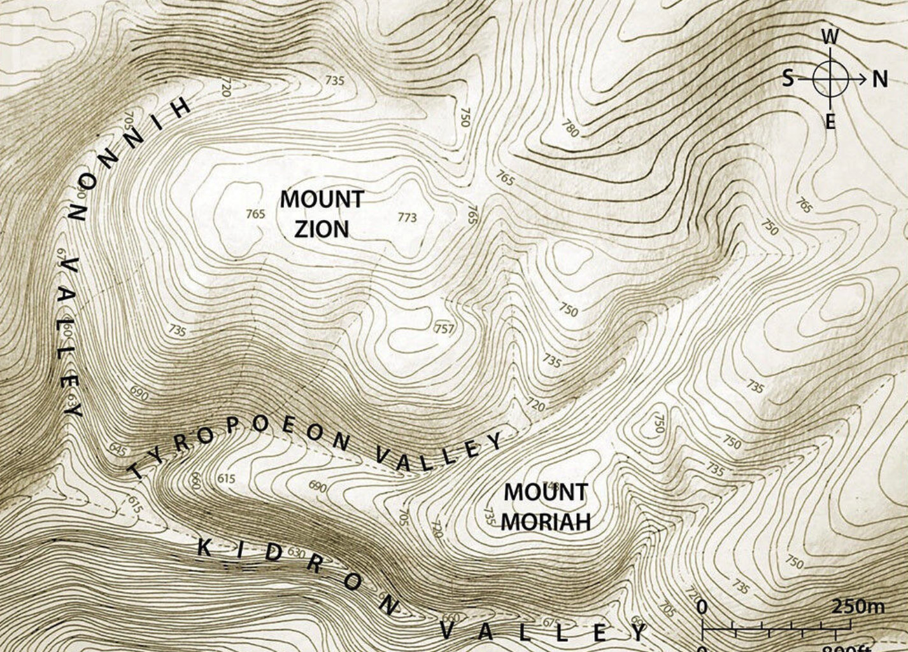



## Video



## Revelation 14

<small>Then I looked, and there was the Lamb standing on Mount Tziyon; and with him were 144,000 who had his name and his Father's name written on their foreheads. I heard a sound from heaven like the sound of rushing waters and like the sound of pealing thunder; the sound I heard was also like that of harpists playing on their harps. They were singing a new song before the throne and before the four living beings and the elders, and no one could learn the song except the 144,000 who have been ransomed from the world. These are the ones who have not defiled themselves with women, for they are virgins; they follow the Lamb wherever he goes; they have been ransomed from among humanity as firstfruits for God and the Lamb; on their lips no lie was found---they are without defect.

Next, I saw another angel flying in mid-heaven with everlasting Good News to proclaim to those living on the earth---to every nation, tribe, language, and people. In a loud voice, he said, "Fear God, give Him glory, for the hour has come when he will pass judgment! Worship the One who made heaven and earth, the sea and the springs of water!" Another angel, a second one, followed, saying, "She has fallen! She has fallen! Bavel (Babylon) the Great! She made all the nations drink the wine of God's fury caused by her whoring!"

Another angel, a third one, followed them and said in a loud voice, "If anyone worships the beast and its image and receives the mark on his forehead or on his hand, he will indeed drink the wine of God's fury poured undiluted into the cup of his rage. He will be tormented by fire and sulfur before the holy angels and before the Lamb, and the smoke from their tormenting goes up forever and ever. They have no rest, day or night, those who worship the beast and its image and those who receive the mark of its name." This is when perseverance is needed on the part of God's people, those who observe his commands and exercise Yeshua's faithfulness.

Next, I heard a voice from heaven saying, "Write: 'How blessed are the dead who die united with the Lord, from now on!' 'Yes,' says the Spirit, 'now they may rest from their efforts, for the things they have accomplished follow along with them.' " Then I looked, and there before me was a white cloud. Sitting on the cloud was someone like a Son of Man with a gold crown on his head and a sharp sickle in his hand. Another angel came out of the Temple and shouted to the one sitting on the cloud, "Start using your sickle to reap, because the time to reap has come---the earth's harvest is ripe!" The one sitting on the cloud swung his sickle over the earth, and the earth was harvested. Another angel came out of the Temple in heaven, and he too had a sharp sickle.

Then out from the altar went yet another angel, who was in charge of the fire; and he called in a loud voice to the one with the sharp sickle, "Use your sharp sickle, and gather the clusters of grapes from the earth's vine, because they are ripe!" The angel swung his sickle down onto the earth, gathered the earth's grapes, and threw them into the great winepress of God's fury. The winepress was trodden outside the city, and blood flowed from the winepress as high as the horses' bridles for two hundred miles!</small>

### Lesson Introduction

-   These chapters stand In opposition/juxtaposition to the mark of the beast, where the followers chanted, "who is like the beast?"

-   We are going to flash forward to the end to give the readers justification to hold fast.

-   The 5th, 6th, and 7th angels call for a grape harvest and we will see that God's "winepress" features prominently in chapter 14.

-   14:1 - 15:4 appears to describe the same events that occur in Revelation 19:11-21

    -   <small>Then I saw heaven opened, and behold, a white horse! The one sitting on it is called Faithful and True, and in righteousness he judges and makes war. His eyes are like a flame of fire, and on his head are many diadems, and he has a name written that no one knows but himself. He is clothed in a robe dipped in blood, and the name by which he is called is The Word of God. And the armies of heaven, arrayed in fine linen, white and pure, were following him on white horses. From his mouth comes a sharp sword with which to strike down the nations, and he will rule them with a rod of iron. He will tread the winepress of the fury of the wrath of God the Almighty. On his robe and on his thigh he has a name written, King of kings and Lord of lords. Then I saw an angel standing in the sun, and with a loud voice he called to all the birds that fly directly overhead, "Come, gather for the great supper of God, to eat the flesh of kings, the flesh of captains, the flesh of mighty men, the flesh of horses and their riders, and the flesh of all men, both free and slave, both small and great." And I saw the beast and the kings of the earth with their armies gathered to make war against him who was sitting on the horse and against his army. And the beast was captured, and with it the false prophet who in its presence had done the signs by which he deceived those who had received the mark of the beast and those who worshiped its image. These two were thrown alive into the lake of fire that burns with sulfur. And the rest were slain by the sword that came from the mouth of him who was sitting on the horse, and all the birds were gorged with their flesh.</small>

-   God wins.

### Rev 14:1

<small>1 Then I looked, and there was the Lamb standing on Mount Tziyon, and with him were 144,000 who had his name and his Father's name written on their foreheads.</small>

-   These were marked in Revelation 7 (and we previewed Revelation 14 when we studied Revelation 7).

-   Psalm 2:6 "I have set up My king upon Zion, My holy mountain."

-   "I looked and beheld" indicates a separate vision.

-   "Mt. Zion" is associated with Jerusalem.

    -   Specifically, in the time of David, Mt. Zion was associated with the eastern hill (between Tyropeon and Kidron valleys).

    -   In the time of the Apostles, it was the Temple mount (Mount Moriah on the map).

    -   Today, Mt. Zion refers to the western hill, but by extension it can refer to all of Jerusalem, or even the nation of Israel.

        -   The Israeli national anthem mentions "Zion" twice

            -   An eye gazes toward Zion

            -   To be a free nation in our land, the Land of Zion, Jerusalem

        -   Christians deemphasize Jerusalem but we can see she features prominently in Revelation.

-   Note seven chapters later, it is still 144,000, not 143,999. None are missing. They are sealed, protected, and ready to do battle for the Lord.

### Rev 14:2-3

<small>2 I heard a sound from heaven like the sound of rushing waters and like the sound of pealing thunder; the sound I heard was also like that of harpists playing on their harps. 3 They were singing a new song before the throne and before the four living beings and the elders, and no one could learn the song except the 144,000 who have been ransomed from the world. </small>

-   Ezek 1:24 - When they moved, I could hear the sound of their wings like the sound of rushing waters, like the voice of *Shaddai*, a noise of tumult like the noise of an army. Whenever they stood still, they let down their wings.

-   Ezek 43:2 - and behold, the glory of the God of Israel was coming from the east. His voice was like the sound of many waters. The earth was radiant with His glory.

-   They are probably singing a special remix of Psalm 96

    -   Oh sing to the LORD a new song; sing to the LORD, all the earth!

    -   Sing to the LORD, bless his name; tell of his salvation from day to day. Declare his glory among the nations, his marvelous works among all the peoples! For great is the LORD, and greatly to be praised; he is to be feared above all gods. For all the gods of the peoples are worthless idols, but the LORD made the heavens. Splendor and majesty are before him; strength and beauty are in his sanctuary.

    -   This is not the new song but it tells us to sing the new song.

    -   It's a song of redemption.

### Rev 14:4-5

<small>4 These are the ones who have not defiled themselves with women, for they are virgins; they follow the Lamb wherever he goes; they have been ransomed from among humanity as firstfruits for God and the Lamb; 5 on their lips no lie was found---they are without defect.

</small>

-   We looked at this when we studied Chapter 7. These 12,000 from each tribe represent the standard of purity for those going to war.

-   Thus, *potentially,* they are a representative sample of firstfruits from all of the tribes, just as the number of fighting men was only a portion of the entire tribe (those for whom they fought).

-   In the immediate context, "no lie" refers to pure theological doctrine (not that they were sinless)

    -   This is the same standard Jesus critiqued or commended in the seven letters.

    -   He expects the same of us as believers -- there is to be no compromise with the world or false religious systems.

    -   From a salvation perspective, we are without fault or blemish because we follow the Lamb who makes us clean.

-   Zeph 3:13 those who are left in Israel; they shall do no injustice and speak no lies, nor shall there be found in their mouth a deceitful tongue. For they shall graze and lie down, and none shall make them afraid."

-   Mal 2:6 True instruction was in his mouth, and no wrong was found on his lips. He walked with me in peace and uprightness, and he turned many from iniquity.

-   They were not taken in by "the lie": 2 Th 2:11-12 Therefore God sends them a strong delusion, so that they may believe what is false, in order that all may be condemned who did not believe the truth but had pleasure in unrighteousness.

### Rev 14:6

<small>6 Next I saw another angel flying in mid-heaven with everlasting Good News (or "eternal gospel") to proclaim to those living on the earth---to every nation, tribe, language, and people.</small>

-   Missler counts seven angels in this chapter (verses 6, 8, 10, 13 (a voice), 15, 17, and 19. These are possibly the seven angels who will pour out the bowls in Chapter 16.

-   A good news message that never gets old: "repent for the kingdom of heaven is at hand," only in different words.

-   This is in contrast to "other Gospels" such as those mentioned in Galatians 1:6-9: I am astonished that you are so quickly deserting him who called you in the grace of Christ and are turning to a different gospel--- not that there is another one, but there are some who trouble you and want to distort the gospel of Christ. But even if we or an angel from heaven should preach to you a gospel contrary to the one we preached to you, let him be accursed. As we have said before, so now I say again: If anyone is preaching to you a gospel contrary to the one you received, let him be accursed.

-   Do you think the earth-dwellers will be receptive?

### Rev 14:7

<small>7 In a loud voice he said, "Fear God, give Him glory, for the hour has come when he will pass judgment! Worship the One who made heaven and earth, the sea and the springs of water!"</small>

-   Gentile believers in the Jewish God were known as "God-fearers."

-   Effectively, this passage means the same to a gentile as "Repent for the Kingdom of Heaven is at hand" does for a Jew.

-   Repent = fear god.

    -   Telling a pagan to repent would be lost on them.

    -   "You mean you want me to return to following my false gods?"

-   For the Kingdom of Heaven = Worship the One who made heaven and earth, the sea and the springs of water.

    -   Gentiles need elaboration on God as the creator and redeemer.

-   Is at hand = the hour has come when he will pass judgment

    -   The time is now!

    -   This also fits with Psalm 96: Sing to the LORD, bless his name; tell of his salvation from day to day. Declare his glory among the nations, his marvelous works among all the peoples! For great is the LORD, and greatly to be praised; he is to be feared above all gods. For all the gods of the peoples are worthless idols, but the LORD made the heavens. Splendor and majesty are before him; strength and beauty are in his sanctuary.

### Rev 14:8

<small>8 Another angel, a second one, followed, saying, "She has fallen! She has fallen! Bavel the Great! She made all the nations drink the wine of God's fury caused by her whoring!"</small>

-   First mention of Babylon in Revelation -- Babylon is the literal and figurative headquarters of Satan from the beginning. The Tower of Babel was one of man's rebellions against God. It had a satanic beginning.

-   Note the contrast between this and "who can stand against the beast?" The angel is smack-talking here!

-   Isa 21:9 And behold, here come riders, horsemen in pairs!" And he answered, "Fallen, fallen is Babylon; and all the carved images of her gods he has shattered to the ground."

-   Jer 51:7-8 Babylon was a golden cup in the LORD's hand, making all the earth drunken; the nations drank of her wine; therefore the nations went mad. Suddenly Babylon has fallen and been broken; wail for her! Take balm for her pain; perhaps she may be healed.

-   Now would be a good time to read three pairs of chapters on Babylon: Isaiah 13/14, Jeremiah 50/51, and Revelation 17/18.

    -   Babylon had its beginning with Nimrod Genesis 10:8-10

        -   "He was a mighty hunter **before** the Lord." -- 10:9

            -   The Hebrew word for *before* is לפני, literally "in the face of." It is usually a neutral preposition indicating one's position relative to another; but it can have a negative connotation. Like we would say "getting in someone's face"

            -   Thus several commentators believe this should be interpreted as, "Nimrod was mighty in DEFIANCE of the Lord."

        -   "The beginning of his kingdom was Babel..."

    -   Tower of Babel: Genesis 11:1-9

### Rev 14:9-10

<small>9 Another angel, a third one, followed them and said in a loud voice, "If anyone worships the beast and its image and receives the mark on his forehead or on his hand, 10 he will indeed drink the wine of God's fury poured undiluted into the cup of his rage. He will be tormented by fire and sulfur before the holy angels and before the Lamb,</small>

-   "Cup of wrath" is a frequent idiom in the Hebrew Bible.

-   Psalms, Isaiah, Jeremiah, Ezekiel, Habakkuk and Zechariah all contain proclamations of judgment against unbelieving gentile nations.

-   Ps 75:8 For in the hand of the LORD there is a cup with foaming wine, well mixed, and he pours out from it, and all the wicked of the earth shall drain it down to the dregs.

-   Isa 51:17 "Listen to me, you who know righteousness, the people in whose heart is my law; fear not the reproach of man, nor be dismayed at their revilings.

-   Jer 25:15-17 Thus the LORD, the God of Israel, said to me: "Take from my hand this cup of the wine of wrath, and make all the nations to whom I send you drink it. [16] They shall drink and stagger and be crazed because of the sword that I am sending among them." [17] So I took the cup from the LORD's hand, and made all the nations to whom the LORD sent me drink it:

-   Gen 19:24 Then the LORD rained on Sodom and Gomorrah sulfur and fire from the LORD out of heaven.

-   Wine in that day was thick and it had to be diluted -- God's wrath will not be diluted.

-   Ezek 38:22 With pestilence and bloodshed I will enter into judgment with him, and I will rain upon him and his hordes and the many peoples who are with him torrential rains and hailstones, fire and sulfur.

### Rev 14:11

<small>11 and the smoke from their tormenting goes up forever and ever. They have no rest, day or night, those who worship the beast and its image and those who receive the mark of its name."</small>

-   Smoke is a possible reference to the destruction of Sodom.

-   Isa 34:10 And the streams of Edom shall be turned into pitch, and her soil into sulfur; her land shall become burning pitch.

-   It can be very tempting to take the mark, but don't do it.

    -   There were people who took the covid jab, not because they believed it was good for their health, but because they didn't want to deal with the threat of losing their job or worse, simply didn't want to be bothered with the restrictions.

    -   Taking the mark of the best for these reasons will be a bad move.

-   There will be no "God knows my heart isn't in it" excuse (apparently).

-   Now, in fairness, many in the congregations in Turkey probably had at one time offered a sacrifice to Caesar, and several in Laodicea probably were doing so presently.

    -   God will never turn away one who is truly repentant.

    -   It is likely that one who swears allegiance to the beast will never have a repentant heart.

### Rev 14:12

<small>12 This is when perseverance is needed on the part of God's people, those who observe his commands and exercise Yeshua's faithfulness.</small>

-   The believers are encouraged, and they will receive a special blessing.

-   Salvation is not complete without vindication.

### Rev 14:13

<small>13 Next I heard a voice from heaven saying, "Write: 'How blessed are the dead who die united with the Lord, from now on!' 'Yes,' says the Spirit, 'now they may rest from their efforts, for the things they have accomplished follow along with them.' "</small>

-   Our earthly view is that death is bad and when things are going bad, God must be judging us.

-   The heavenly view is that martyrdom might be what earns a believer the coveted, "well done, good and faithful servant" commendation.

### Rev 14:14

<small>14 Then I looked, and there before me was a white cloud. Sitting on the cloud was someone like a Son of Man with a gold crown on his head and a sharp sickle in his hand.</small>

-   Dan 7:13-14 "I saw in the night visions, and behold, with the clouds of heaven there came one like a son of man, and he came to the Ancient of Days and was presented before him. And to him was given dominion and glory and a kingdom, that all peoples, nations, and languages should serve him; his dominion is an everlasting dominion, which shall not pass away, and his kingdom one that shall not be destroyed.

-   This is probably not the Messiah because in verse 1, Jesus is standing on Mount Zion,

-   We have to remember that the concept of "time" is relative with these visions, so it could be Jesus at a different moment in time from our vantagepoint.

### Rev 14:15

<small>15 Another angel came out of the Temple and shouted to the one sitting on the cloud, "Start using your sickle to reap, because the time to reap has come---the earth's harvest is ripe!"</small>

-   Angel of the Son of Man:

-   This is potentially the completion of the separation of the wheat and the tares in Matthew 13:24:30, 36-43.

-   Mat 13:37-43: He answered, "The one who sows the good seed is the Son of Man. The field is the world, and the good seed is the sons of the kingdom. The weeds are the sons of the evil one, and the enemy who sowed them is the devil. The harvest is the end of the age, and the reapers are angels. Just as the weeds are gathered and burned with fire, so will it be at the end of the age. The Son of Man will send his angels, and they will gather out of his kingdom all causes of sin and all law-breakers, and throw them into the fiery furnace. In that place, there will be weeping and gnashing of teeth. Then the righteous will shine like the sun in the kingdom of their Father. He who has ears, let him hear.

### Rev 14:16-17

<small>16 The one sitting on the cloud swung his sickle over the earth, and the earth was harvested. 17 Another angel came out of the Temple in heaven, and he too had a sharp sickle.

</small>

-   Sickle implies grain harvest. The remainder of the chapter focuses on a grape harvest. Our antennae should go up whenever the Bible mentions bread and wine together.

-   Joel 3:13-14 Put in the sickle, for the harvest is ripe. Go in, tread, for the winepress is full. The vats overflow, for their evil is great. [14] Multitudes, multitudes, in the valley of decision! For the day of the LORD is near in the valley of decision.

-   Full passage Joel 3:9-17 Proclaim this among the nations: Consecrate for war; stir up the mighty men. Let all the men of war draw near; let them come up. Beat your plowshares into swords, and your pruning hooks into spears; let the weak say, "I am a warrior." Hasten and come, all you surrounding nations, and gather yourselves there. Bring down your warriors, O LORD. Let the nations stir themselves up and come up to the Valley of Jehoshaphat; for there I will sit to judge all the surrounding nations. Put in the sickle, for the harvest is ripe. Go in, tread, for the winepress is full. The vats overflow, for their evil is great. Multitudes, multitudes, in the valley of decision! For the day of the LORD is near in the valley of decision. The sun and the moon are darkened, and the stars withdraw their shining. The LORD roars from Zion, and utters his voice from Jerusalem, and the heavens and the earth quake. But the LORD is a refuge to his people, a stronghold to the people of Israel. "So you shall know that I am the LORD your God, who dwells in Zion, my holy mountain. And Jerusalem shall be holy, and strangers shall never again pass through it.

### Rev 14:18-19

<small>18 Then out from the altar went yet another angel, who was in charge of the fire; and he called in a loud voice to the one with the sharp sickle, "Use your sharp sickle, and gather the clusters of grapes from the earth's vine, because they are ripe!" 19 The angel swung his sickle down onto the earth, gathered the earth's grapes and threw them into the great winepress of God's fury.</small>

-   This is not literal wine. Crushed red grapes look like human blood.

-   Rev 19:15 From his mouth comes a sharp sword with which to strike down the nations, and he will rule them with a rod of iron. He will tread the winepress of the fury of the wrath of God the Almighty.

-   Jer 25:30 "You, therefore, shall prophesy against them all these words, and say to them: "'The LORD will roar from on high, and from his holy habitation utter his voice; he will roar mightily against his fold, and shout, like those who tread grapes, against all the inhabitants of the earth.

### Rev 14:20

<small>20 The winepress was trodden outside the city, and blood flowed from the winepress as high as the horses' bridles for two hundred miles!</small>

-   Isa 63:1-6: Who is this who comes from Edom, in crimsoned garments from Bozrah, he who is splendid in his apparel, marching in the greatness of his strength? "It is I, speaking in righteousness, mighty to save." Why is your apparel red, and your garments like his who treads in the winepress? "I have trodden the winepress alone, and from the peoples no one was with me; I trod them in my anger and trampled them in my wrath; their lifeblood spattered on my garments, and stained all my apparel. For the day of vengeance was in my heart, and my year of redemption had come. I looked, but there was no one to help; I was appalled, but there was no one to uphold; so my own arm brought me salvation, and my wrath upheld me. I trampled down the peoples in my anger; I made them drunk in my wrath, and I poured out their lifeblood on the earth."

-   This is a deluge of blood -- apocalyptic literature does not require it to literally be 5' x 200 miles, but neither does it rule it out.

    -   A 200 mile radius would cover almost all of the modern state of Israel and much of Jordan.

## Chapter 15

Chapter 15 continues the look forward to the conclusion of events described in Chapter 19:

<small>Then I saw another sign in heaven, a great and wonderful one---seven angels with the seven plagues that are the final ones; because with them, God's fury is finished. I saw what looked like a sea of glass mixed with fire. Those defeating the beast, its image, and the number of its name were standing by the sea of glass, holding harps that God had given them. They were singing the song of Moshe, the servant of God, and the song of the Lamb: "Great and wonderful are the things you have done, Adonai, God of heaven's armies! Just and true are your ways, king of the nations! Adonai, who will not fear and glorify your name? because you alone are holy. All nations will come and worship before you, for your righteous deeds have been revealed." After this I looked, and the sanctuary (that is, the Tent of Witness in heaven) was opened, and out of the sanctuary came the seven angels with the seven plagues. They were dressed in clean bright linen and had gold belts around their chests. One of the four living beings gave to the seven angels seven gold bowls filled with the fury of God, who lives forever and ever. Then the sanctuary was filled with smoke from God's Sh'khinah, that is, from his power; and no one could enter the sanctuary until the seven plagues of the seven angels had accomplished their purpose. </small>

### Rev 15:1-2

<small> Then I saw another sign in heaven, great and amazing, seven angels with seven plagues, which are the last, for with them the wrath of God is finished. 2 And I saw what appeared to be a sea of glass mingled with fire---and also those who had conquered the beast and its image and the number of its name, standing beside the sea of glass with harps of God in their hands.</small>

-   The saints are celebrating their vindication

### Rev 15:3-4 

<small>And they sing the song of Moses, the servant of God, and the song of the Lamb, saying, "Great and amazing are your deeds, O Lord God the Almighty! Just and true are your ways, O King of the nations! 4 Who will not fear, O Lord, and glorify your name? For you alone are holy. All nations will come and worship you, for your righteous acts have been revealed."</small>

-   This is in contrast to chapter 13's, "who is like the beast?"

-   It recalls the "song of the Sea" in Exodus 15

    -   Ex 15:1-4: "Then Moses and the people of Israel sang this song to the LORD, saying, "I will sing to the LORD, for he has triumphed gloriously; the horse and his rider he has thrown into the sea. The LORD is my strength and my song, and he has become my salvation; this is my God, and I will praise him, my father's God, and I will exalt him. The LORD is a man of war; the LORD is his name. "Pharaoh's chariots and his host he cast into the sea, and his chosen officers were sunk in the Red Sea."

    -   Ex 15:11: "Who is like you, O LORD, among the gods? Who is like you, majestic in holiness, awesome in glorious deeds, doing wonders?"

-   This is a fulfillment of Psalms 86:9-10 -- a remnant of the nations will turn to God: "9 All the nations you have made shall come and worship before you, O Lord, and shall glorify your name. 10 For you are great and do wondrous things; you alone are God."

-   Zec 14:9 And the LORD will be king over all the earth. On that day the LORD will be one and his name one.

-   In looking at our days now, it appears this remnant could be very small. There is definitely a lack of fear of God in our day.

### Rev 15:5-6 

<small>After this I looked, and the sanctuary of the tent of witness in heaven was opened, 6 and out of the sanctuary came the seven angels with the seven plagues, clothed in pure, bright linen, with golden sashes around their chests.</small>

-   After this = _meta tauta_ -- always a sign that the scene has shifted.

-   Now we are back in "real time" (so to speak). The flash-forward is over.

-   We are building up to the seven bowls of wrath and back in the Heavenly Tabernacle

### Rev 15:7 -8

<small>And one of the four living creatures gave to the seven angels seven golden bowls full of the wrath of God who lives forever and ever, 8 and the sanctuary was filled with smoke from the glory of God and from his power, and no one could enter the sanctuary until the seven plagues of the seven angels were finished. </small>

-   Incense bowls were used in the temple service.

-   Filling with smoke recalls the tabernacle/temple filled with God's glory.

### Rev 16:1 

<small>Then I heard a loud voice from the temple telling the seven angels, "Go and pour out on the earth the seven bowls of the wrath of God." </small>

-   Next time, we will look at the pouring out of God's judgment

 

