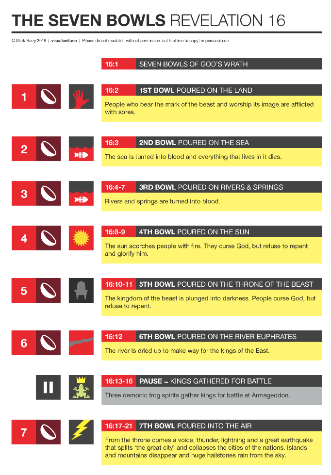
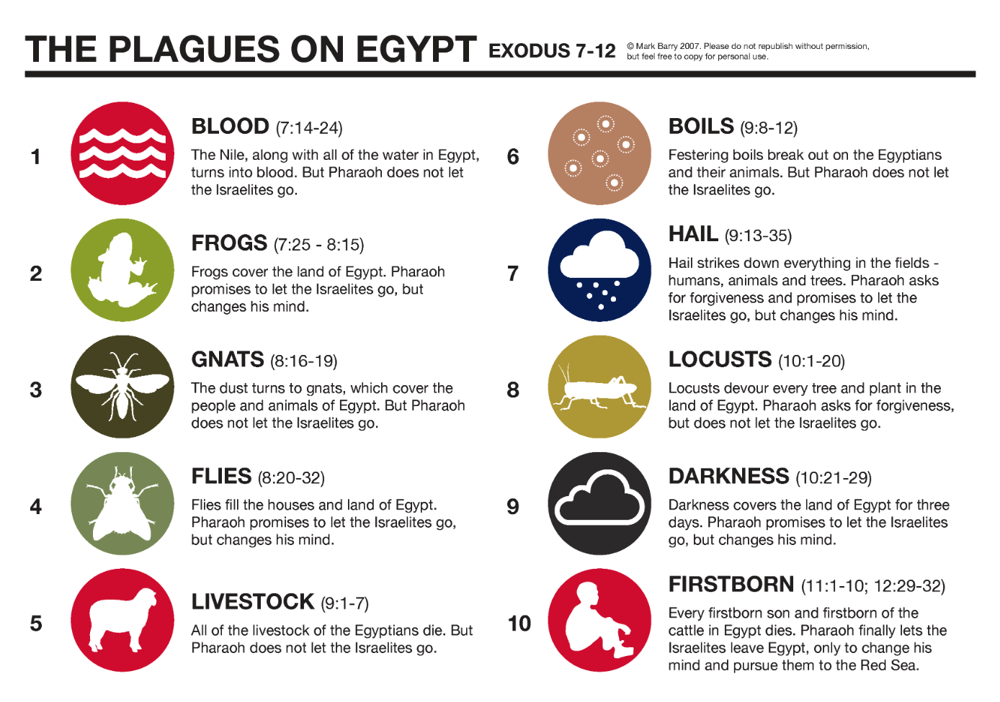
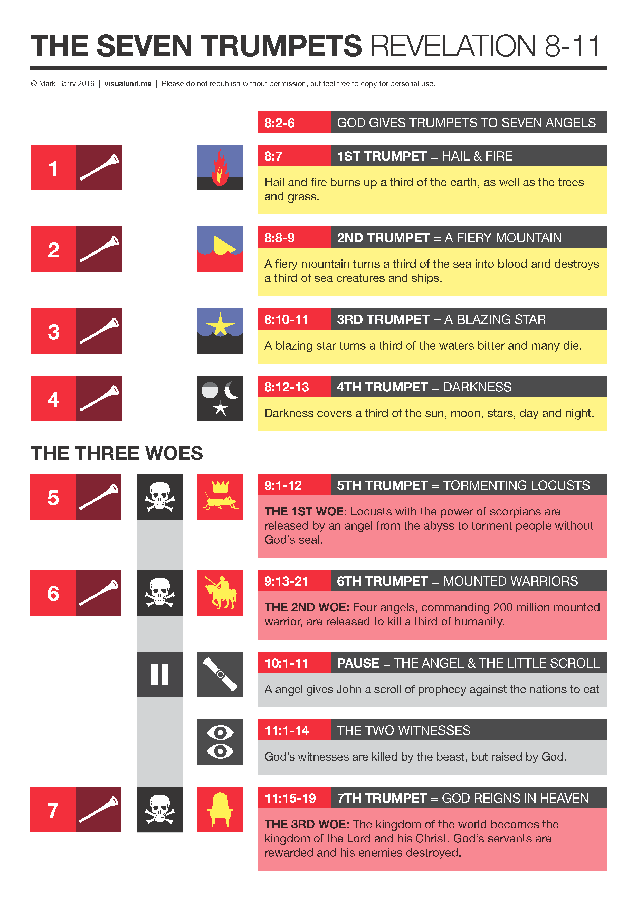
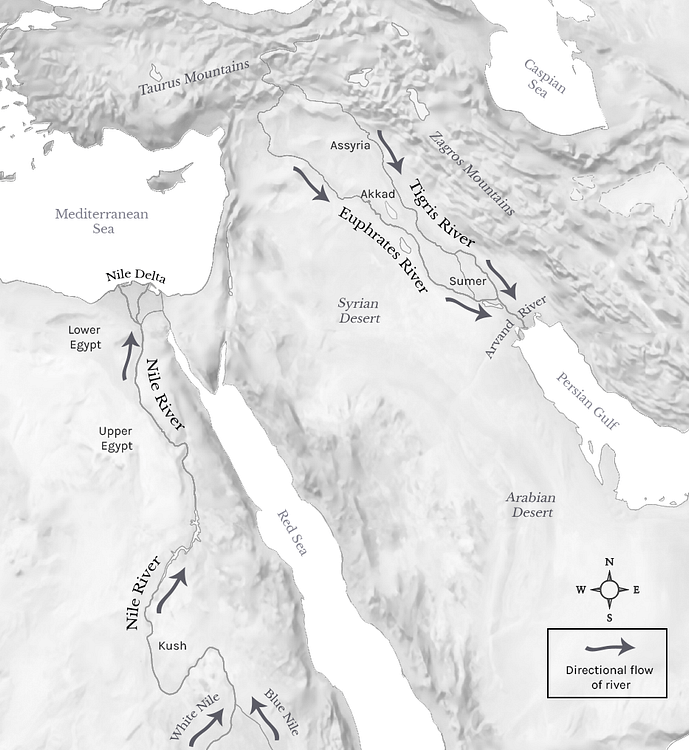



**Video**



## Revelation 16

### Read the portion

<small>15-5-8 After this I looked, and the sanctuary (that is, the Tent of Witness in heaven) was opened, and out of the sanctuary came the seven angels with the seven plagues. They were dressed in clean bright linen and had gold belts around their chests. One of the four living beings gave to the seven angels seven gold bowls filled with the fury of God, who lives forever and ever. Then the sanctuary was filled with smoke from God's Sh'khinah, that is, from his power; and no one could enter the sanctuary until the seven plagues of the seven angels had accomplished their purpose. </small>

<small>Then I heard a loud voice from the temple telling the seven angels, "Go and pour out on the earth the seven bowls of the wrath of God." So the first angel went and poured out his bowl on the earth, and harmful and painful sores came upon the people who bore the mark of the beast and worshiped its image. The second angel poured out his bowl into the sea, and it became like the blood of a corpse, and every living thing died that was in the sea. The third angel poured out his bowl into the rivers and the springs of water, and they became blood. And I heard the angel in charge of the waters say, "Just are you, O Holy One, who is and who was, for you brought these judgments. For they have shed the blood of saints and prophets, and you have given them blood to drink. It is what they deserve!" And I heard the altar saying, "Yes, Lord God the Almighty, true and just are your judgments!" The fourth angel poured out his bowl on the sun, and it was allowed to scorch people with fire. They were scorched by the fierce heat, and they cursed the name of God who had power over these plagues. They did not repent and give him glory. The fifth angel poured out his bowl on the throne of the beast, and its kingdom was plunged into darkness. People gnawed their tongues in anguish and cursed the God of heaven for their pain and sores. They did not repent of their deeds. The sixth angel poured out his bowl on the great river Euphrates, and its water was dried up, to prepare the way for the kings from the east. And I saw, coming out of the mouth of the dragon and out of the mouth of the beast and out of the mouth of the false prophet, three unclean spirits like frogs. For they are demonic spirits, performing signs, who go abroad to the kings of the whole world, to assemble them for battle on the great day of God the Almighty. ("Behold, I am coming like a thief! Blessed is the one who stays awake, keeping his garments on, that he may not go about naked and be seen exposed!") And they assembled them at the place that in Hebrew is called Armageddon. The seventh angel poured out his bowl into the air, and a loud voice came out of the temple, from the throne, saying, "It is done!" And there were flashes of lightning, rumblings, peals of thunder, and a great earthquake such as there had never been since man was on the earth, so great was that earthquake. The great city was split into three parts, and the cities of the nations fell, and God remembered Babylon the great, to make her drain the cup of the wine of the fury of his wrath. And every island fled away, and no mountains were to be found. And great hailstones, about one hundred pounds each, fell from heaven on people; and they cursed God for the plague of the hail because the plague was so severe. </small>

</small>

### Graphics

Graphics courtesy of Mark Berry <https://visualunit.me/>

-   There is some overlap between the seven bowls and the ten plagues

-   There is also overlap between Revelation 8 (the trumpet judgments) and Revelation 16, suggesting to some that that Revelation should be read in terms of retelling the same events with different focus/intensity versus a linear narrative.

    -   An example might be Joseph's interpretation of Pharoah's two dreams in Genesis 41.

    -   The first dream was 7 emaciated cows who ate the seven fat cows. The second dream was seven blighted ears of corn that consumed seven plump, full ears of corn. The two visions spoke of the same event: the seven years of plenty followed by seven years of famine.

    -   A valid interpretation of Revelation is that the Seals, Trumpets and Bowls are all speaking of the same events, as opposed to 21 different and distinct judgments (seven seal judgments, followed by seven trumpet judgments, followed by seven bowl judgments).

-   In any case, this would have reminded John's readers that they were protected from God's judgments just like the Israelites of old.

-   Their deliverance is drawing near.

Zechariah 14

We have looked at key Old Testament chapters such as Daniel 7. Another one of these is Zechariah 14. Let's become familiar with this important passage.

<small>

Behold, a day is coming for the LORD, when the spoil taken from you will be divided in your midst. For I will gather all the nations against Jerusalem to battle, and the city shall be taken and the houses plundered and the women raped. Half of the city shall go out into exile, but the rest of the people shall not be cut off from the city. **Then the LORD will go out and fight against those nations as when he fights on a day of battle. On that day his feet shall stand on the Mount of Olives that lies before Jerusalem on the east, and the Mount of Olives shall be split in two from east to west by a very wide valley, so that one half of the Mount shall move northward, and the other half southward.** And you shall flee to the valley of my mountains, for the valley of the mountains shall reach to Azal. And you shall flee as you fled from the earthquake in the days of Uzziah king of Judah. Then the LORD my God will come, and all the holy ones with him. On that day there shall be no light, cold, or frost. And there shall be a unique day, which is known to the LORD, neither day nor night, but at evening time there shall be light. On that day living waters shall flow out from Jerusalem, half of them to the eastern sea and half of them to the western sea. It shall continue in summer as in winter. And the LORD will be king over all the earth. On that day the LORD will be one and his name one. The whole land shall be turned into a plain from Geba to Rimmon south of Jerusalem. But Jerusalem shall remain aloft on its site from the Gate of Benjamin to the place of the former gate, to the Corner Gate, and from the Tower of Hananel to the king's winepresses. And it shall be inhabited, for there shall never again be a decree of utter destruction. Jerusalem shall dwell in security. **And this shall be the plague with which the LORD will strike all the peoples that wage war against Jerusalem: their flesh will rot while they are still standing on their feet, their eyes will rot in their sockets, and their tongues will rot in their mouths. And on that day a great panic from the LORD shall fall on them, so that each will seize the hand of another, and the hand of the one will be raised against the hand of the other.** Even Judah will fight at Jerusalem. And the wealth of all the surrounding nations shall be collected, gold, silver, and garments in great abundance. And a plague like this plague shall fall on the horses, the mules, the camels, the donkeys, and whatever beasts may be in those camps. Then everyone who survives of all the nations that have come against Jerusalem shall go up year after year to worship the King, the LORD of hosts, and to keep the Feast of Booths. And if any of the families of the earth do not go up to Jerusalem to worship the King, the LORD of hosts, there will be no rain on them. And if the family of Egypt does not go up and present themselves, then on them there shall be no rain; there shall be the plague with which the LORD afflicts the nations that do not go up to keep the Feast of Booths. This shall be the punishment to Egypt and the punishment to all the nations that do not go up to keep the Feast of Booths. And on that day there shall be inscribed on the bells of the horses, "Holy to the LORD." And the pots in the house of the LORD shall be as the bowls before the altar. And every pot in Jerusalem and Judah shall be holy to the LORD of hosts, so that all who sacrifice may come and take of them and boil the meat of the sacrifice in them. And there shall no longer be a trader in the house of the LORD of hosts on that day.

</small>

Zechariah 14:12-13 appear to suggest the first and fifth bowl judgments.

### Rev 16:1

<small> Then I heard a loud voice from the temple telling the seven angels, "Go and pour out on the earth the seven bowls of the wrath of God."</small>

### Rev 16:2

<small>So the first angel went and poured out his bowl on the earth, and harmful and painful sores came upon the people who bore the mark of the beast and worshiped its image.</small>

-   Sores were the 6th plague of Egypt (Exodus 9:10)

-   Like those that afflicted Egypt, these sores afflicted only those who had the mark of the beast.

-   Like Pharaoh's heart, the hearts of these people remain hard. We will see at the end of the chapter that they will curse God.

-   Deu 28:15, 35 "But if you will not obey the voice of the LORD your God or be careful to do all his commandments and his statutes that I command you today, then all these curses shall come upon you and overtake you.... The LORD will strike you on the knees and on the legs with grievous boils of which you cannot be healed, from the sole of your foot to the crown of your head.

-   Psa 79:1-7 A Psalm of Asaph. O God, the nations have come into your inheritance; they have defiled your holy temple; they have laid Jerusalem in ruins. [2] They have given the bodies of your servants to the birds of the heavens for food, the flesh of your faithful to the beasts of the earth. [3] They have poured out their blood like water all around Jerusalem, and there was no one to bury them. [4] We have become a taunt to our neighbors, mocked and derided by those around us. [5] How long, O LORD? Will you be angry forever? Will your jealousy burn like fire? [6] Pour out your anger on the nations that do not know you, and on the kingdoms that do not call upon your name! [7] For they have devoured Jacob and laid waste his habitation.

-   Zep 3:8 "Therefore wait for me," declares the LORD, "for the day when I rise up to seize the prey. For my decision is to gather nations, to assemble kingdoms, to pour out upon them my indignation, all my burning anger; for in the fire of my jealousy all the earth shall be consumed.

### Rev 16:3

<small>The second angel poured out his bowl into the sea, and it became like the blood of a corpse, and every living thing died that was in the sea.</small>

-   Water to blood was the first plague in Exodus

-   A plague upon the seas (salt water) was the 2nd trumpet

### Rev 16:4

<small>The third angel poured out his bowl into the rivers and the springs of water, and they became blood.</small>

-   Making the fresh waters bitter (Wormwood) was the 3rd trumpet.

-   We aren't told how far apart the bowl judgments are from one another. The lack of fresh water would certainly mean life is not sustainable.

-   There might also be a connection with “wine” that we talked about in the last lesson.  
    - Water to blood was the first plague and water to wine was the first miracle.  
    - Water to wine is joyful for believers, but non-believers get the wrath of water to blood.  
    - In other words, every single person who lived and who will ever live will drink one of two cups.  Either the miracle of Jesus’ blessing or the miracle of His wrath.  
    - There is no other option.

### Rev 16:5-7

<small>And I heard the angel in charge of the waters say, "Just are you, O Holy One, who is and who was, for you brought these judgments. For they have shed the blood of saints and prophets, and you have given them blood to drink. It is what they deserve!" And I heard the altar saying, "Yes, Lord God the Almighty, true and just are your judgments!" </small>

-   While God is patient and longsuffering, and while life often has the appearance of the wicked prospering, there is a side to Him that carries the sense of, "If you mess with My people, then you're messing with Me."

-   On the flipside, lest we think these punishments are cruel and unusual, we are reminded that God is just.

-   Isaiah 49:26: I will make your oppressors eat their own flesh, and they shall be drunk with their own blood as with wine. Then all flesh shall know that I am the LORD your Savior, and your Redeemer, the Mighty One of Jacob.

-   Zech 14:12 And this shall be the plague with which the LORD will strike all the peoples that wage war against Jerusalem: their flesh will rot while they are still standing on their feet, their eyes will rot in their sockets, and their tongues will rot in their mouths

### Rev 16:8-9

<small>The fourth angel poured out his bowl on the sun, and it was allowed to scorch people with fire They were scorched by the fierce heat, and they cursed the name of God who had power over these plagues. They did not repent and give him glory.</small>

-   Psa 19:9 the fear of the LORD is clean, enduring forever; the rules of the LORD are true, and righteous altogether.

-   This is not specifically one of the plagues of Egypt, but hail was.

-   Hail mixed with fire was the first trumpet judgment.

-   They recognize that God is sending the plagues, but they do not repent.

-   Historically, the ancients, including Babylon, worshipped the sun as a deity.

### Rev 16:10-11

<small>The fifth angel poured out his bowl on the throne of the beast, and its kingdom was plunged into darkness. People gnawed their tongues in anguish and cursed the God of heaven for their pain and sores. They did not repent of their deeds.</small>

-   Again, we recall the boast in Revelation 13, "who is able to make war with the beast?" Answer: God.

-   Darkness was the 9th plague in Egypt and the fourth trumpet.

-   Exodus 10:21 notes the darkness in Egypt could be "felt."

### Rev 16:12

<small>12 The sixth angel poured out his bowl on the great river Euphrates, and its water was dried up, to prepare the way for the kings from the east. </small>

-   Along with the Nile and the Tigris, the Euphrates is one of the major rivers of antiquity around which the earliest civilizations were founded.

    -   Pre-Flood, the Tigris and Euphrates were two of four rivers that flowed out of Eden (remember, we have no idea what the geography/topography of the earth looked like before the Flood).

    -   God established the Euphrates as the Eastern Boundary of the land promised to Abraham (Genesis 15:18).

    -   David's kingdom extended all the way to the Euphrates (2 Sam 8:3).

    -   The only other mention in the New Testament came back in Revelation 9:14 "Release the four angels who are bound at the great river Euphrates."

-   To that audience, a reference to the "Kings of the East" would have been obvious.

    -   The Parthians were Rome's archenemy to the east, with the Euphrates serving as the boundary between the Roman and Parthian empires.

-   While swollen rivers delayed the crossing of armies until engineers built floats or bridges, dried rivers had the opposite effect. An advancing army would encounter no delay whatsoever.

-   The Euphrates is the launching point of the attack. Megiddo is the staging ground (Rev 16:16). Jerusalem is the final battleground (Zechariah 14).

### Rev 16:13-14

<small> And I saw, coming out of the mouth of the dragon and out of the mouth of the beast and out of the mouth of the false prophet, three unclean spirits like frogs. For they are demonic spirits, performing signs, who go abroad to the kings of the whole world, to assemble them for battle on the great day of God the Almighty.</small>

-   The Satanic trinity.

-   Here we have a brief interlude between #6 and #7, just as we saw with the seals and trumpets.

    -   Instead of being a chapter or two, this break is only a few verses

    -   But the break is about the famous passage of Armageddon.

-   Frogs were the second plague of Egypt.

-   Note that the satanic trinity, as demonic as they are, are being compelled to act to bring about God's judgment.

-   Gathering the nations for judgment is a familiar idiom in the Old Testament.

    -   Eze 30:2-3 "Son of man, prophesy, and say, Thus says the Lord GOD: "Wail, 'Alas for the day!' [3] For the day is near, the day of the LORD is near; it will be a day of clouds, a time of doom for the nations.

    -   Joel 3:2-3 I will gather all the nations and bring them down to the Valley of Jehoshaphat. And I will enter into judgment with them there, on behalf of my people and my heritage Israel, because they have scattered them among the nations and have divided up my land, [3] and have cast lots for my people, and have traded a boy for a prostitute, and have sold a girl for wine and have drunk it.

    -   Joel 3:11 Hasten and come, all you surrounding nations, and gather yourselves there. Bring down your warriors, O LORD.

    -   Zep 3:8 "Therefore wait for me," declares the LORD, "for the day when I rise up to seize the prey. For my decision is to gather nations, to assemble kingdoms, to pour out upon them my indignation, all my burning anger; for in the fire of my jealousy all the earth shall be consumed.

    -   Isa 43:9 All the nations gather together, and the peoples assemble. Who among them can declare this, and show us the former things? Let them bring their witnesses to prove them right, and let them hear and say, It is true.

### Rev 16:15

<small>("Behold, I am coming like a thief! Blessed is the one who stays awake, keeping his garments on, that he may not go about naked and be seen exposed!")</small>

-   This verse is usually displayed as red text signifying the direct words of Jesus.

-   We discussed the thief at night in the letter to Sardis (Rev 3:3).

    -   Jesus frequently uses disagreeable characters in His examples.

    -   It is called a "how much more" argument, or in Hebrew Kol vhomer, which means "light and heavy".

    -   It can be confusing for us as the punchline is often not stated.

    -   I come like a thief means If one takes precautions to not be overcome by a thief at night, how much more should one make himself ready for Jesus' sudden return.

    -   1Th 5:4 But you are not in darkness, brothers, for that day to surprise you like a thief.

-   Observant Jews were extremely modest and found the open display of nakedness in the Greco-Roman culture revolting. For example, most athletic competitors were naked, and circumcised Jewish males were ridiculed for their "differences."

-   The recipients would have recalled Jesus' cautions to the church of Sardis to be clothed in white garments by not compromising with the world.

    -   Rev 3:4-5 Yet you have still a few names in Sardis, people who have not soiled their garments, and they will walk with me in white, for they are worthy. [5] The one who conquers will be clothed thus in white garments, and I will never blot his name out of the book of life. I will confess his name before my Father and before his angels.

-   The overarching theme in Revelation is, "things may seem bad now, and may get worse; but God is in control. Hold fast."

### Rev 16:16

<small>And they assembled them at the place that in Hebrew is called Armageddon.</small>

-   Armageddon is a transliteration of Hebrew Har Megiddo -- the Mount of Megiddo

    -   A minority opinion would say it is "Ir Megiddo" -- the city of Megiddo.

    -   Megiddo is about 60 miles north of Jerusalem.

-   A ridge system (The Carmel Range) separates the central coastal plains from the fertile Jezreel Valley and Lower Galilee. The Megiddo Pass was one of three routes through the hills. Megiddo is at the northern edge of this pass and commanded the area.

-   Travelers from Egypt to Assyria using the Via Maris had to use one of these three passes, so it was an opportune area for taxation and trade in times of peace, and a critical junction to hold in times of war.

-   Megiddo was first mentioned by Thutmose III, who boasted, "taking Megiddo is like capturing a thousand cities."

-   The Tel at Megiddo has 26 levels of occupation (meaning the city was built, abandoned, filled in and rebuilt 26 different times dating back to the copper age around the 5th millennium BCE, and through the Persian conquest in the 7th Century common era.

-   It is a wonderful place to see different ages of ancient history all in one location and remarkably well-preserved.

    -   Iron Age Gates and other buildings from the time of King Solomon (10th century BCE) and Ahab (9th century BCE)

    -   Tripartite buildings from the 11th and 10th centuries BCE (also seen at Hazor, Beersheba, and other locations)

    -   Ancient water systems in fortified towns.

-   King Solomon had a stronghold here along with Hazor and Gezer (1 kings 9:15) and Josiah was killed by Pharaoh Neco here (2 Kings 23:29-30).

-   It also has a commanding view of the Jezreel Valley

    -   Many noteworthy events of Biblical History occurred in this region.

    -   (separate video?)

-   Napoleon declared Megiddo as "the most natural battleground of the whole earth."

-   At the end of days, there won't actually be a battle here.

    -   It will be an assembly area for the armies of the beast, much like southern England was the gathering point for Allied troops before Sailing or parachuting into Normandy on D-day.

    -   In the sneak preview; Revelation 14:1 is consistent with Zechariah 12:11 and Zechariah 14, in suggesting the actual battle will take place at Jerusalem. (Also Joel and Isaiah reference this.)

    -   Despite the lack of action, Armageddon has entered our vocabulary as pertaining to cataclysmic military destruction.

    -   The Jezreel valley would provide more than enough space for the gathering of the army mentioned in Revelation.

-   They think they are assembling to go fight God but it is actually God who is having them assembled for their own destruction.

-   Nazareth lies directly across from Megiddo. Did Jesus look across the valley and weep at the arrogance and defiance of those He came to save?

### Rev 16:17

<small>The seventh angel poured out his bowl into the air, and a loud voice came out of the temple, from the throne, saying, "It is done!"</small>

-   Isa 66:6 "The sound of an uproar from the city! A sound from the temple! The sound of the LORD, rendering recompense to his enemies!

-   After the brief pause to mention Armageddon, we have the 7th angel pouring out his bowl.

-   This reads like a theophany, a visible or audible manifestation of God's glory. I assume this is either the same voice who said "this is my Son in whom I am well pleased" or the same voice who said "It is finished" on the Cross

    -   Although we should note this is not the word *Tetelestai* that Jesus spoke on the cross. *Tetelestai* is an accounting term meaning "paid in full." This is *gegonen*, which means done, completed, or fulfilled.

### Rev 16:18-19

<small>And there were flashes of lightning, rumblings, peals of thunder, and a great earthquake such as there had never been since man was on the earth, so great was that earthquake. The great city was split into three parts, and the cities of the nations fell, and God remembered Babylon the great, to make her drain the cup of the wine of the fury of his wrath. </small>

-   Rev 14:8-10 Another angel, a second, followed, saying, "Fallen, fallen is Babylon the great, she who made all nations drink the wine of the passion of her sexual immorality." [9] And another angel, a third, followed them, saying with a loud voice, "If anyone worships the beast and its image and receives a mark on his forehead or on his hand, [10] he also will drink the wine of God's wrath, poured full strength into the cup of his anger, and he will be tormented with fire and sulfur in the presence of the holy angels and in the presence of the Lamb.

-   Exo 19:15-19 And he said to the people, "Be ready for the third day; do not go near a woman." [16] On the morning of the third day there were thunders and lightnings and a thick cloud on the mountain and a very loud trumpet blast, so that all the people in the camp trembled. [17] Then Moses brought the people out of the camp to meet God, and they took their stand at the foot of the mountain. [18] Now Mount Sinai was wrapped in smoke because the LORD had descended on it in fire. The smoke of it went up like the smoke of a kiln, and the whole mountain trembled greatly. [19] And as the sound of the trumpet grew louder and louder, Moses spoke, and God answered him in thunder.

-   More noise. We should be used to this but I'm not sure we'll ever get used to it.

-   This is an unusual earthquake, perhaps the same one as the sixth seal or more likely the events in Zechariah 14:4 as we looked at previously:

-   Zec 14:4 On that day his feet shall stand on the Mount of Olives that lies before Jerusalem on the east, and the Mount of Olives shall be split in two from east to west by a very wide valley so that one half of the Mount shall move northward, and the other half southward.

-   We looked at some winepress references last time

    -   Also compare: Jer 25:15 Thus the LORD, the God of Israel, said to me: "Take from my hand this cup of the wine of wrath, and make all the nations to whom I send you drink it.

-   "God remembered" is a very Hebraic phrase. God "remembered" Noah, Abraham, and Rachel. It wasn't that He forgot; it is that He is intentional about fulfilling a promise or a covenant.

-   Here God is granting the request made back in Chapter 6 when the martyrs cried out for justice.

-   A good speculation for the "three parts" would be religious, commercial/economic, and political, the destruction of each will be detailed in chapters 17 and 18.

### Rev 16:20-21

<small> And every island fled away, and no mountains were to be found. And great hailstones, about one hundred pounds each, fell from heaven on people; and they cursed God for the plague of the hail, because the plague was so severe.</small>

-   Revelation 6:14 The sky vanished like a scroll that is being rolled up, and every mountain and island was removed from its place.

-   The end of the world is usually associated with vast terrestrial and cosmic devastation. Apparently, we need to visit the islands of Hawaii and the Bahamas while we can.

-   Hail was the seventh plague, but this hail is far more severe.

-   The people's unrepentance demonstrates how deserving they were of the judgment to begin with.

-   Hail is often seen as the equivalent of the Old Testament capital punishment method of stoning. Murder, working on the sabbath, sorcery, kidnapping, sexual perversions, and blasphemy were all capital offenses.

-   This phrase reminds me of the terrible advice from Job's wife when Job was being afflicted:

    -   Job 2:9 Then his wife said to him, "Do you still hold fast your integrity? Curse God and die."

-   Exodus 9:34-35 But when Pharaoh saw that the rain and the hail and the thunder had ceased, he sinned yet again and hardened his heart, he and his servants. {35} So the heart of Pharaoh was hardened, and he did not let the people of Israel go, just as the LORD had spoken through Moses.

### Conclusion

We have to remember that the narrative flow in Revelation is not necessarily linear. Vss 20, 21 are clearly the "end of the world as we know it," but we're going to keep circling in for more detail. Chapters 17-19 are going to fill in the details.

 

